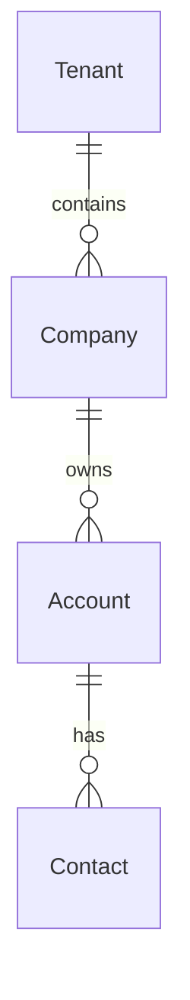
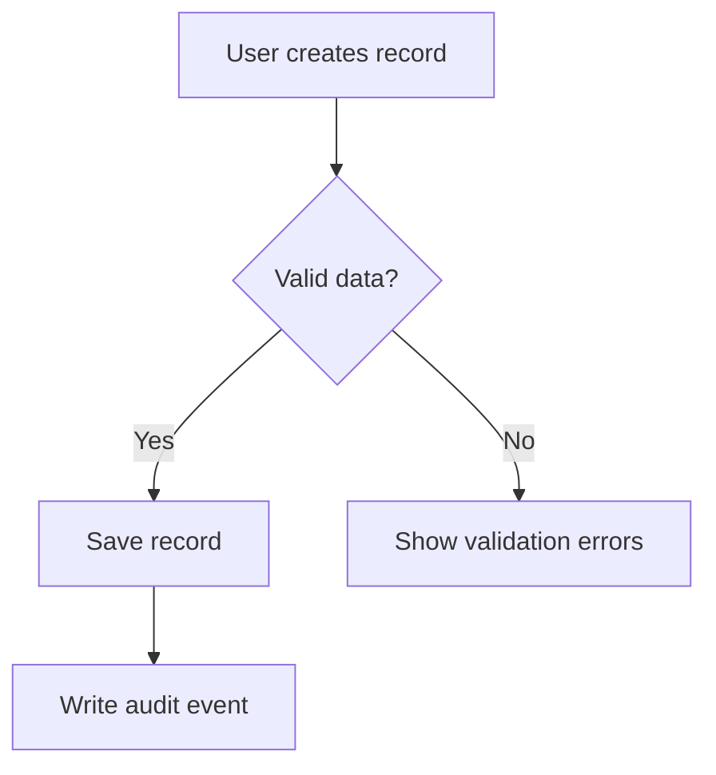

# 00_Global_Documentation_Rules.md

**Document type:** Global documentation control document  
**Applies to:** All future phase documents for the multi-company SaaS CRM, outbound sales, field operations, drilling workflows, logistics, warehouse, fleet, dispatch, service, reporting, integrations, QuickBooks sync, and offline-capable mobile platform  
**Audience:** Product architects, technical documentation leads, AI documentation writers, engineering leads, design leads, QA leads, implementation leads, and delivery managers  
**Status:** Control standard  
**Purpose:** Define strict reusable rules for generating production-grade, implementation-ready phase documentation  

---

## 1. Purpose of This Document

This document defines the global writing, structure, naming, quality, and consistency rules that must be followed when creating any future phase document for the platform.

The goal is to ensure that every phase document is:

- Consistent in structure and terminology.
- Detailed enough for product, design, engineering, QA, implementation, and rollout planning.
- Non-contradictory with the master platform documentation and other phase documents.
- Production-grade and implementation-ready.
- Clear about scope, non-goals, dependencies, open questions, and future impacts.
- Written in a way that allows 20 or more separate phase documents to be generated by different writers without drifting in style, assumptions, or architecture.

This document is not a feature specification. It does not create Phase 1 or any other phase. It controls how all phase documents must be written.

---

## 2. How This Document Should Be Used

Every future AI writer, architect, or documentation contributor must use this document before writing a phase document.

### Required Usage Process

Before writing any phase document, the writer must:

1. Read the master platform documentation.
2. Read this global rules document.
3. Identify the target phase number and phase name.
4. Identify which master documentation sections apply to the phase.
5. Identify related prior phase documents, if any exist.
6. Extract known decisions, entities, fields, permissions, APIs, reports, notifications, audit events, integrations, and dependencies from prior phases.
7. Apply the standard phase structure exactly.
8. Use the required ID formats defined in this document.
9. Capture unknowns as open questions instead of inventing unsupported details.
10. Add a complete `Summary for Future Phases` section at the end of the phase document.

### Strict Usage Rules

- Do not omit required sections unless explicitly marked as `Not applicable` with a short reason.
- Do not rename required section headings unless this document is updated.
- Do not create new requirement ID formats.
- Do not introduce new entities, permissions, APIs, or workflows without documenting their downstream impact.
- Do not contradict the master documentation.
- Do not duplicate feature details from unrelated phases.
- Do not assume that a future phase will fix an unclear decision. Capture the uncertainty immediately.

---

## 3. Documentation Hierarchy

All platform documentation must follow this hierarchy of authority.

| Level | Document Type | Authority | Purpose |
| --- | --- | --- | --- |
| 1 | Master Platform Documentation | Highest product and architecture baseline | Defines the overall product vision, modules, domains, assumptions, architecture direction, and platform scope. |
| 2 | Global Documentation Rules | Highest documentation control standard | Defines how all phase documents must be written and reviewed. |
| 3 | Phase Documents | Phase-level implementation specifications | Define detailed requirements, data, APIs, UX, permissions, acceptance criteria, and implementation notes for one phase. |
| 4 | Design Artifacts | Supporting UX and UI artifacts | Wireframes, flows, screen maps, component notes, and prototypes. |
| 5 | Engineering Tickets | Execution-level implementation tasks | Convert approved requirements into buildable tasks. |
| 6 | QA Test Plans | Validation artifacts | Verify requirements, edge cases, permissions, security, offline behavior, integrations, and acceptance criteria. |
| 7 | Release Notes and Rollout Docs | Deployment and change-management artifacts | Explain what changed, who is affected, and how rollout occurs. |

### Conflict Resolution Order

When documents conflict, resolve in this order:

1. Master Platform Documentation.
2. Global Documentation Rules.
3. Approved prior phase decisions.
4. Current phase document.
5. Implementation notes or informal comments.

If a conflict cannot be resolved, document it under `Open Questions` and `Recommended Decisions`.

---

## 4. Required Inputs for Every Phase Document

Every phase document must be based on these inputs.

### Mandatory Inputs

| Input | Required | Purpose |
| --- | --- | --- |
| Master platform documentation | Yes | Source of product vision, modules, entities, baseline requirements, architecture direction, and constraints. |
| This global documentation rules document | Yes | Controls structure, format, terminology, and quality. |
| Phase number | Yes | Used in title, metadata, requirement IDs, and references. |
| Phase name | Yes | Defines the subject of the phase. |
| Phase objective | Yes | Defines what the phase must accomplish. |
| Known in-scope modules | Yes | Identifies affected platform areas. |
| Prior phase documents | Required when available | Prevents contradiction and captures dependencies. |
| Known technical constraints | Required when available | Guides realistic implementation notes. |
| Known business constraints | Required when available | Guides MVP scope and recommended decisions. |

### Optional Inputs

| Input | Use When Available |
| --- | --- |
| Wireframes or design notes | Use to define UI / UX requirements and screen behavior. |
| Engineering architecture notes | Use to refine APIs, data model, services, events, and background jobs. |
| QA feedback | Use to improve edge cases and acceptance criteria. |
| Customer or stakeholder notes | Use to clarify personas, workflows, and business requirements. |
| Integration provider documentation | Use to define integration behavior, limitations, rate limits, sync mapping, and error handling. |

### Input Validation Checklist

Before writing, confirm:

- [ ] Phase number is known.
- [ ] Phase name is known.
- [ ] Master documentation has been reviewed.
- [ ] This rules document has been reviewed.
- [ ] Related prior phase documents have been checked if available.
- [ ] In-scope modules are known or explicitly inferred.
- [ ] Out-of-scope areas are identified.
- [ ] Unknowns are captured for later open questions.

---

## 5. Standard Phase Document Structure

Every future phase document must include the following sections in this exact order.

1. Document Metadata
2. Phase Purpose
3. Phase Goals
4. Scope
5. Non-Goals
6. Personas
7. Key User Stories
8. Business Requirements
9. Functional Requirements
10. Non-Functional Requirements
11. Data Model
12. Entity Relationships
13. API Requirements
14. UI / UX Requirements
15. Search, Filters, and Saved Views
16. Permissions and Access Control
17. Notifications
18. Audit Logging
19. Reporting and Analytics Impact
20. Mobile and Offline Impact
21. Integrations Impact
22. Security Considerations
23. Edge Cases
24. Dependencies
25. Future Phase Considerations
26. Acceptance Criteria
27. Open Questions
28. Recommended Decisions
29. Implementation Notes
30. Summary for Future Phases

### Section Rules

- Every required section must appear even when not applicable.
- If a section is not applicable, write `Not applicable for this phase because...` and explain why.
- Do not leave placeholder text such as `TBD` without also creating an open question.
- Do not merge sections to shorten the document.
- Use tables for structured requirements, entities, fields, APIs, permissions, audit events, notifications, reports, and dependencies.
- Use bullet lists for workflows, rules, and edge cases.
- Use Mermaid diagrams only when they clarify relationships, flows, or sequence logic.

---

## 6. Required Section Template for Each Phase

Future AI writers must use this template as the starting point for every phase document.

```markdown
# Phase XX: [Phase Name]

## Document Metadata

| Field | Value |
| --- | --- |
| Phase | Phase XX |
| Phase Name | [Phase Name] |
| Document Type | Phase requirements and implementation specification |
| Status | Draft / Review / Approved |
| Owner | Product / Architecture / Documentation |
| Last Updated | YYYY-MM-DD |
| Source Documents | Master Platform Documentation, 00_Global_Documentation_Rules.md, prior phase documents |
| Related Modules | [List modules] |

## Phase Purpose

[Explain why this phase exists and what operational problem it solves.]

## Phase Goals

- [Goal 1]
- [Goal 2]
- [Goal 3]

## Scope

### In Scope

- [Item]

### Out of Scope

- [Item]

## Non-Goals

- [Non-goal]

## Personas

| Persona | Role in This Phase | Primary Jobs To Be Done | Key Permissions Needed |
| --- | --- | --- | --- |
| [Persona] | [Role] | [Jobs] | [Permissions] |

## Key User Stories

| ID | Persona | User Story | Business Value | Priority |
| --- | --- | --- | --- | --- |
| US-XX-001 | [Persona] | As a..., I want..., so that... | [Value] | MVP / Later |

## Business Requirements

| ID | Requirement | Rationale | Priority | Source |
| --- | --- | --- | --- | --- |
| BR-XX-001 | [Requirement] | [Why it matters] | MVP / Later | Master / Phase / Decision |

## Functional Requirements

| ID | Requirement | User / System Behavior | Priority | Dependencies |
| --- | --- | --- | --- | --- |
| FR-XX-001 | [Requirement] | [Behavior] | MVP / Later | [Dependency] |

## Non-Functional Requirements

| ID | Category | Requirement | Measurement / Target | Priority |
| --- | --- | --- | --- | --- |
| NFR-XX-001 | Performance / Security / Reliability / Usability | [Requirement] | [Target] | MVP / Later |

## Data Model

### Entities Introduced or Changed

| Entity | New / Existing / Changed | Purpose | Notes |
| --- | --- | --- | --- |
| [EntityName] | New | [Purpose] | [Notes] |

### Fields

| Entity | Field | Type | Required | Description | Validation | Default | Indexing / Query Notes |
| --- | --- | --- | --- | --- | --- | --- | --- |
| [EntityName] | `field_name` | string | Yes | [Description] | [Validation] | [Default] | [Index notes] |

## Entity Relationships

[Describe relationships and include Mermaid diagram if useful.]

## API Requirements

| ID | Method | Endpoint | Purpose | Auth / Permission | Request | Response | Errors |
| --- | --- | --- | --- | --- | --- | --- | --- |
| API-XX-001 | POST | `/api/v1/...` | [Purpose] | [Permission] | [Request] | [Response] | [Errors] |

## UI / UX Requirements

| ID | Screen / Component | Requirement | User Behavior | States | Priority |
| --- | --- | --- | --- | --- | --- |
| UX-XX-001 | [Screen] | [Requirement] | [Behavior] | Empty / Loading / Error / Success | MVP / Later |

## Search, Filters, and Saved Views

[Define searchable fields, filters, sorting, saved views, and permission-aware behavior.]

## Permissions and Access Control

| ID | Permission Key | Description | Applies To | Default Roles | Notes |
| --- | --- | --- | --- | --- | --- |
| PERM-XX-001 | `module.entity.action` | [Description] | [Entity] | [Roles] | [Notes] |

## Notifications

| ID | Trigger | Recipient | Channel | Timing | User Preference | Notes |
| --- | --- | --- | --- | --- | --- | --- |
| NOTIF-XX-001 | [Trigger] | [Recipient] | In-app / Email / SMS / Push | [Timing] | Required / Configurable | [Notes] |

## Audit Logging

| ID | Event | Actor | Entity | Captured Fields | Reason |
| --- | --- | --- | --- | --- | --- |
| AUDIT-XX-001 | [Event] | [Actor] | [Entity] | before / after / metadata | [Reason] |

## Reporting and Analytics Impact

| ID | Report / Metric | Description | Source Data | Filters | Priority |
| --- | --- | --- | --- | --- | --- |
| REPORT-XX-001 | [Metric] | [Description] | [Entities] | [Filters] | MVP / Later |

## Mobile and Offline Impact

| ID | Workflow | Offline Behavior | Sync Rules | Conflict Handling | Priority |
| --- | --- | --- | --- | --- | --- |
| OFFLINE-XX-001 | [Workflow] | [Behavior] | [Rules] | [Handling] | MVP / Later |

## Integrations Impact

| ID | Integration | Direction | Data | Trigger | Error Handling | Priority |
| --- | --- | --- | --- | --- | --- | --- |
| INT-XX-001 | [Provider] | Inbound / Outbound / Bidirectional | [Data] | [Trigger] | [Handling] | MVP / Later |

## Security Considerations

[Define security risks, controls, tenant isolation, data exposure risks, encryption, and permission enforcement.]

## Edge Cases

| ID | Scenario | Expected Behavior | Requirement Link | Priority |
| --- | --- | --- | --- | --- |
| EDGE-XX-001 | [Scenario] | [Behavior] | [FR/API/UX ID] | MVP / Later |

## Dependencies

| ID | Dependency | Type | Required For | Owner | Risk If Missing |
| --- | --- | --- | --- | --- | --- |
| DEP-XX-001 | [Dependency] | Data / API / UX / Integration / Permission / Prior Phase | [Requirement] | [Owner] | [Risk] |

## Future Phase Considerations

[Explain downstream effects and future constraints.]

## Acceptance Criteria

| ID | Acceptance Criteria | Verification Method | Requirement Link |
| --- | --- | --- | --- |
| AC-XX-001 | Given..., when..., then... | QA / Demo / Automated test | [Requirement ID] |

## Open Questions

| ID | Question | Context | Owner | Needed By | Impact If Unanswered |
| --- | --- | --- | --- | --- | --- |
| OQ-XX-001 | [Question] | [Context] | [Owner] | [Date / milestone] | [Impact] |

## Recommended Decisions

| ID | Decision | Recommendation | Rationale | Alternatives Considered | Impact |
| --- | --- | --- | --- | --- | --- |
| DEC-XX-001 | [Decision area] | [Recommendation] | [Rationale] | [Alternatives] | [Impact] |

## Implementation Notes

[Provide practical engineering, design, QA, migration, rollout, and operational notes.]

# Summary for Future Phases

## Final Decisions Made

## Entities Introduced

## Fields Introduced

## APIs Introduced

## Permissions Introduced

## UX Patterns Introduced

## Reports or Dashboards Introduced

## Notifications Introduced

## Audit Events Introduced

## Integrations Introduced

## Dependencies Created

## Constraints Future Phases Must Respect

## Open Questions Carried Forward
```

---

## 7. Writing Style Rules

### Voice and Tone

- Write as a senior product architect and technical documentation lead.
- Be direct, specific, and implementation-oriented.
- Use clear, plain language.
- Avoid marketing language.
- Avoid vague wording such as `robust`, `seamless`, `intuitive`, or `easy` unless paired with concrete behavior.
- Prefer `must`, `should`, and `may` with consistent meaning.

### Meaning of Requirement Words

| Word | Meaning |
| --- | --- |
| Must | Required for the phase or platform rule. |
| Should | Strong recommendation; may be deferred only with documented rationale. |
| May | Optional or future-compatible behavior. |
| Must not | Prohibited behavior. |
| Should not | Discouraged behavior requiring justification if used. |

### Detail Level

Every phase document must be detailed enough that:

- Product can validate the scope.
- Design can produce screens and flows.
- Engineering can plan services, APIs, data models, permissions, background jobs, and integrations.
- QA can create test cases.
- Implementation teams can understand rollout impacts.
- Future AI writers can continue without reinterpreting prior decisions.

### Formatting Rules

- Use Markdown headings consistently.
- Use tables for repeatable structured items.
- Use bullet lists for rules and workflow steps.
- Use code formatting for field names, permission keys, endpoints, enum values, and event names.
- Use fenced code blocks for JSON examples, Mermaid diagrams, request examples, and response examples.
- Do not use long paragraphs where a table or checklist is clearer.
- Do not bury decisions in prose. Add them to `Recommended Decisions` and `Summary for Future Phases`.

---

## 8. Naming and Terminology Rules

Consistent naming is mandatory across all documents.

### Global Terminology Rules

- Use `tenant` for the highest isolation boundary.
- Use `company` for a customer organization within a tenant.
- Use `module` for enabled platform capability areas such as CRM, Inventory, Dispatch, Fleet, Reporting, or Integrations.
- Use `record` as the generic term for persisted business objects.
- Use `entity` when discussing data model structure.
- Use `persona` for user archetypes.
- Use `role` for permission groupings.
- Use `permission key` for specific access control strings.
- Use `saved view` for saved table/list configurations.
- Use `audit event` for auditable actions.
- Use `notification` for user-facing alerts.
- Use `integration connection` for configured external system connections.
- Use `sync job` for asynchronous integration synchronization work.

### Prohibited Synonym Drift

Do not introduce alternate terms for core concepts.

| Correct Term | Do Not Substitute With |
| --- | --- |
| Tenant | Organization root, master org, parent account |
| Company | Client, customer org, account holder, business unit unless specifically defined |
| Account | CRM account, customer record, organization record unless context requires clarification |
| Contact | Person, customer contact, individual unless context requires clarification |
| Opportunity | Deal, sale, quote opportunity unless explicitly defined |
| Site | Location, job site, customer site unless explicitly defined as aliases |
| Job | Work item, field job, operation unless explicitly defined |
| Work Order | Service ticket, task order unless explicitly defined |
| InventoryLocation | Warehouse/depot location entity when used in data model |
| StockMovement | Inventory transaction, movement log unless explicitly defined |

### Capitalization Rules

- Use Title Case for document headings.
- Use PascalCase for entity names: `Account`, `SiteVisit`, `StockMovement`.
- Use snake_case for fields: `tenant_id`, `company_id`, `created_at`.
- Use lowercase dot notation for permission keys: `crm.account.view`.
- Use kebab-case only for file names or URL slugs when needed.
- Use uppercase for requirement ID prefixes: `BR`, `FR`, `API`, `UX`.

---

## 9. Entity Naming Rules

### Entity Names

Entity names must be:

- Singular.
- PascalCase.
- Stable across documents.
- Specific enough to avoid ambiguity.
- Reused from the master documentation when already defined.

Examples:

| Correct | Incorrect |
| --- | --- |
| `Account` | `Accounts`, `CustomerAccount`, `CRMAccount` |
| `Contact` | `Contacts`, `PersonRecord` |
| `SiteVisit` | `Visit`, `FieldVisitRecord` |
| `StockMovement` | `InventoryTransaction`, `MovementLog` |
| `IntegrationConnection` | `Integration`, `ExternalConnection` |

### Field Names

Field names must:

- Use snake_case.
- Be descriptive.
- Avoid abbreviations unless common and approved.
- Use `_id` suffix for references.
- Use `_at` suffix for timestamps.
- Use `_date` suffix for dates without time.
- Use `_qty` suffix for quantities where helpful.
- Use `_status` only when the field stores a lifecycle state.

Examples:

| Purpose | Field Name |
| --- | --- |
| Tenant reference | `tenant_id` |
| Company reference | `company_id` |
| Owner reference | `owner_user_id` |
| Created timestamp | `created_at` |
| Scheduled start timestamp | `scheduled_start_at` |
| Available quantity | `available_qty` |
| Sync status | `sync_status` |

### Required Baseline Fields

Unless explicitly justified, company-scoped operational entities must include:

- `id`
- `tenant_id`
- `company_id`
- `created_at`
- `updated_at`
- `created_by_user_id`
- `updated_by_user_id`
- `deleted_at` where soft delete applies
- `status` where lifecycle state applies

### Entity Definition Template

Use this format when defining an entity.

| Field | Type | Required | Description | Validation | Indexing / Query Notes |
| --- | --- | --- | --- | --- | --- |
| `id` | string | Yes | Unique entity identifier. | System-generated. | Primary lookup. |
| `tenant_id` | string | Yes | Tenant isolation boundary. | Must match authenticated tenant context. | Required compound index. |
| `company_id` | string | Yes | Company scope. | Must match permitted company context. | Required compound index. |

---

## 10. API Documentation Rules

Every phase that introduces or changes backend behavior must document APIs.

### API Style Rules

- Use REST-style endpoints unless another style is explicitly approved.
- Use `/api/v1/` prefix unless the platform standard changes.
- Use plural nouns for resource collections.
- Use nested routes only when the child resource has no useful independent lifecycle.
- Use consistent pagination, filtering, sorting, and error response patterns.
- Use idempotency keys for retry-safe create or state-changing operations where duplicate execution would be harmful.
- Use background jobs for long-running imports, exports, syncs, report generation, or bulk operations.

### Endpoint Naming Examples

| Purpose | Endpoint |
| --- | --- |
| List accounts | `GET /api/v1/accounts` |
| Create account | `POST /api/v1/accounts` |
| Read account | `GET /api/v1/accounts/{account_id}` |
| Update account | `PATCH /api/v1/accounts/{account_id}` |
| Archive account | `POST /api/v1/accounts/{account_id}/archive` |
| List account activities | `GET /api/v1/accounts/{account_id}/activities` |

### Required API Table

| ID | Method | Endpoint | Purpose | Permission | Request Body | Response Body | Error Cases | Notes |
| --- | --- | --- | --- | --- | --- | --- | --- | --- |
| API-XX-001 | GET | `/api/v1/resource` | List resources. | `module.entity.view` | Query params | Paginated list | 401, 403, 422, 500 | Must be tenant-scoped. |

### API Requirement Rules

Each API requirement must specify:

- HTTP method.
- Endpoint.
- Purpose.
- Required permission.
- Tenant and company scoping behavior.
- Request parameters or request body.
- Response body or key fields.
- Validation rules.
- Error responses.
- Audit behavior for state-changing endpoints.
- Notification triggers, if any.
- Integration or sync effects, if any.
- Offline sync implications, if any.

### Standard Error Codes

| Code | Meaning | Documentation Requirement |
| --- | --- | --- |
| 400 | Bad request | Use for malformed requests. |
| 401 | Unauthorized | User is not authenticated. |
| 403 | Forbidden | User lacks permission or company access. |
| 404 | Not found | Record does not exist or is not visible to user. |
| 409 | Conflict | State conflict, duplicate, version conflict, or offline sync conflict. |
| 422 | Validation error | Field-level validation failed. |
| 429 | Rate limited | Too many requests or integration limit reached. |
| 500 | Server error | Unexpected server failure. |

### API Example Rules

When including API examples:

- Keep examples realistic but not overly long.
- Include tenant and company scoping fields only when required in payloads.
- Do not expose secrets, real credentials, or personal data.
- Use placeholder IDs such as `acc_123`, `site_123`, `job_123`.
- Include both success and important failure examples when needed.

---

## 11. Data Model Documentation Rules

Every phase document must define data impact clearly.

### Required Data Model Content

Each phase must document:

- Entities introduced.
- Existing entities changed.
- Fields introduced.
- Fields changed.
- Enum values introduced or changed.
- Required indexes.
- Unique constraints.
- Soft delete behavior.
- Retention behavior where relevant.
- Audit requirements.
- Reporting implications.
- Offline sync implications.
- Integration mapping implications.

### Field Table Rules

Use this table for fields.

| Entity | Field | Type | Required | Description | Validation | Default | Indexing / Query Notes | Audit? |
| --- | --- | --- | --- | --- | --- | --- | --- | --- |
| `EntityName` | `field_name` | string | Yes | [Description] | [Validation] | [Default] | [Index notes] | Yes / No |

### Data Type Rules

Use consistent type names.

| Type | Use For |
| --- | --- |
| string | Text identifiers and short text. |
| text | Long-form text. |
| integer | Whole numbers. |
| decimal | Money, quantities, measurements requiring precision. |
| boolean | True/false values. |
| datetime | Timestamp with time zone handling. |
| date | Calendar date without time. |
| enum | Controlled value set. |
| object | Nested structured data. |
| array | List of values or objects. |
| reference | Foreign key or document reference. |
| geo_point | Latitude/longitude point. |
| geo_shape | Polygon or radius-based geofence data. |

### Multi-Tenant Data Rules

- Every company-scoped entity must include `tenant_id` and `company_id`.
- Tenant-level records may omit `company_id` only when explicitly tenant-wide.
- Platform-owned global configuration may omit `tenant_id` only when explicitly global.
- Queries must filter by tenant and permitted company context.
- Index recommendations must account for tenant and company scoping.

---

## 12. Permissions Documentation Rules

Every phase document must define permissions for all user-visible and API-accessible actions.

### Permission Key Format

Use lowercase dot notation:

```text
module.entity.action
```

Examples:

- `crm.account.view`
- `crm.account.create`
- `crm.account.update`
- `crm.account.archive`
- `dispatch.route.assign`
- `inventory.stock_movement.adjust`
- `reports.dashboard.export`

### Required Permission Actions

Use these standard actions where applicable.

| Action | Meaning |
| --- | --- |
| `view` | Read records. |
| `create` | Create records. |
| `update` | Edit records. |
| `delete` | Hard delete, only if allowed. |
| `archive` | Soft delete or archive. |
| `restore` | Restore archived record. |
| `assign` | Assign owner, user, team, vehicle, driver, or resource. |
| `approve` | Approve high-impact workflow. |
| `export` | Export data. |
| `import` | Import data. |
| `manage` | Configure administrative settings. |
| `sync` | Trigger or manage integration sync. |

### Permission Table Template

| ID | Permission Key | Action | Applies To | Default Roles | Scope Options | Notes |
| --- | --- | --- | --- | --- | --- | --- |
| PERM-XX-001 | `module.entity.view` | View | `EntityName` | Admin, Manager | Own / Team / Company / Tenant | Must respect company access. |

### Scope Rules

Permission documentation must specify supported visibility scopes:

- Own records.
- Assigned records.
- Team records.
- Branch records.
- Company records.
- Tenant-wide records.
- Cross-company records, only for authorized administrative personas.

### Permission Requirements

For each phase, document permissions for:

- Navigation visibility.
- List visibility.
- Detail visibility.
- Create actions.
- Edit actions.
- Status transitions.
- Assignment actions.
- Bulk actions.
- Export actions.
- Import actions.
- Admin configuration.
- Integration actions.
- Mobile offline actions.

---

## 13. UX and UI Documentation Rules

Every user-facing phase must include UI / UX requirements.

### Required UX Coverage

Each relevant screen must define:

- Screen purpose.
- Primary personas.
- Entry points.
- Main actions.
- Required fields.
- Optional fields.
- Empty state.
- Loading state.
- Error state.
- Success state.
- Permission-restricted state.
- Mobile behavior, if applicable.
- Offline behavior, if applicable.
- Accessibility considerations.

### Standard View Types

Use consistent view names:

| View Type | Purpose |
| --- | --- |
| List View | Table or list of records with search, filters, sorting, pagination, saved views, and bulk actions where safe. |
| Detail View | Full record page with header, status, owner, key fields, timeline, related records, files, and audit summary. |
| Create View | Drawer, modal, or page for creating a record. |
| Edit View | Drawer, modal, or page for editing a record. |
| Board View | Kanban-style workflow by status or stage. |
| Calendar View | Date-based scheduling or task view. |
| Map View | Location-based operational view. |
| Timeline View | Chronological activity or event history. |
| Dashboard View | Metrics, alerts, charts, and summaries. |

### UX Requirement Template

| ID | Screen / Component | Requirement | Persona | State | Priority |
| --- | --- | --- | --- | --- | --- |
| UX-XX-001 | Account Detail Header | Must show account name, status, owner, tags, and primary actions. | Sales Rep, Sales Manager | Default | MVP |

### UI State Checklist

For every important screen, define:

- [ ] Default state.
- [ ] Empty state.
- [ ] Loading state.
- [ ] Validation error state.
- [ ] Permission denied state.
- [ ] Offline state, when relevant.
- [ ] Sync pending state, when relevant.
- [ ] Sync failed state, when relevant.
- [ ] Conflict state, when relevant.
- [ ] Success confirmation behavior.

---

## 14. Search, Filters, and Views Documentation Rules

Every phase involving records must document search, filters, sorting, and saved views.

### Required Search Documentation

Document:

- Searchable fields.
- Full-text search behavior.
- Exact match filters.
- Partial match behavior.
- Date range behavior.
- Permission-aware result restrictions.
- Archived record behavior.
- Performance concerns.
- Mobile search behavior, if applicable.

### Required Filter Table

| Filter | Field | Type | Operators | Default | Saved View Support | Notes |
| --- | --- | --- | --- | --- | --- | --- |
| Status | `status` | enum | equals, not equals, in | Active records | Yes | Must respect permissions. |

### Standard Filters

Use global filters where applicable:

- Company.
- Branch.
- Team.
- Owner.
- Assigned user.
- Created by.
- Created date.
- Updated date.
- Status.
- Priority.
- Source.
- Tag.
- Custom field.
- Territory.
- Location.
- Date range.
- Due date.
- Overdue flag.
- Module.
- Archived flag.
- Has attachment.
- Has open task.
- Last activity date.
- Next action date.

### Saved View Rules

Saved views must document:

- Stored filters.
- Columns.
- Sort order.
- Grouping.
- Density.
- Default date range.
- Visibility: private, team-shared, role-shared, or company-shared.
- Ownership.
- Edit permissions.
- Audit behavior for shared view changes.

---

## 15. Reporting and Analytics Documentation Rules

Every phase must state whether it affects reporting.

### Required Reporting Content

Document:

- Metrics introduced.
- Dashboards affected.
- Reports introduced or changed.
- Source entities.
- Required timestamps.
- Required statuses.
- Required dimensions.
- Filters.
- Export behavior.
- Permission rules.
- Materialized rollup needs.

### Reporting Table Template

| ID | Metric / Report | Description | Source Entities | Dimensions | Filters | Refresh / Timing | Priority |
| --- | --- | --- | --- | --- | --- | --- | --- |
| REPORT-XX-001 | [Metric] | [Description] | [Entities] | Company, Team, User | Date range, Status | Real-time / Scheduled | MVP |

### Reporting Rules

- Do not define a report without source entities.
- Do not define a metric without explaining how it is calculated.
- Use timestamps intentionally: `created_at`, `updated_at`, `occurred_at`, `completed_at`, `scheduled_start_at` must not be interchangeable.
- Report filters must respect permissions.
- Exported reports must include filter metadata and export timestamp.
- Expensive operational metrics should identify whether materialized rollups are needed.

---

## 16. Notifications Documentation Rules

Every phase must state whether notifications are needed.

### Notification Channels

Use these standard channels:

- In-app.
- Email.
- SMS.
- Push.
- Webhook, for system-to-system notifications.

### Notification Table Template

| ID | Trigger | Recipient | Channel | Timing | User Preference | Permission Check | Notes |
| --- | --- | --- | --- | --- | --- | --- | --- |
| NOTIF-XX-001 | Job assigned | Assigned user | In-app, Push | Immediate | Configurable | Must have job visibility | Include job link. |

### Notification Rules

- Notifications must not reveal records the recipient cannot access.
- Notification content must be concise and actionable.
- Notifications should link to the relevant record when possible.
- High-volume notifications must have preference controls.
- Critical operational alerts may be mandatory if justified.
- Failed notification delivery should be observable where operationally important.
- Notification triggers that matter for audit must also create audit events or activity timeline entries where applicable.

---

## 17. Audit Logging Documentation Rules

Every phase must document audit behavior.

### Required Audit Coverage

Audit logs are required for:

- Create actions.
- Updates to important fields.
- Deletes and archives.
- Restores.
- Status transitions.
- Assignment changes.
- Permission changes.
- Role changes.
- Export actions.
- Import actions.
- Integration connection changes.
- Sync actions and failures.
- Inventory adjustments.
- Dispatch changes.
- Offline conflict resolution.
- Security-sensitive events.

### Audit Event Table Template

| ID | Event Name | Trigger | Actor | Entity | Captured Data | Retention / Visibility | Notes |
| --- | --- | --- | --- | --- | --- | --- | --- |
| AUDIT-XX-001 | `entity.created` | Record created | User / System | `EntityName` | actor, before, after, metadata | Company admin visible | Must include tenant and company. |

### Audit Event Naming Rules

Use lowercase dot notation:

```text
entity.action
```

Examples:

- `account.created`
- `account.updated`
- `job.assigned`
- `route.resequenced`
- `stock_movement.adjusted`
- `integration_connection.updated`
- `sync_job.failed`
- `permission.changed`

### Audit Data Rules

Audit entries must include where applicable:

- `tenant_id`
- `company_id`
- `actor_user_id`
- `actor_type`
- `action`
- `entity_type`
- `entity_id`
- `before`
- `after`
- `metadata`
- `occurred_at`
- request or device metadata when useful

---

## 18. Mobile and Offline Documentation Rules

Every phase must explicitly state mobile and offline impact.

### Required Mobile Coverage

Document:

- Whether the workflow is desktop-only, mobile-supported, or mobile-first.
- Mobile personas.
- Mobile screens.
- Offline-capable actions.
- Data cached for offline use.
- Sync triggers.
- Conflict handling.
- Failed sync visibility.
- Location permission behavior.
- Photo and attachment handling.
- Device metadata captured.

### Offline Requirement Table

| ID | Workflow | Offline-Capable? | Cached Data | Queued Actions | Sync Trigger | Conflict Handling | Priority |
| --- | --- | --- | --- | --- | --- | --- | --- |
| OFFLINE-XX-001 | Site check-in | Yes | Assigned visits, site details | Check-in event, notes, photos | Reconnect / Manual retry | Server validates status and location | MVP |

### Offline Rules

- Offline actions must never silently disappear.
- Users must see pending sync status.
- Users must see failed sync status.
- Users must be able to retry failed sync where safe.
- Conflict resolution must be documented for any editable record.
- Server-side validation still applies after sync.
- Offline-created audit events must preserve original client timestamp and sync timestamp.
- Location-sensitive actions must document behavior when GPS is unavailable or permission is denied.

---

## 19. Integration Documentation Rules

Every phase must document integration impact, even if there is none.

### Required Integration Content

Document:

- External systems affected.
- Data direction: inbound, outbound, or bidirectional.
- Trigger conditions.
- Field mappings.
- External IDs.
- Sync state fields.
- Retry behavior.
- Rate limit behavior.
- Error visibility.
- Audit behavior.
- Permissions required.
- Manual resync behavior.

### Integration Table Template

| ID | Provider | Direction | Entity | Trigger | Mapping Summary | Error Handling | Priority |
| --- | --- | --- | --- | --- | --- | --- | --- |
| INT-XX-001 | QuickBooks | Outbound | `Product` | Product marked syncable | SKU, name, accounting reference | Row-level sync error | MVP |

### Integration Rules

- QuickBooks is the first accounting integration and must be treated as a first-class platform concern when affected.
- Integration credentials must never appear in documentation examples.
- External IDs must be stored where records sync with external systems.
- Sync jobs must expose status and failure reasons.
- Partial failures must be documented.
- Integration-triggered record changes must be auditable.
- Integration errors must be visible to authorized users.

---

## 20. Security Documentation Rules

Every phase must include security considerations.

### Required Security Topics

Document:

- Authentication assumptions.
- Authorization rules.
- Tenant isolation.
- Company isolation.
- Role and permission enforcement.
- Sensitive data exposure risks.
- Data export risks.
- Auditability.
- API security.
- Integration credential handling.
- Mobile device risks.
- Offline data risks.
- File and attachment access.
- Rate limiting needs.
- Abuse or misuse scenarios.

### Security Checklist

Each phase must answer:

- [ ] What data could be exposed incorrectly?
- [ ] Which personas can access this data?
- [ ] Which permissions protect each action?
- [ ] Does the API enforce the same rules as the UI?
- [ ] Are list, detail, export, and search permissions consistent?
- [ ] Are tenant and company filters mandatory in queries?
- [ ] Are audit events created for sensitive actions?
- [ ] Are integration credentials protected?
- [ ] Does offline storage create data exposure risk?
- [ ] Are files and attachments protected by record-level permissions?

---

## 21. Multi-Tenant Documentation Rules

Multi-tenant behavior is mandatory across the platform.

### Required Multi-Tenant Rules

Every phase document must specify:

- Which records are tenant-scoped.
- Which records are company-scoped.
- Whether cross-company visibility is allowed.
- Which personas can access cross-company views.
- How APIs enforce tenant and company boundaries.
- How search enforces tenant and company boundaries.
- How reports enforce tenant and company boundaries.
- How exports enforce tenant and company boundaries.
- How integrations are scoped to tenant and company.

### Tenant Isolation Rules

- Never assume a user can access all companies in a tenant.
- Never allow search to return records outside permitted company access.
- Never allow reporting to aggregate across companies unless explicitly permissioned.
- Never allow integration sync to cross company boundaries unless explicitly designed.
- Never allow audit logs to expose hidden record details to unauthorized users.

### Company Scope Classification

Use this table when needed.

| Entity | Scope | Cross-Company Visibility Allowed? | Notes |
| --- | --- | --- | --- |
| `EntityName` | Tenant / Company / Global | Yes / No / Conditional | [Explanation] |

---

## 22. Requirements Format

Every requirement must have a unique ID, clear statement, rationale, priority, and traceability.

### Requirement ID Format

Use the phase number in the middle segment.

| Requirement Type | Format | Example |
| --- | --- | --- |
| Business requirement | `BR-PHASE-###` | `BR-01-001` |
| Functional requirement | `FR-PHASE-###` | `FR-01-001` |
| Non-functional requirement | `NFR-PHASE-###` | `NFR-01-001` |
| API requirement | `API-PHASE-###` | `API-01-001` |
| UI / UX requirement | `UX-PHASE-###` | `UX-01-001` |
| Permission requirement | `PERM-PHASE-###` | `PERM-01-001` |
| Audit requirement | `AUDIT-PHASE-###` | `AUDIT-01-001` |
| Reporting requirement | `REPORT-PHASE-###` | `REPORT-01-001` |
| Mobile/offline requirement | `OFFLINE-PHASE-###` | `OFFLINE-01-001` |
| Integration requirement | `INT-PHASE-###` | `INT-01-001` |

### Additional ID Formats

| Item Type | Format | Example |
| --- | --- | --- |
| User story | `US-PHASE-###` | `US-01-001` |
| Acceptance criteria | `AC-PHASE-###` | `AC-01-001` |
| Edge case | `EDGE-PHASE-###` | `EDGE-01-001` |
| Open question | `OQ-PHASE-###` | `OQ-01-001` |
| Recommended decision | `DEC-PHASE-###` | `DEC-01-001` |
| Dependency | `DEP-PHASE-###` | `DEP-01-001` |
| Notification | `NOTIF-PHASE-###` | `NOTIF-01-001` |

### Requirement Table Template

| ID | Requirement | Rationale | Priority | Source | Related IDs |
| --- | --- | --- | --- | --- | --- |
| FR-01-001 | The system must allow authorized users to create accounts. | Required for CRM record creation. | MVP | Master | API-01-001, UX-01-001, PERM-01-001 |

### Requirement Quality Rules

A good requirement must be:

- Atomic.
- Testable.
- Unambiguous.
- Traceable to source or decision.
- Written as system behavior, not implementation preference, unless the implementation is required.
- Assigned a priority: `MVP`, `Later`, or `Future`.

---

## 23. User Story Format

User stories must connect personas to business value.

### User Story Format

```text
As a [persona], I want [capability], so that [business value].
```

### User Story Table Template

| ID | Persona | User Story | Business Value | Priority | Related Requirements |
| --- | --- | --- | --- | --- | --- |
| US-01-001 | Sales Rep | As a Sales Rep, I want to create a new lead from a call, so that I can track follow-up activity. | Improves outbound follow-up discipline. | MVP | BR-01-001, FR-01-001 |

### User Story Rules

- Use approved personas from the master documentation unless a phase-specific persona is justified.
- Do not create user stories for system internals unless using `As an administrator` or `As the system` is truly necessary.
- Every user story should map to at least one requirement.
- Do not use user stories as a substitute for detailed requirements.

---

## 24. Acceptance Criteria Format

Acceptance criteria must be testable.

### Required Format

Use `Given / When / Then` wherever possible.

```text
Given [context], when [action occurs], then [expected result].
```

### Acceptance Criteria Table Template

| ID | Acceptance Criteria | Verification Method | Requirement Link | Priority |
| --- | --- | --- | --- | --- |
| AC-01-001 | Given an authorized user, when they submit valid account details, then the system creates the account and shows the account detail page. | QA test / Demo | FR-01-001, API-01-001, UX-01-001 | MVP |

### Acceptance Criteria Rules

- Every MVP functional requirement must have acceptance criteria.
- Include positive and negative cases.
- Include permission-denied cases where relevant.
- Include validation failure cases.
- Include offline sync cases where relevant.
- Include integration failure cases where relevant.
- Include audit verification for auditable actions.

---

## 25. Edge Case Format

Edge cases must be documented deliberately, not hidden in prose.

### Edge Case Table Template

| ID | Scenario | Expected Behavior | User Message / System Handling | Related Requirement | Priority |
| --- | --- | --- | --- | --- | --- |
| EDGE-01-001 | User loses connection after submitting a mobile check-in. | The action is queued locally and shown as pending sync. | Show `Pending sync` status. | OFFLINE-01-001 | MVP |

### Edge Case Categories

Consider edge cases for:

- Permissions.
- Tenant or company mismatch.
- Duplicate records.
- Missing required data.
- Invalid state transitions.
- Offline usage.
- Sync conflicts.
- Integration failures.
- Rate limits.
- Large imports or exports.
- Deleted or archived related records.
- Stale data.
- Location or GPS failure.
- File upload failure.
- Partial success in bulk actions.

---

## 26. Open Question Format

Open questions must be explicit, owned, and actionable.

### Open Question Table Template

| ID | Question | Context | Owner | Needed By | Impact If Unanswered | Suggested Default |
| --- | --- | --- | --- | --- | --- | --- |
| OQ-01-001 | Should account duplicate detection block creation or warn only? | Affects account creation flow. | Product / Architecture | Before build | Could change UX and API validation. | Warn only for MVP. |

### Open Question Rules

- Do not use open questions to avoid making obvious recommendations.
- Every unknown that affects implementation must be captured.
- Every `TBD` must have a matching open question.
- Include a suggested default when possible.
- Carry unresolved questions into `Summary for Future Phases`.

---

## 27. Decision Format

Recommended decisions must be clearly documented.

### Decision Table Template

| ID | Decision Area | Recommendation | Rationale | Alternatives Considered | Impact | Status |
| --- | --- | --- | --- | --- | --- | --- |
| DEC-01-001 | Duplicate detection | Warn users before creating likely duplicate accounts, but do not block MVP creation. | Reduces friction while preserving data quality. | Hard block, no detection. | Requires duplicate warning UI and search endpoint. | Recommended |

### Decision Rules

- Make recommended decisions when the master documentation implies a direction but details are not final.
- Clearly separate confirmed decisions from recommendations.
- Do not present recommendations as approved unless they are approved.
- Add decisions that future phases must respect to `Summary for Future Phases`.

---

## 28. Dependency Format

Dependencies must identify what the phase requires from other areas.

### Dependency Table Template

| ID | Dependency | Type | Required For | Owner | Status | Risk If Missing | Related IDs |
| --- | --- | --- | --- | --- | --- | --- | --- |
| DEP-01-001 | Role and permission foundation | Prior phase / Platform | Account access control | Core Platform | Required | Users may see unauthorized records. | PERM-01-001 |

### Dependency Types

Use these values:

- Prior phase.
- Future phase.
- Data model.
- API.
- UX.
- Permission.
- Integration.
- Reporting.
- Mobile.
- Infrastructure.
- Third-party provider.
- Business decision.

### Dependency Rules

- Every dependency must explain risk if missing.
- Dependencies must not be vague.
- Cross-phase dependencies must be carried into `Summary for Future Phases`.

---

## 29. Future-Phase Impact Format

Future-phase impacts must be captured so later documents inherit constraints and decisions.

### Future Phase Impact Table Template

| Area | Impact | Future Phase Must Respect | Related Decision / Requirement |
| --- | --- | --- | --- |
| Permissions | Account visibility is scoped by owner, team, company, or tenant. | Future CRM and reporting phases must reuse the same visibility model. | PERM-01-001 |

### Future Impact Rules

Document impacts to:

- Entities.
- Fields.
- APIs.
- Permission keys.
- UX patterns.
- Reports.
- Notifications.
- Audit events.
- Integration behavior.
- Offline behavior.
- Security constraints.
- Multi-tenant constraints.

---

## 30. Summary-for-Future-Phases Format

Every phase document must end with the following exact structure.

```markdown
# Summary for Future Phases

## Final Decisions Made

## Entities Introduced

## Fields Introduced

## APIs Introduced

## Permissions Introduced

## UX Patterns Introduced

## Reports or Dashboards Introduced

## Notifications Introduced

## Audit Events Introduced

## Integrations Introduced

## Dependencies Created

## Constraints Future Phases Must Respect

## Open Questions Carried Forward
```

### Summary Rules

- This section must be the final section of every phase document.
- Do not add sections after it.
- Do not rename its headings.
- If a subsection has no entries, write `None.`
- Include only decisions, objects, and constraints introduced or finalized by the phase.
- Future AI writers must read this section before writing later phases.

---

## 31. Consistency Rules Across Documents

All phase documents must remain consistent across product, data, API, UX, security, and reporting layers.

### Consistency Checklist

Before finalizing a phase document, verify:

- [ ] Requirement IDs are unique within the phase.
- [ ] Entity names match prior documents.
- [ ] Field names match prior documents.
- [ ] Permission keys follow the standard format.
- [ ] API endpoints follow naming rules.
- [ ] Status values match approved status models.
- [ ] UX view names match global UX standards.
- [ ] Filters reuse global filter patterns where applicable.
- [ ] Audit event names follow naming rules.
- [ ] Notification triggers do not duplicate existing triggers with different names.
- [ ] Reports use consistent metric definitions.
- [ ] Integration terms match integration documentation.
- [ ] Offline behavior does not contradict prior mobile rules.
- [ ] Summary for Future Phases captures reusable decisions.

### Cross-Reference Rules

- Reference related requirement IDs when requirements depend on each other.
- Reference prior phase decisions when reusing them.
- Reference dependencies explicitly.
- Do not assume the reader remembers prior documents.
- Do not copy entire sections from prior documents unless the content is directly reused and still valid.

---

## 32. Rules for Avoiding Contradictions

Contradictions are one of the highest risks in multi-phase documentation.

### Contradiction Prevention Rules

- Check prior phase summaries before introducing entities, fields, APIs, permissions, reports, or UX patterns.
- Reuse existing names unless a rename is explicitly recommended and justified.
- Do not redefine a status model without stating whether it replaces or extends the existing model.
- Do not define a new permission where an existing permission covers the action.
- Do not define a new API endpoint if an existing endpoint can be extended safely.
- Do not define a new entity if an existing entity should own the data.
- Do not change tenant or company scoping without explicit decision documentation.
- Do not introduce reporting metrics that calculate the same concept differently.
- Do not create offline behavior that conflicts with audit or sync rules.

### Contradiction Handling Process

If a possible contradiction is found:

1. Name the conflict.
2. Identify the documents or sections involved.
3. State the implementation risk.
4. Recommend a resolution.
5. Add it to `Open Questions` if unresolved.
6. Add it to `Recommended Decisions` if a path is recommended.
7. Add any accepted resolution to `Summary for Future Phases`.

---

## 33. Rules for Making Recommended Decisions

Future AI writers must make practical recommendations when the available documentation implies a clear direction.

### When to Recommend a Decision

Recommend a decision when:

- The master documentation gives direction but not exact detail.
- A phase needs a default behavior to be implementable.
- Waiting for an answer would block engineering planning.
- One option clearly better supports tenant safety, auditability, offline reliability, or reporting.
- MVP scope needs to be narrowed to avoid overbuilding.

### Recommendation Priorities

When choosing between options, prioritize:

1. Tenant and company isolation.
2. Permission safety.
3. Auditability.
4. Data integrity.
5. Offline reliability for field workflows.
6. Operational simplicity.
7. Reporting-ready data capture.
8. Integration recoverability.
9. UX clarity.
10. Future extensibility.

### Recommended Decision Wording

Use this style:

```text
Recommended decision: [Clear recommendation].
Rationale: [Why this is recommended].
Alternatives considered: [Other options].
Impact: [What this changes or requires].
```

---

## 34. Rules for Handling Unknowns

Unknowns must not become hidden assumptions.

### Unknown Handling Rules

- If a detail is unknown but implementation can proceed with a safe default, document the default as a recommended decision.
- If a detail is unknown and could materially affect architecture, capture it as an open question.
- If a detail belongs to a future phase, document it in `Future Phase Considerations`.
- If a detail affects data model or API shape, do not ignore it.
- If a detail affects permissions, security, or tenant isolation, escalate it as a high-impact open question.

### Prohibited Unknown Handling

Do not write:

- `TBD` with no open question.
- `Need to decide later` with no owner or impact.
- `This will be handled in implementation` for product or architecture decisions.
- `Assume standard behavior` without defining the standard behavior.

---

## 35. Rules for Scope and Non-Goals

Scope control is mandatory.

### Scope Rules

The `Scope` section must include:

- In-scope capabilities.
- In-scope entities.
- In-scope personas.
- In-scope screens.
- In-scope APIs.
- In-scope integrations.
- In-scope reports.
- In-scope mobile/offline behavior.

### Non-Goal Rules

The `Non-Goals` section must include:

- Capabilities intentionally not included.
- Related workflows deferred to later phases.
- Automation deferred from MVP.
- Integrations not included.
- Reports not included.
- Advanced permission or configuration behavior not included.

### Scope Boundary Template

```markdown
### In Scope

- [Capability]

### Out of Scope

- [Capability]

### Non-Goals

- [Specific non-goal and reason]
```

### Scope Quality Rule

A reader must be able to tell what will not be built in the phase as clearly as what will be built.

---

## 36. Rules for MVP vs Future Enhancements

Every phase must distinguish MVP from future work.

### Priority Values

Use these values consistently:

| Priority | Meaning |
| --- | --- |
| MVP | Required for the first usable implementation of the phase. |
| Later | Intentionally deferred but likely needed. |
| Future | Supported by architecture but not committed to near-term delivery. |

### MVP Rules

MVP requirements must:

- Support the core workflow.
- Be implementable without excessive unknowns.
- Include acceptance criteria.
- Include permissions.
- Include audit behavior where relevant.
- Include data model and API details if required.

### Future Enhancement Rules

Future enhancements must:

- Be clearly labeled `Later` or `Future`.
- Not be mixed into MVP acceptance criteria.
- Not require MVP data model changes unless the architecture must preserve extension points.
- Be captured in `Future Phase Considerations` if they constrain current decisions.

---

## 37. Rules for Detailed Tables

Tables are required for structured documentation.

### Table Rules

- Use tables for requirements, APIs, fields, permissions, notifications, audit events, reports, edge cases, dependencies, open questions, and decisions.
- Keep table columns consistent across phase documents.
- Avoid overly wide tables when content becomes unreadable; split into multiple focused tables.
- Use concise but complete descriptions.
- Use `None` instead of leaving cells blank.
- Use `Not applicable` with a reason when a row does not apply.

### Common Table Columns

Use these standard columns where possible:

- `ID`
- `Name`
- `Description`
- `Requirement`
- `Rationale`
- `Priority`
- `Owner`
- `Status`
- `Related IDs`
- `Notes`

### Table Quality Checklist

- [ ] IDs are unique.
- [ ] Descriptions are specific.
- [ ] Priority is included when needed.
- [ ] Related IDs are linked where useful.
- [ ] No blank cells remain.
- [ ] No row contradicts another row.

---

## 38. Rules for Mermaid Diagrams

Mermaid diagrams may be used when they improve clarity.

### Approved Mermaid Diagram Types

Use Mermaid for:

- Entity relationship diagrams.
- Workflow diagrams.
- Sequence diagrams.
- State transition diagrams.
- Integration sync flows.
- Offline sync flows.

### Mermaid Rules

- Keep diagrams readable.
- Do not use diagrams as a substitute for written requirements.
- Every diagram must be introduced with a short explanation.
- Every diagram must match the written requirements.
- Do not include speculative future entities unless clearly labeled.

### Entity Relationship Example



### Workflow Example



---

## 39. Rules for Examples

Examples help implementation teams, but they must not create unsupported requirements.

### Example Rules

- Label examples clearly as examples.
- Use placeholder data.
- Do not use real customer data.
- Do not include secrets, tokens, credentials, or real phone numbers.
- Keep examples aligned with naming and data model rules.
- Do not introduce fields in examples that are not documented in the field table.
- Do not introduce statuses or enum values not documented elsewhere.

### Placeholder Examples

Use placeholder IDs such as:

- `tenant_123`
- `company_123`
- `user_123`
- `account_123`
- `site_123`
- `job_123`
- `route_123`
- `vehicle_123`

### Requirement ID Examples

Use examples such as:

- `BR-01-001`
- `FR-01-001`
- `API-01-001`
- `UX-01-001`
- `PERM-01-001`
- `AUDIT-01-001`
- `REPORT-01-001`
- `OFFLINE-01-001`
- `INT-01-001`

---

## 40. Quality Checklist for Every Phase Document

Every phase document must pass this checklist before review.

### Structure Checklist

- [ ] Uses the required phase document structure.
- [ ] Includes all required sections.
- [ ] Uses required headings without renaming.
- [ ] Includes Document Metadata.
- [ ] Ends with the exact `Summary for Future Phases` structure.

### Requirements Checklist

- [ ] Business requirements are included.
- [ ] Functional requirements are included.
- [ ] Non-functional requirements are included.
- [ ] Requirement IDs use the correct phase number.
- [ ] Requirements are atomic and testable.
- [ ] MVP vs Later vs Future is clear.
- [ ] Requirements link to related APIs, UX, permissions, audit events, and acceptance criteria where appropriate.

### Data Checklist

- [ ] Entities introduced or changed are listed.
- [ ] Fields are defined with type, required flag, validation, defaults, and indexing notes.
- [ ] Tenant and company scoping is documented.
- [ ] Entity relationships are documented.
- [ ] Soft delete and audit behavior are documented where relevant.

### API Checklist

- [ ] APIs are documented for all backend behavior.
- [ ] Endpoints follow naming rules.
- [ ] Permissions are listed for every endpoint.
- [ ] Request and response expectations are clear.
- [ ] Error cases are documented.
- [ ] Long-running operations use async job patterns where appropriate.

### UX Checklist

- [ ] Screens and components are documented.
- [ ] Empty, loading, error, success, permission-denied, and offline states are covered where relevant.
- [ ] Search, filters, sorting, and saved views are covered.
- [ ] Mobile behavior is covered where relevant.
- [ ] Destructive actions include confirmation and permissions.

### Security and Permissions Checklist

- [ ] Permissions are documented with permission keys.
- [ ] Role defaults are documented.
- [ ] Tenant isolation is documented.
- [ ] Company isolation is documented.
- [ ] Search, reports, exports, APIs, and UI all enforce the same visibility rules.
- [ ] Sensitive actions are audited.

### Operational Checklist

- [ ] Notifications are documented or marked not applicable.
- [ ] Audit events are documented.
- [ ] Reporting impact is documented.
- [ ] Mobile/offline impact is documented.
- [ ] Integration impact is documented.
- [ ] Edge cases are documented.
- [ ] Dependencies are documented.
- [ ] Open questions are documented.
- [ ] Recommended decisions are documented.

---

## 41. Review Checklist for Architect AI

The Architect AI must review every phase document as if it will be handed directly to product, design, engineering, QA, and implementation teams.

### Architect AI Review Questions

- [ ] Does the document follow the required structure exactly?
- [ ] Does it avoid creating unrelated feature documentation?
- [ ] Does it respect the master documentation?
- [ ] Does it respect prior phase decisions?
- [ ] Are all MVP requirements implementable?
- [ ] Are requirements specific enough for engineering?
- [ ] Are acceptance criteria testable?
- [ ] Are permissions complete and consistent?
- [ ] Are APIs realistic and consistently named?
- [ ] Is the data model tenant-safe and company-safe?
- [ ] Are audit events sufficient?
- [ ] Are reporting impacts clear?
- [ ] Are mobile and offline impacts clear?
- [ ] Are integration impacts clear?
- [ ] Are edge cases practical and relevant?
- [ ] Are unknowns captured as open questions?
- [ ] Are recommended decisions justified?
- [ ] Does the summary for future phases capture everything future writers need?

### Architect AI Must Flag

The Architect AI must flag:

- Missing required sections.
- Contradictory terminology.
- Unsupported assumptions.
- Weak requirements.
- Missing permission checks.
- Missing tenant/company scoping.
- Missing audit behavior.
- Missing acceptance criteria.
- Missing offline handling for mobile field workflows.
- Missing integration error handling.
- Reports without source data.
- APIs without permissions.
- Data fields used in examples but not defined.
- Decisions hidden in prose.

---

## 42. Final Output Requirements

Every completed phase document must satisfy these final output requirements.

### File Requirements

- Output must be a complete Markdown document.
- File name must follow this format:

```text
Phase_XX_[Short_Phase_Name].md
```

Example:

```text
Phase_01_Core_Platform_Foundation.md
```

### Content Requirements

- The document must be self-contained.
- The document must not require the reader to infer missing implementation details.
- The document must include all required standard sections.
- The document must use requirement IDs consistently.
- The document must distinguish MVP from Later and Future.
- The document must include implementation-ready details for product, design, engineering, QA, and rollout.
- The document must end with the exact `Summary for Future Phases` structure.

### Prohibited Final Output Issues

A phase document must not:

- Omit required sections.
- Use inconsistent requirement IDs.
- Mix unrelated phase scope into the current phase.
- Invent unsupported master platform changes.
- Leave `TBD` without open questions.
- Define APIs without permissions.
- Define entities without tenant and company scoping decisions.
- Define workflows without acceptance criteria.
- Define mobile workflows without offline/sync behavior.
- Define integrations without error handling.
- Define reports without source data.
- End without a complete future-phase summary.

---

# Reusable Phase Prompt Template

Use the following prompt when asking an AI writer to create a future phase document.

```markdown
You are a senior product architect and technical documentation lead.

I am building a large multi-company SaaS platform for CRM, outbound sales, field operations, drilling workflows, logistics, warehouses, fleet tracking, dispatch, service work, reporting, integrations, QuickBooks sync, and offline-capable mobile workflows.

You must create a production-grade, implementation-ready phase document.

Use these source documents:

1. Master platform documentation.
2. 00_Global_Documentation_Rules.md.
3. Any prior phase documents I provide.

Important instructions:

- Create only the requested phase document.
- Do not rewrite the master documentation.
- Do not create unrelated phase documentation.
- Follow 00_Global_Documentation_Rules.md exactly.
- Use the required standard phase document structure.
- Use consistent requirement IDs with the phase number.
- Include detailed business, functional, non-functional, data model, API, UX, permissions, notifications, audit logging, reporting, mobile/offline, integration, security, edge case, dependency, acceptance criteria, open question, recommended decision, and implementation note sections.
- Clearly separate MVP, Later, and Future scope.
- Make recommended decisions where a safe implementation default is needed.
- Capture unknowns as open questions.
- Avoid contradictions with the master documentation and prior phase summaries.
- End with the exact `Summary for Future Phases` structure required by the global rules document.

Phase to create:

- Phase number: [XX]
- Phase name: [Phase Name]
- Phase objective: [Short objective]
- In-scope modules: [Modules]
- Known constraints: [Constraints]
- Known non-goals: [Non-goals]
- Prior phase documents to respect: [List]

Output requirements:

- Output a complete Markdown document.
- Do not include commentary before or after the document.
- Do not ask clarifying questions unless the missing information would make the phase impossible to write.
- If a detail is unknown, make a safe recommended decision or capture it as an open question.
```
