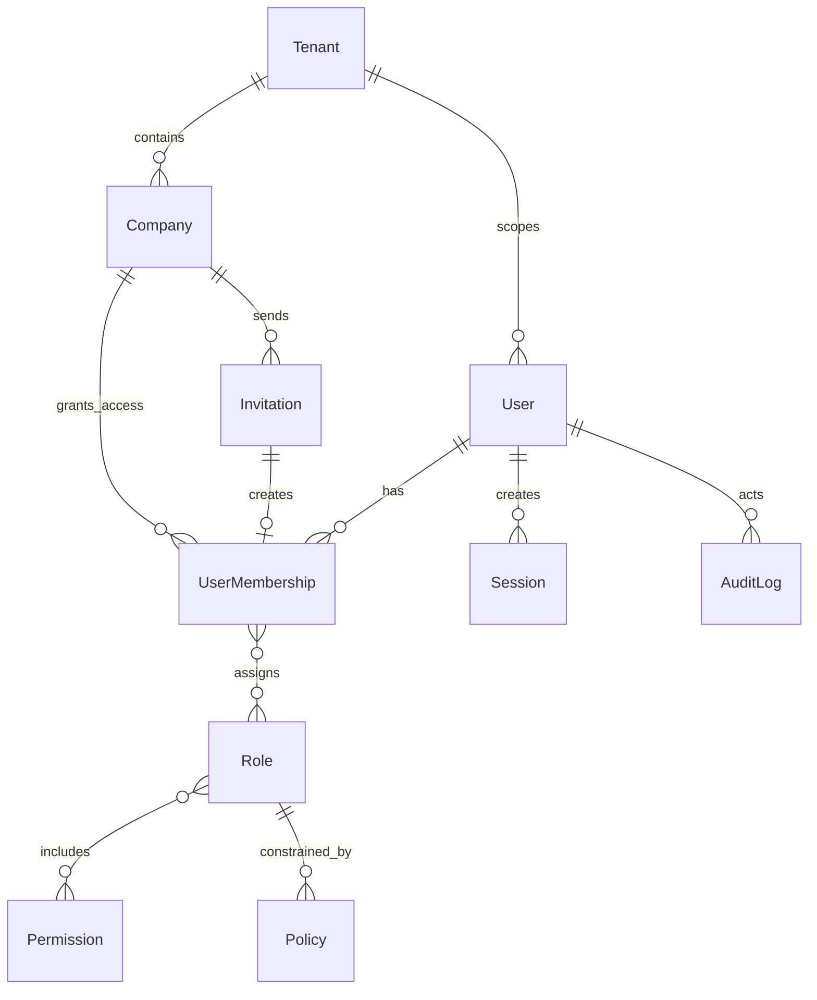
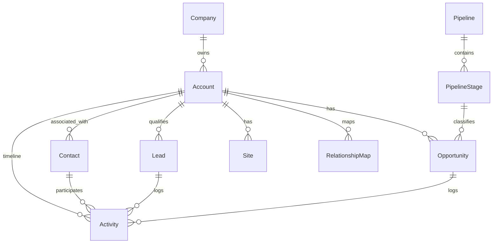
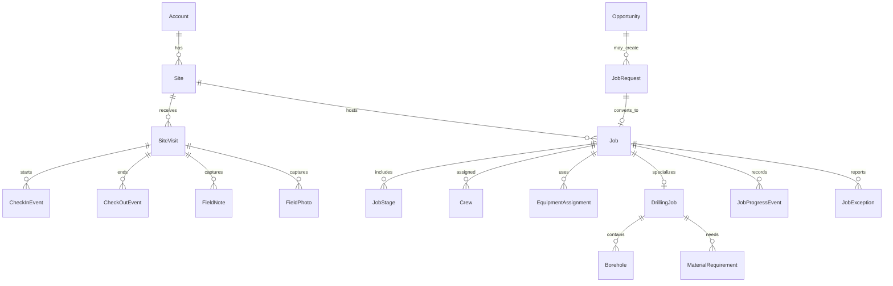
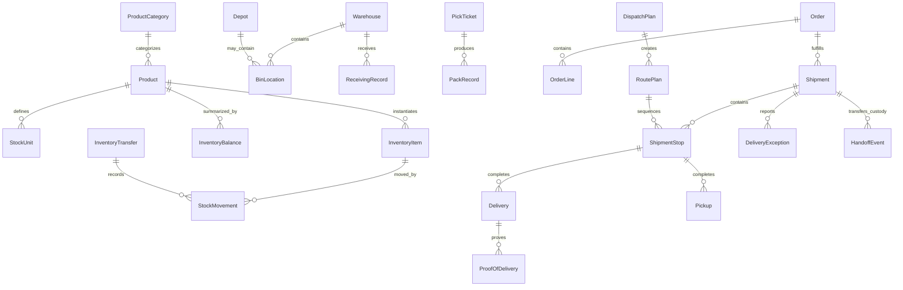
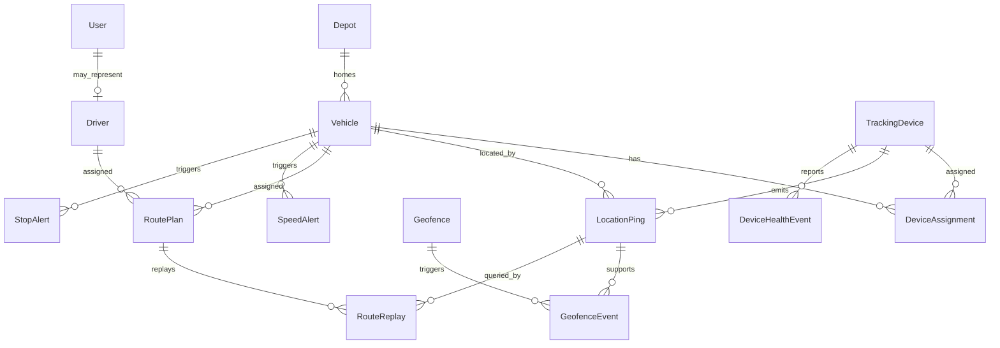
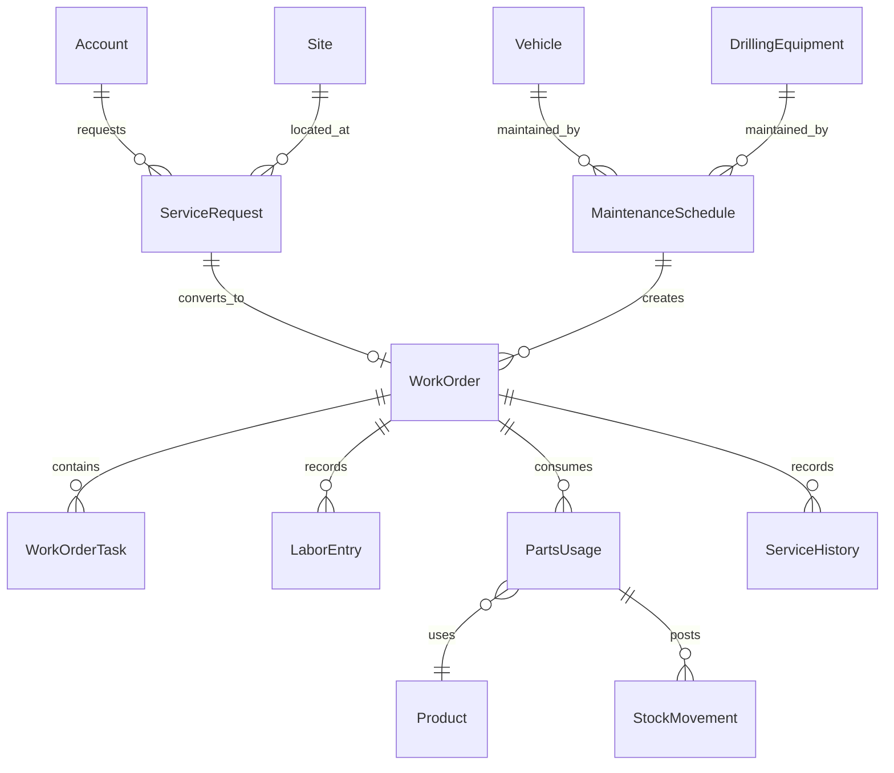
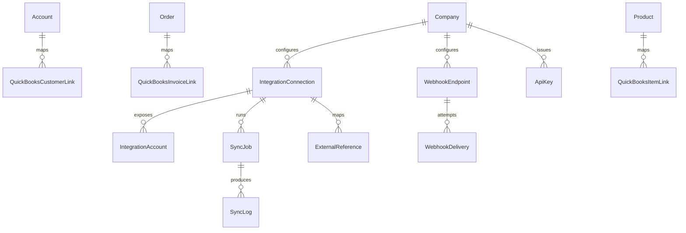
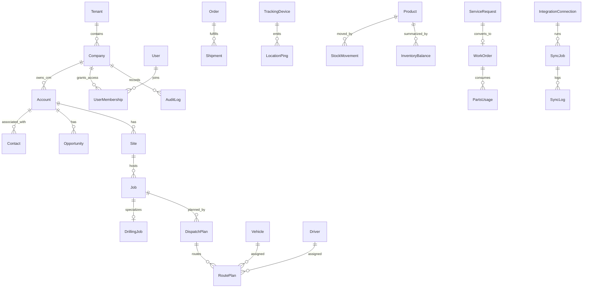

# 00_Global_Domain_Model.md

**Document type:** Global domain model control document  
**Applies to:** All future phase documents for the multi-company SaaS CRM, outbound sales, field operations, drilling workflows, logistics, warehouse, fleet, dispatch, service, reporting, integrations, QuickBooks sync, and offline-capable mobile platform  
**Audience:** Product architects, domain modelers, AI documentation writers, engineering leads, design leads, QA leads, implementation leads, and data/integration engineers  
**Status:** Control standard  
**Source documents:** Master Platform Documentation; `00_Global_Documentation_Rules.md`  
**Last updated:** 2026-05-09  

---

## 1. Purpose of This Document

This document defines the stable global domain model for the platform.

It is the source of truth for:

- Entity vocabulary.
- Entity ownership.
- Entity relationships.
- Identifier rules.
- Tenant, company, branch, depot, and warehouse scoping.
- Shared fields.
- Lifecycle and status rules.
- MongoDB modeling rules.
- Append-only event rules.
- Snapshot and rollup rules.
- Duplicate entity restrictions.
- Phase-to-entity mapping.

This document does not create Phase 1, does not rewrite the master documentation, and does not define detailed feature specifications. Future phase documents must use this document to avoid duplicate, conflicting, or renamed entities.

---

## 2. How This Document Should Be Used

Every future phase document must use this document before defining entities, fields, APIs, reports, permissions, workflows, events, or integration mappings.

Required usage process:

1. Identify the phase number and module.
2. Review the entity catalog in this document.
3. Reuse existing entity names exactly.
4. Confirm whether the phase introduces, extends, references, or only reads each entity.
5. Add fields only to the canonical owner entity unless a referenced child entity is explicitly defined here.
6. Add unknowns to `Open Questions` instead of inventing replacement concepts.
7. Add deviations as `Recommended Decision` entries and carry them forward.
8. Never rename an entity casually.
9. Never introduce a duplicate entity if an existing entity covers the meaning.
10. Update this control document only through an explicit global decision.

If a future phase needs a new entity, it must explain:

- Why no existing entity covers the concept.
- Which module owns the entity.
- Whether it is tenant-scoped, company-scoped, branch/depot/warehouse-scoped, or global.
- Whether it is mutable current state, append-only event, immutable snapshot, or configuration.
- Which existing entities it relates to.
- Whether it affects reporting, audit, offline sync, or integrations.

---

## 3. Domain Modeling Principles

| Principle | Rule |
| --- | --- |
| Multi-tenant first | All business records must be scoped by `tenant_id`; company-scoped records must also include `company_id`. |
| Company is not Account | `Company` means the SaaS customer organization. `Account` means a CRM business/customer/prospect/vendor record. |
| Shared foundations | CRM, field, inventory, dispatch, fleet, service, reporting, and integrations must share identity, audit, file, activity, task, and search foundations. |
| Canonical ownership | Every entity has one owner module responsible for lifecycle, schema, and naming decisions. Other modules may reference it. |
| Event history matters | Operational events that explain what happened must be append-only unless a correction model is explicitly defined. |
| Current state is separate from event history | Current summaries such as `InventoryBalance` must be derived from events such as `StockMovement` where practical. |
| Config is not activity | Configuration entities such as `Pipeline`, `AssignmentRule`, or `CustomFieldDefinition` must not be used as activity/event records. |
| Flexible but controlled | Custom fields may extend records, but they must not replace stable required fields needed for permissions, workflow, reporting, sync, or search. |
| Offline-safe | Mobile-created records must carry stable IDs, scope fields, timestamps, actor IDs, and sync metadata where needed. |
| Reporting-aware | Important lifecycle states, timestamps, owners, assignments, and source relationships must be explicit fields, not only notes. |
| Integration-safe | External IDs belong in `external_refs` and `ExternalReference`, not in ad hoc provider-specific fields unless a provider link entity is approved. |
| No synonym drift | Use approved entity names even when users casually say customer, client, truck, ticket, visit, transaction, or GPS event. |

---

## 4. Global Naming Rules

| Item | Rule | Example |
| --- | --- | --- |
| Entity names | Singular PascalCase. | `Account`, `SiteVisit`, `StockMovement` |
| Field names | snake_case. | `tenant_id`, `scheduled_start_at` |
| Reference fields | Use `_id` suffix for single references and `_ids` for arrays. | `account_id`, `contact_ids` |
| Timestamps | Use `_at` for datetime. | `created_at`, `occurred_at` |
| Dates without time | Use `_date`. | `requested_date` |
| Quantities | Use `_qty` where helpful. | `reserved_qty` |
| Status fields | Use `status` for primary lifecycle, `*_status` only for secondary status. | `status`, `sync_status` |
| Permission keys | Lowercase dot notation. | `crm.account.view` |
| API resources | Plural lowercase URL resources. | `/api/v1/accounts` |
| Files | Use kebab-case or approved document file names. | `00_Global_Domain_Model.md` |

Forbidden naming behavior:

- Do not pluralize entity names.
- Do not prefix entities with module names unless needed to remove ambiguity.
- Do not create clever aliases.
- Do not introduce synonyms in future phases as if they are separate concepts.
- Do not use provider names in core entity names except approved link entities such as `QuickBooksCustomerLink`.

---

## 5. Entity Naming Rules

Entity names must be stable across all documents.

| Correct Entity | Do Not Create | Reason |
| --- | --- | --- |
| `Account` | `CustomerCompany`, `Client`, `CRMCompany` | Account is the canonical CRM business/customer/prospect/vendor record. |
| `Company` | `CustomerOrg`, `ClientCompany`, `BusinessUnit` | Company is the SaaS customer organization inside a Tenant. |
| `UserMembership` | `CompanyUser`, `UserCompanyRole` | Membership is the canonical user-to-company access link. |
| `Task` | `SalesTask`, `ServiceTask`, `FollowUpItem` | Use `Task` with `category`, `type`, or relationships unless a child entity is approved. |
| `Vehicle` | `Truck`, `Van`, `FleetAsset` | Vehicle covers trucks and other road vehicles. |
| `LocationPing` | `GpsEvent`, `GpsPing`, `TelemetryPoint` | LocationPing is the canonical tracked point event. |
| `StockMovement` | `InventoryTransaction`, `MovementLog` | StockMovement is the canonical append-only inventory event. |
| `WorkOrder` | `ServiceTicket`, `TaskOrder` | WorkOrder is the canonical service execution record. |
| `Job` | `FieldJob`, `Operation`, `WorkItem` | Job is the generic operational work record. |
| `DrillingJob` | `DrillJob`, `BoreJob` | DrillingJob is the drilling-specific extension of Job. |

Aliases may be used in UI copy only when documented as display labels. Data model and API names must use canonical names.

---

## 6. Identifier Rules

### Standard ID Rules

- Use stable internal IDs for all records.
- Use `id` as the canonical internal application identifier.
- Never expose MongoDB `_id` directly as the public API identifier.
- MongoDB `_id` may exist internally but must not be the public contract.
- Store external IDs inside `external_refs`.
- Store provider-specific mapping details in `ExternalReference` and approved provider link entities.
- Every QuickBooks-linked entity must store the QuickBooks object ID in `external_refs.quickbooks`.
- Public API paths should use entity-specific parameter names such as `{account_id}`, `{job_id}`, or `{work_order_id}`.
- IDs must be generated client-side or server-side in a way that supports offline creation where required.
- IDs must be immutable after creation.
- Natural keys such as email, SKU, VIN, or order number must not replace `id`.

### Recommended ID Prefixes

Recommended Decision: use short, readable prefixes for generated application IDs. Prefixes improve logs, imports, support, and debugging, but the prefix must not be used as the only type check.

| Entity Type | Recommended Prefix |
| --- | --- |
| Tenant | `ten_` |
| Company | `co_` |
| User | `usr_` |
| Account | `acc_` |
| Contact | `con_` |
| Lead | `lead_` |
| Opportunity | `opp_` |
| Site | `site_` |
| Job | `job_` |
| WorkOrder | `wo_` |
| Product | `prd_` |
| Vehicle | `veh_` |
| StockMovement | `stm_` |
| LocationPing | `lping_` |
| IntegrationConnection | `intconn_` |

Open Question: confirm whether IDs should be ULID, UUIDv7, KSUID, or another sortable ID format. Until resolved, all future phases must treat IDs as opaque strings.

---

## 7. Tenant and Company Scoping Rules

| Scope Level | Meaning | Required Fields | Examples |
| --- | --- | --- | --- |
| Platform-global | Owned by platform, not tenant-specific. | `id` | Static permission registry if centrally owned. |
| Tenant-scoped | Belongs to one tenant and may span companies. | `id`, `tenant_id` | `User`, tenant-wide `Role`, `Permission` assignment context. |
| Company-scoped | Belongs to one company inside a tenant. | `id`, `tenant_id`, `company_id` | `Account`, `Job`, `Product`, `Vehicle`, `WorkOrder`. |
| Branch-scoped | Company record optionally tied to Branch. | `branch_id` plus company fields | `Team`, `Vehicle`, `Warehouse`, `Depot`. |
| Warehouse-scoped | Inventory record tied to Warehouse. | `warehouse_id` or generic location fields | `BinLocation`, `InventoryBalance`, `PickTicket`. |
| Depot-scoped | Operations/fleet/inventory record tied to Depot. | `depot_id` or generic location fields | `Vehicle`, `InventoryTransfer`, `InventoryBalance`. |
| Record-scoped | Child record tied to parent entity. | Parent reference field | `OrderLine`, `PipelineStage`, `WorkOrderTask`. |

Rules:

- Queries must always filter by authenticated `tenant_id`.
- Company-scoped queries must filter by permitted `company_id`.
- Cross-company access is allowed only for explicitly authorized tenant-level admin roles.
- Branch/depot/warehouse scoping must never replace tenant/company scoping.
- Child records inherit visibility from their parent plus their own fields if present.
- Provider sync records must retain tenant/company scope even when external provider IDs are globally unique.
- Offline-created records must include tenant/company scope before local persistence.

---

## 8. Shared System Fields

Every company-scoped operational record should include these fields unless explicitly marked not applicable.

| Field | Type | Required | Purpose | Notes |
| --- | --- | --- | --- | --- |
| `id` | string | Yes | Stable application identifier. | Public API identifier. |
| `tenant_id` | string | Yes | Tenant isolation boundary. | Required for all tenant data. |
| `company_id` | string | Yes | Company scope. | Required for company records. |
| `branch_id` | string | Optional | Branch scope. | Use only when branch ownership or filtering matters. |
| `owner_user_id` | string | Optional | Business owner. | Common for CRM and workflow records. |
| `assigned_user_id` | string | Optional | Execution assignee. | Common for tasks, jobs, work orders, visits. |
| `assigned_team_id` | string | Optional | Team assignee. | Use when work can be assigned to a team. |
| `status` | enum | Conditional | Primary lifecycle state. | Required for lifecycle records. |
| `source` | enum/string | Recommended | Origin of record. | Examples: `manual`, `import`, `api`, `integration`, `mobile_offline`, `system`. |
| `external_refs` | object | Recommended | External provider IDs and mapping hints. | Use provider keys such as `quickbooks`, `email_provider`, `sms_provider`. |
| `metadata` | object | Recommended | Non-critical extension metadata. | Must not contain required workflow fields. |
| `created_at` | datetime | Yes | Creation timestamp. | UTC. |
| `created_by_user_id` | string | Yes | Actor who created record. | Use system actor for automation. |
| `updated_at` | datetime | Yes | Last update timestamp. | UTC. |
| `updated_by_user_id` | string | Yes | Last updater. | Use system actor for automation. |
| `deleted_at` | datetime | Conditional | Soft deletion timestamp. | Required where soft delete applies. |
| `deleted_by_user_id` | string | Conditional | Actor who soft-deleted record. | Required if `deleted_at` is set. |

---

## 9. Shared Status Fields

Use `status` for the primary lifecycle state of an entity. Use secondary status fields only when they represent independent status dimensions.

| Field | Use For | Examples |
| --- | --- | --- |
| `status` | Primary lifecycle. | `active`, `scheduled`, `completed`, `archived` |
| `sync_status` | Integration or offline sync state. | `pending`, `synced`, `failed`, `conflict` |
| `billing_status` | Billing readiness or invoice state. | `not_ready`, `ready`, `invoiced`, `paid` |
| `approval_status` | Approval workflow separate from lifecycle. | `pending`, `approved`, `rejected` |
| `delivery_status` | Delivery-specific state when parent status is broader. | `pending`, `delivered`, `failed` |
| `device_status` | Device health/connection state. | `active`, `stale`, `offline` |

Rules:

- Do not use multiple primary lifecycle fields.
- Do not encode status only in notes, tags, custom fields, or activity text.
- Status transitions must be documented with allowed next statuses in phase documents.
- High-impact status transitions must create `AuditLog` entries.
- Status values must be lowercase snake_case.
- `archived` is preferred over hard delete for business records.
- `deleted` should not be used as a lifecycle status if soft delete fields exist.

---

## 10. Shared Audit Fields

Audit fields identify who changed a record and when. AuditLog records explain what changed and why.

| Field | Type | Required | Rule |
| --- | --- | --- | --- |
| `created_at` | datetime | Yes | Set once at creation. |
| `created_by_user_id` | string | Yes | Set to authenticated user or system actor. |
| `updated_at` | datetime | Yes | Update on every mutation. |
| `updated_by_user_id` | string | Yes | Set to actor for every mutation. |
| `version` | integer | Recommended | Increment on updates for conflict detection. |
| `last_activity_at` | datetime | Recommended | Update when meaningful user or system activity occurs. |
| `last_activity_type` | enum | Optional | Supports reporting and sorting. |

Rules:

- Audit fields do not replace `AuditLog`.
- `AuditLog` must be used for create, update, delete/archive, restore, status transition, assignment, permission-impacting, export, import, sync, and high-impact operational changes.
- Mobile/offline changes must preserve original actor and client occurrence timestamp.
- System jobs must identify a system actor or job ID.

---

## 11. Shared Soft Delete Fields

Soft delete is the default for business records.

| Field | Type | Required When | Rule |
| --- | --- | --- | --- |
| `deleted_at` | datetime | Record is archived/deleted. | Set when soft deleted. |
| `deleted_by_user_id` | string | Record is archived/deleted. | Set to actor. |
| `delete_reason` | string | High-impact records. | Required for sensitive or operational records where justified. |
| `restored_at` | datetime | Record is restored. | Optional but recommended. |
| `restored_by_user_id` | string | Record is restored. | Optional but recommended. |

Rules:

- Business records should be archived rather than hard deleted.
- Append-only event records must not be soft deleted except for legal/compliance redaction workflows approved globally.
- Archived records are hidden from default lists but available through archived filters if permissions allow.
- Hard delete requires explicit global approval and retention policy.

---

## 12. Shared Metadata Fields

| Field | Type | Purpose | Rule |
| --- | --- | --- | --- |
| `metadata` | object | Non-critical flexible metadata. | Must not store core workflow, permission, or reporting fields. |
| `external_refs` | object | Provider IDs and cross-system references. | Provider keys must be stable. |
| `tags` | array | User/company labels. | Prefer Tag references where filtering/reporting matters. |
| `custom_fields` | object | Denormalized custom field values. | Must align with CustomFieldDefinition. |
| `search_text` | string | Optional denormalized search content. | May be generated, not user-maintained. |
| `sync_metadata` | object | Offline/integration sync context. | Use for client IDs, sync attempt IDs, conflict markers. |

Rules:

- Do not hide required fields in `metadata`.
- Do not use `metadata` to avoid schema decisions for important workflow fields.
- External references must be namespaced by provider.
- QuickBooks IDs must be stored under `external_refs.quickbooks` and/or approved QuickBooks link entities.
- Custom field keys must be stable and not collide with standard fields.

## 13. Global Entity Catalog

The following catalog is the canonical entity vocabulary for future phase documents. Any new entity must be justified as a Recommended Decision and must not duplicate an entity below.

| EntityName | Domain | Purpose | OwnerModule | TenantScoped | CompanyScoped | BranchDepotWarehouseScoped | PrimaryRelationships | KeyFields | CommonStatuses | CreatedInPhase | Notes |
| --- | --- | --- | --- | --- | --- | --- | --- | --- | --- | --- | --- |
| Tenant | Core / Tenant | Top-level SaaS isolation boundary. | Core Platform | No | No | No | Company, User, AuditLog, IntegrationConnection | id, name, status, plan, region, settings, feature_flags | active, suspended, archived | Phase 02 | Tenant is not a CRM Account and must not be used for customer/prospect records. |
| Company | Core / Tenant | Customer organization using the SaaS platform inside a Tenant. | Core Platform | Yes | No | No | Tenant, Branch, UserMembership, modules_enabled | id, tenant_id, name, legal_name, status, timezone, locale, modules_enabled, settings | active, suspended, archived | Phase 02 | Company is the SaaS customer organization; do not confuse with CRM Account. |
| Branch | Core / Tenant | Operational company subdivision such as branch office or operating location. | Core Platform | Yes | Yes | Optional | Company, Department, Team, Warehouse, Depot, Vehicle | id, tenant_id, company_id, name, type, address, timezone, manager_user_id | active, inactive, archived | Phase 03 | Use for company organization and operational scope, not CRM customer sites. |
| Department | Core / Tenant | Functional grouping inside a Company or Branch. | Core Platform | Yes | Yes | Optional | Company, Branch, Team, UserMembership | id, tenant_id, company_id, branch_id, name, manager_user_id | active, inactive, archived | Phase 03 | Recommended Decision: Department is optional for MVP unless permission or reporting needs require it. |
| Team | Core / Tenant | Working group for ownership, assignments, visibility, reporting, and saved view sharing. | Core Platform | Yes | Yes | Optional | Company, Department, UserMembership, Role, SavedView | id, tenant_id, company_id, name, type, manager_user_id, member_user_ids | active, inactive, archived | Phase 02 | Teams must not replace Role or Permission. |
| User | Identity / Access | Human platform identity that can authenticate and act in one or more companies. | Identity and Access | Yes | No | No | UserMembership, Session, Role, Activity, AuditLog | id, tenant_id, email, name, phone, status, profile, mfa_status, last_login_at | invited, active, suspended, disabled, archived | Phase 02 | A Driver or technician should usually be a User plus role/membership when they log in. |
| UserMembership | Identity / Access | Links a User to a Company, roles, teams, branch scope, and access status. | Identity and Access | Yes | Yes | Optional | User, Company, Role, Team, Branch | id, tenant_id, company_id, user_id, role_ids, team_ids, branch_ids, status, effective_from, effective_to | invited, active, suspended, expired, archived | Phase 02 | Canonical membership entity; use this instead of company-specific user duplicates. |
| Role | Identity / Access | Named permission grouping assignable through memberships. | Identity and Access | Yes | Optional | Optional | Permission, UserMembership, Policy | id, tenant_id, company_id, name, description, permission_keys, scope_rules, status | active, inactive, archived | Phase 02 | Tenant-wide roles may omit company_id only when explicitly tenant-wide. |
| Permission | Identity / Access | Atomic action capability represented by a permission key. | Identity and Access | No | No | No | Role, Policy | id, key, module, entity, action, description | active, deprecated | Phase 02 | Permission keys use lowercase dot notation. |
| Policy | Identity / Access | Conditional access rule beyond static roles, such as branch, team, field, or export restrictions. | Identity and Access | Yes | Optional | Optional | Role, UserMembership, Company | id, tenant_id, company_id, name, conditions, effect, status | active, inactive, archived | Phase 02 | Recommended Decision: keep policy syntax simple until enterprise access rules are required. |
| Session | Identity / Access | Authenticated session, token state, and device context. | Identity and Access | Yes | Optional | No | User, Company, Device metadata | id, tenant_id, user_id, company_id, issued_at, expires_at, revoked_at, device_info, ip_address | active, expired, revoked | Phase 02 | Security record; retention may differ from operational records. |
| Invitation | Identity / Access | Invitation workflow for onboarding users into a tenant or company. | Identity and Access | Yes | Yes | Optional | Company, User, UserMembership, Role | id, tenant_id, company_id, email, invited_by_user_id, role_ids, token_status, expires_at | pending, accepted, expired, revoked | Phase 02 | Invitation acceptance should create or update UserMembership. |
| AuditLog | Audit / Compliance | Append-only record of administrative and important operational changes. | Audit and Compliance | Yes | Optional | Optional | Any auditable entity, User, Company | id, tenant_id, company_id, actor_user_id, entity_type, entity_id, action, before, after, occurred_at | recorded | Phase 03 | Append-only. Never update except for system-only retention markers if approved. |
| Notification | Notification | User-facing alert generated by workflow, assignment, exception, sync, or system event. | Notifications | Yes | Optional | Optional | User, Company, related_entity_type, related_entity_id | id, tenant_id, company_id, recipient_user_id, type, channel, priority, read_at | queued, sent, delivered, read, failed, dismissed | Phase 16 | Must not expose records the recipient cannot access. |
| FileAttachment | Files / Attachments | File metadata and storage pointer associated with records. | Core Platform | Yes | Yes | Optional | Any attachable entity, User | id, tenant_id, company_id, owner_user_id, linked_entity_type, linked_entity_id, file_name, mime_type, storage_key | active, archived, quarantined | Phase 03 | Store metadata only; binary storage belongs in object storage. |
| Tag | Core Platform | Company-configurable label for categorization across supported entities. | Core Platform | Yes | Yes | Optional | Company, Account, Lead, Site, Job, Task, etc. | id, tenant_id, company_id, name, color, applies_to, status | active, inactive, archived | Phase 03 | Do not create module-specific tag entities without approval. |
| CustomFieldDefinition | Core Platform | Company-configurable custom field schema for supported entities. | Core Platform | Yes | Yes | Optional | Company, CustomFieldValue, target entity type | id, tenant_id, company_id, entity_type, field_key, label, data_type, validation, visibility | active, inactive, archived | Phase 03 | Schema owner for dynamic fields. |
| CustomFieldValue | Core Platform | Value record or embedded value for a CustomFieldDefinition on a target record. | Core Platform | Yes | Yes | Optional | CustomFieldDefinition, target entity | id, tenant_id, company_id, definition_id, entity_type, entity_id, value | active, archived | Phase 03 | May be embedded in target document for query-critical fields; see MongoDB rules. |
| SavedView | Search / Views | Saved list/table/filter/column configuration. | Core Platform | Yes | Yes | Optional | User, Team, Role, module/entity | id, tenant_id, company_id, owner_user_id, entity_type, filters, columns, sort, visibility | active, archived | Phase 18 | Shared view changes must be audited. |
| ImportJob | Integration / Data Ops | Asynchronous import operation with validation and row-level results. | API / Import Export | Yes | Yes | Optional | User, FileAttachment, target entity | id, tenant_id, company_id, source_file_id, target_entity, status, counts, errors | queued, validating, running, succeeded, partially_failed, failed, cancelled | Phase 17 | Large imports must not be synchronous. |
| ExportJob | Integration / Data Ops | Asynchronous export operation and downloadable output metadata. | API / Import Export | Yes | Yes | Optional | User, Report, SavedView, FileAttachment | id, tenant_id, company_id, requested_by_user_id, entity_type, filters, status, output_file_id | queued, running, succeeded, failed, expired | Phase 17 | Exports must be permission-checked and audited. |
| WebhookEndpoint | Integrations | Company-configured outbound webhook destination. | Integrations | Yes | Yes | Optional | Company, WebhookDelivery, IntegrationConnection | id, tenant_id, company_id, url, event_types, secret_ref, status | active, disabled, failed, archived | Phase 17 | Secrets must be stored as references, not plain text. |
| ApiKey | Integrations | Scoped API credential for external clients or integrations. | Integrations | Yes | Yes | Optional | Company, Policy, AuditLog | id, tenant_id, company_id, name, key_hash, scopes, status, expires_at | active, revoked, expired | Phase 17 | Store hash only; never store plaintext key after creation. |
| Account | CRM | Business/customer/prospect/vendor record inside CRM and operational context. | CRM | Yes | Yes | Optional | Contact, Lead, Opportunity, Site, Order, ServiceRequest | id, tenant_id, company_id, name, type, lifecycle_stage, owner_user_id, industry, address, coordinates | prospect, active_customer, inactive, vendor, archived | Phase 04 | Account is not Tenant or Company. |
| Contact | CRM | Person associated with one or more Accounts. | CRM | Yes | Yes | Optional | Account, Lead, Opportunity, Activity | id, tenant_id, company_id, account_ids, first_name, last_name, emails, phones, role_title | active, inactive, bounced, do_not_contact, archived | Phase 04 | Use account_ids or relationship collection for multi-account association. |
| Lead | CRM | Unqualified or early-stage sales record requiring qualification. | CRM | Yes | Yes | Optional | Account, Contact, Opportunity, Activity, AssignmentRule | id, tenant_id, company_id, source, status, owner_user_id, score, account_id, contact_id | new, working, qualified, unqualified, converted, archived | Phase 04 | Lead may convert to Account/Contact/Opportunity. |
| Opportunity | CRM | Potential revenue opportunity tied to an Account and pipeline stage. | CRM | Yes | Yes | Optional | Account, Contact, Pipeline, PipelineStage, Quote later, JobRequest | id, tenant_id, company_id, account_id, pipeline_id, stage_id, value, probability, expected_close_date | open, won, lost, archived | Phase 04 | Do not use Deal unless explicitly documented as alias. |
| Pipeline | CRM | Company-configurable sales process container. | CRM | Yes | Yes | No | PipelineStage, Opportunity | id, tenant_id, company_id, name, type, status, sort_order | active, inactive, archived | Phase 04 | A company may have multiple pipelines. |
| PipelineStage | CRM | Stage within a Pipeline with ordering and probability defaults. | CRM | Yes | Yes | No | Pipeline, Opportunity | id, tenant_id, company_id, pipeline_id, name, sort_order, probability_default, stage_type | active, inactive, archived | Phase 04 | Stage type should identify open/won/lost categories. |
| Activity | CRM / Timeline | Timeline activity for calls, emails, SMS, meetings, notes, site visits, status changes, and system events. | CRM | Yes | Yes | Optional | Account, Contact, Lead, Opportunity, Task, User | id, tenant_id, company_id, activity_type, subject, occurred_at, actor_user_id, linked_entities | logged, corrected, archived | Phase 04 | Use Activity for unified timeline, not as a replacement for specialized event records. |
| Note | CRM / Collaboration | Standalone text note associated with a record. | Core Platform | Yes | Yes | Optional | Any notable entity, User | id, tenant_id, company_id, entity_type, entity_id, body, visibility | active, archived | Phase 04 | Can also produce Activity timeline entry. |
| Comment | Collaboration | Threaded or contextual comment on a record, task, attachment, or activity. | Core Platform | Yes | Yes | Optional | Any commentable entity, User | id, tenant_id, company_id, entity_type, entity_id, parent_comment_id, body | active, edited, deleted | Phase 04 | Use for collaboration, not source-of-truth operational events. |
| RelationshipMap | CRM | Relationship mapping between Accounts, Contacts, stakeholders, influence, and hierarchy. | CRM | Yes | Yes | Optional | Account, Contact | id, tenant_id, company_id, account_id, nodes, edges, updated_at | active, archived | Phase 04 | Recommended Decision: implement as structured graph document per Account for MVP. |
| AssignmentRule | CRM / Automation | Rule for assigning leads, accounts, tasks, or work to users/teams. | Core Platform | Yes | Yes | Optional | User, Team, Lead, Task, JobRequest | id, tenant_id, company_id, name, entity_type, conditions, assignment_target, status | active, inactive, archived | Phase 04 | May be reused by outbound, field, and service. |
| ProspectList | Outbound Sales | Imported or curated list of prospects for segmentation and campaigns. | Outbound Sales | Yes | Yes | Optional | Prospect, Campaign, ImportJob | id, tenant_id, company_id, name, source, owner_user_id, segment_rules, compliance_basis | draft, active, archived | Phase 05 |  |
| Prospect | Outbound Sales | Outbound target record that may link to Lead, Contact, or Account. | Outbound Sales | Yes | Yes | Optional | ProspectList, Lead, Contact, Account, OutreachEnrollment | id, tenant_id, company_id, list_id, account_id, contact_id, lead_id, email, phone, status | new, active, engaged, converted, disqualified, do_not_contact, archived | Phase 05 |  |
| Campaign | Outbound Sales | Outbound sales campaign across one or more channels. | Outbound Sales | Yes | Yes | Optional | ProspectList, Sequence, OutreachEnrollment, Activity | id, tenant_id, company_id, name, channel_mix, owner_user_id, start_at, end_at | draft, active, paused, completed, archived | Phase 05 |  |
| Sequence | Outbound Sales | Reusable cadence definition for outreach steps. | Outbound Sales | Yes | Yes | Optional | Campaign, SequenceStep, OutreachEnrollment | id, tenant_id, company_id, name, description, status | draft, active, paused, archived | Phase 05 |  |
| SequenceStep | Outbound Sales | Single step inside a Sequence. | Outbound Sales | Yes | Yes | Optional | Sequence, Task, CallLog, EmailLog, SmsLog, LinkedInActivity | id, tenant_id, company_id, sequence_id, step_number, channel, delay_days, template_ref | draft, active, inactive, archived | Phase 05 |  |
| OutreachEnrollment | Outbound Sales | Enrollment of Prospect/Lead/Contact into a Campaign or Sequence. | Outbound Sales | Yes | Yes | Optional | Prospect, Lead, Contact, Campaign, Sequence | id, tenant_id, company_id, target_type, target_id, campaign_id, sequence_id, current_step_id | active, paused, completed, bounced, opted_out, archived | Phase 05 |  |
| CallLog | Outbound Sales | Logged phone call outcome. | Outbound Sales | Yes | Yes | Optional | Account, Contact, Lead, Prospect, Activity, Task | id, tenant_id, company_id, direction, phone_number, outcome, disposition, occurred_at | logged, corrected, archived | Phase 05 |  |
| EmailLog | Outbound Sales | Logged email outreach or reply metadata. | Outbound Sales | Yes | Yes | Optional | Account, Contact, Lead, Prospect, Activity | id, tenant_id, company_id, direction, subject, participants, provider_message_id, occurred_at | sent, delivered, opened, replied, bounced, failed, archived | Phase 05 |  |
| SmsLog | Outbound Sales | Logged SMS outreach or reply metadata. | Outbound Sales | Yes | Yes | Optional | Account, Contact, Lead, Prospect, Activity | id, tenant_id, company_id, direction, phone_number, body_preview, provider_message_id, occurred_at | queued, sent, delivered, replied, failed, opted_out, archived | Phase 05 |  |
| LinkedInActivity | Outbound Sales | Manual LinkedIn activity log. | Outbound Sales | Yes | Yes | Optional | Account, Contact, Lead, Prospect, Activity | id, tenant_id, company_id, activity_subtype, profile_url, outcome, occurred_at | logged, needs_follow_up, archived | Phase 05 |  |
| FollowUpTask | Outbound Sales | Outbound-specific saved task view or specialization of Task. | Outbound Sales | Yes | Yes | Optional | Task, OutreachEnrollment, Lead, Prospect | id, tenant_id, company_id, task_id, outreach_enrollment_id, due_at, priority | open, completed, skipped, archived | Phase 05 | Recommended Decision: FollowUpTask should be implemented as Task with category=`outbound_follow_up` unless a separate record is required for sequence execution. |
| Task | Calendar / Tasks | Assignable action item with due dates, priority, related record, and completion state. | Calendar and Task System | Yes | Yes | Optional | User, Team, Account, Lead, Opportunity, Job, WorkOrder | id, tenant_id, company_id, title, description, assigned_user_id, due_at, priority, category, related_entity | open, in_progress, blocked, completed, cancelled, archived | Phase 06 |  |
| CalendarEvent | Calendar / Tasks | Calendar-blocking or informational scheduled event. | Calendar and Task System | Yes | Yes | Optional | User, Team, Appointment, Task | id, tenant_id, company_id, title, start_at, end_at, attendees, location, related_entity | scheduled, rescheduled, completed, cancelled, no_show | Phase 06 |  |
| Appointment | Calendar / Tasks | Customer or operational appointment, usually linked to sales, site, delivery, or service workflow. | Calendar and Task System | Yes | Yes | Optional | CalendarEvent, Account, Contact, Site, Job, WorkOrder | id, tenant_id, company_id, account_id, contact_ids, scheduled_start_at, scheduled_end_at, appointment_type | scheduled, confirmed, in_progress, completed, missed, cancelled | Phase 06 |  |
| Reminder | Calendar / Tasks | Reminder notification rule or instance for tasks/events. | Calendar and Task System | Yes | Yes | Optional | Task, CalendarEvent, Appointment, Notification | id, tenant_id, company_id, target_entity, remind_at, channel, recipient_user_id | pending, sent, dismissed, failed | Phase 06 |  |
| RecurrenceRule | Calendar / Tasks | Reusable recurrence definition for recurring tasks, appointments, maintenance, or reports. | Calendar and Task System | Yes | Yes | Optional | Task, CalendarEvent, MaintenanceSchedule, ScheduledReport | id, tenant_id, company_id, rrule, timezone, start_at, end_at | active, paused, expired, archived | Phase 06 |  |
| Site | Field Sales / Site Work | Physical customer or operational site where visits, jobs, deliveries, or service occur. | Field Sales and Site Work | Yes | Yes | Optional | Account, Contact, SiteVisit, Job, Geofence | id, tenant_id, company_id, account_id, name, address, coordinates, access_notes, hazards | active, inactive, restricted, archived | Phase 07 |  |
| SiteVisit | Field Sales / Site Work | Scheduled or completed visit to a Site. | Field Sales and Site Work | Yes | Yes | Optional | Site, Account, User, CheckInEvent, CheckOutEvent, FieldNote, FieldPhoto | id, tenant_id, company_id, site_id, assigned_user_id, scheduled_start_at, actual_start_at | scheduled, in_progress, completed, missed, cancelled, needs_follow_up | Phase 07 |  |
| CheckInEvent | Field Sales / Site Work | Append-only user/location check-in event. | Field Sales and Site Work | Yes | Yes | Optional | User, Site, SiteVisit, Job, GeofenceEvent | id, tenant_id, company_id, user_id, entity_type, entity_id, occurred_at, coordinates, offline_sync_state | recorded, synced, rejected | Phase 07 |  |
| CheckOutEvent | Field Sales / Site Work | Append-only user/location check-out event. | Field Sales and Site Work | Yes | Yes | Optional | User, Site, SiteVisit, Job | id, tenant_id, company_id, user_id, entity_type, entity_id, occurred_at, coordinates, offline_sync_state | recorded, synced, rejected | Phase 07 |  |
| FieldNote | Field Sales / Site Work | Field-captured note associated with site work or job execution. | Field Sales and Site Work | Yes | Yes | Optional | Site, SiteVisit, Job, User, FileAttachment | id, tenant_id, company_id, entity_type, entity_id, body, category, visibility | active, archived | Phase 07 |  |
| FieldPhoto | Field Sales / Site Work | Field-captured photo metadata linked to FileAttachment. | Field Sales and Site Work | Yes | Yes | Optional | Site, SiteVisit, Job, FileAttachment | id, tenant_id, company_id, file_attachment_id, entity_type, entity_id, coordinates, captured_at | active, archived, rejected | Phase 07 |  |
| JobRequest | Field Sales / Site Work | Request for operational work, potentially originating from sales or service. | Field Sales and Site Work | Yes | Yes | Optional | Account, Site, Opportunity, Job | id, tenant_id, company_id, account_id, site_id, source, priority, requested_date, scope | new, triaged, approved, rejected, converted, archived | Phase 07 |  |
| Job | Field Sales / Site Work | Generic operational job record for scheduled work; may be specialized by DrillingJob. | Field Sales and Site Work | Yes | Yes | Optional | JobRequest, Site, Crew, EquipmentAssignment, DispatchPlan, WorkOrder | id, tenant_id, company_id, account_id, site_id, job_type, status, priority, scheduled_start_at | draft, scheduled, in_progress, blocked, completed, cancelled, archived | Phase 07 |  |
| JobStage | Field Sales / Site Work | Configurable stage/checkpoint inside a Job workflow. | Field Sales and Site Work | Yes | Yes | Optional | Job, JobProgressEvent | id, tenant_id, company_id, job_id, name, sort_order, required, completed_at | pending, in_progress, completed, skipped | Phase 07 |  |
| Crew | Field Sales / Site Work | Group of users assigned to field work. | Field Sales and Site Work | Yes | Yes | Optional | User, Job, Vehicle, EquipmentAssignment | id, tenant_id, company_id, name, lead_user_id, member_user_ids, status | active, inactive, archived | Phase 07 |  |
| EquipmentAssignment | Field Sales / Site Work | Assignment of equipment, vehicle, or resource to job/crew/time window. | Field Sales and Site Work | Yes | Yes | Optional | Job, Crew, Vehicle, DrillingEquipment, User | id, tenant_id, company_id, equipment_type, equipment_id, assigned_to_type, assigned_to_id, start_at, end_at | planned, active, completed, cancelled | Phase 07 |  |
| DrillingJob | Drilling / Operations | Drilling-specific job extension for drilling workflows. | Drilling and Operations | Yes | Yes | Optional | Job, DrillingSiteAssessment, Borehole, MaterialRequirement | id, tenant_id, company_id, job_id, drilling_type, planned_depth, actual_depth, status | planned, mobilizing, drilling, paused, completed, cancelled | Phase 07 | Drilling-specific entities extend Job instead of replacing it. |
| DrillingSiteAssessment | Drilling / Operations | Assessment of drilling site constraints, hazards, access, and readiness. | Drilling and Operations | Yes | Yes | Optional | Site, DrillingJob, FieldPhoto | id, tenant_id, company_id, site_id, assessed_by_user_id, assessment_date, findings | draft, completed, approved, rejected, archived | Phase 07 | Drilling-specific entities extend Job instead of replacing it. |
| Borehole | Drilling / Operations | Specific borehole record within a DrillingJob. | Drilling and Operations | Yes | Yes | Optional | DrillingJob, JobProgressEvent | id, tenant_id, company_id, drilling_job_id, borehole_number, planned_depth, actual_depth, coordinates | planned, active, completed, abandoned | Phase 07 | Drilling-specific entities extend Job instead of replacing it. |
| DrillingEquipment | Drilling / Operations | Drilling-specific equipment asset. | Drilling and Operations | Yes | Yes | Optional | EquipmentAssignment, DrillingJob, MaintenanceSchedule | id, tenant_id, company_id, name, equipment_type, serial_number, status, home_depot_id | available, assigned, maintenance, retired, archived | Phase 07 | Drilling-specific entities extend Job instead of replacing it. |
| MaterialRequirement | Drilling / Operations | Material needed for a job or drilling operation. | Drilling and Operations | Yes | Yes | Optional | Job, DrillingJob, Product, StockMovement | id, tenant_id, company_id, job_id, product_id, required_qty, reserved_qty, fulfilled_qty | planned, reserved, partially_fulfilled, fulfilled, cancelled | Phase 07 | Drilling-specific entities extend Job instead of replacing it. |
| JobProgressEvent | Drilling / Operations | Append-only progress event for job execution. | Drilling and Operations | Yes | Yes | Optional | Job, DrillingJob, JobStage, User | id, tenant_id, company_id, job_id, event_type, occurred_at, notes, progress_percent | recorded | Phase 07 | Drilling-specific entities extend Job instead of replacing it. |
| JobException | Drilling / Operations | Operational exception affecting job execution. | Drilling and Operations | Yes | Yes | Optional | Job, DispatchPlan, User, Notification | id, tenant_id, company_id, job_id, exception_type, severity, occurred_at, resolved_at | open, acknowledged, resolved, cancelled | Phase 07 | Drilling-specific entities extend Job instead of replacing it. |
| Product | Inventory / Warehouse | Sellable, serviceable, stockable, or reportable item catalog record. | Inventory, Warehouse, and Depot | Yes | Yes | Yes | ProductCategory, StockUnit, InventoryItem, OrderLine, QuickBooksItemLink | id, tenant_id, company_id, sku, name, category_id, unit_of_measure, status, reorder_rules | active, inactive, discontinued, archived | Phase 08 |  |
| ProductCategory | Inventory / Warehouse | Classification for Product reporting and filtering. | Inventory, Warehouse, and Depot | Yes | Yes | Yes | Product | id, tenant_id, company_id, name, parent_category_id, status | active, inactive, archived | Phase 08 |  |
| StockUnit | Inventory / Warehouse | Unit of measure or packaging unit definition for inventory. | Inventory, Warehouse, and Depot | Yes | Yes | Yes | Product | id, tenant_id, company_id, product_id, unit_name, conversion_factor, barcode | active, inactive, archived | Phase 08 |  |
| InventoryItem | Inventory / Warehouse | Tracked physical stock instance or lot/serial representation where needed. | Inventory, Warehouse, and Depot | Yes | Yes | Yes | Product, InventoryBalance, StockMovement | id, tenant_id, company_id, product_id, lot_number, serial_number, condition | available, reserved, damaged, consumed, archived | Phase 08 |  |
| InventoryBalance | Inventory / Warehouse | Current materialized inventory quantity by product/location/bin/lot/serial. | Inventory, Warehouse, and Depot | Yes | Yes | Yes | Product, Warehouse, Depot, BinLocation, InventoryItem | id, tenant_id, company_id, product_id, location_type, location_id, bin_location_id, on_hand_qty, reserved_qty | current | Phase 08 |  |
| Warehouse | Inventory / Warehouse | Inventory location for storage, receiving, picking, and transfers. | Inventory, Warehouse, and Depot | Yes | Yes | Yes | Branch, BinLocation, InventoryBalance, ReceivingRecord | id, tenant_id, company_id, branch_id, name, address, status | active, inactive, archived | Phase 08 |  |
| Depot | Inventory / Warehouse | Operational inventory or fleet base, often truck depot or field location. | Inventory, Warehouse, and Depot | Yes | Yes | Yes | Branch, Vehicle, InventoryBalance, Transfer | id, tenant_id, company_id, branch_id, name, address, depot_type, status | active, inactive, archived | Phase 08 |  |
| BinLocation | Inventory / Warehouse | Specific storage bin within a Warehouse or Depot. | Inventory, Warehouse, and Depot | Yes | Yes | Yes | Warehouse, Depot, InventoryBalance | id, tenant_id, company_id, location_type, location_id, zone, aisle, rack, shelf, bin_code | active, inactive, archived | Phase 08 |  |
| ReceivingRecord | Inventory / Warehouse | Record of stock received into inventory. | Inventory, Warehouse, and Depot | Yes | Yes | Yes | Product, Warehouse, Depot, StockMovement | id, tenant_id, company_id, location_id, supplier_account_id, received_at, status | draft, received, partially_received, cancelled, archived | Phase 08 |  |
| PickTicket | Inventory / Warehouse | Picking request for order, shipment, job, or truck load. | Inventory, Warehouse, and Depot | Yes | Yes | Yes | Order, Shipment, Job, Warehouse, StockMovement | id, tenant_id, company_id, source_entity, warehouse_id, assigned_user_id, status | draft, released, picking, picked, short, cancelled | Phase 08 |  |
| PackRecord | Inventory / Warehouse | Packing confirmation after picking. | Inventory, Warehouse, and Depot | Yes | Yes | Yes | PickTicket, Shipment, FileAttachment | id, tenant_id, company_id, pick_ticket_id, packed_by_user_id, packed_at, package_count | draft, packed, cancelled | Phase 08 |  |
| StockMovement | Inventory / Warehouse | Append-only inventory movement event. | Inventory, Warehouse, and Depot | Yes | Yes | Yes | Product, InventoryItem, Warehouse, Depot, BinLocation, User | id, tenant_id, company_id, product_id, movement_type, qty, source_location, destination_location, occurred_at | recorded, reversed | Phase 08 |  |
| InventoryAdjustment | Inventory / Warehouse | Controlled inventory correction with reason code. | Inventory, Warehouse, and Depot | Yes | Yes | Yes | Product, InventoryBalance, StockMovement, AuditLog | id, tenant_id, company_id, product_id, location_id, adjustment_qty, reason_code, approved_by_user_id | draft, approved, posted, rejected, cancelled | Phase 08 |  |
| InventoryTransfer | Inventory / Warehouse | Transfer of stock between locations. | Inventory, Warehouse, and Depot | Yes | Yes | Yes | Warehouse, Depot, Vehicle, StockMovement | id, tenant_id, company_id, source_location, destination_location, status, shipped_at, received_at | draft, in_transit, partially_received, received, cancelled | Phase 08 |  |
| LowStockAlert | Inventory / Warehouse | Alert generated from reorder threshold rules. | Inventory, Warehouse, and Depot | Yes | Yes | Yes | Product, InventoryBalance, Notification | id, tenant_id, company_id, product_id, location_id, threshold_qty, current_qty, triggered_at | open, acknowledged, resolved, dismissed | Phase 08 |  |
| Order | Orders / Logistics | Customer or operational order containing product/service lines. | Orders, Dispatch, and Logistics | Yes | Yes | Optional | Account, Contact, Site, OrderLine, Shipment, QuickBooksInvoiceLink | id, tenant_id, company_id, account_id, site_id, order_number, status, billing_status | draft, confirmed, fulfilled, partially_fulfilled, cancelled, archived | Phase 09 |  |
| OrderLine | Orders / Logistics | Line item within an Order. | Orders, Dispatch, and Logistics | Yes | Yes | Optional | Order, Product, StockMovement | id, tenant_id, company_id, order_id, product_id, description, qty, unit_price | open, allocated, fulfilled, cancelled | Phase 09 |  |
| Shipment | Orders / Logistics | Movement of goods or work output across stops. | Orders, Dispatch, and Logistics | Yes | Yes | Optional | Order, Job, DispatchPlan, ShipmentStop, Vehicle, Driver | id, tenant_id, company_id, order_id, job_id, status, planned_start_at, actual_start_at | planned, assigned, in_transit, delivered, exception, cancelled | Phase 09 |  |
| ShipmentStop | Orders / Logistics | Ordered stop in a shipment. | Orders, Dispatch, and Logistics | Yes | Yes | Optional | Shipment, Site, Delivery, Pickup, ProofOfDelivery | id, tenant_id, company_id, shipment_id, stop_sequence, stop_type, site_id, planned_arrival_at | planned, arrived, completed, skipped, exception | Phase 09 |  |
| DispatchPlan | Orders / Logistics | Dispatcher-controlled plan connecting jobs, shipments, vehicles, drivers, routes, and crews. | Orders, Dispatch, and Logistics | Yes | Yes | Optional | Job, Shipment, RoutePlan, Vehicle, Driver | id, tenant_id, company_id, plan_date, status, dispatcher_user_id | draft, assigned, in_progress, completed, exception, cancelled | Phase 09 |  |
| RoutePlan | Orders / Logistics | Ordered route for vehicle/driver/stops. | Orders, Dispatch, and Logistics | Yes | Yes | Optional | DispatchPlan, ShipmentStop, Vehicle, Driver, RouteReplay | id, tenant_id, company_id, vehicle_id, driver_id, planned_start_at, planned_distance | draft, assigned, in_progress, completed, cancelled | Phase 09 |  |
| Delivery | Orders / Logistics | Delivery completion record for a stop or order. | Orders, Dispatch, and Logistics | Yes | Yes | Optional | ShipmentStop, ProofOfDelivery, Order | id, tenant_id, company_id, shipment_stop_id, delivered_at, delivered_by_user_id | pending, delivered, failed, exception | Phase 09 |  |
| Pickup | Orders / Logistics | Pickup completion record for a stop or transfer. | Orders, Dispatch, and Logistics | Yes | Yes | Optional | ShipmentStop, InventoryTransfer | id, tenant_id, company_id, shipment_stop_id, picked_up_at, picked_up_by_user_id | pending, picked_up, failed, exception | Phase 09 |  |
| ProofOfDelivery | Orders / Logistics | Proof artifact such as signature, photo, name, GPS, or timestamp. | Orders, Dispatch, and Logistics | Yes | Yes | Optional | Delivery, FileAttachment, ShipmentStop | id, tenant_id, company_id, delivery_id, proof_type, file_attachment_id, signed_by, captured_at | captured, accepted, rejected, archived | Phase 09 |  |
| DeliveryException | Orders / Logistics | Delivery or route exception record. | Orders, Dispatch, and Logistics | Yes | Yes | Optional | Shipment, ShipmentStop, Delivery, Notification | id, tenant_id, company_id, exception_type, severity, occurred_at, resolved_at | open, acknowledged, resolved, cancelled | Phase 09 |  |
| HandoffEvent | Orders / Logistics | Append-only custody handoff between warehouse, driver, depot, crew, or customer. | Orders, Dispatch, and Logistics | Yes | Yes | Optional | Shipment, InventoryTransfer, Vehicle, User, StockMovement | id, tenant_id, company_id, from_actor, to_actor, entity_type, entity_id, occurred_at | recorded | Phase 09 |  |
| Vehicle | Fleet / Tracking | Fleet asset including trucks, vans, and other vehicles. | Fleet, Tracking, and Geofence | Yes | Yes | Optional | Depot, Driver, TrackingDevice, RoutePlan, DispatchPlan, MaintenanceSchedule | id, tenant_id, company_id, depot_id, vehicle_type, plate, vin, capacity, status | available, assigned, in_service, maintenance, out_of_service, retired | Phase 10 |  |
| Driver | Fleet / Tracking | Operational driver resource linked to User where login is needed. | Fleet, Tracking, and Geofence | Yes | Yes | Optional | User, Vehicle, RoutePlan, DispatchPlan | id, tenant_id, company_id, user_id, license_number, status, home_depot_id | available, assigned, off_duty, suspended, archived | Phase 10 |  |
| TrackingDevice | Fleet / Tracking | GPS or telematics device. | Fleet, Tracking, and Geofence | Yes | Yes | Optional | DeviceAssignment, Vehicle, LocationPing, DeviceHealthEvent | id, tenant_id, company_id, provider, device_identifier, status, last_seen_at | active, inactive, lost, retired, archived | Phase 10 |  |
| DeviceAssignment | Fleet / Tracking | Assignment of tracking device to vehicle/person/resource. | Fleet, Tracking, and Geofence | Yes | Yes | Optional | TrackingDevice, Vehicle, Driver, User | id, tenant_id, company_id, device_id, assigned_entity_type, assigned_entity_id, start_at, end_at | active, ended, cancelled | Phase 10 |  |
| LocationPing | Fleet / Tracking | Append-only raw or normalized location point. | Fleet, Tracking, and Geofence | Yes | Yes | Optional | TrackingDevice, Vehicle, Driver, RouteReplay | id, tenant_id, company_id, device_id, vehicle_id, driver_id, occurred_at, coordinates, speed, heading | recorded, ignored | Phase 10 |  |
| LocationHistory | Fleet / Tracking | Queryable historical aggregation/index over LocationPing. | Fleet, Tracking, and Geofence | Yes | Yes | Optional | LocationPing, Vehicle, Driver | id, tenant_id, company_id, entity_type, entity_id, time_bucket, path_summary | generated | Phase 10 |  |
| Geofence | Fleet / Tracking | Configured geographic boundary. | Fleet, Tracking, and Geofence | Yes | Yes | Optional | Site, Warehouse, Depot, Branch, GeofenceEvent | id, tenant_id, company_id, name, shape_type, geo_shape, entity_link, status | active, inactive, archived | Phase 10 |  |
| GeofenceEvent | Fleet / Tracking | Append-only event when tracked resource enters/exits/dwells in geofence. | Fleet, Tracking, and Geofence | Yes | Yes | Optional | Geofence, Vehicle, Driver, TrackingDevice, LocationPing | id, tenant_id, company_id, geofence_id, event_type, occurred_at, entity_type, entity_id | recorded | Phase 10 |  |
| RouteReplay | Fleet / Tracking | Derived replay session/query over LocationPing and events. | Fleet, Tracking, and Geofence | Yes | Yes | Optional | RoutePlan, Vehicle, Driver, LocationPing, GeofenceEvent | id, tenant_id, company_id, route_plan_id, start_at, end_at, generated_by_user_id | generated, expired | Phase 10 |  |
| SpeedAlert | Fleet / Tracking | Alert generated from speeding rule. | Fleet, Tracking, and Geofence | Yes | Yes | Optional | Vehicle, Driver, LocationPing, Notification | id, tenant_id, company_id, vehicle_id, driver_id, speed, threshold, occurred_at | open, acknowledged, resolved, dismissed | Phase 10 |  |
| StopAlert | Fleet / Tracking | Alert generated from unexpected stop, missed stop, or late stop. | Fleet, Tracking, and Geofence | Yes | Yes | Optional | RoutePlan, ShipmentStop, Vehicle, Driver | id, tenant_id, company_id, alert_type, entity_id, occurred_at | open, acknowledged, resolved, dismissed | Phase 10 |  |
| DeviceHealthEvent | Fleet / Tracking | Append-only tracking device health event. | Fleet, Tracking, and Geofence | Yes | Yes | Optional | TrackingDevice, Notification | id, tenant_id, company_id, device_id, event_type, battery_level, occurred_at | recorded | Phase 10 |  |
| ServiceRequest | Service / Work Orders | Request for service work from customer, internal user, or integration. | Service and Work Order | Yes | Yes | Optional | Account, Site, Contact, WorkOrder | id, tenant_id, company_id, account_id, site_id, requester_contact_id, issue, priority, source | new, triaged, approved, rejected, converted, archived | Phase 11 |  |
| WorkOrder | Service / Work Orders | Service execution record assigned to technicians with tasks, parts, labor, and completion. | Service and Work Order | Yes | Yes | Optional | ServiceRequest, WorkOrderTask, PartsUsage, LaborEntry, ServiceHistory | id, tenant_id, company_id, account_id, site_id, assigned_user_id, status, scheduled_start_at | draft, scheduled, in_progress, blocked, completed, cancelled, archived | Phase 11 |  |
| WorkOrderTask | Service / Work Orders | Checklist or task item inside WorkOrder. | Service and Work Order | Yes | Yes | Optional | WorkOrder, User | id, tenant_id, company_id, work_order_id, title, sort_order, required, completed_at | open, in_progress, completed, skipped | Phase 11 |  |
| MaintenanceSchedule | Service / Work Orders | Recurring maintenance plan for vehicles, equipment, or assets. | Service and Work Order | Yes | Yes | Optional | Vehicle, DrillingEquipment, RecurrenceRule, WorkOrder | id, tenant_id, company_id, asset_type, asset_id, recurrence_rule_id, next_due_at, status | active, paused, expired, archived | Phase 11 |  |
| ServiceHistory | Service / Work Orders | Historical summary/event of completed service for account/site/asset. | Service and Work Order | Yes | Yes | Optional | WorkOrder, Account, Site, Vehicle, DrillingEquipment | id, tenant_id, company_id, service_entity_type, service_entity_id, completed_at, summary | recorded | Phase 11 |  |
| LaborEntry | Service / Work Orders | Labor time entry on a WorkOrder. | Service and Work Order | Yes | Yes | Optional | WorkOrder, User | id, tenant_id, company_id, work_order_id, user_id, started_at, ended_at, hours_qty | draft, submitted, approved, rejected | Phase 11 |  |
| PartsUsage | Service / Work Orders | Parts consumed or reserved for WorkOrder. | Service and Work Order | Yes | Yes | Optional | WorkOrder, Product, StockMovement | id, tenant_id, company_id, work_order_id, product_id, qty, source_location | planned, reserved, used, returned, cancelled | Phase 11 |  |
| Dashboard | Reporting / Analytics | Role-aware analytics workspace composed of reports/widgets. | Reporting and Analytics | Yes | Yes | Optional | Report, MetricDefinition, User, Role | id, tenant_id, company_id, name, layout, visibility, owner_user_id | active, archived | Phase 12 |  |
| Report | Reporting / Analytics | Configured report instance visible to users. | Reporting and Analytics | Yes | Yes | Optional | ReportDefinition, ReportRun, ScheduledReport | id, tenant_id, company_id, definition_id, name, filters, columns, visibility | active, archived | Phase 12 |  |
| ReportDefinition | Reporting / Analytics | Reusable report schema and metric source definition. | Reporting and Analytics | Yes | Yes | Optional | MetricDefinition, source entities | id, tenant_id, company_id, name, source_entities, dimensions, measures | draft, active, deprecated, archived | Phase 12 |  |
| ReportRun | Reporting / Analytics | Execution instance of a report or export. | Reporting and Analytics | Yes | Yes | Optional | Report, ExportJob, User | id, tenant_id, company_id, report_id, run_by_user_id, started_at, completed_at, status | queued, running, succeeded, failed | Phase 12 |  |
| MetricDefinition | Reporting / Analytics | Canonical metric definition and calculation rule. | Reporting and Analytics | Yes | Yes | Optional | ReportDefinition, RollupSnapshot | id, tenant_id, company_id, metric_key, name, formula, source_entities | draft, active, deprecated | Phase 12 |  |
| RollupSnapshot | Reporting / Analytics | Materialized aggregate snapshot for reporting or operational summary. | Reporting and Analytics | Yes | Yes | Optional | MetricDefinition, source entities | id, tenant_id, company_id, snapshot_type, period_start_at, period_end_at, values | current, superseded, archived | Phase 12 |  |
| ScheduledReport | Reporting / Analytics | Recurring report delivery schedule. | Reporting and Analytics | Yes | Yes | Optional | Report, RecurrenceRule, Notification, ExportJob | id, tenant_id, company_id, report_id, recurrence_rule_id, recipients, status | active, paused, failed, archived | Phase 12 |  |
| IntegrationConnection | Integrations | Configured connection to an external provider such as QuickBooks, email, SMS, or telematics. | Integrations | Yes | Yes | Optional | IntegrationAccount, SyncJob, SyncLog | id, tenant_id, company_id, provider, auth_reference, scopes, status, last_sync_at | connected, degraded, disconnected, revoked, archived | Phase 13 |  |
| IntegrationAccount | Integrations | External account/profile context under an IntegrationConnection. | Integrations | Yes | Yes | Optional | IntegrationConnection, ExternalReference | id, tenant_id, company_id, connection_id, external_account_id, display_name, status | active, inactive, archived | Phase 13 |  |
| SyncJob | Integrations | Asynchronous integration synchronization job. | Integrations | Yes | Yes | Optional | IntegrationConnection, SyncLog | id, tenant_id, company_id, connection_id, sync_type, direction, status, started_at, completed_at | queued, running, succeeded, failed, partially_failed, skipped, retrying | Phase 13 |  |
| SyncLog | Integrations | Row/object-level integration sync result. | Integrations | Yes | Yes | Optional | SyncJob, ExternalReference | id, tenant_id, company_id, sync_job_id, entity_type, entity_id, external_id, status, error_code | succeeded, failed, skipped, retried | Phase 13 |  |
| ExternalReference | Integrations | Canonical mapping from internal entity to external provider object. | Integrations | Yes | Yes | Optional | Any synced entity, IntegrationConnection | id, tenant_id, company_id, entity_type, entity_id, provider, external_id, external_object_type | active, stale, deleted | Phase 13 |  |
| QuickBooksCustomerLink | Integrations | QuickBooks customer mapping for Account/Contact as needed. | Integrations | Yes | Yes | Optional | Account, Contact, IntegrationConnection, ExternalReference | id, tenant_id, company_id, account_id, quickbooks_customer_id, sync_status | active, stale, failed, archived | Phase 13 |  |
| QuickBooksInvoiceLink | Integrations | QuickBooks invoice mapping for Order or billing entity. | Integrations | Yes | Yes | Optional | Order, IntegrationConnection, ExternalReference | id, tenant_id, company_id, order_id, quickbooks_invoice_id, sync_status | active, stale, failed, archived | Phase 13 |  |
| QuickBooksItemLink | Integrations | QuickBooks item/product mapping. | Integrations | Yes | Yes | Optional | Product, IntegrationConnection, ExternalReference | id, tenant_id, company_id, product_id, quickbooks_item_id, sync_status | active, stale, failed, archived | Phase 13 |  |
| WebhookDelivery | Integrations | Outbound webhook delivery attempt. | Integrations | Yes | Yes | Optional | WebhookEndpoint, related entity/event | id, tenant_id, company_id, webhook_endpoint_id, event_type, payload_hash, status, attempted_at | queued, delivered, failed, retrying, discarded | Phase 17 |  |

## 14. Core Platform Entities

| EntityName | Domain | Purpose | OwnerModule | TenantScoped | CompanyScoped | BranchDepotWarehouseScoped | PrimaryRelationships | KeyFields | CommonStatuses | CreatedInPhase | Notes |
| --- | --- | --- | --- | --- | --- | --- | --- | --- | --- | --- | --- |
| Tenant | Core / Tenant | Top-level SaaS isolation boundary. | Core Platform | No | No | No | Company, User, AuditLog, IntegrationConnection | id, name, status, plan, region, settings, feature_flags | active, suspended, archived | Phase 02 | Tenant is not a CRM Account and must not be used for customer/prospect records. |
| Company | Core / Tenant | Customer organization using the SaaS platform inside a Tenant. | Core Platform | Yes | No | No | Tenant, Branch, UserMembership, modules_enabled | id, tenant_id, name, legal_name, status, timezone, locale, modules_enabled, settings | active, suspended, archived | Phase 02 | Company is the SaaS customer organization; do not confuse with CRM Account. |
| Branch | Core / Tenant | Operational company subdivision such as branch office or operating location. | Core Platform | Yes | Yes | Optional | Company, Department, Team, Warehouse, Depot, Vehicle | id, tenant_id, company_id, name, type, address, timezone, manager_user_id | active, inactive, archived | Phase 03 | Use for company organization and operational scope, not CRM customer sites. |
| Department | Core / Tenant | Functional grouping inside a Company or Branch. | Core Platform | Yes | Yes | Optional | Company, Branch, Team, UserMembership | id, tenant_id, company_id, branch_id, name, manager_user_id | active, inactive, archived | Phase 03 | Recommended Decision: Department is optional for MVP unless permission or reporting needs require it. |
| Team | Core / Tenant | Working group for ownership, assignments, visibility, reporting, and saved view sharing. | Core Platform | Yes | Yes | Optional | Company, Department, UserMembership, Role, SavedView | id, tenant_id, company_id, name, type, manager_user_id, member_user_ids | active, inactive, archived | Phase 02 | Teams must not replace Role or Permission. |
| FileAttachment | Files / Attachments | File metadata and storage pointer associated with records. | Core Platform | Yes | Yes | Optional | Any attachable entity, User | id, tenant_id, company_id, owner_user_id, linked_entity_type, linked_entity_id, file_name, mime_type, storage_key | active, archived, quarantined | Phase 03 | Store metadata only; binary storage belongs in object storage. |
| Tag | Core Platform | Company-configurable label for categorization across supported entities. | Core Platform | Yes | Yes | Optional | Company, Account, Lead, Site, Job, Task, etc. | id, tenant_id, company_id, name, color, applies_to, status | active, inactive, archived | Phase 03 | Do not create module-specific tag entities without approval. |
| CustomFieldDefinition | Core Platform | Company-configurable custom field schema for supported entities. | Core Platform | Yes | Yes | Optional | Company, CustomFieldValue, target entity type | id, tenant_id, company_id, entity_type, field_key, label, data_type, validation, visibility | active, inactive, archived | Phase 03 | Schema owner for dynamic fields. |
| CustomFieldValue | Core Platform | Value record or embedded value for a CustomFieldDefinition on a target record. | Core Platform | Yes | Yes | Optional | CustomFieldDefinition, target entity | id, tenant_id, company_id, definition_id, entity_type, entity_id, value | active, archived | Phase 03 | May be embedded in target document for query-critical fields; see MongoDB rules. |
| SavedView | Search / Views | Saved list/table/filter/column configuration. | Core Platform | Yes | Yes | Optional | User, Team, Role, module/entity | id, tenant_id, company_id, owner_user_id, entity_type, filters, columns, sort, visibility | active, archived | Phase 18 | Shared view changes must be audited. |
| ImportJob | Integration / Data Ops | Asynchronous import operation with validation and row-level results. | API / Import Export | Yes | Yes | Optional | User, FileAttachment, target entity | id, tenant_id, company_id, source_file_id, target_entity, status, counts, errors | queued, validating, running, succeeded, partially_failed, failed, cancelled | Phase 17 | Large imports must not be synchronous. |
| ExportJob | Integration / Data Ops | Asynchronous export operation and downloadable output metadata. | API / Import Export | Yes | Yes | Optional | User, Report, SavedView, FileAttachment | id, tenant_id, company_id, requested_by_user_id, entity_type, filters, status, output_file_id | queued, running, succeeded, failed, expired | Phase 17 | Exports must be permission-checked and audited. |
| Note | CRM / Collaboration | Standalone text note associated with a record. | Core Platform | Yes | Yes | Optional | Any notable entity, User | id, tenant_id, company_id, entity_type, entity_id, body, visibility | active, archived | Phase 04 | Can also produce Activity timeline entry. |
| Comment | Collaboration | Threaded or contextual comment on a record, task, attachment, or activity. | Core Platform | Yes | Yes | Optional | Any commentable entity, User | id, tenant_id, company_id, entity_type, entity_id, parent_comment_id, body | active, edited, deleted | Phase 04 | Use for collaboration, not source-of-truth operational events. |
| AssignmentRule | CRM / Automation | Rule for assigning leads, accounts, tasks, or work to users/teams. | Core Platform | Yes | Yes | Optional | User, Team, Lead, Task, JobRequest | id, tenant_id, company_id, name, entity_type, conditions, assignment_target, status | active, inactive, archived | Phase 04 | May be reused by outbound, field, and service. |

## 15. Identity and Access Entities

| EntityName | Domain | Purpose | OwnerModule | TenantScoped | CompanyScoped | BranchDepotWarehouseScoped | PrimaryRelationships | KeyFields | CommonStatuses | CreatedInPhase | Notes |
| --- | --- | --- | --- | --- | --- | --- | --- | --- | --- | --- | --- |
| User | Identity / Access | Human platform identity that can authenticate and act in one or more companies. | Identity and Access | Yes | No | No | UserMembership, Session, Role, Activity, AuditLog | id, tenant_id, email, name, phone, status, profile, mfa_status, last_login_at | invited, active, suspended, disabled, archived | Phase 02 | A Driver or technician should usually be a User plus role/membership when they log in. |
| UserMembership | Identity / Access | Links a User to a Company, roles, teams, branch scope, and access status. | Identity and Access | Yes | Yes | Optional | User, Company, Role, Team, Branch | id, tenant_id, company_id, user_id, role_ids, team_ids, branch_ids, status, effective_from, effective_to | invited, active, suspended, expired, archived | Phase 02 | Canonical membership entity; use this instead of company-specific user duplicates. |
| Role | Identity / Access | Named permission grouping assignable through memberships. | Identity and Access | Yes | Optional | Optional | Permission, UserMembership, Policy | id, tenant_id, company_id, name, description, permission_keys, scope_rules, status | active, inactive, archived | Phase 02 | Tenant-wide roles may omit company_id only when explicitly tenant-wide. |
| Permission | Identity / Access | Atomic action capability represented by a permission key. | Identity and Access | No | No | No | Role, Policy | id, key, module, entity, action, description | active, deprecated | Phase 02 | Permission keys use lowercase dot notation. |
| Policy | Identity / Access | Conditional access rule beyond static roles, such as branch, team, field, or export restrictions. | Identity and Access | Yes | Optional | Optional | Role, UserMembership, Company | id, tenant_id, company_id, name, conditions, effect, status | active, inactive, archived | Phase 02 | Recommended Decision: keep policy syntax simple until enterprise access rules are required. |
| Session | Identity / Access | Authenticated session, token state, and device context. | Identity and Access | Yes | Optional | No | User, Company, Device metadata | id, tenant_id, user_id, company_id, issued_at, expires_at, revoked_at, device_info, ip_address | active, expired, revoked | Phase 02 | Security record; retention may differ from operational records. |
| Invitation | Identity / Access | Invitation workflow for onboarding users into a tenant or company. | Identity and Access | Yes | Yes | Optional | Company, User, UserMembership, Role | id, tenant_id, company_id, email, invited_by_user_id, role_ids, token_status, expires_at | pending, accepted, expired, revoked | Phase 02 | Invitation acceptance should create or update UserMembership. |

## 16. CRM Entities

| EntityName | Domain | Purpose | OwnerModule | TenantScoped | CompanyScoped | BranchDepotWarehouseScoped | PrimaryRelationships | KeyFields | CommonStatuses | CreatedInPhase | Notes |
| --- | --- | --- | --- | --- | --- | --- | --- | --- | --- | --- | --- |
| Account | CRM | Business/customer/prospect/vendor record inside CRM and operational context. | CRM | Yes | Yes | Optional | Contact, Lead, Opportunity, Site, Order, ServiceRequest | id, tenant_id, company_id, name, type, lifecycle_stage, owner_user_id, industry, address, coordinates | prospect, active_customer, inactive, vendor, archived | Phase 04 | Account is not Tenant or Company. |
| Contact | CRM | Person associated with one or more Accounts. | CRM | Yes | Yes | Optional | Account, Lead, Opportunity, Activity | id, tenant_id, company_id, account_ids, first_name, last_name, emails, phones, role_title | active, inactive, bounced, do_not_contact, archived | Phase 04 | Use account_ids or relationship collection for multi-account association. |
| Lead | CRM | Unqualified or early-stage sales record requiring qualification. | CRM | Yes | Yes | Optional | Account, Contact, Opportunity, Activity, AssignmentRule | id, tenant_id, company_id, source, status, owner_user_id, score, account_id, contact_id | new, working, qualified, unqualified, converted, archived | Phase 04 | Lead may convert to Account/Contact/Opportunity. |
| Opportunity | CRM | Potential revenue opportunity tied to an Account and pipeline stage. | CRM | Yes | Yes | Optional | Account, Contact, Pipeline, PipelineStage, Quote later, JobRequest | id, tenant_id, company_id, account_id, pipeline_id, stage_id, value, probability, expected_close_date | open, won, lost, archived | Phase 04 | Do not use Deal unless explicitly documented as alias. |
| Pipeline | CRM | Company-configurable sales process container. | CRM | Yes | Yes | No | PipelineStage, Opportunity | id, tenant_id, company_id, name, type, status, sort_order | active, inactive, archived | Phase 04 | A company may have multiple pipelines. |
| PipelineStage | CRM | Stage within a Pipeline with ordering and probability defaults. | CRM | Yes | Yes | No | Pipeline, Opportunity | id, tenant_id, company_id, pipeline_id, name, sort_order, probability_default, stage_type | active, inactive, archived | Phase 04 | Stage type should identify open/won/lost categories. |
| Activity | CRM / Timeline | Timeline activity for calls, emails, SMS, meetings, notes, site visits, status changes, and system events. | CRM | Yes | Yes | Optional | Account, Contact, Lead, Opportunity, Task, User | id, tenant_id, company_id, activity_type, subject, occurred_at, actor_user_id, linked_entities | logged, corrected, archived | Phase 04 | Use Activity for unified timeline, not as a replacement for specialized event records. |
| Comment | Collaboration | Threaded or contextual comment on a record, task, attachment, or activity. | Core Platform | Yes | Yes | Optional | Any commentable entity, User | id, tenant_id, company_id, entity_type, entity_id, parent_comment_id, body | active, edited, deleted | Phase 04 | Use for collaboration, not source-of-truth operational events. |
| RelationshipMap | CRM | Relationship mapping between Accounts, Contacts, stakeholders, influence, and hierarchy. | CRM | Yes | Yes | Optional | Account, Contact | id, tenant_id, company_id, account_id, nodes, edges, updated_at | active, archived | Phase 04 | Recommended Decision: implement as structured graph document per Account for MVP. |

## 17. Outbound Sales Entities

| EntityName | Domain | Purpose | OwnerModule | TenantScoped | CompanyScoped | BranchDepotWarehouseScoped | PrimaryRelationships | KeyFields | CommonStatuses | CreatedInPhase | Notes |
| --- | --- | --- | --- | --- | --- | --- | --- | --- | --- | --- | --- |
| ProspectList | Outbound Sales | Imported or curated list of prospects for segmentation and campaigns. | Outbound Sales | Yes | Yes | Optional | Prospect, Campaign, ImportJob | id, tenant_id, company_id, name, source, owner_user_id, segment_rules, compliance_basis | draft, active, archived | Phase 05 |  |
| Prospect | Outbound Sales | Outbound target record that may link to Lead, Contact, or Account. | Outbound Sales | Yes | Yes | Optional | ProspectList, Lead, Contact, Account, OutreachEnrollment | id, tenant_id, company_id, list_id, account_id, contact_id, lead_id, email, phone, status | new, active, engaged, converted, disqualified, do_not_contact, archived | Phase 05 |  |
| Campaign | Outbound Sales | Outbound sales campaign across one or more channels. | Outbound Sales | Yes | Yes | Optional | ProspectList, Sequence, OutreachEnrollment, Activity | id, tenant_id, company_id, name, channel_mix, owner_user_id, start_at, end_at | draft, active, paused, completed, archived | Phase 05 |  |
| Sequence | Outbound Sales | Reusable cadence definition for outreach steps. | Outbound Sales | Yes | Yes | Optional | Campaign, SequenceStep, OutreachEnrollment | id, tenant_id, company_id, name, description, status | draft, active, paused, archived | Phase 05 |  |
| SequenceStep | Outbound Sales | Single step inside a Sequence. | Outbound Sales | Yes | Yes | Optional | Sequence, Task, CallLog, EmailLog, SmsLog, LinkedInActivity | id, tenant_id, company_id, sequence_id, step_number, channel, delay_days, template_ref | draft, active, inactive, archived | Phase 05 |  |
| OutreachEnrollment | Outbound Sales | Enrollment of Prospect/Lead/Contact into a Campaign or Sequence. | Outbound Sales | Yes | Yes | Optional | Prospect, Lead, Contact, Campaign, Sequence | id, tenant_id, company_id, target_type, target_id, campaign_id, sequence_id, current_step_id | active, paused, completed, bounced, opted_out, archived | Phase 05 |  |
| CallLog | Outbound Sales | Logged phone call outcome. | Outbound Sales | Yes | Yes | Optional | Account, Contact, Lead, Prospect, Activity, Task | id, tenant_id, company_id, direction, phone_number, outcome, disposition, occurred_at | logged, corrected, archived | Phase 05 |  |
| EmailLog | Outbound Sales | Logged email outreach or reply metadata. | Outbound Sales | Yes | Yes | Optional | Account, Contact, Lead, Prospect, Activity | id, tenant_id, company_id, direction, subject, participants, provider_message_id, occurred_at | sent, delivered, opened, replied, bounced, failed, archived | Phase 05 |  |
| SmsLog | Outbound Sales | Logged SMS outreach or reply metadata. | Outbound Sales | Yes | Yes | Optional | Account, Contact, Lead, Prospect, Activity | id, tenant_id, company_id, direction, phone_number, body_preview, provider_message_id, occurred_at | queued, sent, delivered, replied, failed, opted_out, archived | Phase 05 |  |
| LinkedInActivity | Outbound Sales | Manual LinkedIn activity log. | Outbound Sales | Yes | Yes | Optional | Account, Contact, Lead, Prospect, Activity | id, tenant_id, company_id, activity_subtype, profile_url, outcome, occurred_at | logged, needs_follow_up, archived | Phase 05 |  |
| FollowUpTask | Outbound Sales | Outbound-specific saved task view or specialization of Task. | Outbound Sales | Yes | Yes | Optional | Task, OutreachEnrollment, Lead, Prospect | id, tenant_id, company_id, task_id, outreach_enrollment_id, due_at, priority | open, completed, skipped, archived | Phase 05 | Recommended Decision: FollowUpTask should be implemented as Task with category=`outbound_follow_up` unless a separate record is required for sequence execution. |

## 18. Calendar and Task Entities

| EntityName | Domain | Purpose | OwnerModule | TenantScoped | CompanyScoped | BranchDepotWarehouseScoped | PrimaryRelationships | KeyFields | CommonStatuses | CreatedInPhase | Notes |
| --- | --- | --- | --- | --- | --- | --- | --- | --- | --- | --- | --- |
| Task | Calendar / Tasks | Assignable action item with due dates, priority, related record, and completion state. | Calendar and Task System | Yes | Yes | Optional | User, Team, Account, Lead, Opportunity, Job, WorkOrder | id, tenant_id, company_id, title, description, assigned_user_id, due_at, priority, category, related_entity | open, in_progress, blocked, completed, cancelled, archived | Phase 06 |  |
| CalendarEvent | Calendar / Tasks | Calendar-blocking or informational scheduled event. | Calendar and Task System | Yes | Yes | Optional | User, Team, Appointment, Task | id, tenant_id, company_id, title, start_at, end_at, attendees, location, related_entity | scheduled, rescheduled, completed, cancelled, no_show | Phase 06 |  |
| Appointment | Calendar / Tasks | Customer or operational appointment, usually linked to sales, site, delivery, or service workflow. | Calendar and Task System | Yes | Yes | Optional | CalendarEvent, Account, Contact, Site, Job, WorkOrder | id, tenant_id, company_id, account_id, contact_ids, scheduled_start_at, scheduled_end_at, appointment_type | scheduled, confirmed, in_progress, completed, missed, cancelled | Phase 06 |  |
| Reminder | Calendar / Tasks | Reminder notification rule or instance for tasks/events. | Calendar and Task System | Yes | Yes | Optional | Task, CalendarEvent, Appointment, Notification | id, tenant_id, company_id, target_entity, remind_at, channel, recipient_user_id | pending, sent, dismissed, failed | Phase 06 |  |
| RecurrenceRule | Calendar / Tasks | Reusable recurrence definition for recurring tasks, appointments, maintenance, or reports. | Calendar and Task System | Yes | Yes | Optional | Task, CalendarEvent, MaintenanceSchedule, ScheduledReport | id, tenant_id, company_id, rrule, timezone, start_at, end_at | active, paused, expired, archived | Phase 06 |  |

## 19. Field Sales and Site Work Entities

| EntityName | Domain | Purpose | OwnerModule | TenantScoped | CompanyScoped | BranchDepotWarehouseScoped | PrimaryRelationships | KeyFields | CommonStatuses | CreatedInPhase | Notes |
| --- | --- | --- | --- | --- | --- | --- | --- | --- | --- | --- | --- |
| Site | Field Sales / Site Work | Physical customer or operational site where visits, jobs, deliveries, or service occur. | Field Sales and Site Work | Yes | Yes | Optional | Account, Contact, SiteVisit, Job, Geofence | id, tenant_id, company_id, account_id, name, address, coordinates, access_notes, hazards | active, inactive, restricted, archived | Phase 07 |  |
| SiteVisit | Field Sales / Site Work | Scheduled or completed visit to a Site. | Field Sales and Site Work | Yes | Yes | Optional | Site, Account, User, CheckInEvent, CheckOutEvent, FieldNote, FieldPhoto | id, tenant_id, company_id, site_id, assigned_user_id, scheduled_start_at, actual_start_at | scheduled, in_progress, completed, missed, cancelled, needs_follow_up | Phase 07 |  |
| CheckInEvent | Field Sales / Site Work | Append-only user/location check-in event. | Field Sales and Site Work | Yes | Yes | Optional | User, Site, SiteVisit, Job, GeofenceEvent | id, tenant_id, company_id, user_id, entity_type, entity_id, occurred_at, coordinates, offline_sync_state | recorded, synced, rejected | Phase 07 |  |
| CheckOutEvent | Field Sales / Site Work | Append-only user/location check-out event. | Field Sales and Site Work | Yes | Yes | Optional | User, Site, SiteVisit, Job | id, tenant_id, company_id, user_id, entity_type, entity_id, occurred_at, coordinates, offline_sync_state | recorded, synced, rejected | Phase 07 |  |
| FieldNote | Field Sales / Site Work | Field-captured note associated with site work or job execution. | Field Sales and Site Work | Yes | Yes | Optional | Site, SiteVisit, Job, User, FileAttachment | id, tenant_id, company_id, entity_type, entity_id, body, category, visibility | active, archived | Phase 07 |  |
| FieldPhoto | Field Sales / Site Work | Field-captured photo metadata linked to FileAttachment. | Field Sales and Site Work | Yes | Yes | Optional | Site, SiteVisit, Job, FileAttachment | id, tenant_id, company_id, file_attachment_id, entity_type, entity_id, coordinates, captured_at | active, archived, rejected | Phase 07 |  |
| JobRequest | Field Sales / Site Work | Request for operational work, potentially originating from sales or service. | Field Sales and Site Work | Yes | Yes | Optional | Account, Site, Opportunity, Job | id, tenant_id, company_id, account_id, site_id, source, priority, requested_date, scope | new, triaged, approved, rejected, converted, archived | Phase 07 |  |
| Job | Field Sales / Site Work | Generic operational job record for scheduled work; may be specialized by DrillingJob. | Field Sales and Site Work | Yes | Yes | Optional | JobRequest, Site, Crew, EquipmentAssignment, DispatchPlan, WorkOrder | id, tenant_id, company_id, account_id, site_id, job_type, status, priority, scheduled_start_at | draft, scheduled, in_progress, blocked, completed, cancelled, archived | Phase 07 |  |
| JobStage | Field Sales / Site Work | Configurable stage/checkpoint inside a Job workflow. | Field Sales and Site Work | Yes | Yes | Optional | Job, JobProgressEvent | id, tenant_id, company_id, job_id, name, sort_order, required, completed_at | pending, in_progress, completed, skipped | Phase 07 |  |
| Crew | Field Sales / Site Work | Group of users assigned to field work. | Field Sales and Site Work | Yes | Yes | Optional | User, Job, Vehicle, EquipmentAssignment | id, tenant_id, company_id, name, lead_user_id, member_user_ids, status | active, inactive, archived | Phase 07 |  |
| EquipmentAssignment | Field Sales / Site Work | Assignment of equipment, vehicle, or resource to job/crew/time window. | Field Sales and Site Work | Yes | Yes | Optional | Job, Crew, Vehicle, DrillingEquipment, User | id, tenant_id, company_id, equipment_type, equipment_id, assigned_to_type, assigned_to_id, start_at, end_at | planned, active, completed, cancelled | Phase 07 |  |

## 20. Drilling and Operations Entities

| EntityName | Domain | Purpose | OwnerModule | TenantScoped | CompanyScoped | BranchDepotWarehouseScoped | PrimaryRelationships | KeyFields | CommonStatuses | CreatedInPhase | Notes |
| --- | --- | --- | --- | --- | --- | --- | --- | --- | --- | --- | --- |
| DrillingJob | Drilling / Operations | Drilling-specific job extension for drilling workflows. | Drilling and Operations | Yes | Yes | Optional | Job, DrillingSiteAssessment, Borehole, MaterialRequirement | id, tenant_id, company_id, job_id, drilling_type, planned_depth, actual_depth, status | planned, mobilizing, drilling, paused, completed, cancelled | Phase 07 | Drilling-specific entities extend Job instead of replacing it. |
| DrillingSiteAssessment | Drilling / Operations | Assessment of drilling site constraints, hazards, access, and readiness. | Drilling and Operations | Yes | Yes | Optional | Site, DrillingJob, FieldPhoto | id, tenant_id, company_id, site_id, assessed_by_user_id, assessment_date, findings | draft, completed, approved, rejected, archived | Phase 07 | Drilling-specific entities extend Job instead of replacing it. |
| Borehole | Drilling / Operations | Specific borehole record within a DrillingJob. | Drilling and Operations | Yes | Yes | Optional | DrillingJob, JobProgressEvent | id, tenant_id, company_id, drilling_job_id, borehole_number, planned_depth, actual_depth, coordinates | planned, active, completed, abandoned | Phase 07 | Drilling-specific entities extend Job instead of replacing it. |
| DrillingEquipment | Drilling / Operations | Drilling-specific equipment asset. | Drilling and Operations | Yes | Yes | Optional | EquipmentAssignment, DrillingJob, MaintenanceSchedule | id, tenant_id, company_id, name, equipment_type, serial_number, status, home_depot_id | available, assigned, maintenance, retired, archived | Phase 07 | Drilling-specific entities extend Job instead of replacing it. |
| MaterialRequirement | Drilling / Operations | Material needed for a job or drilling operation. | Drilling and Operations | Yes | Yes | Optional | Job, DrillingJob, Product, StockMovement | id, tenant_id, company_id, job_id, product_id, required_qty, reserved_qty, fulfilled_qty | planned, reserved, partially_fulfilled, fulfilled, cancelled | Phase 07 | Drilling-specific entities extend Job instead of replacing it. |
| JobProgressEvent | Drilling / Operations | Append-only progress event for job execution. | Drilling and Operations | Yes | Yes | Optional | Job, DrillingJob, JobStage, User | id, tenant_id, company_id, job_id, event_type, occurred_at, notes, progress_percent | recorded | Phase 07 | Drilling-specific entities extend Job instead of replacing it. |
| JobException | Drilling / Operations | Operational exception affecting job execution. | Drilling and Operations | Yes | Yes | Optional | Job, DispatchPlan, User, Notification | id, tenant_id, company_id, job_id, exception_type, severity, occurred_at, resolved_at | open, acknowledged, resolved, cancelled | Phase 07 | Drilling-specific entities extend Job instead of replacing it. |

## 21. Inventory, Warehouse, and Depot Entities

| EntityName | Domain | Purpose | OwnerModule | TenantScoped | CompanyScoped | BranchDepotWarehouseScoped | PrimaryRelationships | KeyFields | CommonStatuses | CreatedInPhase | Notes |
| --- | --- | --- | --- | --- | --- | --- | --- | --- | --- | --- | --- |
| Product | Inventory / Warehouse | Sellable, serviceable, stockable, or reportable item catalog record. | Inventory, Warehouse, and Depot | Yes | Yes | Yes | ProductCategory, StockUnit, InventoryItem, OrderLine, QuickBooksItemLink | id, tenant_id, company_id, sku, name, category_id, unit_of_measure, status, reorder_rules | active, inactive, discontinued, archived | Phase 08 |  |
| ProductCategory | Inventory / Warehouse | Classification for Product reporting and filtering. | Inventory, Warehouse, and Depot | Yes | Yes | Yes | Product | id, tenant_id, company_id, name, parent_category_id, status | active, inactive, archived | Phase 08 |  |
| StockUnit | Inventory / Warehouse | Unit of measure or packaging unit definition for inventory. | Inventory, Warehouse, and Depot | Yes | Yes | Yes | Product | id, tenant_id, company_id, product_id, unit_name, conversion_factor, barcode | active, inactive, archived | Phase 08 |  |
| InventoryItem | Inventory / Warehouse | Tracked physical stock instance or lot/serial representation where needed. | Inventory, Warehouse, and Depot | Yes | Yes | Yes | Product, InventoryBalance, StockMovement | id, tenant_id, company_id, product_id, lot_number, serial_number, condition | available, reserved, damaged, consumed, archived | Phase 08 |  |
| InventoryBalance | Inventory / Warehouse | Current materialized inventory quantity by product/location/bin/lot/serial. | Inventory, Warehouse, and Depot | Yes | Yes | Yes | Product, Warehouse, Depot, BinLocation, InventoryItem | id, tenant_id, company_id, product_id, location_type, location_id, bin_location_id, on_hand_qty, reserved_qty | current | Phase 08 |  |
| Warehouse | Inventory / Warehouse | Inventory location for storage, receiving, picking, and transfers. | Inventory, Warehouse, and Depot | Yes | Yes | Yes | Branch, BinLocation, InventoryBalance, ReceivingRecord | id, tenant_id, company_id, branch_id, name, address, status | active, inactive, archived | Phase 08 |  |
| Depot | Inventory / Warehouse | Operational inventory or fleet base, often truck depot or field location. | Inventory, Warehouse, and Depot | Yes | Yes | Yes | Branch, Vehicle, InventoryBalance, Transfer | id, tenant_id, company_id, branch_id, name, address, depot_type, status | active, inactive, archived | Phase 08 |  |
| BinLocation | Inventory / Warehouse | Specific storage bin within a Warehouse or Depot. | Inventory, Warehouse, and Depot | Yes | Yes | Yes | Warehouse, Depot, InventoryBalance | id, tenant_id, company_id, location_type, location_id, zone, aisle, rack, shelf, bin_code | active, inactive, archived | Phase 08 |  |
| ReceivingRecord | Inventory / Warehouse | Record of stock received into inventory. | Inventory, Warehouse, and Depot | Yes | Yes | Yes | Product, Warehouse, Depot, StockMovement | id, tenant_id, company_id, location_id, supplier_account_id, received_at, status | draft, received, partially_received, cancelled, archived | Phase 08 |  |
| PickTicket | Inventory / Warehouse | Picking request for order, shipment, job, or truck load. | Inventory, Warehouse, and Depot | Yes | Yes | Yes | Order, Shipment, Job, Warehouse, StockMovement | id, tenant_id, company_id, source_entity, warehouse_id, assigned_user_id, status | draft, released, picking, picked, short, cancelled | Phase 08 |  |
| PackRecord | Inventory / Warehouse | Packing confirmation after picking. | Inventory, Warehouse, and Depot | Yes | Yes | Yes | PickTicket, Shipment, FileAttachment | id, tenant_id, company_id, pick_ticket_id, packed_by_user_id, packed_at, package_count | draft, packed, cancelled | Phase 08 |  |
| StockMovement | Inventory / Warehouse | Append-only inventory movement event. | Inventory, Warehouse, and Depot | Yes | Yes | Yes | Product, InventoryItem, Warehouse, Depot, BinLocation, User | id, tenant_id, company_id, product_id, movement_type, qty, source_location, destination_location, occurred_at | recorded, reversed | Phase 08 |  |
| InventoryAdjustment | Inventory / Warehouse | Controlled inventory correction with reason code. | Inventory, Warehouse, and Depot | Yes | Yes | Yes | Product, InventoryBalance, StockMovement, AuditLog | id, tenant_id, company_id, product_id, location_id, adjustment_qty, reason_code, approved_by_user_id | draft, approved, posted, rejected, cancelled | Phase 08 |  |
| InventoryTransfer | Inventory / Warehouse | Transfer of stock between locations. | Inventory, Warehouse, and Depot | Yes | Yes | Yes | Warehouse, Depot, Vehicle, StockMovement | id, tenant_id, company_id, source_location, destination_location, status, shipped_at, received_at | draft, in_transit, partially_received, received, cancelled | Phase 08 |  |
| LowStockAlert | Inventory / Warehouse | Alert generated from reorder threshold rules. | Inventory, Warehouse, and Depot | Yes | Yes | Yes | Product, InventoryBalance, Notification | id, tenant_id, company_id, product_id, location_id, threshold_qty, current_qty, triggered_at | open, acknowledged, resolved, dismissed | Phase 08 |  |

## 22. Orders, Dispatch, and Logistics Entities

| EntityName | Domain | Purpose | OwnerModule | TenantScoped | CompanyScoped | BranchDepotWarehouseScoped | PrimaryRelationships | KeyFields | CommonStatuses | CreatedInPhase | Notes |
| --- | --- | --- | --- | --- | --- | --- | --- | --- | --- | --- | --- |
| Order | Orders / Logistics | Customer or operational order containing product/service lines. | Orders, Dispatch, and Logistics | Yes | Yes | Optional | Account, Contact, Site, OrderLine, Shipment, QuickBooksInvoiceLink | id, tenant_id, company_id, account_id, site_id, order_number, status, billing_status | draft, confirmed, fulfilled, partially_fulfilled, cancelled, archived | Phase 09 |  |
| OrderLine | Orders / Logistics | Line item within an Order. | Orders, Dispatch, and Logistics | Yes | Yes | Optional | Order, Product, StockMovement | id, tenant_id, company_id, order_id, product_id, description, qty, unit_price | open, allocated, fulfilled, cancelled | Phase 09 |  |
| Shipment | Orders / Logistics | Movement of goods or work output across stops. | Orders, Dispatch, and Logistics | Yes | Yes | Optional | Order, Job, DispatchPlan, ShipmentStop, Vehicle, Driver | id, tenant_id, company_id, order_id, job_id, status, planned_start_at, actual_start_at | planned, assigned, in_transit, delivered, exception, cancelled | Phase 09 |  |
| ShipmentStop | Orders / Logistics | Ordered stop in a shipment. | Orders, Dispatch, and Logistics | Yes | Yes | Optional | Shipment, Site, Delivery, Pickup, ProofOfDelivery | id, tenant_id, company_id, shipment_id, stop_sequence, stop_type, site_id, planned_arrival_at | planned, arrived, completed, skipped, exception | Phase 09 |  |
| DispatchPlan | Orders / Logistics | Dispatcher-controlled plan connecting jobs, shipments, vehicles, drivers, routes, and crews. | Orders, Dispatch, and Logistics | Yes | Yes | Optional | Job, Shipment, RoutePlan, Vehicle, Driver | id, tenant_id, company_id, plan_date, status, dispatcher_user_id | draft, assigned, in_progress, completed, exception, cancelled | Phase 09 |  |
| RoutePlan | Orders / Logistics | Ordered route for vehicle/driver/stops. | Orders, Dispatch, and Logistics | Yes | Yes | Optional | DispatchPlan, ShipmentStop, Vehicle, Driver, RouteReplay | id, tenant_id, company_id, vehicle_id, driver_id, planned_start_at, planned_distance | draft, assigned, in_progress, completed, cancelled | Phase 09 |  |
| Delivery | Orders / Logistics | Delivery completion record for a stop or order. | Orders, Dispatch, and Logistics | Yes | Yes | Optional | ShipmentStop, ProofOfDelivery, Order | id, tenant_id, company_id, shipment_stop_id, delivered_at, delivered_by_user_id | pending, delivered, failed, exception | Phase 09 |  |
| Pickup | Orders / Logistics | Pickup completion record for a stop or transfer. | Orders, Dispatch, and Logistics | Yes | Yes | Optional | ShipmentStop, InventoryTransfer | id, tenant_id, company_id, shipment_stop_id, picked_up_at, picked_up_by_user_id | pending, picked_up, failed, exception | Phase 09 |  |
| ProofOfDelivery | Orders / Logistics | Proof artifact such as signature, photo, name, GPS, or timestamp. | Orders, Dispatch, and Logistics | Yes | Yes | Optional | Delivery, FileAttachment, ShipmentStop | id, tenant_id, company_id, delivery_id, proof_type, file_attachment_id, signed_by, captured_at | captured, accepted, rejected, archived | Phase 09 |  |
| DeliveryException | Orders / Logistics | Delivery or route exception record. | Orders, Dispatch, and Logistics | Yes | Yes | Optional | Shipment, ShipmentStop, Delivery, Notification | id, tenant_id, company_id, exception_type, severity, occurred_at, resolved_at | open, acknowledged, resolved, cancelled | Phase 09 |  |
| HandoffEvent | Orders / Logistics | Append-only custody handoff between warehouse, driver, depot, crew, or customer. | Orders, Dispatch, and Logistics | Yes | Yes | Optional | Shipment, InventoryTransfer, Vehicle, User, StockMovement | id, tenant_id, company_id, from_actor, to_actor, entity_type, entity_id, occurred_at | recorded | Phase 09 |  |

## 23. Fleet, Tracking, and Geofence Entities

| EntityName | Domain | Purpose | OwnerModule | TenantScoped | CompanyScoped | BranchDepotWarehouseScoped | PrimaryRelationships | KeyFields | CommonStatuses | CreatedInPhase | Notes |
| --- | --- | --- | --- | --- | --- | --- | --- | --- | --- | --- | --- |
| Vehicle | Fleet / Tracking | Fleet asset including trucks, vans, and other vehicles. | Fleet, Tracking, and Geofence | Yes | Yes | Optional | Depot, Driver, TrackingDevice, RoutePlan, DispatchPlan, MaintenanceSchedule | id, tenant_id, company_id, depot_id, vehicle_type, plate, vin, capacity, status | available, assigned, in_service, maintenance, out_of_service, retired | Phase 10 |  |
| Driver | Fleet / Tracking | Operational driver resource linked to User where login is needed. | Fleet, Tracking, and Geofence | Yes | Yes | Optional | User, Vehicle, RoutePlan, DispatchPlan | id, tenant_id, company_id, user_id, license_number, status, home_depot_id | available, assigned, off_duty, suspended, archived | Phase 10 |  |
| TrackingDevice | Fleet / Tracking | GPS or telematics device. | Fleet, Tracking, and Geofence | Yes | Yes | Optional | DeviceAssignment, Vehicle, LocationPing, DeviceHealthEvent | id, tenant_id, company_id, provider, device_identifier, status, last_seen_at | active, inactive, lost, retired, archived | Phase 10 |  |
| DeviceAssignment | Fleet / Tracking | Assignment of tracking device to vehicle/person/resource. | Fleet, Tracking, and Geofence | Yes | Yes | Optional | TrackingDevice, Vehicle, Driver, User | id, tenant_id, company_id, device_id, assigned_entity_type, assigned_entity_id, start_at, end_at | active, ended, cancelled | Phase 10 |  |
| LocationPing | Fleet / Tracking | Append-only raw or normalized location point. | Fleet, Tracking, and Geofence | Yes | Yes | Optional | TrackingDevice, Vehicle, Driver, RouteReplay | id, tenant_id, company_id, device_id, vehicle_id, driver_id, occurred_at, coordinates, speed, heading | recorded, ignored | Phase 10 |  |
| LocationHistory | Fleet / Tracking | Queryable historical aggregation/index over LocationPing. | Fleet, Tracking, and Geofence | Yes | Yes | Optional | LocationPing, Vehicle, Driver | id, tenant_id, company_id, entity_type, entity_id, time_bucket, path_summary | generated | Phase 10 |  |
| Geofence | Fleet / Tracking | Configured geographic boundary. | Fleet, Tracking, and Geofence | Yes | Yes | Optional | Site, Warehouse, Depot, Branch, GeofenceEvent | id, tenant_id, company_id, name, shape_type, geo_shape, entity_link, status | active, inactive, archived | Phase 10 |  |
| GeofenceEvent | Fleet / Tracking | Append-only event when tracked resource enters/exits/dwells in geofence. | Fleet, Tracking, and Geofence | Yes | Yes | Optional | Geofence, Vehicle, Driver, TrackingDevice, LocationPing | id, tenant_id, company_id, geofence_id, event_type, occurred_at, entity_type, entity_id | recorded | Phase 10 |  |
| RouteReplay | Fleet / Tracking | Derived replay session/query over LocationPing and events. | Fleet, Tracking, and Geofence | Yes | Yes | Optional | RoutePlan, Vehicle, Driver, LocationPing, GeofenceEvent | id, tenant_id, company_id, route_plan_id, start_at, end_at, generated_by_user_id | generated, expired | Phase 10 |  |
| SpeedAlert | Fleet / Tracking | Alert generated from speeding rule. | Fleet, Tracking, and Geofence | Yes | Yes | Optional | Vehicle, Driver, LocationPing, Notification | id, tenant_id, company_id, vehicle_id, driver_id, speed, threshold, occurred_at | open, acknowledged, resolved, dismissed | Phase 10 |  |
| StopAlert | Fleet / Tracking | Alert generated from unexpected stop, missed stop, or late stop. | Fleet, Tracking, and Geofence | Yes | Yes | Optional | RoutePlan, ShipmentStop, Vehicle, Driver | id, tenant_id, company_id, alert_type, entity_id, occurred_at | open, acknowledged, resolved, dismissed | Phase 10 |  |
| DeviceHealthEvent | Fleet / Tracking | Append-only tracking device health event. | Fleet, Tracking, and Geofence | Yes | Yes | Optional | TrackingDevice, Notification | id, tenant_id, company_id, device_id, event_type, battery_level, occurred_at | recorded | Phase 10 |  |

## 24. Service and Work Order Entities

| EntityName | Domain | Purpose | OwnerModule | TenantScoped | CompanyScoped | BranchDepotWarehouseScoped | PrimaryRelationships | KeyFields | CommonStatuses | CreatedInPhase | Notes |
| --- | --- | --- | --- | --- | --- | --- | --- | --- | --- | --- | --- |
| ServiceRequest | Service / Work Orders | Request for service work from customer, internal user, or integration. | Service and Work Order | Yes | Yes | Optional | Account, Site, Contact, WorkOrder | id, tenant_id, company_id, account_id, site_id, requester_contact_id, issue, priority, source | new, triaged, approved, rejected, converted, archived | Phase 11 |  |
| WorkOrder | Service / Work Orders | Service execution record assigned to technicians with tasks, parts, labor, and completion. | Service and Work Order | Yes | Yes | Optional | ServiceRequest, WorkOrderTask, PartsUsage, LaborEntry, ServiceHistory | id, tenant_id, company_id, account_id, site_id, assigned_user_id, status, scheduled_start_at | draft, scheduled, in_progress, blocked, completed, cancelled, archived | Phase 11 |  |
| WorkOrderTask | Service / Work Orders | Checklist or task item inside WorkOrder. | Service and Work Order | Yes | Yes | Optional | WorkOrder, User | id, tenant_id, company_id, work_order_id, title, sort_order, required, completed_at | open, in_progress, completed, skipped | Phase 11 |  |
| MaintenanceSchedule | Service / Work Orders | Recurring maintenance plan for vehicles, equipment, or assets. | Service and Work Order | Yes | Yes | Optional | Vehicle, DrillingEquipment, RecurrenceRule, WorkOrder | id, tenant_id, company_id, asset_type, asset_id, recurrence_rule_id, next_due_at, status | active, paused, expired, archived | Phase 11 |  |
| ServiceHistory | Service / Work Orders | Historical summary/event of completed service for account/site/asset. | Service and Work Order | Yes | Yes | Optional | WorkOrder, Account, Site, Vehicle, DrillingEquipment | id, tenant_id, company_id, service_entity_type, service_entity_id, completed_at, summary | recorded | Phase 11 |  |
| LaborEntry | Service / Work Orders | Labor time entry on a WorkOrder. | Service and Work Order | Yes | Yes | Optional | WorkOrder, User | id, tenant_id, company_id, work_order_id, user_id, started_at, ended_at, hours_qty | draft, submitted, approved, rejected | Phase 11 |  |
| PartsUsage | Service / Work Orders | Parts consumed or reserved for WorkOrder. | Service and Work Order | Yes | Yes | Optional | WorkOrder, Product, StockMovement | id, tenant_id, company_id, work_order_id, product_id, qty, source_location | planned, reserved, used, returned, cancelled | Phase 11 |  |

## 25. Reporting and Analytics Entities

| EntityName | Domain | Purpose | OwnerModule | TenantScoped | CompanyScoped | BranchDepotWarehouseScoped | PrimaryRelationships | KeyFields | CommonStatuses | CreatedInPhase | Notes |
| --- | --- | --- | --- | --- | --- | --- | --- | --- | --- | --- | --- |
| Dashboard | Reporting / Analytics | Role-aware analytics workspace composed of reports/widgets. | Reporting and Analytics | Yes | Yes | Optional | Report, MetricDefinition, User, Role | id, tenant_id, company_id, name, layout, visibility, owner_user_id | active, archived | Phase 12 |  |
| Report | Reporting / Analytics | Configured report instance visible to users. | Reporting and Analytics | Yes | Yes | Optional | ReportDefinition, ReportRun, ScheduledReport | id, tenant_id, company_id, definition_id, name, filters, columns, visibility | active, archived | Phase 12 |  |
| ReportDefinition | Reporting / Analytics | Reusable report schema and metric source definition. | Reporting and Analytics | Yes | Yes | Optional | MetricDefinition, source entities | id, tenant_id, company_id, name, source_entities, dimensions, measures | draft, active, deprecated, archived | Phase 12 |  |
| ReportRun | Reporting / Analytics | Execution instance of a report or export. | Reporting and Analytics | Yes | Yes | Optional | Report, ExportJob, User | id, tenant_id, company_id, report_id, run_by_user_id, started_at, completed_at, status | queued, running, succeeded, failed | Phase 12 |  |
| MetricDefinition | Reporting / Analytics | Canonical metric definition and calculation rule. | Reporting and Analytics | Yes | Yes | Optional | ReportDefinition, RollupSnapshot | id, tenant_id, company_id, metric_key, name, formula, source_entities | draft, active, deprecated | Phase 12 |  |
| RollupSnapshot | Reporting / Analytics | Materialized aggregate snapshot for reporting or operational summary. | Reporting and Analytics | Yes | Yes | Optional | MetricDefinition, source entities | id, tenant_id, company_id, snapshot_type, period_start_at, period_end_at, values | current, superseded, archived | Phase 12 |  |
| ScheduledReport | Reporting / Analytics | Recurring report delivery schedule. | Reporting and Analytics | Yes | Yes | Optional | Report, RecurrenceRule, Notification, ExportJob | id, tenant_id, company_id, report_id, recurrence_rule_id, recipients, status | active, paused, failed, archived | Phase 12 |  |

## 26. Integration Entities

| EntityName | Domain | Purpose | OwnerModule | TenantScoped | CompanyScoped | BranchDepotWarehouseScoped | PrimaryRelationships | KeyFields | CommonStatuses | CreatedInPhase | Notes |
| --- | --- | --- | --- | --- | --- | --- | --- | --- | --- | --- | --- |
| WebhookEndpoint | Integrations | Company-configured outbound webhook destination. | Integrations | Yes | Yes | Optional | Company, WebhookDelivery, IntegrationConnection | id, tenant_id, company_id, url, event_types, secret_ref, status | active, disabled, failed, archived | Phase 17 | Secrets must be stored as references, not plain text. |
| ApiKey | Integrations | Scoped API credential for external clients or integrations. | Integrations | Yes | Yes | Optional | Company, Policy, AuditLog | id, tenant_id, company_id, name, key_hash, scopes, status, expires_at | active, revoked, expired | Phase 17 | Store hash only; never store plaintext key after creation. |
| IntegrationConnection | Integrations | Configured connection to an external provider such as QuickBooks, email, SMS, or telematics. | Integrations | Yes | Yes | Optional | IntegrationAccount, SyncJob, SyncLog | id, tenant_id, company_id, provider, auth_reference, scopes, status, last_sync_at | connected, degraded, disconnected, revoked, archived | Phase 13 |  |
| IntegrationAccount | Integrations | External account/profile context under an IntegrationConnection. | Integrations | Yes | Yes | Optional | IntegrationConnection, ExternalReference | id, tenant_id, company_id, connection_id, external_account_id, display_name, status | active, inactive, archived | Phase 13 |  |
| SyncJob | Integrations | Asynchronous integration synchronization job. | Integrations | Yes | Yes | Optional | IntegrationConnection, SyncLog | id, tenant_id, company_id, connection_id, sync_type, direction, status, started_at, completed_at | queued, running, succeeded, failed, partially_failed, skipped, retrying | Phase 13 |  |
| SyncLog | Integrations | Row/object-level integration sync result. | Integrations | Yes | Yes | Optional | SyncJob, ExternalReference | id, tenant_id, company_id, sync_job_id, entity_type, entity_id, external_id, status, error_code | succeeded, failed, skipped, retried | Phase 13 |  |
| ExternalReference | Integrations | Canonical mapping from internal entity to external provider object. | Integrations | Yes | Yes | Optional | Any synced entity, IntegrationConnection | id, tenant_id, company_id, entity_type, entity_id, provider, external_id, external_object_type | active, stale, deleted | Phase 13 |  |
| QuickBooksCustomerLink | Integrations | QuickBooks customer mapping for Account/Contact as needed. | Integrations | Yes | Yes | Optional | Account, Contact, IntegrationConnection, ExternalReference | id, tenant_id, company_id, account_id, quickbooks_customer_id, sync_status | active, stale, failed, archived | Phase 13 |  |
| QuickBooksInvoiceLink | Integrations | QuickBooks invoice mapping for Order or billing entity. | Integrations | Yes | Yes | Optional | Order, IntegrationConnection, ExternalReference | id, tenant_id, company_id, order_id, quickbooks_invoice_id, sync_status | active, stale, failed, archived | Phase 13 |  |
| QuickBooksItemLink | Integrations | QuickBooks item/product mapping. | Integrations | Yes | Yes | Optional | Product, IntegrationConnection, ExternalReference | id, tenant_id, company_id, product_id, quickbooks_item_id, sync_status | active, stale, failed, archived | Phase 13 |  |
| WebhookDelivery | Integrations | Outbound webhook delivery attempt. | Integrations | Yes | Yes | Optional | WebhookEndpoint, related entity/event | id, tenant_id, company_id, webhook_endpoint_id, event_type, payload_hash, status, attempted_at | queued, delivered, failed, retrying, discarded | Phase 17 |  |

## 27. Notification Entities

| EntityName | Domain | Purpose | OwnerModule | TenantScoped | CompanyScoped | BranchDepotWarehouseScoped | PrimaryRelationships | KeyFields | CommonStatuses | CreatedInPhase | Notes |
| --- | --- | --- | --- | --- | --- | --- | --- | --- | --- | --- | --- |
| Notification | Notification | User-facing alert generated by workflow, assignment, exception, sync, or system event. | Notifications | Yes | Optional | Optional | User, Company, related_entity_type, related_entity_id | id, tenant_id, company_id, recipient_user_id, type, channel, priority, read_at | queued, sent, delivered, read, failed, dismissed | Phase 16 | Must not expose records the recipient cannot access. |
| Reminder | Calendar / Tasks | Reminder notification rule or instance for tasks/events. | Calendar and Task System | Yes | Yes | Optional | Task, CalendarEvent, Appointment, Notification | id, tenant_id, company_id, target_entity, remind_at, channel, recipient_user_id | pending, sent, dismissed, failed | Phase 06 |  |
| LowStockAlert | Inventory / Warehouse | Alert generated from reorder threshold rules. | Inventory, Warehouse, and Depot | Yes | Yes | Yes | Product, InventoryBalance, Notification | id, tenant_id, company_id, product_id, location_id, threshold_qty, current_qty, triggered_at | open, acknowledged, resolved, dismissed | Phase 08 |  |
| SpeedAlert | Fleet / Tracking | Alert generated from speeding rule. | Fleet, Tracking, and Geofence | Yes | Yes | Optional | Vehicle, Driver, LocationPing, Notification | id, tenant_id, company_id, vehicle_id, driver_id, speed, threshold, occurred_at | open, acknowledged, resolved, dismissed | Phase 10 |  |
| StopAlert | Fleet / Tracking | Alert generated from unexpected stop, missed stop, or late stop. | Fleet, Tracking, and Geofence | Yes | Yes | Optional | RoutePlan, ShipmentStop, Vehicle, Driver | id, tenant_id, company_id, alert_type, entity_id, occurred_at | open, acknowledged, resolved, dismissed | Phase 10 |  |
| DeviceHealthEvent | Fleet / Tracking | Append-only tracking device health event. | Fleet, Tracking, and Geofence | Yes | Yes | Optional | TrackingDevice, Notification | id, tenant_id, company_id, device_id, event_type, battery_level, occurred_at | recorded | Phase 10 |  |
| WebhookDelivery | Integrations | Outbound webhook delivery attempt. | Integrations | Yes | Yes | Optional | WebhookEndpoint, related entity/event | id, tenant_id, company_id, webhook_endpoint_id, event_type, payload_hash, status, attempted_at | queued, delivered, failed, retrying, discarded | Phase 17 |  |

## 28. File and Attachment Entities

| EntityName | Domain | Purpose | OwnerModule | TenantScoped | CompanyScoped | BranchDepotWarehouseScoped | PrimaryRelationships | KeyFields | CommonStatuses | CreatedInPhase | Notes |
| --- | --- | --- | --- | --- | --- | --- | --- | --- | --- | --- | --- |
| FileAttachment | Files / Attachments | File metadata and storage pointer associated with records. | Core Platform | Yes | Yes | Optional | Any attachable entity, User | id, tenant_id, company_id, owner_user_id, linked_entity_type, linked_entity_id, file_name, mime_type, storage_key | active, archived, quarantined | Phase 03 | Store metadata only; binary storage belongs in object storage. |
| FieldPhoto | Field Sales / Site Work | Field-captured photo metadata linked to FileAttachment. | Field Sales and Site Work | Yes | Yes | Optional | Site, SiteVisit, Job, FileAttachment | id, tenant_id, company_id, file_attachment_id, entity_type, entity_id, coordinates, captured_at | active, archived, rejected | Phase 07 |  |

## 29. Search, Filter, and Saved View Entities

| EntityName | Domain | Purpose | OwnerModule | TenantScoped | CompanyScoped | BranchDepotWarehouseScoped | PrimaryRelationships | KeyFields | CommonStatuses | CreatedInPhase | Notes |
| --- | --- | --- | --- | --- | --- | --- | --- | --- | --- | --- | --- |
| Tag | Core Platform | Company-configurable label for categorization across supported entities. | Core Platform | Yes | Yes | Optional | Company, Account, Lead, Site, Job, Task, etc. | id, tenant_id, company_id, name, color, applies_to, status | active, inactive, archived | Phase 03 | Do not create module-specific tag entities without approval. |
| CustomFieldDefinition | Core Platform | Company-configurable custom field schema for supported entities. | Core Platform | Yes | Yes | Optional | Company, CustomFieldValue, target entity type | id, tenant_id, company_id, entity_type, field_key, label, data_type, validation, visibility | active, inactive, archived | Phase 03 | Schema owner for dynamic fields. |
| CustomFieldValue | Core Platform | Value record or embedded value for a CustomFieldDefinition on a target record. | Core Platform | Yes | Yes | Optional | CustomFieldDefinition, target entity | id, tenant_id, company_id, definition_id, entity_type, entity_id, value | active, archived | Phase 03 | May be embedded in target document for query-critical fields; see MongoDB rules. |
| SavedView | Search / Views | Saved list/table/filter/column configuration. | Core Platform | Yes | Yes | Optional | User, Team, Role, module/entity | id, tenant_id, company_id, owner_user_id, entity_type, filters, columns, sort, visibility | active, archived | Phase 18 | Shared view changes must be audited. |

## 30. Audit and Compliance Entities

| EntityName | Domain | Purpose | OwnerModule | TenantScoped | CompanyScoped | BranchDepotWarehouseScoped | PrimaryRelationships | KeyFields | CommonStatuses | CreatedInPhase | Notes |
| --- | --- | --- | --- | --- | --- | --- | --- | --- | --- | --- | --- |
| AuditLog | Audit / Compliance | Append-only record of administrative and important operational changes. | Audit and Compliance | Yes | Optional | Optional | Any auditable entity, User, Company | id, tenant_id, company_id, actor_user_id, entity_type, entity_id, action, before, after, occurred_at | recorded | Phase 03 | Append-only. Never update except for system-only retention markers if approved. |

## 31. Entity Relationship Overview

Core relationship rules:

- `Tenant` owns one or more `Company` records.
- `Company` owns operational module configuration and almost all business records.
- `User` may belong to one or more `Company` records through `UserMembership`.
- `Role`, `Permission`, and `Policy` determine access; they must not be duplicated by module-specific user entities.
- `Account` is the CRM business/customer/prospect/vendor record.
- `Contact` belongs to or is associated with one or more `Account` records.
- `Opportunity` belongs to an `Account` and a `PipelineStage`.
- `Site` may belong to an `Account`.
- `Job` may originate from `Opportunity`, `JobRequest`, or direct operations entry.
- `DrillingJob` extends `Job` for drilling-specific workflows.
- `Shipment` may connect to `Order`, `Job`, or `DispatchPlan`.
- `Vehicle` may be assigned to `Driver`, `RoutePlan`, `Job`, or `DispatchPlan`.
- `WorkOrder` may originate from `ServiceRequest` and may consume `PartsUsage`.
- `PartsUsage` and job material fulfillment must create or reference `StockMovement`.
- `LocationPing`, `StockMovement`, `AuditLog`, `HandoffEvent`, `GeofenceEvent`, and `JobProgressEvent` are append-only events.
- `RollupSnapshot`, `InventoryBalance`, and `LocationHistory` are derived/materialized read models unless explicitly entered as source records.

### Tenant and Identity Relationship

### CRM Relationship

### Field Operations Relationship

### Inventory and Logistics Relationship

### Fleet and Tracking Relationship

### Service Relationship

### Integration Relationship

---

## 32. Canonical Entity Ownership Rules

| Entity Category | Owner Module | Rule |
| --- | --- | --- |
| Tenant, Company, Branch, Department, Team | Core Platform | Other modules reference these records but do not own them. |
| User, UserMembership, Role, Permission, Policy, Session, Invitation | Identity and Access | No module may create its own user, role, or permission model. |
| Account, Contact, Lead, Opportunity, Pipeline, PipelineStage | CRM | Operational modules may reference Account and Contact but must not redefine customer records. |
| Activity, Note, Comment | CRM / Core Collaboration | Activity timeline is shared, but specialized source events remain in their owner modules. |
| ProspectList, Prospect, Campaign, Sequence, OutreachEnrollment, channel logs | Outbound Sales | These may link to CRM but do not replace CRM Lead, Contact, or Account. |
| Task, CalendarEvent, Appointment, Reminder, RecurrenceRule | Calendar and Task System | All modules reuse Task and Appointment rather than creating module-specific task entities. |
| Site, SiteVisit, JobRequest, Job, Crew, EquipmentAssignment | Field Sales and Site Work | Job is generic operational work; service uses WorkOrder for service execution. |
| DrillingJob, Borehole, DrillingEquipment, MaterialRequirement, JobProgressEvent, JobException | Drilling and Operations | Drilling entities extend Job and must not replace generic field operations model. |
| Product, Warehouse, Depot, BinLocation, InventoryBalance, StockMovement | Inventory, Warehouse, and Depot | StockMovement is source event; InventoryBalance is derived current state. |
| Order, Shipment, DispatchPlan, RoutePlan, Delivery, Pickup, ProofOfDelivery | Orders, Dispatch, and Logistics | Dispatch coordinates resources but does not own fleet or inventory master records. |
| Vehicle, Driver, TrackingDevice, LocationPing, Geofence, alerts | Fleet, Tracking, and Geofence | Vehicle covers trucks; LocationPing covers GPS points. |
| ServiceRequest, WorkOrder, WorkOrderTask, MaintenanceSchedule, ServiceHistory, LaborEntry, PartsUsage | Service and Work Orders | WorkOrder is not a generic Task; it is service execution. |
| Dashboard, Report, MetricDefinition, RollupSnapshot | Reporting and Analytics | Reporting references source entities and may own derived snapshots only. |
| IntegrationConnection, SyncJob, ExternalReference, QuickBooks links, WebhookDelivery | Integrations | Provider-specific sync is owned here, while source records remain with their module. |
| AuditLog | Audit and Compliance | Append-only audit source for governance and high-impact changes. |

---

## 33. Entity Lifecycle Rules

Lifecycle records must define allowed states and transitions in their phase documents.

Default lifecycle pattern:

1. Draft or new.
2. Active / scheduled / open.
3. In progress when execution starts.
4. Completed / succeeded / converted / won where applicable.
5. Cancelled / failed / rejected / lost where applicable.
6. Archived for soft deletion.

Rules:

- Do not skip status modeling for records that appear in queues, boards, reports, mobile workflows, or integrations.
- Do not use `active` for all operational states.
- Do not use `completed` when the record represents configuration.
- Do not hard delete lifecycle records by default.
- High-impact transitions must record `AuditLog`.
- Operational events should record `occurred_at`, not only `created_at`.
- Lifecycle records should include `closed_at`, `completed_at`, `cancelled_at`, or similar timestamps where reporting needs them.

---

## 34. Entity Status Standardization

| Status Family | Standard Values | Applies To |
| --- | --- | --- |
| Configuration | `draft`, `active`, `inactive`, `archived` | Pipeline, Sequence, AssignmentRule, CustomFieldDefinition |
| User access | `invited`, `active`, `suspended`, `disabled`, `expired`, `archived` | User, UserMembership, Invitation |
| Sales | `new`, `working`, `qualified`, `unqualified`, `converted`, `open`, `won`, `lost`, `archived` | Lead, Opportunity |
| Scheduled work | `draft`, `scheduled`, `assigned`, `in_progress`, `blocked`, `completed`, `cancelled`, `archived` | Task, Appointment, Job, WorkOrder |
| Logistics | `planned`, `assigned`, `in_transit`, `delivered`, `exception`, `completed`, `cancelled` | Shipment, RoutePlan, DispatchPlan |
| Inventory | `draft`, `released`, `reserved`, `picked`, `packed`, `in_transit`, `received`, `posted`, `cancelled` | PickTicket, InventoryTransfer, InventoryAdjustment |
| Integration | `queued`, `running`, `succeeded`, `failed`, `partially_failed`, `skipped`, `retrying` | SyncJob, ImportJob, ExportJob, WebhookDelivery |
| Notification | `queued`, `sent`, `delivered`, `read`, `failed`, `dismissed` | Notification |
| Event records | `recorded`, `reversed`, `ignored`, `rejected` | StockMovement, LocationPing, HandoffEvent, CheckInEvent |
| Alerts/exceptions | `open`, `acknowledged`, `resolved`, `dismissed`, `cancelled` | LowStockAlert, SpeedAlert, StopAlert, JobException |

Rules:

- Module-specific statuses may extend standard values only when the phase defines the reason.
- UI labels may be friendlier, but stored values must remain lowercase snake_case.
- Reporting metrics must state which statuses count as open, active, completed, failed, or archived.

---

## 35. Entity Relationship Rules

Required relationship rules:

- Do not duplicate `Account`, `Company`, and `Tenant`.
- `Company` means the customer organization using the SaaS platform.
- `Account` means a business/customer/prospect/vendor record inside the CRM.
- `Tenant` means the top-level SaaS isolation boundary.
- A `Contact` belongs to or is associated with one or more `Account` records.
- An `Opportunity` belongs to an `Account`.
- A `Site` may belong to an `Account`.
- A `Job` may originate from an `Opportunity`, `JobRequest`, or direct operations entry.
- A `Shipment` may be connected to an `Order`, `Job`, or `DispatchPlan`.
- A `Vehicle` may be assigned to a `Driver`, `RoutePlan`, `Job`, or `DispatchPlan`.
- `LocationPing` records should be append-only event records.
- `StockMovement` records should be append-only event records.
- `AuditLog` records should be append-only.

Reference field rules:

- Use `*_id` for one-to-one or many-to-one references.
- Use `*_ids` only for small bounded reference arrays.
- Use join/link entities for many-to-many relationships with attributes, history, status, or effective dates.
- Do not embed a full parent record inside child records except as an immutable snapshot.
- Use snapshots for historical documents such as proof, invoice sync, delivery confirmation, and report exports where historical accuracy matters.

---

## 36. Embedded vs Referenced Data Rules for MongoDB

MongoDB modeling must follow access patterns without corrupting the domain model.

### Embed When

- Child data is small and bounded.
- Child data has no independent lifecycle.
- Child data is almost always read with the parent.
- Child data does not need independent permissions.
- Child data does not need independent audit history.
- Child data will not grow unbounded.

Examples:

- Address object on `Account`, `Site`, `Warehouse`, or `Depot`.
- Phone/email arrays on `Contact`.
- Lightweight `settings` object on `Company`.
- Ordered stage metadata inside `Pipeline` only if stages are not independently managed. If independently managed, use `PipelineStage`.
- Small proof details on `ProofOfDelivery`, while files remain `FileAttachment`.

### Reference When

- Child data has its own lifecycle.
- Child data can grow unbounded.
- Child data requires independent permissions.
- Child data is queried independently.
- Child data is shared across parents.
- Child data is append-only.
- Child data needs audit or retention rules.

Examples:

- `Activity`, `AuditLog`, `StockMovement`, `LocationPing`, `FileAttachment`.
- `OrderLine` if line-level fulfillment, inventory, or billing state matters.
- `WorkOrderTask` if task-level assignment or completion is required.
- `CustomFieldValue` when values need indexing, audit, or cross-record querying.

### Snapshot When

- The historical value must remain stable even if the referenced master record changes.
- External system sync needs a frozen payload.
- Delivery, proof, invoice, export, or audit records must show what was true at the time.

Examples:

- Product name/SKU snapshot on `OrderLine`.
- Address snapshot on `ShipmentStop`.
- Customer/contact snapshot on `ProofOfDelivery`.
- Report filter snapshot on `ReportRun` or `ExportJob`.
- External provider payload snapshot on `SyncLog` when needed for troubleshooting.

---

## 37. Event and Activity Modeling Rules

Event records explain what happened. Activity records provide timeline visibility.

| Record Type | Purpose | Rule |
| --- | --- | --- |
| `Activity` | User-facing CRM/record timeline item. | May summarize calls, emails, notes, meetings, status changes, and system events. |
| `AuditLog` | Compliance-grade before/after and actor history. | Required for high-impact changes. Append-only. |
| `StockMovement` | Inventory movement source event. | Append-only. Used to derive balances. |
| `LocationPing` | GPS/location point event. | Append-only. High-volume retention applies. |
| `GeofenceEvent` | Enter/exit/dwell event. | Append-only. Derived from pings and rules. |
| `CheckInEvent` / `CheckOutEvent` | Field attendance/location event. | Append-only. Offline capable. |
| `HandoffEvent` | Custody transfer event. | Append-only. |
| `JobProgressEvent` | Work progress event. | Append-only. |
| `DeviceHealthEvent` | Device health event. | Append-only. |
| `WebhookDelivery` | Delivery attempt event. | Append-only per attempt. |

Rules:

- Do not use `Activity` as the only source of truth for inventory, tracking, audit, or sync events.
- Important source events may generate `Activity` entries for timeline visibility.
- Append-only events may be corrected with reversal/correction events, not overwritten.
- Events must use `occurred_at`; ingestion can use `created_at`.
- Offline events must preserve client occurrence timestamp and sync metadata.

---

## 38. Snapshot and Rollup Modeling Rules

Snapshots and rollups improve performance and preserve history.

| Entity | Type | Source | Rule |
| --- | --- | --- | --- |
| `InventoryBalance` | Current-state rollup | `StockMovement` | Must reconcile to movement history. |
| `LocationHistory` | Time-bucketed tracking read model | `LocationPing` | Must be regenerable where practical. |
| `RouteReplay` | Generated query/session result | `LocationPing`, `GeofenceEvent`, `RoutePlan` | May expire. |
| `RollupSnapshot` | Reporting aggregate | Source entities and events | Must store definition/version context. |
| `ReportRun` | Report execution snapshot | `Report`, source entities | Must preserve filters, run time, and actor. |
| `ExportJob` | Export snapshot | Source query/report | Must preserve filters and export timestamp. |
| `SyncLog` | Integration result snapshot | Source entity and provider response | Must store enough troubleshooting context. |

Rules:

- Rollups must not be the only source of truth unless explicitly approved.
- Rollups must include `period_start_at`, `period_end_at`, and generation metadata where time-based.
- Rollups must record source definition/version when metric logic may change.
- Reporting phases must define whether a metric is real-time, scheduled, or event-driven.

---

## 39. Data Retention and Archival Rules

| Data Category | Default Rule | Notes |
| --- | --- | --- |
| Business records | Soft delete/archive. | Keep for reporting unless retention policy says otherwise. |
| Audit logs | Retain long-term. | Must be append-only. Retention policy requires approval. |
| Location pings | Retain based on configurable policy. | High-volume data may be summarized after retention window. |
| Integration logs | Retain enough to troubleshoot sync. | Sensitive payloads may require redaction. |
| Files/photos | Retain with parent record unless legal/security rules require removal. | Object storage lifecycle may apply. |
| Notifications | Retain short-to-medium term. | Read/dismissed notifications may be archived. |
| Report runs/exports | Expire downloadable files but retain audit metadata. | Export access must be audited. |
| Soft-deleted records | Hidden from default views. | Restorable where allowed. |

Rules:

- Retention rules must never break legal, audit, or customer commitments.
- Redaction workflows must preserve an audit trail of redaction without exposing redacted content.
- High-volume event collections must define indexes, retention, and aggregation strategy.
- Archived records must be excluded from default counts unless explicitly included.

---

## 40. Cross-Module Entity Usage Rules

| Module | May Reference | Must Not Redefine |
| --- | --- | --- |
| CRM | User, Team, Account, Contact, Task, Activity, FileAttachment, SavedView | Company, Tenant, UserMembership |
| Outbound Sales | Account, Contact, Lead, Task, Activity, Campaign, Prospect | SalesTask, Client, CustomerCompany |
| Field Sales / Site Work | Account, Contact, Site, Job, Task, Vehicle, Crew, FileAttachment | CustomerSite if Site covers it |
| Drilling / Operations | Job, Site, Product, Vehicle, Crew, EquipmentAssignment | Separate generic Job replacement |
| Inventory / Warehouse | Product, Warehouse, Depot, Vehicle, Job, Order, Shipment | InventoryTransaction if StockMovement covers it |
| Orders / Logistics | Account, Site, Order, Shipment, DispatchPlan, Vehicle, Driver | Truck if Vehicle covers it |
| Fleet / Tracking | Vehicle, Driver, TrackingDevice, LocationPing, Geofence | GpsEvent if LocationPing covers it |
| Service | Account, Site, WorkOrder, Product, Vehicle, MaintenanceSchedule | ServiceTicket if WorkOrder covers it |
| Reporting | All source entities through definitions and snapshots | Shadow copies of source entities |
| Integrations | Source entities through ExternalReference and link entities | Provider-specific duplicate source entities |
| Notifications | Related source entity by type/id | Notification-specific task/job/account copies |

---

## 41. Avoiding Duplicate Entity Concepts

Do not create duplicate entities.

| Do Not Create | Use Instead | Explanation |
| --- | --- | --- |
| `CustomerCompany` | `Account` | CRM customer/prospect/vendor organization is Account. |
| `Client` | `Account` | Client may be a UI label only if explicitly defined as Account. |
| `SalesTask` | `Task` | Use `Task.category = outbound_follow_up` or related entity. |
| `ServiceTask` | `WorkOrderTask` or `Task` | Use WorkOrderTask inside WorkOrder; use Task for general reminders. |
| `DriverUser` | `User` + `Driver` + `UserMembership` | Driver may link to User when login/access is needed. |
| `WarehouseUser` | `User` + `UserMembership` + Role/Team | Warehouse user is a user with permissions. |
| `Truck` | `Vehicle` | Vehicle covers trucks and other vehicles. |
| `GpsEvent` | `LocationPing` or `GeofenceEvent` | Use LocationPing for points and GeofenceEvent for enter/exit/dwell. |
| `InventoryTransaction` | `StockMovement` | StockMovement is the canonical append-only inventory event. |
| `MovementLog` | `StockMovement` | Use canonical inventory event name. |
| `ServiceTicket` | `ServiceRequest` or `WorkOrder` | Request is intake; WorkOrder is execution. |
| `FieldJob` | `Job` | Job is generic field/operations work. |
| `DrillJob` | `DrillingJob` | DrillingJob is approved specialization. |
| `CustomerLocation` | `Site` | Site is physical customer/operational location. |
| `Attachment` | `FileAttachment` | FileAttachment is canonical file metadata. |
| `SavedFilter` | `SavedView` | SavedView covers filters, columns, sort, grouping, density. |
| `WebhookEvent` | `WebhookDelivery` plus source event | Delivery attempts are WebhookDelivery; source events stay with owner modules. |
| `QBCustomer` | `QuickBooksCustomerLink` + `ExternalReference` | Do not mirror provider objects as source entities unless approved. |

Any future phase that proposes a duplicate must stop and add an Open Question or Recommended Decision.

---

## 42. Recommended Global ERD

The diagrams in Section 31 are the recommended global ERD split by domain. The consolidated top-level relationship is:

---

## 43. Phase-to-Entity Mapping

| Phase | Primary Entity Responsibility | Entities Introduced or Governed | Notes |
| --- | --- | --- | --- |
| Phase 01: Product Definition | No production entities should be introduced. Confirms entity vocabulary, module boundaries, and global decisions. | Tenant, Company, Account, Job, WorkOrder, Product, Vehicle, IntegrationConnection | Must reference this document but not redefine the catalog. |
| Phase 02: Tenant, Identity, and Access | Tenant, Company, User, UserMembership, Role, Permission, Policy, Session, Invitation | Tenant, Company, User, UserMembership, Role, Permission, Policy, Session, Invitation | Identity foundation must exist before company-scoped operational records. |
| Phase 03: Core Platform Foundation | Branch, Department, Team, AuditLog, Notification, FileAttachment, Tag, CustomFieldDefinition, CustomFieldValue, SavedView | Branch, Department, Team, AuditLog, Notification, FileAttachment, Tag, CustomFieldDefinition, CustomFieldValue, SavedView | Core reusable platform entities must be available before module scale. |
| Phase 04: CRM Data Model | Account, Contact, Lead, Opportunity, Pipeline, PipelineStage, Activity, Note, Comment, RelationshipMap, AssignmentRule | Account, Contact, Lead, Opportunity, Pipeline, PipelineStage, Activity, Note, Comment, RelationshipMap, AssignmentRule | CRM Account is canonical business/customer/prospect record. |
| Phase 05: Outbound Sales | ProspectList, Prospect, Campaign, Sequence, SequenceStep, OutreachEnrollment, CallLog, EmailLog, SmsLog, LinkedInActivity, FollowUpTask | ProspectList, Prospect, Campaign, Sequence, SequenceStep, OutreachEnrollment, CallLog, EmailLog, SmsLog, LinkedInActivity, Task | FollowUpTask should normally be Task category rather than separate entity unless justified. |
| Phase 06: Calendar and Task System | Task, CalendarEvent, Appointment, Reminder, RecurrenceRule | Task, CalendarEvent, Appointment, Reminder, RecurrenceRule | Tasks must be shared across CRM, outbound, field, dispatch, service, and admin workflows. |
| Phase 07: Field Sales and Site Work | Site, SiteVisit, CheckInEvent, CheckOutEvent, FieldNote, FieldPhoto, JobRequest, Job, JobStage, Crew, EquipmentAssignment, DrillingJob, DrillingSiteAssessment, Borehole, DrillingEquipment, MaterialRequirement, JobProgressEvent, JobException | Site, SiteVisit, CheckInEvent, CheckOutEvent, FieldNote, FieldPhoto, JobRequest, Job, JobStage, Crew, EquipmentAssignment, DrillingJob, DrillingSiteAssessment, Borehole, DrillingEquipment, MaterialRequirement, JobProgressEvent, JobException | DrillingJob extends Job and must not replace Job globally. |
| Phase 08: Inventory, Warehouse, and Depots | Product, ProductCategory, StockUnit, InventoryItem, InventoryBalance, Warehouse, Depot, BinLocation, ReceivingRecord, PickTicket, PackRecord, StockMovement, InventoryAdjustment, InventoryTransfer, LowStockAlert | All inventory entities listed | StockMovement is append-only source of inventory history; InventoryBalance is current-state rollup. |
| Phase 09: Orders, Dispatch, and Logistics | Order, OrderLine, Shipment, ShipmentStop, DispatchPlan, RoutePlan, Delivery, Pickup, ProofOfDelivery, DeliveryException, HandoffEvent | All order/logistics entities listed | DispatchPlan coordinates resources but does not own inventory or fleet master data. |
| Phase 10: Fleet and Device Tracking | Vehicle, Driver, TrackingDevice, DeviceAssignment, LocationPing, LocationHistory, Geofence, GeofenceEvent, RouteReplay, SpeedAlert, StopAlert, DeviceHealthEvent | All fleet/tracking entities listed | LocationPing and GeofenceEvent are append-only event records. |
| Phase 11: Service and Work Orders | ServiceRequest, WorkOrder, WorkOrderTask, MaintenanceSchedule, ServiceHistory, LaborEntry, PartsUsage | All service entities listed | WorkOrder is service execution; Job is operational field execution. Link only when workflow requires it. |
| Phase 12: Reporting and Dashboards | Dashboard, Report, ReportDefinition, ReportRun, MetricDefinition, RollupSnapshot, ScheduledReport | All reporting entities listed | Metrics must define source entities and calculation rules. |
| Phase 13: QuickBooks and Integrations | IntegrationConnection, IntegrationAccount, SyncJob, SyncLog, ExternalReference, QuickBooksCustomerLink, QuickBooksInvoiceLink, QuickBooksItemLink | IntegrationConnection, IntegrationAccount, SyncJob, SyncLog, ExternalReference, QuickBooksCustomerLink, QuickBooksInvoiceLink, QuickBooksItemLink | Every QuickBooks link must also be reflected in external_refs.quickbooks where applicable. |
| Phase 14: Offline Mobile and Sync | May introduce sync queue/conflict support only if not already modeled in implementation docs. | Task, Appointment, SiteVisit, CheckInEvent, CheckOutEvent, FieldNote, FieldPhoto, JobProgressEvent, LocationPing, StockMovement | Offline work must preserve tenant/company scope and append-only event semantics. |
| Phase 15: Admin, Security, and Audit | May extend Policy, AuditLog, Session, ApiKey, Role, Permission | Policy, AuditLog, Session, ApiKey, Role, Permission | Do not create duplicate security entities without global document update. |
| Phase 16: Notifications and Automation | Notification, AssignmentRule, Reminder; automation-specific entities only by recommended decision | Notification, AssignmentRule, Reminder | Notification must not expose inaccessible records. |
| Phase 17: API, Webhooks, Import, and Export | WebhookEndpoint, WebhookDelivery, ApiKey, ImportJob, ExportJob | WebhookEndpoint, WebhookDelivery, ApiKey, ImportJob, ExportJob | Long-running jobs must be asynchronous and auditable. |
| Phase 18: Search, Filters, and Custom Views | SavedView, Tag, CustomFieldDefinition, CustomFieldValue; search index documents if approved | SavedView, Tag, CustomFieldDefinition, CustomFieldValue | Do not create module-specific saved view entities. |
| Phase 19: Rollout, Migration, and Operations | No business entities by default. May introduce migration/ops records if approved. | ImportJob, ExportJob, SyncJob, AuditLog | Migration must preserve stable id and external references. |
| Phase 20: Final System Blueprint | No new entities unless reconciling approved open questions. | All entities | Must verify consistency against this document and approved phase decisions. |

---

## 44. Open Questions

| ID | Question | Context | Recommended Handling | Impact If Unanswered |
| --- | --- | --- | --- | --- |
| OQ-GDM-001 | What ID format should be used: ULID, UUIDv7, KSUID, or another opaque sortable ID? | Offline creation, support logs, indexing, and API consistency depend on this. | Recommended Decision: use opaque string IDs with optional prefixes until engineering confirms final generator. | Inconsistent IDs across services and clients. |
| OQ-GDM-002 | Should `Driver` always require a linked `User`, or may it exist as a non-login operational resource? | Master requirements allow drivers to link to user profiles but may exist before full user accounts. | Recommended Decision: allow `Driver.user_id` nullable; require User link only for login/mobile workflows. | Duplicate driver/user records or blocked fleet setup. |
| OQ-GDM-003 | Should `Department` be mandatory or optional? | Teams and permissions may be sufficient for MVP. | Recommended Decision: keep Department optional until admin/HR-like grouping is needed. | Overbuilt admin model or future migration. |
| OQ-GDM-004 | Should `PipelineStage` be embedded in `Pipeline` or stored as a separate collection? | MongoDB can support either depending on stage lifecycle. | Recommended Decision: separate `PipelineStage` if stages have independent IDs, permissions, or reporting. | Migration effort if stage model changes later. |
| OQ-GDM-005 | How should multi-account Contacts be modeled? | A Contact may be associated with one or more Account records. | Recommended Decision: support `account_ids` for simple associations and introduce a link entity only if relationship attributes become complex. | Poor relationship mapping or duplicate contacts. |
| OQ-GDM-006 | Are `Warehouse` and `Depot` separate entities or subtypes of a future `InventoryLocation`? | Master documentation mentions warehouses and depots directly. | Recommended Decision: keep `Warehouse` and `Depot` as canonical entities for clarity; use shared location fields. | Confusion in inventory and fleet scoping. |
| OQ-GDM-007 | Should `FollowUpTask` remain a separate entity? | User requested it in catalog, but duplicate restrictions prefer Task. | Recommended Decision: implement as `Task` with category unless sequence execution needs separate persisted state. | Duplicate task queues and reporting confusion. |
| OQ-GDM-008 | What is the retention window for high-volume `LocationPing` records? | Fleet tracking can generate large event volume. | Recommended Decision: define configurable retention plus summarized `LocationHistory`. | Storage growth and slow route replay. |
| OQ-GDM-009 | What exact QuickBooks object mappings are required in MVP? | QuickBooks customer, invoice, and item links are defined, but payment/estimate/bill mappings are not. | Recommended Decision: start with customer, invoice, item links; add others by integration phase decision. | Integration scope creep. |
| OQ-GDM-010 | What offline sync conflict model will be used? | Offline mobile phase must handle local IDs, versions, and conflicts. | Recommended Decision: use `version`, client-generated IDs, `sync_metadata`, and server conflict responses. | Lost field data or duplicate records. |

---

## 45. Summary for Future Phases

Future phases must treat this document as the entity and relationship source of truth. The master documentation defines platform scope and product intent; the global documentation rules define writing and documentation structure; this document defines entity vocabulary and modeling constraints.

Future phase authors must:

- Use the canonical entity names from this document.
- Reuse shared fields and status conventions.
- Respect tenant/company scope.
- Avoid duplicate concepts.
- Model operational events as append-only when required.
- Use snapshots and rollups intentionally.
- Document new fields and relationships against the owning entity.
- Capture uncertainty as Recommended Decisions or Open Questions.
- Carry forward the final summary section in each phase document.

---

# Summary for Future Phases

## Final Decisions Made

- `Tenant` is the highest SaaS isolation boundary.
- `Company` is the SaaS customer organization inside a Tenant.
- `Account` is the CRM business/customer/prospect/vendor record.
- `UserMembership` is the canonical link between User, Company, Role, Team, and access scope.
- `Task` is the canonical general task entity.
- `Job` is the canonical generic operational field work entity.
- `DrillingJob` is a drilling-specific extension of Job.
- `WorkOrder` is the canonical service execution entity.
- `Vehicle` covers trucks and other vehicles.
- `LocationPing` is the canonical GPS/location point event.
- `StockMovement` is the canonical inventory movement event.
- `AuditLog` is the canonical compliance-grade audit record.
- `ExternalReference` plus `external_refs` are the canonical external ID mapping mechanisms.
- QuickBooks-specific mappings are approved only as link entities: `QuickBooksCustomerLink`, `QuickBooksInvoiceLink`, and `QuickBooksItemLink`.

## Entities Introduced

The global catalog introduces or standardizes all entities listed in Section 13, including Core/Tenant, Identity, CRM, Outbound Sales, Calendar/Tasks, Field Sales/Site Work, Drilling/Operations, Inventory/Warehouse/Depot, Orders/Logistics, Fleet/Tracking, Service, Reporting, Integrations, Notifications, Files, Search/Saved Views, and Audit/Compliance entities.

## Entity Naming Rules

- Entity names must be singular PascalCase.
- Field names must be snake_case.
- Reference fields must use `_id` or `_ids`.
- Timestamp fields must use `_at`.
- Date-only fields must use `_date`.
- Quantity fields should use `_qty`.
- Permission keys must use lowercase dot notation.
- Existing entity names must not be casually renamed.
- UI labels may differ only when explicitly documented as aliases.

## Identifier Rules

- Use `id` as the canonical internal application identifier.
- Never expose MongoDB `_id` directly as the public API identifier.
- IDs are immutable opaque strings.
- Natural keys must not replace `id`.
- External IDs must be stored in `external_refs` and/or `ExternalReference`.
- QuickBooks object IDs must be stored under `external_refs.quickbooks` for linked records.
- Offline-capable records must support stable ID creation before sync.

## Shared Field Rules

Every company-scoped operational record should include:

- `id`
- `tenant_id`
- `company_id`
- `created_at`
- `created_by_user_id`
- `updated_at`
- `updated_by_user_id`
- `deleted_at`
- `deleted_by_user_id`
- `status`
- `source`
- `external_refs`
- `metadata`

Additional shared fields include `branch_id`, `owner_user_id`, `assigned_user_id`, `assigned_team_id`, `version`, `last_activity_at`, `tags`, `custom_fields`, and `sync_metadata` where applicable.

## Relationship Rules

- Do not duplicate `Account`, `Company`, and `Tenant`.
- A `Contact` belongs to or is associated with one or more `Account` records.
- An `Opportunity` belongs to an `Account`.
- A `Site` may belong to an `Account`.
- A `Job` may originate from an `Opportunity`, `JobRequest`, or direct operations entry.
- A `Shipment` may connect to an `Order`, `Job`, or `DispatchPlan`.
- A `Vehicle` may be assigned to a `Driver`, `RoutePlan`, `Job`, or `DispatchPlan`.
- `PartsUsage` and job material fulfillment must connect to inventory through `StockMovement`.
- Integration mappings must use `ExternalReference`, provider link entities, and `external_refs`.

## MongoDB Modeling Rules

- Embed small, bounded, non-independent child data that is always read with the parent.
- Reference data with independent lifecycle, independent permissions, unbounded growth, append-only behavior, or independent query needs.
- Snapshot historical values when accuracy must survive changes to master data.
- Do not embed unbounded timelines, audit logs, stock movements, location pings, or file binaries.
- Use compound indexes that include `tenant_id` and usually `company_id`.
- Do not hide workflow-critical fields in `metadata`.

## Append-Only Event Rules

The following entities are append-only unless a globally approved correction/redaction workflow exists:

- `AuditLog`
- `StockMovement`
- `LocationPing`
- `GeofenceEvent`
- `CheckInEvent`
- `CheckOutEvent`
- `HandoffEvent`
- `JobProgressEvent`
- `DeviceHealthEvent`
- `WebhookDelivery` attempts
- High-impact sync and integration log entries where required

Corrections should be represented by reversal/correction events, not overwrites.

## Snapshot and Rollup Rules

- `InventoryBalance` is a current-state rollup derived from `StockMovement`.
- `LocationHistory` is a time-bucketed read model derived from `LocationPing`.
- `RouteReplay` is generated from pings, geofence events, and route data.
- `RollupSnapshot` stores reporting aggregates and must include period and definition context.
- `ReportRun` and `ExportJob` must preserve filters, actor, and timestamp.
- `SyncLog` must preserve enough provider context for troubleshooting.
- Rollups must not silently become the only source of truth.

## Duplicate Entity Restrictions

Future phases must not create:

- `CustomerCompany` when `Account` covers the meaning.
- `Client` unless explicitly defined as a UI alias for `Account`.
- `SalesTask` when `Task` with category/type works.
- `DriverUser` when `User` plus `Driver` plus `UserMembership` works.
- `WarehouseUser` when `User` plus role/membership works.
- `Truck` when `Vehicle` covers trucks and other vehicles.
- `GpsEvent` when `LocationPing` or `GeofenceEvent` covers it.
- `InventoryTransaction` when `StockMovement` covers it.
- `ServiceTicket` when `ServiceRequest` or `WorkOrder` covers it.
- `SavedFilter` when `SavedView` covers it.

## Phase-to-Entity Mapping

The phase-to-entity mapping is defined in Section 43 and must be reused by every future phase. Phase documents may introduce only the entities mapped to that phase unless a Recommended Decision explains why a new entity is required.

## Constraints Future Phases Must Respect

- Do not create Phase 1 content inside this global control document.
- Do not rewrite the master documentation.
- Do not create detailed feature specifications in this document.
- Use the master documentation for platform scope and this document for domain vocabulary.
- Preserve tenant and company scoping on all business records.
- Preserve owner module boundaries.
- Preserve append-only event rules.
- Preserve QuickBooks external reference rules.
- Preserve shared field conventions.
- Preserve duplicate entity restrictions.
- Capture uncertainty as Open Questions or Recommended Decisions.

## Open Questions Carried Forward

- Confirm global ID generation format.
- Confirm whether `Driver.user_id` remains optional.
- Confirm whether `Department` is needed for MVP.
- Confirm whether `PipelineStage` should be separate or embedded for MVP.
- Confirm detailed multi-account Contact relationship behavior.
- Confirm whether Warehouse and Depot remain separate long-term or become subtypes of a shared inventory location abstraction.
- Confirm whether `FollowUpTask` remains a separate entity or is implemented as `Task.category`.
- Confirm retention windows for high-volume tracking data.
- Confirm exact QuickBooks MVP mappings.
- Confirm offline sync conflict model.
