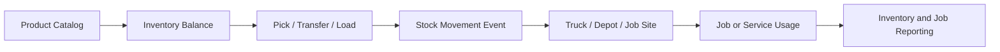
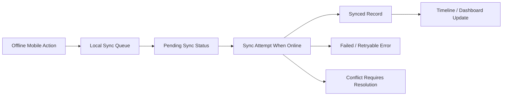
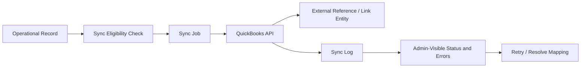

# 01_Product_Definition.md

## Document Metadata

| Field | Value |
| --- | --- |
| Document name | 01_Product_Definition.md |
| Phase number | Phase 01 |
| Phase name | Product Definition |
| Document type | Phase product definition and product foundation document |
| Version | 1.0 |
| Status | Draft |
| Owner | Product / Architecture / Documentation |
| Last updated | 2026-05-09 |
| Source documents | 00_Master_Platform_Documentation.md; 00_Global_Documentation_Rules.md; 00_Global_Domain_Model.md; 00_Global_Decisions_Register.md |
| Intended audience | Product owner, product architects, systems architects, design leads, engineering leads, QA leads, implementation leads, future AI phase writers, and delivery managers |

## 1. Phase Purpose

Phase 01 exists to define the official product foundation before technical architecture, detailed feature specifications, UI designs, APIs, permissions, integrations, or implementation plans are created. It anchors the full documentation set by defining what the platform is, who it serves, what problems it solves, what belongs in the MVP, what is intentionally excluded, and which product-level constraints future phase writers must respect.

This phase prevents future documents from drifting into conflicting assumptions about customers, personas, workflows, modules, MVP scope, operational boundaries, and product positioning. It is a product-definition document, not a low-level technical specification. Later phases must expand the details, but they must not contradict the product boundaries defined here.

## 2. Phase Goals

- Establish the official product definition for the multi-company SaaS platform.
- Align CRM, outbound sales, field operations, drilling operations, logistics, fleet, warehouse, service, reporting, and integrations under one unified platform model.
- Define MVP boundaries clearly enough to prevent overbuilding the first release.
- Define target customers, customer segments, user personas, and primary jobs to be done.
- Create product-level success metrics that can guide roadmap, implementation, and rollout decisions.
- Prevent future phase documents from introducing conflicting product assumptions, duplicate entities, or disconnected workflows.
- Identify product risks, open questions, recommended decisions, and dependencies carried into future phases.
- Define the product-level expectations for search, permissions, mobile/offline, integrations, data, reporting, and UX without over-specifying later implementation details.

## 3. Scope

### In Scope

- Product vision
- Product mission
- Customer segments
- Personas
- Use cases
- Module map
- MVP definition
- Business requirements
- Product principles
- High-level workflows
- Product risks
- Product success metrics
- Phase dependencies
- Open questions
- Recommended product decisions

### Out of Scope

Phase 01 does not define low-level implementation details. It sets product boundaries and shared product language so later phases can define technical, design, data, integration, and rollout specifics consistently.

## 4. Non-Goals

- No detailed database schema.
- No final API contract.
- No final UI screen-by-screen design.
- No low-level permission policy implementation.
- No QuickBooks sync implementation details.
- No dispatch optimization algorithm.
- No complete offline sync engine design.
- No production deployment plan.
- No detailed feature specs for all later phases.
- No final pricing, packaging, or commercial plan.
- No final customer onboarding or migration plan.
- No final QA test plan.

## 5. Product Vision

The product vision is to become the unified operating system for companies that sell, dispatch, track, deliver, service, and report on field work. The platform connects CRM and operations so management can see the full lifecycle from first contact to completed work, without forcing teams to jump between disconnected spreadsheets, CRM tools, dispatch boards, fleet trackers, warehouse records, service systems, and accounting sync logs.

The platform must support both sales-first companies, where outbound and pipeline activity create operational demand, and operations-first companies, where dispatch, field execution, inventory, vehicles, and service history are the daily center of work. The product should remain modular so each company can enable only the modules it needs, while still preserving shared records, activity history, permissions, reporting, search, auditability, and integration foundations.

## 6. Product Mission

The mission is to help operational companies manage customer relationships and field execution in one practical system. The platform should help companies manage accounts, leads, opportunities, outbound activity, tasks, appointments, site visits, crews, jobs, vehicles, drivers, depots, warehouses, inventory, service work, proof capture, QuickBooks sync, and performance reporting without losing the context between sales promises and operational delivery.

In practical terms, the platform must help teams:

- Manage accounts, contacts, leads, opportunities, pipelines, and outbound sales activity.
- Schedule tasks, reminders, appointments, visits, jobs, service work, and follow-ups.
- Coordinate field teams, dispatchers, drivers, technicians, warehouse operators, and managers.
- Dispatch jobs, vehicles, drivers, crews, routes, stops, and operational assignments.
- Track warehouse, depot, truck, and job-site inventory at a practical operational level.
- Monitor vehicles, drivers, tracking devices, geofences, check-ins, and location freshness.
- Capture proof, notes, photos, field updates, exceptions, check-ins, and check-outs.
- Sync relevant customers, items, invoices, or accounting references with QuickBooks where approved.
- Report on sales performance, field activity, dispatch status, inventory movement, fleet utilization, service health, integration health, and operational exceptions.

## 7. Product Positioning

| Positioning Area | Definition |
| --- | --- |
| Category | Modular multi-company SaaS CRM plus operations platform for field, dispatch, inventory, fleet, service, reporting, and accounting-connected workflows. |
| Primary value proposition | Give companies one operational source of truth from sales activity and customer commitments through dispatch, field execution, inventory usage, proof capture, service work, reporting, and QuickBooks sync visibility. |
| Secondary value proposition: sales | Improve outbound follow-up, pipeline visibility, activity logging, field sales coordination, and opportunity handoff to operations. |
| Secondary value proposition: operations | Improve scheduling, dispatch visibility, field accountability, inventory readiness, fleet tracking, and completion proof. |
| Secondary value proposition: management | Give managers role-aware dashboards, exception visibility, activity history, and operational health metrics across modules. |
| Different from generic CRM | A generic CRM usually stops at leads, accounts, opportunities, and activities. This platform continues into site work, dispatch, fleet, inventory, service execution, proof capture, and accounting sync visibility. |
| Different from pure field-service system | A pure field-service system usually starts when work is requested. This platform includes outbound sales, CRM history, opportunity context, customer relationship management, and pipeline-to-work handoff. |
| Different from fleet tracker | A fleet tracker shows vehicles and location. This platform connects vehicles and drivers to jobs, dispatch, stops, field proof, inventory movement, customer records, and reporting. |
| Why combining CRM and operations matters | Sales promises become operational commitments. If CRM and operations are disconnected, teams lose context, managers lose visibility, and customers experience delays or inconsistent follow-through. |

## 8. Target Customer Segments

| Segment | Description | Main Pain Points | Most Relevant Modules | MVP Relevance | Later-Phase Relevance |
| --- | --- | --- | --- | --- | --- |
| Drilling and field-service companies | Companies selling and executing drilling or specialized field jobs with crews, equipment, sites, and proof requirements. | Sales handoffs are informal; site details get lost; crew readiness is unclear; field proof is scattered. | CRM; Field Sales / Site Work; Drilling Operations; Dispatch; Fleet; Inventory; Reporting; QuickBooks. | High: likely first vertical focus and strong MVP validation fit. | Deep drilling workflows, specialized forms, crew/equipment planning, advanced reporting. |
| Logistics and delivery operations | Businesses coordinating orders, vehicles, drivers, depots, stops, and delivery confirmation. | Manual dispatch; low visibility into vehicles/stops; exceptions handled by phone; proof is inconsistent. | Orders / Dispatch / Logistics; Fleet; Inventory; Mobile; Reporting. | Medium: MVP should support basic dispatch visibility but not advanced optimization. | Route optimization, advanced proof of delivery, route replay, exception automation. |
| B2B sales teams with field activity | Sales organizations where reps visit customer sites, create opportunities, and coordinate operational follow-through. | CRM does not capture field proof; operations cannot see what sales promised; follow-up discipline is weak. | CRM; Outbound Sales; Calendar and Tasks; Field Sales / Site Work; Reporting. | High: core CRM/outbound/visit loop belongs in MVP. | Territory optimization, advanced cadences, AI coaching, deeper integrations. |
| Warehouse-backed operations | Companies whose sales, jobs, service, or delivery depend on stock in warehouses, depots, trucks, or job sites. | Stock uncertainty; transfers not auditable; dispatch promises without inventory readiness; spreadsheets dominate. | Inventory / Warehouse / Depots; Dispatch; Service; Reporting; QuickBooks. | High for inventory basics; complex WMS features excluded. | Barcode, serial/lot, advanced binning, wave picking, deeper cost accounting. |
| Multi-location service businesses | Businesses with branches, depots, technicians, service requests, work orders, and local inventory. | Branch visibility varies; work orders are separate from customer history; parts usage is not connected. | Service / Work Orders; Inventory; Fleet; Calendar; Reporting. | Medium: service may be MVP-light unless first customer requires it. | SLA automation, maintenance schedules, recurring work, technician optimization. |
| Companies needing CRM plus dispatch visibility | Organizations where customer commitments move from pipeline to scheduled operational execution. | Sales and operations operate from different truths; managers cannot see lead-to-completion status. | CRM; Opportunities; Jobs; Dispatch; Field; Reporting. | Very high: central product promise. | Advanced approvals, quote-to-job conversion, billing readiness automation. |
| Companies needing QuickBooks-connected operational workflows | SMBs using QuickBooks for accounting but needing operational systems for sales, jobs, inventory, and service. | Invoices/items/customers do not match operations; sync failures are hidden; finance lacks operational context. | Integrations; QuickBooks; CRM; Orders; Inventory; Reporting. | High: QuickBooks foundation should exist in MVP, but not full accounting replacement. | Advanced sync mapping, invoice flows, item/service mapping, reconciliation reports. |

## 9. Primary Personas

| Persona name | Role summary | Main goals | Daily workflows | Key records used | Key views needed | Mobile needs | Reporting needs | Permissions sensitivity | MVP relevance |
| --- | --- | --- | --- | --- | --- | --- | --- | --- | --- |
| Super Admin | Platform operator responsible for global tenant oversight and support boundaries. | Protect platform health; configure tenants; troubleshoot without violating isolation. | Tenant setup, support escalation, feature flag review, platform health checks. | Tenant, Company, User, UserMembership, Role, AuditLog, IntegrationConnection. | Tenant console, company switcher, audit search, system health, integration health. | Low for daily work; may need responsive admin access. | Tenant adoption, incidents, sync failures, support workload. | Very high; can cross tenant boundaries only through controlled support workflows. | Later for full platform operations; referenced in MVP for tenant setup. |
| Company Admin | Customer-side administrator managing users, modules, settings, and access. | Configure company; manage users; enable modules; monitor data quality. | Invite users, assign roles, configure branches, review sync errors, manage settings. | Company, Branch, Team, UserMembership, Role, Permission, CustomFieldDefinition, IntegrationConnection. | Admin settings, user list, roles, module enablement, imports, audit log. | Medium; approve urgent user or setting changes on mobile when needed. | User adoption, permission changes, import status, integration health. | Very high; controls access and company configuration. | MVP. |
| Sales Manager | Leader responsible for pipeline, outbound discipline, rep performance, and conversion. | Drive follow-up, pipeline quality, territory coverage, and revenue conversion. | Review pipeline, assign leads, inspect activity, coach reps, review site visit outcomes. | Lead, Account, Contact, Opportunity, Activity, Task, Campaign, SiteVisit. | Pipeline kanban, rep dashboards, activity timeline, territory/map views. | Medium; approve or review field sales activity from mobile. | Pipeline velocity, activities, conversion, meetings booked, opportunities created. | High; sees team records and performance data. | MVP. |
| Sales Rep | Individual contributor managing leads, accounts, outreach, tasks, meetings, and opportunities. | Prioritize outreach; log activities; create opportunities; maintain next steps. | Call, email, SMS, LinkedIn log, update leads, schedule tasks, create opportunities. | Lead, Account, Contact, Opportunity, Activity, Task, Note. | Lead list, account detail, activity composer, task queue, pipeline. | High; log calls/notes after meetings and field visits. | Personal activity, overdue tasks, pipeline, win/loss. | Medium; must not see restricted company/team records. | MVP. |
| Field Manager | Manager coordinating field teams, site visits, crews, field proof, and work readiness. | Ensure site work is assigned, visible, safe, and completed with proof. | Review site visits, assign crews, monitor check-ins, validate completion notes and photos. | Site, SiteVisit, CheckIn, FieldNote, Job, CrewAssignment, FileAttachment. | Field schedule, map, visit detail, job readiness, proof review. | High; field exceptions and reviews may happen away from desk. | Visit completion, missed check-ins, job readiness, crew utilization. | High; field status and location visibility require controlled access. | MVP. |
| Field Sales Rep | Sales user who performs site visits and captures site-level customer context. | Turn field conversations into documented opportunities and job requests. | View assigned visits, check in/out, capture notes/photos, request follow-up or job. | Account, Contact, Site, SiteVisit, CheckIn, FieldNote, Opportunity, JobRequest. | Today route, visit detail, check-in screen, photo capture, notes. | Very high; mobile-first execution role. | Visits completed, check-ins, follow-ups created, opportunities influenced. | Medium; location and customer data sensitivity. | MVP. |
| Dispatcher | Operations user assigning jobs, drivers, vehicles, routes, stops, and exceptions. | Convert job demand into executable schedules and monitor delivery progress. | Build dispatch board, assign vehicles/drivers, monitor late jobs, handle exceptions. | Job, Order, Shipment, RoutePlan, Stop, Vehicle, Driver, LocationPing, GeofenceEvent. | Dispatch board, route timeline, map, unassigned work queue, exception inbox. | Medium; desktop-first, mobile for urgent updates. | On-time dispatch, exceptions, route progress, completion proof. | High; broad operational visibility and assignment authority. | MVP for basic dispatch visibility; later for advanced logistics. |
| Driver | Mobile execution user moving between stops, jobs, depots, and customer sites. | Know assigned work; report arrival/departure; capture proof; work offline if needed. | View route/stops, check in/out, update status, upload photos/signatures, report exceptions. | RoutePlan, Stop, Job, Vehicle, CheckIn, ProofOfDelivery, FieldNote, LocationPing. | Assigned work list, stop detail, check-in/out, proof capture, exception report. | Very high; mobile-first and offline-critical. | Stops completed, exceptions, location freshness, proof captured. | Medium; sees only assigned work and necessary customer/site details. | MVP for check-ins and basic tracking; later for full route workflows. |
| Warehouse Manager | Manager responsible for warehouses, depots, stock accuracy, transfers, and inventory exceptions. | Maintain inventory accuracy and ensure field/dispatch readiness. | Review balances, approve adjustments, manage transfers, monitor low stock, reconcile discrepancies. | Product, Warehouse, Depot, BinLocation, InventoryBalance, StockMovement, InventoryTransfer, PickTicket. | Inventory dashboard, product detail, movement history, transfer queue, low-stock views. | Medium; approval and exception review may be mobile-supported. | Stock accuracy, low-stock risk, transfer completion, adjustment volume. | High; inventory adjustments and cost-impacting actions require controls. | MVP for basics; later for barcode/serial/lot. |
| Warehouse Operator | Execution user receiving, picking, loading, transferring, and adjusting stock. | Move inventory accurately with clear audit trail and minimal friction. | Receive stock, pick for jobs, transfer between locations, record adjustments with reason. | Product, Warehouse, Depot, InventoryBalance, StockMovement, PickTicket, InventoryTransfer. | Pick list, receiving screen, product lookup, transfer screen, movement confirmation. | High when working on warehouse floor or depot. | Picks completed, errors, discrepancies, transfers. | Medium; limited adjustment rights by role. | MVP for simple stock movements. |
| Service Manager | Leader managing service requests, work orders, technicians, parts, and completion quality. | Prioritize service work, assign technicians, track parts/labor, validate closure. | Review service requests, create work orders, assign techs, monitor SLA and completion. | ServiceRequest, WorkOrder, WorkOrderTask, Product, StockMovement, Account, Site. | Service board, work order list, SLA view, technician schedule, parts usage. | Medium; urgent field service exceptions. | Open work orders, SLA compliance, first-time fix, parts usage. | High; service records can affect billing and customer history. | Later/MVP-light if service is early customer-critical. |
| Service Technician | Mobile field user completing work orders, tasks, parts usage, notes, and proof. | Complete assigned work correctly and document proof even offline. | View assigned work order, perform checklist, add parts/labor, photos, notes, completion status. | WorkOrder, WorkOrderTask, Product, StockMovement, FileAttachment, CheckIn, FieldNote. | My work, work order detail, checklist, parts used, notes/photos, sync status. | Very high; mobile-first and offline-critical. | Completion rate, rework, parts used, notes/photos captured. | Medium; only assigned work and approved parts actions. | Later unless service is part of first MVP customer. |
| Analyst / Reporting User | User focused on cross-module dashboards, operational metrics, trends, and exports. | Turn platform activity into trustworthy operational insight. | Build/review dashboards, export reports, inspect exceptions, compare teams and periods. | ReportDefinition, Dashboard, MetricSnapshot, Activity, Job, StockMovement, SyncJob, AuditLog. | Role dashboards, report lists, filters, export screens, exception reports. | Low; mostly desktop. | Dashboard usage, report freshness, exceptions, adoption metrics. | High for sensitive financial, location, and user performance data. | MVP for basic dashboards; later for custom builder. |
| Read-Only Viewer | Stakeholder who needs visibility without edit authority. | Monitor status and results without changing operational data. | View dashboards, records, timelines, and status where permitted. | Account, Opportunity, Job, WorkOrder, Shipment, Dashboard, Report. | Filtered dashboards, record details, timeline, map/list views. | Low to medium. | View adoption, shared dashboards. | Medium; must not export or see restricted data unless allowed. | MVP for management visibility. |

## 10. Persona-to-Module Matrix

Values: `Primary`, `Secondary`, `View-only`, `Not typical`.

| Persona | Core Platform | CRM | Outbound Sales | Calendar and Tasks | Field Sales / Site Work | Drilling Operations | Inventory / Warehouse / Depots | Orders / Dispatch / Logistics | Fleet / Device Tracking | Service / Work Orders | Reporting / Dashboards | Integrations | Offline Mobile |
| --- | --- | --- | --- | --- | --- | --- | --- | --- | --- | --- | --- | --- | --- |
| Super Admin | Primary | View-only | View-only | View-only | View-only | View-only | View-only | View-only | View-only | View-only | Primary | Primary | View-only |
| Company Admin | Primary | Secondary | Secondary | Secondary | Secondary | Secondary | Secondary | Secondary | Secondary | Secondary | Primary | Primary | Secondary |
| Sales Manager | Secondary | Primary | Primary | Primary | Secondary | View-only | View-only | View-only | View-only | View-only | Primary | Secondary | Secondary |
| Sales Rep | Secondary | Primary | Primary | Primary | Secondary | Not typical | Not typical | Not typical | Not typical | Not typical | Secondary | Secondary | Secondary |
| Field Manager | Secondary | Secondary | View-only | Primary | Primary | Primary | Secondary | Primary | Primary | Secondary | Primary | View-only | Primary |
| Field Sales Rep | Secondary | Primary | Secondary | Primary | Primary | Secondary | Not typical | Secondary | Secondary | Not typical | Secondary | View-only | Primary |
| Dispatcher | Secondary | View-only | Not typical | Secondary | Secondary | Secondary | Secondary | Primary | Primary | Secondary | Primary | View-only | Secondary |
| Driver | View-only | Not typical | Not typical | Secondary | Secondary | Secondary | Secondary | Primary | Primary | Not typical | View-only | Not typical | Primary |
| Warehouse Manager | Secondary | View-only | Not typical | Secondary | View-only | Secondary | Primary | Secondary | Secondary | Secondary | Primary | Secondary | Secondary |
| Warehouse Operator | Secondary | Not typical | Not typical | View-only | Not typical | Not typical | Primary | Secondary | Not typical | View-only | View-only | Not typical | Secondary |
| Service Manager | Secondary | Secondary | Not typical | Primary | Secondary | Secondary | Secondary | Secondary | Secondary | Primary | Primary | Secondary | Primary |
| Service Technician | Secondary | View-only | Not typical | Secondary | Secondary | Secondary | Secondary | Secondary | Secondary | Primary | View-only | Not typical | Primary |
| Analyst / Reporting User | Secondary | View-only | View-only | View-only | View-only | View-only | View-only | View-only | View-only | View-only | Primary | View-only | View-only |
| Read-Only Viewer | View-only | View-only | View-only | View-only | View-only | View-only | View-only | View-only | View-only | View-only | View-only | View-only | View-only |

## 11. Core Product Problems

| Problem | Who feels it | Business impact | Platform response | Relevant phase or module |
| --- | --- | --- | --- | --- |
| CRM disconnected from field execution | Sales managers, field managers, dispatchers, executives. | Customer promises are lost, follow-up is delayed, and accountability is weak. | Shared activity history, site visits, job requests, and CRM-to-operations workflows. | CRM, Field Sales / Site Work, Dispatch, Reporting. |
| Sales promises not visible to operations | Dispatchers, field managers, warehouse teams, service managers. | Jobs are scheduled without accurate scope, site constraints, or customer context. | Opportunity-to-site visit and job request handoff with timeline visibility. | CRM, Calendar, Field, Dispatch. |
| Poor visibility into trucks, drivers, crews, and jobs | Dispatchers, managers, customers indirectly. | Delays are discovered late; exceptions require phone calls; planning is reactive. | Dispatch board, fleet tracking, status updates, geofences, check-ins. | Dispatch, Fleet, Mobile, Reporting. |
| Manual dispatch and follow-up coordination | Dispatchers, field managers, drivers, sales reps. | Time wasted assigning work, chasing updates, and rekeying statuses. | Job queues, assignment workflows, tasks, route/stop basics, exceptions. | Calendar, Dispatch, Fleet, Field. |
| Inventory uncertainty across warehouses and depots | Warehouse managers, dispatchers, service managers, finance. | Orders/jobs are promised without stock confidence; discrepancies are hard to explain. | Products, warehouses, depots, balances, stock movements, transfers, adjustments. | Inventory, Dispatch, Service, Reporting. |
| Weak accountability for check-ins, status updates, and work completion | Field managers, customers, executives. | Completion proof is scattered and disputes are difficult to resolve. | Mobile check-ins, check-outs, notes, photos, proof, activity timelines, audit logs. | Field, Dispatch, Service, Mobile, Audit. |
| Reporting scattered across tools | Executives, analysts, managers. | Managers cannot trust metrics or compare sales, field, inventory, and service health. | Role-aware dashboards, rollups, metric snapshots, exports, shared filters. | Reporting, All modules. |
| QuickBooks disconnected from operational records | Company admins, finance/admins, managers. | Billing readiness is unclear; sync failures are hidden; external IDs drift. | QuickBooks sync foundation, external references, sync logs, admin-visible errors. | Integrations, CRM, Inventory, Orders, Reporting. |
| Poor offline support for field users | Drivers, field sales reps, technicians. | Critical notes/photos/check-ins are lost or delayed in poor connectivity. | Offline queue, sync status, local capture, explicit conflict handling. | Offline Mobile, Field, Dispatch, Service. |

## 12. Product Principles

| Principle | Rule |
| --- | --- |
| Multi-tenant by design | Every business record must be designed for tenant isolation and company scoping where applicable. |
| Company-scoped access by default | Users should only see records for companies they are authorized to access unless explicitly granted broader access. |
| Modular but unified platform | Modules can be enabled independently, but shared foundations, timelines, audit, search, and reporting must remain consistent. |
| CRM and operations share the same activity history | Important interactions and operational events should be visible in the relevant record timelines when permissions allow. |
| Desktop-first for operators and managers | Complex planning, dispatch, admin, reporting, and list management should prioritize desktop usability. |
| Mobile-first for field execution moments | Check-ins, notes, photos, task updates, proof capture, and field status updates must be fast on mobile. |
| Offline-friendly where field reliability matters | Critical field actions must not fail silently when connectivity is weak. |
| Real-time where operationally valuable | Live maps, dispatch status, urgent exceptions, and sync status should update quickly when value justifies cost. |
| Eventually consistent where safer and cheaper | Reports, rollups, exports, imports, and sync jobs may use asynchronous processing with visible status. |
| Reporting designed from day one | Important states, timestamps, owners, assignments, and events must be reportable from the start. |
| Auditability for operationally important actions | Permissions, status changes, assignments, inventory movements, sync events, and sensitive exports must be traceable. |
| Integration failures must be visible | Sync failures, skipped records, retry attempts, and mapping problems must be visible to admins. |
| No silent data loss | Offline capture, imports, sync jobs, and file uploads must preserve user work or show recoverable errors. |
| No duplicate entity concepts | Future phases must reuse canonical entities from the global domain model instead of inventing synonyms. |

## 13. Product Modules Overview

| Module | Purpose | Primary users | Core capabilities | MVP scope | Later-phase scope | Dependencies | Related entities |
| --- | --- | --- | --- | --- | --- | --- | --- |
| Core Platform | Shared tenant, company, user, role, module, audit, file, import/export, custom field, search, and settings foundation. | Super Admin; Company Admin; all module users. | Tenants/companies, users, roles, feature flags, audit logs, files, tags, custom fields, import/export foundation, global search. | Authentication foundation, company roles, module enablement, audit baseline, files, imports, basic settings. | Advanced admin, enterprise controls, data retention, deeper custom fields, support tooling. | None; foundation for all modules. | Tenant, Company, Branch, User, UserMembership, Role, Permission, AuditLog, FileAttachment, Tag, CustomFieldDefinition. |
| CRM | Manage business relationships, leads, accounts, contacts, opportunities, ownership, activity history, and pipeline. | Sales Manager; Sales Rep; Field Sales Rep; Company Admin. | Accounts, contacts, leads, opportunities, pipelines, activities, notes, ownership, duplicate awareness, timelines. | Core records, pipeline basics, activity timeline, ownership, tasks, basic imports. | Advanced duplicate merging, territory automation, enrichment, scoring. | Core Platform; Calendar and Tasks; Reporting; Integrations. | Account, Contact, Lead, Opportunity, Pipeline, PipelineStage, Activity, Note, Task. |
| Outbound Sales | Support structured outreach, campaign/cadence discipline, channel logging, and sales productivity. | Sales Manager; Sales Rep; Field Sales Rep. | Prospect lists, campaigns, sequences, call/email/SMS/WhatsApp/LinkedIn logs, follow-up queues. | Activity logging, manual sequences/tasks, basic campaign lists and performance. | Automated sending, advanced cadence branching, compliance controls, AI suggestions. | CRM; Calendar and Tasks; Integrations; Reporting. | Campaign, ProspectList, Sequence, SequenceStep, Activity, Task, CommunicationLog. |
| Calendar and Tasks | Coordinate appointments, tasks, reminders, visits, follow-ups, SLA dates, and assignments. | Sales Rep; Field Manager; Dispatcher; Service Manager. | Tasks, appointments, recurring tasks later, reminders, due dates, team calendars, activity linkage. | Basic tasks, appointments, reminders, assignments, calendar views. | Advanced recurrence, SLA automation, shared calendars, resource scheduling. | Core Platform; CRM; Field; Service; Dispatch. | Task, Appointment, Reminder, Activity. |
| Field Sales / Site Work | Capture site-level customer interactions, visits, check-ins, photos, notes, job requests, and proof. | Field Sales Rep; Field Manager; Sales Manager. | Sites, site visits, check-in/out, notes, photos, job request handoff, territory coverage. | Basic site visits, check-ins, notes, photos, job requests. | Advanced site forms, safety/hazard checklists, territory optimization. | CRM; Calendar and Tasks; Mobile; Fleet; Reporting. | Site, SiteVisit, CheckIn, FieldNote, FileAttachment, JobRequest. |
| Drilling Operations | Represent drilling-specific job execution as a specialization of field operations. | Field Manager; Dispatcher; Drilling crew roles; Company Admin. | Drilling job attributes, crew/equipment context, site constraints, drilling-specific statuses. | Keep extension points; capture basic drilling job request context if needed. | Detailed drilling job workflow, equipment planning, production metrics, specialized forms. | Field Sales / Site Work; Dispatch; Fleet; Inventory. | Job, DrillingJob, Site, CrewAssignment, EquipmentAssignment. |
| Inventory / Warehouse / Depots | Manage products, stock balances, movements, warehouses, depots, receiving, transfers, picking, and adjustments. | Warehouse Manager; Warehouse Operator; Dispatcher; Service Manager. | Products, warehouses, depots, stock movements, balances, transfers, receiving, picking, adjustments, low stock. | Products, warehouse/depot basics, stock movement history, simple balances, receiving/transfer/adjustment basics. | Barcode, bin optimization, serial/lot, advanced replenishment, cost layers. | Core Platform; Dispatch; Service; QuickBooks; Reporting. | Product, Warehouse, Depot, BinLocation, InventoryBalance, StockMovement, InventoryTransfer, PickTicket. |
| Orders / Dispatch / Logistics | Coordinate operational jobs, orders, routes, stops, vehicles, drivers, proof, and exceptions. | Dispatcher; Field Manager; Driver; Warehouse Manager. | Job/order queue, dispatch board, assignments, route/stops, exception tracking, completion proof. | Basic job/dispatch assignment, status visibility, vehicle/driver assignment, simple stops. | Route optimization, advanced route plans, proof workflows, customer notifications. | CRM/Opportunity; Inventory; Fleet; Mobile; Reporting. | Job, Order, Shipment, RoutePlan, Stop, ProofOfDelivery, Exception. |
| Fleet / Device Tracking | Track vehicles, drivers, devices, location pings, geofences, freshness, and route history. | Dispatcher; Field Manager; Driver; Analyst. | Vehicles, driver links, devices, pings, live map, geofences, geofence events, route replay later. | Basic vehicles, drivers, device/tracking foundation, pings, geofences, current location visibility. | Route replay, advanced alerts, device health, maintenance integrations. | Core Platform; Dispatch; Mobile; Reporting. | Vehicle, Driver, TrackingDevice, LocationPing, Geofence, GeofenceEvent. |
| Service / Work Orders | Manage service requests, work orders, technicians, checklists, parts, labor, and service history. | Service Manager; Service Technician; Warehouse Manager. | Service requests, work orders, tasks/checklists, parts used, labor notes, completion proof. | Optional MVP-light work order basics if required by first customer. | Maintenance schedules, SLA automation, recurring work, customer sign-off. | CRM; Inventory; Calendar; Mobile; Reporting. | ServiceRequest, WorkOrder, WorkOrderTask, PartUsage, FieldNote. |
| Reporting and Dashboards | Provide role-aware operational, sales, inventory, fleet, dispatch, service, and integration insight. | Analyst; Managers; Company Admin; Read-Only Viewer. | Dashboards, saved reports later, exports, filters, snapshots, rollups, exception metrics. | Basic dashboards for sales, field, dispatch, inventory, integration health, offline sync. | Custom report builder, scheduled reports, deeper analytics. | All modules; Core Platform; Data rollups. | Dashboard, ReportDefinition, MetricSnapshot, ExportJob. |
| Integrations | Connect external systems such as QuickBooks, email/SMS/WhatsApp logs, REST API, webhooks, CSV/Excel import/export. | Company Admin; Analyst; Sales Manager; Finance/Admin. | Integration connections, sync jobs, external refs, errors, retries, webhook/API foundation, imports/exports. | QuickBooks sync foundation, CSV/Excel import/export basics, sync logs, admin-visible errors. | Integration marketplace, advanced mapping, two-way sync extensions. | Core Platform; CRM; Inventory; Orders; Reporting. | IntegrationConnection, SyncJob, SyncLog, ExternalReference, QuickBooksCustomerLink, QuickBooksItemLink, QuickBooksInvoiceLink. |
| Notifications and Automation | Notify users about important events and automate safe workflow reminders. | All operational users; Company Admin. | In-app notifications, preferences, reminders, alerts, automation rules later. | Basic reminders and exception notifications where critical. | Advanced workflow rules, scheduled automations, escalation chains. | Core Platform; Calendar; Dispatch; Integrations; Mobile. | Notification, NotificationPreference, AutomationRule, Reminder. |
| Search, Filters, and Custom Views | Provide permission-aware discovery and reusable operational views across modules. | All desktop users; managers; analysts. | Global search, module search, saved filters, saved views, table/kanban/calendar/map views. | Global search foundation, module list search, core filters and saved views. | Advanced view builder, personal/team/shared views, custom field filters. | Core Platform; all modules. | SavedView, FilterDefinition, SearchIndexRecord. |
| Offline Mobile and Sync | Allow critical field execution actions to be captured in weak connectivity and synced safely later. | Driver; Field Sales Rep; Service Technician; Field Manager. | Offline queue, local records, sync status, conflict handling, notes/photos/tasks/check-ins. | Offline capture for assigned tasks, visits, check-ins, notes, photos, task updates. | Broader offline parity, complex conflict resolution, background sync optimization. | Mobile; Core Platform; Field; Dispatch; Service; Inventory. | OfflineAction, SyncJob, SyncLog, CheckIn, FieldNote, FileAttachment, Task. |
| Admin, Security, and Audit | Control access, permissions, company settings, audit history, and secure operations. | Super Admin; Company Admin; Security/Admin roles. | Roles, permissions, audit logs, exports, API keys, access review, security settings. | Company roles, permission foundation, audit of important changes. | Cerbos/policy engine, record-level rules, access review, retention policies. | Core Platform; all modules. | Role, Permission, UserMembership, AuditLog, ApiKey, AccessPolicy. |

## 14. Product Capability Map

| Domain | Capability name | Description | Primary module | Key personas | MVP / Later / Future | Dependencies |
| --- | --- | --- | --- | --- | --- | --- |
| Sales | Lead and account management | Manage leads, accounts, contacts, ownership, qualification, and relationship context. | CRM | Sales Manager; Sales Rep | MVP | Core Platform; permissions; imports. |
| Sales | Opportunity pipeline | Track stages, value, probability, close dates, next action, and owner. | CRM | Sales Manager; Sales Rep | MVP | CRM records; reporting. |
| Sales | Outbound activity discipline | Log calls, emails, SMS, WhatsApp, LinkedIn activity, outcomes, and next steps. | Outbound Sales | Sales Manager; Sales Rep | MVP | CRM; Calendar and Tasks; integrations later. |
| Sales | Campaign and sequence basics | Organize prospect lists and manual cadence steps. | Outbound Sales | Sales Manager; Sales Rep | MVP | CRM; imports; tasks. |
| Field Operations | Site visits | Schedule, execute, and document site visits. | Field Sales / Site Work | Field Sales Rep; Field Manager | MVP | CRM; Calendar; Mobile. |
| Field Operations | Check-ins and check-outs | Capture arrival/departure, time, location, and context. | Field Sales / Site Work | Field Sales Rep; Driver; Technician | MVP | Mobile; geofences; audit. |
| Field Operations | Field notes and photos | Capture notes, files, photos, and follow-up context. | Field Sales / Site Work | Field Sales Rep; Technician | MVP | Files; Offline Mobile. |
| Drilling Operations | Drilling job specialization | Represent drilling-specific operational needs as an extension of field jobs. | Drilling Operations | Field Manager; Dispatcher | Later | Field work; dispatch; custom fields. |
| Logistics | Dispatch board | Assign work, drivers, vehicles, and monitor status. | Orders / Dispatch / Logistics | Dispatcher; Field Manager | MVP | Jobs; Fleet; Mobile. |
| Logistics | Routes and stops | Plan ordered stops and track progress. | Orders / Dispatch / Logistics | Dispatcher; Driver | Later | Dispatch; maps; fleet. |
| Inventory | Product catalog | Maintain SKU, product status, unit, category, and accounting reference. | Inventory / Warehouse / Depots | Warehouse Manager | MVP | Company settings; QuickBooks item links later. |
| Inventory | Stock movements | Record receiving, transfers, adjustments, picking, and usage as auditable events. | Inventory / Warehouse / Depots | Warehouse Operator; Warehouse Manager | MVP | Products; locations; audit. |
| Fleet | Vehicle registry | Maintain vehicles, status, assigned driver, depot, and capacity context. | Fleet / Device Tracking | Dispatcher; Field Manager | MVP | Company; depots; users. |
| Fleet | Device and location tracking | Ingest current location and show freshness/status. | Fleet / Device Tracking | Dispatcher; Analyst | MVP | Devices; mobile; real-time later. |
| Fleet | Geofences | Define basic operational boundaries and capture entry/exit events. | Fleet / Device Tracking | Dispatcher; Field Manager | MVP | Sites; locations; mobile/device data. |
| Service | Service request intake | Capture customer/site issue, priority, source, and desired timing. | Service / Work Orders | Service Manager | Later | CRM; sites; tasks. |
| Service | Work order execution | Assign technicians, tasks, parts, labor, notes, and completion proof. | Service / Work Orders | Service Manager; Service Technician | Later | Inventory; Mobile; Calendar. |
| Reporting | Role dashboards | Show module-aware, permission-aware operational metrics. | Reporting / Dashboards | Managers; Analyst | MVP | Rollups; all modules. |
| Reporting | Operational exception visibility | Surface overdue, failed, delayed, low stock, sync failed, and offline pending states. | Reporting / Dashboards | Managers; Company Admin | MVP | Status fields; sync logs; activity events. |
| Integrations | QuickBooks sync foundation | Connect operational records to accounting references with logs and visible errors. | Integrations | Company Admin; Finance/Admin | MVP | External refs; sync jobs; CRM/inventory/orders. |
| Integrations | CSV/Excel import/export | Support migration, bulk load, and report extraction with row-level errors. | Integrations | Company Admin; Analyst | MVP | Import/export jobs; permissions. |
| Administration | Roles and module enablement | Control user access and enabled modules by company. | Core Platform | Company Admin | MVP | Tenant/company/user foundations. |
| Mobile / Offline | Offline field capture | Queue check-ins, notes, photos, tasks, and critical updates for later sync. | Offline Mobile | Driver; Field Sales Rep; Technician | MVP | Mobile UX; sync logs; conflict handling. |

## 15. MVP Definition

The recommended MVP focuses on visibility, execution, accountability, and foundational integrations before advanced optimization. It should prove that CRM, outbound activity, field execution, dispatch visibility, inventory basics, fleet location, QuickBooks sync status, reporting, and offline capture can operate as one connected platform.

| MVP item | Description | Why it belongs in MVP | Required entities | Required personas | Required modules | Exclusions | Success criteria |
| --- | --- | --- | --- | --- | --- | --- | --- |
| Multi-company authentication foundation | Users can authenticate and operate within authorized tenant/company context. | Required before any company-scoped workflow can safely exist. | Tenant, Company, User, UserMembership, Role. | Super Admin; Company Admin; all users. | Core Platform. | Enterprise SSO, complex record-level access. | Users can sign in, access only authorized companies, and switch context only when permitted. |
| Company-level roles and permissions | Company admins can assign roles and module access at a practical baseline. | Prevents uncontrolled data exposure and supports modular rollout. | Role, Permission, UserMembership, AuditLog. | Company Admin; Super Admin. | Core Platform; Admin/Security. | Full policy-as-code matrix, universal record-level permissions. | Role changes are auditable and users see only permitted modules/actions. |
| Core CRM records | Manage accounts, contacts, leads, opportunities, ownership, and pipeline basics. | CRM is the front door for sales and customer context. | Account, Contact, Lead, Opportunity, Pipeline, PipelineStage. | Sales Manager; Sales Rep. | CRM. | Advanced enrichment, duplicate merge automation, scoring. | Users can create, search, filter, update, and report on core CRM records. |
| Outbound activity logging | Log calls, emails, SMS, WhatsApp, LinkedIn activity, notes, outcomes, and next steps. | Outbound discipline creates measurable pipeline and history. | Activity, CommunicationLog, Task, Campaign. | Sales Manager; Sales Rep. | Outbound Sales; CRM. | Native LinkedIn automation, full marketing automation. | Activities appear on relevant timelines and support basic rep performance metrics. |
| Calendar and tasks | Schedule follow-ups, site visits, appointments, assigned work, and reminders. | The platform needs a shared next-action system. | Task, Appointment, Reminder, Activity. | Sales Rep; Field Manager; Dispatcher; Service Manager. | Calendar and Tasks. | Advanced recurrence, resource optimization. | Users can create, assign, complete, and filter tasks/appointments. |
| Basic site visits | Schedule and record site visits linked to accounts, contacts, sites, and opportunities. | Connects field sales to operational readiness. | Site, SiteVisit, Account, Contact, Opportunity, Task. | Field Sales Rep; Field Manager; Sales Manager. | Field Sales / Site Work. | Detailed drilling forms, advanced territory optimization. | Visits can be scheduled, completed, and reviewed with notes and outcomes. |
| Check-ins and check-outs | Capture mobile arrival/departure status with timestamp and location when permitted. | Creates operational accountability and proof of presence. | CheckIn, SiteVisit, Job, LocationPing, GeofenceEvent. | Field Sales Rep; Driver; Technician. | Field; Fleet; Mobile. | Advanced dwell rules and complex geofence automation. | Check-ins work online and offline, show sync status, and appear on timelines. |
| Basic vehicle and worker tracking | Maintain vehicles, drivers/workers, assignment context, and current location visibility. | Dispatch and field managers need basic operational awareness. | Vehicle, Driver, User, LocationPing, TrackingDevice. | Dispatcher; Field Manager; Driver. | Fleet; Dispatch. | Advanced telemetry, ELD compliance, predictive maintenance. | Managers can see assigned vehicles/workers and last known location/status. |
| Basic geofences | Create radius-based geofences for sites, depots, or operational boundaries. | Geofences support check-in validation and exception visibility. | Geofence, GeofenceEvent, Site, Depot. | Dispatcher; Field Manager. | Fleet; Field; Dispatch. | Polygon geofences, advanced automation. | Entry/exit events are captured where data is available and shown as operational events. |
| Inventory and warehouse basics | Manage products, warehouses, depots, balances, and stock movements. | Inventory uncertainty is a core operational pain. | Product, Warehouse, Depot, InventoryBalance, StockMovement, InventoryTransfer. | Warehouse Manager; Warehouse Operator; Dispatcher. | Inventory / Warehouse / Depots. | Barcode, serial/lot, wave picking, advanced costing. | Stock movements are auditable and balances are visible by location. |
| QuickBooks sync foundation | Create first-class integration connection, external references, sync jobs, logs, and visible errors. | Finance alignment is a major product promise and must not be bolted on later. | IntegrationConnection, SyncJob, SyncLog, ExternalReference, QuickBooksCustomerLink, QuickBooksItemLink, QuickBooksInvoiceLink. | Company Admin; Finance/Admin; Analyst. | Integrations. | Full accounting replacement, complex invoicing automation. | Admins can connect, monitor sync status, see failures, and retry supported sync jobs. |
| Basic dashboards | Provide role-aware dashboards for sales, field, dispatch, inventory, fleet, integration, and offline health. | Adoption depends on management visibility. | Dashboard, MetricSnapshot, ReportDefinition. | Managers; Analyst; Company Admin. | Reporting / Dashboards. | Custom report builder, scheduled emailed reports. | Dashboards show fresh, permission-aware MVP metrics with clear empty/error states. |
| Mobile offline capture | Allow check-ins, notes, photos, and task updates to be captured offline and synced later. | Field reliability is a core trust requirement. | OfflineAction, SyncJob, SyncLog, CheckIn, FieldNote, FileAttachment, Task. | Driver; Field Sales Rep; Technician. | Offline Mobile. | Full offline parity, complex offline editing of all records. | Users can see pending, synced, failed, and conflict states for offline actions. |

## 16. MVP Exclusions

The following items are excluded from MVP unless explicitly reprioritized by an accepted decision or first-customer requirement:

- Advanced route optimization.
- Full offline app parity.
- Barcode scanning unless confirmed.
- Serial/lot inventory unless confirmed.
- Complex branch/depot hierarchy permissions unless confirmed.
- Advanced quote/pricing engine unless confirmed.
- Full marketing automation.
- Native LinkedIn automation.
- Advanced AI recommendations.
- Custom report builder if too large for MVP.
- Full accounting system replacement.
- Payroll.
- HR management.
- Complex ERP functionality.
- Advanced warehouse robotics, conveyor integration, or WMS-grade wave planning.
- Native ELD compliance unless explicitly required.
- Enterprise SSO unless required by an early customer.
- Customer-facing portal unless added by later phase decision.

## 17. Product Boundary Rules

- The platform is a CRM plus operations platform.
- The platform is not a full ERP replacement in the first version.
- The platform is not an accounting system replacement.
- The platform is not a payroll system.
- The platform is not a generic marketing automation suite.
- The platform is not only a fleet tracker.
- The platform is not only a field service app.
- The platform is not only a warehouse management system.
- The platform must connect these workflows without overbuilding every category from day one.
- The platform should prioritize operational visibility, execution accountability, auditability, and reliable capture over advanced automation in the first release.

## 18. High-Level User Journeys

| Journey | Trigger | Primary persona | Supporting personas | Steps | Key records | Required modules | Success outcome | Failure / exception points |
| --- | --- | --- | --- | --- | --- | --- | --- | --- |
| Outbound sales to opportunity | Imported lead, manual prospecting list, referral, inbound interest, or manager assignment. | Sales Rep | Sales Manager | 1. Rep reviews lead/account context. 2. Rep logs outbound activity. 3. Rep qualifies interest. 4. Rep creates or updates opportunity. 5. Follow-up task is scheduled. | Lead, Account, Contact, Activity, Opportunity, Task. | CRM; Outbound Sales; Calendar and Tasks; Reporting. | Qualified opportunity exists with clear owner, stage, next action, and activity history. | Duplicate lead/account; missing contact data; no response; invalid channel; permission restriction. |
| Opportunity to site visit | Opportunity requires field validation, customer visit, or site assessment. | Sales Rep | Sales Manager; Field Sales Rep; Field Manager | 1. Rep requests/schedules site visit. 2. Visit is assigned. 3. Visit appears on calendar/mobile. 4. Field user captures outcome. 5. Opportunity is updated with field context. | Opportunity, Account, Contact, Site, SiteVisit, Task, FieldNote. | CRM; Calendar; Field Sales / Site Work; Mobile. | Opportunity has verified site context and next operational step. | Customer unavailable; address unclear; field user offline; missing site permissions. |
| Site visit to job request | Site visit identifies operational work to be scheduled. | Field Sales Rep | Field Manager; Dispatcher; Sales Manager | 1. Field user completes visit. 2. Captures notes/photos/constraints. 3. Creates job request. 4. Manager reviews readiness. 5. Dispatcher sees approved demand. | SiteVisit, FieldNote, FileAttachment, JobRequest, Job, Account, Site. | Field; CRM; Dispatch; Reporting. | Job request contains enough scope, site, timing, and proof to plan work. | Incomplete scope; missing photos; unclear equipment needs; approval required. |
| Job request to dispatch | Approved job request or order is ready for scheduling. | Dispatcher | Field Manager; Warehouse Manager; Driver | 1. Dispatcher reviews unassigned work. 2. Confirms inventory/resource readiness. 3. Assigns driver/vehicle/crew. 4. Schedules route/stop. 5. Work appears on mobile. | Job, Order, Vehicle, Driver, RoutePlan, Stop, InventoryBalance. | Dispatch; Fleet; Inventory; Mobile. | Assigned work is visible to execution users with schedule and required context. | Vehicle unavailable; stock missing; conflicting assignment; permission issue. |
| Dispatch to field execution | Scheduled job/route/stop starts. | Driver | Dispatcher; Field Manager | 1. Driver views assigned work. 2. Travels to site. 3. Check-in captured. 4. Status updated. 5. Notes/photos/proof added. 6. Completion/exception submitted. | Job, Stop, RoutePlan, CheckIn, FieldNote, ProofOfDelivery, LocationPing. | Dispatch; Fleet; Mobile; Reporting. | Work status and proof are captured and visible to dispatch/management. | Offline device; GPS permission denied; customer unavailable; failed upload. |
| Warehouse stock to truck/depot usage | Job/order/service work requires inventory movement. | Warehouse Operator | Warehouse Manager; Dispatcher; Driver | 1. Stock need is identified. 2. Operator picks/transfers/loads stock. 3. Movement is recorded. 4. Balance updates. 5. Dispatcher/field user sees readiness. | Product, InventoryBalance, StockMovement, PickTicket, InventoryTransfer, Vehicle, Depot. | Inventory; Dispatch; Fleet; Reporting. | Stock movement is auditable and field/dispatch teams can trust readiness. | Insufficient stock; discrepancy; wrong location; adjustment approval needed. |
| Field completion to reporting | Field work, visit, stop, or service task is completed. | Field user | Manager; Analyst | 1. Completion status submitted. 2. Proof/notes/photos attach to record. 3. Timeline and rollups update. 4. Dashboards reflect outcome. 5. Exceptions remain visible. | Job, SiteVisit, WorkOrder, Activity, FileAttachment, MetricSnapshot. | Field; Dispatch; Service; Reporting. | Managers see completed work and related proof in reports and record timelines. | Missing required proof; sync pending; conflicting status; late rollup. |
| Operational record to QuickBooks sync | Customer/item/invoice-relevant operational record becomes eligible for accounting sync. | Company Admin / Finance Admin | Manager; Analyst | 1. Record reaches sync-eligible state. 2. Sync job queues. 3. External reference is created/updated. 4. Result is logged. 5. Errors are visible and retryable where supported. | Account, Product, Order, Invoice reference, IntegrationConnection, SyncJob, SyncLog, ExternalReference. | Integrations; CRM; Inventory; Orders; Reporting. | Accounting references stay aligned and sync failures are transparent. | Mapping error; authentication expired; duplicate external record; provider rate limit. |
| Service request to work order completion | Customer issue or internal maintenance need is submitted. | Service Manager | Service Technician; Warehouse Manager | 1. Service request is created. 2. Work order is assigned. 3. Technician executes checklist. 4. Parts/labor/photos are captured. 5. Work order closes. | ServiceRequest, WorkOrder, WorkOrderTask, Product, StockMovement, FieldNote. | Service; Calendar; Inventory; Mobile; Reporting. | Service work is completed with history, parts usage, and proof. | Parts unavailable; technician offline; customer unavailable; approval required. |
| Offline field action to synced record | Field user performs critical action without reliable connectivity. | Driver / Field Sales Rep / Technician | Dispatcher; Field Manager; Company Admin | 1. User captures action offline. 2. Local queue stores record and attachments. 3. User sees pending status. 4. Sync retries when online. 5. Success/failure/conflict is shown. | OfflineAction, CheckIn, FieldNote, FileAttachment, Task, SyncJob, SyncLog. | Offline Mobile; Field; Dispatch; Service; Integrations. | No field work is silently lost and synced records preserve actor/time context. | Conflict; failed upload; stale assignment; missing required server-side validation. |

## 19. High-Level Workflow Diagrams

### Sales-to-Operations Workflow

### Dispatch-to-Completion Workflow

### Inventory-to-Field Workflow

### Offline Capture-to-Sync Workflow

### QuickBooks Sync Workflow

## 20. Business Requirements

| ID | Requirement | Rationale | Priority | Source |
| --- | --- | --- | --- | --- |
| BR-01-001 | The platform must support multiple customer companies within a secure multi-tenant SaaS model. | Defines product-level business need for Phase 01 and later phases. | MVP | Master / Global Controls / Phase 01 |
| BR-01-002 | The platform must support CRM and operations workflows in one shared system. | Defines product-level business need for Phase 01 and later phases. | MVP | Master / Global Controls / Phase 01 |
| BR-01-003 | The platform must provide management visibility from lead through completed job or service outcome. | Defines product-level business need for Phase 01 and later phases. | MVP | Master / Global Controls / Phase 01 |
| BR-01-004 | The platform must support modular enablement by company. | Defines product-level business need for Phase 01 and later phases. | MVP | Master / Global Controls / Phase 01 |
| BR-01-005 | The platform must support QuickBooks as the first accounting integration. | Defines product-level business need for Phase 01 and later phases. | MVP | Master / Global Controls / Phase 01 |
| BR-01-006 | The platform must support offline-friendly field capture for critical workflows. | Defines product-level business need for Phase 01 and later phases. | MVP | Master / Global Controls / Phase 01 |
| BR-01-007 | The platform must preserve shared activity history across CRM, field, dispatch, service, and relevant operational modules. | Defines product-level business need for Phase 01 and later phases. | MVP | Master / Global Controls / Phase 01 |
| BR-01-008 | The platform must support company-scoped access as the primary permission boundary. | Defines product-level business need for Phase 01 and later phases. | MVP | Master / Global Controls / Phase 01 |
| BR-01-009 | The platform must support role-based access for common company roles. | Defines product-level business need for Phase 01 and later phases. | MVP | Master / Global Controls / Phase 01 |
| BR-01-010 | The platform must support auditability for important operational and administrative actions. | Defines product-level business need for Phase 01 and later phases. | MVP | Master / Global Controls / Phase 01 |
| BR-01-011 | The platform must support sales-first workflows that generate operational demand. | Defines product-level business need for Phase 01 and later phases. | MVP | Master / Global Controls / Phase 01 |
| BR-01-012 | The platform must support operations-first workflows that manage execution and visibility. | Defines product-level business need for Phase 01 and later phases. | MVP | Master / Global Controls / Phase 01 |
| BR-01-013 | The platform must support warehouses, depots, and inventory as first-class operational domains. | Defines product-level business need for Phase 01 and later phases. | MVP | Master / Global Controls / Phase 01 |
| BR-01-014 | The platform must support vehicles, drivers, devices, and location visibility where enabled. | Defines product-level business need for Phase 01 and later phases. | MVP | Master / Global Controls / Phase 01 |
| BR-01-015 | The platform must support field check-ins, proof capture, notes, photos, and status updates. | Defines product-level business need for Phase 01 and later phases. | MVP | Master / Global Controls / Phase 01 |
| BR-01-016 | The platform must support basic dispatch assignment and status visibility before advanced optimization. | Defines product-level business need for Phase 01 and later phases. | MVP | Master / Global Controls / Phase 01 |
| BR-01-017 | The platform must support reporting and dashboard expectations from the beginning. | Defines product-level business need for Phase 01 and later phases. | MVP | Master / Global Controls / Phase 01 |
| BR-01-018 | The platform must expose integration failures and sync status to administrators. | Defines product-level business need for Phase 01 and later phases. | MVP | Master / Global Controls / Phase 01 |
| BR-01-019 | The platform must prevent silent data loss in offline, import, export, and integration workflows. | Defines product-level business need for Phase 01 and later phases. | MVP | Master / Global Controls / Phase 01 |
| BR-01-020 | The platform must use canonical entity names from the global domain model. | Defines product-level business need for Phase 01 and later phases. | MVP | Master / Global Controls / Phase 01 |
| BR-01-021 | The platform must support CSV and Excel import/export foundations. | Defines product-level business need for Phase 01 and later phases. | Later/Future-aware | Master / Global Controls / Phase 01 |
| BR-01-022 | The platform must support search, filters, and saved views as shared platform capabilities. | Defines product-level business need for Phase 01 and later phases. | Later/Future-aware | Master / Global Controls / Phase 01 |
| BR-01-023 | The platform must support light and dark mode as a product-level UX expectation. | Defines product-level business need for Phase 01 and later phases. | Later/Future-aware | Master / Global Controls / Phase 01 |
| BR-01-024 | The platform must allow future expansion into advanced permissions, record-level rules, automation, barcode, route optimization, and enterprise readiness. | Defines product-level business need for Phase 01 and later phases. | Later/Future-aware | Master / Global Controls / Phase 01 |
| BR-01-025 | The platform must avoid replacing accounting, payroll, HR, or full ERP systems in the first version. | Defines product-level business need for Phase 01 and later phases. | Later/Future-aware | Master / Global Controls / Phase 01 |
| BR-01-026 | The platform must support role-aware management dashboards and exception visibility. | Defines product-level business need for Phase 01 and later phases. | Later/Future-aware | Master / Global Controls / Phase 01 |

## 21. Functional Requirements

| ID | Requirement | User / System Behavior | Priority | Dependencies |
| --- | --- | --- | --- | --- |
| FR-01-001 | The system must allow authorized users to access only their permitted tenant and company contexts. | Future phases must define detailed behavior, validation, screens, APIs, and acceptance tests for this capability. | MVP | Core Platform / Relevant module |
| FR-01-002 | The system must allow company admins to manage users, roles, and enabled modules at a baseline level. | Future phases must define detailed behavior, validation, screens, APIs, and acceptance tests for this capability. | MVP | Core Platform / Relevant module |
| FR-01-003 | The system must support core CRM record creation, update, list, search, filter, and detail views. | Future phases must define detailed behavior, validation, screens, APIs, and acceptance tests for this capability. | MVP | Core Platform / Relevant module |
| FR-01-004 | The system must support lead, account, contact, and opportunity ownership. | Future phases must define detailed behavior, validation, screens, APIs, and acceptance tests for this capability. | MVP | Core Platform / Relevant module |
| FR-01-005 | The system must support activity logging against CRM and operational records. | Future phases must define detailed behavior, validation, screens, APIs, and acceptance tests for this capability. | MVP | Core Platform / Relevant module |
| FR-01-006 | The system must support outbound call, email, SMS, WhatsApp, and LinkedIn activity logging as applicable channels. | Future phases must define detailed behavior, validation, screens, APIs, and acceptance tests for this capability. | MVP | Core Platform / Relevant module |
| FR-01-007 | The system must support tasks, appointments, due dates, assignments, and reminders. | Future phases must define detailed behavior, validation, screens, APIs, and acceptance tests for this capability. | MVP | Core Platform / Relevant module |
| FR-01-008 | The system must support scheduling and completion of site visits. | Future phases must define detailed behavior, validation, screens, APIs, and acceptance tests for this capability. | MVP | Core Platform / Relevant module |
| FR-01-009 | The system must support field check-in and check-out capture. | Future phases must define detailed behavior, validation, screens, APIs, and acceptance tests for this capability. | MVP | Core Platform / Relevant module |
| FR-01-010 | The system must support notes, photos, and file attachments on field and operational records. | Future phases must define detailed behavior, validation, screens, APIs, and acceptance tests for this capability. | MVP | Core Platform / Relevant module |
| FR-01-011 | The system must support basic job request creation from site or opportunity context. | Future phases must define detailed behavior, validation, screens, APIs, and acceptance tests for this capability. | MVP | Core Platform / Relevant module |
| FR-01-012 | The system must support basic dispatch assignment of jobs to users, vehicles, or crews where applicable. | Future phases must define detailed behavior, validation, screens, APIs, and acceptance tests for this capability. | MVP | Core Platform / Relevant module |
| FR-01-013 | The system must support vehicles and drivers/workers as operational resources. | Future phases must define detailed behavior, validation, screens, APIs, and acceptance tests for this capability. | MVP | Core Platform / Relevant module |
| FR-01-014 | The system must support tracking devices and location pings where tracking is enabled. | Future phases must define detailed behavior, validation, screens, APIs, and acceptance tests for this capability. | MVP | Core Platform / Relevant module |
| FR-01-015 | The system must support basic geofence definitions and geofence event capture. | Future phases must define detailed behavior, validation, screens, APIs, and acceptance tests for this capability. | MVP | Core Platform / Relevant module |
| FR-01-016 | The system must support products, warehouses, depots, inventory balances, and stock movement history. | Future phases must define detailed behavior, validation, screens, APIs, and acceptance tests for this capability. | MVP | Core Platform / Relevant module |
| FR-01-017 | The system must support receiving, transfers, picking/loading, and adjustments at a product-definition level. | Future phases must define detailed behavior, validation, screens, APIs, and acceptance tests for this capability. | MVP | Core Platform / Relevant module |
| FR-01-018 | The system must support service request and work order concepts for future service workflows. | Future phases must define detailed behavior, validation, screens, APIs, and acceptance tests for this capability. | MVP | Core Platform / Relevant module |
| FR-01-019 | The system must support role-aware dashboards and module-aware reporting. | Future phases must define detailed behavior, validation, screens, APIs, and acceptance tests for this capability. | MVP | Core Platform / Relevant module |
| FR-01-020 | The system must support import and export jobs with visible status. | Future phases must define detailed behavior, validation, screens, APIs, and acceptance tests for this capability. | MVP | Core Platform / Relevant module |
| FR-01-021 | The system must support QuickBooks integration connection status and sync logs. | Future phases must define detailed behavior, validation, screens, APIs, and acceptance tests for this capability. | MVP | Core Platform / Relevant module |
| FR-01-022 | The system must store external references for synced provider records. | Future phases must define detailed behavior, validation, screens, APIs, and acceptance tests for this capability. | MVP | Core Platform / Relevant module |
| FR-01-023 | The system must display integration errors and retryable failures to authorized admins. | Future phases must define detailed behavior, validation, screens, APIs, and acceptance tests for this capability. | MVP | Core Platform / Relevant module |
| FR-01-024 | The system must support permission-aware global search. | Future phases must define detailed behavior, validation, screens, APIs, and acceptance tests for this capability. | MVP | Core Platform / Relevant module |
| FR-01-025 | The system must support module list search, filters, sorting, and saved views at a shared platform level. | Future phases must define detailed behavior, validation, screens, APIs, and acceptance tests for this capability. | MVP | Core Platform / Relevant module |
| FR-01-026 | The system must support table, kanban, calendar, map, and timeline patterns where relevant. | Future phases must define detailed behavior, validation, screens, APIs, and acceptance tests for this capability. | MVP | Core Platform / Relevant module |
| FR-01-027 | The system must support mobile field workflows for assigned work and critical capture actions. | Future phases must define detailed behavior, validation, screens, APIs, and acceptance tests for this capability. | MVP | Core Platform / Relevant module |
| FR-01-028 | The system must support offline queueing for check-ins, notes, photos, and task updates. | Future phases must define detailed behavior, validation, screens, APIs, and acceptance tests for this capability. | MVP | Core Platform / Relevant module |
| FR-01-029 | The system must display sync status for offline-created actions. | Future phases must define detailed behavior, validation, screens, APIs, and acceptance tests for this capability. | MVP | Core Platform / Relevant module |
| FR-01-030 | The system must capture audit logs for important create, update, delete/archive, restore, status transition, assignment, permission, import/export, and sync actions. | Future phases must define detailed behavior, validation, screens, APIs, and acceptance tests for this capability. | MVP | Core Platform / Relevant module |
| FR-01-031 | The system must support soft delete or archive behavior for major business records. | Future phases must define detailed behavior, validation, screens, APIs, and acceptance tests for this capability. | Later | Core Platform / Relevant module |
| FR-01-032 | The system must support company-scoped custom fields and metadata without replacing required canonical fields. | Future phases must define detailed behavior, validation, screens, APIs, and acceptance tests for this capability. | Later | Core Platform / Relevant module |

## 22. Non-Functional Requirements

| ID | Category | Requirement | Measurement / Target | Priority |
| --- | --- | --- | --- | --- |
| NFR-01-001 | Multi-tenancy | All business records must be isolated by tenant and scoped by company where applicable. | No cross-tenant data exposure in application, API, search, reports, imports, exports, or sync logs. | MVP |
| NFR-01-002 | Security | Access must be role-based and permission-aware. | Unauthorized users cannot view, modify, export, or sync restricted records. | MVP |
| NFR-01-003 | Reliability | Critical workflows must fail visibly and recoverably. | No silent failures for sync, imports, exports, offline capture, or file upload. | MVP |
| NFR-01-004 | Auditability | Important business and administrative actions must be traceable. | Audit logs include actor, action, entity, timestamp, scope, and relevant before/after metadata. | MVP |
| NFR-01-005 | Performance | Core list, detail, and dashboard experiences must remain usable with realistic SMB data volumes. | MVP screens define targets in later phases; expensive dashboards use rollups where needed. | MVP |
| NFR-01-006 | Offline resilience | Field capture must work in poor connectivity for defined critical actions. | Offline actions show pending/synced/failed/conflict status and preserve original actor/time. | MVP |
| NFR-01-007 | Data integrity | Core workflow fields must be explicit and validated. | Important status, owner, assignment, timestamps, and relationships are not hidden only in notes or metadata. | MVP |
| NFR-01-008 | Observability | Operational jobs and integrations must be diagnosable. | Use structured logs, correlation IDs, sync logs, job status, and admin-visible errors. | MVP |
| NFR-01-009 | Scalability | Modules must support incremental growth by company, record volume, and enabled modules. | Architecture must not assume one company, one warehouse, one depot, or one operating location. | MVP |
| NFR-01-010 | Usability | Common workflows must be practical for non-technical sales, field, dispatch, and warehouse users. | Use clear status labels, empty states, error states, guided actions, and role-focused views. | MVP |
| NFR-01-011 | Accessibility basics | Core UI should support readable contrast, keyboard-friendly interactions, labels, and responsive layouts. | Detailed WCAG target to be confirmed in UI phases. | MVP |
| NFR-01-012 | Integration reliability | External integrations must be stateful, retry-aware, and visible. | Sync jobs expose queued/running/succeeded/failed/partially failed/skipped/retry states where applicable. | MVP |
| NFR-01-013 | Privacy | GPS, driver, user activity, and customer data visibility must be controlled by permission and business need. | Location and user performance data must not be broadly exposed by default. | MVP |
| NFR-01-014 | Maintainability | Module boundaries must be clear and canonical entity names must be reused. | Future phases must not introduce duplicate records or synonyms for existing concepts. | MVP |
| NFR-01-015 | Extensibility | Custom fields, integrations, APIs, webhooks, and automation should be planned through controlled extension seams. | Extensions do not bypass permissions, audit, reporting, or data integrity rules. | Later-aware |

## 23. User Stories

### Company Admin

| ID | Persona | User Story | Priority |
| --- | --- | --- | --- |
| US-01-COMPANY-001 | Company Admin | As a Company Admin, I want to invite users and assign roles, so that I can complete my work with visibility, accountability, and less manual coordination. | MVP |
| US-01-COMPANY-002 | Company Admin | As a Company Admin, I want to enable only the modules my company needs, so that I can complete my work with visibility, accountability, and less manual coordination. | MVP |
| US-01-COMPANY-003 | Company Admin | As a Company Admin, I want to review audit logs for sensitive changes, so that I can complete my work with visibility, accountability, and less manual coordination. | MVP |
| US-01-COMPANY-004 | Company Admin | As a Company Admin, I want to connect QuickBooks and monitor sync status, so that I can complete my work with visibility, accountability, and less manual coordination. | MVP |
| US-01-COMPANY-005 | Company Admin | As a Company Admin, I want to configure branches, warehouses, and depots at a basic level, so that I can complete my work with visibility, accountability, and less manual coordination. | MVP |
| US-01-COMPANY-006 | Company Admin | As a Company Admin, I want to manage imports and see row-level errors, so that I can complete my work with visibility, accountability, and less manual coordination. | MVP |
| US-01-COMPANY-007 | Company Admin | As a Company Admin, I want to control export permissions, so that I can complete my work with visibility, accountability, and less manual coordination. | MVP |
| US-01-COMPANY-008 | Company Admin | As a Company Admin, I want to review offline and integration exceptions, so that I can complete my work with visibility, accountability, and less manual coordination. | MVP |

### Sales Manager

| ID | Persona | User Story | Priority |
| --- | --- | --- | --- |
| US-01-SALES-001 | Sales Manager | As a Sales Manager, I want to view team pipeline by stage, so that I can complete my work with visibility, accountability, and less manual coordination. | MVP |
| US-01-SALES-002 | Sales Manager | As a Sales Manager, I want to assign leads to reps, so that I can complete my work with visibility, accountability, and less manual coordination. | MVP |
| US-01-SALES-003 | Sales Manager | As a Sales Manager, I want to review outbound activity by rep, so that I can complete my work with visibility, accountability, and less manual coordination. | MVP |
| US-01-SALES-004 | Sales Manager | As a Sales Manager, I want to see overdue follow-ups, so that I can complete my work with visibility, accountability, and less manual coordination. | MVP |
| US-01-SALES-005 | Sales Manager | As a Sales Manager, I want to convert field visit outcomes into next actions, so that I can complete my work with visibility, accountability, and less manual coordination. | MVP |
| US-01-SALES-006 | Sales Manager | As a Sales Manager, I want to review territory or account coverage, so that I can complete my work with visibility, accountability, and less manual coordination. | MVP |
| US-01-SALES-007 | Sales Manager | As a Sales Manager, I want to track meetings and opportunities created, so that I can complete my work with visibility, accountability, and less manual coordination. | MVP |
| US-01-SALES-008 | Sales Manager | As a Sales Manager, I want to see sales dashboards without spreadsheets, so that I can complete my work with visibility, accountability, and less manual coordination. | MVP |

### Sales Rep

| ID | Persona | User Story | Priority |
| --- | --- | --- | --- |
| US-01-SALES-001 | Sales Rep | As a Sales Rep, I want to view my leads and accounts, so that I can complete my work with visibility, accountability, and less manual coordination. | MVP |
| US-01-SALES-002 | Sales Rep | As a Sales Rep, I want to log a call, email, SMS, WhatsApp, or LinkedIn touch, so that I can complete my work with visibility, accountability, and less manual coordination. | MVP |
| US-01-SALES-003 | Sales Rep | As a Sales Rep, I want to schedule a follow-up task, so that I can complete my work with visibility, accountability, and less manual coordination. | MVP |
| US-01-SALES-004 | Sales Rep | As a Sales Rep, I want to create an opportunity from a qualified lead, so that I can complete my work with visibility, accountability, and less manual coordination. | MVP |
| US-01-SALES-005 | Sales Rep | As a Sales Rep, I want to see account history before contacting a prospect, so that I can complete my work with visibility, accountability, and less manual coordination. | MVP |
| US-01-SALES-006 | Sales Rep | As a Sales Rep, I want to record meeting notes from mobile, so that I can complete my work with visibility, accountability, and less manual coordination. | MVP |
| US-01-SALES-007 | Sales Rep | As a Sales Rep, I want to request a site visit, so that I can complete my work with visibility, accountability, and less manual coordination. | MVP |
| US-01-SALES-008 | Sales Rep | As a Sales Rep, I want to see my overdue tasks and next actions, so that I can complete my work with visibility, accountability, and less manual coordination. | MVP |

### Field Manager

| ID | Persona | User Story | Priority |
| --- | --- | --- | --- |
| US-01-FIELD-001 | Field Manager | As a Field Manager, I want to see today’s site visits and field work, so that I can complete my work with visibility, accountability, and less manual coordination. | MVP |
| US-01-FIELD-002 | Field Manager | As a Field Manager, I want to assign field users to visits or jobs, so that I can complete my work with visibility, accountability, and less manual coordination. | MVP |
| US-01-FIELD-003 | Field Manager | As a Field Manager, I want to review check-ins and check-outs, so that I can complete my work with visibility, accountability, and less manual coordination. | MVP |
| US-01-FIELD-004 | Field Manager | As a Field Manager, I want to validate notes and photos from the field, so that I can complete my work with visibility, accountability, and less manual coordination. | MVP |
| US-01-FIELD-005 | Field Manager | As a Field Manager, I want to see missed or late visits, so that I can complete my work with visibility, accountability, and less manual coordination. | MVP |
| US-01-FIELD-006 | Field Manager | As a Field Manager, I want to review job requests from site visits, so that I can complete my work with visibility, accountability, and less manual coordination. | MVP |
| US-01-FIELD-007 | Field Manager | As a Field Manager, I want to monitor crew or worker status, so that I can complete my work with visibility, accountability, and less manual coordination. | MVP |
| US-01-FIELD-008 | Field Manager | As a Field Manager, I want to report field activity to management, so that I can complete my work with visibility, accountability, and less manual coordination. | MVP |

### Dispatcher

| ID | Persona | User Story | Priority |
| --- | --- | --- | --- |
| US-01-DISPATCHER-001 | Dispatcher | As a Dispatcher, I want to see unassigned jobs in one board, so that I can complete my work with visibility, accountability, and less manual coordination. | MVP |
| US-01-DISPATCHER-002 | Dispatcher | As a Dispatcher, I want to assign drivers and vehicles, so that I can complete my work with visibility, accountability, and less manual coordination. | MVP |
| US-01-DISPATCHER-003 | Dispatcher | As a Dispatcher, I want to monitor active work on a map, so that I can complete my work with visibility, accountability, and less manual coordination. | MVP |
| US-01-DISPATCHER-004 | Dispatcher | As a Dispatcher, I want to see late or exception stops, so that I can complete my work with visibility, accountability, and less manual coordination. | MVP |
| US-01-DISPATCHER-005 | Dispatcher | As a Dispatcher, I want to update job status when plans change, so that I can complete my work with visibility, accountability, and less manual coordination. | MVP |
| US-01-DISPATCHER-006 | Dispatcher | As a Dispatcher, I want to check vehicle and driver availability, so that I can complete my work with visibility, accountability, and less manual coordination. | MVP |
| US-01-DISPATCHER-007 | Dispatcher | As a Dispatcher, I want to coordinate with warehouse readiness, so that I can complete my work with visibility, accountability, and less manual coordination. | MVP |
| US-01-DISPATCHER-008 | Dispatcher | As a Dispatcher, I want to review completion proof, so that I can complete my work with visibility, accountability, and less manual coordination. | MVP |

### Driver

| ID | Persona | User Story | Priority |
| --- | --- | --- | --- |
| US-01-DRIVER-001 | Driver | As a Driver, I want to see my assigned stops or jobs, so that I can complete my work with visibility, accountability, and less manual coordination. | MVP |
| US-01-DRIVER-002 | Driver | As a Driver, I want to check in when I arrive, so that I can complete my work with visibility, accountability, and less manual coordination. | MVP |
| US-01-DRIVER-003 | Driver | As a Driver, I want to check out when I leave, so that I can complete my work with visibility, accountability, and less manual coordination. | MVP |
| US-01-DRIVER-004 | Driver | As a Driver, I want to capture proof with notes and photos, so that I can complete my work with visibility, accountability, and less manual coordination. | MVP |
| US-01-DRIVER-005 | Driver | As a Driver, I want to report an exception from mobile, so that I can complete my work with visibility, accountability, and less manual coordination. | MVP |
| US-01-DRIVER-006 | Driver | As a Driver, I want to continue working when offline, so that I can complete my work with visibility, accountability, and less manual coordination. | MVP |
| US-01-DRIVER-007 | Driver | As a Driver, I want to see whether my updates synced, so that I can complete my work with visibility, accountability, and less manual coordination. | MVP |
| US-01-DRIVER-008 | Driver | As a Driver, I want to view only the customer/site details needed for assigned work, so that I can complete my work with visibility, accountability, and less manual coordination. | MVP |

### Warehouse Manager

| ID | Persona | User Story | Priority |
| --- | --- | --- | --- |
| US-01-WAREHOUSE-001 | Warehouse Manager | As a Warehouse Manager, I want to view inventory balances by warehouse or depot, so that I can complete my work with visibility, accountability, and less manual coordination. | MVP |
| US-01-WAREHOUSE-002 | Warehouse Manager | As a Warehouse Manager, I want to review stock movement history, so that I can complete my work with visibility, accountability, and less manual coordination. | MVP |
| US-01-WAREHOUSE-003 | Warehouse Manager | As a Warehouse Manager, I want to approve or investigate adjustments, so that I can complete my work with visibility, accountability, and less manual coordination. | MVP |
| US-01-WAREHOUSE-004 | Warehouse Manager | As a Warehouse Manager, I want to create or monitor transfers, so that I can complete my work with visibility, accountability, and less manual coordination. | MVP |
| US-01-WAREHOUSE-005 | Warehouse Manager | As a Warehouse Manager, I want to see low-stock items, so that I can complete my work with visibility, accountability, and less manual coordination. | MVP |
| US-01-WAREHOUSE-006 | Warehouse Manager | As a Warehouse Manager, I want to confirm dispatch stock readiness, so that I can complete my work with visibility, accountability, and less manual coordination. | MVP |
| US-01-WAREHOUSE-007 | Warehouse Manager | As a Warehouse Manager, I want to review discrepancies, so that I can complete my work with visibility, accountability, and less manual coordination. | MVP |
| US-01-WAREHOUSE-008 | Warehouse Manager | As a Warehouse Manager, I want to export inventory reports with permission, so that I can complete my work with visibility, accountability, and less manual coordination. | MVP |

### Service Manager

| ID | Persona | User Story | Priority |
| --- | --- | --- | --- |
| US-01-SERVICE-001 | Service Manager | As a Service Manager, I want to create service requests, so that I can complete my work with visibility, accountability, and less manual coordination. | MVP |
| US-01-SERVICE-002 | Service Manager | As a Service Manager, I want to assign work orders to technicians, so that I can complete my work with visibility, accountability, and less manual coordination. | MVP |
| US-01-SERVICE-003 | Service Manager | As a Service Manager, I want to track work order status, so that I can complete my work with visibility, accountability, and less manual coordination. | MVP |
| US-01-SERVICE-004 | Service Manager | As a Service Manager, I want to monitor SLA or priority queues, so that I can complete my work with visibility, accountability, and less manual coordination. | MVP |
| US-01-SERVICE-005 | Service Manager | As a Service Manager, I want to review parts usage, so that I can complete my work with visibility, accountability, and less manual coordination. | MVP |
| US-01-SERVICE-006 | Service Manager | As a Service Manager, I want to review completion notes and photos, so that I can complete my work with visibility, accountability, and less manual coordination. | MVP |
| US-01-SERVICE-007 | Service Manager | As a Service Manager, I want to see service history by account or site, so that I can complete my work with visibility, accountability, and less manual coordination. | MVP |
| US-01-SERVICE-008 | Service Manager | As a Service Manager, I want to report service performance, so that I can complete my work with visibility, accountability, and less manual coordination. | MVP |

### Analyst

| ID | Persona | User Story | Priority |
| --- | --- | --- | --- |
| US-01-ANALYST-001 | Analyst | As a Analyst, I want to view role-aware dashboards, so that I can complete my work with visibility, accountability, and less manual coordination. | MVP |
| US-01-ANALYST-002 | Analyst | As a Analyst, I want to filter reports by date, company, team, user, status, and module, so that I can complete my work with visibility, accountability, and less manual coordination. | MVP |
| US-01-ANALYST-003 | Analyst | As a Analyst, I want to export approved reports, so that I can complete my work with visibility, accountability, and less manual coordination. | MVP |
| US-01-ANALYST-004 | Analyst | As a Analyst, I want to monitor integration health, so that I can complete my work with visibility, accountability, and less manual coordination. | MVP |
| US-01-ANALYST-005 | Analyst | As a Analyst, I want to monitor offline sync health, so that I can complete my work with visibility, accountability, and less manual coordination. | MVP |
| US-01-ANALYST-006 | Analyst | As a Analyst, I want to compare sales and operational performance, so that I can complete my work with visibility, accountability, and less manual coordination. | MVP |
| US-01-ANALYST-007 | Analyst | As a Analyst, I want to identify bottlenecks and exceptions, so that I can complete my work with visibility, accountability, and less manual coordination. | MVP |
| US-01-ANALYST-008 | Analyst | As a Analyst, I want to trust metrics based on consistent source records, so that I can complete my work with visibility, accountability, and less manual coordination. | MVP |

## 24. Product Metrics and Success Criteria

| Metric name | Definition | Why it matters | Target direction | Relevant module | MVP relevance |
| --- | --- | --- | --- | --- | --- |
| Activation rate | Percentage of invited users who complete first useful action. | Measures onboarding effectiveness. | Increase | Core Platform | MVP |
| Module adoption by company | Enabled modules with active weekly usage. | Shows whether modular platform is valuable. | Increase | Core Platform | MVP |
| CRM records created | Number of accounts, contacts, leads, and opportunities created/imported. | Measures CRM adoption and data foundation. | Increase | CRM | MVP |
| Outbound activities logged | Calls/emails/SMS/WhatsApp/LinkedIn logs per rep. | Measures outbound discipline. | Increase with quality controls | Outbound Sales | MVP |
| Follow-up completion rate | Percentage of due follow-up tasks completed on time. | Shows sales execution health. | Increase | Calendar and Tasks | MVP |
| Opportunity conversion rate | Qualified leads converted to opportunities and opportunities won. | Measures revenue workflow health. | Increase | CRM | MVP |
| Site visit completion rate | Scheduled visits completed with outcome captured. | Measures field sales execution. | Increase | Field Sales / Site Work | MVP |
| Check-in compliance | Assigned field work with valid check-in/out. | Measures accountability. | Increase | Field / Mobile | MVP |
| Dispatch assignment latency | Time from approved job request to assignment. | Measures dispatch responsiveness. | Decrease | Dispatch | MVP |
| On-time job or stop rate | Assigned work completed within planned window. | Measures operational reliability. | Increase | Dispatch / Fleet | MVP |
| Inventory accuracy exceptions | Count of discrepancies, negative balances, or unresolved adjustments. | Measures inventory trust. | Decrease | Inventory | MVP |
| Stock movement completeness | Movements with required reason, actor, source, destination, and timestamp. | Measures audit quality. | Increase | Inventory | MVP |
| Vehicle location freshness | Percentage of active tracked vehicles with recent location. | Measures fleet visibility. | Increase | Fleet | MVP |
| Geofence event reliability | Expected entry/exit events captured for monitored work. | Measures field/fleet automation reliability. | Increase | Fleet / Field | MVP |
| Work order completion rate | Work orders closed with required notes/proof. | Measures service execution. | Increase | Service | Later/MVP-light |
| Dashboard usage | Active users viewing dashboards weekly. | Measures management value. | Increase | Reporting | MVP |
| Report export volume | Approved report exports by module and role. | Measures reporting need and controls. | Informational | Reporting | MVP |
| QuickBooks sync success rate | Successful sync jobs divided by attempted sync jobs. | Measures integration reliability. | Increase | Integrations | MVP |
| Sync failure resolution time | Time from sync failure to resolution/retry success. | Measures admin recoverability. | Decrease | Integrations | MVP |
| Offline pending queue age | Oldest pending offline action by user/company. | Measures offline reliability risk. | Decrease | Offline Mobile | MVP |
| Offline conflict rate | Conflicts as percentage of offline actions. | Measures sync complexity and UX quality. | Decrease | Offline Mobile | MVP |
| Permission change audit coverage | Permission-impacting changes with complete audit entry. | Measures security accountability. | Increase to 100% | Admin / Security | MVP |

## 25. Reporting Expectations

Reporting must eventually support trustworthy, role-aware, module-aware visibility across the platform. Phase 01 does not define detailed dashboard specs, layouts, queries, or chart designs. Those belong in later reporting and module phases. Future phases must preserve the reporting intent below.

- Sales dashboards.
- Pipeline reports.
- Outreach reports.
- Field activity reports.
- Dispatch performance reports.
- Fleet utilization and location freshness reports.
- Inventory movement and balance reports.
- Service performance reports.
- QuickBooks sync health reports.
- Operational exception reports.
- Team productivity reports.
- Custom reports later.
- Exportable reports with permission-aware controls.
- Rollup-based dashboards for expensive operational metrics.

## 26. Search, Filters, and Views Expectations

- Global search must search across permitted modules and return company-scoped, permission-aware results.
- Module list search must exist for core list pages such as accounts, leads, opportunities, jobs, vehicles, products, work orders, and reports.
- Saved filters must allow users to reuse common criteria such as owner, status, date range, team, location, priority, and module-specific fields.
- Saved views must support personal, team, and eventually company-shared views where permissions allow.
- Table views must support columns, sorting, filters, bulk actions where safe, and export where permitted.
- Kanban views should be used for lifecycle workflows such as opportunities, tasks, dispatch, and service boards where relevant.
- Calendar views should be used for appointments, tasks, visits, jobs, and service work.
- Map views should be used for sites, vehicles, routes, visits, stops, warehouses, depots, and geofence-aware workflows.
- Activity timelines must appear on key records and combine CRM and operations history when permissions allow.
- Search must respect company, module, role, and future record-level access rules.
- Search results must not expose inaccessible record names, snippets, locations, or file metadata.

## 27. Permissions Expectations

- Company-level access is the primary permission boundary.
- Module-level access must determine which product areas each user can open and use.
- Role-based actions must control create, view, edit, delete/archive, export, assign, approve, sync, and admin actions.
- Future record-level access must be supported without requiring every MVP record to implement complex rules immediately.
- Super Admin access must be separate from Company Admin access.
- Permission changes must be auditable.
- Mobile permission behavior must prevent field users from seeing unassigned or unauthorized customer, job, route, vehicle, or inventory data.
- Reporting access must respect the same company, role, module, and record restrictions as operational views.
- Export permissions must be stricter than view permissions where sensitive or bulk data is involved.
- Permissions must be reusable across API, UI, search, reports, imports, exports, webhooks, and sync jobs.

Detailed permission matrices belong in Phase 02 and later module phases.

## 28. Mobile and Offline Expectations

- Field users must be able to capture critical actions in poor connectivity.
- Offline scope should include assigned tasks, assigned routes/stops/visits where applicable, check-ins, check-outs, notes, photos, and task status updates.
- Offline actions must sync later and preserve original actor, timestamp, company scope, and related record context.
- Users must see sync status for pending, synced, failed, and conflict states.
- Conflict handling must be explicit and recoverable.
- Full offline parity is not required initially.
- Mobile UX should prioritize field execution moments over full admin or desktop parity.
- Offline capture must not create silent duplicates or silently discard user work.
- Large uploads such as photos should show progress, retry state, and failure reasons where practical.

## 29. Integration Expectations

- QuickBooks is the first accounting integration.
- Email, SMS, WhatsApp, and LinkedIn logging are planned communication surfaces, with LinkedIn starting as logging-only unless a later decision changes it.
- The platform should expose an open REST API as the primary external API style.
- Webhooks should be part of the integration layer.
- CSV and Excel import/export must exist as practical onboarding and reporting tools.
- External references must connect internal records to provider records without making provider IDs the application ID.
- Sync logs must be visible to authorized admins.
- Retry behavior must be explicit for supported failures.
- Admin-visible errors must explain what failed, which records were affected, and what action is needed when possible.
- API keys, webhooks, exports, and integration actions must be scoped, revocable, auditable, and rate-limited.

## 30. Data Expectations

- Use stable application IDs for all records.
- Treat tenant and company scoping as mandatory for business records.
- Use standard audit fields such as created_at, created_by_user_id, updated_at, and updated_by_user_id.
- Use soft delete or archive behavior for major business records.
- Use append-only event records for operational history where appropriate, especially stock movements, location pings, audit logs, sync logs, and geofence events.
- Store external references for integrations using approved external reference patterns.
- Support metadata and custom fields without hiding required workflow, reporting, permission, or integration fields inside generic metadata.
- Use reporting snapshots and rollups where expensive operational metrics should not be calculated from raw events at runtime.
- Do not casually rename entities from the global domain model.
- Do not duplicate entity concepts such as CustomerCompany instead of Account or Truck instead of Vehicle.

## 31. UX Expectations

- Admin, operations, dispatch, reporting, and list management should be desktop-first.
- Field capture, driver execution, site visit updates, check-ins, notes, photos, and task completion should be mobile-optimized.
- Layouts should be responsive and support practical use on desktop, tablet, and mobile where relevant.
- Core view patterns should include tables, kanban boards, maps, calendars, and record detail pages with timelines.
- Record detail pages should show header, status, owner/assignee, related records, activity timeline, files, notes, and audit summary where appropriate.
- Status labels must be clear, consistent, and human-readable.
- Sync states must be visible and understandable.
- Empty states must guide users toward the next action.
- Error states must explain what failed and what can be done.
- Light and dark mode must be supported.
- Bulk actions must be used only where safe and permission-appropriate.
- Dangerous actions must require confirmation and be auditable.

## 32. Risk Register

| Risk ID | Risk | Impact | Likelihood | Mitigation | Related phases |
| --- | --- | --- | --- | --- | --- |
| RISK-01-001 | Scope creep across CRM and operations | High | High | Use MVP boundary table and require accepted decision before expanding MVP. | All phases |
| RISK-01-002 | Overbuilding MVP | High | High | Prioritize visibility and execution before advanced optimization. | Phases 01-14 |
| RISK-01-003 | Weak tenant isolation | Critical | Medium | Make tenant/company scoping non-negotiable and test isolation. | Phases 02-20 |
| RISK-01-004 | Conflicting entity names | High | Medium | Use global domain model and reject duplicate synonyms. | All phases |
| RISK-01-005 | Offline sync complexity | High | High | Limit MVP offline scope and show explicit sync/conflict states. | Phase 14 |
| RISK-01-006 | QuickBooks sync complexity | High | Medium | Start with sync foundation, logs, external refs, and visible errors. | Phase 13 |
| RISK-01-007 | Reporting performance | High | Medium | Use rollups/snapshots and define metrics early. | Phase 12 |
| RISK-01-008 | GPS privacy and reliability | High | Medium | Control visibility, handle permission denial, and mark stale locations. | Phases 10, 14, 15 |
| RISK-01-009 | Inventory accuracy | High | High | Use append-only movements and require reasoned adjustments. | Phase 08 |
| RISK-01-010 | Dispatch workflow complexity | High | High | Use manual control first and defer advanced route optimization. | Phase 09 |
| RISK-01-011 | Permission complexity | High | High | Use company/module/role baseline first; defer universal record-level permissions. | Phase 02 |
| RISK-01-012 | Mobile adoption issues | Medium | Medium | Prioritize fast field actions and offline confidence. | Phase 14 |
| RISK-01-013 | Poor data quality from imports | Medium | High | Use row-level validation errors, duplicate awareness, and import audit. | Phases 03, 17 |
| RISK-01-014 | Disconnected module UX | High | Medium | Use shared timelines, search, detail patterns, and navigation rules. | All phases |
| RISK-01-015 | Drilling workflows over-specialized too early | Medium | Medium | Treat drilling as field operations specialization until specific requirements are confirmed. | Phase 07 |
| RISK-01-016 | Inadequate audit coverage | High | Medium | Define audit expectations in every operational phase. | Phases 03, 15 |
| RISK-01-017 | Integration failures hidden from admins | High | Medium | Require sync logs, error states, retry rules, and dashboards. | Phase 13 |
| RISK-01-018 | Custom fields misused as core data | Medium | Medium | Keep required workflow/reporting fields explicit. | Phases 03, 18 |
| RISK-01-019 | Poor fit for first customer segment | High | Medium | Resolve first exact customer segment as an open question before detailed build. | Phase 01 |
| RISK-01-020 | Security exposure through exports and reports | High | Medium | Make exports/reporting permission-aware and auditable. | Phases 12, 15, 17 |
| RISK-01-021 | Operational users resist workflow change | Medium | Medium | Keep MVP simple, manual-control-first, and visible. | Phases 07-11, 19 |
| RISK-01-022 | Photo/file upload reliability issues | Medium | Medium | Use retry states, sync status, and file attachment audit. | Phases 03, 14 |

## 33. Dependencies

| Dependent phase | Phase name | Dependency created by Phase 01 |
| --- | --- | --- |
| Phase 02 | Tenant, Identity, And Permission Foundation | Depends on Phase 01 product boundaries, personas, company-scoped access expectations, and MVP role assumptions. |
| Phase 03 | Core Platform Foundation | Depends on product principles for shared search, files, audit, import/export, notifications, custom fields, and module enablement. |
| Phase 04 | CRM Data Model And Core UX | Depends on CRM positioning, personas, customer/account boundaries, and activity timeline expectations. |
| Phase 05 | Outbound Sales Workflows | Depends on CRM definitions, outbound channels, activity concepts, and LinkedIn logging-only recommendation. |
| Phase 06 | Calendar And Task System | Depends on shared task, appointment, reminder, visit, job, and follow-up expectations. |
| Phase 07 | Field Sales And Site Work | Depends on field visit, check-in, notes, photos, site, and job request boundaries. |
| Phase 08 | Products, Warehouses, Depots, And Inventory | Depends on inventory basics, warehouse/depot support, stock movement event rules, and MVP exclusions. |
| Phase 09 | Orders, Dispatch, Routes, And Logistics | Depends on manual-control-first dispatch boundaries and job/order/vehicle/driver handoff expectations. |
| Phase 10 | Fleet, GPS Tracking, And Geofencing | Depends on vehicle canonical naming, location visibility, GPS privacy, basic geofences, and tracking expectations. |
| Phase 11 | Service Requests And Work Orders | Depends on WorkOrder as canonical execution record and inventory/service integration expectations. |
| Phase 12 | Reporting And Dashboards | Depends on success metrics, reporting expectations, rollup strategy, and permission-aware reporting requirements. |
| Phase 13 | QuickBooks And Integration Framework | Depends on QuickBooks-first integration positioning, external references, sync logs, retries, and admin-visible errors. |
| Phase 14 | Offline Mobile And Sync Reliability | Depends on MVP offline scope, mobile-first field capture, sync status, and conflict expectations. |
| Phase 15 | Admin, Security, Monitoring, And Rollout | Depends on permissions, audit, observability, tenant isolation, and rollout risk expectations. |
| Phase 16 | Notifications / Automation or Advanced Filters depending roadmap naming | Depends on notification expectations, reminders, exception visibility, saved views, and permission-aware delivery. |
| Phase 17 | API / Webhooks / Import / Export or Automation depending roadmap naming | Depends on integration/API/import/export expectations and audit/security controls. |
| Phase 18 | Search / Filters / Custom Views or Advanced Inventory depending roadmap naming | Depends on search, saved views, custom fields, and module list UX expectations. |
| Phase 19 | Rollout / Migration / Operations or Advanced Dispatch Optimization depending roadmap naming | Depends on MVP boundaries, manual dispatch-first approach, migration/import/export foundations, and operational risk register. |
| Phase 20 | Final Blueprint / Enterprise Readiness / Scale Hardening | Depends on all Phase 01 constraints and all decisions carried forward across phases. |

## 34. Future Phase Considerations

| Phase | Consideration |
| --- | --- |
| Phase 02 | Tenant/identity must expand tenant, company, user, membership, role, permission, and access boundaries. |
| Phase 03 | Core platform must expand shared audit, files, search, import/export, custom fields, tags, notifications, and module settings. |
| Phase 04 | CRM must expand accounts, contacts, leads, opportunities, pipelines, ownership, activities, and CRM UX. |
| Phase 05 | Outbound sales must expand prospect lists, campaigns, sequences, channel logging, activity metrics, and compliance boundaries. |
| Phase 06 | Calendar/tasks must expand task, appointment, recurring work, reminders, assignment, and schedule UX. |
| Phase 07 | Field site work must expand sites, visits, check-ins, field notes, photos, job requests, and drilling specialization hooks. |
| Phase 08 | Inventory must expand products, warehouses, depots, balances, receiving, picking, transfers, adjustments, and movement audit. |
| Phase 09 | Dispatch/logistics must expand jobs, orders, shipments, dispatch boards, routes, stops, handoffs, proof, and exceptions. |
| Phase 10 | Fleet tracking must expand vehicles, drivers, devices, pings, geofences, live maps, route replay, and GPS privacy. |
| Phase 11 | Service must expand service requests, work orders, technicians, tasks, parts, labor, checklists, and service history. |
| Phase 12 | Reporting must expand dashboards, metrics, rollups, filters, exports, report permissions, and exception reporting. |
| Phase 13 | QuickBooks/integrations must expand provider connections, link entities, sync jobs, sync logs, retries, webhooks, and APIs. |
| Phase 14 | Offline mobile must expand local queues, offline storage, sync status, conflict handling, attachments, and mobile UX. |
| Phase 15 | Admin/security/audit must expand monitoring, structured logging, audit review, rollout controls, support, and security hardening. |
| Phase 16 | Notifications/automation must expand reminder rules, alert triggers, notification preferences, escalation, and safe automation. |
| Phase 17 | API/webhooks/import/export must expand public API, webhook subscriptions, API keys, import/export jobs, and rate limits. |
| Phase 18 | Search/filters/custom views must expand global search, saved views, custom filters, column configuration, and view sharing. |
| Phase 19 | Rollout/migration/operations must expand migration strategy, customer onboarding, operational runbooks, and release processes. |
| Phase 20 | Final blueprint must reconcile all phase decisions into enterprise readiness and scale hardening. |

## 35. Open Questions

| ID | Question | Status | Owner | Why it matters | Related phases |
| --- | --- | --- | --- | --- | --- |
| OQ-01-001 | Should the MVP include quote/pricing? | Open | Product Owner | Impacts CRM, field sales, operations handoff, QuickBooks, and billing readiness. | Phase 04, Phase 07, Phase 13 |
| OQ-01-002 | Should invoices be created in-app or only synced to QuickBooks? | Open | Product Owner / Finance Lead | Impacts integration scope and accounting boundary. | Phase 13 |
| OQ-01-003 | Should barcode scanning be MVP? | Open | Product Owner / Warehouse Lead | Impacts inventory UX, mobile scope, hardware assumptions, and warehouse adoption. | Phase 08, Phase 14 |
| OQ-01-004 | Should serial/lot inventory be MVP? | Open | Product Owner / Operations Lead | Impacts inventory data model and warehouse complexity. | Phase 08 |
| OQ-01-005 | Should route optimization be MVP? | Open | Product Owner / Operations Lead | Advanced optimization may delay MVP; manual dispatch-first is recommended. | Phase 09, Phase 19 |
| OQ-01-006 | Should scheduled emailed reports be MVP? | Open | Product Owner / Reporting Lead | Impacts reporting, notifications, permissions, and exports. | Phase 12, Phase 16 |
| OQ-01-007 | Should Cerbos be adopted from day one? | Open / Recommended direction exists | Architecture / Security Lead | Policy-based authorization is recommended but must be confirmed against implementation capacity. | Phase 02, Phase 15 |
| OQ-01-008 | How deep should branch/depot-level permissions be in the first version? | Open | Product Owner / Security Lead | Impacts company access model, inventory, dispatch, reports, and rollout. | Phase 02, Phase 08, Phase 09 |
| OQ-01-009 | Should LinkedIn remain logging-only? | Open / Recommended yes | Product Owner / Sales Lead | Native automation increases compliance and integration risk. | Phase 05, Phase 13 |
| OQ-01-010 | What is the first exact customer segment to optimize for? | Open | Product Owner | The first segment should guide MVP workflow depth and prioritization. | All MVP phases |
| OQ-01-011 | Should mobile be web-first/PWA first or native later? | Open | Product Owner / Engineering Lead | Impacts offline implementation, device APIs, GPS, photo capture, and deployment speed. | Phase 14 |
| OQ-01-012 | Which drilling-specific workflows are mandatory for the first customer? | Open | Product Owner / Field Operations Lead | Prevents either under-supporting the first vertical or over-specializing too early. | Phase 07 |

## 36. Recommended Decisions

| Decision ID | Status | Category | Decision | Implementation Guidance | Rationale | Related phases |
| --- | --- | --- | --- | --- | --- | --- |
| PDR-01-001 | Recommended | Product | Treat drilling operations as a field operations specialization, not a completely separate product. | Drilling must reuse shared Job, Site, SiteVisit, CheckIn, FieldNote, Vehicle, Inventory, and Dispatch concepts unless a later phase proves a specialized entity is needed. | Avoids over-fragmenting the platform and preserves unified reporting. | Phase 07; Phase 09; Phase 10 |
| PDR-01-002 | Recommended | Product / Integration | Treat QuickBooks as a sync integration, not the system of record for operational workflows. | Operational records should live in the platform; QuickBooks should receive/account for approved synced data. | Prevents the product from becoming an accounting replacement while keeping finance connected. | Phase 13 |
| PDR-01-003 | Recommended | Product | Keep MVP focused on visibility and execution before advanced optimization. | MVP should prioritize CRM, field capture, dispatch visibility, inventory basics, tracking, dashboards, and sync status over optimization engines. | Improves time-to-value and reduces scope creep. | Phases 01-14 |
| PDR-01-004 | Recommended | Product / UX | Treat mobile as field-execution-first, not full admin parity. | Mobile should focus on assigned work, check-ins, notes, photos, proof, task updates, exceptions, and sync status. | Reduces offline complexity and improves adoption for field roles. | Phase 14 |
| PDR-01-005 | Recommended | Product | Use manual control first for dispatch and inventory exceptions. | Dispatchers and warehouse managers should keep decision authority before automation is mature. | Operational users need trust and override ability in early releases. | Phase 08; Phase 09 |
| PDR-01-006 | Recommended | Product / Reporting | Define core metrics early even if dashboards are simple in MVP. | Important events and states must be captured now to avoid reporting retrofits. | Protects future reporting quality. | Phase 12 |

## 37. Acceptance Criteria

The Phase 01 document is acceptable only if all criteria below are satisfied:

- [ ] It defines the product vision and scope clearly.
- [ ] It identifies target customers and personas.
- [ ] It defines MVP boundaries and exclusions.
- [ ] It lists non-goals.
- [ ] It includes product-level business, functional, and non-functional requirements.
- [ ] It defines success metrics and reporting expectations.
- [ ] It includes risks, dependencies, open questions, and recommended decisions.
- [ ] It does not contradict any global control document.
- [ ] It uses canonical module and entity names from the global controls.
- [ ] It avoids detailed implementation specifications that belong in later phases.
- [ ] It includes the Summary for Future Phases section with the required structure.

## 38. Implementation Notes

- This document does not authorize building everything at once. It defines the product foundation and MVP boundaries.
- Later phases must expand each module in detail with data model, APIs, UI/UX, permissions, notifications, audit logging, reporting, mobile/offline, integrations, edge cases, dependencies, and acceptance criteria.
- Future AI writers must use the global domain model for entity names and must not invent synonyms or duplicate entity concepts.
- Future AI writers must use the decisions register for accepted decisions and must carry open or recommended decisions forward when relevant.
- Future AI writers must include summaries at the end of each phase so downstream phases can reuse decisions, entities, fields, APIs, permissions, reports, notifications, audit events, integrations, dependencies, and constraints.
- Implementation planners should treat Phase 01 requirements as product-level requirements and must not convert them directly into low-level engineering tickets without the relevant later phase specification.
- When a decision is unclear, future phase writers must mark it as an Open Question or Recommended Decision rather than silently assuming an answer.

# Summary for Future Phases

## Final Decisions Made

- The product is defined as a modular multi-company SaaS CRM plus operations platform.
- MVP prioritizes visibility, execution, accountability, basic integrations, reporting, and offline field capture.
- Advanced optimization, full accounting replacement, payroll, HR, full ERP, and full offline parity are excluded from MVP unless later confirmed.
- CRM and operations must remain connected through shared records, activity history, audit, search, reporting, and integration foundations.

## Entities Introduced

No new canonical entities are introduced by Phase 01 beyond referencing entities already expected in the global domain model. Future phases must use canonical entity names such as Tenant, Company, User, UserMembership, Role, Permission, Account, Contact, Lead, Opportunity, Activity, Task, Site, SiteVisit, CheckIn, FieldNote, Job, DrillingJob, Product, Warehouse, Depot, InventoryBalance, StockMovement, Vehicle, Driver, TrackingDevice, LocationPing, Geofence, GeofenceEvent, ServiceRequest, WorkOrder, Dashboard, IntegrationConnection, SyncJob, SyncLog, ExternalReference, and AuditLog.

## Fields Introduced

No implementation-level fields are introduced. Phase 01 confirms product-level expectations for stable IDs, tenant_id, company_id, status, owner/assignee fields, audit fields, soft delete fields, external_refs, metadata, custom_fields, sync_status, and reporting rollup fields where appropriate.

## APIs Introduced

No final API endpoints are introduced. Phase 01 confirms that REST API is the primary API style and that future API phases must be tenant/company scoped, permission-aware, auditable, and consistent with canonical entity names.

## Permissions Introduced

No detailed permission matrix is introduced. Phase 01 confirms company-level access, module-level access, role-based actions, future record-level access capability, Super Admin versus Company Admin separation, mobile permission behavior, auditability of permission changes, and reporting/export access controls.

## UX Patterns Introduced

Phase 01 introduces product-level UX expectations for desktop-first operations/admin/reporting, mobile-first field execution, responsive layouts, table views, kanban views, calendar views, map views, record detail pages with activity timelines, clear status labels, sync states, empty states, error states, and light/dark mode.

## Reports or Dashboards Introduced

No detailed dashboard specs are introduced. Phase 01 introduces reporting expectations for sales, pipeline, outreach, field activity, dispatch performance, fleet utilization, inventory movement and balance, service performance, QuickBooks sync health, operational exceptions, team productivity, admin/security, offline sync, and custom reports later.

## Notifications Introduced

No detailed notification catalog is introduced. Phase 01 confirms that notifications should be useful, permission-aware, configurable where appropriate, and focused on reminders, assignments, exceptions, sync failures, offline issues, and operationally important changes.

## Audit Events Introduced

No detailed audit event catalog is introduced. Phase 01 confirms that important create, update, delete/archive, restore, status transition, assignment, permission-impacting, export, import, sync, inventory movement, dispatch change, and high-impact operational actions must be auditable.

## Integrations Introduced

Phase 01 confirms QuickBooks as the first accounting integration and confirms planned surfaces for email, SMS, WhatsApp, LinkedIn logging, REST API, webhooks, CSV import/export, Excel import/export, external references, sync logs, retries, and admin-visible errors. No provider-specific sync mapping is finalized.

## Dependencies Created

- Phase 02 must define tenant, identity, membership, roles, permissions, and company access using Phase 01 boundaries.
- Phase 03 must define shared platform foundations that all modules rely on.
- Phases 04-14 must expand individual business modules without contradicting the MVP boundary and product principles.
- Phase 12 must use Phase 01 metrics and reporting expectations as baseline.
- Phase 13 must preserve QuickBooks-first integration expectations and visible sync failure rules.
- Phase 14 must preserve mobile/offline scope and sync status expectations.
- Phases 15-20 must preserve auditability, security, rollout, scalability, and final blueprint constraints.

## Constraints Future Phases Must Respect

- Do not rename canonical entities, modules, personas, phases, or workflows casually.
- Do not turn Phase 01 into a technical architecture document.
- Do not expand MVP without documenting tradeoffs and obtaining a decision.
- Do not treat QuickBooks as the operational system of record.
- Do not treat drilling as a separate product unless a later accepted decision changes that.
- Do not hide required workflow/reporting/permission fields inside metadata or custom fields.
- Do not allow search, reports, exports, integrations, or mobile sync to bypass company and permission scoping.
- Do not silently drop offline actions, integration failures, import errors, export failures, or upload failures.
- Do not introduce detailed permission matrices, API contracts, database schemas, or screen-by-screen designs in documents that are not assigned to those phases.

## Open Questions Carried Forward

- OQ-01-001: Should the MVP include quote/pricing?
- OQ-01-002: Should invoices be created in-app or only synced to QuickBooks?
- OQ-01-003: Should barcode scanning be MVP?
- OQ-01-004: Should serial/lot inventory be MVP?
- OQ-01-005: Should route optimization be MVP?
- OQ-01-006: Should scheduled emailed reports be MVP?
- OQ-01-007: Should Cerbos be adopted from day one?
- OQ-01-008: How deep should branch/depot-level permissions be in the first version?
- OQ-01-009: Should LinkedIn remain logging-only?
- OQ-01-010: What is the first exact customer segment to optimize for?
- OQ-01-011: Should mobile be web-first/PWA first or native later?
- OQ-01-012: Which drilling-specific workflows are mandatory for the first customer?
