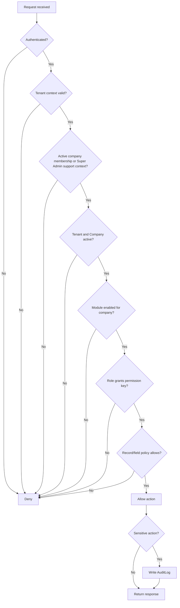
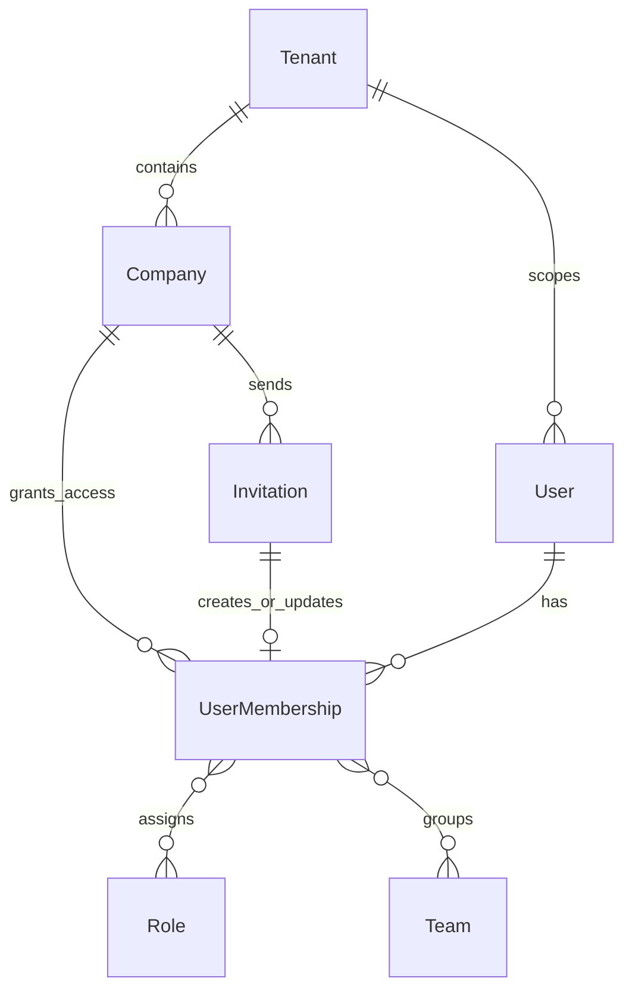
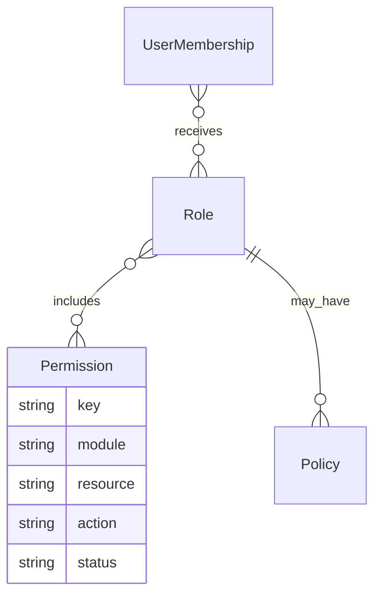
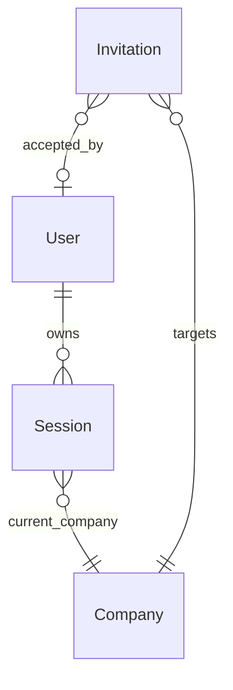
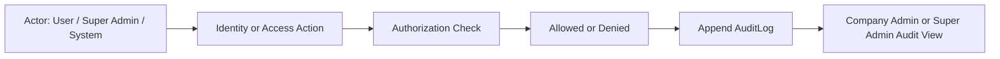

# 02_Tenant_Identity_Access.md

## Document Metadata

| Field | Value |
| --- | --- |
| Document name | 02_Tenant_Identity_Access.md |
| Phase number | Phase 02 |
| Phase name | Tenant, Identity, and Access |
| Document type | Phase requirements and implementation specification |
| Version | 1.0 |
| Status | Draft |
| Owner | Product / Architecture / Documentation |
| Last updated | 2026-05-09 |
| Source documents | 00_Master_Platform_Documentation.md; 00_Global_Documentation_Rules.md; 00_Global_Domain_Model.md; 00_Global_Decisions_Register.md; 01_Product_Definition.md |
| Intended audience | Product owner, product architects, SaaS systems architects, identity/access designers, engineering leads, security leads, design leads, QA leads, implementation leads, future AI phase writers, and delivery managers |

## 1. Phase Purpose

Phase 02 exists to define the official tenant, identity, membership, authentication, authorization, session, invitation, and access-control foundation for the platform. Every later module depends on this phase because CRM, outbound sales, field operations, drilling workflows, inventory, dispatch, fleet, service, reporting, integrations, and offline mobile all need the same answer to: who is the actor, which tenant are they operating inside, which company are they accessing, which modules are enabled, and which actions are allowed.

This phase establishes SaaS tenant isolation, company-level access boundaries, canonical user identity, user memberships, authentication expectations, role and permission foundations, invitation and onboarding rules, session expectations, and access-control constraints for all future phases. It must prevent later documents from creating alternate user systems, duplicate company concepts, inconsistent admin models, or module-specific permission shortcuts that weaken tenant safety.

## 2. Phase Goals

- Define `Tenant` and `Company` usage clearly and consistently.
- Establish tenant and company scoping rules for records, APIs, UI screens, filters, reports, imports, exports, integrations, and offline sync.
- Define the canonical `User` identity model.
- Define membership-based company access through `UserMembership`.
- Define baseline platform roles and their intended module relevance.
- Define minimum viable permissions using stable dot-notation permission keys.
- Define future-capable policy-based authorization boundaries without requiring a full policy engine in MVP.
- Define audit requirements for identity and access events.
- Define company switching behavior for users with multiple memberships.
- Prevent future phases from inventing conflicting user, company, role, permission, admin, driver, technician, or warehouse-user models.

## 3. Scope

### In Scope

- Tenant model.
- Company model.
- User model.
- UserMembership model.
- Super Admin model.
- Company Admin model.
- Authentication requirements.
- Session requirements.
- Invitation requirements.
- Role model.
- Permission model.
- Module access model.
- Company switching behavior.
- Access enforcement expectations.
- Identity/access audit events.
- Security expectations.
- API requirements for identity/access.
- UI expectations for tenant, company, user, invitation, role, permission, session, and admin flows.
- Future-phase constraints.

### Out of Scope

- Detailed CRM, inventory, dispatch, fleet, service, QuickBooks, reporting, and mobile feature specifications beyond their identity/access foundation.
- Final commercial billing, pricing, packaging, or subscription design.
- Final enterprise SSO implementation.
- Complete audit log architecture outside identity/access needs.
- Complete offline sync architecture.

## 4. Non-Goals

- No CRM-specific permission matrix.
- No inventory-specific permission matrix.
- No dispatch-specific permission matrix.
- No fleet-specific permission matrix.
- No QuickBooks-specific permission implementation.
- No full Cerbos policy files unless explicitly required by a later approved decision.
- No final billing/subscription model.
- No customer-facing pricing model.
- No final SSO/SAML/OIDC enterprise implementation unless marked as future-capable.
- No full audit log architecture beyond identity/access needs.
- No detailed user profile preferences beyond identity/access scope.
- No full mobile offline permission sync design beyond core expectations.

## 5. Source-of-Truth Definitions

| Concept | Canonical Meaning | Key Rule |
| --- | --- | --- |
| Tenant | Top-level SaaS isolation boundary. | Every tenant-scoped or company-scoped record must be protected by tenant context. |
| Company | Customer organization inside a Tenant. | Primary normal-user business access boundary. |
| Branch | Optional location/organizational subdivision inside a Company. | Future-capable access filter; not a tenant replacement. |
| Department | Optional functional grouping of users. | May support reporting/organization; not a tenant/company boundary. |
| Team | Working group for assignment, ownership, visibility, and reporting. | Teams must not replace Role or Permission. |
| User | Human platform identity that can authenticate and act. | Drivers, technicians, sales reps, warehouse operators, and managers are Users when they log in. |
| UserMembership | Canonical bridge between User and Company access. | Stores company access, roles, team links, branch scope, status, and membership lifecycle. |
| Role | Named permission grouping assignable through membership. | Roles contain permission keys and may later have scope rules. |
| Permission | Stable action key checked by APIs and UI. | Use lowercase dot notation: `module.resource.action`. |
| Policy | Conditional access rule beyond static role permissions. | Future-capable for branch/team/record/attribute rules. |
| Session | Authenticated user session with device/context metadata. | Must be revocable and tied to current user/company context. |
| Invitation | Onboarding workflow to grant a user company access. | Acceptance creates or updates UserMembership. |
| Super Admin | Platform-level admin role for tenant/platform operations. | Separate from Company Admin and highly audited. |
| Company Admin | Customer-company-level admin role. | Manages users/settings/modules only within permitted company scope. |
| Module Access | Company-level module enablement plus user permission. | Both must be true before module access is allowed. |
| Action Permission | Permission to perform a specific action. | Example: `admin.users.invite`. |
| Record-Level Access | Visibility/action rules for specific records. | Future-capable; not universal in MVP. |
| System Actor | Non-human actor such as worker, integration job, automation, or system process. | Must carry explicit tenant/company context and be audit-visible. |
| External Actor | External provider/user/system interacting through integrations or APIs. | Must never bypass tenant/company access rules. |

### Do Not Confuse These Concepts

| Concept A | Concept B | Difference | Required Future-Phase Behavior |
| --- | --- | --- | --- |
| Tenant | Company | Tenant is the top SaaS isolation boundary; Company is the customer organization inside a tenant. | Always include `tenant_id`; include `company_id` for company records. |
| Company | Account | Company is the SaaS customer organization; Account is a CRM customer/prospect/vendor record inside a company. | CRM phases must not rename Company to Account or Account to Company. |
| User | UserMembership | User is global identity; membership grants company access. | Roles and company access belong on membership, not directly as a single global user role. |
| Role | Permission | Role groups permissions; permission is the atomic action key. | Later modules define permissions, then attach them to roles. |
| Team | Role | Team organizes users/work; Role grants authority. | Teams cannot grant access without permissions. |
| Branch/Warehouse/Depot | Company | These are operational/location scopes inside a company. | They can refine visibility later but must not replace company scope. |
| Super Admin | Company Admin | Super Admin is platform-level; Company Admin is customer-company-level. | Never merge or allow Company Admin to grant Super Admin. |
| Module Enabled | User Allowed | Company may have module enabled, but user still needs permission. | Navigation/API/reporting must check both. |

## 6. Tenant Model

### Purpose

`Tenant` is the highest SaaS isolation boundary. It groups one or more customer companies, platform configuration defaults, tenant-level status, and support/admin governance. A tenant is not a CRM customer and must not be used as an operational business record.

### Tenant Ownership and Lifecycle

- Tenants are owned and governed by the platform operator.
- Normal Company Admins cannot create, delete, suspend, or cross-manage tenants.
- Tenant lifecycle should support `provisioning`, `active`, `suspended`, `archived`, and `deleted` states.
- Tenant creation is a platform/admin operation or a controlled signup/provisioning flow.
- Tenant deactivation/suspension must immediately prevent normal company access while preserving audit history.
- Tenant deletion should be soft-delete first and governed by retention policy.

### Tenant Isolation Rules

- Every tenant-owned record must include `tenant_id` unless it is truly platform-global.
- Company-scoped records must include both `tenant_id` and `company_id`.
- Cross-tenant queries are forbidden for normal users.
- Super Admin cross-tenant access must be explicit, permission-gated, and audited.
- MongoDB `_id` must never be exposed as the public API identifier; use the stable application `id` field.

### Tenant-Level Settings

Tenant settings may include defaults, platform support configuration, tenant status, allowed company count, security defaults, and global defaults for companies. Company module enablement should normally live on the Company unless a future billing/package model says otherwise.

### Tenant Context Resolution

Tenant context may be resolved by a combination of authenticated session, host/subdomain, explicit tenant hint during login, selected company membership, and server-side lookup. Once authenticated, backend services must never trust client-provided tenant IDs without verifying the authenticated actor is allowed to operate in that tenant.

### Recommended Tenant Fields

| Field | Type | Required | Purpose | Notes |
| --- | --- | --- | --- | --- |
| id | string | Yes | Stable application ID; recommended prefix `ten_`. | Public API identifier; MongoDB `_id` must not be exposed. |
| name | string | Yes | Tenant legal or operating name. | Visible to platform admins; may be shown to tenant admins if supported. |
| slug | string | Yes | Stable URL/config lookup key. | Unique platform-wide; changes require audit. |
| status | enum | Yes | Tenant lifecycle state. | Recommended: `provisioning`, `active`, `suspended`, `archived`, `deleted`. |
| settings | object | Recommended | Tenant-level configuration. | Do not place company module settings here unless tenant-wide default. |
| created_at | datetime | Yes | Creation timestamp in UTC. | Immutable after create. |
| created_by | string | Yes | Actor that created tenant. | Platform user or system actor. |
| updated_at | datetime | Yes | Last update timestamp in UTC. | Set on changes. |
| updated_by | string | Yes | Actor that last updated tenant. | Platform user or system actor. |
| deleted_at | datetime | Conditional | Soft deletion timestamp. | Tenant deletion must be restricted and reversible until retention policy final. |
| deleted_by | string | Conditional | Actor who soft-deleted tenant. | Required if deleted_at set. |
| metadata | object | Optional | Non-critical extension data. | Must not contain security-critical authorization rules. |


## 7. Company Model

### Purpose

`Company` represents the SaaS customer organization inside a Tenant. Company is the primary business and permission boundary for normal users. A Company is not a CRM `Account`; Accounts are customer/prospect/vendor records managed inside a Company by later CRM phases.

### Relationship to Tenant

- A Tenant can contain one or more Companies.
- Every Company belongs to exactly one Tenant.
- Company-level module enablement, settings, roles, user memberships, and business records must carry tenant/company scope.
- A future package/billing model may control how many companies/modules a Tenant can use, but that is not defined in Phase 02.

### Company Lifecycle and Statuses

Recommended statuses: `provisioning`, `active`, `suspended`, `archived`, `deleted`.

- `provisioning`: setup in progress; limited admin access only.
- `active`: normal access allowed.
- `suspended`: logins may succeed but company actions are blocked except authorized admin/support flows.
- `archived`: hidden from normal workflows; read-only access only if allowed.
- `deleted`: soft-deleted pending retention/purge policy.

### Company Creation and Settings

Company creation is performed by Super Admin, controlled tenant setup, or future approved self-serve provisioning. Company settings may include timezone, locale, module defaults, branding, operational defaults, integration readiness, notification defaults, and module configuration. Company settings changes must be audited.

### Company Module Enablement

Companies have optional modules enabled through `enabled_modules` or a later `ModuleAccess` entity. A user can only access a module when the module is enabled for the Company and the user has a role/permission allowing the action.

### Company Switching

Users with active memberships in multiple companies must use a company switcher. Switching current company must recalculate enabled modules, roles, permissions, filters, navigation, reports, and cached data boundaries.

### Recommended Company Fields

| Field | Type | Required | Purpose | Notes |
| --- | --- | --- | --- | --- |
| id | string | Yes | Stable application ID; recommended prefix `co_`. | Public API identifier. |
| tenant_id | string | Yes | Parent tenant. | Required on all company records. |
| name | string | Yes | Company name. | Canonical SaaS customer organization name. |
| legal_name | string | Optional | Legal entity name. | Useful for billing/integration later. |
| display_name | string | Recommended | User-facing display label. | Used in switcher and navigation. |
| slug | string | Yes | Tenant-unique company key. | Unique within tenant. |
| status | enum | Yes | Company lifecycle state. | Recommended: `provisioning`, `active`, `suspended`, `archived`, `deleted`. |
| enabled_modules | array<string> | Yes | Enabled module keys for this company. | Module access still also requires user permission. |
| settings | object | Recommended | Company-level settings. | Timezone, locale, defaults, branding, operational settings. |
| external_refs | object | Recommended | External IDs or mapping hints. | Provider keys; detailed links use approved integration entities. |
| created_at | datetime | Yes | Creation timestamp UTC. | Required. |
| created_by | string | Yes | Actor that created company. | Super Admin, system actor, or authorized flow. |
| updated_at | datetime | Yes | Last update timestamp UTC. | Required. |
| updated_by | string | Yes | Actor that updated company. | Required. |
| deleted_at | datetime | Conditional | Soft deletion timestamp. | Use deactivation before deletion. |
| deleted_by | string | Conditional | Actor who deleted/deactivated. | Required if deleted_at set. |
| metadata | object | Optional | Non-critical extension data. | Not for required workflow/security fields. |


## 8. Branch, Department, Team, Warehouse, and Depot Boundaries

Company-level access is the primary permission boundary. Branch-level access is future-capable but not required for every MVP feature unless confirmed. Departments and Teams can organize users but must not become separate tenant boundaries. Warehouses and Depots are operational entities, not identity boundaries by default. Future phases may introduce warehouse/depot-scoped permissions only if required. Do not create separate user systems for warehouse users, drivers, service technicians, or sales reps.

| Boundary | Meaning | Domain | Identity boundary? | Permission boundary? | Data ownership boundary? | MVP requirement | Future expansion |
| --- | --- | --- | --- | --- | --- | --- | --- |
| Tenant | Top-level SaaS isolation boundary. | Core Platform / Identity | Yes, highest boundary | Yes, for platform admins | Yes, tenant data boundary | Required | Enterprise tenant configuration, support controls |
| Company | Customer organization inside a Tenant. | Core Platform | Yes for customer users | Primary normal-user boundary | Primary business data ownership boundary | Required | Multi-company tenants, module packaging |
| Branch | Operational/location subdivision under Company. | Core / Operations | No | Future-capable optional boundary | Optional filter/ownership scope | Optional | Branch roles, branch reporting |
| Department | Functional grouping of users. | Core / HR-like grouping | No | Not default; future-capable | No direct ownership unless defined later | Optional/Later | Org charts, approvals, reporting |
| Team | Working group for assignments, ownership, reporting. | Core / All modules | No | Future-capable visibility helper | Can support assignment/visibility, not ownership root | Recommended basic support | Team-based visibility, saved views |
| Warehouse | Inventory location under Company. | Inventory | No | Not default; future permission boundary if required | Inventory operational scope | Later phase | Warehouse-scoped inventory permissions |
| Depot | Operations/fleet/inventory location under Company. | Fleet / Dispatch / Inventory | No | Not default; future permission boundary if required | Operational location scope | Later phase | Depot-scoped dispatch/fleet/inventory permissions |


## 9. User Model

`User` is the canonical human identity. A User authenticates, has a profile, owns sessions, appears in audit logs, and can act in one or more companies through UserMembership. User is not owned by a single company unless a later accepted decision explicitly restricts the model.

### User Lifecycle

Recommended statuses: `invited`, `active`, `suspended`, `disabled`, `archived`.

- `invited`: user identity may exist before acceptance.
- `active`: login and membership access allowed subject to memberships.
- `suspended`: login or actions blocked according to security policy.
- `disabled`: administrative deactivation; active sessions should be revoked.
- `archived`: retained for audit/history, not active use.

### Authentication Identifiers and Credential Notes

- Email is the baseline login identifier.
- `email_normalized` is required for lookup and duplicate prevention.
- Password handling must use secure password hashing if password auth is implemented.
- MFA is recommended/future-capable; whether it is mandatory for admins in MVP is open.
- User deletion/anonymization must preserve audit integrity by keeping stable actor references or redacted actor snapshots.

### Allowed Phase 02 User Preferences

Only identity/access-related preferences are in scope: locale, timezone, avatar, basic profile fields, session/device management, and security settings. Notification preferences are referenced but expanded later.

### Recommended User Fields

| Field | Type | Required | Purpose | Notes |
| --- | --- | --- | --- | --- |
| id | string | Yes | Stable application ID; recommended prefix `usr_`. | Public API identifier. |
| tenant_id | string | Recommended / Open | Tenant context when users are tenant-scoped. | Open question: whether one user may join companies in different tenants. |
| email | string | Yes | Primary login/contact email. | Original casing may be preserved for display. |
| email_normalized | string | Yes | Normalized email for uniqueness and login lookup. | Lowercase/trim; uniqueness rule must be defined. |
| name | string | Recommended | Display name. | Can be derived from first/last name. |
| first_name | string | Optional | Given name. | Profile field only. |
| last_name | string | Optional | Family name. | Profile field only. |
| phone | string | Optional | Phone contact. | Do not make primary login factor unless decided. |
| avatar_url | string | Optional | Profile image URL. | Must pass file/access controls later. |
| status | enum | Yes | User lifecycle state. | Recommended: `invited`, `active`, `suspended`, `disabled`, `archived`. |
| last_login_at | datetime | Optional | Most recent successful login. | Useful for admin and security reports. |
| mfa_enabled | boolean | Recommended | Whether MFA is active. | MFA policy remains open. |
| locale | string | Optional | User locale. | Preferences only. |
| timezone | string | Optional | User timezone. | Default from company if unset. |
| created_at | datetime | Yes | Creation timestamp UTC. | Required. |
| created_by | string | Yes | Creator actor. | Invitation flow or admin. |
| updated_at | datetime | Yes | Last update timestamp UTC. | Required. |
| updated_by | string | Yes | Last updater. | Required. |
| deleted_at | datetime | Conditional | Soft deletion/anonymization marker. | Use carefully; preserve audit references. |
| deleted_by | string | Conditional | Actor who deleted/deactivated. | Required when deleted_at set. |
| metadata | object | Optional | Non-critical profile extension. | Not for permissions or auth secrets. |


## 10. UserMembership Model

`UserMembership` is the canonical bridge between User and Company. It exists because a user may belong to multiple companies, roles are company-specific, access status can differ by company, and future visibility may depend on teams, departments, branches, depots, warehouses, or policies.

### Membership Rules

- A User may have zero, one, or many memberships.
- A normal user cannot access a Company without an active membership.
- Membership status controls access independently from User status.
- Membership stores `role_ids`, `team_ids`, optional `department_id`, optional `branch_ids`, and access status.
- Drivers, sales reps, technicians, warehouse operators, managers, dispatchers, and analysts are all Users with memberships and roles.
- Membership changes must be audited.
- Invitation acceptance must create or update membership.

### Primary Company and Company Switcher

`is_primary` may identify the default company shown after login. If the user has multiple active memberships, the UI must show a company switcher and the backend must enforce the selected current company.

### Recommended UserMembership Fields

| Field | Type | Required | Purpose | Notes |
| --- | --- | --- | --- | --- |
| id | string | Yes | Stable membership ID. | Canonical company access grant. |
| tenant_id | string | Yes | Tenant scope. | Must match company.tenant_id. |
| company_id | string | Yes | Company scope. | Primary access boundary. |
| user_id | string | Yes | Linked User. | One user can have multiple memberships. |
| role_ids | array<string> | Yes | Assigned roles for this membership. | At least one active role recommended. |
| team_ids | array<string> | Optional | Teams for ownership/visibility/reporting. | Teams must not replace permissions. |
| department_id | string | Optional | Department grouping. | Future-capable; not required MVP. |
| branch_ids | array<string> | Optional | Branch scope. | Future-capable; not global boundary. |
| status | enum | Yes | Membership lifecycle state. | `invited`, `active`, `suspended`, `expired`, `archived`. |
| is_primary | boolean | Recommended | Preferred company for login/switcher. | One primary per tenant/user if supported. |
| joined_at | datetime | Conditional | When invitation accepted/access started. | Set on activation. |
| invited_by | string | Conditional | Actor who invited user. | Required for invited memberships. |
| created_at | datetime | Yes | Creation timestamp UTC. | Required. |
| created_by | string | Yes | Creator actor. | Required. |
| updated_at | datetime | Yes | Last update timestamp UTC. | Required. |
| updated_by | string | Yes | Last updater. | Required. |
| deleted_at | datetime | Conditional | Soft deletion timestamp. | Use suspend/deactivate first. |
| deleted_by | string | Conditional | Actor who deleted membership. | Required if deleted_at set. |
| metadata | object | Optional | Non-critical extension data. | Not for permissions. |


## 11. Role Model

Roles are named permission groupings. Phase 02 defines baseline roles and permission principles; later module phases must add module-specific permission matrices without changing the role/user/membership foundation.

### Role Rules

- System roles are protected defaults maintained by the platform.
- Company roles are assignable within a company.
- Tenant-wide roles may omit `company_id` only when explicitly tenant-wide.
- Custom roles are future-capable; whether Company Admins can create them in MVP is open.
- Role assignment happens through UserMembership.
- Role create/update/delete/assignment changes must be audited.
- Role names must use stable product language and must not duplicate user personas as separate identity entities.

### Baseline Role Table

| Role name | Scope | Description | Typical module access | Typical data visibility | Can manage users? | Can manage settings? | Can view reports? | Mobile relevance | MVP relevance |
| --- | --- | --- | --- | --- | --- | --- | --- | --- | --- |
| Super Admin | Platform | Platform operator for tenant setup, support escalation, platform configuration, and cross-tenant governance. | Core Platform; Admin; Reporting; Integrations health | Cross-tenant only through audited platform workflows | Yes, platform/tenant users where allowed | Yes, platform settings only | Yes | Low | MVP-light / required for setup |
| Company Admin | Company | Customer-side administrator for users, roles, modules, company settings, and audit review. | Admin; Core; all enabled modules | All company data allowed by company policy | Yes, company users only | Yes, company settings only | Yes | Medium | MVP |
| Sales Manager | Company | Manages sales team visibility, assignment, pipeline, outbound oversight, and sales reports. | CRM; Outbound Sales; Calendar / Tasks; Reporting | Company/team sales records; later owner/team restrictions | No by default | No, except sales configuration if delegated | Yes | Medium | MVP |
| Sales Rep | Company | Executes CRM and outbound sales workflows, owns leads/accounts/opportunities, logs activity. | CRM; Outbound Sales; Calendar / Tasks; Field Sales light | Own/team/company sales records depending policy | No | No | Limited | Medium | MVP |
| Field Manager | Company | Coordinates field sales, site visits, crews, field jobs, and operational handoffs. | Field Sales; Drilling Operations; Calendar; Dispatch; Reporting | Field records across assigned company/team/branch | No by default | No, except delegated field settings | Yes | High | MVP |
| Field Sales Rep | Company | Performs site visits, check-ins, field notes, photos, and customer updates. | Field Sales; CRM light; Calendar / Tasks; Mobile | Assigned field records; customer context where permitted | No | No | Limited | High | MVP |
| Dispatcher | Company | Plans jobs, routes, vehicles, drivers, stops, and operational exceptions. | Orders / Dispatch / Logistics; Fleet; Calendar; Reporting | Dispatch/fleet/job records for permitted company | No | No | Yes | Medium | MVP |
| Driver | Company | Receives assignments, check-ins/check-outs, route/stop details, proof capture, and mobile updates. | Dispatch; Fleet; Mobile; Field proof | Assigned route/stop/job records | No | No | No | High | MVP |
| Warehouse Manager | Company | Oversees product, warehouse/depot workflows, stock movements, adjustments, receiving, transfers. | Inventory; Warehouse; Reporting | Inventory records across permitted company/locations | No by default | No, except inventory configuration if delegated | Yes | Medium | MVP |
| Warehouse Operator | Company | Performs receiving, picking, transfers, adjustments where allowed, and stock checks. | Inventory; Mobile / scanner future | Assigned/permitted warehouse records | No | No | No | Medium | MVP |
| Service Manager | Company | Manages service requests, work orders, technicians, parts, and service reports. | Service / Work Orders; Inventory; Calendar; Reporting | Service records across permitted company/team | No by default | No, except delegated service settings | Yes | Medium | Later/MVP-light |
| Service Technician | Company | Executes work orders, captures labor, parts, notes, photos, and completion status. | Service / Work Orders; Mobile; Inventory parts | Assigned work orders and required context | No | No | No | High | Later/MVP-light |
| Analyst / Reporting User | Company | Views reports, dashboards, exports, and operational metrics without broad admin authority. | Reporting; Search; read access to enabled source modules | Reportable records only where source visibility allows | No | No | Yes | Low | MVP |
| Read-Only Viewer | Company | Reads allowed records and reports without creating or changing operational data. | Enabled modules read-only; Reporting limited | View-only records permitted by role | No | No | Limited | Low | MVP |


## 12. Permission Model

Permissions are stable action keys used by APIs, UI, reports, imports, exports, integrations, and background jobs. The baseline model is role-based permissions. Policy-based authorization may be introduced later for more complex conditions.

### Permission Naming Convention

Use lowercase dot notation:

```text
module.resource.action
```

Examples:

- `crm.account.view`
- `crm.account.create`
- `crm.account.update`
- `crm.account.delete`
- `dispatch.plan.assign`
- `inventory.stock_movement.create`
- `fleet.location.view`
- `reports.dashboard.view`
- `admin.users.manage`

### Permission Categories

- Module-level access: broad ability to see/use an enabled module.
- Resource-level access: ability to access a resource type such as users, roles, accounts, stock movements, routes, vehicles, reports.
- Action-level access: view, create, update, delete, assign, export, import, approve, manage, revoke, enable, disable.
- Record-level access: future-capable restrictions by owner, team, branch, depot, warehouse, vehicle, assignment, or policy.
- Field-level restrictions: future-capable restrictions for sensitive fields.

### Evaluation Principles

- Default deny.
- Allow only through active user, active membership, active company, enabled module, and granted permission.
- Deny rules or suspensions override allows.
- Backend enforcement is mandatory; frontend hiding is only UX assistance.
- Reports, exports, global search, integration actions, and background jobs must enforce equivalent visibility rules.

## 13. Access Control Layers

The official access evaluation layers are:

1. Authentication.
2. Tenant access.
3. Company membership.
4. Company status.
5. Module enablement.
6. Role permission.
7. Action permission.
8. Record-level access where applicable.
9. Field-level restrictions where applicable.
10. Audit logging for sensitive access changes.



## 14. Super Admin Model

Super Admin is platform-level and must remain separate from Company Admin. Super Admin exists for tenant provisioning, platform support, incident response, controlled configuration, platform health, and cross-tenant governance.

### Super Admin Can

- Create, update, suspend, archive, or support tenants where permitted.
- Create initial companies during tenant provisioning.
- Review platform-level identity/access audit events.
- Perform controlled support access into tenant/company context.
- Configure protected system roles and platform defaults.

### Super Admin Should Not Casually Do

- Perform normal customer operations as if they were a company user.
- Modify customer settings without reason/audit.
- Access customer data without support justification.
- Bypass company admin controls except through approved break-glass/support workflows.

### Restrictions and Open Items

- Super Admin actions must be audited with high severity.
- Break-glass access should require reason capture and possibly extra confirmation.
- Support impersonation is an open question and should not be assumed as allowed.
- Super Admin must not be assignable by Company Admin.

## 15. Company Admin Model

Company Admin is customer-company-level. Company Admin can manage users, memberships, roles, module access, and company settings only inside allowed company scope.

### Company Admin Can

- View company users and memberships.
- Invite users to the company.
- Assign approved company roles.
- Deactivate/reactivate memberships where allowed.
- View role/permission overview.
- Manage company settings and enabled modules if permitted.
- Review identity/access audit logs for company scope.

### Company Admin Cannot

- Access other companies without membership.
- Access other tenants.
- Grant Super Admin.
- Bypass disabled modules.
- Override backend authorization.
- Remove the last Company Admin unless a recovery path exists.
- Access platform-only audit events unless explicitly permitted.

Future branch/depot admin concepts must be extensions of Company Admin or scoped roles, not separate identity systems.

## 16. Authentication Requirements

- Email/password or compatible auth provider baseline is acceptable; provider-specific implementation is not defined in Phase 02.
- Secure password handling is required if password auth is implemented.
- Login must authenticate the user and resolve permitted tenant/company context.
- Logout must revoke the current session.
- Password reset must use secure expiring tokens and must not reveal whether an email exists.
- Email verification should be supported for account trust and invitation acceptance.
- MFA is recommended/future-capable; whether it is required for admins in MVP is open.
- Account lockout/rate limiting is required for authentication endpoints.
- Session creation, expiration, refresh/renewal, and revocation must be explicit.
- Auth events must be audit logged where security-relevant.
- SSO/SAML/OIDC readiness is required as future-capable, but final enterprise implementation is deferred.

## 17. Session Model

A Session represents an authenticated device/browser/app context. It must support expiration, revocation, device metadata, current company context, suspicious-session handling, and audit events.

### Session Lifecycle

1. Session created after successful authentication.
2. Session associated with user, tenant context, and current company where applicable.
3. Session last-seen timestamp updates during activity.
4. Session expires automatically or is revoked by logout/security/admin action.
5. Revoked/expired sessions cannot be used for API access.

### Recommended Session Fields

| Field | Type | Required | Purpose | Notes |
| --- | --- | --- | --- | --- |
| id | string | Yes | Stable session ID. | Do not expose secret token values. |
| user_id | string | Yes | Authenticated user. | Required. |
| tenant_id | string | Conditional | Tenant context for session. | Required after tenant context resolved. |
| current_company_id | string | Conditional | Current company context. | Required when user has company access. |
| status | enum | Yes | Session state. | `active`, `expired`, `revoked`. |
| ip_address | string | Recommended | Source IP. | Protect as sensitive metadata. |
| user_agent | string | Recommended | Browser/device metadata. | Useful for session management. |
| created_at | datetime | Yes | Session creation timestamp. | Audit login. |
| last_seen_at | datetime | Recommended | Last activity timestamp. | Used for timeout. |
| expires_at | datetime | Yes | Expiration timestamp. | Must be enforced server-side. |
| revoked_at | datetime | Conditional | Revocation time. | Set on logout/revoke. |
| revoked_by | string | Conditional | Actor that revoked session. | User/admin/system. |
| metadata | object | Optional | Device/app metadata. | No secrets. |


## 18. Invitation Model

Invitation is the controlled onboarding workflow for granting a user access to a company.

### Invitation Lifecycle

- Created by authorized Company Admin or Super Admin.
- Stores target email, company, roles, optional teams, token hash, expiration, and inviter.
- Email notification is sent with acceptance link.
- Invitee accepts; system creates User if needed and creates/activates UserMembership.
- Pending invitation may be resent or revoked.
- Expired invitations cannot be accepted.
- Existing users can accept a new company membership without creating duplicate User records.

### Security Rules

- Store only token hash, never raw token.
- Normalize email to prevent duplicate invite confusion.
- Do not allow Company Admin to invite/assign Super Admin.
- Audit sent, accepted, revoked, expired, and role assignment events.

### Recommended Invitation Fields

| Field | Type | Required | Purpose | Notes |
| --- | --- | --- | --- | --- |
| id | string | Yes | Stable invitation ID. | Publicly visible only in admin UI where allowed. |
| tenant_id | string | Yes | Tenant scope. | Required. |
| company_id | string | Yes | Target company. | Required. |
| email | string | Yes | Invitee email. | Store normalized copy if needed. |
| role_ids | array<string> | Yes | Roles to assign on acceptance. | Must not include Super Admin from company admin flows. |
| team_ids | array<string> | Optional | Teams to assign on acceptance. | Must belong to company. |
| status | enum | Yes | Invitation state. | `pending`, `accepted`, `expired`, `revoked`. |
| token_hash | string | Yes | Hash of invite token. | Never store raw token. |
| expires_at | datetime | Yes | Expiration timestamp. | Required. |
| accepted_at | datetime | Conditional | Acceptance timestamp. | Set once. |
| accepted_by_user_id | string | Conditional | User who accepted. | Existing or newly created user. |
| revoked_at | datetime | Conditional | Revocation timestamp. | Set when revoked. |
| revoked_by | string | Conditional | Actor who revoked. | Required if revoked. |
| invited_by | string | Yes | Actor who created invite. | Required for audit. |
| created_at | datetime | Yes | Creation timestamp UTC. | Required. |
| updated_at | datetime | Yes | Last update timestamp UTC. | Required. |
| metadata | object | Optional | Non-critical invite context. | No raw secrets. |


## 19. Company Switching Behavior

Users with more than one active company membership must be able to select the current company. The current company must be visible in the application shell, used in API requests, and reflected in navigation, filters, saved views, reports, exports, notifications, and mobile caches.

### Rules

- Current company should be stored in session or user preference, but every request must still be validated server-side.
- Switching company must recalculate role permissions and module access.
- UI must clear or reload company-scoped data after switching.
- Unsaved changes should trigger a warning before switching.
- If membership is removed while active, the session must be forced to another valid company or blocked with a clear access message.
- Companies with the same display name must show disambiguating context.
- Mobile company switching must avoid cross-company cache leakage.

## 20. Module Access and Feature Flags

Companies can have optional modules enabled. Module access requires both company module enablement and user permission. Disabled modules should not appear in navigation, direct API access must be blocked, and reports/search should not expose disabled module data unless explicitly allowed by a later decision.

### Recommended Module Keys

- `core`
- `crm`
- `outbound_sales`
- `calendar_tasks`
- `field_sales`
- `drilling_operations`
- `inventory`
- `orders_dispatch_logistics`
- `fleet_tracking`
- `service_work_orders`
- `reporting`
- `integrations`
- `notifications_automation`
- `search_views`
- `offline_mobile`
- `admin_security_audit`

Future billing may connect to modules, but billing is not defined here.

## 21. Policy-Based Authorization and Cerbos Consideration

RBAC is the baseline. Policy-based authorization may be introduced when access rules become complex, especially for record ownership, branch scope, team visibility, depot/warehouse restrictions, export restrictions, field-level restrictions, enterprise roles, and support/break-glass rules.

Cerbos is a strong candidate if adopted, but Phase 02 does not require final Cerbos policy files. Future phases must keep permission checks compatible with external policy evaluation by using stable actors, resources, actions, tenant/company context, roles, attributes, and audit metadata.

**Recommended Decision:** Start with simple role/module/action permissions, but design permission checks so Cerbos or another policy engine can be introduced without rewriting product behavior.

## 22. Record-Level Access Expectations

MVP can primarily use company-level access. Some modules may later need owner/team/branch/depot/warehouse-based visibility.

- CRM may need owner/team-based access.
- Inventory may need warehouse/depot-level access.
- Fleet may need vehicle/driver assignment-based access.
- Dispatch may need route/driver/team-based access.
- Service may need technician/assignment-based access.
- Reporting must respect the same visibility rules as source records.

Record-level access should be explicitly defined in later phase documents if required. No future phase may implement record-level rules that bypass tenant/company scope.

## 23. API Requirements

| Requirement ID | Endpoint / Conceptual Endpoint | Method | Purpose | Required Permission | Tenant/Company Scope | Main Request Fields | Main Response Fields | Audit Requirement | Notes |
| --- | --- | --- | --- | --- | --- | --- | --- | --- | --- |
| API-02-001 | /api/v1/auth/login | POST | Authenticate user and create session. | Public with rate limits | Tenant resolved by login context/host/config | email, password, optional tenant_hint | user summary, memberships, current_company_id, session metadata | Yes | Do not expose password/auth internals. |
| API-02-002 | /api/v1/auth/logout | POST | Revoke current session. | Authenticated user | Current session | session_id optional | success | Yes | Must be idempotent. |
| API-02-003 | /api/v1/auth/refresh | POST | Renew session/token according to auth design. | Authenticated refresh context | Current session | refresh token/session handle | new session/token metadata | Yes for failures/suspicious events | Provider-specific details deferred. |
| API-02-004 | /api/v1/me | GET | Return current user, current company, memberships, roles, permissions, enabled modules. | Authenticated user | Tenant + current company | none | current user context | No unless sensitive access required | Frontend and mobile bootstrap endpoint. |
| API-02-005 | /api/v1/me/memberships | GET | List companies available to current user. | Authenticated user | Tenant | none | memberships + company summaries | No | Must omit inactive memberships unless admin mode. |
| API-02-006 | /api/v1/me/current-company | PUT | Switch current company. | Authenticated user with active membership | Target company | company_id | updated current context | Yes or security trace | Recalculate permissions and module access. |
| API-02-007 | /api/v1/companies | GET | List companies visible to user/admin. | admin.companies.view or self memberships | Tenant | filters | company summaries | No | Company Admin only sees their company unless multi-company role. |
| API-02-008 | /api/v1/admin/users/invitations | POST | Invite user to company. | admin.users.invite | Tenant + company | email, role_ids, team_ids, expiration | invitation summary | Yes | Must hash token. |
| API-02-009 | /api/v1/invitations/{invitation_id}/accept | POST | Accept invitation and create/update user membership. | Valid invite token | Tenant + company | token, profile/password fields if needed | user + membership summary | Yes | Handles existing and new users. |
| API-02-010 | /api/v1/admin/users/invitations/{invitation_id}/revoke | POST | Revoke pending invitation. | admin.users.invite or admin.users.manage | Tenant + company | reason optional | invitation summary | Yes | No effect on accepted invitations except audit. |
| API-02-011 | /api/v1/admin/users | GET | List company users/memberships. | admin.users.view | Tenant + company | search/status/role/team/branch/last_login filters | membership/user summaries | No | Must never leak other companies. |
| API-02-012 | /api/v1/admin/users/{user_id} | GET | Read user details in company context. | admin.users.view | Tenant + company | user_id | user + membership details | No | Sensitive auth metadata must be redacted. |
| API-02-013 | /api/v1/admin/memberships/{membership_id} | PATCH | Update membership status, teams, branches, role set. | admin.users.manage / admin.roles.assign | Tenant + company | role_ids, team_ids, status, branch_ids | updated membership | Yes | Protect last company admin rule. |
| API-02-014 | /api/v1/admin/memberships/{membership_id}/deactivate | POST | Deactivate membership. | admin.users.manage | Tenant + company | reason | membership status | Yes | Revoke sessions for active company if needed. |
| API-02-015 | /api/v1/admin/memberships/{membership_id}/reactivate | POST | Reactivate membership. | admin.users.manage | Tenant + company | reason | membership status | Yes | Requires valid company status. |
| API-02-016 | /api/v1/admin/roles | GET | List roles available in company. | admin.roles.view | Tenant + company | scope/status filters | roles | No | Includes system/default roles. |
| API-02-017 | /api/v1/admin/roles | POST | Create custom role if allowed. | admin.roles.manage | Tenant + company | name, description, permission_keys | role | Yes | MVP custom role support is open question. |
| API-02-018 | /api/v1/admin/roles/{role_id} | PATCH | Update role permission grouping. | admin.roles.manage | Tenant + company | name, description, permission_keys, status | role | Yes | Prevent modifying protected system roles directly. |
| API-02-019 | /api/v1/admin/permissions | GET | List permission registry. | admin.permissions.view | Tenant/company context | module/resource filters | permission keys and descriptions | No | Registry may be platform-global with scoped visibility. |
| API-02-020 | /api/v1/admin/module-access | GET | Get enabled modules and availability. | admin.modules.view | Tenant + company | none | enabled_modules, available_modules | No | Used by admin settings. |
| API-02-021 | /api/v1/admin/module-access | PATCH | Enable/disable company modules. | admin.modules.manage | Tenant + company | enabled_modules | updated settings | Yes | Later billing may constrain this. |
| API-02-022 | /api/v1/admin/audit/identity-access | GET | Read identity/access audit events. | admin.audit.view | Tenant + company, or platform for Super Admin | event filters | audit events | Access itself may be audited | Company Admin sees company-scope only. |
| API-02-023 | /api/v1/me/profile | PATCH | Update own profile fields. | profile.self.update | Own user | name, phone, avatar_url, locale, timezone | updated profile | Yes for sensitive changes | Cannot self-assign permissions. |
| API-02-024 | /api/v1/me/sessions | GET | List own sessions/devices. | sessions.self.view | Own user | none | session/device summaries | No | Sensitive data redacted. |
| API-02-025 | /api/v1/me/sessions/{session_id}/revoke | POST | Revoke one of own sessions. | sessions.self.manage | Own user | session_id | success | Yes | Supports logout other devices. |


## 24. Data Model Requirements

| Requirement ID | Entity | Owner Module | Scope / Purpose | Key Fields | Relationships | Lifecycle / Statuses | Index Considerations | Audit Requirements | Future-Phase Impact |
| --- | --- | --- | --- | --- | --- | --- | --- | --- | --- |
| DATA-02-001 | Tenant | Core Platform / Identity | Platform-global record containing tenant-level data boundary. | id, name, slug, status, settings, audit fields | Tenant has many Companies; may contain tenant-wide Users/Roles depending final design. | provisioning, active, suspended, archived, deleted | Unique slug; status; created_at | All create/update/suspend/delete actions audited. | All future tenant data requires tenant_id. |
| DATA-02-002 | Company | Core Platform / Identity | Customer organization inside a Tenant. | id, tenant_id, name, legal_name, display_name, slug, status, enabled_modules, settings, external_refs, audit fields | Company belongs to Tenant; has many UserMemberships and business records. | provisioning, active, suspended, archived, deleted | tenant_id+slug; status; enabled_modules | Settings/module/status changes audited. | All business records require company_id unless platform-global. |
| DATA-02-003 | User | Identity and Access | Human identity that can authenticate. | id, email, email_normalized, name, phone, status, last_login_at, mfa_enabled, locale, timezone | User has many UserMemberships and Sessions. | invited, active, suspended, disabled, archived | email_normalized; status; last_login_at | Auth/profile/security changes audited. | No module may create separate user identities. |
| DATA-02-004 | UserMembership | Identity and Access | Access bridge between User and Company. | id, tenant_id, company_id, user_id, role_ids, team_ids, department_id, branch_ids, status, is_primary | Belongs to User and Company; references Roles/Teams/Branches. | invited, active, suspended, expired, archived | tenant_id+company_id+user_id; role_ids; status | Create/update/deactivate/role changes audited. | Primary access record for all company-scoped phases. |
| DATA-02-005 | Role | Identity and Access | Named permission grouping. | id, tenant_id, company_id, name, description, permission_keys, scope_rules, status | Assigned through UserMembership; references Permission keys. | active, inactive, archived | tenant_id+company_id+name; status | Role create/update/delete audited. | Later modules extend permissions, not role concept. |
| DATA-02-006 | Permission | Identity and Access | Stable action key used by authorization. | key, module, resource, action, description, status | Roles contain permission_keys. | active, deprecated | key unique | Permission registry changes audited. | All modules must define permission keys using dot notation. |
| DATA-02-007 | Policy | Identity and Access | Conditional access rule beyond static roles. | id, tenant_id, company_id, name, conditions, effect, status | May attach to role/membership/company. | active, inactive, archived | tenant_id+company_id; status | Policy changes audited. | Future Cerbos/policy-engine compatibility. |
| DATA-02-008 | Session | Identity and Access | Authenticated session/device context. | id, user_id, tenant_id, current_company_id, status, ip_address, user_agent, timestamps | Belongs to User; stores current company context. | active, expired, revoked | user_id; status; expires_at | Login/logout/revoke audited. | Mobile and web use same session principles. |
| DATA-02-009 | Invitation | Identity and Access | Invitation workflow to onboard user to company. | id, tenant_id, company_id, email, role_ids, team_ids, status, token_hash, expires_at | Accept creates/updates UserMembership. | pending, accepted, expired, revoked | email normalized + company; status; expires_at | Sent/accepted/revoked audited. | Every future user onboarding flow uses Invitation. |
| DATA-02-010 | AuditLog identity/access usage | Audit / Security | Append-only record of important identity/access events. | event_key, actor, target, tenant_id, company_id, metadata, occurred_at | References users, memberships, roles, sessions, companies, tenants. | append-only | tenant_id+company_id+event_key+occurred_at | Audit record itself should be immutable. | Phase 15 expands audit architecture; Phase 02 defines events. |
| DATA-02-011 | ModuleAccess / enabled_modules | Core Platform | Company module enablement configuration. | company.enabled_modules or ModuleAccess entity if needed later | Company controls modules; user permissions still required. | enabled, disabled | company_id+module_key | Module enable/disable audited. | All modules must respect module enablement. |


## 25. Entity Relationships

### Tenant, Company, User, UserMembership



### Role and Permission



### Session and Invitation



### Identity/Access Audit Flow



## 26. UI / UX Requirements

| Requirement ID | Screen / Component | Primary Users | Purpose | Key Fields / Actions | Empty States | Error States | Permission Behavior | Mobile Considerations | Audit Impact |
| --- | --- | --- | --- | --- | --- | --- | --- | --- | --- |
| UX-02-001 | Login | All users | Authenticate and start session. | Email, password, forgot password, tenant hint if needed. | No account message must not leak existence. | Invalid credentials, locked/rate-limited, tenant suspended. | Public endpoint but rate-limited. | Responsive required. | Login success/failure audited as security event. |
| UX-02-002 | Logout / revoke session | All users | End current session. | Logout action; optional confirm on shared devices. | N/A | Session already expired. | Own session only. | Mobile logout must clear company cache. | Logout/session revoke audited. |
| UX-02-003 | Password reset | All users | Recover access securely. | Email, token, new password. | Show generic success. | Expired token, weak password. | Public with rate limits. | Responsive required. | Reset requested/changed audited. |
| UX-02-004 | Email verification | Invited/new users | Verify account email. | Token, verify action. | N/A | Expired/invalid token. | Invitation/auth context. | Mobile-friendly. | Email verified audited. |
| UX-02-005 | MFA setup placeholder | Admins / future users | Prepare for MFA readiness. | Setup status, enable/disable when supported. | No MFA available message. | Invalid code, recovery needed. | Admin/user security permission. | Responsive. | MFA changes audited. |
| UX-02-006 | Current user profile | All users | View/update own identity profile. | Name, phone, avatar, locale, timezone. | Profile incomplete. | Invalid field. | Self permissions only. | Responsive/mobile app profile. | Sensitive changes audited. |
| UX-02-007 | Company switcher | Multi-company users | Switch current company safely. | Company list, current company, status, module hints. | No active company. | Company suspended/no membership. | Requires active membership. | Must clear/reload company cache. | Switch event may be audited. |
| UX-02-008 | Company settings | Company Admin, Super Admin | Manage company identity/settings. | Name, display name, timezone, status read, settings. | Setup not complete. | Invalid setting, no permission. | Company admin scope. | Responsive admin. | Settings changes audited. |
| UX-02-009 | User management list | Company Admin, Super Admin | Manage company memberships. | Search, role/status/team filters, invite, deactivate. | No users/invitations. | Failed load/no permission. | Company-scoped. | Mobile read/manage basics. | Actions audited. |
| UX-02-010 | Invite user modal/page | Company Admin, Super Admin | Invite users with roles. | Email, roles, teams, expiration. | No roles available. | Duplicate/invalid/expired role. | Requires invite permission. | Responsive. | Invitation audited. |
| UX-02-011 | User detail page | Company Admin, Super Admin | Inspect user membership and access. | Profile, membership, roles, sessions summary, audit link. | User not found in company. | No permission. | Company scope only. | Responsive. | Membership changes audited. |
| UX-02-012 | Role assignment UI | Company Admin, Super Admin | Assign approved roles to membership. | Roles, descriptions, permission preview. | No roles. | Privilege escalation blocked. | Requires role assignment permission. | Responsive. | Role changes audited. |
| UX-02-013 | Role/permission overview | Admins, Analysts read-only | Review what roles allow. | Role list, permission keys, module grouping. | No roles. | No permission. | View/manage split. | Responsive. | Manage changes audited. |
| UX-02-014 | Module access settings | Company Admin, Super Admin | Enable/disable company modules. | Module keys, enabled status, dependency hints. | No optional modules. | Billing/dependency/permission blocked. | Requires module manage permission. | Responsive. | Module changes audited. |
| UX-02-015 | Session/device management | All users, admins limited | Review/revoke sessions. | Device, last seen, IP, revoke. | No other sessions. | Cannot revoke current? session expired. | Own sessions; admin session controls later. | Mobile important. | Revokes audited. |
| UX-02-016 | Identity/access audit log | Company Admin, Super Admin | Review access changes. | Event filters, actor, target, date, severity. | No events. | Restricted metadata redacted. | Company vs platform visibility. | Responsive read-only. | Access to audit may be logged. |


## 27. Search, Filters, and Saved Views

Identity/access admin lists must define their own filters even though global search is expanded later.

| Area | Required Search / Filters | Notes |
| --- | --- | --- |
| User search | Name, email, phone, status, role, team, branch if available, last login, MFA enabled. | Company-scoped only for Company Admin. |
| Membership search | Status, company, role, team, branch, joined date, invited by. | Used by user management. |
| Role filter | System/custom, active/inactive, module permission category. | Custom roles are open for MVP. |
| Invitation filter | Pending, accepted, expired, revoked, email, invited_by, expires_at. | Must normalize email search. |
| Module access filter | Enabled/disabled module keys. | Used by settings and admin reports. |
| Audit event filter | Event key, actor, target, severity, date range, company, tenant for Super Admin. | Audit visibility must be permission-aware. |

Saved views for admin lists are future-capable; if implemented in MVP, they must be company-scoped and permission-aware.

## 28. Permissions and Access Control Requirements

| Permission ID | Permission Key | Description | Default Roles | Scope | Audit Required? | Notes |
| --- | --- | --- | --- | --- | --- | --- |
| PERM-02-001 | profile.self.view | View own profile. | All authenticated roles | User | No | Baseline self-service. |
| PERM-02-002 | profile.self.update | Update own non-security profile fields. | All authenticated roles | User | Yes for sensitive fields | Cannot change role, status, or company. |
| PERM-02-003 | sessions.self.view | View own active sessions. | All authenticated roles | User | No | Device/session UI. |
| PERM-02-004 | sessions.self.manage | Revoke own sessions. | All authenticated roles | User | Yes | Logout all devices. |
| PERM-02-005 | company.switch | Switch between active memberships. | All multi-company users | Tenant/UserMembership | Yes/trace | Requires target active membership. |
| PERM-02-006 | admin.users.view | View company user list and membership details. | Company Admin; Super Admin | Company | No | No cross-company leakage. |
| PERM-02-007 | admin.users.invite | Invite users to company. | Company Admin; Super Admin | Company | Yes | Invitation token hashed. |
| PERM-02-008 | admin.users.manage | Update/deactivate/reactivate memberships. | Company Admin; Super Admin | Company | Yes | Cannot assign Super Admin. |
| PERM-02-009 | admin.roles.view | View roles. | Company Admin; Analyst maybe read-only; Super Admin | Company/Tenant | No | System and company roles. |
| PERM-02-010 | admin.roles.assign | Assign/remove roles on memberships. | Company Admin; Super Admin | Company | Yes | Prevent privilege escalation. |
| PERM-02-011 | admin.roles.manage | Create/update custom roles if enabled. | Company Admin if custom roles enabled; Super Admin | Company | Yes | MVP custom roles open. |
| PERM-02-012 | admin.permissions.view | View permission registry. | Company Admin; Super Admin | Company/Tenant | No | Read-only registry. |
| PERM-02-013 | admin.company_settings.view | View company settings. | Company Admin; Super Admin | Company | No | Settings visibility. |
| PERM-02-014 | admin.company_settings.manage | Manage company settings. | Company Admin; Super Admin | Company | Yes | High-impact config. |
| PERM-02-015 | admin.modules.view | View enabled modules. | Company Admin; Analyst; Super Admin | Company | No | Navigation/settings. |
| PERM-02-016 | admin.modules.manage | Enable/disable company modules. | Company Admin if allowed; Super Admin | Company | Yes | Billing constraints deferred. |
| PERM-02-017 | admin.audit.view | View identity/access audit logs. | Company Admin; Super Admin | Company/Tenant | Access event optional | Company Admin sees company events only. |
| PERM-02-018 | platform.tenants.view | View tenants. | Super Admin | Platform | Yes/trace | Not for Company Admin. |
| PERM-02-019 | platform.tenants.manage | Create/update/suspend tenants. | Super Admin | Platform | Yes | Highly sensitive. |
| PERM-02-020 | platform.support_access | Access tenant/company for support. | Super Admin with restrictions | Platform + Tenant + Company | Yes | Break-glass/support policy open. |
| PERM-02-021 | admin.company_users.export | Export company user/admin list. | Company Admin; Super Admin | Company | Yes | Export permissions must be explicit. |
| PERM-02-022 | admin.security.review | Review failed login/session security events. | Company Admin; Super Admin | Company/Tenant | Access event optional | Sensitive metadata redacted. |


## 29. Notifications

Email is required for invitations and password flows. In-app notification is optional depending on recipient state. SMS is future-capable only unless a later phase requires it.

| Notification ID | Event | Recipient | Channel | Purpose | Priority |
| --- | --- | --- | --- | --- | --- |
| NOTIF-02-001 | Invitation sent | Invitee | Email | Invitation email with acceptance link. | Required |
| NOTIF-02-002 | Invitation accepted | Inviter and/or Company Admin | Email/In-app | Notify admin when user joins. | Recommended |
| NOTIF-02-003 | Invitation revoked | Invitee if appropriate | Email | Inform invitee only when product policy says so. | Optional |
| NOTIF-02-004 | Password reset requested | User | Email | Secure password reset instructions. | Required |
| NOTIF-02-005 | Password changed | User | Email | Security notice after password change. | Required |
| NOTIF-02-006 | MFA enabled/disabled | User; admins for admin accounts optional | Email/In-app | Security notice. | Recommended if MFA supported |
| NOTIF-02-007 | New login from unknown device | User | Email/In-app | Security warning. | Recommended |
| NOTIF-02-008 | Membership deactivated | User and Company Admin | Email/In-app | Access changed. | Recommended |
| NOTIF-02-009 | Role changed | Affected user and admin trace | In-app/Email optional | Role change notice. | Recommended for sensitive roles |
| NOTIF-02-010 | Company admin added | Existing Company Admins | In-app/Email | Privilege escalation awareness. | Recommended |
| NOTIF-02-011 | Super admin support action | Security owner / platform audit feed | In-app/admin alert | Alert for cross-tenant sensitive action. | Recommended/Open |


## 30. Audit Logging

Identity/access audit logs must be append-only or otherwise protected against silent modification. They must include actor, target, scope, timestamp, event key, request metadata, and safe before/after details where useful. Sensitive secrets must never be logged.

| Audit ID | Event Key | Actor | Target | Scope | Required Metadata | Severity | Retention Expectation | Visible to Company Admin? | Visible to Super Admin? |
| --- | --- | --- | --- | --- | --- | --- | --- | --- | --- |
| AUDIT-02-001 | login_success | User/System/Super Admin | User, membership, role, company, tenant, or session | Tenant + company when applicable | actor_id, actor_type, ip, user_agent, before/after where safe, reason, request_id | low | Per security/audit retention policy; do not delete before retention expiry | Yes, when company-scoped | Yes |
| AUDIT-02-002 | login_failure | User/System/Super Admin | User, membership, role, company, tenant, or session | Tenant + company when applicable | actor_id, actor_type, ip, user_agent, before/after where safe, reason, request_id | medium | Per security/audit retention policy; do not delete before retention expiry | Yes, when company-scoped | Yes |
| AUDIT-02-003 | logout | User/System/Super Admin | User, membership, role, company, tenant, or session | Tenant + company when applicable | actor_id, actor_type, ip, user_agent, before/after where safe, reason, request_id | low | Per security/audit retention policy; do not delete before retention expiry | Yes, when company-scoped | Yes |
| AUDIT-02-004 | password_reset_requested | User/System/Super Admin | User, membership, role, company, tenant, or session | Tenant + company when applicable | actor_id, actor_type, ip, user_agent, before/after where safe, reason, request_id | medium | Per security/audit retention policy; do not delete before retention expiry | Yes, when company-scoped | Yes |
| AUDIT-02-005 | password_changed | User/System/Super Admin | User, membership, role, company, tenant, or session | Tenant + company when applicable | actor_id, actor_type, ip, user_agent, before/after where safe, reason, request_id | medium | Per security/audit retention policy; do not delete before retention expiry | Yes, when company-scoped | Yes |
| AUDIT-02-006 | email_verified | User/System/Super Admin | User, membership, role, company, tenant, or session | Tenant + company when applicable | actor_id, actor_type, ip, user_agent, before/after where safe, reason, request_id | low | Per security/audit retention policy; do not delete before retention expiry | Yes, when company-scoped | Yes |
| AUDIT-02-007 | mfa_enabled | User/System/Super Admin | User, membership, role, company, tenant, or session | Tenant + company when applicable | actor_id, actor_type, ip, user_agent, before/after where safe, reason, request_id | medium | Per security/audit retention policy; do not delete before retention expiry | Yes, when company-scoped | Yes |
| AUDIT-02-008 | mfa_disabled | User/System/Super Admin | User, membership, role, company, tenant, or session | Tenant + company when applicable | actor_id, actor_type, ip, user_agent, before/after where safe, reason, request_id | medium | Per security/audit retention policy; do not delete before retention expiry | Yes, when company-scoped | Yes |
| AUDIT-02-009 | user_invited | User/System/Super Admin | User, membership, role, company, tenant, or session | Tenant + company when applicable | actor_id, actor_type, ip, user_agent, before/after where safe, reason, request_id | low | Per security/audit retention policy; do not delete before retention expiry | Yes, when company-scoped | Yes |
| AUDIT-02-010 | invitation_accepted | User/System/Super Admin | User, membership, role, company, tenant, or session | Tenant + company when applicable | actor_id, actor_type, ip, user_agent, before/after where safe, reason, request_id | medium | Per security/audit retention policy; do not delete before retention expiry | Yes, when company-scoped | Yes |
| AUDIT-02-011 | invitation_revoked | User/System/Super Admin | User, membership, role, company, tenant, or session | Tenant + company when applicable | actor_id, actor_type, ip, user_agent, before/after where safe, reason, request_id | medium | Per security/audit retention policy; do not delete before retention expiry | Yes, when company-scoped | Yes |
| AUDIT-02-012 | membership_created | User/System/Super Admin | User, membership, role, company, tenant, or session | Tenant + company when applicable | actor_id, actor_type, ip, user_agent, before/after where safe, reason, request_id | low | Per security/audit retention policy; do not delete before retention expiry | Yes, when company-scoped | Yes |
| AUDIT-02-013 | membership_updated | User/System/Super Admin | User, membership, role, company, tenant, or session | Tenant + company when applicable | actor_id, actor_type, ip, user_agent, before/after where safe, reason, request_id | low | Per security/audit retention policy; do not delete before retention expiry | Yes, when company-scoped | Yes |
| AUDIT-02-014 | membership_deactivated | User/System/Super Admin | User, membership, role, company, tenant, or session | Tenant + company when applicable | actor_id, actor_type, ip, user_agent, before/after where safe, reason, request_id | high | Per security/audit retention policy; do not delete before retention expiry | Yes, when company-scoped | Yes |
| AUDIT-02-015 | membership_reactivated | User/System/Super Admin | User, membership, role, company, tenant, or session | Tenant + company when applicable | actor_id, actor_type, ip, user_agent, before/after where safe, reason, request_id | low | Per security/audit retention policy; do not delete before retention expiry | Yes, when company-scoped | Yes |
| AUDIT-02-016 | role_assigned | User/System/Super Admin | User, membership, role, company, tenant, or session | Tenant + company when applicable | actor_id, actor_type, ip, user_agent, before/after where safe, reason, request_id | high | Per security/audit retention policy; do not delete before retention expiry | Yes, when company-scoped | Yes |
| AUDIT-02-017 | role_removed | User/System/Super Admin | User, membership, role, company, tenant, or session | Tenant + company when applicable | actor_id, actor_type, ip, user_agent, before/after where safe, reason, request_id | high | Per security/audit retention policy; do not delete before retention expiry | Yes, when company-scoped | Yes |
| AUDIT-02-018 | role_created | User/System/Super Admin | User, membership, role, company, tenant, or session | Tenant + company when applicable | actor_id, actor_type, ip, user_agent, before/after where safe, reason, request_id | high | Per security/audit retention policy; do not delete before retention expiry | Yes, when company-scoped | Yes |
| AUDIT-02-019 | role_updated | User/System/Super Admin | User, membership, role, company, tenant, or session | Tenant + company when applicable | actor_id, actor_type, ip, user_agent, before/after where safe, reason, request_id | high | Per security/audit retention policy; do not delete before retention expiry | Yes, when company-scoped | Yes |
| AUDIT-02-020 | permission_changed | User/System/Super Admin | User, membership, role, company, tenant, or session | Tenant + company when applicable | actor_id, actor_type, ip, user_agent, before/after where safe, reason, request_id | high | Per security/audit retention policy; do not delete before retention expiry | Yes, when company-scoped | Yes |
| AUDIT-02-021 | company_module_enabled | User/System/Super Admin | User, membership, role, company, tenant, or session | Tenant + company when applicable | actor_id, actor_type, ip, user_agent, before/after where safe, reason, request_id | high | Per security/audit retention policy; do not delete before retention expiry | Yes, when company-scoped | Yes |
| AUDIT-02-022 | company_module_disabled | User/System/Super Admin | User, membership, role, company, tenant, or session | Tenant + company when applicable | actor_id, actor_type, ip, user_agent, before/after where safe, reason, request_id | high | Per security/audit retention policy; do not delete before retention expiry | Yes, when company-scoped | Yes |
| AUDIT-02-023 | company_settings_changed | User/System/Super Admin | User, membership, role, company, tenant, or session | Tenant + company when applicable | actor_id, actor_type, ip, user_agent, before/after where safe, reason, request_id | low | Per security/audit retention policy; do not delete before retention expiry | Yes, when company-scoped | Yes |
| AUDIT-02-024 | super_admin_accessed_tenant | User/System/Super Admin | User, membership, role, company, tenant, or session | Tenant + company when applicable | actor_id, actor_type, ip, user_agent, before/after where safe, reason, request_id | high | Per security/audit retention policy; do not delete before retention expiry | No, platform only | Yes |
| AUDIT-02-025 | super_admin_accessed_company | User/System/Super Admin | User, membership, role, company, tenant, or session | Tenant + company when applicable | actor_id, actor_type, ip, user_agent, before/after where safe, reason, request_id | high | Per security/audit retention policy; do not delete before retention expiry | Yes, when company-scoped | Yes |
| AUDIT-02-026 | session_revoked | User/System/Super Admin | User, membership, role, company, tenant, or session | Tenant + company when applicable | actor_id, actor_type, ip, user_agent, before/after where safe, reason, request_id | medium | Per security/audit retention policy; do not delete before retention expiry | Yes, when company-scoped | Yes |
| AUDIT-02-027 | company_switched | User/System/Super Admin | User, membership, role, company, tenant, or session | Tenant + company when applicable | actor_id, actor_type, ip, user_agent, before/after where safe, reason, request_id | medium | Per security/audit retention policy; do not delete before retention expiry | Yes, when company-scoped | Yes |
| AUDIT-02-028 | user_profile_updated | User/System/Super Admin | User, membership, role, company, tenant, or session | Tenant + company when applicable | actor_id, actor_type, ip, user_agent, before/after where safe, reason, request_id | low | Per security/audit retention policy; do not delete before retention expiry | Yes, when company-scoped | Yes |
| AUDIT-02-029 | tenant_suspended | User/System/Super Admin | User, membership, role, company, tenant, or session | Tenant + company when applicable | actor_id, actor_type, ip, user_agent, before/after where safe, reason, request_id | high | Per security/audit retention policy; do not delete before retention expiry | No, platform only | Yes |
| AUDIT-02-030 | company_suspended | User/System/Super Admin | User, membership, role, company, tenant, or session | Tenant + company when applicable | actor_id, actor_type, ip, user_agent, before/after where safe, reason, request_id | high | Per security/audit retention policy; do not delete before retention expiry | Yes, when company-scoped | Yes |


## 31. Reporting and Analytics Impact

Phase 02 must capture enough data to support later reporting even though full reporting is Phase 12.

| Metric / Report | Purpose | Required Source Data |
| --- | --- | --- |
| User count by company | Adoption/admin oversight. | UserMembership by company/status. |
| Active users | License/adoption/security. | User status, membership status, last_login_at. |
| Invited users | Onboarding pipeline. | Invitation status and timestamps. |
| Pending invitations | Admin follow-up. | Invitation pending/expiration. |
| Role distribution | Access governance. | Membership role_ids. |
| Last login activity | Adoption/security. | User last_login_at, session events. |
| Module access adoption | Product usage and packaging readiness. | Company enabled_modules, role permissions. |
| Identity/access audit reports | Compliance/admin review. | AuditLog identity/access event keys. |
| Failed login trends | Security monitoring. | login_failure audit/security events. |
| Admin activity reports | Change governance. | Audit events by admin actor and severity. |

## 32. Mobile and Offline Impact

- Mobile app must know current user, current tenant, current company, enabled modules, membership status, and effective permissions.
- Mobile app should prevent actions not allowed by permissions while online or based on last known permission snapshot.
- Offline actions must be validated again when synced.
- Permission changes while offline may cause queued actions to be rejected or conflict-marked.
- Session expiration behavior must be clear in mobile UX.
- Company switching on mobile must clear or partition company-scoped caches.
- Offline sync design is not finalized in this phase, but no future offline flow may bypass current tenant/company/permission rules.

## 33. Integration Impact

- API keys and webhooks are later phases, but must be tenant/company scoped.
- QuickBooks connections must be company-scoped.
- External references must not bypass identity/access rules.
- Integration service actors must have explicit system identity.
- Sync jobs must run with tenant and company context.
- Future integrations must respect module enablement and permissions.
- Integration audit/sync logs must distinguish human actors from system actors.

## 34. Security Considerations

| ID | Requirement | Notes |
| --- | --- | --- |
| SEC-02-001 | Enforce tenant isolation on backend queries and services. | Never trust client-provided tenant_id alone. |
| SEC-02-002 | Enforce company isolation through active UserMembership. | Company Admin cannot cross company without membership. |
| SEC-02-003 | Use default deny for protected actions. | Missing permission means deny. |
| SEC-02-004 | Apply least privilege to default roles. | Avoid broad manage/export permissions by default. |
| SEC-02-005 | Secure password, session, and token handling. | No raw secrets in DB/logs. |
| SEC-02-006 | Support token/session revocation. | Required for logout, deactivation, suspicious sessions. |
| SEC-02-007 | Maintain MFA readiness. | Mandatory admin MFA is open. |
| SEC-02-008 | Audit admin and access changes. | Include actor, target, scope, before/after where safe. |
| SEC-02-009 | Rate-limit auth and invitation-sensitive endpoints. | Prevent brute force and abuse. |
| SEC-02-010 | Hash invitation tokens. | Store only token hash. |
| SEC-02-011 | Avoid exposing sensitive auth metadata. | Redact hashes, raw tokens, detailed failure reasons. |
| SEC-02-012 | Enforce permissions in backend, not only frontend. | UI hiding is not access control. |
| SEC-02-013 | Restrict exports and reports. | Must follow source record visibility and export permission. |
| SEC-02-014 | Prevent cross-company cache leakage. | Especially after switching companies or offline use. |
| SEC-02-015 | Protect Super Admin support access. | Require audit, reason, and possibly extra confirmation. |

## 35. Edge Cases

- User invited to company but already has a global user account.
- User invited twice with same normalized email.
- Invitation expires before acceptance.
- Invitation is revoked after link opened but before acceptance.
- User is removed from current active company while logged in.
- User has no active memberships after login.
- Company is deactivated while users are logged in.
- Tenant is suspended while company users are active.
- Role is deleted or archived while assigned to users.
- Permission is removed while user is offline.
- Super Admin accidentally changes company setting.
- Company Admin tries to remove the last Company Admin.
- User switches company with unsaved changes.
- User belongs to two companies with the same display name.
- Disabled module URL is opened directly.
- Session expires during an admin action.
- Pending invitation uses changed email casing.
- Password reset requested for unknown email.
- User is deactivated but still has active sessions.
- Role assignment would create privilege escalation.
- Company Admin attempts to assign Super Admin.
- Export requested by a user who loses permission before job completes.
- Offline queued action is submitted after membership deactivation.
- Integration job runs after company is suspended.
- Audit log visibility differs between Company Admin and Super Admin.
- Company Admin disables a module that has active work in progress.
- User changes email while pending invitations exist.
- Team or branch referenced by membership is archived.
- Login succeeds but current primary company is suspended.
- User accepts an invitation after being globally disabled.

## 36. Business Requirements

| ID | Requirement | Rationale | Priority | Source |
| --- | --- | --- | --- | --- |
| BR-02-001 | Define Tenant as the top-level SaaS isolation boundary. | Required to keep tenant, identity, and access consistent across all future modules. | MVP | Master / Global Domain Model / Decisions / Phase 01 |
| BR-02-002 | Define Company as the customer organization inside a Tenant. | Required to keep tenant, identity, and access consistent across all future modules. | MVP | Master / Global Domain Model / Decisions / Phase 01 |
| BR-02-003 | Allow a User to belong to one or more Companies through UserMembership. | Required to keep tenant, identity, and access consistent across all future modules. | MVP | Master / Global Domain Model / Decisions / Phase 01 |
| BR-02-004 | Keep Super Admin and Company Admin as separate concepts. | Required to keep tenant, identity, and access consistent across all future modules. | MVP | Master / Global Domain Model / Decisions / Phase 01 |
| BR-02-005 | Make company-level access the default MVP permission boundary. | Required to keep tenant, identity, and access consistent across all future modules. | MVP | Master / Global Domain Model / Decisions / Phase 01 |
| BR-02-006 | Require module enablement before users can access module features. | Required to keep tenant, identity, and access consistent across all future modules. | MVP | Master / Global Domain Model / Decisions / Phase 01 |
| BR-02-007 | Require user permissions before users can access enabled module features. | Required to keep tenant, identity, and access consistent across all future modules. | MVP | Master / Global Domain Model / Decisions / Phase 01 |
| BR-02-008 | Use roles as the baseline authorization grouping. | Required to keep tenant, identity, and access consistent across all future modules. | MVP | Master / Global Domain Model / Decisions / Phase 01 |
| BR-02-009 | Support future policy-based authorization without rewriting product behavior. | Required to keep tenant, identity, and access consistent across all future modules. | MVP | Master / Global Domain Model / Decisions / Phase 01 |
| BR-02-010 | Prevent future modules from creating separate user systems. | Required to keep tenant, identity, and access consistent across all future modules. | MVP | Master / Global Domain Model / Decisions / Phase 01 |
| BR-02-011 | Support invitation-based onboarding for company users. | Required to keep tenant, identity, and access consistent across all future modules. | MVP | Master / Global Domain Model / Decisions / Phase 01 |
| BR-02-012 | Support safe company switching for multi-company users. | Required to keep tenant, identity, and access consistent across all future modules. | MVP | Master / Global Domain Model / Decisions / Phase 01 |
| BR-02-013 | Audit identity, access, role, permission, session, and admin changes. | Required to keep tenant, identity, and access consistent across all future modules. | MVP | Master / Global Domain Model / Decisions / Phase 01 |
| BR-02-014 | Support admin visibility into company users, roles, invitations, sessions, and audit events. | Required to keep tenant, identity, and access consistent across all future modules. | MVP | Master / Global Domain Model / Decisions / Phase 01 |
| BR-02-015 | Prevent cross-company data leakage in APIs, UI, reports, search, exports, and integrations. | Required to keep tenant, identity, and access consistent across all future modules. | MVP | Master / Global Domain Model / Decisions / Phase 01 |
| BR-02-016 | Support identity/access data required for later reporting and admin monitoring. | Required to keep tenant, identity, and access consistent across all future modules. | MVP | Master / Global Domain Model / Decisions / Phase 01 |
| BR-02-017 | Support mobile clients receiving current company, modules, roles, and permissions. | Required to keep tenant, identity, and access consistent across all future modules. | MVP | Master / Global Domain Model / Decisions / Phase 01 |
| BR-02-018 | Revalidate offline queued actions against current permissions when synced. | Required to keep tenant, identity, and access consistent across all future modules. | MVP | Master / Global Domain Model / Decisions / Phase 01 |
| BR-02-019 | Ensure integrations and system actors execute with explicit tenant/company context. | Required to keep tenant, identity, and access consistent across all future modules. | Later / Open | Master / Global Domain Model / Decisions / Phase 01 |
| BR-02-020 | Capture open decisions for MFA, SSO, Cerbos timing, branch/depot permissions, custom roles, and support impersonation. | Required to keep tenant, identity, and access consistent across all future modules. | Later / Open | Master / Global Domain Model / Decisions / Phase 01 |


## 37. Functional Requirements

| ID | Requirement | User / System Behavior | Priority | Acceptance Signal |
| --- | --- | --- | --- | --- |
| FR-02-001 | Users can authenticate and receive current user context. | System must implement this behavior with tenant/company/permission validation and clear error handling. | MVP | Requirement can be verified through API, UI, audit, and permission tests. |
| FR-02-002 | Users can log out and revoke their own current session. | System must implement this behavior with tenant/company/permission validation and clear error handling. | MVP | Requirement can be verified through API, UI, audit, and permission tests. |
| FR-02-003 | Users can request password reset and complete password reset securely. | System must implement this behavior with tenant/company/permission validation and clear error handling. | MVP | Requirement can be verified through API, UI, audit, and permission tests. |
| FR-02-004 | Users can verify email when required by auth policy. | System must implement this behavior with tenant/company/permission validation and clear error handling. | MVP | Requirement can be verified through API, UI, audit, and permission tests. |
| FR-02-005 | Users can view and update their own permitted profile fields. | System must implement this behavior with tenant/company/permission validation and clear error handling. | MVP | Requirement can be verified through API, UI, audit, and permission tests. |
| FR-02-006 | Users can view their active company memberships. | System must implement this behavior with tenant/company/permission validation and clear error handling. | MVP | Requirement can be verified through API, UI, audit, and permission tests. |
| FR-02-007 | Users with multiple active memberships can switch current company. | System must implement this behavior with tenant/company/permission validation and clear error handling. | MVP | Requirement can be verified through API, UI, audit, and permission tests. |
| FR-02-008 | Current company context must be displayed in the application shell. | System must implement this behavior with tenant/company/permission validation and clear error handling. | MVP | Requirement can be verified through API, UI, audit, and permission tests. |
| FR-02-009 | Company Admin can view company user and membership lists. | System must implement this behavior with tenant/company/permission validation and clear error handling. | MVP | Requirement can be verified through API, UI, audit, and permission tests. |
| FR-02-010 | Company Admin can search and filter company users. | System must implement this behavior with tenant/company/permission validation and clear error handling. | MVP | Requirement can be verified through API, UI, audit, and permission tests. |
| FR-02-011 | Company Admin can invite a new user by email. | System must implement this behavior with tenant/company/permission validation and clear error handling. | MVP | Requirement can be verified through API, UI, audit, and permission tests. |
| FR-02-012 | Company Admin can invite an existing user to the company. | System must implement this behavior with tenant/company/permission validation and clear error handling. | MVP | Requirement can be verified through API, UI, audit, and permission tests. |
| FR-02-013 | Company Admin can resend a pending invitation. | System must implement this behavior with tenant/company/permission validation and clear error handling. | MVP | Requirement can be verified through API, UI, audit, and permission tests. |
| FR-02-014 | Company Admin can revoke a pending invitation. | System must implement this behavior with tenant/company/permission validation and clear error handling. | MVP | Requirement can be verified through API, UI, audit, and permission tests. |
| FR-02-015 | Invitation acceptance creates or activates UserMembership. | System must implement this behavior with tenant/company/permission validation and clear error handling. | MVP | Requirement can be verified through API, UI, audit, and permission tests. |
| FR-02-016 | Company Admin can assign approved company roles to memberships. | System must implement this behavior with tenant/company/permission validation and clear error handling. | MVP | Requirement can be verified through API, UI, audit, and permission tests. |
| FR-02-017 | Company Admin can remove roles from memberships without violating minimum admin rules. | System must implement this behavior with tenant/company/permission validation and clear error handling. | MVP | Requirement can be verified through API, UI, audit, and permission tests. |
| FR-02-018 | Company Admin can deactivate a membership. | System must implement this behavior with tenant/company/permission validation and clear error handling. | MVP | Requirement can be verified through API, UI, audit, and permission tests. |
| FR-02-019 | Company Admin can reactivate a membership when company/user status allows. | System must implement this behavior with tenant/company/permission validation and clear error handling. | MVP | Requirement can be verified through API, UI, audit, and permission tests. |
| FR-02-020 | Company Admin can view roles available to the company. | System must implement this behavior with tenant/company/permission validation and clear error handling. | MVP | Requirement can be verified through API, UI, audit, and permission tests. |
| FR-02-021 | Company Admin can view the permission registry. | System must implement this behavior with tenant/company/permission validation and clear error handling. | MVP | Requirement can be verified through API, UI, audit, and permission tests. |
| FR-02-022 | Company Admin can manage custom roles only if the feature is enabled. | System must implement this behavior with tenant/company/permission validation and clear error handling. | MVP | Requirement can be verified through API, UI, audit, and permission tests. |
| FR-02-023 | Company Admin can view enabled modules. | System must implement this behavior with tenant/company/permission validation and clear error handling. | MVP | Requirement can be verified through API, UI, audit, and permission tests. |
| FR-02-024 | Authorized admins can enable or disable company modules subject to product/billing constraints. | System must implement this behavior with tenant/company/permission validation and clear error handling. | MVP | Requirement can be verified through API, UI, audit, and permission tests. |
| FR-02-025 | Disabled modules are hidden from navigation. | System must implement this behavior with tenant/company/permission validation and clear error handling. | MVP | Requirement can be verified through API, UI, audit, and permission tests. |
| FR-02-026 | Direct API requests to disabled modules are blocked server-side. | System must implement this behavior with tenant/company/permission validation and clear error handling. | MVP | Requirement can be verified through API, UI, audit, and permission tests. |
| FR-02-027 | Backend APIs enforce tenant and company scope on every request. | System must implement this behavior with tenant/company/permission validation and clear error handling. | MVP | Requirement can be verified through API, UI, audit, and permission tests. |
| FR-02-028 | Role permissions are evaluated server-side for every protected action. | System must implement this behavior with tenant/company/permission validation and clear error handling. | MVP | Requirement can be verified through API, UI, audit, and permission tests. |
| FR-02-029 | UI components hide unavailable actions but do not replace backend checks. | System must implement this behavior with tenant/company/permission validation and clear error handling. | MVP | Requirement can be verified through API, UI, audit, and permission tests. |
| FR-02-030 | Reports and exports use the same visibility rules as source data. | System must implement this behavior with tenant/company/permission validation and clear error handling. | MVP | Requirement can be verified through API, UI, audit, and permission tests. |
| FR-02-031 | Identity/access audit events are written for sensitive actions. | System must implement this behavior with tenant/company/permission validation and clear error handling. | MVP | Requirement can be verified through API, UI, audit, and permission tests. |
| FR-02-032 | Super Admin can create and manage tenants through restricted audited workflows. | System must implement this behavior with tenant/company/permission validation and clear error handling. | MVP | Requirement can be verified through API, UI, audit, and permission tests. |
| FR-02-033 | Super Admin can access company context only through explicit platform-support/admin workflows. | System must implement this behavior with tenant/company/permission validation and clear error handling. | MVP | Requirement can be verified through API, UI, audit, and permission tests. |
| FR-02-034 | Company Admin cannot grant Super Admin permissions. | System must implement this behavior with tenant/company/permission validation and clear error handling. | MVP | Requirement can be verified through API, UI, audit, and permission tests. |
| FR-02-035 | System actors must be identifiable in audit logs. | System must implement this behavior with tenant/company/permission validation and clear error handling. | MVP | Requirement can be verified through API, UI, audit, and permission tests. |
| FR-02-036 | Mobile clients can bootstrap current user, current company, modules, and permissions. | System must implement this behavior with tenant/company/permission validation and clear error handling. | Later / Future-capable | Requirement can be verified through API, UI, audit, and permission tests. |
| FR-02-037 | Offline queued actions are rejected or conflict-marked if permission is lost before sync. | System must implement this behavior with tenant/company/permission validation and clear error handling. | Later / Future-capable | Requirement can be verified through API, UI, audit, and permission tests. |
| FR-02-038 | Sessions can expire, be revoked, and be listed for own-device management. | System must implement this behavior with tenant/company/permission validation and clear error handling. | Later / Future-capable | Requirement can be verified through API, UI, audit, and permission tests. |
| FR-02-039 | Suspended tenants/companies block normal access. | System must implement this behavior with tenant/company/permission validation and clear error handling. | Later / Future-capable | Requirement can be verified through API, UI, audit, and permission tests. |
| FR-02-040 | The system protects against deleting/removing the last Company Admin unless a recovery path exists. | System must implement this behavior with tenant/company/permission validation and clear error handling. | Later / Future-capable | Requirement can be verified through API, UI, audit, and permission tests. |


## 38. Non-Functional Requirements

| ID | Category | Requirement | Priority |
| --- | --- | --- | --- |
| NFR-02-001 | Security | Default deny and least privilege must govern all identity/access checks. | MVP |
| NFR-02-002 | Security | Password secrets, tokens, invite tokens, and session secrets must never be stored or logged in raw form. | MVP |
| NFR-02-003 | Security | Tenant and company isolation must be enforced in backend queries, not only frontend state. | MVP |
| NFR-02-004 | Reliability | Login, company switching, and permission bootstrap must be reliable enough to avoid blocking operational work. | MVP |
| NFR-02-005 | Performance | Current-user context and permission resolution should be fast enough for app bootstrap and common API calls. | MVP |
| NFR-02-006 | Scalability | Role and permission evaluation must scale to many companies, users, roles, and modules. | MVP |
| NFR-02-007 | Auditability | Sensitive identity/access changes must be traceable with actor, target, scope, timestamp, and request metadata. | MVP |
| NFR-02-008 | Usability | Company switcher and admin user management must be understandable to non-technical Company Admins. | MVP |
| NFR-02-009 | Accessibility | Identity/admin screens must support keyboard navigation, readable labels, and clear error messages. | MVP |
| NFR-02-010 | Maintainability | Permission keys must use stable dot notation and avoid one-off naming drift. | MVP |
| NFR-02-011 | Observability | Auth failures, invitation failures, role changes, and suspicious session events should be observable in logs/metrics. | MVP |
| NFR-02-012 | Data integrity | UserMembership tenant_id and company_id must match parent Company and cannot reference deleted records as active. | MVP |
| NFR-02-013 | Offline compatibility | Mobile permission snapshots must be treated as temporary and revalidated at sync. | MVP |
| NFR-02-014 | Integration compatibility | System actors and integration jobs must carry tenant/company scope. | MVP |
| NFR-02-015 | Privacy | Sensitive auth/session metadata must be redacted from non-security users. | MVP |
| NFR-02-016 | Consistency | All modules must use the same User, UserMembership, Role, and Permission concepts. | MVP |
| NFR-02-017 | Recoverability | Admin lockout, lost Company Admin, and support escalation flows must have documented recovery options. | MVP |
| NFR-02-018 | Extensibility | The model must support future branch, depot, warehouse, team, policy, and record-level restrictions. | MVP |
| NFR-02-019 | Compliance readiness | Audit retention and user deletion/anonymization must be designed to support future legal requirements. | Recommended |
| NFR-02-020 | Availability | Tenant/company suspension must be deterministic and reversible by authorized admins. | Recommended |
| NFR-02-021 | Import/export safety | Exports must enforce permissions at request time and again before job completion where needed. | Recommended |
| NFR-02-022 | API clarity | Endpoints must expose stable application IDs and never MongoDB `_id`. | Recommended |


## 39. User Stories

| ID | Persona | User Story | Business Value | Priority |
| --- | --- | --- | --- | --- |
| US-02-001 | Super Admin | As a Super Admin, I want to create a tenant, so that I can do my work without violating tenant/company access rules. | Protects access consistency and operational usability. | MVP |
| US-02-002 | Super Admin | As a Super Admin, I want to suspend a tenant, so that I can do my work without violating tenant/company access rules. | Protects access consistency and operational usability. | MVP |
| US-02-003 | Super Admin | As a Super Admin, I want to review cross-tenant audit events, so that I can do my work without violating tenant/company access rules. | Protects access consistency and operational usability. | MVP |
| US-02-004 | Super Admin | As a Super Admin, I want to open a support context for a tenant, so that I can do my work without violating tenant/company access rules. | Protects access consistency and operational usability. | MVP |
| US-02-005 | Super Admin | As a Super Admin, I want to configure platform default roles, so that I can do my work without violating tenant/company access rules. | Protects access consistency and operational usability. | MVP |
| US-02-006 | Super Admin | As a Super Admin, I want to view tenant/company health, so that I can do my work without violating tenant/company access rules. | Protects access consistency and operational usability. | MVP |
| US-02-007 | Super Admin | As a Super Admin, I want to revoke suspicious sessions, so that I can do my work without violating tenant/company access rules. | Protects access consistency and operational usability. | MVP |
| US-02-008 | Super Admin | As a Super Admin, I want to recover a company admin lockout, so that I can do my work without violating tenant/company access rules. | Protects access consistency and operational usability. | MVP |
| US-02-009 | Company Admin | As a Company Admin, I want to invite users, so that I can do my work without violating tenant/company access rules. | Protects access consistency and operational usability. | MVP |
| US-02-010 | Company Admin | As a Company Admin, I want to assign roles, so that I can do my work without violating tenant/company access rules. | Protects access consistency and operational usability. | MVP |
| US-02-011 | Company Admin | As a Company Admin, I want to deactivate memberships, so that I can do my work without violating tenant/company access rules. | Protects access consistency and operational usability. | MVP |
| US-02-012 | Company Admin | As a Company Admin, I want to review identity/access audit logs, so that I can do my work without violating tenant/company access rules. | Protects access consistency and operational usability. | MVP |
| US-02-013 | Company Admin | As a Company Admin, I want to enable company modules, so that I can do my work without violating tenant/company access rules. | Protects access consistency and operational usability. | MVP |
| US-02-014 | Company Admin | As a Company Admin, I want to view user sessions/security state, so that I can do my work without violating tenant/company access rules. | Protects access consistency and operational usability. | MVP |
| US-02-015 | Company Admin | As a Company Admin, I want to prevent last-admin removal, so that I can do my work without violating tenant/company access rules. | Protects access consistency and operational usability. | MVP |
| US-02-016 | Company Admin | As a Company Admin, I want to search users by role/status/team, so that I can do my work without violating tenant/company access rules. | Protects access consistency and operational usability. | MVP |
| US-02-017 | Sales Manager | As a Sales Manager, I want to see sales team memberships, so that I can do my work without violating tenant/company access rules. | Protects access consistency and operational usability. | MVP |
| US-02-018 | Sales Manager | As a Sales Manager, I want to confirm reps have CRM access, so that I can do my work without violating tenant/company access rules. | Protects access consistency and operational usability. | MVP |
| US-02-019 | Sales Manager | As a Sales Manager, I want to understand module access before assigning work, so that I can do my work without violating tenant/company access rules. | Protects access consistency and operational usability. | MVP |
| US-02-020 | Sales Manager | As a Sales Manager, I want to filter users by sales role, so that I can do my work without violating tenant/company access rules. | Protects access consistency and operational usability. | MVP |
| US-02-021 | Sales Manager | As a Sales Manager, I want to review last login/adoption, so that I can do my work without violating tenant/company access rules. | Protects access consistency and operational usability. | MVP |
| US-02-022 | Sales Rep | As a Sales Rep, I want to log in to the right company, so that I can do my work without violating tenant/company access rules. | Protects access consistency and operational usability. | MVP |
| US-02-023 | Sales Rep | As a Sales Rep, I want to switch companies if I work across customers, so that I can do my work without violating tenant/company access rules. | Protects access consistency and operational usability. | MVP |
| US-02-024 | Sales Rep | As a Sales Rep, I want to see only allowed CRM modules, so that I can do my work without violating tenant/company access rules. | Protects access consistency and operational usability. | MVP |
| US-02-025 | Sales Rep | As a Sales Rep, I want to update my profile, so that I can do my work without violating tenant/company access rules. | Protects access consistency and operational usability. | MVP |
| US-02-026 | Sales Rep | As a Sales Rep, I want to know when my access changes, so that I can do my work without violating tenant/company access rules. | Protects access consistency and operational usability. | MVP |
| US-02-027 | Field Manager | As a Field Manager, I want to confirm field users have mobile access, so that I can do my work without violating tenant/company access rules. | Protects access consistency and operational usability. | MVP |
| US-02-028 | Field Manager | As a Field Manager, I want to assign field roles, so that I can do my work without violating tenant/company access rules. | Protects access consistency and operational usability. | MVP |
| US-02-029 | Field Manager | As a Field Manager, I want to understand offline permission behavior, so that I can do my work without violating tenant/company access rules. | Protects access consistency and operational usability. | MVP |
| US-02-030 | Field Manager | As a Field Manager, I want to filter users by branch/team when available, so that I can do my work without violating tenant/company access rules. | Protects access consistency and operational usability. | MVP |
| US-02-031 | Field Manager | As a Field Manager, I want to see who is active before scheduling, so that I can do my work without violating tenant/company access rules. | Protects access consistency and operational usability. | MVP |
| US-02-032 | Dispatcher | As a Dispatcher, I want to access dispatch only when enabled, so that I can do my work without violating tenant/company access rules. | Protects access consistency and operational usability. | MVP |
| US-02-033 | Dispatcher | As a Dispatcher, I want to see driver users relevant to dispatch, so that I can do my work without violating tenant/company access rules. | Protects access consistency and operational usability. | MVP |
| US-02-034 | Dispatcher | As a Dispatcher, I want to avoid data from another company, so that I can do my work without violating tenant/company access rules. | Protects access consistency and operational usability. | MVP |
| US-02-035 | Dispatcher | As a Dispatcher, I want to continue safely after company switch, so that I can do my work without violating tenant/company access rules. | Protects access consistency and operational usability. | MVP |
| US-02-036 | Dispatcher | As a Dispatcher, I want to know when driver access is deactivated, so that I can do my work without violating tenant/company access rules. | Protects access consistency and operational usability. | MVP |
| US-02-037 | Warehouse Manager | As a Warehouse Manager, I want to manage warehouse operators as users, so that I can do my work without violating tenant/company access rules. | Protects access consistency and operational usability. | MVP |
| US-02-038 | Warehouse Manager | As a Warehouse Manager, I want to verify inventory module access, so that I can do my work without violating tenant/company access rules. | Protects access consistency and operational usability. | MVP |
| US-02-039 | Warehouse Manager | As a Warehouse Manager, I want to filter operators by team/location when available, so that I can do my work without violating tenant/company access rules. | Protects access consistency and operational usability. | MVP |
| US-02-040 | Warehouse Manager | As a Warehouse Manager, I want to review role changes affecting stock permissions, so that I can do my work without violating tenant/company access rules. | Protects access consistency and operational usability. | MVP |
| US-02-041 | Warehouse Manager | As a Warehouse Manager, I want to prevent unapproved stock adjustments through permissions, so that I can do my work without violating tenant/company access rules. | Protects access consistency and operational usability. | MVP |
| US-02-042 | Service Manager | As a Service Manager, I want to verify technicians have service access, so that I can do my work without violating tenant/company access rules. | Protects access consistency and operational usability. | MVP |
| US-02-043 | Service Manager | As a Service Manager, I want to assign service roles, so that I can do my work without violating tenant/company access rules. | Protects access consistency and operational usability. | MVP |
| US-02-044 | Service Manager | As a Service Manager, I want to review membership status before scheduling, so that I can do my work without violating tenant/company access rules. | Protects access consistency and operational usability. | MVP |
| US-02-045 | Service Manager | As a Service Manager, I want to understand mobile permission rejection, so that I can do my work without violating tenant/company access rules. | Protects access consistency and operational usability. | MVP |
| US-02-046 | Service Manager | As a Service Manager, I want to view service users without user-system duplication, so that I can do my work without violating tenant/company access rules. | Protects access consistency and operational usability. | MVP |
| US-02-047 | Analyst | As a Analyst, I want to view reporting permissions, so that I can do my work without violating tenant/company access rules. | Protects access consistency and operational usability. | MVP |
| US-02-048 | Analyst | As a Analyst, I want to run identity/adoption reports, so that I can do my work without violating tenant/company access rules. | Protects access consistency and operational usability. | MVP |
| US-02-049 | Analyst | As a Analyst, I want to trust report visibility matches source permissions, so that I can do my work without violating tenant/company access rules. | Protects access consistency and operational usability. | MVP |
| US-02-050 | Analyst | As a Analyst, I want to filter active/invited users, so that I can do my work without violating tenant/company access rules. | Protects access consistency and operational usability. | MVP |
| US-02-051 | Analyst | As a Analyst, I want to export only when permitted, so that I can do my work without violating tenant/company access rules. | Protects access consistency and operational usability. | MVP |
| US-02-052 | Read-Only Viewer | As a Read-Only Viewer, I want to view allowed company data, so that I can do my work without violating tenant/company access rules. | Protects access consistency and operational usability. | MVP |
| US-02-053 | Read-Only Viewer | As a Read-Only Viewer, I want to avoid accidental edit actions, so that I can do my work without violating tenant/company access rules. | Protects access consistency and operational usability. | MVP |
| US-02-054 | Read-Only Viewer | As a Read-Only Viewer, I want to know when modules are unavailable, so that I can do my work without violating tenant/company access rules. | Protects access consistency and operational usability. | MVP |
| US-02-055 | Read-Only Viewer | As a Read-Only Viewer, I want to switch company safely, so that I can do my work without violating tenant/company access rules. | Protects access consistency and operational usability. | Later |
| US-02-056 | Read-Only Viewer | As a Read-Only Viewer, I want to update my own profile without admin rights, so that I can do my work without violating tenant/company access rules. | Protects access consistency and operational usability. | Later |


## 40. Recommended Decisions

### RD-02-001: Use UserMembership as the canonical company access bridge

| Field | Value |
| --- | --- |
| Status | Recommended |
| Category | Data / Security |
| Owner | Product Architect / Security Lead |
| Affected Modules | Identity and Access; Core Platform; All modules |
| Affected Phases | Phase 02; All future phases |
| Source | Global Domain Model; Global Decisions Register |
| Last Reviewed | 2026-05-09 |

#### Context
Users may belong to one or more companies and need different roles, teams, statuses, and future scopes per company.

#### Decision
Use `UserMembership` as the canonical access bridge between `User` and `Company`.

#### Rationale
This avoids duplicate company-specific user entities and supports multi-company access, role assignment, status control, auditability, and future branch/team scoping.

#### Consequences
All future modules must reference User and UserMembership rather than creating `DriverUser`, `WarehouseUser`, `ServiceUser`, or `SalesUser` identity models.

### RD-02-002: Company-level access is the default MVP boundary

| Field | Value |
| --- | --- |
| Status | Recommended |
| Category | Security / Data |
| Owner | Product Architect / Security Lead |
| Affected Modules | All modules |
| Affected Phases | All future phases |
| Source | Global Decisions Register |
| Last Reviewed | 2026-05-09 |

#### Decision
Use company-level access as the primary MVP boundary. Record-level, branch-level, depot-level, warehouse-level, and team-level visibility remain future-capable and must be explicitly defined by later phases.

### RD-02-003: Module access requires both company enablement and user permission

| Field | Value |
| --- | --- |
| Status | Recommended |
| Category | Product / Security |
| Owner | Product Architect |
| Affected Modules | All optional modules |
| Affected Phases | All future phases |
| Source | Master Documentation; Phase 01 |
| Last Reviewed | 2026-05-09 |

#### Decision
A user may access a module only when the module is enabled for the Company and the user's effective permissions allow the requested action.

### RD-02-004: Super Admin and Company Admin remain separate concepts

| Field | Value |
| --- | --- |
| Status | Recommended |
| Category | Security |
| Owner | Security Lead |
| Affected Modules | Core Platform; Admin; Audit |
| Affected Phases | Phase 02; Phase 15; All phases |
| Source | Global Decisions Register |
| Last Reviewed | 2026-05-09 |

#### Decision
Super Admin is platform-level. Company Admin is customer-company-level. Company Admin cannot assign or become Super Admin through company user management.

### RD-02-005: All operational personas are Users with roles

| Field | Value |
| --- | --- |
| Status | Recommended |
| Category | Data / Product |
| Owner | Product Architect |
| Affected Modules | CRM; Field; Dispatch; Fleet; Inventory; Service; Reporting |
| Affected Phases | All future phases |
| Source | Global Domain Model |
| Last Reviewed | 2026-05-09 |

#### Decision
Drivers, technicians, warehouse operators, dispatchers, sales reps, managers, and analysts are all Users with memberships and roles when they authenticate.

### RD-02-006: Keep authorization compatible with Cerbos or another policy engine

| Field | Value |
| --- | --- |
| Status | Recommended |
| Category | Security / Architecture |
| Owner | Security Lead / Engineering Lead |
| Affected Modules | All modules |
| Affected Phases | Phase 02; Phase 15; Phase 20 |
| Source | Global Decisions Register |
| Last Reviewed | 2026-05-09 |

#### Decision
Start with role/module/action permissions, but design checks using actor, resource, action, tenant/company context, and attributes so a policy engine can be introduced later.

### RD-02-007: Offline queued actions must be revalidated on sync

| Field | Value |
| --- | --- |
| Status | Recommended |
| Category | Security / Mobile |
| Owner | Product Architect / Mobile Lead |
| Affected Modules | Mobile; Field; Dispatch; Fleet; Inventory; Service |
| Affected Phases | Phase 14 and mobile-relevant phases |
| Source | Master Documentation; Global Domain Model |
| Last Reviewed | 2026-05-09 |

#### Decision
Offline actions may be captured locally, but server sync must revalidate tenant, company, membership, module, permission, and record rules before committing changes.

## 41. Open Questions

| ID | Open Question | Impact | Recommended Owner |
| --- | --- | --- | --- |
| OQ-02-001 | Should Cerbos be adopted from day one or later? | Affects implementation architecture and policy authoring. | Security Lead / Engineering Lead |
| OQ-02-002 | Should MFA be required for admins at MVP? | Affects security baseline and onboarding friction. | Security Lead / Product Owner |
| OQ-02-003 | Should SSO/SAML/OIDC be MVP or enterprise later? | Affects auth provider choice and customer readiness. | Product Owner / Engineering Lead |
| OQ-02-004 | Should branch-level permissions be introduced in MVP? | Affects membership fields, API filters, and UI complexity. | Product Architect |
| OQ-02-005 | Should warehouse/depot-level permissions be introduced in MVP? | Affects inventory/dispatch/fleet phases. | Product Architect / Operations Lead |
| OQ-02-006 | Should company admins be allowed to create custom roles in MVP? | Affects role UI, QA, support, and permission governance. | Product Owner / Security Lead |
| OQ-02-007 | Should support impersonation be allowed? | High security and audit implications. | Security Lead / Product Owner |
| OQ-02-008 | Should Super Admin actions require extra confirmation? | Affects admin UX and incident prevention. | Security Lead |
| OQ-02-009 | Should company switching be session-level or request-level? | Affects API design, mobile cache, and UX. | Engineering Lead |
| OQ-02-010 | Should users be able to belong to companies in different tenants? | Affects User uniqueness, login, and membership model. | Product Architect / Security Lead |

## 42. Dependencies

| Future Phase | Dependency on Phase 02 | Required Constraint |
| --- | --- | --- |
| Phase 03: Core Platform Foundations | Depends on tenant/company/user/audit/settings context. | Use Phase 02 identity and access model for audit, files, notifications, settings, platform context. |
| Phase 04: CRM | Depends on company-scoped CRM access. | Accounts are CRM records inside Company, not Company entities. |
| Phase 05: Outbound Sales | Depends on user/role/activity ownership. | Sales reps/managers are Users with memberships and roles. |
| Phase 06: Calendar / Tasks | Depends on user identity for assignment. | Task assignment must reference User/Team under company scope. |
| Phase 07: Field Sales / Drilling | Depends on field-user roles and mobile permission behavior. | Field users are Users; offline actions revalidated. |
| Phase 08: Inventory / Warehouse | Depends on warehouse roles and future location scopes. | Warehouse operators/managers are Users; warehouse permissions extend, not replace, company scope. |
| Phase 09: Orders / Dispatch / Logistics | Depends on dispatcher/driver roles. | Drivers are Users when authenticated; dispatch access is company/module/role scoped. |
| Phase 10: Fleet / GPS | Depends on driver/device access. | Driver access and location visibility must respect membership/permission rules. |
| Phase 11: Service / Work Orders | Depends on service technician roles. | Technicians are Users with memberships/roles. |
| Phase 12: Reporting / Analytics | Depends on reporting visibility rules. | Reports must enforce same permissions as source records. |
| Phase 13: Integrations / QuickBooks | Depends on company-scoped integration context. | Connections/jobs/system actors must carry tenant/company scope. |
| Phase 14: Offline Mobile | Depends on offline permission revalidation. | Cached permissions are advisory; sync is authoritative. |
| Phase 15: Admin / Security / Audit | Depends on identity/access audit events. | Expand Phase 02 audit events and admin controls. |
| Phase 17: Public API / Webhooks | Depends on API key and integration actor scoping. | API actors must be tenant/company scoped. |
| Phase 18: Search / Saved Views | Depends on permission-aware search and filters. | Search results and saved views must respect memberships, modules, and permissions. |


## 43. Future Phase Considerations

- CRM must use `Account` for customer/prospect/vendor records and must not confuse Account with Company.
- Outbound Sales must use User ownership, teams, roles, and activity audit rules from Phase 02.
- Calendar/Tasks must assign work to Users and Teams inside tenant/company scope.
- Field Sales/Drilling must treat field reps as Users with mobile permissions and offline revalidation.
- Inventory must treat warehouse operators as Users and may propose warehouse/depot-scoped permissions if required.
- Dispatch/Fleet must treat drivers as Users when they log in, with optional operational Driver profile/entity later.
- Service must treat technicians as Users and not create separate service identity.
- Reporting must never show records the user could not access in source modules.
- Integrations must use system actors and company-scoped connections.
- Public API/webhooks must enforce tenant/company scope and permission-equivalent controls.
- Admin/Security/Audit must expand but not replace Phase 02 identity/access foundations.

## 44. Acceptance Criteria

- Tenant, Company, User, UserMembership, Role, Permission, Policy, Session, and Invitation are clearly defined.
- Tenant, Company, and Account are clearly distinguished.
- Company-level access is defined as the default MVP boundary.
- Super Admin and Company Admin are defined separately.
- Baseline roles are defined.
- Permission naming rules are defined.
- Module access rules are defined.
- Identity/access APIs are conceptually defined.
- UI expectations for admin and user management are defined.
- Audit events are defined.
- Security requirements are defined.
- Mobile/offline implications are defined.
- Edge cases, open questions, recommended decisions, dependencies, and future-phase constraints are included.
- The document does not contradict the global documents or Phase 01.
- The Summary for Future Phases section is included and separately exportable.

## 45. Implementation Notes

- This document does not finalize every module-specific permission.
- Later phases must extend permission matrices for their own modules using the same naming convention.
- Future API design must enforce tenant/company context on the backend.
- UI hiding is not sufficient for access control.
- Reports, exports, global search, imports, background jobs, and integrations must all respect this phase's access rules.
- Offline actions must be revalidated when synced.
- Use stable application IDs and never expose MongoDB `_id` as public API IDs.
- Every future business record must include `tenant_id`; company-scoped records must include `company_id`.
- Audit logs must reference actors and targets using stable application IDs.

# Summary for Future Phases

## Final Decisions Made

- `Tenant` is the top-level SaaS isolation boundary.
- `Company` is the customer organization inside a Tenant.
- `Company` must not be confused with CRM `Account`.
- Company-level access through `UserMembership` is the default MVP permission boundary.
- `User` is the canonical human identity.
- A User can belong to one or more Companies through `UserMembership`.
- Roles and company access are assigned through UserMembership, not as a single global user role.
- Super Admin and Company Admin are separate concepts and must not be merged.
- Drivers, technicians, warehouse operators, dispatchers, sales reps, managers, analysts, and read-only users are all Users with memberships and roles when they authenticate.
- Module access requires both Company module enablement and user permission.
- RBAC is the baseline authorization model.
- Policy-based authorization, including possible Cerbos adoption, must remain future-compatible.
- Record-level access is future-capable but not mandatory for every MVP feature.
- Backend permission checks are mandatory; frontend hiding is not sufficient.
- Reports, exports, search, imports, integrations, and offline sync must respect tenant/company/module/permission rules.
- Offline queued actions must be revalidated on sync.
- MongoDB `_id` must not be exposed as the public API identifier.

## Entities Introduced

| Entity | Purpose | Scope | Future Phase Rule |
| --- | --- | --- | --- |
| Tenant | Top-level SaaS isolation boundary. | Platform / Tenant | Every tenant-owned record must include `tenant_id`. |
| Company | Customer organization inside Tenant. | Tenant / Company | Company-scoped records must include `tenant_id` and `company_id`. |
| User | Human platform identity. | Tenant/global identity depending final decision | No module may create its own user system. |
| UserMembership | Bridge between User and Company access. | Tenant + Company | All company access, roles, team links, branch scope, and status use this entity. |
| Role | Named permission grouping. | Tenant or Company | Later phases add permission keys; do not change role concept. |
| Permission | Stable action key. | Platform registry / scoped use | Use `module.resource.action` naming. |
| Policy | Conditional access rule beyond static roles. | Tenant / Company / future resource | Future-capable for Cerbos/policy engine. |
| Session | Authenticated device/browser/app context. | User + Tenant + current Company | Must be revocable and audit-relevant. |
| Invitation | User onboarding into Company. | Tenant + Company | Acceptance creates/updates UserMembership. |
| ModuleAccess / Company enabled_modules | Company module enablement. | Company | User also needs permission. |
| AuditLog identity/access usage | Append-only record of access/admin/security actions. | Tenant + Company where applicable | Phase 15 expands audit architecture. |

## Fields Introduced

### Tenant

`id`, `name`, `slug`, `status`, `settings`, `created_at`, `created_by`, `updated_at`, `updated_by`, `deleted_at`, `deleted_by`, `metadata`.

### Company

`id`, `tenant_id`, `name`, `legal_name`, `display_name`, `slug`, `status`, `enabled_modules`, `settings`, `external_refs`, `created_at`, `created_by`, `updated_at`, `updated_by`, `deleted_at`, `deleted_by`, `metadata`.

### User

`id`, `tenant_id` if tenant-scoped, `email`, `email_normalized`, `name`, `first_name`, `last_name`, `phone`, `avatar_url`, `status`, `last_login_at`, `mfa_enabled`, `locale`, `timezone`, `created_at`, `created_by`, `updated_at`, `updated_by`, `deleted_at`, `deleted_by`, `metadata`.

### UserMembership

`id`, `tenant_id`, `company_id`, `user_id`, `role_ids`, `team_ids`, `department_id`, `branch_ids`, `status`, `is_primary`, `joined_at`, `invited_by`, `created_at`, `created_by`, `updated_at`, `updated_by`, `deleted_at`, `deleted_by`, `metadata`.

### Session

`id`, `user_id`, `tenant_id`, `current_company_id`, `status`, `ip_address`, `user_agent`, `created_at`, `last_seen_at`, `expires_at`, `revoked_at`, `revoked_by`, `metadata`.

### Invitation

`id`, `tenant_id`, `company_id`, `email`, `role_ids`, `team_ids`, `status`, `token_hash`, `expires_at`, `accepted_at`, `accepted_by_user_id`, `revoked_at`, `revoked_by`, `invited_by`, `created_at`, `updated_at`, `metadata`.

## APIs Introduced

- `POST /api/v1/auth/login`
- `POST /api/v1/auth/logout`
- `POST /api/v1/auth/refresh`
- `GET /api/v1/me`
- `GET /api/v1/me/memberships`
- `PUT /api/v1/me/current-company`
- `GET /api/v1/companies`
- `POST /api/v1/admin/users/invitations`
- `POST /api/v1/invitations/{invitation_id}/accept`
- `POST /api/v1/admin/users/invitations/{invitation_id}/revoke`
- `GET /api/v1/admin/users`
- `GET /api/v1/admin/users/{user_id}`
- `PATCH /api/v1/admin/memberships/{membership_id}`
- `POST /api/v1/admin/memberships/{membership_id}/deactivate`
- `POST /api/v1/admin/memberships/{membership_id}/reactivate`
- `GET /api/v1/admin/roles`
- `POST /api/v1/admin/roles` if custom roles are enabled.
- `PATCH /api/v1/admin/roles/{role_id}` if custom roles are enabled.
- `GET /api/v1/admin/permissions`
- `GET /api/v1/admin/module-access`
- `PATCH /api/v1/admin/module-access`
- `GET /api/v1/admin/audit/identity-access`
- `PATCH /api/v1/me/profile`
- `GET /api/v1/me/sessions`
- `POST /api/v1/me/sessions/{session_id}/revoke`

## Permissions Introduced

| Permission Key | Purpose |
| --- | --- |
| `profile.self.view` | View own profile. |
| `profile.self.update` | Update own permitted profile fields. |
| `sessions.self.view` | View own sessions. |
| `sessions.self.manage` | Revoke own sessions. |
| `company.switch` | Switch current company among active memberships. |
| `admin.users.view` | View company users and memberships. |
| `admin.users.invite` | Invite users to company. |
| `admin.users.manage` | Manage/deactivate/reactivate memberships. |
| `admin.roles.view` | View roles. |
| `admin.roles.assign` | Assign/remove roles. |
| `admin.roles.manage` | Manage custom roles if enabled. |
| `admin.permissions.view` | View permission registry. |
| `admin.company_settings.view` | View company settings. |
| `admin.company_settings.manage` | Manage company settings. |
| `admin.modules.view` | View enabled modules. |
| `admin.modules.manage` | Enable/disable company modules. |
| `admin.audit.view` | View identity/access audit logs. |
| `platform.tenants.view` | Super Admin tenant visibility. |
| `platform.tenants.manage` | Super Admin tenant management. |
| `platform.support_access` | Controlled support/break-glass access. |
| `admin.company_users.export` | Export company user/admin data where allowed. |
| `admin.security.review` | Review security/session/auth events. |

## UX Patterns Introduced

- Login, logout, password reset, and email verification flows.
- MFA setup placeholder/future-ready security screen.
- Current user profile screen.
- Company switcher shown when the user has multiple active memberships.
- Company settings screen.
- Company-scoped user management list.
- Invite user modal/page.
- User detail page with membership, roles, sessions, and audit context.
- Role assignment UI with permission preview.
- Role/permission overview.
- Module access settings.
- Session/device management.
- Identity/access audit log view for admins.

## Reports or Dashboards Introduced

- User count by company.
- Active users.
- Invited users.
- Pending invitations.
- Role distribution.
- Last login activity.
- Module access adoption.
- Identity/access audit reports.
- Failed login trends.
- Admin activity reports.

Full reporting is deferred to Phase 12, but Phase 02 must capture the data required for these reports.

## Notifications Introduced

- Invitation sent.
- Invitation accepted.
- Invitation revoked.
- Password reset requested.
- Password changed.
- MFA enabled/disabled if used.
- New login from unknown device.
- Membership deactivated.
- Role changed.
- Company Admin added.
- Super Admin support/action alert where appropriate.

Email is required for invitations and password flows. In-app is optional depending on recipient state. SMS is future-capable only.

## Audit Events Introduced

- `login_success`
- `login_failure`
- `logout`
- `password_reset_requested`
- `password_changed`
- `email_verified`
- `mfa_enabled`
- `mfa_disabled`
- `user_invited`
- `invitation_accepted`
- `invitation_revoked`
- `membership_created`
- `membership_updated`
- `membership_deactivated`
- `membership_reactivated`
- `role_assigned`
- `role_removed`
- `role_created`
- `role_updated`
- `permission_changed`
- `company_module_enabled`
- `company_module_disabled`
- `company_settings_changed`
- `super_admin_accessed_tenant`
- `super_admin_accessed_company`
- `session_revoked`
- `company_switched`
- `user_profile_updated`
- `tenant_suspended`
- `company_suspended`

## Integrations Introduced

- No provider-specific integration is implemented in Phase 02.
- Future API keys, webhooks, sync jobs, QuickBooks connections, and integration service actors must be tenant/company scoped.
- Integration jobs must run with explicit system actor identity and company context.
- External references must never bypass identity/access checks.

## Dependencies Created

- Phase 03 depends on Phase 02 for audit, files, notifications, settings, and platform context.
- Phase 04 depends on company-scoped CRM access and the distinction between Company and Account.
- Phase 05 depends on user, role, and activity ownership.
- Phase 06 depends on user identity and team assignment foundations.
- Phase 07 depends on field-user roles and mobile permission behavior.
- Phase 08 depends on warehouse/depot user roles and future location-scoped permissions.
- Phase 09 depends on dispatcher/driver roles.
- Phase 10 depends on driver/device access rules.
- Phase 11 depends on service technician roles.
- Phase 12 depends on reporting visibility rules.
- Phase 13 depends on company-scoped integration context.
- Phase 14 depends on offline permission revalidation.
- Phase 15 depends on identity/access audit events.
- Phase 17 depends on API key and integration actor scoping.
- Phase 18 depends on permission-aware search and filters.

## Constraints Future Phases Must Respect

- Do not create duplicate user, role, membership, permission, driver-user, technician-user, or warehouse-user systems.
- Do not confuse Company with CRM Account.
- Do not bypass Tenant and Company scope in APIs, UI, reports, exports, search, integrations, imports, or background jobs.
- Do not expose MongoDB `_id` as the public API identifier.
- Do not grant module access through module enablement alone; user permission is also required.
- Do not treat frontend hiding as security enforcement.
- Do not allow Company Admin to grant or become Super Admin.
- Do not implement branch, depot, warehouse, team, or record-level restrictions without preserving company-level access as the parent boundary.
- Do not let offline-created or offline-queued actions bypass server-side revalidation.
- Do not let integrations or external IDs bypass access-control rules.
- Do not implement reports or exports that reveal records the user cannot access in the source module.
- Do not silently override Phase 02 open questions; carry them forward until resolved.

## Open Questions Carried Forward

- Should Cerbos be adopted from day one or later?
- Should MFA be required for admins at MVP?
- Should SSO/SAML/OIDC be MVP or enterprise later?
- Should branch-level permissions be introduced in MVP?
- Should warehouse/depot-level permissions be introduced in MVP?
- Should company admins be allowed to create custom roles in MVP?
- Should support impersonation be allowed?
- Should Super Admin actions require extra confirmation?
- Should company switching be session-level or request-level?
- Should users be able to belong to companies in different tenants?
