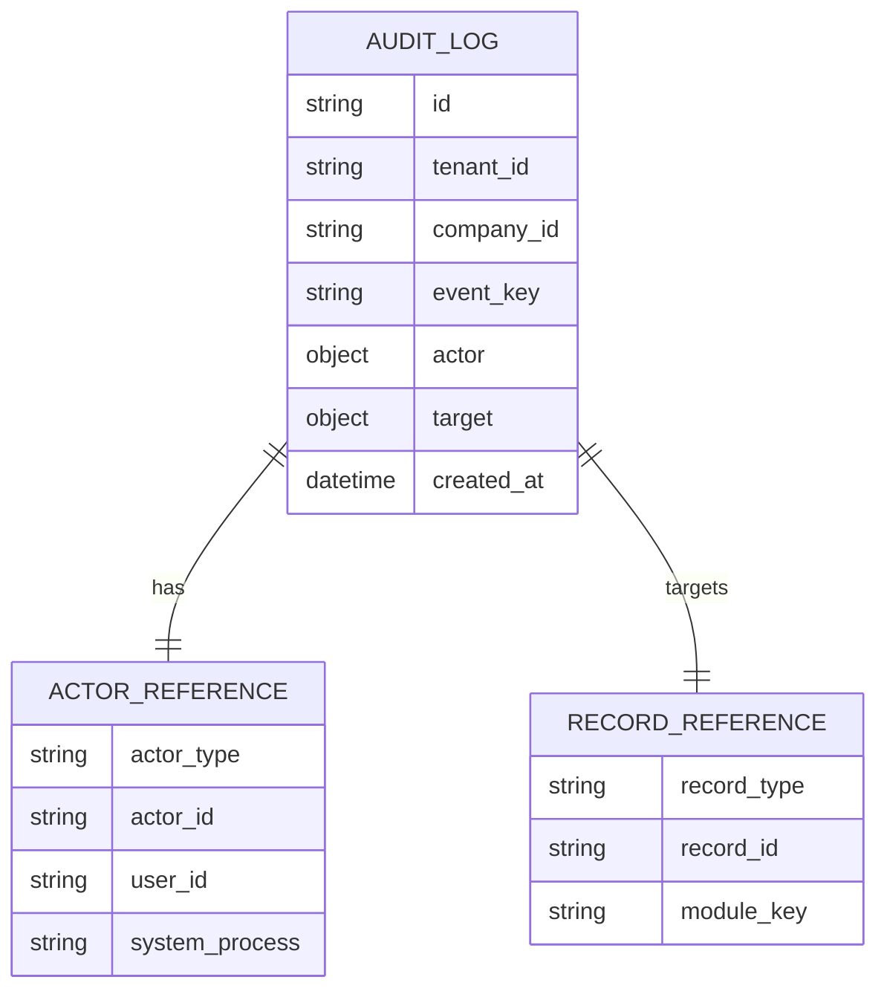
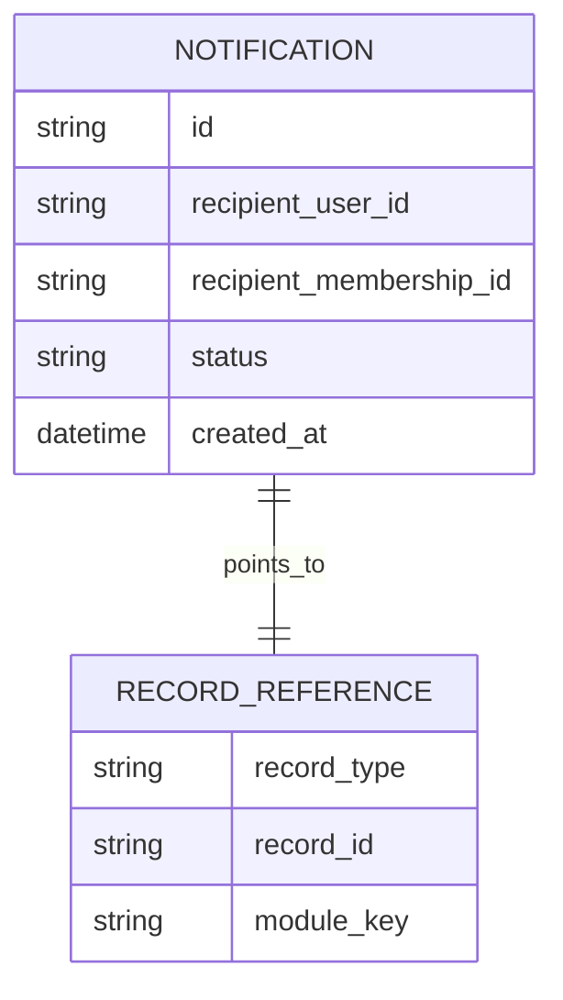
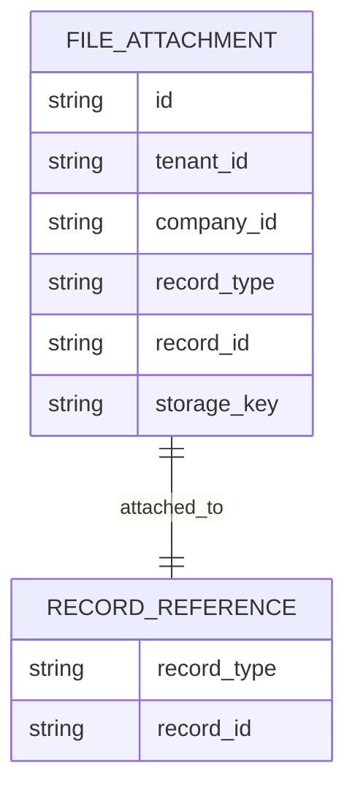

# Phase 03: Core Platform Foundation

## Document Metadata

| Field | Value |
| --- | --- |
| Document name | `03_Core_Platform_Foundation.md` |
| Phase number | Phase 03 |
| Phase name | Core Platform Foundation |
| Document type | Phase requirements and implementation specification |
| Version | 1.0 |
| Status | Draft |
| Owner | Product / Architecture / Documentation |
| Last updated | 2026-05-09 |
| Source documents | `00_Master_Platform_Documentation.md`; `00_Global_Documentation_Rules.md`; `00_Global_Domain_Model.md`; `00_Global_Decisions_Register.md`; `01_Product_Definition__Summary_For_Future_Phases.md`; `02_Tenant_Identity_Access__Summary_For_Future_Phases.md` |
| Intended audience | Product architects, engineering leads, design leads, QA leads, implementation leads, platform administrators, future phase writers |

## 1. Phase Purpose

Phase 03 exists to define the shared Core Platform layer that every future module depends on before CRM, outbound sales, field operations, inventory, dispatch, fleet, service, reporting, integration, and mobile-specific documents add their own detailed behavior.

This phase establishes reusable platform services for audit logging, notifications, files, tags, custom fields, search, saved views, imports, exports, API keys, webhooks, settings, background jobs, activity timeline patterns, admin UX patterns, and shared operational conventions. It prevents later phases from inventing duplicate versions of the same cross-module services.

Phase 03 is not a full technical build plan for every future feature. It is the authoritative platform-foundation design layer that future phase writers must extend.

## 2. Phase Goals

- Establish shared platform services before module-specific records are designed.
- Define audit logging foundations for administrative, security, integration, and operational traceability.
- Define notification foundations for in-app delivery and future email, push, and SMS support.
- Define file and attachment foundations for documents, photos, proofs, import files, and export files.
- Define tagging and custom field foundations without allowing them to replace canonical domain fields.
- Define global search and saved view foundations.
- Define import/export job foundations for bulk and long-running work.
- Define API key and webhook foundations for future integration and public API phases.
- Define shared settings and metadata patterns.
- Define reusable UI and admin patterns.
- Define background job expectations, retry behavior, error visibility, and operational observability.
- Prevent future phases from creating duplicate or conflicting platform services.

## 3. Scope

### In Scope

- `AuditLog`
- `Notification`
- `FileAttachment`
- `Tag`
- `TagAssignment`
- `CustomFieldDefinition`
- `CustomFieldValue`
- `SavedView`
- `SearchIndexRecord`
- `ImportJob`
- `ExportJob`
- `ApiKey`
- `WebhookEndpoint`
- `WebhookDelivery`
- `SettingsDocument`
- `BackgroundJob`
- System, tenant, company, module, and user settings foundations.
- Shared background job behavior.
- Shared platform activity patterns.
- Shared UI/UX patterns for common components.
- Shared filters and list behavior.
- Shared error, empty, loading, disabled, and permission-denied states.
- Shared data retention expectations.
- Cross-module usage rules.

### Out of Scope

- Detailed module-specific data models beyond the shared platform layer.
- Final implementation of external providers.
- Final enterprise security hardening.
- Full deployment, infrastructure, and production operations runbooks.

## 4. Non-Goals

- No detailed CRM data model.
- No final outbound campaign model.
- No final task/calendar model.
- No final inventory schema.
- No final dispatch schema.
- No final fleet tracking schema.
- No final service work order schema.
- No final dashboard/report builder implementation.
- No final QuickBooks sync implementation.
- No full offline sync engine.
- No final public API product documentation.
- No full automation/rules engine.
- No final enterprise security hardening.
- No production deployment runbook.

## 5. Source-of-Truth Platform Concepts

| Concept | Definition | Future Phase Rule |
| --- | --- | --- |
| Platform Service | A reusable shared capability owned by Core Platform. | Extend it; do not duplicate it in feature modules. |
| Tenant Scope | Top-level SaaS isolation boundary. | Tenant-owned data must include `tenant_id`. |
| Company Scope | Customer organization inside a Tenant. | Company records must include `tenant_id` and `company_id`. |
| User Scope | Data tied to an authenticated human identity. | Must respect UserMembership and current company context. |
| Module Scope | Capability boundary such as CRM, Inventory, Dispatch, Fleet, Service, Reporting, Integrations. | Module enablement and user permission are both required. |
| Record Reference | Generic pointer to a canonical record. | Use canonical entity names and stable IDs. |
| Actor Reference | Generic description of who or what performed an action. | Use across audit, jobs, imports, exports, and integrations. |
| System Actor | Platform process performing work. | Must be explicit, not hidden as a user. |
| External Actor | External system or API key performing work. | Must reference integration/API identity where possible. |
| Event | Something that happened. | Important events should be audit, timeline, notification, webhook, or job events as appropriate. |
| Audit Event | Append-only internal trace event. | Use AuditLog. |
| Notification Event | Event that may create a user-facing notification. | Use Notification. |
| Background Job | Async unit of work. | Use BackgroundJob expectations. |
| Import Job | Async bulk data ingestion. | Use ImportJob. |
| Export Job | Async data extraction. | Use ExportJob. |
| Webhook Event | Event delivered externally. | Use WebhookEndpoint and WebhookDelivery. |
| Saved View | Stored view/filter configuration. | Use SavedView. |
| Custom Field | Controlled configurable extension field. | Use CustomFieldDefinition and CustomFieldValue. |
| Tag | Controlled reusable record label. | Use Tag and TagAssignment. |
| Attachment | File linked to a record. | Use FileAttachment. |
| Metadata | Non-critical extension object. | Must not store required workflow or permission fields. |
| External Reference | Provider or external-system reference. | Store in `external_refs` or approved link entities. |

### Do Not Duplicate These Concepts

| Do Not Create | Use Instead | Reason |
| --- | --- | --- |
| `CrmAuditLog`, `InventoryAuditLog`, `DispatchAuditHistory` | `AuditLog` | One audit model gives consistent traceability. |
| `Photo`, `ProofDocument`, `ImportedFile`, `ExportFile` as separate storage primitives | `FileAttachment` | Files need one access, retention, storage, and audit model. |
| Module-specific tag tables | `Tag` + `TagAssignment` | Tags must work across filters, saved views, and reporting. |
| Module-specific custom field systems | `CustomFieldDefinition` + `CustomFieldValue` | Custom fields need shared validation and reporting behavior. |
| Module-specific saved filter models | `SavedView` | List/table/kanban/calendar/map views need a common model. |
| Synchronous large CSV import endpoints | `ImportJob` | Bulk work must be observable and retryable. |
| Direct large export response downloads | `ExportJob` | Data extraction must be permission-aware and audited. |
| Raw provider-specific external ID fields | `external_refs` / approved link entity | Prevents schema sprawl. |
| Module-specific background job status tables | `BackgroundJob` pattern | Async work needs shared observability. |

## 6. Platform Scope and Ownership Model

Core Platform owns shared services. Feature modules consume shared services. Future phases must extend, not duplicate, core services. Tenant/company context must be present on company-scoped platform records. Platform-level records must be explicitly marked as platform, tenant, system, company, module, user, or record scoped. All shared services must respect identity/access rules from Phase 02.

| Core Platform Service | Owner Module | Consumers | Scope | Purpose |
| --- | --- | --- | --- | --- |
| AuditLog | Core Platform | All modules | Tenant + company where applicable | Append-only internal audit event model for important admin, security, integration, and operational actions. |
| Notification | Core Platform | All modules | Tenant + company + recipient | Permission-aware in-app notification model with future email, push, and SMS delivery. |
| FileAttachment | Core Platform | All modules | Tenant + company + record | Canonical file, photo, proof, document, and attachment model. |
| Tag / TagAssignment | Core Platform | CRM, Field, Inventory, Dispatch, Fleet, Service, Reporting | Company + module/entity | Reusable controlled labels assigned to records. |
| CustomFieldDefinition / CustomFieldValue | Core Platform | All feature modules | Company + module/entity + record | Controlled extension fields that do not replace core fields. |
| SavedView | Core Platform | All list/calendar/map/kanban modules | Company + user/team/shared visibility | Reusable saved filters, columns, sorting, grouping, and view type configuration. |
| SearchIndexRecord | Core Platform | All searchable modules | Tenant + company + module | Permission-aware search indexing abstraction. |
| ImportJob | Core Platform | CRM, Outbound, Inventory, Integrations, Reporting | Tenant + company + module/entity | Async import job framework for CSV/Excel and future API imports. |
| ExportJob | Core Platform | All modules with exportable data | Tenant + company + module/entity | Async, audited, permission-aware export framework. |
| ApiKey | Core Platform / Integrations | Future public API and integration phases | Tenant + company where applicable | Hashed scoped API credentials foundation. |
| WebhookEndpoint / WebhookDelivery | Core Platform / Integrations | Future public API, integrations, automation | Tenant + company | Event subscription and delivery foundation. |
| SettingsDocument | Core Platform | All modules | Platform, tenant, company, module, user | Settings and preference hierarchy with audited changes. |
| BackgroundJob | Core Platform | Imports, exports, notifications, webhooks, search, reporting, sync | Tenant + company where applicable | Operational wrapper for async work and observability. |


## 7. Shared Field Standards

| Field | Type | Requirement | Purpose / Rule |
| --- | --- | --- | --- |
| id | string | Yes | Stable application identifier exposed through APIs. MongoDB `_id` must never be exposed as the public contract. |
| tenant_id | string | Required for tenant-owned data | Top-level SaaS isolation boundary. |
| company_id | string | Required for company records | Company scope inside the tenant. |
| created_at | datetime | Yes | UTC timestamp for creation. |
| created_by | ActorReference / user id | Recommended/required for mutable records | Actor that created the record; system actors allowed. |
| updated_at | datetime | Required for mutable records | UTC timestamp for last update. |
| updated_by | ActorReference / user id | Required for mutable records | Actor that last updated the record. |
| deleted_at | datetime | Conditional | Soft-delete timestamp for major configurable/business records. |
| deleted_by | ActorReference / user id | Conditional | Actor that soft-deleted the record. |
| status | enum/string | Conditional | Primary lifecycle state. |
| source | enum/string | Recommended | Origin such as `manual`, `import`, `api`, `integration`, `mobile_offline`, or `system`. |
| external_refs | object | Recommended | Provider IDs and external references; provider-specific IDs must not become top-level ad hoc fields. |
| metadata | object | Recommended | Non-critical extension metadata; must not store required workflow, permission, or reporting data. |


Rules:

- Not every record needs every field, but company-scoped operational and configurable records should follow this pattern unless explicitly marked not applicable.
- MongoDB `_id` must not be exposed as the public API ID.
- External IDs must be stored in `external_refs` or approved provider link entities.
- Soft delete should apply to major configurable/business records.
- Append-only event records generally should not be edited or soft deleted except by retention/anonymization policy.

## 8. Record Reference Standard

Record references allow audit logs, notifications, files, tags, custom fields, search, saved views, comments, timeline events, jobs, and webhooks to point to records consistently.

| Field | Type | Required | Purpose |
| --- | --- | --- | --- |
| `record_type` | string | Yes | Canonical entity name from the global domain model. |
| `record_id` | string | Yes | Stable application ID. |
| `tenant_id` | string | Yes | Tenant boundary. |
| `company_id` | string | Conditional | Required for company-scoped records. |
| `module_key` | string | Recommended | Owning/visible module. |
| `display_label` | string | Recommended snapshot | Safe label for logs/notifications when the source record changes. |
| `url_path` | string | Optional | UI route hint; permission must still be checked. |
| `metadata` | object | Optional | Non-critical display or routing hints. |

Future phases must use canonical entity names from the global domain model. Record references must not create duplicate entity concepts. Permission checks must be applied whenever a referenced record is dereferenced, opened, downloaded, exported, or sent in a notification/webhook.

## 9. Actor Reference Standard

Actor references describe who or what performed an action.

| Actor Type | Meaning | Required Usage |
| --- | --- | --- |
| `user` | Authenticated human user. | User-created, updated, deleted, exported, imported, tagged, configured actions. |
| `system` | Platform process. | Scheduled jobs, automated cleanup, indexing, notification delivery. |
| `integration` | Connected external provider. | QuickBooks, email/SMS provider, webhook receiver, future integrations. |
| `background_job` | Worker process tied to a specific job. | Import, export, webhook, notification, search indexing, sync jobs. |
| `external` | External actor without full platform identity. | API requests or externally initiated callbacks where applicable. |

Recommended fields:

| Field | Purpose |
| --- | --- |
| `actor_type` | One of `user`, `system`, `integration`, `background_job`, `external`. |
| `actor_id` | Stable actor identifier if available. |
| `actor_display_name` | Snapshot for audit/admin display. |
| `user_id` | Canonical User ID when actor is a user. |
| `integration_connection_id` | Integration identity where relevant. |
| `system_process` | Named system process such as `search_indexer` or `webhook_delivery_worker`. |
| `ip_address` | Request IP where available and appropriate. |
| `user_agent` | Request user agent where available and appropriate. |
| `metadata` | Non-critical context. |

Actor references are used by audit logs, notifications, imports, exports, webhooks, background jobs, settings changes, API key usage, file uploads, and admin investigations.

## 10. Audit Log Foundation

`AuditLog` is the canonical shared append-only internal event model for important actions. It is owned by Core Platform and consumed by every feature module. It must record administrative, security, data extraction, settings, integration, import/export, file, permission, and important operational actions.

AuditLog is not the same as a user-facing activity timeline. AuditLog is compliance/admin/security oriented. User-facing timelines can reuse events or link to related events, but must not expose sensitive internal audit content to normal users.

### Audit Rules

- AuditLog is append-only.
- Event keys must use `module.resource.action` naming.
- Examples: `identity.user.invited`, `crm.account.created`, `inventory.stock_movement.created`, `dispatch.plan.assigned`, `fleet.geofence.entered`, `integration.quickbooks.sync_failed`.
- Future phases must define their audit events explicitly.
- Audit entries must include tenant/company scope where applicable.
- Sensitive fields must be masked, redacted, or summarized.
- Company Admin visibility is limited to their company scope and permitted event categories.
- Super Admin visibility is separate from Company Admin access and must follow support/security policy.
- Retention requirements must be explicit for security-relevant and compliance-relevant events.

### Recommended AuditLog Fields

| Field | Type / Purpose |
| --- | --- |
| id | See description |
| tenant_id | See description |
| company_id | See description |
| event_key | See description |
| event_category | See description |
| severity | See description |
| actor | See description |
| target | See description |
| action | See description |
| before | See description |
| after | See description |
| metadata | See description |
| ip_address | See description |
| user_agent | See description |
| created_at | See description |


## 11. Notification Foundation

`Notification` is the canonical shared platform service for user-facing notices. In-app notifications are the baseline. Email is optional/recommended for job completion and admin-critical events. SMS and mobile push are future-capable unless a later phase requires them.

Notifications must be permission-aware. A notification may tell a user that something requires attention, but it must not include restricted record data or allow the target to be opened without permission checks. Cross-company notification isolation is mandatory.

### Notification Types and Channels

| Type | Example | Baseline Channel | Future Channels |
| --- | --- | --- | --- |
| Job status | Import completed, export failed | In-app | Email |
| Admin/security | API key created, settings changed | In-app | Email |
| Integration health | Webhook disabled, sync failed | In-app | Email |
| Operational alert | Low stock, delay, device offline | Later module phase | Email, push, SMS |
| Assignment/reminder | Task due soon, mention | Later module phase | Email, push |

### Recommended Notification Fields

| Field | Purpose |
| --- | --- |
| id | Notification identity, scope, recipient, content, target, delivery, read state, or metadata. |
| tenant_id | Notification identity, scope, recipient, content, target, delivery, read state, or metadata. |
| company_id | Notification identity, scope, recipient, content, target, delivery, read state, or metadata. |
| recipient_user_id | Notification identity, scope, recipient, content, target, delivery, read state, or metadata. |
| recipient_membership_id | Notification identity, scope, recipient, content, target, delivery, read state, or metadata. |
| type | Notification identity, scope, recipient, content, target, delivery, read state, or metadata. |
| channel | Notification identity, scope, recipient, content, target, delivery, read state, or metadata. |
| title | Notification identity, scope, recipient, content, target, delivery, read state, or metadata. |
| body | Notification identity, scope, recipient, content, target, delivery, read state, or metadata. |
| target | Notification identity, scope, recipient, content, target, delivery, read state, or metadata. |
| status | Notification identity, scope, recipient, content, target, delivery, read state, or metadata. |
| read_at | Notification identity, scope, recipient, content, target, delivery, read state, or metadata. |
| delivered_at | Notification identity, scope, recipient, content, target, delivery, read state, or metadata. |
| failed_at | Notification identity, scope, recipient, content, target, delivery, read state, or metadata. |
| failure_reason | Notification identity, scope, recipient, content, target, delivery, read state, or metadata. |
| created_at | Notification identity, scope, recipient, content, target, delivery, read state, or metadata. |
| metadata | Notification identity, scope, recipient, content, target, delivery, read state, or metadata. |


Notification event keys should use clear names such as `identity.invitation_sent`, `task.due_soon`, `dispatch.delay_detected`, `inventory.low_stock`, `fleet.device_offline`, and `integration.sync_failed`. Detailed rules for module-specific notifications belong in later module phases.

## 12. File and Attachment Foundation

`FileAttachment` is the canonical model for files, photos, proofs, documents, import files, and export result files. Later phases must use FileAttachment instead of inventing separate file/photo/document entities unless a domain-specific wrapper is required for business workflow.

Supported use cases include CRM documents, field photos, proof of delivery, service photos, inventory import files, export downloads, integration error files, and admin-uploaded reference files.

File storage must be abstracted behind `storage_provider` and `storage_key`. File metadata must include MIME type, size, checksum, status, and visibility. Virus/malware scanning is recommended and may become mandatory depending storage/security decision.

### Recommended FileAttachment Fields

| Field | Purpose |
| --- | --- |
| id | File identity, scope, target record, uploader, storage metadata, status, visibility, retention, or extension metadata. |
| tenant_id | File identity, scope, target record, uploader, storage metadata, status, visibility, retention, or extension metadata. |
| company_id | File identity, scope, target record, uploader, storage metadata, status, visibility, retention, or extension metadata. |
| record_type | File identity, scope, target record, uploader, storage metadata, status, visibility, retention, or extension metadata. |
| record_id | File identity, scope, target record, uploader, storage metadata, status, visibility, retention, or extension metadata. |
| uploaded_by | File identity, scope, target record, uploader, storage metadata, status, visibility, retention, or extension metadata. |
| filename | File identity, scope, target record, uploader, storage metadata, status, visibility, retention, or extension metadata. |
| original_filename | File identity, scope, target record, uploader, storage metadata, status, visibility, retention, or extension metadata. |
| mime_type | File identity, scope, target record, uploader, storage metadata, status, visibility, retention, or extension metadata. |
| size_bytes | File identity, scope, target record, uploader, storage metadata, status, visibility, retention, or extension metadata. |
| storage_provider | File identity, scope, target record, uploader, storage metadata, status, visibility, retention, or extension metadata. |
| storage_key | File identity, scope, target record, uploader, storage metadata, status, visibility, retention, or extension metadata. |
| checksum | File identity, scope, target record, uploader, storage metadata, status, visibility, retention, or extension metadata. |
| status | File identity, scope, target record, uploader, storage metadata, status, visibility, retention, or extension metadata. |
| visibility | File identity, scope, target record, uploader, storage metadata, status, visibility, retention, or extension metadata. |
| created_at | File identity, scope, target record, uploader, storage metadata, status, visibility, retention, or extension metadata. |
| deleted_at | File identity, scope, target record, uploader, storage metadata, status, visibility, retention, or extension metadata. |
| metadata | File identity, scope, target record, uploader, storage metadata, status, visibility, retention, or extension metadata. |


Rules:

- File upload, delete, quarantine, and failed upload events must be auditable where material.
- File access must re-check record access.
- Soft delete is the baseline for user-visible deletion.
- File previews must respect MIME type, permissions, and storage provider capabilities.
- Field mobile photo capture and proof of delivery must use this foundation when defined later.

## 13. Tag Foundation

`Tag` provides controlled labels for filtering, segmentation, list organization, and future reporting. Tags are company-scoped and may be module-scoped or entity-scoped. Tags must not become an uncontrolled replacement for lifecycle status, owner, assignment, type, or workflow fields.

Recommended Decision: use `TagAssignment` as an explicit entity/collection. This keeps tagging consistent across records, supports filtering/reporting, and avoids modifying every target record schema differently. This remains open until implementation confirms performance and query strategy.

### Tag Fields

| Field | Purpose |
| --- | --- |
| id | Tag identity, scope, display, lifecycle, ownership, or metadata. |
| tenant_id | Tag identity, scope, display, lifecycle, ownership, or metadata. |
| company_id | Tag identity, scope, display, lifecycle, ownership, or metadata. |
| name | Tag identity, scope, display, lifecycle, ownership, or metadata. |
| slug | Tag identity, scope, display, lifecycle, ownership, or metadata. |
| color | Tag identity, scope, display, lifecycle, ownership, or metadata. |
| description | Tag identity, scope, display, lifecycle, ownership, or metadata. |
| module_scope | Tag identity, scope, display, lifecycle, ownership, or metadata. |
| status | Tag identity, scope, display, lifecycle, ownership, or metadata. |
| created_at | Tag identity, scope, display, lifecycle, ownership, or metadata. |
| created_by | Tag identity, scope, display, lifecycle, ownership, or metadata. |
| updated_at | Tag identity, scope, display, lifecycle, ownership, or metadata. |
| updated_by | Tag identity, scope, display, lifecycle, ownership, or metadata. |
| metadata | Tag identity, scope, display, lifecycle, ownership, or metadata. |


### TagAssignment Fields

| Field | Purpose |
| --- | --- |
| id | Assignment identity, scope, tag reference, target record reference, actor, timestamp, or metadata. |
| tenant_id | Assignment identity, scope, tag reference, target record reference, actor, timestamp, or metadata. |
| company_id | Assignment identity, scope, tag reference, target record reference, actor, timestamp, or metadata. |
| tag_id | Assignment identity, scope, tag reference, target record reference, actor, timestamp, or metadata. |
| record_type | Assignment identity, scope, tag reference, target record reference, actor, timestamp, or metadata. |
| record_id | Assignment identity, scope, tag reference, target record reference, actor, timestamp, or metadata. |
| assigned_by | Assignment identity, scope, tag reference, target record reference, actor, timestamp, or metadata. |
| created_at | Assignment identity, scope, tag reference, target record reference, actor, timestamp, or metadata. |
| metadata | Assignment identity, scope, tag reference, target record reference, actor, timestamp, or metadata. |


Tag rename, merge, archive, and assignment removal must be handled carefully so saved views and filters continue to work by `tag_id` rather than tag name.

## 14. Custom Field Foundation

`CustomFieldDefinition` and `CustomFieldValue` allow companies to extend records without changing the canonical schema. Custom fields must be company-scoped and module/entity-scoped. They must not replace stable required fields needed for workflow, permissions, search, reporting, sync, or integrations.

Supported field types:

- `text`
- `long_text`
- `number`
- `currency`
- `date`
- `datetime`
- `boolean`
- `select`
- `multi_select`
- `user_reference`
- `record_reference`
- `url`
- `email`
- `phone`

### CustomFieldDefinition Fields

| Field | Purpose |
| --- | --- |
| id | Definition identity, scope, target entity, key, display, type, validation, reporting/filtering, lifecycle, or metadata. |
| tenant_id | Definition identity, scope, target entity, key, display, type, validation, reporting/filtering, lifecycle, or metadata. |
| company_id | Definition identity, scope, target entity, key, display, type, validation, reporting/filtering, lifecycle, or metadata. |
| module_key | Definition identity, scope, target entity, key, display, type, validation, reporting/filtering, lifecycle, or metadata. |
| entity_type | Definition identity, scope, target entity, key, display, type, validation, reporting/filtering, lifecycle, or metadata. |
| field_key | Definition identity, scope, target entity, key, display, type, validation, reporting/filtering, lifecycle, or metadata. |
| label | Definition identity, scope, target entity, key, display, type, validation, reporting/filtering, lifecycle, or metadata. |
| description | Definition identity, scope, target entity, key, display, type, validation, reporting/filtering, lifecycle, or metadata. |
| field_type | Definition identity, scope, target entity, key, display, type, validation, reporting/filtering, lifecycle, or metadata. |
| is_required | Definition identity, scope, target entity, key, display, type, validation, reporting/filtering, lifecycle, or metadata. |
| is_filterable | Definition identity, scope, target entity, key, display, type, validation, reporting/filtering, lifecycle, or metadata. |
| is_reportable | Definition identity, scope, target entity, key, display, type, validation, reporting/filtering, lifecycle, or metadata. |
| options | Definition identity, scope, target entity, key, display, type, validation, reporting/filtering, lifecycle, or metadata. |
| validation | Definition identity, scope, target entity, key, display, type, validation, reporting/filtering, lifecycle, or metadata. |
| default_value | Definition identity, scope, target entity, key, display, type, validation, reporting/filtering, lifecycle, or metadata. |
| status | Definition identity, scope, target entity, key, display, type, validation, reporting/filtering, lifecycle, or metadata. |
| created_at | Definition identity, scope, target entity, key, display, type, validation, reporting/filtering, lifecycle, or metadata. |
| created_by | Definition identity, scope, target entity, key, display, type, validation, reporting/filtering, lifecycle, or metadata. |
| updated_at | Definition identity, scope, target entity, key, display, type, validation, reporting/filtering, lifecycle, or metadata. |
| updated_by | Definition identity, scope, target entity, key, display, type, validation, reporting/filtering, lifecycle, or metadata. |
| metadata | Definition identity, scope, target entity, key, display, type, validation, reporting/filtering, lifecycle, or metadata. |


### CustomFieldValue Fields

| Field | Purpose |
| --- | --- |
| id | Value identity, scope, field definition reference, target record reference, typed value, timestamps, or metadata. |
| tenant_id | Value identity, scope, field definition reference, target record reference, typed value, timestamps, or metadata. |
| company_id | Value identity, scope, field definition reference, target record reference, typed value, timestamps, or metadata. |
| field_definition_id | Value identity, scope, field definition reference, target record reference, typed value, timestamps, or metadata. |
| record_type | Value identity, scope, field definition reference, target record reference, typed value, timestamps, or metadata. |
| record_id | Value identity, scope, field definition reference, target record reference, typed value, timestamps, or metadata. |
| value | Value identity, scope, field definition reference, target record reference, typed value, timestamps, or metadata. |
| value_type | Value identity, scope, field definition reference, target record reference, typed value, timestamps, or metadata. |
| created_at | Value identity, scope, field definition reference, target record reference, typed value, timestamps, or metadata. |
| updated_at | Value identity, scope, field definition reference, target record reference, typed value, timestamps, or metadata. |
| metadata | Value identity, scope, field definition reference, target record reference, typed value, timestamps, or metadata. |


Custom fields affect APIs, forms, imports, exports, search, filters, saved views, reports, mobile forms, and permissions. Future phases must explicitly state which entities support custom fields and which fields are filterable/reportable.

## 15. Saved View Foundation

`SavedView` stores reusable view configuration for list, table, kanban, calendar, and map views. It supports personal views, future team/company views, default views, filters, sorting, columns, grouping, search query, module/entity scope, permission behavior, sharing behavior, and audit requirements.

### SavedView Fields

| Field | Purpose |
| --- | --- |
| id | Saved view identity, scope, owner, module/entity, display, view type, visibility, configuration, lifecycle, or metadata. |
| tenant_id | Saved view identity, scope, owner, module/entity, display, view type, visibility, configuration, lifecycle, or metadata. |
| company_id | Saved view identity, scope, owner, module/entity, display, view type, visibility, configuration, lifecycle, or metadata. |
| owner_user_id | Saved view identity, scope, owner, module/entity, display, view type, visibility, configuration, lifecycle, or metadata. |
| module_key | Saved view identity, scope, owner, module/entity, display, view type, visibility, configuration, lifecycle, or metadata. |
| entity_type | Saved view identity, scope, owner, module/entity, display, view type, visibility, configuration, lifecycle, or metadata. |
| name | Saved view identity, scope, owner, module/entity, display, view type, visibility, configuration, lifecycle, or metadata. |
| view_type | Saved view identity, scope, owner, module/entity, display, view type, visibility, configuration, lifecycle, or metadata. |
| visibility | Saved view identity, scope, owner, module/entity, display, view type, visibility, configuration, lifecycle, or metadata. |
| filters | Saved view identity, scope, owner, module/entity, display, view type, visibility, configuration, lifecycle, or metadata. |
| sort | Saved view identity, scope, owner, module/entity, display, view type, visibility, configuration, lifecycle, or metadata. |
| columns | Saved view identity, scope, owner, module/entity, display, view type, visibility, configuration, lifecycle, or metadata. |
| group_by | Saved view identity, scope, owner, module/entity, display, view type, visibility, configuration, lifecycle, or metadata. |
| search_query | Saved view identity, scope, owner, module/entity, display, view type, visibility, configuration, lifecycle, or metadata. |
| is_default | Saved view identity, scope, owner, module/entity, display, view type, visibility, configuration, lifecycle, or metadata. |
| status | Saved view identity, scope, owner, module/entity, display, view type, visibility, configuration, lifecycle, or metadata. |
| created_at | Saved view identity, scope, owner, module/entity, display, view type, visibility, configuration, lifecycle, or metadata. |
| updated_at | Saved view identity, scope, owner, module/entity, display, view type, visibility, configuration, lifecycle, or metadata. |
| metadata | Saved view identity, scope, owner, module/entity, display, view type, visibility, configuration, lifecycle, or metadata. |


Detailed filters for each module must be defined in later module phases. Phase 18 will consolidate search, filters, and custom view behavior.

## 16. Global Search Foundation

Global search helps users find permitted records across enabled modules. It must be tenant-scoped, company-scoped, module-aware, and permission-aware. Search must not return records from disabled modules, other companies, deleted records, or records hidden by permissions.

Search indexing may start with MongoDB indexes or a `SearchIndexRecord` collection, but the design must remain compatible with a future dedicated search service.

### Search Result Shape

| Field | Purpose |
| --- | --- |
| `record_type` | Canonical entity type. |
| `record_id` | Stable application ID. |
| `module_key` | Module that owns/displays result. |
| `title` | Primary display label. |
| `subtitle` | Secondary context. |
| `status` | Current lifecycle status where safe. |
| `owner_user_id` | Owner where safe and relevant. |
| `url_path` | Navigation hint after permission check. |
| `updated_at` | Recentness/ranking hint. |

### SearchIndexRecord Fields

| Field | Purpose |
| --- | --- |
| id | Search index identity, scope, record reference, searchable display fields, status, owner, update timestamp, or metadata. |
| tenant_id | Search index identity, scope, record reference, searchable display fields, status, owner, update timestamp, or metadata. |
| company_id | Search index identity, scope, record reference, searchable display fields, status, owner, update timestamp, or metadata. |
| record_type | Search index identity, scope, record reference, searchable display fields, status, owner, update timestamp, or metadata. |
| record_id | Search index identity, scope, record reference, searchable display fields, status, owner, update timestamp, or metadata. |
| module_key | Search index identity, scope, record reference, searchable display fields, status, owner, update timestamp, or metadata. |
| title | Search index identity, scope, record reference, searchable display fields, status, owner, update timestamp, or metadata. |
| subtitle | Search index identity, scope, record reference, searchable display fields, status, owner, update timestamp, or metadata. |
| keywords | Search index identity, scope, record reference, searchable display fields, status, owner, update timestamp, or metadata. |
| status | Search index identity, scope, record reference, searchable display fields, status, owner, update timestamp, or metadata. |
| owner_user_id | Search index identity, scope, record reference, searchable display fields, status, owner, update timestamp, or metadata. |
| updated_at | Search index identity, scope, record reference, searchable display fields, status, owner, update timestamp, or metadata. |
| metadata | Search index identity, scope, record reference, searchable display fields, status, owner, update timestamp, or metadata. |


Full search/filter implementation is expanded in Phase 18.

## 17. Import Job Foundation

`ImportJob` is the required framework for CSV/Excel import baseline and future API/provider imports. Imports must support validation, mapping, preview, dry run, execution, partial success, error rows, duplicate handling, permissions, audit logging, notifications, background processing, tenant/company scoping, and module-specific import definitions.

### ImportJob Fields

| Field | Purpose |
| --- | --- |
| id | Import identity, scope, target module/entity, status, source file, mapping, counters, lifecycle timestamps, creator, or metadata. |
| tenant_id | Import identity, scope, target module/entity, status, source file, mapping, counters, lifecycle timestamps, creator, or metadata. |
| company_id | Import identity, scope, target module/entity, status, source file, mapping, counters, lifecycle timestamps, creator, or metadata. |
| module_key | Import identity, scope, target module/entity, status, source file, mapping, counters, lifecycle timestamps, creator, or metadata. |
| entity_type | Import identity, scope, target module/entity, status, source file, mapping, counters, lifecycle timestamps, creator, or metadata. |
| status | Import identity, scope, target module/entity, status, source file, mapping, counters, lifecycle timestamps, creator, or metadata. |
| source_type | Import identity, scope, target module/entity, status, source file, mapping, counters, lifecycle timestamps, creator, or metadata. |
| file_attachment_id | Import identity, scope, target module/entity, status, source file, mapping, counters, lifecycle timestamps, creator, or metadata. |
| mapping | Import identity, scope, target module/entity, status, source file, mapping, counters, lifecycle timestamps, creator, or metadata. |
| total_rows | Import identity, scope, target module/entity, status, source file, mapping, counters, lifecycle timestamps, creator, or metadata. |
| processed_rows | Import identity, scope, target module/entity, status, source file, mapping, counters, lifecycle timestamps, creator, or metadata. |
| success_rows | Import identity, scope, target module/entity, status, source file, mapping, counters, lifecycle timestamps, creator, or metadata. |
| failed_rows | Import identity, scope, target module/entity, status, source file, mapping, counters, lifecycle timestamps, creator, or metadata. |
| error_summary | Import identity, scope, target module/entity, status, source file, mapping, counters, lifecycle timestamps, creator, or metadata. |
| started_at | Import identity, scope, target module/entity, status, source file, mapping, counters, lifecycle timestamps, creator, or metadata. |
| completed_at | Import identity, scope, target module/entity, status, source file, mapping, counters, lifecycle timestamps, creator, or metadata. |
| created_by | Import identity, scope, target module/entity, status, source file, mapping, counters, lifecycle timestamps, creator, or metadata. |
| created_at | Import identity, scope, target module/entity, status, source file, mapping, counters, lifecycle timestamps, creator, or metadata. |
| metadata | Import identity, scope, target module/entity, status, source file, mapping, counters, lifecycle timestamps, creator, or metadata. |


Future module phases must define entity-specific import schemas and duplicate handling but must use the ImportJob lifecycle.

## 18. Export Job Foundation

`ExportJob` is the required framework for permission-aware CSV/Excel exports and future scheduled/report exports. Large exports must run in background jobs. Export creation and download must be audited. Export files must expire. Sensitive data restrictions must be enforced at creation and download time.

### ExportJob Fields

| Field | Purpose |
| --- | --- |
| id | Export identity, scope, target module/entity, status, format, filters, columns, result file, row count, lifecycle timestamps, creator, expiration, or metadata. |
| tenant_id | Export identity, scope, target module/entity, status, format, filters, columns, result file, row count, lifecycle timestamps, creator, expiration, or metadata. |
| company_id | Export identity, scope, target module/entity, status, format, filters, columns, result file, row count, lifecycle timestamps, creator, expiration, or metadata. |
| module_key | Export identity, scope, target module/entity, status, format, filters, columns, result file, row count, lifecycle timestamps, creator, expiration, or metadata. |
| entity_type | Export identity, scope, target module/entity, status, format, filters, columns, result file, row count, lifecycle timestamps, creator, expiration, or metadata. |
| status | Export identity, scope, target module/entity, status, format, filters, columns, result file, row count, lifecycle timestamps, creator, expiration, or metadata. |
| format | Export identity, scope, target module/entity, status, format, filters, columns, result file, row count, lifecycle timestamps, creator, expiration, or metadata. |
| filters | Export identity, scope, target module/entity, status, format, filters, columns, result file, row count, lifecycle timestamps, creator, expiration, or metadata. |
| columns | Export identity, scope, target module/entity, status, format, filters, columns, result file, row count, lifecycle timestamps, creator, expiration, or metadata. |
| file_attachment_id | Export identity, scope, target module/entity, status, format, filters, columns, result file, row count, lifecycle timestamps, creator, expiration, or metadata. |
| total_rows | Export identity, scope, target module/entity, status, format, filters, columns, result file, row count, lifecycle timestamps, creator, expiration, or metadata. |
| started_at | Export identity, scope, target module/entity, status, format, filters, columns, result file, row count, lifecycle timestamps, creator, expiration, or metadata. |
| completed_at | Export identity, scope, target module/entity, status, format, filters, columns, result file, row count, lifecycle timestamps, creator, expiration, or metadata. |
| expires_at | Export identity, scope, target module/entity, status, format, filters, columns, result file, row count, lifecycle timestamps, creator, expiration, or metadata. |
| created_by | Export identity, scope, target module/entity, status, format, filters, columns, result file, row count, lifecycle timestamps, creator, expiration, or metadata. |
| created_at | Export identity, scope, target module/entity, status, format, filters, columns, result file, row count, lifecycle timestamps, creator, expiration, or metadata. |
| metadata | Export identity, scope, target module/entity, status, format, filters, columns, result file, row count, lifecycle timestamps, creator, expiration, or metadata. |


## 19. API Key Foundation

`ApiKey` prepares the platform for later public API and integration phases. API keys may be company-scoped by default and tenant-scoped only where explicitly justified. Raw API keys must never be stored in plaintext. Store only `key_hash`, safe `key_prefix`, status, scopes, expiration, revocation, last-used information, and metadata.

### ApiKey Fields

| Field | Purpose |
| --- | --- |
| id | Credential identity, scope, display, hashed secret, scopes, lifecycle, ownership, use tracking, or metadata. |
| tenant_id | Credential identity, scope, display, hashed secret, scopes, lifecycle, ownership, use tracking, or metadata. |
| company_id | Credential identity, scope, display, hashed secret, scopes, lifecycle, ownership, use tracking, or metadata. |
| name | Credential identity, scope, display, hashed secret, scopes, lifecycle, ownership, use tracking, or metadata. |
| key_prefix | Credential identity, scope, display, hashed secret, scopes, lifecycle, ownership, use tracking, or metadata. |
| key_hash | Credential identity, scope, display, hashed secret, scopes, lifecycle, ownership, use tracking, or metadata. |
| scopes | Credential identity, scope, display, hashed secret, scopes, lifecycle, ownership, use tracking, or metadata. |
| status | Credential identity, scope, display, hashed secret, scopes, lifecycle, ownership, use tracking, or metadata. |
| created_by | Credential identity, scope, display, hashed secret, scopes, lifecycle, ownership, use tracking, or metadata. |
| created_at | Credential identity, scope, display, hashed secret, scopes, lifecycle, ownership, use tracking, or metadata. |
| expires_at | Credential identity, scope, display, hashed secret, scopes, lifecycle, ownership, use tracking, or metadata. |
| last_used_at | Credential identity, scope, display, hashed secret, scopes, lifecycle, ownership, use tracking, or metadata. |
| revoked_at | Credential identity, scope, display, hashed secret, scopes, lifecycle, ownership, use tracking, or metadata. |
| revoked_by | Credential identity, scope, display, hashed secret, scopes, lifecycle, ownership, use tracking, or metadata. |
| metadata | Credential identity, scope, display, hashed secret, scopes, lifecycle, ownership, use tracking, or metadata. |


API key creation, revocation, rotation, and suspicious usage must be auditable. Phase 17 expands public API and integration usage.

## 20. Webhook Endpoint Foundation

`WebhookEndpoint` and `WebhookDelivery` prepare the platform for outbound event delivery. Webhooks are company-scoped by default. Endpoint URL validation, secret handling, signature verification, delivery retry, failure tracking, disabled/paused endpoints, audit requirements, test delivery, and security restrictions must be built into the foundation.

### WebhookEndpoint Fields

| Field | Purpose |
| --- | --- |
| id | Endpoint identity, scope, URL, events, secret hash, lifecycle, ownership, health timestamps, or metadata. |
| tenant_id | Endpoint identity, scope, URL, events, secret hash, lifecycle, ownership, health timestamps, or metadata. |
| company_id | Endpoint identity, scope, URL, events, secret hash, lifecycle, ownership, health timestamps, or metadata. |
| name | Endpoint identity, scope, URL, events, secret hash, lifecycle, ownership, health timestamps, or metadata. |
| url | Endpoint identity, scope, URL, events, secret hash, lifecycle, ownership, health timestamps, or metadata. |
| event_keys | Endpoint identity, scope, URL, events, secret hash, lifecycle, ownership, health timestamps, or metadata. |
| secret_hash | Endpoint identity, scope, URL, events, secret hash, lifecycle, ownership, health timestamps, or metadata. |
| status | Endpoint identity, scope, URL, events, secret hash, lifecycle, ownership, health timestamps, or metadata. |
| created_by | Endpoint identity, scope, URL, events, secret hash, lifecycle, ownership, health timestamps, or metadata. |
| created_at | Endpoint identity, scope, URL, events, secret hash, lifecycle, ownership, health timestamps, or metadata. |
| updated_at | Endpoint identity, scope, URL, events, secret hash, lifecycle, ownership, health timestamps, or metadata. |
| last_success_at | Endpoint identity, scope, URL, events, secret hash, lifecycle, ownership, health timestamps, or metadata. |
| last_failure_at | Endpoint identity, scope, URL, events, secret hash, lifecycle, ownership, health timestamps, or metadata. |
| metadata | Endpoint identity, scope, URL, events, secret hash, lifecycle, ownership, health timestamps, or metadata. |


### WebhookDelivery Fields

| Field | Purpose |
| --- | --- |
| id | Delivery identity, scope, endpoint, event, payload, status, attempts, retry timing, response summary, timestamp, or metadata. |
| tenant_id | Delivery identity, scope, endpoint, event, payload, status, attempts, retry timing, response summary, timestamp, or metadata. |
| company_id | Delivery identity, scope, endpoint, event, payload, status, attempts, retry timing, response summary, timestamp, or metadata. |
| webhook_endpoint_id | Delivery identity, scope, endpoint, event, payload, status, attempts, retry timing, response summary, timestamp, or metadata. |
| event_key | Delivery identity, scope, endpoint, event, payload, status, attempts, retry timing, response summary, timestamp, or metadata. |
| payload | Delivery identity, scope, endpoint, event, payload, status, attempts, retry timing, response summary, timestamp, or metadata. |
| status | Delivery identity, scope, endpoint, event, payload, status, attempts, retry timing, response summary, timestamp, or metadata. |
| attempt_count | Delivery identity, scope, endpoint, event, payload, status, attempts, retry timing, response summary, timestamp, or metadata. |
| last_attempt_at | Delivery identity, scope, endpoint, event, payload, status, attempts, retry timing, response summary, timestamp, or metadata. |
| next_retry_at | Delivery identity, scope, endpoint, event, payload, status, attempts, retry timing, response summary, timestamp, or metadata. |
| response_status | Delivery identity, scope, endpoint, event, payload, status, attempts, retry timing, response summary, timestamp, or metadata. |
| response_body_excerpt | Delivery identity, scope, endpoint, event, payload, status, attempts, retry timing, response summary, timestamp, or metadata. |
| created_at | Delivery identity, scope, endpoint, event, payload, status, attempts, retry timing, response summary, timestamp, or metadata. |
| metadata | Delivery identity, scope, endpoint, event, payload, status, attempts, retry timing, response summary, timestamp, or metadata. |


Webhook payloads must include event id, event key, occurred timestamp, tenant/company context where appropriate, target record reference, and safe payload fields. Phase 17 expands webhook products, schemas, authentication, and subscriptions.

## 21. Settings Foundation

Settings exist at multiple levels and must follow a predictable override hierarchy.

| Level | Examples | Notes |
| --- | --- | --- |
| Platform settings | Global limits, allowed file types, default retention, platform feature flags. | Super Admin/platform only. |
| Tenant settings | Tenant-level defaults, support policy, security posture. | Tenant scope if multi-company tenants are used. |
| Company settings | Timezone, locale, date/time formats, enabled modules, file upload limits, import/export defaults. | Company Admin managed where permitted. |
| Module settings | Module-specific defaults such as CRM defaults, inventory settings, dispatch preferences. | Defined by later module phases. |
| User preferences | Notification preferences, personal defaults, saved view defaults, UI preferences. | User controlled where safe. |
| System defaults | Baseline values when no override exists. | Must be documented and stable. |

Settings updates require validation. Sensitive settings changes require audit logging. Versioning or optimistic concurrency is recommended to prevent conflicting admin updates.

## 22. Background Job Foundation

Long-running work must use background jobs. This includes imports, exports, notification delivery, webhook delivery, search indexing, report materialization future usage, geofence evaluation future usage, QuickBooks sync future usage, offline sync future usage, and any work that should not block an API request.

Common statuses:

- `queued`
- `running`
- `completed`
- `completed_with_errors`
- `failed`
- `canceled`
- `retrying`

Expectations:

- Jobs must be visible to authorized admins where operationally relevant.
- Jobs must carry idempotency expectations when mutation is possible.
- Job failures must be visible and recoverable where practical.
- Retry behavior must be bounded and observable.
- Job payloads must not expose sensitive data in admin views.

## 23. Platform Activity Timeline Foundation

The platform needs a user-visible activity timeline concept for key records, but it must remain distinct from AuditLog.

| Area | AuditLog | Activity / Timeline |
| --- | --- | --- |
| Audience | Admin, compliance, security, support. | Operational users with record access. |
| Content | Internal event detail, before/after, actor, IP/user agent where relevant. | Human-readable operational history and next actions. |
| Sensitivity | May contain masked security/admin data. | Must be safe for normal record viewers. |
| Mutability | Append-only. | Usually append-only, but comments/notes may have their own edit model later. |

Later phases must define module-specific timeline events. Attachments, status changes, operational events, notes, mentions, and comments may appear in timelines if the user has permission.

## 24. Shared UI / UX Requirements

| ID | Requirement |
| --- | --- |
| UX-03-001 | Provide a Core Admin layout for audit logs, settings, background jobs, imports, exports, files, API keys, and webhooks. |
| UX-03-002 | Provide a Settings layout that separates company settings, user preferences, module settings, and future platform/tenant settings. |
| UX-03-003 | All major list pages must support table/list behavior, filtering, sorting, saved views, loading states, empty states, errors, and permission-denied states. |
| UX-03-004 | Detail pages must use common sections for record header, status, ownership, timeline/activity, files, tags, custom fields, related records, and audit summary where applicable. |
| UX-03-005 | Create/edit flows should use drawers for simple records and pages for complex workflows. |
| UX-03-006 | Tables must support column configuration, pagination or virtualized loading where needed, bulk action visibility, and export action visibility where permitted. |
| UX-03-007 | Empty states must explain what is missing and which permission/action is needed. |
| UX-03-008 | Loading states must preserve layout stability and avoid misleading partial data. |
| UX-03-009 | Error states must distinguish validation errors, permission errors, disabled module errors, retryable system errors, and background job failures. |
| UX-03-010 | Permission-denied states must avoid leaking record existence across company boundaries. |
| UX-03-011 | Disabled module states must explain module availability without exposing data from disabled modules. |
| UX-03-012 | Audit log views must provide filters by date, actor, event, severity, and target record. |
| UX-03-013 | Notification center must show unread/read status and safe target links. |
| UX-03-014 | File attachment components must show upload progress, file type, size, preview/download/delete actions, and failure states. |
| UX-03-015 | Tag picker must use controlled company/module tags and support permission-aware tag creation where allowed. |
| UX-03-016 | Custom field renderer must support type-specific display, validation, errors, and mobile-compatible rendering. |
| UX-03-017 | Saved view selector must support personal views and future shared views. |
| UX-03-018 | Import wizard must include upload, mapping, validation/preview, run, progress, and error-row review. |
| UX-03-019 | Export action must confirm filters, columns, format, and background delivery behavior. |
| UX-03-020 | Global search entry point must be available in desktop navigation and remain permission-aware. |
| UX-03-021 | All shared components must support light/dark mode compatibility. |
| UX-03-022 | Responsive behavior must support mobile consumption without requiring full desktop parity. |


## 25. Search, Filters, and Saved Views

| ID | Requirement |
| --- | --- |
| SEARCH-03-001 | Provide a global search entry point that searches only permitted, enabled-module, tenant/company-scoped records. |
| SEARCH-03-002 | Return normalized search results with record type, record id, module key, title, subtitle, status, updated timestamp, and safe navigation metadata. |
| SEARCH-03-003 | Search must exclude soft-deleted records by default and must not leak disabled-module data. |
| FILTER-03-001 | Entity list pages must define common filters for owner, status, date range, tags, custom fields where supported, and module-specific criteria. |
| FILTER-03-002 | Filters must persist through SavedView rather than being stored in ad hoc local-only formats for shared workflows. |
| FILTER-03-003 | Common filter controls must handle empty values, invalid values, deleted fields, disabled modules, and permission changes. |
| VIEW-03-001 | SavedView must support personal visibility at baseline and future team/company shared visibility. |
| VIEW-03-002 | SavedView must capture filters, sorting, columns, grouping, search query, view type, default flag, and status. |
| VIEW-03-003 | Shared/default view changes must be auditable when they affect other users. |


## 26. Permissions and Access Control Requirements

| Permission ID | Permission Key | Description | Default Roles | Scope | Audit Required? | Notes |
| --- | --- | --- | --- | --- | --- | --- |
| PERM-03-001 | core.audit_log.view | View audit logs | Company Admin, Super Admin | Tenant/company | No | Must enforce company scope. |
| PERM-03-002 | core.audit_log.export | Export audit logs | Company Admin, Super Admin | Tenant/company | Yes | Sensitive fields must remain masked. |
| PERM-03-003 | core.notification.view | View own notifications | All authenticated users | User/company | No | Users only see notifications for permitted memberships. |
| PERM-03-004 | core.notification.manage_settings | Manage notification settings | Company Admin for company settings; user for personal settings | User/company | Yes for company settings | Role/team preferences are future-capable. |
| PERM-03-005 | core.file.upload | Upload files | Company Admin, managers, authorized operators, field roles | Company/record | Yes | Record access is required. |
| PERM-03-006 | core.file.view | View files | Users with record view permission | Company/record | No | Must check target record permission. |
| PERM-03-007 | core.file.delete | Delete files | Company Admin, owner, authorized managers | Company/record | Yes | Soft delete baseline. |
| PERM-03-008 | core.tag.manage | Create, rename, merge, archive tags | Company Admin, module manager | Company/module | Yes | Avoid uncontrolled tag sprawl. |
| PERM-03-009 | core.tag.assign | Assign or remove tags | Authorized module users | Company/record | Yes when material | Requires target record access. |
| PERM-03-010 | core.custom_field.manage_definitions | Manage custom field definitions | Company Admin, configured module admin | Company/module/entity | Yes | Must validate existing values before breaking changes. |
| PERM-03-011 | core.custom_field.edit_values | Edit custom field values | Users with edit access to target record | Company/record | Conditional | Sensitive or reportable values should audit. |
| PERM-03-012 | core.saved_view.manage_own | Create and manage personal saved views | All authenticated users | User/company/module | No | Must not leak data through filters. |
| PERM-03-013 | core.saved_view.share | Share saved views | Company Admin, managers | Company/team/module | Yes | Shared view visibility must be permission-aware. |
| PERM-03-014 | core.import.run | Run imports | Company Admin, authorized data manager | Company/module/entity | Yes | Large imports run as jobs. |
| PERM-03-015 | core.export.run | Run exports | Company Admin, authorized analyst/manager | Company/module/entity | Yes | Exports are sensitive data extraction. |
| PERM-03-016 | core.api_key.manage | Manage API keys | Company Admin, integration admin, Super Admin where applicable | Tenant/company | Yes | Raw key displayed once only. |
| PERM-03-017 | core.webhook.manage | Manage webhook endpoints | Company Admin, integration admin | Company | Yes | Endpoint URL, events, and secret changes audited. |
| PERM-03-018 | core.background_job.view | View background jobs | Company Admin, Super Admin, authorized ops/admin roles | Tenant/company | No | Details must respect data sensitivity. |
| PERM-03-019 | core.settings.manage_company | Manage company settings | Company Admin | Company | Yes | Includes timezone, locale, module settings, limits. |
| PERM-03-020 | core.search.use | Use global search | All authenticated users | User/company/module | No | Results filtered by tenant, company, module, and record permissions. |


All permissions must be checked server-side. Frontend hiding is not sufficient. Reports, exports, search, imports, integrations, webhooks, files, and offline sync must respect tenant/company/module/permission rules.

## 27. API Requirements

| Requirement ID | Endpoint | Method | Purpose | Required Permission | Tenant/Company Scope | Main Request Fields | Main Response Fields | Audit Requirement | Notes |
| --- | --- | --- | --- | --- | --- | --- | --- | --- | --- |
| API-03-001 | GET /api/v1/core/audit-logs | GET | List filtered audit logs | core.audit_log.view | tenant/company | filters, pagination | audit_log list | No | Company admins see their company; Super Admin support access is separate. |
| API-03-002 | POST /api/v1/core/audit-logs/export | POST | Create audit log export job | core.audit_log.export | tenant/company | filters, columns, format | ExportJob | Yes | Runs asynchronously. |
| API-03-003 | GET /api/v1/core/notifications | GET | List current user notifications | core.notification.view | tenant/company/user | status, channel, pagination | Notification list | No | Recipient scoped. |
| API-03-004 | POST /api/v1/core/notifications/{notification_id}/read | POST | Mark notification read | core.notification.view | tenant/company/user | notification_id | Notification | No | Must verify recipient. |
| API-03-005 | POST /api/v1/core/files | POST | Upload file attachment | core.file.upload | tenant/company/record | record reference, file metadata, upload payload | FileAttachment | Yes | May use direct upload flow later. |
| API-03-006 | GET /api/v1/core/files/{file_id}/download | GET | Download file | core.file.view | tenant/company/record | file_id | signed URL or stream | No | Must recheck record permission at download time. |
| API-03-007 | DELETE /api/v1/core/files/{file_id} | DELETE | Soft-delete file attachment | core.file.delete | tenant/company/record | file_id | FileAttachment | Yes | Retain storage per policy. |
| API-03-008 | GET /api/v1/core/tags | GET | List tags | core.search.use or module access | tenant/company/module | module_scope,status | Tag list | No | For tag pickers and filters. |
| API-03-009 | POST /api/v1/core/tags | POST | Create tag | core.tag.manage | tenant/company/module | name,color,module_scope | Tag | Yes | Slug generated and uniqueness enforced. |
| API-03-010 | POST /api/v1/core/tag-assignments | POST | Assign tag to record | core.tag.assign | tenant/company/record | tag_id, record reference | TagAssignment | Yes | Must verify record edit/tag permission. |
| API-03-011 | DELETE /api/v1/core/tag-assignments/{assignment_id} | DELETE | Remove tag assignment | core.tag.assign | tenant/company/record | assignment_id | status | Yes | May hard delete assignment or mark removed per implementation. |
| API-03-012 | GET /api/v1/core/custom-fields | GET | List field definitions | record/module access | tenant/company/module/entity | module_key, entity_type | CustomFieldDefinition list | No | Used by forms, imports, filters. |
| API-03-013 | POST /api/v1/core/custom-fields | POST | Create field definition | core.custom_field.manage_definitions | tenant/company/module/entity | definition fields | CustomFieldDefinition | Yes | Must validate field_key uniqueness. |
| API-03-014 | PATCH /api/v1/core/custom-field-values | PATCH | Upsert custom field values for a record | core.custom_field.edit_values | tenant/company/record | record reference, values | CustomFieldValue list | Conditional | Audit required for sensitive/reportable field changes. |
| API-03-015 | GET /api/v1/core/saved-views | GET | List saved views | record/module access | tenant/company/user/module | module_key,entity_type,visibility | SavedView list | No | Only visible views returned. |
| API-03-016 | POST /api/v1/core/saved-views | POST | Create saved view | core.saved_view.manage_own | tenant/company/user/module | filters, columns, sort, visibility | SavedView | Conditional | Audit when shared or default. |
| API-03-017 | GET /api/v1/core/search | GET | Global search | core.search.use | tenant/company/user | q,type_filters,module_filters | Search results | No | Must be permission-aware. |
| API-03-018 | POST /api/v1/core/import-jobs | POST | Create import job | core.import.run | tenant/company/module/entity | entity_type, source_type, file_attachment_id | ImportJob | Yes | Validation/preview before run. |
| API-03-019 | POST /api/v1/core/import-jobs/{job_id}/preview | POST | Validate and preview import | core.import.run | tenant/company/module/entity | mapping,dry_run | Import preview | Yes | No record mutation in preview. |
| API-03-020 | POST /api/v1/core/import-jobs/{job_id}/run | POST | Run import job | core.import.run | tenant/company/module/entity | mapping, options | ImportJob | Yes | Queue background work. |
| API-03-021 | POST /api/v1/core/export-jobs | POST | Create export job | core.export.run | tenant/company/module/entity | filters, columns, format | ExportJob | Yes | Must snapshot filters/columns. |
| API-03-022 | GET /api/v1/core/export-jobs/{job_id}/download | GET | Download export result | core.export.run | tenant/company/module/entity | job_id | file download | Yes | Revalidate permission before download. |
| API-03-023 | POST /api/v1/core/api-keys | POST | Create API key | core.api_key.manage | tenant/company | name, scopes, expires_at | ApiKey plus raw key once | Yes | Raw key never stored. |
| API-03-024 | POST /api/v1/core/api-keys/{api_key_id}/revoke | POST | Revoke API key | core.api_key.manage | tenant/company | reason | ApiKey | Yes | Immediate effect where practical. |
| API-03-025 | POST /api/v1/core/webhook-endpoints | POST | Create webhook endpoint | core.webhook.manage | tenant/company | name,url,event_keys | WebhookEndpoint | Yes | Secret generated or provided then hashed. |
| API-03-026 | PATCH /api/v1/core/webhook-endpoints/{endpoint_id} | PATCH | Update webhook endpoint | core.webhook.manage | tenant/company | url,event_keys,status | WebhookEndpoint | Yes | Secret rotation separate where needed. |
| API-03-027 | GET /api/v1/core/webhook-deliveries | GET | List webhook deliveries | core.webhook.manage | tenant/company | endpoint_id,status,event_key | WebhookDelivery list | No | Response body excerpt only. |
| API-03-028 | POST /api/v1/core/webhook-deliveries/{delivery_id}/retry | POST | Retry delivery | core.webhook.manage | tenant/company | delivery_id | WebhookDelivery | Yes | Respect retry limits. |
| API-03-029 | GET /api/v1/core/settings | GET | Read settings | authenticated user / admin depending level | platform/tenant/company/user | scope,module_key | SettingsDocument | No | Return effective settings when requested. |
| API-03-030 | PATCH /api/v1/core/settings | PATCH | Update settings | core.settings.manage_company or user ownership | tenant/company/user | scope, settings_patch, version | SettingsDocument | Yes | Use optimistic versioning. |
| API-03-031 | GET /api/v1/core/background-jobs/{job_id} | GET | Get background job status | core.background_job.view | tenant/company | job_id | BackgroundJob | No | Do not expose sensitive payloads. |


## 28. Data Model Requirements

| Entity | Purpose | Owner Module | Scope | Key Fields | Relationships | Lifecycle | Statuses | Index Considerations | Audit Requirements | Future-Phase Impact |
| --- | --- | --- | --- | --- | --- | --- | --- | --- | --- | --- |
| AuditLog | Canonical append-only audit event record. | Core Platform | Tenant/company where applicable | id, tenant_id, company_id, event_key, event_category, severity, actor, target, action, before, after, metadata, ip_address, user_agent, created_at | References ActorReference and RecordReference. | Append-only; retained per policy; masking/anonymization only through controlled retention process. | info, warning, error, critical via severity; no mutable status normally. | Index tenant_id, company_id, event_key, target.record_type/id, actor.user_id, created_at. | This is the audit event. | Every future phase must register audit events here. |
| Notification | Recipient-facing notification record. | Core Platform | Tenant/company/user/membership | id, tenant_id, company_id, recipient_user_id, recipient_membership_id, type, channel, title, body, target, status, read_at, delivered_at, failed_at, failure_reason, created_at, metadata | References UserMembership and RecordReference. | queued, sent/delivered, failed, read/unread; can be archived later. | queued, delivered, failed, read, archived | Index recipient_user_id, company_id, status, created_at. | Delivery failures may audit if admin-impacting. | Later phases define module-specific triggers. |
| FileAttachment | Canonical file/photo/document attachment. | Core Platform | Tenant/company/record | id, tenant_id, company_id, record_type, record_id, uploaded_by, filename, original_filename, mime_type, size_bytes, storage_provider, storage_key, checksum, status, visibility, created_at, deleted_at, metadata | References any allowed RecordReference. | uploading, active, failed, deleted/quarantined; soft delete. | uploading, active, failed, deleted, quarantined | Index tenant_id, company_id, record_type/id, uploaded_by, status, created_at. | Upload/delete audited. | Future modules use this instead of separate photo/document entities unless wrapper required. |
| Tag | Controlled reusable label. | Core Platform | Company/module | id, tenant_id, company_id, name, slug, color, description, module_scope, status, created_at, created_by, updated_at, updated_by, metadata | One-to-many TagAssignment. | active, archived; merge/rename must preserve assignments. | active, archived | Unique tenant/company/module slug; index status. | Create/update/archive/merge audited. | Used by filtering, reporting, and segmentation. |
| TagAssignment | Assignment of a Tag to a target record. | Core Platform | Company/record | id, tenant_id, company_id, tag_id, record_type, record_id, assigned_by, created_at, metadata | References Tag and RecordReference. | Created when assigned; removed when unassigned or retained as event depending implementation. | active/removed if status field used | Unique tag_id + record_type + record_id; index record reference. | Assign/remove audited when material. | Recommended separate collection for consistency. |
| CustomFieldDefinition | Configuration for a custom field. | Core Platform | Company/module/entity | id, tenant_id, company_id, module_key, entity_type, field_key, label, description, field_type, is_required, is_filterable, is_reportable, options, validation, default_value, status, created_at, created_by, updated_at, updated_by, metadata | One-to-many CustomFieldValue. | active, inactive, archived; destructive changes restricted. | active, inactive, archived | Unique company/module/entity/field_key; index filterable/reportable. | Definition create/update/archive audited. | Future phases must not use custom fields for stable core fields. |
| CustomFieldValue | Value of a field on a record. | Core Platform | Company/record | id, tenant_id, company_id, field_definition_id, record_type, record_id, value, value_type, created_at, updated_at, metadata | References CustomFieldDefinition and RecordReference. | Upserted with parent record; may be soft-deleted by record deletion. | active by implication; invalid if definition changes | Index field_definition_id, record reference; typed indexes only as needed. | Sensitive/reportable changes audited as required. | Supports search, filters, imports, exports, reports. |
| SavedView | Saved filter/view configuration. | Core Platform | Company/user/team/shared | id, tenant_id, company_id, owner_user_id, module_key, entity_type, name, view_type, visibility, filters, sort, columns, group_by, search_query, is_default, status, created_at, updated_at, metadata | References User owner and optionally team/company visibility. | active, archived; default may be reassigned. | active, archived | Index owner, visibility, module/entity, default. | Share/default/delete audited. | Phase 18 expands behavior. |
| SearchIndexRecord | Search abstraction for records. | Core Platform | Tenant/company/module | id, tenant_id, company_id, record_type, record_id, module_key, title, subtitle, keywords, status, owner_user_id, updated_at, metadata | References source record by RecordReference. | Created/updated asynchronously; removed or hidden for soft-deleted/disabled records. | active, stale, deleted/hidden | Index keywords/text, tenant/company/module, record_type, updated_at. | No direct audit unless rebuild/admin action. | May start in MongoDB or move to search service. |
| ImportJob | Async import process. | Core Platform | Tenant/company/module/entity | id, tenant_id, company_id, module_key, entity_type, status, source_type, file_attachment_id, mapping, total_rows, processed_rows, success_rows, failed_rows, error_summary, started_at, completed_at, created_by, created_at, metadata | References FileAttachment and created records via audit/job metadata. | queued, running, completed, completed_with_errors, failed, canceled. | queued, running, completed, completed_with_errors, failed, canceled, retrying | Index tenant/company/module/entity/status/created_at. | Created/completed/audited; row-level mutations audit in owning module. | All module imports use this framework. |
| ExportJob | Async export process. | Core Platform | Tenant/company/module/entity | id, tenant_id, company_id, module_key, entity_type, status, format, filters, columns, file_attachment_id, total_rows, started_at, completed_at, expires_at, created_by, created_at, metadata | References FileAttachment result. | queued, running, completed, failed, expired, canceled. | queued, running, completed, failed, expired, canceled, retrying | Index tenant/company/module/status/created_at/expires_at. | Create, complete, download audited. | All module exports use this framework. |
| ApiKey | Scoped credential record. | Core Platform / Integrations | Tenant/company | id, tenant_id, company_id, name, key_prefix, key_hash, scopes, status, created_by, created_at, expires_at, last_used_at, revoked_at, revoked_by, metadata | Used as External/Integration actor. | active, expired, revoked; raw key displayed once only. | active, expired, revoked | Index key_prefix, tenant/company, status, expires_at. | Create/revoke/rotation audited. | Expanded by Phase 17. |
| WebhookEndpoint | Subscriber endpoint configuration. | Core Platform / Integrations | Company | id, tenant_id, company_id, name, url, event_keys, secret_hash, status, created_by, created_at, updated_at, last_success_at, last_failure_at, metadata | One-to-many WebhookDelivery. | active, paused, disabled, revoked; can be disabled after repeated failures. | active, paused, disabled | Index tenant/company/status/event_keys. | Create/update/disable audited. | Expanded by Phase 17. |
| WebhookDelivery | Attempted webhook event delivery. | Core Platform / Integrations | Company | id, tenant_id, company_id, webhook_endpoint_id, event_key, payload, status, attempt_count, last_attempt_at, next_retry_at, response_status, response_body_excerpt, created_at, metadata | References WebhookEndpoint and source event. | queued, delivering, delivered, failed, retrying, abandoned. | queued, delivering, delivered, failed, retrying, abandoned | Index endpoint_id, status, next_retry_at, created_at. | Manual retry and disable events audited. | Supports delivery health reporting. |
| SettingsDocument | Settings at platform, tenant, company, module, or user level. | Core Platform | Platform/tenant/company/module/user | id, tenant_id, company_id, scope, module_key, owner_user_id, settings, version, created_at, updated_at, updated_by, metadata | Overrides defaults; may relate to Company, User, Module. | active; versioned updates. | active | Index scope, tenant/company/module/user. | Sensitive settings changes audited. | All modules consume settings hierarchy. |
| BackgroundJob | Operational async job status wrapper. | Core Platform | Tenant/company where applicable | id, tenant_id, company_id, job_type, related_record, status, priority, attempts, max_attempts, idempotency_key, queued_at, started_at, completed_at, failed_at, error_summary, created_by, metadata | May wrap ImportJob, ExportJob, notification, webhook, search, sync jobs. | queued, running, completed, completed_with_errors, failed, canceled, retrying. | queued, running, completed, completed_with_errors, failed, canceled, retrying | Index status, job_type, tenant/company, queued_at, next_retry_at. | Failures and admin actions audited. | Future phases use this pattern for long-running work. |


## 29. Entity Relationships

### 29.1 AuditLog, Actor, and Target Record



### 29.2 Notification and Target Record



### 29.3 FileAttachment and Record Reference



### 29.4 Tag, TagAssignment, and Record Reference

```mermaid
erDiagram
    TAG ||--o{{ TAG_ASSIGNMENT : assigned
    TAG {
        string id
        string name
        string slug
        string module_scope
    }
    TAG_ASSIGNMENT {
        string id
        string tag_id
        string record_type
        string record_id
    }
    RECORD_REFERENCE {
        string record_type
        string record_id
    }
    TAG_ASSIGNMENT ||--|| RECORD_REFERENCE : targets
```

### 29.5 CustomFieldDefinition and CustomFieldValue

```mermaid
erDiagram
    CUSTOM_FIELD_DEFINITION ||--o{{ CUSTOM_FIELD_VALUE : defines
    CUSTOM_FIELD_DEFINITION {
        string id
        string entity_type
        string field_key
        string field_type
    }
    CUSTOM_FIELD_VALUE {
        string id
        string field_definition_id
        string record_type
        string record_id
        string value_type
    }
```

### 29.6 SavedView and User/Company

```mermaid
erDiagram
    USER ||--o{{ SAVED_VIEW : owns
    COMPANY ||--o{{ SAVED_VIEW : scopes
    SAVED_VIEW {
        string id
        string owner_user_id
        string company_id
        string module_key
        string entity_type
        string visibility
    }
```

### 29.7 ImportJob / ExportJob / FileAttachment

```mermaid
erDiagram
    FILE_ATTACHMENT ||--o{{ IMPORT_JOB : source_file
    EXPORT_JOB ||--|| FILE_ATTACHMENT : result_file
    IMPORT_JOB {
        string id
        string file_attachment_id
        string status
    }
    EXPORT_JOB {
        string id
        string file_attachment_id
        string status
    }
```

### 29.8 ApiKey / WebhookEndpoint / WebhookDelivery

```mermaid
erDiagram
    API_KEY {
        string id
        string key_prefix
        string key_hash
        string status
    }
    WEBHOOK_ENDPOINT ||--o{{ WEBHOOK_DELIVERY : receives
    WEBHOOK_ENDPOINT {
        string id
        string url
        string secret_hash
        string status
    }
    WEBHOOK_DELIVERY {
        string id
        string event_key
        string status
        int attempt_count
    }
```

## 30. Notifications

| ID | Event Key | Notification | Channels | Recipients | Target | Purpose | Notes |
| --- | --- | --- | --- | --- | --- | --- | --- |
| NOTIF-03-001 | core.import.completed | Import completed | In-app baseline; email optional | ImportJob creator and optionally admins | ImportJob | Import completed successfully | Permission-aware link to job summary. |
| NOTIF-03-002 | core.import.completed_with_errors | Import completed with errors | In-app baseline; email optional | ImportJob creator and optionally admins | ImportJob | Import completed with failed rows | Includes counts and error file link if permitted. |
| NOTIF-03-003 | core.export.ready | Export ready | In-app baseline; email optional | ExportJob creator | ExportJob/FileAttachment | Export is ready to download | Download requires permission recheck. |
| NOTIF-03-004 | core.export.failed | Export failed | In-app baseline | ExportJob creator | ExportJob | Export failed | Shows safe error summary. |
| NOTIF-03-005 | core.webhook.disabled | Webhook disabled due to failures | In-app baseline; email recommended | Integration admins and Company Admins | WebhookEndpoint | Webhook endpoint was disabled | Includes endpoint name and last failure summary. |
| NOTIF-03-006 | core.api_key.created | API key created | In-app baseline | Integration admins / creator | ApiKey | API key created | Security-sensitive; never includes raw key. |
| NOTIF-03-007 | core.api_key.revoked | API key revoked | In-app baseline | Integration admins / creator | ApiKey | API key revoked | Includes revocation actor and timestamp. |
| NOTIF-03-008 | core.file.upload_failed | File upload failed | In-app baseline | Uploading user | FileAttachment | File upload failed | Includes retry guidance where safe. |
| NOTIF-03-009 | core.mention.created | Mention/comment notification | Future-capable | Mentioned user | Target record | You were mentioned | Detailed comment model defined later. |
| NOTIF-03-010 | core.settings.changed | Sensitive settings changed | Recommended for admin/security settings | Company Admins / Super Admin as appropriate | SettingsDocument | Settings changed | Avoid noisy notifications for routine personal preferences. |


SMS is not required for the core platform foundation. Push notifications are future-capable for mobile phases. Detailed notification rules for CRM, tasks, dispatch, inventory, fleet, service, reporting, and integrations must be defined in those later phases.

## 31. Audit Logging

| Event Key | Actor | Target | Scope | Required Metadata | Severity | Retention Expectation | Visible to Company Admin? | Visible to Super Admin? |
| --- | --- | --- | --- | --- | --- | --- | --- | --- |
| core.file.uploaded | actor | FileAttachment | Tenant/company/record | file_id, record_type, record_id, mime_type, size_bytes | info | Standard audit retention | Yes | Yes |
| core.file.deleted | actor | FileAttachment | Tenant/company/record | file_id, record_type, record_id, reason | warning | Standard audit retention | Yes | Yes |
| core.tag.created | actor | Tag | Company/module | tag_id, name, module_scope | info | Standard audit retention | Yes | Yes |
| core.tag.updated | actor | Tag | Company/module | tag_id, before, after | info | Standard audit retention | Yes | Yes |
| core.tag.deleted | actor | Tag | Company/module | tag_id, assignment_count | warning | Standard audit retention | Yes | Yes |
| core.tag.assigned | actor | TagAssignment | Company/record | tag_id, record_type, record_id | info | Standard audit retention | Yes | Yes |
| core.tag.removed | actor | TagAssignment | Company/record | tag_id, record_type, record_id | info | Standard audit retention | Yes | Yes |
| core.custom_field_definition.created | actor | CustomFieldDefinition | Company/module/entity | field_definition_id, field_key, field_type | info | Standard audit retention | Yes | Yes |
| core.custom_field_definition.updated | actor | CustomFieldDefinition | Company/module/entity | field_definition_id, before, after | warning | Standard audit retention | Yes | Yes |
| core.custom_field_value.changed | actor | CustomFieldValue | Company/record | field_definition_id, record_type, record_id, masked before/after if sensitive | info/warning | Standard audit retention | Conditional | Yes |
| core.saved_view.created | actor | SavedView | Company/user/module | saved_view_id, view_type, visibility | info | Standard audit retention | Conditional | Yes |
| core.saved_view.shared | actor | SavedView | Company/module | saved_view_id, visibility, shared_with | info | Standard audit retention | Yes | Yes |
| core.saved_view.deleted | actor | SavedView | Company/user/module | saved_view_id | info | Standard audit retention | Conditional | Yes |
| core.import_job.created | actor | ImportJob | Company/module/entity | import_job_id, entity_type, source_type | info | Standard audit retention | Yes | Yes |
| core.import_job.completed | system/background_job | ImportJob | Company/module/entity | import_job_id, success_rows, failed_rows | info/warning | Standard audit retention | Yes | Yes |
| core.export_job.created | actor | ExportJob | Company/module/entity | export_job_id, entity_type, filters summary | warning | Standard audit retention | Yes | Yes |
| core.export_job.downloaded | actor | ExportJob/FileAttachment | Company/module/entity | export_job_id, file_attachment_id | warning | Standard audit retention | Yes | Yes |
| core.api_key.created | actor | ApiKey | Tenant/company | api_key_id, key_prefix, scopes, expires_at | warning | Extended security retention recommended | Yes | Yes |
| core.api_key.revoked | actor | ApiKey | Tenant/company | api_key_id, key_prefix, reason | warning | Extended security retention recommended | Yes | Yes |
| core.webhook_endpoint.created | actor | WebhookEndpoint | Company | endpoint_id, url host, event_keys | warning | Standard audit retention | Yes | Yes |
| core.webhook_endpoint.updated | actor | WebhookEndpoint | Company | endpoint_id, before, after | warning | Standard audit retention | Yes | Yes |
| core.webhook_endpoint.disabled | system/background_job | WebhookEndpoint | Company | endpoint_id, failure_count, last_failure | error | Standard audit retention | Yes | Yes |
| core.settings.changed | actor | SettingsDocument | Platform/tenant/company/user | scope, module_key, changed_keys, before/after masked | warning | Extended retention for security settings | Yes | Yes |
| core.background_job.failed | system/background_job | BackgroundJob | Tenant/company where applicable | job_id, job_type, error_summary | error | Standard audit retention | Yes | Yes |


Future phases must add their module-specific audit events using the same event-key naming convention and field standards.

## 32. Reporting and Analytics Impact

Phase 03 does not build the final reporting module. It defines data capture needed for Phase 12 and later dashboards.

| Reporting Area | Data Captured in Phase 03 |
| --- | --- |
| Audit activity | Event counts by event_key, actor, target, severity, date, company. |
| File usage | Upload count, storage size, file types, failed uploads, deleted files. |
| Import/export health | Job counts, success/failure rows, duration, failure reasons, creators. |
| Webhook health | Delivery status, failures, disabled endpoints, retries. |
| API key usage | Active/revoked/expired keys, last used timestamps, scopes. |
| Notification delivery | Created, delivered, read, failed counts by type/channel. |
| Search usage | Future-capable search query metrics and zero-result events. |
| Saved view adoption | Personal/shared/default view usage future-capability. |
| Custom field adoption | Definitions by module/entity, filterable/reportable use. |
| Tag usage | Tags by module/entity and assignment counts. |
| Admin activity | Settings changes, security actions, job failures, exports. |

## 33. Mobile and Offline Impact

- Mobile users may receive notifications.
- Mobile users may upload files/photos in later phases.
- Offline captured attachments must use the FileAttachment flow when synced.
- Offline actions must create audit/timeline events after sync and after permission revalidation.
- Custom fields may appear on mobile forms.
- Saved views may be used on mobile lists where appropriate.
- Search may be limited on mobile/offline.
- Offline sync must not bypass permissions.
- File upload retry behavior must be future-compatible with offline sync.
- This phase does not fully design offline sync; Phase 14 expands it.

## 34. Integration Impact

- API keys are foundational but expanded in Phase 17.
- Webhooks are foundational but expanded in Phase 17.
- Import/export framework supports later module imports/exports.
- QuickBooks sync must later use background job, audit, notification, and external reference conventions.
- Webhook payloads must include tenant/company context where appropriate.
- Integration actors must use the ActorReference standard.
- Integration failures must produce logs and admin-visible errors.
- External IDs must use `external_refs` or approved provider link entities.

## 35. Security Considerations

| ID | Requirement |
| --- | --- |
| SEC-03-001 | Tenant and company isolation must be enforced by every core platform query and mutation. |
| SEC-03-002 | Global search must be permission-aware and must not leak cross-company, disabled-module, soft-deleted, or unauthorized records. |
| SEC-03-003 | File access must be permission-aware and must revalidate target record access at download time. |
| SEC-03-004 | File storage must use secure storage abstraction with private objects or signed URLs where applicable. |
| SEC-03-005 | Allowed file types and maximum file size must be configurable by platform/company policy. |
| SEC-03-006 | Virus/malware scanning is recommended and should be treated as an open MVP decision. |
| SEC-03-007 | API keys must be hashed; raw keys must only be shown once at creation. |
| SEC-03-008 | API keys must support revocation, expiration, scopes, last-used tracking, and future rotation. |
| SEC-03-009 | Webhook secrets must be hashed or stored in a secure secret mechanism; webhook signing must be supported. |
| SEC-03-010 | Webhook delivery must avoid storing full sensitive response bodies. |
| SEC-03-011 | Export permissions must be explicit and audited because exports are data extraction events. |
| SEC-03-012 | Sensitive audit fields must be masked or summarized. |
| SEC-03-013 | Custom field definitions must support data sensitivity flags in the future. |
| SEC-03-014 | Imports, exports, webhook delivery, API key usage, and search endpoints should have rate limits appropriate to their risk. |
| SEC-03-015 | Settings changes must be audited for company/security/module-impacting settings. |
| SEC-03-016 | Saved views must not leak filters, columns, or records across companies or disabled modules. |
| SEC-03-017 | Notification content must be safe if a recipient loses access after creation. |
| SEC-03-018 | Admin views must not reveal raw API keys, webhook secrets, private file storage keys, or unmasked sensitive values. |


## 36. Edge Cases

1. File upload completes but record creation fails; unattached file must be cleaned up, linked to a draft, or marked orphaned by a job.
2. File is attached to a record and the user later loses access; download must be denied after permission recheck.
3. User attempts to download a file from another company; request must return a safe not-found or permission-denied response without leaking metadata.
4. Tag is renamed while used by filters; saved filters should continue to use tag_id, not name.
5. Tag is deleted or archived while assigned to records; assignments must be handled consistently and filters must not break.
6. Tag merge creates duplicate assignments; duplicate assignments must be deduplicated by tag_id and record reference.
7. Custom field type is changed after values exist; destructive changes require validation, migration, or blocking.
8. Required custom field is added after records already exist; existing records need backfill, exception state, or future-required behavior.
9. Saved view references a deleted custom field; UI should show a recoverable warning and allow removing invalid filter.
10. Saved view references a disabled module; view should be hidden or shown as disabled depending permissions.
11. Global search index returns a record the user can no longer access; result must be filtered at query/dereference time.
12. Import file has duplicate rows; duplicate handling policy must be explicit per module import.
13. Import partially succeeds; success rows remain valid and failed rows are reported without losing error details.
14. Import job is canceled mid-run; job must stop safely and report processed/success/failed counts.
15. Import mapping references a removed custom field; preview must fail before mutation.
16. Export is requested and user loses permission before download; download must be denied or require regenerated export.
17. Export file expires; user sees clear expired state and can rerun if still permitted.
18. API key is revoked while a request is in progress; system should reject new requests and allow in-flight behavior based on implementation safety.
19. API key expires during long-running import call; job ownership and future execution must be policy-defined and auditable.
20. Webhook endpoint repeatedly fails; endpoint should pause/disable according to retry policy and notify admins.
21. Webhook delivery succeeds but receiver returns malformed response body; store status code and safe excerpt only.
22. Webhook secret is rotated; old signatures should stop working after a defined grace policy.
23. Notification target record is deleted; notification should remain but open action should show deleted/unavailable state.
24. Notification recipient loses company membership; notification must not reveal company data after membership removal.
25. Audit log target record is deleted; audit log target reference and label must remain without restoring deleted data.
26. Background job retries duplicate work; jobs must use idempotency keys or step-level dedupe.
27. Search index is stale; direct record permission and current status must remain authoritative.
28. Custom field value violates validation after definition update; system should flag value as invalid without silent deletion.
29. Company disables a module used by a saved view; saved view should not expose disabled module data.
30. User opens direct URL to disabled platform feature; show disabled module state, not raw error.
31. Settings update conflicts with another admin update; use versioning/optimistic concurrency.
32. Import job creates records requiring audit entries; generated records must include actor/source/import_job_id metadata.
33. Offline attachment sync retries after file upload failure; retry must preserve original local id and actor context.
34. File malware scan fails after upload; file must be quarantined and inaccessible.
35. Large export exceeds allowed row limit; export must fail safely with clear guidance and audit entry.
36. Webhook payload contains sensitive custom field data; payload construction must enforce event schema and masking rules.
37. User changes timezone setting while background jobs are queued; stored job timestamps remain UTC and display converts per current settings.

## 37. Business Requirements

| ID | Business Requirement |
| --- | --- |
| BR-03-001 | Establish one reusable core platform layer consumed by every later module. |
| BR-03-002 | Prevent future phases from inventing duplicate audit, notification, file, tag, custom field, search, saved view, import/export, API key, webhook, and settings concepts. |
| BR-03-003 | Ensure all shared services respect tenant and company isolation. |
| BR-03-004 | Ensure all shared services respect Phase 02 user membership, role, module access, and permission rules. |
| BR-03-005 | Provide traceability for important administrative, operational, data extraction, integration, and background job actions. |
| BR-03-006 | Provide a foundation for in-app notifications and future email, push, and SMS delivery. |
| BR-03-007 | Provide a canonical file attachment model for documents, photos, proofs, imports, and exports. |
| BR-03-008 | Provide controlled tagging that supports filtering and reporting without tag sprawl. |
| BR-03-009 | Provide custom fields for customer-specific extension without replacing core data model fields. |
| BR-03-010 | Provide saved views for repeatable list, table, kanban, calendar, and map workflows. |
| BR-03-011 | Provide permission-aware global search foundations. |
| BR-03-012 | Provide async import/export job frameworks for large files and long-running work. |
| BR-03-013 | Prepare secure API key and webhook foundations for later integration phases. |
| BR-03-014 | Define settings hierarchy for platform, tenant, company, module, and user preferences. |
| BR-03-015 | Define background job statuses and observability expectations. |
| BR-03-016 | Define shared admin UX patterns for settings, audit, notifications, files, imports, exports, keys, webhooks, and jobs. |
| BR-03-017 | Define cross-module constraints for record references, actor references, metadata, and external references. |
| BR-03-018 | Capture data needed for later reporting and analytics without building full reporting in this phase. |
| BR-03-019 | Preserve mobile/offline future compatibility for files, audit, notifications, custom fields, and saved views. |
| BR-03-020 | Keep Phase 03 at platform foundation level and avoid detailed module implementation scope. |


## 38. Functional Requirements

| ID | Functional Requirement |
| --- | --- |
| FR-03-001 | The system must store AuditLog records for important administrative and operational events. |
| FR-03-002 | AuditLog records must use stable event keys in `module.resource.action` format. |
| FR-03-003 | AuditLog records must include actor and target references where applicable. |
| FR-03-004 | AuditLog records must support before/after values with sensitive-field masking. |
| FR-03-005 | AuditLog list views must support filtering by date, actor, event key, severity, target type, and target id. |
| FR-03-006 | Notifications must be creatable from core platform events and future module events. |
| FR-03-007 | Notifications must support read/unread state per recipient. |
| FR-03-008 | Notifications must support delivery status tracking by channel. |
| FR-03-009 | Notification content must not reveal records the recipient cannot access. |
| FR-03-010 | FileAttachment must support attachment to any approved canonical record reference. |
| FR-03-011 | File downloads must revalidate record and file permissions at access time. |
| FR-03-012 | FileAttachment must store filename, MIME type, size, checksum, storage provider, and storage key. |
| FR-03-013 | FileAttachment must support soft delete and status tracking. |
| FR-03-014 | Tags must be company-scoped and optionally module/entity-scoped. |
| FR-03-015 | TagAssignment must link tags to records using record_type and record_id. |
| FR-03-016 | Tags must be filterable in list views where the entity supports tags. |
| FR-03-017 | CustomFieldDefinition must support entity-scoped configurable fields. |
| FR-03-018 | CustomFieldValue must store typed values linked to record references. |
| FR-03-019 | Custom fields must support validation, required rules, defaults, and select options. |
| FR-03-020 | Custom fields marked filterable/reportable must be available to saved views and future reporting where practical. |
| FR-03-021 | SavedView must store filters, sorting, columns, grouping, search query, view type, and visibility. |
| FR-03-022 | SavedView must support personal visibility and future team/company shared visibility. |
| FR-03-023 | Global search must be tenant, company, module, and permission aware. |
| FR-03-024 | Global search must exclude soft-deleted records unless explicitly allowed by an admin workflow. |
| FR-03-025 | Global search must hide records from disabled modules. |
| FR-03-026 | Search results must return record type, id, module key, title, subtitle, status, and URL path or route metadata. |
| FR-03-027 | ImportJob must support upload, mapping, preview/dry run, execution, partial success, and row error reporting. |
| FR-03-028 | ImportJob must run in a background job for large or long-running imports. |
| FR-03-029 | ImportJob must store counts for total, processed, success, and failed rows. |
| FR-03-030 | ExportJob must capture the filters and columns used at request time. |
| FR-03-031 | ExportJob must run asynchronously for large exports. |
| FR-03-032 | ExportJob result files must expire according to policy. |
| FR-03-033 | Export downloads must be audited and permission-rechecked. |
| FR-03-034 | ApiKey must store only hashed keys plus a safe display prefix. |
| FR-03-035 | ApiKey must support scopes, expiration, revocation, rotation future-compatibility, and last-used tracking. |
| FR-03-036 | WebhookEndpoint must support event subscriptions, URL validation, secret handling, and status. |
| FR-03-037 | WebhookDelivery must track attempts, status, response status, safe response excerpt, and retry timestamps. |
| FR-03-038 | Settings must support platform, tenant, company, module, and user scopes. |
| FR-03-039 | Settings updates must support validation and audit logging for sensitive/company settings. |
| FR-03-040 | Background jobs must support queued, running, completed, completed_with_errors, failed, canceled, and retrying states. |
| FR-03-041 | Background jobs must expose safe status details to authorized admins. |
| FR-03-042 | Core UI must include reusable components for tag picker, custom field renderer, saved view selector, notification center, import wizard, export action, and file attachments. |
| FR-03-043 | All core platform APIs must enforce tenant and company scope server-side. |
| FR-03-044 | All core platform APIs must use stable `id` fields and must not expose MongoDB `_id`. |


## 39. Non-Functional Requirements

| ID | Category | Requirement |
| --- | --- | --- |
| NFR-03-001 | Security | Every query and API mutation must enforce tenant and company isolation server-side. |
| NFR-03-002 | Security | File, search, export, webhook, and API key features must never leak cross-company data. |
| NFR-03-003 | Security | Raw API keys and webhook secrets must never be stored in plaintext. |
| NFR-03-004 | Security | Sensitive audit and custom field values must support masking. |
| NFR-03-005 | Security | Exports require explicit permission and audit logging. |
| NFR-03-006 | Reliability | Background jobs must be retryable or safely fail with visible status. |
| NFR-03-007 | Reliability | Import/export jobs must survive request timeouts and be resumable/retriable where practical. |
| NFR-03-008 | Reliability | Webhook delivery must use bounded retries and clear failure states. |
| NFR-03-009 | Performance | Audit log and job lists must be indexed by tenant/company/date/status. |
| NFR-03-010 | Performance | Global search must return useful results without scanning every source collection synchronously. |
| NFR-03-011 | Performance | Large imports and exports must not block API request threads. |
| NFR-03-012 | Scalability | Core services must support many companies, users, records, files, jobs, and audit events per tenant. |
| NFR-03-013 | Auditability | Important admin, settings, data extraction, credentials, webhook, import, and file actions must produce audit events. |
| NFR-03-014 | Maintainability | RecordReference and ActorReference patterns must be reused rather than creating module-specific variants. |
| NFR-03-015 | Maintainability | Core service contracts must be stable so future modules can extend them. |
| NFR-03-016 | Usability | Empty, loading, error, disabled, and permission-denied states must be clear and action-oriented. |
| NFR-03-017 | Usability | Admin screens must distinguish personal settings, company settings, and platform settings. |
| NFR-03-018 | Accessibility | Core shared UI components must support keyboard navigation and readable focus states. |
| NFR-03-019 | Accessibility | Light and dark mode compatibility must be preserved in shared components. |
| NFR-03-020 | Observability | Background jobs, webhook failures, import/export failures, and notification delivery failures must be admin-visible. |
| NFR-03-021 | Data Integrity | Custom field definition changes must not silently corrupt existing values. |
| NFR-03-022 | Data Integrity | Saved views must not break permanently when referenced fields or modules are removed. |
| NFR-03-023 | Data Integrity | Record references must use canonical entity names and stable application IDs. |
| NFR-03-024 | File Reliability | File metadata and storage object state must remain consistent or be repairable by cleanup jobs. |
| NFR-03-025 | Import/Export Resilience | Partial import failures must preserve successful rows and expose failed rows clearly. |
| NFR-03-026 | Webhook Reliability | Webhook delivery must be idempotent where possible and include event ids for receiver dedupe. |
| NFR-03-027 | Background Job Idempotency | Long-running work must carry idempotency keys or duplicate-prevention metadata where mutation is possible. |


## 40. User Stories

### Company Admin

- As a Company Admin, I want to review audit logs, so that I can work safely inside the shared platform foundation without losing visibility or violating permissions.
- As a Company Admin, I want to configure company settings, so that I can work safely inside the shared platform foundation without losing visibility or violating permissions.
- As a Company Admin, I want to manage tags, so that I can work safely inside the shared platform foundation without losing visibility or violating permissions.
- As a Company Admin, I want to manage custom fields, so that I can work safely inside the shared platform foundation without losing visibility or violating permissions.
- As a Company Admin, I want to create shared saved views, so that I can work safely inside the shared platform foundation without losing visibility or violating permissions.
- As a Company Admin, I want to run imports, so that I can work safely inside the shared platform foundation without losing visibility or violating permissions.
- As a Company Admin, I want to run exports, so that I can work safely inside the shared platform foundation without losing visibility or violating permissions.
- As a Company Admin, I want to monitor background jobs, so that I can work safely inside the shared platform foundation without losing visibility or violating permissions.

### Sales Manager

- As a Sales Manager, I want to save CRM-style list views, so that I can work safely inside the shared platform foundation without losing visibility or violating permissions.
- As a Sales Manager, I want to filter by tags, so that I can work safely inside the shared platform foundation without losing visibility or violating permissions.
- As a Sales Manager, I want to receive job/import notifications, so that I can work safely inside the shared platform foundation without losing visibility or violating permissions.
- As a Sales Manager, I want to export permitted pipeline data later, so that I can work safely inside the shared platform foundation without losing visibility or violating permissions.
- As a Sales Manager, I want to search records globally, so that I can work safely inside the shared platform foundation without losing visibility or violating permissions.
- As a Sales Manager, I want to review file attachments on records, so that I can work safely inside the shared platform foundation without losing visibility or violating permissions.

### Sales Rep

- As a Sales Rep, I want to use personal saved views, so that I can work safely inside the shared platform foundation without losing visibility or violating permissions.
- As a Sales Rep, I want to see relevant notifications, so that I can work safely inside the shared platform foundation without losing visibility or violating permissions.
- As a Sales Rep, I want to upload attachments to accessible records, so that I can work safely inside the shared platform foundation without losing visibility or violating permissions.
- As a Sales Rep, I want to search permitted accounts and activities later, so that I can work safely inside the shared platform foundation without losing visibility or violating permissions.
- As a Sales Rep, I want to apply allowed tags, so that I can work safely inside the shared platform foundation without losing visibility or violating permissions.
- As a Sales Rep, I want to complete forms with custom fields, so that I can work safely inside the shared platform foundation without losing visibility or violating permissions.

### Field Manager

- As a Field Manager, I want to view uploaded field photos later, so that I can work safely inside the shared platform foundation without losing visibility or violating permissions.
- As a Field Manager, I want to receive operational notifications, so that I can work safely inside the shared platform foundation without losing visibility or violating permissions.
- As a Field Manager, I want to use saved views for field work lists, so that I can work safely inside the shared platform foundation without losing visibility or violating permissions.
- As a Field Manager, I want to search permitted jobs/sites later, so that I can work safely inside the shared platform foundation without losing visibility or violating permissions.
- As a Field Manager, I want to filter by tags/custom fields, so that I can work safely inside the shared platform foundation without losing visibility or violating permissions.
- As a Field Manager, I want to trust audit/timeline history, so that I can work safely inside the shared platform foundation without losing visibility or violating permissions.

### Dispatcher

- As a Dispatcher, I want to use saved dispatch-style views later, so that I can work safely inside the shared platform foundation without losing visibility or violating permissions.
- As a Dispatcher, I want to receive delay notifications later, so that I can work safely inside the shared platform foundation without losing visibility or violating permissions.
- As a Dispatcher, I want to search assigned operational records, so that I can work safely inside the shared platform foundation without losing visibility or violating permissions.
- As a Dispatcher, I want to see file/proof attachments later, so that I can work safely inside the shared platform foundation without losing visibility or violating permissions.
- As a Dispatcher, I want to export permitted operational lists, so that I can work safely inside the shared platform foundation without losing visibility or violating permissions.
- As a Dispatcher, I want to rely on background job status, so that I can work safely inside the shared platform foundation without losing visibility or violating permissions.

### Warehouse Manager

- As a Warehouse Manager, I want to use imports for inventory setup later, so that I can work safely inside the shared platform foundation without losing visibility or violating permissions.
- As a Warehouse Manager, I want to filter stock records by tags/custom fields later, so that I can work safely inside the shared platform foundation without losing visibility or violating permissions.
- As a Warehouse Manager, I want to receive low-stock notifications later, so that I can work safely inside the shared platform foundation without losing visibility or violating permissions.
- As a Warehouse Manager, I want to view file attachments, so that I can work safely inside the shared platform foundation without losing visibility or violating permissions.
- As a Warehouse Manager, I want to export permitted inventory data, so that I can work safely inside the shared platform foundation without losing visibility or violating permissions.
- As a Warehouse Manager, I want to review audit history for changes, so that I can work safely inside the shared platform foundation without losing visibility or violating permissions.

### Service Manager

- As a Service Manager, I want to use saved service views later, so that I can work safely inside the shared platform foundation without losing visibility or violating permissions.
- As a Service Manager, I want to receive work status notifications later, so that I can work safely inside the shared platform foundation without losing visibility or violating permissions.
- As a Service Manager, I want to attach service photos/documents, so that I can work safely inside the shared platform foundation without losing visibility or violating permissions.
- As a Service Manager, I want to search work records later, so that I can work safely inside the shared platform foundation without losing visibility or violating permissions.
- As a Service Manager, I want to use custom fields for service details, so that I can work safely inside the shared platform foundation without losing visibility or violating permissions.
- As a Service Manager, I want to review audit history, so that I can work safely inside the shared platform foundation without losing visibility or violating permissions.

### Analyst / Reporting User

- As a Analyst / Reporting User, I want to use consistent exported data, so that I can work safely inside the shared platform foundation without losing visibility or violating permissions.
- As a Analyst / Reporting User, I want to track import/export job status, so that I can work safely inside the shared platform foundation without losing visibility or violating permissions.
- As a Analyst / Reporting User, I want to analyze tag usage later, so that I can work safely inside the shared platform foundation without losing visibility or violating permissions.
- As a Analyst / Reporting User, I want to analyze custom field adoption later, so that I can work safely inside the shared platform foundation without losing visibility or violating permissions.
- As a Analyst / Reporting User, I want to review notification delivery metrics later, so that I can work safely inside the shared platform foundation without losing visibility or violating permissions.
- As a Analyst / Reporting User, I want to use saved views as report seeds, so that I can work safely inside the shared platform foundation without losing visibility or violating permissions.
- As a Analyst / Reporting User, I want to trust audit event counts, so that I can work safely inside the shared platform foundation without losing visibility or violating permissions.
- As a Analyst / Reporting User, I want to monitor webhook/API key activity later, so that I can work safely inside the shared platform foundation without losing visibility or violating permissions.

### Read-Only Viewer

- As a Read-Only Viewer, I want to search only permitted records, so that I can work safely inside the shared platform foundation without losing visibility or violating permissions.
- As a Read-Only Viewer, I want to open shared saved views, so that I can work safely inside the shared platform foundation without losing visibility or violating permissions.
- As a Read-Only Viewer, I want to view allowed files, so that I can work safely inside the shared platform foundation without losing visibility or violating permissions.
- As a Read-Only Viewer, I want to see read-only notifications, so that I can work safely inside the shared platform foundation without losing visibility or violating permissions.
- As a Read-Only Viewer, I want to avoid seeing admin-only audit data, so that I can work safely inside the shared platform foundation without losing visibility or violating permissions.
- As a Read-Only Viewer, I want to understand permission-denied states, so that I can work safely inside the shared platform foundation without losing visibility or violating permissions.

### Super Admin

- As a Super Admin, I want to inspect tenant-scoped audit events under support rules, so that I can work safely inside the shared platform foundation without losing visibility or violating permissions.
- As a Super Admin, I want to monitor failed jobs, so that I can work safely inside the shared platform foundation without losing visibility or violating permissions.
- As a Super Admin, I want to review webhook health, so that I can work safely inside the shared platform foundation without losing visibility or violating permissions.
- As a Super Admin, I want to support API key incidents without seeing raw keys, so that I can work safely inside the shared platform foundation without losing visibility or violating permissions.
- As a Super Admin, I want to validate tenant isolation, so that I can work safely inside the shared platform foundation without losing visibility or violating permissions.
- As a Super Admin, I want to review platform settings, so that I can work safely inside the shared platform foundation without losing visibility or violating permissions.
- As a Super Admin, I want to investigate file failures, so that I can work safely inside the shared platform foundation without losing visibility or violating permissions.
- As a Super Admin, I want to observe import/export failures, so that I can work safely inside the shared platform foundation without losing visibility or violating permissions.

## 41. Recommended Decisions

### RD-03-001: Use AuditLog as the Canonical Append-Only Internal Audit Event Model

| Field | Value |
| --- | --- |
| Status | Recommended |
| Category | Data / Security |
| Owner | Product Architect / Engineering Lead |
| Affected Modules | All modules |
| Affected Phases | Phase 03 and all later phases |
| Source | Master Documentation; Global Domain Model; Global Decisions Register |
| Last Reviewed | 2026-05-09 |

#### Context
Every important administrative, security, integration, data extraction, and operational action needs traceability.

#### Decision
Use `AuditLog` as the single canonical append-only internal audit event model.

#### Rationale
A single audit model prevents inconsistent traceability and supports admin review, security investigation, and future reporting.

#### Consequences
Future modules must register audit events instead of creating module-specific audit tables.

#### Implementation Guidance
Use `module.resource.action` event keys, ActorReference, RecordReference, severity, scope, and masked before/after values.

#### Risks
Audit volume can grow quickly and requires indexing and retention policy.

#### Review Triggers
Review when retention, compliance, or security requirements change.

#### Related Decisions
DDR-009, DDR-012, SDR-005.

### RD-03-002: Use Notification as the Canonical In-App Notification Model

| Field | Value |
| --- | --- |
| Status | Recommended |
| Category | Product / Architecture |
| Owner | Product Architect / Engineering Lead |
| Affected Modules | All modules |
| Affected Phases | Phase 03, Phase 16, all later phases |
| Source | Master Documentation |
| Last Reviewed | 2026-05-09 |

Use `Notification` for in-app notifications, with email/push/SMS as delivery-channel extensions. Notification content must be permission-aware and company-isolated.

### RD-03-003: Use FileAttachment as the Canonical File, Photo, and Document Model

| Field | Value |
| --- | --- |
| Status | Recommended |
| Category | Data / Security |
| Owner | Product Architect / Engineering Lead |
| Affected Modules | CRM, Field, Inventory, Dispatch, Fleet, Service, Integrations, Reporting |
| Affected Phases | Phase 03 and all later phases |
| Source | Master Documentation |
| Last Reviewed | 2026-05-09 |

Use `FileAttachment` for all record files, photos, proofs, import files, and export results unless a domain-specific wrapper is explicitly justified.

### RD-03-004: Use Tag and TagAssignment for Reusable Record Tagging

| Field | Value |
| --- | --- |
| Status | Recommended |
| Category | Data / UX |
| Owner | Product Architect / Engineering Lead |
| Affected Modules | All record-heavy modules |
| Affected Phases | Phase 03 and all later phases |
| Source | Recommended |
| Last Reviewed | 2026-05-09 |

Use `Tag` and `TagAssignment` for tagging. `TagAssignment` as a separate collection is recommended but remains an open implementation question.

### RD-03-005: Use CustomFieldDefinition and CustomFieldValue for Configurable Fields

| Field | Value |
| --- | --- |
| Status | Recommended |
| Category | Data / Product |
| Owner | Product Architect / Engineering Lead |
| Affected Modules | All configurable modules |
| Affected Phases | Phase 03 and all later phases |
| Source | Master Documentation; Global Domain Model |
| Last Reviewed | 2026-05-09 |

Custom fields extend records but must not replace canonical fields required for workflow, permissions, reporting, sync, search, or integrations.

### RD-03-006: Use SavedView for User and Company Saved Views

| Field | Value |
| --- | --- |
| Status | Recommended |
| Category | UX / Data |
| Owner | Product Architect / Design Lead |
| Affected Modules | All list/map/calendar/kanban modules |
| Affected Phases | Phase 03, Phase 18, all later phases |
| Source | Global Decisions Register UXDR-003 |
| Last Reviewed | 2026-05-09 |

Use `SavedView` for personal and future shared list/table/kanban/calendar/map view configurations.

### RD-03-007: Use ImportJob and ExportJob for All Bulk Import/Export Work

| Field | Value |
| --- | --- |
| Status | Recommended |
| Category | Architecture / Integration |
| Owner | Engineering Lead |
| Affected Modules | All modules with import/export |
| Affected Phases | Phase 03, Phase 17, all later phases |
| Source | ADR-006 |
| Last Reviewed | 2026-05-09 |

All large or long-running imports and exports must run as jobs, not synchronous request-only operations.

### RD-03-008: Use ApiKey and WebhookEndpoint as Foundations for Later Integration/API Phases

| Field | Value |
| --- | --- |
| Status | Recommended |
| Category | Integration / Security |
| Owner | Engineering Lead / Security Lead |
| Affected Modules | Integrations, Public API, Webhooks |
| Affected Phases | Phase 03, Phase 13, Phase 17 |
| Source | Master Documentation |
| Last Reviewed | 2026-05-09 |

Prepare ApiKey and WebhookEndpoint foundations now, but final public API and webhook product behavior is expanded later.

### RD-03-009: Use Common RecordReference and ActorReference Standards

| Field | Value |
| --- | --- |
| Status | Recommended |
| Category | Data / Architecture |
| Owner | Product Architect / Engineering Lead |
| Affected Modules | All modules |
| Affected Phases | Phase 03 and all later phases |
| Source | Global Domain Model |
| Last Reviewed | 2026-05-09 |

Every shared service must reference records and actors consistently to preserve auditability, searchability, notification routing, and webhook payloads.

### RD-03-010: Use Background Jobs for Long-Running Work

| Field | Value |
| --- | --- |
| Status | Recommended |
| Category | Architecture / Operations |
| Owner | Engineering Lead |
| Affected Modules | Imports, Exports, Notifications, Webhooks, Search, Reporting, Integrations, Offline Sync |
| Affected Phases | Phase 03 and all relevant later phases |
| Source | ADR-003, ADR-006 |
| Last Reviewed | 2026-05-09 |

Long-running and retryable work must use worker/background job patterns with visible status and bounded retries.

### RD-03-011: Keep Internal Audit Logs Separate From User-Facing Activity Timelines

| Field | Value |
| --- | --- |
| Status | Recommended |
| Category | Product / UX / Security |
| Owner | Product Architect / Security Lead |
| Affected Modules | All timeline-bearing modules |
| Affected Phases | Phase 03 and all later phases |
| Source | Recommended |
| Last Reviewed | 2026-05-09 |

AuditLog is internal/compliance-oriented. User-facing activity timelines show safe operational history and must not expose sensitive audit details.

## 42. Open Questions

- Should TagAssignment be a separate collection or embedded on records?
- Should SearchIndexRecord be stored in MongoDB initially or delegated to a search service later?
- Which file storage provider should be used first?
- Should file virus scanning be mandatory at MVP?
- Should custom fields support formula fields in the future?
- Should shared company-level saved views require admin approval?
- Should exports have row limits by plan or role?
- Should API keys be available in MVP or only prepared for Phase 17?
- Should webhooks be available in MVP or only prepared for Phase 17?
- Should notification preferences be user-level only or also role/team-level?
- Should audit log retention be configurable by company?
- Should background jobs be managed by Celery from day one or abstracted first?

## 43. Dependencies

| Future Phase | Dependency on Phase 03 |
| --- | --- |
| Phase 04 CRM | Depends on files, tags, custom fields, audit logs, saved views, and search foundation for CRM records. |
| Phase 05 Outbound Sales | Depends on notifications, audit logs, saved views, import/export, and activity/timeline conventions. |
| Phase 06 Calendar / Tasks | Depends on notifications and reminders foundation. |
| Phase 07 Field Sales / Drilling | Depends on file attachments/photos, audit logs, notifications, and mobile-compatible upload patterns. |
| Phase 08 Inventory / Warehouse | Depends on audit logs, import/export, files, tags, custom fields, and background jobs. |
| Phase 09 Orders / Dispatch / Logistics | Depends on notifications, audit logs, saved views, files, and background jobs. |
| Phase 10 Fleet / GPS / Geofencing | Depends on audit logs, notifications, background jobs, and search/index patterns. |
| Phase 11 Service / Work Orders | Depends on file attachments, audit logs, notifications, and saved views. |
| Phase 12 Reporting / Analytics | Depends on audit, job, search, saved view, and metadata foundations. |
| Phase 13 Integrations / QuickBooks | Depends on API keys, webhooks, background jobs, audit logs, notifications, and external references. |
| Phase 14 Mobile / Offline | Depends on file upload retry, offline-compatible audit/timeline creation, and background job conventions. |
| Phase 15 Security / Admin / Audit Hardening | Depends on audit logs, settings, security controls, and admin observability. |
| Phase 16 Notifications / Automation | Expands notifications and automation. |
| Phase 17 Public API / Webhooks / Import Export | Expands API keys, webhooks, import, and export. |
| Phase 18 Search / Filters / Custom Views | Expands search, filters, and custom views. |
| Phase 19 Operations / Observability | Depends on background jobs, audit, import/export, and operational observability. |
| Phase 20 Final Consolidation | Consolidates all platform foundations. |


## 44. Future Phase Considerations

- CRM must use FileAttachment, Tag, CustomFieldDefinition/Value, SavedView, SearchIndexRecord, AuditLog, and Notification where applicable.
- Outbound Sales must use ImportJob for prospect/list imports and AuditLog/Notification/SavedView conventions.
- Calendar and Tasks must extend notification preferences and reminders without creating a separate notification model.
- Field Sales / Drilling must use FileAttachment for photos and proof capture, and must create audit/timeline events after offline sync.
- Inventory must use ImportJob/ExportJob, AuditLog, Notification, FileAttachment, Tag, CustomField, and BackgroundJob foundations.
- Dispatch must use SavedView, Notification, AuditLog, FileAttachment, and BackgroundJob foundations.
- Fleet/GPS must use BackgroundJob patterns for geofence evaluation and AuditLog/Notification for important events.
- Service must use FileAttachment for service photos/documents and SharedView/Tag/CustomField foundations.
- Reporting must consume audit, job, webhook, notification, tag, custom field, saved view, and metadata data.
- Integrations and QuickBooks must use API key, webhook, background job, external reference, audit, and notification foundations.
- Mobile/offline must use stable IDs, record references, file retry patterns, and permission revalidation on sync.
- Security/admin hardening must expand audit retention, masking, support access, API key controls, webhook security, settings, and observability.

## 45. Acceptance Criteria

- The document defines all shared core platform entities.
- The document defines audit log foundation.
- The document defines notification foundation.
- The document defines file/attachment foundation.
- The document defines tag and custom field foundations.
- The document defines saved view and global search foundations.
- The document defines import/export job foundations.
- The document defines API key and webhook foundations.
- The document defines shared settings and background job expectations.
- The document defines permissions, APIs, UI requirements, audit events, notifications, reporting impacts, security considerations, edge cases, open questions, recommended decisions, dependencies, and future-phase constraints.
- The document does not contradict the master documentation, global control documents, or prior phase summaries.
- The document includes a Summary for Future Phases section.
- The separate summary file is created as `03_Core_Platform_Foundation__Summary_For_Future_Phases.md`.

## 46. Implementation Notes

- Future modules must use these shared services instead of creating duplicates.
- Module-specific details belong in module phases.
- Search/filter details are expanded later in Phase 18.
- API/webhook/import/export details are expanded later in Phase 17.
- Notifications and automation are expanded later in Phase 16.
- Reporting is expanded later in Phase 12.
- Admin/security/audit hardening is expanded later in Phase 15.
- Offline sync is expanded later in Phase 14.
- This phase defines foundations, not every final implementation detail.
- Use Python/FastAPI, MongoDB, Redis, and workers according to accepted global architecture decisions.
- All APIs must remain REST-first and use stable application IDs.
- Any implementation shortcut that weakens tenant isolation, permission checks, auditability, or data extraction controls must be rejected or documented as a formal risk.

# Summary for Future Phases

## Final Decisions Made

- Phase 03 defines the shared Core Platform foundation that every later module must consume.
- Core Platform owns AuditLog, Notification, FileAttachment, Tag, TagAssignment, CustomFieldDefinition, CustomFieldValue, SavedView, SearchIndexRecord, ImportJob, ExportJob, ApiKey, WebhookEndpoint, WebhookDelivery, SettingsDocument, and BackgroundJob foundations.
- Future modules must extend these shared services instead of creating duplicate service-specific audit logs, notifications, files, tags, custom fields, saved views, imports, exports, API credentials, webhooks, settings, or job frameworks.
- All shared services must respect Tenant, Company, UserMembership, Role, Permission, and module enablement rules from Phase 02.
- All company-scoped platform records must carry `tenant_id` and `company_id` unless explicitly platform/tenant/user scoped.
- MongoDB `_id` must not be exposed as a public API identifier.
- External IDs must be stored in `external_refs` or approved provider link entities.
- AuditLog is append-only and compliance/admin oriented; user-facing activity timelines are separate but may be derived from or linked to operational events.
- Notification is the canonical in-app notification model; email is optional/recommended for job completion and admin-critical events; SMS and push are future-capable.
- FileAttachment is the canonical file/photo/document/proof/import/export file model.
- TagAssignment is recommended as a separate collection/entity rather than embedding tags directly on every record.
- Custom fields may extend records but must not replace stable required fields needed for workflow, permissions, reporting, search, sync, or integrations.
- SavedView stores reusable filters, columns, sorting, grouping, search query, view type, and visibility.
- Global search must be tenant/company/module/permission aware and must not reveal disabled-module or soft-deleted records to unauthorized users.
- ImportJob and ExportJob are the required async frameworks for large or long-running bulk data work.
- ApiKey and WebhookEndpoint are foundations for later public API and integration phases; raw keys/secrets must never be stored in plaintext.
- Background jobs must expose status, retry/error state, idempotency expectations, and admin-visible observability.

## Entities Introduced

| Entity | Purpose | Owner | Scope | Future Phase Rule |
| --- | --- | --- | --- | --- |
| AuditLog | Canonical append-only audit event record. | Core Platform | Tenant/company where applicable | Every future phase must register audit events here. |
| Notification | Recipient-facing notification record. | Core Platform | Tenant/company/user/membership | Later phases define module-specific triggers. |
| FileAttachment | Canonical file/photo/document attachment. | Core Platform | Tenant/company/record | Future modules use this instead of separate photo/document entities unless wrapper required. |
| Tag | Controlled reusable label. | Core Platform | Company/module | Used by filtering, reporting, and segmentation. |
| TagAssignment | Assignment of a Tag to a target record. | Core Platform | Company/record | Recommended separate collection for consistency. |
| CustomFieldDefinition | Configuration for a custom field. | Core Platform | Company/module/entity | Future phases must not use custom fields for stable core fields. |
| CustomFieldValue | Value of a field on a record. | Core Platform | Company/record | Supports search, filters, imports, exports, reports. |
| SavedView | Saved filter/view configuration. | Core Platform | Company/user/team/shared | Phase 18 expands behavior. |
| SearchIndexRecord | Search abstraction for records. | Core Platform | Tenant/company/module | May start in MongoDB or move to search service. |
| ImportJob | Async import process. | Core Platform | Tenant/company/module/entity | All module imports use this framework. |
| ExportJob | Async export process. | Core Platform | Tenant/company/module/entity | All module exports use this framework. |
| ApiKey | Scoped credential record. | Core Platform / Integrations | Tenant/company | Expanded by Phase 17. |
| WebhookEndpoint | Subscriber endpoint configuration. | Core Platform / Integrations | Company | Expanded by Phase 17. |
| WebhookDelivery | Attempted webhook event delivery. | Core Platform / Integrations | Company | Supports delivery health reporting. |
| SettingsDocument | Settings at platform, tenant, company, module, or user level. | Core Platform | Platform/tenant/company/module/user | All modules consume settings hierarchy. |
| BackgroundJob | Operational async job status wrapper. | Core Platform | Tenant/company where applicable | Future phases use this pattern for long-running work. |


## Fields Introduced

### Shared Field Standards

| Field | Type | Requirement | Purpose |
| --- | --- | --- | --- |
| id | string | Yes | Stable application identifier exposed through APIs. MongoDB `_id` must never be exposed as the public contract. |
| tenant_id | string | Required for tenant-owned data | Top-level SaaS isolation boundary. |
| company_id | string | Required for company records | Company scope inside the tenant. |
| created_at | datetime | Yes | UTC timestamp for creation. |
| created_by | ActorReference / user id | Recommended/required for mutable records | Actor that created the record; system actors allowed. |
| updated_at | datetime | Required for mutable records | UTC timestamp for last update. |
| updated_by | ActorReference / user id | Required for mutable records | Actor that last updated the record. |
| deleted_at | datetime | Conditional | Soft-delete timestamp for major configurable/business records. |
| deleted_by | ActorReference / user id | Conditional | Actor that soft-deleted the record. |
| status | enum/string | Conditional | Primary lifecycle state. |
| source | enum/string | Recommended | Origin such as `manual`, `import`, `api`, `integration`, `mobile_offline`, or `system`. |
| external_refs | object | Recommended | Provider IDs and external references; provider-specific IDs must not become top-level ad hoc fields. |
| metadata | object | Recommended | Non-critical extension metadata; must not store required workflow, permission, or reporting data. |


### Important Entity Field Groups

- `AuditLog`: `id`, `tenant_id`, `company_id`, `event_key`, `event_category`, `severity`, `actor`, `target`, `action`, `before`, `after`, `metadata`, `ip_address`, `user_agent`, `created_at`.
- `Notification`: `id`, `tenant_id`, `company_id`, `recipient_user_id`, `recipient_membership_id`, `type`, `channel`, `title`, `body`, `target`, `status`, `read_at`, `delivered_at`, `failed_at`, `failure_reason`, `created_at`, `metadata`.
- `FileAttachment`: `id`, `tenant_id`, `company_id`, `record_type`, `record_id`, `uploaded_by`, `filename`, `original_filename`, `mime_type`, `size_bytes`, `storage_provider`, `storage_key`, `checksum`, `status`, `visibility`, `created_at`, `deleted_at`, `metadata`.
- `Tag`: `id`, `tenant_id`, `company_id`, `name`, `slug`, `color`, `description`, `module_scope`, `status`, `created_at`, `created_by`, `updated_at`, `updated_by`, `metadata`.
- `TagAssignment`: `id`, `tenant_id`, `company_id`, `tag_id`, `record_type`, `record_id`, `assigned_by`, `created_at`, `metadata`.
- `CustomFieldDefinition`: `id`, `tenant_id`, `company_id`, `module_key`, `entity_type`, `field_key`, `label`, `description`, `field_type`, `is_required`, `is_filterable`, `is_reportable`, `options`, `validation`, `default_value`, `status`, `created_at`, `created_by`, `updated_at`, `updated_by`, `metadata`.
- `CustomFieldValue`: `id`, `tenant_id`, `company_id`, `field_definition_id`, `record_type`, `record_id`, `value`, `value_type`, `created_at`, `updated_at`, `metadata`.
- `SavedView`: `id`, `tenant_id`, `company_id`, `owner_user_id`, `module_key`, `entity_type`, `name`, `view_type`, `visibility`, `filters`, `sort`, `columns`, `group_by`, `search_query`, `is_default`, `status`, `created_at`, `updated_at`, `metadata`.
- `SearchIndexRecord`: `id`, `tenant_id`, `company_id`, `record_type`, `record_id`, `module_key`, `title`, `subtitle`, `keywords`, `status`, `owner_user_id`, `updated_at`, `metadata`.
- `ImportJob`: `id`, `tenant_id`, `company_id`, `module_key`, `entity_type`, `status`, `source_type`, `file_attachment_id`, `mapping`, `total_rows`, `processed_rows`, `success_rows`, `failed_rows`, `error_summary`, `started_at`, `completed_at`, `created_by`, `created_at`, `metadata`.
- `ExportJob`: `id`, `tenant_id`, `company_id`, `module_key`, `entity_type`, `status`, `format`, `filters`, `columns`, `file_attachment_id`, `total_rows`, `started_at`, `completed_at`, `expires_at`, `created_by`, `created_at`, `metadata`.
- `ApiKey`: `id`, `tenant_id`, `company_id`, `name`, `key_prefix`, `key_hash`, `scopes`, `status`, `created_by`, `created_at`, `expires_at`, `last_used_at`, `revoked_at`, `revoked_by`, `metadata`.
- `WebhookEndpoint`: `id`, `tenant_id`, `company_id`, `name`, `url`, `event_keys`, `secret_hash`, `status`, `created_by`, `created_at`, `updated_at`, `last_success_at`, `last_failure_at`, `metadata`.
- `WebhookDelivery`: `id`, `tenant_id`, `company_id`, `webhook_endpoint_id`, `event_key`, `payload`, `status`, `attempt_count`, `last_attempt_at`, `next_retry_at`, `response_status`, `response_body_excerpt`, `created_at`, `metadata`.
- `SettingsDocument`: `id`, `tenant_id`, `company_id`, `scope`, `module_key`, `owner_user_id`, `settings`, `version`, `created_at`, `updated_at`, `updated_by`, `metadata`.
- `BackgroundJob`: `id`, `tenant_id`, `company_id`, `job_type`, `related_record`, `status`, `priority`, `attempts`, `max_attempts`, `idempotency_key`, `queued_at`, `started_at`, `completed_at`, `failed_at`, `error_summary`, `created_by`, `metadata`.

## APIs Introduced

| ID | Endpoint | Method | Purpose | Permission |
| --- | --- | --- | --- | --- |
| API-03-001 | GET /api/v1/core/audit-logs | GET | List filtered audit logs | core.audit_log.view |
| API-03-002 | POST /api/v1/core/audit-logs/export | POST | Create audit log export job | core.audit_log.export |
| API-03-003 | GET /api/v1/core/notifications | GET | List current user notifications | core.notification.view |
| API-03-004 | POST /api/v1/core/notifications/{notification_id}/read | POST | Mark notification read | core.notification.view |
| API-03-005 | POST /api/v1/core/files | POST | Upload file attachment | core.file.upload |
| API-03-006 | GET /api/v1/core/files/{file_id}/download | GET | Download file | core.file.view |
| API-03-007 | DELETE /api/v1/core/files/{file_id} | DELETE | Soft-delete file attachment | core.file.delete |
| API-03-008 | GET /api/v1/core/tags | GET | List tags | core.search.use or module access |
| API-03-009 | POST /api/v1/core/tags | POST | Create tag | core.tag.manage |
| API-03-010 | POST /api/v1/core/tag-assignments | POST | Assign tag to record | core.tag.assign |
| API-03-011 | DELETE /api/v1/core/tag-assignments/{assignment_id} | DELETE | Remove tag assignment | core.tag.assign |
| API-03-012 | GET /api/v1/core/custom-fields | GET | List field definitions | record/module access |
| API-03-013 | POST /api/v1/core/custom-fields | POST | Create field definition | core.custom_field.manage_definitions |
| API-03-014 | PATCH /api/v1/core/custom-field-values | PATCH | Upsert custom field values for a record | core.custom_field.edit_values |
| API-03-015 | GET /api/v1/core/saved-views | GET | List saved views | record/module access |
| API-03-016 | POST /api/v1/core/saved-views | POST | Create saved view | core.saved_view.manage_own |
| API-03-017 | GET /api/v1/core/search | GET | Global search | core.search.use |
| API-03-018 | POST /api/v1/core/import-jobs | POST | Create import job | core.import.run |
| API-03-019 | POST /api/v1/core/import-jobs/{job_id}/preview | POST | Validate and preview import | core.import.run |
| API-03-020 | POST /api/v1/core/import-jobs/{job_id}/run | POST | Run import job | core.import.run |
| API-03-021 | POST /api/v1/core/export-jobs | POST | Create export job | core.export.run |
| API-03-022 | GET /api/v1/core/export-jobs/{job_id}/download | GET | Download export result | core.export.run |
| API-03-023 | POST /api/v1/core/api-keys | POST | Create API key | core.api_key.manage |
| API-03-024 | POST /api/v1/core/api-keys/{api_key_id}/revoke | POST | Revoke API key | core.api_key.manage |
| API-03-025 | POST /api/v1/core/webhook-endpoints | POST | Create webhook endpoint | core.webhook.manage |
| API-03-026 | PATCH /api/v1/core/webhook-endpoints/{endpoint_id} | PATCH | Update webhook endpoint | core.webhook.manage |
| API-03-027 | GET /api/v1/core/webhook-deliveries | GET | List webhook deliveries | core.webhook.manage |
| API-03-028 | POST /api/v1/core/webhook-deliveries/{delivery_id}/retry | POST | Retry delivery | core.webhook.manage |
| API-03-029 | GET /api/v1/core/settings | GET | Read settings | authenticated user / admin depending level |
| API-03-030 | PATCH /api/v1/core/settings | PATCH | Update settings | core.settings.manage_company or user ownership |
| API-03-031 | GET /api/v1/core/background-jobs/{job_id} | GET | Get background job status | core.background_job.view |


## Permissions Introduced

| ID | Permission Key | Description | Default Roles | Scope | Audit Required? | Notes |
| --- | --- | --- | --- | --- | --- | --- |
| PERM-03-001 | core.audit_log.view | View audit logs | Company Admin, Super Admin | Tenant/company | No | Must enforce company scope. |
| PERM-03-002 | core.audit_log.export | Export audit logs | Company Admin, Super Admin | Tenant/company | Yes | Sensitive fields must remain masked. |
| PERM-03-003 | core.notification.view | View own notifications | All authenticated users | User/company | No | Users only see notifications for permitted memberships. |
| PERM-03-004 | core.notification.manage_settings | Manage notification settings | Company Admin for company settings; user for personal settings | User/company | Yes for company settings | Role/team preferences are future-capable. |
| PERM-03-005 | core.file.upload | Upload files | Company Admin, managers, authorized operators, field roles | Company/record | Yes | Record access is required. |
| PERM-03-006 | core.file.view | View files | Users with record view permission | Company/record | No | Must check target record permission. |
| PERM-03-007 | core.file.delete | Delete files | Company Admin, owner, authorized managers | Company/record | Yes | Soft delete baseline. |
| PERM-03-008 | core.tag.manage | Create, rename, merge, archive tags | Company Admin, module manager | Company/module | Yes | Avoid uncontrolled tag sprawl. |
| PERM-03-009 | core.tag.assign | Assign or remove tags | Authorized module users | Company/record | Yes when material | Requires target record access. |
| PERM-03-010 | core.custom_field.manage_definitions | Manage custom field definitions | Company Admin, configured module admin | Company/module/entity | Yes | Must validate existing values before breaking changes. |
| PERM-03-011 | core.custom_field.edit_values | Edit custom field values | Users with edit access to target record | Company/record | Conditional | Sensitive or reportable values should audit. |
| PERM-03-012 | core.saved_view.manage_own | Create and manage personal saved views | All authenticated users | User/company/module | No | Must not leak data through filters. |
| PERM-03-013 | core.saved_view.share | Share saved views | Company Admin, managers | Company/team/module | Yes | Shared view visibility must be permission-aware. |
| PERM-03-014 | core.import.run | Run imports | Company Admin, authorized data manager | Company/module/entity | Yes | Large imports run as jobs. |
| PERM-03-015 | core.export.run | Run exports | Company Admin, authorized analyst/manager | Company/module/entity | Yes | Exports are sensitive data extraction. |
| PERM-03-016 | core.api_key.manage | Manage API keys | Company Admin, integration admin, Super Admin where applicable | Tenant/company | Yes | Raw key displayed once only. |
| PERM-03-017 | core.webhook.manage | Manage webhook endpoints | Company Admin, integration admin | Company | Yes | Endpoint URL, events, and secret changes audited. |
| PERM-03-018 | core.background_job.view | View background jobs | Company Admin, Super Admin, authorized ops/admin roles | Tenant/company | No | Details must respect data sensitivity. |
| PERM-03-019 | core.settings.manage_company | Manage company settings | Company Admin | Company | Yes | Includes timezone, locale, module settings, limits. |
| PERM-03-020 | core.search.use | Use global search | All authenticated users | User/company/module | No | Results filtered by tenant, company, module, and record permissions. |


## UX Patterns Introduced

- Core admin layout for settings, audit logs, background jobs, imports, exports, files, API keys, and webhooks.
- Notification center with unread/read states and target-record links.
- File attachment component with upload progress, preview/download/delete controls, and permission states.
- Tag picker with controlled company/module tags.
- Custom field renderer for forms, detail pages, filters, imports, exports, and mobile-compatible forms.
- Saved view selector supporting personal and future shared views.
- Import wizard with upload, mapping, validation/preview, run, progress, and error-row review.
- Export action with format/column/filter confirmation and async job status.
- Global search entry point with type/module filters and permission-aware results.
- Shared empty, loading, error, disabled-module, and permission-denied states.

## Reports or Dashboards Introduced

- No final reporting dashboard is implemented in Phase 03.
- Phase 03 must capture data for future reports on audit event counts, file usage, import/export job status, webhook health, API key usage, notification delivery, search usage, saved view adoption, custom field adoption, tag usage, and admin activity.

## Notifications Introduced

| ID | Event Key | Name | Channels | Recipients | Target | Purpose | Notes |
| --- | --- | --- | --- | --- | --- | --- | --- |
| NOTIF-03-001 | core.import.completed | Import completed | In-app baseline; email optional | ImportJob creator and optionally admins | ImportJob | Import completed successfully | Permission-aware link to job summary. |
| NOTIF-03-002 | core.import.completed_with_errors | Import completed with errors | In-app baseline; email optional | ImportJob creator and optionally admins | ImportJob | Import completed with failed rows | Includes counts and error file link if permitted. |
| NOTIF-03-003 | core.export.ready | Export ready | In-app baseline; email optional | ExportJob creator | ExportJob/FileAttachment | Export is ready to download | Download requires permission recheck. |
| NOTIF-03-004 | core.export.failed | Export failed | In-app baseline | ExportJob creator | ExportJob | Export failed | Shows safe error summary. |
| NOTIF-03-005 | core.webhook.disabled | Webhook disabled due to failures | In-app baseline; email recommended | Integration admins and Company Admins | WebhookEndpoint | Webhook endpoint was disabled | Includes endpoint name and last failure summary. |
| NOTIF-03-006 | core.api_key.created | API key created | In-app baseline | Integration admins / creator | ApiKey | API key created | Security-sensitive; never includes raw key. |
| NOTIF-03-007 | core.api_key.revoked | API key revoked | In-app baseline | Integration admins / creator | ApiKey | API key revoked | Includes revocation actor and timestamp. |
| NOTIF-03-008 | core.file.upload_failed | File upload failed | In-app baseline | Uploading user | FileAttachment | File upload failed | Includes retry guidance where safe. |
| NOTIF-03-009 | core.mention.created | Mention/comment notification | Future-capable | Mentioned user | Target record | You were mentioned | Detailed comment model defined later. |
| NOTIF-03-010 | core.settings.changed | Sensitive settings changed | Recommended for admin/security settings | Company Admins / Super Admin as appropriate | SettingsDocument | Settings changed | Avoid noisy notifications for routine personal preferences. |


## Audit Events Introduced

| Event Key | Actor | Target | Scope | Required Metadata | Severity | Retention | Company Admin Visible? | Super Admin Visible? |
| --- | --- | --- | --- | --- | --- | --- | --- | --- |
| core.file.uploaded | actor | FileAttachment | Tenant/company/record | file_id, record_type, record_id, mime_type, size_bytes | info | Standard audit retention | Yes | Yes |
| core.file.deleted | actor | FileAttachment | Tenant/company/record | file_id, record_type, record_id, reason | warning | Standard audit retention | Yes | Yes |
| core.tag.created | actor | Tag | Company/module | tag_id, name, module_scope | info | Standard audit retention | Yes | Yes |
| core.tag.updated | actor | Tag | Company/module | tag_id, before, after | info | Standard audit retention | Yes | Yes |
| core.tag.deleted | actor | Tag | Company/module | tag_id, assignment_count | warning | Standard audit retention | Yes | Yes |
| core.tag.assigned | actor | TagAssignment | Company/record | tag_id, record_type, record_id | info | Standard audit retention | Yes | Yes |
| core.tag.removed | actor | TagAssignment | Company/record | tag_id, record_type, record_id | info | Standard audit retention | Yes | Yes |
| core.custom_field_definition.created | actor | CustomFieldDefinition | Company/module/entity | field_definition_id, field_key, field_type | info | Standard audit retention | Yes | Yes |
| core.custom_field_definition.updated | actor | CustomFieldDefinition | Company/module/entity | field_definition_id, before, after | warning | Standard audit retention | Yes | Yes |
| core.custom_field_value.changed | actor | CustomFieldValue | Company/record | field_definition_id, record_type, record_id, masked before/after if sensitive | info/warning | Standard audit retention | Conditional | Yes |
| core.saved_view.created | actor | SavedView | Company/user/module | saved_view_id, view_type, visibility | info | Standard audit retention | Conditional | Yes |
| core.saved_view.shared | actor | SavedView | Company/module | saved_view_id, visibility, shared_with | info | Standard audit retention | Yes | Yes |
| core.saved_view.deleted | actor | SavedView | Company/user/module | saved_view_id | info | Standard audit retention | Conditional | Yes |
| core.import_job.created | actor | ImportJob | Company/module/entity | import_job_id, entity_type, source_type | info | Standard audit retention | Yes | Yes |
| core.import_job.completed | system/background_job | ImportJob | Company/module/entity | import_job_id, success_rows, failed_rows | info/warning | Standard audit retention | Yes | Yes |
| core.export_job.created | actor | ExportJob | Company/module/entity | export_job_id, entity_type, filters summary | warning | Standard audit retention | Yes | Yes |
| core.export_job.downloaded | actor | ExportJob/FileAttachment | Company/module/entity | export_job_id, file_attachment_id | warning | Standard audit retention | Yes | Yes |
| core.api_key.created | actor | ApiKey | Tenant/company | api_key_id, key_prefix, scopes, expires_at | warning | Extended security retention recommended | Yes | Yes |
| core.api_key.revoked | actor | ApiKey | Tenant/company | api_key_id, key_prefix, reason | warning | Extended security retention recommended | Yes | Yes |
| core.webhook_endpoint.created | actor | WebhookEndpoint | Company | endpoint_id, url host, event_keys | warning | Standard audit retention | Yes | Yes |
| core.webhook_endpoint.updated | actor | WebhookEndpoint | Company | endpoint_id, before, after | warning | Standard audit retention | Yes | Yes |
| core.webhook_endpoint.disabled | system/background_job | WebhookEndpoint | Company | endpoint_id, failure_count, last_failure | error | Standard audit retention | Yes | Yes |
| core.settings.changed | actor | SettingsDocument | Platform/tenant/company/user | scope, module_key, changed_keys, before/after masked | warning | Extended retention for security settings | Yes | Yes |
| core.background_job.failed | system/background_job | BackgroundJob | Tenant/company where applicable | job_id, job_type, error_summary | error | Standard audit retention | Yes | Yes |


## Integrations Introduced

- ApiKey foundation for later public API and integration access.
- WebhookEndpoint and WebhookDelivery foundation for later outbound event subscriptions.
- ImportJob and ExportJob foundations for CSV/Excel and future integration-driven data movement.
- Integration actors must use the ActorReference standard.
- Webhook payloads must include tenant/company context where appropriate and must not leak unauthorized or sensitive data.
- QuickBooks and future integrations must reuse background job, audit, notification, external reference, webhook, and error visibility conventions.

## Dependencies Created

- Phase 04 depends on files, tags, custom fields, audit logs, saved views, and search foundation for CRM records.
- Phase 05 depends on notifications, audit logs, saved views, import/export, and activity/timeline conventions.
- Phase 06 depends on notifications and reminders foundation.
- Phase 07 depends on file attachments/photos, audit logs, notifications, and mobile-compatible upload patterns.
- Phase 08 depends on audit logs, import/export, files, tags, custom fields, and background jobs.
- Phase 09 depends on notifications, audit logs, saved views, files, and background jobs.
- Phase 10 depends on audit logs, notifications, background jobs, and search/index patterns.
- Phase 11 depends on file attachments, audit logs, notifications, and saved views.
- Phase 12 depends on audit, job, search, saved view, and metadata foundations.
- Phase 13 depends on API keys, webhooks, background jobs, audit logs, notifications, and external references.
- Phase 14 depends on file upload retry, offline-compatible audit/timeline creation, and background job conventions.
- Phase 15 depends on audit logs, settings, security controls, and admin observability.
- Phase 16 expands notifications and automation.
- Phase 17 expands API keys, webhooks, import, and export.
- Phase 18 expands search, filters, and custom views.
- Phase 19 depends on background jobs, audit, import/export, and operational observability.
- Phase 20 consolidates all platform foundations.

## Constraints Future Phases Must Respect

- Do not create duplicate module-specific replacements for shared Phase 03 services.
- Do not expose MongoDB `_id` through public APIs.
- Do not store raw API keys or webhook secrets in plaintext.
- Do not bypass backend permission checks; frontend hiding is not enough.
- Do not allow global search, saved views, exports, files, notifications, imports, or webhooks to leak cross-company or disabled-module data.
- Do not use custom fields for stable fields required by workflow, permissions, reporting, sync, audit, or integrations.
- Do not treat AuditLog as the user-facing CRM Activity model; keep internal audit and operational timeline concerns distinct.
- Do not make long-running import/export/webhook/search/report/sync work run only inside request/response calls.
- Do not create provider-specific top-level fields for external IDs; use `external_refs` or approved link entities.
- Do not create module APIs without audit, notification, search, saved view, import/export, file, tag, and custom field impact analysis.

## Open Questions Carried Forward

- Should TagAssignment be a separate collection or embedded on records? Recommended: separate collection for consistency and queryability.
- Should SearchIndexRecord be stored in MongoDB initially or delegated to a search service later?
- Which file storage provider should be used first?
- Should file virus scanning be mandatory at MVP?
- Should custom fields support formula fields in the future?
- Should shared company-level saved views require admin approval?
- Should exports have row limits by plan or role?
- Should API keys be available in MVP or only prepared for Phase 17?
- Should webhooks be available in MVP or only prepared for Phase 17?
- Should notification preferences be user-level only or also role/team-level?
- Should audit log retention be configurable by company?
- Should background jobs be managed by Celery from day one or abstracted first?

