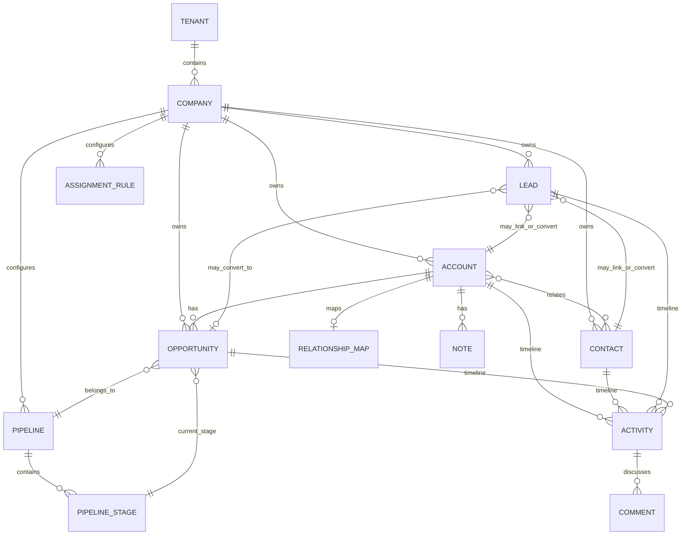
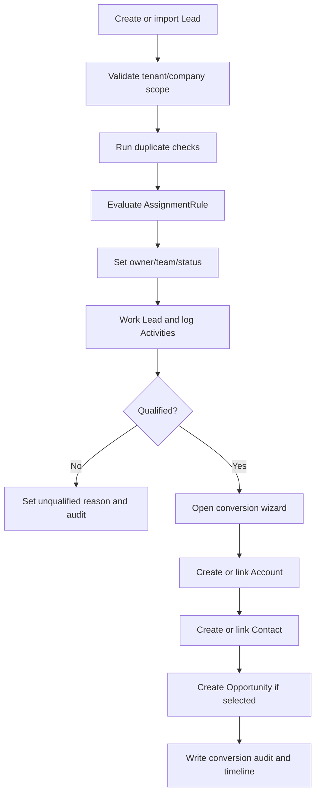

# Phase 04: CRM Data Model

## Document Metadata

| Field | Value |
| --- | --- |
| Phase | Phase 04 |
| Phase Name | CRM Data Model |
| Document Type | Phase requirements and implementation specification |
| Status | Draft |
| Owner | Product / Architecture / Documentation |
| Last Updated | 2026-05-09 |
| Source Documents | `00_Master_Platform_Documentation.md`; `00_Global_Documentation_Rules.md`; `00_Global_Domain_Model.md`; `00_Global_Decisions_Register.md`; prior phase summaries for Phases 01-03 |
| Related Modules | CRM; Outbound Sales; Core Platform; Calendar / Tasks; Field Sales / Drilling; Reporting / Analytics; Integrations; Mobile / Offline |

## Phase Purpose

Phase 04 defines the production-grade CRM data foundation for the platform. It establishes the canonical customer, contact, lead, opportunity, pipeline, activity, collaboration, relationship mapping, and assignment-rule model that later outbound sales, field operations, dispatch, service, reporting, QuickBooks, import/export, mobile, and integration phases must reuse.

This phase exists because the platform is not a generic CRM and not a disconnected field-operations app. CRM must become the shared foundation that connects sales promises, account relationships, operational handoffs, field context, reporting, and integration identity.

## Phase Goals

- Define canonical CRM entities and prevent duplicate customer/contact/opportunity models in later phases.
- Specify lifecycle, status, relationship, permission, audit, reporting, search, API, UX, mobile/offline, and integration expectations for the CRM foundation.
- Preserve continuity with Tenant, Company, UserMembership, Role, Permission, Core Platform shared services, and global decisions.
- Prepare Phase 05 Outbound Sales to reuse Lead, Contact, Account, Opportunity, Activity, and AssignmentRule.
- Prepare later field, dispatch, service, reporting, and integration phases to reuse Account/Contact/Opportunity rather than inventing separate customer entities.

## Scope

### In Scope

- CRM data model definitions for Account, Contact, Lead, Opportunity, Pipeline, PipelineStage, Activity, Note, Comment, RelationshipMap, and AssignmentRule.
- CRM lifecycle and status rules.
- CRM entity relationships and cross-phase reuse rules.
- CRM workflow requirements for creation, conversion, assignment, activity logging, relationship mapping, duplicate handling, and pipeline movement.
- Conceptual REST API requirements.
- UX requirements for CRM lists, details, forms, timelines, kanban, relationship maps, settings, saved views, empty/error/permission states, and mobile capture.
- Search, filtering, saved views, reporting, audit, notifications, import/export, integration, and mobile/offline implications.
- Strict future-phase constraints for outbound, field, dispatch, service, reporting, and integration phases.

### Out of Scope

- Phase 05 outbound campaign/sequence/prospect-list execution.
- Detailed task/calendar implementation except references needed for Activity and AssignmentRule.
- Detailed Quote, Order, JobRequest, Site, WorkOrder, Inventory, Dispatch, Fleet, or QuickBooks sync implementation.
- Advanced AI scoring, advanced route optimization, full LinkedIn automation, and full marketing automation.
- Customer-facing portal, advanced territory management, and enterprise policy engine implementation details.

## Non-Goals

- Do not create Phase 05 or any outbound sales sequence/campaign specification.
- Do not rewrite the master documentation, global control documents, or prior phase summaries.
- Do not introduce a separate Customer, Client, CRMCompany, Deal, Person, SalesActivity, or CustomerCompany entity.
- Do not replace Core Platform audit, notification, file, tag, custom field, saved view, import/export, search, webhook, settings, or background job foundations.
- Do not define full operational execution workflows for field, dispatch, service, inventory, fleet, or accounting.

## Source-of-Truth Definitions

| Concept | Definition / Rule |
| --- | --- |
| Tenant | Top-level SaaS isolation boundary. Every tenant-owned record must include `tenant_id`. |
| Company | Customer organization inside a Tenant. Company is the SaaS customer, not the CRM Account. |
| Account | CRM business/customer/prospect/vendor record used by sales and later operations. |
| Contact | Person associated with one or more Accounts or sales records. |
| Lead | Early-stage or unqualified sales record requiring qualification. |
| Opportunity | Potential revenue/work opportunity tied to an Account and pipeline stage. |
| Activity | Timeline activity record that connects CRM, outbound, and later field/service activity context when permissions allow. |
| AuditLog | Append-only administrative/compliance event record owned by Core Platform; not the same as Activity. |
| Note / Comment | Collaboration records; not operational source-of-truth events. |
| AssignmentRule | Configurable assignment logic reusable across CRM and later modules. |
| Company-scoped data | Must include `tenant_id` and `company_id`; all queries must filter by authenticated scope. |
| External identity | Provider IDs belong in `external_refs`, `ExternalReference`, or approved provider link entities. |

## Canonical Entity Definitions

### Account

| Attribute | Definition |
| --- | --- |
| Purpose | Canonical CRM business/customer/prospect/vendor record. Not Tenant or Company. |
| Owner module | CRM |
| Scope | Company-scoped, optional branch context; all business records must include `tenant_id` and `company_id` unless explicitly configuration-only but still company-scoped. |
| Tenant/company scoping | Backend queries must filter by authenticated `tenant_id` and permitted `company_id`; cross-company access only through explicit authorized memberships/policies. |
| Key fields | `id`, `tenant_id`, `company_id`, `branch_id`, `name`, `display_name`, `type`, `lifecycle_stage`, `status`, `owner_user_id`, `assigned_team_id`, `industry`, `address`, `coordinates`, `website`, `main_phone`, `main_email`, `billing_contact_id`, `primary_contact_id`, `source`, `tags`, `external_refs`, `metadata`, `created_at`, `created_by_user_id`, `updated_at`, `updated_by_user_id`, `deleted_at`, `deleted_by_user_id` |
| Relationships | Account ↔ Contact: One Account can have many Contacts; one Contact can belong to multiple Accounts using account_ids or a future relationship join model if needed.; Account ↔ Lead: A Lead may reference an Account if the organization already exists; conversion may create or link Account.; Account ↔ Opportunity: Every Opportunity must belong to one Account before becoming operational work.; Activity ↔ Account/Contact/Lead/Opportunity: Activities can link to multiple CRM records but must have a primary target for timeline placement. |
| Lifecycle | Create → validate → active/use in workflows → update/assign/relate → archive/soft delete where supported; closed/converted states remain reportable. |
| Statuses | `prospect`, `active_customer`, `inactive`, `vendor`, `archived` |
| Index considerations | Compound indexes should include `tenant_id`, `company_id`, `status`, owner/team where relevant, and common search/filter fields for this entity. Text/search projections should use SearchIndexRecord or equivalent. |
| Permissions impact | Requires entity-specific CRM permissions plus company/module access. Bulk, merge, export, conversion, close, and admin configuration actions require stronger permissions. |
| Audit requirements | Create, update, status/lifecycle transition, assignment, archive/delete, restore, merge/configuration changes, and high-impact field changes must write AuditLog where applicable. |
| Reporting impact | Must expose owner, team, source, status, lifecycle/stage, timestamps, and relationship dimensions needed by CRM and later reporting phases. |
| Future-phase impact | Later outbound, field, dispatch, service, reporting, and integration phases must reuse this entity where it describes the same concept. |

### Contact

| Attribute | Definition |
| --- | --- |
| Purpose | Person related to one or more Accounts, Leads, Opportunities, Activities, and later field/service records. |
| Owner module | CRM |
| Scope | Company-scoped, optional branch context; all business records must include `tenant_id` and `company_id` unless explicitly configuration-only but still company-scoped. |
| Tenant/company scoping | Backend queries must filter by authenticated `tenant_id` and permitted `company_id`; cross-company access only through explicit authorized memberships/policies. |
| Key fields | `id`, `tenant_id`, `company_id`, `account_ids`, `primary_account_id`, `first_name`, `last_name`, `full_name`, `role_title`, `department`, `emails`, `phones`, `influence_level`, `decision_role`, `relationship_status`, `status`, `owner_user_id`, `do_not_contact_reason`, `preferred_channel`, `source`, `external_refs`, `metadata`, `created_at`, `created_by_user_id`, `updated_at`, `updated_by_user_id`, `deleted_at`, `deleted_by_user_id` |
| Relationships | Account ↔ Contact: One Account can have many Contacts; one Contact can belong to multiple Accounts using account_ids or a future relationship join model if needed.; Lead ↔ Contact: A Lead may reference an existing Contact or create/link Contact during conversion.; Activity ↔ Account/Contact/Lead/Opportunity: Activities can link to multiple CRM records but must have a primary target for timeline placement.; RelationshipMap ↔ Account/Contact: RelationshipMap stores account stakeholder graph nodes and edges using canonical Account and Contact IDs. |
| Lifecycle | Create → validate → active/use in workflows → update/assign/relate → archive/soft delete where supported; closed/converted states remain reportable. |
| Statuses | `active`, `inactive`, `bounced`, `do_not_contact`, `archived` |
| Index considerations | Compound indexes should include `tenant_id`, `company_id`, `status`, owner/team where relevant, and common search/filter fields for this entity. Text/search projections should use SearchIndexRecord or equivalent. |
| Permissions impact | Requires entity-specific CRM permissions plus company/module access. Bulk, merge, export, conversion, close, and admin configuration actions require stronger permissions. |
| Audit requirements | Create, update, status/lifecycle transition, assignment, archive/delete, restore, merge/configuration changes, and high-impact field changes must write AuditLog where applicable. |
| Reporting impact | Must expose owner, team, source, status, lifecycle/stage, timestamps, and relationship dimensions needed by CRM and later reporting phases. |
| Future-phase impact | Later outbound, field, dispatch, service, reporting, and integration phases must reuse this entity where it describes the same concept. |

### Lead

| Attribute | Definition |
| --- | --- |
| Purpose | Unqualified or early-stage sales record requiring qualification and possible conversion. |
| Owner module | CRM |
| Scope | Company-scoped, optional branch context; all business records must include `tenant_id` and `company_id` unless explicitly configuration-only but still company-scoped. |
| Tenant/company scoping | Backend queries must filter by authenticated `tenant_id` and permitted `company_id`; cross-company access only through explicit authorized memberships/policies. |
| Key fields | `id`, `tenant_id`, `company_id`, `account_id`, `contact_id`, `source`, `source_detail`, `status`, `qualification_status`, `owner_user_id`, `assigned_team_id`, `score`, `priority`, `company_name`, `contact_name`, `email`, `phone`, `industry`, `territory`, `estimated_value`, `interest_summary`, `next_action_at`, `converted_account_id`, `converted_contact_id`, `converted_opportunity_id`, `converted_at`, `unqualified_reason`, `source`, `external_refs`, `metadata`, `created_at`, `created_by_user_id`, `updated_at`, `updated_by_user_id`, `deleted_at`, `deleted_by_user_id` |
| Relationships | Account ↔ Lead: A Lead may reference an Account if the organization already exists; conversion may create or link Account.; Lead ↔ Contact: A Lead may reference an existing Contact or create/link Contact during conversion.; Lead ↔ Opportunity: Qualified Leads may convert into Opportunities while preserving source and conversion traceability.; Activity ↔ Account/Contact/Lead/Opportunity: Activities can link to multiple CRM records but must have a primary target for timeline placement. |
| Lifecycle | Create → validate → active/use in workflows → update/assign/relate → archive/soft delete where supported; closed/converted states remain reportable. |
| Statuses | `new`, `working`, `qualified`, `unqualified`, `converted`, `archived` |
| Index considerations | Compound indexes should include `tenant_id`, `company_id`, `status`, owner/team where relevant, and common search/filter fields for this entity. Text/search projections should use SearchIndexRecord or equivalent. |
| Permissions impact | Requires entity-specific CRM permissions plus company/module access. Bulk, merge, export, conversion, close, and admin configuration actions require stronger permissions. |
| Audit requirements | Create, update, status/lifecycle transition, assignment, archive/delete, restore, merge/configuration changes, and high-impact field changes must write AuditLog where applicable. |
| Reporting impact | Must expose owner, team, source, status, lifecycle/stage, timestamps, and relationship dimensions needed by CRM and later reporting phases. |
| Future-phase impact | Later outbound, field, dispatch, service, reporting, and integration phases must reuse this entity where it describes the same concept. |

### Opportunity

| Attribute | Definition |
| --- | --- |
| Purpose | Potential revenue or work opportunity tied to Account, pipeline, stage, value, probability, and next action. |
| Owner module | CRM |
| Scope | Company-scoped, optional branch context; all business records must include `tenant_id` and `company_id` unless explicitly configuration-only but still company-scoped. |
| Tenant/company scoping | Backend queries must filter by authenticated `tenant_id` and permitted `company_id`; cross-company access only through explicit authorized memberships/policies. |
| Key fields | `id`, `tenant_id`, `company_id`, `account_id`, `contact_ids`, `lead_id`, `pipeline_id`, `stage_id`, `name`, `status`, `value_amount`, `currency`, `probability`, `expected_close_date`, `actual_close_date`, `lost_reason`, `won_reason`, `owner_user_id`, `assigned_team_id`, `next_action_at`, `source`, `products_summary`, `job_request_id later`, `external_refs`, `metadata`, `created_at`, `created_by_user_id`, `updated_at`, `updated_by_user_id`, `deleted_at`, `deleted_by_user_id` |
| Relationships | Lead ↔ Opportunity: Qualified Leads may convert into Opportunities while preserving source and conversion traceability.; Account ↔ Opportunity: Every Opportunity must belong to one Account before becoming operational work.; Opportunity ↔ PipelineStage: Opportunity stage_id must belong to the selected pipeline_id and same tenant/company.; Activity ↔ Account/Contact/Lead/Opportunity: Activities can link to multiple CRM records but must have a primary target for timeline placement. |
| Lifecycle | Create → validate → active/use in workflows → update/assign/relate → archive/soft delete where supported; closed/converted states remain reportable. |
| Statuses | `open`, `won`, `lost`, `archived` |
| Index considerations | Compound indexes should include `tenant_id`, `company_id`, `status`, owner/team where relevant, and common search/filter fields for this entity. Text/search projections should use SearchIndexRecord or equivalent. |
| Permissions impact | Requires entity-specific CRM permissions plus company/module access. Bulk, merge, export, conversion, close, and admin configuration actions require stronger permissions. |
| Audit requirements | Create, update, status/lifecycle transition, assignment, archive/delete, restore, merge/configuration changes, and high-impact field changes must write AuditLog where applicable. |
| Reporting impact | Must expose owner, team, source, status, lifecycle/stage, timestamps, and relationship dimensions needed by CRM and later reporting phases. |
| Future-phase impact | Later outbound, field, dispatch, service, reporting, and integration phases must reuse this entity where it describes the same concept. |

### Pipeline

| Attribute | Definition |
| --- | --- |
| Purpose | Company-configurable sales process container. |
| Owner module | CRM |
| Scope | Company-scoped configuration; all business records must include `tenant_id` and `company_id` unless explicitly configuration-only but still company-scoped. |
| Tenant/company scoping | Backend queries must filter by authenticated `tenant_id` and permitted `company_id`; cross-company access only through explicit authorized memberships/policies. |
| Key fields | `id`, `tenant_id`, `company_id`, `name`, `type`, `description`, `status`, `sort_order`, `is_default`, `allowed_entity_types`, `settings`, `created_at`, `created_by_user_id`, `updated_at`, `updated_by_user_id`, `deleted_at`, `deleted_by_user_id` |
| Relationships | Pipeline ↔ PipelineStage: A Pipeline contains ordered PipelineStages; stages inherit tenant/company scope.; Opportunity ↔ PipelineStage: Opportunity stage_id must belong to the selected pipeline_id and same tenant/company. |
| Lifecycle | Create → validate → active/use in workflows → update/assign/relate → archive/soft delete where supported; closed/converted states remain reportable. |
| Statuses | `active`, `inactive`, `archived` |
| Index considerations | Compound indexes should include `tenant_id`, `company_id`, `status`, owner/team where relevant, and common search/filter fields for this entity. Text/search projections should use SearchIndexRecord or equivalent. |
| Permissions impact | Requires entity-specific CRM permissions plus company/module access. Bulk, merge, export, conversion, close, and admin configuration actions require stronger permissions. |
| Audit requirements | Create, update, status/lifecycle transition, assignment, archive/delete, restore, merge/configuration changes, and high-impact field changes must write AuditLog where applicable. |
| Reporting impact | Must expose owner, team, source, status, lifecycle/stage, timestamps, and relationship dimensions needed by CRM and later reporting phases. |
| Future-phase impact | Later outbound, field, dispatch, service, reporting, and integration phases must reuse this entity where it describes the same concept. |

### PipelineStage

| Attribute | Definition |
| --- | --- |
| Purpose | Ordered stage inside a Pipeline with default probability and stage type. |
| Owner module | CRM |
| Scope | Company-scoped child configuration of Pipeline; all business records must include `tenant_id` and `company_id` unless explicitly configuration-only but still company-scoped. |
| Tenant/company scoping | Backend queries must filter by authenticated `tenant_id` and permitted `company_id`; cross-company access only through explicit authorized memberships/policies. |
| Key fields | `id`, `tenant_id`, `company_id`, `pipeline_id`, `name`, `description`, `sort_order`, `stage_type`, `probability_default`, `is_won_stage`, `is_lost_stage`, `requires_reason`, `status`, `created_at`, `created_by_user_id`, `updated_at`, `updated_by_user_id`, `deleted_at`, `deleted_by_user_id` |
| Relationships | Pipeline ↔ PipelineStage: A Pipeline contains ordered PipelineStages; stages inherit tenant/company scope.; Opportunity ↔ PipelineStage: Opportunity stage_id must belong to the selected pipeline_id and same tenant/company. |
| Lifecycle | Create → validate → active/use in workflows → update/assign/relate → archive/soft delete where supported; closed/converted states remain reportable. |
| Statuses | `active`, `inactive`, `archived` |
| Index considerations | Compound indexes should include `tenant_id`, `company_id`, `status`, owner/team where relevant, and common search/filter fields for this entity. Text/search projections should use SearchIndexRecord or equivalent. |
| Permissions impact | Requires entity-specific CRM permissions plus company/module access. Bulk, merge, export, conversion, close, and admin configuration actions require stronger permissions. |
| Audit requirements | Create, update, status/lifecycle transition, assignment, archive/delete, restore, merge/configuration changes, and high-impact field changes must write AuditLog where applicable. |
| Reporting impact | Must expose owner, team, source, status, lifecycle/stage, timestamps, and relationship dimensions needed by CRM and later reporting phases. |
| Future-phase impact | Later outbound, field, dispatch, service, reporting, and integration phases must reuse this entity where it describes the same concept. |

### Activity

| Attribute | Definition |
| --- | --- |
| Purpose | Unified timeline record for calls, emails, SMS, meetings, LinkedIn logs, notes, site visits, tasks, status changes, and system events. |
| Owner module | CRM / Timeline |
| Scope | Company-scoped, linked to one or more records; all business records must include `tenant_id` and `company_id` unless explicitly configuration-only but still company-scoped. |
| Tenant/company scoping | Backend queries must filter by authenticated `tenant_id` and permitted `company_id`; cross-company access only through explicit authorized memberships/policies. |
| Key fields | `id`, `tenant_id`, `company_id`, `activity_type`, `activity_subtype`, `subject`, `body_preview`, `occurred_at`, `actor_user_id`, `owner_user_id`, `direction`, `outcome`, `linked_entities`, `primary_entity_type`, `primary_entity_id`, `source`, `source_ref`, `visibility`, `status`, `corrected_activity_id`, `metadata`, `created_at`, `created_by_user_id`, `updated_at`, `updated_by_user_id`, `deleted_at`, `deleted_by_user_id` |
| Relationships | Activity ↔ Account/Contact/Lead/Opportunity: Activities can link to multiple CRM records but must have a primary target for timeline placement.; Note ↔ Activity: A Note may create or link to one Activity entry for timeline visibility.; Comment ↔ Activity/Record/FileAttachment: Comments support collaboration but are not source-of-truth operational events. |
| Lifecycle | Create → validate → active/use in workflows → update/assign/relate → archive/soft delete where supported; closed/converted states remain reportable. |
| Statuses | `logged`, `corrected`, `archived` |
| Index considerations | Compound indexes should include `tenant_id`, `company_id`, `status`, owner/team where relevant, and common search/filter fields for this entity. Text/search projections should use SearchIndexRecord or equivalent. |
| Permissions impact | Requires entity-specific CRM permissions plus company/module access. Bulk, merge, export, conversion, close, and admin configuration actions require stronger permissions. |
| Audit requirements | Create, update, status/lifecycle transition, assignment, archive/delete, restore, merge/configuration changes, and high-impact field changes must write AuditLog where applicable. |
| Reporting impact | Must expose owner, team, source, status, lifecycle/stage, timestamps, and relationship dimensions needed by CRM and later reporting phases. |
| Future-phase impact | Later outbound, field, dispatch, service, reporting, and integration phases must reuse this entity where it describes the same concept. |

### Note

| Attribute | Definition |
| --- | --- |
| Purpose | Standalone text note associated with a CRM or operational record; can produce an Activity timeline entry. |
| Owner module | Core Platform / CRM collaboration |
| Scope | Company-scoped, linked to one target record; all business records must include `tenant_id` and `company_id` unless explicitly configuration-only but still company-scoped. |
| Tenant/company scoping | Backend queries must filter by authenticated `tenant_id` and permitted `company_id`; cross-company access only through explicit authorized memberships/policies. |
| Key fields | `id`, `tenant_id`, `company_id`, `entity_type`, `entity_id`, `body`, `visibility`, `pinned`, `status`, `activity_id`, `created_at`, `created_by_user_id`, `updated_at`, `updated_by_user_id`, `deleted_at`, `deleted_by_user_id` |
| Relationships | Note ↔ Activity: A Note may create or link to one Activity entry for timeline visibility. |
| Lifecycle | Create → validate → active/use in workflows → update/assign/relate → archive/soft delete where supported; closed/converted states remain reportable. |
| Statuses | `active`, `archived` |
| Index considerations | Compound indexes should include `tenant_id`, `company_id`, `status`, owner/team where relevant, and common search/filter fields for this entity. Text/search projections should use SearchIndexRecord or equivalent. |
| Permissions impact | Requires entity-specific CRM permissions plus company/module access. Bulk, merge, export, conversion, close, and admin configuration actions require stronger permissions. |
| Audit requirements | Create, update, status/lifecycle transition, assignment, archive/delete, restore, merge/configuration changes, and high-impact field changes must write AuditLog where applicable. |
| Reporting impact | Must expose owner, team, source, status, lifecycle/stage, timestamps, and relationship dimensions needed by CRM and later reporting phases. |
| Future-phase impact | Later outbound, field, dispatch, service, reporting, and integration phases must reuse this entity where it describes the same concept. |

### Comment

| Attribute | Definition |
| --- | --- |
| Purpose | Threaded or contextual collaboration comment on a record, task, attachment, or activity. |
| Owner module | Core Platform / Collaboration |
| Scope | Company-scoped, linked to one target record; all business records must include `tenant_id` and `company_id` unless explicitly configuration-only but still company-scoped. |
| Tenant/company scoping | Backend queries must filter by authenticated `tenant_id` and permitted `company_id`; cross-company access only through explicit authorized memberships/policies. |
| Key fields | `id`, `tenant_id`, `company_id`, `entity_type`, `entity_id`, `parent_comment_id`, `body`, `status`, `edited_at`, `created_at`, `created_by_user_id`, `updated_at`, `updated_by_user_id`, `deleted_at`, `deleted_by_user_id` |
| Relationships | Comment ↔ Activity/Record/FileAttachment: Comments support collaboration but are not source-of-truth operational events. |
| Lifecycle | Create → validate → active/use in workflows → update/assign/relate → archive/soft delete where supported; closed/converted states remain reportable. |
| Statuses | `active`, `edited`, `deleted` |
| Index considerations | Compound indexes should include `tenant_id`, `company_id`, `status`, owner/team where relevant, and common search/filter fields for this entity. Text/search projections should use SearchIndexRecord or equivalent. |
| Permissions impact | Requires entity-specific CRM permissions plus company/module access. Bulk, merge, export, conversion, close, and admin configuration actions require stronger permissions. |
| Audit requirements | Create, update, status/lifecycle transition, assignment, archive/delete, restore, merge/configuration changes, and high-impact field changes must write AuditLog where applicable. |
| Reporting impact | Must expose owner, team, source, status, lifecycle/stage, timestamps, and relationship dimensions needed by CRM and later reporting phases. |
| Future-phase impact | Later outbound, field, dispatch, service, reporting, and integration phases must reuse this entity where it describes the same concept. |

### RelationshipMap

| Attribute | Definition |
| --- | --- |
| Purpose | Structured account/contact stakeholder map with nodes, edges, influence, hierarchy, and relationship context. |
| Owner module | CRM |
| Scope | Company-scoped, usually per Account; all business records must include `tenant_id` and `company_id` unless explicitly configuration-only but still company-scoped. |
| Tenant/company scoping | Backend queries must filter by authenticated `tenant_id` and permitted `company_id`; cross-company access only through explicit authorized memberships/policies. |
| Key fields | `id`, `tenant_id`, `company_id`, `account_id`, `nodes`, `edges`, `version`, `status`, `created_at`, `created_by_user_id`, `updated_at`, `updated_by_user_id`, `deleted_at`, `deleted_by_user_id` |
| Relationships | RelationshipMap ↔ Account/Contact: RelationshipMap stores account stakeholder graph nodes and edges using canonical Account and Contact IDs. |
| Lifecycle | Create → validate → active/use in workflows → update/assign/relate → archive/soft delete where supported; closed/converted states remain reportable. |
| Statuses | `active`, `archived` |
| Index considerations | Compound indexes should include `tenant_id`, `company_id`, `status`, owner/team where relevant, and common search/filter fields for this entity. Text/search projections should use SearchIndexRecord or equivalent. |
| Permissions impact | Requires entity-specific CRM permissions plus company/module access. Bulk, merge, export, conversion, close, and admin configuration actions require stronger permissions. |
| Audit requirements | Create, update, status/lifecycle transition, assignment, archive/delete, restore, merge/configuration changes, and high-impact field changes must write AuditLog where applicable. |
| Reporting impact | Must expose owner, team, source, status, lifecycle/stage, timestamps, and relationship dimensions needed by CRM and later reporting phases. |
| Future-phase impact | Later outbound, field, dispatch, service, reporting, and integration phases must reuse this entity where it describes the same concept. |

### AssignmentRule

| Attribute | Definition |
| --- | --- |
| Purpose | Reusable rule for assigning leads, accounts, tasks, job requests, or work to users/teams. |
| Owner module | Core Platform / CRM Automation |
| Scope | Company-scoped configuration; all business records must include `tenant_id` and `company_id` unless explicitly configuration-only but still company-scoped. |
| Tenant/company scoping | Backend queries must filter by authenticated `tenant_id` and permitted `company_id`; cross-company access only through explicit authorized memberships/policies. |
| Key fields | `id`, `tenant_id`, `company_id`, `name`, `description`, `entity_type`, `conditions`, `assignment_strategy`, `assignment_target_type`, `assignment_target_id`, `fallback_target_type`, `fallback_target_id`, `priority`, `status`, `effective_from`, `effective_to`, `last_evaluated_at`, `created_at`, `created_by_user_id`, `updated_at`, `updated_by_user_id`, `deleted_at`, `deleted_by_user_id` |
| Relationships | AssignmentRule ↔ Lead/Account/Task/JobRequest: AssignmentRule evaluates assignment target for supported entity types and is reusable in later phases. |
| Lifecycle | Create → validate → active/use in workflows → update/assign/relate → archive/soft delete where supported; closed/converted states remain reportable. |
| Statuses | `active`, `inactive`, `archived` |
| Index considerations | Compound indexes should include `tenant_id`, `company_id`, `status`, owner/team where relevant, and common search/filter fields for this entity. Text/search projections should use SearchIndexRecord or equivalent. |
| Permissions impact | Requires entity-specific CRM permissions plus company/module access. Bulk, merge, export, conversion, close, and admin configuration actions require stronger permissions. |
| Audit requirements | Create, update, status/lifecycle transition, assignment, archive/delete, restore, merge/configuration changes, and high-impact field changes must write AuditLog where applicable. |
| Reporting impact | Must expose owner, team, source, status, lifecycle/stage, timestamps, and relationship dimensions needed by CRM and later reporting phases. |
| Future-phase impact | Later outbound, field, dispatch, service, reporting, and integration phases must reuse this entity where it describes the same concept. |

## Entity Lifecycle and Status Rules

| Entity | Primary lifecycle | Required rules |
| --- | --- | --- |
| Account | prospect → active_customer / vendor / inactive → archived | Account must remain the shared business record for later operational workflows. Archive must check for open Opportunities and later active jobs/service/order records. |
| Contact | active → inactive / bounced / do_not_contact → archived | Do-not-contact must be visible to outbound phases. Multi-account relationships must be preserved during merge/archive. |
| Lead | new → working → qualified / unqualified → converted / archived | Converted Leads must retain source and converted IDs. Unqualified Leads require reason when configured. |
| Opportunity | open → won / lost → archived; reopen only with permission | Won/lost actions must validate stage, Account, close date, reason fields where configured, and audit event creation. |
| Pipeline | active → inactive → archived | Inactive pipelines cannot receive new Opportunities unless explicitly allowed by admin migration workflow. |
| PipelineStage | active → inactive → archived | Stages with open Opportunities require migration target before archival. Stage order changes must be audited. |
| Activity | logged → corrected / archived | Corrections should link to prior Activity rather than silently rewriting important history. |
| Note | active → archived | Note edits must update timestamp and actor; visibility changes must be permission-aware. |
| Comment | active → edited / deleted | Deleted comments should preserve audit trace while hiding body when needed. |
| RelationshipMap | active → archived | Relationship graph updates must be versioned and validated for node/edge limits. |
| AssignmentRule | active → inactive → archived | Evaluation must be deterministic by priority and fallback rules. |

## Entity Relationship Rules

| Relationship | Rule |
| --- | --- |
| Account → Contact | One Account can have many Contacts; one Contact can belong to multiple Accounts using account_ids or a future relationship join model if needed. |
| Account → Lead | A Lead may reference an Account if the organization already exists; conversion may create or link Account. |
| Lead → Contact | A Lead may reference an existing Contact or create/link Contact during conversion. |
| Lead → Opportunity | Qualified Leads may convert into Opportunities while preserving source and conversion traceability. |
| Account → Opportunity | Every Opportunity must belong to one Account before becoming operational work. |
| Pipeline → PipelineStage | A Pipeline contains ordered PipelineStages; stages inherit tenant/company scope. |
| Opportunity → PipelineStage | Opportunity stage_id must belong to the selected pipeline_id and same tenant/company. |
| Activity → Account/Contact/Lead/Opportunity | Activities can link to multiple CRM records but must have a primary target for timeline placement. |
| Note → Activity | A Note may create or link to one Activity entry for timeline visibility. |
| Comment → Activity/Record/FileAttachment | Comments support collaboration but are not source-of-truth operational events. |
| RelationshipMap → Account/Contact | RelationshipMap stores account stakeholder graph nodes and edges using canonical Account and Contact IDs. |
| AssignmentRule → Lead/Account/Task/JobRequest | AssignmentRule evaluates assignment target for supported entity types and is reusable in later phases. |

## Workflow Requirements

### Lead Capture and Conversion Workflow

### Opportunity Stage Workflow

- Opportunity stage changes must validate Pipeline and PipelineStage scope.
- Drag/drop board actions must call the stage-move API, not perform direct client-only mutation.
- Stage movement may update probability from `probability_default` unless user override is permitted and audited.
- Won/lost transitions must use explicit action endpoints and capture close metadata.
- Later Quote/Order/JobRequest phases must consume closed-won or handoff-ready Opportunity context rather than inventing sales handoff records.

### Activity and Collaboration Workflow

- Users can log manual Activity records from CRM detail pages and mobile quick actions.
- Notes can optionally create timeline Activity entries.
- Comments support collaboration on records, activities, files, or tasks.
- AuditLog remains the compliance history. Activity remains user-facing timeline context.

### AssignmentRule Workflow

- Assignment rules are evaluated when records are created, imported, converted, or explicitly reassigned.
- Matching must be deterministic: status active, supported entity type, valid conditions, priority order, then fallback.
- If no rule matches and no fallback exists, the record remains unassigned or assigned to the actor based on company settings.
- Rule evaluation results must be explainable in logs or admin preview.

## Data Model Requirements

### Shared Modeling Rules

- Every company-scoped CRM record must include `id`, `tenant_id`, `company_id`, `created_at`, `created_by_user_id`, `updated_at`, and `updated_by_user_id`.
- Major CRM business records must support soft delete/archive through `deleted_at` and `deleted_by_user_id` where applicable.
- `owner_user_id`, `assigned_team_id`, `source`, `external_refs`, `metadata`, and `status` must be available where relevant for workflow, reporting, import/export, and integrations.
- Public APIs must use stable application `id`; MongoDB `_id` must remain internal.
- References should use `_id` and `_ids` naming.
- Provider identifiers must use `external_refs` or approved integration link entities.
- Custom fields may extend CRM records but must not replace stable required fields.
- Tags must use Core Platform Tag and TagAssignment patterns.
- Activity should use `linked_entities` for multi-record timeline display and `primary_entity_type` / `primary_entity_id` for primary placement.

### Conceptual Collections

| Collection | Stores | Notes |
| --- | --- | --- |
| `accounts` | Account documents | Company-scoped; heavily indexed for search, owner, lifecycle, type, source, address/geography. |
| `contacts` | Contact documents | Company-scoped; account associations, email/phone arrays, influence and do-not-contact metadata. |
| `leads` | Lead documents | Company-scoped; conversion trace fields and assignment fields. |
| `opportunities` | Opportunity documents | Company-scoped; pipeline/stage/value/forecast fields. |
| `pipelines` | Pipeline configuration | Company-scoped config, soft-deletable. |
| `pipeline_stages` | PipelineStage configuration | Could be collection or embedded config if operational constraints are met; references recommended for reporting and validation. |
| `activities` | Activity timeline records | Company-scoped; append-friendly timeline query patterns. |
| `notes` | Note records | Company-scoped; linked target entity. |
| `comments` | Comment records | Company-scoped; linked target entity and optional parent_comment_id. |
| `relationship_maps` | RelationshipMap graph documents | Recommended one active map per Account for MVP. |
| `assignment_rules` | AssignmentRule configuration | Company-scoped; sorted by entity_type, status, priority. |

### Index Considerations

| Entity | Recommended index patterns |
| --- | --- |
| Account | `(tenant_id, company_id, status)`, `(tenant_id, company_id, owner_user_id, status)`, `(tenant_id, company_id, lifecycle_stage)`, `(tenant_id, company_id, type)`, normalized name/search projection, external_refs lookup. |
| Contact | `(tenant_id, company_id, status)`, `(tenant_id, company_id, account_ids)`, normalized email/phone, `(tenant_id, company_id, owner_user_id)`. |
| Lead | `(tenant_id, company_id, status)`, `(tenant_id, company_id, owner_user_id, status)`, `(tenant_id, company_id, source)`, `(tenant_id, company_id, next_action_at)`, duplicate fields. |
| Opportunity | `(tenant_id, company_id, pipeline_id, stage_id)`, `(tenant_id, company_id, account_id)`, `(tenant_id, company_id, owner_user_id, status)`, `(tenant_id, company_id, expected_close_date)`. |
| PipelineStage | `(tenant_id, company_id, pipeline_id, sort_order)`, `(tenant_id, company_id, pipeline_id, status)`. |
| Activity | `(tenant_id, company_id, primary_entity_type, primary_entity_id, occurred_at)`, `(tenant_id, company_id, actor_user_id, occurred_at)`, `(tenant_id, company_id, activity_type, occurred_at)`. |
| Notes/Comments | `(tenant_id, company_id, entity_type, entity_id, created_at)`. |
| RelationshipMap | unique-ish active map per `(tenant_id, company_id, account_id, status)` where status active. |
| AssignmentRule | `(tenant_id, company_id, entity_type, status, priority)`. |

## API Requirements

| ID | Requirement |
| --- | --- |
| API-04-001 | GET /api/v1/accounts: list Accounts with permission-aware filters, search, saved view input, pagination, sorting, and optional includes. |
| API-04-002 | POST /api/v1/accounts: create Account with tenant/company scope from session, duplicate warning support, and custom fields/tags payloads. |
| API-04-003 | GET /api/v1/accounts/{account_id}: read Account detail with permission-aware related record summaries. |
| API-04-004 | PATCH /api/v1/accounts/{account_id}: update allowed Account fields with optimistic concurrency metadata. |
| API-04-005 | POST /api/v1/accounts/{account_id}/archive and POST /api/v1/accounts/{account_id}/restore: lifecycle actions where permitted. |
| API-04-006 | POST /api/v1/accounts/merge: merge duplicate Accounts with relationship reassignment and audit log. |
| API-04-007 | GET/POST/PATCH /api/v1/contacts and GET/PATCH /api/v1/contacts/{contact_id}: Contact CRUD and account association management. |
| API-04-008 | POST /api/v1/contacts/merge: merge duplicate Contacts with Account relationship preservation. |
| API-04-009 | GET/POST/PATCH /api/v1/leads and GET /api/v1/leads/{lead_id}: Lead CRUD, qualification fields, ownership, scoring, and source filters. |
| API-04-010 | POST /api/v1/leads/{lead_id}/qualify: mark Lead qualified without necessarily converting immediately. |
| API-04-011 | POST /api/v1/leads/{lead_id}/unqualify: set unqualified state with reason. |
| API-04-012 | POST /api/v1/leads/{lead_id}/convert: convert into Account, Contact, and/or Opportunity with duplicate resolution choices. |
| API-04-013 | GET/POST/PATCH /api/v1/opportunities and GET /api/v1/opportunities/{opportunity_id}: Opportunity CRUD and list workflows. |
| API-04-014 | POST /api/v1/opportunities/{opportunity_id}/move-stage: move stage with validation, probability updates, and audit. |
| API-04-015 | POST /api/v1/opportunities/{opportunity_id}/mark-won and /mark-lost: close opportunity with required reason fields where configured. |
| API-04-016 | GET/POST/PATCH /api/v1/pipelines and GET/POST/PATCH /api/v1/pipelines/{pipeline_id}/stages: manage company CRM pipeline configuration. |
| API-04-017 | POST /api/v1/pipelines/{pipeline_id}/stages/reorder: reorder stages with validation against active Opportunities. |
| API-04-018 | GET/POST/PATCH /api/v1/activities and GET /api/v1/activities/{activity_id}: Activity list, log, correction, archive, and timeline APIs. |
| API-04-019 | GET /api/v1/timeline: generic timeline endpoint accepting entity_type and entity_id, returning permission-filtered Activity, Note, Comment, and related system events. |
| API-04-020 | GET/POST/PATCH /api/v1/notes and GET/POST/PATCH /api/v1/comments: collaboration endpoints for supported records. |
| API-04-021 | GET/PUT /api/v1/accounts/{account_id}/relationship-map: retrieve and replace/update structured RelationshipMap with version checking. |
| API-04-022 | GET/POST/PATCH /api/v1/assignment-rules and POST /api/v1/assignment-rules/evaluate: configure and test rule evaluation. |
| API-04-023 | POST /api/v1/crm/bulk-actions: execute permission-aware bulk assignment, tagging, archive, status update, and export actions asynchronously when large. |
| API-04-024 | POST /api/v1/import-jobs with target_entity=account/contact/lead/opportunity/activity: start CRM imports through Core Platform ImportJob. |
| API-04-025 | POST /api/v1/export-jobs with entity_type=crm entity: start CRM exports through Core Platform ExportJob. |

## UI / UX Requirements

| ID | Requirement |
| --- | --- |
| UX-04-001 | CRM navigation must expose Accounts, Contacts, Leads, Opportunities, Activities, and CRM Settings/Pipelines according to permissions and enabled module state. |
| UX-04-002 | Account list must support table layout, configurable columns, quick filters, saved views, bulk actions, export, and empty state guidance. |
| UX-04-003 | Account detail must include header, lifecycle/status, owner/team, key fields, contacts, opportunities, activities/timeline, notes/comments, files, tags, custom fields, relationship map, related operational placeholders, and audit summary access. |
| UX-04-004 | Contact detail must show linked Accounts, communication fields, influence/role, activity history, related leads/opportunities, notes/comments, and do-not-contact state. |
| UX-04-005 | Lead workspace must support prioritization by owner, source, score, status, next action, overdue follow-up, assignment state, and duplicate warnings. |
| UX-04-006 | Lead conversion UI must show duplicate candidates and choices to create or link Account, Contact, and Opportunity. |
| UX-04-007 | Opportunity board must support kanban by PipelineStage, table view, stage drag/drop with permission validation, weighted value, close date, next action, and missing data warnings. |
| UX-04-008 | Pipeline settings UI must support creating pipelines, stages, ordering, default probability, won/lost stage type, inactive/archive state, and migration warnings. |
| UX-04-009 | Activity timeline component must be reusable across Account, Contact, Lead, Opportunity, and later operational detail pages. |
| UX-04-010 | Activity log form must support type-specific fields for call, email, SMS, meeting, LinkedIn, note, task/status/system event references without exposing future automation as current scope. |
| UX-04-011 | Note and Comment components must clearly distinguish private/internal visibility from shared/company-visible visibility where supported. |
| UX-04-012 | RelationshipMap UI must support adding stakeholders, linking Contacts, drawing relationships, assigning influence/decision roles, and showing unknown placeholders. |
| UX-04-013 | AssignmentRule UI must include readable condition builder, target selector, priority ordering, test/evaluate preview, inactive/archive states, and safe defaults. |
| UX-04-014 | Permission-denied UI must not reveal inaccessible record details; it should explain missing access or disabled module where safe. |
| UX-04-015 | Empty states must suggest useful first actions: create record, import records, configure pipeline, add contact, log activity, or assign owner. |
| UX-04-016 | Error states must provide field-level errors, duplicate conflict messages, pipeline/stage validation failures, and offline sync retry guidance. |
| UX-04-017 | Mobile CRM screens must prioritize quick lead/contact/account lookup, activity logging, notes, next actions, and recently assigned records rather than desktop parity. |
| UX-04-018 | Saved view controls must be consistent with Core Platform SavedView patterns for owner, team, shared, and default views. |

## Search, Filters, and Saved Views

| Area | Required filters / saved view support |
| --- | --- |
| Accounts | Name, lifecycle_stage, type, status, owner, team, source, industry, tags, custom fields, created date, updated date, last activity, geography where address/coordinates exist. |
| Contacts | Name, account, email/phone presence, decision role, influence level, status, do-not-contact, owner, source, tags, last activity. |
| Leads | Status, source, score band, owner, team, territory, priority, next action, created date, qualification age, duplicate warning, unqualified reason. |
| Opportunities | Pipeline, stage, status, owner, team, value range, expected close date, probability, age in stage, next action, lead source, won/lost reason. |
| Activities | Activity type, subtype, actor, owner, linked entity, outcome, direction, occurred date, source. |
| Notes/Comments | Target record, author, created date, visibility, keyword search where permitted. |
| AssignmentRules | Entity type, status, priority, target user/team, condition fields. |
| RelationshipMaps | Account, stakeholder type, influence level, decision role, map status. |

Rules:

- Saved views must reuse Core Platform SavedView.
- Global search must use SearchIndexRecord or equivalent permission-aware projections.
- Disabled modules, soft-deleted records, unauthorized companies, and inaccessible records must not appear in search results.
- Export from saved view requires export permission and audit logging.

## Permissions and Access Control

| ID | Requirement |
| --- | --- |
| PERM-04-001 | crm.account.view: view Account lists and details allowed by company/module/record scope. |
| PERM-04-002 | crm.account.create: create Accounts. |
| PERM-04-003 | crm.account.update: update Accounts. |
| PERM-04-004 | crm.account.delete: archive/soft-delete Accounts. |
| PERM-04-005 | crm.account.merge: merge duplicate Accounts. |
| PERM-04-006 | crm.contact.view/create/update/delete/merge: manage Contacts by action-specific keys. |
| PERM-04-007 | crm.lead.view/create/update/delete: manage Leads by action-specific keys. |
| PERM-04-008 | crm.lead.convert: convert Leads to Account/Contact/Opportunity. |
| PERM-04-009 | crm.opportunity.view/create/update/delete: manage Opportunities. |
| PERM-04-010 | crm.opportunity.close: mark won/lost or reopen where allowed. |
| PERM-04-011 | crm.pipeline.manage: create/update/archive Pipelines and PipelineStages. |
| PERM-04-012 | crm.activity.view/log/update/delete: view and manage Activities according to action-specific keys. |
| PERM-04-013 | crm.note.view/create/update/delete and crm.comment.view/create/update/delete: collaboration permissions. |
| PERM-04-014 | crm.relationship_map.view/manage: view and manage Account relationship maps. |
| PERM-04-015 | crm.assignment_rule.manage: configure AssignmentRules. |
| PERM-04-016 | crm.import and crm.export: run CRM imports/exports; exports must be audited. |
| PERM-04-017 | crm.bulk_action: run bulk changes subject to the underlying entity/action permissions. |
| PERM-04-018 | crm.report.view: view CRM dashboards and report outputs. |
| PERM-04-019 | Ownership/team restrictions may limit records to owned, team, branch, or company-wide visibility through policies later. |

### Access Rules

- Backend permission checks are mandatory for every CRM endpoint.
- Frontend hiding is useful but never sufficient.
- Users need enabled CRM module access, company membership, and relevant permission key.
- Future policy-based authorization may restrict CRM records by owner, team, branch, territory, or custom conditions.
- Offline queued actions must be revalidated on sync.
- Reports, exports, imports, bulk actions, merge, conversion, and assignment rule management require explicit permissions.

## Notifications

| ID | Requirement |
| --- | --- |
| NOTIF-04-001 | Notify new owner or team when Account, Lead, or Opportunity is assigned if user preferences allow. |
| NOTIF-04-002 | Notify Lead owner when Lead becomes due/overdue for next action. |
| NOTIF-04-003 | Notify Opportunity owner when close date is approaching, stage is stale, or required next action is missing where configured. |
| NOTIF-04-004 | Notify managers when high-value Opportunity changes stage, is marked lost, or has no activity for configured threshold. |
| NOTIF-04-005 | Notify users mentioned in Comments if mention support is enabled in Core Platform. |
| NOTIF-04-006 | Notify admins when CRM imports partially fail or duplicate conflicts require review. |
| NOTIF-04-007 | Notifications must use Core Platform Notification entity and must not reveal inaccessible records. |

## Audit Logging

| ID | Requirement |
| --- | --- |
| AUDIT-04-001 | crm.account.created, updated, archived, restored, merged, owner_changed, lifecycle_changed. |
| AUDIT-04-002 | crm.contact.created, updated, archived, restored, merged, account_linked, account_unlinked, do_not_contact_changed. |
| AUDIT-04-003 | crm.lead.created, updated, assigned, qualified, unqualified, converted, archived, restored. |
| AUDIT-04-004 | crm.opportunity.created, updated, stage_changed, value_changed, owner_changed, won, lost, reopened, archived. |
| AUDIT-04-005 | crm.pipeline.created, updated, archived and crm.pipeline_stage.created, reordered, updated, archived. |
| AUDIT-04-006 | crm.activity.logged, corrected, archived and source-linked events for later integrations. |
| AUDIT-04-007 | crm.note.created, updated, archived and crm.comment.created, edited, deleted where collaboration history matters. |
| AUDIT-04-008 | crm.relationship_map.created, updated, archived, stakeholder_added, stakeholder_removed, relationship_changed. |
| AUDIT-04-009 | crm.assignment_rule.created, updated, activated, deactivated, archived, evaluated_with_assignment. |
| AUDIT-04-010 | crm.import.started, completed, partially_failed, failed and crm.export.requested, completed, failed, downloaded where available. |
| AUDIT-04-011 | crm.permission_denied may be logged for sensitive denied export/admin/bulk actions based on security policy. |

## Reporting and Analytics Impact

| ID | Requirement |
| --- | --- |
| REPORT-04-001 | Account counts by lifecycle_stage, type, owner, team, source, industry, geography, created period, and activity recency. |
| REPORT-04-002 | Contact coverage by Account, decision role, influence, do-not-contact status, missing email/phone, and activity recency. |
| REPORT-04-003 | Lead funnel by source, owner, status, score band, qualification outcome, conversion rate, age, and unqualified reason. |
| REPORT-04-004 | Opportunity pipeline by pipeline, stage, owner, team, weighted value, expected close date, stage age, won/lost reason, and revenue forecast. |
| REPORT-04-005 | Activity productivity by user, team, type, outcome, linked entity, period, and next action coverage. |
| REPORT-04-006 | Assignment effectiveness by rule, assigned target, workload balance, conversion rate, and override rate. |
| REPORT-04-007 | Data quality dashboards for duplicates, missing owners, stale next actions, invalid contacts, inactive stages, and unmapped relationships. |
| REPORT-04-008 | CRM export/report access must respect permissions and use report-safe denormalized snapshots where appropriate. |

## Mobile and Offline Impact

| ID | Requirement |
| --- | --- |
| OFFLINE-04-001 | Mobile users may create Leads, Contacts, Notes, Comments, and Activities offline where permissions and module settings allow. |
| OFFLINE-04-002 | Offline-created records must include stable client-generated IDs, tenant_id, company_id, actor, timestamps, source=mobile_offline, and sync metadata. |
| OFFLINE-04-003 | Offline sync must revalidate permissions, company membership, module enablement, and required fields before accepting queued changes. |
| OFFLINE-04-004 | Conflicts must be visible when a record was updated, archived, merged, or reassigned while offline. |
| OFFLINE-04-005 | Opportunity stage moves and Lead conversions should require online validation for MVP unless an explicit offline conversion design is approved. |
| OFFLINE-04-006 | Mobile Activity and Note logging should queue safely and appear in timelines after sync. |
| OFFLINE-04-007 | Offline search should be limited to recently accessed or assigned CRM records; it must not imply full desktop search parity. |

## Integration Impact

| ID | Requirement |
| --- | --- |
| INT-04-001 | QuickBooks customer mapping must use external_refs and later QuickBooksCustomerLink; Account remains operational source of truth. |
| INT-04-002 | Email/SMS/WhatsApp/LinkedIn integrations in later phases must create or link Activity records rather than inventing separate timeline models. |
| INT-04-003 | Public API and webhook phases must reuse CRM endpoints, event names, and permission scopes defined here. |
| INT-04-004 | CSV/Excel imports for Account, Contact, Lead, Opportunity, and Activity must use Core Platform ImportJob. |
| INT-04-005 | Exports must use Core Platform ExportJob and must create audit events. |
| INT-04-006 | External IDs must live in external_refs or ExternalReference/provider link entities, never ad hoc top-level fields. |
| INT-04-007 | Outbound Sales Phase 05 must reuse Lead, Contact, Account, Opportunity, Activity, and AssignmentRule. |
| INT-04-008 | Field, dispatch, service, reporting, and integration phases must reuse Account/Contact/Opportunity instead of inventing customer entities. |

## Security Considerations

- CRM data contains sensitive customer, contact, relationship, revenue, communication, and operational handoff context.
- Tenant isolation and company scope are mandatory on every query and mutation.
- Exports are high-risk actions and must require permission checks, audit logging, job visibility, and expiration controls.
- Contact information and do-not-contact states must be protected from unauthorized access and respected by outbound phases.
- RelationshipMap may contain sensitive stakeholder influence information and should follow CRM record permissions.
- Notes and Comments may contain sensitive free text; future redaction, retention, and visibility policies should be considered.
- Duplicate merge can permanently alter relationship context and must require elevated permission and audit history.
- AssignmentRule changes can shift ownership and access; changes must be audited.
- Search and reporting projections must not leak inaccessible records through counts, snippets, autocomplete, or relationship labels.
- External references must not expose provider credentials or secrets.

## Edge Cases

- Account name matches existing Account but different address or external reference.
- Contact belongs to multiple Accounts and one Account is archived.
- Lead conversion finds duplicate Account and duplicate Contact but no matching Opportunity.
- Lead is converted while an import job updates the same row.
- Opportunity is moved to a stage belonging to another Pipeline.
- PipelineStage with open Opportunities is archived or reordered.
- Default Pipeline is archived while new Opportunity creation depends on it.
- AssignmentRule matches multiple rules with same priority.
- AssignmentRule target user is suspended or no longer has company membership.
- Owner loses CRM permission after owning active records.
- Bulk assignment includes records the actor cannot update.
- Duplicate merge crosses company or tenant boundary attempt.
- Activity links to a record that later becomes archived or merged.
- Note visibility changes after users have already been notified.
- Comment parent is deleted while replies remain active.
- RelationshipMap references Contact that is merged into another Contact.
- RelationshipMap grows beyond allowed node/edge limits.
- Opportunity is marked won without Account, value, stage, or required close information.
- Opportunity is lost without required lost reason when configured.
- Contact is marked do_not_contact but outbound phase attempts enrollment.
- Mobile user creates duplicate Lead offline and syncs later.
- Import creates Contacts without valid Account matching.
- Export requested by user whose permissions change before job completes.
- QuickBooks external reference conflicts with existing Account mapping.
- Search index lags behind a critical archive or permission change.
- Account archived while open Opportunities or active field/service work exists.

## Business Requirements

| ID | Requirement |
| --- | --- |
| BR-04-001 | CRM must provide the canonical customer/prospect/vendor foundation for later sales, field, dispatch, service, reporting, and integration phases. |
| BR-04-002 | Account must be the canonical business/customer/prospect/vendor record and must not be replaced by later customer/client/company concepts. |
| BR-04-003 | Contact must capture people and relationship context across one or more Accounts. |
| BR-04-004 | Lead must support qualification, ownership, scoring, assignment, and conversion into Account, Contact, and Opportunity. |
| BR-04-005 | Opportunity must represent potential revenue/work and connect sales pipeline to later operational handoff. |
| BR-04-006 | Pipelines and PipelineStages must be company-configurable without breaking reporting consistency. |
| BR-04-007 | Activity timeline must unify CRM and later field/outbound activity when permissions allow. |
| BR-04-008 | Notes and Comments must support collaboration without replacing auditable lifecycle or operational events. |
| BR-04-009 | RelationshipMap must allow sales and managers to understand stakeholders, influence, and account hierarchy. |
| BR-04-010 | AssignmentRule must support reusable assignment patterns for CRM now and outbound, field, service, and task workflows later. |
| BR-04-011 | CRM records must be reportable by owner, team, status, source, stage, value, next action, and conversion outcome. |
| BR-04-012 | CRM search, filters, and saved views must support day-to-day sales management and rep prioritization. |
| BR-04-013 | CRM workflows must respect tenant, company, module, role, record, export, and offline sync permissions. |
| BR-04-014 | CRM data must be import/export ready through Core Platform ImportJob and ExportJob patterns. |
| BR-04-015 | CRM data must be integration-ready for QuickBooks, email, SMS, WhatsApp, LinkedIn logging, and public API phases. |
| BR-04-016 | CRM design must avoid unnecessary complexity while preserving extension seams for custom fields, tags, saved views, webhooks, and reporting. |
| BR-04-017 | CRM records must preserve audit history for high-impact changes, including creation, assignment, conversion, deletion, merge, import, export, and permission-sensitive access. |
| BR-04-018 | CRM must support desktop-first management workflows and mobile-friendly field sales capture where relevant. |

## Functional Requirements

| ID | Requirement |
| --- | --- |
| FR-04-001 | System shall create, read, update, soft-delete, restore where permitted, archive, search, filter, and export Accounts. |
| FR-04-002 | System shall create, read, update, soft-delete, archive, search, filter, and export Contacts. |
| FR-04-003 | System shall allow Contacts to associate with one or more Accounts while preserving a primary Account when needed. |
| FR-04-004 | System shall create, read, update, qualify, unqualify, convert, archive, search, filter, import, and export Leads. |
| FR-04-005 | System shall convert a Lead into existing or new Account, Contact, and Opportunity records with duplicate checks before final conversion. |
| FR-04-006 | System shall preserve Lead source, conversion timestamps, actor, converted record IDs, and unqualified reasons. |
| FR-04-007 | System shall create, read, update, soft-delete, win, lose, reopen where permitted, archive, search, filter, import, and export Opportunities. |
| FR-04-008 | System shall require every Opportunity to reference an Account before it can be won or handed off to operations. |
| FR-04-009 | System shall validate that Opportunity stage_id belongs to the selected pipeline_id and same tenant/company. |
| FR-04-010 | System shall support multiple company-level Pipelines with one optional default sales pipeline. |
| FR-04-011 | System shall support ordered PipelineStages with stage_type values that distinguish open, won, and lost stages. |
| FR-04-012 | System shall prevent deleting active PipelineStages that contain open Opportunities unless a migration target is supplied. |
| FR-04-013 | System shall log Activity records for manual calls, emails, SMS, meetings, LinkedIn activity, notes, tasks, status changes, assignment changes, conversions, imports, and system events. |
| FR-04-014 | System shall allow Activity to link to Account, Contact, Lead, Opportunity, Task, and later operational records through linked_entities. |
| FR-04-015 | System shall require Activity occurred_at and actor/source metadata for timeline and reporting reliability. |
| FR-04-016 | System shall support correcting Activity records without silently overwriting history by linking corrected_activity_id when correction is needed. |
| FR-04-017 | System shall create Notes on supported CRM records and optionally create corresponding Activity entries. |
| FR-04-018 | System shall support Comments on records, activities, files, and tasks with parent_comment_id for simple threading. |
| FR-04-019 | System shall support RelationshipMap nodes for Accounts, Contacts, external stakeholders, and placeholder stakeholders where the Contact is not yet created. |
| FR-04-020 | System shall support RelationshipMap edges for reports_to, influences, decision_maker_for, blocks, champions, partner, vendor, and custom relationship labels. |
| FR-04-021 | System shall support AssignmentRule evaluation for supported entity types at create, import, conversion, and manual reassignment trigger points. |
| FR-04-022 | System shall support AssignmentRule condition matching by source, status, territory, branch, owner, team, score, industry, account type, and custom-field-compatible criteria. |
| FR-04-023 | System shall support assignment targets of user or team, with fallback targets when no primary rule matches. |
| FR-04-024 | System shall expose CRM list, table, kanban, detail, timeline, relationship map, and map-capable views where location exists. |
| FR-04-025 | System shall support saved views for Accounts, Contacts, Leads, Opportunities, Activities, and optionally RelationshipMaps. |
| FR-04-026 | System shall support duplicate detection for Account, Contact, and Lead based on configured matching rules. |
| FR-04-027 | System shall support safe merge workflows for duplicate Accounts, Contacts, and Leads with audit history and relationship reassignment. |
| FR-04-028 | System shall support bulk actions for assignment, tagging, status update, archive, export, and pipeline/stage move where permission-appropriate. |
| FR-04-029 | System shall support record-level custom fields using CustomFieldDefinition and CustomFieldValue without replacing stable CRM fields. |
| FR-04-030 | System shall support Tags and TagAssignment for CRM segmentation and filtering. |
| FR-04-031 | System shall attach FileAttachment records to supported CRM records subject to file permissions. |
| FR-04-032 | System shall provide next-action fields and filters for Leads and Opportunities. |
| FR-04-033 | System shall make owner_user_id and assigned_team_id reportable across Account, Lead, Opportunity, and key Activity records. |
| FR-04-034 | System shall prevent cross-tenant and unauthorized cross-company linking of CRM records. |
| FR-04-035 | System shall surface permission-aware related records on detail pages without leaking inaccessible record names or counts. |
| FR-04-036 | System shall create SearchIndexRecord entries or equivalent searchable projections for core CRM entities. |

## Non-Functional Requirements

| ID | Requirement |
| --- | --- |
| NFR-04-001 | CRM queries must enforce tenant_id and company_id filters at the backend for every company-scoped record. |
| NFR-04-002 | List views should return first useful results within normal product performance targets for indexed filters and pagination. |
| NFR-04-003 | CRM endpoints must use cursor or stable pagination for large collections. |
| NFR-04-004 | CRM writes must be idempotent where client retries or offline sync can duplicate create requests. |
| NFR-04-005 | CRM record IDs must be stable opaque application IDs and must not expose MongoDB _id. |
| NFR-04-006 | Important CRM changes must create AuditLog events without blocking user workflows longer than necessary. |
| NFR-04-007 | CRM imports and exports must run asynchronously using ImportJob and ExportJob for large data sets. |
| NFR-04-008 | CRM data model must support soft delete for major business records and must exclude soft-deleted records from standard lists by default. |
| NFR-04-009 | Activity timeline retrieval must support efficient filtering by linked entity, activity_type, actor, owner, and occurred_at. |
| NFR-04-010 | Custom fields and tags must not degrade core list performance for common indexed filters. |
| NFR-04-011 | CRM APIs must return validation errors with field-level messages suitable for UI forms and imports. |
| NFR-04-012 | RelationshipMap payloads must be size-limited and versioned to prevent unbounded document growth. |
| NFR-04-013 | AssignmentRule evaluation must be deterministic and traceable for support and audit review. |
| NFR-04-014 | CRM search must not reveal records from disabled modules, inaccessible companies, or unauthorized ownership scopes. |
| NFR-04-015 | CRM data changes that affect reporting must update projections or report inputs consistently through background jobs where needed. |
| NFR-04-016 | Mobile/offline CRM capture must tolerate intermittent connectivity without losing user-entered notes, activities, and lead updates. |
| NFR-04-017 | External refs must be provider-keyed objects and not ad hoc top-level provider fields. |

## User Stories

### Company Admin

- As a Company Admin, I want to configure pipelines so each company can model its sales process without code changes.
- As a Company Admin, I want to import Accounts, Contacts, and Leads so migration from spreadsheets is practical.
- As a Company Admin, I want to control export permissions so sensitive customer data is protected.

### Sales Manager

- As a Sales Manager, I want a pipeline board so I can spot stale Opportunities and missing next actions.
- As a Sales Manager, I want assignment rules so new Leads are distributed consistently.
- As a Sales Manager, I want duplicate detection so reporting and outreach stay clean.

### Sales Rep

- As a Sales Rep, I want to convert a Lead into Account, Contact, and Opportunity so I do not re-enter data.
- As a Sales Rep, I want to log calls, notes, meetings, and LinkedIn activity on the same timeline so account history is complete.
- As a Sales Rep, I want saved views for my overdue leads and closing opportunities so I can prioritize work.

### Field Sales Rep

- As a Field Sales Rep, I want quick mobile notes and activities so I can capture customer context after a visit.
- As a Field Sales Rep, I want access to assigned Accounts and Contacts offline so weak connectivity does not lose key context.

### Operations Manager

- As an Operations Manager, I want Account and Opportunity context to flow into later job and dispatch workflows.
- As an Operations Manager, I want CRM ownership and source data preserved for reporting from sale to execution.

### Analyst

- As an Analyst, I want clean CRM dimensions so dashboards can report by owner, stage, source, team, and lifecycle.

## Recommended Decisions

| ID | Recommended Decision | Rationale |
| --- | --- | --- |
| RD-04-001 | Use `Account` as the canonical customer/prospect/vendor business record across CRM and later operations. | Prevents duplicate customer concepts and supports unified reporting. |
| RD-04-002 | Implement RelationshipMap as one structured graph document per Account for MVP. | Practical for MVP while preserving graph-like UX and future normalization options. |
| RD-04-003 | Keep Contact-to-Account links as `account_ids` plus `primary_account_id` for MVP unless complex role-per-account fields are required. | Avoids unnecessary join-model complexity while allowing multi-account contacts. |
| RD-04-004 | Make Lead conversion an online-only MVP workflow. | Duplicate detection, assignment, permissions, and conversion audit are safer online. |
| RD-04-005 | Support multiple Pipelines per Company with one default Pipeline. | Matches configurable sales process needs without overcomplicating MVP. |
| RD-04-006 | Use explicit action endpoints for conversion, stage movement, won/lost, merge, and archive. | Keeps audit, validation, and permissions reliable. |
| RD-04-007 | Use AssignmentRule priority ordering plus fallback target for deterministic evaluation. | Makes assignment explainable and supportable. |
| RD-04-008 | Use Activity for user-facing timeline, not compliance audit. | Keeps timeline useful while preserving AuditLog integrity. |
| RD-04-009 | Use ImportJob/ExportJob for CRM bulk imports/exports. | Aligns with Phase 03 and prevents synchronous large-job failures. |
| RD-04-010 | Defer advanced AI scoring and advanced territory/capacity assignment until later phases. | Avoids unnecessary complexity in CRM foundation. |

## Open Questions

| ID | Open Question | Impact |
| --- | --- | --- |
| OQ-04-001 | What final ID format will be used: ULID, UUIDv7, KSUID, or another sortable opaque ID? | Affects offline creation, logs, support, imports, and debugging. |
| OQ-04-002 | Should Contact-to-Account relationships stay embedded or move to a dedicated relationship collection later? | Affects role-per-account, history, reporting, and enterprise complexity. |
| OQ-04-003 | What duplicate matching thresholds are acceptable for Account, Contact, and Lead? | Affects import quality, conversion UX, and merge risk. |
| OQ-04-004 | Should RelationshipMap support external placeholder people indefinitely or require Contact creation for reportable stakeholders? | Affects data cleanliness and relationship map usability. |
| OQ-04-005 | Are Opportunity product/service lines required before quote/order phases or should Phase 04 keep only summary fields? | Affects revenue reporting and operational handoff. |
| OQ-04-006 | Should Lead conversion ever be allowed offline in a later mobile phase? | Affects mobile architecture and conflict handling. |
| OQ-04-007 | Which AssignmentRule strategies are MVP: first-match, round-robin, weighted, territory-based, capacity-based, or manual fallback only? | Affects rule engine complexity. |
| OQ-04-008 | What are the exact CRM data retention and purge rules for archived records, activities, notes, comments, and audit references? | Affects compliance, storage, and support. |
| OQ-04-009 | Is record-level CRM visibility beyond owner/team/company required for MVP? | Affects authorization implementation and UX messaging. |
| OQ-04-010 | Should stage probability defaults automatically overwrite Opportunity probability or only initialize it? | Affects forecasting behavior. |

## Dependencies

| Dependency | Type | Description |
| --- | --- | --- |
| Phase 01 Product Definition | Prior phase | Confirms unified CRM plus operations platform, desktop-first management, mobile capture, reporting, auditability, QuickBooks foundation, and MVP scope. |
| Phase 02 Tenant / Identity / Access | Prior phase | Provides Tenant, Company, User, UserMembership, Role, Permission, module enablement, backend authorization, and offline sync revalidation rules. |
| Phase 03 Core Platform Foundation | Prior phase | Provides AuditLog, Notification, FileAttachment, Tag, TagAssignment, CustomFieldDefinition, CustomFieldValue, SavedView, SearchIndexRecord, ImportJob, ExportJob, ApiKey, WebhookEndpoint, SettingsDocument, and BackgroundJob. |
| Global Domain Model | Control document | Defines canonical entity names and prevents duplicate concepts. |
| Global Decisions Register | Control document | Confirms backend, database, REST API, security, audit, soft delete, reporting, and UX decisions. |
| Future Phase 05 Outbound Sales | Future dependency | Must reuse CRM entities rather than creating duplicate prospect/customer/activity concepts. |
| Future Field/Dispatch/Service Phases | Future dependency | Must reuse Account/Contact/Opportunity for customer and sales context. |
| Future Reporting/Integration Phases | Future dependency | Must use CRM fields, audit events, external refs, and reporting dimensions defined here. |

## Future Phase Considerations

- Phase 05 Outbound Sales must reuse Lead, Contact, Account, Opportunity, Activity, and AssignmentRule.
- Calendar / Tasks must connect Task and Appointment to Account, Contact, Lead, Opportunity, Activity, and AssignmentRule without creating duplicate follow-up concepts.
- Field Sales / Drilling must reuse Account, Contact, Opportunity, and Activity for site visit and job request context.
- Dispatch, Orders, Service, and Inventory must reuse Account and Contact when work or orders have customer context.
- Reporting must use Account, Contact, Lead, Opportunity, Activity, owner/team/source/stage/status timestamps as shared dimensions.
- QuickBooks integration must map Account/Contact through external_refs and approved provider link entities.
- Public API and Webhooks must expose CRM events and resources consistently with this phase.
- Mobile/offline phases must prioritize critical CRM capture and sync conflict handling.

## Acceptance Criteria

- All Phase 04 required sections are present and use the required requirement ID formats.
- Account, Contact, Lead, Opportunity, Pipeline, PipelineStage, Activity, Note, Comment, RelationshipMap, and AssignmentRule are defined with purpose, owner, scope, scoping, key fields, relationships, lifecycle, statuses, indexes, permissions, audit, reporting, and future-phase impact.
- At least 15 business requirements, 30 functional requirements, and 15 non-functional requirements are included.
- API, UX, permission, notification, audit, reporting, integration, and offline/mobile requirements are included with Phase 04 IDs.
- CRM entity relationship and workflow diagrams are included.
- Phase 04 does not create Phase 05 or duplicate prior phase/global documents.
- Future-phase summary exists at the end and in a separate downloadable file.
- CRM decisions do not contradict Tenant/Company/UserMembership/Role/Permission, Core Platform shared services, or global domain naming rules.
- Future phases are explicitly constrained to reuse Account/Contact/Opportunity/Activity/AssignmentRule where relevant.

## Implementation Notes

- Prefer clear service boundaries: CRM service owns Account, Contact, Lead, Opportunity, Pipeline, PipelineStage, Activity, and RelationshipMap business logic; Core Platform owns shared services and AssignmentRule may be shared Core Platform / CRM Automation depending final service boundary.
- Keep conversion, merge, stage movement, close/won/lost, assignment evaluation, import, export, and archive as explicit operations with validation and audit events.
- Use MongoDB references for searchable/controlled records and avoid deep nesting of records that need independent permissions, reporting, audit, import/export, or lifecycle.
- Consider denormalized read projections for CRM list cards, kanban columns, timeline summaries, and reporting dashboards.
- Do not block MVP on advanced graph database, advanced AI scoring, enterprise record-level visibility, or full mobile parity.
- Validate custom fields and tags through Core Platform definitions before accepting CRM writes/import rows.
- Use background jobs for large imports, exports, duplicate scans, search projection updates, and reporting rollups.
- Ensure indexes exist before importing large customer data sets.
- Keep UI components reusable: record header, owner/team selector, timeline, notes/comments, saved views, filter bar, duplicate warning, relationship map, and permission state.

# Summary for Future Phases

## Final Decisions Made

- Phase 04 establishes CRM as the canonical customer/prospect/revenue foundation for later platform phases.
- `Account` is the canonical CRM business/customer/prospect/vendor record and must not be replaced by `Customer`, `Client`, `CRMCompany`, or another duplicate concept.
- `Company` remains the SaaS customer organization inside a `Tenant`; `Account` remains a CRM/operational business record.
- `Contact` is the canonical person record and may relate to one or more Accounts.
- `Lead` is the canonical unqualified or early-stage sales record and may convert into Account, Contact, and Opportunity.
- `Opportunity` is the canonical potential revenue/work record and must connect to Account, Pipeline, and PipelineStage.
- `Pipeline` and `PipelineStage` are company-scoped CRM configuration records, not activity records.
- `Activity` is the canonical CRM/timeline activity record for calls, emails, SMS, meetings, LinkedIn logs, notes, site visits, tasks, status changes, and system events, but it must not replace specialized operational event records in later phases.
- `Note` and `Comment` support collaboration and can appear on timelines, but they are not substitutes for audit logs or operational source-of-truth events.
- `RelationshipMap` is a structured graph document, recommended per Account for MVP, using Account and Contact IDs where possible.
- `AssignmentRule` is a reusable company-scoped rule configuration owned by Core Platform / CRM Automation and must be reusable by outbound, field, service, task, and job-request phases.
- All CRM records must respect `tenant_id`, `company_id`, module enablement, UserMembership, Role, Permission, and future policy-based authorization rules.
- CRM uses Core Platform foundations for AuditLog, Notification, FileAttachment, Tag, TagAssignment, CustomFieldDefinition, CustomFieldValue, SavedView, SearchIndexRecord, ImportJob, ExportJob, ApiKey/Webhook foundations, SettingsDocument, and BackgroundJob.
- CRM imports and exports must use ImportJob and ExportJob.
- CRM exports, merges, conversions, assignment changes, status changes, and admin configuration changes must be audited.
- Phase 05 Outbound Sales must build on Lead, Contact, Account, Opportunity, Activity, and AssignmentRule.
- Later field, dispatch, service, reporting, and integration phases must reuse Account/Contact/Opportunity instead of inventing customer entities.

## Entities Introduced

| Entity | Owner | Scope | Purpose | Future Phase Rule |
| --- | --- | --- | --- | --- |
| `Account` | CRM | Company-scoped, optional branch context | Canonical CRM business/customer/prospect/vendor record. Not Tenant or Company. | Reuse this canonical entity; do not create synonyms or duplicates. |
| `Contact` | CRM | Company-scoped, optional branch context | Person related to one or more Accounts, Leads, Opportunities, Activities, and later field/service records. | Reuse this canonical entity; do not create synonyms or duplicates. |
| `Lead` | CRM | Company-scoped, optional branch context | Unqualified or early-stage sales record requiring qualification and possible conversion. | Reuse this canonical entity; do not create synonyms or duplicates. |
| `Opportunity` | CRM | Company-scoped, optional branch context | Potential revenue or work opportunity tied to Account, pipeline, stage, value, probability, and next action. | Reuse this canonical entity; do not create synonyms or duplicates. |
| `Pipeline` | CRM | Company-scoped configuration | Company-configurable sales process container. | Reuse this canonical entity; do not create synonyms or duplicates. |
| `PipelineStage` | CRM | Company-scoped child configuration of Pipeline | Ordered stage inside a Pipeline with default probability and stage type. | Reuse this canonical entity; do not create synonyms or duplicates. |
| `Activity` | CRM / Timeline | Company-scoped, linked to one or more records | Unified timeline record for calls, emails, SMS, meetings, LinkedIn logs, notes, site visits, tasks, status changes, and system events. | Reuse this canonical entity; do not create synonyms or duplicates. |
| `Note` | Core Platform / CRM collaboration | Company-scoped, linked to one target record | Standalone text note associated with a CRM or operational record; can produce an Activity timeline entry. | Reuse this canonical entity; do not create synonyms or duplicates. |
| `Comment` | Core Platform / Collaboration | Company-scoped, linked to one target record | Threaded or contextual collaboration comment on a record, task, attachment, or activity. | Reuse this canonical entity; do not create synonyms or duplicates. |
| `RelationshipMap` | CRM | Company-scoped, usually per Account | Structured account/contact stakeholder map with nodes, edges, influence, hierarchy, and relationship context. | Reuse this canonical entity; do not create synonyms or duplicates. |
| `AssignmentRule` | Core Platform / CRM Automation | Company-scoped configuration | Reusable rule for assigning leads, accounts, tasks, job requests, or work to users/teams. | Reuse this canonical entity; do not create synonyms or duplicates. |

## Fields Introduced

| Entity | Key fields |
| --- | --- |
| `Account` | `id`, `tenant_id`, `company_id`, `branch_id`, `name`, `display_name`, `type`, `lifecycle_stage`, `status`, `owner_user_id`, `assigned_team_id`, `industry`, `address`, `coordinates`, `website`, `main_phone`, `main_email`, `billing_contact_id`, `primary_contact_id`, `source`, `tags`, `external_refs`, `metadata`, `created_at`, `created_by_user_id`, `updated_at`, `updated_by_user_id`, `deleted_at`, `deleted_by_user_id` |
| `Contact` | `id`, `tenant_id`, `company_id`, `account_ids`, `primary_account_id`, `first_name`, `last_name`, `full_name`, `role_title`, `department`, `emails`, `phones`, `influence_level`, `decision_role`, `relationship_status`, `status`, `owner_user_id`, `do_not_contact_reason`, `preferred_channel`, `source`, `external_refs`, `metadata`, `created_at`, `created_by_user_id`, `updated_at`, `updated_by_user_id`, `deleted_at`, `deleted_by_user_id` |
| `Lead` | `id`, `tenant_id`, `company_id`, `account_id`, `contact_id`, `source`, `source_detail`, `status`, `qualification_status`, `owner_user_id`, `assigned_team_id`, `score`, `priority`, `company_name`, `contact_name`, `email`, `phone`, `industry`, `territory`, `estimated_value`, `interest_summary`, `next_action_at`, `converted_account_id`, `converted_contact_id`, `converted_opportunity_id`, `converted_at`, `unqualified_reason`, `source`, `external_refs`, `metadata`, `created_at`, `created_by_user_id`, `updated_at`, `updated_by_user_id`, `deleted_at`, `deleted_by_user_id` |
| `Opportunity` | `id`, `tenant_id`, `company_id`, `account_id`, `contact_ids`, `lead_id`, `pipeline_id`, `stage_id`, `name`, `status`, `value_amount`, `currency`, `probability`, `expected_close_date`, `actual_close_date`, `lost_reason`, `won_reason`, `owner_user_id`, `assigned_team_id`, `next_action_at`, `source`, `products_summary`, `job_request_id later`, `external_refs`, `metadata`, `created_at`, `created_by_user_id`, `updated_at`, `updated_by_user_id`, `deleted_at`, `deleted_by_user_id` |
| `Pipeline` | `id`, `tenant_id`, `company_id`, `name`, `type`, `description`, `status`, `sort_order`, `is_default`, `allowed_entity_types`, `settings`, `created_at`, `created_by_user_id`, `updated_at`, `updated_by_user_id`, `deleted_at`, `deleted_by_user_id` |
| `PipelineStage` | `id`, `tenant_id`, `company_id`, `pipeline_id`, `name`, `description`, `sort_order`, `stage_type`, `probability_default`, `is_won_stage`, `is_lost_stage`, `requires_reason`, `status`, `created_at`, `created_by_user_id`, `updated_at`, `updated_by_user_id`, `deleted_at`, `deleted_by_user_id` |
| `Activity` | `id`, `tenant_id`, `company_id`, `activity_type`, `activity_subtype`, `subject`, `body_preview`, `occurred_at`, `actor_user_id`, `owner_user_id`, `direction`, `outcome`, `linked_entities`, `primary_entity_type`, `primary_entity_id`, `source`, `source_ref`, `visibility`, `status`, `corrected_activity_id`, `metadata`, `created_at`, `created_by_user_id`, `updated_at`, `updated_by_user_id`, `deleted_at`, `deleted_by_user_id` |
| `Note` | `id`, `tenant_id`, `company_id`, `entity_type`, `entity_id`, `body`, `visibility`, `pinned`, `status`, `activity_id`, `created_at`, `created_by_user_id`, `updated_at`, `updated_by_user_id`, `deleted_at`, `deleted_by_user_id` |
| `Comment` | `id`, `tenant_id`, `company_id`, `entity_type`, `entity_id`, `parent_comment_id`, `body`, `status`, `edited_at`, `created_at`, `created_by_user_id`, `updated_at`, `updated_by_user_id`, `deleted_at`, `deleted_by_user_id` |
| `RelationshipMap` | `id`, `tenant_id`, `company_id`, `account_id`, `nodes`, `edges`, `version`, `status`, `created_at`, `created_by_user_id`, `updated_at`, `updated_by_user_id`, `deleted_at`, `deleted_by_user_id` |
| `AssignmentRule` | `id`, `tenant_id`, `company_id`, `name`, `description`, `entity_type`, `conditions`, `assignment_strategy`, `assignment_target_type`, `assignment_target_id`, `fallback_target_type`, `fallback_target_id`, `priority`, `status`, `effective_from`, `effective_to`, `last_evaluated_at`, `created_at`, `created_by_user_id`, `updated_at`, `updated_by_user_id`, `deleted_at`, `deleted_by_user_id` |

## APIs Introduced

| API ID | Conceptual API |
| --- | --- |
| API-04-001 | GET /api/v1/accounts: list Accounts with permission-aware filters, search, saved view input, pagination, sorting, and optional includes. |
| API-04-002 | POST /api/v1/accounts: create Account with tenant/company scope from session, duplicate warning support, and custom fields/tags payloads. |
| API-04-003 | GET /api/v1/accounts/{account_id}: read Account detail with permission-aware related record summaries. |
| API-04-004 | PATCH /api/v1/accounts/{account_id}: update allowed Account fields with optimistic concurrency metadata. |
| API-04-005 | POST /api/v1/accounts/{account_id}/archive and POST /api/v1/accounts/{account_id}/restore: lifecycle actions where permitted. |
| API-04-006 | POST /api/v1/accounts/merge: merge duplicate Accounts with relationship reassignment and audit log. |
| API-04-007 | GET/POST/PATCH /api/v1/contacts and GET/PATCH /api/v1/contacts/{contact_id}: Contact CRUD and account association management. |
| API-04-008 | POST /api/v1/contacts/merge: merge duplicate Contacts with Account relationship preservation. |
| API-04-009 | GET/POST/PATCH /api/v1/leads and GET /api/v1/leads/{lead_id}: Lead CRUD, qualification fields, ownership, scoring, and source filters. |
| API-04-010 | POST /api/v1/leads/{lead_id}/qualify: mark Lead qualified without necessarily converting immediately. |
| API-04-011 | POST /api/v1/leads/{lead_id}/unqualify: set unqualified state with reason. |
| API-04-012 | POST /api/v1/leads/{lead_id}/convert: convert into Account, Contact, and/or Opportunity with duplicate resolution choices. |
| API-04-013 | GET/POST/PATCH /api/v1/opportunities and GET /api/v1/opportunities/{opportunity_id}: Opportunity CRUD and list workflows. |
| API-04-014 | POST /api/v1/opportunities/{opportunity_id}/move-stage: move stage with validation, probability updates, and audit. |
| API-04-015 | POST /api/v1/opportunities/{opportunity_id}/mark-won and /mark-lost: close opportunity with required reason fields where configured. |
| API-04-016 | GET/POST/PATCH /api/v1/pipelines and GET/POST/PATCH /api/v1/pipelines/{pipeline_id}/stages: manage company CRM pipeline configuration. |
| API-04-017 | POST /api/v1/pipelines/{pipeline_id}/stages/reorder: reorder stages with validation against active Opportunities. |
| API-04-018 | GET/POST/PATCH /api/v1/activities and GET /api/v1/activities/{activity_id}: Activity list, log, correction, archive, and timeline APIs. |
| API-04-019 | GET /api/v1/timeline: generic timeline endpoint accepting entity_type and entity_id, returning permission-filtered Activity, Note, Comment, and related system events. |
| API-04-020 | GET/POST/PATCH /api/v1/notes and GET/POST/PATCH /api/v1/comments: collaboration endpoints for supported records. |
| API-04-021 | GET/PUT /api/v1/accounts/{account_id}/relationship-map: retrieve and replace/update structured RelationshipMap with version checking. |
| API-04-022 | GET/POST/PATCH /api/v1/assignment-rules and POST /api/v1/assignment-rules/evaluate: configure and test rule evaluation. |
| API-04-023 | POST /api/v1/crm/bulk-actions: execute permission-aware bulk assignment, tagging, archive, status update, and export actions asynchronously when large. |
| API-04-024 | POST /api/v1/import-jobs with target_entity=account/contact/lead/opportunity/activity: start CRM imports through Core Platform ImportJob. |
| API-04-025 | POST /api/v1/export-jobs with entity_type=crm entity: start CRM exports through Core Platform ExportJob. |

## Permissions Introduced

| Permission ID | Permission |
| --- | --- |
| PERM-04-001 | crm.account.view: view Account lists and details allowed by company/module/record scope. |
| PERM-04-002 | crm.account.create: create Accounts. |
| PERM-04-003 | crm.account.update: update Accounts. |
| PERM-04-004 | crm.account.delete: archive/soft-delete Accounts. |
| PERM-04-005 | crm.account.merge: merge duplicate Accounts. |
| PERM-04-006 | crm.contact.view/create/update/delete/merge: manage Contacts by action-specific keys. |
| PERM-04-007 | crm.lead.view/create/update/delete: manage Leads by action-specific keys. |
| PERM-04-008 | crm.lead.convert: convert Leads to Account/Contact/Opportunity. |
| PERM-04-009 | crm.opportunity.view/create/update/delete: manage Opportunities. |
| PERM-04-010 | crm.opportunity.close: mark won/lost or reopen where allowed. |
| PERM-04-011 | crm.pipeline.manage: create/update/archive Pipelines and PipelineStages. |
| PERM-04-012 | crm.activity.view/log/update/delete: view and manage Activities according to action-specific keys. |
| PERM-04-013 | crm.note.view/create/update/delete and crm.comment.view/create/update/delete: collaboration permissions. |
| PERM-04-014 | crm.relationship_map.view/manage: view and manage Account relationship maps. |
| PERM-04-015 | crm.assignment_rule.manage: configure AssignmentRules. |
| PERM-04-016 | crm.import and crm.export: run CRM imports/exports; exports must be audited. |
| PERM-04-017 | crm.bulk_action: run bulk changes subject to the underlying entity/action permissions. |
| PERM-04-018 | crm.report.view: view CRM dashboards and report outputs. |
| PERM-04-019 | Ownership/team restrictions may limit records to owned, team, branch, or company-wide visibility through policies later. |

## UX Patterns Introduced

- CRM navigation for Accounts, Contacts, Leads, Opportunities, Activities, and CRM Settings/Pipelines.
- List/table views with saved filters, configurable columns, quick filters, bulk actions, export, empty states, and permission-aware action visibility.
- Account detail layout with header, lifecycle/status, owner/team, contacts, opportunities, activities/timeline, notes/comments, files, tags, custom fields, relationship map, related operational placeholders, and audit summary access.
- Lead workspace with prioritization by owner, source, score, status, next action, overdue follow-up, assignment, and duplicate warnings.
- Lead conversion flow with duplicate candidates and create/link choices for Account, Contact, and Opportunity.
- Opportunity kanban board by PipelineStage plus table view and stage drag/drop with permission validation.
- Reusable Activity Timeline component for CRM records and later operational records.
- RelationshipMap graph UI for stakeholders, influence, hierarchy, and decision roles.
- AssignmentRule builder with condition preview, target selection, priority ordering, and test/evaluate mode.
- Mobile CRM UX focused on quick lookup, lead/contact capture, notes, activities, and assigned/recent records rather than desktop parity.

## Reports or Dashboards Introduced

| Report ID | Report / Dashboard |
| --- | --- |
| REPORT-04-001 | Account counts by lifecycle_stage, type, owner, team, source, industry, geography, created period, and activity recency. |
| REPORT-04-002 | Contact coverage by Account, decision role, influence, do-not-contact status, missing email/phone, and activity recency. |
| REPORT-04-003 | Lead funnel by source, owner, status, score band, qualification outcome, conversion rate, age, and unqualified reason. |
| REPORT-04-004 | Opportunity pipeline by pipeline, stage, owner, team, weighted value, expected close date, stage age, won/lost reason, and revenue forecast. |
| REPORT-04-005 | Activity productivity by user, team, type, outcome, linked entity, period, and next action coverage. |
| REPORT-04-006 | Assignment effectiveness by rule, assigned target, workload balance, conversion rate, and override rate. |
| REPORT-04-007 | Data quality dashboards for duplicates, missing owners, stale next actions, invalid contacts, inactive stages, and unmapped relationships. |
| REPORT-04-008 | CRM export/report access must respect permissions and use report-safe denormalized snapshots where appropriate. |

## Notifications Introduced

| Notification ID | Notification |
| --- | --- |
| NOTIF-04-001 | Notify new owner or team when Account, Lead, or Opportunity is assigned if user preferences allow. |
| NOTIF-04-002 | Notify Lead owner when Lead becomes due/overdue for next action. |
| NOTIF-04-003 | Notify Opportunity owner when close date is approaching, stage is stale, or required next action is missing where configured. |
| NOTIF-04-004 | Notify managers when high-value Opportunity changes stage, is marked lost, or has no activity for configured threshold. |
| NOTIF-04-005 | Notify users mentioned in Comments if mention support is enabled in Core Platform. |
| NOTIF-04-006 | Notify admins when CRM imports partially fail or duplicate conflicts require review. |
| NOTIF-04-007 | Notifications must use Core Platform Notification entity and must not reveal inaccessible records. |

## Audit Events Introduced

| Audit ID | Event Family |
| --- | --- |
| AUDIT-04-001 | crm.account.created, updated, archived, restored, merged, owner_changed, lifecycle_changed. |
| AUDIT-04-002 | crm.contact.created, updated, archived, restored, merged, account_linked, account_unlinked, do_not_contact_changed. |
| AUDIT-04-003 | crm.lead.created, updated, assigned, qualified, unqualified, converted, archived, restored. |
| AUDIT-04-004 | crm.opportunity.created, updated, stage_changed, value_changed, owner_changed, won, lost, reopened, archived. |
| AUDIT-04-005 | crm.pipeline.created, updated, archived and crm.pipeline_stage.created, reordered, updated, archived. |
| AUDIT-04-006 | crm.activity.logged, corrected, archived and source-linked events for later integrations. |
| AUDIT-04-007 | crm.note.created, updated, archived and crm.comment.created, edited, deleted where collaboration history matters. |
| AUDIT-04-008 | crm.relationship_map.created, updated, archived, stakeholder_added, stakeholder_removed, relationship_changed. |
| AUDIT-04-009 | crm.assignment_rule.created, updated, activated, deactivated, archived, evaluated_with_assignment. |
| AUDIT-04-010 | crm.import.started, completed, partially_failed, failed and crm.export.requested, completed, failed, downloaded where available. |
| AUDIT-04-011 | crm.permission_denied may be logged for sensitive denied export/admin/bulk actions based on security policy. |

## Integrations Introduced

| Integration ID | Requirement |
| --- | --- |
| INT-04-001 | QuickBooks customer mapping must use external_refs and later QuickBooksCustomerLink; Account remains operational source of truth. |
| INT-04-002 | Email/SMS/WhatsApp/LinkedIn integrations in later phases must create or link Activity records rather than inventing separate timeline models. |
| INT-04-003 | Public API and webhook phases must reuse CRM endpoints, event names, and permission scopes defined here. |
| INT-04-004 | CSV/Excel imports for Account, Contact, Lead, Opportunity, and Activity must use Core Platform ImportJob. |
| INT-04-005 | Exports must use Core Platform ExportJob and must create audit events. |
| INT-04-006 | External IDs must live in external_refs or ExternalReference/provider link entities, never ad hoc top-level fields. |
| INT-04-007 | Outbound Sales Phase 05 must reuse Lead, Contact, Account, Opportunity, Activity, and AssignmentRule. |
| INT-04-008 | Field, dispatch, service, reporting, and integration phases must reuse Account/Contact/Opportunity instead of inventing customer entities. |

## Dependencies Created

- Depends on Phase 01 product foundation for unified CRM plus operations scope, desktop-first operations, mobile field support, reporting from day one, auditability, and QuickBooks as first-class integration.
- Depends on Phase 02 Tenant, Company, User, UserMembership, Role, Permission, module enablement, and backend authorization rules.
- Depends on Phase 03 Core Platform shared services: AuditLog, Notification, FileAttachment, Tag, TagAssignment, CustomFieldDefinition, CustomFieldValue, SavedView, SearchIndexRecord, ImportJob, ExportJob, ApiKey, WebhookEndpoint, WebhookDelivery, SettingsDocument, and BackgroundJob.
- Creates dependency for Phase 05 Outbound Sales to reuse Lead, Contact, Account, Opportunity, Activity, and AssignmentRule.
- Creates dependency for field, dispatch, service, reporting, QuickBooks, import/export, public API, and webhook phases to use Account/Contact/Opportunity as the shared customer/revenue context.

## Constraints Future Phases Must Respect

- Do not rename Account to Customer, Client, CRMCompany, CustomerCompany, or similar in data model or APIs.
- Do not confuse SaaS Company with CRM Account.
- Do not create module-specific customer/person/opportunity/activity models when the Phase 04 entities cover the concept.
- Do not use Activity as a replacement for specialized append-only operational events such as future inventory, GPS, sync, or audit events.
- Do not use Note or Comment as source-of-truth status, assignment, inventory, dispatch, billing, or operational event records.
- Do not store provider-specific external IDs as random top-level fields; use external_refs or approved provider link entities.
- Do not bypass Core Platform import/export, audit, notification, file, tag, custom field, saved view, search, background job, API key, or webhook foundations.
- Do not expose MongoDB `_id` through public APIs.
- Do not allow cross-tenant or unauthorized cross-company record linking.
- Do not permit exports, bulk actions, merges, conversions, or admin settings changes without backend permission checks and audit events.
- Do not make mobile CRM a full desktop-parity requirement in MVP; prioritize critical capture and assigned/recent context.

## Open Questions Carried Forward

- Confirm final generated ID format for CRM records: ULID, UUIDv7, KSUID, or another sortable opaque ID format.
- Confirm whether Contact-to-Account many-to-many relationships remain embedded as `account_ids` for MVP or require a dedicated relationship collection later.
- Confirm final duplicate matching thresholds and whether fuzzy matching is global default or company-configurable.
- Confirm whether RelationshipMap should remain one structured graph document per Account for MVP or be normalized for very large enterprise accounts.
- Confirm whether Opportunity products/services are summary fields in Phase 04 only or require line-item modeling before Quote/Order phases.
- Confirm whether Lead conversion may be offline in a later mobile phase or remains online-only because of duplicate and permission validation.
- Confirm exact stage type enum values and whether custom closed-won/closed-lost stage labels are allowed per Pipeline.
- Confirm default assignment algorithm options: first-match, round-robin, weighted, capacity-based, territory-based, or manual only for MVP.
- Confirm data retention and purge policy for archived CRM records, Activities, Notes, Comments, and AuditLog references.
- Confirm whether CRM record-level visibility beyond owner/team/company is required for MVP or deferred to policy-based authorization later.

