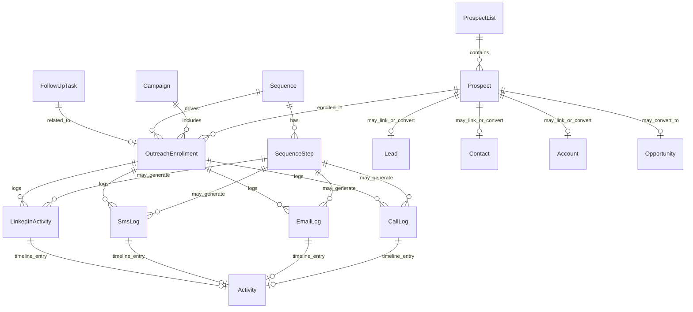
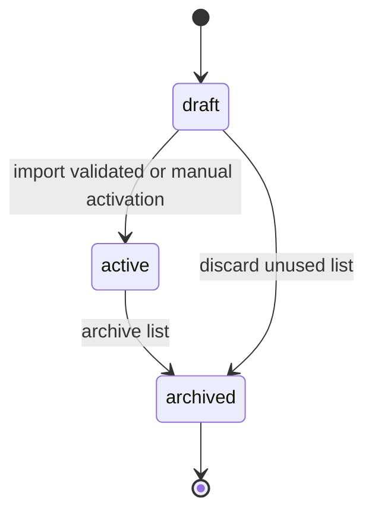
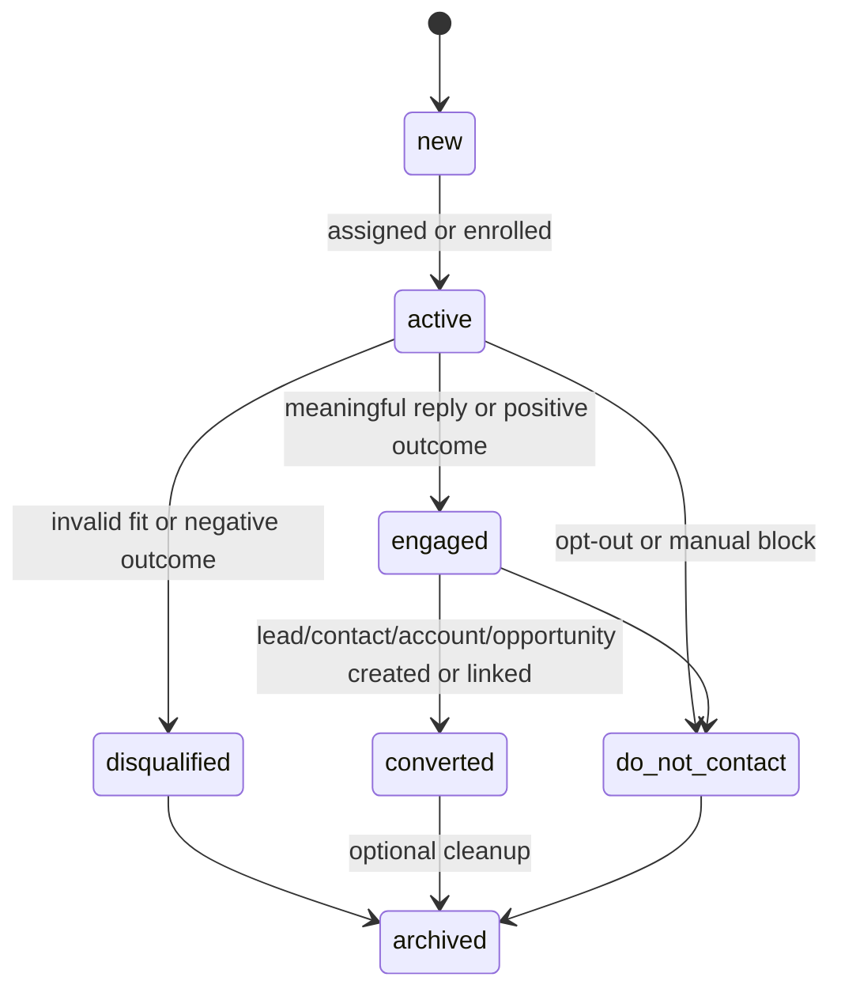
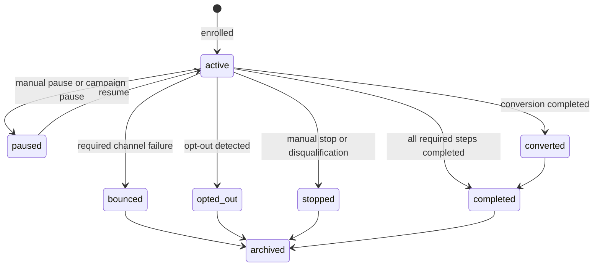
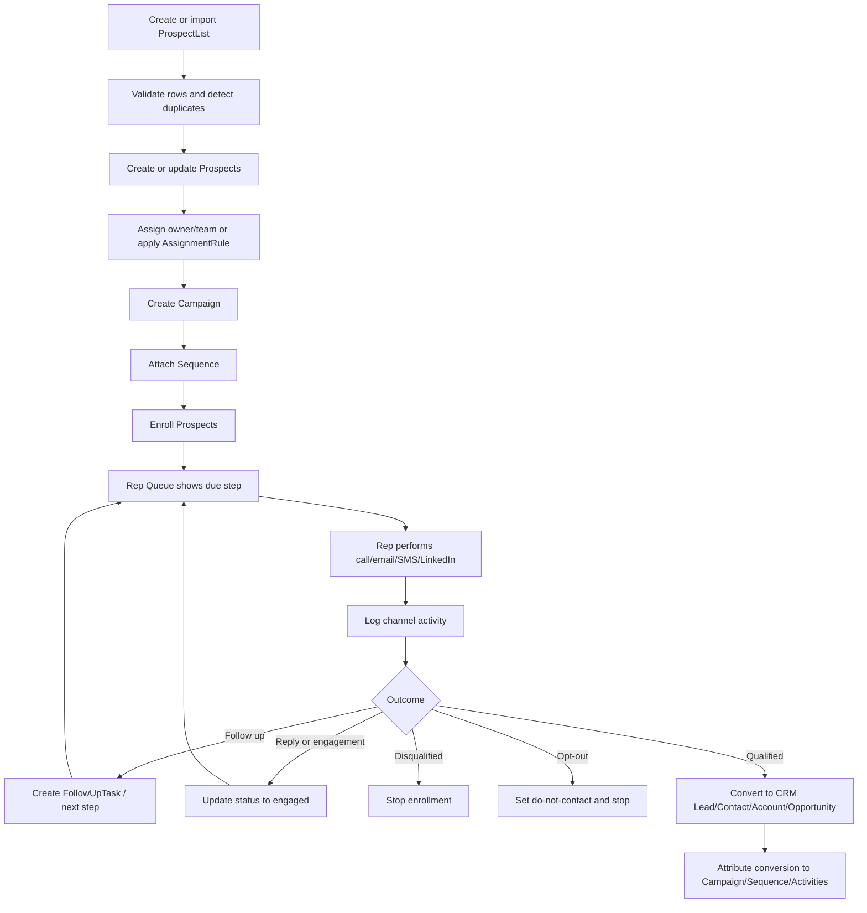

# 05_Outbound_Sales.md

## 1. Document Metadata

| Field | Value |
| --- | --- |
| Document name | `05_Outbound_Sales.md` |
| Phase | Phase 05 |
| Phase name | Outbound Sales |
| Document type | Phase-level product, data, workflow, API, UX, permissions, reporting, audit, integration, and implementation specification |
| Status | Draft for implementation planning |
| Source documents | `00_Master_Platform_Documentation.md`, `00_Global_Documentation_Rules.md`, `00_Global_Domain_Model.md`, `00_Global_Decisions_Register.md`, prior phase summaries 01-04 |
| Primary owner | Product Architect / SaaS Systems Analyst |
| Primary modules affected | Outbound Sales, CRM, Core Platform, Calendar / Tasks, Reporting / Analytics, Integrations |
| Created date | 2026-05-09 |
| Constraint | Do not create Phase 06 in this document. Phase 06 is referenced only as a dependency for canonical task/calendar behavior. |

## 2. Phase Purpose

Phase 05 defines the Outbound Sales module at the design level required for implementation planning. It creates the official outbound operations model for prospect lists, prospects, campaigns, sequences, sequence steps, outreach enrollments, channel activity logging, follow-up queues, conversion tracking, and outbound analytics.

This phase connects sales execution to the CRM foundation from Phase 04. It must make reps productive without creating disconnected sales-only entities that compete with `Lead`, `Contact`, `Account`, `Opportunity`, `Activity`, or future `Task` records.

The module must support manual outbound execution first: reps can import or create targets, enroll them in campaigns/sequences, perform calls/emails/SMS/LinkedIn activity, log outcomes, schedule follow-ups, and convert qualified targets into CRM records. Automated sending, dialer automation, LinkedIn automation, and provider-specific workflows are future-capable but not assumed as MVP requirements.

## 3. Phase Goals

1. Define a canonical outbound target and list model that can coexist with CRM records.
2. Define campaign and sequence structures for manual cadence execution.
3. Define sequence step and enrollment behavior that can later support provider automation without redesigning the model.
4. Define channel-specific logs for calls, emails, SMS, and LinkedIn activity while preserving CRM timeline visibility.
5. Define rep queues and follow-up behavior without creating a duplicate task system.
6. Define conversion tracking from outbound effort into Lead, Account, Contact, and Opportunity records.
7. Define permission, audit, reporting, integration, offline, and UX requirements for production-grade outbound operations.
8. Ensure all outbound data respects tenant/company/module/permission boundaries.
9. Make outbound analytics possible from the first implementation rather than retrofitting events later.
10. Preserve future compatibility with Phase 06 Calendar and Task System, later integration providers, and reporting dashboards.

## 4. Scope

### 4.1 In Scope

- Prospect list creation, import, validation, segmentation, archiving, and list quality tracking.
- Prospect creation, ownership, status tracking, deduplication support, channel availability, compliance flags, and conversion links.
- Campaign creation, targeting, channel mix, lifecycle, ownership, enrollment management, and performance snapshots.
- Sequence creation, ordered step configuration, manual step execution, pause/stop/complete behavior, and future automation seams.
- Outreach enrollments connecting targets to campaigns/sequences and tracking progress.
- Logging calls, emails, SMS, and LinkedIn activity with outcomes, disposition, timestamps, notes, and related CRM records.
- Rep queue views for due steps, overdue work, callbacks, replies, recently engaged prospects, and stuck enrollments.
- Follow-up tasks and next-action handling using the future canonical task model where possible.
- Conversion workflow to create or link Lead, Contact, Account, and Opportunity records.
- Saved views, filters, search, tags, custom fields, import/export, audit logging, notifications, and reporting requirements.
- Conceptual REST API requirements for outbound resources.
- UX requirements for desktop and limited mobile/offline capture.

### 4.2 Out of Scope

- Phase 06 Calendar and Task System implementation.
- Native LinkedIn automation, scraping, browser automation, or automated LinkedIn sending.
- Full marketing automation platform behavior such as drip marketing, landing pages, attribution pixels, or marketing consent centers.
- Advanced email deliverability, inbox rotation, warmup systems, spam testing, or domain reputation management.
- Power dialer, predictive dialer, call recording compliance engine, or telecom billing.
- Complete email/SMS provider implementation. Provider integration details belong primarily to the integrations phase.
- AI-generated personalization, AI lead scoring, and AI recommendations unless later approved.
- Complex revenue attribution models beyond baseline campaign/sequence/activity attribution.
- Customer-facing portal or self-service opt-out portal.
- Rewriting CRM entities from Phase 04.

## 5. Non-Goals

- Do not replace `Lead` with `Prospect`.
- Do not replace `Contact` with `Prospect`.
- Do not replace `Account` with `Prospect`.
- Do not create a new task system for outbound follow-ups.
- Do not treat `Activity` as sufficient to store all channel-specific outbound data.
- Do not assume provider-level automation exists for email, SMS, phone, or LinkedIn.
- Do not implement any provider behavior that cannot be audited, permission-checked, and reported.
- Do not make outbound records globally visible across companies.
- Do not bypass do-not-contact or opt-out fields for enrollment or sequence advancement.
- Do not store unbounded message bodies or sensitive communication content unless a future security/integration decision approves retention rules.

## 6. Source-of-Truth Definitions

| Term | Definition | Source-of-truth rule |
| --- | --- | --- |
| Tenant | Top-level SaaS isolation boundary. | All outbound records include `tenant_id`. |
| Company | Customer organization inside a Tenant. | All company-scoped outbound records include `company_id`. |
| Account | CRM business/customer/prospect/vendor record. | Do not use Company as customer/prospect. |
| Contact | Person associated with one or more Accounts and sales records. | Prospects may link to Contact; they do not replace Contact. |
| Lead | Unqualified or early-stage sales record requiring qualification. | Prospects may convert to Lead or link to existing Lead. |
| Opportunity | Potential revenue/work record. | Conversion may create or link Opportunity. |
| Activity | CRM/timeline activity. | Outbound channel logs should create/link Activity timeline entries. |
| Prospect | Outbound target record. | Used for campaign/sequence execution; may link to CRM entities. |
| Sequence | Reusable outbound cadence definition. | Contains ordered SequenceSteps. |
| SequenceStep | Single planned touchpoint in a Sequence. | May create due work and logs. |
| OutreachEnrollment | Participation of a target in Campaign/Sequence. | Source of truth for progress, pause, completion, stop, opt-out, and conversion linkage. |
| FollowUpTask | Outbound follow-up action. | Prefer canonical `Task` with outbound category once Phase 06 exists. |
| LinkedInActivity | Manual LinkedIn log only. | Automation remains out of scope unless confirmed. |

## 7. Canonical Entity Definitions

### 7.1 Entity Relationship Diagram

### 7.2 Canonical Entity Table

| Entity | Purpose | Owner module | Scope | Tenant/company scoping | Key relationships | Lifecycle / statuses | Index considerations | Permissions impact | Audit requirements | Reporting impact | Future-phase impact |
| --- | --- | --- | --- | --- | --- | --- | --- | --- | --- | --- | --- |
| `ProspectList` | Container for imported or segmented outbound targets. | Outbound Sales | Company-scoped | Required `tenant_id`, `company_id`; optional `branch_id`. | Prospects, ImportJob, FileAttachment, Campaign, Tags, SavedViews. | `draft`, `active`, `archived`. | `(tenant_id, company_id, status)`, owner, source, import job, name text. | Users need list view/create/update/archive/import permissions. | Create/update/archive/import events. | List quality, source performance, conversion attribution. | Later enrichment and segmentation must reuse it. |
| `Prospect` | Outbound target that may link to CRM records. | Outbound Sales | Company-scoped | Required `tenant_id`, `company_id`; optional branch/team fields. | ProspectList, Lead, Contact, Account, Opportunity, Enrollments, Activity logs. | `new`, `active`, `engaged`, `converted`, `disqualified`, `do_not_contact`, `archived`. | Email/phone normalized, list, owner, assigned user, status, next follow-up. | Users need prospect view/create/update/convert/do-not-contact permissions. | Create/update/archive/do-not-contact/convert events. | Conversion, engagement, list quality, rep productivity. | Future enrichment must link, not replace. |
| `Campaign` | Outbound initiative with target audience, channel mix, timing, and goals. | Outbound Sales | Company-scoped | Required `tenant_id`, `company_id`; optional branch/team. | ProspectLists, Sequences, Enrollments, Activity logs, SavedViews. | `draft`, `active`, `paused`, `completed`, `archived`. | Status, owner, date range, active campaigns, name. | Start/pause/complete requires elevated permissions. | Lifecycle and settings changes audited. | Campaign performance and attribution. | Later budget/cost attribution may extend it. |
| `Sequence` | Reusable outbound cadence definition. | Outbound Sales | Company-scoped | Required `tenant_id`, `company_id`. | Campaigns, SequenceSteps, Enrollments. | `draft`, `active`, `paused`, `archived`. | Status, owner, name, channel mix. | Create/update/archive permissions; active edits restricted. | Creation, step changes, status changes audited. | Sequence performance and step drop-off. | Future automation must preserve sequence identity. |
| `SequenceStep` | Ordered touchpoint inside a sequence. | Outbound Sales | Company-scoped child of Sequence | Required `tenant_id`, `company_id`, `sequence_id`. | Sequence, logs, follow-up tasks, enrollments. | `draft`, `active`, `inactive`, `archived`. | Sequence + step_number unique active index. | Step editing restricted when sequence active. | Create/update/reorder/archive audited. | Step completion, outcome, conversion. | Provider templates can attach later. |
| `OutreachEnrollment` | Target participation and progress through campaign/sequence. | Outbound Sales | Company-scoped | Required `tenant_id`, `company_id`. | Prospect/Lead/Contact, Campaign, Sequence, SequenceStep, logs. | `active`, `paused`, `completed`, `bounced`, `opted_out`, `stopped`, `archived`. | Target/campaign/sequence uniqueness, due date, status, assignee. | Create/update/pause/resume/stop permissions. | Enrollment lifecycle and step completion audited. | Funnel, conversion, adherence, SLA. | Source for future automation engines. |
| `CallLog` | Channel-specific phone call record. | Outbound Sales | Company-scoped activity record | Required `tenant_id`, `company_id`. | Prospect, Lead, Contact, Account, Enrollment, Activity, FollowUpTask. | `logged`, `corrected`, `archived`. | Occurred_at, actor, outcome, disposition, related entity. | Log/correct/archive permissions. | Created/corrected/archived audited. | Call volume, connection rate, outcomes. | Dialer integration should write here. |
| `EmailLog` | Channel-specific email metadata. | Outbound Sales | Company-scoped activity record | Required `tenant_id`, `company_id`. | Prospect, Lead, Contact, Account, Enrollment, Activity. | `draft_logged`, `sent`, `delivered`, `opened`, `replied`, `bounced`, `failed`, `archived`. | Provider IDs, direction, status, occurred_at, subject text. | Log/update provider status/export permissions. | Created/status/archived audited. | Email performance, replies, bounce rate. | Email provider integration should write here. |
| `SmsLog` | Channel-specific SMS metadata and compliance state. | Outbound Sales | Company-scoped activity record | Required `tenant_id`, `company_id`. | Prospect, Lead, Contact, Account, Enrollment, Activity. | `queued`, `sent`, `delivered`, `replied`, `failed`, `opted_out`, `archived`. | Phone, provider id, status, opt-out flag, occurred_at. | Log/update provider status permissions. | Created/status/opt-out/archived audited. | SMS performance and compliance. | SMS provider integration should write here. |
| `LinkedInActivity` | Manual LinkedIn interaction log. | Outbound Sales | Company-scoped activity record | Required `tenant_id`, `company_id`. | Prospect, Lead, Contact, Account, Enrollment, Activity. | `logged`, `needs_follow_up`, `archived`. | Actor, subtype, occurred_at, profile_url, related target. | Log/correct/archive permissions. | Created/corrected/archived audited. | LinkedIn touch volume and outcomes. | Must remain manual until automation approved. |
| `FollowUpTask` | Outbound next-action task. | Outbound Sales / Calendar & Tasks | Company-scoped | Required `tenant_id`, `company_id`. | Task, Enrollment, Prospect, Lead, Contact, Account. | `open`, `completed`, `skipped`, `archived`. | Due_at, assigned_user, priority, enrollment. | View/manage permissions; assignment rules apply. | Create/complete/skip/reassign audited. | Queue health and rep discipline. | Must converge with Phase 06 Task. |

## 8. Entity Lifecycle and Status Rules

### 8.1 ProspectList Lifecycle

Rules:

- A draft list may have zero prospects.
- An active list may be used for campaigns and filtering.
- Archived lists must remain available for historical reporting but hidden from default pickers.
- Archiving a list must not archive prospects automatically unless a separate bulk action is explicitly requested and audited.
- Imported lists must retain `import_job_id` and validation statistics.

### 8.2 Prospect Lifecycle

Rules:

- `converted` must include conversion references.
- `do_not_contact` must stop new enrollments and sequence advancement.
- `disqualified` must require a reason code.
- `archived` must hide from default active queues but preserve analytics.
- If a Prospect is linked to a Contact whose status is `do_not_contact`, Prospect enrollment must be blocked.

### 8.3 Campaign Lifecycle

- `draft`: configuration can be edited freely; no active enrollments should execute.
- `active`: users can enroll prospects, execute steps, and log activity.
- `paused`: no new due steps should be generated unless manually overridden by permissioned users.
- `completed`: campaign is finished; historical analytics remain visible.
- `archived`: hidden from default views; cannot accept new enrollments.

### 8.4 Sequence and Step Lifecycle

- Draft sequences may be edited freely.
- Active sequences may allow limited non-breaking edits, but step deletion or reordering should be blocked if active enrollments exist unless versioning is introduced.
- SequenceStep `step_number` must remain unique within the active sequence version.
- Completed historical enrollments must preserve the step identity and label used at execution time.

### 8.5 OutreachEnrollment Lifecycle

Rules:

- An enrollment must have exactly one `target_type` and `target_id`.
- If `prospect_id` exists, it should be the primary outbound target reference.
- Duplicate active enrollment for the same target, campaign, and sequence should be blocked unless company settings explicitly allow parallel enrollment.
- Enrollment advancement must validate campaign status, sequence status, step status, target status, channel availability, and permissions.
- Opt-out must stop the enrollment immediately for the affected channel and possibly all channels based on company settings.

### 8.6 Activity Log Lifecycle

- Channel logs should be append-oriented.
- Corrections should update a correction status or create correction metadata; they must not silently overwrite history.
- Deletion should be soft archive except for approved retention/privacy deletion procedures.
- Each log should link to a CRM `Activity` where the action should appear on CRM timelines.

## 9. Entity Relationship Rules

1. `Prospect` may link to `Lead`, `Contact`, and `Account`, but those links are optional during early outbound import.
2. `Prospect` must store enough raw contact data for outbound execution even before CRM conversion.
3. `Prospect` must not be used as an operational customer record outside outbound execution.
4. `Campaign` may target one or more `ProspectList` records and may use one or more `Sequence` records if future advanced campaign logic supports it.
5. MVP should prefer one primary sequence per campaign unless multi-sequence campaigns are explicitly required.
6. `SequenceStep` belongs to one `Sequence`.
7. `OutreachEnrollment` links one target to one campaign and one sequence.
8. Channel logs may link directly to Prospect, Lead, Contact, Account, Campaign, Sequence, Step, Enrollment, Activity, and FollowUpTask.
9. CRM `Activity` should be created or linked when an outbound channel log should appear in the timeline.
10. `FollowUpTask` should reference Enrollment and the underlying target so queues and reporting can group work.
11. Import and export records must use Core Platform `ImportJob` and `ExportJob`.
12. Tags must be assigned through `TagAssignment`; do not create outbound-specific tag fields as primary segmentation.
13. Custom fields can extend Prospect, ProspectList, Campaign, Sequence, or Enrollment only when stable fields are insufficient.
14. Soft-deleted or archived records must not appear in default active queues but must remain visible to permissioned users in historical contexts.
15. All relationship queries must apply tenant/company filtering before any user-provided filters.

## 10. Workflow Requirements

### 10.1 Primary Outbound Workflow

### 10.2 Prospect Import Workflow

1. User creates a ProspectList or selects an existing list.
2. User uploads CSV/Excel file using `FileAttachment` and starts `ImportJob`.
3. System validates required columns, email/phone format, duplicate records, do-not-contact conflicts, and required tenant/company scope.
4. User reviews validation summary before final import where practical.
5. System creates Prospect records, links to existing CRM records where confidence is high, and records unresolved duplicates for manual review.
6. Import result stores row-level errors and counts.
7. Completion notification is sent to the requester.
8. Audit events are recorded.

### 10.3 Manual Campaign Execution Workflow

1. Manager creates campaign and selects list/filters.
2. Manager creates or selects sequence.
3. System validates active sequence steps, required channels, and compliance settings.
4. Manager starts campaign.
5. Enrollments are created for eligible targets.
6. Reps work due steps from their queue.
7. Logs and follow-ups update enrollment status.
8. Manager monitors activity, conversion, and exceptions.

### 10.4 Conversion Workflow

1. Rep selects Convert from Prospect detail, enrollment, or queue.
2. System searches for matching Lead, Contact, and Account using normalized email, phone, company name, website, and duplicate rules from CRM.
3. User chooses create new or link existing records based on permissions.
4. System creates/updates Lead, Contact, Account, and optionally Opportunity.
5. System stores conversion references on Prospect and Enrollment.
6. System logs CRM Activity and AuditLog.
7. Reporting attribution links list, campaign, sequence, step, rep, and activities to the conversion.

## 11. Data Model Requirements

| ID | Requirement |
| --- | --- |
| DATA-05-001 | Every Outbound Sales record must include `tenant_id` and `company_id` unless explicitly approved as platform-level configuration. |
| DATA-05-002 | Public APIs must expose stable `id` fields and never expose MongoDB `_id` as the public identifier. |
| DATA-05-003 | Outbound records must include standard shared fields for creation, update, soft delete/archive, source, external references, and metadata where applicable. |
| DATA-05-004 | `Prospect` must support optional links to `lead_id`, `contact_id`, and `account_id`. |
| DATA-05-005 | `Prospect` must retain normalized email and phone fields for duplicate detection and filtering. |
| DATA-05-006 | `Prospect` must support do-not-contact and per-channel opt-out state. |
| DATA-05-007 | `Campaign` must store status, owner, date range, channel mix, goals, and audience references. |
| DATA-05-008 | `SequenceStep` must store channel, order, delay, instructions, template reference, manual/automation flag, and skip rules. |
| DATA-05-009 | `OutreachEnrollment` must store current step, next due time, stop reason, conversion references, and last activity summary. |
| DATA-05-010 | Channel logs must store both outbound-specific references and CRM references where applicable. |
| DATA-05-011 | Email/SMS provider identifiers must be stored in `external_refs` or approved provider ID fields, not ad hoc fields spread across records. |
| DATA-05-012 | Historical activity records should be append-oriented and correction-aware. |
| DATA-05-013 | Active enrollment uniqueness should prevent duplicate active enrollment for the same target/campaign/sequence unless company settings allow it. |
| DATA-05-014 | Sequence edits must not rewrite historical enrollment/activity facts. |
| DATA-05-015 | Analytics-critical timestamps must be explicit fields, not buried in notes. |
| DATA-05-016 | Import errors and row-level validation outcomes must be retained through `ImportJob`. |
| DATA-05-017 | Exports must be represented through `ExportJob` and audited. |
| DATA-05-018 | Soft delete/archive must preserve historical analytics unless retention/privacy policy requires redaction. |
| DATA-05-019 | Custom fields may supplement outbound records but must not replace stable required fields. |
| DATA-05-020 | All saved queue/filter configurations must use `SavedView`. |

## 12. API Requirements

| ID | Requirement |
| --- | --- |
| API-05-001 | All outbound endpoints must be REST-style resources under `/api/v1/outbound/*`. |
| API-05-002 | Every endpoint must enforce tenant, company, module enablement, role, and permission checks on the backend. |
| API-05-003 | List endpoints must support pagination, sorting, filtering, saved view integration, and stable response shapes. |
| API-05-004 | Create/update endpoints must validate required fields, statuses, relationships, channel availability, do-not-contact rules, and duplicate enrollment rules. |
| API-05-005 | `GET /api/v1/outbound/prospect-lists` must list permission-visible lists with filters for status, owner, source, tags, created date, and import job. |
| API-05-006 | `POST /api/v1/outbound/prospect-lists` must create a draft or active list. |
| API-05-007 | `POST /api/v1/outbound/prospect-lists/{prospect_list_id}/import` must create an `ImportJob` and not synchronously process large files. |
| API-05-008 | `GET /api/v1/outbound/prospects` must support filters for list, status, owner, engagement state, next follow-up, campaign, do-not-contact, and conversion state. |
| API-05-009 | `POST /api/v1/outbound/prospects` must support manual prospect creation with duplicate warnings. |
| API-05-010 | `PATCH /api/v1/outbound/prospects/{prospect_id}` must prevent unauthorized changes to conversion and compliance fields. |
| API-05-011 | `POST /api/v1/outbound/prospects/{prospect_id}/convert` must support creating or linking Lead, Contact, Account, and Opportunity records subject to CRM permissions. |
| API-05-012 | Campaign endpoints must support create, read, update, start, pause, complete, archive, and performance summary. |
| API-05-013 | Sequence endpoints must support create, read, update, archive, and ordered step management. |
| API-05-014 | Sequence step reorder must validate sequence status and active enrollment impact. |
| API-05-015 | Enrollment endpoints must support create, pause, resume, stop, complete-step, and conversion linkage. |
| API-05-016 | Enrollment creation must validate target eligibility, active campaign/sequence, do-not-contact state, and duplicate enrollment constraints. |
| API-05-017 | Call log endpoint must support outcome, disposition, duration, voicemail, notes, callback, and follow-up creation. |
| API-05-018 | Email log endpoint must support direction, participants, subject, provider IDs, delivery/reply/bounce timestamps, and body preview restrictions. |
| API-05-019 | SMS log endpoint must support direction, phone number, provider ID, delivery/reply/failure state, opt-out detection, and compliance status. |
| API-05-020 | LinkedIn activity endpoint must support manual activity subtype, profile URL, notes, outcome, and follow-up creation. |
| API-05-021 | Rep queue endpoint must return due steps and follow-ups ordered by overdue state, priority, engagement state, and assignment. |
| API-05-022 | Analytics endpoints must return aggregated metrics only after permission checks. |
| API-05-023 | Export endpoints must create `ExportJob`; large result sets must not be returned synchronously. |
| API-05-024 | All mutation endpoints must be idempotency-aware where retries are likely, especially imports, enrollment creation, and activity logging. |
| API-05-025 | API responses must include clear validation errors and recoverable conflict messages. |

## 13. UI / UX Requirements

| ID | Requirement |
| --- | --- |
| UX-05-001 | The Outbound Sales workspace must expose main navigation for Rep Queue, Prospect Lists, Prospects, Campaigns, Sequences, Activity Logs, and Analytics. |
| UX-05-002 | Users without outbound module access must not see outbound navigation. |
| UX-05-003 | Users with read-only permissions must see disabled or hidden mutation controls with useful permission messaging. |
| UX-05-004 | Prospect List views must provide table/list layout, saved filters, source, owner, count, status, import state, and quality indicators. |
| UX-05-005 | Prospect import flow must show upload, mapping, validation summary, duplicate review, final confirmation, and import result screens. |
| UX-05-006 | Prospect list empty state must explain manual creation and import options. |
| UX-05-007 | Prospect table must support filters by list, status, owner, assigned user, engagement, next follow-up, last contacted, channel availability, conversion state, and do-not-contact. |
| UX-05-008 | Prospect detail must show header, status, owner, CRM links, contact methods, enrollments, timeline, notes, tags, custom fields, compliance state, and conversion action. |
| UX-05-009 | Campaign list must show status, owner, date range, audience size, active enrollments, activity count, conversion count, and health indicators. |
| UX-05-010 | Campaign detail must include status header, audience summary, sequence summary, enrollment table, activity feed, analytics cards, and lifecycle controls. |
| UX-05-011 | Campaign start must use a validation modal showing missing sequence, empty audience, do-not-contact exclusions, invalid channels, and duplicate enrollment counts. |
| UX-05-012 | Sequence builder must support ordered steps, drag/reorder in safe states, channel selection, delay rules, manual instructions, template references, and validation warnings. |
| UX-05-013 | Sequence builder must warn when editing active sequences with active enrollments. |
| UX-05-014 | Rep Queue must show due today, overdue, callbacks, replies, recently engaged, and stuck/blocked work. |
| UX-05-015 | Rep Queue cards/rows must show target name, account/company, channel, due time, campaign, sequence step, last activity, priority, and quick log action. |
| UX-05-016 | Call log drawer must include phone number, direction, outcome, disposition, voicemail flag, duration, notes, callback date, and follow-up checkbox. |
| UX-05-017 | Email log drawer must include subject, participants, direction, status, occurred/sent time, body preview, and follow-up checkbox. |
| UX-05-018 | SMS log drawer must include phone, direction, status, opt-out detection warning, body preview, and follow-up checkbox. |
| UX-05-019 | LinkedIn activity drawer must clearly label actions as manual logs and include activity subtype, profile URL, notes, outcome, and follow-up. |
| UX-05-020 | Conversion flow must show duplicate CRM matches and allow create/link decisions according to user permissions. |
| UX-05-021 | Error states must distinguish validation errors, permission errors, duplicate conflicts, archived record conflicts, provider failures, and offline sync conflicts. |
| UX-05-022 | Loading states must be present for import jobs, exports, campaign start, enrollment creation, and analytics refresh. |
| UX-05-023 | Empty analytics state must explain that metrics appear after activities or enrollments exist. |
| UX-05-024 | Export controls must be visible only to users with export permission. |
| UX-05-025 | Mobile UX should prioritize rep queue, prospect detail, quick call log, quick SMS log, quick LinkedIn log, and offline-safe notes/follow-ups. |

## 14. Search, Filters, and Saved Views

- ProspectList searchable fields: name, description, source detail, owner, import file name.
- Prospect searchable fields: display name, company name, email, phone, title, LinkedIn URL, tags, account/contact/lead links.
- Campaign searchable fields: name, description, owner, channel mix, status.
- Sequence searchable fields: name, description, channel mix, owner.
- Activity logs searchable fields: subject, phone, participant email, body preview, notes, disposition, outcome.
- Default saved views should include My Due Follow-ups, Overdue Follow-ups, Recently Engaged, Unassigned Prospects, Do-Not-Contact, Active Campaigns, Paused Campaigns, Draft Sequences, Bounced/Failed Outreach, and Converted Prospects.
- Saved views must use Core Platform `SavedView` and respect visibility settings: private, team, role, company where allowed.
- Search results must respect tenant/company/module/permission filters and must not leak disabled module records.
- Filters must include archived records only when explicitly selected and permission allows.

## 15. Permissions and Access Control

| ID | Requirement |
| --- | --- |
| PERM-05-001 | Outbound module access requires company module enablement and user permission. |
| PERM-05-002 | Users must not see outbound records for companies where they lack active membership. |
| PERM-05-003 | `outbound.prospect_list.view` controls list visibility. |
| PERM-05-004 | `outbound.prospect_list.create` controls list creation. |
| PERM-05-005 | `outbound.prospect_list.update` controls list edits. |
| PERM-05-006 | `outbound.prospect_list.archive` controls archiving. |
| PERM-05-007 | `outbound.prospect_list.import` controls list imports. |
| PERM-05-008 | `outbound.prospect.view` controls prospect visibility. |
| PERM-05-009 | `outbound.prospect.create` controls manual prospect creation. |
| PERM-05-010 | `outbound.prospect.update` controls prospect edits except restricted fields. |
| PERM-05-011 | `outbound.prospect.convert` controls conversion to CRM records and also requires relevant CRM create/update permissions. |
| PERM-05-012 | `outbound.prospect.do_not_contact` controls manual do-not-contact changes. |
| PERM-05-013 | `outbound.campaign.view/create/update/start/pause/complete` permissions control campaign lifecycle actions. |
| PERM-05-014 | `outbound.sequence.view/create/update/archive` permissions control sequence management. |
| PERM-05-015 | `outbound.enrollment.view/create/update/pause_resume/stop` permissions control enrollment actions. |
| PERM-05-016 | `outbound.activity.log_call`, `.log_email`, `.log_sms`, and `.log_linkedin` control channel logging. |
| PERM-05-017 | `outbound.follow_up.view` and `outbound.follow_up.manage` control follow-up queues and actions. |
| PERM-05-018 | `outbound.analytics.view` controls outbound analytics dashboards. |
| PERM-05-019 | `outbound.export` controls export job creation and download access. |
| PERM-05-020 | `outbound.admin.manage_settings` controls outbound settings such as concurrency and default follow-up rules. |
| PERM-05-021 | Assignment/team scope may restrict users to owned, assigned, team, branch, or company-wide records depending on policy. |
| PERM-05-022 | Backend checks are mandatory for all endpoints; frontend hiding is not sufficient. |
| PERM-05-023 | Offline queued actions must be revalidated against permissions at sync time. |
| PERM-05-024 | Reporting and search must apply the same record visibility rules as list/detail views. |

## 16. Notifications

| ID | Requirement |
| --- | --- |
| NOTIF-05-001 | Send notification when a prospect or follow-up is assigned to a user. |
| NOTIF-05-002 | Send due-soon notification for follow-ups based on user/company preference. |
| NOTIF-05-003 | Send overdue notification for follow-ups when configured. |
| NOTIF-05-004 | Send campaign lifecycle notifications to owner/managers when started, paused, completed, or validation fails. |
| NOTIF-05-005 | Send import completion, partial failure, or failure notification to requester. |
| NOTIF-05-006 | Send export completion or failure notification to requester. |
| NOTIF-05-007 | Notify assigned rep when a reply or meaningful engagement is detected where integration supports it. |
| NOTIF-05-008 | Notify owner/manager when opt-out or do-not-contact state is detected if configured. |
| NOTIF-05-009 | Notify user when conversion succeeds or fails. |
| NOTIF-05-010 | Notifications must not expose target details to users lacking record access. |

## 17. Audit Logging

| ID | Requirement |
| --- | --- |
| AUDIT-05-001 | ProspectList create/update/archive/import actions must create `AuditLog` records. |
| AUDIT-05-002 | Prospect create/update/archive/do-not-contact/convert actions must be audited. |
| AUDIT-05-003 | Campaign create/update/start/pause/complete/archive actions must be audited. |
| AUDIT-05-004 | Sequence create/update/archive actions must be audited. |
| AUDIT-05-005 | SequenceStep create/update/reorder/archive actions must be audited. |
| AUDIT-05-006 | OutreachEnrollment create/pause/resume/stop/complete-step/complete/convert actions must be audited. |
| AUDIT-05-007 | CallLog create/correct/archive actions must be audited. |
| AUDIT-05-008 | EmailLog create/status update/archive actions must be audited. |
| AUDIT-05-009 | SmsLog create/status update/opt-out/archive actions must be audited. |
| AUDIT-05-010 | LinkedInActivity create/correct/archive actions must be audited. |
| AUDIT-05-011 | Follow-up create/complete/skip/reassign actions must be audited when high-impact or assignment-related. |
| AUDIT-05-012 | Export requests and downloads must be audited. |
| AUDIT-05-013 | Outbound settings changes must be audited. |
| AUDIT-05-014 | Audit records must include actor, timestamp, tenant, company, entity type, entity ID, action, and before/after where safe. |
| AUDIT-05-015 | AuditLog must remain append-only. |

## 18. Reporting and Analytics Impact

| ID | Requirement |
| --- | --- |
| REPORT-05-001 | Outbound Overview Dashboard must show active campaigns, active enrollments, due work, overdue work, activity volume, replies, conversions, and exceptions. |
| REPORT-05-002 | Rep Activity Dashboard must show calls, emails, SMS, LinkedIn activities, completed steps, overdue follow-ups, conversions, and meetings/appointments where available. |
| REPORT-05-003 | Campaign Performance Dashboard must show audience size, enrollment count, activity count, reply rate, conversion rate, opportunity count, and revenue influenced where available. |
| REPORT-05-004 | Sequence Performance Dashboard must show step completion, step outcomes, drop-off, reply attribution, and conversion by step. |
| REPORT-05-005 | Prospect List Quality Report must show total imported, invalid, duplicate, opted-out, active, engaged, converted, and disqualified. |
| REPORT-05-006 | Follow-up Queue Health Report must show due today, overdue, skipped, completed, and average delay. |
| REPORT-05-007 | Channel Performance Report must compare calls, emails, SMS, and LinkedIn logged activities by outcome and conversion. |
| REPORT-05-008 | Conversion Attribution Report must connect ProspectList, Campaign, Sequence, Enrollment, activity logs, rep, and CRM conversion records. |
| REPORT-05-009 | Compliance Exceptions Report must show opted-out, do-not-contact, invalid channel, bounce, and blocked enrollment events. |
| REPORT-05-010 | Reports must be permission-aware and company-scoped. |
| REPORT-05-011 | Metrics snapshots may be denormalized for dashboard performance but source events must remain queryable. |
| REPORT-05-012 | All analytics timestamps must be UTC with display in user/company timezone. |

## 19. Mobile and Offline Impact

| ID | Requirement |
| --- | --- |
| OFFLINE-05-001 | Mobile should support viewing the rep queue for assigned work. |
| OFFLINE-05-002 | Mobile should support Prospect detail view with essential CRM links and contact methods. |
| OFFLINE-05-003 | Mobile should support quick CallLog, SmsLog, LinkedInActivity, and note/follow-up capture. |
| OFFLINE-05-004 | Offline-created logs must include stable client-generated IDs, tenant_id, company_id, actor_user_id, occurred_at, and sync metadata. |
| OFFLINE-05-005 | Offline queued actions must be revalidated on sync for permissions, target state, enrollment state, and do-not-contact state. |
| OFFLINE-05-006 | If offline sync detects that a prospect was opted out or archived before sync, the action must be rejected or marked conflict for review. |
| OFFLINE-05-007 | Offline sequence advancement must not silently skip server validation. |
| OFFLINE-05-008 | Mobile must clearly show unsynced, failed, and conflict states for activity logs and follow-ups. |
| OFFLINE-05-009 | Bulk imports, sequence builder, campaign start, analytics, and exports are desktop-first and not required offline. |
| OFFLINE-05-010 | Offline support for email/SMS sending is not required unless provider integration later supports safe queued sending. |

## 20. Integration Impact

| ID | Requirement |
| --- | --- |
| INT-05-001 | CSV/Excel prospect imports must use `ImportJob` and `FileAttachment`. |
| INT-05-002 | Exports must use `ExportJob` and respect permissions and audit requirements. |
| INT-05-003 | Email provider integration must write status updates to `EmailLog` and may link provider message/thread IDs. |
| INT-05-004 | SMS provider integration must write delivery/reply/failure/opt-out updates to `SmsLog`. |
| INT-05-005 | Phone/dialer integration, if added later, must write to `CallLog` rather than creating a parallel call record. |
| INT-05-006 | LinkedIn integration must remain manual logging only unless a future explicit decision approves automation. |
| INT-05-007 | Webhooks may later emit outbound lifecycle events but must use approved WebhookEndpoint/WebhookDelivery foundations. |
| INT-05-008 | Provider failures must be visible and recoverable; no silent failure. |
| INT-05-009 | External provider IDs must be stored in `external_refs` or approved provider fields. |
| INT-05-010 | Integrations must respect tenant/company/module/permission boundaries. |

## 21. Security Considerations

- Tenant isolation is mandatory for every query, mutation, import, export, notification, and report.
- Company scoping is mandatory for every outbound record.
- Backend authorization is mandatory and cannot rely on frontend visibility alone.
- Exported prospect/contact data is sensitive and must be permission-gated and audited.
- Message content retention must be conservative; store previews/metadata by default unless retention policy approves more.
- Provider tokens, secrets, API keys, and webhook secrets must never be stored in plaintext.
- Do-not-contact and opt-out states must be protected from casual overwrite.
- Bulk imports must validate file type, size, row count, malicious content, and access scope.
- Notifications must not leak restricted record details.
- Analytics aggregates must not reveal hidden records through counts where that matters for restricted teams.
- Manual LinkedIn logging must not encourage policy-violating automation or scraping.

## 22. Edge Cases

1. Prospect import includes duplicate email already linked to a Contact.
2. Prospect import includes duplicate phone across multiple Contacts.
3. Prospect has no email but campaign sequence requires email.
4. Prospect has no phone but sequence step requires call or SMS.
5. Prospect is already do-not-contact before enrollment.
6. Contact linked to prospect is later marked do-not-contact.
7. Campaign is paused while steps are due.
8. Sequence is edited while active enrollments exist.
9. Sequence step is deleted or reordered after enrollments are active.
10. User tries to enroll archived Prospect.
11. User tries to enroll Prospect in archived Campaign.
12. User lacks CRM permission during conversion.
13. Conversion duplicate match has multiple possible Accounts.
14. Email provider reports bounce after rep already scheduled follow-up.
15. SMS opt-out is detected after an enrollment advanced to next step.
16. User logs activity offline after Prospect was archived on server.
17. User logs a call against the wrong Prospect and needs correction.
18. Manager changes campaign owner after enrollments exist.
19. Rep is removed from company while assigned follow-ups remain open.
20. Import partially succeeds with row-level errors.
21. Export is requested for more records than user is allowed to see.
22. Saved view references a deleted tag or archived campaign.
23. Prospect belongs to multiple lists and one list is archived.
24. Campaign reaches end date while enrollments are still active.
25. A prospect replies positively through email but is also marked bounced by provider.
26. LinkedIn profile URL changes or is invalid.
27. Timezone causes next step due date to fall outside business hours.
28. User tries to complete a step without required outcome.
29. Bulk stop action would affect converted prospects.
30. Analytics counts differ because some users cannot view all records.

## 23. Business Requirements

| ID | Requirement |
| --- | --- |
| BR-05-001 | The platform must give outbound reps a structured workflow for finding, contacting, following up with, and converting prospects. |
| BR-05-002 | Managers must be able to measure outbound effort and conversion without spreadsheets. |
| BR-05-003 | Prospect lists must support imported and manually created outbound targets. |
| BR-05-004 | Campaigns must organize outreach around target audience, channels, schedule, owners, and goals. |
| BR-05-005 | Sequences must support manual cadence steps in MVP. |
| BR-05-006 | Reps must be able to log calls, emails, SMS, and LinkedIn activities. |
| BR-05-007 | Follow-ups must be visible and prioritized so reps do not lose next actions. |
| BR-05-008 | The module must preserve relationship context by linking outbound activity to CRM records. |
| BR-05-009 | The module must support conversion from prospecting into CRM pipeline. |
| BR-05-010 | Outbound reporting must support rep coaching and campaign optimization. |
| BR-05-011 | The module must protect tenant and company data boundaries. |
| BR-05-012 | The module must prevent outreach to do-not-contact or opted-out targets. |
| BR-05-013 | Imports and exports must be controlled, auditable, and permission-aware. |
| BR-05-014 | LinkedIn must begin as manual activity logging, not automation. |
| BR-05-015 | Channel activity records must be reusable by future reporting and integration phases. |
| BR-05-016 | The module must support desktop-first manager workflows and mobile-friendly rep capture. |
| BR-05-017 | Outbound data must remain compatible with future task, notification, analytics, and integration phases. |
| BR-05-018 | The first implementation must avoid unnecessary automation complexity while preserving extension seams. |

## 24. Functional Requirements

| ID | Requirement |
| --- | --- |
| FR-05-001 | Users with permission can create ProspectLists. |
| FR-05-002 | Users with permission can import prospects into ProspectLists using CSV/Excel. |
| FR-05-003 | Import must validate required fields, email/phone format, duplicates, and do-not-contact conflicts. |
| FR-05-004 | Users can view import results and row-level errors. |
| FR-05-005 | Users can create prospects manually. |
| FR-05-006 | Users can link prospects to existing Leads, Contacts, and Accounts. |
| FR-05-007 | Users can assign prospects to users or teams. |
| FR-05-008 | Users can mark prospects as do-not-contact with reason. |
| FR-05-009 | Users can archive prospects without deleting historical activity. |
| FR-05-010 | Users can create campaigns. |
| FR-05-011 | Users can define campaign target lists or filters. |
| FR-05-012 | Users can define campaign channel mix, schedule, owner, and goals. |
| FR-05-013 | Users can start, pause, complete, and archive campaigns with permission. |
| FR-05-014 | Users can create sequences. |
| FR-05-015 | Users can add, edit, reorder, deactivate, and archive sequence steps where allowed. |
| FR-05-016 | Sequence steps can define channel, delay, instructions, and template reference. |
| FR-05-017 | Users can enroll eligible prospects into campaigns/sequences. |
| FR-05-018 | Enrollment must block ineligible, archived, duplicate, or do-not-contact targets. |
| FR-05-019 | Enrollment must calculate current step and next due timestamp. |
| FR-05-020 | Users can pause, resume, stop, or complete enrollments. |
| FR-05-021 | Users can complete sequence steps with outcome. |
| FR-05-022 | Users can log CallLog records with disposition, outcome, duration, voicemail, notes, and callback. |
| FR-05-023 | Users can log EmailLog records with participants, subject, direction, status, and body preview. |
| FR-05-024 | Users can log SmsLog records with phone, direction, status, compliance state, and preview. |
| FR-05-025 | Users can log LinkedInActivity records manually. |
| FR-05-026 | Activity logs can create or link CRM Activity timeline entries. |
| FR-05-027 | Users can create follow-ups from any channel log. |
| FR-05-028 | Rep Queue displays assigned due work and follow-ups. |
| FR-05-029 | Rep Queue prioritizes overdue, due today, high-value, recently engaged, and reply-detected work. |
| FR-05-030 | Users can convert a Prospect into CRM records using duplicate review. |
| FR-05-031 | Conversion can create or link Lead, Contact, Account, and Opportunity based on permissions. |
| FR-05-032 | Conversion attribution must store list, campaign, sequence, enrollment, activity, and rep context. |
| FR-05-033 | Users can filter and save views for prospects, campaigns, sequences, enrollments, logs, and queues. |
| FR-05-034 | Users can export permission-visible outbound data through ExportJob. |
| FR-05-035 | Managers can view outbound analytics dashboards. |
| FR-05-036 | System can notify users of assignments, due follow-ups, overdue follow-ups, import/export completion, and campaign state changes. |
| FR-05-037 | System can detect provider status updates when integrations later exist and update EmailLog/SmsLog. |
| FR-05-038 | System must prevent sequence advancement when target channel data is missing unless step skip rules allow it. |
| FR-05-039 | System must preserve historical logs after campaign/sequence/prospect archiving. |
| FR-05-040 | System must support tags and custom fields through Core Platform foundations. |

## 25. Non-Functional Requirements

| ID | Requirement |
| --- | --- |
| NFR-05-001 | Outbound list and queue pages should load common filtered views within acceptable interactive latency for typical company data volumes. |
| NFR-05-002 | Large imports must run asynchronously and not block API workers. |
| NFR-05-003 | Large exports must run asynchronously and expire according to export retention settings. |
| NFR-05-004 | Mutation APIs must be safe for retries where network failure is likely. |
| NFR-05-005 | Search and filters must be consistently permission-aware. |
| NFR-05-006 | Analytics aggregation must be designed to avoid expensive scans on large activity collections. |
| NFR-05-007 | Activity logs must be durable and not lost during provider callback failures. |
| NFR-05-008 | Offline mobile activity capture must avoid duplicate records through stable IDs and idempotency. |
| NFR-05-009 | Audit logging must not materially degrade normal user interactions. |
| NFR-05-010 | The data model must support future provider automation without core entity replacement. |
| NFR-05-011 | Sensitive fields must be protected according to permissions and retention policy. |
| NFR-05-012 | Background jobs must expose status and recoverable errors. |
| NFR-05-013 | UI must provide clear empty, loading, validation, conflict, and permission states. |
| NFR-05-014 | Timestamp storage must be UTC; display must respect user/company timezone. |
| NFR-05-015 | Records must support soft delete/archive behavior for historical reporting. |
| NFR-05-016 | Data migrations for later automation/provider features must not require renaming core entities. |
| NFR-05-017 | Reports must remain accurate when records are archived or users are reassigned. |
| NFR-05-018 | System must avoid silent failure for imports, exports, provider updates, and offline sync. |

## 26. User Stories

### Sales Rep

- As a sales rep, I want to see my due outbound work so I know who to contact next.
- As a sales rep, I want to log calls quickly so my manager and CRM timeline stay updated.
- As a sales rep, I want to create a follow-up while logging an activity so I do not forget the next step.
- As a sales rep, I want to see whether a prospect is do-not-contact before contacting them.
- As a sales rep, I want to convert a qualified prospect into a CRM opportunity so pipeline is updated.

### Sales Manager

- As a sales manager, I want to create campaigns so my team can work a defined audience.
- As a sales manager, I want to build sequences so reps follow consistent outreach steps.
- As a sales manager, I want to monitor rep activity and conversion so I can coach the team.
- As a sales manager, I want to pause a campaign when targeting or compliance issues are found.
- As a sales manager, I want to review list quality so I can improve sourcing.

### Admin / Operations Admin

- As an admin, I want outbound permissions to be role-controlled so sensitive lists and exports are protected.
- As an admin, I want imports and exports audited so data movement is traceable.
- As an admin, I want module enablement to control access to outbound features.
- As an admin, I want to configure outbound settings without changing CRM foundations.

### Analyst

- As an analyst, I want campaign and sequence metrics so I can identify effective channels.
- As an analyst, I want conversion attribution so I can understand what created pipeline.
- As an analyst, I want exported data to match my permissions so reports do not leak data.

### Implementation / QA

- As an implementation lead, I want clear entity status rules so workflows can be configured consistently.
- As QA, I want edge cases for imports, duplicates, permissions, and offline sync so testing covers failures.

## 27. Recommended Decisions

| ID | Decision | Rationale |
| --- | --- | --- |
| RD-05-001 | Implement `FollowUpTask` as canonical `Task` with `category = outbound_follow_up` once Phase 06 exists. | Avoids duplicate task systems. |
| RD-05-002 | MVP Campaign should use one primary Sequence by default. | Reduces complexity while preserving future multi-sequence support. |
| RD-05-003 | Store email/SMS full body outside Phase 05 by default; use preview and metadata unless retention policy approves more. | Reduces privacy/security burden. |
| RD-05-004 | Block duplicate active enrollment for the same target/campaign/sequence by default. | Prevents spam and reporting confusion. |
| RD-05-005 | Use manual sequence execution in MVP. | Keeps scope manageable while preserving automation seams. |
| RD-05-006 | Use `Activity` timeline entries for visible CRM history but keep channel-specific logs as source records. | Combines timeline usability with reporting detail. |
| RD-05-007 | Treat LinkedIn as manual logging only. | Aligns with global decision and avoids risky automation. |
| RD-05-008 | Use denormalized metric snapshots on Campaign and Sequence only as dashboard accelerators. | Source events remain authoritative. |
| RD-05-009 | Allow Prospect to link to existing CRM records before conversion. | Supports imported records that already exist in CRM. |
| RD-05-010 | Require reason codes for disqualification, stop, skip, do-not-contact, and campaign pause. | Improves analytics and management review. |

## 28. Open Questions

| ID | Question | Impact |
| --- | --- | --- |
| OQ-05-001 | Should FollowUpTask be a thin wrapper before Phase 06, or should Phase 05 wait for Task foundations? | Affects implementation order and queue storage. |
| OQ-05-002 | Which email provider is MVP, if any? | Affects EmailLog statuses and provider callbacks. |
| OQ-05-003 | Which SMS provider is MVP, if any? | Affects opt-out detection and delivery status. |
| OQ-05-004 | What compliance regimes apply to outbound email/SMS in launch markets? | Affects consent, opt-out, retention, and sending rules. |
| OQ-05-005 | Should Campaign support multiple active Sequences in MVP? | Affects campaign builder and enrollment model. |
| OQ-05-006 | Should conversion create Opportunity directly or require Lead first by default? | Affects CRM workflow and sales process. |
| OQ-05-007 | Should prospects be allowed in multiple active campaigns simultaneously? | Affects concurrency rules. |
| OQ-05-008 | What retention applies to body previews and provider metadata? | Affects security and storage. |
| OQ-05-009 | What dashboard metrics are required for MVP launch? | Affects analytics scope. |
| OQ-05-010 | Should outbound support WhatsApp logging in Phase 05 or defer to later integration phase? | Master docs mention WhatsApp where enabled; prompt scope does not require it. |

## 29. Dependencies

- Phase 01 Product Definition for product positioning, MVP constraints, personas, and modular platform boundaries.
- Phase 02 Tenant / Identity / Access for Tenant, Company, User, UserMembership, Role, Permission, module enablement, and permission checks.
- Phase 03 Core Platform Foundation for AuditLog, Notification, FileAttachment, Tag, TagAssignment, CustomFieldDefinition, CustomFieldValue, SavedView, SearchIndexRecord, ImportJob, ExportJob, SettingsDocument, BackgroundJob, ApiKey, WebhookEndpoint, and WebhookDelivery.
- Phase 04 CRM Data Model for Account, Contact, Lead, Opportunity, Activity, Pipeline, PipelineStage, AssignmentRule, Note, Comment, and CRM timeline rules.
- Phase 06 Calendar and Task System for canonical Task, Reminder, CalendarEvent, Appointment, and recurring follow-up behavior.
- Later integrations phase for email/SMS/LinkedIn/phone provider details.
- Later reporting phase for advanced dashboards and custom report builder.

## 30. Future Phase Considerations

- Phase 06 must consume outbound follow-up needs and avoid creating incompatible task fields.
- Reporting phases must use outbound logs, enrollments, campaigns, sequences, and conversion links for analytics.
- Integration phases must write provider events into `EmailLog`, `SmsLog`, and `CallLog` where appropriate.
- CRM enhancements must preserve Prospect-to-Lead/Contact/Account/Opportunity attribution.
- Notification phases must support outbound due/overdue and assignment events.
- Audit/security phases must include outbound import/export and compliance state changes.
- Mobile phases should refine offline capture and conflict handling for rep activity logging.
- AI or automation phases may add recommendations or generated messages only after compliance and audit rules are defined.

## 31. Acceptance Criteria

- Users with the correct permissions can create a ProspectList, import prospects, validate results, and view list quality.
- Users can create campaigns, sequences, and sequence steps.
- Users can enroll eligible prospects and are blocked from enrolling do-not-contact or ineligible targets.
- Rep Queue displays due and overdue work for assigned users.
- Reps can log call, email, SMS, and LinkedIn activities.
- Logged activities can appear on CRM timelines through Activity links.
- Reps can create follow-ups while logging activity.
- Prospects can be converted to CRM records subject to duplicate review and permissions.
- Managers can view campaign, sequence, rep, list quality, channel, and conversion metrics.
- Permission checks are enforced on the backend for every endpoint.
- Important mutations create AuditLog entries.
- Import/export uses Core Platform job frameworks.
- Error, empty, loading, permission, duplicate, archived, and conflict states are handled in the UI.
- Offline-created mobile logs are revalidated and conflict-aware when synced.
- LinkedIn remains manual logging only.

## 32. Implementation Notes

- Implement endpoints with FastAPI-style REST resources consistent with global architecture decisions.
- Use MongoDB collections per major entity where query patterns justify it: `prospect_lists`, `prospects`, `campaigns`, `sequences`, `sequence_steps`, `outreach_enrollments`, `call_logs`, `email_logs`, `sms_logs`, `linkedin_activities`.
- Consider embedding lightweight sequence step snapshots on enrollments for historical display, while keeping canonical `SequenceStep` references.
- Use indexes for tenant/company/status/owner/due date and normalized email/phone.
- Use background workers for imports, exports, large enrollment creation, and analytics rollups.
- Use idempotency keys for import finalization, enrollment creation, step completion, and activity logging from mobile/offline.
- Use event-style internal hooks so activity logging can update enrollment state, create CRM Activity, generate notifications, and update rollups.
- Keep provider integration callbacks behind integration-specific adapters that update canonical logs.
- Do not implement LinkedIn automation in Phase 05.
- Keep UI screens desktop-first but design quick logging and queue views to translate to mobile.

# Summary for Future Phases

## Final Decisions Made

- Phase 05 defines Outbound Sales as the execution layer for prospect lists, prospects, campaigns, sequences, sequence steps, outreach enrollments, activity logging, follow-up queues, conversion tracking, and outbound analytics.
- Outbound Sales must build on Phase 04 CRM entities: `Account`, `Contact`, `Lead`, `Opportunity`, `Activity`, `Pipeline`, `PipelineStage`, and `AssignmentRule`.
- Outbound Sales must use Phase 03 shared services: `AuditLog`, `Notification`, `FileAttachment`, `Tag`, `TagAssignment`, `CustomFieldDefinition`, `CustomFieldValue`, `SavedView`, `SearchIndexRecord`, `ImportJob`, `ExportJob`, `SettingsDocument`, `BackgroundJob`, `ApiKey`, `WebhookEndpoint`, and `WebhookDelivery`.
- Every Outbound Sales record is tenant/company scoped with `tenant_id` and `company_id` unless explicitly platform-level configuration is approved later.
- `Prospect` is an outbound target record that may link to an existing `Lead`, `Contact`, or `Account`; it must not replace those CRM entities.
- `Campaign` represents an outbound initiative across target audience, channel mix, ownership, dates, goals, and performance metrics.
- `Sequence` is a reusable cadence definition. `SequenceStep` defines manual or integration-supported touchpoints inside a sequence.
- Phase 05 supports manual sequence execution first. Automated sending, dialer automation, LinkedIn automation, and advanced compliance automation are future-phase or integration-phase concerns unless explicitly approved.
- `OutreachEnrollment` is the source of truth for a target's participation in a campaign/sequence and its current step, pause/stop state, opt-out state, completion state, and conversion linkage.
- Calls, emails, SMS, and LinkedIn actions must be logged as specialized outbound activity records and must also produce or link to CRM `Activity` timeline entries where useful.
- `CallLog`, `EmailLog`, `SmsLog`, and `LinkedInActivity` are operational activity records for outbound reporting and channel-specific fields; they do not replace `Activity`.
- LinkedIn starts as manual activity logging only: profile view, connection request, message, comment, note, and follow-up. Native LinkedIn automation remains out of scope until confirmed.
- `FollowUpTask` should be implemented as canonical `Task` with `category = outbound_follow_up` when Phase 06 task foundations are available. In Phase 05 design, the outbound module may define required follow-up behavior and a thin outbound wrapper only if needed for sequence execution.
- Rep queues are saved, permission-aware operational views over enrollments, due steps, follow-up tasks, overdue work, replies, bounced records, opted-out records, and conversion opportunities.
- Conversion tracking must connect outbound activity to Lead qualification, Account/Contact creation or reuse, Opportunity creation, and campaign/sequence attribution.
- Opt-out, do-not-contact, bounce, invalid contact information, duplicate enrollment, and permission failures must be explicit statuses or error states, not silent failures.
- Imports must use `ImportJob`; exports must use `ExportJob`; saved filters must use `SavedView`; tags must use `Tag` and `TagAssignment`.
- Outbound analytics must be designed from the start and include activity volume, step completion, touch outcomes, reply rates, meeting/appointment creation, lead conversion, opportunity creation, revenue attribution, rep performance, list quality, and compliance exceptions.

## Entities Introduced

| Entity | Owner module | Scope | Purpose | Future phase rule |
| --- | --- | --- | --- | --- |
| `ProspectList` | Outbound Sales | Company-scoped | Segment/import container for outbound targets, source metadata, ownership, compliance context, and list quality. | Reuse for segmentation and imports; do not create separate list concepts for outbound. |
| `Prospect` | Outbound Sales | Company-scoped | Outbound target that may link to `Lead`, `Contact`, or `Account` and can be enrolled into campaigns/sequences. | Must not replace Lead, Contact, or Account. Use links when records already exist. |
| `Campaign` | Outbound Sales | Company-scoped | Outbound initiative with audience, channel mix, ownership, schedule, goals, and performance tracking. | Reporting, integrations, and attribution should reference Campaign where available. |
| `Sequence` | Outbound Sales | Company-scoped | Reusable cadence definition for multi-step outbound execution. | Future automation must preserve this entity and add automation metadata rather than replacing it. |
| `SequenceStep` | Outbound Sales | Company-scoped child of Sequence | Ordered step defining channel, delay, task type, instructions, and optional template references. | Future providers may attach templates or automation settings without changing step identity. |
| `OutreachEnrollment` | Outbound Sales | Company-scoped | Enrollment of a Prospect/Lead/Contact into a Campaign/Sequence with current progress and stop reasons. | Source of truth for sequence participation and conversion attribution. |
| `CallLog` | Outbound Sales | Company-scoped append/activity record | Logged outbound or inbound phone call outcome, disposition, notes, and follow-up. | Must link to CRM Activity for timelines when relevant. |
| `EmailLog` | Outbound Sales | Company-scoped append/activity record | Logged email outreach/reply metadata, participants, provider references, and delivery/reply state. | Do not store sensitive full email body by default unless integration policy approves. |
| `SmsLog` | Outbound Sales | Company-scoped append/activity record | Logged SMS outreach/reply metadata, phone number, provider references, status, and compliance state. | Must honor opt-out and phone compliance states. |
| `LinkedInActivity` | Outbound Sales | Company-scoped append/activity record | Manual LinkedIn activity log for profile views, connection requests, messages, comments, notes, and follow-ups. | Native automation remains out of scope until explicitly approved. |
| `FollowUpTask` | Outbound Sales / Calendar & Tasks | Company-scoped | Outbound follow-up action generated manually or by sequence step. | Implement as `Task` with `category = outbound_follow_up` when Phase 06 exists; avoid duplicate task systems. |

## Fields Introduced

### Shared outbound fields

All Phase 05 company-scoped records use `id`, `tenant_id`, `company_id`, optional `branch_id`, `owner_user_id`, `assigned_user_id` where applicable, `status`, `source`, `external_refs`, `metadata`, `created_at`, `created_by`, `updated_at`, `updated_by`, `deleted_at`, and `deleted_by` where soft deletion is supported.

### ProspectList

`id`, `tenant_id`, `company_id`, `name`, `description`, `source`, `source_detail`, `owner_user_id`, `assigned_team_id`, `segment_rules`, `import_job_id`, `file_attachment_id`, `tag_ids`, `prospect_count`, `active_prospect_count`, `invalid_count`, `duplicate_count`, `opted_out_count`, `compliance_basis`, `consent_source`, `default_campaign_id`, `status`, `created_at`, `created_by`, `updated_at`, `updated_by`, `archived_at`, `archived_by`, `metadata`.

### Prospect

`id`, `tenant_id`, `company_id`, `prospect_list_id`, `lead_id`, `contact_id`, `account_id`, `first_name`, `last_name`, `display_name`, `company_name`, `title`, `email`, `email_normalized`, `phone`, `phone_normalized`, `linkedin_url`, `website`, `industry`, `address`, `timezone`, `source`, `source_detail`, `owner_user_id`, `assigned_user_id`, `assigned_team_id`, `status`, `engagement_status`, `qualification_status`, `do_not_contact`, `do_not_contact_reason`, `opted_out_channels`, `last_contacted_at`, `last_engaged_at`, `next_follow_up_at`, `converted_lead_id`, `converted_account_id`, `converted_contact_id`, `converted_opportunity_id`, `external_refs`, `metadata`.

### Campaign

`id`, `tenant_id`, `company_id`, `name`, `description`, `owner_user_id`, `assigned_team_id`, `prospect_list_ids`, `sequence_ids`, `channel_mix`, `target_filters`, `goal_type`, `goal_value`, `start_at`, `end_at`, `status`, `paused_reason`, `completed_at`, `metrics_snapshot`, `metadata`.

### Sequence

`id`, `tenant_id`, `company_id`, `name`, `description`, `owner_user_id`, `channel_mix`, `status`, `step_count`, `default_timezone`, `business_hours_policy`, `exit_rules`, `pause_rules`, `metadata`.

### SequenceStep

`id`, `tenant_id`, `company_id`, `sequence_id`, `step_number`, `name`, `channel`, `step_type`, `delay_days`, `delay_hours`, `due_time_policy`, `instructions`, `template_ref`, `requires_manual_completion`, `skip_if_no_channel`, `success_outcomes`, `failure_outcomes`, `status`, `metadata`.

### OutreachEnrollment

`id`, `tenant_id`, `company_id`, `campaign_id`, `sequence_id`, `prospect_id`, `target_type`, `target_id`, `owner_user_id`, `assigned_user_id`, `current_step_id`, `current_step_number`, `status`, `enrolled_at`, `started_at`, `paused_at`, `pause_reason`, `completed_at`, `stopped_at`, `stop_reason`, `next_step_due_at`, `last_activity_at`, `last_activity_type`, `last_outcome`, `reply_detected_at`, `converted_at`, `converted_entity_refs`, `metadata`.

### CallLog

`id`, `tenant_id`, `company_id`, `prospect_id`, `lead_id`, `contact_id`, `account_id`, `outreach_enrollment_id`, `campaign_id`, `sequence_id`, `sequence_step_id`, `activity_id`, `task_id`, `direction`, `phone_number`, `phone_normalized`, `started_at`, `ended_at`, `duration_seconds`, `occurred_at`, `actor_user_id`, `outcome`, `disposition`, `voicemail_left`, `notes`, `next_step`, `callback_at`, `status`, `external_refs`, `metadata`.

### EmailLog

`id`, `tenant_id`, `company_id`, `prospect_id`, `lead_id`, `contact_id`, `account_id`, `outreach_enrollment_id`, `campaign_id`, `sequence_id`, `sequence_step_id`, `activity_id`, `direction`, `subject`, `participants`, `from_email`, `to_emails`, `cc_emails`, `bcc_emails`, `provider_message_id`, `provider_thread_id`, `occurred_at`, `sent_at`, `delivered_at`, `opened_at`, `replied_at`, `bounced_at`, `failed_at`, `status`, `body_preview`, `external_refs`, `metadata`.

### SmsLog

`id`, `tenant_id`, `company_id`, `prospect_id`, `lead_id`, `contact_id`, `account_id`, `outreach_enrollment_id`, `campaign_id`, `sequence_id`, `sequence_step_id`, `activity_id`, `direction`, `phone_number`, `phone_normalized`, `body_preview`, `provider_message_id`, `occurred_at`, `sent_at`, `delivered_at`, `replied_at`, `failed_at`, `status`, `opt_out_detected`, `compliance_status`, `external_refs`, `metadata`.

### LinkedInActivity

`id`, `tenant_id`, `company_id`, `prospect_id`, `lead_id`, `contact_id`, `account_id`, `outreach_enrollment_id`, `campaign_id`, `sequence_id`, `sequence_step_id`, `activity_id`, `actor_user_id`, `activity_subtype`, `profile_url`, `subject`, `notes`, `outcome`, `occurred_at`, `needs_follow_up`, `follow_up_due_at`, `status`, `metadata`.

### FollowUpTask

`id`, `tenant_id`, `company_id`, `task_id`, `outreach_enrollment_id`, `prospect_id`, `lead_id`, `contact_id`, `account_id`, `campaign_id`, `sequence_id`, `sequence_step_id`, `assigned_user_id`, `assigned_team_id`, `due_at`, `priority`, `channel`, `reason`, `status`, `completed_at`, `skipped_at`, `skip_reason`, `metadata`. Preferred implementation is a `Task` record with outbound references and category `outbound_follow_up`.

## APIs Introduced

- `GET /api/v1/outbound/prospect-lists`
- `POST /api/v1/outbound/prospect-lists`
- `GET /api/v1/outbound/prospect-lists/{prospect_list_id}`
- `PATCH /api/v1/outbound/prospect-lists/{prospect_list_id}`
- `POST /api/v1/outbound/prospect-lists/{prospect_list_id}/archive`
- `POST /api/v1/outbound/prospect-lists/{prospect_list_id}/import`
- `GET /api/v1/outbound/prospects`
- `POST /api/v1/outbound/prospects`
- `GET /api/v1/outbound/prospects/{prospect_id}`
- `PATCH /api/v1/outbound/prospects/{prospect_id}`
- `POST /api/v1/outbound/prospects/{prospect_id}/convert`
- `POST /api/v1/outbound/prospects/{prospect_id}/do-not-contact`
- `GET /api/v1/outbound/campaigns`
- `POST /api/v1/outbound/campaigns`
- `GET /api/v1/outbound/campaigns/{campaign_id}`
- `PATCH /api/v1/outbound/campaigns/{campaign_id}`
- `POST /api/v1/outbound/campaigns/{campaign_id}/start`
- `POST /api/v1/outbound/campaigns/{campaign_id}/pause`
- `POST /api/v1/outbound/campaigns/{campaign_id}/complete`
- `GET /api/v1/outbound/sequences`
- `POST /api/v1/outbound/sequences`
- `GET /api/v1/outbound/sequences/{sequence_id}`
- `PATCH /api/v1/outbound/sequences/{sequence_id}`
- `POST /api/v1/outbound/sequences/{sequence_id}/steps`
- `PATCH /api/v1/outbound/sequences/{sequence_id}/steps/{sequence_step_id}`
- `POST /api/v1/outbound/enrollments`
- `GET /api/v1/outbound/enrollments`
- `PATCH /api/v1/outbound/enrollments/{outreach_enrollment_id}`
- `POST /api/v1/outbound/enrollments/{outreach_enrollment_id}/pause`
- `POST /api/v1/outbound/enrollments/{outreach_enrollment_id}/resume`
- `POST /api/v1/outbound/enrollments/{outreach_enrollment_id}/stop`
- `POST /api/v1/outbound/enrollments/{outreach_enrollment_id}/complete-step`
- `POST /api/v1/outbound/call-logs`
- `POST /api/v1/outbound/email-logs`
- `POST /api/v1/outbound/sms-logs`
- `POST /api/v1/outbound/linkedin-activities`
- `GET /api/v1/outbound/rep-queue`
- `GET /api/v1/outbound/analytics/*` for approved dashboard endpoints.

## Permissions Introduced

- `outbound.prospect_list.view`
- `outbound.prospect_list.create`
- `outbound.prospect_list.update`
- `outbound.prospect_list.archive`
- `outbound.prospect_list.import`
- `outbound.prospect.view`
- `outbound.prospect.create`
- `outbound.prospect.update`
- `outbound.prospect.archive`
- `outbound.prospect.convert`
- `outbound.prospect.do_not_contact`
- `outbound.campaign.view`
- `outbound.campaign.create`
- `outbound.campaign.update`
- `outbound.campaign.start`
- `outbound.campaign.pause`
- `outbound.campaign.complete`
- `outbound.sequence.view`
- `outbound.sequence.create`
- `outbound.sequence.update`
- `outbound.sequence.archive`
- `outbound.enrollment.view`
- `outbound.enrollment.create`
- `outbound.enrollment.update`
- `outbound.enrollment.pause_resume`
- `outbound.enrollment.stop`
- `outbound.activity.log_call`
- `outbound.activity.log_email`
- `outbound.activity.log_sms`
- `outbound.activity.log_linkedin`
- `outbound.follow_up.view`
- `outbound.follow_up.manage`
- `outbound.analytics.view`
- `outbound.export`
- `outbound.admin.manage_settings`

## UX Patterns Introduced

- Outbound workspace with tabs or routes for Rep Queue, Prospect Lists, Prospects, Campaigns, Sequences, Activity Logs, and Analytics.
- Prospect List import flow using `ImportJob`, validation preview, duplicate summary, invalid-row review, and import result page.
- Prospect detail page with CRM links, timeline, enrollments, contact methods, compliance state, next action, and conversion actions.
- Campaign detail page with status header, audience summary, sequences, performance metrics, enrollment table, activity feed, and controls for start/pause/complete.
- Sequence builder with ordered steps, channel selection, delay rules, manual instructions, template references, preview, and validation warnings.
- Rep Queue showing due steps, overdue follow-ups, replies, recently engaged prospects, callback tasks, and priority work.
- Activity logging drawers for call, email, SMS, and LinkedIn activity with outcome, notes, next step, and follow-up creation.
- Conversion flow that reuses or creates Lead, Contact, Account, and Opportunity according to CRM rules and duplicate checks.
- Permission-aware empty states, disabled controls, redacted records, and export restrictions.

## Reports or Dashboards Introduced

- Outbound Overview Dashboard.
- Rep Activity Dashboard.
- Campaign Performance Dashboard.
- Sequence Performance Dashboard.
- Prospect List Quality Report.
- Follow-up Queue Health Report.
- Conversion Attribution Report.
- Channel Performance Report.
- Compliance Exceptions Report.
- Manager Coaching Report.

## Notifications Introduced

- Follow-up due soon.
- Follow-up overdue.
- Enrollment reply detected where provider integration exists.
- Campaign started, paused, completed, or failed validation.
- Prospect assigned or reassigned.
- Sequence step due.
- Import completed, partially failed, or failed.
- Export completed or failed.
- Do-not-contact or opt-out detected.
- Conversion completed or failed.

## Audit Events Introduced

- `outbound.prospect_list.created`, `.updated`, `.archived`, `.import_started`, `.import_completed`.
- `outbound.prospect.created`, `.updated`, `.archived`, `.do_not_contact_set`, `.converted`.
- `outbound.campaign.created`, `.updated`, `.started`, `.paused`, `.completed`, `.archived`.
- `outbound.sequence.created`, `.updated`, `.archived`.
- `outbound.sequence_step.created`, `.updated`, `.reordered`, `.archived`.
- `outbound.enrollment.created`, `.paused`, `.resumed`, `.stopped`, `.step_completed`, `.completed`, `.converted`.
- `outbound.call_log.created`, `.corrected`, `.archived`.
- `outbound.email_log.created`, `.status_updated`, `.archived`.
- `outbound.sms_log.created`, `.status_updated`, `.opt_out_detected`, `.archived`.
- `outbound.linkedin_activity.created`, `.corrected`, `.archived`.
- `outbound.follow_up.created`, `.completed`, `.skipped`, `.reassigned`.
- `outbound.export_requested`, `.settings_updated`.

## Integrations Introduced

- CSV/Excel import for Prospect Lists through `ImportJob` and `FileAttachment`.
- CSV/Excel export through `ExportJob` with permission checks and audit logging.
- Email provider references are supported through `external_refs.email_provider` and provider message/thread IDs, but full automated sending can be deferred.
- SMS provider references are supported through `external_refs.sms_provider` and provider message IDs, but automated sending and compliance handling must be confirmed in the integrations phase.
- LinkedIn is manual logging only; no native automation or scraping is introduced.
- Webhook events may be emitted later for prospect created/updated, campaign status changed, enrollment changed, activity logged, opt-out detected, and conversion completed.

## Dependencies Created

- Depends on Phase 01 product definition and MVP boundaries.
- Depends on Phase 02 tenant, company, user, membership, role, permission, and module access rules.
- Depends on Phase 03 shared services for audit, notifications, files, tags, saved views, imports, exports, settings, search, and background jobs.
- Depends on Phase 04 CRM data model for Lead, Account, Contact, Opportunity, Activity, AssignmentRule, and CRM timeline behavior.
- Creates dependencies for Phase 06 Calendar and Task System because outbound follow-up tasks should use canonical `Task`.
- Creates dependencies for reporting phases because outbound activity, conversion, and attribution events must be reportable.
- Creates dependencies for integrations phases because email/SMS/LinkedIn provider behavior must respect Phase 05 records.

## Constraints Future Phases Must Respect

- Do not create separate outbound-only replacements for Lead, Contact, Account, Opportunity, Activity, Task, Tag, ImportJob, ExportJob, SavedView, Notification, or AuditLog.
- Do not treat Company as a CRM prospect or customer record; use Account/Lead/Contact/Prospect as appropriate.
- Do not implement native LinkedIn automation without a new explicit decision.
- Do not bypass opt-out, do-not-contact, bounce, or invalid-channel states when enrolling or advancing prospects.
- Do not create automated sending behavior that cannot produce activity logs, status updates, audit records, and provider error visibility.
- Do not allow exports, analytics, saved views, or search to bypass tenant/company/module/permission filtering.
- Do not store raw API keys, provider secrets, or sensitive message content outside approved integration/security patterns.
- Preserve conversion attribution from prospect/list/campaign/sequence/enrollment/activity to Lead, Account, Contact, and Opportunity.
- Keep sequence steps stable enough for historical enrollments; changing a sequence must not rewrite completed activity history.

## Open Questions Carried Forward

- Should Phase 05 introduce a persistent `FollowUpTask` wrapper, or should all follow-up behavior wait for canonical `Task` in Phase 06?
- Which email provider, if any, is MVP for sending, reply detection, bounce handling, and thread sync?
- Which SMS provider, if any, is MVP for sending, replies, delivery receipts, and opt-out detection?
- What exact compliance rules are required for outbound email and SMS in target launch markets?
- Should sequence templates be their own canonical entity in a later phase, or remain `template_ref` references for now?
- Should Campaign support budget/cost attribution in MVP, or should cost analytics be deferred?
- Should prospects be allowed in multiple active campaigns at the same time, or should company settings restrict concurrency?
- Should conversion create Opportunity directly or require Lead qualification first by default?
- What retention policy applies to body previews, message metadata, and provider status history?
- What outbound metrics are required for the first launch dashboard versus later analytics expansion?
