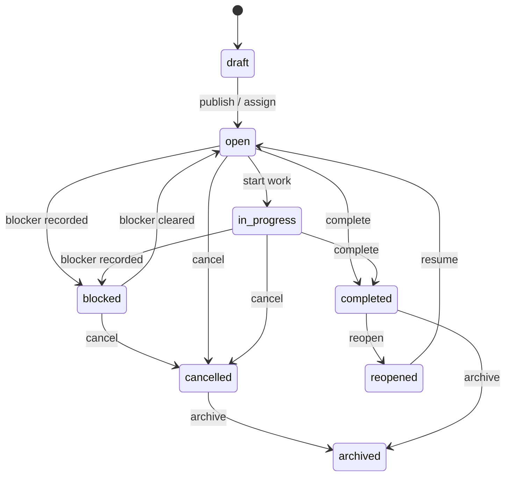
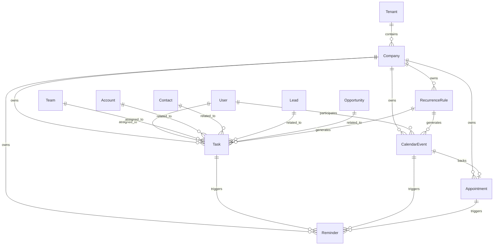
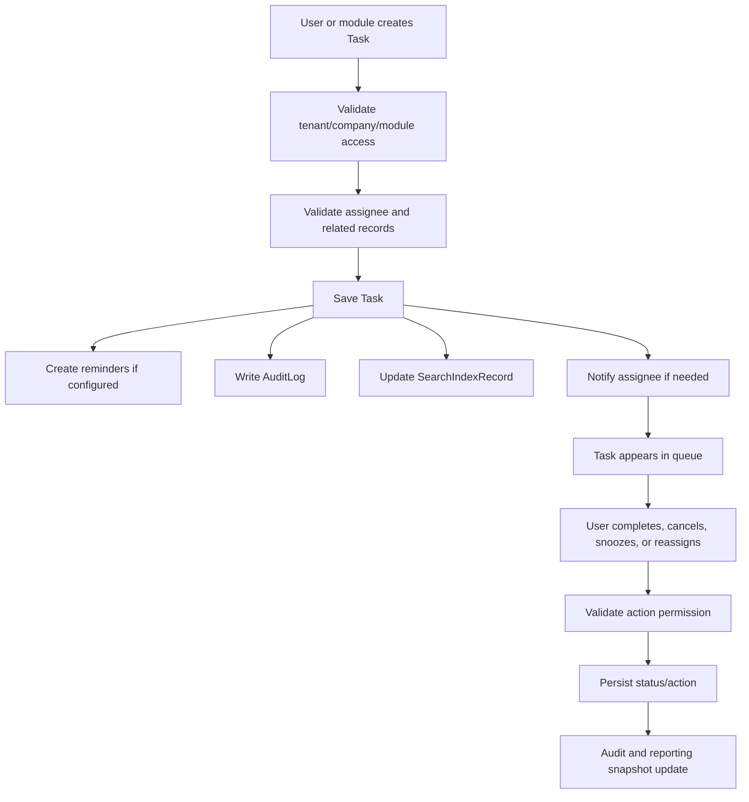
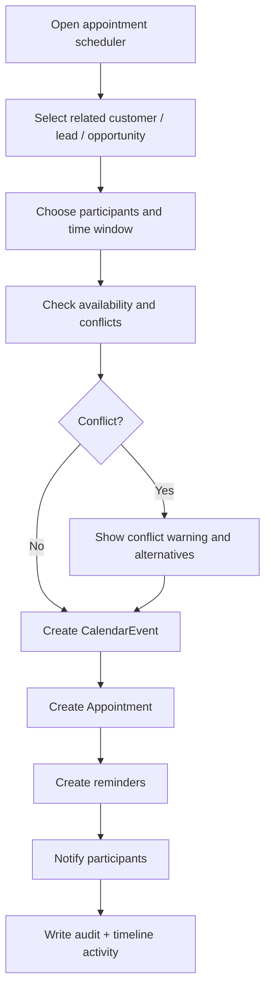
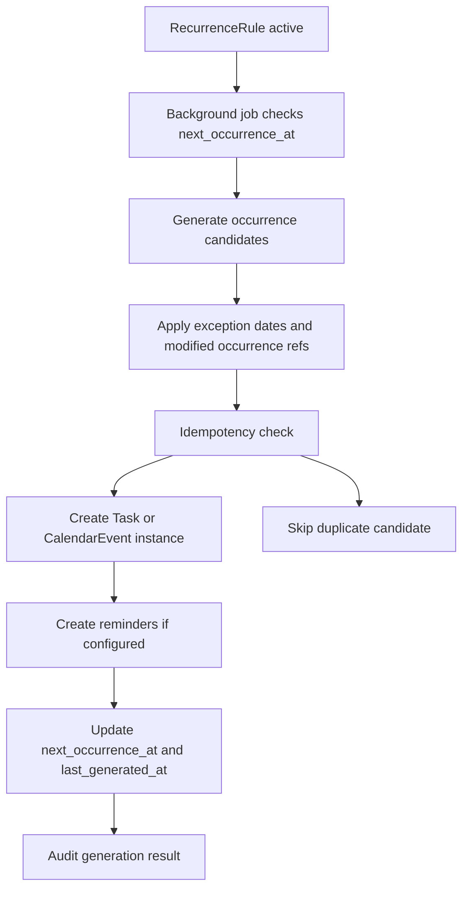

# 06_Calendar_Tasks.md

## 1. Document Metadata

| Field | Value |
| --- | --- |
| Document name | `06_Calendar_Tasks.md` |
| Phase | Phase 06 |
| Phase name | Calendar and Task System |
| Document type | Phase-level product, data, API, UX, permissions, audit, reporting, integration, and implementation specification |
| Platform | Multi-company SaaS CRM + outbound sales + field operations + drilling workflows + logistics + warehouse + fleet + dispatch + service + reporting + integrations + offline-capable mobile workflows |
| Status | Draft for implementation planning |
| Prepared for | Product, engineering, design, QA, implementation, reporting, integration, and mobile teams |
| Source of truth | Master Platform Documentation; Global Documentation Rules; Global Domain Model; Global Decisions Register; Phase 01-05 future-phase summaries |
| Output files | `06_Calendar_Tasks.md`; `06_Calendar_Tasks__Summary_For_Future_Phases.md` |

## 2. Phase Purpose

Phase 06 defines the shared Calendar and Task System for the platform. This phase creates the canonical foundation for actionable work, scheduled events, appointments, reminders, recurrence, assignment queues, due-date management, SLA-aware work, and scheduling visibility.

This phase is intentionally cross-module. CRM follow-ups, outbound follow-ups, field visit preparation, dispatch assignments, service work-order tasks, recurring maintenance, mobile task completion, reminders, and future reporting must reuse this foundation. The purpose is to prevent every module from creating its own task, appointment, reminder, calendar, and recurrence model.

## 3. Phase Goals

- Define canonical entities for `Task`, `CalendarEvent`, `Appointment`, `Reminder`, and `RecurrenceRule`.
- Establish shared lifecycle, status, assignment, due-date, reminder, recurrence, and SLA rules.
- Provide reusable APIs for creating, viewing, updating, assigning, completing, rescheduling, reminding, and recurring work.
- Define UI/UX patterns for task lists, task boards, calendars, appointment scheduling, reminders, recurring work, and mobile task execution.
- Ensure all scheduling and work-queue data is tenant/company scoped, permission-aware, searchable, auditable, reportable, and integration-ready.
- Ensure Phase 05 outbound follow-up work becomes canonical tasks.
- Prepare later field, dispatch, service, reporting, notification, and integration phases to reuse one task/calendar foundation.

## 4. Scope

### In Scope

- Canonical task data model and lifecycle.
- Canonical calendar event data model and lifecycle.
- Appointment model linked to calendar events and CRM/operational context.
- Reminder model linked to tasks, events, appointments, and SLA deadlines.
- Recurrence rule model for recurring tasks and events.
- Assignment, reassignment, due dates, priorities, reminders, completion, cancellation, snooze, and reopening behavior.
- Calendar views, task queues, saved views, search, filters, and mobile task views.
- Permission keys and access-control rules for tasks, events, appointments, reminders, recurrence, availability, exports, and analytics.
- Audit events for important task/calendar actions.
- Reporting foundations for workload, overdue work, SLA risk, appointment outcomes, utilization, reminder delivery, and recurring work.
- Integration seams for future Google Calendar, Microsoft 365, notifications, webhooks, imports, and exports.
- Offline support requirements for selected mobile task workflows.

### Out of Scope For This Phase

- Phase 07 field visit data model details.
- Full dispatch route optimization or resource scheduling optimization.
- Full service work-order implementation.
- Customer-facing scheduling portal.
- Full two-way Google Calendar or Microsoft 365 sync unless explicitly approved later.
- Full offline calendar editing parity.
- Payroll, time tracking, advanced workforce management, and HR scheduling.
- AI auto-scheduling or automated route planning.

## 5. Non-Goals

- Do not create a separate task system for outbound, CRM, dispatch, field, or service.
- Do not create a separate appointment system for CRM or field operations.
- Do not replace the Notification foundation with direct reminder delivery logic.
- Do not replace CRM `Activity` with Task or CalendarEvent. Task/Event actions may create activity timeline entries where useful, but Activity remains the timeline record.
- Do not define external calendar provider sync implementation in full detail.
- Do not hardcode drilling-specific or dispatch-specific fields that belong in later phases.
- Do not expose MongoDB `_id` as a public identifier.

## 6. Source-of-Truth Definitions

| Concept | Definition | Source-of-truth rule |
| --- | --- | --- |
| Task | A concrete actionable work item assigned to a user or team, with due date, status, priority, related records, reminders, and optional SLA metadata. | Canonical in Phase 06. Future modules must reuse it. |
| CalendarEvent | A scheduled time block with start/end, timezone, participants, visibility, related records, and optional recurrence. | Canonical in Phase 06. Future modules must reference it for scheduled time. |
| Appointment | A business-facing scheduled interaction, usually with CRM/customer/field context, backed by a CalendarEvent. | Canonical in Phase 06. Do not duplicate in CRM/outbound/field/service. |
| Reminder | A trigger record that causes due-work notifications or alert actions through Notification. | Canonical in Phase 06 and Notification-driven. |
| RecurrenceRule | A reusable repeat pattern for generating task/event instances. | Canonical in Phase 06. Future recurrence use must reuse or extend it. |
| Activity | User-facing timeline record from CRM/Timeline foundations. | Do not replace with Task/Event; link or generate Activity where helpful. |
| Notification | Recipient-facing alert record from Core Platform. | Reminder delivery must use it. |
| SavedView | Shared saved filter/view configuration from Core Platform. | Task/calendar saved views must use it. |
| AuditLog | Append-only admin/compliance audit from Core Platform. | All important task/calendar actions must write audit events. |

## 7. Canonical Entity Definitions

| Entity | Purpose | Owner module | Scope | Tenant/company scoping | Key relationships | Lifecycle/statuses | Index considerations | Permissions impact | Audit requirements | Reporting impact | Future-phase impact |
| --- | --- | --- | --- | --- | --- | --- | --- | --- | --- | --- | --- |
| `Task` | Canonical actionable work item for follow-ups, callbacks, internal work, SLA actions, field preparation, dispatch prep, service follow-ups, mobile work capture, and cross-module queues. | Calendar / Tasks | Company-scoped mutable business record with optional branch/team/user scope. | Requires `tenant_id` and `company_id`; optional `branch_id`; assignment through `assigned_user_id` and/or `assigned_team_id`. | Links to CRM records, outbound enrollments, calendar events, appointments, future jobs, work orders, routes, service records, files, notes, tags, custom fields, and activity timeline entries. | `draft`, `open`, `in_progress`, `blocked`, `completed`, `cancelled`, `deferred`, `archived`; SLA states `not_applicable`, `on_track`, `at_risk`, `breached`, `resolved`. | Compound indexes on tenant/company/status/due_at, assigned_user_id/due_at, assigned_team_id/due_at, related_record_type/id, SLA due date, deleted_at. | Users need task view/create/update/assign/complete/cancel permissions and record access to related records. | Create, update, assignment, status changes, completion, cancellation, deletion, snooze, SLA breach. | Drives task completion rate, overdue rate, SLA risk, workload, rep/technician follow-up compliance, and cross-module queue health. | Outbound follow-ups, field tasks, dispatch prep, work order tasks, recurring service tasks, and offline mobile work must reuse this entity. |
| `CalendarEvent` | Canonical scheduled time block for meetings, site visits, service windows, dispatch windows, internal planning, appointments, and external calendar sync. | Calendar / Tasks | Company-scoped scheduled record; may be private, shared, internal, customer-facing, or operational. | Requires `tenant_id` and `company_id`; optional `branch_id`; participant visibility controlled by permissions. | Links to appointments, tasks, CRM records, users, contacts, future sites, jobs, work orders, vehicles, routes, and recurrence rules. | `scheduled`, `tentative`, `confirmed`, `in_progress`, `completed`, `cancelled`, `no_show`, `rescheduled`; conflict status tracked separately. | Indexes on tenant/company/start_at/end_at, participant_user_ids/start_at, organizer_user_id/start_at, event_type/status, external provider IDs. | Users need calendar event view/create/update/cancel/reschedule permissions; private event details require special permission or participant status. | Create, update, reschedule, cancel, participant changes, privacy changes, recurrence instance generation. | Drives utilization, scheduled workload, appointment volume, missed events, conflict trends, and field schedule visibility. | Dispatch, field visits, service work windows, route planning, and external calendar integrations must reference this foundation. |
| `Appointment` | Business-facing scheduled interaction, usually with customer/prospect/contact context, built on or linked to a `CalendarEvent`. | Calendar / Tasks with CRM/field usage | Company-scoped business scheduling record. | Requires `tenant_id`, `company_id`; optional `branch_id`; follows related CRM and participant access. | Must link to `calendar_event_id`; may link to Account, Contact, Lead, Opportunity, Prospect, future Site, JobRequest, Job, or WorkOrder. | `requested`, `scheduled`, `confirmed`, `completed`, `cancelled`, `no_show`, `rescheduled`; confirmation status may be `not_required`, `pending`, `confirmed`, `declined`. | Indexes on tenant/company/status/scheduled_start_at, account/contact, assigned_user/team, calendar_event_id, appointment_type. | Users need appointment permissions plus access to linked CRM/operational records. | Create, update, confirm, complete, cancel, no-show, reschedule. | Measures booked meetings, completed appointments, no-shows, conversion follow-through, field visit readiness, and customer engagement. | CRM, outbound, field sales, service, and dispatch must not create separate appointment records. |
| `Reminder` | Canonical trigger record for due notifications related to tasks, events, appointments, SLA deadlines, and recurrence-generated work. | Calendar / Tasks + Notifications | Company-scoped or user-scoped child record depending target and recipient. | Requires tenant/company for business reminders; user-specific reminders also include `user_id`; target must be tenant/company-valid. | Targets `Task`, `CalendarEvent`, `Appointment`, or future SLA/resource records; creates or references `Notification`. | `pending`, `queued`, `sent`, `snoozed`, `dismissed`, `failed`, `cancelled`, `expired`. | Indexes on trigger_at/status, target_type/target_id, recipient user, notification_id, tenant/company. | Users may manage own reminders; managers/admins need broader reminder permissions; delivery still respects notification preferences. | Create, update, sent, snoozed, dismissed, failed, cancelled. | Measures reminder delivery health, overdue prevention, user responsiveness, and notification reliability. | All future modules must use Reminder + Notification for due-work alerts. |
| `RecurrenceRule` | Canonical repeat-pattern configuration for tasks and calendar events. | Calendar / Tasks | Company-scoped configuration/child record. | Requires `tenant_id`, `company_id`; target template must be in same company unless future cross-company templates are approved. | Links to target template task or event, generated task/event instances, exceptions, and background jobs. | `active`, `paused`, `completed`, `cancelled`, `error`; generated instances keep parent rule reference. | Indexes on status/next_occurrence_at, target_type/template_id, tenant/company, owner_user_id. | Users need recurrence permissions and access to target template; generated instances inherit permissions from target and assignment. | Create, update, pause, cancel, instance generation, generation failure, exception addition. | Measures recurring workload generation, failures, upcoming recurring commitments, and operational maintenance rhythm. | Recurring service, maintenance, visits, inspections, reminders, and route patterns should reuse this entity. |

## 8. Entity Lifecycle and Status Rules

### Task lifecycle

Task status rules:

- `draft` tasks are not active work and may be hidden from standard queues.
- `open` tasks are actionable and should appear in due-work queues.
- `in_progress` tasks indicate active work and may be included in workload reporting.
- `blocked` tasks require blocker context and optional manager visibility.
- `completed` tasks must store `completed_at` and `completed_by`.
- `cancelled` tasks must preserve cancellation metadata.
- `archived` tasks are hidden from normal active views but remain reportable/auditable according to retention rules.

### CalendarEvent lifecycle

- `scheduled`: event has a valid time window.
- `tentative`: event is planned but not confirmed.
- `confirmed`: participants/customer/internal owner confirmed the event.
- `in_progress`: event is occurring or has been started manually by a workflow.
- `completed`: event was completed.
- `cancelled`: event was cancelled but retained historically.
- `no_show`: expected participant did not attend or field appointment did not happen.
- `rescheduled`: prior event instance was moved; audit must preserve the original time.

### Appointment lifecycle

- `requested`: appointment request exists but schedule not finalized.
- `scheduled`: appointment has a linked calendar event.
- `confirmed`: customer or internal owner confirmed.
- `completed`: appointment occurred and outcome was recorded.
- `cancelled`: appointment was cancelled with reason.
- `no_show`: appointment did not occur because a required party failed to attend.
- `rescheduled`: appointment was moved to a new time.

### Reminder lifecycle

- `pending`: reminder is waiting for trigger time.
- `queued`: reminder is queued for delivery.
- `sent`: notification was created/sent.
- `snoozed`: user delayed reminder.
- `dismissed`: user dismissed reminder.
- `failed`: reminder failed and should expose reason.
- `cancelled`: target state changed so reminder is no longer relevant.
- `expired`: trigger window passed and delivery is no longer useful.

### RecurrenceRule lifecycle

- `active`: rule is generating future instances.
- `paused`: rule temporarily stops generation.
- `completed`: rule reached its end condition.
- `cancelled`: rule was stopped intentionally.
- `error`: rule cannot generate due to validation or worker failure.

## 9. Entity Relationship Rules

Relationship rules:

- A Task may be standalone, but production workflows should link it to at least one meaningful context record when possible.
- A CalendarEvent may exist without an Appointment for internal meetings, planning blocks, or future operational schedules.
- An Appointment should always link to exactly one CalendarEvent.
- Reminder targets must be one approved entity type; duplicate reminder records for the same target, recipient, and trigger should be prevented where possible.
- Recurrence-generated instances must store `recurrence_rule_id` and enough parent snapshot data to remain understandable if the rule is later changed.
- Generic `related_record_type` and `related_record_id` may be used, but important cross-phase CRM references should also use explicit fields such as `account_id`, `contact_id`, `lead_id`, and `opportunity_id` where reporting requires them.
- Future operational records such as `SiteVisit`, `Job`, `Route`, `Stop`, and `WorkOrder` must link to Task/CalendarEvent rather than creating separate schedule primitives.

## 10. Workflow Requirements

### Task creation and completion workflow

### Appointment scheduling workflow

### Recurrence generation workflow

Workflow rules:

- All workflow actions must be server-validated.
- UI actions must not be trusted as permission enforcement.
- Reminder and recurrence generation must be resilient to retries.
- Task completion, appointment outcome, and event reschedule must update audit and reporting snapshots.
- If a module creates a task, that module remains the business origin, but Calendar / Tasks owns the task lifecycle rules.

## 11. Data Model Requirements

### Core data requirements

- All major records must use stable application IDs.
- All company-scoped records must include `tenant_id` and `company_id`.
- Soft delete is preferred for major records where deletion is allowed.
- Important lifecycle timestamps must be first-class fields, not only audit events.
- Store UTC timestamps and the source timezone for scheduled and recurring records.
- Use explicit status fields instead of deriving lifecycle only from timestamps.
- Use `external_refs` for external provider mappings.
- Use `metadata` only for non-critical extension data.
- Use custom fields only for company-specific extensions, not core assignment, status, due-date, SLA, or recurrence behavior.

### Conceptual field tables

#### Task key field groups

| Group | Fields |
| --- | --- |
| Identity and scope | `id`, `tenant_id`, `company_id`, `branch_id` |
| Work content | `title`, `description`, `category`, `type`, `priority`, `status` |
| Assignment | `owner_user_id`, `assigned_user_id`, `assigned_team_id` |
| Timing | `start_at`, `due_at`, `snoozed_until`, `completed_at`, `cancelled_at` |
| Related records | `related_record_type`, `related_record_id`, `related_record_refs`, CRM and outbound IDs |
| SLA | `sla_policy_id`, `sla_due_at`, `sla_status`, `sla_breached_at` |
| Extensions | `tags`, `custom_fields`, `file_attachment_ids`, `external_refs`, `metadata` |
| Offline | `offline_client_id`, `sync_status`, conflict metadata where required |

#### CalendarEvent key field groups

| Group | Fields |
| --- | --- |
| Identity and scope | `id`, `tenant_id`, `company_id`, `branch_id` |
| Schedule | `start_at`, `end_at`, `timezone`, `all_day`, `status`, `event_type` |
| Participants | `organizer_user_id`, `participant_user_ids`, `participant_contact_ids`, `participant_emails` |
| Location | `location_text`, `location_address`, `coordinates`, `meeting_url` |
| Privacy and conflicts | `visibility`, `conflict_status` |
| Related records | CRM fields and future operational references |
| Recurrence/reminders | `recurrence_rule_id`, `reminder_ids` |
| Integrations | `external_calendar_provider`, `external_calendar_id`, `external_event_id`, `external_refs` |

## 12. API Requirements

| ID | Requirement |
| --- | --- |
| API-06-001 | All Phase 06 endpoints must require authenticated tenant context and permitted `company_id`. |
| API-06-002 | Task collection endpoints must support pagination, sorting, filters, saved-view parameters, and full-text search where indexed. |
| API-06-003 | Task create and update endpoints must validate assignees against active UserMembership records. |
| API-06-004 | Task status action endpoints must be action-specific instead of relying only on generic PATCH for important transitions. |
| API-06-005 | Calendar event APIs must validate `start_at < end_at`, timezone, visibility, participants, and related record access. |
| API-06-006 | Appointment APIs must create or maintain the linked CalendarEvent consistently. |
| API-06-007 | Reminder APIs must validate target type, target ID, recipient visibility, trigger time, and notification channel eligibility. |
| API-06-008 | RecurrenceRule APIs must validate repeat pattern combinations before saving. |
| API-06-009 | Availability APIs must return busy blocks and conflict hints without leaking private event details. |
| API-06-010 | Bulk task actions must return BackgroundJob references when not completed synchronously. |
| API-06-011 | Import and export APIs must use ImportJob and ExportJob instead of synchronous large file processing. |
| API-06-012 | APIs must return stable error codes for permission denied, record not found, validation failed, conflict detected, recurrence invalid, and offline conflict. |

### Conceptual endpoint catalog

| Resource | Endpoints | Notes |
| --- | --- | --- |
| Tasks | `GET/POST /api/v1/tasks`, `GET/PATCH /api/v1/tasks/{task_id}`, action endpoints for complete/reopen/cancel/assign/snooze | Generic PATCH should not replace action endpoints for auditable lifecycle transitions. |
| Calendar events | `GET/POST /api/v1/calendar/events`, `GET/PATCH /api/v1/calendar/events/{calendar_event_id}`, action endpoints for cancel/reschedule | Must validate timezone, privacy, related records, and participants. |
| Availability | `GET /api/v1/calendar/availability` | Returns permission-safe busy blocks and conflict hints. |
| Appointments | CRUD plus confirm, complete, no-show, cancel, reschedule actions | Must maintain linked CalendarEvent. |
| Reminders | CRUD plus snooze/dismiss actions | Must use Notification foundation for actual recipient alerts. |
| Recurrence rules | CRUD plus generation action/admin repair endpoint | Generation normally handled by workers; manual generation is admin/repair oriented. |
| Analytics | `GET /api/v1/calendar/analytics/...` | Uses aggregated/permission-safe reporting endpoints. |

## 13. UI / UX Requirements

| ID | Requirement |
| --- | --- |
| UX-06-001 | Provide a unified Calendar / Tasks navigation area with routes for My Tasks, Team Tasks, Calendar, Appointments, Recurring Work, and Analytics. |
| UX-06-002 | Task lists must support table, compact list, and board-style grouping by status, due date, priority, assignee, and related module. |
| UX-06-003 | Task rows must display title, status, priority, due date, assignee, related record, overdue/SLA indicators, and quick actions when permitted. |
| UX-06-004 | Task create/edit forms must support required fields, related record picker, assignee picker, due date/time picker, reminders, tags, and custom fields. |
| UX-06-005 | Calendar views must include day, week, month, and agenda views with timezone-aware display. |
| UX-06-006 | Calendar event forms must include title, type, start/end, timezone, participants, location, related record, visibility, reminders, and recurrence. |
| UX-06-007 | Appointment forms must make the customer/CRM context obvious and require a linked schedule window. |
| UX-06-008 | Reminder controls must allow snooze, dismiss, open target record, and complete task where relevant. |
| UX-06-009 | Recurrence editor must show a preview of upcoming occurrences before save. |
| UX-06-010 | Empty states must explain whether the user has no records, lacks permission, or the module is disabled. |
| UX-06-011 | Error states must distinguish validation errors, permission errors, conflicts, deleted related records, and offline sync conflicts. |
| UX-06-012 | Private events must show as busy/redacted blocks unless the viewer has access to details. |
| UX-06-013 | Mobile task screens must prioritize due work, quick completion, note capture, sync status, and conflict repair. |
| UX-06-014 | Managers must be able to switch between personal and team workload views without losing filters. |
| UX-06-015 | Permission-disabled actions must be hidden or disabled with a clear explanation when safe to show. |

### Required screens and components

| Screen / Component | Required behavior |
| --- | --- |
| My Tasks | Personal queue with overdue, due today, upcoming, assigned by me, completed, and saved filters. |
| Team Tasks | Manager view grouped by assignee, team, due date, SLA risk, status, category, and module origin. |
| Task detail drawer/page | Header, status, due date, assignment, related records, reminders, notes, files, history, and permission-aware actions. |
| Task quick create | Minimal title, due date, assignee, related record, and priority; advanced fields optional. |
| Calendar view | Day/week/month/agenda views with filters, redacted private events, conflict warnings, and quick scheduling. |
| Event detail drawer/page | Schedule, participants, location, related records, reminders, recurrence, audit summary, and actions. |
| Appointment scheduler | Customer/record picker, participant picker, availability, conflict warnings, reminders, and confirmation status. |
| Reminder center | Due and snoozed reminders with open, snooze, dismiss, and complete actions. |
| Recurrence editor | Frequency, interval, weekdays/month days, boundaries, timezone, preview, exceptions, and validation. |
| Mobile task list | Offline-aware assigned task queue with due status, related record summary, notes, completion, and sync state. |

## 14. Search, Filters, and Saved Views

Task, calendar, and appointment records must support permission-aware search and filters.

### Common filters

- Company, branch, team, assignee, owner.
- Status, priority, category, type.
- Due date, start date, end date, overdue, SLA status.
- Related record type and related record ID.
- Account, Contact, Lead, Opportunity, Prospect, Campaign, OutreachEnrollment.
- Tags and custom fields where indexed.
- Source module and created-from-module.
- Recurrence status and generated-from-recurring flag.
- Reminder status and reminder due range.

### Saved views

- Saved views must use `SavedView` from Core Platform.
- Saved views may be personal, team-shared, role-shared, or company-shared where permissions allow.
- Saved views must store filters, columns, sort order, grouping, date range behavior, and view type.
- Saved views must not bypass permission checks.
- Deleted users, teams, tags, and custom fields referenced by saved views must produce recoverable UI warnings.

## 15. Permissions and Access Control

| ID | Requirement |
| --- | --- |
| PERM-06-001 | Viewing tasks requires `calendar.task.view` plus company/module access and related-record visibility where applicable. |
| PERM-06-002 | Creating tasks requires `calendar.task.create`. |
| PERM-06-003 | Updating task core fields requires `calendar.task.update`. |
| PERM-06-004 | Assigning or reassigning tasks requires `calendar.task.assign`. |
| PERM-06-005 | Completing tasks requires `calendar.task.complete` and access to the task. |
| PERM-06-006 | Cancelling tasks requires `calendar.task.cancel`. |
| PERM-06-007 | Deleting or archiving tasks requires `calendar.task.delete` and must be restricted to admins or configured managers. |
| PERM-06-008 | Viewing calendar events requires `calendar.event.view`; viewing private details requires participant access or `calendar.event.view_private`. |
| PERM-06-009 | Creating, updating, cancelling, and rescheduling calendar events require the corresponding calendar event permissions. |
| PERM-06-010 | Appointment transitions require appointment-specific permissions and access to linked records. |
| PERM-06-011 | Users may manage their own reminders when they can access the target record; team/admin reminder management requires elevated permissions. |
| PERM-06-012 | Creating or changing recurrence rules requires recurrence permissions and access to the target template. |
| PERM-06-013 | Availability lookup requires `calendar.availability.view` and must not disclose private event details. |
| PERM-06-014 | Exports require task/calendar export permissions and must respect record-level access. |
| PERM-06-015 | Analytics requires `calendar.analytics.view` and must aggregate only accessible records unless admin aggregation rules are approved. |

Access-control rules:

- Backend checks are mandatory for all reads and writes.
- Company module enablement is required before Calendar / Tasks features are available.
- Related-record access affects task and event visibility when the related record is sensitive.
- Private events may block availability while hiding details.
- Team views require team-level or manager permissions.
- Admins may configure defaults but must not automatically see private content unless the permission model explicitly allows it.
- Offline queued actions must be revalidated when synced.

## 16. Notifications

| ID | Requirement |
| --- | --- |
| NOTIF-06-001 | Notify users when a task is assigned or reassigned to them. |
| NOTIF-06-002 | Notify task assignees when due soon according to reminder settings. |
| NOTIF-06-003 | Notify assignees and optionally managers when a task becomes overdue. |
| NOTIF-06-004 | Notify configured recipients when an SLA is approaching breach or has breached. |
| NOTIF-06-005 | Notify event participants when invited, when event details change materially, or when an event is cancelled. |
| NOTIF-06-006 | Notify appointment owners about confirmation, cancellation, no-show, and reschedule events. |
| NOTIF-06-007 | Notify users when recurrence generation fails for records they own or administer. |
| NOTIF-06-008 | Notifications must respect notification preferences, module access, and record permissions. |

Notification rules:

- Reminders create or trigger Notification records.
- Notification preferences must be respected.
- A notification must not disclose record details the recipient cannot access.
- Failed reminder delivery should be visible in reminder/reporting health.
- SLA and overdue notifications should support manager escalation where configured.
- Notification spam must be avoided through deduplication windows and reminder status transitions.

## 17. Audit Logging

| ID | Requirement |
| --- | --- |
| AUDIT-06-001 | Audit task creation, update, assignment, reassignment, completion, reopening, cancellation, deletion, snooze, and SLA breach. |
| AUDIT-06-002 | Audit calendar event creation, update, reschedule, cancellation, participant changes, and privacy changes. |
| AUDIT-06-003 | Audit appointment creation, update, confirmation, completion, cancellation, no-show, and reschedule. |
| AUDIT-06-004 | Audit reminder creation, update, sent, snoozed, dismissed, failed, and cancelled states when material. |
| AUDIT-06-005 | Audit recurrence rule creation, update, pause, cancellation, exception addition, instance generation, and generation failure. |
| AUDIT-06-006 | Audit bulk changes with BackgroundJob ID, actor, filter snapshot, affected count, and failure summary. |
| AUDIT-06-007 | Audit export and import actions through ExportJob and ImportJob. |
| AUDIT-06-008 | Audit external calendar sync actions when integrations are enabled later. |

Audit payload guidance:

- Include actor, tenant, company, source module, target record, prior value/new value for material changes, reason fields where available, and request/correlation ID.
- Bulk operations must include the filter snapshot used, the number of records targeted, succeeded, failed, and skipped.
- Recurrence generation audits must include recurrence rule, generated instance ID, occurrence date, and idempotency key.
- Reminder failure audits must avoid exposing sensitive notification body content.

## 18. Reporting and Analytics Impact

| ID | Requirement |
| --- | --- |
| REPORT-06-001 | Task completion rate by user, team, category, priority, related module, and date range. |
| REPORT-06-002 | Overdue task count and aging by assignee, team, branch, related module, and customer/account. |
| REPORT-06-003 | SLA at-risk and breached work by policy, team, user, and related record type. |
| REPORT-06-004 | Appointment booked, confirmed, completed, cancelled, and no-show metrics. |
| REPORT-06-005 | Calendar utilization by user, team, event type, and time period. |
| REPORT-06-006 | Reminder delivery health by channel, status, user, target type, and failure reason. |
| REPORT-06-007 | Recurring work generation counts, upcoming occurrences, and generation failures. |
| REPORT-06-008 | Cross-module follow-up health across CRM, outbound, field, dispatch, and service. |

Reporting design rules:

- Store explicit timestamps for due, completed, cancelled, scheduled, started, ended, confirmed, no-show, reminder sent, and SLA breach events.
- Reporting should support personal, team, branch, company, and module-origin rollups.
- Calendar utilization must preserve private-event privacy when reporting to unauthorized viewers.
- Recurrence reporting must distinguish template rules from generated instances.
- Appointment reports must link to CRM conversion and future field/service outcomes where allowed.

## 19. Mobile and Offline Impact

| ID | Requirement |
| --- | --- |
| OFFLINE-06-001 | Mobile users must be able to view assigned critical tasks that were synced for offline use. |
| OFFLINE-06-002 | Mobile users must be able to complete tasks offline with completed time, notes, and optional attachments where enabled. |
| OFFLINE-06-003 | Offline-created task updates must include stable local IDs, actor, tenant/company scope, timestamps, and sync metadata. |
| OFFLINE-06-004 | Server sync must revalidate permissions, module enablement, task status, and related record access before accepting queued changes. |
| OFFLINE-06-005 | Offline conflicts must be shown to the user with recovery options instead of silent overwrite. |
| OFFLINE-06-006 | Full offline calendar editing and recurring rule editing are deferred unless explicitly approved. |
| OFFLINE-06-007 | Mobile appointment check-in/out is future-capable but should reuse Appointment and CalendarEvent records. |

Mobile guidance:

- Mobile task UX should prioritize clarity over dense desktop controls.
- Offline mode should show what is synced, what is queued, what failed, and what has conflicts.
- Offline completion must capture actor, timestamp, device/client ID, and optional notes.
- Full recurrence editing, bulk operations, and cross-team calendar planning are desktop-first and may be disabled offline.

## 20. Integration Impact

| ID | Requirement |
| --- | --- |
| INT-06-001 | Store external calendar provider references using `external_refs`, `external_calendar_provider`, `external_calendar_id`, and `external_event_id`. |
| INT-06-002 | Do not require two-way Google/Microsoft calendar sync for MVP unless approved; design fields and APIs to support it later. |
| INT-06-003 | Reminder delivery must use the shared Notification foundation and its configured channels. |
| INT-06-004 | Task and event imports must use ImportJob; exports must use ExportJob. |
| INT-06-005 | Lifecycle changes should be eligible for future webhook delivery through WebhookEndpoint/WebhookDelivery. |
| INT-06-006 | External provider failures must be visible through integration health and audit records when sync is enabled. |

Integration design notes:

- Google Calendar and Microsoft 365 should be treated as future sync providers, not current operational sources of truth unless later approved.
- External provider data must be mapped carefully to preserve tenant/company boundaries.
- External deletes should not hard-delete internal records without explicit sync policy.
- Provider conflicts must be visible and recoverable.
- Webhook event payloads must avoid leaking private event details.

## 21. Security Considerations

- Tasks, events, appointments, reminders, and recurrence rules are company-scoped business records and must never leak across tenants or companies.
- Private calendar event details require special handling in lists, availability, reports, exports, notifications, and search.
- Related-record permissions must be checked before showing linked customer or operational details.
- Exports must respect user permissions and private event redaction.
- Reminder notifications must not expose sensitive content in email/SMS/push previews if recipient context is uncertain.
- External calendar sync tokens must be stored securely by the Integration foundation when implemented.
- Offline data must be scoped to records the mobile user is allowed to carry on the device.
- Audit logs must avoid storing full sensitive note bodies unless policy allows it.

## 22. Edge Cases

| # | Edge case | Required handling |
| --- | --- | --- |
| 1 | Task assignee loses company membership before the task is completed. | Validate, show clear user/admin state, preserve auditability, and prevent silent data corruption or permission leakage. |
| 2 | Task is linked to an Account or Contact that is later merged, archived, or soft-deleted. | Validate, show clear user/admin state, preserve auditability, and prevent silent data corruption or permission leakage. |
| 3 | Task due date is changed while a reminder is already queued. | Validate, show clear user/admin state, preserve auditability, and prevent silent data corruption or permission leakage. |
| 4 | Task is completed offline after another user cancels it online. | Validate, show clear user/admin state, preserve auditability, and prevent silent data corruption or permission leakage. |
| 5 | Recurring rule generates an occurrence during daylight-saving transition. | Validate, show clear user/admin state, preserve auditability, and prevent silent data corruption or permission leakage. |
| 6 | Recurring rule is edited after some future instances were already generated. | Validate, show clear user/admin state, preserve auditability, and prevent silent data corruption or permission leakage. |
| 7 | A user tries to create an event across two companies. | Validate, show clear user/admin state, preserve auditability, and prevent silent data corruption or permission leakage. |
| 8 | Calendar event participants include users without access to the related customer record. | Validate, show clear user/admin state, preserve auditability, and prevent silent data corruption or permission leakage. |
| 9 | Private event should block availability but hide title and related record from unauthorized viewers. | Validate, show clear user/admin state, preserve auditability, and prevent silent data corruption or permission leakage. |
| 10 | Appointment is cancelled but the linked calendar event remains scheduled due to integration delay. | Validate, show clear user/admin state, preserve auditability, and prevent silent data corruption or permission leakage. |
| 11 | Reminder target record is deleted before the reminder fires. | Validate, show clear user/admin state, preserve auditability, and prevent silent data corruption or permission leakage. |
| 12 | Reminder fires for a user who no longer has permission to view the target record. | Validate, show clear user/admin state, preserve auditability, and prevent silent data corruption or permission leakage. |
| 13 | External calendar provider returns a conflict or rate limit during future sync. | Validate, show clear user/admin state, preserve auditability, and prevent silent data corruption or permission leakage. |
| 14 | Bulk task reassignment partially fails because some tasks are inaccessible or already completed. | Validate, show clear user/admin state, preserve auditability, and prevent silent data corruption or permission leakage. |
| 15 | A recurrence generation worker retries after timeout and risks duplicate instances. | Validate, show clear user/admin state, preserve auditability, and prevent silent data corruption or permission leakage. |
| 16 | An appointment crosses midnight or spans multiple timezones. | Validate, show clear user/admin state, preserve auditability, and prevent silent data corruption or permission leakage. |
| 17 | User changes profile timezone after recurring events were created. | Validate, show clear user/admin state, preserve auditability, and prevent silent data corruption or permission leakage. |
| 18 | Team-assigned task has no individual owner but appears in personal queue rules. | Validate, show clear user/admin state, preserve auditability, and prevent silent data corruption or permission leakage. |
| 19 | SLA due date arrives while task is snoozed. | Validate, show clear user/admin state, preserve auditability, and prevent silent data corruption or permission leakage. |
| 20 | Notification preferences disable a channel required by a reminder. | Validate, show clear user/admin state, preserve auditability, and prevent silent data corruption or permission leakage. |
| 21 | A task has both direct CRM links and generic related record references that disagree. | Validate, show clear user/admin state, preserve auditability, and prevent silent data corruption or permission leakage. |
| 22 | A calendar event is rescheduled to overlap a dispatch or field assignment created in a later phase. | Validate, show clear user/admin state, preserve auditability, and prevent silent data corruption or permission leakage. |
| 23 | An import tries to create tasks for inactive users or disabled modules. | Validate, show clear user/admin state, preserve auditability, and prevent silent data corruption or permission leakage. |
| 24 | A saved view references a deleted team, user, or custom field. | Validate, show clear user/admin state, preserve auditability, and prevent silent data corruption or permission leakage. |

## 23. Business Requirements

| ID | Requirement |
| --- | --- |
| BR-06-001 | The platform must provide one shared task foundation for CRM, outbound, field, dispatch, service, and mobile workflows. |
| BR-06-002 | The platform must provide one shared calendar foundation for scheduled meetings, appointments, site visits, service windows, and future dispatch windows. |
| BR-06-003 | Users must be able to see assigned work by due date, priority, status, related customer, and module context. |
| BR-06-004 | Managers must be able to monitor team workload, overdue work, SLA risk, and appointment outcomes. |
| BR-06-005 | Outbound follow-ups from Phase 05 must be represented as canonical tasks rather than a separate follow-up system. |
| BR-06-006 | Appointments must connect customer-facing scheduling to CRM records and calendar visibility. |
| BR-06-007 | Reminders must help users complete time-sensitive work without bypassing notification preferences or permissions. |
| BR-06-008 | Recurring tasks and events must support repeat operational work without manual duplication. |
| BR-06-009 | Every important scheduling or task action must be auditable. |
| BR-06-010 | Task and calendar data must be reporting-ready from the first implementation. |
| BR-06-011 | Mobile users must be able to view and complete assigned critical tasks in weak connectivity environments where supported. |
| BR-06-012 | The system must prevent cross-tenant and cross-company leakage in task, calendar, reminder, search, export, and notification flows. |
| BR-06-013 | The calendar must be integration-ready for Google Calendar and Microsoft 365 without requiring two-way sync in MVP. |
| BR-06-014 | SLA due dates and breach indicators must be modeled explicitly enough for later service and reporting phases. |
| BR-06-015 | Users must be able to relate tasks and appointments to Accounts, Contacts, Leads, Opportunities, Prospects, and future operational records. |
| BR-06-016 | Permission behavior must support personal work views, team work views, manager oversight, and admin configuration. |
| BR-06-017 | Recurring generation failures, reminder failures, deleted related records, and offline sync conflicts must be visible and recoverable. |

## 24. Functional Requirements

| ID | Requirement |
| --- | --- |
| FR-06-001 | Create tasks with title, description, category, type, priority, due date, assignee, related records, reminders, and optional SLA fields. |
| FR-06-002 | Update task details while preserving audit history for material changes. |
| FR-06-003 | Assign or reassign tasks to a user or team with permission checks and optional notification. |
| FR-06-004 | Complete tasks with completed timestamp, actor, optional outcome, and related timeline update. |
| FR-06-005 | Reopen completed tasks when the user has permission and the related record remains active. |
| FR-06-006 | Cancel tasks with cancellation reason where configured. |
| FR-06-007 | Snooze tasks or reminders without changing the original due date unless explicitly rescheduled. |
| FR-06-008 | Support task categories for outbound follow-up, CRM follow-up, field prep, dispatch prep, service follow-up, internal to-do, SLA action, and custom configured categories. |
| FR-06-009 | Support task queues for My Tasks, Team Tasks, Overdue, Due Today, Upcoming, SLA At Risk, and Recently Updated. |
| FR-06-010 | Create calendar events with start/end time, timezone, participants, location, related records, reminders, and visibility. |
| FR-06-011 | Update calendar events with validation for time ranges, participant access, related records, and recurrence impact. |
| FR-06-012 | Cancel calendar events while retaining historical reporting and audit visibility. |
| FR-06-013 | Reschedule calendar events and appointments with audit history and participant notifications. |
| FR-06-014 | Show calendar day, week, month, and agenda views with filters by user, team, type, status, and branch where applicable. |
| FR-06-015 | Display private calendar events in a redacted form unless the viewer is a participant or has private-event permission. |
| FR-06-016 | Create appointments that link to a calendar event and CRM or future operational context. |
| FR-06-017 | Confirm, complete, cancel, reschedule, or mark appointments as no-show with outcome tracking. |
| FR-06-018 | Create reminders relative to task due dates, event start times, appointment times, or SLA deadlines. |
| FR-06-019 | Send reminder-triggered notifications through the shared Notification foundation. |
| FR-06-020 | Allow users to snooze or dismiss reminders when authorized. |
| FR-06-021 | Create recurrence rules for tasks and events using frequency, interval, weekdays/month days, timezone, start boundary, and end boundary. |
| FR-06-022 | Generate recurring instances through a controlled background job with idempotency protection. |
| FR-06-023 | Support recurrence exceptions for skipped, modified, or cancelled occurrences. |
| FR-06-024 | Search tasks, events, and appointments by title, related account/contact, assigned user/team, status, due date, start date, and tags. |
| FR-06-025 | Save task and calendar views using the shared SavedView foundation. |
| FR-06-026 | Attach files to tasks and appointments using FileAttachment. |
| FR-06-027 | Apply tags and custom fields through shared Tag/TagAssignment and CustomField foundations. |
| FR-06-028 | Create Activity timeline entries for important task and appointment actions where relevant to CRM records. |
| FR-06-029 | Support bulk task assignment, completion, cancellation, and due-date update only when safe and permission-approved. |
| FR-06-030 | Export task and calendar data through ExportJob with permission checks. |
| FR-06-031 | Import tasks or appointment lists through ImportJob where enabled. |
| FR-06-032 | Validate related records before creation or update so deleted or inaccessible records cannot be linked silently. |
| FR-06-033 | Expose availability lookup for users and teams based on calendar events and permission-aware busy blocks. |
| FR-06-034 | Support offline task completion and note capture for selected mobile workflows with server-side revalidation on sync. |
| FR-06-035 | Maintain denormalized snapshots needed for list performance while preserving source relationships. |

## 25. Non-Functional Requirements

| ID | Requirement |
| --- | --- |
| NFR-06-001 | Task and calendar list views must remain responsive for large company datasets through indexed queries and pagination. |
| NFR-06-002 | All APIs must enforce tenant, company, module, and permission checks server-side. |
| NFR-06-003 | Reminder generation and recurrence generation must be idempotent. |
| NFR-06-004 | Recurring instance generation must tolerate worker retries without duplicate task or event creation. |
| NFR-06-005 | Reminder delivery failures must be observable and retryable where the channel supports retry. |
| NFR-06-006 | Time calculations must store UTC timestamps and preserve the intended timezone for display and recurrence logic. |
| NFR-06-007 | Search and reporting must not reveal private event details to unauthorized users. |
| NFR-06-008 | Offline task updates must be conflict-aware and must not silently overwrite newer server changes. |
| NFR-06-009 | Bulk actions must use background jobs when the action may affect large numbers of records. |
| NFR-06-010 | Audit events must be append-only and available for admin review. |
| NFR-06-011 | APIs must use stable application IDs and never expose MongoDB `_id`. |
| NFR-06-012 | Calendar and task APIs must use consistent error formats for validation, permission, conflict, and missing-related-record failures. |
| NFR-06-013 | The system must handle daylight-saving and timezone boundary cases in recurrence and reminder logic. |
| NFR-06-014 | External provider references must be stored in approved external reference fields, not ad hoc provider-specific fields. |
| NFR-06-015 | Dashboards should use rollups or snapshots where direct queries would be too slow. |
| NFR-06-016 | Data retention and soft-delete behavior must preserve audit and reporting integrity. |
| NFR-06-017 | Mobile screens must degrade gracefully when offline, showing sync status and conflict recovery actions. |

## 26. User Stories

### Sales Rep / Outbound Rep

- As a sales rep, I want to see all due follow-ups in one task queue so I know who to contact next.
- As an outbound rep, I want sequence follow-ups to become regular tasks so my work queue is unified.
- As a sales rep, I want to schedule an appointment from a Lead or Opportunity so the CRM timeline stays connected.

### Sales Manager / Operations Manager

- As a manager, I want to see overdue work by team and user so I can coach or rebalance workload.
- As a manager, I want to see appointment outcomes and no-shows so I can improve follow-through.
- As a manager, I want to view team calendars without seeing private event details I am not allowed to access.

### Dispatcher / Field Manager

- As a dispatcher, I want future dispatch assignments to appear as scheduled events so resource commitments are visible.
- As a field manager, I want prep tasks to be assigned before visits or service windows so crews are ready.
- As a field manager, I want recurring tasks for routine checks so nothing is missed.

### Service Technician / Mobile Field User

- As a mobile user, I want to see tasks assigned to me even when connectivity is weak.
- As a technician, I want to complete a task offline and sync it later without losing my notes.
- As a field user, I want reminders before scheduled work so I can arrive prepared.

### Admin / Company Admin

- As an admin, I want to configure task categories, notification preferences, and default reminder behavior.
- As an admin, I want all important task and calendar changes audited.
- As an admin, I want exports to respect permissions and not leak private calendar data.

## 27. Recommended Decisions

| ID | Recommendation | Rationale |
| --- | --- | --- |
| RD-06-001 | Implement outbound follow-ups as `Task` records with outbound references and category `outbound_follow_up`. | Prevents duplicate FollowUpTask systems and satisfies Phase 05 future constraint. |
| RD-06-002 | Use `Appointment` as a business wrapper linked to one `CalendarEvent`. | Keeps scheduling visibility unified while preserving business-specific appointment outcomes. |
| RD-06-003 | Use a hybrid recurrence generation model: materialize a limited future window and generate more through background jobs. | Supports performance and visibility without creating infinite future records. |
| RD-06-004 | Treat external calendar sync as integration-ready but not MVP-required. | Reduces complexity while preserving future provider support. |
| RD-06-005 | Use fixed baseline priority enum with optional company display labels later. | Keeps reporting consistent while allowing future customization. |
| RD-06-006 | Private events should block availability while hiding details from unauthorized users. | Balances scheduling accuracy and privacy. |

## 28. Open Questions

| ID | Question | Impact if unresolved |
| --- | --- | --- |
| OQ-06-001 | Should MVP include native two-way Google Calendar and Microsoft 365 sync, or only integration-ready fields? | Affects integration scope, OAuth, conflict handling, and provider mapping. |
| OQ-06-002 | What exact recurrence generation window should be used by default? | Affects worker load, calendar visibility, and storage. |
| OQ-06-003 | Which module owns the final SLA policy entity: Calendar / Tasks, Core Platform, Service, or Reporting? | Affects SLA configuration, permissions, and future service design. |
| OQ-06-004 | Should appointment confirmation support customer-facing links in MVP? | Affects portal/public-link security and notification templates. |
| OQ-06-005 | Should task priority be fixed globally or company-configurable? | Affects reporting consistency and admin configuration. |
| OQ-06-006 | What conflict policy should apply across future field, dispatch, service, and calendar events? | Affects resource scheduling and operational warnings. |

## 29. Dependencies

### Prior phase dependencies

| Phase | Dependency |
| --- | --- |
| Phase 01 Product Definition | Unified platform, CRM plus operations positioning, desktop/mobile split, offline-friendly capture, reporting from start. |
| Phase 02 Tenant / Identity / Access | Tenant, Company, User, UserMembership, Role, Permission, module enablement, backend authorization, offline revalidation. |
| Phase 03 Core Platform Foundation | AuditLog, Notification, FileAttachment, Tag, TagAssignment, CustomFieldDefinition/Value, SavedView, SearchIndexRecord, ImportJob, ExportJob, SettingsDocument, BackgroundJob, API/Webhook foundations. |
| Phase 04 CRM Data Model | Account, Contact, Lead, Opportunity, Activity, Note, Comment, AssignmentRule, CRM timeline context. |
| Phase 05 Outbound Sales | Prospect, Campaign, Sequence, OutreachEnrollment, outbound follow-ups, rep queues, activity logging, conversion tracking. |

### Future phase dependencies created

- Field visits must use CalendarEvent/Appointment/Task for scheduling and follow-up work.
- Dispatch assignments must reference CalendarEvent or future operational schedule records built on this foundation.
- Service work orders must use Task for work steps and CalendarEvent/Appointment for scheduled windows.
- Reporting dashboards must use the due-date, completion, appointment, reminder, and recurrence fields defined here.
- Notifications phase must support Reminder-driven alerts and escalation.
- Integrations phase must map external calendars to CalendarEvent and external provider references.
- Mobile phase must reuse offline task requirements.

## 30. Future Phase Considerations

- Field visits may add geofenced check-in/out while reusing Appointment and CalendarEvent.
- Dispatch may add vehicles, drivers, routes, stops, and resource conflicts while referencing scheduled windows.
- Service may add WorkOrderTask or checklist patterns, but should reuse Task where practical and justify any specialized child entity.
- Reporting may add materialized rollups for workload, SLA, and utilization.
- Notifications may add templates, escalation policies, and channel-specific delivery rules.
- Integrations may add Google/Microsoft OAuth, sync health, provider conflict resolution, and webhook payloads.
- Mobile may add offline appointment completion, offline checklist execution, and photo/file attachment sync.

## 31. Acceptance Criteria

- A user can create, assign, update, complete, cancel, and reopen a task with audit history.
- A manager can view team tasks by due date, assignee, priority, status, and SLA risk.
- A user can create a calendar event with participants, time, timezone, visibility, location, reminders, and related records.
- A user can create an appointment linked to a calendar event and CRM context.
- A user can create, snooze, dismiss, and receive reminders through Notification.
- A user can create a recurrence rule and see generated task/event instances within the configured window.
- Permissions prevent unauthorized viewing, editing, exporting, and private-event detail exposure.
- Search, filters, and saved views work for task and calendar records.
- Audit logs are written for all required lifecycle transitions.
- Reports can calculate task completion, overdue work, SLA risk, appointment outcomes, reminder delivery, and recurrence generation health.
- Mobile users can view and complete selected assigned tasks offline where enabled.
- External provider references are modeled without requiring full calendar sync.
- Phase 05 outbound follow-up work can be represented as Task records.

## 32. Implementation Notes

- Prefer FastAPI REST resources with action endpoints for important transitions.
- Use MongoDB collections with compound indexes aligned to queue and calendar queries.
- Use Redis/workers for reminder processing, recurrence generation, bulk operations, imports, exports, and notification fan-out where needed.
- Use idempotency keys for recurrence generation and offline sync actions.
- Store scheduled timestamps in UTC plus `timezone` for display/recurrence intent.
- Maintain denormalized queue fields only when they are derived from authoritative fields and updated consistently.
- Do not store full external email/calendar content in task/event records unless a future integration decision permits it.
- Keep API responses permission-aware; redaction should happen server-side for sensitive/private event fields.
- Write QA tests for timezone boundaries, recurrence exceptions, permission redaction, reminder failures, and offline conflicts.

# Summary for Future Phases

## Final Decisions Made

- Phase 06 establishes Calendar and Tasks as the shared scheduling, due-date, assignment, reminder, recurrence, SLA, and work-queue foundation for CRM, Outbound Sales, Field Sales, Dispatch, Service, Reporting, Notifications, and Mobile workflows.
- Future phases must reuse canonical `Task`, `CalendarEvent`, `Appointment`, `Reminder`, and `RecurrenceRule` entities instead of creating module-specific task, appointment, reminder, or scheduling systems.
- `Task` is the canonical actionable work item for follow-ups, callbacks, internal to-dos, customer promises, SLA actions, field preparation, dispatch prep, service follow-ups, and mobile offline task capture.
- `CalendarEvent` is the canonical scheduled time block for meetings, appointments, site visits, dispatch windows, service windows, internal planning events, and future external calendar sync.
- `Appointment` is a business-facing scheduled interaction built on or linked to `CalendarEvent`; it must not become a duplicate independent calendar system.
- `Reminder` is the canonical notification trigger configuration and runtime reminder record for tasks, appointments, calendar events, SLA deadlines, and recurrence-generated work.
- `RecurrenceRule` is the canonical recurrence configuration for repeat tasks and repeat calendar events. It stores the repeat pattern, timezone, start/end boundaries, and exception handling.
- Phase 06 must use Phase 03 foundations for `Notification`, `AuditLog`, `SavedView`, `SearchIndexRecord`, `FileAttachment`, `Tag`, `TagAssignment`, `CustomFieldDefinition`, `CustomFieldValue`, `SettingsDocument`, `BackgroundJob`, `ImportJob`, and `ExportJob`.
- Phase 06 must use Phase 04 CRM records such as `Account`, `Contact`, `Lead`, `Opportunity`, and `Activity` as related records, not as replacements for task/calendar records.
- Phase 06 must support Phase 05 Outbound Sales follow-up work by representing outbound follow-ups as `Task` records with outbound references and categories rather than a separate follow-up task system.
- All company-scoped records must include `tenant_id` and `company_id`; optional `branch_id`, `assigned_user_id`, `assigned_team_id`, and related record references should be used where relevant.
- User assignment and visibility must follow `UserMembership`, role permissions, company module enablement, and future policy-based authorization compatibility.
- Scheduled and due work must be searchable, filterable, reportable, auditable, and permission-aware.
- Reminders must be generated through the shared notification foundation and must never bypass notification preferences, permission checks, or company/module access rules.
- Recurrence should generate or materialize instances through controlled background jobs and must preserve parent recurrence identity, exception history, and auditability.
- Mobile/offline task execution is required for critical field workflows, but full offline calendar parity, external calendar sync, and complex resource optimization are future concerns.
- SLA support in Phase 06 is foundational: tasks and events may carry due dates, priority, SLA policy references, escalation metadata, and breach timestamps, but advanced SLA policy management can be expanded later.
- External Google Calendar / Microsoft 365 sync is integration-ready but not required as automatic two-way sync in this phase unless explicitly approved.

## Entities Introduced

| Entity | Owner module | Scope | Purpose | Future phase rule |
| --- | --- | --- | --- | --- |
| `Task` | Calendar / Tasks | Company-scoped | Canonical actionable work item with assignment, due date, priority, related records, SLA fields, completion state, reminders, and queue behavior. | All future modules must use this entity for actionable work instead of creating duplicate task concepts. |
| `CalendarEvent` | Calendar / Tasks | Company-scoped | Canonical scheduled time block with start/end, timezone, participants, location, related records, reminders, recurrence, and visibility rules. | Field visits, dispatch windows, service windows, and external calendar integrations must reference or extend this entity. |
| `Appointment` | Calendar / Tasks with CRM/field context | Company-scoped | Business/customer-facing scheduled interaction linked to `CalendarEvent`, CRM records, contacts, sites, or opportunities. | Do not create separate appointment systems in CRM, outbound, field, dispatch, or service phases. |
| `Reminder` | Calendar / Tasks + Notifications | Company-scoped or user-scoped child record | Reminder trigger for tasks, events, appointments, SLA deadlines, or recurrence-generated instances. | Must create/drive `Notification` records rather than bypassing notification infrastructure. |
| `RecurrenceRule` | Calendar / Tasks | Company-scoped configuration/child record | Repeat pattern definition for tasks and calendar events, including timezone, frequency, interval, boundaries, and exceptions. | Future recurring jobs, service schedules, and route patterns should reuse this rule or explicitly extend it. |

## Fields Introduced

### Shared scheduling fields

All major Phase 06 records use `id`, `tenant_id`, `company_id`, optional `branch_id`, `status`, `source`, `external_refs`, `metadata`, `created_at`, `created_by`, `updated_at`, `updated_by`, `deleted_at`, and `deleted_by` where soft deletion is supported.

### Task

`id`, `tenant_id`, `company_id`, `branch_id`, `title`, `description`, `category`, `type`, `status`, `priority`, `owner_user_id`, `assigned_user_id`, `assigned_team_id`, `created_from_module`, `source`, `related_record_type`, `related_record_id`, `related_record_refs`, `account_id`, `contact_id`, `lead_id`, `opportunity_id`, `prospect_id`, `campaign_id`, `outreach_enrollment_id`, `calendar_event_id`, `appointment_id`, `parent_task_id`, `recurrence_rule_id`, `due_at`, `start_at`, `completed_at`, `completed_by`, `cancelled_at`, `cancelled_by`, `snoozed_until`, `sla_policy_id`, `sla_due_at`, `sla_status`, `sla_breached_at`, `reminder_ids`, `checklist_items`, `tags`, `custom_fields`, `offline_client_id`, `sync_status`, `external_refs`, `metadata`.

### CalendarEvent

`id`, `tenant_id`, `company_id`, `branch_id`, `title`, `description`, `event_type`, `status`, `visibility`, `owner_user_id`, `organizer_user_id`, `assigned_user_id`, `assigned_team_id`, `start_at`, `end_at`, `timezone`, `all_day`, `location_text`, `location_address`, `coordinates`, `meeting_url`, `participant_user_ids`, `participant_contact_ids`, `participant_emails`, `related_record_type`, `related_record_id`, `related_record_refs`, `account_id`, `contact_id`, `lead_id`, `opportunity_id`, `site_id`, `job_id`, `work_order_id`, `appointment_id`, `recurrence_rule_id`, `reminder_ids`, `conflict_status`, `external_calendar_provider`, `external_calendar_id`, `external_event_id`, `external_refs`, `metadata`.

### Appointment

`id`, `tenant_id`, `company_id`, `branch_id`, `calendar_event_id`, `title`, `appointment_type`, `status`, `owner_user_id`, `assigned_user_id`, `assigned_team_id`, `account_id`, `contact_id`, `lead_id`, `opportunity_id`, `prospect_id`, `site_id`, `job_request_id`, `scheduled_start_at`, `scheduled_end_at`, `timezone`, `location_type`, `location_text`, `location_address`, `coordinates`, `meeting_url`, `customer_contact_ids`, `internal_participant_user_ids`, `confirmation_status`, `confirmed_at`, `cancelled_at`, `cancelled_by`, `cancellation_reason`, `completed_at`, `no_show_at`, `outcome`, `next_task_id`, `reminder_ids`, `external_refs`, `metadata`.

### Reminder

`id`, `tenant_id`, `company_id`, `user_id`, `target_type`, `target_id`, `task_id`, `calendar_event_id`, `appointment_id`, `reminder_type`, `trigger_at`, `relative_offset_minutes`, `channel`, `status`, `recipient_user_ids`, `recipient_membership_ids`, `notification_id`, `sent_at`, `snoozed_until`, `dismissed_at`, `failed_at`, `failure_reason`, `timezone`, `source`, `metadata`.

### RecurrenceRule

`id`, `tenant_id`, `company_id`, `target_type`, `target_template_id`, `frequency`, `interval`, `by_day`, `by_month_day`, `by_month`, `start_at`, `end_at`, `count`, `timezone`, `next_occurrence_at`, `last_generated_at`, `generation_window_days`, `exception_dates`, `modified_occurrence_refs`, `status`, `owner_user_id`, `created_by`, `updated_by`, `metadata`.

## APIs Introduced

- `GET /api/v1/tasks`
- `POST /api/v1/tasks`
- `GET /api/v1/tasks/{task_id}`
- `PATCH /api/v1/tasks/{task_id}`
- `POST /api/v1/tasks/{task_id}/complete`
- `POST /api/v1/tasks/{task_id}/reopen`
- `POST /api/v1/tasks/{task_id}/cancel`
- `POST /api/v1/tasks/{task_id}/assign`
- `POST /api/v1/tasks/{task_id}/snooze`
- `GET /api/v1/calendar/events`
- `POST /api/v1/calendar/events`
- `GET /api/v1/calendar/events/{calendar_event_id}`
- `PATCH /api/v1/calendar/events/{calendar_event_id}`
- `POST /api/v1/calendar/events/{calendar_event_id}/cancel`
- `POST /api/v1/calendar/events/{calendar_event_id}/reschedule`
- `GET /api/v1/calendar/availability`
- `GET /api/v1/appointments`
- `POST /api/v1/appointments`
- `GET /api/v1/appointments/{appointment_id}`
- `PATCH /api/v1/appointments/{appointment_id}`
- `POST /api/v1/appointments/{appointment_id}/confirm`
- `POST /api/v1/appointments/{appointment_id}/complete`
- `POST /api/v1/appointments/{appointment_id}/no-show`
- `POST /api/v1/appointments/{appointment_id}/cancel`
- `GET /api/v1/reminders`
- `POST /api/v1/reminders`
- `PATCH /api/v1/reminders/{reminder_id}`
- `POST /api/v1/reminders/{reminder_id}/snooze`
- `POST /api/v1/reminders/{reminder_id}/dismiss`
- `GET /api/v1/recurrence-rules`
- `POST /api/v1/recurrence-rules`
- `PATCH /api/v1/recurrence-rules/{recurrence_rule_id}`
- `POST /api/v1/recurrence-rules/{recurrence_rule_id}/generate`
- `POST /api/v1/calendar/sync-preview` as future integration support when external calendars are enabled.

## Permissions Introduced

- `calendar.task.view`
- `calendar.task.create`
- `calendar.task.update`
- `calendar.task.assign`
- `calendar.task.complete`
- `calendar.task.cancel`
- `calendar.task.reopen`
- `calendar.task.delete`
- `calendar.task.export`
- `calendar.event.view`
- `calendar.event.create`
- `calendar.event.update`
- `calendar.event.cancel`
- `calendar.event.reschedule`
- `calendar.event.view_private`
- `calendar.event.export`
- `calendar.appointment.view`
- `calendar.appointment.create`
- `calendar.appointment.update`
- `calendar.appointment.confirm`
- `calendar.appointment.complete`
- `calendar.appointment.cancel`
- `calendar.appointment.no_show`
- `calendar.reminder.view`
- `calendar.reminder.create`
- `calendar.reminder.update`
- `calendar.reminder.dismiss`
- `calendar.reminder.snooze`
- `calendar.recurrence.view`
- `calendar.recurrence.create`
- `calendar.recurrence.update`
- `calendar.recurrence.cancel`
- `calendar.availability.view`
- `calendar.analytics.view`
- `calendar.admin.manage_settings`

## UX Patterns Introduced

- Unified Calendar / Tasks workspace with tabs for My Tasks, Team Tasks, Calendar, Appointments, Reminders, Recurring Work, and Analytics.
- Permission-aware task board/table/list views with saved filters, bulk assignment, due-date grouping, priority indicators, overdue indicators, related record links, and mobile-friendly quick completion.
- Calendar day/week/month/agenda views with company/team/user filters, event type coloring, conflict warnings, private event redaction, and related record preview cards.
- Appointment scheduling flow that links customer/CRM records, chooses participants, validates time, creates a `CalendarEvent`, creates reminders, and optionally creates follow-up tasks.
- Reminder panel and notification-driven reminder actions for snooze, dismiss, open record, or mark task complete.
- Recurrence editor with frequency, interval, selected weekdays/month days, start/end limits, preview of generated instances, and exception handling.
- Empty states for no tasks, no scheduled events, no appointments, no reminders, and no recurrence rules, with permission-aware create actions.
- Error states for conflicting schedules, missing permissions, disabled module access, invalid recurrence rules, offline sync conflict, deleted related records, and reminder delivery failure.

## Reports or Dashboards Introduced

- My Task Health dashboard.
- Team Task Load dashboard.
- Overdue and SLA Risk report.
- Appointment Outcome report.
- Calendar Utilization report.
- Reminder Delivery report.
- Recurring Work Generation report.
- Cross-Module Follow-Up report.
- Manager Queue Health report.

## Notifications Introduced

- Task assigned.
- Task reassigned.
- Task due soon.
- Task overdue.
- Task completed by another user.
- SLA approaching breach.
- SLA breached.
- Calendar event invited.
- Calendar event updated.
- Calendar event cancelled.
- Appointment confirmation needed.
- Appointment confirmed.
- Appointment cancelled.
- Appointment no-show recorded.
- Reminder due.
- Reminder snoozed.
- Recurring task/event generation failed.

## Audit Events Introduced

- `calendar.task.created`, `.updated`, `.assigned`, `.reassigned`, `.completed`, `.reopened`, `.cancelled`, `.deleted`, `.snoozed`, `.sla_breached`.
- `calendar.event.created`, `.updated`, `.rescheduled`, `.cancelled`, `.participant_added`, `.participant_removed`, `.privacy_changed`.
- `calendar.appointment.created`, `.updated`, `.confirmed`, `.completed`, `.cancelled`, `.no_show`, `.rescheduled`.
- `calendar.reminder.created`, `.updated`, `.sent`, `.snoozed`, `.dismissed`, `.failed`.
- `calendar.recurrence_rule.created`, `.updated`, `.paused`, `.cancelled`, `.instance_generated`, `.generation_failed`, `.exception_added`.

## Integrations Introduced

- Future external calendar provider integration seam for Google Calendar and Microsoft 365/Outlook.
- Future email/SMS notification delivery hooks through the shared notification system.
- Future webhook events for task, event, appointment, reminder, and recurrence lifecycle changes.
- Future import/export support through `ImportJob` and `ExportJob` for tasks and calendar events.
- Future provider references must use `external_refs`, `external_calendar_provider`, `external_calendar_id`, and `external_event_id` rather than ad hoc fields.

## Dependencies Created

- Depends on Phase 01 product foundation for unified CRM plus operations platform direction.
- Depends on Phase 02 identity, tenancy, company, membership, role, permission, module enablement, and auditability rules.
- Depends on Phase 03 shared foundations for audit, notifications, files, tags, custom fields, saved views, search, imports, exports, settings, background jobs, API keys, and webhooks.
- Depends on Phase 04 CRM entities for related records and timeline context.
- Depends on Phase 05 Outbound Sales requirements to support outbound follow-ups as shared tasks.
- Creates dependencies for Phase 07+ field visits, dispatch assignments, service work orders, reminders, recurring work, offline mobile tasks, reporting, and notifications.

## Constraints Future Phases Must Respect

- Do not create module-specific task systems. Use `Task` with `category`, `type`, and related record references.
- Do not create module-specific appointment systems. Use `Appointment` linked to `CalendarEvent`.
- Do not bypass `Reminder` and `Notification` for due-work alerts.
- Do not store external calendar provider IDs in random fields; use `external_refs` and approved external calendar fields.
- Do not treat private calendar details as visible to all users; permission and privacy behavior must be preserved.
- Do not generate recurring instances without preserving the parent `RecurrenceRule` and exception history.
- Do not allow offline task updates to bypass server-side permission revalidation.
- Do not use custom fields to replace stable due-date, assignment, status, SLA, reminder, or recurrence fields.
- Do not expose MongoDB `_id` as a public API identifier.
- Do not allow reminders, exports, searches, reports, or notifications to leak records across tenant, company, module, branch, team, or permission boundaries.

## Open Questions Carried Forward

- Should MVP include native two-way Google Calendar and Microsoft 365 sync, or only integration-ready fields and manual calendar records?
- Should recurrence materialize future instances immediately for a limited window, generate just-in-time, or use a hybrid model?
- What is the final SLA policy entity owner: Calendar / Tasks, Core Platform, Service, or Reporting?
- Should appointment confirmation support customer-facing links in MVP, or remain internal/manual until a later portal phase?
- Should task priority use a fixed global enum or company-configurable priority labels?
- Should private events block availability while hiding details from unauthorized users?
- What conflict policy should apply when a user is assigned overlapping field, dispatch, service, and meeting events?

