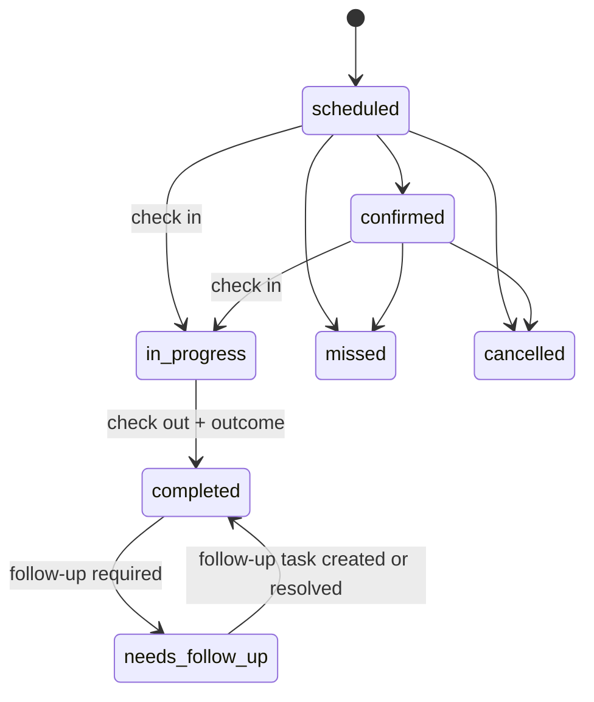
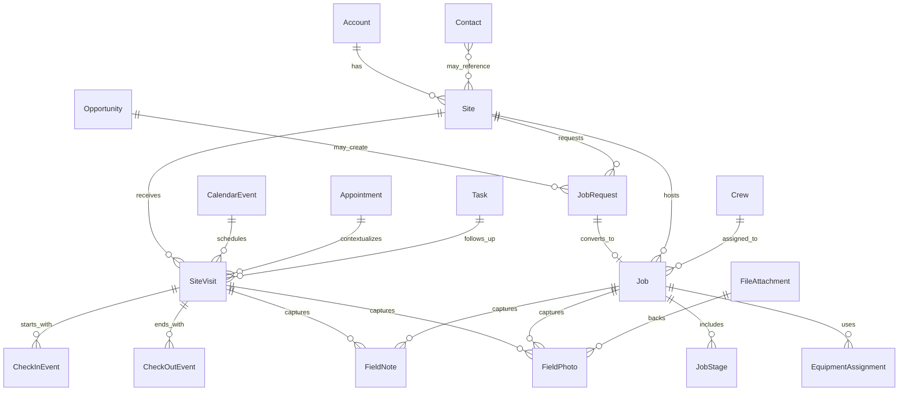
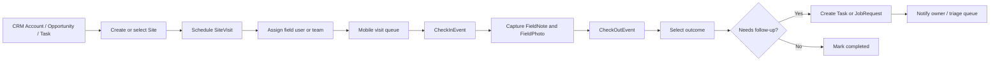
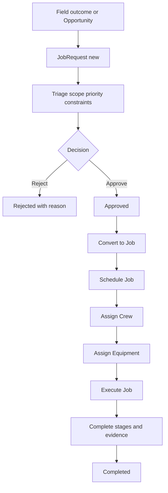

# 07_Field_Sales_Site_Work.md

## 1. Document Metadata

| Field | Value |
| --- | --- |
| Document name | `07_Field_Sales_Site_Work.md` |
| Phase | Phase 07 |
| Phase name | Field Sales / Site Work |
| Document type | Phase-level product, data, workflow, API, UX, permission, audit, reporting, mobile/offline, and implementation specification |
| Status | Draft for architecture and implementation planning |
| Prepared for | Product, engineering, design, QA, implementation, operations, reporting, and future AI documentation writers |
| Source of truth | Master Platform Documentation; Global Documentation Rules; Global Domain Model; Global Decisions Register; Phase 01-06 summaries |
| Last updated | 2026-05-09 |

## 2. Phase Purpose

Phase 07 defines the Field Sales / Site Work foundation for the platform. It connects CRM and outbound activity to physical sites, site visits, mobile field capture, job requests, jobs, crews, equipment assignments, and field evidence.

This phase is the bridge between sales promises and operational execution. It does not build advanced dispatch optimization, full drilling workflows, full fleet tracking, service work order execution, inventory usage, QuickBooks billing sync, or reporting dashboards in full detail. It creates the canonical entities, lifecycle rules, APIs, UX patterns, permissions, audit events, and mobile/offline requirements that those later phases must reuse.

## 3. Phase Goals

- Define canonical Site, SiteVisit, CheckInEvent, CheckOutEvent, FieldNote, FieldPhoto, JobRequest, Job, JobStage, Crew, and EquipmentAssignment models.
- Preserve continuity with Tenant, Company, UserMembership, Role, Permission, Core Platform services, CRM entities, Outbound Sales workflows, and Calendar / Tasks foundations.
- Allow field sales reps and field users to execute mobile visits, check in/out, capture notes/photos, and create follow-up work.
- Allow managers to review territory coverage, site status, visit outcomes, job request funnel, job status, crew assignments, and equipment assignment conflicts.
- Create implementation-ready API, UX, permission, audit, reporting, notification, integration, and offline requirements.
- Avoid duplicate entities and preserve future compatibility with drilling, dispatch, fleet/geofencing, service, reporting, offline sync, and QuickBooks phases.

## 4. Scope

### In Scope

- Site records and site detail workflows.
- SiteVisit planning, execution, completion, cancellation, missed state, and follow-up outcomes.
- CheckInEvent and CheckOutEvent capture with timestamps, coordinates, geofence status where available, device metadata, and offline sync metadata.
- FieldNote and FieldPhoto capture, visibility, review, timeline, and reporting behavior.
- JobRequest intake, triage, approval, rejection, conversion to Job, and handoff tracking.
- Generic Job records, JobStage checkpoints, Crew definitions, and EquipmentAssignment foundations.
- Desktop manager workflows and mobile field execution workflows.
- Search, filters, saved views, notifications, audit events, reporting impacts, APIs, permission keys, edge cases, and acceptance criteria.

### Out of Scope for Phase 07

- Full drilling-specific execution details such as boreholes, drilling materials, rig-specific telemetry, and depth tracking.
- Advanced dispatch board optimization, route optimization, and shipment planning.
- Full fleet/GPS tracking, route replay, driver compliance, and device management.
- Full service WorkOrder execution and maintenance history.
- Inventory consumption, picking, loading, and warehouse/depot stock movements.
- QuickBooks invoice generation, accounting sync rules, and billing automation.
- Customer-facing portal and external customer approvals.
- Advanced AI recommendations or automated scheduling optimization.

## 5. Non-Goals

- Do not create Phase 08 or later-phase details beyond necessary integration seams.
- Do not rewrite master or global control documents.
- Do not replace Account with Site or Company with Account.
- Do not create duplicate task, appointment, notification, file, tag, custom field, audit, import/export, or search frameworks.
- Do not require full offline parity for every desktop workflow.
- Do not hardcode drilling-specific niche fields that can remain custom fields until the drilling phase confirms them.

## 6. Source-of-Truth Definitions

- `Tenant` is the top-level SaaS isolation boundary.
- `Company` is the customer organization inside a Tenant.
- `Account` is the canonical CRM business/customer/prospect/vendor record and is not the SaaS Company.
- `User` and `UserMembership` control human access to Companies and roles.
- `Activity` is the CRM/timeline activity record; it may be linked from field events but does not replace operational source-of-truth events.
- `Task`, `CalendarEvent`, `Appointment`, `Reminder`, and `RecurrenceRule` are owned by Calendar / Tasks and must be reused.
- `FileAttachment` stores files and photos; `FieldPhoto` stores field-specific photo metadata.
- `AuditLog` is append-only and records high-impact operational, status, assignment, security, export, and sync actions.
- `SavedView`, `SearchIndexRecord`, `ImportJob`, and `ExportJob` must be reused for saved filters, search, imports, and exports.

## 7. Canonical Entity Definitions

### Site

| Area | Requirement |
| --- | --- |
| Purpose | Physical customer or operational location where visits, jobs, deliveries, service, or drilling-related work occur. |
| Owner module | Field Sales / Site Work |
| Scope | Company-scoped, optional branch/territory context. All company-scoped records must include `tenant_id` and `company_id`. Optional `branch_id`, `territory_id`, or assignment fields may narrow visibility but never replace tenant/company scope. |
| Tenant/company scoping | Queries must filter by authenticated `tenant_id` and permitted `company_id`; cross-company access is tenant-admin-only and must still be audited. |
| Key fields | `id, tenant_id, company_id, account_id, primary_contact_id, name, site_code, status, address, coordinates, territory_id, access_notes, hazard_notes, gate_code_secure_ref, timezone, owner_user_id, created_at, updated_at, deleted_at, metadata, external_refs` |
| Relationships | Account, Contact, SiteVisit, Job, Geofence, FileAttachment, FieldNote, FieldPhoto. |
| Lifecycle | Creation, validation, update, status transition, soft archive, and reporting/search index refresh must follow shared lifecycle rules. Append-only event records may not be edited except through correction/rejection metadata. |
| Statuses | `active, inactive, restricted, archived`. |
| Index considerations | Index `tenant_id`, `company_id`, `status`, ownership/assignment fields, `site_id`, `account_id`, scheduled/date fields, and location fields where applicable. Add compound indexes for saved views and mobile sync windows. |
| Permissions impact | Requires Field Sales / Site Work module enablement plus entity-specific permissions. Visibility inherits tenant/company scope and may be narrowed by assignment, team, branch, territory, or future policy rules. |
| Audit requirements | Create, update, archive, status change, assignment change, conversion, check-in/out, evidence rejection, and high-impact field changes must write `AuditLog` events. |
| Reporting impact | Must support coverage, activity volume, visit completion, job-request conversion, job status, field proof, duration, exceptions, and productivity metrics. |
| Future-phase impact | Drilling, dispatch, fleet/geofencing, service, reporting, offline sync, and QuickBooks phases must reuse or reference this concept rather than creating duplicate entities. |

### SiteVisit

| Area | Requirement |
| --- | --- |
| Purpose | Planned or completed visit to a Site for sales discovery, assessment, follow-up, job scoping, or field execution preparation. |
| Owner module | Field Sales / Site Work |
| Scope | Company-scoped, scheduled/execution record. All company-scoped records must include `tenant_id` and `company_id`. Optional `branch_id`, `territory_id`, or assignment fields may narrow visibility but never replace tenant/company scope. |
| Tenant/company scoping | Queries must filter by authenticated `tenant_id` and permitted `company_id`; cross-company access is tenant-admin-only and must still be audited. |
| Key fields | `id, tenant_id, company_id, site_id, account_id, contact_ids, assigned_user_id, assigned_team_id, calendar_event_id, appointment_id, status, purpose, scheduled_start_at, scheduled_end_at, actual_start_at, actual_end_at, outcome, next_action, follow_up_task_id, offline_sync_state, created_at, updated_at, metadata` |
| Relationships | Site, Account, Contact, User, CalendarEvent, Appointment, CheckInEvent, CheckOutEvent, FieldNote, FieldPhoto, Task. |
| Lifecycle | Creation, validation, update, status transition, soft archive, and reporting/search index refresh must follow shared lifecycle rules. Append-only event records may not be edited except through correction/rejection metadata. |
| Statuses | `scheduled, confirmed, in_progress, completed, missed, cancelled, needs_follow_up`. |
| Index considerations | Index `tenant_id`, `company_id`, `status`, ownership/assignment fields, `site_id`, `account_id`, scheduled/date fields, and location fields where applicable. Add compound indexes for saved views and mobile sync windows. |
| Permissions impact | Requires Field Sales / Site Work module enablement plus entity-specific permissions. Visibility inherits tenant/company scope and may be narrowed by assignment, team, branch, territory, or future policy rules. |
| Audit requirements | Create, update, archive, status change, assignment change, conversion, check-in/out, evidence rejection, and high-impact field changes must write `AuditLog` events. |
| Reporting impact | Must support coverage, activity volume, visit completion, job-request conversion, job status, field proof, duration, exceptions, and productivity metrics. |
| Future-phase impact | Drilling, dispatch, fleet/geofencing, service, reporting, offline sync, and QuickBooks phases must reuse or reference this concept rather than creating duplicate entities. |

### CheckInEvent

| Area | Requirement |
| --- | --- |
| Purpose | Append-only event proving a user checked into a SiteVisit, Site, or Job with timestamp, device, coordinates, geofence state, and sync metadata. |
| Owner module | Field Sales / Site Work |
| Scope | Company-scoped append-only event. All company-scoped records must include `tenant_id` and `company_id`. Optional `branch_id`, `territory_id`, or assignment fields may narrow visibility but never replace tenant/company scope. |
| Tenant/company scoping | Queries must filter by authenticated `tenant_id` and permitted `company_id`; cross-company access is tenant-admin-only and must still be audited. |
| Key fields | `id, tenant_id, company_id, user_id, membership_id, entity_type, entity_id, site_id, site_visit_id, job_id, occurred_at, coordinates, geofence_status, distance_from_site_meters, device_id, captured_offline, offline_created_at, offline_sync_state, sync_error_code, created_at` |
| Relationships | User, Site, SiteVisit, Job, GeofenceEvent. |
| Lifecycle | Creation, validation, update, status transition, soft archive, and reporting/search index refresh must follow shared lifecycle rules. Append-only event records may not be edited except through correction/rejection metadata. |
| Statuses | `recorded, synced, rejected`. |
| Index considerations | Index `tenant_id`, `company_id`, `status`, ownership/assignment fields, `site_id`, `account_id`, scheduled/date fields, and location fields where applicable. Add compound indexes for saved views and mobile sync windows. |
| Permissions impact | Requires Field Sales / Site Work module enablement plus entity-specific permissions. Visibility inherits tenant/company scope and may be narrowed by assignment, team, branch, territory, or future policy rules. |
| Audit requirements | Create, update, archive, status change, assignment change, conversion, check-in/out, evidence rejection, and high-impact field changes must write `AuditLog` events. |
| Reporting impact | Must support coverage, activity volume, visit completion, job-request conversion, job status, field proof, duration, exceptions, and productivity metrics. |
| Future-phase impact | Drilling, dispatch, fleet/geofencing, service, reporting, offline sync, and QuickBooks phases must reuse or reference this concept rather than creating duplicate entities. |

### CheckOutEvent

| Area | Requirement |
| --- | --- |
| Purpose | Append-only event proving a user checked out of a SiteVisit, Site, or Job with timestamp, device, coordinates, geofence state, duration context, and sync metadata. |
| Owner module | Field Sales / Site Work |
| Scope | Company-scoped append-only event. All company-scoped records must include `tenant_id` and `company_id`. Optional `branch_id`, `territory_id`, or assignment fields may narrow visibility but never replace tenant/company scope. |
| Tenant/company scoping | Queries must filter by authenticated `tenant_id` and permitted `company_id`; cross-company access is tenant-admin-only and must still be audited. |
| Key fields | `id, tenant_id, company_id, user_id, membership_id, entity_type, entity_id, site_id, site_visit_id, job_id, occurred_at, coordinates, geofence_status, duration_minutes, device_id, captured_offline, offline_created_at, offline_sync_state, sync_error_code, created_at` |
| Relationships | User, Site, SiteVisit, Job. |
| Lifecycle | Creation, validation, update, status transition, soft archive, and reporting/search index refresh must follow shared lifecycle rules. Append-only event records may not be edited except through correction/rejection metadata. |
| Statuses | `recorded, synced, rejected`. |
| Index considerations | Index `tenant_id`, `company_id`, `status`, ownership/assignment fields, `site_id`, `account_id`, scheduled/date fields, and location fields where applicable. Add compound indexes for saved views and mobile sync windows. |
| Permissions impact | Requires Field Sales / Site Work module enablement plus entity-specific permissions. Visibility inherits tenant/company scope and may be narrowed by assignment, team, branch, territory, or future policy rules. |
| Audit requirements | Create, update, archive, status change, assignment change, conversion, check-in/out, evidence rejection, and high-impact field changes must write `AuditLog` events. |
| Reporting impact | Must support coverage, activity volume, visit completion, job-request conversion, job status, field proof, duration, exceptions, and productivity metrics. |
| Future-phase impact | Drilling, dispatch, fleet/geofencing, service, reporting, offline sync, and QuickBooks phases must reuse or reference this concept rather than creating duplicate entities. |

### FieldNote

| Area | Requirement |
| --- | --- |
| Purpose | Structured field-captured note associated with a Site, SiteVisit, Job, JobRequest, or Account context; may create CRM Activity and follow-up Tasks. |
| Owner module | Field Sales / Site Work |
| Scope | Company-scoped field capture record. All company-scoped records must include `tenant_id` and `company_id`. Optional `branch_id`, `territory_id`, or assignment fields may narrow visibility but never replace tenant/company scope. |
| Tenant/company scoping | Queries must filter by authenticated `tenant_id` and permitted `company_id`; cross-company access is tenant-admin-only and must still be audited. |
| Key fields | `id, tenant_id, company_id, entity_type, entity_id, site_id, site_visit_id, job_id, job_request_id, author_user_id, category, body, visibility, follow_up_required, follow_up_task_id, activity_id, captured_offline, offline_sync_state, created_at, updated_at, archived_at` |
| Relationships | Site, SiteVisit, Job, JobRequest, User, Activity, Task, FileAttachment. |
| Lifecycle | Creation, validation, update, status transition, soft archive, and reporting/search index refresh must follow shared lifecycle rules. Append-only event records may not be edited except through correction/rejection metadata. |
| Statuses | `active, archived`. |
| Index considerations | Index `tenant_id`, `company_id`, `status`, ownership/assignment fields, `site_id`, `account_id`, scheduled/date fields, and location fields where applicable. Add compound indexes for saved views and mobile sync windows. |
| Permissions impact | Requires Field Sales / Site Work module enablement plus entity-specific permissions. Visibility inherits tenant/company scope and may be narrowed by assignment, team, branch, territory, or future policy rules. |
| Audit requirements | Create, update, archive, status change, assignment change, conversion, check-in/out, evidence rejection, and high-impact field changes must write `AuditLog` events. |
| Reporting impact | Must support coverage, activity volume, visit completion, job-request conversion, job status, field proof, duration, exceptions, and productivity metrics. |
| Future-phase impact | Drilling, dispatch, fleet/geofencing, service, reporting, offline sync, and QuickBooks phases must reuse or reference this concept rather than creating duplicate entities. |

### FieldPhoto

| Area | Requirement |
| --- | --- |
| Purpose | Field-captured photo metadata linked to canonical FileAttachment, preserving coordinates, capture context, timestamp, device, and review state. |
| Owner module | Field Sales / Site Work |
| Scope | Company-scoped field photo wrapper. All company-scoped records must include `tenant_id` and `company_id`. Optional `branch_id`, `territory_id`, or assignment fields may narrow visibility but never replace tenant/company scope. |
| Tenant/company scoping | Queries must filter by authenticated `tenant_id` and permitted `company_id`; cross-company access is tenant-admin-only and must still be audited. |
| Key fields | `id, tenant_id, company_id, file_attachment_id, entity_type, entity_id, site_id, site_visit_id, job_id, captured_by_user_id, captured_at, coordinates, caption, category, review_status, captured_offline, offline_sync_state, created_at, archived_at` |
| Relationships | FileAttachment, Site, SiteVisit, Job, FieldNote, User. |
| Lifecycle | Creation, validation, update, status transition, soft archive, and reporting/search index refresh must follow shared lifecycle rules. Append-only event records may not be edited except through correction/rejection metadata. |
| Statuses | `active, archived, rejected`. |
| Index considerations | Index `tenant_id`, `company_id`, `status`, ownership/assignment fields, `site_id`, `account_id`, scheduled/date fields, and location fields where applicable. Add compound indexes for saved views and mobile sync windows. |
| Permissions impact | Requires Field Sales / Site Work module enablement plus entity-specific permissions. Visibility inherits tenant/company scope and may be narrowed by assignment, team, branch, territory, or future policy rules. |
| Audit requirements | Create, update, archive, status change, assignment change, conversion, check-in/out, evidence rejection, and high-impact field changes must write `AuditLog` events. |
| Reporting impact | Must support coverage, activity volume, visit completion, job-request conversion, job status, field proof, duration, exceptions, and productivity metrics. |
| Future-phase impact | Drilling, dispatch, fleet/geofencing, service, reporting, offline sync, and QuickBooks phases must reuse or reference this concept rather than creating duplicate entities. |

### JobRequest

| Area | Requirement |
| --- | --- |
| Purpose | Request for operational work originating from sales, field visit, customer commitment, service context, or operations intake before it becomes a scheduled Job. |
| Owner module | Field Sales / Site Work |
| Scope | Company-scoped intake/request record. All company-scoped records must include `tenant_id` and `company_id`. Optional `branch_id`, `territory_id`, or assignment fields may narrow visibility but never replace tenant/company scope. |
| Tenant/company scoping | Queries must filter by authenticated `tenant_id` and permitted `company_id`; cross-company access is tenant-admin-only and must still be audited. |
| Key fields | `id, tenant_id, company_id, account_id, site_id, opportunity_id, source, requested_by_user_id, requester_contact_id, priority, status, scope, requested_date, due_date, constraints, required_equipment, estimated_value, converted_job_id, rejection_reason, created_at, updated_at, archived_at, metadata` |
| Relationships | Account, Contact, Opportunity, Site, SiteVisit, Job, Task, Activity. |
| Lifecycle | Creation, validation, update, status transition, soft archive, and reporting/search index refresh must follow shared lifecycle rules. Append-only event records may not be edited except through correction/rejection metadata. |
| Statuses | `new, triaged, approved, rejected, converted, archived`. |
| Index considerations | Index `tenant_id`, `company_id`, `status`, ownership/assignment fields, `site_id`, `account_id`, scheduled/date fields, and location fields where applicable. Add compound indexes for saved views and mobile sync windows. |
| Permissions impact | Requires Field Sales / Site Work module enablement plus entity-specific permissions. Visibility inherits tenant/company scope and may be narrowed by assignment, team, branch, territory, or future policy rules. |
| Audit requirements | Create, update, archive, status change, assignment change, conversion, check-in/out, evidence rejection, and high-impact field changes must write `AuditLog` events. |
| Reporting impact | Must support coverage, activity volume, visit completion, job-request conversion, job status, field proof, duration, exceptions, and productivity metrics. |
| Future-phase impact | Drilling, dispatch, fleet/geofencing, service, reporting, offline sync, and QuickBooks phases must reuse or reference this concept rather than creating duplicate entities. |

### Job

| Area | Requirement |
| --- | --- |
| Purpose | Generic operational job record for scheduled work; drilling-specific, dispatch, inventory, service, and reporting phases extend or reference it instead of replacing it. |
| Owner module | Field Sales / Site Work |
| Scope | Company-scoped operational work record. All company-scoped records must include `tenant_id` and `company_id`. Optional `branch_id`, `territory_id`, or assignment fields may narrow visibility but never replace tenant/company scope. |
| Tenant/company scoping | Queries must filter by authenticated `tenant_id` and permitted `company_id`; cross-company access is tenant-admin-only and must still be audited. |
| Key fields | `id, tenant_id, company_id, account_id, site_id, job_request_id, opportunity_id, job_number, job_type, status, priority, scheduled_start_at, scheduled_end_at, actual_start_at, actual_end_at, owner_user_id, crew_id, primary_contact_id, readiness_status, completion_summary, blocked_reason, created_at, updated_at, archived_at, metadata` |
| Relationships | JobRequest, Opportunity, Account, Site, Crew, EquipmentAssignment, JobStage, DispatchPlan, WorkOrder, CalendarEvent. |
| Lifecycle | Creation, validation, update, status transition, soft archive, and reporting/search index refresh must follow shared lifecycle rules. Append-only event records may not be edited except through correction/rejection metadata. |
| Statuses | `draft, scheduled, in_progress, blocked, completed, cancelled, archived`. |
| Index considerations | Index `tenant_id`, `company_id`, `status`, ownership/assignment fields, `site_id`, `account_id`, scheduled/date fields, and location fields where applicable. Add compound indexes for saved views and mobile sync windows. |
| Permissions impact | Requires Field Sales / Site Work module enablement plus entity-specific permissions. Visibility inherits tenant/company scope and may be narrowed by assignment, team, branch, territory, or future policy rules. |
| Audit requirements | Create, update, archive, status change, assignment change, conversion, check-in/out, evidence rejection, and high-impact field changes must write `AuditLog` events. |
| Reporting impact | Must support coverage, activity volume, visit completion, job-request conversion, job status, field proof, duration, exceptions, and productivity metrics. |
| Future-phase impact | Drilling, dispatch, fleet/geofencing, service, reporting, offline sync, and QuickBooks phases must reuse or reference this concept rather than creating duplicate entities. |

### JobStage

| Area | Requirement |
| --- | --- |
| Purpose | Configurable checkpoint/stage inside a Job workflow used to track progress and enforce required completion evidence. |
| Owner module | Field Sales / Site Work |
| Scope | Company-scoped child of Job. All company-scoped records must include `tenant_id` and `company_id`. Optional `branch_id`, `territory_id`, or assignment fields may narrow visibility but never replace tenant/company scope. |
| Tenant/company scoping | Queries must filter by authenticated `tenant_id` and permitted `company_id`; cross-company access is tenant-admin-only and must still be audited. |
| Key fields | `id, tenant_id, company_id, job_id, name, code, sort_order, status, required, requires_photo, requires_note, assigned_user_id, started_at, completed_at, skipped_reason, created_at, updated_at` |
| Relationships | Job, FieldNote, FieldPhoto, Task, JobProgressEvent. |
| Lifecycle | Creation, validation, update, status transition, soft archive, and reporting/search index refresh must follow shared lifecycle rules. Append-only event records may not be edited except through correction/rejection metadata. |
| Statuses | `pending, in_progress, completed, skipped`. |
| Index considerations | Index `tenant_id`, `company_id`, `status`, ownership/assignment fields, `site_id`, `account_id`, scheduled/date fields, and location fields where applicable. Add compound indexes for saved views and mobile sync windows. |
| Permissions impact | Requires Field Sales / Site Work module enablement plus entity-specific permissions. Visibility inherits tenant/company scope and may be narrowed by assignment, team, branch, territory, or future policy rules. |
| Audit requirements | Create, update, archive, status change, assignment change, conversion, check-in/out, evidence rejection, and high-impact field changes must write `AuditLog` events. |
| Reporting impact | Must support coverage, activity volume, visit completion, job-request conversion, job status, field proof, duration, exceptions, and productivity metrics. |
| Future-phase impact | Drilling, dispatch, fleet/geofencing, service, reporting, offline sync, and QuickBooks phases must reuse or reference this concept rather than creating duplicate entities. |

### Crew

| Area | Requirement |
| --- | --- |
| Purpose | Group of Users assigned to field work, optionally with lead, members, availability metadata, branch/territory, and equipment associations. |
| Owner module | Field Sales / Site Work |
| Scope | Company-scoped resource group. All company-scoped records must include `tenant_id` and `company_id`. Optional `branch_id`, `territory_id`, or assignment fields may narrow visibility but never replace tenant/company scope. |
| Tenant/company scoping | Queries must filter by authenticated `tenant_id` and permitted `company_id`; cross-company access is tenant-admin-only and must still be audited. |
| Key fields | `id, tenant_id, company_id, name, status, lead_user_id, member_user_ids, branch_id, territory_id, availability_status, default_vehicle_id, notes, created_at, updated_at, archived_at` |
| Relationships | User, UserMembership, Job, SiteVisit, Vehicle, EquipmentAssignment. |
| Lifecycle | Creation, validation, update, status transition, soft archive, and reporting/search index refresh must follow shared lifecycle rules. Append-only event records may not be edited except through correction/rejection metadata. |
| Statuses | `active, inactive, archived`. |
| Index considerations | Index `tenant_id`, `company_id`, `status`, ownership/assignment fields, `site_id`, `account_id`, scheduled/date fields, and location fields where applicable. Add compound indexes for saved views and mobile sync windows. |
| Permissions impact | Requires Field Sales / Site Work module enablement plus entity-specific permissions. Visibility inherits tenant/company scope and may be narrowed by assignment, team, branch, territory, or future policy rules. |
| Audit requirements | Create, update, archive, status change, assignment change, conversion, check-in/out, evidence rejection, and high-impact field changes must write `AuditLog` events. |
| Reporting impact | Must support coverage, activity volume, visit completion, job-request conversion, job status, field proof, duration, exceptions, and productivity metrics. |
| Future-phase impact | Drilling, dispatch, fleet/geofencing, service, reporting, offline sync, and QuickBooks phases must reuse or reference this concept rather than creating duplicate entities. |

### EquipmentAssignment

| Area | Requirement |
| --- | --- |
| Purpose | Assignment of equipment, vehicle, drilling equipment, or other operational resource to a Job, Crew, SiteVisit, or time window. |
| Owner module | Field Sales / Site Work |
| Scope | Company-scoped assignment record. All company-scoped records must include `tenant_id` and `company_id`. Optional `branch_id`, `territory_id`, or assignment fields may narrow visibility but never replace tenant/company scope. |
| Tenant/company scoping | Queries must filter by authenticated `tenant_id` and permitted `company_id`; cross-company access is tenant-admin-only and must still be audited. |
| Key fields | `id, tenant_id, company_id, equipment_type, equipment_id, assigned_to_type, assigned_to_id, job_id, crew_id, site_visit_id, start_at, end_at, status, planned_by_user_id, checked_out_by_user_id, checked_in_by_user_id, condition_out, condition_in, created_at, updated_at` |
| Relationships | Job, Crew, Vehicle, DrillingEquipment, User, CalendarEvent. |
| Lifecycle | Creation, validation, update, status transition, soft archive, and reporting/search index refresh must follow shared lifecycle rules. Append-only event records may not be edited except through correction/rejection metadata. |
| Statuses | `planned, active, completed, cancelled`. |
| Index considerations | Index `tenant_id`, `company_id`, `status`, ownership/assignment fields, `site_id`, `account_id`, scheduled/date fields, and location fields where applicable. Add compound indexes for saved views and mobile sync windows. |
| Permissions impact | Requires Field Sales / Site Work module enablement plus entity-specific permissions. Visibility inherits tenant/company scope and may be narrowed by assignment, team, branch, territory, or future policy rules. |
| Audit requirements | Create, update, archive, status change, assignment change, conversion, check-in/out, evidence rejection, and high-impact field changes must write `AuditLog` events. |
| Reporting impact | Must support coverage, activity volume, visit completion, job-request conversion, job status, field proof, duration, exceptions, and productivity metrics. |
| Future-phase impact | Drilling, dispatch, fleet/geofencing, service, reporting, offline sync, and QuickBooks phases must reuse or reference this concept rather than creating duplicate entities. |

## 8. Entity Lifecycle and Status Rules

### Site Lifecycle

`active` Sites are usable in visits, jobs, dispatch, service, reports, and search. `restricted` Sites remain visible to authorized users but require warning treatment before scheduling or check-in. `inactive` Sites should not be used for new work unless overridden. `archived` Sites are hidden from default views but preserved for audit, history, and reports.

### SiteVisit Lifecycle

### JobRequest Lifecycle

`new` means the request was captured but not reviewed. `triaged` means scope and priority were reviewed. `approved` means it may become a Job. `rejected` requires a reason. `converted` requires `converted_job_id`. `archived` hides the request from active queues without deleting history.

### Job Lifecycle

`draft` Jobs are incomplete work plans. `scheduled` Jobs have a time window and required resources where known. `in_progress` Jobs have started. `blocked` Jobs require a reason and optional unblock Task. `completed` Jobs require completion summary and required stages/evidence. `cancelled` requires reason. `archived` hides old Jobs while preserving reporting/audit history.

### Append-Only Event Rules

CheckInEvent and CheckOutEvent are append-only. Rejection, correction note, or administrative review may be added, but the original captured event must not be overwritten. Original client timestamp and server sync timestamp must both be preserved where offline behavior applies.

## 9. Entity Relationship Rules

Relationship constraints:

- A Site should normally link to Account. Exceptions must be rare and documented.
- A SiteVisit must link to Site and should link to Account through Site for reporting consistency.
- FieldNote and FieldPhoto must use target references through `entity_type` and `entity_id`, plus denormalized `site_id`, `site_visit_id`, or `job_id` where needed for query performance.
- JobRequest may originate from Opportunity, SiteVisit, Account/Site detail, or direct operations intake.
- Job may originate from JobRequest, Opportunity, or direct operations entry, but the source fields must remain explicit.
- Crew members must be Users with valid UserMembership for the Company at assignment/sync time.
- EquipmentAssignment may reference future entity types but must validate supported `equipment_type` values through configuration.

## 10. Workflow Requirements

### Field Visit Workflow

### Job Request to Job Workflow

### Required Workflow Rules

- Field users must see assigned visits and jobs in a mobile-optimized queue.
- Managers must see all permitted visits and jobs in desktop views.
- Check-in should not require perfect GPS availability, but missing/low-confidence location must be visible and reportable.
- A visit can complete without a JobRequest only if outcome does not require operational work.
- A JobRequest must not silently become a Job. Conversion must be explicit, permissioned, and audited.
- A Job must not be completed while required stages are incomplete unless the user has override permission and supplies an audited reason.

## 11. Data Model Requirements

- All Phase 07 company-scoped records must include `id`, `tenant_id`, `company_id`, `status`, `created_at`, `created_by`, `updated_at`, and `updated_by` unless append-only event rules make updates not applicable.
- Soft archive must use `archived_at` or `deleted_at` conventions consistently with global rules.
- Use stable application IDs and treat IDs as opaque strings.
- Use references instead of deeply embedding Sites, Visits, Jobs, Crews, or EquipmentAssignments.
- Denormalize selected fields only for list/report performance, and define refresh behavior.
- Store file content through FileAttachment; FieldPhoto only stores field photo metadata.
- Store location as a structured coordinate object compatible with map/geospatial queries.
- Store address separately from coordinates to support geocoding correction and manual entry.
- Store offline sync state explicitly for mobile-created event/capture records.
- Store original captured timestamp separately from server sync timestamp for offline records.
- Use CustomFieldDefinition and CustomFieldValue only for flexible attributes, not core workflow/status/reporting fields.

## 12. API Requirements

- **API-07-001:** Provide CRUD endpoints for `/api/v1/sites` with company-scoped filtering and permission-aware search.
- **API-07-002:** Provide endpoints for `/api/v1/site-visits` including schedule, start, complete, cancel, mark-missed, and reschedule operations.
- **API-07-003:** Provide append-only creation endpoints for `/api/v1/check-in-events` and `/api/v1/check-out-events` with idempotency keys for offline sync.
- **API-07-004:** Provide CRUD/archive endpoints for `/api/v1/field-notes` and upload-link flows for `/api/v1/field-photos` using FileAttachment.
- **API-07-005:** Provide `/api/v1/job-requests` endpoints for create, triage, approve, reject, convert-to-job, archive, and list queues.
- **API-07-006:** Provide `/api/v1/jobs` endpoints for create, schedule, assign crew, assign equipment, start, block, unblock, complete, cancel, and archive.
- **API-07-007:** Provide `/api/v1/jobs/{job_id}/stages` endpoints for creating and updating ordered stage/checkpoint records.
- **API-07-008:** Provide `/api/v1/crews` endpoints for crew roster management and status updates.
- **API-07-009:** Provide `/api/v1/equipment-assignments` endpoints with conflict detection and assignment-window filtering.
- **API-07-010:** All list endpoints must support `q`, `status`, assignment filters, date range filters, `account_id`, `site_id`, `territory_id`, pagination, sorting, and saved view compatibility.
- **API-07-011:** API responses must include permission-derived available actions where useful for UI behavior without replacing backend authorization.
- **API-07-012:** API writes must emit audit events, search-index refresh requests, timeline/activity hooks, notification jobs, and reporting updates where applicable.

### Conceptual API Behavior

- All endpoints must enforce module enablement and permissions before querying data.
- All endpoints must filter by `tenant_id` and permitted `company_id`.
- Mutating endpoints must accept idempotency keys where mobile/offline retry is possible.
- Mutating endpoints must return validation errors that distinguish missing fields, invalid status transitions, missing permissions, and stale record versions.
- Action endpoints should be preferred for lifecycle transitions instead of generic PATCH when the action has business meaning.
- Bulk operations must be limited, audited, permission-aware, and same-company only.

## 13. UI / UX Requirements

- **UX-07-001:** Provide a Field Sales / Site Work navigation area with Sites, Visits, Job Requests, Jobs, Crews, Equipment Assignments, Map, and Manager Views where enabled.
- **UX-07-002:** Site list must support table, map, and saved views with status, owner, account, territory, hazards, last visit, and next visit columns.
- **UX-07-003:** Site detail must show header, status, account/contact links, address/map card, access notes, hazards, visits, jobs, notes, photos, tasks, files, timeline, and audit summary.
- **UX-07-004:** SiteVisit queue must show due today, overdue, upcoming, in-progress, missed, completed, and needs-follow-up segments.
- **UX-07-005:** Mobile SiteVisit screen must prioritize directions, check-in, check-out, notes, photos, contact info, hazards, and offline state.
- **UX-07-006:** Check-in/check-out buttons must clearly show permission, GPS, geofence, and offline status.
- **UX-07-007:** FieldNote composer must support quick categories, required follow-up toggle, visibility selection, and attachment/photo links.
- **UX-07-008:** FieldPhoto capture must show upload/sync status, caption, category, and rejection state if later reviewed.
- **UX-07-009:** JobRequest triage board must support new, triaged, approved, rejected, converted, and archived columns or filters.
- **UX-07-010:** Job detail must show stage checklist, schedule, crew, equipment, site context, customer commitments, notes/photos, timeline, blockers, and completion summary.
- **UX-07-011:** Crew workspace must show crew roster, lead, availability status, current assignments, upcoming jobs, and equipment links.
- **UX-07-012:** EquipmentAssignment UI must warn about scheduling conflicts and show current holder, related job, planned window, and condition notes.
- **UX-07-013:** Empty states must teach users how to create the first Site, schedule the first SiteVisit, and convert a field outcome to a JobRequest.
- **UX-07-014:** Error states must distinguish missing permissions, disabled module, missing location permission, offline queue failure, validation error, and conflict.
- **UX-07-015:** Hidden actions must not replace server enforcement; disabled buttons should explain why an action is unavailable when safe to reveal.

## 14. Search, Filters, and Saved Views

Required searchable/filterable fields include:

- Site: name, account, address, territory, status, owner, hazard/restricted flag, last visit, next visit.
- SiteVisit: status, assigned user/team, date range, purpose, outcome, account, site, territory, missed/overdue state.
- JobRequest: status, priority, source, requested date, account, site, opportunity, owner/requester, converted job.
- Job: status, priority, job type, date range, crew, site, account, blocked reason, readiness status.
- Crew: status, lead, members, branch, territory, availability status.
- EquipmentAssignment: status, equipment type, equipment ID, job, crew, date range, conflict state.

Saved views should include: My visits today, Overdue visits, Needs follow-up, New job requests, Approved not converted, Blocked jobs, Jobs this week, My crew assignments, Equipment conflicts, Restricted sites, No recent visit, and Territory coverage.

## 15. Permissions and Access Control

- **PERM-07-001:** Define `field.site.view`, `field.site.create`, `field.site.update`, `field.site.archive`, and `field.site.export`.
- **PERM-07-002:** Define `field.site_visit.view`, `field.site_visit.create`, `field.site_visit.update`, `field.site_visit.cancel`, `field.site_visit.check_in`, `field.site_visit.check_out`, and `field.site_visit.export`.
- **PERM-07-003:** Define `field.field_note.view`, `field.field_note.create`, `field.field_note.update_own`, `field.field_note.archive`, and `field.field_note.view_private`.
- **PERM-07-004:** Define `field.field_photo.view`, `field.field_photo.create`, `field.field_photo.archive`, `field.field_photo.review`, and `field.field_photo.export`.
- **PERM-07-005:** Define `field.job_request.view`, `field.job_request.create`, `field.job_request.triage`, `field.job_request.approve`, `field.job_request.reject`, `field.job_request.convert`, and `field.job_request.export`.
- **PERM-07-006:** Define `field.job.view`, `field.job.create`, `field.job.schedule`, `field.job.update`, `field.job.start`, `field.job.block`, `field.job.complete`, `field.job.cancel`, `field.job.archive`, and `field.job.export`.
- **PERM-07-007:** Define `field.crew.view`, `field.crew.manage`, `field.crew.assign`, and `field.crew.archive`.
- **PERM-07-008:** Define `field.equipment_assignment.view`, `field.equipment_assignment.manage`, `field.equipment_assignment.override_conflict`, and `field.equipment_assignment.export`.
- **PERM-07-009:** Location and check-in history views must require explicit permission beyond generic Site visibility when used for user monitoring.
- **PERM-07-010:** Exports containing coordinates, access notes, hazards, or private field notes must require export permission and be audited.

Additional rules:

- Field Sales / Site Work requires company module enablement plus user permission.
- Assignment-based visibility may be used for field users, but manager/admin roles may have broader visibility.
- Private FieldNotes require explicit permission to view beyond author/manager policy.
- Location history and check-in/out exports require explicit permission due to sensitivity.
- Offline queued actions must be revalidated at sync time against current permissions and module access.

## 16. Notifications

- **NOTIF-07-001:** Notify assigned users when a SiteVisit is assigned or rescheduled.
- **NOTIF-07-002:** Notify managers when a scheduled SiteVisit becomes overdue or missed.
- **NOTIF-07-003:** Notify relevant owners when a SiteVisit outcome requires follow-up.
- **NOTIF-07-004:** Notify triage users when a new JobRequest is created from a SiteVisit or Opportunity.
- **NOTIF-07-005:** Notify requester and owner when a JobRequest is approved, rejected, or converted to Job.
- **NOTIF-07-006:** Notify assigned crew members when a Job is scheduled, rescheduled, blocked, unblocked, or cancelled.
- **NOTIF-07-007:** Notify equipment owners/managers when an EquipmentAssignment conflict or overdue return is detected.
- **NOTIF-07-008:** Notifications must use the canonical Notification and Reminder foundations and respect user preferences.

## 17. Audit Logging

- **AUDIT-07-001:** Audit Site creation, updates to address/coordinates/access notes/hazards/status, archive, and restore.
- **AUDIT-07-002:** Audit SiteVisit schedule changes, assignment changes, status transitions, cancellation, missed marking, and completion.
- **AUDIT-07-003:** Audit CheckInEvent and CheckOutEvent creation, rejection, and administrative correction metadata.
- **AUDIT-07-004:** Audit FieldNote creation, visibility changes, edits after sync, archive, and follow-up task creation.
- **AUDIT-07-005:** Audit FieldPhoto upload, metadata changes, review rejection, archive, and attachment deletion attempts.
- **AUDIT-07-006:** Audit JobRequest creation, triage, approval, rejection, conversion, priority change, and archive.
- **AUDIT-07-007:** Audit Job creation, schedule changes, crew/equipment assignments, start/block/unblock/complete/cancel/archive.
- **AUDIT-07-008:** Audit JobStage completion, skip, override, and required-evidence changes.
- **AUDIT-07-009:** Audit Crew membership changes and lead changes.
- **AUDIT-07-010:** Audit EquipmentAssignment creation, activation, completion, cancellation, conflict override, and condition changes.

## 18. Reporting and Analytics Impact

- **REPORT-07-001:** Report site coverage by account, owner, territory, last visit, next visit, and status.
- **REPORT-07-002:** Report visit performance by assigned user, team, scheduled/completed/missed rate, outcome, and duration.
- **REPORT-07-003:** Report check-in/out compliance, geofence match, offline submissions, and rejected events.
- **REPORT-07-004:** Report field note and photo volume by category, site, account, job, user, and date.
- **REPORT-07-005:** Report JobRequest funnel from new to triaged, approved, rejected, converted, and archived.
- **REPORT-07-006:** Report Jobs by status, priority, site, account, crew, job type, blocked reason, and completion time.
- **REPORT-07-007:** Report crew utilization and equipment assignment conflicts at a basic operational level.
- **REPORT-07-008:** Reporting must remain permission-aware and must not expose hidden/private records through aggregates where avoidable.

Reporting model notes:

- Reports must preserve links from field activity back to Account, Site, Opportunity, User, Crew, and Job where applicable.
- Visit and job duration should be calculated from actual timestamps where available but should preserve raw event data.
- Geofence compliance should be a reportable dimension where available, not a mandatory blocker in MVP unless approved.
- Aggregates must remain permission-aware and tenant/company scoped.

## 19. Mobile and Offline Impact

- **OFFLINE-07-001:** Mobile users must be able to create queued CheckInEvent and CheckOutEvent records when offline if they have cached assignment context.
- **OFFLINE-07-002:** Mobile users must be able to create FieldNotes and FieldPhotos offline with stable IDs, capture timestamps, and sync metadata.
- **OFFLINE-07-003:** Offline records must include tenant_id, company_id, actor/membership IDs, target references, client timestamps, and idempotency keys before local persistence.
- **OFFLINE-07-004:** Offline sync must revalidate permissions, module enablement, record existence, status, and assignment constraints before accepting queued actions.
- **OFFLINE-07-005:** Rejected offline actions must remain visible with a clear reason and recovery path.
- **OFFLINE-07-006:** Offline-created check-ins/check-outs must preserve original capture time separately from server sync time.
- **OFFLINE-07-007:** Photo upload retries must not create duplicate FieldPhoto records when idempotency key and stable IDs are present.
- **OFFLINE-07-008:** Mobile cache must not expose records from companies or modules that the user can no longer access after revalidation.

Mobile UX must prioritize low-friction capture:

- Today/upcoming assigned work.
- Site details and hazards.
- Directions and contact actions.
- Check-in/check-out.
- Notes and photos.
- Required job stages.
- Sync status and recovery actions.

## 20. Integration Impact

- **INT-07-001:** CRM integration must reuse Account, Contact, Lead, Opportunity, Activity, Task, CalendarEvent, Appointment, and AssignmentRule rather than duplicating them.
- **INT-07-002:** Core Platform integration must reuse AuditLog, Notification, FileAttachment, Tag, TagAssignment, SavedView, SearchIndexRecord, ImportJob, ExportJob, SettingsDocument, and BackgroundJob.
- **INT-07-003:** Fleet/geofencing phases must be able to link Geofence and GeofenceEvent to Site, CheckInEvent, CheckOutEvent, SiteVisit, and Job.
- **INT-07-004:** Dispatch phases must reuse Job, Site, Crew, EquipmentAssignment, and scheduled windows instead of creating unrelated field job records.
- **INT-07-005:** Drilling phases must extend Job through DrillingJob and drilling-specific entities rather than replacing Job.
- **INT-07-006:** Service phases must connect WorkOrder and ServiceRequest to Site, Account, Job, and FieldNote where relevant.
- **INT-07-007:** QuickBooks integration must not treat Field Sales records as the accounting source of truth; it may use Job, Account, Site, and completion information as sync context in later phases.
- **INT-07-008:** External calendar sync remains future-capable through CalendarEvent and Appointment references.

## 21. Security Considerations

- Location data, site access notes, hazards, and field photos may be sensitive and must be permission-aware.
- Gate codes, alarm details, or sensitive access instructions should use secure reference patterns or protected fields rather than casual text where implementation supports it.
- Exports containing coordinates or access notes must require explicit export permissions and audit logging.
- Offline cached data must be scoped to the user's permitted companies and must be purged or blocked when access changes.
- Backend authorization must never rely on frontend hiding.
- Cross-company access is only allowed for explicit tenant-level administrative roles and must still be audited.
- FieldPhoto access must flow through FileAttachment permission checks.

## 22. Edge Cases

1. User tries to check in to a SiteVisit assigned to another user.
2. User checks in while offline and is removed from the company before sync.
3. User checks in outside the geofence but with valid manager-approved reason.
4. Device has location disabled during check-in.
5. Site has no coordinates yet but the user needs to complete a visit.
6. Site is marked restricted after a visit has already been scheduled.
7. Visit is rescheduled while the mobile app has stale cached data.
8. User checks in but never checks out.
9. User creates duplicate offline check-ins due to retry or app restart.
10. Photo upload succeeds but FieldPhoto metadata sync fails.
11. FieldNote contains follow-up_required but Task creation fails.
12. JobRequest is created from an Opportunity that is later lost.
13. JobRequest is approved twice by simultaneous users.
14. JobRequest conversion creates a Job but notification delivery fails.
15. Job is blocked while stages are partially complete.
16. Required JobStage evidence is rejected after the Job was marked completed.
17. Crew member loses access to company after being assigned to a Job.
18. Equipment is assigned to two overlapping Jobs.
19. EquipmentAssignment references a future DrillingEquipment record not yet available in MVP.
20. Site is archived while active Jobs still reference it.
21. Account merge needs to preserve linked Sites, Visits, JobRequests, and Jobs.
22. Private FieldNote should not appear in exports for unauthorized users.
23. Manager opens map view with too many Sites for a single bounding box.
24. Offline sync attempts to attach records to a deleted SiteVisit.
25. CalendarEvent is cancelled but linked SiteVisit is still scheduled.

## 23. Business Requirements

- **BR-07-001:** The platform must treat Site as the canonical physical customer or operational location for field sales, jobs, service, dispatch, and drilling-related work.
- **BR-07-002:** Field sales users must be able to plan, execute, and complete SiteVisits without losing CRM context.
- **BR-07-003:** Field activity must connect back to Account, Contact, Lead, Opportunity, Activity, Task, CalendarEvent, and Appointment where relevant.
- **BR-07-004:** Field users must be able to check in and check out from assigned visits and jobs with timestamp and location evidence.
- **BR-07-005:** Field notes, photos, outcomes, and follow-up tasks must be captured in a structured, reportable, permission-aware way.
- **BR-07-006:** Sales managers must be able to review territory coverage, missed visits, visit density, and outcome quality.
- **BR-07-007:** JobRequests must provide a controlled handoff from sales or field discovery into operational work planning.
- **BR-07-008:** Jobs must be generic enough for future drilling, dispatch, logistics, and service extensions without becoming a duplicate WorkOrder or Order entity.
- **BR-07-009:** Crews and EquipmentAssignments must provide basic field-resource visibility without implementing advanced dispatch optimization in this phase.
- **BR-07-010:** Field workflows must work on mobile in weak connectivity conditions for critical capture actions.
- **BR-07-011:** Managers must be able to see the current status of scheduled visits, active visits, pending job requests, scheduled jobs, blocked jobs, and completed jobs.
- **BR-07-012:** Customer commitments made during field work must be represented as Tasks, JobRequests, or Jobs rather than hidden in free-text notes only.
- **BR-07-013:** Site hazards, access notes, constraints, and required equipment must be visible before field users arrive onsite.
- **BR-07-014:** Field evidence must be auditable and traceable to the actor, device, time, record, and company scope.
- **BR-07-015:** Phase 07 must preserve future compatibility with geofencing, fleet tracking, dispatch planning, inventory usage, drilling specialization, service work orders, reporting, and QuickBooks sync.
- **BR-07-016:** The system must avoid creating duplicate customer, task, appointment, attachment, tag, custom field, notification, or audit models.

## 24. Functional Requirements

- **FR-07-001:** Users with permission must create, view, update, archive, and restore Sites within permitted companies.
- **FR-07-002:** Site records must link to Account and may link to primary Contact and secondary Contacts.
- **FR-07-003:** Site records must store address and coordinates separately so map, distance, geofence, and reporting features remain possible.
- **FR-07-004:** Site records must store access notes, hazards, equipment constraints, and restricted status where applicable.
- **FR-07-005:** Users with permission must schedule SiteVisits from a Site, Account, Opportunity, Task, Appointment, or CalendarEvent context.
- **FR-07-006:** SiteVisits must support assigned user/team, scheduled window, purpose, visit type, status, outcome, and next action.
- **FR-07-007:** Starting a SiteVisit through check-in must transition the visit to in_progress when validation passes.
- **FR-07-008:** Completing a SiteVisit through check-out must allow outcome selection, notes/photos review, and next action creation.
- **FR-07-009:** The system must allow SiteVisit cancellation and missed status with required reason fields.
- **FR-07-010:** CheckInEvent must be append-only after sync, except administrative rejection/correction metadata.
- **FR-07-011:** CheckOutEvent must be append-only after sync, except administrative rejection/correction metadata.
- **FR-07-012:** Check-in/out events must capture user, membership, device, timestamp, coordinates where available, geofence status where available, and offline sync metadata.
- **FR-07-013:** FieldNote must support category, visibility, target entity, author, body, follow-up required flag, and optional Task creation.
- **FR-07-014:** FieldNote must produce or link to CRM Activity where useful for customer timeline continuity.
- **FR-07-015:** FieldPhoto must wrap FileAttachment rather than storing binary photo data in the FieldPhoto entity.
- **FR-07-016:** FieldPhoto must support caption, category, coordinates, captured_at, review status, and target entity references.
- **FR-07-017:** JobRequests must be creatable from SiteVisit outcomes, Opportunity context, Account/Site detail, or operations intake.
- **FR-07-018:** JobRequest triage must support status, priority, scope, constraints, requested date, required equipment, and approval/rejection decision.
- **FR-07-019:** Approved JobRequests must be convertible to Jobs without losing source references.
- **FR-07-020:** Rejected JobRequests must require a rejection reason and remain reportable.
- **FR-07-021:** Jobs must support job number, job type, priority, schedule, status, owner, site, account, crew, stages, and equipment assignments.
- **FR-07-022:** Jobs must support blocked status with blocked reason and optional unblock task.
- **FR-07-023:** Jobs must support completion summary and completion timestamp.
- **FR-07-024:** JobStages must support ordered stage definitions per job and required evidence rules.
- **FR-07-025:** Required JobStages must prevent job completion unless completed, skipped with permission, or overridden with audited reason.
- **FR-07-026:** Crews must support lead user, members, status, optional territory/branch, and assignment to Jobs or SiteVisits.
- **FR-07-027:** EquipmentAssignments must support assignment to Job, Crew, SiteVisit, or user context with planned and active states.
- **FR-07-028:** EquipmentAssignment conflicts must be detected when the same equipment is assigned to overlapping active windows.
- **FR-07-029:** Field records must appear in global search and record-specific timelines according to permissions.
- **FR-07-030:** Field users must be able to create offline SiteVisit updates, check-ins, check-outs, FieldNotes, and FieldPhotos when enabled.
- **FR-07-031:** Sync conflicts must be visible to the user and manager, not silently discarded.
- **FR-07-032:** SavedViews must support visit queues, job-request triage queues, job boards, territory coverage lists, and manager exception views.
- **FR-07-033:** The system must support bulk assignment only when safe, permissioned, audited, and scoped to one company.
- **FR-07-034:** The system must create Notifications for assignment, schedule change, overdue visit, job request approval/rejection, blocked job, and required follow-up.
- **FR-07-035:** Field Sales / Site Work must expose exportable data through ExportJob subject to permission checks.

## 25. Non-Functional Requirements

- **NFR-07-001:** All Phase 07 records must enforce tenant isolation and company scope in API queries, background jobs, search, exports, and offline sync.
- **NFR-07-002:** APIs must be idempotent for offline-created records and retried mobile sync submissions.
- **NFR-07-003:** Public APIs must use stable application `id` fields and must never expose MongoDB `_id` as the public contract.
- **NFR-07-004:** Mobile capture flows must remain usable with high latency and intermittent connectivity.
- **NFR-07-005:** Check-in/out creation should complete quickly on mobile and defer non-critical work to background jobs where safe.
- **NFR-07-006:** Photo uploads must support resumable or retry-safe behavior where implementation allows.
- **NFR-07-007:** Search indexing must be eventually consistent but should expose clear refresh behavior for newly created field records.
- **NFR-07-008:** Audit logging must be reliable for status, assignment, conversion, and evidence actions.
- **NFR-07-009:** Permission checks must run on the backend for every Phase 07 endpoint.
- **NFR-07-010:** Field capture data must preserve original timestamps and client-side capture metadata where offline behavior applies.
- **NFR-07-011:** Location data must be treated as sensitive operational data with permission-aware display and export controls.
- **NFR-07-012:** Large list and map views must support pagination, bounding boxes, and filters rather than loading entire company datasets.
- **NFR-07-013:** Import and export operations must use ImportJob and ExportJob foundations instead of synchronous large-file handling.
- **NFR-07-014:** Error messages must be actionable for field users and must distinguish validation failure, permission failure, sync conflict, and connectivity failure.
- **NFR-07-015:** The data model must remain extensible through custom fields without replacing stable required workflow/reporting fields.
- **NFR-07-016:** The UX must support desktop management workflows and mobile field execution workflows without forcing one layout onto both roles.

## 26. User Stories

### Field Sales Rep

- As a field sales rep, I want to see my assigned visits for today so I know where to go first.
- As a field sales rep, I want to check in and out from my phone so the company has reliable visit proof.
- As a field sales rep, I want to capture notes and photos quickly so I do not lose site details while moving between visits.
- As a field sales rep, I want to create a follow-up task or job request from a visit outcome so customer promises do not disappear into notes.

### Field Manager / Sales Manager

- As a manager, I want to see territory coverage and missed visits so I can coach reps and adjust assignments.
- As a manager, I want to review check-ins, notes, photos, and outcomes so I can understand visit quality.
- As a manager, I want to triage JobRequests so operations only receives clear and approved work requests.
- As a manager, I want to see blocked jobs and overdue follow-ups so I can intervene before customers are affected.

### Operations Coordinator

- As an operations coordinator, I want approved JobRequests to convert into Jobs with source context preserved.
- As an operations coordinator, I want to assign crews and equipment so field work has basic resource visibility.
- As an operations coordinator, I want conflict warnings so I do not assign the same equipment to overlapping work.

### Crew Lead / Field Worker

- As a crew lead, I want to see assigned Jobs with site hazards and required stages before arrival.
- As a crew lead, I want to complete stages and capture evidence so completion is documented.
- As a crew lead, I want offline capture so I can work in weak connectivity areas.

### Company Admin

- As a company admin, I want to control permissions for site, visit, job, note, photo, location, export, crew, and equipment actions.
- As a company admin, I want audit trails for high-impact field actions so I can investigate changes or disputes.

### Analyst / Read-Only User

- As an analyst, I want permission-aware reports for coverage, visits, job requests, jobs, crew usage, and equipment conflicts.
- As a read-only user, I want to view allowed field history without being able to mutate operational records.

## 27. Recommended Decisions

| ID | Decision | Rationale |
| --- | --- | --- |
| RD-07-001 | Treat `Site` as the canonical location for field, dispatch, service, and drilling work. | Prevents duplicate location models and keeps reporting consistent. |
| RD-07-002 | Keep CheckInEvent and CheckOutEvent append-only. | Preserves trust in location/time evidence and supports audits. |
| RD-07-003 | Use `FieldPhoto` only as metadata linked to FileAttachment. | Reuses access control, storage, and file lifecycle foundations. |
| RD-07-004 | Make Job generic and extend it later through DrillingJob, WorkOrder links, dispatch plans, and reporting dimensions. | Avoids premature specialization while preserving operational continuity. |
| RD-07-005 | Represent territory as a field/reference now, with final Territory entity design deferred. | Supports coverage reporting without forcing an unapproved territory module. |
| RD-07-006 | Capture geofence status when available but do not block all check-ins on geofence validation in MVP. | Field users may have GPS or configuration issues; exceptions must be visible rather than silently preventing work. |
| RD-07-007 | Require explicit JobRequest-to-Job conversion instead of automatic conversion. | Reduces accidental operational commitments and creates auditable approval. |

## 28. Open Questions

- OQ-07-001: Should `Territory` become a standalone entity in a later phase, or remain a configuration/custom-field style reference?
- OQ-07-002: Should geofence validation be mandatory for specific companies or roles, or only captured for reporting?
- OQ-07-003: What is the final retention policy for location history, device metadata, and field photos?
- OQ-07-004: Should Job numbering be globally sequential per Company, configurable by module, or manually editable with uniqueness checks?
- OQ-07-005: Should Crew availability be manually set in Phase 07 or derived from CalendarEvent/Job assignments later?
- OQ-07-006: Which equipment entity types are supported before Fleet, Inventory, and DrillingEquipment phases are fully specified?
- OQ-07-007: Should customer-facing visit/job summaries be generated before a future customer portal phase?

## 29. Dependencies

- Phase 01: product foundation, MVP scope, personas, platform positioning, modular CRM + operations vision.
- Phase 02: Tenant, Company, User, UserMembership, Role, Permission, module access, backend authorization, offline revalidation.
- Phase 03: AuditLog, Notification, FileAttachment, Tag, TagAssignment, CustomFieldDefinition, CustomFieldValue, SavedView, SearchIndexRecord, ImportJob, ExportJob, ApiKey, WebhookEndpoint, WebhookDelivery, SettingsDocument, BackgroundJob.
- Phase 04: Account, Contact, Lead, Opportunity, Activity, Pipeline, PipelineStage, AssignmentRule, CRM timelines.
- Phase 05: outbound-generated appointments, follow-up discipline, campaign/opportunity context, outbound Activity continuity.
- Phase 06: Task, CalendarEvent, Appointment, Reminder, RecurrenceRule, SLA/follow-up foundations.

## 30. Future Phase Considerations

- Drilling Operations must extend Job through DrillingJob and must reuse Site, JobStage, Crew, EquipmentAssignment, FieldNote, and FieldPhoto.
- Dispatch / Logistics must reference Site and Job where work location and operational work already exist.
- Fleet / GPS / Geofencing must link Geofence and GeofenceEvent to Site, CheckInEvent, CheckOutEvent, SiteVisit, and Job.
- Inventory / Warehouse must later connect equipment, product usage, and stock movements to Job, Site, and Crew where needed.
- Service / Work Orders must connect ServiceRequest and WorkOrder to Site, Account, Job, FieldNote, and FieldPhoto where relevant.
- Reporting / Analytics must build dashboards from explicit Phase 07 fields rather than mining free-text notes.
- QuickBooks must use Account, Job, Site, and completion/billing readiness context where applicable but remain a sync integration, not the operational source of truth.

## 31. Acceptance Criteria

- All required Phase 07 sections exist and use the required ID formats.
- Site, SiteVisit, CheckInEvent, CheckOutEvent, FieldNote, FieldPhoto, JobRequest, Job, JobStage, Crew, and EquipmentAssignment are defined with purpose, owner, scope, fields, relationships, lifecycle, statuses, indexes, permissions, audit, reporting, and future impact.
- Business, functional, non-functional, API, UX, permission, audit, reporting, notification, integration, and offline requirements are present and phase-specific.
- Mermaid entity relationship and workflow diagrams are included.
- At least 20 edge cases are documented.
- All records respect tenant/company scoping and permission rules.
- Core Platform, CRM, Outbound Sales, and Calendar / Tasks dependencies are reused, not duplicated.
- Mobile/offline behavior is defined for check-ins, check-outs, notes, photos, and sync revalidation.
- Future drilling, dispatch, fleet, service, reporting, offline sync, and QuickBooks phases have clear reuse constraints.

## 32. Implementation Notes

- Use FastAPI resource routers aligned to entity groups and action endpoints.
- Use MongoDB collections per major entity where query volume and lifecycle justify it: `sites`, `site_visits`, `check_in_events`, `check_out_events`, `field_notes`, `field_photos`, `job_requests`, `jobs`, `job_stages`, `crews`, and `equipment_assignments`.
- Use Redis/workers for notification fanout, search indexing, photo processing, import/export, geocoding/geofence enrichment, and reporting rollup updates.
- Apply optimistic concurrency or version checks to mutable records such as SiteVisit, JobRequest, Job, Crew, and EquipmentAssignment.
- Treat check-in/out events as append-only and retry-safe.
- Keep mobile payloads compact and cache only the minimum permitted records needed for assigned work.
- Use background jobs to update SearchIndexRecord and reporting rollups after high-volume field events.
- Avoid storing large binary payloads in MongoDB field records; use FileAttachment storage pattern.
- Use server-side validation for status transitions and permission-derived actions.
- Add automated tests for tenant isolation, company isolation, permissions, status transitions, offline idempotency, audit emission, and edge cases.

# Summary for Future Phases

## Final Decisions Made

- Phase 07 establishes Field Sales / Site Work as the canonical foundation for Sites, SiteVisits, check-ins/check-outs, FieldNotes, FieldPhotos, JobRequests, Jobs, JobStages, Crews, EquipmentAssignments, territory coverage, site outcomes, and mobile field capture.
- `Site` is the canonical physical customer or operational location. Future phases must not create duplicate concepts such as CustomerSite, FieldLocation, JobLocation, or ServiceLocation when `Site` covers the meaning.
- `SiteVisit` is the canonical scheduled or completed visit to a Site. It may link to CalendarEvent and Appointment but must not replace them.
- `CheckInEvent` and `CheckOutEvent` are append-only operational event records and are offline-capable.
- `FieldNote` is the canonical structured field-captured note for Site, SiteVisit, Job, and JobRequest contexts.
- `FieldPhoto` is a metadata wrapper around canonical `FileAttachment`; it must not store binary file content directly.
- `JobRequest` is the canonical sales/field-to-operations handoff request before work becomes a scheduled Job.
- `Job` is the generic operational work record for scheduled field work. Drilling, dispatch, service, fleet, inventory, reporting, and QuickBooks phases must extend or reference it rather than replacing it.
- `JobStage` is the canonical ordered checkpoint/stage inside a Job.
- `Crew` is the canonical field resource group made of Users.
- `EquipmentAssignment` is the canonical assignment of equipment, vehicle, drilling equipment, or resource to a Job, Crew, SiteVisit, or time window.
- All Phase 07 records must use tenant/company scoping and stable application IDs; MongoDB `_id` must not be exposed as the public API ID.
- Phase 07 must reuse Core Platform services for AuditLog, Notification, FileAttachment, Tag, TagAssignment, CustomFieldDefinition, CustomFieldValue, SavedView, SearchIndexRecord, ImportJob, ExportJob, SettingsDocument, BackgroundJob, ApiKey, WebhookEndpoint, and WebhookDelivery.
- Phase 07 must reuse CRM records for Account, Contact, Lead, Opportunity, Activity, Pipeline context, and AssignmentRule where applicable.
- Phase 07 must reuse Calendar / Tasks records for Task, CalendarEvent, Appointment, Reminder, and RecurrenceRule instead of creating duplicate task or scheduling systems.

## Entities Introduced

| Entity | Owner | Scope | Purpose | Future Phase Rule |
| --- | --- | --- | --- | --- |
| `Site` | Field Sales / Site Work | Company-scoped, optional branch/territory | Physical customer or operational location. | Reuse for dispatch stops, service locations, drilling sites, job locations, delivery locations, and geofences. |
| `SiteVisit` | Field Sales / Site Work | Company-scoped | Scheduled or completed visit to a Site. | Link to CalendarEvent/Appointment; do not create duplicate visit systems. |
| `CheckInEvent` | Field Sales / Site Work | Company-scoped append-only event | User/location check-in event with offline metadata. | Reuse for field proof, geofence, mobile, reporting, fleet, and job attendance context. |
| `CheckOutEvent` | Field Sales / Site Work | Company-scoped append-only event | User/location check-out event with offline metadata. | Reuse for duration, completion proof, and visit/job attendance context. |
| `FieldNote` | Field Sales / Site Work | Company-scoped | Structured field note linked to Site, SiteVisit, Job, or JobRequest. | Reuse for field, drilling, dispatch, and service notes where field capture is needed. |
| `FieldPhoto` | Field Sales / Site Work | Company-scoped | Photo metadata wrapper linked to FileAttachment. | Reuse for field evidence; do not create separate photo binaries per module. |
| `JobRequest` | Field Sales / Site Work | Company-scoped | Request for operational work before scheduling. | Reuse for sales-to-ops and field-to-ops handoffs. |
| `Job` | Field Sales / Site Work | Company-scoped | Generic operational work record. | DrillingJob and later operational extensions must reference Job. |
| `JobStage` | Field Sales / Site Work | Company-scoped child of Job | Ordered checkpoint/stage inside a Job. | Reuse for job progress and required evidence checks. |
| `Crew` | Field Sales / Site Work | Company-scoped | Group of Users assigned to field work. | Reuse for dispatch, drilling, fleet, service, and reporting resource context. |
| `EquipmentAssignment` | Field Sales / Site Work | Company-scoped | Assignment of resources/equipment/vehicles to work. | Reuse for future drilling equipment, fleet assets, inventory tools, and job planning. |

## Fields Introduced

- Shared fields: `id`, `tenant_id`, `company_id`, optional `branch_id`, optional `territory_id`, `status`, `created_at`, `created_by`, `updated_at`, `updated_by`, `deleted_at`, `deleted_by`, `metadata`, `external_refs` where relevant.
- `Site`: `account_id`, `primary_contact_id`, `name`, `site_code`, `address`, `coordinates`, `access_notes`, `hazard_notes`, `timezone`, `owner_user_id`.
- `SiteVisit`: `site_id`, `account_id`, `contact_ids`, `assigned_user_id`, `assigned_team_id`, `calendar_event_id`, `appointment_id`, `purpose`, `scheduled_start_at`, `scheduled_end_at`, `actual_start_at`, `actual_end_at`, `outcome`, `next_action`, `follow_up_task_id`, `offline_sync_state`.
- `CheckInEvent` / `CheckOutEvent`: `user_id`, `membership_id`, `entity_type`, `entity_id`, `site_id`, `site_visit_id`, `job_id`, `occurred_at`, `coordinates`, `geofence_status`, `distance_from_site_meters`, `device_id`, `captured_offline`, `offline_created_at`, `offline_sync_state`, `sync_error_code`.
- `FieldNote`: `entity_type`, `entity_id`, `site_id`, `site_visit_id`, `job_id`, `job_request_id`, `author_user_id`, `category`, `body`, `visibility`, `follow_up_required`, `follow_up_task_id`, `activity_id`, `captured_offline`, `offline_sync_state`.
- `FieldPhoto`: `file_attachment_id`, `entity_type`, `entity_id`, `site_id`, `site_visit_id`, `job_id`, `captured_by_user_id`, `captured_at`, `coordinates`, `caption`, `category`, `review_status`, `captured_offline`, `offline_sync_state`.
- `JobRequest`: `account_id`, `site_id`, `opportunity_id`, `source`, `requested_by_user_id`, `requester_contact_id`, `priority`, `scope`, `requested_date`, `due_date`, `constraints`, `required_equipment`, `estimated_value`, `converted_job_id`, `rejection_reason`.
- `Job`: `account_id`, `site_id`, `job_request_id`, `opportunity_id`, `job_number`, `job_type`, `priority`, `scheduled_start_at`, `scheduled_end_at`, `actual_start_at`, `actual_end_at`, `owner_user_id`, `crew_id`, `primary_contact_id`, `readiness_status`, `completion_summary`, `blocked_reason`.
- `JobStage`: `job_id`, `name`, `code`, `sort_order`, `required`, `requires_photo`, `requires_note`, `assigned_user_id`, `started_at`, `completed_at`, `skipped_reason`.
- `Crew`: `name`, `lead_user_id`, `member_user_ids`, `branch_id`, `territory_id`, `availability_status`, `default_vehicle_id`, `notes`.
- `EquipmentAssignment`: `equipment_type`, `equipment_id`, `assigned_to_type`, `assigned_to_id`, `job_id`, `crew_id`, `site_visit_id`, `start_at`, `end_at`, `planned_by_user_id`, `checked_out_by_user_id`, `checked_in_by_user_id`, `condition_out`, `condition_in`.

## APIs Introduced

- `/api/v1/sites`
- `/api/v1/site-visits`
- `/api/v1/check-in-events`
- `/api/v1/check-out-events`
- `/api/v1/field-notes`
- `/api/v1/field-photos`
- `/api/v1/job-requests`
- `/api/v1/jobs`
- `/api/v1/jobs/{job_id}/stages`
- `/api/v1/crews`
- `/api/v1/equipment-assignments`
- Required action endpoints: schedule, reschedule, check-in, check-out, complete, cancel, mark-missed, triage, approve, reject, convert-to-job, assign-crew, assign-equipment, start, block, unblock, complete-job, cancel-job.

## Permissions Introduced

- `field.site.view`, `field.site.create`, `field.site.update`, `field.site.archive`, `field.site.export`
- `field.site_visit.view`, `field.site_visit.create`, `field.site_visit.update`, `field.site_visit.cancel`, `field.site_visit.check_in`, `field.site_visit.check_out`, `field.site_visit.export`
- `field.field_note.view`, `field.field_note.create`, `field.field_note.update_own`, `field.field_note.archive`, `field.field_note.view_private`
- `field.field_photo.view`, `field.field_photo.create`, `field.field_photo.archive`, `field.field_photo.review`, `field.field_photo.export`
- `field.job_request.view`, `field.job_request.create`, `field.job_request.triage`, `field.job_request.approve`, `field.job_request.reject`, `field.job_request.convert`, `field.job_request.export`
- `field.job.view`, `field.job.create`, `field.job.schedule`, `field.job.update`, `field.job.start`, `field.job.block`, `field.job.complete`, `field.job.cancel`, `field.job.archive`, `field.job.export`
- `field.crew.view`, `field.crew.manage`, `field.crew.assign`, `field.crew.archive`
- `field.equipment_assignment.view`, `field.equipment_assignment.manage`, `field.equipment_assignment.override_conflict`, `field.equipment_assignment.export`

## UX Patterns Introduced

- Site list/table/map views with saved filters.
- Site detail page with site header, account/contact links, map card, access/hazard cards, visits, jobs, notes, photos, files, tasks, timeline, and audit summary.
- SiteVisit queue for due, overdue, upcoming, in-progress, missed, completed, and needs-follow-up visits.
- Mobile-first SiteVisit execution screen with directions, hazards, contact info, check-in, note/photo capture, check-out, and sync state.
- JobRequest triage board/list.
- Job detail workspace with stages, schedule, crew, equipment, blockers, notes/photos, and completion summary.
- Crew roster and assignment view.
- Equipment assignment conflict warning pattern.
- Permission-aware empty, disabled, error, and offline states.

## Reports or Dashboards Introduced

- Site coverage by account, owner, territory, last visit, next visit, and status.
- Visit completion and missed-visit dashboard.
- Check-in/check-out compliance and geofence variance report.
- Field notes/photos evidence report.
- JobRequest funnel report.
- Job status and blocked jobs report.
- Crew utilization and equipment conflict report.

## Notifications Introduced

- SiteVisit assigned/rescheduled.
- SiteVisit overdue/missed.
- SiteVisit outcome requires follow-up.
- New JobRequest created.
- JobRequest approved/rejected/converted.
- Job scheduled/rescheduled/blocked/unblocked/cancelled.
- Equipment assignment conflict or overdue return.

## Audit Events Introduced

- Site create/update/archive/restore and high-impact address/coordinate/access/hazard changes.
- SiteVisit schedule/assignment/status/cancel/missed/complete events.
- CheckInEvent and CheckOutEvent creation/rejection/correction metadata.
- FieldNote create/edit/visibility/archive/follow-up task creation.
- FieldPhoto upload/review rejection/archive/attachment-related actions.
- JobRequest create/triage/approve/reject/convert/priority/archive.
- Job create/schedule/assign/start/block/unblock/complete/cancel/archive.
- JobStage complete/skip/override/evidence changes.
- Crew membership and lead changes.
- EquipmentAssignment create/activate/complete/cancel/conflict override/condition changes.

## Integrations Introduced

- CRM integration through Account, Contact, Lead, Opportunity, Activity, Task, CalendarEvent, Appointment, and AssignmentRule.
- Core Platform integration through AuditLog, Notification, FileAttachment, Tag, TagAssignment, CustomFieldDefinition, CustomFieldValue, SavedView, SearchIndexRecord, ImportJob, ExportJob, SettingsDocument, BackgroundJob, ApiKey, WebhookEndpoint, and WebhookDelivery.
- Future geofencing/fleet linkage through Site, CheckInEvent, CheckOutEvent, SiteVisit, Job, Geofence, and GeofenceEvent.
- Future drilling linkage through Job, Site, JobStage, Crew, EquipmentAssignment, FieldNote, and FieldPhoto.
- Future dispatch/logistics linkage through Site, Job, Crew, EquipmentAssignment, scheduled windows, and status transitions.
- Future service linkage through Site, Job, FieldNote, FieldPhoto, ServiceRequest, and WorkOrder.
- Future QuickBooks context through Account, Job, Site, completion state, and billing readiness metadata, without making QuickBooks the operational source of truth.

## Dependencies Created

- Depends on Phase 01 product foundation and MVP scope.
- Depends on Phase 02 tenant/company/UserMembership/Role/Permission/module enablement rules.
- Depends on Phase 03 Core Platform shared services.
- Depends on Phase 04 CRM canonical Account, Contact, Lead, Opportunity, Activity, and AssignmentRule.
- Depends on Phase 05 Outbound Sales for outbound-generated site visit and opportunity handoff context.
- Depends on Phase 06 Calendar / Tasks for Task, CalendarEvent, Appointment, Reminder, and RecurrenceRule.

## Constraints Future Phases Must Respect

- Do not create duplicate Site, JobRequest, Job, Crew, EquipmentAssignment, check-in, check-out, field note, or field photo concepts.
- Drilling-specific entities must extend or reference Job; they must not replace the generic Job.
- Service WorkOrder may connect to Job and Site but must not replace Job for generic field operations.
- Dispatch and logistics must use Site and Job references where field work location and operational work already exist.
- Fleet/geofencing must link geofence evidence to Site, SiteVisit, Job, CheckInEvent, and CheckOutEvent where applicable.
- Reporting must remain permission-aware and tenant/company scoped.
- Offline sync must revalidate permissions and module access before accepting queued field actions.
- FieldPhoto must continue to use FileAttachment for file storage and access control.
- Field activity that matters to customer history should create or link to CRM Activity where useful.

## Open Questions Carried Forward

- Confirm whether territory is represented as a standalone `Territory` entity, a configuration value, or a field controlled by AssignmentRule in a later phase.
- Confirm whether geofence validation is enforced in Phase 07 MVP or only captured for future Fleet / GPS / Geofencing behavior.
- Confirm whether Job numbers are system-generated, company-configurable, or manually allowed with uniqueness validation.
- Confirm whether Crew availability is manually maintained in Phase 07 or derived from CalendarEvent and Job assignments later.
- Confirm whether EquipmentAssignment can reference generic assets before Fleet, Inventory, and DrillingEquipment phases are fully defined.
- Confirm retention and privacy rules for location history, device metadata, and field photos.
- Confirm whether customer-facing visit/job summaries are needed before a future customer portal phase.

