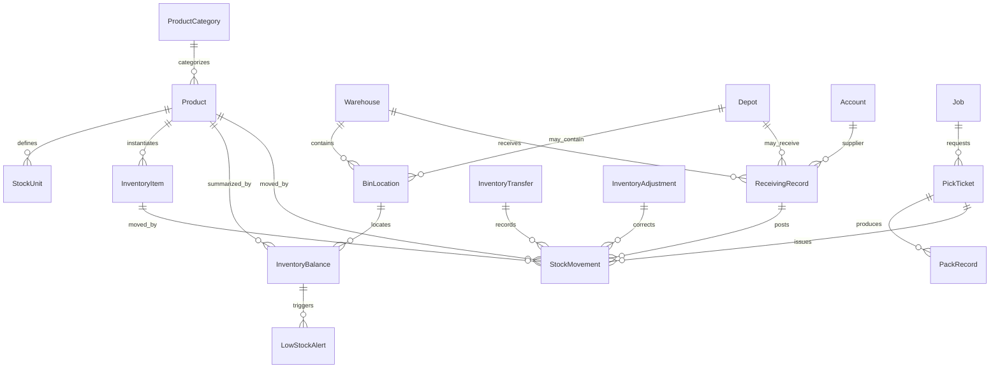
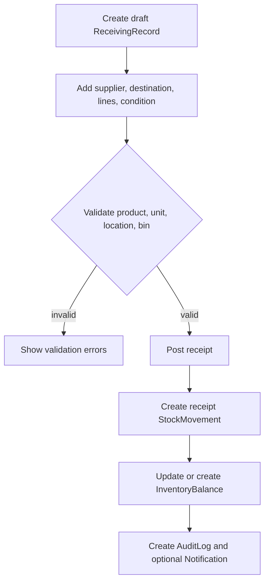

# 08_Inventory_Warehouse_Depots

## 1. Document Metadata

| Field | Value |
| --- | --- |
| Document name | 08_Inventory_Warehouse_Depots.md |
| Phase | Phase 08 |
| Phase name | Inventory, Warehouse, and Depots |
| Document type | Phase-level product, data, workflow, API, UX, permission, audit, reporting, integration, and implementation specification |
| Status | Draft for architecture/product review |
| Source of truth | Master Platform Documentation; 00_Global_Documentation_Rules.md; 00_Global_Domain_Model.md; 00_Global_Decisions_Register.md; Phase 01-07 summaries |
| Owner | Product Architect / Documentation Architect |
| Last updated | 2026-05-09 |
| Output files | 08_Inventory_Warehouse_Depots.md; 08_Inventory_Warehouse_Depots__Summary_For_Future_Phases.md |

## 2. Phase Purpose

Phase 08 defines the canonical Inventory, Warehouse, and Depot foundation for the platform. It establishes how the platform manages products, stock units, inventory items, current balances, warehouses, depots, bins, receiving, picking, packing, stock movements, adjustments, transfers, and low-stock alerts.

This phase is not a standalone WMS replacement. It is the operational inventory foundation that later Orders / Dispatch / Logistics, Fleet / GPS, Service / Work Orders, Reporting, QuickBooks / Integrations, and Offline Mobile phases must reuse.

The most important product rule is: **StockMovement is the append-only history of inventory activity; InventoryBalance is the current-state rollup used for fast operational queries.**

## 3. Phase Goals

- Create canonical inventory entities without duplicating CRM, field, task, audit, file, notification, search, import/export, or integration foundations.
- Provide accurate current stock visibility by product, warehouse, depot, bin, lot, serial, condition, reserved, committed, damaged, in-transit, and available quantity.
- Support receiving, picking, packing, adjustment, transfer, and low-stock workflows at a Phase 08 design level.
- Preserve auditability and explainability for every important stock-changing action.
- Keep inventory ready for later orders, dispatch, service, QuickBooks item sync, mobile scanning, advanced reporting, and warehouse/depot permissions.
- Support operational simplicity for MVP while preserving future seams for barcode scanning, serial/lot expansion, cycle counts, valuation, and advanced WMS features.

## 4. Scope

### In Scope

- Product catalog and category foundation.
- Stock units and unit conversion rules.
- Warehouse and Depot master records.
- BinLocation structure for warehouses and depots.
- InventoryItem tracking for lot/serial/condition/item-level inventory where enabled.
- InventoryBalance current stock rollups.
- StockMovement append-only inventory history.
- ReceivingRecord workflows.
- PickTicket and PackRecord workflows.
- InventoryTransfer workflows with in-transit and discrepancy support.
- InventoryAdjustment workflows with reason codes, approvals, and posting.
- LowStockAlert generation and management.
- Inventory search, filters, saved views, imports, exports, notifications, audit events, reports, APIs, permissions, and mobile/offline impact.

### MVP Scope

- Product, category, stock unit, warehouse, depot, bin, current balance, stock movement, receiving, picking, transfer, adjustment, and low-stock basics.
- Manual stock workflows with strong audit and permission checks.
- Import/export foundations using Core Platform services.
- Limited mobile/offline support for selected field/warehouse events where required.

### Later / Future Scope Preserved But Not Fully Implemented Here

- Advanced barcode scanning and hardware integration.
- Full cycle count module.
- Advanced warehouse wave planning, robotics, replenishment optimization, and directed putaway.
- Full inventory valuation/cost accounting.
- Purchase order management unless later explicitly approved.
- Vehicle/truck inventory after Fleet/Dispatch introduces Vehicle and RoutePlan detail.

## 5. Non-Goals

- Do not create Phase 09 Orders / Dispatch / Logistics.
- Do not create PurchaseOrder unless later approved.
- Do not replace CRM Account with Supplier, Vendor, Customer, or Client entities.
- Do not create a separate task, reminder, notification, audit, file, saved view, import/export, or search system.
- Do not create Vehicle inventory ownership before Fleet/Dispatch phases define Vehicle usage.
- Do not implement advanced WMS features such as wave planning, robotics, labor optimization, conveyor integration, or full slotting algorithms.
- Do not make QuickBooks the operational source of truth for Products or inventory balances.

## 6. Source-of-Truth Definitions

| Concept | Definition | Phase 08 Rule |
| --- | --- | --- |
| Product | Canonical item that may be stocked, sold, consumed, dispatched, serviced, reported, or synced to accounting later. | Use `Product`; do not create Item, Part, Material, SKUItem, or ServiceItem as duplicate entities. |
| ProductCategory | Catalog grouping for Product organization and reporting. | Supports hierarchy but must remain simple enough for MVP. |
| StockUnit | Unit and conversion definition for inventory quantities. | Quantities must respect unit precision and base-unit conversion. |
| InventoryItem | Trackable physical instance or batch when lot, serial, or condition tracking matters. | Use only when item-level tracking is needed; do not force every product to have one row per unit. |
| InventoryBalance | Current materialized stock quantity by product/location/bin/lot/serial/condition. | Derived from StockMovement where practical; not the historical source. |
| StockMovement | Append-only event representing inventory movement or correction. | Never replace with InventoryTransaction or MovementLog. |
| Warehouse | Storage location for receiving, bins, picking, packing, and transfers. | Branch-scoped where needed, company-scoped always. |
| Depot | Operational base for field/fleet/inventory use. | Reused by fleet/dispatch later; not a Vehicle entity. |
| BinLocation | Specific storage position under a Warehouse or Depot. | Supports barcode later but not required as scanner workflow now. |
| ReceivingRecord | Inbound stock receipt workflow record. | Posting creates StockMovement. |
| PickTicket | Picking request for Job and later Order/Shipment/Service contexts. | Source references must be generic enough for future phases. |
| PackRecord | Packing confirmation after picking. | Links to PickTicket and future Shipment. |
| InventoryAdjustment | Controlled quantity correction. | Requires reason code and permission; posting creates StockMovement. |
| InventoryTransfer | Transfer between inventory locations. | Supports in-transit and receiving discrepancy. |
| LowStockAlert | Alert state generated by thresholds. | Uses Notification foundation for user-facing alerts. |

## 7. Canonical Entity Definitions

### 7.1 `Product`

| Attribute | Definition |
| --- | --- |
| Purpose | Define the canonical sellable, usable, stockable, or service-associated item for inventory, orders, dispatch, service, reporting, and QuickBooks item sync. |
| Owner module | Inventory / Warehouse |
| Scope | Company-scoped product catalog record; must include `tenant_id` and `company_id`. |
| Tenant/company scoping | Tenant isolation is mandatory; company isolation is mandatory; optional `branch_id`, `warehouse_id`, `depot_id`, `bin_location_id`, or generic `location_type`/`location_id` applies by entity. |
| Recommended ID prefix | `prd_` |
| Key fields | `id, tenant_id, company_id, sku, name, description, product_category_id, default_stock_unit_id, unit_of_measure, item_type, track_inventory, track_lot, track_serial, reorder_enabled, reorder_min_qty, reorder_target_qty, accounting_code, external_refs, status, metadata, created_at, created_by_user_id, updated_at, updated_by_user_id, deleted_at` |
| Relationships | ProductCategory, StockUnit, InventoryItem, InventoryBalance, StockMovement, OrderLine, PartsUsage, QuickBooksItemLink in later phase |
| Lifecycle | created as draft/active, used in inventory workflows, optionally made inactive, archived only when no active transactional dependency blocks it |
| Statuses | `active, inactive, archived` |
| Index considerations | tenant_id+company_id+sku unique when active; tenant_id+company_id+name text; product_category_id; status; external_refs.quickbooks |
| Permissions impact | Access must be controlled by module enablement, company access, and relevant `inventory.*` permission key. |
| Audit requirements | Create, update, archive, status transition, posting, reversal, approval, and high-impact changes must write AuditLog events. |
| Reporting impact | Must expose fields needed for stock, activity, exception, aging, throughput, and reconciliation reports. |
| Future-phase impact | Orders, dispatch, service, reporting, QuickBooks, mobile scanning, and warehouse/depot permissions must reuse this entity rather than creating a duplicate. |

### 7.2 `ProductCategory`

| Attribute | Definition |
| --- | --- |
| Purpose | Provide stable product grouping for filtering, permissions planning, reporting, reorder policies, and catalog organization. |
| Owner module | Inventory / Warehouse |
| Scope | Company-scoped product classification; must include `tenant_id` and `company_id`. |
| Tenant/company scoping | Tenant isolation is mandatory; company isolation is mandatory; optional `branch_id`, `warehouse_id`, `depot_id`, `bin_location_id`, or generic `location_type`/`location_id` applies by entity. |
| Recommended ID prefix | `pcat_` |
| Key fields | `id, tenant_id, company_id, parent_product_category_id, name, code, description, sort_order, status, metadata, created_at, created_by_user_id, updated_at, updated_by_user_id, deleted_at` |
| Relationships | ProductCategory parent/child hierarchy, Product |
| Lifecycle | created active, may be made inactive when not used for new products, archived only when child categories and products are migrated or historical references can remain read-only |
| Statuses | `active, inactive, archived` |
| Index considerations | tenant_id+company_id+code unique when active; parent_product_category_id; status; name text |
| Permissions impact | Access must be controlled by module enablement, company access, and relevant `inventory.*` permission key. |
| Audit requirements | Create, update, archive, status transition, posting, reversal, approval, and high-impact changes must write AuditLog events. |
| Reporting impact | Must expose fields needed for stock, activity, exception, aging, throughput, and reconciliation reports. |
| Future-phase impact | Orders, dispatch, service, reporting, QuickBooks, mobile scanning, and warehouse/depot permissions must reuse this entity rather than creating a duplicate. |

### 7.3 `StockUnit`

| Attribute | Definition |
| --- | --- |
| Purpose | Define quantity units and conversions so inventory balances, movements, receiving, picking, and transfers use consistent quantities. |
| Owner module | Inventory / Warehouse |
| Scope | Company-scoped unit and conversion definition for inventory quantities; must include `tenant_id` and `company_id`. |
| Tenant/company scoping | Tenant isolation is mandatory; company isolation is mandatory; optional `branch_id`, `warehouse_id`, `depot_id`, `bin_location_id`, or generic `location_type`/`location_id` applies by entity. |
| Recommended ID prefix | `su_` |
| Key fields | `id, tenant_id, company_id, product_id, unit_code, unit_name, base_unit_code, conversion_factor_to_base, decimal_precision, is_default_purchase_unit, is_default_sales_unit, is_default_stock_unit, status, metadata, created_at, updated_at` |
| Relationships | Product, ReceivingRecord lines, PickTicket lines, StockMovement |
| Lifecycle | created active, inactivated when superseded, archived only when unused by active products or transactional history remains readable |
| Statuses | `active, inactive, archived` |
| Index considerations | tenant_id+company_id+product_id+unit_code unique; status |
| Permissions impact | Access must be controlled by module enablement, company access, and relevant `inventory.*` permission key. |
| Audit requirements | Create, update, archive, status transition, posting, reversal, approval, and high-impact changes must write AuditLog events. |
| Reporting impact | Must expose fields needed for stock, activity, exception, aging, throughput, and reconciliation reports. |
| Future-phase impact | Orders, dispatch, service, reporting, QuickBooks, mobile scanning, and warehouse/depot permissions must reuse this entity rather than creating a duplicate. |

### 7.4 `InventoryItem`

| Attribute | Definition |
| --- | --- |
| Purpose | Represent a trackable item or batch instance when lot, serial, condition, or custody must be tracked below product-level balance. |
| Owner module | Inventory / Warehouse |
| Scope | Company-scoped physical or trackable stock instance; must include `tenant_id` and `company_id`. |
| Tenant/company scoping | Tenant isolation is mandatory; company isolation is mandatory; optional `branch_id`, `warehouse_id`, `depot_id`, `bin_location_id`, or generic `location_type`/`location_id` applies by entity. |
| Recommended ID prefix | `invitem_` |
| Key fields | `id, tenant_id, company_id, product_id, inventory_balance_id, lot_number, serial_number, condition, location_type, location_id, bin_location_id, status, received_record_id, source_stock_movement_id, metadata, created_at, updated_at` |
| Relationships | Product, InventoryBalance, Warehouse, Depot, BinLocation, ReceivingRecord, StockMovement |
| Lifecycle | created through receiving/import/adjustment when item-level tracking is enabled; transitions available/reserved/damaged/consumed/archived through StockMovement-backed workflows |
| Statuses | `available, reserved, damaged, consumed, archived` |
| Index considerations | tenant_id+company_id+product_id; serial_number unique per product when provided; lot_number; location_type+location_id; status |
| Permissions impact | Access must be controlled by module enablement, company access, and relevant `inventory.*` permission key. |
| Audit requirements | Create, update, archive, status transition, posting, reversal, approval, and high-impact changes must write AuditLog events. |
| Reporting impact | Must expose fields needed for stock, activity, exception, aging, throughput, and reconciliation reports. |
| Future-phase impact | Orders, dispatch, service, reporting, QuickBooks, mobile scanning, and warehouse/depot permissions must reuse this entity rather than creating a duplicate. |

### 7.5 `InventoryBalance`

| Attribute | Definition |
| --- | --- |
| Purpose | Store current queryable inventory quantities by product, location, bin, lot, serial, and condition while StockMovement remains the history source. |
| Owner module | Inventory / Warehouse |
| Scope | Current materialized stock rollup by product/location/bin/lot/serial; must include `tenant_id` and `company_id`. |
| Tenant/company scoping | Tenant isolation is mandatory; company isolation is mandatory; optional `branch_id`, `warehouse_id`, `depot_id`, `bin_location_id`, or generic `location_type`/`location_id` applies by entity. |
| Recommended ID prefix | `ibal_` |
| Key fields | `id, tenant_id, company_id, product_id, location_type, location_id, warehouse_id, depot_id, bin_location_id, lot_number, serial_number, condition, on_hand_qty, reserved_qty, committed_qty, available_qty, damaged_qty, in_transit_qty, last_movement_at, version, status, created_at, updated_at` |
| Relationships | Product, InventoryItem, Warehouse, Depot, BinLocation, StockMovement, LowStockAlert |
| Lifecycle | created automatically from first posted StockMovement, recalculated/updated through controlled movement posting, never manually edited outside adjustment process |
| Statuses | `current` |
| Index considerations | tenant_id+company_id+product_id+location_type+location_id+bin_location_id+lot_number+serial_number+condition unique; available_qty; last_movement_at |
| Permissions impact | Access must be controlled by module enablement, company access, and relevant `inventory.*` permission key. |
| Audit requirements | Create, update, archive, status transition, posting, reversal, approval, and high-impact changes must write AuditLog events. |
| Reporting impact | Must expose fields needed for stock, activity, exception, aging, throughput, and reconciliation reports. |
| Future-phase impact | Orders, dispatch, service, reporting, QuickBooks, mobile scanning, and warehouse/depot permissions must reuse this entity rather than creating a duplicate. |

### 7.6 `Warehouse`

| Attribute | Definition |
| --- | --- |
| Purpose | Represent inventory storage facilities where receiving, picking, packing, bins, balances, and transfers occur. |
| Owner module | Inventory / Warehouse |
| Scope | Company-scoped storage location for receiving, picking, bins, and stock control; must include `tenant_id` and `company_id`. |
| Tenant/company scoping | Tenant isolation is mandatory; company isolation is mandatory; optional `branch_id`, `warehouse_id`, `depot_id`, `bin_location_id`, or generic `location_type`/`location_id` applies by entity. |
| Recommended ID prefix | `wh_` |
| Key fields | `id, tenant_id, company_id, branch_id, name, code, warehouse_type, address, timezone, manager_user_id, phone, email, receiving_enabled, picking_enabled, packing_enabled, bin_tracking_enabled, status, metadata, created_at, updated_at, deleted_at` |
| Relationships | Branch, BinLocation, InventoryBalance, ReceivingRecord, PickTicket, InventoryTransfer, StockMovement |
| Lifecycle | created active, may be inactive to block new workflows while preserving history, archived only after open receiving/picking/transfer work is closed |
| Statuses | `active, inactive, archived` |
| Index considerations | tenant_id+company_id+code unique when active; branch_id; status; name text |
| Permissions impact | Access must be controlled by module enablement, company access, and relevant `inventory.*` permission key. |
| Audit requirements | Create, update, archive, status transition, posting, reversal, approval, and high-impact changes must write AuditLog events. |
| Reporting impact | Must expose fields needed for stock, activity, exception, aging, throughput, and reconciliation reports. |
| Future-phase impact | Orders, dispatch, service, reporting, QuickBooks, mobile scanning, and warehouse/depot permissions must reuse this entity rather than creating a duplicate. |

### 7.7 `Depot`

| Attribute | Definition |
| --- | --- |
| Purpose | Represent operating bases, truck depots, field depots, or satellite inventory locations used by inventory, fleet, dispatch, and field operations. |
| Owner module | Inventory / Warehouse |
| Scope | Company-scoped operational inventory or fleet base; must include `tenant_id` and `company_id`. |
| Tenant/company scoping | Tenant isolation is mandatory; company isolation is mandatory; optional `branch_id`, `warehouse_id`, `depot_id`, `bin_location_id`, or generic `location_type`/`location_id` applies by entity. |
| Recommended ID prefix | `dep_` |
| Key fields | `id, tenant_id, company_id, branch_id, name, code, depot_type, address, timezone, manager_user_id, supports_inventory, supports_fleet, bin_tracking_enabled, status, metadata, created_at, updated_at, deleted_at` |
| Relationships | Branch, Vehicle in Phase 10, InventoryBalance, BinLocation, InventoryTransfer, StockMovement |
| Lifecycle | created active, made inactive to block new stock movement or fleet assignment, archived only when no active vehicles/open transfers/open balances require it |
| Statuses | `active, inactive, archived` |
| Index considerations | tenant_id+company_id+code unique when active; branch_id; depot_type; status; name text |
| Permissions impact | Access must be controlled by module enablement, company access, and relevant `inventory.*` permission key. |
| Audit requirements | Create, update, archive, status transition, posting, reversal, approval, and high-impact changes must write AuditLog events. |
| Reporting impact | Must expose fields needed for stock, activity, exception, aging, throughput, and reconciliation reports. |
| Future-phase impact | Orders, dispatch, service, reporting, QuickBooks, mobile scanning, and warehouse/depot permissions must reuse this entity rather than creating a duplicate. |

### 7.8 `BinLocation`

| Attribute | Definition |
| --- | --- |
| Purpose | Define a precise storage position inside a Warehouse or Depot for stock accuracy, guided picking, and future barcode scanning. |
| Owner module | Inventory / Warehouse |
| Scope | Specific bin/slot inside a Warehouse or Depot; must include `tenant_id` and `company_id`. |
| Tenant/company scoping | Tenant isolation is mandatory; company isolation is mandatory; optional `branch_id`, `warehouse_id`, `depot_id`, `bin_location_id`, or generic `location_type`/`location_id` applies by entity. |
| Recommended ID prefix | `bin_` |
| Key fields | `id, tenant_id, company_id, location_type, location_id, warehouse_id, depot_id, zone, aisle, rack, shelf, bin_code, barcode_value, capacity_qty, capacity_unit_id, status, metadata, created_at, updated_at, deleted_at` |
| Relationships | Warehouse or Depot, InventoryBalance, StockMovement |
| Lifecycle | created active, inactive when blocked for new stock, archived only after balances are zero or moved |
| Statuses | `active, inactive, archived` |
| Index considerations | tenant_id+company_id+location_type+location_id+bin_code unique; barcode_value; status |
| Permissions impact | Access must be controlled by module enablement, company access, and relevant `inventory.*` permission key. |
| Audit requirements | Create, update, archive, status transition, posting, reversal, approval, and high-impact changes must write AuditLog events. |
| Reporting impact | Must expose fields needed for stock, activity, exception, aging, throughput, and reconciliation reports. |
| Future-phase impact | Orders, dispatch, service, reporting, QuickBooks, mobile scanning, and warehouse/depot permissions must reuse this entity rather than creating a duplicate. |

### 7.9 `ReceivingRecord`

| Attribute | Definition |
| --- | --- |
| Purpose | Capture inbound stock receipt from supplier, return, transfer, or correction and produce StockMovement records when posted. |
| Owner module | Inventory / Warehouse |
| Scope | Receiving transaction header and lines for inbound stock; must include `tenant_id` and `company_id`. |
| Tenant/company scoping | Tenant isolation is mandatory; company isolation is mandatory; optional `branch_id`, `warehouse_id`, `depot_id`, `bin_location_id`, or generic `location_type`/`location_id` applies by entity. |
| Recommended ID prefix | `recv_` |
| Key fields | `id, tenant_id, company_id, receiving_number, source_type, source_reference, supplier_account_id, destination_location_type, destination_location_id, warehouse_id, depot_id, received_by_user_id, received_at, expected_at, status, lines[], attachments, notes, metadata, created_at, updated_at` |
| Relationships | Account supplier, Product, StockUnit, InventoryItem, StockMovement, FileAttachment, Warehouse/Depot |
| Lifecycle | draft -> partially_received/received -> archived; draft or partially received can be cancelled if no posted movement must remain active; posted movement corrections use adjustment/reversal not deletion |
| Statuses | `draft, partially_received, received, cancelled, archived` |
| Index considerations | tenant_id+company_id+receiving_number unique; supplier_account_id; destination_location_id; status; received_at |
| Permissions impact | Access must be controlled by module enablement, company access, and relevant `inventory.*` permission key. |
| Audit requirements | Create, update, archive, status transition, posting, reversal, approval, and high-impact changes must write AuditLog events. |
| Reporting impact | Must expose fields needed for stock, activity, exception, aging, throughput, and reconciliation reports. |
| Future-phase impact | Orders, dispatch, service, reporting, QuickBooks, mobile scanning, and warehouse/depot permissions must reuse this entity rather than creating a duplicate. |

### 7.10 `PickTicket`

| Attribute | Definition |
| --- | --- |
| Purpose | Request and control picking of reserved or available stock for order, shipment, job, service, truck load, or internal issue. |
| Owner module | Inventory / Warehouse |
| Scope | Picking request for order, shipment, job, truck load, or service need; must include `tenant_id` and `company_id`. |
| Tenant/company scoping | Tenant isolation is mandatory; company isolation is mandatory; optional `branch_id`, `warehouse_id`, `depot_id`, `bin_location_id`, or generic `location_type`/`location_id` applies by entity. |
| Recommended ID prefix | `pick_` |
| Key fields | `id, tenant_id, company_id, pick_ticket_number, source_entity_type, source_entity_id, warehouse_id, depot_id, assigned_user_id, priority, requested_by_user_id, due_at, status, lines[], short_reason, metadata, created_at, updated_at` |
| Relationships | Product, InventoryBalance, StockMovement, PackRecord, Job, Order/Shipment later, Task optional |
| Lifecycle | draft -> released -> picking -> picked or short; can be cancelled before final stock issue unless dependent posted movements require reversal |
| Statuses | `draft, released, picking, picked, short, cancelled` |
| Index considerations | tenant_id+company_id+pick_ticket_number unique; source_entity_type+source_entity_id; assigned_user_id; status; due_at |
| Permissions impact | Access must be controlled by module enablement, company access, and relevant `inventory.*` permission key. |
| Audit requirements | Create, update, archive, status transition, posting, reversal, approval, and high-impact changes must write AuditLog events. |
| Reporting impact | Must expose fields needed for stock, activity, exception, aging, throughput, and reconciliation reports. |
| Future-phase impact | Orders, dispatch, service, reporting, QuickBooks, mobile scanning, and warehouse/depot permissions must reuse this entity rather than creating a duplicate. |

### 7.11 `PackRecord`

| Attribute | Definition |
| --- | --- |
| Purpose | Confirm that picked items were packed, counted, labeled, or staged for shipment/job/truck handoff. |
| Owner module | Inventory / Warehouse |
| Scope | Packing confirmation linked to a PickTicket; must include `tenant_id` and `company_id`. |
| Tenant/company scoping | Tenant isolation is mandatory; company isolation is mandatory; optional `branch_id`, `warehouse_id`, `depot_id`, `bin_location_id`, or generic `location_type`/`location_id` applies by entity. |
| Recommended ID prefix | `pack_` |
| Key fields | `id, tenant_id, company_id, pack_record_number, pick_ticket_id, packed_by_user_id, packed_at, package_count, package_labels[], weight, dimensions, staging_location, status, attachments, metadata, created_at, updated_at` |
| Relationships | PickTicket, FileAttachment, Shipment later |
| Lifecycle | draft -> packed; cancelled only before shipment/handoff dependency is created |
| Statuses | `draft, packed, cancelled` |
| Index considerations | tenant_id+company_id+pack_record_number unique; pick_ticket_id; packed_by_user_id; packed_at; status |
| Permissions impact | Access must be controlled by module enablement, company access, and relevant `inventory.*` permission key. |
| Audit requirements | Create, update, archive, status transition, posting, reversal, approval, and high-impact changes must write AuditLog events. |
| Reporting impact | Must expose fields needed for stock, activity, exception, aging, throughput, and reconciliation reports. |
| Future-phase impact | Orders, dispatch, service, reporting, QuickBooks, mobile scanning, and warehouse/depot permissions must reuse this entity rather than creating a duplicate. |

### 7.12 `StockMovement`

| Attribute | Definition |
| --- | --- |
| Purpose | Record every inventory-changing event as an append-only history item and feed InventoryBalance rollups. |
| Owner module | Inventory / Warehouse |
| Scope | Append-only source-of-truth inventory movement event; must include `tenant_id` and `company_id`. |
| Tenant/company scoping | Tenant isolation is mandatory; company isolation is mandatory; optional `branch_id`, `warehouse_id`, `depot_id`, `bin_location_id`, or generic `location_type`/`location_id` applies by entity. |
| Recommended ID prefix | `stm_` |
| Key fields | `id, tenant_id, company_id, product_id, inventory_item_id, movement_type, qty, stock_unit_id, base_qty, source_location_type, source_location_id, source_bin_location_id, destination_location_type, destination_location_id, destination_bin_location_id, lot_number, serial_number, condition, related_entity_type, related_entity_id, occurred_at, recorded_by_user_id, reversal_of_stock_movement_id, status, metadata, created_at` |
| Relationships | Product, InventoryItem, Warehouse, Depot, BinLocation, User, ReceivingRecord, PickTicket, InventoryTransfer, InventoryAdjustment |
| Lifecycle | created as recorded only through approved posting workflows; reversal creates a new movement and marks original as reversed/reference-linked, not deleted |
| Statuses | `recorded, reversed` |
| Index considerations | tenant_id+company_id+product_id+occurred_at; related_entity_type+related_entity_id; movement_type; source/destination location; inventory_item_id; status |
| Permissions impact | Access must be controlled by module enablement, company access, and relevant `inventory.*` permission key. |
| Audit requirements | Create, update, archive, status transition, posting, reversal, approval, and high-impact changes must write AuditLog events. |
| Reporting impact | Must expose fields needed for stock, activity, exception, aging, throughput, and reconciliation reports. |
| Future-phase impact | Orders, dispatch, service, reporting, QuickBooks, mobile scanning, and warehouse/depot permissions must reuse this entity rather than creating a duplicate. |

### 7.13 `InventoryAdjustment`

| Attribute | Definition |
| --- | --- |
| Purpose | Control positive or negative inventory corrections with reason codes, approvals, and posted StockMovement output. |
| Owner module | Inventory / Warehouse |
| Scope | Controlled inventory correction with approval and reason code; must include `tenant_id` and `company_id`. |
| Tenant/company scoping | Tenant isolation is mandatory; company isolation is mandatory; optional `branch_id`, `warehouse_id`, `depot_id`, `bin_location_id`, or generic `location_type`/`location_id` applies by entity. |
| Recommended ID prefix | `iadj_` |
| Key fields | `id, tenant_id, company_id, adjustment_number, product_id, location_type, location_id, bin_location_id, lot_number, serial_number, condition, current_qty_snapshot, adjustment_qty, reason_code, reason_notes, requested_by_user_id, approved_by_user_id, approved_at, posted_at, status, stock_movement_ids, attachments, metadata, created_at, updated_at` |
| Relationships | Product, InventoryBalance, StockMovement, AuditLog, FileAttachment |
| Lifecycle | draft -> approved/rejected -> posted; cancelled allowed before approval/posting; posted corrections require new reversing adjustment |
| Statuses | `draft, approved, posted, rejected, cancelled` |
| Index considerations | tenant_id+company_id+adjustment_number unique; product_id; location_id; status; reason_code; posted_at |
| Permissions impact | Access must be controlled by module enablement, company access, and relevant `inventory.*` permission key. |
| Audit requirements | Create, update, archive, status transition, posting, reversal, approval, and high-impact changes must write AuditLog events. |
| Reporting impact | Must expose fields needed for stock, activity, exception, aging, throughput, and reconciliation reports. |
| Future-phase impact | Orders, dispatch, service, reporting, QuickBooks, mobile scanning, and warehouse/depot permissions must reuse this entity rather than creating a duplicate. |

### 7.14 `InventoryTransfer`

| Attribute | Definition |
| --- | --- |
| Purpose | Move inventory between two locations with in-transit tracking, receiving confirmation, discrepancy capture, and audit trail. |
| Owner module | Inventory / Warehouse |
| Scope | Transfer of stock between warehouses, depots, bins, vehicles, or jobs; must include `tenant_id` and `company_id`. |
| Tenant/company scoping | Tenant isolation is mandatory; company isolation is mandatory; optional `branch_id`, `warehouse_id`, `depot_id`, `bin_location_id`, or generic `location_type`/`location_id` applies by entity. |
| Recommended ID prefix | `itx_` |
| Key fields | `id, tenant_id, company_id, transfer_number, source_location_type, source_location_id, destination_location_type, destination_location_id, requested_by_user_id, released_by_user_id, shipped_by_user_id, received_by_user_id, shipped_at, received_at, status, lines[], discrepancy_notes, stock_movement_ids, metadata, created_at, updated_at` |
| Relationships | Warehouse, Depot, Vehicle later, Job later, StockMovement, FileAttachment |
| Lifecycle | draft -> released -> in_transit -> partially_received/received; cancel before release or before stock leaves; discrepancies captured on receipt and resolved through adjustment or follow-up movement |
| Statuses | `draft, released, in_transit, partially_received, received, cancelled` |
| Index considerations | tenant_id+company_id+transfer_number unique; source_location_id; destination_location_id; status; shipped_at; received_at |
| Permissions impact | Access must be controlled by module enablement, company access, and relevant `inventory.*` permission key. |
| Audit requirements | Create, update, archive, status transition, posting, reversal, approval, and high-impact changes must write AuditLog events. |
| Reporting impact | Must expose fields needed for stock, activity, exception, aging, throughput, and reconciliation reports. |
| Future-phase impact | Orders, dispatch, service, reporting, QuickBooks, mobile scanning, and warehouse/depot permissions must reuse this entity rather than creating a duplicate. |

### 7.15 `LowStockAlert`

| Attribute | Definition |
| --- | --- |
| Purpose | Notify users when stock falls below reorder threshold at a product/location level and preserve alert state for reporting. |
| Owner module | Inventory / Warehouse |
| Scope | Alert produced when stock crosses location-specific reorder threshold; must include `tenant_id` and `company_id`. |
| Tenant/company scoping | Tenant isolation is mandatory; company isolation is mandatory; optional `branch_id`, `warehouse_id`, `depot_id`, `bin_location_id`, or generic `location_type`/`location_id` applies by entity. |
| Recommended ID prefix | `lows_` |
| Key fields | `id, tenant_id, company_id, product_id, location_type, location_id, bin_location_id, threshold_qty, current_available_qty, target_qty, severity, triggered_at, acknowledged_by_user_id, acknowledged_at, resolved_at, status, source_inventory_balance_id, metadata, created_at, updated_at` |
| Relationships | Product, InventoryBalance, Warehouse/Depot/BinLocation, Notification, Task optional |
| Lifecycle | system creates open alert when threshold breached; user acknowledges/dismisses; system resolves when stock is replenished above threshold or configuration changes |
| Statuses | `open, acknowledged, resolved, dismissed` |
| Index considerations | tenant_id+company_id+product_id+location_id+status; severity; triggered_at |
| Permissions impact | Access must be controlled by module enablement, company access, and relevant `inventory.*` permission key. |
| Audit requirements | Create, update, archive, status transition, posting, reversal, approval, and high-impact changes must write AuditLog events. |
| Reporting impact | Must expose fields needed for stock, activity, exception, aging, throughput, and reconciliation reports. |
| Future-phase impact | Orders, dispatch, service, reporting, QuickBooks, mobile scanning, and warehouse/depot permissions must reuse this entity rather than creating a duplicate. |

## 8. Entity Lifecycle and Status Rules

| Entity | Allowed statuses | Lifecycle rules |
| --- | --- | --- |
| Product | `active`, `inactive`, `archived` | Active products can be used in workflows. Inactive products remain visible historically but cannot be used in new receiving, picking, transfer, or adjustment lines unless explicitly allowed. Archived products remain read-only. |
| ProductCategory | `active`, `inactive`, `archived` | Inactive categories cannot be assigned to new products. Existing products retain historical relationship. |
| StockUnit | `active`, `inactive`, `archived` | Conversion changes after movement history exists require careful audit; archived units remain readable for history. |
| InventoryItem | `available`, `reserved`, `damaged`, `consumed`, `archived` | Status changes must be backed by StockMovement or approved correction workflow. |
| InventoryBalance | `current` | Balance is current-state materialized view and is updated by posting logic, not manually edited. |
| Warehouse / Depot / BinLocation | `active`, `inactive`, `archived` | Inactive locations block new stock workflows; archived locations require closed open work and zero/migrated balances. |
| ReceivingRecord | `draft`, `partially_received`, `received`, `cancelled`, `archived` | Posted receipts cannot be deleted. Corrections require reversal/adjustment. |
| PickTicket | `draft`, `released`, `picking`, `picked`, `short`, `cancelled` | Picked/short tickets preserve operational history. Cancellation rules depend on whether movement/reservation was posted. |
| PackRecord | `draft`, `packed`, `cancelled` | Packed records cannot be casually edited once linked to shipment/handoff in later phases. |
| StockMovement | `recorded`, `reversed` | Append-only. Reversal creates a new movement referencing the original. |
| InventoryAdjustment | `draft`, `approved`, `posted`, `rejected`, `cancelled` | Posted adjustments cannot be edited; correction requires new adjustment or reversal. |
| InventoryTransfer | `draft`, `released`, `in_transit`, `partially_received`, `received`, `cancelled` | Once shipped, transfer must be received, partially received with discrepancy, or corrected through controlled workflow. |
| LowStockAlert | `open`, `acknowledged`, `resolved`, `dismissed` | System opens/resolves alerts from threshold state; user can acknowledge/dismiss with permission. |

## 9. Entity Relationship Rules

Relationship rules:

- `Product` is the canonical inventory item reference for future order lines, shipment lines, parts usage, and QuickBooks item sync.
- `Account` may represent a supplier/vendor/customer where enabled; do not create a separate Supplier entity in this phase.
- `Job` from Phase 07 may request stock through `PickTicket`, but Job does not own inventory balance.
- `Warehouse`, `Depot`, and `BinLocation` are inventory locations; branch/depot/warehouse scoping must never replace tenant/company scoping.
- `InventoryBalance` must be recalculable from `StockMovement` for reconciliation.
- Future `Vehicle`, `Order`, `Shipment`, `WorkOrder`, and `PartsUsage` records must reference Product and StockMovement rather than creating separate inventory systems.

## 10. Workflow Requirements

### 10.1 Product Setup Workflow

1. Create ProductCategory where needed.
2. Create Product with SKU, name, category, default stock unit, tracking flags, status, and reorder settings.
3. Create StockUnit conversions when purchase, stock, and sales units differ.
4. Attach files/tags/custom fields where needed.
5. Optionally import starting inventory using ImportJob or receive stock manually.

### 10.2 Warehouse / Depot / Bin Setup Workflow

1. Create Warehouse and/or Depot with branch, address, manager, and operating flags.
2. Enable bin tracking if required.
3. Create BinLocation records with zone, aisle, rack, shelf, bin_code, and optional barcode_value.
4. Validate that active bins do not duplicate bin_code under the same parent location.
5. Use inactive/archive lifecycle rather than hard delete.

### 10.3 Receiving Workflow

### 10.4 Picking and Packing Workflow

1. Create PickTicket from Job or future Order/Shipment/WorkOrder source.
2. Validate source entity permission and inventory availability.
3. Release PickTicket and optionally reserve stock.
4. Picker records picked quantities, bin/source, shorts, and damaged exceptions.
5. Completion posts required StockMovement records.
6. PackRecord confirms package count, staging location, attachments, and packed_by user.

### 10.5 Transfer Workflow

1. Create draft InventoryTransfer with source, destination, and lines.
2. Release transfer after source validation.
3. Ship transfer and record stock moving out / in transit.
4. Receive at destination.
5. If quantities differ, record discrepancy and resolve through adjustment or follow-up movement.
6. Preserve full audit trail across release, ship, receive, discrepancy, and close.

### 10.6 Adjustment Workflow

1. User creates InventoryAdjustment from current balance snapshot.
2. User selects reason_code and enters quantity correction.
3. If approval required, approver approves/rejects.
4. Posting creates StockMovement and updates InventoryBalance.
5. Posted adjustment cannot be edited.

### 10.7 Low-Stock Alert Workflow

1. Posting logic updates InventoryBalance.
2. System evaluates reorder thresholds by product/location.
3. If available_qty falls below reorder_min_qty, LowStockAlert opens or remains open.
4. Notification is sent to configured recipients.
5. User acknowledges/dismisses or replenishment resolves the alert.

## 11. Data Model Requirements

| ID | Requirement |
| --- | --- |
| DM-08-001 | Users with permission can create, view, update, deactivate, and archive Products. |
| DM-08-002 | Products must support SKU uniqueness within company scope for active records. |
| DM-08-003 | Products must support category assignment and optional parent/child ProductCategory hierarchy. |
| DM-08-004 | StockUnit records must support base unit conversion and decimal precision. |
| DM-08-005 | InventoryItem records must be created when lot, serial, condition, or item-level custody tracking is enabled for a Product. |
| DM-08-006 | InventoryBalance must be generated and updated only through StockMovement posting logic or controlled rebuild jobs. |
| DM-08-007 | Warehouse records must support branch association, address, manager, operational flags, and active/inactive/archive lifecycle. |
| DM-08-008 | Depot records must support inventory depot and fleet depot usage without becoming Vehicle master data. |
| DM-08-009 | BinLocation must support Warehouse or Depot parent location, zone, aisle, rack, shelf, bin code, optional barcode value, and capacity metadata. |
| DM-08-010 | ReceivingRecord must support draft receipt lines before stock is posted. |
| DM-08-011 | ReceivingRecord posting must create one or more StockMovement records with movement_type = receipt. |
| DM-08-012 | ReceivingRecord cancellation after posting must not delete StockMovement records; reversal or adjustment workflow must be used. |

### Shared Field Requirements

All company-scoped Phase 08 entities must include `id`, `tenant_id`, `company_id`, `created_at`, `created_by_user_id`, `updated_at`, `updated_by_user_id`, `source`, `metadata`, and soft-delete fields where archive is supported. Public APIs must use `id`; MongoDB `_id` must remain internal.

### Quantity Field Rules

- Store entered quantity and base quantity where unit conversions matter.
- Use `_qty` suffix for numeric stock fields.
- Use `available_qty = on_hand_qty - reserved_qty - committed_qty` unless future policy changes the formula.
- Prevent silent rounding; enforce StockUnit precision.
- Preserve `condition`, `lot_number`, and `serial_number` where required by product tracking settings.

### Location Reference Rules

- Use `location_type` + `location_id` for flexible movement references.
- Acceptable Phase 08 location types: `warehouse`, `depot`, `bin_location` where applicable.
- Future location types may include `vehicle`, `job`, `site`, or `work_order` only after their owning phases define them.
- Store `warehouse_id`, `depot_id`, or `bin_location_id` convenience fields when needed for indexing and UI filters.

## 12. API Requirements

| ID | Endpoint / Command | Requirement | Permission |
| --- | --- | --- | --- |
| API-08-001 | `GET /api/v1/products` | List products with filters for status, category, SKU, search, track_inventory, and updated_at. | `inventory.product.view` |
| API-08-002 | `POST /api/v1/products` | Create Product with SKU validation, category validation, default unit validation, and optional reorder settings. | `inventory.product.create` |
| API-08-003 | `GET /api/v1/products/{product_id}` | Read Product detail, units, balances summary, recent movements, attachments, and audit summary. | `inventory.product.view` |
| API-08-004 | `PATCH /api/v1/products/{product_id}` | Update editable Product fields while preventing unsafe SKU/accounting changes when locked by integration or transactions. | `inventory.product.update` |
| API-08-005 | `POST /api/v1/products/{product_id}/archive` | Archive inactive Product when no blocking open inventory work exists. | `inventory.product.archive` |
| API-08-006 | `GET /api/v1/product-categories` | List ProductCategory hierarchy with active/inactive filter. | `inventory.product_category.view` |
| API-08-007 | `POST /api/v1/product-categories` | Create ProductCategory with parent validation and duplicate code checks. | `inventory.product_category.manage` |
| API-08-008 | `GET /api/v1/stock-units` | List StockUnit records by product and unit code. | `inventory.stock_unit.view` |
| API-08-009 | `POST /api/v1/stock-units` | Create StockUnit conversion definition with precision validation. | `inventory.stock_unit.manage` |
| API-08-010 | `GET /api/v1/warehouses` | List Warehouses with branch, status, and capability filters. | `inventory.location.view` |
| API-08-011 | `POST /api/v1/warehouses` | Create Warehouse with address and operational capability flags. | `inventory.location.manage` |
| API-08-012 | `GET /api/v1/depots` | List Depots with depot_type, supports_inventory, branch, and status filters. | `inventory.location.view` |
| API-08-013 | `POST /api/v1/depots` | Create Depot without duplicating future Vehicle/Fleet master data. | `inventory.location.manage` |
| API-08-014 | `GET /api/v1/bin-locations` | List BinLocation records by parent location, zone, aisle, rack, shelf, bin code, and status. | `inventory.bin.view` |
| API-08-015 | `POST /api/v1/bin-locations` | Create BinLocation with unique bin_code under parent location and optional barcode_value. | `inventory.bin.manage` |
| API-08-016 | `GET /api/v1/inventory-balances` | Query current balances by product, location, bin, condition, lot, serial, available, reserved, and threshold state. | `inventory.balance.view` |
| API-08-017 | `GET /api/v1/inventory-items` | List InventoryItem records for item-level tracked stock. | `inventory.item.view` |
| API-08-018 | `POST /api/v1/receiving-records` | Create draft ReceivingRecord and line items. | `inventory.receiving.create` |
| API-08-019 | `POST /api/v1/receiving-records/{receiving_record_id}/post` | Post receipt and create StockMovement records. | `inventory.receiving.post` |
| API-08-020 | `POST /api/v1/pick-tickets` | Create PickTicket for Job or future Order/Shipment/WorkOrder source. | `inventory.pick.create` |
| API-08-021 | `POST /api/v1/pick-tickets/{pick_ticket_id}/release` | Release PickTicket and validate stock/reservation rules. | `inventory.pick.release` |
| API-08-022 | `POST /api/v1/pick-tickets/{pick_ticket_id}/complete` | Complete picking, record shorts, and post related movements. | `inventory.pick.complete` |
| API-08-023 | `POST /api/v1/pack-records` | Create PackRecord for a picked ticket with package details and attachments. | `inventory.pack.create` |
| API-08-024 | `POST /api/v1/inventory-transfers` | Create draft InventoryTransfer with source and destination lines. | `inventory.transfer.create` |
| API-08-025 | `POST /api/v1/inventory-transfers/{inventory_transfer_id}/release` | Release transfer and validate source availability. | `inventory.transfer.release` |
| API-08-026 | `POST /api/v1/inventory-transfers/{inventory_transfer_id}/ship` | Move transfer to in_transit and create transfer_out movement. | `inventory.transfer.ship` |
| API-08-027 | `POST /api/v1/inventory-transfers/{inventory_transfer_id}/receive` | Receive transfer and create transfer_in movement with discrepancy handling. | `inventory.transfer.receive` |
| API-08-028 | `POST /api/v1/inventory-adjustments` | Create InventoryAdjustment with snapshot and reason code. | `inventory.adjustment.create` |
| API-08-029 | `POST /api/v1/inventory-adjustments/{inventory_adjustment_id}/approve` | Approve or reject adjustment. | `inventory.adjustment.approve` |
| API-08-030 | `POST /api/v1/inventory-adjustments/{inventory_adjustment_id}/post` | Post approved adjustment and create StockMovement. | `inventory.adjustment.post` |
| API-08-031 | `GET /api/v1/stock-movements` | List StockMovement history with source/destination, related entity, product, and date filters. | `inventory.stock_movement.view` |
| API-08-032 | `POST /api/v1/stock-movements/{stock_movement_id}/reverse` | Create reversal movement for a permitted correction. | `inventory.stock_movement.reverse` |
| API-08-033 | `GET /api/v1/low-stock-alerts` | List LowStockAlert records by severity, status, product, location, and age. | `inventory.low_stock.view` |
| API-08-034 | `POST /api/v1/low-stock-alerts/{low_stock_alert_id}/acknowledge` | Acknowledge LowStockAlert and preserve actor/timestamp. | `inventory.low_stock.manage` |
| API-08-035 | `POST /api/v1/inventory/imports` | Start inventory import using ImportJob. | `inventory.import` |
| API-08-036 | `POST /api/v1/inventory/exports` | Start inventory export using ExportJob. | `inventory.export` |

API behavior rules:

- Every stock-changing command must accept an optional or required `idempotency_key`.
- Every API must filter by authenticated `tenant_id` and permitted `company_id` server-side.
- APIs must return structured error codes for insufficient stock, inactive product, inactive location, invalid bin, duplicate SKU, stale balance snapshot, permission denial, and disabled module.
- Long-running imports, exports, rebuilds, and reconciliation jobs must return BackgroundJob, ImportJob, or ExportJob references.
- API responses must avoid exposing unauthorized quantity, cost, location, or supplier data.

## 13. UI / UX Requirements

| ID | Requirement |
| --- | --- |
| UX-08-001 | Inventory workspace must expose primary navigation for Products, Balances, Warehouses, Depots, Receiving, Picking, Transfers, Adjustments, Low Stock, and Movement History. |
| UX-08-002 | Product list must support table columns for SKU, name, category, status, track_inventory, available_qty summary, reorder state, and QuickBooks sync placeholder state. |
| UX-08-003 | Product detail must show header, category, default unit, reorder rules, current balances, related movements, open pick/transfer/receiving work, files, tags, custom fields, and audit summary. |
| UX-08-004 | Warehouse and Depot detail pages must show location profile, bins, balances, open receiving, open picking, open transfers, recent movements, and configuration flags. |
| UX-08-005 | BinLocation management must support hierarchical or table display by zone, aisle, rack, shelf, and bin_code. |
| UX-08-006 | InventoryBalance view must provide product-location matrix and drill-down by bin/lot/serial/condition. |
| UX-08-007 | Receiving form must allow supplier Account selection, destination location, receipt lines, quantity/unit/condition fields, file attachments, draft save, and post confirmation. |
| UX-08-008 | PickTicket workspace must show requested lines, suggested bin/source, available quantities, reserved quantities, short status, and step progress. |
| UX-08-009 | Packing view must show picked items, package count, labels, staging location, attachments, and confirmation state. |
| UX-08-010 | Transfer form must show source/destination locations, source availability, transfer lines, release/ship/receive actions, discrepancy capture, and audit timeline. |
| UX-08-011 | Adjustment form must show current balance snapshot, requested adjustment, reason code, attachment, approval state, and posting action. |
| UX-08-012 | Low-stock dashboard must show open alerts grouped by severity, product, location, age, and target replenishment quantity. |
| UX-08-013 | Movement history view must show append-only events with product, movement type, source, destination, quantity, actor, timestamp, and related entity. |
| UX-08-014 | Empty states must guide setup order: create categories/products, create warehouse/depot, create bins optionally, then receive or import starting stock. |
| UX-08-015 | Permission-denied states must explain the missing capability without exposing hidden quantities or locations. |
| UX-08-016 | Error states must show recoverable actions for duplicate SKU, insufficient stock, inactive location, invalid unit conversion, and failed posting. |
| UX-08-017 | Mobile views must prioritize receiving confirmation, bin lookup, pick completion, transfer receive, and adjustment request where enabled. |
| UX-08-018 | All destructive or stock-changing actions must require confirmation and show irreversible audit/stock impact. |
| UX-08-019 | SavedView support must apply to Products, InventoryBalances, StockMovements, PickTickets, Transfers, Adjustments, and LowStockAlerts. |
| UX-08-020 | UX must distinguish current balances from movement history so users do not confuse editable stock with audited events. |

## 14. Search, Filters, and Saved Views

Inventory search must use the Core Platform SearchIndexRecord and SavedView foundations. Saved views must be company-scoped or user/team/shared according to Phase 03 rules.

| View | Required filters | Default saved views |
| --- | --- | --- |
| Products | SKU, name, category, status, track_inventory, reorder_enabled, updated_at | Active Products, Inactive Products, Products Missing Category, Reorder Enabled |
| Inventory Balances | Product, category, warehouse, depot, bin, condition, lot, serial, available_qty, reserved_qty, damaged_qty, low-stock state | Available Stock, Low Stock, Damaged Stock, In Transit, By Warehouse, By Depot |
| Stock Movements | Product, movement_type, source/destination, related_entity, actor, occurred_at, status | Recent Movements, Receipts, Transfers, Adjustments, Reversals |
| Receiving | Supplier Account, destination, status, received_at, created_by | Draft Receipts, Posted Receipts, Partial Receipts |
| Picking | Status, assigned_user_id, source_entity, due_at, priority, short state | Released Picks, My Picks, Short Picks, Overdue Picks |
| Transfers | Source, destination, status, shipped_at, received_at, discrepancy | In Transit, Awaiting Receipt, Discrepancies |
| Adjustments | Product, location, reason_code, status, requested_by, approved_by, posted_at | Pending Approval, Posted Adjustments, Rejected Adjustments |
| Low Stock | Product, location, severity, status, age, target_qty | Open Low Stock, Critical Low Stock, Acknowledged |

## 15. Permissions and Access Control

All permissions require company membership, enabled Inventory / Warehouse module access, and backend enforcement. Frontend hiding is not sufficient.

| ID | Permission key | Description |
| --- | --- | --- |
| PERM-08-001 | `inventory.product.view` | View products and catalog details. |
| PERM-08-002 | `inventory.product.create` | Create products. |
| PERM-08-003 | `inventory.product.update` | Update product catalog fields. |
| PERM-08-004 | `inventory.product.archive` | Archive/deactivate products. |
| PERM-08-005 | `inventory.product_category.manage` | Manage product categories. |
| PERM-08-006 | `inventory.stock_unit.manage` | Manage stock units and conversions. |
| PERM-08-007 | `inventory.location.view` | View warehouses, depots, and bins. |
| PERM-08-008 | `inventory.location.manage` | Create/update warehouses and depots. |
| PERM-08-009 | `inventory.bin.manage` | Create/update/archive bin locations. |
| PERM-08-010 | `inventory.balance.view` | View inventory balances. |
| PERM-08-011 | `inventory.item.view` | View item-level lot/serial inventory. |
| PERM-08-012 | `inventory.receiving.create` | Create draft receiving records. |
| PERM-08-013 | `inventory.receiving.post` | Post receiving records and create stock movements. |
| PERM-08-014 | `inventory.pick.create` | Create pick tickets. |
| PERM-08-015 | `inventory.pick.release` | Release pick tickets/reserve stock. |
| PERM-08-016 | `inventory.pick.complete` | Complete picking and post related movements. |
| PERM-08-017 | `inventory.pack.create` | Create packing records. |
| PERM-08-018 | `inventory.transfer.create` | Create inventory transfers. |
| PERM-08-019 | `inventory.transfer.release` | Release transfers. |
| PERM-08-020 | `inventory.transfer.ship` | Ship transfers/outbound location movement. |
| PERM-08-021 | `inventory.transfer.receive` | Receive transfer stock and resolve discrepancies. |
| PERM-08-022 | `inventory.adjustment.create` | Create inventory adjustments. |
| PERM-08-023 | `inventory.adjustment.approve` | Approve/reject adjustments. |
| PERM-08-024 | `inventory.adjustment.post` | Post approved adjustments. |
| PERM-08-025 | `inventory.stock_movement.view` | View movement history. |
| PERM-08-026 | `inventory.stock_movement.reverse` | Reverse movement through controlled correction. |
| PERM-08-027 | `inventory.low_stock.view` | View low-stock alerts. |
| PERM-08-028 | `inventory.low_stock.manage` | Acknowledge/dismiss low-stock alerts. |
| PERM-08-029 | `inventory.import` | Import inventory records. |
| PERM-08-030 | `inventory.export` | Export inventory records. |

Role guidance:

| Role archetype | Typical permissions |
| --- | --- |
| Company Admin | All inventory permissions plus imports/exports. |
| Inventory Manager | Product view/update, balance view, receiving/picking/transfer/adjustment management, reports, low-stock management. |
| Warehouse Operator | Location view, balance view, receiving create/post, pick complete, pack create, transfer ship/receive where assigned. |
| Field Manager | Balance view for permitted depots, transfer receive/request, pick visibility for jobs, limited adjustment request. |
| Sales Rep | Product view and limited availability summary only when required for quotes/opportunities; no stock-changing permissions by default. |
| Read-Only Analyst | Balance, movement, report view; no stock-changing commands. |

Future warehouse/depot-scoped permissions may restrict users to specific locations, but Phase 08 must remain compatible with company-level baseline permissions.

## 16. Notifications

| ID | Trigger | Requirement |
| --- | --- | --- |
| NOTIF-08-001 | `low_stock_alert.opened` | Notify configured inventory managers when a LowStockAlert opens. |
| NOTIF-08-002 | `inventory_transfer.ready_to_receive` | Notify destination users when transfer enters in_transit or is ready to receive. |
| NOTIF-08-003 | `inventory_transfer.discrepancy` | Notify managers when received quantity differs from shipped quantity. |
| NOTIF-08-004 | `pick_ticket.assigned` | Notify assigned picker when a PickTicket is released/assigned. |
| NOTIF-08-005 | `pick_ticket.short` | Notify requestor/manager when picking is short. |
| NOTIF-08-006 | `inventory_adjustment.approval_requested` | Notify approver when adjustment requires approval. |
| NOTIF-08-007 | `inventory_adjustment.approved_or_rejected` | Notify requester when adjustment decision is made. |
| NOTIF-08-008 | `receiving_record.posted` | Optional notification to requester/manager after high-value receipt is posted. |

Notification rules:

- Notifications must use the Core Platform Notification entity.
- Notification preferences and permission checks must be respected.
- Notifications must not expose hidden inventory quantities to unauthorized users.
- High-volume low-stock flapping must be deduplicated or throttled.
- Critical failures in stock posting/import/export should be visible to admins or responsible managers.

## 17. Audit Logging

| ID | Event key | Description |
| --- | --- | --- |
| AUDIT-08-001 | `inventory.product.created` | Product created. |
| AUDIT-08-002 | `inventory.product.updated` | Product fields updated. |
| AUDIT-08-003 | `inventory.product.archived` | Product archived/deactivated. |
| AUDIT-08-004 | `inventory.location.created` | Warehouse or Depot created. |
| AUDIT-08-005 | `inventory.location.updated` | Warehouse or Depot settings changed. |
| AUDIT-08-006 | `inventory.bin.created` | BinLocation created. |
| AUDIT-08-007 | `inventory.bin.updated` | BinLocation updated/inactivated. |
| AUDIT-08-008 | `inventory.receiving.posted` | ReceivingRecord posted and stock received. |
| AUDIT-08-009 | `inventory.receiving.cancelled` | ReceivingRecord cancelled. |
| AUDIT-08-010 | `inventory.pick.released` | PickTicket released. |
| AUDIT-08-011 | `inventory.pick.completed` | PickTicket completed or shorted. |
| AUDIT-08-012 | `inventory.pack.packed` | PackRecord packed. |
| AUDIT-08-013 | `inventory.transfer.released` | InventoryTransfer released. |
| AUDIT-08-014 | `inventory.transfer.shipped` | InventoryTransfer shipped/in transit. |
| AUDIT-08-015 | `inventory.transfer.received` | InventoryTransfer received or partially received. |
| AUDIT-08-016 | `inventory.transfer.discrepancy_recorded` | Transfer discrepancy recorded. |
| AUDIT-08-017 | `inventory.adjustment.created` | InventoryAdjustment created. |
| AUDIT-08-018 | `inventory.adjustment.approved` | InventoryAdjustment approved. |
| AUDIT-08-019 | `inventory.adjustment.rejected` | InventoryAdjustment rejected. |
| AUDIT-08-020 | `inventory.adjustment.posted` | InventoryAdjustment posted. |
| AUDIT-08-021 | `inventory.stock_movement.recorded` | StockMovement recorded. |
| AUDIT-08-022 | `inventory.stock_movement.reversed` | StockMovement reversal created. |
| AUDIT-08-023 | `inventory.low_stock.acknowledged` | LowStockAlert acknowledged. |
| AUDIT-08-024 | `inventory.low_stock.resolved` | LowStockAlert resolved/dismissed. |
| AUDIT-08-025 | `inventory.import.started` | Inventory import started. |
| AUDIT-08-026 | `inventory.export.started` | Inventory export started. |

Audit event payloads should include `tenant_id`, `company_id`, `actor_user_id`, target entity type/id, before/after fields where safe, related entity type/id, affected product/location/bin, quantity impact where applicable, reason code where applicable, timestamp, request_id, idempotency_key, and source.

## 18. Reporting and Analytics Impact

| ID | Report / Metric | Source data |
| --- | --- | --- |
| REPORT-08-001 | Inventory Balance by Product and Location | InventoryBalance, Product, Warehouse, Depot, BinLocation |
| REPORT-08-002 | Low Stock and Reorder Watchlist | InventoryBalance, LowStockAlert, Product reorder fields |
| REPORT-08-003 | Stock Movement History | StockMovement with related entities and actor |
| REPORT-08-004 | Receiving Volume and Supplier Receipts | ReceivingRecord, StockMovement, Account supplier |
| REPORT-08-005 | Picking Throughput and Shortage Rate | PickTicket, StockMovement |
| REPORT-08-006 | Transfer Aging and Discrepancies | InventoryTransfer, StockMovement |
| REPORT-08-007 | Adjustment Reasons and Value Impact | InventoryAdjustment, StockMovement, Product |
| REPORT-08-008 | Damaged Inventory by Location | InventoryBalance, InventoryItem, StockMovement |
| REPORT-08-009 | In-Transit Inventory | InventoryTransfer, InventoryBalance |
| REPORT-08-010 | Inventory Activity by User | StockMovement, AuditLog, User |

Reporting rules:

- Reports must distinguish current-state `InventoryBalance` from historical `StockMovement`.
- Reports must support product/category/location/bin/date/status filters.
- Inventory reports must respect company, module, permission, and future warehouse/depot scoping.
- Future valuation reports must not be invented in Phase 08 without costing decisions.
- Reporting phase must reuse these source entities and not calculate quantities from unrelated activity logs.

## 19. Mobile and Offline Impact

| ID | Requirement |
| --- | --- |
| OFFLINE-08-001 | Mobile/offline workflows may create draft receiving confirmations, pick progress, transfer receive confirmations, and adjustment requests when company settings permit. |
| OFFLINE-08-002 | Offline-created records must include tenant_id, company_id, actor ID, local_created_at, client-generated id, idempotency_key, and sync_status. |
| OFFLINE-08-003 | Offline stock-changing actions must be revalidated at sync against current permissions, active product/location status, and available stock. |
| OFFLINE-08-004 | If current stock differs from offline snapshot, the sync result must show conflict state and require user or manager resolution instead of silently posting incorrect movement. |
| OFFLINE-08-005 | StockMovement IDs generated offline must remain stable and not be duplicated on retry. |
| OFFLINE-08-006 | Full offline warehouse management, barcode scanning, cycle count scanning, and route-based inventory scanning are future capabilities, not required for Phase 08 MVP. |

Mobile UX must be simple and task-oriented. Full offline parity is not required in Phase 08, but the model must support safe future mobile scanning, cycle counting, and depot transfer workflows.

## 20. Integration Impact

| ID | Integration area | Requirement |
| --- | --- | --- |
| INT-08-001 | QuickBooks item sync readiness | Product must store external_refs.quickbooks and accounting_code but Phase 13 owns active sync. |
| INT-08-002 | Import/export framework | Product, balance seed, bin, and movement imports/exports must use ImportJob/ExportJob. |
| INT-08-003 | Webhook readiness | Stock movement, low-stock alert, receiving posted, transfer received, and adjustment posted events must be eligible for future webhooks. |
| INT-08-004 | Orders/Dispatch future link | PickTicket and InventoryTransfer source_entity fields must support Order, Shipment, DispatchPlan, RoutePlan, and Job references without schema replacement. |
| INT-08-005 | Service future link | Product and StockMovement must support WorkOrder/PartsUsage consumption in Phase 11. |
| INT-08-006 | Fleet future link | Depot must be reusable as Vehicle home/base context without becoming Vehicle entity. |

Integration failure rules:

- Import/export failures must expose row errors, affected records, retry options, and safe error messages.
- QuickBooks item sync status is future-owned by Phase 13; Phase 08 only reserves fields and source-of-truth behavior.
- Webhook eligibility must not bypass permission/audit/event consistency.

## 21. Security Considerations

- Tenant isolation is mandatory for all inventory data.
- Company isolation is mandatory for all company-scoped records.
- Backend checks must enforce module enablement and permission keys.
- Export permission must be separate from view permission.
- Stock-changing actions are high-impact and must be audited.
- Adjustment approval and stock movement reversal require elevated permission.
- API errors must not leak other-company SKUs, locations, quantities, or supplier references.
- Files attached to receipts, adjustments, transfers, and packing records must use FileAttachment access checks.
- Future warehouse/depot-scoped authorization must be compatible with all Phase 08 entities.
- Soft-deleted or archived inventory records must remain hidden from normal workflows but available to authorized audit/reporting users where needed.

## 22. Edge Cases

| # | Edge case | Expected handling |
| --- | --- | --- |
| 1 | Duplicate SKU in the same company during product creation or import. | Show validation, block unsafe action, or require controlled correction with audit; do not silently alter stock history. |
| 2 | Product archived while open pick tickets or transfer lines still reference it. | Show validation, block unsafe action, or require controlled correction with audit; do not silently alter stock history. |
| 3 | StockUnit conversion changed after historical movements exist. | Show validation, block unsafe action, or require controlled correction with audit; do not silently alter stock history. |
| 4 | Receiving posted to inactive warehouse, depot, or bin. | Show validation, block unsafe action, or require controlled correction with audit; do not silently alter stock history. |
| 5 | Receiving line quantity uses more decimal places than StockUnit allows. | Show validation, block unsafe action, or require controlled correction with audit; do not silently alter stock history. |
| 6 | Transfer source and destination are the same location/bin. | Show validation, block unsafe action, or require controlled correction with audit; do not silently alter stock history. |
| 7 | Transfer shipped but destination receives fewer units than expected. | Show validation, block unsafe action, or require controlled correction with audit; do not silently alter stock history. |
| 8 | Transfer destination receives more than shipped due to data entry error. | Show validation, block unsafe action, or require controlled correction with audit; do not silently alter stock history. |
| 9 | PickTicket released but another workflow consumes available stock first. | Show validation, block unsafe action, or require controlled correction with audit; do not silently alter stock history. |
| 10 | PickTicket is partially picked and must be marked short with reason. | Show validation, block unsafe action, or require controlled correction with audit; do not silently alter stock history. |
| 11 | PackRecord attempted before PickTicket is picked. | Show validation, block unsafe action, or require controlled correction with audit; do not silently alter stock history. |
| 12 | Adjustment created from stale InventoryBalance snapshot. | Show validation, block unsafe action, or require controlled correction with audit; do not silently alter stock history. |
| 13 | Negative adjustment would drive on_hand_qty below zero. | Show validation, block unsafe action, or require controlled correction with audit; do not silently alter stock history. |
| 14 | LowStockAlert repeatedly opens/closes around threshold due to small quantity changes. | Show validation, block unsafe action, or require controlled correction with audit; do not silently alter stock history. |
| 15 | InventoryBalance rebuild detects mismatch with StockMovement history. | Show validation, block unsafe action, or require controlled correction with audit; do not silently alter stock history. |
| 16 | StockMovement reversal attempted by unauthorized user. | Show validation, block unsafe action, or require controlled correction with audit; do not silently alter stock history. |
| 17 | Item with serial number moved twice through duplicate offline sync retry. | Show validation, block unsafe action, or require controlled correction with audit; do not silently alter stock history. |
| 18 | BinLocation archived while it still has positive balance. | Show validation, block unsafe action, or require controlled correction with audit; do not silently alter stock history. |
| 19 | Import contains valid product but invalid category or unit reference. | Show validation, block unsafe action, or require controlled correction with audit; do not silently alter stock history. |
| 20 | User has product view permission but not balance permission. | Show validation, block unsafe action, or require controlled correction with audit; do not silently alter stock history. |
| 21 | User has company access but not warehouse/depot scoped access where later policies apply. | Show validation, block unsafe action, or require controlled correction with audit; do not silently alter stock history. |
| 22 | QuickBooks external_ref already exists on a different product. | Show validation, block unsafe action, or require controlled correction with audit; do not silently alter stock history. |
| 23 | Mobile device posts transfer receipt after transfer was cancelled on desktop. | Show validation, block unsafe action, or require controlled correction with audit; do not silently alter stock history. |
| 24 | Low-stock threshold exists for location that was made inactive. | Show validation, block unsafe action, or require controlled correction with audit; do not silently alter stock history. |
| 25 | Supplier Account is archived after receiving draft is created but before posting. | Show validation, block unsafe action, or require controlled correction with audit; do not silently alter stock history. |

## 23. Business Requirements

| ID | Requirement |
| --- | --- |
| BR-08-001 | The platform must provide a single product catalog that can be reused by inventory, orders, dispatch, service, reporting, and QuickBooks item sync. |
| BR-08-002 | Warehouse and depot inventory must be visible by company, location, product, bin, lot, serial, condition, and available/reserved/committed quantities. |
| BR-08-003 | Warehouse users must receive stock with supplier, reference, condition, quantity, user, timestamp, and destination location captured. |
| BR-08-004 | Users must be able to pick stock for jobs, truck loads, future shipments, orders, and service work without creating duplicate inventory concepts. |
| BR-08-005 | Inventory transfers must support source, destination, in-transit state, receiving confirmation, discrepancies, and audit history. |
| BR-08-006 | Inventory adjustments must require reason codes and elevated permissions before posted quantities change. |
| BR-08-007 | Low-stock monitoring must support thresholds per product and location, with actionable alerts. |
| BR-08-008 | All stock-changing activity must produce append-only StockMovement history. |
| BR-08-009 | InventoryBalance must represent current state but must not replace StockMovement as the historical source. |
| BR-08-010 | Warehouse, depot, and bin definitions must support future barcode scanning without requiring barcode scanning in this phase. |
| BR-08-011 | Inventory records must use tenant/company scoping and optional branch/warehouse/depot/bin scoping without weakening tenant isolation. |
| BR-08-012 | Inventory workflows must support desktop operators and limited mobile/offline capture for warehouse and field users where operationally necessary. |
| BR-08-013 | Inventory lists, reports, exports, and search must respect permissions and module enablement. |
| BR-08-014 | Product and inventory data must be integration-ready for QuickBooks item sync while the platform remains the operational source of truth. |
| BR-08-015 | Inventory workflows must expose exceptions, shortages, damaged goods, missing bins, duplicate SKU conflicts, and transfer discrepancies clearly. |
| BR-08-016 | The system must allow managers to answer what is available, reserved, damaged, in transit, below threshold, and recently moved without spreadsheets. |

## 24. Functional Requirements

| ID | Requirement |
| --- | --- |
| FR-08-001 | Users with permission can create, view, update, deactivate, and archive Products. |
| FR-08-002 | Products must support SKU uniqueness within company scope for active records. |
| FR-08-003 | Products must support category assignment and optional parent/child ProductCategory hierarchy. |
| FR-08-004 | StockUnit records must support base unit conversion and decimal precision. |
| FR-08-005 | InventoryItem records must be created when lot, serial, condition, or item-level custody tracking is enabled for a Product. |
| FR-08-006 | InventoryBalance must be generated and updated only through StockMovement posting logic or controlled rebuild jobs. |
| FR-08-007 | Warehouse records must support branch association, address, manager, operational flags, and active/inactive/archive lifecycle. |
| FR-08-008 | Depot records must support inventory depot and fleet depot usage without becoming Vehicle master data. |
| FR-08-009 | BinLocation must support Warehouse or Depot parent location, zone, aisle, rack, shelf, bin code, optional barcode value, and capacity metadata. |
| FR-08-010 | ReceivingRecord must support draft receipt lines before stock is posted. |
| FR-08-011 | ReceivingRecord posting must create one or more StockMovement records with movement_type = receipt. |
| FR-08-012 | ReceivingRecord cancellation after posting must not delete StockMovement records; reversal or adjustment workflow must be used. |
| FR-08-013 | PickTicket must support source_entity_type/source_entity_id for Job and future Order, Shipment, WorkOrder, and TruckLoad contexts. |
| FR-08-014 | PickTicket release must validate available stock and produce reservations where reservation is enabled. |
| FR-08-015 | PickTicket completion must produce StockMovement records for issued or picked quantities according to the source workflow. |
| FR-08-016 | PackRecord must link to PickTicket and preserve packing confirmation details and attachments. |
| FR-08-017 | InventoryTransfer must support draft, released, in_transit, partially_received, received, and cancelled statuses. |
| FR-08-018 | InventoryTransfer release/shipping must decrease source available stock or move quantity into in_transit state. |
| FR-08-019 | InventoryTransfer receipt must increase destination stock and close or partially close the transfer. |
| FR-08-020 | Transfer discrepancy capture must record expected quantity, received quantity, discrepancy reason, and required resolution path. |
| FR-08-021 | InventoryAdjustment must require reason_code and current_qty_snapshot at creation. |
| FR-08-022 | InventoryAdjustment posting must create StockMovement records with movement_type = adjustment_positive or adjustment_negative. |
| FR-08-023 | InventoryAdjustment approval must be separate from posting when company settings require approval. |
| FR-08-024 | StockMovement must support movement types: receipt, pick, pack_issue, transfer_out, transfer_in, adjustment_positive, adjustment_negative, reserve, unreserve, consume, damage, return, reversal. |
| FR-08-025 | StockMovement reversal must create a new StockMovement referencing reversal_of_stock_movement_id. |
| FR-08-026 | LowStockAlert must be generated when available_qty falls below configured reorder_min_qty for a product/location. |
| FR-08-027 | LowStockAlert must resolve when replenishment raises available_qty above threshold or threshold is disabled. |
| FR-08-028 | Inventory screens must provide list, table, detail, timeline, related records, files, and audit summary patterns. |
| FR-08-029 | Inventory imports must use ImportJob and validate SKU, category, unit, location, bin, lot, serial, and quantity rows. |
| FR-08-030 | Inventory exports must use ExportJob and enforce permission checks. |
| FR-08-031 | Inventory records must support Tags, CustomFieldDefinition, CustomFieldValue, SavedView, SearchIndexRecord, FileAttachment, AuditLog, Notification, SettingsDocument, and BackgroundJob foundations. |
| FR-08-032 | Warehouse and depot settings must allow enabling or disabling bin tracking per location. |
| FR-08-033 | The system must prevent negative available stock unless an explicit company setting and permission allows backorder/negative issue behavior. |
| FR-08-034 | The system must show stock shortages before pick/transfer posting and provide user-safe resolution choices. |
| FR-08-035 | Every inventory-changing API must be idempotent or accept idempotency_key for retry-safe mobile/offline and network behavior. |

## 25. Non-Functional Requirements

| ID | Requirement |
| --- | --- |
| NFR-08-001 | All inventory queries must enforce tenant_id, company_id, module access, and permission filters in backend services. |
| NFR-08-002 | Stock movement posting must be transactional at the application consistency level: either movement and balance update both succeed or the operation fails visibly. |
| NFR-08-003 | InventoryBalance reads for common list screens should be optimized for operational use and not require scanning StockMovement history. |
| NFR-08-004 | StockMovement history must remain append-only except for permitted reversal annotations. |
| NFR-08-005 | Inventory balance calculations must be reproducible from StockMovement history for reconciliation and audit. |
| NFR-08-006 | Bulk imports and exports must run asynchronously using ImportJob, ExportJob, and BackgroundJob patterns. |
| NFR-08-007 | APIs must return actionable validation errors for unavailable stock, permission denial, invalid location, inactive product, and duplicate SKU. |
| NFR-08-008 | The UX must load large inventory lists with pagination or cursor-based fetching. |
| NFR-08-009 | Search must not leak product or quantity data from disabled modules, other companies, archived records, or unauthorized locations. |
| NFR-08-010 | Mobile/offline posting must preserve client-generated IDs, timestamps, actor identity, and idempotency keys. |
| NFR-08-011 | Conflict resolution must prevent double-posted movements from offline retry or duplicate submissions. |
| NFR-08-012 | Quantity precision must respect StockUnit decimal_precision and prevent silent rounding errors. |
| NFR-08-013 | The system must support future lot, serial, barcode, and QuickBooks item sync without data model replacement. |
| NFR-08-014 | Audit and reporting records must retain enough context to explain who changed stock, why, where, when, and what source workflow caused it. |
| NFR-08-015 | Inventory exception states must be visible to admins and managers; failures must not be silent. |
| NFR-08-016 | APIs and background jobs must be observable with status, retry count, failure reason, affected records, and safe error messages. |

## 26. User Stories

### Warehouse Operator

- As a warehouse operator, I want to receive stock into the correct warehouse/bin so current inventory is accurate.
- As a warehouse operator, I want to pick from suggested bins so I can fulfill jobs or loads quickly.
- As a warehouse operator, I want to record shorts and damaged goods so managers can resolve exceptions.

### Inventory Manager

- As an inventory manager, I want to see balances by product/location/bin so I know what is available.
- As an inventory manager, I want low-stock alerts so replenishment issues are visible early.
- As an inventory manager, I want adjustment approvals so quantity corrections are controlled.

### Operations Manager

- As an operations manager, I want to know whether a job can be supplied before dispatch.
- As an operations manager, I want transfer aging and discrepancy reports so depot replenishment does not stall work.

### Field Manager

- As a field manager, I want depot stock visibility so crews know what can be loaded or consumed.
- As a field manager, I want mobile transfer receiving where connectivity is weak so work can continue.

### Finance/Admin

- As a finance admin, I want product accounting references ready for QuickBooks sync without making QuickBooks the operational source of truth.
- As an admin, I want imports/exports and audit trails so starting inventory and corrections can be governed.

### Future Dispatch/Service User

- As a future dispatcher, I want orders and shipments to reuse PickTicket and InventoryTransfer instead of creating duplicate inventory reservations.
- As a future service manager, I want WorkOrder parts usage to consume Product through StockMovement.

## 27. Recommended Decisions

| ID | Recommended decision |
| --- | --- |
| RD-08-001 | Treat StockMovement as the only source-of-truth event for quantity-changing inventory history; InventoryBalance is a materialized current-state rollup. |
| RD-08-002 | Implement basic lot/serial fields in Product, InventoryItem, InventoryBalance, and StockMovement now, but defer advanced serial/lot workflows until business timing is confirmed. |
| RD-08-003 | Defer required barcode scanning to Phase 14/18 while preserving barcode_value on BinLocation and future scanner-friendly APIs. |
| RD-08-004 | Use one location reference pattern with location_type + location_id for Warehouse, Depot, and future Vehicle/Job/Site contexts, while also storing warehouse_id/depot_id convenience fields where helpful for indexing. |
| RD-08-005 | Require approval for negative/high-impact adjustments by default, configurable by company policy later. |
| RD-08-006 | Prevent negative available stock by default; allow it only through an explicit future company setting and elevated permission. |
| RD-08-007 | Use idempotency_key on every stock-changing command to prevent duplicate movement posting from retries or offline sync. |

## 28. Open Questions

| ID | Open question |
| --- | --- |
| OQ-08-001 | ODR-006 remains open: confirm final hierarchy and permission model for Branch, Warehouse, Depot, Territory, Service Area, and future Vehicle storage locations. |
| OQ-08-002 | ODR-013 remains open: confirm whether serial and lot tracking must be fully supported in MVP or only data-model ready. |
| OQ-08-003 | ODR-014 remains open: confirm timing and required hardware assumptions for barcode scanning. |
| OQ-08-004 | Confirm whether purchase orders belong in Phase 08, Phase 09, Phase 13, or a later procurement phase; this document supports purchase_reference but does not create PurchaseOrder. |
| OQ-08-005 | Confirm whether trucks/vehicles should hold inventory in Phase 08 MVP or only after Fleet/Dispatch phases introduce Vehicle and RoutePlan. |
| OQ-08-006 | Confirm whether cycle counts are required in MVP; this document recommends deferring formal CycleCount entity unless prioritized. |
| OQ-08-007 | Confirm whether inventory valuation and costing method are required before QuickBooks integration or reporting phases. |

## 29. Dependencies

| Type | Dependency | Impact / risk if missing |
| --- | --- | --- |
| Prior phase | Phase 02 Tenant/Identity/Access | Inventory permissions, company isolation, UserMembership, and module enablement must exist. |
| Prior phase | Phase 03 Core Platform | AuditLog, Notification, FileAttachment, Tags, Custom Fields, SavedView, SearchIndexRecord, ImportJob, ExportJob, SettingsDocument, BackgroundJob. |
| Prior phase | Phase 04 CRM | Account is reused for supplier_account_id and future customer/account context. |
| Prior phase | Phase 06 Calendar/Tasks | Task may be used for low-stock follow-up, adjustment approval, and operational reminders where needed. |
| Prior phase | Phase 07 Field Sales/Site Work | Job is source context for pick tickets and material readiness; Site and Crew workflows may consume inventory context later. |
| Future phase | Phase 09 Orders/Dispatch/Logistics | Order, Shipment, DispatchPlan, RoutePlan, and handoffs must reuse Product, PickTicket, PackRecord, StockMovement, InventoryTransfer. |
| Future phase | Phase 10 Fleet/GPS | Depot must be reused for vehicle base and future vehicle inventory contexts. |
| Future phase | Phase 11 Service/Work Orders | PartsUsage must consume Product and post StockMovement rather than creating separate parts inventory. |
| Future phase | Phase 12 Reporting | Inventory metrics must derive from InventoryBalance, StockMovement, LowStockAlert, PickTicket, ReceivingRecord, InventoryTransfer, and Adjustment. |
| Future phase | Phase 13 QuickBooks/Integrations | Product external_refs.quickbooks supports QuickBooksItemLink and item sync. |
| Future phase | Phase 14 Offline Mobile | Offline stock-changing commands and conflict resolution must preserve Phase 08 movement semantics. |

## 30. Future Phase Considerations

| Future phase | Must reuse from Phase 08 | Constraint |
| --- | --- | --- |
| Phase 09 Orders / Dispatch / Logistics | Product, PickTicket, PackRecord, InventoryTransfer, StockMovement, InventoryBalance | Do not create separate order inventory, shipment inventory, or dispatch inventory transaction models. |
| Phase 10 Fleet / GPS | Depot and future Vehicle inventory location references | Depot is a canonical base; Vehicle may become future location_type only after Phase 10 defines Vehicle. |
| Phase 11 Service / Work Orders | Product, StockMovement, InventoryBalance | PartsUsage must consume Product and post StockMovement. |
| Phase 12 Reporting | InventoryBalance, StockMovement, LowStockAlert, ReceivingRecord, PickTicket, InventoryTransfer, InventoryAdjustment | Inventory dashboards must use these source entities. |
| Phase 13 QuickBooks / Integrations | Product external_refs.quickbooks, accounting_code, QuickBooksItemLink future link | QuickBooks does not own operational product or balance state. |
| Phase 14 Offline Mobile | Idempotent stock-changing commands, sync metadata, conflict handling | Offline/mobile must preserve append-only StockMovement semantics. |
| Phase 18 Advanced UX / Customization | SavedView, filters, barcode_value, BinLocation hierarchy | Barcode and scanning UI must build on Phase 08 fields. |
| Phase 20 Enterprise Hardening | Audit, permission, export, location-scoped access | Warehouse/depot-specific policies must not change entity names. |

## 31. Acceptance Criteria

| ID | Acceptance criterion |
| --- | --- |
| AC-08-001 | A permitted user can create product categories, products, stock units, warehouses, depots, and optional bins in a fresh company. |
| AC-08-002 | A receiving workflow can post stock into a warehouse or depot and produce visible InventoryBalance and StockMovement records. |
| AC-08-003 | A pick workflow can validate availability, reserve/release stock where applicable, complete picked quantities, and record shortages. |
| AC-08-004 | A transfer workflow can move stock from one location to another with in-transit and received states. |
| AC-08-005 | A transfer discrepancy can be captured without silently altering stock history. |
| AC-08-006 | An adjustment workflow requires reason code and permission and produces auditable StockMovement output after approval/posting. |
| AC-08-007 | Low-stock alerts open and resolve based on available_qty and configured threshold. |
| AC-08-008 | InventoryBalance can be filtered by product, location, bin, lot, serial, condition, available, reserved, damaged, and in-transit quantities. |
| AC-08-009 | StockMovement history is append-only and can be filtered by product, movement type, related entity, location, actor, and date range. |
| AC-08-010 | All inventory endpoints deny access when tenant/company/module/permission checks fail. |
| AC-08-011 | Imports and exports run through ImportJob/ExportJob and expose row-level errors or download status. |
| AC-08-012 | Every high-impact inventory action creates AuditLog records. |
| AC-08-013 | Mobile/offline retry cannot double-post a StockMovement when idempotency_key is reused. |
| AC-08-014 | Permission-denied UI states do not expose hidden stock quantities or locations. |
| AC-08-015 | The Summary for Future Phases includes all reusable constraints for orders, dispatch, service, QuickBooks, reporting, mobile scanning, and permissions. |

## 32. Implementation Notes

### Backend Notes

- Use FastAPI service-layer commands for stock-changing workflows instead of letting controllers mutate balances directly.
- Use MongoDB collections per major entity or carefully grouped collections only where query patterns justify it.
- Use optimistic concurrency/versioning on InventoryBalance updates to avoid race conditions.
- Use idempotency keys for receiving post, pick complete, transfer ship/receive, adjustment post, and reversal commands.
- Use BackgroundJob for balance rebuild/reconciliation jobs.
- Maintain a clear separation between command records (`ReceivingRecord`, `PickTicket`, `InventoryTransfer`, `InventoryAdjustment`) and event records (`StockMovement`).

### Frontend Notes

- Use shared table/list/detail patterns from Core Platform.
- Use confirmation modals for stock-changing and irreversible actions.
- Show current balances and movement history side-by-side but visually distinct.
- Show empty-state setup guidance for new companies.
- Show safe errors and recovery actions for shortages, stale snapshots, and sync conflicts.

### QA Notes

- Test tenant/company isolation on every API and report.
- Test concurrent posting of picks, transfers, and adjustments against same balance.
- Test import row errors for duplicate SKUs, invalid categories, invalid locations, bad units, and precision errors.
- Test audit logs for every high-impact action.
- Test idempotency retry behavior.
- Test permission-denied behavior in API and UI.
- Test balance recalculation from StockMovement history.

# Summary for Future Phases

## Final Decisions Made

- Phase 08 establishes Inventory / Warehouse / Depots as the canonical product, stock, warehouse, depot, bin, movement, receiving, picking, packing, adjustment, transfer, and low-stock foundation.
- `Product` is the canonical item record for inventory, orders, dispatch, service parts usage, reporting, and QuickBooks item sync readiness.
- `ProductCategory` is the canonical product grouping hierarchy.
- `StockUnit` is the canonical unit/conversion record for inventory quantities.
- `InventoryItem` is the canonical physical or trackable stock instance where lot, serial, condition, or item-level custody tracking is needed.
- `InventoryBalance` is the current-state materialized quantity rollup by product/location/bin/lot/serial/condition.
- `StockMovement` is the append-only source-of-truth event for inventory history and quantity-changing actions.
- `Warehouse` and `Depot` are canonical inventory locations. Depot is also future-compatible with fleet and dispatch, but it must not replace Vehicle.
- `BinLocation` is the canonical storage position under a Warehouse or Depot and must support future barcode scanning.
- `ReceivingRecord`, `PickTicket`, `PackRecord`, `InventoryAdjustment`, `InventoryTransfer`, and `LowStockAlert` are canonical Phase 08 workflow entities.
- Inventory must reuse Phase 03 Core Platform services for AuditLog, Notification, FileAttachment, Tag, TagAssignment, CustomFieldDefinition, CustomFieldValue, SavedView, SearchIndexRecord, ImportJob, ExportJob, SettingsDocument, BackgroundJob, ApiKey, WebhookEndpoint, and WebhookDelivery.
- Inventory must reuse Phase 04 `Account` for suppliers/vendors/customers where appropriate instead of creating a Supplier entity.
- Inventory must reuse Phase 06 `Task`, `Reminder`, and `Notification` foundations for follow-ups and alerts where needed.
- Inventory must reuse Phase 07 `Job` as a possible PickTicket source, but Job must not own inventory master data or inventory balances.
- All inventory records are tenant/company scoped and must never expose MongoDB `_id` as a public API identifier.
- Every stock-changing action must be auditable and must produce or reference StockMovement.
- Orders, dispatch, service, QuickBooks item sync, reporting, mobile scanning, and warehouse/depot permissions must reuse the Phase 08 inventory model.

## Entities Introduced

| Entity | Owner | Scope | Purpose | Future Phase Rule |
| --- | --- | --- | --- | --- |
| `Product` | Inventory / Warehouse | Company-scoped | Canonical sellable/stockable/usable item. | Reuse for orders, shipments, service parts, QuickBooks items, and reports. |
| `ProductCategory` | Inventory / Warehouse | Company-scoped | Product grouping and hierarchy. | Reuse for product filtering, reporting, imports, and catalog organization. |
| `StockUnit` | Inventory / Warehouse | Company-scoped | Unit and conversion definition. | Reuse for receiving, picking, transfer, movement, and reporting quantities. |
| `InventoryItem` | Inventory / Warehouse | Company-scoped/location-scoped | Trackable physical/batch/serial/condition stock instance. | Reuse for lot/serial/mobile scanning/custody tracking. |
| `InventoryBalance` | Inventory / Warehouse | Company-scoped/location-scoped | Current stock rollup. | Reuse for availability queries and dashboards; do not use as history source. |
| `Warehouse` | Inventory / Warehouse | Company-scoped, optional branch | Storage facility for receiving, bins, picking, packing, and transfers. | Reuse for dispatch, reports, integrations, and location permissions. |
| `Depot` | Inventory / Warehouse | Company-scoped, optional branch | Operational depot/base for inventory and future fleet/dispatch. | Reuse for fleet bases and route/depot context; do not replace Vehicle. |
| `BinLocation` | Inventory / Warehouse | Warehouse/depot child | Specific storage position. | Reuse for barcode scanning and directed warehouse workflows. |
| `ReceivingRecord` | Inventory / Warehouse | Company-scoped/location-scoped | Inbound stock receipt workflow. | Posting creates StockMovement; future purchasing may link to it. |
| `PickTicket` | Inventory / Warehouse | Company-scoped/location-scoped | Picking request for Job and future Order/Shipment/WorkOrder contexts. | Reuse for dispatch/order/service picking. |
| `PackRecord` | Inventory / Warehouse | Company-scoped | Packing confirmation after picking. | Reuse for future Shipment and proof/handoff workflows. |
| `StockMovement` | Inventory / Warehouse | Company-scoped/location-scoped append-only event | Inventory movement/correction history. | All future inventory-changing workflows must post StockMovement. |
| `InventoryAdjustment` | Inventory / Warehouse | Company-scoped/location-scoped | Controlled quantity correction. | Reuse for correction workflows, approvals, reporting, and audit. |
| `InventoryTransfer` | Inventory / Warehouse | Company-scoped/location-scoped | Stock transfer between locations with in-transit state. | Reuse for depot replenishment, dispatch loadouts, and future vehicle/job movement. |
| `LowStockAlert` | Inventory / Warehouse | Company-scoped/location-scoped | Threshold alert for replenishment. | Reuse in reporting, notifications, tasks, and replenishment planning. |

## Fields Introduced

- Common fields for Phase 08 entities: `id`, `tenant_id`, `company_id`, optional `branch_id`, `status`, `source`, `metadata`, `external_refs`, `created_at`, `created_by_user_id`, `updated_at`, `updated_by_user_id`, `deleted_at`, `deleted_by_user_id` where archiving applies.
- Product fields: `sku`, `name`, `description`, `product_category_id`, `default_stock_unit_id`, `unit_of_measure`, `item_type`, `track_inventory`, `track_lot`, `track_serial`, `reorder_enabled`, `reorder_min_qty`, `reorder_target_qty`, `accounting_code`, `external_refs.quickbooks`.
- ProductCategory fields: `parent_product_category_id`, `name`, `code`, `description`, `sort_order`, `status`.
- StockUnit fields: `product_id`, `unit_code`, `unit_name`, `base_unit_code`, `conversion_factor_to_base`, `decimal_precision`, `is_default_purchase_unit`, `is_default_sales_unit`, `is_default_stock_unit`.
- InventoryItem fields: `product_id`, `inventory_balance_id`, `lot_number`, `serial_number`, `condition`, `location_type`, `location_id`, `bin_location_id`, `received_record_id`, `source_stock_movement_id`.
- InventoryBalance fields: `product_id`, `location_type`, `location_id`, `warehouse_id`, `depot_id`, `bin_location_id`, `lot_number`, `serial_number`, `condition`, `on_hand_qty`, `reserved_qty`, `committed_qty`, `available_qty`, `damaged_qty`, `in_transit_qty`, `last_movement_at`, `version`.
- Warehouse fields: `branch_id`, `name`, `code`, `warehouse_type`, `address`, `timezone`, `manager_user_id`, `receiving_enabled`, `picking_enabled`, `packing_enabled`, `bin_tracking_enabled`.
- Depot fields: `branch_id`, `name`, `code`, `depot_type`, `address`, `timezone`, `manager_user_id`, `supports_inventory`, `supports_fleet`, `bin_tracking_enabled`.
- BinLocation fields: `location_type`, `location_id`, `warehouse_id`, `depot_id`, `zone`, `aisle`, `rack`, `shelf`, `bin_code`, `barcode_value`, `capacity_qty`, `capacity_unit_id`.
- ReceivingRecord fields: `receiving_number`, `source_type`, `source_reference`, `supplier_account_id`, `destination_location_type`, `destination_location_id`, `received_by_user_id`, `received_at`, `expected_at`, `lines[]`, `attachments`, `notes`.
- PickTicket fields: `pick_ticket_number`, `source_entity_type`, `source_entity_id`, `warehouse_id`, `depot_id`, `assigned_user_id`, `priority`, `requested_by_user_id`, `due_at`, `lines[]`, `short_reason`.
- PackRecord fields: `pack_record_number`, `pick_ticket_id`, `packed_by_user_id`, `packed_at`, `package_count`, `package_labels[]`, `weight`, `dimensions`, `staging_location`.
- StockMovement fields: `product_id`, `inventory_item_id`, `movement_type`, `qty`, `stock_unit_id`, `base_qty`, `source_location_type`, `source_location_id`, `source_bin_location_id`, `destination_location_type`, `destination_location_id`, `destination_bin_location_id`, `lot_number`, `serial_number`, `condition`, `related_entity_type`, `related_entity_id`, `occurred_at`, `recorded_by_user_id`, `reversal_of_stock_movement_id`.
- InventoryAdjustment fields: `adjustment_number`, `product_id`, `location_type`, `location_id`, `bin_location_id`, `current_qty_snapshot`, `adjustment_qty`, `reason_code`, `reason_notes`, `requested_by_user_id`, `approved_by_user_id`, `approved_at`, `posted_at`, `stock_movement_ids`.
- InventoryTransfer fields: `transfer_number`, `source_location_type`, `source_location_id`, `destination_location_type`, `destination_location_id`, `requested_by_user_id`, `released_by_user_id`, `shipped_by_user_id`, `received_by_user_id`, `shipped_at`, `received_at`, `lines[]`, `discrepancy_notes`, `stock_movement_ids`.
- LowStockAlert fields: `product_id`, `location_type`, `location_id`, `bin_location_id`, `threshold_qty`, `current_available_qty`, `target_qty`, `severity`, `triggered_at`, `acknowledged_by_user_id`, `acknowledged_at`, `resolved_at`, `source_inventory_balance_id`.

## APIs Introduced

- Product APIs: list, create, read, update, archive.
- ProductCategory APIs: list, create/update/manage hierarchy.
- StockUnit APIs: list and manage unit conversions.
- Warehouse APIs: list, create, read, update, archive/inactivate.
- Depot APIs: list, create, read, update, archive/inactivate.
- BinLocation APIs: list, create, update, archive/inactivate.
- InventoryBalance APIs: query current balances by product/location/bin/lot/serial/condition.
- InventoryItem APIs: query item-level tracked inventory.
- ReceivingRecord APIs: create draft, update draft, post, cancel/archive.
- PickTicket APIs: create, release, complete, cancel/short.
- PackRecord APIs: create, update draft, pack/cancel.
- InventoryTransfer APIs: create, release, ship, receive, cancel, record discrepancy.
- InventoryAdjustment APIs: create, approve/reject, post, cancel.
- StockMovement APIs: list movement history and create controlled reversal.
- LowStockAlert APIs: list, acknowledge, dismiss/resolve.
- Inventory import/export APIs using ImportJob and ExportJob.
- All stock-changing APIs must be permission-checked and idempotent or accept `idempotency_key`.

## Permissions Introduced

- `inventory.product.view`
- `inventory.product.create`
- `inventory.product.update`
- `inventory.product.archive`
- `inventory.product_category.manage`
- `inventory.stock_unit.manage`
- `inventory.location.view`
- `inventory.location.manage`
- `inventory.bin.manage`
- `inventory.balance.view`
- `inventory.item.view`
- `inventory.receiving.create`
- `inventory.receiving.post`
- `inventory.pick.create`
- `inventory.pick.release`
- `inventory.pick.complete`
- `inventory.pack.create`
- `inventory.transfer.create`
- `inventory.transfer.release`
- `inventory.transfer.ship`
- `inventory.transfer.receive`
- `inventory.adjustment.create`
- `inventory.adjustment.approve`
- `inventory.adjustment.post`
- `inventory.stock_movement.view`
- `inventory.stock_movement.reverse`
- `inventory.low_stock.view`
- `inventory.low_stock.manage`
- `inventory.import`
- `inventory.export`

## UX Patterns Introduced

- Inventory workspace with Products, Balances, Warehouses, Depots, Receiving, Picking, Packing, Transfers, Adjustments, Low Stock, and Movement History views.
- Product detail page with balances, movements, units, reorder rules, files, tags, custom fields, and audit summary.
- Warehouse/Depot detail page with bins, balances, open work, recent movements, and operational flags.
- InventoryBalance matrix/drilldown by product, location, bin, lot, serial, and condition.
- Guided receiving, picking, packing, transfer, adjustment, and low-stock workflows.
- Movement history timeline/table that is visually distinct from editable workflow records.
- Setup empty states guiding users through ProductCategory, Product, Warehouse/Depot, BinLocation, and starting stock setup.
- Permission-denied states that do not leak hidden quantities or locations.
- Error states for duplicate SKU, insufficient stock, inactive location, invalid unit conversion, stale balance snapshot, and failed posting.

## Reports or Dashboards Introduced

- Inventory Balance by Product and Location.
- Low Stock and Reorder Watchlist.
- Stock Movement History.
- Receiving Volume and Supplier Receipts.
- Picking Throughput and Shortage Rate.
- Transfer Aging and Discrepancies.
- Adjustment Reasons and Value Impact.
- Damaged Inventory by Location.
- In-Transit Inventory.
- Inventory Activity by User.

## Notifications Introduced

- `low_stock_alert.opened`
- `inventory_transfer.ready_to_receive`
- `inventory_transfer.discrepancy`
- `pick_ticket.assigned`
- `pick_ticket.short`
- `inventory_adjustment.approval_requested`
- `inventory_adjustment.approved_or_rejected`
- `receiving_record.posted`

## Audit Events Introduced

- `inventory.product.created`
- `inventory.product.updated`
- `inventory.product.archived`
- `inventory.location.created`
- `inventory.location.updated`
- `inventory.bin.created`
- `inventory.bin.updated`
- `inventory.receiving.posted`
- `inventory.receiving.cancelled`
- `inventory.pick.released`
- `inventory.pick.completed`
- `inventory.pack.packed`
- `inventory.transfer.released`
- `inventory.transfer.shipped`
- `inventory.transfer.received`
- `inventory.transfer.discrepancy_recorded`
- `inventory.adjustment.created`
- `inventory.adjustment.approved`
- `inventory.adjustment.rejected`
- `inventory.adjustment.posted`
- `inventory.stock_movement.recorded`
- `inventory.stock_movement.reversed`
- `inventory.low_stock.acknowledged`
- `inventory.low_stock.resolved`
- `inventory.import.started`
- `inventory.export.started`

## Integrations Introduced

- QuickBooks item sync readiness through `Product.external_refs.quickbooks` and `accounting_code`; active QuickBooks sync remains Phase 13.
- Import/export support through Core Platform `ImportJob` and `ExportJob`.
- Future webhook eligibility for stock movement, receiving posted, pick completed, transfer shipped/received, adjustment posted, and low-stock events.
- Future Orders/Dispatch link through `PickTicket.source_entity_type/source_entity_id` and InventoryTransfer source/destination patterns.
- Future Service link through Product and StockMovement for PartsUsage.
- Future Fleet link through Depot reuse and future Vehicle location support.

## Dependencies Created

- Depends on Phase 02 Tenant, Company, UserMembership, Role, Permission, and module enablement.
- Depends on Phase 03 Core Platform shared services: AuditLog, Notification, FileAttachment, Tag, TagAssignment, CustomFieldDefinition, CustomFieldValue, SavedView, SearchIndexRecord, ImportJob, ExportJob, SettingsDocument, BackgroundJob.
- Depends on Phase 04 CRM `Account` for supplier/vendor/customer references.
- Depends on Phase 06 Calendar/Tasks where Tasks/Reminders are used for low-stock or approval follow-ups.
- Depends on Phase 07 `Job` as a valid PickTicket source context.
- Creates required dependencies for Phase 09 Orders/Dispatch, Phase 10 Fleet, Phase 11 Service, Phase 12 Reporting, Phase 13 QuickBooks/Integrations, Phase 14 Offline Mobile, and later advanced UX/scanning phases.

## Constraints Future Phases Must Respect

- Do not create duplicate Product, Item, Material, Part, Supplier, InventoryTransaction, WarehouseLocation, DepotLocation, or StockLog entities when Phase 08 entities cover the concept.
- Future orders, dispatch, logistics, service, fleet, reporting, QuickBooks, and mobile workflows must reuse `Product`, `InventoryBalance`, `StockMovement`, `Warehouse`, `Depot`, `BinLocation`, `PickTicket`, `PackRecord`, `InventoryTransfer`, and `InventoryAdjustment` where applicable.
- `StockMovement` remains append-only; correction requires reversal or adjustment, not edit/delete.
- `InventoryBalance` is current state and must be reconciled or rebuilt from StockMovement history where practical.
- Tenant/company scoping is mandatory on all inventory entities.
- Warehouse/depot/bin scoping must never replace tenant/company scoping.
- QuickBooks must not become the operational source of truth for inventory.
- Mobile/offline stock-changing workflows must use idempotency and sync conflict handling.
- Barcode scanning must build on `BinLocation.barcode_value`, product SKU/barcode-capable metadata, and stock movement commands rather than introducing a separate scanning inventory model.
- Advanced serial/lot workflows must extend `InventoryItem`, `InventoryBalance`, and `StockMovement` rather than replacing them.

## Open Questions Carried Forward

- ODR-006: Confirm final hierarchy and permission model for Branch, Warehouse, Depot, Territory, Service Area, and future Vehicle storage locations.
- ODR-013: Confirm whether serial and lot tracking must be fully supported in MVP or only data-model ready.
- ODR-014: Confirm timing and required hardware assumptions for barcode scanning.
- Confirm whether PurchaseOrder belongs in Phase 08, Phase 09, Phase 13, or a later procurement phase.
- Confirm whether trucks/vehicles should hold inventory in Phase 08 MVP or only after Fleet/Dispatch phases introduce Vehicle and RoutePlan.
- Confirm whether formal CycleCount is required in MVP or deferred.
- Confirm whether inventory valuation and costing method are required before QuickBooks integration or reporting phases.
