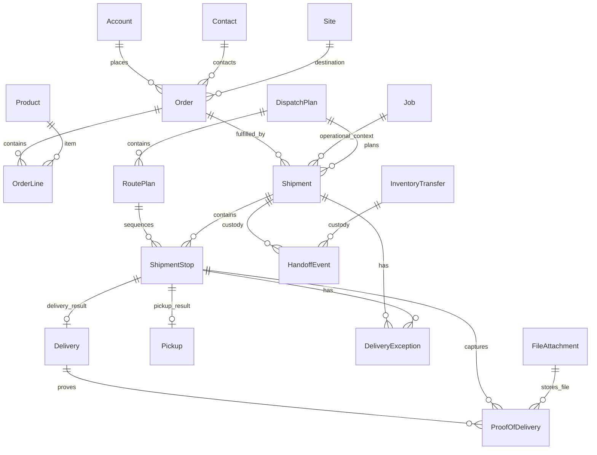
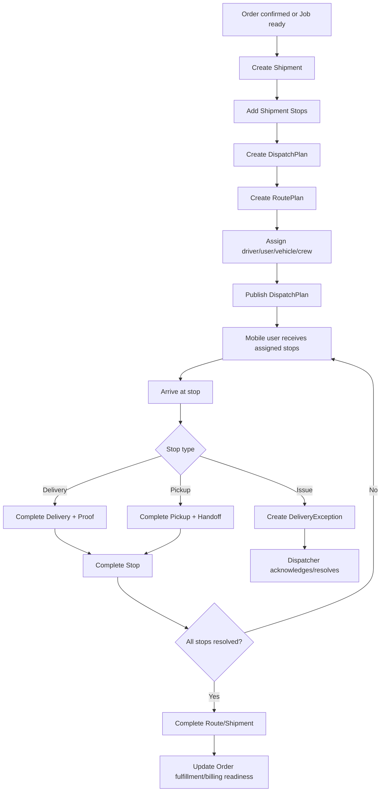

# 09_Orders_Dispatch_Logistics.md

## 1. Document Metadata

| Field | Value |
| --- | --- |
| Document name | `09_Orders_Dispatch_Logistics.md` |
| Phase | Phase 09 |
| Phase name | Orders, Dispatch, and Logistics |
| Document type | Phase-level product, data, workflow, API, UX, permissions, audit, reporting, integration, and implementation specification |
| Status | Production-grade design draft |
| Prepared for | Product, design, engineering, QA, implementation, support, and future phase AI writers |
| Source documents | `00_Master_Platform_Documentation.md`, `00_Global_Documentation_Rules.md`, `00_Global_Domain_Model.md`, `00_Global_Decisions_Register.md`, Phase 01-08 future-phase summaries |
| Last updated | 2026-05-09 |
| Owner module | Orders / Dispatch / Logistics |
| Primary dependencies | Phases 02, 03, 04, 06, 07, and 08 |
| Future phases impacted | Phase 10 Fleet / GPS / Geofencing; Phase 11 Service / Work Orders; Phase 12 Reporting / Analytics; Phase 13 QuickBooks / Integrations; Phase 14 Mobile / Offline; Phase 16 Notifications / Automation; Phase 20 Final Blueprint |

## 2. Phase Purpose

Phase 09 defines the canonical Orders / Dispatch / Logistics foundation for the platform. It connects CRM customer context, field/job context, inventory/warehouse/depot readiness, dispatch planning, route/stops execution, delivery/pickup completion, proof capture, exception handling, and custody handoffs into one consistent operational model.

This phase must create an implementation-ready design for order fulfillment and dispatch without overbuilding advanced route optimization, AI planning, native ELD compliance, customer portals, or full accounting sync. It must establish reliable statuses, events, timestamps, permissions, audit logs, notifications, reporting fields, mobile/offline sync behavior, and integration seams that later phases reuse.

## 3. Phase Goals

- Define canonical Phase 09 entities: `Order`, `OrderLine`, `Shipment`, `ShipmentStop`, `DispatchPlan`, `RoutePlan`, `Delivery`, `Pickup`, `ProofOfDelivery`, `DeliveryException`, and `HandoffEvent`.
- Preserve tenant and company isolation across API, database, UI, search, reporting, export, notifications, webhooks, and offline sync.
- Provide dispatcher workflows for planning, assignment, publication, manual route sequencing, exception management, and completion review.
- Provide mobile execution workflows for assigned stops, arrival/departure, delivery, pickup, proof capture, exception reporting, and handoff capture.
- Connect orders and dispatch to CRM, field work, inventory, warehouse/depot, calendar/tasks, audit, notifications, files, search, saved views, imports, exports, and future integrations.
- Make dispatch/logistics events reportable from day one.
- Establish status and event models that future fleet, service, reporting, QuickBooks, offline mobile, notifications/automation, and final system blueprint phases must reuse.

## 4. Scope

### In Scope

- Orders and order lines.
- Shipments and shipment stops.
- Dispatch plans and route plans.
- Delivery and pickup attempt/completion records.
- Proof of delivery metadata and file/signature/photo linkage.
- Delivery exceptions and resolution workflow.
- Handoff events between warehouse, depot, driver, crew, customer, or other actors/resources.
- Dispatch board and route/stop execution UX.
- Mobile/offline capture for assigned logistics execution.
- Search, filters, saved views, exports, imports where appropriate.
- Permissions, audit events, notifications, reporting, and integration impacts.

### Scope Boundaries

- Phase 09 may reference future `Vehicle` and `Driver` entities but must not fully define Fleet / GPS / Geofencing. In MVP, assignment may use `assigned_user_id` and optional future-compatible `vehicle_id`/`driver_id` references.
- Phase 09 may capture planned and mobile-captured locations but does not implement live GPS ingestion, route replay, geofences, or telemetry.
- Phase 09 may expose QuickBooks readiness fields but does not implement QuickBooks sync.
- Phase 09 may use inventory readiness and handoffs but does not redefine inventory master data or stock movements.

## 5. Non-Goals

- Do not create Phase 10 Fleet / GPS / Geofencing.
- Do not create Phase 11 Service / Work Orders.
- Do not create Phase 12 Reporting / Analytics as a full reporting product; only define required source data and phase-level dashboards.
- Do not implement full route optimization with advanced constraints.
- Do not implement AI-generated dispatch planning.
- Do not implement native ELD compliance.
- Do not implement customer-facing delivery tracking portals.
- Do not replace QuickBooks or implement full accounting sync.
- Do not create duplicate customer, site, job, inventory, file, audit, notification, task, or search systems.
- Do not use custom fields to replace stable fields required for dispatch, reporting, billing readiness, security, or integrations.

## 6. Source-of-Truth Definitions

| Concept | Source-of-truth rule |
| --- | --- |
| Customer/business record | Use CRM `Account`; do not create Customer or Client entities. |
| Person/contact | Use CRM `Contact`; external recipient names may be text fields only when no authenticated/contact record exists. |
| Physical location | Use `Site` from Field Sales / Site Work when the location is a customer or operational site. Use `Warehouse`/`Depot` from Inventory where appropriate. |
| Operational work | Use `Job` from Phase 07 where work exists beyond logistics fulfillment. |
| Product/stock item | Use `Product`, `StockUnit`, `InventoryItem`, `InventoryBalance`, and `StockMovement` from Phase 08. |
| Scheduling/reminders | Use `CalendarEvent`, `Appointment`, `Task`, `Reminder`, and `RecurrenceRule` from Phase 06. |
| Files/photos/signatures | Use `FileAttachment` from Phase 03; `ProofOfDelivery` is metadata/wrapper only. |
| Notifications | Use canonical `Notification` from Phase 03. |
| Audit | Use canonical append-only `AuditLog` from Phase 03. |
| Activity timeline | Use CRM/Core `Activity`, `Note`, and `Comment` patterns where user-facing timeline context is needed; do not use AuditLog as the only timeline UX. |
| Search/saved views | Use `SearchIndexRecord` and `SavedView` from Phase 03. |
| Integrations/webhooks | Use `ApiKey`, `WebhookEndpoint`, `WebhookDelivery`, `ExternalReference`, `ImportJob`, and `ExportJob` foundations. |

## 7. Canonical Entity Definitions

### Order

| Attribute | Definition |
| --- | --- |
| Purpose | Customer or operational order containing product/service lines and delivery commitments. |
| Owner module | Orders / Dispatch / Logistics |
| Scope | Company-scoped, optional branch/depot/site context. Always includes `tenant_id` and `company_id`; optional branch/depot/warehouse/site fields are additive and never replace tenant/company scope. |
| Tenant/company scoping | API, search, reporting, export, notifications, audit, and mobile sync must filter by authenticated `tenant_id` and permitted `company_id`. |
| Key fields | `id, tenant_id, company_id, branch_id, account_id, contact_id, site_id, opportunity_id, job_id, order_number, source_type, requested_delivery_window_start_at, requested_delivery_window_end_at, priority, status, billing_status, fulfillment_status, currency, subtotal_amount, tax_amount, discount_amount, total_amount, notes, external_refs, metadata, created_at, created_by, updated_at, updated_by, archived_at, archived_by`. |
| Relationships | Account, Contact, Site, Opportunity, Job, OrderLine, Shipment, Activity, Task, QuickBooks future invoice link. |
| Lifecycle | Created by authorized office, dispatcher, warehouse, or mobile workflow; transitions only through documented status actions; archived/cancelled records remain reportable where operationally relevant. |
| Statuses | `draft, confirmed, partially_fulfilled, fulfilled, cancelled, archived`. |
| Index considerations | Compound indexes must start with `tenant_id`, `company_id`; include common filters such as `status`, date fields, assignment fields, parent IDs, `order_number`/`shipment_number`, and soft-delete/archive fields where applicable. |
| Permissions impact | Requires entity-specific view/create/update/transition/export permissions plus module enablement. Mobile users may execute assigned stop actions through constrained permissions. |
| Audit requirements | Create, update, assignment, status transition, resequence, proof, exception, cancellation, archive, export, and override actions must write `AuditLog`; append-only event records must not be edited destructively. |
| Reporting impact | Status, planned/actual timestamps, assignment IDs, account/site/depot/warehouse IDs, exception fields, and proof fields are reporting dimensions. Free-text notes must not be the only source for metrics. |
| Future-phase impact | Fleet, service, reporting, QuickBooks, mobile/offline, notifications/automation, and final blueprint phases must reuse this entity and status/event model. |

### OrderLine

| Attribute | Definition |
| --- | --- |
| Purpose | Line item within an Order for products, services, fees, or operational deliverables. |
| Owner module | Orders / Dispatch / Logistics |
| Scope | Child of Order; company-scoped through Order. Always includes `tenant_id` and `company_id`; optional branch/depot/warehouse/site fields are additive and never replace tenant/company scope. |
| Tenant/company scoping | API, search, reporting, export, notifications, audit, and mobile sync must filter by authenticated `tenant_id` and permitted `company_id`. |
| Key fields | `id, tenant_id, company_id, order_id, product_id, line_type, description, qty, stock_unit_id, unit_price, discount_amount, tax_code, line_total, status, allocated_qty, fulfilled_qty, warehouse_id, depot_id, metadata, created_at, created_by, updated_at, updated_by`. |
| Relationships | Order, Product, StockUnit, Warehouse, Depot, StockMovement, InventoryBalance. |
| Lifecycle | Created by authorized office, dispatcher, warehouse, or mobile workflow; transitions only through documented status actions; archived/cancelled records remain reportable where operationally relevant. |
| Statuses | `open, allocated, fulfilled, cancelled`. |
| Index considerations | Compound indexes must start with `tenant_id`, `company_id`; include common filters such as `status`, date fields, assignment fields, parent IDs, `order_number`/`shipment_number`, and soft-delete/archive fields where applicable. |
| Permissions impact | Requires entity-specific view/create/update/transition/export permissions plus module enablement. Mobile users may execute assigned stop actions through constrained permissions. |
| Audit requirements | Create, update, assignment, status transition, resequence, proof, exception, cancellation, archive, export, and override actions must write `AuditLog`; append-only event records must not be edited destructively. |
| Reporting impact | Status, planned/actual timestamps, assignment IDs, account/site/depot/warehouse IDs, exception fields, and proof fields are reporting dimensions. Free-text notes must not be the only source for metrics. |
| Future-phase impact | Fleet, service, reporting, QuickBooks, mobile/offline, notifications/automation, and final blueprint phases must reuse this entity and status/event model. |

### Shipment

| Attribute | Definition |
| --- | --- |
| Purpose | Movement of goods, materials, equipment, or work output across one or more stops. |
| Owner module | Orders / Dispatch / Logistics |
| Scope | Company-scoped, optional depot/warehouse/route context. Always includes `tenant_id` and `company_id`; optional branch/depot/warehouse/site fields are additive and never replace tenant/company scope. |
| Tenant/company scoping | API, search, reporting, export, notifications, audit, and mobile sync must filter by authenticated `tenant_id` and permitted `company_id`. |
| Key fields | `id, tenant_id, company_id, order_id, job_id, dispatch_plan_id, route_plan_id, shipment_number, origin_site_id, destination_site_id, warehouse_id, depot_id, status, planned_start_at, planned_end_at, actual_start_at, actual_end_at, assigned_driver_id, assigned_user_id, vehicle_id, crew_id, priority, exception_count, proof_required, notes, created_at, created_by, updated_at, updated_by`. |
| Relationships | Order, Job, DispatchPlan, RoutePlan, ShipmentStop, Warehouse, Depot, Vehicle, Driver, Crew, DeliveryException. |
| Lifecycle | Created by authorized office, dispatcher, warehouse, or mobile workflow; transitions only through documented status actions; archived/cancelled records remain reportable where operationally relevant. |
| Statuses | `planned, assigned, in_transit, delivered, exception, cancelled`. |
| Index considerations | Compound indexes must start with `tenant_id`, `company_id`; include common filters such as `status`, date fields, assignment fields, parent IDs, `order_number`/`shipment_number`, and soft-delete/archive fields where applicable. |
| Permissions impact | Requires entity-specific view/create/update/transition/export permissions plus module enablement. Mobile users may execute assigned stop actions through constrained permissions. |
| Audit requirements | Create, update, assignment, status transition, resequence, proof, exception, cancellation, archive, export, and override actions must write `AuditLog`; append-only event records must not be edited destructively. |
| Reporting impact | Status, planned/actual timestamps, assignment IDs, account/site/depot/warehouse IDs, exception fields, and proof fields are reporting dimensions. Free-text notes must not be the only source for metrics. |
| Future-phase impact | Fleet, service, reporting, QuickBooks, mobile/offline, notifications/automation, and final blueprint phases must reuse this entity and status/event model. |

### ShipmentStop

| Attribute | Definition |
| --- | --- |
| Purpose | Ordered pickup, delivery, service, warehouse, depot, or handoff stop within a Shipment. |
| Owner module | Orders / Dispatch / Logistics |
| Scope | Child of Shipment; company-scoped through Shipment. Always includes `tenant_id` and `company_id`; optional branch/depot/warehouse/site fields are additive and never replace tenant/company scope. |
| Tenant/company scoping | API, search, reporting, export, notifications, audit, and mobile sync must filter by authenticated `tenant_id` and permitted `company_id`. |
| Key fields | `id, tenant_id, company_id, shipment_id, route_plan_id, site_id, warehouse_id, depot_id, account_id, contact_id, stop_sequence, stop_type, status, planned_arrival_at, planned_departure_at, actual_arrival_at, actual_departure_at, service_window_start_at, service_window_end_at, arrival_latitude, arrival_longitude, completion_latitude, completion_longitude, instructions, proof_required, exception_id, created_at, created_by, updated_at, updated_by`. |
| Relationships | Shipment, RoutePlan, Site, Warehouse, Depot, Account, Contact, Delivery, Pickup, ProofOfDelivery, DeliveryException, HandoffEvent. |
| Lifecycle | Created by authorized office, dispatcher, warehouse, or mobile workflow; transitions only through documented status actions; archived/cancelled records remain reportable where operationally relevant. |
| Statuses | `planned, arrived, completed, skipped, exception`. |
| Index considerations | Compound indexes must start with `tenant_id`, `company_id`; include common filters such as `status`, date fields, assignment fields, parent IDs, `order_number`/`shipment_number`, and soft-delete/archive fields where applicable. |
| Permissions impact | Requires entity-specific view/create/update/transition/export permissions plus module enablement. Mobile users may execute assigned stop actions through constrained permissions. |
| Audit requirements | Create, update, assignment, status transition, resequence, proof, exception, cancellation, archive, export, and override actions must write `AuditLog`; append-only event records must not be edited destructively. |
| Reporting impact | Status, planned/actual timestamps, assignment IDs, account/site/depot/warehouse IDs, exception fields, and proof fields are reporting dimensions. Free-text notes must not be the only source for metrics. |
| Future-phase impact | Fleet, service, reporting, QuickBooks, mobile/offline, notifications/automation, and final blueprint phases must reuse this entity and status/event model. |

### DispatchPlan

| Attribute | Definition |
| --- | --- |
| Purpose | Dispatcher-controlled plan connecting jobs, shipments, route plans, drivers, vehicles, crews, and stops. |
| Owner module | Orders / Dispatch / Logistics |
| Scope | Company-scoped, optional branch/depot context. Always includes `tenant_id` and `company_id`; optional branch/depot/warehouse/site fields are additive and never replace tenant/company scope. |
| Tenant/company scoping | API, search, reporting, export, notifications, audit, and mobile sync must filter by authenticated `tenant_id` and permitted `company_id`. |
| Key fields | `id, tenant_id, company_id, branch_id, depot_id, plan_date, plan_name, status, dispatcher_user_id, assigned_team_id, shipment_ids, route_plan_ids, job_ids, notes, published_at, started_at, completed_at, cancelled_at, created_at, created_by, updated_at, updated_by`. |
| Relationships | Shipment, RoutePlan, Job, Crew, Vehicle, Driver, Depot, CalendarEvent, Task. |
| Lifecycle | Created by authorized office, dispatcher, warehouse, or mobile workflow; transitions only through documented status actions; archived/cancelled records remain reportable where operationally relevant. |
| Statuses | `draft, assigned, in_progress, completed, exception, cancelled`. |
| Index considerations | Compound indexes must start with `tenant_id`, `company_id`; include common filters such as `status`, date fields, assignment fields, parent IDs, `order_number`/`shipment_number`, and soft-delete/archive fields where applicable. |
| Permissions impact | Requires entity-specific view/create/update/transition/export permissions plus module enablement. Mobile users may execute assigned stop actions through constrained permissions. |
| Audit requirements | Create, update, assignment, status transition, resequence, proof, exception, cancellation, archive, export, and override actions must write `AuditLog`; append-only event records must not be edited destructively. |
| Reporting impact | Status, planned/actual timestamps, assignment IDs, account/site/depot/warehouse IDs, exception fields, and proof fields are reporting dimensions. Free-text notes must not be the only source for metrics. |
| Future-phase impact | Fleet, service, reporting, QuickBooks, mobile/offline, notifications/automation, and final blueprint phases must reuse this entity and status/event model. |

### RoutePlan

| Attribute | Definition |
| --- | --- |
| Purpose | Ordered route for a driver/vehicle/resource with planned and actual stop sequence. |
| Owner module | Orders / Dispatch / Logistics |
| Scope | Company-scoped, optional depot/vehicle/driver context. Always includes `tenant_id` and `company_id`; optional branch/depot/warehouse/site fields are additive and never replace tenant/company scope. |
| Tenant/company scoping | API, search, reporting, export, notifications, audit, and mobile sync must filter by authenticated `tenant_id` and permitted `company_id`. |
| Key fields | `id, tenant_id, company_id, dispatch_plan_id, vehicle_id, driver_id, assigned_user_id, depot_id, planned_start_at, planned_end_at, actual_start_at, actual_end_at, planned_distance, planned_duration_minutes, actual_distance, actual_duration_minutes, status, route_sequence_snapshot, manual_sequence_reason, created_at, created_by, updated_at, updated_by`. |
| Relationships | DispatchPlan, ShipmentStop, Vehicle, Driver, LocationPing future, GeofenceEvent future, RouteReplay future. |
| Lifecycle | Created by authorized office, dispatcher, warehouse, or mobile workflow; transitions only through documented status actions; archived/cancelled records remain reportable where operationally relevant. |
| Statuses | `draft, assigned, in_progress, completed, cancelled`. |
| Index considerations | Compound indexes must start with `tenant_id`, `company_id`; include common filters such as `status`, date fields, assignment fields, parent IDs, `order_number`/`shipment_number`, and soft-delete/archive fields where applicable. |
| Permissions impact | Requires entity-specific view/create/update/transition/export permissions plus module enablement. Mobile users may execute assigned stop actions through constrained permissions. |
| Audit requirements | Create, update, assignment, status transition, resequence, proof, exception, cancellation, archive, export, and override actions must write `AuditLog`; append-only event records must not be edited destructively. |
| Reporting impact | Status, planned/actual timestamps, assignment IDs, account/site/depot/warehouse IDs, exception fields, and proof fields are reporting dimensions. Free-text notes must not be the only source for metrics. |
| Future-phase impact | Fleet, service, reporting, QuickBooks, mobile/offline, notifications/automation, and final blueprint phases must reuse this entity and status/event model. |

### Delivery

| Attribute | Definition |
| --- | --- |
| Purpose | Completion record proving a delivery attempt or successful delivery for a stop or order. |
| Owner module | Orders / Dispatch / Logistics |
| Scope | Company-scoped child of ShipmentStop and optional Order. Always includes `tenant_id` and `company_id`; optional branch/depot/warehouse/site fields are additive and never replace tenant/company scope. |
| Tenant/company scoping | API, search, reporting, export, notifications, audit, and mobile sync must filter by authenticated `tenant_id` and permitted `company_id`. |
| Key fields | `id, tenant_id, company_id, shipment_stop_id, order_id, shipment_id, status, delivered_at, delivered_by_user_id, received_by_name, received_by_contact_id, delivery_notes, proof_of_delivery_ids, failed_reason, exception_id, created_at, created_by, updated_at, updated_by`. |
| Relationships | ShipmentStop, Shipment, Order, ProofOfDelivery, DeliveryException, FileAttachment. |
| Lifecycle | Created by authorized office, dispatcher, warehouse, or mobile workflow; transitions only through documented status actions; archived/cancelled records remain reportable where operationally relevant. |
| Statuses | `pending, delivered, failed, exception`. |
| Index considerations | Compound indexes must start with `tenant_id`, `company_id`; include common filters such as `status`, date fields, assignment fields, parent IDs, `order_number`/`shipment_number`, and soft-delete/archive fields where applicable. |
| Permissions impact | Requires entity-specific view/create/update/transition/export permissions plus module enablement. Mobile users may execute assigned stop actions through constrained permissions. |
| Audit requirements | Create, update, assignment, status transition, resequence, proof, exception, cancellation, archive, export, and override actions must write `AuditLog`; append-only event records must not be edited destructively. |
| Reporting impact | Status, planned/actual timestamps, assignment IDs, account/site/depot/warehouse IDs, exception fields, and proof fields are reporting dimensions. Free-text notes must not be the only source for metrics. |
| Future-phase impact | Fleet, service, reporting, QuickBooks, mobile/offline, notifications/automation, and final blueprint phases must reuse this entity and status/event model. |

### Pickup

| Attribute | Definition |
| --- | --- |
| Purpose | Completion record proving pickup of goods, inventory, equipment, documents, or returns. |
| Owner module | Orders / Dispatch / Logistics |
| Scope | Company-scoped child of ShipmentStop and optional InventoryTransfer. Always includes `tenant_id` and `company_id`; optional branch/depot/warehouse/site fields are additive and never replace tenant/company scope. |
| Tenant/company scoping | API, search, reporting, export, notifications, audit, and mobile sync must filter by authenticated `tenant_id` and permitted `company_id`. |
| Key fields | `id, tenant_id, company_id, shipment_stop_id, shipment_id, inventory_transfer_id, status, picked_up_at, picked_up_by_user_id, released_by_name, pickup_notes, proof_required, exception_id, created_at, created_by, updated_at, updated_by`. |
| Relationships | ShipmentStop, Shipment, InventoryTransfer, HandoffEvent, DeliveryException, FileAttachment. |
| Lifecycle | Created by authorized office, dispatcher, warehouse, or mobile workflow; transitions only through documented status actions; archived/cancelled records remain reportable where operationally relevant. |
| Statuses | `pending, picked_up, failed, exception`. |
| Index considerations | Compound indexes must start with `tenant_id`, `company_id`; include common filters such as `status`, date fields, assignment fields, parent IDs, `order_number`/`shipment_number`, and soft-delete/archive fields where applicable. |
| Permissions impact | Requires entity-specific view/create/update/transition/export permissions plus module enablement. Mobile users may execute assigned stop actions through constrained permissions. |
| Audit requirements | Create, update, assignment, status transition, resequence, proof, exception, cancellation, archive, export, and override actions must write `AuditLog`; append-only event records must not be edited destructively. |
| Reporting impact | Status, planned/actual timestamps, assignment IDs, account/site/depot/warehouse IDs, exception fields, and proof fields are reporting dimensions. Free-text notes must not be the only source for metrics. |
| Future-phase impact | Fleet, service, reporting, QuickBooks, mobile/offline, notifications/automation, and final blueprint phases must reuse this entity and status/event model. |

### ProofOfDelivery

| Attribute | Definition |
| --- | --- |
| Purpose | Proof artifact such as signature, photo, name, GPS, timestamp, notes, and file attachment. |
| Owner module | Orders / Dispatch / Logistics |
| Scope | Company-scoped child of Delivery or ShipmentStop. Always includes `tenant_id` and `company_id`; optional branch/depot/warehouse/site fields are additive and never replace tenant/company scope. |
| Tenant/company scoping | API, search, reporting, export, notifications, audit, and mobile sync must filter by authenticated `tenant_id` and permitted `company_id`. |
| Key fields | `id, tenant_id, company_id, delivery_id, shipment_stop_id, proof_type, file_attachment_id, signed_by, signature_file_attachment_id, photo_file_attachment_ids, captured_at, captured_by_user_id, capture_latitude, capture_longitude, device_id, status, rejection_reason, created_at, created_by, updated_at, updated_by`. |
| Relationships | Delivery, ShipmentStop, FileAttachment, User, Device future, DeliveryException. |
| Lifecycle | Created by authorized office, dispatcher, warehouse, or mobile workflow; transitions only through documented status actions; archived/cancelled records remain reportable where operationally relevant. |
| Statuses | `captured, accepted, rejected, archived`. |
| Index considerations | Compound indexes must start with `tenant_id`, `company_id`; include common filters such as `status`, date fields, assignment fields, parent IDs, `order_number`/`shipment_number`, and soft-delete/archive fields where applicable. |
| Permissions impact | Requires entity-specific view/create/update/transition/export permissions plus module enablement. Mobile users may execute assigned stop actions through constrained permissions. |
| Audit requirements | Create, update, assignment, status transition, resequence, proof, exception, cancellation, archive, export, and override actions must write `AuditLog`; append-only event records must not be edited destructively. |
| Reporting impact | Status, planned/actual timestamps, assignment IDs, account/site/depot/warehouse IDs, exception fields, and proof fields are reporting dimensions. Free-text notes must not be the only source for metrics. |
| Future-phase impact | Fleet, service, reporting, QuickBooks, mobile/offline, notifications/automation, and final blueprint phases must reuse this entity and status/event model. |

### DeliveryException

| Attribute | Definition |
| --- | --- |
| Purpose | Operational exception affecting delivery, pickup, route, shipment, stop, or customer promise. |
| Owner module | Orders / Dispatch / Logistics |
| Scope | Company-scoped event/current issue record. Always includes `tenant_id` and `company_id`; optional branch/depot/warehouse/site fields are additive and never replace tenant/company scope. |
| Tenant/company scoping | API, search, reporting, export, notifications, audit, and mobile sync must filter by authenticated `tenant_id` and permitted `company_id`. |
| Key fields | `id, tenant_id, company_id, shipment_id, shipment_stop_id, delivery_id, pickup_id, route_plan_id, dispatch_plan_id, exception_type, severity, status, description, occurred_at, reported_by_user_id, acknowledged_at, acknowledged_by_user_id, resolved_at, resolved_by_user_id, resolution_notes, notification_ids, created_at, created_by, updated_at, updated_by`. |
| Relationships | Shipment, ShipmentStop, RoutePlan, DispatchPlan, Delivery, Pickup, Notification, Task. |
| Lifecycle | Created by authorized office, dispatcher, warehouse, or mobile workflow; transitions only through documented status actions; archived/cancelled records remain reportable where operationally relevant. |
| Statuses | `open, acknowledged, resolved, cancelled`. |
| Index considerations | Compound indexes must start with `tenant_id`, `company_id`; include common filters such as `status`, date fields, assignment fields, parent IDs, `order_number`/`shipment_number`, and soft-delete/archive fields where applicable. |
| Permissions impact | Requires entity-specific view/create/update/transition/export permissions plus module enablement. Mobile users may execute assigned stop actions through constrained permissions. |
| Audit requirements | Create, update, assignment, status transition, resequence, proof, exception, cancellation, archive, export, and override actions must write `AuditLog`; append-only event records must not be edited destructively. |
| Reporting impact | Status, planned/actual timestamps, assignment IDs, account/site/depot/warehouse IDs, exception fields, and proof fields are reporting dimensions. Free-text notes must not be the only source for metrics. |
| Future-phase impact | Fleet, service, reporting, QuickBooks, mobile/offline, notifications/automation, and final blueprint phases must reuse this entity and status/event model. |

### HandoffEvent

| Attribute | Definition |
| --- | --- |
| Purpose | Append-only custody handoff between warehouse, depot, driver, crew, customer, or other actor. |
| Owner module | Orders / Dispatch / Logistics |
| Scope | Company-scoped append-only operational event. Always includes `tenant_id` and `company_id`; optional branch/depot/warehouse/site fields are additive and never replace tenant/company scope. |
| Tenant/company scoping | API, search, reporting, export, notifications, audit, and mobile sync must filter by authenticated `tenant_id` and permitted `company_id`. |
| Key fields | `id, tenant_id, company_id, shipment_id, shipment_stop_id, inventory_transfer_id, stock_movement_id, vehicle_id, from_actor_type, from_actor_id, to_actor_type, to_actor_id, handoff_type, entity_type, entity_id, occurred_at, recorded_by_user_id, latitude, longitude, file_attachment_ids, notes, status, created_at, created_by`. |
| Relationships | Shipment, ShipmentStop, InventoryTransfer, StockMovement, Vehicle, User, Crew, Warehouse, Depot, Customer contact context. |
| Lifecycle | Created by authorized office, dispatcher, warehouse, or mobile workflow; transitions only through documented status actions; archived/cancelled records remain reportable where operationally relevant. |
| Statuses | `recorded`. |
| Index considerations | Compound indexes must start with `tenant_id`, `company_id`; include common filters such as `status`, date fields, assignment fields, parent IDs, `order_number`/`shipment_number`, and soft-delete/archive fields where applicable. |
| Permissions impact | Requires entity-specific view/create/update/transition/export permissions plus module enablement. Mobile users may execute assigned stop actions through constrained permissions. |
| Audit requirements | Create, update, assignment, status transition, resequence, proof, exception, cancellation, archive, export, and override actions must write `AuditLog`; append-only event records must not be edited destructively. |
| Reporting impact | Status, planned/actual timestamps, assignment IDs, account/site/depot/warehouse IDs, exception fields, and proof fields are reporting dimensions. Free-text notes must not be the only source for metrics. |
| Future-phase impact | Fleet, service, reporting, QuickBooks, mobile/offline, notifications/automation, and final blueprint phases must reuse this entity and status/event model. |

## 8. Entity Lifecycle and Status Rules

### Status Models

| Entity | Statuses | Rules |
| --- | --- | --- |
| `Order` | `draft`, `confirmed`, `partially_fulfilled`, `fulfilled`, `cancelled`, `archived` | Draft can be edited. Confirmed can generate shipments/picks. Fulfilled requires completion evidence or configured override. Cancelled requires reason. Archived is not deletion. |
| `OrderLine` | `open`, `allocated`, `fulfilled`, `cancelled` | Fulfilled quantity may be partial; cancelled lines are excluded from active totals but retained for audit/reporting. |
| `Shipment` | `planned`, `assigned`, `in_transit`, `delivered`, `exception`, `cancelled` | Cannot complete until required active stops are completed/skipped with valid reasons and required proof is present. |
| `ShipmentStop` | `planned`, `arrived`, `completed`, `skipped`, `exception` | Arrival/departure/completion timestamps must be captured. Skipped requires reason or exception. |
| `DispatchPlan` | `draft`, `assigned`, `in_progress`, `completed`, `exception`, `cancelled` | Published/assigned plans notify assigned users. Completed plans require all active routes/shipments resolved. |
| `RoutePlan` | `draft`, `assigned`, `in_progress`, `completed`, `cancelled` | Manual resequencing requires permission and reason. Live tracking is future. |
| `Delivery` | `pending`, `delivered`, `failed`, `exception` | Delivered requires required proof unless override permission is used. Failed should create or link exception. |
| `Pickup` | `pending`, `picked_up`, `failed`, `exception` | Picked up may create handoff and inventory transfer context. Failed should create or link exception. |
| `ProofOfDelivery` | `captured`, `accepted`, `rejected`, `archived` | Rejection requires reason and may reopen delivery/exception workflows. |
| `DeliveryException` | `open`, `acknowledged`, `resolved`, `cancelled` | Open exceptions must be visible on affected order/shipment/route/stop. Resolution requires notes. |
| `HandoffEvent` | `recorded` | Append-only. Corrections are additional events. |

### Cross-Entity Lifecycle Rules

1. Confirming an `Order` may enable shipment planning but does not automatically allocate inventory unless explicitly configured.
2. A `Shipment` may exist without a `RoutePlan` during early planning but cannot be assigned for execution without enough assignment context.
3. `ShipmentStop` sequence is authoritative for stop order inside a shipment/route. Resequencing must be audited.
4. `Delivery` and `Pickup` are completion/attempt records and do not replace `ShipmentStop` status.
5. `ProofOfDelivery` must be linked to the delivery/stop context and must not store binary file content directly.
6. Exceptions may affect one or more records; the primary affected record must be explicit.
7. Handoffs must not be deleted when shipment/order states change.
8. Billing readiness must remain separate from operational fulfillment until QuickBooks/integration rules are finalized.

## 9. Entity Relationship Rules

### Relationship Rules

- Child records inherit tenant/company visibility from parents but must still store `tenant_id` and `company_id` for query safety.
- `OrderLine.product_id` is required only when line type maps to a canonical `Product`; service/freeform lines must still be structured and reportable.
- `ShipmentStop.site_id`, `warehouse_id`, or `depot_id` must identify stop context when applicable; do not create new `StopLocation` entity for MVP.
- `RoutePlan.vehicle_id` and `driver_id` are future-compatible references. Until Phase 10 finalizes Fleet/Driver, use `assigned_user_id` for authenticated executor behavior.
- `ProofOfDelivery.file_attachment_id` and photo/signature fields must reference `FileAttachment` records.
- `DeliveryException.notification_ids` may reference generated notifications but notifications are not the exception source of truth.
- `HandoffEvent.stock_movement_id` may link inventory movement evidence but does not replace `StockMovement`.

## 10. Workflow Requirements

### Primary Dispatch Workflow

### Workflow Rules

- Dispatchers can create plans from confirmed orders, jobs, shipment requests, or manual operational needs.
- Warehouse readiness must be visible when shipments depend on inventory picking/packing/loading.
- Drivers/mobile users should only see assigned work unless given broader dispatch permissions.
- Stop completion must capture enough evidence for customer trust, dispute resolution, reporting, and future billing readiness.
- Exceptions must be structured, not only notes.
- Handoff capture must be simple enough for warehouse/driver mobile execution.
- Dispatcher overrides must be rare, permissioned, reasoned, and audited.

## 11. Data Model Requirements

| Requirement | Rule |
| --- | --- |
| Scoping | Every Phase 09 collection must include `tenant_id` and `company_id`. Optional `branch_id`, `depot_id`, `warehouse_id`, and `site_id` are additive. |
| IDs | Use stable opaque application IDs. Never expose MongoDB `_id`. |
| Timestamps | Store timezone-aware datetime values. Use `_at` for datetimes and `_date` for local operational dates. |
| Statuses | Use documented status enums only. Future phases may extend through approved decisions. |
| Events | `HandoffEvent` is append-only. High-impact state changes produce `AuditLog`. |
| Files | Store proof files/photos/signatures in `FileAttachment`; Phase 09 entities store references. |
| Denormalization | Current rollups such as `exception_count`, fulfillment status, and dispatch board counts may be materialized but must be rebuildable from source records/events. |
| Indexing | Compound indexes start with `tenant_id`, `company_id`; include status/date/assignment/parent fields used by common queries. |
| Soft delete/archive | Use archive/cancel states where operational history matters. Avoid hard delete except for allowed draft records and retention/legal workflows. |
| External refs | Store provider IDs in `external_refs` or approved link entities. |

### Index Recommendations

- `orders`: `(tenant_id, company_id, status, requested_delivery_window_start_at)`, `(tenant_id, company_id, order_number)`, `(tenant_id, company_id, account_id, status)`, `(tenant_id, company_id, billing_status, fulfillment_status)`.
- `order_lines`: `(tenant_id, company_id, order_id)`, `(tenant_id, company_id, product_id, status)`.
- `shipments`: `(tenant_id, company_id, status, planned_start_at)`, `(tenant_id, company_id, dispatch_plan_id)`, `(tenant_id, company_id, route_plan_id)`, `(tenant_id, company_id, assigned_user_id, status)`.
- `shipment_stops`: `(tenant_id, company_id, shipment_id, stop_sequence)`, `(tenant_id, company_id, route_plan_id, stop_sequence)`, `(tenant_id, company_id, status, planned_arrival_at)`, `(tenant_id, company_id, site_id)`.
- `dispatch_plans`: `(tenant_id, company_id, plan_date, status)`, `(tenant_id, company_id, dispatcher_user_id, plan_date)`.
- `route_plans`: `(tenant_id, company_id, status, planned_start_at)`, `(tenant_id, company_id, assigned_user_id, status)`, `(tenant_id, company_id, vehicle_id, planned_start_at)`.
- `delivery_exceptions`: `(tenant_id, company_id, status, severity, occurred_at)`, `(tenant_id, company_id, exception_type, occurred_at)`, parent record indexes.
- `handoff_events`: `(tenant_id, company_id, shipment_id, occurred_at)`, `(tenant_id, company_id, entity_type, entity_id, occurred_at)`.

## 12. API Requirements

| ID | Endpoint | Method | Permission | Purpose |
| --- | --- | --- | --- | --- |
| API-09-001 | /api/v1/orders | GET | orders.order.view | List orders with filters, saved views, pagination, sorting, and permission scoping. |
| API-09-002 | /api/v1/orders | POST | orders.order.create | Create an order with header and optional first lines. |
| API-09-003 | /api/v1/orders/{order_id} | GET | orders.order.view | Read order detail with lines, shipments, timeline, files, exceptions, and audit summary. |
| API-09-004 | /api/v1/orders/{order_id} | PATCH | orders.order.update | Update editable order fields before locked workflow states. |
| API-09-005 | /api/v1/orders/{order_id}/confirm | POST | orders.order.confirm | Confirm an order after validation. |
| API-09-006 | /api/v1/orders/{order_id}/cancel | POST | orders.order.cancel | Cancel an order with reason and downstream validation. |
| API-09-007 | /api/v1/orders/{order_id}/archive | POST | orders.order.archive | Archive an order without deleting historical records. |
| API-09-008 | /api/v1/orders/{order_id}/lines | POST | orders.order_line.manage | Create order line. |
| API-09-009 | /api/v1/orders/{order_id}/lines/{order_line_id} | PATCH | orders.order_line.manage | Update order line fields and quantities. |
| API-09-010 | /api/v1/orders/{order_id}/lines/{order_line_id}/cancel | POST | orders.order_line.cancel | Cancel order line with reason. |
| API-09-011 | /api/v1/shipments | GET | orders.shipment.view | List shipments. |
| API-09-012 | /api/v1/shipments | POST | orders.shipment.create | Create shipment. |
| API-09-013 | /api/v1/shipments/{shipment_id} | GET | orders.shipment.view | Read shipment detail. |
| API-09-014 | /api/v1/shipments/{shipment_id} | PATCH | orders.shipment.update | Update shipment. |
| API-09-015 | /api/v1/shipments/{shipment_id}/assign | POST | orders.shipment.assign | Assign shipment to route/user/vehicle/crew. |
| API-09-016 | /api/v1/shipments/{shipment_id}/start | POST | orders.shipment.start | Start shipment. |
| API-09-017 | /api/v1/shipments/{shipment_id}/complete | POST | orders.shipment.complete | Complete shipment after stops complete. |
| API-09-018 | /api/v1/shipments/{shipment_id}/stops | POST | orders.shipment_stop.manage | Create shipment stop. |
| API-09-019 | /api/v1/shipments/{shipment_id}/stops/resequence | POST | orders.shipment_stop.resequence | Resequence stops with reason. |
| API-09-020 | /api/v1/shipments/{shipment_id}/stops/{stop_id}/arrive | POST | orders.shipment_stop.arrive | Record arrival. |
| API-09-021 | /api/v1/shipments/{shipment_id}/stops/{stop_id}/depart | POST | orders.shipment_stop.complete | Record departure. |
| API-09-022 | /api/v1/shipments/{shipment_id}/stops/{stop_id}/complete | POST | orders.shipment_stop.complete | Complete stop. |
| API-09-023 | /api/v1/dispatch-plans | GET | orders.dispatch_plan.view | List dispatch plans by date/status/depot/dispatcher. |
| API-09-024 | /api/v1/dispatch-plans | POST | orders.dispatch_plan.create | Create dispatch plan. |
| API-09-025 | /api/v1/dispatch-plans/{dispatch_plan_id}/publish | POST | orders.dispatch_plan.publish | Publish plan and notify assigned users. |
| API-09-026 | /api/v1/route-plans | POST | orders.route_plan.create | Create route plan. |
| API-09-027 | /api/v1/route-plans/{route_plan_id}/resequence | POST | orders.route_plan.resequence | Resequence route stops. |
| API-09-028 | /api/v1/deliveries | POST | orders.delivery.complete | Create delivery completion or attempt record. |
| API-09-029 | /api/v1/pickups | POST | orders.pickup.complete | Create pickup completion or attempt record. |
| API-09-030 | /api/v1/proofs-of-delivery | POST | orders.proof.capture | Capture proof of delivery metadata and file links. |
| API-09-031 | /api/v1/proofs-of-delivery/{proof_id}/accept | POST | orders.proof.accept | Accept proof. |
| API-09-032 | /api/v1/proofs-of-delivery/{proof_id}/reject | POST | orders.proof.reject | Reject proof with reason. |
| API-09-033 | /api/v1/delivery-exceptions | POST | orders.exception.create | Create delivery/route/stop exception. |
| API-09-034 | /api/v1/delivery-exceptions/{exception_id}/acknowledge | POST | orders.exception.acknowledge | Acknowledge exception. |
| API-09-035 | /api/v1/delivery-exceptions/{exception_id}/resolve | POST | orders.exception.resolve | Resolve exception. |
| API-09-036 | /api/v1/handoff-events | POST | orders.handoff.record | Record append-only handoff event. |
| API-09-037 | /api/v1/dispatch-board | GET | orders.dispatch_board.view | Fetch dispatch board grouped operational state. |
| API-09-038 | /api/v1/mobile/assigned-stops | GET | orders.mobile.execute_assigned | Fetch mobile assigned stop list and sync metadata. |
| API-09-039 | /api/v1/mobile/stop-actions | POST | orders.mobile.execute_assigned | Submit offline-capable mobile stop action batch. |

### API Behavior Rules

- Every endpoint must enforce tenant/company scope and module access before evaluating record access.
- Every state-transition endpoint must validate current status, actor permissions, required fields, and downstream effects.
- Bulk endpoints must return per-record success/failure summaries.
- Mobile batch action APIs must support idempotency keys and conflict responses.
- All APIs must return stable application IDs and never MongoDB `_id`.
- API errors must be structured with machine-readable codes, human-readable messages, and field-level validation where applicable.
- Long-running import/export/recalculation actions must use `BackgroundJob`, `ImportJob`, or `ExportJob`.

## 13. UI / UX Requirements

| ID | Area | Requirement |
| --- | --- | --- |
| UX-09-001 | Dispatch Board | Show lanes for unassigned, assigned, in progress, delayed, completed, exception, and cancelled work with drag/drop only where safe and permissioned. |
| UX-09-002 | Dispatch Plan Detail | Show plan date, dispatcher, depot/branch, route plans, shipments, jobs, crews, notes, publication state, and audit summary. |
| UX-09-003 | Route Builder | Show ordered stops, planned windows, service instructions, route warnings, manual resequence, and validation errors. |
| UX-09-004 | Order List | Table/kanban-style saved views with filters for status, fulfillment, billing, account, site, delivery window, owner, and archived state. |
| UX-09-005 | Order Detail | Header with status/priority/billing readiness; tabs for lines, shipments, timeline, files, exceptions, audit, and related records. |
| UX-09-006 | Shipment Detail | Show stop list/timeline, assigned resources, related order/job, proof, exceptions, handoffs, and inventory context. |
| UX-09-007 | Mobile Assigned Stops | Driver/field user list with today/upcoming/overdue groupings, offline badges, and next action buttons. |
| UX-09-008 | Mobile Stop Execution | One-handed flow for arrive, depart, complete delivery, complete pickup, capture proof, report exception, add note. |
| UX-09-009 | Proof Capture | Support signature, photo, received-by name, timestamp/GPS display, retry upload, and offline pending state. |
| UX-09-010 | Exception Drawer | Structured type/severity/description/resolution form with visible notification and task follow-up options. |
| UX-09-011 | Handoff Capture | Show from/to actor/resource, related shipment/transfer, optional proof, timestamp/location, and read-only completed state. |
| UX-09-012 | Empty States | Explain how to create first order, dispatch plan, shipment, route, or stop and what permission is needed if action hidden. |
| UX-09-013 | Error States | Show validation errors, missing relationships, inventory unavailable, permission denied, sync failed, and stale assignment states. |
| UX-09-014 | Permission Behavior | Disable or hide unsafe actions; display clear permission-denied message for direct URL/API failures. |
| UX-09-015 | Bulk Actions | Allow bulk publish/assign/export only after validation preview and permission check. |
| UX-09-016 | Timeline Pattern | Use shared timeline with Activity, operational events, proof, exceptions, and audit summary without exposing restricted data. |
| UX-09-017 | Saved Views | Support personal/team/shared saved views for dispatch board, orders, shipments, stops, routes, exceptions, proofs, handoffs. |
| UX-09-018 | Map Placeholder | Where map UI appears before Phase 10, label location data as planned/entered/mobile-captured, not live GPS tracking. |

## 14. Search, Filters, and Saved Views

| Area | Required filters/search |
| --- | --- |
| Orders | Keyword, order number, account, contact, site, status, fulfillment_status, billing_status, priority, delivery window, owner, archived state, tags, custom fields. |
| Shipments | Keyword, shipment number, status, dispatch plan, route plan, assigned user/driver, vehicle, depot, warehouse, planned date, exception state. |
| Shipment Stops | Status, stop type, planned arrival, actual arrival, site, route, shipment, proof required, exception state, assigned user. |
| Dispatch Board | Plan date, depot, branch, dispatcher, assigned user/driver, vehicle, route status, shipment status, exception severity. |
| Route Plans | Status, planned date, assigned user, vehicle, depot, stop count, exception state, manual resequence flag. |
| Proofs | Status, proof type, captured by, captured date, delivery, shipment stop, rejected reason, missing proof. |
| Exceptions | Status, type, severity, occurred date, resolved date, assigned route, shipment, stop, account, site, reporter. |
| Handoffs | Actor/resource from/to, handoff type, shipment, inventory transfer, occurred date, missing proof flag. |

Saved views must use `SavedView` and support personal, team, and shared visibility according to permissions. Global search must use `SearchIndexRecord` and must be permission-aware.

## 15. Permissions and Access Control

| ID | Permission key | Description |
| --- | --- | --- |
| PERM-09-001 | orders.order.view | View orders and order details. |
| PERM-09-002 | orders.order.create | Create orders. |
| PERM-09-003 | orders.order.update | Update editable orders. |
| PERM-09-004 | orders.order.confirm | Confirm orders. |
| PERM-09-005 | orders.order.cancel | Cancel orders. |
| PERM-09-006 | orders.order.archive | Archive or restore orders. |
| PERM-09-007 | orders.order.export | Export order data. |
| PERM-09-008 | orders.order_line.manage | Create/update order lines. |
| PERM-09-009 | orders.order_line.allocate | Allocate order line stock. |
| PERM-09-010 | orders.order_line.fulfill | Mark fulfillment of order lines. |
| PERM-09-011 | orders.shipment.view | View shipments. |
| PERM-09-012 | orders.shipment.create | Create shipments. |
| PERM-09-013 | orders.shipment.update | Update shipments. |
| PERM-09-014 | orders.shipment.assign | Assign shipments. |
| PERM-09-015 | orders.shipment.start | Start shipments. |
| PERM-09-016 | orders.shipment.complete | Complete shipments. |
| PERM-09-017 | orders.shipment.cancel | Cancel shipments. |
| PERM-09-018 | orders.shipment_stop.manage | Manage shipment stops. |
| PERM-09-019 | orders.shipment_stop.resequence | Resequence stops. |
| PERM-09-020 | orders.shipment_stop.arrive | Record stop arrival. |
| PERM-09-021 | orders.shipment_stop.complete | Complete/skip stops. |
| PERM-09-022 | orders.dispatch_plan.view | View dispatch plans. |
| PERM-09-023 | orders.dispatch_plan.create | Create dispatch plans. |
| PERM-09-024 | orders.dispatch_plan.update | Update dispatch plans. |
| PERM-09-025 | orders.dispatch_plan.publish | Publish dispatch plans. |
| PERM-09-026 | orders.route_plan.resequence | Resequence route plans. |
| PERM-09-027 | orders.delivery.complete | Complete/fail deliveries. |
| PERM-09-028 | orders.pickup.complete | Complete/fail pickups. |
| PERM-09-029 | orders.proof.capture | Capture proof. |
| PERM-09-030 | orders.proof.accept | Accept proof. |
| PERM-09-031 | orders.proof.reject | Reject proof. |
| PERM-09-032 | orders.exception.create | Create exceptions. |
| PERM-09-033 | orders.exception.acknowledge | Acknowledge exceptions. |
| PERM-09-034 | orders.exception.resolve | Resolve exceptions. |
| PERM-09-035 | orders.handoff.record | Record handoffs. |
| PERM-09-036 | orders.dispatch_board.manage | Manage dispatch board. |
| PERM-09-037 | orders.mobile.execute_assigned | Execute assigned mobile stop actions. |

### Role Defaults

| Role | Default Phase 09 access |
| --- | --- |
| Company Admin | Full module configuration and all Phase 09 permissions except platform-only support functions. |
| Operations Manager | View/manage orders, shipments, dispatch plans, route plans, exceptions, reports, and exports where granted. |
| Dispatcher | Manage dispatch board, shipments, stops, route plans, assignments, exceptions, and notifications. |
| Warehouse Manager | View orders/shipments tied to warehouse/depot work; record handoffs; view inventory-related dispatch context. |
| Driver / Field User | View and execute assigned stops; capture arrival/departure, proof, exceptions, pickups, deliveries, and handoffs. |
| Sales Rep | View related order/dispatch state for owned accounts/opportunities where company policy allows; cannot dispatch unless separately granted. |
| Analyst | View reports and exports where granted; no execution actions. |
| Read-Only User | View permitted records only; no state transitions, proof acceptance, assignment, or export unless explicitly granted. |

### Permission Rules

- Backend checks are mandatory; frontend hiding is not sufficient.
- Mobile queued actions must be revalidated during sync.
- Export, override, proof rejection, cancellation, reassignment after start, and route resequencing require explicit permissions.
- Record-level restrictions may be added later for branch, team, territory, depot, warehouse, or assigned-work scope.

## 16. Notifications

| ID | Trigger | Recipients |
| --- | --- | --- |
| NOTIF-09-001 | Dispatch plan published | Assigned drivers/users/crews and dispatch supervisors. |
| NOTIF-09-002 | Shipment assigned or reassigned | Assigned user/driver, dispatcher, affected team. |
| NOTIF-09-003 | Route plan started/completed/cancelled | Dispatcher and operations manager. |
| NOTIF-09-004 | Stop upcoming or late | Assigned mobile user and dispatcher. |
| NOTIF-09-005 | Stop arrived/completed/skipped | Dispatcher and configured stakeholders. |
| NOTIF-09-006 | Delivery proof captured | Dispatcher or proof reviewer if review required. |
| NOTIF-09-007 | Proof rejected | Assigned user and dispatcher. |
| NOTIF-09-008 | Delivery exception created | Dispatcher, operations manager, assigned user, optional account owner. |
| NOTIF-09-009 | Exception acknowledged/resolved | Reporter, dispatcher, operations manager. |
| NOTIF-09-010 | Handoff recorded or missing | Warehouse manager, dispatcher, assigned driver/user. |
| NOTIF-09-011 | Order confirmed/cancelled/fulfilled | Order owner, dispatcher, account owner. |
| NOTIF-09-012 | Billing-ready order | Authorized finance/admin users in later QuickBooks workflow. |
| NOTIF-09-013 | Mobile sync failed/conflict | Actor and support/admin role where configured. |
| NOTIF-09-014 | Inventory missing for dispatch | Dispatcher, warehouse manager, order owner. |
| NOTIF-09-015 | Safety issue exception | Dispatcher, operations manager, safety-responsible role if configured. |

Notification delivery must respect notification preferences, module enablement, company access, and permissions. Push/SMS/email may be future delivery channels; in-app notifications are the canonical record.

## 17. Audit Logging

| ID | Audit event | Description |
| --- | --- | --- |
| AUDIT-09-001 | order.created | Order created. |
| AUDIT-09-002 | order.updated | Order updated. |
| AUDIT-09-003 | order.confirmed | Order confirmed. |
| AUDIT-09-004 | order.cancelled | Order cancelled. |
| AUDIT-09-005 | order.archived | Order archived/restored. |
| AUDIT-09-006 | order_line.created | Order line created. |
| AUDIT-09-007 | order_line.updated | Order line updated. |
| AUDIT-09-008 | order_line.allocated | Order line allocated. |
| AUDIT-09-009 | shipment.created | Shipment created. |
| AUDIT-09-010 | shipment.assigned | Shipment assigned/reassigned. |
| AUDIT-09-011 | shipment.started | Shipment started. |
| AUDIT-09-012 | shipment.completed | Shipment completed. |
| AUDIT-09-013 | shipment.cancelled | Shipment cancelled. |
| AUDIT-09-014 | shipment_stop.resequenced | Stop sequence changed. |
| AUDIT-09-015 | shipment_stop.arrived | Stop arrival recorded. |
| AUDIT-09-016 | shipment_stop.departed | Stop departure recorded. |
| AUDIT-09-017 | shipment_stop.completed | Stop completed/skipped. |
| AUDIT-09-018 | dispatch_plan.published | Dispatch plan published. |
| AUDIT-09-019 | route_plan.resequenced | Route resequenced. |
| AUDIT-09-020 | delivery.completed | Delivery completed or failed. |
| AUDIT-09-021 | pickup.completed | Pickup completed or failed. |
| AUDIT-09-022 | proof_of_delivery.captured | Proof captured. |
| AUDIT-09-023 | proof_of_delivery.accepted | Proof accepted. |
| AUDIT-09-024 | proof_of_delivery.rejected | Proof rejected. |
| AUDIT-09-025 | delivery_exception.created | Exception created. |
| AUDIT-09-026 | delivery_exception.acknowledged | Exception acknowledged. |
| AUDIT-09-027 | delivery_exception.resolved | Exception resolved. |
| AUDIT-09-028 | handoff_event.recorded | Handoff event recorded. |
| AUDIT-09-029 | dispatch.override_used | Permissioned override used. |
| AUDIT-09-030 | dispatch.export_created | Export job created/downloaded. |

Audit logs must include actor, tenant, company, target entity, target ID, before/after where safe, status transition, reason/notes for destructive or override actions, request/source context, and timestamp. Handoff events are operational evidence and must also have audit trace when created through user action.

## 18. Reporting and Analytics Impact

| ID | Report / Dashboard | Source data |
| --- | --- | --- |
| REPORT-09-001 | Dispatch Board Metrics | DispatchPlan, RoutePlan, Shipment, ShipmentStop statuses and assignment fields. |
| REPORT-09-002 | Order Fulfillment Report | Order, OrderLine, Shipment, Delivery fulfillment and billing fields. |
| REPORT-09-003 | Delivery Performance Dashboard | ShipmentStop, Delivery, ProofOfDelivery planned/actual timestamps and proof status. |
| REPORT-09-004 | Exception Dashboard | DeliveryException type, severity, status, occurred/resolved timestamps. |
| REPORT-09-005 | Route Plan Performance | RoutePlan planned/actual duration/distance, stop completion, resequence audit. |
| REPORT-09-006 | Proof Compliance Report | ProofOfDelivery required/captured/accepted/rejected state by route/driver/account. |
| REPORT-09-007 | Handoff Chain Report | HandoffEvent linked to shipment, inventory transfer, actor/resource, timestamp. |
| REPORT-09-008 | Mobile Sync Reliability | Offline action submission, retry, conflict, accepted/rejected counts. |
| REPORT-09-009 | Billing Readiness Queue | Order billing_status, fulfillment_status, Delivery, proof, exceptions. |
| REPORT-09-010 | Dispatcher Productivity | DispatchPlan/RoutePlan counts, assignments, exception resolution, route completion. |
| REPORT-09-011 | Depot/Warehouse Dispatch Volume | Shipments and handoffs grouped by depot/warehouse. |
| REPORT-09-012 | Customer Delivery History | Order, ShipmentStop, Delivery, ProofOfDelivery grouped by Account/Site. |

Reporting rules:

- Metrics must derive from structured fields and event records, not notes.
- Planned vs actual reporting must use planned and actual timestamp fields.
- On-time logic must be configurable later but should initially compare actual arrival/completion against planned/service windows.
- Exception resolution time must use `occurred_at` and `resolved_at`.
- Proof compliance must compare required proof flags against ProofOfDelivery records and accepted/rejected statuses.
- Handoff chain reports must show missing expected handoffs where a company workflow requires them.

## 19. Mobile and Offline Impact

| ID | Requirement |
| --- | --- |
| OFFLINE-09-001 | Mobile assigned stop lists must cache enough details for execution in weak connectivity. |
| OFFLINE-09-002 | Arrival, departure, completion, proof, exception, pickup, delivery, and handoff actions must be queueable offline where operationally required. |
| OFFLINE-09-003 | Queued actions must include tenant_id, company_id, actor ID, device/client action ID, occurred_at, target record ID, and last-known record version where available. |
| OFFLINE-09-004 | Queued actions must be revalidated on sync for permissions, module enablement, company access, assignment, and valid state transition. |
| OFFLINE-09-005 | Offline proof files/photos/signatures must show upload pending, uploaded, failed, or conflict states. |
| OFFLINE-09-006 | If a route/stop is reassigned while a user is offline, sync must either reject or create a conflict requiring dispatcher review. |
| OFFLINE-09-007 | Offline duplicate submissions must be idempotently accepted once or rejected as duplicate without duplicate audit events. |
| OFFLINE-09-008 | Mobile users must see clear labels for pending, synced, failed, and conflict states. |
| OFFLINE-09-009 | Conflict resolution must not silently overwrite dispatcher changes. |
| OFFLINE-09-010 | Offline completion must not finalize billing readiness until synced and validated by the server. |

## 20. Integration Impact

| ID | Integration area | Requirement |
| --- | --- | --- |
| INT-09-001 | Inventory | OrderLine, PickTicket, PackRecord, InventoryTransfer, StockMovement, InventoryBalance, Warehouse, Depot, and HandoffEvent must connect without duplicate stock models. |
| INT-09-002 | QuickBooks | Order billing readiness must provide source data for future invoices but QuickBooks must not own order/dispatch state. |
| INT-09-003 | Fleet/GPS | RoutePlan and ShipmentStop must be designed for future Vehicle, Driver, LocationPing, GeofenceEvent, RouteReplay, and live map linkage. |
| INT-09-004 | Notifications | All triggers must use canonical Notification and user preferences. |
| INT-09-005 | Webhooks | Order, shipment, stop, proof, exception, route, and handoff events should be publishable through WebhookEndpoint/WebhookDelivery. |
| INT-09-006 | Imports | Orders and shipments imports must use ImportJob with validation results and rollback-safe behavior. |
| INT-09-007 | Exports | Exports must use ExportJob and audit creation/downloads. |
| INT-09-008 | Calendar/Tasks | Dispatch windows and follow-ups must use CalendarEvent, Task, Reminder, and RecurrenceRule where relevant. |
| INT-09-009 | CRM | Account, Contact, Opportunity, Activity, Note, and Comment must be reused for customer context. |
| INT-09-010 | Files | Proof, signature, and photo binaries must use FileAttachment. |
| INT-09-011 | Mobile Offline | Offline action sync must use stable IDs/idempotency and surface conflicts. |
| INT-09-012 | Search | SearchIndexRecord must index orders, shipments, routes, stops, exceptions, and proofs with permissions. |

## 21. Security Considerations

- Tenant isolation is mandatory in all queries, indexes, APIs, jobs, notifications, search, reports, exports, and offline sync.
- Company access through UserMembership is mandatory.
- Proof files may contain signatures, customer names, site images, and location metadata; access must be permission-checked and logged where sensitive.
- GPS coordinates captured at stop/proof time are operational evidence and may require retention/privacy decisions.
- Export jobs may contain customer, route, proof, and operational data; exports require explicit permission and audit logs.
- Handoff evidence must be protected from destructive edits.
- Mobile sync must reject actions from revoked users, removed memberships, disabled modules, or records moved outside the user scope.
- Public API/webhook payloads must not leak unauthorized account/site/proof data.
- Exception details such as safety issues may require restricted visibility in future policy models.

## 22. Edge Cases

- Order is confirmed without active order lines.
- Order line references inactive or archived Product.
- Order line quantity exceeds available InventoryBalance.
- Shipment is created for an order that is cancelled or archived.
- Shipment has zero active stops.
- Two stops have the same sequence after offline sync.
- Dispatcher resequences route while driver is offline.
- Driver marks arrival at wrong stop.
- Driver completes stop before planned window.
- Required proof is missing during delivery completion.
- Photo/signature upload succeeds after delivery action fails.
- Customer unavailable after arrival.
- Inventory missing at loading or customer site.
- Warehouse-to-driver handoff is missing before route start.
- Vehicle issue occurs before first stop.
- Weather or blocked site delays multiple stops.
- Safety issue requires immediate exception escalation.
- Driver/user loses company access before syncing queued actions.
- Duplicate mobile action is submitted after retry.
- Proof is rejected after order was marked billing-ready.
- Partial delivery occurs for some order lines only.
- Shipment is cancelled after inventory has already been picked/packed.
- Delivery is completed but later disputed by customer.
- Route completed with unresolved exception.
- Stop belongs to a Site the user cannot view directly.
- Export includes records the user lost permission for during job execution.
- Order number conflict occurs during import.
- Handoff actor is external customer with no User account.
- GPS/location permission denied during proof capture.
- Time zone mismatch affects planned vs actual arrival reporting.

## 23. Business Requirements

| ID | Scope | Requirement |
| --- | --- | --- |
| BR-09-001 | MVP | The platform must support orders that connect customer/account, site, products/services, delivery windows, fulfillment state, and billing readiness. |
| BR-09-002 | MVP | Dispatchers must be able to plan, assign, and monitor shipments, route plans, stops, drivers/users, vehicles, crews, depots, and jobs from one operational workspace. |
| BR-09-003 | MVP | Drivers and field users must see assigned stops and execute arrival, departure, delivery, pickup, proof, exception, and handoff workflows from mobile. |
| BR-09-004 | MVP | Warehouse-to-driver and depot-to-driver handoffs must be auditable and traceable. |
| BR-09-005 | MVP | Shipment stops must capture planned and actual arrival/departure/completion timestamps. |
| BR-09-006 | MVP | Delivery proof must support signature, photo, received-by name, timestamp, GPS coordinates where available, notes, and attachment linkage. |
| BR-09-007 | MVP | Exception management must cover delay, customer unavailable, inventory missing, vehicle issue, weather, site blocked, safety issue, and other configurable reasons. |
| BR-09-008 | MVP | Route plans must support ordered stops, planned times, actual times, distance/duration estimates where available, and manual resequencing. |
| BR-09-009 | MVP | Dispatch status must be visible by unassigned, assigned, in progress, delayed, completed, exception, and cancelled work. |
| BR-09-010 | MVP | Order fulfillment and delivery completion must be reportable without requiring manual spreadsheet reconciliation. |
| BR-09-011 | MVP | All dispatch/logistics records must respect tenant, company, module enablement, role, permission, and future policy constraints. |
| BR-09-012 | MVP | Every operationally important dispatch action must produce audit history and, where user-facing, timeline context. |
| BR-09-013 | MVP | Dispatch and logistics records must reuse CRM Account/Contact/Site/Job/Inventory foundations instead of creating duplicate customer, location, job, or stock concepts. |
| BR-09-014 | MVP | Offline mobile capture must preserve driver/field work when connectivity is weak and must show sync status. |
| BR-09-015 | MVP | The design must create reusable status and event models for fleet, service, reporting, QuickBooks, offline mobile, notifications, and final blueprint phases. |
| BR-09-016 | Later | Customer-facing order tracking and proof portals may be added later but must reuse Phase 09 entities. |
| BR-09-017 | Future | Advanced route optimization and AI dispatch planning are explicitly future scope and must not block MVP manual dispatch. |

## 24. Functional Requirements

| ID | Scope | Requirement |
| --- | --- | --- |
| FR-09-001 | MVP | Create, view, update, confirm, cancel, archive, and restore Orders with full tenant/company scoping. |
| FR-09-002 | MVP | Create and manage OrderLines linked to Products when applicable and support non-stock service lines where allowed. |
| FR-09-003 | MVP | Validate required order fields before confirmation, including account, site or destination context, delivery window when required, and at least one active order line. |
| FR-09-004 | MVP | Calculate order subtotal, discount, tax, and total values from active order lines while preserving manual override audit where future finance rules allow. |
| FR-09-005 | MVP | Maintain order fulfillment status from order line and shipment/delivery state. |
| FR-09-006 | MVP | Maintain order billing_status independently from fulfillment_status for QuickBooks readiness. |
| FR-09-007 | MVP | Create and update Shipments linked to Orders, Jobs, DispatchPlans, RoutePlans, Warehouses, Depots, Vehicles, Drivers, Users, and Crews where applicable. |
| FR-09-008 | MVP | Create ordered ShipmentStops with stop sequence, stop type, planned arrival/departure, service window, site/depot/warehouse context, proof requirement, and instructions. |
| FR-09-009 | MVP | Support stop types including pickup, delivery, service, warehouse, depot, handoff, return, and other company-configured values if approved later. |
| FR-09-010 | MVP | Support manual resequencing of ShipmentStops and RoutePlan stops with reason capture and audit logging. |
| FR-09-011 | MVP | Create and manage DispatchPlans by date, dispatcher, depot/branch, assigned team, jobs, shipments, routes, and notes. |
| FR-09-012 | MVP | Publish DispatchPlans so assigned users receive visible assigned work and notifications according to preferences. |
| FR-09-013 | MVP | Create and manage RoutePlans with assigned vehicle, driver/user, depot, planned start/end, planned distance/duration, status, and route sequence snapshot. |
| FR-09-014 | MVP | Allow dispatcher reassignment of shipments/routes/stops before execution where permission allows and audit every reassignment. |
| FR-09-015 | MVP | Prevent unsafe reassignment after start unless user has override permission or the action is captured as an operational exception. |
| FR-09-016 | MVP | Support driver/field user mobile stop list filtered to assigned work and current company/module access. |
| FR-09-017 | MVP | Allow mobile users to mark stop arrival with timestamp and location when available. |
| FR-09-018 | MVP | Allow mobile users to mark stop departure with timestamp and location when available. |
| FR-09-019 | MVP | Allow mobile users to complete Delivery records with received-by name, notes, proof, timestamp, and GPS metadata where available. |
| FR-09-020 | MVP | Allow mobile users to complete Pickup records with released-by name, notes, proof if required, timestamp, and GPS metadata where available. |
| FR-09-021 | MVP | Allow ProofOfDelivery capture using signature, photo, file attachment, received-by name, timestamp, GPS, and device metadata. |
| FR-09-022 | MVP | Support proof review states captured, accepted, rejected, and archived with rejection reason when rejected. |
| FR-09-023 | MVP | Allow DeliveryException creation from dispatcher desktop or mobile stop execution screens. |
| FR-09-024 | MVP | Allow DeliveryException acknowledgement and resolution with actor, timestamp, and resolution notes. |
| FR-09-025 | MVP | Generate or link Notifications for high-impact assignment, route delay, exception, proof rejection, and completed work events. |
| FR-09-026 | MVP | Record HandoffEvents for warehouse-to-driver, depot-to-driver, driver-to-customer, driver-to-crew, driver-to-warehouse, and return custody flows. |
| FR-09-027 | MVP | Ensure HandoffEvent is append-only and corrections are recorded as additional handoff/correction events, not destructive edits. |
| FR-09-028 | MVP | Expose timeline context on Order, Shipment, DispatchPlan, RoutePlan, and ShipmentStop detail views through Activity and AuditLog where appropriate. |
| FR-09-029 | MVP | Support SavedViews for orders, shipments, dispatch board, route plans, stops, exceptions, and proofs. |
| FR-09-030 | MVP | Support exports through ExportJob for authorized users and audit export creation and download. |
| FR-09-031 | MVP | Support imports through ImportJob for Orders and Shipments only when required validation can preserve canonical relationships. |
| FR-09-032 | MVP | Enforce inventory availability checks when OrderLines require stock allocation, without making InventoryBalance the historical source of truth. |
| FR-09-033 | MVP | Link shipment picking/loading to PickTicket, PackRecord, InventoryTransfer, StockMovement, and HandoffEvent where applicable. |
| FR-09-034 | MVP | Support route delay detection through planned/actual stop timestamps; live GPS delay logic is future Phase 10 behavior. |
| FR-09-035 | MVP | Support cancellation of orders, shipments, route plans, and dispatch plans with reason capture and downstream state validation. |
| FR-09-036 | MVP | Prevent completion of delivery when required proof is missing unless override permission is present and audit logs capture the override. |
| FR-09-037 | MVP | Prevent order fulfillment when active non-cancelled order lines remain unfulfilled unless partial fulfillment is explicitly recorded. |
| FR-09-038 | MVP | Expose billing readiness signal only when order status, delivery/proof state, and exception state meet configured company rules. |
| FR-09-039 | Later | Provide bulk safe actions for assignment, status filtering, export, and dispatch publication only where permission and validation allow. |
| FR-09-040 | Later | Support background recalculation of dispatch board counts, exception counts, and order fulfillment rollups after operational events. |

## 25. Non-Functional Requirements

| ID | Scope | Requirement |
| --- | --- | --- |
| NFR-09-001 | MVP | All records must enforce tenant isolation and company scoping in API, database queries, search, reports, exports, notifications, and offline sync. |
| NFR-09-002 | MVP | Primary list queries must remain performant under large order, stop, shipment, and exception volumes by using compound indexes starting with tenant_id and company_id. |
| NFR-09-003 | MVP | Mobile execution actions must be idempotent using client-generated action IDs or equivalent idempotency keys. |
| NFR-09-004 | MVP | Offline sync must revalidate permissions, company access, module enablement, and record state before accepting queued actions. |
| NFR-09-005 | MVP | Operational event records such as HandoffEvent must be append-only by default. |
| NFR-09-006 | MVP | Dispatch board updates should be near-real-time where practical but may use polling until real-time infrastructure is finalized. |
| NFR-09-007 | MVP | No user-facing API, webhook, export, notification payload, or mobile sync payload may expose MongoDB _id as the canonical identifier. |
| NFR-09-008 | MVP | All status transitions must be deterministic, auditable, and guarded by explicit validation rules. |
| NFR-09-009 | MVP | Proof files, photos, and signatures must use FileAttachment and inherit file access checks. |
| NFR-09-010 | MVP | Error states must be visible, recoverable, and actionable; silent dispatch, sync, or proof failures are not allowed. |
| NFR-09-011 | MVP | Exports must run asynchronously for large datasets and record actor, filters, time, status, and download access. |
| NFR-09-012 | MVP | Imports must validate tenant/company scope, duplicate order numbers, relationship IDs, and permission constraints before committing records. |
| NFR-09-013 | MVP | Search and saved views must not reveal records from disabled modules, other companies, archived data without permission, or unauthorized assigned work. |
| NFR-09-014 | MVP | Route and stop timestamps must preserve timezone-aware datetime values for accurate reporting. |
| NFR-09-015 | MVP | User-facing screens must handle empty, loading, error, permission-denied, offline, and conflict states. |
| NFR-09-016 | MVP | Operational actions must remain usable on mobile screens with low bandwidth and intermittent connectivity. |
| NFR-09-017 | MVP | Reporting fields must be explicit and queryable; key analytics must not depend on parsing notes. |
| NFR-09-018 | MVP | High-impact state changes must be resilient to duplicate clicks, retries, and repeated mobile sync submissions. |
| NFR-09-019 | MVP | Company configuration must allow future extension without hardcoding vertical-specific terminology into core entity names. |
| NFR-09-020 | MVP | Security and audit requirements must take priority over convenience shortcuts in dispatch overrides and proof acceptance. |

## 26. User Stories

### Dispatcher

- As a dispatcher, I want to see unassigned and assigned work by date so I can build a realistic daily plan.
- As a dispatcher, I want to create and resequence route plans manually so I can respond to customer commitments and field realities.
- As a dispatcher, I want exceptions to appear immediately on the board so I can coordinate resolution.
- As a dispatcher, I want to publish a dispatch plan so drivers and field users know their assigned stops.

### Driver / Field User

- As a driver, I want a mobile list of assigned stops so I know what to do next.
- As a driver, I want to mark arrival and departure quickly so dispatchers see accurate status.
- As a driver, I want to capture signature/photo proof offline so I can complete work even with bad connectivity.
- As a driver, I want to report exceptions from the stop screen so issues are structured and visible.

### Warehouse Manager / Operator

- As a warehouse operator, I want to record handoff to a driver so custody is traceable.
- As a warehouse manager, I want to see shipments requiring picking/loading so dispatch does not start with missing inventory.
- As a warehouse manager, I want handoff evidence linked to shipments and inventory transfers.

### Operations Manager

- As an operations manager, I want reports on delivery performance and exceptions so I can identify bottlenecks.
- As an operations manager, I want proof and handoff evidence to resolve disputes.
- As an operations manager, I want dispatch statuses to be consistent across modules and reports.

### Sales Rep / Account Owner

- As a sales rep, I want to see order and delivery status for my accounts so I can answer customer questions.
- As an account owner, I want to know when a delivery exception affects my customer.

### Finance / Admin

- As a finance user, I want billing-ready orders to be clearly separated from incomplete or disputed orders.
- As an admin, I want permissions to control who can dispatch, override, export, reject proof, and resolve exceptions.

## 27. Recommended Decisions

| ID | Recommendation | Rationale | Future impact |
| --- | --- | --- | --- |
| RD-09-001 | Use `assigned_user_id` for MVP mobile executor assignment while keeping future-compatible `driver_id` and `vehicle_id` references nullable. | Phase 10 owns Driver and Vehicle details; Phase 09 still needs executable assigned work. | Fleet phase must finalize Driver/Vehicle without breaking assignments. |
| RD-09-002 | Support manual route planning/resequencing only in MVP. | Full optimization and AI dispatch are explicitly future scope. | Future optimization must update `RoutePlan` and `ShipmentStop` sequence rather than creating duplicate route entities. |
| RD-09-003 | Treat `HandoffEvent` as append-only evidence. | Custody history must support audit, disputes, inventory traceability, and reporting. | Inventory, fleet, and service must reuse handoff chain semantics. |
| RD-09-004 | Keep `billing_status` separate from operational `fulfillment_status`. | QuickBooks readiness requires accounting state without making QuickBooks operational source of truth. | Integration phase can map billing-ready orders safely. |
| RD-09-005 | Make `DeliveryException` the canonical logistics exception model. | Avoids duplicate route issue/delay/failed delivery models. | Notifications, reporting, fleet, and service must reuse exception taxonomy. |
| RD-09-006 | Use `ShipmentStop` as the shared stop model for dispatch, delivery, pickup, service, and future fleet/geofence workflows. | Stop-level events are the key operational unit. | Fleet/route replay and service scheduling must reference `ShipmentStop`. |
| RD-09-007 | Use `ProofOfDelivery` as proof metadata wrapper, not binary storage. | FileAttachment already owns file content and access. | Mobile and customer proof flows must reference FileAttachment. |
| RD-09-008 | Implement dispatch board counts through rebuildable rollups. | Board performance matters but counts must remain consistent with source events. | Reporting can reuse rollup logic and background jobs. |

## 28. Open Questions

| ID | Question | Owner | Impact if unresolved |
| --- | --- | --- | --- |
| OQ-09-001 | Should `Driver` be introduced only in Phase 10, or can Phase 09 create minimal driver/resource references? | Product Architect / Engineering Lead | Affects assignment model and mobile executor UX. |
| OQ-09-002 | Is order numbering company-wide, branch-specific, depot-specific, or configurable? | Product Owner | Affects indexes, imports, support, and customer-facing documents. |
| OQ-09-003 | What exact criteria make an order billing-ready for QuickBooks sync? | Product Owner / Finance SME | Affects billing queue, reports, and integrations. |
| OQ-09-004 | Should partial fulfillment use only `OrderLine.fulfilled_qty` or a future fulfillment allocation entity? | Product Architect | Affects reporting and inventory reconciliation. |
| OQ-09-005 | What retention period applies to proof photos, signatures, GPS coordinates, and handoff evidence? | Security Lead / Product Owner | Affects privacy, storage cost, and dispute handling. |
| OQ-09-006 | Which map provider, if any, supplies route distance/duration estimates for MVP? | Engineering Lead | Affects RoutePlan fields and UX expectations. |
| OQ-09-007 | Should dispatch board updates use polling, WebSocket, or SSE in MVP? | Engineering Lead | Affects infrastructure and UX freshness. |
| OQ-09-008 | Are customer-facing proof links included in Phase 09 or deferred to portal/notification phases? | Product Owner | Affects sharing, security, and customer communication UX. |
| OQ-09-009 | Do exceptions require SLA/escalation policies now or only notifications/tasks? | Product Owner / Operations Lead | Affects automation scope and notification design. |
| OQ-09-010 | How should branch/depot/warehouse/territory hierarchy be finalized for dispatch visibility? | Product Architect | Affects permissions, filters, reporting, and assignments. |

## 29. Dependencies

| Dependency | Type | Required for | Risk if missing |
| --- | --- | --- | --- |
| Phase 02 Tenant / Company / UserMembership / Role / Permission | Prior phase | All access, assignment, sync, reports, and APIs | Cross-company data leakage or unusable permissions. |
| Phase 03 AuditLog / Notification / FileAttachment / SavedView / SearchIndexRecord / ImportJob / ExportJob / BackgroundJob / Webhooks | Prior phase | Shared services for proof, audit, notification, search, views, jobs, integrations | Duplicate services and inconsistent behavior. |
| Phase 04 Account / Contact / Opportunity / Activity / Note / Comment / AssignmentRule | Prior phase | Customer context, timelines, account-owned orders, notifications | Duplicate customer records and broken CRM/ops continuity. |
| Phase 06 Task / CalendarEvent / Appointment / Reminder / RecurrenceRule | Prior phase | Dispatch windows, follow-ups, SLA-like reminders, scheduled work | Duplicate scheduling/task systems. |
| Phase 07 Site / Job / JobRequest / Crew / EquipmentAssignment / FieldNote / FieldPhoto | Prior phase | Site/work context, crews, field handoffs, operational notes/photos | Duplicate location/job/crew models. |
| Phase 08 Product / Warehouse / Depot / StockUnit / InventoryBalance / StockMovement / PickTicket / PackRecord / InventoryTransfer | Prior phase | Order lines, inventory readiness, picking/loading, custody handoffs | Dispatch can promise work without stock traceability. |
| Phase 10 Fleet / GPS / Geofencing | Future phase | Live map, Vehicle/Driver, GPS pings, route replay, geofences | Phase 09 must avoid pretending live tracking exists. |
| Phase 13 QuickBooks / Integrations | Future phase | Invoice readiness, sync logs, external references | Billing sync cannot be finalized in Phase 09. |
| Phase 14 Mobile / Offline | Future phase | Full offline architecture, sync conflict UI, mobile app parity | Phase 09 must specify minimum offline behaviors now. |
| Phase 16 Notifications / Automation | Future phase | Escalations, automation rules, workflow triggers | Phase 09 trigger names must be reusable. |

## 30. Future Phase Considerations

| Area | Impact | Future Phase Must Respect | Related requirement |
| --- | --- | --- | --- |
| Fleet / GPS | RoutePlan and ShipmentStop are the route/stop anchors. | Do not create duplicate route/stop entities. | RD-09-006 |
| Service | Delivery/pickup/proof/exception can support service logistics. | Reuse Phase 09 entities where service includes logistics. | BR-09-015 |
| Reporting | Structured fields and event records define KPIs. | Do not derive core logistics metrics from notes. | REPORT-09-001 through REPORT-09-012 |
| QuickBooks | Billing readiness is separate from fulfillment. | Treat QuickBooks as integration, not operational source of truth. | RD-09-004 |
| Offline Mobile | Stop actions must be queueable and conflict-aware. | Revalidate queued actions on sync. | OFFLINE-09-001 through OFFLINE-09-010 |
| Notifications | Assignment/proof/exception/handoff triggers are canonical. | Do not create duplicate trigger names. | NOTIF-09-001 through NOTIF-09-015 |
| Security | Proof and GPS metadata require careful access/retention. | Finalize retention/privacy decisions before scale. | OQ-09-005 |
| Inventory | Handoffs and shipments connect to pick/pack/transfer/movement workflows. | Do not duplicate StockMovement or InventoryTransfer. | INT-09-001 |

## 31. Acceptance Criteria

- All required Phase 09 sections are present and use correct ID formats.
- Entity definitions include purpose, owner module, scope, tenant/company scoping, key fields, relationships, lifecycle, statuses, index considerations, permissions impact, audit requirements, reporting impact, and future-phase impact.
- At least 15 business requirements, 30 functional requirements, and 15 non-functional requirements are included.
- API requirements define endpoints, methods, permissions, and behavior rules.
- UX requirements cover screens, components, empty states, error states, saved views, permission behavior, and mobile flows.
- Permission keys are explicit and use lowercase dot notation.
- Audit events cover create, update, assignment, status transitions, resequencing, proof, exception, handoff, cancellation, override, and export actions.
- Reporting source data is explicit and structured.
- Notifications are defined and use canonical Notification behavior.
- Integration impacts cover inventory, QuickBooks, fleet, notifications, webhooks, import/export, calendar/tasks, CRM, files, offline, and search.
- Mobile/offline behavior covers queued actions, idempotency, permission revalidation, and conflict states.
- At least 20 practical edge cases are documented.
- Mermaid ER and workflow diagrams are included.
- Open questions and recommended decisions are explicit.
- Full document ends with the exact Summary for Future Phases structure.
- A separate summary file contains only the Summary for Future Phases section.

## 32. Implementation Notes

- Start with server-side permission middleware and module enablement checks before building UI actions.
- Implement status transition services per entity instead of scattering state changes across controllers.
- Treat route/stop resequencing as a command that writes audit and updates sequence snapshots atomically.
- Use idempotency keys for mobile actions and high-risk state transitions.
- Store proof files through FileAttachment first, then create ProofOfDelivery references.
- Use BackgroundJob to rebuild dispatch board rollups and report-friendly derived fields.
- Keep assignment model future-compatible with Phase 10 Driver/Vehicle but executable through assigned users in MVP.
- Avoid over-embedding stops inside shipments if independent querying, offline sync, reporting, and route board performance require separate collections.
- Use explicit exception taxonomy values but allow controlled company extension later through settings.
- Design import validators to reject rows that cannot map to canonical Account/Site/Product/Order relationships.
- Keep all external references under `external_refs` until provider-specific link entities are approved.
- Include QA fixtures for multi-company isolation, offline replay, duplicate action submission, proof rejection, missing inventory, and route resequencing.

# Summary for Future Phases

## Final Decisions Made

- Phase 09 establishes Orders / Dispatch / Logistics as the canonical foundation for orders, order lines, shipments, shipment stops, dispatch plans, route plans, deliveries, pickups, proof of delivery, delivery exceptions, and custody handoff events.
- `Order` is the canonical customer or operational order record. Future phases must not create separate `CustomerOrder`, `DeliveryOrder`, `SalesOrder`, or `JobOrder` entities unless formally approved as provider-specific link entities.
- `OrderLine` is the canonical order line record and must reference `Product` from Phase 08 when a line represents a stockable, sellable, or service item already managed in inventory.
- `Shipment` is the canonical movement record for goods, materials, equipment, work output, or operational commitments across one or more stops.
- `ShipmentStop` is the canonical ordered stop record and must be reused by route, delivery, pickup, proof, exception, fleet, geofence, reporting, and mobile workflows.
- `DispatchPlan` is the canonical dispatcher-controlled planning record for connecting Jobs, Shipments, RoutePlans, drivers, vehicles, crews, depots, and stops.
- `RoutePlan` is the canonical ordered route record. Phase 09 supports manual planning and resequencing; full route optimization is deferred.
- `Delivery` and `Pickup` are completion/attempt records for stops. They must not replace `ShipmentStop` or `Order`.
- `ProofOfDelivery` is the canonical proof artifact wrapper and must reuse `FileAttachment` for photos, files, and signatures where binary content is required.
- `DeliveryException` is the canonical exception record for dispatch, shipment, stop, delivery, pickup, customer unavailable, missing inventory, vehicle issue, weather, blocked site, safety issue, or related logistics disruption.
- `HandoffEvent` is append-only and records custody transfer between warehouse, depot, driver, crew, customer, or another actor/resource.
- Phase 09 must reuse Phase 04 CRM entities for customer context: `Account`, `Contact`, and where useful `Opportunity`.
- Phase 09 must reuse Phase 07 field entities for physical work/location context: `Site`, `Job`, `JobRequest`, `Crew`, `EquipmentAssignment`, `FieldNote`, and `FieldPhoto` where relevant.
- Phase 09 must reuse Phase 08 inventory entities for product, stock, warehouse, depot, picking, packing, transfers, balances, and stock movements.
- Phase 09 must reuse Phase 06 `Task`, `CalendarEvent`, `Appointment`, `Reminder`, and `RecurrenceRule` for scheduled work, dispatch windows, follow-ups, and reminders.
- Phase 09 must reuse Phase 03 shared services for `AuditLog`, `Notification`, `FileAttachment`, `SavedView`, `SearchIndexRecord`, `Tag`, `TagAssignment`, `CustomFieldDefinition`, `CustomFieldValue`, `ImportJob`, `ExportJob`, `SettingsDocument`, `BackgroundJob`, `ApiKey`, `WebhookEndpoint`, and `WebhookDelivery`.
- All Phase 09 records are tenant/company scoped and must never expose MongoDB `_id` as the public API identifier.
- Dispatch and logistics status/event models created in Phase 09 must be reused by Fleet Tracking, Service, Reporting, QuickBooks, Offline Mobile, Notifications/Automation, and the final system blueprint.

## Entities Introduced

| Entity | Owner | Scope | Purpose | Future Phase Rule |
| --- | --- | --- | --- | --- |
| `Order` | Orders / Dispatch / Logistics | Company-scoped, optional branch/depot/site | Canonical customer or operational order containing products, services, commitments, fulfillment state, and billing readiness. | Reuse for dispatch, shipments, service billing context, reports, and QuickBooks invoice readiness. |
| `OrderLine` | Orders / Dispatch / Logistics | Child of `Order`, company-scoped | Canonical line item for product, service, fee, or operational deliverable. | Reference `Product` where applicable; do not create module-specific line records. |
| `Shipment` | Orders / Dispatch / Logistics | Company-scoped, optional depot/warehouse/job/order | Movement of goods, equipment, materials, or work output across stops. | Reuse for fleet, delivery dashboards, route replay, exceptions, and reporting. |
| `ShipmentStop` | Orders / Dispatch / Logistics | Child of `Shipment`, company-scoped | Ordered pickup/delivery/service/handoff/depot/warehouse stop. | Reuse for fleet geofences, mobile stop list, proof, exceptions, and reports. |
| `DispatchPlan` | Orders / Dispatch / Logistics | Company-scoped, optional depot/branch | Dispatcher-controlled daily/shift plan connecting work, shipments, routes, drivers, vehicles, and crews. | Fleet and service phases must reference this instead of creating dispatch board-specific plans. |
| `RoutePlan` | Orders / Dispatch / Logistics | Company-scoped, optional vehicle/driver/depot | Ordered route with planned and actual stop sequence. | Fleet phase must connect GPS and route replay to this entity. |
| `Delivery` | Orders / Dispatch / Logistics | Child of `ShipmentStop` and optional `Order` | Delivery attempt or completion record. | Reporting, QuickBooks readiness, and customer proof workflows must reuse it. |
| `Pickup` | Orders / Dispatch / Logistics | Child of `ShipmentStop`; optional `InventoryTransfer` | Pickup attempt or completion record. | Inventory transfer, return, and service pickup workflows must reuse it. |
| `ProofOfDelivery` | Orders / Dispatch / Logistics | Child of `Delivery` or `ShipmentStop` | Captured proof artifact metadata linked to files/signatures/GPS/time. | Mobile, customer proof, disputes, and reporting must reuse it. |
| `DeliveryException` | Orders / Dispatch / Logistics | Company-scoped operational exception | Exception affecting route, stop, shipment, delivery, pickup, inventory, customer, vehicle, weather, blocked site, or safety. | Notifications, reporting, service, and fleet must reuse exception taxonomy. |
| `HandoffEvent` | Orders / Dispatch / Logistics | Company-scoped append-only event | Custody transfer between warehouse, depot, driver, crew, customer, or actor/resource. | Inventory, fleet, service, audit, and dispute workflows must treat it as custody evidence. |

## Fields Introduced

- `Order`: `id`, `tenant_id`, `company_id`, `branch_id`, `account_id`, `contact_id`, `site_id`, `opportunity_id`, `job_id`, `order_number`, `source_type`, `requested_delivery_window_start_at`, `requested_delivery_window_end_at`, `priority`, `status`, `billing_status`, `fulfillment_status`, `currency`, `subtotal_amount`, `tax_amount`, `discount_amount`, `total_amount`, `notes`, `external_refs`, `created_at`, `created_by`, `updated_at`, `updated_by`, `archived_at`, `archived_by`.
- `OrderLine`: `id`, `tenant_id`, `company_id`, `order_id`, `product_id`, `line_type`, `description`, `qty`, `stock_unit_id`, `unit_price`, `discount_amount`, `tax_code`, `line_total`, `status`, `allocated_qty`, `fulfilled_qty`, `warehouse_id`, `depot_id`, `metadata`, audit timestamps.
- `Shipment`: `id`, `tenant_id`, `company_id`, `order_id`, `job_id`, `dispatch_plan_id`, `route_plan_id`, `shipment_number`, `origin_site_id`, `destination_site_id`, `warehouse_id`, `depot_id`, `status`, `planned_start_at`, `planned_end_at`, `actual_start_at`, `actual_end_at`, `assigned_driver_id`, `assigned_user_id`, `vehicle_id`, `crew_id`, `priority`, `exception_count`, `proof_required`, `notes`, audit timestamps.
- `ShipmentStop`: `id`, `tenant_id`, `company_id`, `shipment_id`, `route_plan_id`, `site_id`, `warehouse_id`, `depot_id`, `account_id`, `contact_id`, `stop_sequence`, `stop_type`, `status`, `planned_arrival_at`, `planned_departure_at`, `actual_arrival_at`, `actual_departure_at`, `service_window_start_at`, `service_window_end_at`, `arrival_latitude`, `arrival_longitude`, `completion_latitude`, `completion_longitude`, `instructions`, `proof_required`, `exception_id`, audit timestamps.
- `DispatchPlan`: `id`, `tenant_id`, `company_id`, `branch_id`, `depot_id`, `plan_date`, `plan_name`, `status`, `dispatcher_user_id`, `assigned_team_id`, `shipment_ids`, `route_plan_ids`, `job_ids`, `notes`, `published_at`, `started_at`, `completed_at`, `cancelled_at`, audit timestamps.
- `RoutePlan`: `id`, `tenant_id`, `company_id`, `dispatch_plan_id`, `vehicle_id`, `driver_id`, `assigned_user_id`, `depot_id`, `planned_start_at`, `planned_end_at`, `actual_start_at`, `actual_end_at`, `planned_distance`, `planned_duration_minutes`, `actual_distance`, `actual_duration_minutes`, `status`, `route_sequence_snapshot`, `manual_sequence_reason`, audit timestamps.
- `Delivery`: `id`, `tenant_id`, `company_id`, `shipment_stop_id`, `order_id`, `shipment_id`, `status`, `delivered_at`, `delivered_by_user_id`, `received_by_name`, `received_by_contact_id`, `delivery_notes`, `proof_of_delivery_ids`, `failed_reason`, `exception_id`, audit timestamps.
- `Pickup`: `id`, `tenant_id`, `company_id`, `shipment_stop_id`, `shipment_id`, `inventory_transfer_id`, `status`, `picked_up_at`, `picked_up_by_user_id`, `released_by_name`, `pickup_notes`, `proof_required`, `exception_id`, audit timestamps.
- `ProofOfDelivery`: `id`, `tenant_id`, `company_id`, `delivery_id`, `shipment_stop_id`, `proof_type`, `file_attachment_id`, `signed_by`, `signature_file_attachment_id`, `photo_file_attachment_ids`, `captured_at`, `captured_by_user_id`, `capture_latitude`, `capture_longitude`, `device_id`, `status`, `rejection_reason`, audit timestamps.
- `DeliveryException`: `id`, `tenant_id`, `company_id`, `shipment_id`, `shipment_stop_id`, `delivery_id`, `pickup_id`, `route_plan_id`, `dispatch_plan_id`, `exception_type`, `severity`, `status`, `description`, `occurred_at`, `reported_by_user_id`, `acknowledged_at`, `acknowledged_by_user_id`, `resolved_at`, `resolved_by_user_id`, `resolution_notes`, `notification_ids`, audit timestamps.
- `HandoffEvent`: `id`, `tenant_id`, `company_id`, `shipment_id`, `shipment_stop_id`, `inventory_transfer_id`, `stock_movement_id`, `vehicle_id`, `from_actor_type`, `from_actor_id`, `to_actor_type`, `to_actor_id`, `handoff_type`, `entity_type`, `entity_id`, `occurred_at`, `recorded_by_user_id`, `latitude`, `longitude`, `file_attachment_ids`, `notes`, `status`.

## APIs Introduced

- `/api/v1/orders` for order list, create, detail, update, confirm, cancel, archive, restore, and export actions.
- `/api/v1/orders/{order_id}/lines` for order line create, update, allocation status, fulfillment status, cancellation, and validation.
- `/api/v1/shipments` for shipment planning, assignment, dispatch linkage, status transitions, and detail views.
- `/api/v1/shipments/{shipment_id}/stops` for ordered stop management, resequencing, arrival, departure, completion, skip, and exception actions.
- `/api/v1/dispatch-plans` for daily/shift dispatch plan creation, publication, assignment, monitoring, completion, exception, and cancellation.
- `/api/v1/route-plans` for route creation, manual resequencing, assignment, start, progress, completion, and cancellation.
- `/api/v1/deliveries` for delivery attempt/completion records and proof linkage.
- `/api/v1/pickups` for pickup attempt/completion records and inventory transfer linkage.
- `/api/v1/proofs-of-delivery` for proof capture, file/signature/photo linkage, acceptance, rejection, and archive.
- `/api/v1/delivery-exceptions` for exception creation, acknowledgement, resolution, cancellation, and notification linkage.
- `/api/v1/handoff-events` for append-only custody handoff recording and retrieval.
- `/api/v1/dispatch-board` for permission-aware operational board data grouped by unassigned, assigned, in progress, delayed, completed, exception, and cancelled.
- `/api/v1/mobile/assigned-stops` for mobile driver/field user stop lists with offline-safe sync metadata.
- All APIs must enforce tenant/company/module/permission checks and must use stable application IDs, never MongoDB `_id`.

## Permissions Introduced

- `orders.order.view`, `orders.order.create`, `orders.order.update`, `orders.order.confirm`, `orders.order.cancel`, `orders.order.archive`, `orders.order.export`.
- `orders.order_line.manage`, `orders.order_line.allocate`, `orders.order_line.fulfill`, `orders.order_line.cancel`.
- `orders.shipment.view`, `orders.shipment.create`, `orders.shipment.update`, `orders.shipment.assign`, `orders.shipment.start`, `orders.shipment.complete`, `orders.shipment.cancel`, `orders.shipment.export`.
- `orders.shipment_stop.view`, `orders.shipment_stop.manage`, `orders.shipment_stop.resequence`, `orders.shipment_stop.arrive`, `orders.shipment_stop.complete`, `orders.shipment_stop.skip`.
- `orders.dispatch_plan.view`, `orders.dispatch_plan.create`, `orders.dispatch_plan.update`, `orders.dispatch_plan.publish`, `orders.dispatch_plan.assign`, `orders.dispatch_plan.cancel`.
- `orders.route_plan.view`, `orders.route_plan.create`, `orders.route_plan.update`, `orders.route_plan.resequence`, `orders.route_plan.start`, `orders.route_plan.complete`.
- `orders.delivery.view`, `orders.delivery.complete`, `orders.delivery.fail`, `orders.delivery.override`.
- `orders.pickup.view`, `orders.pickup.complete`, `orders.pickup.fail`, `orders.pickup.override`.
- `orders.proof.view`, `orders.proof.capture`, `orders.proof.accept`, `orders.proof.reject`, `orders.proof.archive`.
- `orders.exception.view`, `orders.exception.create`, `orders.exception.acknowledge`, `orders.exception.resolve`, `orders.exception.cancel`.
- `orders.handoff.view`, `orders.handoff.record`.
- `orders.dispatch_board.view`, `orders.dispatch_board.manage`, `orders.mobile.execute_assigned`.

## UX Patterns Introduced

- Dispatch Board with grouped operational lanes: unassigned, assigned, in progress, delayed, completed, exception, cancelled.
- Dispatch Calendar/Day View for plan date, route load, driver/vehicle assignment, and stop windows.
- Route Builder with ordered stop list, drag/drop manual resequencing where permission allows, sequence validation, and warning states.
- Driver Mobile Stop List showing assigned stops, planned windows, customer/site instructions, status, offline state, and next action.
- Stop Execution Screen with arrive, depart, complete delivery, complete pickup, capture proof, report exception, and notes actions.
- Proof Capture flow for signature, photo, received-by name, GPS/time capture, and offline queue state.
- Exception Drawer for delay, customer unavailable, inventory missing, vehicle issue, weather, site blocked, safety issue, and other documented exception types.
- Handoff Capture flow for warehouse/depot/driver/crew/customer custody transfer with actor/resource references and optional photo/signature.
- Order Detail view with lines, fulfillment state, shipments, related job/site/account, billing state, timeline, files, exceptions, and audit summary.
- Shipment Detail view with stops, route, assigned resources, proof, exceptions, handoffs, timeline, and related inventory movement context.

## Reports or Dashboards Introduced

- Dispatch Board Metrics: unassigned, assigned, in progress, delayed, completed, exception, and cancelled work counts.
- Delivery Performance Dashboard: on-time delivery rate, attempted deliveries, successful deliveries, failed deliveries, average stop duration, and proof completion rate.
- Exception Dashboard: exception volume by type, severity, route, driver, dispatcher, depot, account, and resolution time.
- Route Plan Report: planned vs actual duration, planned vs actual stop count, manual resequences, cancelled routes, and completion status.
- Order Fulfillment Report: order status, line allocation, fulfilled quantity, partial fulfillment, and billing readiness.
- Handoff Chain Report: custody events by shipment/order/inventory transfer and missing handoff warnings.
- Mobile Execution Report: offline actions queued, failed syncs, proof capture success, and stop completion timestamps.

## Notifications Introduced

- Dispatch plan published or changed.
- Shipment assigned to driver/user/crew.
- Route plan assigned, started, delayed, completed, or cancelled.
- Stop assigned, upcoming, late, arrived, completed, skipped, or exception.
- Proof of delivery captured, rejected, or missing.
- Delivery exception created, acknowledged, escalated, resolved, or cancelled.
- Warehouse/depot/driver handoff recorded or missing.
- Order confirmed, partially fulfilled, fulfilled, cancelled, or billing-ready.

## Audit Events Introduced

- `order.created`, `order.updated`, `order.confirmed`, `order.cancelled`, `order.archived`, `order.restored`.
- `order_line.created`, `order_line.updated`, `order_line.allocated`, `order_line.fulfilled`, `order_line.cancelled`.
- `shipment.created`, `shipment.updated`, `shipment.assigned`, `shipment.started`, `shipment.completed`, `shipment.exception`, `shipment.cancelled`.
- `shipment_stop.created`, `shipment_stop.updated`, `shipment_stop.resequenced`, `shipment_stop.arrived`, `shipment_stop.departed`, `shipment_stop.completed`, `shipment_stop.skipped`, `shipment_stop.exception`.
- `dispatch_plan.created`, `dispatch_plan.updated`, `dispatch_plan.published`, `dispatch_plan.assigned`, `dispatch_plan.started`, `dispatch_plan.completed`, `dispatch_plan.cancelled`.
- `route_plan.created`, `route_plan.updated`, `route_plan.resequenced`, `route_plan.assigned`, `route_plan.started`, `route_plan.completed`, `route_plan.cancelled`.
- `delivery.completed`, `delivery.failed`, `pickup.completed`, `pickup.failed`.
- `proof_of_delivery.captured`, `proof_of_delivery.accepted`, `proof_of_delivery.rejected`, `proof_of_delivery.archived`.
- `delivery_exception.created`, `delivery_exception.acknowledged`, `delivery_exception.resolved`, `delivery_exception.cancelled`.
- `handoff_event.recorded`.

## Integrations Introduced

- QuickBooks invoice readiness must be supported through `Order.billing_status`, `Order.fulfillment_status`, `Delivery.status`, and proof/completion timestamps, but Phase 09 does not implement full QuickBooks sync.
- Inventory integration must connect order lines, shipments, pickups, handoffs, PickTickets, PackRecords, InventoryTransfers, StockMovements, InventoryBalances, Warehouses, and Depots.
- Fleet integration must later connect RoutePlans and ShipmentStops to Vehicles, Drivers, LocationPings, GeofenceEvents, RouteReplay, and live map state.
- Notification integrations must reuse the canonical Notification service and user preferences.
- Webhook integrations should emit order, shipment, stop, proof, exception, and handoff events through existing webhook foundations.
- Import/export must use `ImportJob` and `ExportJob` for orders, shipments, routes, and exception reports.

## Dependencies Created

- Depends on Phase 02 tenant/company/user/membership/role/permission foundations.
- Depends on Phase 03 shared audit, notification, files, saved views, search, imports, exports, settings, background jobs, API key, and webhook foundations.
- Depends on Phase 04 CRM Account, Contact, Opportunity, Activity, Note, Comment, and AssignmentRule where customer context or timeline context is needed.
- Depends on Phase 06 Task, CalendarEvent, Appointment, Reminder, and RecurrenceRule for scheduling and follow-up behavior.
- Depends on Phase 07 Site, Job, JobRequest, Crew, EquipmentAssignment, FieldNote, FieldPhoto, CheckInEvent, and CheckOutEvent for site and operational work context.
- Depends on Phase 08 Product, StockUnit, InventoryItem, InventoryBalance, StockMovement, Warehouse, Depot, BinLocation, ReceivingRecord, PickTicket, PackRecord, InventoryTransfer, and LowStockAlert.
- Creates required inputs for Phase 10 Fleet / GPS / Geofencing, Phase 11 Service / Work Orders, Phase 12 Reporting / Analytics, Phase 13 QuickBooks / Integrations, Phase 14 Mobile / Offline, Phase 16 Notifications / Automation, and Phase 20 final blueprint.

## Constraints Future Phases Must Respect

- Future phases must reuse Phase 09 statuses for dispatch, shipment, route, stop, delivery, pickup, proof, exception, and handoff workflows unless an explicit superseding decision is approved.
- Fleet tracking must attach GPS, geofence, route replay, and live map behavior to `RoutePlan` and `ShipmentStop`; it must not create a duplicate route/stop model.
- Service workflows must reference `Order`, `Shipment`, `ShipmentStop`, `Delivery`, `Pickup`, `ProofOfDelivery`, and `DeliveryException` where service work includes delivery, pickup, proof, or customer-site logistics.
- Reporting must derive logistics KPIs from explicit status fields, timestamps, exception records, proof records, and handoff events rather than free-text notes.
- QuickBooks sync must treat Phase 09 records as operational source context but must not make QuickBooks the source of truth for dispatch/order state.
- Offline mobile must support queued arrival, departure, completion, proof, exception, and handoff actions with revalidation on sync.
- Notifications and automation must use Phase 09 event triggers without creating duplicate event names.
- HandoffEvent must remain append-only; corrections must be recorded as additional events, not destructive edits.
- DeliveryException must remain the canonical exception model for logistics; future modules may add fields or taxonomy values through controlled decisions but must not duplicate it.
- Advanced route optimization, AI dispatch planning, native ELD compliance, customer portal delivery tracking, and advanced telemetry remain future scope unless explicitly reprioritized.

## Open Questions Carried Forward

- Confirm whether `Driver` is introduced in Phase 10 only or may be referenced in Phase 09 as a future entity while using `assigned_user_id` for MVP execution.
- Confirm the final location hierarchy for branch, depot, warehouse, territory, and service area scoping.
- Confirm whether order numbering is company-wide, branch-specific, depot-specific, or configurable by company settings.
- Confirm the exact billing readiness rules that QuickBooks will consume in the integration phase.
- Confirm whether partial delivery of individual order lines should be represented only through `OrderLine.fulfilled_qty` or through a separate fulfillment allocation record in a later phase.
- Confirm whether customer-facing proof links or customer notification tracking belong in Phase 09 or a later customer portal/notification phase.
- Confirm the retention policy for proof files, signatures, photos, GPS coordinates, and handoff evidence.
- Confirm whether route distance/duration estimates come from manual entry, internal calculation, or a map provider in MVP.
- Confirm whether dispatch board real-time updates require WebSocket/SSE in MVP or can begin with polling.
- Confirm whether exceptions require SLA/escalation policies in Phase 09 or should only emit notifications and tasks until automation is expanded.

