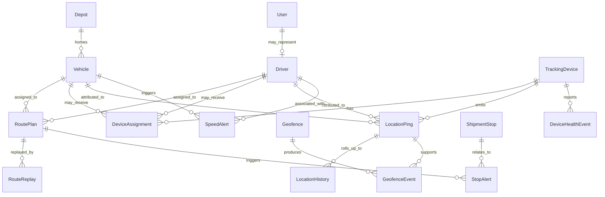
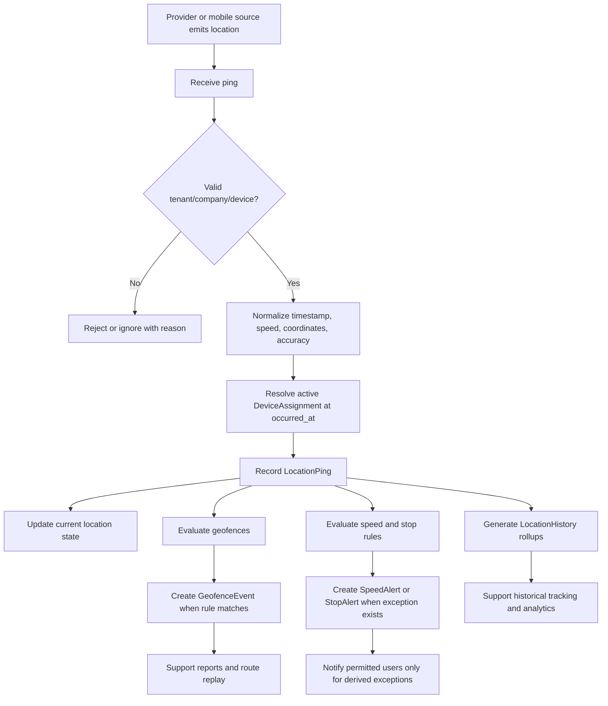

# 10_Fleet_Device_Tracking.md

## 1. Document Metadata

| Field | Value |
| --- | --- |
| Document name | `10_Fleet_Device_Tracking.md` |
| Phase | Phase 10 |
| Phase name | Fleet / Device Tracking |
| Document type | Phase requirements and architecture specification |
| Status | Draft for implementation planning |
| Prepared for | Product, engineering, design, QA, implementation, security, reporting, integrations, mobile, and operations teams |
| Source of truth inputs | Master Platform Documentation; Global Documentation Rules; Global Domain Model; Global Decisions Register; Phase 01 through Phase 09 summaries |
| Owner module | Fleet / GPS / Geofencing |
| Primary related modules | Core Platform, Identity and Access, CRM, Calendar / Tasks, Field Sales / Site Work, Inventory / Warehouse / Depots, Orders / Dispatch / Logistics, Reporting, Integrations, Security/Audit, Offline Mobile |
| Last updated | 2026-05-09 |

## 2. Phase Purpose

Phase 10 defines the production-grade foundation for fleet and device tracking. It establishes the canonical entities, workflows, permissions, APIs, UX, audit events, notifications, reporting concepts, and integration seams required to track vehicles, drivers, tracking devices, live location, historical location, geofences, route replay, speed alerts, stop alerts, and device health.

This phase does not replace dispatch, orders, jobs, shipment stops, depots, warehouses, sites, users, tasks, notifications, audit logs, files, imports, exports, saved views, or integration foundations from prior phases. Fleet tracking extends those foundations with location-aware operational visibility.

## 3. Phase Goals

- Define canonical fleet entities and prevent duplicate vehicle, driver, GPS, geofence, and alert concepts.
- Support live vehicle tracking and last-known-location visibility.
- Support historical tracking through raw pings, generated history, and route replay.
- Support device management, assignment history, and health monitoring.
- Support geofence configuration and geofence event generation.
- Support operational alerts for speed, stops, late/missed arrivals, stale devices, and device health.
- Connect fleet tracking to dispatch, route plans, shipment stops, depots, warehouses, jobs, sites, and future service records.
- Define privacy-aware permissions for live location, historical location, raw payloads, route replay, and exports.
- Define reporting, notification, integration, mobile/offline, and retention impacts for later phases.

## 4. Scope

### In Scope

- Vehicle profile management.
- Driver profile management and optional User linkage.
- TrackingDevice management.
- DeviceAssignment history and validation.
- LocationPing ingestion and normalization.
- Current vehicle/device location and stale status.
- LocationHistory rollups.
- Geofence creation and rule configuration.
- GeofenceEvent generation.
- RouteReplay generation and viewing.
- SpeedAlert and StopAlert generation and lifecycle handling.
- DeviceHealthEvent generation and monitoring.
- Fleet dashboard, live map, detail screens, alert center, and geofence editor UX.
- Fleet-specific permissions, audit events, notifications, reports, APIs, and edge cases.

### Out of Scope for Phase 10

- Full ELD compliance.
- Payroll, driver hours-of-service compliance, and regulated driver logbooks.
- Full AI route optimization.
- Customer-facing live ETA links or customer portals.
- Full maintenance workflow implementation, which belongs to Phase 11 Service / Work Orders.
- Full advanced reporting builder, which belongs to later reporting phases.
- Full integration marketplace, though provider-ready seams are defined.
- Full offline parity for fleet administration and geofence editing.

## 5. Non-Goals

- Do not create Phase 11.
- Do not redefine DispatchPlan, RoutePlan, ShipmentStop, DeliveryException, HandoffEvent, Job, Site, Depot, Warehouse, User, Task, Notification, AuditLog, ImportJob, ExportJob, SavedView, or SearchIndexRecord.
- Do not create duplicate entities such as `Truck`, `GpsEvent`, `FleetAsset`, `DriverUser`, `GeoBoundary`, `TelemetryPoint`, `VehicleLocation`, or `RouteHistory` when canonical Phase 10 entities cover the concept.
- Do not make raw GPS telemetry visible to all operational users by default.
- Do not notify users on every ping or every normal geofence event.
- Do not make QuickBooks a consumer of raw GPS telemetry.

## 6. Source-of-Truth Definitions

- `Tenant` remains the top-level SaaS isolation boundary.
- `Company` remains the SaaS customer organization and primary permission boundary.
- `User` and `UserMembership` remain canonical identity and company-access records.
- `Vehicle` is the canonical road fleet asset.
- `Driver` is the canonical operational driver resource and may link to User.
- `TrackingDevice` is the canonical GPS/telematics device.
- `LocationPing` is the canonical append-only location event.
- `Geofence` is the canonical geographic boundary configuration.
- `GeofenceEvent` is the canonical append-only geofence event.
- `DispatchPlan`, `RoutePlan`, and `ShipmentStop` remain owned by Orders / Dispatch / Logistics and must be referenced, not replaced.
- `Depot` and `Warehouse` remain owned by Inventory / Warehouse / Depots and may be linked to geofences and vehicles.
- `Site` remains the canonical physical customer or operational site and may be linked to geofences.
- `AuditLog`, `Notification`, `SavedView`, `SearchIndexRecord`, `ImportJob`, `ExportJob`, `SettingsDocument`, and `BackgroundJob` remain Core Platform foundations.

## 7. Canonical Entity Definitions

### Vehicle

| Attribute | Definition |
| --- | --- |
| Purpose | Canonical fleet asset including trucks, vans, trailers where vehicle-like tracking is required, and other road vehicles used for dispatch, deliveries, field work, depot operations, inventory transfer, and service history. |
| Owner module | Fleet / Tracking |
| Scope | Company-scoped; optional branch_id and home_depot_id/depot_id; may be referenced by Dispatch, Inventory, Field, and Service. |
| Tenant/company scoping | Required `tenant_id` and `company_id` on every record. Optional branch/depot scope only narrows visibility and reporting; it never replaces company scoping. |
| Key fields | `id`, `tenant_id`, `company_id`, `branch_id`, `home_depot_id`, `vehicle_type`, `display_name`, `plate`, `vin`, `make`, `model`, `year`, `capacity_weight`, `capacity_volume`, `capacity_unit`, `odometer_value`, `odometer_unit`, `fuel_type`, `assigned_driver_id`, `current_device_assignment_id`, `status`, `maintenance_status`, `module_visibility`, `external_refs`, `created_at`, `created_by`, `updated_at`, `updated_by`, `deleted_at`, `deleted_by` |
| Relationships | Depot homes many Vehicles; Driver may be assigned to Vehicle; TrackingDevice links through DeviceAssignment; RoutePlan and DispatchPlan reference Vehicle; InventoryTransfer and Shipment may reference Vehicle; MaintenanceSchedule and ServiceHistory will reference Vehicle in Phase 11. |
| Lifecycle | created/imported -> available -> assigned/in_service -> maintenance/out_of_service -> retired/archived; soft delete only when not active in open route, shipment, inventory transfer, or assignment. |
| Statuses | available, assigned, in_service, maintenance, out_of_service, retired, archived |
| Index considerations | tenant_id+company_id+status; tenant_id+company_id+plate unique where active; tenant_id+company_id+vin sparse unique; tenant_id+company_id+home_depot_id+status; text/search on display_name, plate, vin. |
| Permissions impact | fleet.vehicle.view/create/update/archive/assign/export; dispatch users may read assignable vehicles when Dispatch module enabled. |
| Audit requirements | create, update, status change, depot change, driver assignment, device assignment, archive, restore, export. |
| Reporting impact | vehicle utilization, active/stale vehicles, mileage, route completion, alerts by vehicle, maintenance readiness. |
| Future-phase impact | Service must reuse Vehicle for maintenance and service history; Reporting must not create FleetAsset duplicates; Integrations may map external telematics assets to Vehicle through external_refs. |
### Driver

| Attribute | Definition |
| --- | --- |
| Purpose | Canonical operational driver resource. A Driver may be linked to a User when the driver logs into mobile or needs role-based access, but Driver remains the fleet resource profile for assignments, license data, duty state, and reporting. |
| Owner module | Fleet / Tracking |
| Scope | Company-scoped; optional branch_id and home_depot_id; may link to one User but must not replace User/UserMembership. |
| Tenant/company scoping | Required `tenant_id` and `company_id` on every record. Optional branch/depot scope only narrows visibility and reporting; it never replaces company scoping. |
| Key fields | `id`, `tenant_id`, `company_id`, `branch_id`, `user_id`, `home_depot_id`, `display_name`, `phone`, `license_number`, `license_class`, `license_expires_at`, `employment_or_contractor_type`, `default_vehicle_id`, `status`, `duty_status`, `tracking_consent_status`, `tracking_consent_at`, `emergency_contact_summary`, `external_refs`, `created_at`, `created_by`, `updated_at`, `updated_by`, `deleted_at`, `deleted_by` |
| Relationships | User may represent Driver; Driver assigned to Vehicle, RoutePlan, DispatchPlan, Shipment, and RouteReplay; Driver may be connected to LocationPing when current assignment is known; SpeedAlert and StopAlert may reference Driver. |
| Lifecycle | created -> available/off_duty -> assigned/on_duty -> suspended/archived; User link may be added or removed without deleting historical driver references. |
| Statuses | available, assigned, off_duty, suspended, archived |
| Index considerations | tenant_id+company_id+status; tenant_id+company_id+user_id sparse unique; tenant_id+company_id+license_number sparse; tenant_id+company_id+home_depot_id+status. |
| Permissions impact | fleet.driver.view/create/update/archive/assign; sensitive license fields require fleet.driver.sensitive.view. |
| Audit requirements | create, update, license field update, User link change, status change, tracking consent change, assignment changes, archive. |
| Reporting impact | driver utilization, route punctuality, alerts by driver, stop completion, stale tracking, duty coverage. |
| Future-phase impact | Offline Mobile and Service must reuse Driver/User separation; privacy/security phases must preserve consent and duty-state controls. |
### TrackingDevice

| Attribute | Definition |
| --- | --- |
| Purpose | Canonical GPS or telematics device record representing hardware or provider-backed virtual tracking identity that emits pings and health events. |
| Owner module | Fleet / Tracking |
| Scope | Company-scoped; optional branch/depot/provider scope; provider identifiers must remain in device_identifier/external_refs and not replace id. |
| Tenant/company scoping | Required `tenant_id` and `company_id` on every record. Optional branch/depot scope only narrows visibility and reporting; it never replaces company scoping. |
| Key fields | `id`, `tenant_id`, `company_id`, `branch_id`, `provider`, `device_identifier`, `serial_number`, `imei`, `sim_number`, `device_type`, `firmware_version`, `status`, `last_seen_at`, `last_ping_at`, `last_health_event_at`, `battery_level`, `signal_strength`, `current_assignment_id`, `external_refs`, `created_at`, `created_by`, `updated_at`, `updated_by`, `deleted_at`, `deleted_by` |
| Relationships | TrackingDevice has many DeviceAssignments; TrackingDevice emits LocationPing and DeviceHealthEvent; TrackingDevice may be associated with Vehicle or Driver only through DeviceAssignment. |
| Lifecycle | created/imported -> active -> inactive/lost -> retired/archived; assignment history persists after retirement. |
| Statuses | active, inactive, lost, retired, archived |
| Index considerations | tenant_id+company_id+provider+device_identifier unique; tenant_id+company_id+status; tenant_id+company_id+last_seen_at; tenant_id+company_id+current_assignment_id. |
| Permissions impact | fleet.device.view/create/update/archive/assign; provider credentials are managed by Integrations settings, not device records. |
| Audit requirements | create, update, activation/deactivation, assignment start/end, lost/retired status, provider identifier change, archive. |
| Reporting impact | device coverage, stale devices, health events, assignment gaps, provider reliability. |
| Future-phase impact | Integrations phase may add provider connection sync while preserving this entity as the canonical device record. |
### DeviceAssignment

| Attribute | Definition |
| --- | --- |
| Purpose | Canonical time-bounded link assigning a TrackingDevice to a Vehicle, Driver, User, or other approved tracked entity. It prevents overwriting history when a device is moved. |
| Owner module | Fleet / Tracking |
| Scope | Company-scoped; time-bounded; normally assigned_entity_type=Vehicle for MVP, with Driver/User only where approved by privacy rules. |
| Tenant/company scoping | Required `tenant_id` and `company_id` on every record. Optional branch/depot scope only narrows visibility and reporting; it never replaces company scoping. |
| Key fields | `id`, `tenant_id`, `company_id`, `device_id`, `assigned_entity_type`, `assigned_entity_id`, `vehicle_id`, `driver_id`, `user_id`, `start_at`, `end_at`, `status`, `assigned_by_user_id`, `ended_by_user_id`, `assignment_reason`, `end_reason`, `install_location_notes`, `metadata`, `created_at`, `created_by`, `updated_at`, `updated_by` |
| Relationships | belongs to TrackingDevice; may reference Vehicle, Driver, or User depending assigned_entity_type; LocationPing attribution uses active assignment at occurred_at. |
| Lifecycle | draft/created -> active -> ended/cancelled; overlapping active assignments for the same device are forbidden unless explicitly flagged as a data correction. |
| Statuses | active, ended, cancelled |
| Index considerations | tenant_id+company_id+device_id+status; tenant_id+company_id+assigned_entity_type+assigned_entity_id+status; time range index on start_at/end_at; uniqueness for one active assignment per device. |
| Permissions impact | fleet.device.assign and fleet.vehicle.assign or fleet.driver.assign depending target. |
| Audit requirements | assignment created, activated, ended, cancelled, corrected; overlapping conflict resolution. |
| Reporting impact | assignment coverage, device movement history, location attribution accuracy. |
| Future-phase impact | Provider sync must not overwrite assignment history; support teams need assignment history for troubleshooting. |
### LocationPing

| Attribute | Definition |
| --- | --- |
| Purpose | Append-only raw or normalized tracked point emitted by a device or mobile capture source. It is the source for live location, route replay, history rollups, geofence evaluation, and derived alerts. |
| Owner module | Fleet / Tracking |
| Scope | High-volume company-scoped event; always tenant/company scoped; usually linked to device_id and derived vehicle_id/driver_id from DeviceAssignment at occurred_at. |
| Tenant/company scoping | Required `tenant_id` and `company_id` on every record. Optional branch/depot scope only narrows visibility and reporting; it never replaces company scoping. |
| Key fields | `id`, `tenant_id`, `company_id`, `device_id`, `vehicle_id`, `driver_id`, `source_type`, `provider`, `provider_event_id`, `occurred_at`, `received_at`, `coordinates.lat`, `coordinates.lng`, `accuracy_meters`, `speed`, `speed_unit`, `heading`, `altitude`, `odometer_value`, `ignition_state`, `battery_level`, `signal_strength`, `raw_payload_ref`, `normalization_status`, `status`, `ignored_reason`, `created_at` |
| Relationships | belongs to TrackingDevice; may reference Vehicle and Driver; supports GeofenceEvent, RouteReplay, SpeedAlert, StopAlert, LocationHistory. |
| Lifecycle | received -> normalized -> recorded or ignored; corrections are new events or correction metadata, not destructive edits. |
| Statuses | recorded, ignored |
| Index considerations | tenant_id+company_id+vehicle_id+occurred_at desc; tenant_id+company_id+device_id+occurred_at desc; tenant_id+company_id+driver_id+occurred_at desc; geospatial coordinates; provider+provider_event_id idempotency; TTL/partition strategy by retention policy. |
| Permissions impact | fleet.location.live.view, fleet.location.history.view, fleet.location.raw.view for raw payload access; exports require fleet.location.export. |
| Audit requirements | raw pings are telemetry, not business audit logs; ingestion failures, retention policy changes, exports, and manual corrections are audited. |
| Reporting impact | mileage estimates, active/stale state, route adherence, speed/stop metrics, location coverage, geofence event derivation. |
| Future-phase impact | Reporting and analytics must aggregate rather than scan raw high-volume pings; retention rules must be respected by all later phases. |
### LocationHistory

| Attribute | Definition |
| --- | --- |
| Purpose | Queryable generated aggregation or index over LocationPing for efficient historical maps, reporting, and route replay without treating rollups as the raw event source. |
| Owner module | Fleet / Tracking |
| Scope | Generated company-scoped record by entity and time bucket; may be rebuilt from LocationPing inside retention windows. |
| Tenant/company scoping | Required `tenant_id` and `company_id` on every record. Optional branch/depot scope only narrows visibility and reporting; it never replaces company scoping. |
| Key fields | `id`, `tenant_id`, `company_id`, `entity_type`, `entity_id`, `vehicle_id`, `driver_id`, `time_bucket_start_at`, `time_bucket_end_at`, `path_summary`, `start_coordinates`, `end_coordinates`, `distance_estimate`, `duration_seconds`, `max_speed`, `avg_speed`, `stop_count`, `ping_count`, `data_quality_score`, `generated_at`, `generation_version`, `status` |
| Relationships | derived from LocationPing; referenced by RouteReplay and reports; may relate to Vehicle/Driver. |
| Lifecycle | generated -> refreshed -> expired/purged according to retention policy. |
| Statuses | generated, refreshed, expired |
| Index considerations | tenant_id+company_id+entity_type+entity_id+time_bucket_start_at; tenant_id+company_id+vehicle_id+time_bucket_start_at; tenant_id+company_id+driver_id+time_bucket_start_at. |
| Permissions impact | same as location history permissions; no broader access than the underlying pings. |
| Audit requirements | generation job failures and retention purges are operationally logged; access/export audited. |
| Reporting impact | fleet dashboards, utilization, history map, route summaries. |
| Future-phase impact | Phase 18 reporting may use LocationHistory as a performance layer but must label it derived. |
### Geofence

| Attribute | Definition |
| --- | --- |
| Purpose | Configured geographic boundary used for site/depot/warehouse/branch arrival, exit, dwell, missed arrival, unauthorized departure, and operational validation. |
| Owner module | Fleet / Tracking |
| Scope | Company-scoped; may link to Site, Warehouse, Depot, Branch, ShipmentStop, or custom operational location; radius supported for MVP and polygon future-capable. |
| Tenant/company scoping | Required `tenant_id` and `company_id` on every record. Optional branch/depot scope only narrows visibility and reporting; it never replaces company scoping. |
| Key fields | `id`, `tenant_id`, `company_id`, `branch_id`, `name`, `description`, `shape_type`, `center_lat`, `center_lng`, `radius_meters`, `geo_shape`, `entity_link_type`, `entity_link_id`, `status`, `event_rules`, `dwell_threshold_seconds`, `arrival_window_tolerance_minutes`, `visibility_scope`, `created_at`, `created_by`, `updated_at`, `updated_by`, `deleted_at`, `deleted_by` |
| Relationships | may link to Site, Warehouse, Depot, Branch, ShipmentStop; has many GeofenceEvents; may support CheckInEvent validation. |
| Lifecycle | draft -> active -> inactive -> archived; shape changes must preserve audit history and not rewrite historical events. |
| Statuses | active, inactive, archived |
| Index considerations | tenant_id+company_id+status; tenant_id+company_id+entity_link_type+entity_link_id; geospatial geo_shape/center; name search. |
| Permissions impact | fleet.geofence.view/create/update/archive; linked operational modules may read relevant geofences without editing them. |
| Audit requirements | create, shape update, rule update, status change, archive, restore. |
| Reporting impact | arrival/departure performance, dwell time, unauthorized exit, stop compliance. |
| Future-phase impact | Field check-ins, dispatch stops, warehouse/depot workflows, and reporting must reuse Geofence instead of creating separate boundary models. |
### GeofenceEvent

| Attribute | Definition |
| --- | --- |
| Purpose | Append-only event produced when a tracked entity enters, exits, dwells, misses arrival, arrives late, or departs unauthorized relative to a Geofence rule. |
| Owner module | Fleet / Tracking |
| Scope | Company-scoped append-only event; generated by server-side evaluation where possible. |
| Tenant/company scoping | Required `tenant_id` and `company_id` on every record. Optional branch/depot scope only narrows visibility and reporting; it never replaces company scoping. |
| Key fields | `id`, `tenant_id`, `company_id`, `geofence_id`, `event_type`, `entity_type`, `entity_id`, `vehicle_id`, `driver_id`, `device_id`, `location_ping_id`, `related_route_plan_id`, `related_shipment_stop_id`, `occurred_at`, `detected_at`, `coordinates`, `rule_snapshot`, `status`, `created_at` |
| Relationships | belongs to Geofence; may reference Vehicle, Driver, TrackingDevice, LocationPing, RoutePlan, ShipmentStop, Site/Depot/Warehouse through Geofence link. |
| Lifecycle | recorded append-only; corrections use linked correction event or ignored flag, not destructive mutation. |
| Statuses | recorded, ignored, corrected |
| Index considerations | tenant_id+company_id+geofence_id+occurred_at; tenant_id+company_id+entity_type+entity_id+occurred_at; tenant_id+company_id+event_type+occurred_at; related_shipment_stop_id. |
| Permissions impact | fleet.geofence.event.view; dispatch may view events for assigned routes/stops. |
| Audit requirements | not every generated event is an AuditLog, but ignored/corrected events, rule changes, and exports are audited. |
| Reporting impact | arrival compliance, dwell metrics, late/missed stops, depot entry/exit history, safety review. |
| Future-phase impact | Notifications should trigger only derived exceptions, not every event; reporting must respect retention. |
### RouteReplay

| Attribute | Definition |
| --- | --- |
| Purpose | Derived replay session/query representing a time-bounded vehicle/driver route history with pings, stops, alerts, and geofence events for review. |
| Owner module | Fleet / Tracking |
| Scope | Company-scoped generated record or saved query; should not duplicate raw LocationPing permanently unless caching is required. |
| Tenant/company scoping | Required `tenant_id` and `company_id` on every record. Optional branch/depot scope only narrows visibility and reporting; it never replaces company scoping. |
| Key fields | `id`, `tenant_id`, `company_id`, `route_plan_id`, `vehicle_id`, `driver_id`, `start_at`, `end_at`, `generated_by_user_id`, `generated_at`, `status`, `ping_count`, `path_summary`, `included_event_types`, `expires_at`, `retention_policy_snapshot` |
| Relationships | may reference RoutePlan, Vehicle, Driver, LocationPing, GeofenceEvent, SpeedAlert, StopAlert, ShipmentStop. |
| Lifecycle | generated -> viewed/exported -> expired; regenerate from pings/history when available. |
| Statuses | generated, expired, failed |
| Index considerations | tenant_id+company_id+route_plan_id; tenant_id+company_id+vehicle_id+start_at; tenant_id+company_id+generated_by_user_id+generated_at; expires_at. |
| Permissions impact | fleet.route_replay.view; export requires fleet.route_replay.export and location history permission. |
| Audit requirements | route replay viewed for sensitive history, exported, generated, failed, expired. |
| Reporting impact | route adherence, customer dispute resolution, late/stop analysis. |
| Future-phase impact | Customer-facing portals must not expose route replay unless explicitly approved and redacted. |
### SpeedAlert

| Attribute | Definition |
| --- | --- |
| Purpose | Derived operational alert generated when speed exceeds company, vehicle, route, or geofence threshold. |
| Owner module | Fleet / Tracking |
| Scope | Company-scoped alert; references triggering LocationPing and rule snapshot. |
| Tenant/company scoping | Required `tenant_id` and `company_id` on every record. Optional branch/depot scope only narrows visibility and reporting; it never replaces company scoping. |
| Key fields | `id`, `tenant_id`, `company_id`, `vehicle_id`, `driver_id`, `device_id`, `location_ping_id`, `route_plan_id`, `threshold`, `speed`, `speed_unit`, `severity`, `occurred_at`, `detected_at`, `status`, `acknowledged_by_user_id`, `acknowledged_at`, `resolved_by_user_id`, `resolved_at`, `dismissed_reason`, `rule_snapshot`, `created_at` |
| Relationships | references Vehicle, Driver, LocationPing, Notification; may reference RoutePlan or Geofence. |
| Lifecycle | open -> acknowledged -> resolved or dismissed; system may auto-resolve only if configured. |
| Statuses | open, acknowledged, resolved, dismissed |
| Index considerations | tenant_id+company_id+status+severity; tenant_id+company_id+vehicle_id+occurred_at; tenant_id+company_id+driver_id+occurred_at; location_ping_id unique where generated. |
| Permissions impact | fleet.alert.view/acknowledge/resolve/dismiss; notification preferences apply. |
| Audit requirements | alert generated, acknowledged, resolved, dismissed, rule threshold changes, bulk actions. |
| Reporting impact | speeding incidents, severity trend, driver coaching, safety KPI. |
| Future-phase impact | Automation may escalate repeated alerts but must not notify on every raw ping. |
### StopAlert

| Attribute | Definition |
| --- | --- |
| Purpose | Derived operational alert for unexpected stop, missed stop, late stop, excessive dwell, unauthorized stop, or route stop exception. |
| Owner module | Fleet / Tracking |
| Scope | Company-scoped; may reference RoutePlan, ShipmentStop, Vehicle, Driver, GeofenceEvent, and Dispatch exceptions. |
| Tenant/company scoping | Required `tenant_id` and `company_id` on every record. Optional branch/depot scope only narrows visibility and reporting; it never replaces company scoping. |
| Key fields | `id`, `tenant_id`, `company_id`, `alert_type`, `vehicle_id`, `driver_id`, `route_plan_id`, `shipment_stop_id`, `geofence_event_id`, `location_ping_id`, `severity`, `occurred_at`, `detected_at`, `planned_window_start_at`, `planned_window_end_at`, `actual_context`, `status`, `acknowledged_by_user_id`, `acknowledged_at`, `resolved_by_user_id`, `resolved_at`, `dismissed_reason`, `created_at` |
| Relationships | references RoutePlan, ShipmentStop, Vehicle, Driver; may create or link DeliveryException when dispatch action is required. |
| Lifecycle | open -> acknowledged -> resolved/dismissed; may link to DeliveryException for operational handling. |
| Statuses | open, acknowledged, resolved, dismissed |
| Index considerations | tenant_id+company_id+status+severity; tenant_id+company_id+route_plan_id+occurred_at; tenant_id+company_id+shipment_stop_id+status; vehicle_id+occurred_at. |
| Permissions impact | fleet.alert.view/acknowledge/resolve/dismiss; dispatch users may handle alerts linked to their routes/stops. |
| Audit requirements | alert generated, acknowledged, resolved, dismissed, link to exception, bulk status update. |
| Reporting impact | late stops, missed arrivals, excessive dwell, route adherence, exception rate. |
| Future-phase impact | Dispatch and service phases must reuse StopAlert rather than creating duplicate late/stop alert models. |
### DeviceHealthEvent

| Attribute | Definition |
| --- | --- |
| Purpose | Append-only health event for tracking devices, including low battery, no signal, stale device, power disconnect, provider error, recovered signal, and firmware status. |
| Owner module | Fleet / Tracking |
| Scope | Company-scoped append-only event; generated from provider ingest, monitoring jobs, or manual admin diagnostics. |
| Tenant/company scoping | Required `tenant_id` and `company_id` on every record. Optional branch/depot scope only narrows visibility and reporting; it never replaces company scoping. |
| Key fields | `id`, `tenant_id`, `company_id`, `device_id`, `vehicle_id`, `event_type`, `severity`, `battery_level`, `signal_strength`, `firmware_version`, `occurred_at`, `detected_at`, `provider`, `provider_event_id`, `health_payload`, `status`, `created_at` |
| Relationships | belongs to TrackingDevice; may reference Vehicle through active assignment; may trigger Notification. |
| Lifecycle | recorded append-only; related device last_seen/status may be updated as materialized current state. |
| Statuses | recorded, ignored, corrected |
| Index considerations | tenant_id+company_id+device_id+occurred_at; tenant_id+company_id+event_type+occurred_at; tenant_id+company_id+severity+occurred_at; provider+provider_event_id idempotency. |
| Permissions impact | fleet.device.health.view; device admin permissions for diagnostics and acknowledgement if surfaced as alert. |
| Audit requirements | health events themselves are operational events; health rule changes, manual diagnostics, exports, and device status overrides audited. |
| Reporting impact | device reliability, stale fleet percentage, provider health, battery replacement backlog. |
| Future-phase impact | Monitoring and notification phases must use this event stream for device health alerts. |

## 8. Entity Lifecycle and Status Rules

### Vehicle Lifecycle

1. `available`: Vehicle can be assigned to work.
2. `assigned`: Vehicle is scheduled or assigned to a route, dispatch plan, driver, crew, or job.
3. `in_service`: Vehicle is currently operating.
4. `maintenance`: Vehicle is blocked for service or maintenance review.
5. `out_of_service`: Vehicle cannot be assigned.
6. `retired`: Vehicle is no longer operational but retained for history.
7. `archived`: Vehicle is hidden from active workflows but retained for audit/report history.

### Driver Lifecycle

1. `available`: Driver can be assigned.
2. `assigned`: Driver has active or upcoming work.
3. `off_duty`: Driver is not currently assignable or trackable as on-duty.
4. `suspended`: Driver cannot be assigned due to admin or compliance action.
5. `archived`: Driver retained for historical references.

### Device and Assignment Lifecycle

- TrackingDevice statuses: `active`, `inactive`, `lost`, `retired`, `archived`.
- DeviceAssignment statuses: `active`, `ended`, `cancelled`.
- A device may have many historical assignments but normally only one active assignment at a time.
- Location attribution must use the assignment active at `occurred_at`, not only current state.

### Location and Event Lifecycle

- LocationPing statuses: `recorded`, `ignored`.
- GeofenceEvent statuses: `recorded`, `ignored`, `corrected`.
- DeviceHealthEvent statuses: `recorded`, `ignored`, `corrected`.
- Append-only events must not be silently edited. Corrections must be visible through correction metadata, replacement events, or audit records.

### Alert Lifecycle

- SpeedAlert and StopAlert statuses: `open`, `acknowledged`, `resolved`, `dismissed`.
- Acknowledgement means a user has seen/accepted operational responsibility.
- Resolution means the operational issue is handled.
- Dismissal requires a reason and is appropriate for false positives, data quality issues, or no-action-needed alerts.

## 9. Entity Relationship Rules

Relationship rules:

- Vehicle may be linked to Depot, Driver, TrackingDevice through DeviceAssignment, DispatchPlan, RoutePlan, Shipment, InventoryTransfer, Job, Crew, EquipmentAssignment, MaintenanceSchedule, and ServiceHistory.
- Driver may link to User but Driver and User are not the same entity.
- TrackingDevice must not be directly overwritten onto Vehicle without preserving DeviceAssignment history.
- LocationPing must link to TrackingDevice and may derive Vehicle and Driver from DeviceAssignment.
- Geofence may link to Site, Depot, Warehouse, Branch, ShipmentStop, or custom operational location.
- GeofenceEvent must reference the Geofence and the tracked entity involved.
- RouteReplay must reference retained pings/history and may reference RoutePlan, Vehicle, Driver, alerts, and geofence events.
- StopAlert may link to ShipmentStop and may create or reference DeliveryException.

## 10. Workflow Requirements

### Location Ingestion and Evaluation Workflow

### Vehicle and Device Setup Workflow

1. Fleet admin creates or imports Vehicles.
2. Fleet admin creates or imports Drivers.
3. Fleet admin creates or imports TrackingDevices.
4. Fleet admin assigns a TrackingDevice to a Vehicle through DeviceAssignment.
5. System validates no conflicting active assignment exists.
6. Provider or mobile source begins emitting LocationPings.
7. System normalizes pings and updates current location.
8. System monitors stale state, geofence events, speed alerts, stop alerts, and device health.

### Dispatch-Linked Tracking Workflow

1. Dispatcher creates/updates DispatchPlan and RoutePlan in Phase 09 workflows.
2. RoutePlan references Vehicle and Driver.
3. Fleet module surfaces current vehicle state inside dispatch context.
4. LocationPing and GeofenceEvent support stop arrival, missed arrival, late arrival, and dwell detection.
5. StopAlert may create or link DeliveryException when dispatcher action is required.
6. RouteReplay supports post-route review and dispute resolution.

### Geofence Configuration Workflow

1. Authorized user opens Geofence editor.
2. User selects linked entity type: Site, Depot, Warehouse, Branch, ShipmentStop, or custom.
3. User defines radius-based shape for MVP.
4. User configures event rules such as enter, exit, dwell, late arrival, missed arrival, unauthorized departure.
5. System validates shape and rule configuration.
6. Active geofence participates in server-side evaluation.
7. Historical events retain rule snapshots.

## 11. Data Model Requirements

- All company-scoped fleet records require `id`, `tenant_id`, and `company_id`.
- Use stable application IDs; never expose MongoDB `_id`.
- Store provider identifiers in `device_identifier`, `provider_event_id`, `external_refs`, or approved integration link records.
- High-volume LocationPing collections must be physically designed for time-range and entity queries.
- LocationHistory must be generated and rebuildable from retained LocationPing data where retention permits.
- Geofence shapes must support radius for MVP and remain polygon-ready.
- DeviceAssignment history must be time-bounded and queryable by device and assigned entity.
- Retention snapshots should be stored on RouteReplay and export outputs where relevant.
- Alert rule snapshots must be stored on SpeedAlert and StopAlert to preserve the rule that produced the alert.
- Soft-delete must be used for master/config records where historical references exist.
- Append-only event records must not be hard-deleted except through approved retention/purge policy.

## 12. API Requirements

- **API-10-001:** Expose CRUD endpoints for Vehicles using `/api/v1/fleet/vehicles` and `/api/v1/fleet/vehicles/{vehicle_id}`.
- **API-10-002:** Expose CRUD endpoints for Drivers using `/api/v1/fleet/drivers` and `/api/v1/fleet/drivers/{driver_id}`.
- **API-10-003:** Expose CRUD endpoints for TrackingDevices using `/api/v1/fleet/tracking-devices` and `/api/v1/fleet/tracking-devices/{device_id}`.
- **API-10-004:** Expose DeviceAssignment endpoints for create, end, cancel, and list history under devices and assigned entities.
- **API-10-005:** Expose LocationPing ingestion endpoint for internal/provider gateway ingestion with idempotency keys and source authentication.
- **API-10-006:** Expose current-location endpoint by vehicle, driver, device, route plan, and dispatch plan where permission allows.
- **API-10-007:** Expose bounded location-history endpoint with required `start_at` and `end_at` parameters.
- **API-10-008:** Expose route replay generation endpoint that returns generated RouteReplay ID and status.
- **API-10-009:** Expose route replay read endpoint with path summary, events, alerts, and permission-filtered details.
- **API-10-010:** Expose Geofence CRUD endpoints and validation endpoint for shape/radius validation.
- **API-10-011:** Expose GeofenceEvent list endpoint filtered by geofence, entity, route, stop, event type, and date range.
- **API-10-012:** Expose SpeedAlert list/read/update-status endpoints with acknowledge, resolve, and dismiss actions.
- **API-10-013:** Expose StopAlert list/read/update-status endpoints with acknowledge, resolve, dismiss, and link-to-exception actions.
- **API-10-014:** Expose DeviceHealthEvent list endpoint filtered by device, vehicle, severity, event type, and date range.
- **API-10-015:** Expose fleet dashboard aggregate endpoint for active vehicles, stale vehicles, open alerts, device health, and recent geofence exceptions.
- **API-10-016:** Expose provider webhook intake endpoints through IntegrationConnection/Webhook foundations where the provider requires callbacks.
- **API-10-017:** All fleet endpoints must accept company context and enforce module enablement plus permission checks.
- **API-10-018:** All list endpoints must support pagination, stable sorting, filtering, and saved view compatibility.
- **API-10-019:** All mutation endpoints must emit AuditLog entries where the action is admin, assignment, lifecycle, export, privacy, or alert-state significant.
- **API-10-020:** All export endpoints must create ExportJob records rather than synchronous large responses.

## 13. UI / UX Requirements

- **UX-10-001:** Fleet dashboard must show active vehicles, stale vehicles, open speed alerts, open stop alerts, device health issues, and recent geofence exceptions.
- **UX-10-002:** Live map must show vehicles with last-known position, direction where available, stale/active state, and permission-filtered labels.
- **UX-10-003:** Vehicle list must support table, map, and saved views with filters for status, depot, branch, driver, device, stale state, and alert state.
- **UX-10-004:** Vehicle detail must include header, status, assignments, current device, current driver, live location, route history, alerts, files, timeline, and audit summary.
- **UX-10-005:** Driver list must support filters for status, duty status, home depot, assigned vehicle, linked user, and open alert count.
- **UX-10-006:** Driver detail must show User link, assignment history, route history summary, alerts, privacy/tracking consent state, and audit summary.
- **UX-10-007:** Tracking device list must show status, provider, assigned entity, last seen, last ping, health status, and stale indicator.
- **UX-10-008:** Tracking device detail must show assignment history, health events, recent pings summary, provider metadata, and diagnostics actions where permitted.
- **UX-10-009:** Geofence list must support map/table toggle, linked entity filters, active/inactive status, shape type, and event count.
- **UX-10-010:** Geofence editor must provide radius drawing on a map for MVP, validation messages, linked entity picker, and event rule settings.
- **UX-10-011:** Route replay screen must include timeline scrubber, map path, stop markers, geofence events, alert markers, ping quality indicators, and export action where allowed.
- **UX-10-012:** Alert center must group SpeedAlert, StopAlert, and device-health related operational alerts with severity, owner, entity, age, and status actions.
- **UX-10-013:** Empty states must explain setup steps: create vehicle, create driver, add tracking device, assign device, configure geofence, or connect provider.
- **UX-10-014:** Error states must distinguish missing permission, disabled Fleet module, unavailable provider, no pings in time range, invalid geofence, and retention-expired history.
- **UX-10-015:** Permission behavior must hide actions the user cannot perform while showing readable explanations for blocked sensitive history and exports.
- **UX-10-016:** Mobile driver view must make tracking state visible: active, paused/off duty, permission denied, stale, offline, or provider unavailable.
- **UX-10-017:** Dispatcher route view must show fleet signals inline without replacing DispatchPlan or RoutePlan screens from Phase 09.
- **UX-10-018:** All map-based screens must provide non-map fallback lists for users with accessibility needs, slow devices, or failed map provider loading.

## 14. Search, Filters, and Saved Views

- Vehicles must be searchable by display name, plate, VIN, vehicle type, depot, branch, status, assigned driver, assigned device, and stale state.
- Drivers must be searchable by name, linked User, phone, license summary, depot, branch, status, duty status, and assigned vehicle.
- TrackingDevices must be searchable by provider, device identifier, serial, IMEI, status, assigned entity, last seen, and health state.
- Geofences must be searchable by name, linked entity, status, shape type, rule type, and event count.
- Alerts must be filterable by type, severity, status, vehicle, driver, route, stop, depot, occurred_at, acknowledged_by, and resolved_by.
- GeofenceEvents must be filterable by event type, geofence, entity, route, stop, and date range.
- Saved views must use Phase 03 `SavedView` and support list/table/map variants where applicable.
- Search results must respect tenant, company, module enablement, role permissions, live/history location permission, and sensitive-field restrictions.

## 15. Permissions and Access Control

- **PERM-10-001:** Define `fleet.module.access` as the base module access permission gate.
- **PERM-10-002:** Define `fleet.vehicle.view`, `fleet.vehicle.create`, `fleet.vehicle.update`, `fleet.vehicle.archive`, and `fleet.vehicle.assign`.
- **PERM-10-003:** Define `fleet.driver.view`, `fleet.driver.create`, `fleet.driver.update`, `fleet.driver.archive`, and `fleet.driver.assign`.
- **PERM-10-004:** Define `fleet.driver.sensitive.view` for license and sensitive driver fields.
- **PERM-10-005:** Define `fleet.device.view`, `fleet.device.create`, `fleet.device.update`, `fleet.device.archive`, and `fleet.device.assign`.
- **PERM-10-006:** Define `fleet.location.live.view` for current/last-known location visibility.
- **PERM-10-007:** Define `fleet.location.history.view` for historical pings and route replay visibility.
- **PERM-10-008:** Define `fleet.location.raw.view` for raw provider payload/debug visibility.
- **PERM-10-009:** Define `fleet.location.export` for exporting location history and route replay data.
- **PERM-10-010:** Define `fleet.geofence.view`, `fleet.geofence.create`, `fleet.geofence.update`, and `fleet.geofence.archive`.
- **PERM-10-011:** Define `fleet.geofence.event.view` for viewing generated geofence events.
- **PERM-10-012:** Define `fleet.alert.view`, `fleet.alert.acknowledge`, `fleet.alert.resolve`, and `fleet.alert.dismiss`.
- **PERM-10-013:** Define `fleet.report.view` for fleet dashboards and aggregates.
- **PERM-10-014:** Define `fleet.admin.settings.update` for retention, thresholds, and provider-related fleet settings.
- **PERM-10-015:** Dispatch users may receive limited read access to vehicles, drivers, current location, and stop alerts for assigned DispatchPlans when Dispatch is enabled.
- **PERM-10-016:** Reports and exports must re-check the user's fleet permissions, company access, module enablement, and record scoping at execution time.

## 16. Notifications

- **NOTIF-10-001:** Notify configured dispatchers/managers for high-severity SpeedAlert according to threshold and deduplication rules.
- **NOTIF-10-002:** Notify dispatchers for StopAlert when linked to an active route, DispatchPlan, or ShipmentStop.
- **NOTIF-10-003:** Notify fleet admins when TrackingDevice becomes stale beyond configured threshold.
- **NOTIF-10-004:** Notify fleet admins for low battery, power disconnected, no signal, and recovered signal events when configured.
- **NOTIF-10-005:** Notify dispatchers when a vehicle enters or exits a critical geofence only when the geofence rule is configured as exception-worthy.
- **NOTIF-10-006:** Do not notify for every LocationPing or normal geofence enter/exit event by default.
- **NOTIF-10-007:** Respect Notification preferences, quiet hours where configured, company module enablement, and permission checks.
- **NOTIF-10-008:** Notifications must include enough context to open the relevant vehicle, route, stop, geofence, alert, or device record.
- **NOTIF-10-009:** Repeated alerts must be deduplicated or throttled to avoid alert storms.
- **NOTIF-10-010:** Notification records must use the canonical Phase 03 Notification model.

## 17. Audit Logging

- **AUDIT-10-001:** Vehicle created, updated, archived, restored, status changed, depot changed, driver assigned, driver unassigned, device assigned, device unassigned.
- **AUDIT-10-002:** Driver created, updated, archived, restored, User link changed, license field changed, duty/tracking consent state changed.
- **AUDIT-10-003:** TrackingDevice created, updated, activated, deactivated, marked lost, retired, archived, provider identifier changed.
- **AUDIT-10-004:** DeviceAssignment created, activated, ended, cancelled, corrected, or rejected for overlap.
- **AUDIT-10-005:** Geofence created, updated, activated, deactivated, archived, restored, shape changed, event rule changed.
- **AUDIT-10-006:** SpeedAlert acknowledged, resolved, dismissed, reopened, bulk-updated, or linked to operational follow-up.
- **AUDIT-10-007:** StopAlert acknowledged, resolved, dismissed, reopened, linked to DeliveryException, or bulk-updated.
- **AUDIT-10-008:** Fleet settings updated, including speed thresholds, stale thresholds, geofence thresholds, retention policies, and notification rules.
- **AUDIT-10-009:** Location history viewed for sensitive records where the company enables sensitive-access audit.
- **AUDIT-10-010:** RouteReplay generated, viewed, exported, expired, or failed.
- **AUDIT-10-011:** Location export requested, completed, failed, downloaded, or cancelled.
- **AUDIT-10-012:** Provider integration connected, disconnected, credential rotated, webhook endpoint changed, or sync error acknowledged.
- **AUDIT-10-013:** Manual correction applied to location attribution, geofence event, alert state, or device assignment history.
- **AUDIT-10-014:** Bulk import/export of Vehicles, Drivers, TrackingDevices, or Geofences started, completed, failed, or cancelled.
- **AUDIT-10-015:** Unauthorized access attempt to restricted live location, history, export, or raw payload endpoint.

## 18. Reporting and Analytics Impact

- **REPORT-10-001:** Fleet dashboard: active vehicles, stale vehicles, assigned/unassigned vehicles, open alerts, device health issues, and vehicles by depot.
- **REPORT-10-002:** Vehicle utilization: active route time, idle time, distance estimate, route count, stop count, and assignment coverage.
- **REPORT-10-003:** Driver performance: assigned routes, on-time arrivals, stop alerts, speed alerts, and exception rate.
- **REPORT-10-004:** Route adherence: planned vs actual path, late stops, missed stops, dwell time, and route completion.
- **REPORT-10-005:** Geofence compliance: enter/exit count, dwell duration, unauthorized departure, missed arrival, and late arrival by linked entity.
- **REPORT-10-006:** Device health: stale devices, low battery events, signal loss, power disconnects, last seen age, and provider reliability.
- **REPORT-10-007:** Alert trends: speed incidents, stop exceptions, severity distribution, average acknowledgement time, and resolution time.
- **REPORT-10-008:** Data quality: pings ignored, low accuracy pings, devices without assignments, vehicles without devices, and history gaps.
- **REPORT-10-009:** Exports must use ExportJob and respect fleet location, sensitive data, and retention permissions.
- **REPORT-10-010:** Phase 18 reporting must use LocationHistory and aggregated event tables rather than scanning raw pings for every dashboard.

## 19. Mobile and Offline Impact

- **OFFLINE-10-001:** Mobile users must see assigned Vehicle/Driver context and tracking status when online or from the last synced state.
- **OFFLINE-10-002:** Mobile-created check-ins, stop completions, and field proof from earlier phases may reference fleet/geofence state but must remain valid when GPS is unavailable.
- **OFFLINE-10-003:** Driver mobile tracking must queue pings only when mobile tracking is approved and device permissions are granted.
- **OFFLINE-10-004:** Offline pings must include local occurred_at, received/synced_at, device metadata, accuracy, and sync state.
- **OFFLINE-10-005:** Queued offline actions must be revalidated against company/module permissions on sync.
- **OFFLINE-10-006:** The app must show clear error states for GPS permission denied, GPS disabled, low accuracy, background tracking disabled, and sync pending.
- **OFFLINE-10-007:** Offline mobile must not allow users to forge or edit historical pings except through controlled sync payloads and server validation.
- **OFFLINE-10-008:** Route replay must label late-arriving/offline-synced pings as delayed when useful for audit and dispute review.
- **OFFLINE-10-009:** Full offline fleet admin and geofence editing is out of scope for Phase 10.
- **OFFLINE-10-010:** Offline retention and sync policies must avoid unbounded local storage of sensitive location history.

## 20. Integration Impact

- **INT-10-001:** Fleet provider integrations must map external devices/assets to TrackingDevice and Vehicle using external_refs or provider link records, not duplicate core entities.
- **INT-10-002:** Provider webhook ingestion must use authenticated endpoints, idempotency, retry handling, and visible failure states.
- **INT-10-003:** CSV/Excel imports for vehicles, drivers, tracking devices, and geofences must use ImportJob.
- **INT-10-004:** Exports for fleet records, alerts, and history summaries must use ExportJob.
- **INT-10-005:** Public API and webhook outputs must not leak raw location history without explicit permission and export scope.
- **INT-10-006:** QuickBooks must not receive raw location telemetry; only billing/service/order outcomes from later phases may reference fleet context if needed.
- **INT-10-007:** Map/geocoding providers may be used for UI display and geofence editing, but canonical coordinates remain in platform records.
- **INT-10-008:** Integration failures must not silently change Vehicle, Driver, DeviceAssignment, or alert state without traceable errors.
- **INT-10-009:** External provider timezones, units, accuracy, speed units, and timestamps must be normalized before producing LocationPing.
- **INT-10-010:** Provider-specific telemetry fields must remain in controlled metadata/raw payload references, not promoted to core fields without a decision.

## 21. Security Considerations

- Live location and history are sensitive operational data and require dedicated permissions.
- Raw payloads may contain provider-specific sensitive fields and must not be exposed to normal users.
- Driver tracking consent and duty state must be explicit where required by company policy or jurisdiction.
- All location APIs must enforce tenant/company scoping and module enablement.
- RouteReplay and location export endpoints must enforce time-range limits.
- Location exports must be auditable and must not include data beyond user permissions.
- Webhook/provider ingestion must authenticate sources and reject cross-tenant/device spoofing.
- Internal support access to location data must be audited under security/admin policies.
- Retention policies must cover raw pings, generated history, route replay cache, raw provider payloads, and export files.
- Map UI must avoid leaking location labels, customer names, or route details to unauthorized users.
- Offline mobile must protect local storage of location data.

## 22. Edge Cases

- **EDGE-10-001:** A vehicle exists but has no tracking device assigned.
- **EDGE-10-002:** A tracking device emits pings before any active DeviceAssignment exists.
- **EDGE-10-003:** A device is moved from one vehicle to another without ending the old assignment.
- **EDGE-10-004:** Two providers send duplicate pings for the same physical device.
- **EDGE-10-005:** Pings arrive out of order or several hours late from offline sync.
- **EDGE-10-006:** A ping has impossible speed or jumps across a long distance in a short time.
- **EDGE-10-007:** GPS accuracy is too poor to evaluate a small geofence reliably.
- **EDGE-10-008:** A driver is linked to a User who is suspended or removed from the company.
- **EDGE-10-009:** A Driver exists without a User account and still needs assignment to routes.
- **EDGE-10-010:** A Vehicle is archived while assigned to an active RoutePlan.
- **EDGE-10-011:** A Vehicle changes home depot while open DispatchPlans still reference it.
- **EDGE-10-012:** A Geofence linked to a Site is updated after historical GeofenceEvents were generated.
- **EDGE-10-013:** A ShipmentStop is rescheduled after a StopAlert has already been generated.
- **EDGE-10-014:** A vehicle enters and exits a geofence rapidly due to GPS jitter.
- **EDGE-10-015:** The provider webhook retries after the platform already accepted the event.
- **EDGE-10-016:** A route replay request exceeds retention or maximum time range.
- **EDGE-10-017:** A user can see a RoutePlan but lacks location history permission.
- **EDGE-10-018:** A dispatcher needs live location for assigned routes but not company-wide history.
- **EDGE-10-019:** A device health event indicates low battery but the device still emits valid pings.
- **EDGE-10-020:** A stale device belongs to an inactive or retired vehicle.
- **EDGE-10-021:** Speed threshold differs by geofence, road type, vehicle type, or company setting.
- **EDGE-10-022:** A StopAlert should create a DeliveryException only once even if repeated signals occur.
- **EDGE-10-023:** A mobile driver denies GPS permission while assigned to a dispatch route.
- **EDGE-10-024:** A provider sends coordinates in an unexpected unit, timestamp timezone, or malformed payload.
- **EDGE-10-025:** An export job is requested for location data that is partially purged by retention policy.
- **EDGE-10-026:** A geofence polygon feature is not enabled but imported data contains polygon geometry.
- **EDGE-10-027:** A driver disputes a speeding alert and a manager dismisses it with reason.
- **EDGE-10-028:** Location data links to a customer site and must be hidden from users without that site/account access.
- **EDGE-10-029:** A raw ping is valid, but current user cannot view its associated Vehicle due to branch/depot scope.
- **EDGE-10-030:** A device is marked lost, then recovered and reassigned.

## 23. Business Requirements

- **BR-10-001:** Fleet tracking must provide a single operational view of vehicles, drivers, assigned tracking devices, and current location status for each enabled company.
- **BR-10-002:** The platform must connect fleet tracking to dispatch, route plans, shipment stops, depots, warehouses, jobs, sites, and delivery exceptions without creating duplicate operational entities.
- **BR-10-003:** Vehicles must be reusable across dispatch, inventory transfers, field work, service history, and reporting.
- **BR-10-004:** Drivers must be reusable as operational resources while preserving the canonical User/UserMembership identity model for authenticated users.
- **BR-10-005:** Tracking devices must be managed independently from vehicles so device reassignment history is preserved.
- **BR-10-006:** Location pings must support live tracking, historical tracking, geofence evaluation, route replay, stale-device detection, and derived alerts.
- **BR-10-007:** Geofences must support operational boundaries for Sites, Depots, Warehouses, Branches, and planned stop locations.
- **BR-10-008:** The fleet module must produce derived operational alerts for speeding, stale devices, late/missed stops, unexpected stops, and device health problems.
- **BR-10-009:** Fleet location access must be privacy-aware and must not expose driver history to users without explicit permissions.
- **BR-10-010:** High-volume GPS telemetry must not be treated like normal business records for notification, audit, or reporting; derived events and access actions must be controlled.
- **BR-10-011:** Dispatchers must be able to see vehicles and drivers relevant to their company, branch, depot, routes, and dispatch responsibilities.
- **BR-10-012:** Managers must be able to review route replay and historical location data for operational support, safety, dispute resolution, and performance reporting.
- **BR-10-013:** Field users and drivers must have clear mobile states when tracking is active, unavailable, denied by device permissions, or using last-known location.
- **BR-10-014:** Fleet reports must support utilization, stale tracking, route adherence, speed/stop incidents, geofence compliance, and device health.
- **BR-10-015:** All fleet records must respect tenant isolation, company module enablement, role permissions, auditability, export controls, and retention policies.
- **BR-10-016:** The MVP must support practical live tracking and history review without requiring full ELD compliance, advanced telematics, AI route optimization, or customer-facing map sharing.

## 24. Functional Requirements

- **FR-10-001:** Create, view, update, archive, and restore Vehicle records using canonical application IDs.
- **FR-10-002:** Prevent duplicate active Vehicles with the same plate inside a company where plate is provided.
- **FR-10-003:** Support optional VIN storage with sparse uniqueness inside a company where VIN is provided.
- **FR-10-004:** Assign Vehicles to home depots and optional branches for planning, filtering, and permissions.
- **FR-10-005:** Track Vehicle lifecycle status and block assignment of retired, archived, or out-of-service vehicles to new active routes.
- **FR-10-006:** Create, view, update, archive, and restore Driver records without replacing the User entity.
- **FR-10-007:** Link a Driver to a User when the driver authenticates or uses the mobile app.
- **FR-10-008:** Allow a Driver to remain unlinked to User for non-login drivers, imported driver rosters, or external provider data.
- **FR-10-009:** Support driver status and duty status separately where needed for availability and privacy.
- **FR-10-010:** Create, view, update, archive, activate, deactivate, retire, and mark lost TrackingDevice records.
- **FR-10-011:** Require provider and device_identifier for provider-ingested TrackingDevices and enforce idempotency on provider events.
- **FR-10-012:** Create DeviceAssignment records to assign TrackingDevices to Vehicles, Drivers, Users, or other approved tracked entities.
- **FR-10-013:** Prevent overlapping active DeviceAssignments for the same TrackingDevice except approved correction workflows.
- **FR-10-014:** End DeviceAssignment records without deleting history when a device is removed, replaced, or moved.
- **FR-10-015:** Ingest LocationPing records from providers, mobile apps, or internal test sources using idempotent event handling.
- **FR-10-016:** Normalize LocationPing coordinates, speed, heading, accuracy, occurred_at, received_at, and source metadata.
- **FR-10-017:** Mark LocationPing as ignored when it is invalid, duplicate, outside retention rules, impossible, or fails tenant/company validation.
- **FR-10-018:** Derive vehicle_id and driver_id for LocationPing from active DeviceAssignment at occurred_at where possible.
- **FR-10-019:** Maintain live current location state per Vehicle and TrackingDevice from the most recent valid ping.
- **FR-10-020:** Generate LocationHistory rollups for efficient history maps and reporting.
- **FR-10-021:** Create, view, update, activate, deactivate, and archive Geofence records.
- **FR-10-022:** Support radius-based Geofence configuration for MVP and preserve polygon-ready fields for later expansion.
- **FR-10-023:** Link Geofences to Site, Depot, Warehouse, Branch, ShipmentStop, or custom operational location references.
- **FR-10-024:** Evaluate LocationPing records against active Geofence rules using server-side processing where possible.
- **FR-10-025:** Generate GeofenceEvent records for enter, exit, dwell, late arrival, missed arrival, and unauthorized departure where configured.
- **FR-10-026:** Generate SpeedAlert records when speed exceeds configured thresholds.
- **FR-10-027:** Generate StopAlert records for unexpected stops, missed stops, late stops, excessive dwell, and unauthorized stops.
- **FR-10-028:** Generate DeviceHealthEvent records from provider events and monitoring jobs.
- **FR-10-029:** Surface stale device state when the last ping or health event exceeds configured thresholds.
- **FR-10-030:** Allow authorized users to acknowledge, resolve, or dismiss SpeedAlert and StopAlert records with reason capture.
- **FR-10-031:** Link StopAlert to DeliveryException where dispatch action is required.
- **FR-10-032:** Generate RouteReplay views for vehicle, driver, or route plan over a bounded time window.
- **FR-10-033:** Show route replay with pings, path, stops, geofence events, speed alerts, and stop alerts where permission allows.
- **FR-10-034:** Support saved fleet views using the canonical SavedView foundation.
- **FR-10-035:** Support fleet search indexing using SearchIndexRecord for Vehicle, Driver, TrackingDevice, Geofence, alerts, and selected events.
- **FR-10-036:** Support ImportJob for vehicle, driver, device, and geofence imports where appropriate.
- **FR-10-037:** Support ExportJob for permission-controlled fleet records, alerts, and history summaries.
- **FR-10-038:** Expose audit summaries on Fleet detail pages without flooding the UI with raw pings.
- **FR-10-039:** Respect retention policy when showing, exporting, or regenerating LocationHistory and RouteReplay.
- **FR-10-040:** Allow operational users to manually flag a vehicle, driver, or device as unavailable with an auditable reason.

## 25. Non-Functional Requirements

- **NFR-10-001:** Location ingestion must be idempotent by provider, provider_event_id, device_identifier, and occurred_at where provider IDs are absent.
- **NFR-10-002:** High-volume LocationPing storage must support partitioning, TTL, archiving, or bucketed query patterns before production scale.
- **NFR-10-003:** Live map updates should use near-real-time delivery where useful, but the product must degrade gracefully to polling or last-known location.
- **NFR-10-004:** Geofence evaluation must be reliable and retryable; missed background jobs must be visible in operational monitoring.
- **NFR-10-005:** Location queries must be bounded by company, permission, entity, and time range to avoid accidental mass exposure.
- **NFR-10-006:** Raw provider payloads must be stored separately or referenced in a controlled way and must not be exposed by default APIs.
- **NFR-10-007:** Fleet screens must load usable list/map states even when some vehicles have no current location.
- **NFR-10-008:** Route replay generation must enforce maximum time ranges to protect performance and privacy.
- **NFR-10-009:** Indexing must support current location, recent history, vehicle lookup, driver lookup, device lookup, geofence event lookup, and alert dashboards.
- **NFR-10-010:** Derived rollups must be rebuildable from retained raw pings when retention policy permits.
- **NFR-10-011:** Permission checks must run on the backend for every fleet API including map tiles, location history, exports, and replay.
- **NFR-10-012:** Offline mobile capture must preserve stable IDs, local timestamps, device metadata, and sync status where mobile-created events are allowed.
- **NFR-10-013:** No fleet import, provider sync, or tracking integration should silently fail; failures must create visible job/error states.
- **NFR-10-014:** GPS accuracy, stale tracking, denied permissions, and missing assignment must be explicit data quality states.
- **NFR-10-015:** Fleet location history must support configurable retention and purge behavior without breaking audit logs for access/export actions.
- **NFR-10-016:** The API must never expose MongoDB `_id` and must treat all public IDs as opaque strings.
- **NFR-10-017:** Bulk actions must be rate-limited and audited where they affect assignments, archives, alerts, or exports.
- **NFR-10-018:** Location-derived notifications must be throttled/deduplicated to prevent alert storms.

## 26. User Stories

### Fleet Admin

- As a fleet admin, I want to create vehicles and assign them to depots so dispatchers can plan with the right available resources.
- As a fleet admin, I want to manage tracking devices independently from vehicles so replacements and transfers preserve history.
- As a fleet admin, I want to see stale devices and health issues so I can repair tracking problems before operations are affected.
- As a fleet admin, I want to configure geofences around depots, warehouses, and sites so the system can detect arrivals and exceptions.

### Dispatcher

- As a dispatcher, I want to see live vehicle locations for assigned routes so I can manage delays and customer updates.
- As a dispatcher, I want stop alerts linked to route plans and shipment stops so I can take action without switching context.
- As a dispatcher, I want route replay after a route is completed so I can investigate late arrivals or missed stops.
- As a dispatcher, I want stale location indicators so I know when I cannot trust live map data.

### Driver / Field User

- As a driver, I want the mobile app to show whether tracking is active, unavailable, or blocked by permissions so I understand my operational state.
- As a driver, I want location-related errors to be clear so I can fix GPS permission or sync issues.
- As a driver, I want dispatch stop context to remain available even if location tracking is temporarily unavailable.

### Operations Manager

- As an operations manager, I want fleet utilization and alert trends so I can improve scheduling, safety, and resource planning.
- As an operations manager, I want driver and vehicle history to be reportable without exposing sensitive data to unauthorized staff.
- As an operations manager, I want geofence compliance reports so I can monitor depot, site, warehouse, and route behavior.

### Warehouse / Depot Manager

- As a depot manager, I want to see vehicles based at my depot so I can plan loading, transfers, and availability.
- As a warehouse manager, I want vehicle geofence arrivals to support loading and transfer workflows without replacing inventory records.

### System Admin / Security Admin

- As a system admin, I want fleet permissions separated for live location, history, raw payloads, exports, alerts, and admin settings.
- As a security admin, I want location export and route replay access audited so sensitive history is traceable.
- As a system admin, I want provider sync failures visible so integrations do not silently break fleet tracking.

## 27. Recommended Decisions

- **RD-10-001:** Use hardware/provider devices as the MVP default for vehicle tracking; keep mobile app location tracking future-capable or limited to approved driver workflows.
- **RD-10-002:** Use radius-based geofences for MVP and retain polygon-capable fields for future expansion.
- **RD-10-003:** Keep raw LocationPing retention configurable by company, with a conservative default to be confirmed by product/security.
- **RD-10-004:** Require separate permissions for live location, historical location, raw payload access, route replay export, and location export.
- **RD-10-005:** Treat LocationHistory as a generated performance layer, not the event source of truth.
- **RD-10-006:** Use derived alerts and geofence exceptions for notifications, not raw pings.
- **RD-10-007:** RouteReplay should be generated on demand and cached with expiration rather than stored permanently as duplicated full paths.
- **RD-10-008:** Track driver consent/duty state now even if jurisdiction-specific compliance is deferred.

## 28. Open Questions

- **OQ-10-001:** Which GPS/telematics provider should be supported first?
- **OQ-10-002:** What should be the default raw LocationPing retention period?
- **OQ-10-003:** Should mobile background tracking be in MVP or deferred behind provider device tracking?
- **OQ-10-004:** What map provider should be used for live maps, geofence editing, and replay?
- **OQ-10-005:** Should route replay viewing always create a sensitive-access audit event?
- **OQ-10-006:** What speed thresholds should be default by company, vehicle type, route type, and geofence?
- **OQ-10-007:** Should polygon geofences be MVP or later?
- **OQ-10-008:** Should customer-facing live tracking links be deferred to a customer portal phase?
- **OQ-10-009:** What data export limits should apply to historical GPS data?
- **OQ-10-010:** How should raw provider payloads be stored, encrypted, retained, and purged?

## 29. Dependencies

- Phase 02: tenant, company, user, membership, roles, module enablement, and permissions.
- Phase 03: audit logs, notifications, files, saved views, search index, imports, exports, settings, background jobs, API keys, webhooks.
- Phase 04: CRM Account, Contact, Activity, and customer timeline context.
- Phase 06: Task, CalendarEvent, Reminder, and RecurrenceRule for follow-up and scheduling foundations.
- Phase 07: Site, Job, Crew, EquipmentAssignment, CheckInEvent, CheckOutEvent, FieldNote, FieldPhoto.
- Phase 08: Depot, Warehouse, InventoryTransfer, Product/inventory context where vehicles participate in transfers.
- Phase 09: Order, Shipment, DispatchPlan, RoutePlan, ShipmentStop, Delivery, Pickup, ProofOfDelivery, DeliveryException, HandoffEvent.

## 30. Future Phase Considerations

- Phase 11 Service / Work Orders must reuse Vehicle for maintenance schedules, service history, and vehicle-related work orders.
- Reporting phases must use LocationHistory and derived events for dashboards while preserving raw ping retention rules.
- Integrations phases must support provider device mapping without duplicating core fleet records.
- Notifications/Automation phases must use SpeedAlert, StopAlert, DeviceHealthEvent, and configured GeofenceEvent exceptions rather than raw pings.
- Security/Audit phases must define sensitive access audit behavior for location history, route replay, raw payloads, and exports.
- Offline Mobile phases must preserve tracking state, sync metadata, GPS permission error states, and privacy controls.
- Final blueprint must preserve fleet retention, privacy, event, alert, and permission rules.

## 31. Acceptance Criteria

- Vehicle, Driver, TrackingDevice, DeviceAssignment, LocationPing, LocationHistory, Geofence, GeofenceEvent, RouteReplay, SpeedAlert, StopAlert, and DeviceHealthEvent are defined with purpose, owner, scope, fields, relationships, lifecycle, statuses, indexes, permissions, audit, reporting, and future impact.
- No duplicate entity concepts are introduced for trucks, GPS events, vehicle locations, geoboundaries, or route history.
- Fleet APIs include conceptual CRUD, ingestion, current location, history, replay, geofence, alert, health, dashboard, import, and export requirements.
- Permissions separately control live location, history, raw payloads, route replay, exports, alerts, devices, drivers, vehicles, geofences, and settings.
- Audit requirements cover lifecycle changes, assignments, geofence rules, alert actions, exports, provider integration changes, and unauthorized access attempts.
- Reporting requirements cover utilization, route adherence, geofence compliance, device health, alert trends, and data quality.
- Notifications are based on derived exceptions and are deduplicated/throttled.
- Mobile/offline requirements cover tracking state, GPS permission errors, queued pings where allowed, sync revalidation, and local data protection.
- Mermaid ER and workflow diagrams are included.
- Summary for Future Phases is included and can be extracted into a standalone file.

## 32. Implementation Notes

- Start with clear master data and assignment history before advanced tracking analytics.
- Use provider-neutral ingestion and normalization so future GPS providers can be added without refactoring core entities.
- Maintain separate current-state materialized views for live map performance while preserving LocationPing as event history.
- Use background jobs for geofence evaluation, history rollup generation, stale-device detection, and route replay generation.
- Prefer bounded time range queries and generated summaries over unbounded raw ping scans.
- Keep map UI optional/fallback-friendly; table views must remain functional.
- Treat driver privacy and location export controls as first-class implementation concerns, not later add-ons.
- Seed default saved views for active vehicles, stale vehicles, open alerts, devices needing attention, and geofence exceptions.

# Summary for Future Phases

## Final Decisions Made

- Phase 10 establishes Fleet / GPS / Geofencing as the canonical foundation for vehicles, drivers, tracking devices, device assignments, location pings, location history, geofences, geofence events, route replay, speed alerts, stop alerts, device health events, live tracking, historical tracking, and fleet reporting.
- `Vehicle` is the canonical fleet asset record. Future phases must not create `Truck`, `Van`, `FleetAsset`, or `DeliveryVehicle` as separate entity concepts when `Vehicle` covers the meaning.
- `Driver` is the canonical operational driver resource. When a driver authenticates, Driver links to canonical `User`; it must not replace `User` or `UserMembership`.
- `TrackingDevice` is the canonical GPS/telematics device record. Provider-specific identifiers belong in `device_identifier` and `external_refs`, not as public IDs.
- `DeviceAssignment` is the canonical time-bounded assignment of a tracking device to a Vehicle, Driver, User, or other approved tracked entity. Assignment history must not be overwritten.
- `LocationPing` is the canonical append-only raw/normalized location point event. It feeds live tracking, history, route replay, geofence evaluation, and derived alerts.
- `LocationHistory` is a generated aggregation/index over LocationPing. It improves query performance but is not the raw event source of truth.
- `Geofence` is the canonical configured geographic boundary for Site, Depot, Warehouse, Branch, ShipmentStop, or custom operational locations. Future phases must not create duplicate geofence/boundary models.
- `GeofenceEvent` is the canonical append-only geofence event stream for enter, exit, dwell, missed arrival, late arrival, and unauthorized departure.
- `RouteReplay` is a derived replay session/query over retained location and event data. It must respect location history permissions and retention.
- `SpeedAlert` and `StopAlert` are derived operational alerts. Notifications should trigger from these derived exceptions, not directly from every GPS ping.
- `DeviceHealthEvent` is the canonical append-only device health event stream.
- Raw GPS pings are high-volume telemetry and must not be treated the same as business audit logs. Access/export, configuration changes, lifecycle changes, assignment changes, alert actions, and corrections must be audited.
- Fleet tracking must reuse Phase 09 `DispatchPlan`, `RoutePlan`, `ShipmentStop`, `DeliveryException`, and `HandoffEvent` where applicable.
- Fleet tracking must reuse Phase 08 `Depot`, `Warehouse`, `InventoryTransfer`, and inventory location concepts where applicable.
- Fleet tracking must reuse Phase 07 `Site`, `Job`, `Crew`, `EquipmentAssignment`, `CheckInEvent`, and field location concepts where applicable.
- Fleet tracking must reuse Phase 06 `Task`, `CalendarEvent`, `Reminder`, and `RecurrenceRule` for follow-ups, maintenance reminders, scheduled work, and later automation.
- Fleet tracking must reuse Phase 04 `Account`, `Contact`, and `Activity` for customer/site context and timeline visibility where appropriate.
- Fleet tracking must reuse Phase 03 `AuditLog`, `Notification`, `FileAttachment`, `SavedView`, `SearchIndexRecord`, `ImportJob`, `ExportJob`, `SettingsDocument`, `BackgroundJob`, `ApiKey`, `WebhookEndpoint`, and `WebhookDelivery`.
- Fleet location access must be privacy-aware and permission-controlled. Live location, historical location, raw payloads, route replay, and exports require separate permissions.
- Retention rules for raw pings, location history, route replay caches, and exports must be respected by Reporting, Notifications/Automation, Offline Mobile, Security/Audit, Integrations, and the final blueprint.

## Entities Introduced

| Entity | Owner | Scope | Purpose | Future Phase Rule |
| --- | --- | --- | --- | --- |
| `Vehicle` | Fleet / Tracking | Company-scoped; optional branch/depot | Canonical fleet asset for trucks, vans, and other road vehicles. | Reuse for dispatch, inventory transfer, service, reporting, integrations, and maintenance. |
| `Driver` | Fleet / Tracking | Company-scoped; optional User link | Operational driver resource. | Link to `User` where authentication is required; do not duplicate identity. |
| `TrackingDevice` | Fleet / Tracking | Company-scoped; provider-aware | GPS/telematics hardware or virtual provider identity. | Map provider devices here; do not create provider-specific device entities unless approved as link entities. |
| `DeviceAssignment` | Fleet / Tracking | Company-scoped time-bounded assignment | Historical assignment of device to tracked resource. | Use for attribution; never overwrite assignment history. |
| `LocationPing` | Fleet / Tracking | Company-scoped append-only telemetry | Raw/normalized location point. | Use as source for live map, history, geofences, alerts, and replay; apply retention. |
| `LocationHistory` | Fleet / Tracking | Company-scoped generated rollup | Historical aggregation/index over pings. | Use for reporting/performance; not source of truth. |
| `Geofence` | Fleet / Tracking | Company-scoped configuration | Geographic boundary for sites, depots, warehouses, branches, stops, or custom locations. | Reuse for field, dispatch, warehouse, service, reporting, and mobile validation. |
| `GeofenceEvent` | Fleet / Tracking | Company-scoped append-only event | Enter/exit/dwell/missed/late/unauthorized departure event. | Use for reporting and derived exceptions; do not notify on every normal event. |
| `RouteReplay` | Fleet / Tracking | Company-scoped generated replay | Time-bounded replay over retained pings and events. | Respect retention, privacy, and permission restrictions. |
| `SpeedAlert` | Fleet / Tracking | Company-scoped derived alert | Speed threshold exception. | Use for safety reports and notifications; alert state is auditable. |
| `StopAlert` | Fleet / Tracking | Company-scoped derived alert | Unexpected, missed, late, excessive dwell, or unauthorized stop exception. | May link to `DeliveryException`; do not duplicate in dispatch/service. |
| `DeviceHealthEvent` | Fleet / Tracking | Company-scoped append-only event | Device health status event. | Use for device health alerts, reports, and provider monitoring. |

## Fields Introduced

- Common required fields across company-scoped fleet records: `id`, `tenant_id`, `company_id`, optional `branch_id`, status fields, timestamps, actor fields, `external_refs`, and soft-delete fields where applicable.
- `Vehicle`: `home_depot_id`, `vehicle_type`, `display_name`, `plate`, `vin`, `make`, `model`, `year`, `capacity_weight`, `capacity_volume`, `odometer_value`, `fuel_type`, `assigned_driver_id`, `current_device_assignment_id`, `maintenance_status`.
- `Driver`: `user_id`, `home_depot_id`, `display_name`, `phone`, `license_number`, `license_class`, `license_expires_at`, `default_vehicle_id`, `duty_status`, `tracking_consent_status`, `tracking_consent_at`.
- `TrackingDevice`: `provider`, `device_identifier`, `serial_number`, `imei`, `sim_number`, `device_type`, `firmware_version`, `last_seen_at`, `last_ping_at`, `battery_level`, `signal_strength`, `current_assignment_id`.
- `DeviceAssignment`: `device_id`, `assigned_entity_type`, `assigned_entity_id`, `vehicle_id`, `driver_id`, `user_id`, `start_at`, `end_at`, `assignment_reason`, `end_reason`, `install_location_notes`.
- `LocationPing`: `device_id`, `vehicle_id`, `driver_id`, `source_type`, `provider`, `provider_event_id`, `occurred_at`, `received_at`, `coordinates`, `accuracy_meters`, `speed`, `heading`, `odometer_value`, `ignition_state`, `normalization_status`, `ignored_reason`.
- `LocationHistory`: `entity_type`, `entity_id`, `time_bucket_start_at`, `time_bucket_end_at`, `path_summary`, `distance_estimate`, `duration_seconds`, `max_speed`, `avg_speed`, `stop_count`, `ping_count`, `data_quality_score`.
- `Geofence`: `shape_type`, `center_lat`, `center_lng`, `radius_meters`, `geo_shape`, `entity_link_type`, `entity_link_id`, `event_rules`, `dwell_threshold_seconds`, `arrival_window_tolerance_minutes`.
- `GeofenceEvent`: `geofence_id`, `event_type`, `entity_type`, `entity_id`, `vehicle_id`, `driver_id`, `device_id`, `location_ping_id`, `related_route_plan_id`, `related_shipment_stop_id`, `occurred_at`, `detected_at`, `rule_snapshot`.
- `RouteReplay`: `route_plan_id`, `vehicle_id`, `driver_id`, `start_at`, `end_at`, `generated_by_user_id`, `ping_count`, `path_summary`, `included_event_types`, `expires_at`, `retention_policy_snapshot`.
- `SpeedAlert`: `vehicle_id`, `driver_id`, `device_id`, `location_ping_id`, `route_plan_id`, `threshold`, `speed`, `severity`, `occurred_at`, `detected_at`, `acknowledged_by_user_id`, `resolved_by_user_id`, `dismissed_reason`, `rule_snapshot`.
- `StopAlert`: `alert_type`, `vehicle_id`, `driver_id`, `route_plan_id`, `shipment_stop_id`, `geofence_event_id`, `location_ping_id`, `severity`, `planned_window_start_at`, `planned_window_end_at`, `actual_context`.
- `DeviceHealthEvent`: `device_id`, `vehicle_id`, `event_type`, `severity`, `battery_level`, `signal_strength`, `firmware_version`, `provider`, `provider_event_id`, `health_payload`.

## APIs Introduced

- Vehicle CRUD, assignment-readiness, archive/restore, list/search/filter, and dashboard endpoints.
- Driver CRUD, User-link management, assignment-readiness, archive/restore, list/search/filter, and sensitive-field access endpoints.
- TrackingDevice CRUD, activation/deactivation, diagnostics, assignment history, and provider metadata endpoints.
- DeviceAssignment create, end, cancel, history, and conflict-detection endpoints.
- LocationPing ingestion endpoints for providers/mobile/internal sources with idempotency and normalization.
- Current location endpoints by vehicle, driver, device, route plan, and dispatch plan.
- Bounded location history endpoints requiring start/end time and permission checks.
- RouteReplay generate/read/export endpoints.
- Geofence CRUD, validation, map listing, and linked-entity endpoints.
- GeofenceEvent list/filter endpoints.
- SpeedAlert and StopAlert list/read/acknowledge/resolve/dismiss endpoints.
- DeviceHealthEvent list/filter endpoints.
- Fleet dashboard aggregate endpoints.
- ImportJob and ExportJob-backed import/export endpoints for fleet records and history summaries.

## Permissions Introduced

- `fleet.module.access`
- `fleet.vehicle.view`, `fleet.vehicle.create`, `fleet.vehicle.update`, `fleet.vehicle.archive`, `fleet.vehicle.assign`
- `fleet.driver.view`, `fleet.driver.create`, `fleet.driver.update`, `fleet.driver.archive`, `fleet.driver.assign`, `fleet.driver.sensitive.view`
- `fleet.device.view`, `fleet.device.create`, `fleet.device.update`, `fleet.device.archive`, `fleet.device.assign`, `fleet.device.health.view`
- `fleet.location.live.view`, `fleet.location.history.view`, `fleet.location.raw.view`, `fleet.location.export`
- `fleet.route_replay.view`, `fleet.route_replay.export`
- `fleet.geofence.view`, `fleet.geofence.create`, `fleet.geofence.update`, `fleet.geofence.archive`, `fleet.geofence.event.view`
- `fleet.alert.view`, `fleet.alert.acknowledge`, `fleet.alert.resolve`, `fleet.alert.dismiss`
- `fleet.report.view`
- `fleet.admin.settings.update`
- Dispatch users may receive limited read access to vehicles, drivers, current location, and stop alerts only for assigned/visible dispatch records where allowed.

## UX Patterns Introduced

- Fleet dashboard with active vehicles, stale vehicles, open alerts, device health, and geofence exceptions.
- Live fleet map with active/stale vehicle markers, last-known location, heading, driver/route context, and permission-filtered labels.
- Vehicle list/detail with table/map views, assignments, current device, current driver, route history, alerts, files, timeline, and audit summary.
- Driver list/detail with User link, duty state, assigned vehicle, route history summary, alerts, and tracking consent state.
- TrackingDevice list/detail with provider, assignment, last seen, health events, diagnostics, and assignment history.
- Geofence list/editor with map/table toggle, radius-based MVP editor, linked entity picker, validation messages, and event rule configuration.
- Route replay screen with timeline scrubber, map path, stop markers, geofence events, alert markers, data-quality indicators, and controlled export.
- Fleet alert center for SpeedAlert, StopAlert, and device-health operational issues.
- Explicit empty states for missing vehicles, drivers, devices, assignments, geofences, provider connection, and location history.
- Explicit error states for missing permission, disabled Fleet module, provider unavailable, GPS unavailable, no pings, stale data, invalid geofence, and retention-expired history.
- Non-map fallback lists for accessibility, low bandwidth, and map provider failures.

## Reports or Dashboards Introduced

- Fleet dashboard: active/stale vehicles, assigned/unassigned vehicles, open alerts, device health issues, vehicles by depot.
- Vehicle utilization: route time, idle time, distance estimate, route count, stop count, assignment coverage.
- Driver performance: assigned routes, on-time arrivals, speed alerts, stop alerts, exception rate.
- Route adherence: planned vs actual path, late stops, missed stops, dwell time, route completion.
- Geofence compliance: enter/exit count, dwell duration, unauthorized departure, missed arrival, late arrival.
- Device health: stale devices, low battery, signal loss, power disconnects, last seen age, provider reliability.
- Alert trends: incident counts, severity, acknowledgement time, resolution time.
- Data quality: ignored pings, low-accuracy pings, assignment gaps, devices without vehicles, vehicles without devices, history gaps.

## Notifications Introduced

- High-severity SpeedAlert notifications.
- StopAlert notifications for active route/DispatchPlan/ShipmentStop issues.
- Stale TrackingDevice notifications.
- DeviceHealthEvent notifications for low battery, power disconnect, no signal, and recovery where configured.
- Critical Geofence exception notifications only when configured as exception-worthy.
- No default notification for every raw LocationPing or normal GeofenceEvent.
- Notification deduplication/throttling to prevent alert storms.
- All notifications must use Phase 03 Notification and respect preferences, permissions, module enablement, and quiet-hour rules where configured.

## Audit Events Introduced

- Vehicle lifecycle, assignment, depot, driver, device, and archive/restore changes.
- Driver lifecycle, User link, sensitive license field, duty/tracking consent, and archive/restore changes.
- TrackingDevice lifecycle, provider identifier, lost/retired state, and assignment changes.
- DeviceAssignment create, activate, end, cancel, correction, and overlap rejection.
- Geofence lifecycle, shape, rule, status, archive/restore changes.
- SpeedAlert and StopAlert acknowledgement, resolution, dismissal, reopen, bulk update, and exception linkage.
- Fleet settings changes for thresholds, stale rules, geofence rules, retention, and notifications.
- RouteReplay generation, viewing where sensitive-access audit is enabled, export, expiration, and failure.
- Location export request, completion, failure, download, cancellation.
- Provider integration connection, disconnection, credential rotation, webhook changes, and sync failure acknowledgement.
- Manual corrections to location attribution, geofence events, alert state, and assignment history.
- Unauthorized access attempts to restricted live location, history, export, raw payload, or route replay endpoints.

## Integrations Introduced

- Provider GPS/telematics ingestion through authenticated webhook/API endpoints.
- Provider device/asset mapping to TrackingDevice, Vehicle, and DeviceAssignment using `external_refs` or approved link records.
- CSV/Excel imports for Vehicles, Drivers, TrackingDevices, and Geofences via ImportJob.
- ExportJob-backed exports for fleet lists, alert summaries, and bounded history summaries.
- Map/geocoding provider usage for UI display and geofence editing; canonical coordinates remain in platform records.
- QuickBooks must not receive raw telemetry; later billing/accounting phases may reference derived operational outcomes only where needed.

## Dependencies Created

- Depends on Phase 02 tenant/company/User/UserMembership/module/permission model.
- Depends on Phase 03 AuditLog, Notification, FileAttachment, SavedView, SearchIndexRecord, ImportJob, ExportJob, SettingsDocument, BackgroundJob, ApiKey, WebhookEndpoint, and WebhookDelivery.
- Depends on Phase 04 Account, Contact, Activity, and CRM timeline context where fleet events appear in customer/site context.
- Depends on Phase 06 Task, CalendarEvent, Reminder, and RecurrenceRule for follow-ups, reminders, and later scheduled maintenance/service workflows.
- Depends on Phase 07 Site, Job, Crew, EquipmentAssignment, CheckInEvent, CheckOutEvent, FieldNote, and FieldPhoto for site and field workflows.
- Depends on Phase 08 Depot, Warehouse, InventoryTransfer, and inventory/depot location model.
- Depends on Phase 09 DispatchPlan, RoutePlan, ShipmentStop, DeliveryException, HandoffEvent, Delivery, Pickup, and ProofOfDelivery.
- Creates dependencies for Phase 11 Service/Work Orders, Phase 12 Reporting, Phase 13 Integrations/QuickBooks, Phase 14 Notifications/Automation, Phase 15 Security/Audit, Phase 16 Offline Mobile, Phase 18 Advanced Reporting/Saved Views, and Phase 20 final blueprint.

## Constraints Future Phases Must Respect

- Do not create duplicate vehicle, driver, tracking device, location ping, geofence, geofence event, route replay, speed alert, stop alert, or device health concepts.
- Do not expose MongoDB `_id` as public API identifier.
- Do not treat raw GPS pings as normal audit logs or notification triggers.
- Do not expose live location, historical location, raw payloads, route replay, or exports without explicit fleet permissions.
- Do not let dispatch/service/reporting bypass fleet privacy, retention, and permission rules.
- Do not overwrite DeviceAssignment history when devices move between vehicles or drivers.
- Do not rewrite historical GeofenceEvent records when geofence shapes or rules change later.
- Do not use LocationHistory as source of truth when retained LocationPing is required for audit/replay accuracy.
- Do not create provider-specific core entities for GPS providers unless approved as link entities.
- Do not notify on every LocationPing or normal GeofenceEvent; notify only on derived exceptions or configured critical events.
- Do not allow unbounded route replay, history query, or location export time ranges.
- Do not store sensitive raw provider payloads or exports without controlled access and retention rules.

## Open Questions Carried Forward

- Which GPS/telematics provider should be supported first?
- What raw LocationPing retention period should be the default per company or subscription tier?
- Should route replay viewing always be audited, or only when sensitive-access audit is enabled?
- Should mobile app background GPS tracking be part of MVP, or should MVP rely on hardware/provider devices first?
- What default speed thresholds should apply by company, vehicle type, route type, and geofence?
- Should polygon geofences be included in MVP or deferred after radius-based geofences?
- Should driver tracking consent be mandatory for all companies or configurable by policy and jurisdiction?
- What map provider should be used for live map, geofence editing, and route replay?
- Should customer-facing ETA/live tracking links be deferred to a later customer portal phase?
- What is the exact archival strategy for raw provider payloads when normalized pings are retained?

