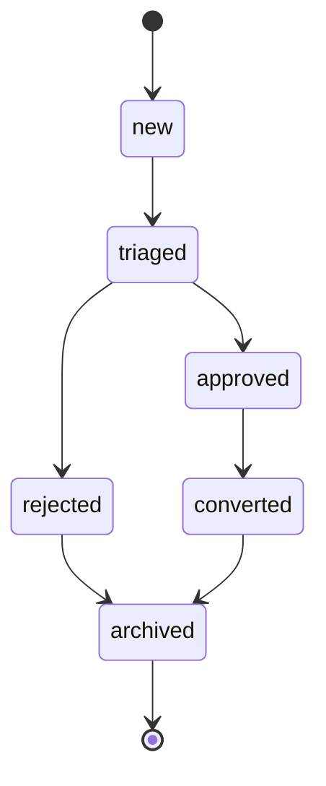
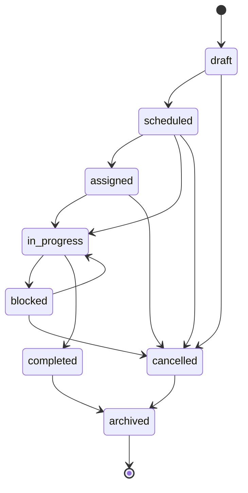
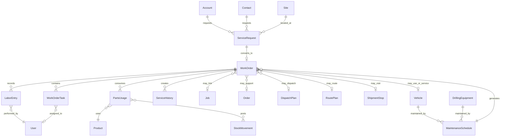
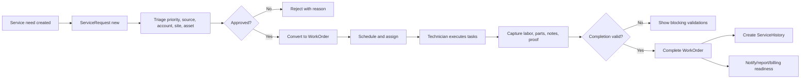

# 11_Service_Work_Orders

## 1. Document Metadata

| Field | Value |
| --- | --- |
| Document name | `11_Service_Work_Orders.md` |
| Phase | Phase 11 |
| Module | Service / Work Orders |
| Status | Draft implementation-ready phase specification |
| Prepared for | Product, engineering, design, QA, implementation, reporting, integrations, and future phase writers |
| Source-of-truth inputs | `00_Master_Platform_Documentation.md`, `00_Global_Documentation_Rules.md`, `00_Global_Domain_Model.md`, `00_Global_Decisions_Register.md`, prior phase summaries 01-10 |
| Output companion | `11_Service_Work_Orders__Summary_For_Future_Phases.md` |
| Last updated | 2026-05-09 |

## 2. Phase Purpose

Phase 11 defines the Service / Work Orders module for the platform. It establishes the official service intake, work order execution, technician tasking, labor tracking, parts usage, maintenance scheduling, service history, notifications, audit, reporting, integration, and offline mobile rules.

This phase must connect customer relationship context, sites, jobs, inventory, dispatch, vehicles, and future accounting readiness without duplicating canonical entities from earlier phases. Service work is part of the unified platform, not a disconnected field-service product.

## 3. Phase Goals

- Define `ServiceRequest`, `WorkOrder`, `WorkOrderTask`, `MaintenanceSchedule`, `ServiceHistory`, `LaborEntry`, and `PartsUsage` as canonical Phase 11 entities.
- Separate intake (`ServiceRequest`) from execution (`WorkOrder`) and from general work reminders (`Task`).
- Support service manager, dispatcher, technician, warehouse, inventory, billing, and manager workflows.
- Preserve links to Account, Contact, Site, Job, Order, DispatchPlan, RoutePlan, ShipmentStop, Vehicle, Driver, Depot, Warehouse, Product, and StockMovement where applicable.
- Make service data searchable, reportable, auditable, permission-controlled, and mobile/offline compatible.
- Establish clean foundations for reporting, QuickBooks, notifications/automation, offline sync, and final blueprint phases.

## 4. Scope

### In Scope

- Service intake and triage.
- Conversion of approved service requests into work orders.
- Work order scheduling, assignment, execution, blocking, completion, cancellation, and archival.
- Work order task/checklist management.
- Labor entry capture, submission, approval, rejection, and voiding.
- Parts planning, reservation, usage, return, and inventory linkage.
- Preventive maintenance schedules for vehicles, drilling equipment, and approved future assets.
- Service history creation and display on account, site, vehicle, and asset timelines.
- Service-specific permissions, notifications, audit events, saved views, reports, mobile/offline behavior, and conceptual APIs.

### Out of Scope But Future-Compatible

- Full QuickBooks invoice creation or sync.
- Payroll processing.
- Customer-facing portal.
- Advanced AI scheduling or technician optimization.
- Full route optimization.
- Native ELD/compliance workflows.
- Warranty claim adjudication unless later approved.
- Complex contract entitlement and advanced SLA policy engine.

## 5. Non-Goals

- Do not create Phase 12 or reporting implementation details beyond Phase 11 reporting requirements.
- Do not redefine CRM, inventory, dispatch, fleet, task, audit, notification, file, or QuickBooks foundations.
- Do not create duplicate entities such as `ServiceTicket`, `RepairTicket`, `ServiceTask`, `PartLine`, or `TechnicianTime` when canonical entities already cover the concept.
- Do not make WorkOrder a replacement for Job or Task.
- Do not make WorkOrder notes the source of truth for parts, labor, billing, or service history.

## 6. Source-of-Truth Definitions

| Concept | Definition | Source Rule |
| --- | --- | --- |
| `WorkOrder` | Canonical service execution record. | Use for service work with technicians, tasks, parts, labor, proof, and history. |
| `Job` | Generic operational field work record. | Link to WorkOrder only when service overlaps scheduled field operations. |
| `Task` | General actionable item. | Use for follow-ups and reminders outside a WorkOrder checklist. |
| `Product` | Canonical item used by inventory, orders, service parts, and QuickBooks readiness. | PartsUsage must reference Product. |
| `StockMovement` | Append-only inventory quantity event. | PartsUsage quantity changes must create or reference StockMovement. |
| `FileAttachment` | Canonical file/photo/document/proof model. | Service photos/signatures/files are attachments, not binary fields. |
| `Notification` | Canonical recipient-facing notification. | Service notifications must use this foundation. |
| `AuditLog` | Canonical append-only audit event. | Service actions with operational, security, billing, inventory, or lifecycle impact must audit. |

## 7. Canonical Entity Definitions

### 7.1 `ServiceRequest`

| Attribute | Definition |
| --- | --- |
| Purpose | Canonical intake record for a customer, internal, asset, dispatch, or integration-reported service need before execution is approved or converted into a WorkOrder. |
| Owner module | Service / Work Orders |
| Scope | Company-scoped service intake, optionally tied to Account, Contact, Site, Job, Order, ShipmentStop, Vehicle, DrillingEquipment, or other approved serviceable entity. |
| Tenant/company scoping | Must include `tenant_id` and `company_id`; optional `branch_id`, `depot_id`, `warehouse_id`, or asset/location references are used only where meaningful. |
| Lifecycle type | Mutable operational record unless noted; operational event/history rows are append-only or correction-only. |
| Permissions impact | Must be guarded by service module permission, company access, related module access where cross-module actions occur, and record assignment rules where configured. |
| Audit requirements | Create, update, status transition, assignment, delete/archive, override, inventory, labor approval, and export-impacting changes must write AuditLog. |
| Reporting impact | Status, timestamps, priority, assignment, source, asset, account, site, parts, labor, and completion fields must be reportable. |
| Future-phase impact | Reporting, automation, customer portals, SLA dashboards, and integration intake must use ServiceRequest instead of creating service ticket intake duplicates. |

**Key fields**

`id`, `tenant_id`, `company_id`, `branch_id`, `account_id`, `site_id`, `requester_contact_id`, `requester_user_id`, `source`, `source_record_type`, `source_record_id`, `issue_title`, `issue_description`, `priority`, `severity`, `status`, `requested_at`, `needed_by_at`, `triaged_at`, `approved_at`, `rejected_at`, `converted_work_order_id`, `assigned_team_id`, `assigned_user_id`, `sla_due_at`, `external_refs`, `tags`, `custom_fields`, `created_at`, `created_by_user_id`, `updated_at`, `updated_by_user_id`, `deleted_at`

**Relationships**

`Account`, `Contact`, `Site`, `User`, `Team`, `WorkOrder`, `Task`, `Activity`, `FileAttachment`, `TagAssignment`, `AuditLog`

**Lifecycle statuses**

`new`, `triaged`, `approved`, `rejected`, `converted`, `archived`

**Index considerations**

- `tenant_id + company_id + status`
- `tenant_id + company_id + priority + requested_at`
- `tenant_id + company_id + account_id`
- `tenant_id + company_id + site_id`
- `tenant_id + company_id + assigned_user_id`
- `tenant_id + company_id + converted_work_order_id`
- `text: issue_title, issue_description`

### 7.2 `WorkOrder`

| Attribute | Definition |
| --- | --- |
| Purpose | Canonical service execution record assigned to technicians and used to manage service tasks, labor, parts, completion proof, service history, and billing readiness. |
| Owner module | Service / Work Orders |
| Scope | Company-scoped service execution record. It may link to a ServiceRequest, Job, DispatchPlan, RoutePlan, ShipmentStop, Order, Account, Site, Vehicle, Driver, Crew, or maintenance schedule where relevant. |
| Tenant/company scoping | Must include `tenant_id` and `company_id`; optional `branch_id`, `depot_id`, `warehouse_id`, or asset/location references are used only where meaningful. |
| Lifecycle type | Mutable operational record unless noted; operational event/history rows are append-only or correction-only. |
| Permissions impact | Must be guarded by service module permission, company access, related module access where cross-module actions occur, and record assignment rules where configured. |
| Audit requirements | Create, update, status transition, assignment, delete/archive, override, inventory, labor approval, and export-impacting changes must write AuditLog. |
| Reporting impact | Status, timestamps, priority, assignment, source, asset, account, site, parts, labor, and completion fields must be reportable. |
| Future-phase impact | QuickBooks, reporting, offline mobile, customer notifications, and automation must treat WorkOrder as service execution, not as generic Task or Job replacement. |

**Key fields**

`id`, `tenant_id`, `company_id`, `branch_id`, `work_order_number`, `service_request_id`, `maintenance_schedule_id`, `account_id`, `contact_ids`, `site_id`, `job_id`, `order_id`, `dispatch_plan_id`, `route_plan_id`, `shipment_stop_id`, `asset_type`, `asset_id`, `assigned_user_id`, `assigned_team_id`, `crew_id`, `vehicle_id`, `depot_id`, `status`, `priority`, `service_type`, `problem_summary`, `instructions`, `scheduled_start_at`, `scheduled_end_at`, `started_at`, `completed_at`, `cancelled_at`, `blocked_reason`, `resolution_summary`, `completion_notes`, `customer_signature_attachment_id`, `before_photo_attachment_ids`, `after_photo_attachment_ids`, `billable_status`, `billing_hold_reason`, `parts_total_amount`, `labor_total_hours_qty`, `labor_total_amount`, `external_refs`, `created_at`, `created_by_user_id`, `updated_at`, `updated_by_user_id`, `deleted_at`

**Relationships**

`ServiceRequest`, `WorkOrderTask`, `LaborEntry`, `PartsUsage`, `ServiceHistory`, `Account`, `Contact`, `Site`, `Job`, `Task`, `CalendarEvent`, `Appointment`, `Vehicle`, `Driver`, `Depot`, `Warehouse`, `Product`, `StockMovement`, `FileAttachment`, `Activity`, `Notification`, `AuditLog`

**Lifecycle statuses**

`draft`, `scheduled`, `assigned`, `in_progress`, `blocked`, `completed`, `cancelled`, `archived`

**Index considerations**

- `tenant_id + company_id + status`
- `tenant_id + company_id + scheduled_start_at`
- `tenant_id + company_id + assigned_user_id + status`
- `tenant_id + company_id + site_id`
- `tenant_id + company_id + account_id`
- `tenant_id + company_id + asset_type + asset_id`
- `tenant_id + company_id + work_order_number unique`
- `text: problem_summary, instructions, resolution_summary`

### 7.3 `WorkOrderTask`

| Attribute | Definition |
| --- | --- |
| Purpose | Checklist, inspection step, required action, safety step, or technician task inside a WorkOrder. |
| Owner module | Service / Work Orders |
| Scope | Record-scoped child of WorkOrder with tenant/company fields for permission checks, sync, reporting, and indexing. |
| Tenant/company scoping | Must include `tenant_id` and `company_id`; optional `branch_id`, `depot_id`, `warehouse_id`, or asset/location references are used only where meaningful. |
| Lifecycle type | Mutable operational record unless noted; operational event/history rows are append-only or correction-only. |
| Permissions impact | Must be guarded by service module permission, company access, related module access where cross-module actions occur, and record assignment rules where configured. |
| Audit requirements | Create, update, status transition, assignment, delete/archive, override, inventory, labor approval, and export-impacting changes must write AuditLog. |
| Reporting impact | Status, timestamps, priority, assignment, source, asset, account, site, parts, labor, and completion fields must be reportable. |
| Future-phase impact | Future inspection templates and automation may generate WorkOrderTask rows, but general follow-up work must use canonical Task. |

**Key fields**

`id`, `tenant_id`, `company_id`, `work_order_id`, `title`, `description`, `task_type`, `sort_order`, `required`, `assigned_user_id`, `status`, `started_at`, `completed_at`, `completed_by_user_id`, `skipped_at`, `skipped_by_user_id`, `skip_reason`, `requires_photo`, `requires_signature`, `requires_meter_reading`, `input_schema`, `captured_value`, `created_at`, `created_by_user_id`, `updated_at`, `updated_by_user_id`

**Relationships**

`WorkOrder`, `User`, `FileAttachment`, `AuditLog`

**Lifecycle statuses**

`open`, `in_progress`, `completed`, `skipped`

**Index considerations**

- `tenant_id + company_id + work_order_id + sort_order`
- `tenant_id + company_id + assigned_user_id + status`
- `tenant_id + company_id + status`

### 7.4 `MaintenanceSchedule`

| Attribute | Definition |
| --- | --- |
| Purpose | Recurring preventive maintenance or scheduled service plan for Vehicle, DrillingEquipment, or approved asset types. |
| Owner module | Service / Work Orders |
| Scope | Company-scoped schedule configuration tied to an asset and RecurrenceRule, optionally generating WorkOrders or reminders. |
| Tenant/company scoping | Must include `tenant_id` and `company_id`; optional `branch_id`, `depot_id`, `warehouse_id`, or asset/location references are used only where meaningful. |
| Lifecycle type | Mutable operational record unless noted; operational event/history rows are append-only or correction-only. |
| Permissions impact | Must be guarded by service module permission, company access, related module access where cross-module actions occur, and record assignment rules where configured. |
| Audit requirements | Create, update, status transition, assignment, delete/archive, override, inventory, labor approval, and export-impacting changes must write AuditLog. |
| Reporting impact | Status, timestamps, priority, assignment, source, asset, account, site, parts, labor, and completion fields must be reportable. |
| Future-phase impact | Automation, fleet health, drilling equipment maintenance, reporting, and offline technician queues must reuse this schedule model. |

**Key fields**

`id`, `tenant_id`, `company_id`, `branch_id`, `asset_type`, `asset_id`, `name`, `description`, `service_type`, `recurrence_rule_id`, `meter_basis`, `meter_threshold_value`, `last_service_work_order_id`, `last_service_at`, `last_meter_value`, `next_due_at`, `next_due_meter_value`, `lead_time_days`, `auto_generate_work_order`, `default_assigned_user_id`, `default_team_id`, `default_depot_id`, `default_task_template_id`, `status`, `paused_reason`, `created_at`, `created_by_user_id`, `updated_at`, `updated_by_user_id`, `archived_at`

**Relationships**

`Vehicle`, `DrillingEquipment`, `RecurrenceRule`, `WorkOrder`, `Task`, `Reminder`, `Notification`, `AuditLog`

**Lifecycle statuses**

`active`, `paused`, `expired`, `archived`

**Index considerations**

- `tenant_id + company_id + status + next_due_at`
- `tenant_id + company_id + asset_type + asset_id`
- `tenant_id + company_id + recurrence_rule_id`

### 7.5 `ServiceHistory`

| Attribute | Definition |
| --- | --- |
| Purpose | Immutable or append-only service completion history derived from completed WorkOrders and used to show historical service by account, site, vehicle, equipment, or other serviceable entity. |
| Owner module | Service / Work Orders |
| Scope | Company-scoped historical record linked to WorkOrder and service entity; optimized for timeline, reporting, and asset history. |
| Tenant/company scoping | Must include `tenant_id` and `company_id`; optional `branch_id`, `depot_id`, `warehouse_id`, or asset/location references are used only where meaningful. |
| Lifecycle type | Mutable operational record unless noted; operational event/history rows are append-only or correction-only. |
| Permissions impact | Must be guarded by service module permission, company access, related module access where cross-module actions occur, and record assignment rules where configured. |
| Audit requirements | Create, update, status transition, assignment, delete/archive, override, inventory, labor approval, and export-impacting changes must write AuditLog. |
| Reporting impact | Status, timestamps, priority, assignment, source, asset, account, site, parts, labor, and completion fields must be reportable. |
| Future-phase impact | Reporting and customer/asset history must use ServiceHistory as the read-optimized history record while WorkOrder remains the execution source. |

**Key fields**

`id`, `tenant_id`, `company_id`, `work_order_id`, `service_entity_type`, `service_entity_id`, `account_id`, `site_id`, `asset_type`, `asset_id`, `service_type`, `completed_at`, `completed_by_user_id`, `summary`, `resolution_summary`, `parts_used_count`, `labor_hours_qty`, `billable_status`, `source_status`, `created_at`, `created_by_user_id`

**Relationships**

`WorkOrder`, `Account`, `Site`, `Vehicle`, `DrillingEquipment`, `User`, `Activity`, `AuditLog`

**Lifecycle statuses**

`recorded`

**Index considerations**

- `tenant_id + company_id + service_entity_type + service_entity_id + completed_at`
- `tenant_id + company_id + account_id + completed_at`
- `tenant_id + company_id + site_id + completed_at`
- `tenant_id + company_id + work_order_id unique`

### 7.6 `LaborEntry`

| Attribute | Definition |
| --- | --- |
| Purpose | Technician or worker time entry against a WorkOrder for operational cost, productivity, billing readiness, and reporting. |
| Owner module | Service / Work Orders |
| Scope | Company-scoped child record under WorkOrder, linked to User and optionally crew/team. |
| Tenant/company scoping | Must include `tenant_id` and `company_id`; optional `branch_id`, `depot_id`, `warehouse_id`, or asset/location references are used only where meaningful. |
| Lifecycle type | Mutable operational record unless noted; operational event/history rows are append-only or correction-only. |
| Permissions impact | Must be guarded by service module permission, company access, related module access where cross-module actions occur, and record assignment rules where configured. |
| Audit requirements | Create, update, status transition, assignment, delete/archive, override, inventory, labor approval, and export-impacting changes must write AuditLog. |
| Reporting impact | Status, timestamps, priority, assignment, source, asset, account, site, parts, labor, and completion fields must be reportable. |
| Future-phase impact | Payroll is out of scope; QuickBooks and reporting may consume approved LaborEntry summaries where billing integration is later approved. |

**Key fields**

`id`, `tenant_id`, `company_id`, `work_order_id`, `user_id`, `team_id`, `labor_type`, `started_at`, `ended_at`, `hours_qty`, `break_minutes_qty`, `rate_type`, `cost_rate_amount`, `bill_rate_amount`, `billable`, `status`, `submitted_at`, `submitted_by_user_id`, `approved_at`, `approved_by_user_id`, `rejected_at`, `rejected_by_user_id`, `rejection_reason`, `notes`, `created_at`, `created_by_user_id`, `updated_at`, `updated_by_user_id`

**Relationships**

`WorkOrder`, `User`, `Team`, `AuditLog`

**Lifecycle statuses**

`draft`, `submitted`, `approved`, `rejected`, `voided`

**Index considerations**

- `tenant_id + company_id + work_order_id`
- `tenant_id + company_id + user_id + started_at`
- `tenant_id + company_id + status`
- `tenant_id + company_id + approved_at`

### 7.7 `PartsUsage`

| Attribute | Definition |
| --- | --- |
| Purpose | Planned, reserved, consumed, returned, or cancelled part usage on a WorkOrder, linked to canonical Product and inventory StockMovement. |
| Owner module | Service / Work Orders with Inventory / Warehouse stock ownership |
| Scope | Company-scoped child record under WorkOrder; quantity-changing actions must create or reference StockMovement. |
| Tenant/company scoping | Must include `tenant_id` and `company_id`; optional `branch_id`, `depot_id`, `warehouse_id`, or asset/location references are used only where meaningful. |
| Lifecycle type | Mutable operational record unless noted; operational event/history rows are append-only or correction-only. |
| Permissions impact | Must be guarded by service module permission, company access, related module access where cross-module actions occur, and record assignment rules where configured. |
| Audit requirements | Create, update, status transition, assignment, delete/archive, override, inventory, labor approval, and export-impacting changes must write AuditLog. |
| Reporting impact | Status, timestamps, priority, assignment, source, asset, account, site, parts, labor, and completion fields must be reportable. |
| Future-phase impact | QuickBooks item mapping, service margin reports, inventory availability, and offline mobile parts capture must reuse PartsUsage and StockMovement rules. |

**Key fields**

`id`, `tenant_id`, `company_id`, `work_order_id`, `product_id`, `inventory_item_id`, `stock_unit_id`, `requested_qty`, `reserved_qty`, `used_qty`, `returned_qty`, `scrapped_qty`, `source_location_type`, `source_location_id`, `source_bin_location_id`, `stock_movement_ids`, `status`, `unit_cost_amount`, `unit_bill_amount`, `billable`, `used_at`, `used_by_user_id`, `returned_at`, `returned_by_user_id`, `return_reason`, `notes`, `created_at`, `created_by_user_id`, `updated_at`, `updated_by_user_id`

**Relationships**

`WorkOrder`, `Product`, `InventoryItem`, `StockUnit`, `Warehouse`, `Depot`, `Vehicle`, `BinLocation`, `StockMovement`, `PickTicket`, `AuditLog`

**Lifecycle statuses**

`planned`, `reserved`, `used`, `partially_returned`, `returned`, `cancelled`

**Index considerations**

- `tenant_id + company_id + work_order_id`
- `tenant_id + company_id + product_id`
- `tenant_id + company_id + status`
- `tenant_id + company_id + source_location_type + source_location_id`

## 8. Entity Lifecycle and Status Rules

### 8.1 ServiceRequest Lifecycle

Rules:
- `new` means intake exists but has not been reviewed.
- `triaged` means priority, source, and required context were reviewed.
- `approved` means it can become a WorkOrder.
- `rejected` requires a reason.
- `converted` requires `converted_work_order_id`.
- `archived` hides the request from active queues without deleting history.

### 8.2 WorkOrder Lifecycle

Rules:
- `draft` may be incomplete and must not appear in technician execution queues unless explicitly assigned.
- `scheduled` has a planned service window.
- `assigned` has an assigned technician, team, or crew.
- `in_progress` starts active execution.
- `blocked` requires a reason and should optionally create a follow-up Task.
- `completed` requires completion validations.
- `cancelled` requires a cancellation reason and does not delete history.
- `archived` removes from active operational views while preserving reporting/audit as configured.

### 8.3 Other Lifecycle Rules

- WorkOrderTask may be `open`, `in_progress`, `completed`, or `skipped`.
- MaintenanceSchedule may be `active`, `paused`, `expired`, or `archived`.
- ServiceHistory is `recorded` and should be append-only unless a correction model is approved.
- LaborEntry may be `draft`, `submitted`, `approved`, `rejected`, or `voided`.
- PartsUsage may be `planned`, `reserved`, `used`, `partially_returned`, `returned`, or `cancelled`.

## 9. Entity Relationship Rules

Relationship rules:
- A ServiceRequest may convert to one WorkOrder by default. Multiple WorkOrders require a documented supervisor override.
- A WorkOrder may exist without ServiceRequest for internal maintenance, recurring maintenance, emergency service, or manager-created work.
- PartsUsage must reference Product and any stock-changing action must create or reference StockMovement.
- ServiceHistory should be created from completed WorkOrders, not from standalone notes.
- MaintenanceSchedule may generate WorkOrders or reminders; it must not create duplicate schedule entities.
- WorkOrder may link to Job only when generic field work and service execution overlap.

## 10. Workflow Requirements

### 10.1 Service Intake to WorkOrder

### 10.2 Preventive Maintenance

- Manager creates MaintenanceSchedule for Vehicle or DrillingEquipment.
- Schedule uses RecurrenceRule and optional meter fields.
- BackgroundJob evaluates due schedules.
- System creates Reminder, Task, or WorkOrder depending company configuration.
- WorkOrder completion updates last service metadata and creates ServiceHistory.

### 10.3 Parts Usage

- Manager or technician plans required parts.
- Inventory checks availability by product/location/bin/condition where inventory module allows it.
- Reservation creates or links reservation movement/state through inventory rules.
- Usage creates StockMovement.
- Return creates return StockMovement.
- Cancel releases reservation without consumption.

## 11. Data Model Requirements

- Use singular PascalCase entity names and snake_case field names.
- Use `id` as stable application identifier.
- Include `tenant_id`, `company_id`, timestamps, actor metadata, status, and external_refs where applicable.
- Preserve history through status changes, audit logs, and append-only event/history records rather than destructive updates.
- Do not embed large child collections in WorkOrder when child records need permissions, reporting, audit, offline sync, or independent lifecycle.
- Use child collections for WorkOrderTask, LaborEntry, and PartsUsage.
- Use ServiceHistory as a read-optimized history record generated from completed WorkOrders.
- Store files and photos as FileAttachment references.
- Store external provider identifiers in external_refs or ExternalReference.
- Support optimistic concurrency/versioning on mutable operational records used offline.

## 12. API Requirements

| ID | Requirement |
| --- | --- |
| API-11-001 | Expose REST resources under /api/v1/service-requests, /api/v1/work-orders, /api/v1/work-order-tasks, /api/v1/maintenance-schedules, /api/v1/service-history, /api/v1/labor-entries, and /api/v1/parts-usage. |
| API-11-002 | Provide list endpoints with filters for status, priority, account_id, site_id, assigned_user_id, assigned_team_id, scheduled window, due window, asset, source, and created date. |
| API-11-003 | Provide detail endpoints that include permission-filtered related summaries for tasks, labor, parts, files, history, and audit summary. |
| API-11-004 | Provide POST /service-requests/{service_request_id}/convert-to-work-order with idempotency_key and conversion options. |
| API-11-005 | Provide POST /work-orders/{work_order_id}/status-transitions for lifecycle transitions rather than allowing unsafe direct status mutation for high-impact states. |
| API-11-006 | Provide POST /work-orders/{work_order_id}/assign for technician, team, crew, and schedule assignment changes. |
| API-11-007 | Provide POST /work-orders/{work_order_id}/complete with completion payload, required validations, final notes, proof references, and idempotency_key. |
| API-11-008 | Provide WorkOrderTask batch reorder endpoint with optimistic concurrency version checking. |
| API-11-009 | Provide LaborEntry submit, approve, reject, and void endpoints with permission-specific validation. |
| API-11-010 | Provide PartsUsage reserve, use, return, cancel endpoints that integrate with inventory StockMovement creation or references. |
| API-11-011 | Provide MaintenanceSchedule generate-preview endpoint to show next due dates without creating records. |
| API-11-012 | Provide MaintenanceSchedule generate-work-order endpoint for manual manager-triggered generation. |
| API-11-013 | Provide service mobile sync endpoints that accept batched offline changes, return accepted records, rejected records, conflict details, and server versions. |
| API-11-014 | Provide report-summary endpoints only as lightweight aggregates; full reporting belongs to the reporting phase. |
| API-11-015 | Require all mutating endpoints to accept or generate request IDs for audit correlation and idempotency where retries are likely. |
| API-11-016 | Return 403 for permission failures, 409 for version/sync conflicts, 422 for validation errors, and safe error payloads for inventory reservation failures. |

## 13. UI / UX Requirements

| ID | Requirement |
| --- | --- |
| UX-11-001 | Provide a Service Requests list with table, filters, saved views, quick create, source chips, status chips, and priority indicators. |
| UX-11-002 | Provide a ServiceRequest detail page with header, requester context, issue summary, triage panel, related account/site/contact, files, notes, timeline, and conversion action. |
| UX-11-003 | Provide a Work Orders board grouped by status with cards showing priority, customer, site, technician, scheduled window, SLA indicator, parts status, and blocked state. |
| UX-11-004 | Provide a Work Orders table for operations users needing dense filtering, sorting, export, and bulk assignment. |
| UX-11-005 | Provide a WorkOrder detail page with persistent header, status transition actions, assignment panel, schedule panel, task checklist, labor tab, parts tab, files/proof tab, timeline, and audit summary. |
| UX-11-006 | Provide a technician mobile work queue sorted by today, overdue, nearby/site context where available, priority, and assigned status. |
| UX-11-007 | Provide a mobile execution screen with offline banner, checklist, start/stop work, add labor, add part, capture photo, add note, collect signature, and complete action. |
| UX-11-008 | Provide a Maintenance Schedule list and detail screen with asset context, recurrence, next due date, last service, paused state, and generated work orders. |
| UX-11-009 | Provide a Service History tab on Account, Site, Vehicle, and asset detail pages, permission-filtered and chronological. |
| UX-11-010 | Provide empty states that explain whether no records exist, filters are too narrow, the module is disabled, or the user lacks permission. |
| UX-11-011 | Provide error states for inventory unavailable, required task incomplete, offline conflict, permission denied, invalid status transition, missing required proof, and stale record version. |
| UX-11-012 | Hide cost, margin, billing, approval, export, and audit actions from users without relevant permissions while preserving safe read-only operational fields. |
| UX-11-013 | Provide inline validation for required service fields and prevent completion until blocking validation failures are resolved. |
| UX-11-014 | Provide clear confirmation dialogs for cancel, archive, void labor, override required task, and consume inventory actions. |
| UX-11-015 | Provide saved views for My Work Orders, Unassigned, Overdue, Blocked, Awaiting Parts, Ready for Billing, Completed This Week, Preventive Maintenance Due, and Emergency Work. |
| UX-11-016 | Provide responsive desktop layouts for service managers and simplified mobile layouts for technicians. |

## 14. Search, Filters, and Saved Views

Search and filtering must cover ServiceRequest, WorkOrder, WorkOrderTask, MaintenanceSchedule, ServiceHistory, LaborEntry, and PartsUsage where appropriate. SearchIndexRecord must be updated after creates, updates, completion, cancellation, archival, and relationship changes. SavedView must support private, team, and company-shared service views where permissions allow.

Recommended default saved views:

- My assigned WorkOrders.
- Unassigned WorkOrders.
- Overdue WorkOrders.
- Blocked WorkOrders.
- Awaiting parts.
- Ready for billing.
- Completed this week.
- Preventive maintenance due.
- Emergency service.
- ServiceRequests needing triage.

## 15. Permissions and Access Control

| ID | Requirement |
| --- | --- |
| PERM-11-001 | Define service.service_request.view, create, update, triage, approve, reject, convert, archive, export. |
| PERM-11-002 | Define service.work_order.view, create, update, schedule, assign, start, block, complete, cancel, archive, export. |
| PERM-11-003 | Define service.work_order_task.manage and service.work_order_task.complete. |
| PERM-11-004 | Define service.labor_entry.view, create, update_own, submit, approve, reject, void, view_cost, export. |
| PERM-11-005 | Define service.parts_usage.view, plan, reserve, use, return, cancel, view_cost, edit_billable_amount. |
| PERM-11-006 | Define service.maintenance_schedule.view, create, update, pause, resume, generate_work_order, archive. |
| PERM-11-007 | Define service.service_history.view and export. |
| PERM-11-008 | Require inventory permissions for stock reservation, stock consumption, stock return, and stock adjustment triggered by PartsUsage. |
| PERM-11-009 | Require file permissions for uploading, viewing, and deleting service attachments. |
| PERM-11-010 | Require audit permissions for viewing detailed audit panels. |
| PERM-11-011 | Allow technicians to view and update only assigned WorkOrders by default unless broader service visibility is granted. |
| PERM-11-012 | Allow managers to view team and company service queues according to company and team membership. |
| PERM-11-013 | Prevent users without cost permissions from seeing cost_rate_amount, unit_cost_amount, margin, and internal cost totals. |
| PERM-11-014 | Prevent users without billing permissions from changing billable_status, bill rates, billing hold reason, or ready-for-billing state. |
| PERM-11-015 | Revalidate all offline actions on sync using current company, module, role, record, and inventory permissions. |

## 16. Notifications

| ID | Requirement |
| --- | --- |
| NOTIF-11-001 | Notify service managers when high-priority ServiceRequests are created. |
| NOTIF-11-002 | Notify assigned technician when a WorkOrder is assigned or schedule changes. |
| NOTIF-11-003 | Notify service manager when a WorkOrder becomes blocked or remains blocked beyond configured threshold. |
| NOTIF-11-004 | Notify assigned users before scheduled start where Reminder preferences allow. |
| NOTIF-11-005 | Notify inventory or warehouse users when planned parts cannot be reserved. |
| NOTIF-11-006 | Notify approvers when LaborEntries are submitted for approval. |
| NOTIF-11-007 | Notify requester or account owner when a WorkOrder is completed if company settings enable customer-facing updates. |
| NOTIF-11-008 | Notify maintenance owners when MaintenanceSchedule is due soon or overdue. |
| NOTIF-11-009 | Notify billing/finance role when a WorkOrder becomes ready for billing if billing workflows are enabled. |
| NOTIF-11-010 | All notifications must create canonical Notification records and may later trigger email, SMS, push, or webhook delivery. |

## 17. Audit Logging

| ID | Requirement |
| --- | --- |
| AUDIT-11-001 | Record ServiceRequest created, updated, triaged, approved, rejected, converted, archived, and restored where restore is supported. |
| AUDIT-11-002 | Record WorkOrder created, scheduled, assigned, started, status changed, blocked, unblocked, completed, cancelled, archived, and reopened where allowed. |
| AUDIT-11-003 | Record WorkOrderTask created, updated, reordered, completed, skipped, override approved, and deleted/archived. |
| AUDIT-11-004 | Record LaborEntry created, timer started, timer stopped, submitted, approved, rejected, voided, and cost/bill rate changed. |
| AUDIT-11-005 | Record PartsUsage planned, reserved, used, returned, cancelled, cost changed, bill amount changed, and StockMovement linked. |
| AUDIT-11-006 | Record MaintenanceSchedule created, updated, paused, resumed, expired, archived, generated WorkOrder, and recurrence changed. |
| AUDIT-11-007 | Record ServiceHistory created and corrected if correction workflow is later approved. |
| AUDIT-11-008 | Record file attachment upload, deletion, signature capture, and proof replacement on service records. |
| AUDIT-11-009 | Record export, bulk update, bulk assignment, and permission override actions. |
| AUDIT-11-010 | Audit payloads must include actor, tenant, company, entity, entity_id, action, before/after values for critical fields, occurred_at, request_id, source client, and offline sync correlation where applicable. |

## 18. Reporting and Analytics Impact

| ID | Requirement |
| --- | --- |
| REPORT-11-001 | Service backlog by status, priority, assigned user/team, site, account, branch, and due window. |
| REPORT-11-002 | WorkOrder completion volume and average cycle time by technician, team, service type, customer, site, and asset. |
| REPORT-11-003 | SLA due, at-risk, breached, and completed-within-SLA metrics. |
| REPORT-11-004 | First response time from ServiceRequest creation to triage and conversion. |
| REPORT-11-005 | WorkOrder scheduled versus actual start and completion variance. |
| REPORT-11-006 | Blocked WorkOrders by reason, duration, account, site, and responsible team. |
| REPORT-11-007 | Labor hours by user, team, work order, service type, billable status, and approval status. |
| REPORT-11-008 | Parts usage by Product, location, technician, WorkOrder, account, site, asset, and billable status. |
| REPORT-11-009 | Maintenance compliance by asset, schedule, due date, overdue count, and completed preventive work. |
| REPORT-11-010 | Service history by Account, Site, Vehicle, DrillingEquipment, and service type. |
| REPORT-11-011 | Billing readiness by WorkOrder, including completed, billing hold, labor approved, parts finalized, and proof collected. |
| REPORT-11-012 | Technician productivity dashboards that exclude private cost fields unless permission allows. |

## 19. Mobile and Offline Impact

| ID | Requirement |
| --- | --- |
| OFFLINE-11-001 | Technician mobile app must support offline viewing of assigned WorkOrders, essential account/site context, tasks, parts planned, and instructions. |
| OFFLINE-11-002 | Technicians must be able to complete WorkOrderTasks, capture notes, capture photos, log labor, and stage parts usage offline. |
| OFFLINE-11-003 | Offline WorkOrder completion must remain pending until server validates permissions, required fields, inventory effects, and status version. |
| OFFLINE-11-004 | Offline parts usage must not permanently decrement inventory until synced and validated by server-side inventory rules. |
| OFFLINE-11-005 | Offline conflict UI must show whether server status changed, assignment changed, inventory became unavailable, or required fields changed. |
| OFFLINE-11-006 | Offline file attachments must upload through FileAttachment with retry and visible sync status. |
| OFFLINE-11-007 | Offline labor timers must preserve local timestamps and timezone metadata. |
| OFFLINE-11-008 | Mobile sync must be idempotent and must protect against duplicate labor, parts, and completion events. |

## 20. Integration Impact

| ID | Requirement |
| --- | --- |
| INT-11-001 | QuickBooks phase must map WorkOrder, approved LaborEntry, and finalized PartsUsage into invoice/billing candidates only after billing readiness rules are satisfied. |
| INT-11-002 | Inventory integrations must treat PartsUsage inventory changes as StockMovement-driven events. |
| INT-11-003 | Fleet tracking may surface vehicle odometer, device health, and location context for maintenance planning but Phase 11 must not depend on advanced telematics automation. |
| INT-11-004 | Dispatch integrations may create or link WorkOrders from DeliveryException, ShipmentStop, DispatchPlan, or RoutePlan context. |
| INT-11-005 | Calendar integrations may display WorkOrder schedules through CalendarEvent or Appointment links but must not create duplicate service calendars. |
| INT-11-006 | Webhook events should be prepared for service_request.created, work_order.assigned, work_order.completed, parts_usage.used, labor_entry.approved, and maintenance_schedule.due. |
| INT-11-007 | Import/export must use canonical ImportJob and ExportJob. |
| INT-11-008 | External service systems may store IDs in external_refs or ExternalReference, not ad hoc provider-specific public fields. |

## 21. Security Considerations

- Enforce backend authorization for every read, write, export, transition, inventory action, billing action, and audit view.
- Hide cost, margin, bill rate, billing hold, export, and audit detail fields unless permission allows.
- Prevent cross-company bulk actions and cross-tenant references.
- Treat offline actions as untrusted until server validation.
- Validate attachment access on every service photo, signature, and document request.
- Ensure customer-facing notifications do not leak internal notes, cost, margin, or unrelated account data.
- Audit override actions and permission-sensitive field changes.
- Use idempotency for retry-prone mobile and integration mutations.

## 22. Edge Cases

- **EDGE-11-001:** ServiceRequest is created without Account but with Site or external source only.
- **EDGE-11-002:** ServiceRequest is rejected after files and comments were added.
- **EDGE-11-003:** Approved ServiceRequest conversion is attempted twice by two users.
- **EDGE-11-004:** WorkOrder is created directly for internal maintenance without ServiceRequest.
- **EDGE-11-005:** WorkOrder is linked to a Job but the Job is cancelled.
- **EDGE-11-006:** Assigned technician loses company membership before completing work.
- **EDGE-11-007:** Technician starts work offline after manager cancelled the WorkOrder online.
- **EDGE-11-008:** Required WorkOrderTask is skipped without permission.
- **EDGE-11-009:** A WorkOrder is completed before all LaborEntries are approved.
- **EDGE-11-010:** Part is reserved from a depot but technician uses a truck-stock equivalent product.
- **EDGE-11-011:** Inventory availability changes between offline capture and sync.
- **EDGE-11-012:** Returned part has different condition than planned.
- **EDGE-11-013:** Serialized InventoryItem is already used on another WorkOrder.
- **EDGE-11-014:** MaintenanceSchedule generates a duplicate WorkOrder because a background job retries.
- **EDGE-11-015:** Vehicle is retired while active maintenance schedule still exists.
- **EDGE-11-016:** ServiceHistory creation fails after WorkOrder completion succeeds.
- **EDGE-11-017:** Customer signature is captured but file upload is pending.
- **EDGE-11-018:** WorkOrder is blocked because site access is denied.
- **EDGE-11-019:** Emergency WorkOrder is created with no scheduled window.
- **EDGE-11-020:** Labor timer crosses midnight or timezone boundary.
- **EDGE-11-021:** User edits billable fields without billing permission through stale mobile payload.
- **EDGE-11-022:** Bulk assignment includes records from multiple companies.
- **EDGE-11-023:** WorkOrder completion proof contains sensitive customer data and must follow attachment permissions.
- **EDGE-11-024:** Service export includes cost fields requested by user without cost permission.
- **EDGE-11-025:** QuickBooks-ready flag is set before parts usage finalization.

## 23. Business Requirements

| ID | Requirement |
| --- | --- |
| BR-11-001 | The platform must support customer, internal, asset, dispatch, and integration-originated service intake without creating duplicate ticket concepts. |
| BR-11-002 | Service execution must be represented by WorkOrder and must not replace generic Job or canonical Task. |
| BR-11-003 | Service managers must be able to triage ServiceRequests, approve or reject them, and convert approved requests into WorkOrders. |
| BR-11-004 | Technicians must be able to execute assigned WorkOrders with tasks, notes, files, photos, labor, and parts usage. |
| BR-11-005 | Service work must connect to Account, Contact, Site, Vehicle, Driver, Job, Order, DispatchPlan, RoutePlan, and ShipmentStop when operational context exists. |
| BR-11-006 | WorkOrder completion must create service history that is visible on relevant customer, site, vehicle, and asset timelines when permissions allow. |
| BR-11-007 | Parts used on WorkOrders must consume canonical Product and Inventory records rather than creating service-only part catalogs. |
| BR-11-008 | Every stock-changing service part action must create or reference StockMovement. |
| BR-11-009 | Labor tracking must support submitted and approved states so reports and billing readiness can distinguish draft technician notes from approved work time. |
| BR-11-010 | Maintenance schedules must support recurring preventive service for vehicles, drilling equipment, and future approved assets. |
| BR-11-011 | Service status, priority, SLA due dates, assignments, and completion timestamps must be reportable from the beginning. |
| BR-11-012 | Service data must be mobile-friendly and offline-capable for technicians working in weak connectivity environments. |
| BR-11-013 | Managers must have dashboards and saved views for overdue, blocked, unassigned, scheduled, in-progress, completed, and billing-ready service work. |
| BR-11-014 | Service notifications must be event-driven, permission-aware, and preference-aware. |
| BR-11-015 | Service actions with operational, financial, permission, or inventory impact must be audited. |
| BR-11-016 | QuickBooks and billing phases must receive clean billing readiness signals from WorkOrder, LaborEntry, and PartsUsage, but Phase 11 must not implement accounting sync. |
| BR-11-017 | Service reports must support productivity, completion, backlog, SLA, parts usage, labor, asset history, and customer/site history analysis. |
| BR-11-018 | Service configuration must remain simple enough for MVP while preserving expansion paths for templates, automation, portals, and advanced SLA policies. |

## 24. Functional Requirements

| ID | Requirement |
| --- | --- |
| FR-11-001 | Create, view, edit, soft-archive, and search ServiceRequest records according to permission and module access rules. |
| FR-11-002 | Allow ServiceRequest creation from Account, Site, Contact, Job, Order, ShipmentStop, Vehicle, manual form, import, or integration source where module access allows. |
| FR-11-003 | Require source, issue title or description, priority, requested timestamp, company scope, and requester context where known for ServiceRequest creation. |
| FR-11-004 | Support ServiceRequest triage states: new, triaged, approved, rejected, converted, and archived. |
| FR-11-005 | Convert an approved ServiceRequest into a WorkOrder while preserving the original request, source metadata, files, notes, and audit history. |
| FR-11-006 | Prevent a ServiceRequest from converting into more than one active WorkOrder unless a supervisor override and reason are captured. |
| FR-11-007 | Create, view, edit, schedule, assign, block, complete, cancel, and archive WorkOrder records. |
| FR-11-008 | Generate human-readable work_order_number values unique within tenant/company. |
| FR-11-009 | Allow WorkOrders to exist without a ServiceRequest for internal maintenance, recurring maintenance, emergency work, or manager-created service. |
| FR-11-010 | Allow WorkOrders to link to Account, Contact, Site, Job, Order, DispatchPlan, RoutePlan, ShipmentStop, Vehicle, Driver, Crew, Depot, and MaintenanceSchedule where applicable. |
| FR-11-011 | Support WorkOrder statuses: draft, scheduled, assigned, in_progress, blocked, completed, cancelled, and archived. |
| FR-11-012 | Require blocked WorkOrders to store blocked_reason and optional follow-up Task. |
| FR-11-013 | Require completed WorkOrders to validate required WorkOrderTasks, required photos or signatures, required resolution notes, and required parts/labor policies configured by company. |
| FR-11-014 | Create a ServiceHistory record when a WorkOrder reaches completed status. |
| FR-11-015 | Update related ServiceRequest status to converted when the linked WorkOrder is created, and retain original request history after WorkOrder cancellation. |
| FR-11-016 | Support WorkOrderTask creation, sequencing, assignment, required flags, skipped reasons, and completion metadata. |
| FR-11-017 | Prevent required WorkOrderTasks from being skipped unless the user has override permission and provides a reason. |
| FR-11-018 | Allow WorkOrderTask inputs such as text, numeric value, checklist value, photo requirement, signature requirement, and meter reading reference. |
| FR-11-019 | Support LaborEntry creation from manual start/stop timer, manual time entry, or offline captured time. |
| FR-11-020 | Calculate LaborEntry hours_qty from started_at and ended_at when both are present, with manual adjustment permission controlled separately. |
| FR-11-021 | Support LaborEntry statuses: draft, submitted, approved, rejected, and voided. |
| FR-11-022 | Require approval metadata for approved LaborEntry records and rejection reason for rejected records. |
| FR-11-023 | Support PartsUsage rows for planned, reserved, used, partially returned, returned, and cancelled states. |
| FR-11-024 | Validate product_id against canonical Product and company scope. |
| FR-11-025 | Reserve or consume inventory only through approved inventory workflows and StockMovement references. |
| FR-11-026 | Allow offline technicians to capture parts usage as pending_sync, then validate inventory availability and permissions on sync. |
| FR-11-027 | Allow returns of unused parts to source Warehouse, Depot, Vehicle, or BinLocation when inventory module allows it. |
| FR-11-028 | Support MaintenanceSchedule creation for Vehicle, DrillingEquipment, and approved future asset types. |
| FR-11-029 | Use canonical RecurrenceRule for time-based maintenance recurrence. |
| FR-11-030 | Allow meter-based schedule fields to exist for future fleet/equipment readings without requiring full telematics automation in Phase 11. |
| FR-11-031 | Generate upcoming WorkOrders or reminder Tasks from MaintenanceSchedule through a controlled background job. |
| FR-11-032 | Allow managers to pause, resume, expire, or archive MaintenanceSchedule records with audit reasons. |
| FR-11-033 | Show service history on Account, Site, Vehicle, and asset detail pages when the user has permission. |
| FR-11-034 | Allow FileAttachment links for before photos, after photos, signatures, inspection documents, and customer-provided files. |
| FR-11-035 | Create or link CRM Activity timeline entries for major service milestones where appropriate. |
| FR-11-036 | Support SavedView for service request lists, work order boards, technician queues, maintenance schedules, and service history. |
| FR-11-037 | Support import through ImportJob and export through ExportJob for allowed service entities. |
| FR-11-038 | Expose service entities to global search through SearchIndexRecord without leaking unauthorized records. |
| FR-11-039 | Support bulk assignment, bulk status update, and bulk export only where permissions and safety rules allow. |
| FR-11-040 | Retain cancelled WorkOrders with cancellation reason and history rather than hard deleting operational history. |

## 25. Non-Functional Requirements

| ID | Requirement |
| --- | --- |
| NFR-11-001 | All Phase 11 records must include tenant_id and company_id unless a specific tenant/global exception is approved. |
| NFR-11-002 | All public APIs must use stable application IDs and must never expose MongoDB _id. |
| NFR-11-003 | Service list endpoints must support pagination, sorting, filtering, and permission-aware counts. |
| NFR-11-004 | High-volume mobile sync must be resilient to duplicate submissions through idempotency keys. |
| NFR-11-005 | WorkOrder completion must be transactionally consistent enough that required tasks, service history, parts, labor, and audit events cannot silently diverge. |
| NFR-11-006 | Offline-created records must carry stable client-generated IDs, created_at, actor metadata, sync status, and conflict metadata. |
| NFR-11-007 | Inventory-impacting service operations must be idempotent to avoid double stock movement on retry. |
| NFR-11-008 | Search indexing may be eventually consistent, but detail APIs must reflect source-of-truth writes immediately after successful save. |
| NFR-11-009 | Service API validation errors must be structured, field-specific, and safe for mobile clients. |
| NFR-11-010 | Service pages must load core header and status data before heavier timeline, files, and audit panels. |
| NFR-11-011 | Sensitive cost and billing fields must be hidden from users without cost or billing permission. |
| NFR-11-012 | Service exports must be asynchronous when result size or attachment inclusion exceeds safe synchronous limits. |
| NFR-11-013 | Audit events must be append-only and must not be editable by normal users. |
| NFR-11-014 | Background schedule generation jobs must expose status, retries, failures, and last processed cursor. |
| NFR-11-015 | All notifications must respect tenant, company, module access, user preferences, and permission checks. |
| NFR-11-016 | Service data retention must preserve legally and operationally relevant completion history while allowing configured archival of drafts and cancelled records. |
| NFR-11-017 | The data model must support later QuickBooks billing sync without requiring service entity renaming. |
| NFR-11-018 | All service screens must be usable on desktop, tablet, and mobile-responsive views, with technician execution optimized for mobile. |

## 26. User Stories

### Service Manager

- As a service manager, I want to triage new service requests so that urgent customer and asset issues are prioritized.
- As a service manager, I want to convert approved requests into work orders so execution can begin without losing intake context.
- As a service manager, I want to see blocked, overdue, and unassigned work so I can remove operational bottlenecks.
- As a service manager, I want to review labor, parts, proof, and completion notes so work can be closed accurately.

### Service Technician

- As a technician, I want a mobile queue of assigned work so I know what to do today.
- As a technician, I want to complete checklist tasks, add notes, capture photos, log labor, and use parts offline so weak connectivity does not stop work.
- As a technician, I want clear validation errors before completion so I know what proof or fields are missing.
- As a technician, I want my offline work to sync with visible conflict handling so I do not lose field work.

### Dispatcher / Operations Coordinator

- As a dispatcher, I want to link WorkOrders to routes, stops, vehicles, and dispatch plans so service work can be coordinated with logistics.
- As a dispatcher, I want schedule and assignment views so I can balance workloads.
- As a dispatcher, I want to know when service work is blocked by site access, vehicle issue, or parts availability.

### Warehouse / Inventory User

- As a warehouse user, I want to see planned service parts so I can reserve or pick inventory.
- As an inventory user, I want PartsUsage to create StockMovement so inventory remains accurate.
- As a warehouse manager, I want returned parts to go back to the correct location and condition.

### Billing / Finance User

- As a billing user, I want only completed and billing-ready WorkOrders to appear in billing queues.
- As a billing user, I want approved labor and finalized parts so invoice candidates are accurate.
- As a billing user, I want billing holds to prevent premature invoice sync.

### Manager / Analyst

- As a manager, I want service dashboards for backlog, SLA, productivity, parts usage, labor, and asset history.
- As an analyst, I want service records to be consistently scoped, timestamped, and status-driven so reports are trustworthy.

### Admin

- As an admin, I want service permissions to control view, edit, assign, complete, labor approval, parts usage, billing, cost, export, and audit access.
- As an admin, I want audit logs for important service actions so operational and compliance questions can be answered.

## 27. Recommended Decisions

- **RD-11-001:** Use `WorkOrder` as the only service execution entity and reserve `ServiceRequest` for intake.
- **RD-11-002:** Generate `ServiceHistory` automatically when WorkOrder reaches `completed`.
- **RD-11-003:** Treat WorkOrderTask templates as future-capable; Phase 11 should support tasks directly and template references where needed.
- **RD-11-004:** Require separate permissions for labor approval, cost visibility, billing fields, parts consumption, and export.
- **RD-11-005:** Use WorkOrder status transitions endpoint for high-impact lifecycle changes.
- **RD-11-006:** Support time-based MaintenanceSchedule recurrence in Phase 11 and keep meter-based fields ready for later automation.
- **RD-11-007:** Make mobile offline technician execution mandatory for assigned WorkOrders but defer full manager offline administration.
- **RD-11-008:** Use billing readiness fields in Phase 11 without implementing QuickBooks sync.

## 28. Open Questions

- **OQ-11-001:** Should customer-visible status labels be configured separately from internal WorkOrder statuses?
- **OQ-11-002:** Should customer signatures be required by default, by service type, or by company setting?
- **OQ-11-003:** Should meter/odometer/hour-based maintenance automation be MVP or only field-ready in Phase 11?
- **OQ-11-004:** Should ServiceHistory corrections use a correction event model or restricted admin edit workflow?
- **OQ-11-005:** Should WorkOrderTask templates be included in Phase 11 or deferred to automation/configuration?
- **OQ-11-006:** Should customer portal service intake be Phase 11 API-ready only or included in a later portal phase?
- **OQ-11-007:** What exact QuickBooks invoice candidate mapping should be used for labor, parts, discounts, taxes, and non-billable work?

## 29. Dependencies

- Phase 01 product definition: unified CRM + operations scope, mobile field workflows, auditability, reporting-first design.
- Phase 02 tenant identity access: tenant/company/module/UserMembership/permission rules.
- Phase 03 core platform foundation: audit, notifications, files, saved views, import/export, tags, custom fields, search, background jobs, API/webhook foundations.
- Phase 04 CRM data model: Account, Contact, Opportunity, Activity, customer timelines.
- Phase 05 outbound sales: conversion context can create service needs through CRM/customer activity but does not own service execution.
- Phase 06 calendar/tasks: Task, CalendarEvent, Appointment, Reminder, RecurrenceRule.
- Phase 07 field sales/site work: Site, Job, Crew, EquipmentAssignment, field notes/photos.
- Phase 08 inventory/warehouse/depots: Product, InventoryItem, StockUnit, StockMovement, Warehouse, Depot, BinLocation, PickTicket, InventoryTransfer.
- Phase 09 orders/dispatch/logistics: Order, ShipmentStop, DispatchPlan, RoutePlan, DeliveryException, HandoffEvent.
- Phase 10 fleet/device tracking: Vehicle, Driver, tracking/location context, geofence/device health signals, maintenance asset context.

## 30. Future Phase Considerations

- Reporting must build service dashboards from status, timestamps, assignments, ServiceHistory, LaborEntry, PartsUsage, and StockMovement.
- QuickBooks must consume only billing-ready completed WorkOrders with approved labor and finalized parts.
- Offline sync must support conflict resolution for service completion, parts, labor, and files.
- Notifications/automation must use service events and canonical Notification/Reminder foundations.
- Final blueprint must preserve WorkOrder versus Job versus Task boundaries.
- Customer portal may later expose ServiceRequest intake and WorkOrder status without exposing internal notes, costs, or audit logs.
- Advanced preventive maintenance may later consume odometer, equipment hour, telematics, and device health signals.

## 31. Acceptance Criteria

- Phase 11 entities are defined with purpose, owner, scope, scoping, fields, relationships, lifecycle, statuses, indexes, permissions, audit, reporting, and future impacts.
- ServiceRequest intake, triage, approval, rejection, conversion, and archival are specified.
- WorkOrder scheduling, assignment, execution, blocking, completion, cancellation, and archival are specified.
- WorkOrderTask, LaborEntry, PartsUsage, MaintenanceSchedule, and ServiceHistory behaviors are specified.
- PartsUsage integrates with Product and StockMovement and does not create a service-only parts catalog.
- LaborEntry supports approval and cost/billing permission separation.
- ServiceHistory is created from completed WorkOrders.
- Required API, UX, permission, audit, reporting, notification, integration, and offline requirements are included with Phase 11 IDs.
- At least one ER diagram and one workflow diagram are included.
- Future phases are constrained to reuse Phase 11 service rules.

## 32. Implementation Notes

- Use separate collections for WorkOrderTask, LaborEntry, and PartsUsage to support reporting, audit, offline sync, and permission control.
- Use optimistic concurrency on WorkOrder and child records updated from mobile.
- Use idempotency keys for conversion, completion, inventory actions, labor timer sync, and background maintenance generation.
- Use background jobs for maintenance schedule evaluation, reminder generation, search indexing, summary rollups, and large exports.
- Use derived totals on WorkOrder for list performance, but treat child records as source of truth.
- Use ServiceHistory as read model; regenerate or correct only through controlled service.
- Keep cost, billing, and margin fields behind backend authorization, not only hidden in UI.
- Use structured error codes for mobile conflict and inventory validation failures.

# Summary for Future Phases

## Final Decisions Made

- Phase 11 establishes Service / Work Orders as the canonical foundation for service intake, service execution, work order tasks, recurring maintenance schedules, service history, labor entries, and service parts usage.
- `ServiceRequest` is the canonical intake record for customer, internal, asset, dispatch, or integration-originated service needs. Future phases must not introduce `ServiceTicket` as a duplicate intake entity.
- `WorkOrder` is the canonical service execution record. It must not replace generic `Job`, and `Job` must not replace service execution workflows. Link `WorkOrder` and `Job` only when operational context requires it.
- `WorkOrderTask` is the canonical checklist/action item inside a WorkOrder. General follow-ups, callbacks, and unrelated reminders must use canonical `Task`.
- `MaintenanceSchedule` is the canonical recurring service plan for vehicles, drilling equipment, and approved future assets. It must reuse canonical `RecurrenceRule` for time-based recurrence.
- `ServiceHistory` is the read-optimized historical record created from completed WorkOrders for Account, Site, Vehicle, DrillingEquipment, and future approved serviceable entities.
- `LaborEntry` is the canonical labor/time record on a WorkOrder. Payroll is out of scope; approved labor may later support billing and reporting.
- `PartsUsage` is the canonical parts consumption/reservation/return record on a WorkOrder and must reference canonical `Product`; stock-changing actions must create or reference `StockMovement`.
- Service must reuse Phase 03 shared services: `AuditLog`, `Notification`, `FileAttachment`, `SavedView`, `SearchIndexRecord`, `ImportJob`, `ExportJob`, `Tag`, `TagAssignment`, `CustomFieldDefinition`, `CustomFieldValue`, `SettingsDocument`, `BackgroundJob`, `ApiKey`, `WebhookEndpoint`, and `WebhookDelivery`.
- Service must reuse Phase 04 CRM entities: `Account`, `Contact`, `Opportunity`, and `Activity` for customer context and timelines.
- Service must reuse Phase 06 `Task`, `CalendarEvent`, `Appointment`, `Reminder`, and `RecurrenceRule` for scheduling, reminders, follow-ups, and maintenance recurrence.
- Service must reuse Phase 07 `Site`, `Job`, `Crew`, `EquipmentAssignment`, `FieldNote`, and `FieldPhoto` where service overlaps field work, but WorkOrder remains service execution.
- Service must reuse Phase 08 `Product`, `InventoryItem`, `InventoryBalance`, `StockMovement`, `Warehouse`, `Depot`, `BinLocation`, `PickTicket`, and `InventoryTransfer` for service parts.
- Service must reuse Phase 09 `Order`, `DispatchPlan`, `RoutePlan`, `ShipmentStop`, `DeliveryException`, and `HandoffEvent` when service is triggered by logistics context.
- Service must reuse Phase 10 `Vehicle`, `Driver`, `TrackingDevice`, geofence/location context, and device health events for asset maintenance context where applicable.
- All Phase 11 records are tenant/company scoped and must never expose MongoDB `_id` as a public API identifier.
- Mobile/offline technician execution is required for assigned work order viewing, task completion, note/photo capture, labor capture, staged parts usage, and completion attempts, with server revalidation on sync.
- Reporting, QuickBooks, offline sync, notifications/automation, and final blueprint phases must respect WorkOrder status, PartsUsage + StockMovement rules, LaborEntry approval rules, and ServiceHistory creation rules.

## Entities Introduced

| Entity | Owner | Scope | Purpose | Future Phase Rule |
| --- | --- | --- | --- | --- |
| `ServiceRequest` | Service / Work Orders | Company-scoped | Canonical intake record for a customer, internal, asset, dispatch, or integration-reported service need before execution is approved or converted into a WorkOrder. | Reporting, automation, customer portals, SLA dashboards, and integration intake must use ServiceRequest instead of creating service ticket intake duplicates. |
| `WorkOrder` | Service / Work Orders | Company-scoped | Canonical service execution record assigned to technicians and used to manage service tasks, labor, parts, completion proof, service history, and billing readiness. | QuickBooks, reporting, offline mobile, customer notifications, and automation must treat WorkOrder as service execution, not as generic Task or Job replacement. |
| `WorkOrderTask` | Service / Work Orders | Company-scoped | Checklist, inspection step, required action, safety step, or technician task inside a WorkOrder. | Future inspection templates and automation may generate WorkOrderTask rows, but general follow-up work must use canonical Task. |
| `MaintenanceSchedule` | Service / Work Orders | Company-scoped | Recurring preventive maintenance or scheduled service plan for Vehicle, DrillingEquipment, or approved asset types. | Automation, fleet health, drilling equipment maintenance, reporting, and offline technician queues must reuse this schedule model. |
| `ServiceHistory` | Service / Work Orders | Company-scoped | Immutable or append-only service completion history derived from completed WorkOrders and used to show historical service by account, site, vehicle, equipment, or other serviceable entity. | Reporting and customer/asset history must use ServiceHistory as the read-optimized history record while WorkOrder remains the execution source. |
| `LaborEntry` | Service / Work Orders | Company-scoped | Technician or worker time entry against a WorkOrder for operational cost, productivity, billing readiness, and reporting. | Payroll is out of scope; QuickBooks and reporting may consume approved LaborEntry summaries where billing integration is later approved. |
| `PartsUsage` | Service / Work Orders with Inventory / Warehouse stock ownership | Company-scoped | Planned, reserved, consumed, returned, or cancelled part usage on a WorkOrder, linked to canonical Product and inventory StockMovement. | QuickBooks item mapping, service margin reports, inventory availability, and offline mobile parts capture must reuse PartsUsage and StockMovement rules. |

## Fields Introduced

- `ServiceRequest`: `id`, `tenant_id`, `company_id`, `account_id`, `site_id`, `requester_contact_id`, `requester_user_id`, `source`, `source_record_type`, `source_record_id`, `issue_title`, `issue_description`, `priority`, `severity`, `status`, `requested_at`, `needed_by_at`, `triaged_at`, `approved_at`, `rejected_at`, `converted_work_order_id`, `assigned_team_id`, `assigned_user_id`, `sla_due_at`, `external_refs`, metadata fields.
- `WorkOrder`: `id`, `tenant_id`, `company_id`, `work_order_number`, `service_request_id`, `maintenance_schedule_id`, `account_id`, `contact_ids`, `site_id`, `job_id`, `order_id`, `dispatch_plan_id`, `route_plan_id`, `shipment_stop_id`, `asset_type`, `asset_id`, `assigned_user_id`, `assigned_team_id`, `crew_id`, `vehicle_id`, `depot_id`, `status`, `priority`, `service_type`, `problem_summary`, `instructions`, schedule timestamps, execution timestamps, proof attachment IDs, `billable_status`, totals, metadata fields.
- `WorkOrderTask`: `id`, `tenant_id`, `company_id`, `work_order_id`, `title`, `description`, `task_type`, `sort_order`, `required`, `assigned_user_id`, `status`, completion/skipped metadata, input/proof requirement fields.
- `MaintenanceSchedule`: `id`, `tenant_id`, `company_id`, `asset_type`, `asset_id`, `name`, `service_type`, `recurrence_rule_id`, meter and due fields, defaults, `status`, pause/archive metadata.
- `ServiceHistory`: `id`, `tenant_id`, `company_id`, `work_order_id`, `service_entity_type`, `service_entity_id`, `account_id`, `site_id`, `asset_type`, `asset_id`, `service_type`, `completed_at`, `completed_by_user_id`, `summary`, `resolution_summary`, labor/parts rollups, `billable_status`.
- `LaborEntry`: `id`, `tenant_id`, `company_id`, `work_order_id`, `user_id`, `team_id`, `labor_type`, `started_at`, `ended_at`, `hours_qty`, `break_minutes_qty`, rate/billable fields, `status`, submit/approve/reject metadata, notes.
- `PartsUsage`: `id`, `tenant_id`, `company_id`, `work_order_id`, `product_id`, `inventory_item_id`, `stock_unit_id`, requested/reserved/used/returned/scrapped quantities, source location fields, `stock_movement_ids`, `status`, cost/bill fields, usage/return metadata.

## APIs Introduced

- `/api/v1/service-requests` for intake list, create, detail, update, triage, approve, reject, archive, and conversion actions.
- `/api/v1/service-requests/{service_request_id}/convert-to-work-order`.
- `/api/v1/work-orders` for list, create, detail, update, schedule, assign, lifecycle transitions, complete, cancel, archive, and export preparation.
- `/api/v1/work-orders/{work_order_id}/status-transitions`.
- `/api/v1/work-orders/{work_order_id}/complete`.
- `/api/v1/work-order-tasks` and WorkOrder-scoped task batch endpoints for checklist creation, reorder, completion, and skipped handling.
- `/api/v1/labor-entries` for create, timer capture, submit, approve, reject, and void.
- `/api/v1/parts-usage` for plan, reserve, use, return, cancel, and StockMovement linkage.
- `/api/v1/maintenance-schedules` for schedule management, next-due preview, pause/resume, archive, and work order generation.
- `/api/v1/service-history` for permission-filtered service history read models.
- Mobile sync endpoints for batched offline WorkOrder, task, labor, parts, notes, files, and completion actions with conflict reporting.

## Permissions Introduced

- `service.service_request.view`, `service.service_request.create`, `service.service_request.update`, `service.service_request.triage`, `service.service_request.approve`, `service.service_request.reject`, `service.service_request.convert`, `service.service_request.archive`, `service.service_request.export`.
- `service.work_order.view`, `service.work_order.create`, `service.work_order.update`, `service.work_order.schedule`, `service.work_order.assign`, `service.work_order.start`, `service.work_order.block`, `service.work_order.complete`, `service.work_order.cancel`, `service.work_order.archive`, `service.work_order.export`.
- `service.work_order_task.manage`, `service.work_order_task.complete`.
- `service.labor_entry.view`, `service.labor_entry.create`, `service.labor_entry.update_own`, `service.labor_entry.submit`, `service.labor_entry.approve`, `service.labor_entry.reject`, `service.labor_entry.void`, `service.labor_entry.view_cost`, `service.labor_entry.export`.
- `service.parts_usage.view`, `service.parts_usage.plan`, `service.parts_usage.reserve`, `service.parts_usage.use`, `service.parts_usage.return`, `service.parts_usage.cancel`, `service.parts_usage.view_cost`, `service.parts_usage.edit_billable_amount`.
- `service.maintenance_schedule.view`, `service.maintenance_schedule.create`, `service.maintenance_schedule.update`, `service.maintenance_schedule.pause`, `service.maintenance_schedule.resume`, `service.maintenance_schedule.generate_work_order`, `service.maintenance_schedule.archive`.
- `service.service_history.view`, `service.service_history.export`.
- Service inventory actions also require corresponding inventory permissions; service cost/billing fields require cost/billing permissions.

## UX Patterns Introduced

- Service Requests list and detail with triage, source context, conversion action, files, notes, and timeline.
- Work Orders board and table views with status grouping, saved views, bulk assignment, and operational filters.
- WorkOrder detail page with header, status actions, assignment/schedule panels, checklist, labor, parts, files/proof, timeline, and audit summary.
- Technician mobile queue and mobile execution screen with offline banner, task completion, notes/photos, labor capture, parts capture, signature capture, and completion validation.
- Maintenance Schedule list/detail with asset context, recurrence, next due, last service, pause/resume, and generated work orders.
- Service History tabs on Account, Site, Vehicle, and approved asset detail pages.
- Empty/error states for no records, no permission, module disabled, filters too narrow, inventory unavailable, required task incomplete, stale sync version, missing proof, and invalid status transitions.

## Reports or Dashboards Introduced

- Service backlog, overdue work, blocked work, unassigned work, scheduled work, and in-progress work.
- WorkOrder completion volume, cycle time, scheduled-versus-actual variance, SLA performance, and service type trends.
- Technician productivity, labor hours, labor approval status, and team workload.
- Parts usage by product, location, account, site, WorkOrder, technician, and billable status.
- Maintenance compliance by asset, schedule, due date, overdue count, and completed preventive work.
- Billing readiness report for completed WorkOrders with labor approved, parts finalized, proof collected, and billing hold status.
- Service history reports by Account, Site, Vehicle, DrillingEquipment, and future serviceable entities.

## Notifications Introduced

- High-priority ServiceRequest created.
- WorkOrder assigned or schedule changed.
- WorkOrder blocked or blocked beyond threshold.
- Reminder before scheduled service start.
- Parts cannot be reserved or inventory shortage.
- LaborEntry submitted for approval.
- WorkOrder completed.
- MaintenanceSchedule due soon or overdue.
- WorkOrder ready for billing when billing workflow is enabled.

## Audit Events Introduced

- ServiceRequest created, updated, triaged, approved, rejected, converted, archived.
- WorkOrder created, scheduled, assigned, started, status changed, blocked, unblocked, completed, cancelled, archived, reopened where allowed.
- WorkOrderTask created, updated, reordered, completed, skipped, override approved.
- LaborEntry created, timer started/stopped, submitted, approved, rejected, voided, cost/bill rate changed.
- PartsUsage planned, reserved, used, returned, cancelled, cost/bill amount changed, StockMovement linked.
- MaintenanceSchedule created, updated, paused, resumed, expired, archived, generated WorkOrder, recurrence changed.
- ServiceHistory created.
- Service file/proof uploaded, deleted, replaced, or signature captured.
- Service export, bulk update, bulk assignment, and override actions.

## Integrations Introduced

- QuickBooks readiness foundation for WorkOrder, approved LaborEntry, and finalized PartsUsage; actual QuickBooks sync remains a later integration phase.
- Inventory integration through Product, InventoryItem, InventoryBalance, StockMovement, Warehouse, Depot, BinLocation, PickTicket, and InventoryTransfer.
- Fleet integration through Vehicle, Driver, location context, device health, and maintenance schedules.
- Dispatch integration through DispatchPlan, RoutePlan, ShipmentStop, DeliveryException, and HandoffEvent when service work originates from logistics.
- Calendar integration through CalendarEvent, Appointment, Reminder, and RecurrenceRule.
- Webhook-ready events for service request, work order, parts, labor, and maintenance state changes.

## Dependencies Created

- Depends on Phase 02 tenant/company/user/membership/role/permission/module access rules.
- Depends on Phase 03 shared AuditLog, Notification, FileAttachment, SavedView, SearchIndexRecord, ImportJob, ExportJob, BackgroundJob, settings, tags, custom fields, APIs, and webhooks.
- Depends on Phase 04 Account, Contact, Opportunity, Activity, and customer timeline foundations.
- Depends on Phase 06 Task, CalendarEvent, Appointment, Reminder, and RecurrenceRule.
- Depends on Phase 07 Site, Job, Crew, EquipmentAssignment, FieldNote, and FieldPhoto.
- Depends on Phase 08 Product, InventoryItem, StockUnit, StockMovement, Warehouse, Depot, BinLocation, PickTicket, and InventoryTransfer.
- Depends on Phase 09 Order, DispatchPlan, RoutePlan, ShipmentStop, DeliveryException, and HandoffEvent where service is logistics-triggered.
- Depends on Phase 10 Vehicle, Driver, device/location context, and maintenance-related fleet concepts.

## Constraints Future Phases Must Respect

- Do not create `ServiceTicket`, `RepairTicket`, `ServiceTask`, `PartLine`, `TechnicianTime`, or `AssetServiceLog` as duplicate entities when Phase 11 entities cover the meaning.
- WorkOrder is service execution only; Job remains generic operational field work; Task remains general actionable follow-up work.
- PartsUsage must reference Product and create/reference StockMovement for quantity-changing actions.
- LaborEntry approval status must be respected by reporting, billing readiness, QuickBooks, and analytics.
- ServiceHistory is created from completed WorkOrders and is the service history read model for account/site/asset timelines.
- Offline service actions must be revalidated on sync, especially completion, labor, inventory, billing, and permission-sensitive operations.
- QuickBooks must not invoice draft, cancelled, blocked, or incomplete WorkOrders, unapproved LaborEntry rows, or unfinalized PartsUsage rows.
- Notifications and automation must use canonical Notification and Reminder foundations and must respect permission and preference rules.
- Reports must not derive inventory usage from WorkOrder notes; they must use PartsUsage and StockMovement.
- Cost, margin, billing, export, and audit data must remain permission-controlled.

## Open Questions Carried Forward

- Confirm whether WorkOrder should support customer-visible status labels separate from internal statuses.
- Confirm whether WorkOrder completion requires customer signature by default or only by service type/company setting.
- Confirm whether maintenance recurrence should support meter/odometer/hour-based automation in MVP or remain field-ready only.
- Confirm how service billable status maps to QuickBooks invoice candidates in the integration phase.
- Confirm whether WorkOrderTask templates and inspection templates are Phase 11 scope or should be deferred to automation/configuration phases.
- Confirm whether external customer portal service requests are in a later phase or remain API-ready only.
- Confirm whether ServiceHistory corrections should use a correction event model or restricted admin edit workflow.
