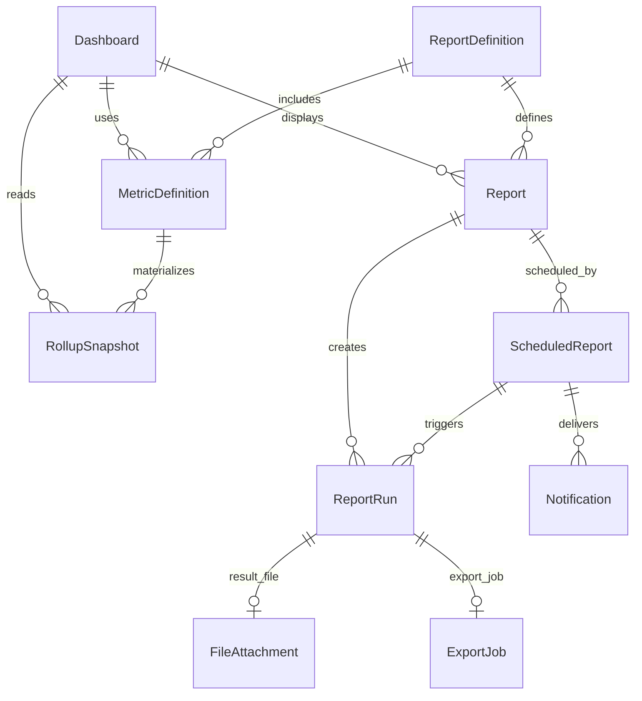
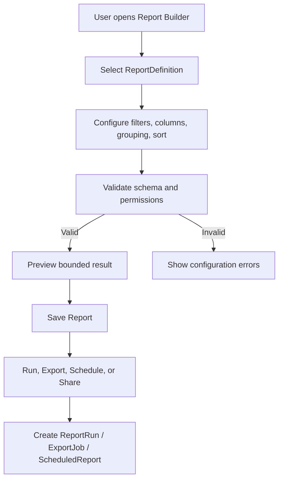
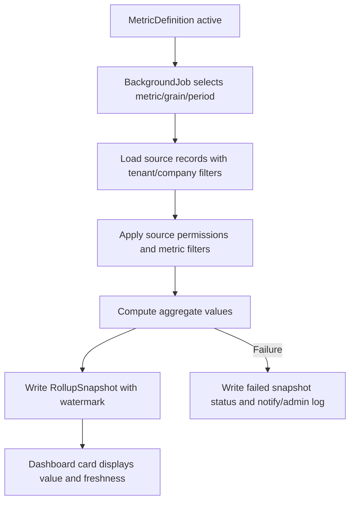
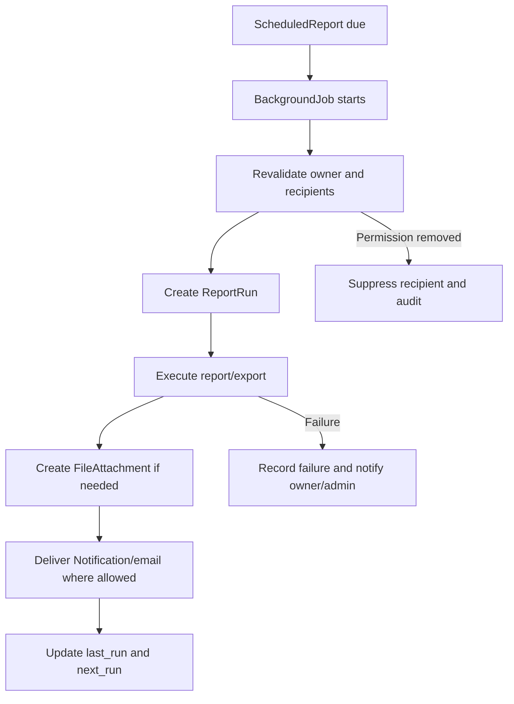

# 12_Reporting_Dashboards.md

## 1. Document Metadata

| Field | Value |
| --- | --- |
| Document name | `12_Reporting_Dashboards.md` |
| Phase | Phase 12 |
| Phase name | Reporting / Dashboards |
| Document type | Phase implementation design specification |
| Status | Draft for implementation planning |
| Prepared for | Product, engineering, design, QA, implementation, operations, analytics, and future phase writers |
| Source of truth | `00_Master_Platform_Documentation.md`, `00_Global_Documentation_Rules.md`, `00_Global_Domain_Model.md`, `00_Global_Decisions_Register.md`, and prior phase summaries 01-11 |
| Last updated | 2026-05-09 |

## 2. Phase Purpose

Phase 12 defines the Reporting / Dashboards foundation for the multi-company SaaS platform. It creates the canonical dashboard, report, report definition, report run, metric definition, rollup snapshot, and scheduled report model that every future reporting, export, integration, QuickBooks, automation, security, rollout, and final blueprint phase must reuse.

The phase turns reporting from an afterthought into a first-class product capability. It must make operational visibility possible across CRM, outbound sales, calendar/tasks, field/site work, inventory/warehouse, orders/dispatch/logistics, fleet/GPS, and service/work orders while preserving tenant isolation, company boundaries, module enablement, source-record permissions, data freshness, auditability, and export control.

## 3. Phase Goals

- Define canonical reporting entities and prevent duplicate dashboard/report concepts in later phases.
- Define a reusable metric catalog and materialized rollup model.
- Define role-aware dashboards and report builder behavior.
- Define report execution, scheduled delivery, export, audit, and notification behavior.
- Define reporting permissions for view, run, export, schedule, share, sensitive metrics, definitions, and rollups.
- Define data freshness rules and how stale/materialized metrics are displayed.
- Define how reporting depends on prior phase source entities without owning their lifecycle.
- Prepare future QuickBooks/integration, admin/security, notifications/automation, API/export, final blueprint, and rollout phases to reuse reporting definitions and metric standards.

## 4. Scope

In scope:

- Dashboards, dashboard cards, layouts, refresh/freshness behavior, templates, sharing, and drilldowns.
- Reports, saved reports, report builder configuration, filter schemas, columns, grouping, sorting, visualization, run history, exports, and sharing.
- ReportDefinition as the canonical report dataset/template/schema entity.
- ReportRun as immutable execution history for report generation, export, scheduled delivery, and selected dashboard refreshes.
- MetricDefinition as the canonical metric/KPI formula and dimension catalog.
- RollupSnapshot as materialized aggregate storage for expensive or frequently displayed metrics.
- ScheduledReport as recurring report delivery/refresh configuration.
- Permissions, audit events, notifications, API requirements, UI/UX requirements, search/filter behavior, mobile/offline impact, integration impact, edge cases, user stories, acceptance criteria, and implementation notes.

## 5. Non-Goals

- Building a full BI platform with unrestricted SQL/no-code database query access.
- Replacing source operational records from CRM, inventory, dispatch, fleet, service, or other modules.
- Building external data warehouse synchronization as part of Phase 12.
- Implementing full customer-facing portal reporting.
- Implementing advanced predictive analytics, AI forecasting, automated dispatch optimization, or anomaly detection.
- Creating duplicate module-specific dashboards or report entities.
- Implementing payroll, accounting ledger, or full financial reporting beyond operational metrics and future QuickBooks readiness.
- Guaranteeing real-time consistency for rollup-backed dashboards.

## 6. Source-of-Truth Definitions

- The platform is multi-tenant and company-scoped by default. Reporting must never cross tenant boundaries.
- Company means SaaS customer organization; Account means CRM/customer/vendor/prospect record. Reports must not confuse them.
- Reporting is a read-oriented cross-module layer. Operational modules remain source of truth for their records.
- `AuditLog`, `Notification`, `FileAttachment`, `SavedView`, `SearchIndexRecord`, `ImportJob`, `ExportJob`, `SettingsDocument`, `BackgroundJob`, `ApiKey`, `WebhookEndpoint`, and `WebhookDelivery` are Core Platform foundations reused by reporting.
- `ReportDefinition`, `MetricDefinition`, and `RollupSnapshot` are definitions/derived artifacts. They must not be used as operational source-of-truth records.
- Materialized metrics must expose freshness metadata, source watermarks, and failure state.
- Report exports must preserve filters, columns, timestamp, actor, row/truncation status, and permission context.
- Scheduled reports must revalidate recipient permissions at delivery time.

## 7. Canonical Entity Definitions

### Dashboard

| Attribute | Rule |
| --- | --- |
| Purpose | A configurable visual workspace that groups cards, charts, KPIs, tables, and drilldowns for permitted operational visibility. |
| Owner module | Reporting / Analytics |
| Scope | Company-scoped with optional user/team/shared visibility |
| Tenant/company scoping | Must include `tenant_id`; must include `company_id` for company-scoped records. Platform templates may be global read-only and copied/instantiated into company scope. |
| Key fields | `id`, `tenant_id`, `company_id`, `name`, `description`, `dashboard_type`, `module_scope`, `layout`, `cards`, `default_filters`, `visibility`, `owner_user_id`, `owner_team_id`, `shared_role_ids`, `source_report_ids`, `source_metric_ids`, `refresh_policy`, `freshness_status`, `last_refreshed_at`, `status`, audit fields, `external_refs`. |
| Relationships | References `Report`, `MetricDefinition`, `RollupSnapshot`, `SavedView`, `User`, `Team`, and role visibility. Drilldowns reference source records only through permission-aware report/list queries. |
| Lifecycle | Created from template or blank, configured, previewed, shared, refreshed, edited, archived, and soft-deleted. Cards must be revalidated whenever source permissions, definitions, or module enablement change. |
| Statuses | draft, active, archived, deleted. |
| Index considerations | Index `tenant_id`, `company_id`, `status`, owner/visibility fields, module/source keys, definition IDs, date/run timestamps, and common list filters. Use compound indexes for dashboard/report catalog queries and run history. |
| Permissions impact | Must enforce reporting permissions and source module permissions; sharing never grants source record access. |
| Audit requirements | Create, update, delete/archive, share, permission-impacting changes, run/export/schedule actions, and sensitive access events must be audited. |
| Reporting impact | This entity either defines, executes, materializes, schedules, or displays reportable metrics. It must preserve freshness and source context. |
| Future-phase impact | Future QuickBooks/integrations, admin/security, notifications/automation, API/export, final blueprint, and rollout phases must reuse this entity where applicable. |
### Report

| Attribute | Rule |
| --- | --- |
| Purpose | A user-facing saved report instance or generated report view based on a report definition, filters, columns, grouping, and permissions. |
| Owner module | Reporting / Analytics |
| Scope | Company-scoped with optional user/team/shared visibility |
| Tenant/company scoping | Must include `tenant_id`; must include `company_id` for company-scoped records. Platform templates may be global read-only and copied/instantiated into company scope. |
| Key fields | `id`, `tenant_id`, `company_id`, `report_definition_id`, `name`, `description`, `report_type`, `module_scope`, `filters`, `columns`, `group_by`, `sort`, `visualization`, `visibility`, `owner_user_id`, `owner_team_id`, `shared_role_ids`, `last_run_id`, `last_run_at`, `freshness_status`, `export_allowed`, `schedule_allowed`, `status`, audit fields, `external_refs`. |
| Relationships | References `ReportDefinition`, optional `Dashboard`, `ScheduledReport`, `ReportRun`, `ExportJob`, `FileAttachment`, `SavedView`, `User`, and source module records through filters. |
| Lifecycle | Created from a definition, configured, validated, saved, run, exported, scheduled, shared, archived, and soft-deleted. Historical runs remain immutable. |
| Statuses | draft, active, archived, deleted, invalid_configuration. |
| Index considerations | Index `tenant_id`, `company_id`, `status`, owner/visibility fields, module/source keys, definition IDs, date/run timestamps, and common list filters. Use compound indexes for dashboard/report catalog queries and run history. |
| Permissions impact | Must enforce reporting permissions and source module permissions; sharing never grants source record access. |
| Audit requirements | Create, update, delete/archive, share, permission-impacting changes, run/export/schedule actions, and sensitive access events must be audited. |
| Reporting impact | This entity either defines, executes, materializes, schedules, or displays reportable metrics. It must preserve freshness and source context. |
| Future-phase impact | Future QuickBooks/integrations, admin/security, notifications/automation, API/export, final blueprint, and rollout phases must reuse this entity where applicable. |
### ReportDefinition

| Attribute | Rule |
| --- | --- |
| Purpose | The canonical definition of report type, source dataset, joins, filter schema, columns, metrics, grouping, visualization defaults, and execution rules. |
| Owner module | Reporting / Analytics |
| Scope | Company-scoped configuration, with optional platform-provided templates |
| Tenant/company scoping | Must include `tenant_id`; must include `company_id` for company-scoped records. Platform templates may be global read-only and copied/instantiated into company scope. |
| Key fields | `id`, `tenant_id`, `company_id`, `template_origin`, `name`, `description`, `source_module`, `dataset_key`, `base_entity`, `allowed_joins`, `filter_schema`, `column_schema`, `metric_definition_ids`, `default_columns`, `default_filters`, `supported_visualizations`, `row_level_permission_model`, `sensitive_fields`, `execution_mode`, `max_date_range_days`, `max_row_limit`, `snapshot_policy`, `status`, `version`, audit fields. |
| Relationships | References source module entities, `MetricDefinition`, permission models, and visualization schemas. It does not own source data. |
| Lifecycle | Seeded by platform or created by authorized admins/analysts, versioned, used by Reports, deprecated when replaced, and retained while historical runs require it. |
| Statuses | draft, active, deprecated, archived, deleted. |
| Index considerations | Index `tenant_id`, `company_id`, `status`, owner/visibility fields, module/source keys, definition IDs, date/run timestamps, and common list filters. Use compound indexes for dashboard/report catalog queries and run history. |
| Permissions impact | Must enforce reporting permissions and source module permissions; sharing never grants source record access. |
| Audit requirements | Create, update, delete/archive, share, permission-impacting changes, run/export/schedule actions, and sensitive access events must be audited. |
| Reporting impact | This entity either defines, executes, materializes, schedules, or displays reportable metrics. It must preserve freshness and source context. |
| Future-phase impact | Future QuickBooks/integrations, admin/security, notifications/automation, API/export, final blueprint, and rollout phases must reuse this entity where applicable. |
### ReportRun

| Attribute | Rule |
| --- | --- |
| Purpose | An immutable execution history record for a report generation, export, scheduled delivery, or dashboard backing query. |
| Owner module | Reporting / Analytics |
| Scope | Company-scoped execution record |
| Tenant/company scoping | Must include `tenant_id`; must include `company_id` for company-scoped records. Platform templates may be global read-only and copied/instantiated into company scope. |
| Key fields | `id`, `tenant_id`, `company_id`, `report_id`, `report_definition_id`, `scheduled_report_id`, `dashboard_id`, `run_type`, `requested_by_user_id`, `requested_for_user_id`, `filters_snapshot`, `columns_snapshot`, `permission_context_snapshot`, `freshness_snapshot`, `status`, `started_at`, `completed_at`, `failed_at`, `duration_ms`, `row_count`, `truncated`, `result_file_attachment_id`, `error_code`, `error_message`, `correlation_id`, `idempotency_key`, `created_at`. |
| Relationships | References `Report`, `ReportDefinition`, `ScheduledReport`, `Dashboard`, `ExportJob`, `FileAttachment`, and `BackgroundJob` where applicable. |
| Lifecycle | Created for execution, moves through queued/running/succeeded/failed/cancelled, stores immutable execution snapshots, and expires result files according to retention policy. |
| Statuses | queued, running, succeeded, failed, cancelled, expired. |
| Index considerations | Index `tenant_id`, `company_id`, `status`, owner/visibility fields, module/source keys, definition IDs, date/run timestamps, and common list filters. Use compound indexes for dashboard/report catalog queries and run history. |
| Permissions impact | Must enforce reporting permissions and source module permissions; sharing never grants source record access. |
| Audit requirements | Create, update, delete/archive, share, permission-impacting changes, run/export/schedule actions, and sensitive access events must be audited. |
| Reporting impact | This entity either defines, executes, materializes, schedules, or displays reportable metrics. It must preserve freshness and source context. |
| Future-phase impact | Future QuickBooks/integrations, admin/security, notifications/automation, API/export, final blueprint, and rollout phases must reuse this entity where applicable. |
### MetricDefinition

| Attribute | Rule |
| --- | --- |
| Purpose | A canonical, reusable definition of a metric formula, source events, dimensions, grain, freshness target, and access rules. |
| Owner module | Reporting / Analytics |
| Scope | Company-scoped configuration, with optional platform defaults |
| Tenant/company scoping | Must include `tenant_id`; must include `company_id` for company-scoped records. Platform templates may be global read-only and copied/instantiated into company scope. |
| Key fields | `id`, `tenant_id`, `company_id`, `metric_key`, `name`, `description`, `source_module`, `source_entities`, `formula`, `aggregation`, `dimensions`, `grain`, `time_field`, `filters`, `permission_model`, `freshness_target_minutes`, `snapshot_required`, `display_format`, `higher_is_better`, `owner_user_id`, `status`, `version`, audit fields. |
| Relationships | References source entities from prior modules and may feed `RollupSnapshot`, `Dashboard`, `ReportDefinition`, and future automation/integration health indicators. |
| Lifecycle | Created or seeded, validated, used by reports/dashboards/rollups, versioned on formula changes, deprecated when replaced, and retained for historical interpretation. |
| Statuses | draft, active, deprecated, disabled, archived. |
| Index considerations | Index `tenant_id`, `company_id`, `status`, owner/visibility fields, module/source keys, definition IDs, date/run timestamps, and common list filters. Use compound indexes for dashboard/report catalog queries and run history. |
| Permissions impact | Must enforce reporting permissions and source module permissions; sharing never grants source record access. |
| Audit requirements | Create, update, delete/archive, share, permission-impacting changes, run/export/schedule actions, and sensitive access events must be audited. |
| Reporting impact | This entity either defines, executes, materializes, schedules, or displays reportable metrics. It must preserve freshness and source context. |
| Future-phase impact | Future QuickBooks/integrations, admin/security, notifications/automation, API/export, final blueprint, and rollout phases must reuse this entity where applicable. |
### RollupSnapshot

| Attribute | Rule |
| --- | --- |
| Purpose | A materialized aggregate snapshot for dashboards, metrics, and expensive reports at a defined grain and time period. |
| Owner module | Reporting / Analytics |
| Scope | Company-scoped materialized snapshot |
| Tenant/company scoping | Must include `tenant_id`; must include `company_id` for company-scoped records. Platform templates may be global read-only and copied/instantiated into company scope. |
| Key fields | `id`, `tenant_id`, `company_id`, `metric_definition_id`, `report_definition_id`, `source_module`, `snapshot_key`, `grain`, `period_start_at`, `period_end_at`, `dimensions`, `scope`, `values`, `source_watermark_at`, `computed_at`, `computation_status`, `source_record_count`, `error_code`, `error_message`, `version`, `created_at`. |
| Relationships | References `MetricDefinition` and optionally `ReportDefinition`; contains derived aggregate values and source watermark metadata. |
| Lifecycle | Computed by background jobs, superseded by newer recomputations for same grain/period/scope, retained according to analytics retention, and never edited as operational truth. |
| Statuses | pending, computing, succeeded, failed, stale, superseded. |
| Index considerations | Index `tenant_id`, `company_id`, `status`, owner/visibility fields, module/source keys, definition IDs, date/run timestamps, and common list filters. Use compound indexes for dashboard/report catalog queries and run history. |
| Permissions impact | Must enforce reporting permissions and source module permissions; sharing never grants source record access. |
| Audit requirements | Create, update, delete/archive, share, permission-impacting changes, run/export/schedule actions, and sensitive access events must be audited. |
| Reporting impact | This entity either defines, executes, materializes, schedules, or displays reportable metrics. It must preserve freshness and source context. |
| Future-phase impact | Future QuickBooks/integrations, admin/security, notifications/automation, API/export, final blueprint, and rollout phases must reuse this entity where applicable. |
### ScheduledReport

| Attribute | Rule |
| --- | --- |
| Purpose | A recurring delivery or refresh configuration for a Report or ReportDefinition using filters, recipients, format, cadence, and permission revalidation. |
| Owner module | Reporting / Analytics |
| Scope | Company-scoped schedule configuration |
| Tenant/company scoping | Must include `tenant_id`; must include `company_id` for company-scoped records. Platform templates may be global read-only and copied/instantiated into company scope. |
| Key fields | `id`, `tenant_id`, `company_id`, `report_id`, `report_definition_id`, `name`, `description`, `schedule_rule_id`, `timezone`, `recipient_user_ids`, `recipient_team_ids`, `recipient_email_overrides`, `delivery_channels`, `export_format`, `filters_snapshot`, `columns_snapshot`, `visibility`, `owner_user_id`, `next_run_at`, `last_run_id`, `last_run_at`, `last_successful_run_at`, `failure_count`, `status`, audit fields. |
| Relationships | References `Report`, `ReportDefinition`, `RecurrenceRule` or schedule rule configuration, `Notification`, `ExportJob`, `FileAttachment`, and `ReportRun`. |
| Lifecycle | Created from a saved report, computes next run, executes through background jobs, delivers via allowed channels, records failures, pauses/resumes, and is deleted/disabled when owner or permissions are invalid. |
| Statuses | active, paused, failing, disabled, deleted. |
| Index considerations | Index `tenant_id`, `company_id`, `status`, owner/visibility fields, module/source keys, definition IDs, date/run timestamps, and common list filters. Use compound indexes for dashboard/report catalog queries and run history. |
| Permissions impact | Must enforce reporting permissions and source module permissions; sharing never grants source record access. |
| Audit requirements | Create, update, delete/archive, share, permission-impacting changes, run/export/schedule actions, and sensitive access events must be audited. |
| Reporting impact | This entity either defines, executes, materializes, schedules, or displays reportable metrics. It must preserve freshness and source context. |
| Future-phase impact | Future QuickBooks/integrations, admin/security, notifications/automation, API/export, final blueprint, and rollout phases must reuse this entity where applicable. |

## 8. Entity Lifecycle and Status Rules

| Entity | Lifecycle summary | Status rules |
| --- | --- | --- |
| Dashboard | Template/blank creation → validation → active use → refresh → share → update → archive/delete. | Draft dashboards may be private only; active dashboards can be shared; archived dashboards are hidden from default lists; deleted dashboards are soft-deleted. |
| Report | Definition selection → configure → validate → save → run/export/schedule → update/share → archive/delete. | Invalid configuration blocks run/export/schedule until repaired. Historical runs remain. |
| ReportDefinition | Seed/create → validate → active → version/update → deprecate → archive. | Deprecated definitions may be hidden from new report creation but retained for existing reports and run interpretation. |
| ReportRun | Queued → running → succeeded/failed/cancelled → retained/expired. | ReportRun is immutable after completion except retention/expiration metadata. |
| MetricDefinition | Seed/create → validate → active → version/update → deprecate/disable. | Formula changes require version awareness or run/snapshot context preservation. |
| RollupSnapshot | Pending/computing → succeeded/failed/stale/superseded. | Snapshots are derived and must not be manually edited as source truth. |
| ScheduledReport | Draft/create → active → run/deliver → failing/paused/resumed → disabled/deleted. | Repeated failure may set `failing`; permission loss may pause or disable delivery. |

## 9. Entity Relationship Rules

Rules:

- `Dashboard` may reference many `Report` and `MetricDefinition` records, but must not duplicate their definitions.
- `Report` must reference a `ReportDefinition` unless a future explicit decision approves ad hoc reports.
- `ReportRun` must snapshot filters, columns, permissions, and freshness so later changes do not rewrite history.
- `RollupSnapshot` must reference the metric/report definition context used to compute it.
- `ScheduledReport` must reference a saved `Report` or approved `ReportDefinition` and must not store only freeform SQL/query text.
- Source entities from prior phases are referenced by filter/dimension schemas and query services; reporting does not own their lifecycle.

## 10. Workflow Requirements

### 10.1 Report Builder Workflow

### 10.2 Rollup Computation Workflow

### 10.3 Scheduled Report Delivery Workflow

## 11. Data Model Requirements

- All Phase 12 records must use stable application `id`, `tenant_id`, and company scoping where applicable.
- Reporting collections should include `dashboards`, `reports`, `report_definitions`, `report_runs`, `metric_definitions`, `rollup_snapshots`, and `scheduled_reports`.
- High-cardinality operational source data must not be embedded inside dashboard/report records.
- Use snapshots for report execution context, not mutable references only.
- Use compound indexes for `tenant_id`, `company_id`, `status`, `owner_user_id`, visibility fields, `module_scope`, definition IDs, run timestamps, schedule due timestamps, metric keys, grain, period, and source module.
- Expensive rollups must be computed through background jobs and stored as `RollupSnapshot` records.
- Data freshness must be represented through fields, not inferred only from cache age.
- Sensitive fields must be declared in `ReportDefinition` and enforced at execution time.
- ReportDefinition must document base entity and allowed joins to prevent duplicate-counting.
- Report result files must be represented through `FileAttachment`.
- Large exports must be represented through `ExportJob` and linked to `ReportRun`.

## 12. API Requirements

| ID | Requirement |
| --- | --- |
| API-12-001 | All reporting APIs must require tenant/company context and must never expose MongoDB `_id` values. |
| API-12-002 | `GET /api/v1/dashboards` must list dashboards visible to the actor with filters for module_scope, visibility, owner, status, favorite, and search query. |
| API-12-003 | `POST /api/v1/dashboards` must create a dashboard after validating dashboard layout, card sources, filters, visibility, and permissions. |
| API-12-004 | `PATCH /api/v1/dashboards/{dashboard_id}` must update metadata, layout, cards, filters, refresh policy, and sharing only when the actor has update/share permissions. |
| API-12-005 | `POST /api/v1/dashboards/{dashboard_id}/refresh` must request refresh for permitted cards and return either fresh card data or a background job/run reference. |
| API-12-006 | `GET /api/v1/reports` must list accessible reports with module, owner, visibility, schedule, last_run_at, status, and freshness metadata. |
| API-12-007 | `POST /api/v1/reports` must create a saved report from a ReportDefinition after schema and permission validation. |
| API-12-008 | `POST /api/v1/reports/{report_id}/run` must create a ReportRun and execute synchronously only when within configured runtime limits. |
| API-12-009 | `POST /api/v1/reports/{report_id}/export` must create an ExportJob and ReportRun for long-running export work. |
| API-12-010 | `GET /api/v1/report-definitions` must expose only definitions valid for enabled modules and actor permissions. |
| API-12-011 | `POST /api/v1/report-definitions` and `PATCH /api/v1/report-definitions/{id}` must be restricted to authorized report definition managers. |
| API-12-012 | `GET /api/v1/report-runs` must support filtering by report, status, run_type, requested_by_user_id, date range, and scheduled_report_id. |
| API-12-013 | `GET /api/v1/metric-definitions` must expose metric catalog entries visible to the actor and valid for enabled modules. |
| API-12-014 | `POST /api/v1/metric-definitions` and updates must validate formula, source entities, dimensions, grain, freshness target, and permissions. |
| API-12-015 | `GET /api/v1/rollup-snapshots` must be restricted to authorized internal/admin/analyst use and must apply metric-level permissions. |
| API-12-016 | `POST /api/v1/scheduled-reports` must validate owner permission, recipient permission assumptions, cadence, timezone, report schedule eligibility, export format, and delivery channel. |
| API-12-017 | `PATCH /api/v1/scheduled-reports/{id}` must update schedule, recipients, format, status, and snapshots only with schedule ownership or admin permission. |
| API-12-018 | `POST /api/v1/scheduled-reports/{id}/run-now` must revalidate permissions and create a ReportRun with run_type `scheduled_manual`. |
| API-12-019 | Reporting APIs must return structured errors for invalid filters, unauthorized columns, disabled modules, stale rollups, timeout, row limit, export limit, and unavailable source dataset. |
| API-12-020 | High-impact create/update/run/export/schedule requests must support idempotency keys where duplicate submission could create duplicate jobs or deliveries. |

## 13. UI / UX Requirements

| ID | Requirement |
| --- | --- |
| UX-12-001 | Reporting navigation must be role-aware and visible only when the Reporting module is enabled and the user has at least one reporting permission. |
| UX-12-002 | The Reporting home must show default dashboards, favorite reports, recent report runs, scheduled report status, and high-priority freshness warnings. |
| UX-12-003 | Dashboard cards must show title, value/visualization, date range, source, freshness, last refreshed time, and permission-truncated indicators where applicable. |
| UX-12-004 | Dashboard builder must support add card, resize, reorder, duplicate, configure, remove, preview, and save actions. |
| UX-12-005 | Dashboard empty state must guide users to select a template, create a card, or request permission depending on role. |
| UX-12-006 | Dashboard stale-data state must show stale status, last successful refresh, source module, and refresh option when permitted. |
| UX-12-007 | Report catalog must provide table/card view, search, module filters, owner filters, visibility filters, tags, favorite toggle, and schedule indicator. |
| UX-12-008 | Report builder must guide users through dataset, fields, filters, grouping, visualization, preview, and save/share steps. |
| UX-12-009 | Report field picker must label sensitive fields and disable fields the user cannot access. |
| UX-12-010 | Report preview must clearly distinguish sample/limited preview from full run results. |
| UX-12-011 | Report run screen must show progress, status, duration, row count, error details, export file link, and retry option when permitted. |
| UX-12-012 | Scheduled report form must include cadence, timezone, recipients, channel, format, filter snapshot, column snapshot, and permission warnings. |
| UX-12-013 | Permission denied states must avoid revealing hidden report names, counts, sensitive values, or source record identifiers. |
| UX-12-014 | No-data states must explain whether no records match filters, the module has no data, the date range is empty, or permissions limit the result. |
| UX-12-015 | Error states must provide retry guidance and correlation ID for support without exposing stack traces. |
| UX-12-016 | Mobile reporting UX must prioritize read-only lightweight dashboards and assigned-user summaries rather than full report building. |
| UX-12-017 | Dashboard templates must use consistent card sizes, labels, tooltips, and drilldown behavior across modules. |
| UX-12-018 | Report and dashboard sharing UI must show who can view, edit, export, schedule, and receive the item. |

## 14. Search, Filters, and Saved Views

- Reporting catalog search must be permission-aware and must not reveal hidden dashboard/report names.
- Common filters must include date range, company, branch, team, user, module, status, owner, territory, site, location, warehouse, depot, vehicle, driver, product, category, job type, service type, route, stop, exception type, and source module where applicable.
- Saved report filters belong to `Report`; reusable table/list views for operational modules continue to use `SavedView`.
- Filter schemas must be defined by `ReportDefinition`, not guessed by the UI.
- Filters must validate field type, allowed operators, value source, permissions, and module availability.
- Date filters must store timezone assumptions.
- Report catalog filters must include owner, favorite, module, visibility, scheduled, exportable, recently run, and status.
- Dashboard card filters must merge global dashboard filters with card-level filters in a deterministic order.

## 15. Permissions and Access Control

| ID | Requirement |
| --- | --- |
| PERM-12-001 | Reporting visibility requires company access, Reporting module enablement, and at least one reporting permission. |
| PERM-12-002 | Dashboard view permission does not imply report export permission. |
| PERM-12-003 | Report view permission does not imply access to all source records or sensitive fields. |
| PERM-12-004 | Report export requires `reporting.report.export` plus source module export permission when applicable. |
| PERM-12-005 | Report schedule requires `reporting.report.schedule` and report view/run permission. |
| PERM-12-006 | Report definition management requires `reporting.report_definition.manage` and should be limited to admins/analysts. |
| PERM-12-007 | Metric definition management requires `reporting.metric_definition.manage` and should be limited to admins/analysts. |
| PERM-12-008 | Sensitive metrics require `reporting.sensitive_metrics.view` plus the relevant module-specific sensitive permission. |
| PERM-12-009 | Location/GPS reports must require fleet/location permissions and must respect retention and privacy settings. |
| PERM-12-010 | Inventory valuation and cost reports must require inventory financial/cost permissions where defined. |
| PERM-12-011 | Individual user productivity reports must be visible only to authorized managers/admins or the user viewing their own allowed metrics. |
| PERM-12-012 | Dashboard sharing must not grant source-record access that the recipient does not already have. |
| PERM-12-013 | Scheduled report recipients must be revalidated at delivery time. |
| PERM-12-014 | Deleted, inactive, or membership-revoked users must stop receiving scheduled reports. |
| PERM-12-015 | Cross-company reporting is disallowed unless a future explicit permission and tenant policy enable it. |
| PERM-12-016 | Exported files must inherit access restrictions through FileAttachment and retention settings. |
| PERM-12-017 | API access to reporting must use the same reporting/source permissions as UI access. |
| PERM-12-018 | ReportRun history visibility must be limited to owners, recipients where applicable, and authorized reporting admins. |

## 16. Notifications

| ID | Requirement |
| --- | --- |
| NOTIF-12-001 | Notify scheduled report owners when recurring delivery succeeds if preference is enabled. |
| NOTIF-12-002 | Notify scheduled report owners and reporting admins when recurring delivery fails repeatedly. |
| NOTIF-12-003 | Notify the requesting user when a report export completes and the file is available. |
| NOTIF-12-004 | Notify the requesting user when a report export fails with recoverable guidance. |
| NOTIF-12-005 | Notify dashboard/report owners when a shared report definition is deprecated if it affects their saved reports. |
| NOTIF-12-006 | Notify owners/admins when rollup computation is delayed beyond freshness target for high-priority dashboards. |
| NOTIF-12-007 | Notify scheduled report owners when a recipient loses permission and is skipped. |
| NOTIF-12-008 | Notifications must use the Phase 03 Notification foundation and respect user preferences where applicable. |

## 17. Audit Logging

| ID | Requirement |
| --- | --- |
| AUDIT-12-001 | Audit dashboard creation, update, delete, share, and refresh request events. |
| AUDIT-12-002 | Audit report creation, update, delete, share, run request, export request, export completion, and export failure events. |
| AUDIT-12-003 | Audit report definition creation, update, deprecation, and permission-impacting changes. |
| AUDIT-12-004 | Audit metric definition creation, update, deprecation, formula changes, freshness target changes, and sensitive metric changes. |
| AUDIT-12-005 | Audit scheduled report creation, update, pause, resume, delete, manual run, delivery success, and delivery failure. |
| AUDIT-12-006 | Audit rollup snapshot computation failure and administrative recompute actions. |
| AUDIT-12-007 | Audit access to sensitive report categories such as revenue, GPS/location, individual productivity, inventory valuation, and service labor cost where required. |
| AUDIT-12-008 | Audit export file download where platform audit policy requires data extraction tracking. |
| AUDIT-12-009 | Audit permission-truncated scheduled report deliveries and recipient suppression events. |
| AUDIT-12-010 | Audit report/dashboard sharing with roles, teams, users, or company-wide audiences. |
| AUDIT-12-011 | Audit disabled-module report access attempts as security-relevant denials. |
| AUDIT-12-012 | Audit background job retries only when they affect delivery, export, computation, or customer-visible data freshness. |

## 18. Reporting and Analytics Impact

| ID | Requirement |
| --- | --- |
| REPORT-12-001 | Provide an Executive Overview Dashboard with high-level sales, operations, inventory, dispatch, service, exceptions, and freshness indicators. |
| REPORT-12-002 | Provide Sales Pipeline reporting using Account, Lead, Opportunity, Pipeline, PipelineStage, Activity, and ownership fields. |
| REPORT-12-003 | Provide Outbound Performance reporting using campaign, sequence, enrollment, channel activity, reply, meeting, conversion, and rep metrics. |
| REPORT-12-004 | Provide Calendar/Task/SLA reporting using Task, CalendarEvent, Appointment, Reminder, due dates, completion, overdue, and breach fields. |
| REPORT-12-005 | Provide Field Operations reporting using Site, SiteVisit, CheckInEvent, CheckOutEvent, Job, Crew, EquipmentAssignment, FieldNote, and FieldPhoto data. |
| REPORT-12-006 | Provide Inventory/Warehouse reporting using Product, InventoryBalance, StockMovement, Warehouse, Depot, BinLocation, receiving, picking, packing, adjustment, transfer, and low-stock data. |
| REPORT-12-007 | Provide Orders/Dispatch/Logistics reporting using Order, OrderLine, Shipment, ShipmentStop, DispatchPlan, RoutePlan, Delivery, Pickup, ProofOfDelivery, DeliveryException, and HandoffEvent data. |
| REPORT-12-008 | Provide Fleet/GPS reporting using Vehicle, Driver, TrackingDevice, DeviceAssignment, LocationHistory, GeofenceEvent, SpeedAlert, StopAlert, and DeviceHealthEvent where permitted. |
| REPORT-12-009 | Provide Service/Work Orders reporting using ServiceRequest, WorkOrder, WorkOrderTask, MaintenanceSchedule, ServiceHistory, LaborEntry, and PartsUsage data. |
| REPORT-12-010 | Provide Team Productivity reporting by user/team/role across activities, tasks, visits, jobs, dispatch events, work orders, and exceptions where permitted. |
| REPORT-12-011 | Provide Exception and Risk reporting across overdue tasks, late stops, delivery exceptions, low stock, device health, stale GPS, failed reports, failed syncs, and service SLA risk. |
| REPORT-12-012 | All dashboards and reports must expose source definitions and freshness metadata where data is aggregated or materialized. |
| REPORT-12-013 | Report definitions must avoid double-counting by specifying grain, base entity, join rules, and aggregation method. |
| REPORT-12-014 | Reports must reconcile current record state with event timestamps for lifecycle/cycle-time metrics. |
| REPORT-12-015 | Reports must preserve timezone assumptions for date-based grouping and scheduled delivery. |

## 19. Mobile and Offline Impact

| ID | Requirement |
| --- | --- |
| OFFLINE-12-001 | Full offline report building is not required for Phase 12. |
| OFFLINE-12-002 | Mobile users may view cached lightweight assigned-work dashboards when previously loaded, clearly marked as cached. |
| OFFLINE-12-003 | Offline-created operational records from prior phases must not immediately appear in reporting until synced and server-validated. |
| OFFLINE-12-004 | Dashboard cards relying on offline-local data must display local-only/pending-sync states if ever shown in mobile contexts. |
| OFFLINE-12-005 | Scheduled report execution must always occur server-side, not from offline clients. |
| OFFLINE-12-006 | Report exports must require online server execution. |

## 20. Integration Impact

| ID | Requirement |
| --- | --- |
| INT-12-001 | Report exports must reuse ExportJob and FileAttachment rather than creating a separate file-generation framework. |
| INT-12-002 | Scheduled report delivery must reuse Notification and future provider delivery mechanisms. |
| INT-12-003 | QuickBooks phases must use MetricDefinition and RollupSnapshot standards for invoice readiness, sync health, inventory valuation, and reconciliation dashboards. |
| INT-12-004 | Public API/export phases must execute reports through ReportRun so permissions, run history, and freshness metadata are preserved. |
| INT-12-005 | Webhook phases may emit reporting events through WebhookEndpoint and WebhookDelivery. |
| INT-12-006 | Integration health dashboards must not directly couple to provider-specific schemas; provider details belong in integration records and external_refs. |
| INT-12-007 | CSV/Excel exports must preserve column order, filters, actor, generated_at, timezone, and truncation metadata. |
| INT-12-008 | Future BI connector support must honor the same report definitions, permissions, and sensitive field restrictions. |

## 21. Security Considerations

- Reporting is a data exposure surface and must be treated as security-sensitive.
- Aggregates can leak sensitive business facts; permission checks must apply to counts, totals, and drilldowns.
- Exports are high-risk and require separate export permission and audit behavior.
- Scheduled reports can leak data outside the app; recipient validation and external recipient policy are mandatory.
- Sensitive report classes include revenue, owner performance, GPS/location history, device activity, inventory valuation, service labor cost, customer/account data, contact data, and failed integration details.
- API keys must not bypass report permissions.
- Shared dashboards must not provide unauthorized access to source data through drilldowns.
- Report builder must prevent arbitrary query injection and unsupported operators.
- File attachments generated by exports must expire or follow retention policy.
- Cross-company reporting is deferred/open unless explicitly enabled by future admin/security decisions.

## 22. Edge Cases

1. A user can view a dashboard but loses access to one source module; affected cards must be hidden or marked unavailable without leaking values.
2. A scheduled report recipient loses company membership before delivery; delivery must skip that recipient and notify the owner/admin where appropriate.
3. A report definition is deprecated while saved reports still reference it; existing reports may continue read-only or require migration according to definition policy.
4. A dashboard card uses a metric whose rollup failed; the card must show failed/stale state and not silently display old data as current.
5. A report export exceeds row limit; the run must be marked truncated or failed with clear guidance.
6. A report date range crosses daylight saving/timezone boundaries; grouping must use the selected/company timezone consistently.
7. A user tries to group by a high-cardinality or unsupported dimension; the builder must block or warn before execution.
8. A report references a deleted or disabled source record; historical runs keep snapshots while new runs exclude or annotate according to source rules.
9. A company disables the Fleet module; fleet dashboards/reports must disappear or show module-disabled state, not stale last values.
10. A dashboard template includes Inventory cards but the company has no Inventory module; template instantiation must omit or disable those cards.
11. A user shares a report company-wide that includes sensitive fields; save must be blocked unless the user has sensitive/share permission and recipients are eligible.
12. A report uses rollups while a user expects real-time data; UI must disclose freshness and allow refresh only if supported.
13. A scheduled report delivery fails due to email provider outage; ReportRun/ScheduledReport status must preserve failure context and retry policy.
14. A report export file is generated successfully but the FileAttachment permission policy blocks access; user must receive clear recoverable error.
15. A rollup recompute overlaps with another recompute for the same metric/grain/period; locking/idempotency must prevent duplicate conflicting snapshots.
16. A dashboard card drilldown returns fewer records than the aggregate due to permission changes; UI must indicate permission-truncated drilldown.
17. A user creates a report with filters that no longer exist after source schema update; the report must show configuration error and migration guidance.
18. A custom metric formula creates double counting by joining one-to-many records; validation must block unsupported joins.
19. A user opens a cached mobile dashboard offline; it must display cached timestamp and prevent export/schedule actions.
20. A report run is cancelled or times out; ReportRun must retain status, partial row count if available, error code, and retry eligibility.
21. A platform template changes; existing company copies must not silently change unless explicit template update/migration is applied.
22. An admin requests cross-company reporting without permission; the system must block until a future explicit cross-company policy exists.
23. A report includes external email recipients; if allowed later, the system must validate policy, audit the delivery, and avoid sending sensitive unauthorized data.
24. A source module changes status names; report definitions must handle mapping/versioning so trend reports remain understandable.

## 23. Business Requirements

| ID | Requirement |
| --- | --- |
| BR-12-001 | Provide managers with role-aware dashboards that summarize sales, field, inventory, dispatch, fleet, service, and productivity without requiring spreadsheets. |
| BR-12-002 | Create a standard reporting foundation that every module can reuse instead of implementing isolated module reporting. |
| BR-12-003 | Support configurable reports with saved filters, columns, grouping, sorting, visibility, and ownership. |
| BR-12-004 | Provide a canonical metric catalog so KPIs use consistent definitions across dashboards, reports, exports, automations, integrations, and rollout analytics. |
| BR-12-005 | Expose operational performance trends while respecting tenant, company, module, role, record-level, export, and sensitive-field permissions. |
| BR-12-006 | Enable management to monitor exceptions, overdue work, stale data, failed syncs, delayed service, inventory risk, and dispatch bottlenecks. |
| BR-12-007 | Support materialized rollups for expensive metrics so dashboards remain usable as operational data grows. |
| BR-12-008 | Provide report run history for auditability, troubleshooting, export traceability, and customer support. |
| BR-12-009 | Allow scheduled reports to deliver recurring operational visibility while revalidating permissions at run time. |
| BR-12-010 | Support basic custom report configuration without exposing unrestricted arbitrary database queries in MVP. |
| BR-12-011 | Make data freshness explicit so users understand whether a dashboard card is live, recently refreshed, stale, failed, or permission-truncated. |
| BR-12-012 | Prepare report and metric foundations for QuickBooks readiness, integration health, API/export, automation, and final blueprint phases. |
| BR-12-013 | Provide analyst-friendly filtering and drilling while preserving simple executive dashboard views for non-technical managers. |
| BR-12-014 | Ensure exported reports preserve filters, timestamps, selected columns, actor context, and freshness metadata. |
| BR-12-015 | Support dashboard/report sharing through controlled visibility modes rather than ad hoc links. |
| BR-12-016 | Provide module-specific default dashboards for enabled modules and hide disabled-module analytics. |
| BR-12-017 | Allow operational teams to compare performance by date range, user, team, branch, territory, location, vehicle, driver, warehouse, depot, product, route, site, job type, service type, and status where applicable. |
| BR-12-018 | Support future enterprise administration by keeping cross-company reporting, sensitive metric access, and report definition management explicit permission-controlled capabilities. |

## 24. Functional Requirements

| ID | Requirement |
| --- | --- |
| FR-12-001 | The system must provide a Reporting home that lists accessible dashboards, reports, recent runs, scheduled reports, favorites, and freshness warnings. |
| FR-12-002 | The system must provide a Dashboard list, detail, and builder workflow for users with dashboard create/update permissions. |
| FR-12-003 | Dashboards must support KPI cards, charts, tables, status lists, exception lists, map-summary cards, and drilldown links where supported by the underlying report definition. |
| FR-12-004 | Dashboard layouts must store card position, size, visualization type, source metric/report, default filters, and display options. |
| FR-12-005 | The system must provide a Report catalog filterable by module, report type, owner, visibility, status, schedule availability, export availability, and freshness mode. |
| FR-12-006 | The Report builder must allow permitted users to select a report definition, configure filters, select columns, group, sort, configure visualization, preview, save, run, and export. |
| FR-12-007 | ReportDefinition records must define allowed filters, allowed columns, supported dimensions, source module, base entity, joins, sensitive fields, and execution constraints. |
| FR-12-008 | ReportDefinition records must support platform-provided templates and company-scoped custom definitions without mixing template ownership with tenant data ownership. |
| FR-12-009 | The system must validate report filters against the definition filter schema before saving or running a report. |
| FR-12-010 | The system must validate selected columns against the definition column schema before saving or running a report. |
| FR-12-011 | The system must validate groupings, sorts, and visualizations against supported combinations before saving or running a report. |
| FR-12-012 | The system must create a ReportRun record whenever a report is executed, exported, scheduled, or used for a long-running dashboard refresh. |
| FR-12-013 | ReportRun must store a snapshot of filters, columns, permission context, freshness metadata, result status, duration, row count, truncation state, error code, and result file when applicable. |
| FR-12-014 | The system must support synchronous report previews only for small, bounded queries and use background jobs for expensive runs and exports. |
| FR-12-015 | The system must support RollupSnapshot computation through background jobs with source watermark, computed timestamp, period, grain, dimensions, and status. |
| FR-12-016 | The system must support MetricDefinition records for canonical formulas, aggregations, dimensions, grain, display format, freshness target, and permission model. |
| FR-12-017 | Dashboards must be able to render cards from MetricDefinition/RollupSnapshot data where snapshot mode is required. |
| FR-12-018 | Report results must enforce row-level and field-level access according to the source module and reporting permissions. |
| FR-12-019 | Report results must indicate when results are truncated by row limit, date range limit, export limit, permission restriction, or freshness failure. |
| FR-12-020 | Users must be able to save reports as private, team-shared, role-shared, or company-shared where permission allows. |
| FR-12-021 | Users must be able to favorite dashboards and reports for quicker access. |
| FR-12-022 | Users must be able to duplicate an accessible report or dashboard into a private copy when permissions allow. |
| FR-12-023 | Users must be able to schedule a saved report if they have schedule permission and the report definition allows scheduled execution. |
| FR-12-024 | ScheduledReport must define cadence, timezone, recipients, delivery channels, export format, filters snapshot, columns snapshot, next run time, and status. |
| FR-12-025 | Scheduled reports must revalidate recipient permissions and source module enablement before every delivery. |
| FR-12-026 | Scheduled report failures must be visible to the owner and eligible administrators. |
| FR-12-027 | The system must support default dashboards by role/module package using seeded Dashboard templates copied or instantiated into company scope. |
| FR-12-028 | The system must hide or disable cards and reports for modules that are not enabled for the company. |
| FR-12-029 | The system must support dashboard card drilldowns into the underlying report, filtered list, or permitted source record list. |
| FR-12-030 | The system must support export of permitted report results through ExportJob and FileAttachment. |
| FR-12-031 | The system must store report export metadata including format, actor, filters, columns, created file, row count, and timestamp. |
| FR-12-032 | The system must allow admins/analysts to view report run history and troubleshoot failed runs. |
| FR-12-033 | The system must allow admins to deprecate report definitions and metric definitions without deleting historical report runs. |
| FR-12-034 | The system must support date range filters and common dimensions across modules where applicable. |
| FR-12-035 | The system must support permission-aware search over dashboard/report names and descriptions. |
| FR-12-036 | The system must retain historical ReportRun snapshots even when the live Report is later changed or deleted, subject to retention policy. |
| FR-12-037 | The system must support no-data states that distinguish true zero results from permission-hidden or stale data. |
| FR-12-038 | The system must expose freshness status on dashboard and report views when data comes from rollups or async processing. |
| FR-12-039 | The system must support report definition versioning or run-level definition snapshots so historical runs remain explainable. |
| FR-12-040 | The system must prevent custom reports from selecting incompatible joins or dimensions that would create duplicate counts or misleading metrics. |

## 25. Non-Functional Requirements

| ID | Requirement |
| --- | --- |
| NFR-12-001 | Common dashboard loads should return initial shell and cached/materialized card data quickly enough for daily operational use. |
| NFR-12-002 | Long-running report generation must be asynchronous and observable through ReportRun/BackgroundJob status. |
| NFR-12-003 | Reporting queries must be bounded by tenant_id, company_id, date range, row limit, and permitted dimensions. |
| NFR-12-004 | Rollup computation must be idempotent and safe to retry. |
| NFR-12-005 | Rollup snapshots must store source watermarks and computation timestamps for traceability. |
| NFR-12-006 | Reporting must avoid unindexed broad collection scans on high-volume entities such as LocationPing, StockMovement, AuditLog, and Activity. |
| NFR-12-007 | Dashboard and report APIs must include correlation IDs in error responses for support. |
| NFR-12-008 | Report result files must follow retention, access, and deletion policies. |
| NFR-12-009 | Report execution must not degrade operational write-path performance for CRM, dispatch, fleet, inventory, or service workflows. |
| NFR-12-010 | Metric formulas and definitions must be version-aware or snapshot-aware so historical runs remain explainable. |
| NFR-12-011 | Reporting must support timezone-correct date grouping and scheduled execution. |
| NFR-12-012 | Reporting must degrade gracefully when a source module is disabled or unavailable. |
| NFR-12-013 | Dashboard data freshness targets must be configurable per metric category. |
| NFR-12-014 | Security checks must be enforced server-side for every report/dashboard/export/schedule operation. |
| NFR-12-015 | Sensitive report access must be observable and auditable where policy requires. |
| NFR-12-016 | Report builders must validate configuration before execution to prevent invalid joins, unsupported filters, excessive cardinality, or misleading aggregations. |
| NFR-12-017 | Reporting code must maintain clear separation between report definitions, execution services, rollup computation, permission filters, and visualization rendering. |
| NFR-12-018 | Report exports must be reproducible from stored ReportRun snapshots within retention limits. |

## 26. User Stories

### Executive / Owner

- As an executive, I want an overview dashboard so I can understand sales, operations, service, inventory, dispatch, fleet, and exceptions without asking every team for spreadsheets.
- As an owner, I want stale data indicators so I know whether a metric is current enough for decisions.
- As an owner, I want scheduled reports so I receive recurring visibility without manually running reports.

### Operations Manager

- As an operations manager, I want dispatch, field, service, inventory, and fleet metrics in one place so I can identify bottlenecks.
- As an operations manager, I want drilldowns from charts to records so I can move from trend to action.
- As an operations manager, I want exception reports so I can prioritize late stops, failed service, low stock, stale GPS, and overdue tasks.

### Sales Manager

- As a sales manager, I want pipeline and outbound dashboards so I can track leads, opportunities, activities, sequence progress, and rep performance.
- As a sales manager, I want saved reports by owner, pipeline stage, source, and date range so I can coach the team.

### Dispatcher

- As a dispatcher, I want dispatch and route reports so I can review stops, route performance, delivery exceptions, and handoffs.
- As a dispatcher, I want fleet freshness and device health metrics so I can identify operational visibility gaps.

### Warehouse Manager

- As a warehouse manager, I want inventory dashboards so I can see stock availability, low stock, transfers, receiving, picking, adjustments, and movement trends.
- As a warehouse manager, I want product and depot filters so I can focus on the location or stock category I manage.

### Service Manager

- As a service manager, I want service dashboards so I can see work order status, service request backlog, maintenance schedules, labor, parts usage, and overdue service.
- As a service manager, I want completion and SLA metrics so I can improve response times.

### Analyst / Reporting User

- As an analyst, I want a report builder so I can configure filters, columns, grouping, and visualizations without engineering work.
- As an analyst, I want metric definitions so the same KPI means the same thing across dashboards, exports, and future automation.
- As an analyst, I want report run history so I can troubleshoot failed or unexpected report results.

### Company Admin

- As a company admin, I want to control who can view, export, schedule, share, and manage report definitions.
- As a company admin, I want audit history for sensitive reporting actions so I can investigate data exposure risk.

### Field / Mobile User

- As a field user, I want lightweight assigned-work summaries on mobile so I can understand my day without a complex report builder.
- As a mobile user, I want cached dashboards clearly marked as cached so I do not mistake old data for current data.

## 27. Recommended Decisions

- **RD-12-001:** Use platform-seeded `ReportDefinition` and `MetricDefinition` templates for MVP, with company-created definitions limited to authorized analysts/admins.
- **RD-12-002:** Start with curated report builder capabilities rather than unrestricted arbitrary query building.
- **RD-12-003:** Use `RollupSnapshot` for expensive metrics and expose freshness metadata on every rollup-backed dashboard card.
- **RD-12-004:** Revalidate scheduled report recipients at delivery time and suppress unauthorized recipients.
- **RD-12-005:** Treat export permission as separate from report view permission.
- **RD-12-006:** Require explicit sensitive metric permissions for GPS/location history, inventory valuation, individual productivity, and revenue/cost-related metrics.
- **RD-12-007:** Preserve `ReportRun` history for troubleshooting and audit even when reports are later edited or deleted.
- **RD-12-008:** Defer cross-company reporting until admin/security phases explicitly define tenant-level analytics policy.

## 28. Open Questions

- **OQ-12-001:** Which default dashboards are required for the first MVP package versus later module packages?
- **OQ-12-002:** Can company admins create custom `ReportDefinition` records in MVP, or only reports from platform definitions?
- **OQ-12-003:** What are the exact row limits, export size limits, and result file retention periods?
- **OQ-12-004:** Are external email recipients allowed for scheduled reports in MVP?
- **OQ-12-005:** Which sensitive metrics require explicit permission gates by default?
- **OQ-12-006:** What freshness target should each dashboard category use?
- **OQ-12-007:** Should report definitions have immutable versions or mutable versions with run snapshots only?
- **OQ-12-008:** Should cross-company reporting be supported for tenant admins in MVP or deferred?

## 29. Dependencies

- Phase 01 product definition: unified platform, reporting designed from the beginning, MVP boundaries.
- Phase 02 tenant/identity/access: tenant/company scoping, user membership, roles, permissions, module enablement.
- Phase 03 core platform: audit, notification, file, saved view, search, import/export, settings, jobs, API keys, webhooks.
- Phase 04 CRM: accounts, contacts, leads, opportunities, pipeline, activity, ownership, timeline.
- Phase 05 outbound sales: campaigns, sequences, enrollments, channel activity, conversions, rep performance.
- Phase 06 calendar/tasks: tasks, calendar events, appointments, reminders, recurrence, SLA semantics.
- Phase 07 field/site work: sites, visits, check-ins, jobs, crews, equipment, notes, photos.
- Phase 08 inventory/warehouse: product, stock movement, inventory balance, warehouse, depot, bin, receiving, picking, transfers.
- Phase 09 orders/dispatch/logistics: orders, shipments, stops, dispatch plans, route plans, proof, exceptions, handoffs.
- Phase 10 fleet/device tracking: vehicles, drivers, devices, location history, geofences, alerts, device health.
- Phase 11 service/work orders: service requests, work orders, tasks, maintenance schedules, service history, labor, parts usage.

## 30. Future Phase Considerations

- QuickBooks/integration phases must reuse `MetricDefinition`, `RollupSnapshot`, `ReportRun`, and export standards for sync health, billing readiness, invoice readiness, item sync, and reconciliation dashboards.
- Admin/security phases must refine sensitive metrics, cross-company reporting, retention, external recipients, and audit review flows.
- Notifications/automation phases must reuse `ScheduledReport`, `ReportRun`, and metric freshness/failure events.
- API/export phases must execute reports through Reporting APIs and preserve permission/freshness/run-history behavior.
- Final blueprint and rollout phases must treat reporting definitions and metric catalog as official operational analytics standards.

## 31. Acceptance Criteria

- All seven Phase 12 entities are defined with purpose, owner, scope, fields, relationships, lifecycle, statuses, indexes, permissions, audit, reporting, and future-phase impact.
- Reporting APIs include dashboard, report, report definition, report run, metric definition, rollup snapshot, and scheduled report endpoints.
- Dashboard and report builder UX supports empty states, error states, stale states, permission states, and no-data states.
- Permission requirements distinguish view, run, export, schedule, share, definition management, metric management, rollup access, sensitive metrics, and cross-company reporting.
- Audit requirements cover report/dashboard creation, updates, sharing, runs, exports, scheduled reports, definitions, metrics, rollups, sensitive access, and delivery failures.
- Notifications cover exports, scheduled delivery, failures, stale rollups, permission suppression, and deprecated definitions.
- Reporting requirements cover CRM, outbound, calendar/tasks, field, inventory, dispatch, fleet, service, productivity, exceptions, and integration readiness.
- Mobile/offline impact is explicitly limited and marked for cached read-only views only.
- Integration impact establishes reuse of ExportJob, FileAttachment, Notification, WebhookDelivery, and future QuickBooks/reporting standards.
- Mermaid ER and workflow diagrams are included.
- The document ends with the required Summary for Future Phases structure and a separate summary file is created.

## 32. Implementation Notes

- Backend should implement reporting services as a separate application layer over source repositories, not as direct UI-driven arbitrary collection queries.
- Use FastAPI endpoints with explicit request/response schemas for dashboard/report operations.
- Use MongoDB aggregation carefully and move expensive aggregates into worker-computed rollups.
- Use Redis/locks for rollup recompute concurrency control where needed.
- Use Celery or similar background workers for report exports, scheduled reports, rollup computation, and long-running report runs.
- Use structured logs, correlation IDs, idempotency keys, and ReportRun IDs for traceability.
- Frontend should use Next.js, Tailwind, and shadcn/ui patterns consistent with the rest of the platform.
- Build shared visualization components with consistent loading, stale, empty, error, and permission states.
- Treat report definitions and metric definitions as configuration with validation and migration paths.
- Test report permission enforcement with both aggregate and drilldown scenarios.
- Avoid creating reports that require unrestricted access to raw high-volume telemetry.

# Summary for Future Phases

## Final Decisions Made

- Phase 12 establishes Reporting / Dashboards as the canonical foundation for dashboards, reports, report definitions, report runs, metric definitions, rollup snapshots, scheduled reports, analytics permissions, dashboard UX, report filters, data freshness, and materialized metrics.
- `Dashboard` is the canonical configurable visual workspace for KPIs, charts, tables, operational summaries, and drilldowns. Future phases must not create module-specific dashboard entities such as `ServiceDashboard`, `FleetDashboard`, or `SalesDashboard`; use `Dashboard` with module context and cards instead.
- `Report` is the canonical user-facing saved or generated report record. It must not replace `ReportDefinition`; it references or materializes from a definition and stores selected filters, columns, grouping, visibility, and ownership.
- `ReportDefinition` is the canonical reusable report template/source schema record. It defines datasets, allowed joins, filter schemas, columns, metrics, grouping rules, visualization defaults, and execution constraints.
- `ReportRun` is the canonical immutable execution record for generated reports, exports, scheduled report deliveries, and expensive dashboard refreshes. Future export/API phases must reuse it for report execution observability.
- `MetricDefinition` is the canonical reusable metric catalog entry. Metrics used by dashboards, reports, automation, QuickBooks sync monitoring, final blueprint, and rollout analytics must use these definitions instead of ad hoc formulas.
- `RollupSnapshot` is the canonical materialized metric/report aggregate record. Expensive operational metrics must use snapshots where needed and must expose freshness metadata.
- `ScheduledReport` is the canonical schedule and recipient configuration for recurring report delivery. It must reuse notification/export foundations and must revalidate permissions at run time.
- Reporting is read-oriented and cross-module, but it does not own operational source-of-truth records from CRM, outbound, calendar/tasks, field, inventory, dispatch, fleet, or service.
- Reporting must reuse Phase 03 shared services: `AuditLog`, `Notification`, `FileAttachment`, `SavedView`, `SearchIndexRecord`, `ImportJob`, `ExportJob`, `SettingsDocument`, `BackgroundJob`, `ApiKey`, `WebhookEndpoint`, and `WebhookDelivery`.
- Reporting must reuse Phase 04 CRM entities and activity history for sales, account, pipeline, contact, lead, opportunity, and activity analytics.
- Reporting must reuse Phase 05 outbound records for campaign, sequence, enrollment, outreach, channel activity, conversion, and rep performance analytics.
- Reporting must reuse Phase 06 `Task`, `CalendarEvent`, `Appointment`, `Reminder`, and `RecurrenceRule` for task, schedule, SLA, reminder, and scheduled report cadence context.
- Reporting must reuse Phase 07 field entities for site, visit, check-in/out, job, crew, equipment, photo, and field note analytics.
- Reporting must reuse Phase 08 inventory entities for product, stock movement, inventory balance, warehouse, depot, bin, receiving, picking, packing, adjustment, transfer, and low-stock analytics.
- Reporting must reuse Phase 09 orders/dispatch/logistics entities for orders, shipments, stops, dispatch plans, route plans, proof, exceptions, pickups, deliveries, and handoff analytics.
- Reporting must reuse Phase 10 fleet entities for vehicle, driver, device, assignment, location, geofence, route replay, alert, and device health analytics. Raw GPS pings must not be exposed through broad reports unless permission and retention rules allow it.
- Reporting must reuse Phase 11 service entities for service requests, work orders, work order tasks, maintenance schedules, service history, labor entries, and parts usage analytics.
- All Phase 12 reporting records are tenant/company scoped unless explicitly platform-provided templates are read-only and copied into company scope.
- MongoDB `_id` must never be exposed as a public report/dashboard/API identifier.
- Reporting permissions must enforce tenant, company, module enablement, record permission, analytics permission, export permission, schedule permission, and sensitive-field restrictions.
- Dashboard and report results must not leak record counts, labels, names, GPS/location data, service history, revenue, inventory value, or personally sensitive user performance information to unauthorized users.
- Report exports must preserve filters, columns, grouping, run timestamp, actor, freshness metadata, and permission context.
- Dashboard cards and reports must display data freshness, source module, filter scope, and permission-truncated states where relevant.
- Real-time consistency is not required for rollup-backed dashboards. Staleness must be visible and bounded by metric freshness targets.
- Scheduled reports and report exports must use background jobs and must not execute long-running report work inside the main API request path.
- Report schedules must revalidate recipient permissions at delivery time and suppress unauthorized rows/columns rather than sending stale entitlements.
- Custom reports are supported at the definition/configuration level, but unrestricted arbitrary database querying is not allowed in MVP.

## Entities Introduced

| Entity | Owner module | Scope | Purpose | Future phase rule |
| --- | --- | --- | --- | --- |
| `Dashboard` | Reporting / Analytics | Company-scoped; optional user/team/shared visibility | Configurable visual workspace for KPIs, charts, tables, and drilldowns. | Reuse for all module dashboards; do not create module-specific dashboard entities. |
| `Report` | Reporting / Analytics | Company-scoped; optional user/team/shared visibility | User-facing saved/generated report using filters, columns, grouping, and definition references. | Reuse for report lists, exports, schedules, API report execution, and analytics UX. |
| `ReportDefinition` | Reporting / Analytics | Company-scoped configuration; optional platform template source | Canonical report schema/template with dataset, filters, columns, joins, metrics, and visualization defaults. | Future modules must register reportable datasets through definitions, not ad hoc report code only. |
| `ReportRun` | Reporting / Analytics | Company-scoped immutable execution history | Execution record for report generation, export, schedule, or dashboard refresh. | Export/API/integration phases must reuse for observability and auditability. |
| `MetricDefinition` | Reporting / Analytics | Company-scoped configuration; optional platform defaults | Reusable metric formula and dimension definition. | Future phases must use metric catalog standards for KPIs and automation triggers. |
| `RollupSnapshot` | Reporting / Analytics | Company-scoped materialized aggregate | Materialized aggregate at a defined metric, grain, scope, and time period. | Expensive reports and dashboards must use snapshots where needed and show freshness metadata. |
| `ScheduledReport` | Reporting / Analytics | Company-scoped schedule configuration | Recurring report refresh/delivery settings with recipients, formats, cadence, and permissions. | Notification/export/API phases must reuse it for report delivery. |

## Fields Introduced

### Dashboard

`id`, `tenant_id`, `company_id`, `name`, `description`, `dashboard_type`, `module_scope`, `layout`, `cards`, `default_filters`, `visibility`, `owner_user_id`, `owner_team_id`, `shared_role_ids`, `source_report_ids`, `source_metric_ids`, `refresh_policy`, `freshness_status`, `last_refreshed_at`, `status`, `created_at`, `created_by_user_id`, `updated_at`, `updated_by_user_id`, `deleted_at`, `deleted_by_user_id`, `external_refs`.

### Report

`id`, `tenant_id`, `company_id`, `report_definition_id`, `name`, `description`, `report_type`, `module_scope`, `filters`, `columns`, `group_by`, `sort`, `visualization`, `visibility`, `owner_user_id`, `owner_team_id`, `shared_role_ids`, `last_run_id`, `last_run_at`, `last_successful_run_at`, `freshness_status`, `export_allowed`, `schedule_allowed`, `status`, `created_at`, `created_by_user_id`, `updated_at`, `updated_by_user_id`, `deleted_at`, `deleted_by_user_id`, `external_refs`.

### ReportDefinition

`id`, `tenant_id`, `company_id`, `template_origin`, `name`, `description`, `source_module`, `dataset_key`, `base_entity`, `allowed_joins`, `filter_schema`, `column_schema`, `metric_definition_ids`, `default_columns`, `default_filters`, `default_group_by`, `default_sort`, `supported_visualizations`, `row_level_permission_model`, `sensitive_fields`, `execution_mode`, `max_date_range_days`, `max_row_limit`, `snapshot_policy`, `status`, `version`, `created_at`, `created_by_user_id`, `updated_at`, `updated_by_user_id`, `deprecated_at`, `external_refs`.

### ReportRun

`id`, `tenant_id`, `company_id`, `report_id`, `report_definition_id`, `scheduled_report_id`, `dashboard_id`, `run_type`, `requested_by_user_id`, `requested_for_user_id`, `filters_snapshot`, `columns_snapshot`, `permission_context_snapshot`, `freshness_snapshot`, `status`, `started_at`, `completed_at`, `failed_at`, `duration_ms`, `row_count`, `truncated`, `result_file_attachment_id`, `error_code`, `error_message`, `correlation_id`, `idempotency_key`, `created_at`.

### MetricDefinition

`id`, `tenant_id`, `company_id`, `metric_key`, `name`, `description`, `source_module`, `source_entities`, `formula`, `aggregation`, `dimensions`, `grain`, `time_field`, `filters`, `permission_model`, `freshness_target_minutes`, `snapshot_required`, `display_format`, `higher_is_better`, `owner_user_id`, `status`, `version`, `created_at`, `created_by_user_id`, `updated_at`, `updated_by_user_id`, `deprecated_at`.

### RollupSnapshot

`id`, `tenant_id`, `company_id`, `metric_definition_id`, `report_definition_id`, `source_module`, `snapshot_key`, `grain`, `period_start_at`, `period_end_at`, `dimensions`, `scope`, `values`, `source_watermark_at`, `computed_at`, `computation_status`, `source_record_count`, `error_code`, `error_message`, `version`, `created_at`.

### ScheduledReport

`id`, `tenant_id`, `company_id`, `report_id`, `report_definition_id`, `name`, `description`, `schedule_rule_id`, `timezone`, `recipient_user_ids`, `recipient_team_ids`, `recipient_email_overrides`, `delivery_channels`, `export_format`, `filters_snapshot`, `columns_snapshot`, `visibility`, `owner_user_id`, `next_run_at`, `last_run_id`, `last_run_at`, `last_successful_run_at`, `failure_count`, `status`, `created_at`, `created_by_user_id`, `updated_at`, `updated_by_user_id`, `paused_at`, `deleted_at`.

## APIs Introduced

- `GET /api/v1/dashboards`
- `POST /api/v1/dashboards`
- `GET /api/v1/dashboards/{dashboard_id}`
- `PATCH /api/v1/dashboards/{dashboard_id}`
- `DELETE /api/v1/dashboards/{dashboard_id}`
- `POST /api/v1/dashboards/{dashboard_id}/refresh`
- `GET /api/v1/reports`
- `POST /api/v1/reports`
- `GET /api/v1/reports/{report_id}`
- `PATCH /api/v1/reports/{report_id}`
- `DELETE /api/v1/reports/{report_id}`
- `POST /api/v1/reports/{report_id}/run`
- `POST /api/v1/reports/{report_id}/export`
- `GET /api/v1/report-definitions`
- `GET /api/v1/report-definitions/{report_definition_id}`
- `POST /api/v1/report-definitions`
- `PATCH /api/v1/report-definitions/{report_definition_id}`
- `GET /api/v1/report-runs`
- `GET /api/v1/report-runs/{report_run_id}`
- `GET /api/v1/metric-definitions`
- `POST /api/v1/metric-definitions`
- `PATCH /api/v1/metric-definitions/{metric_definition_id}`
- `GET /api/v1/rollup-snapshots`
- `GET /api/v1/scheduled-reports`
- `POST /api/v1/scheduled-reports`
- `PATCH /api/v1/scheduled-reports/{scheduled_report_id}`
- `DELETE /api/v1/scheduled-reports/{scheduled_report_id}`
- `POST /api/v1/scheduled-reports/{scheduled_report_id}/run-now`

## Permissions Introduced

- `reporting.dashboard.view`
- `reporting.dashboard.create`
- `reporting.dashboard.update`
- `reporting.dashboard.delete`
- `reporting.dashboard.share`
- `reporting.dashboard.refresh`
- `reporting.report.view`
- `reporting.report.create`
- `reporting.report.update`
- `reporting.report.delete`
- `reporting.report.run`
- `reporting.report.export`
- `reporting.report.schedule`
- `reporting.report.share`
- `reporting.report_definition.view`
- `reporting.report_definition.manage`
- `reporting.metric_definition.view`
- `reporting.metric_definition.manage`
- `reporting.rollup_snapshot.view`
- `reporting.sensitive_metrics.view`
- `reporting.cross_company.view` as a future/admin-only permission when cross-company reporting is explicitly enabled.

## UX Patterns Introduced

- Reporting home with role-aware default dashboards, recently viewed reports, scheduled reports, and data freshness notices.
- Dashboard builder with drag-and-drop layout, cards, metric tiles, charts, tables, drilldowns, saved filters, and permission-aware preview.
- Report catalog with module, owner, visibility, schedule, freshness, and favorite filters.
- Report builder with dataset selection, field picker, filters, grouping, sorting, visualization configuration, preview, and validation.
- Report run history screen with status, row counts, execution duration, result files, errors, and permission context.
- Metric catalog screen for admin/analyst users.
- Scheduled report management screen with cadence, timezone, recipients, delivery channel, export format, and permission warning preview.
- Empty, stale, permission-truncated, unsupported-module, no-data, over-limit, and background-job-running states are required.

## Reports or Dashboards Introduced

- Executive Overview Dashboard.
- Sales Pipeline Dashboard.
- Outbound Performance Dashboard.
- Calendar / Task SLA Dashboard.
- Field Operations Dashboard.
- Inventory / Warehouse Dashboard.
- Orders / Dispatch Dashboard.
- Fleet / GPS Dashboard.
- Service / Work Orders Dashboard.
- Team Productivity Dashboard.
- Exception and Risk Dashboard.
- QuickBooks / Integration Readiness Dashboard foundation for later phases.

## Notifications Introduced

- Scheduled report delivered.
- Scheduled report failed.
- Report export completed.
- Report export failed.
- Dashboard refresh failed.
- Rollup computation delayed or failed.
- Sensitive report shared.
- Scheduled report recipient permission removed.
- Report definition deprecated.

## Audit Events Introduced

- `reporting.dashboard.created`
- `reporting.dashboard.updated`
- `reporting.dashboard.deleted`
- `reporting.dashboard.shared`
- `reporting.dashboard.refreshed`
- `reporting.report.created`
- `reporting.report.updated`
- `reporting.report.deleted`
- `reporting.report.shared`
- `reporting.report.run_requested`
- `reporting.report.export_requested`
- `reporting.report.export_completed`
- `reporting.report.export_failed`
- `reporting.report_definition.created`
- `reporting.report_definition.updated`
- `reporting.report_definition.deprecated`
- `reporting.metric_definition.created`
- `reporting.metric_definition.updated`
- `reporting.metric_definition.deprecated`
- `reporting.rollup_snapshot.computed`
- `reporting.rollup_snapshot.failed`
- `reporting.scheduled_report.created`
- `reporting.scheduled_report.updated`
- `reporting.scheduled_report.paused`
- `reporting.scheduled_report.deleted`
- `reporting.scheduled_report.delivered`
- `reporting.scheduled_report.failed`
- `reporting.sensitive_data_accessed`

## Integrations Introduced

- Reporting exports must reuse `ExportJob` and `FileAttachment`.
- Scheduled report delivery must reuse `Notification` and future email/provider delivery foundations.
- Public API/export phases must expose report execution through `ReportRun` instead of bypassing report permissions.
- QuickBooks/integration phases must reuse `MetricDefinition` and `RollupSnapshot` standards for sync health, invoice readiness, inventory valuation, service billing readiness, and reconciliation dashboards.
- Webhooks may later be emitted for report export completed, scheduled report failed, and rollup failed events through `WebhookEndpoint` and `WebhookDelivery`.

## Dependencies Created

- Depends on Phase 02 tenant/company/user/membership/role/permission rules.
- Depends on Phase 03 shared services for audit, notification, files, saved views, search, import/export, settings, background jobs, API keys, and webhooks.
- Depends on Phase 04 CRM data for account, contact, lead, opportunity, pipeline, activity, and ownership metrics.
- Depends on Phase 05 outbound data for campaign, sequence, outreach, channel, conversion, and rep metrics.
- Depends on Phase 06 calendar/tasks for task, event, appointment, reminder, recurrence, SLA, and scheduled report cadence semantics.
- Depends on Phase 07 field/site/job data for site, visit, check-in/out, job, crew, field note, field photo, and equipment metrics.
- Depends on Phase 08 inventory/warehouse data for product, stock, movement, balance, warehouse, depot, bin, receiving, pick/pack, adjustment, transfer, and low-stock metrics.
- Depends on Phase 09 order/dispatch/logistics data for order, shipment, stop, route, delivery, pickup, proof, exception, and handoff metrics.
- Depends on Phase 10 fleet/device tracking data for vehicle, driver, device, location history, geofence, route replay, alert, and device health metrics.
- Depends on Phase 11 service/work order data for service request, work order, task, maintenance, service history, labor, and parts metrics.

## Constraints Future Phases Must Respect

- Future QuickBooks/integration, admin/security, notifications/automation, API/export, final blueprint, and rollout phases must use Phase 12 reporting definitions, metric standards, run history, freshness metadata, and permission model.
- Future phases must register new reportable datasets and metrics through `ReportDefinition` and `MetricDefinition` rather than creating isolated reporting logic.
- Future phases must not expose exports, dashboards, API reports, or scheduled reports without enforcing reporting permissions and source-record permissions.
- Future phases must not send scheduled reports without permission revalidation at delivery time.
- Future phases must include data freshness and rollup computation status wherever materialized metrics are displayed.
- Future phases must preserve report run history for audit, troubleshooting, and customer support.
- Future phases must not treat rollup snapshots as source-of-truth operational records; they are derived, materialized reporting artifacts.
- Future phases must avoid arbitrary unrestricted database query builders in customer-facing reporting unless a later security/admin decision explicitly approves it.
- Future phases must not create provider-specific metric fields when `MetricDefinition`, `RollupSnapshot`, or `external_refs` can represent the relationship.

## Open Questions Carried Forward

- Confirm the exact MVP list of default dashboards by role and module package.
- Confirm whether company admins may create custom `ReportDefinition` records in MVP or only create `Report` records from platform-provided definitions.
- Confirm whether cross-company reporting is required for tenant administrators in MVP or deferred to admin/security phases.
- Confirm export row limits, retention periods for report result files, and whether large exports require approval workflows.
- Confirm whether scheduled reports may deliver to external email addresses in MVP or only to authenticated users.
- Confirm whether sensitive metrics such as individual performance, revenue, GPS history, inventory valuation, and service labor cost require separate permission gates by default.
- Confirm rollup computation SLAs per dashboard category.
- Confirm whether report definitions are versioned with immutable historical versions or mutable versions with run snapshots only.

