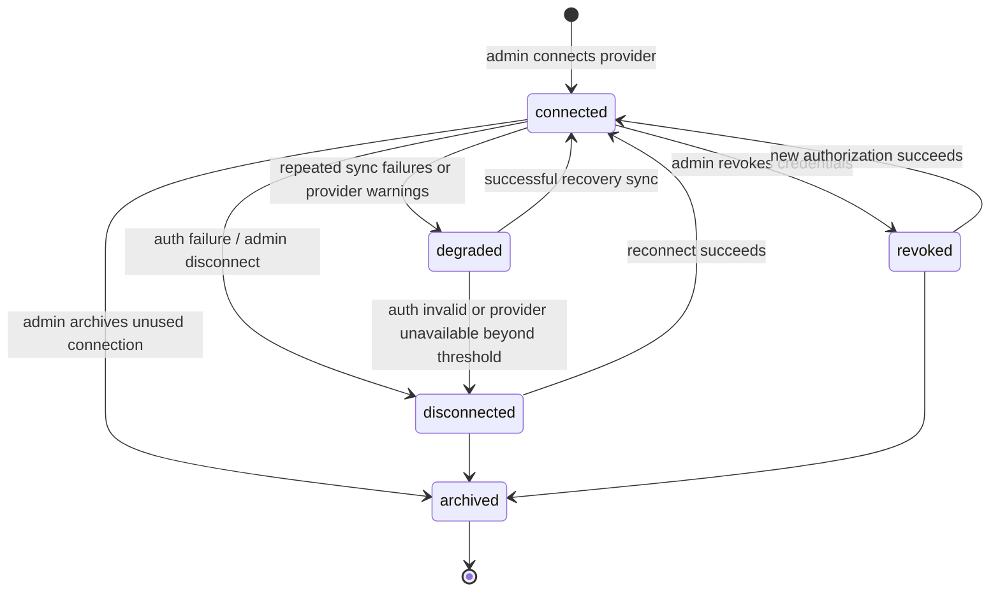
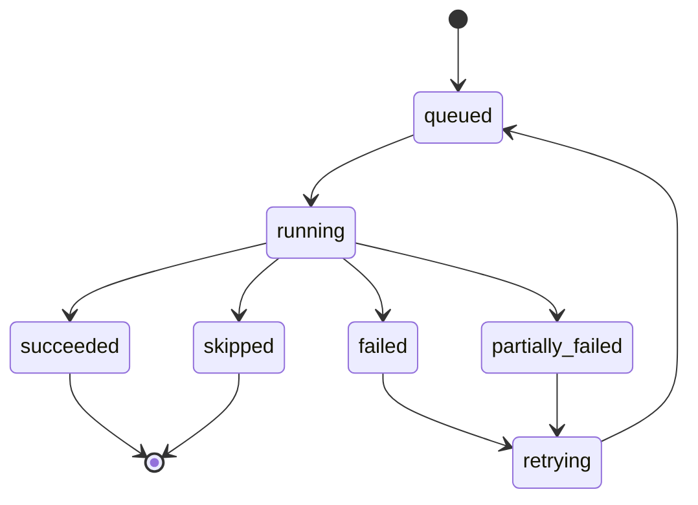
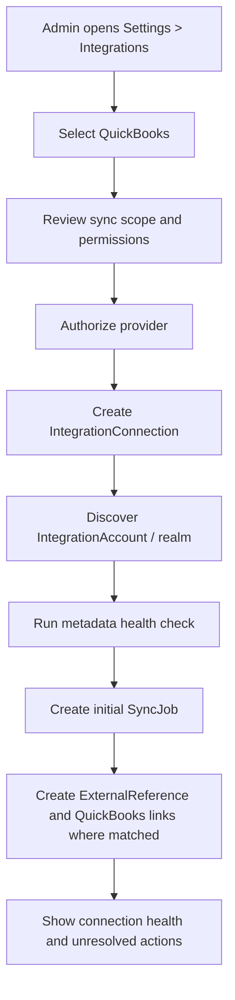
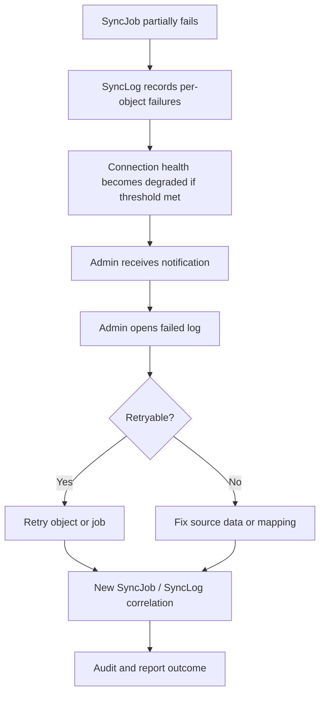

# 13_QuickBooks_Integrations.md

## 1. Document Metadata

| Field | Value |
| --- | --- |
| Document name | `13_QuickBooks_Integrations.md` |
| Phase | Phase 13 |
| Phase name | QuickBooks / Integrations |
| Document type | Phase-level product, architecture, data, API, UX, permissions, audit, reporting, and implementation specification |
| Status | Draft for implementation planning |
| Prepared for | Product, engineering, design, QA, data/integration engineering, implementation, support, and rollout teams |
| Source documents | Master platform documentation, global documentation rules, global domain model, global decisions register, and prior phase summaries 01-12 |
| Last updated | 2026-05-09 |
| Authoring role | Senior product architect / SaaS systems analyst / technical documentation lead |

## 2. Phase Purpose

Phase 13 defines QuickBooks as the first accounting integration and establishes the reusable integration foundation for the platform. It covers provider connections, external accounts, sync jobs, sync logs, external references, QuickBooks customer/invoice/item links, webhook delivery attempts, retries, errors, admin visibility, auditability, and reporting impact.

This phase does not replace CRM, inventory, orders, dispatch, service, reporting, or accounting systems. It defines how the platform safely connects operational source records to QuickBooks and how future integrations must reuse the same connection, mapping, sync, logging, retry, visibility, permission, and audit conventions.

## 3. Phase Goals

- Establish QuickBooks Online as the first approved accounting integration.
- Define provider-neutral integration entities reusable by future email, SMS, WhatsApp, LinkedIn logging support, telematics, external calendars, API, webhooks, import/export, and marketplace integrations.
- Make sync state visible and recoverable through admin UI, logs, reports, notifications, and audit events.
- Provide canonical mappings from internal records to external provider objects.
- Prevent provider-specific duplicate entity drift.
- Support safe manual retry, scheduled sync, webhook-triggered work, reconciliation, and backfill.
- Create conventions that later API/webhooks/import/export, admin/security, notifications/automation, rollout, and final blueprint phases must reuse.

## 4. Scope

In scope:

- QuickBooks Online as first accounting integration.
- `IntegrationConnection`, `IntegrationAccount`, `SyncJob`, `SyncLog`, `ExternalReference`, `QuickBooksCustomerLink`, `QuickBooksInvoiceLink`, `QuickBooksItemLink`, and `WebhookDelivery`.
- Connection lifecycle, credential references, provider environment metadata, account/realm discovery, sync status, retries, errors, admin monitoring, redacted payload preview, audit events, notifications, reporting, and permission rules.
- QuickBooks customer mapping to CRM `Account` and optional `Contact`.
- QuickBooks item mapping to `Product`.
- QuickBooks invoice mapping to `Order` for Phase 13, with invoice ownership carried as an open question.
- Integration readiness indicators on source records.
- Provider-neutral conventions for future integration phases.

## 5. Non-Goals

- Build a full accounting ledger or replace QuickBooks.
- Build payroll, bill pay, bank reconciliation, or tax filing.
- Build full public API and webhook endpoint management beyond delivery attempt conventions already needed for integration observability.
- Build a complete integration marketplace.
- Build full bidirectional sync for every QuickBooks object unless explicitly approved later.
- Create a new `Customer`, `Invoice`, or `Item` source entity only for QuickBooks.
- Rewrite prior phase entities or change source-of-truth ownership.
- Create Phase 14 scope.

## 6. Source-of-Truth Definitions

| Concept | Definition | Source-of-truth rule |
| --- | --- | --- |
| Tenant | Top-level SaaS isolation boundary. | Every integration record must include `tenant_id`. |
| Company | Customer organization inside a Tenant. | Every company-scoped integration record must include `company_id`. |
| Account | CRM business/customer/prospect/vendor record. | QuickBooks Customer links map to Account; do not create Customer as duplicate source entity. |
| Contact | Person associated with Account and other records. | May participate in QuickBooks customer link context but does not replace Account. |
| Product | Canonical item/product/service catalog record. | QuickBooks Item links map to Product. |
| Order | Canonical customer/operational order record. | QuickBooks Invoice links map to Order for Phase 13 unless a future billing entity is approved. |
| QuickBooks | First accounting integration provider. | Integration, not ledger replacement and not operational source of truth. |
| ExternalReference | Canonical provider-object mapping record. | Use for all synced external IDs, with `external_refs` on source records where applicable. |

## 7. Canonical Entity Definitions

__ENTITY_SECTIONS__

## 8. Entity Lifecycle and Status Rules

### IntegrationConnection lifecycle



### SyncJob lifecycle



Status rules:

- `connected` means credentials are valid and recent sync health is acceptable.
- `degraded` means connection exists but failures, stale sync, provider warnings, or partial failures require attention.
- `disconnected` means provider access is unavailable and normal sync cannot proceed.
- `revoked` means credential access was intentionally revoked.
- `archived` means no new work should be scheduled, but historical logs and mappings remain for audit.
- `partially_failed` means at least one object failed while other work succeeded.
- `skipped` must include a reason code.
- `retrying` must include `retry_count` and next attempt timing.

## 9. Entity Relationship Rules

```mermaid
erDiagram
    Tenant ||--o{{ Company : contains
    Company ||--o{{ IntegrationConnection : configures
    IntegrationConnection ||--o{{ IntegrationAccount : exposes
    IntegrationConnection ||--o{{ SyncJob : runs
    SyncJob ||--o{{ SyncLog : emits
    IntegrationConnection ||--o{{ ExternalReference : maps
    Account ||--o{{ QuickBooksCustomerLink : maps
    Contact ||--o{{ QuickBooksCustomerLink : optional_context
    Order ||--o{{ QuickBooksInvoiceLink : maps
    Product ||--o{{ QuickBooksItemLink : maps
    ExternalReference ||--o| QuickBooksCustomerLink : backs
    ExternalReference ||--o| QuickBooksInvoiceLink : backs
    ExternalReference ||--o| QuickBooksItemLink : backs
    WebhookEndpoint ||--o{{ WebhookDelivery : attempts
```

Rules:

- Source entities remain owned by their original modules. Integrations may reference, map, and sync them but must not own their lifecycle.
- Every provider mapping must include tenant, company, provider, connection, internal entity type/id, and external object type/id.
- QuickBooks link records must have a corresponding `ExternalReference` where the mapping is active.
- External IDs must be stored in `ExternalReference` and, where useful for source-record reads, in `external_refs.quickbooks`.
- Mapping uniqueness must include tenant, company, provider, connection, external object type, and external ID.
- Active duplicate mappings are prohibited unless a documented future provider supports many-to-many mapping with approved constraints.

## 10. Workflow Requirements

### QuickBooks connection workflow



### Failed sync recovery workflow



Workflow requirements:

- Connection setup must validate provider authorization before marking connected.
- Initial sync must never silently create ambiguous mappings.
- Sync jobs must be asynchronous and observable.
- Manual retry must be permission-gated and idempotency-aware.
- Admin mapping override must require a reason or audit context when the action can affect accounting sync.
- Disconnection must preserve historical mappings and logs unless a regulated deletion policy applies.

## 11. Data Model Requirements

- All Phase 13 entities must use stable application IDs and must not expose MongoDB `_id`.
- All Phase 13 business records must include `tenant_id`; company-scoped records must include `company_id`.
- Integration entities must include `provider`; QuickBooks records use `provider = quickbooks` or belong to QuickBooks-specific link entities.
- Secret material must be represented by `auth_reference` or `secret_ref`, not raw token fields.
- Sync jobs and logs must include correlation IDs or idempotency keys when useful for tracing retries.
- Error data must include provider error code, normalized error category, retryable flag, and human-safe message.
- Payload hashes may be stored for idempotency and debugging; raw payload retention must be controlled and redacted.
- Link entities must use `sync_status` in addition to lifecycle `status` where both mapping existence and latest sync state matter.
- Soft archive is preferred over hard delete for connections, mappings, jobs, and logs.

## 12. API Requirements

- **API-13-001:** Expose CRUD-style admin endpoints for IntegrationConnection with create/connect, read, update settings, archive, revoke, reconnect, and health-check actions.
- **API-13-002:** Expose read endpoints for IntegrationAccount scoped under IntegrationConnection.
- **API-13-003:** Expose list/read endpoints for SyncJob with filters and pagination.
- **API-13-004:** Expose list/read endpoints for SyncLog with filters by job, entity, provider, status, and error category.
- **API-13-005:** Expose endpoints to manually start sync jobs for supported sync types and directions.
- **API-13-006:** Expose endpoints to retry failed SyncJob records where retry is allowed.
- **API-13-007:** Expose endpoints to retry individual failed SyncLog records where object-level retry is allowed.
- **API-13-008:** Expose endpoints for ExternalReference lookup by internal entity, provider object, provider ID, and connection.
- **API-13-009:** Expose endpoints to list and inspect QuickBooksCustomerLink records by Account, Contact, sync status, and connection.
- **API-13-010:** Expose endpoints to list and inspect QuickBooksInvoiceLink records by Order, sync status, doc number, and connection.
- **API-13-011:** Expose endpoints to list and inspect QuickBooksItemLink records by Product, SKU/name, sync status, and connection.
- **API-13-012:** Expose permission-aware payload preview endpoints for troubleshooting with redaction.
- **API-13-013:** Expose webhook delivery list/read/retry endpoints for admin visibility and future API/webhooks reuse.
- **API-13-014:** Require idempotency keys for manual job creation and retry endpoints where duplicate execution is possible.
- **API-13-015:** Return stable error envelopes with code, message, retryable flag, correlation ID, and suggested resolution category.
- **API-13-016:** Never return raw secrets, access tokens, refresh tokens, signing secrets, or plaintext credential material.

Conceptual endpoint examples:

| Method | Path | Purpose |
| --- | --- | --- |
| GET | `/api/v1/integration-connections` | List connections by provider/status/company scope. |
| POST | `/api/v1/integration-connections/quickbooks/connect` | Start or complete QuickBooks connection flow. |
| GET | `/api/v1/integration-connections/{connection_id}` | Read connection metadata and health. |
| POST | `/api/v1/integration-connections/{connection_id}/reconnect` | Reauthorize a disconnected/revoked connection. |
| POST | `/api/v1/integration-connections/{connection_id}/revoke` | Revoke connection access. |
| GET | `/api/v1/sync-jobs` | List sync jobs. |
| POST | `/api/v1/sync-jobs` | Create manual sync job. |
| POST | `/api/v1/sync-jobs/{sync_job_id}/retry` | Retry a failed/partially failed job. |
| GET | `/api/v1/sync-logs` | List object-level sync logs. |
| POST | `/api/v1/sync-logs/{sync_log_id}/retry` | Retry object-level failure. |
| GET | `/api/v1/external-references` | Lookup mappings. |
| GET | `/api/v1/quickbooks/customer-links` | List customer links. |
| GET | `/api/v1/quickbooks/invoice-links` | List invoice links. |
| GET | `/api/v1/quickbooks/item-links` | List item links. |
| GET | `/api/v1/webhook-deliveries` | List webhook delivery attempts. |

## 13. UI / UX Requirements

- **UX-13-001:** Settings > Integrations landing page lists provider cards, connection state, last sync, next action, and permission-aware CTAs.
- **UX-13-002:** QuickBooks connection setup flow explains what will sync, required permissions, sandbox/production environment, and post-connect verification.
- **UX-13-003:** Connection detail page shows health summary, connected account, scopes, last successful sync, recent jobs, unresolved errors, and audit summary.
- **UX-13-004:** Sync Jobs page provides table, filters, saved views, status chips, duration, counts, trigger source, actor, provider, and retry controls.
- **UX-13-005:** Sync Job detail page shows run metadata, object counts, error summary, logs table, timeline, and safe payload/error details.
- **UX-13-006:** Mappings page shows ExternalReference and QuickBooks link records with internal entity link, provider object link metadata, sync status, and conflict/stale indicators.
- **UX-13-007:** QuickBooks readiness panels appear on Account, Order, and Product detail pages where permissions allow.
- **UX-13-008:** Empty state explains that no integration is connected and directs authorized admins to connect QuickBooks.
- **UX-13-009:** Permission-denied state explains that the user can view the source record but lacks integration permissions.
- **UX-13-010:** Disconnected state explains whether reconnect, revoke cleanup, or admin contact is required.
- **UX-13-011:** Error state must provide provider error category, affected object, suggested resolution, retry availability, and correlation ID.
- **UX-13-012:** Archived mapping state must remain visible to admins in history but hidden from normal active mapping selectors.
- **UX-13-013:** Manual retry controls must be disabled with a tooltip when the error is non-retryable or permission is missing.
- **UX-13-014:** Payload preview drawer must redact sensitive fields and clearly indicate redaction.
- **UX-13-015:** Saved views must support common finance/admin views such as Failed QuickBooks Invoices, Stale Customer Links, Failed Item Links, and Recent Sync Jobs.

Screens and components:

- Integrations landing page.
- QuickBooks provider setup wizard.
- Connection detail and health panel.
- Sync Jobs list.
- Sync Job detail.
- Sync Logs table.
- External References / Mapping list.
- QuickBooks Customer Links view.
- QuickBooks Invoice Links view.
- QuickBooks Item Links view.
- Source-record readiness cards on Account, Order, and Product.
- Redacted payload/error drawer.
- Audit summary drawer.
- Notification preferences impact panel.

## 14. Search, Filters, and Saved Views

- Integration records must be indexed through `SearchIndexRecord` only for safe searchable metadata.
- Search must support provider, connection display name, account/realm display name, source entity identifier, external display ID, doc number, status, error code, and date range.
- Filters must include tenant/company implicitly, provider, connection, object type, source entity type, sync type, direction, trigger source, status, retryable, stale, error category, and date range.
- Saved views must reuse `SavedView` and support personal, team, and shared visibility where permissions allow.
- Recommended saved views: Failed QuickBooks Invoices, Stale Customer Links, Failed Item Links, Recent Sync Jobs, Reconnect Required, Retryable Failures, Non-Retryable Validation Errors, Webhook Delivery Failures.

## 15. Permissions and Access Control

- **PERM-13-001:** `integrations.connection.view` allows viewing connection status and non-sensitive metadata.
- **PERM-13-002:** `integrations.connection.manage` allows connect, update settings, reconnect, revoke, and archive.
- **PERM-13-003:** `integrations.connection.secret.manage` allows credential rotation/reauthorization flows where applicable.
- **PERM-13-004:** `integrations.sync.view` allows viewing sync jobs and logs.
- **PERM-13-005:** `integrations.sync.run` allows manual sync start.
- **PERM-13-006:** `integrations.sync.retry` allows job-level and object-level retries.
- **PERM-13-007:** `integrations.sync.payload.view` allows redacted payload previews only.
- **PERM-13-008:** `integrations.mapping.view` allows viewing ExternalReference and provider link records.
- **PERM-13-009:** `integrations.mapping.manage` allows approved manual mapping override, stale marking, and archive.
- **PERM-13-010:** `integrations.quickbooks.view` allows viewing QuickBooks-specific link status on source records.
- **PERM-13-011:** `integrations.quickbooks.manage` allows QuickBooks-specific mapping and sync controls.
- **PERM-13-012:** `integrations.webhook_delivery.view` allows webhook delivery monitoring.
- **PERM-13-013:** `integrations.webhook_delivery.retry` allows delivery retry/replay where safe.
- **PERM-13-014:** Exporting sync logs requires both integration log permission and export permission.
- **PERM-13-015:** Users lacking the source record permission must not access integration logs for that source entity even if they have broad integration permissions, unless explicitly granted admin-level integration support permission.


Permission behavior:

- Frontend hiding is not sufficient; all APIs and workers must enforce backend permission checks.
- A user must have both module access and permission action grants.
- Record-level source permissions must be respected when integration logs expose source entity details.
- Support/admin roles may need special break-glass visibility later, but it must be explicit and audited.

## 16. Notifications

- **NOTIF-13-001:** Notify integration admins when a connection becomes disconnected or revoked.
- **NOTIF-13-002:** Notify integration admins when authentication expires or reconnect is required.
- **NOTIF-13-003:** Notify configured recipients when a scheduled sync fails.
- **NOTIF-13-004:** Notify configured recipients when sync partial failure exceeds company threshold.
- **NOTIF-13-005:** Notify finance/admin users when QuickBooks invoice sync fails due to validation or mapping error.
- **NOTIF-13-006:** Notify product/admin users when QuickBooks item mapping requires manual action.
- **NOTIF-13-007:** Notify CRM/admin users when customer mapping conflicts require manual action.
- **NOTIF-13-008:** Notify integration admins when webhook delivery repeatedly fails.
- **NOTIF-13-009:** Notify requesting user when manual retry succeeds or fails if they opted in.
- **NOTIF-13-010:** Notifications must respect notification preferences, permissions, and company/module access.

## 17. Audit Logging

- **AUDIT-13-001:** `integration.connection.created` must be emitted with actor, tenant, company, target entity, connection, provider, timestamp, correlation ID, and safe metadata.
- **AUDIT-13-002:** `integration.connection.connected` must be emitted with actor, tenant, company, target entity, connection, provider, timestamp, correlation ID, and safe metadata.
- **AUDIT-13-003:** `integration.connection.updated` must be emitted with actor, tenant, company, target entity, connection, provider, timestamp, correlation ID, and safe metadata.
- **AUDIT-13-004:** `integration.connection.reconnected` must be emitted with actor, tenant, company, target entity, connection, provider, timestamp, correlation ID, and safe metadata.
- **AUDIT-13-005:** `integration.connection.revoked` must be emitted with actor, tenant, company, target entity, connection, provider, timestamp, correlation ID, and safe metadata.
- **AUDIT-13-006:** `integration.connection.archived` must be emitted with actor, tenant, company, target entity, connection, provider, timestamp, correlation ID, and safe metadata.
- **AUDIT-13-007:** `integration.connection.health_checked` must be emitted with actor, tenant, company, target entity, connection, provider, timestamp, correlation ID, and safe metadata.
- **AUDIT-13-008:** `integration.sync_job.created` must be emitted with actor, tenant, company, target entity, connection, provider, timestamp, correlation ID, and safe metadata.
- **AUDIT-13-009:** `integration.sync_job.started` must be emitted with actor, tenant, company, target entity, connection, provider, timestamp, correlation ID, and safe metadata.
- **AUDIT-13-010:** `integration.sync_job.completed` must be emitted with actor, tenant, company, target entity, connection, provider, timestamp, correlation ID, and safe metadata.
- **AUDIT-13-011:** `integration.sync_job.failed` must be emitted with actor, tenant, company, target entity, connection, provider, timestamp, correlation ID, and safe metadata.
- **AUDIT-13-012:** `integration.sync_job.retried` must be emitted with actor, tenant, company, target entity, connection, provider, timestamp, correlation ID, and safe metadata.
- **AUDIT-13-013:** `integration.sync_log.retried` must be emitted with actor, tenant, company, target entity, connection, provider, timestamp, correlation ID, and safe metadata.
- **AUDIT-13-014:** `integration.external_reference.created` must be emitted with actor, tenant, company, target entity, connection, provider, timestamp, correlation ID, and safe metadata.
- **AUDIT-13-015:** `integration.external_reference.updated` must be emitted with actor, tenant, company, target entity, connection, provider, timestamp, correlation ID, and safe metadata.
- **AUDIT-13-016:** `integration.external_reference.marked_stale` must be emitted with actor, tenant, company, target entity, connection, provider, timestamp, correlation ID, and safe metadata.
- **AUDIT-13-017:** `integration.external_reference.archived` must be emitted with actor, tenant, company, target entity, connection, provider, timestamp, correlation ID, and safe metadata.
- **AUDIT-13-018:** `integration.quickbooks_customer_link.created` must be emitted with actor, tenant, company, target entity, connection, provider, timestamp, correlation ID, and safe metadata.
- **AUDIT-13-019:** `integration.quickbooks_invoice_link.created` must be emitted with actor, tenant, company, target entity, connection, provider, timestamp, correlation ID, and safe metadata.
- **AUDIT-13-020:** `integration.quickbooks_item_link.created` must be emitted with actor, tenant, company, target entity, connection, provider, timestamp, correlation ID, and safe metadata.
- **AUDIT-13-021:** `integration.mapping.override` must be emitted with actor, tenant, company, target entity, connection, provider, timestamp, correlation ID, and safe metadata.
- **AUDIT-13-022:** `integration.webhook_delivery.retried` must be emitted with actor, tenant, company, target entity, connection, provider, timestamp, correlation ID, and safe metadata.
- **AUDIT-13-023:** `integration.payload_preview.viewed` must be emitted with actor, tenant, company, target entity, connection, provider, timestamp, correlation ID, and safe metadata.


Audit rules:

- Secret values and tokens must never appear in audit metadata.
- Payload preview access is itself auditable.
- Worker-created audit events must identify the system actor and originating SyncJob.
- Mapping override audit logs must include a reason where possible.

## 18. Reporting and Analytics Impact

- **REPORT-13-001:** Reporting must expose integration health by provider, connection, and company.
- **REPORT-13-002:** Reporting must expose sync job volume, success rate, failure rate, partial failure rate, retry rate, and average duration.
- **REPORT-13-003:** Reporting must expose unresolved sync failures by object type, provider, module, and error category.
- **REPORT-13-004:** Reporting must expose QuickBooks customer link coverage for Accounts.
- **REPORT-13-005:** Reporting must expose QuickBooks item link coverage for Products.
- **REPORT-13-006:** Reporting must expose QuickBooks invoice link coverage for Orders.
- **REPORT-13-007:** Reporting must expose stale mappings and mapping conflicts.
- **REPORT-13-008:** Reporting must expose disconnected/degraded connection history.
- **REPORT-13-009:** Reporting must expose webhook delivery success/failure and retry outcomes.
- **REPORT-13-010:** Reporting must reuse Phase 12 MetricDefinition and RollupSnapshot patterns for expensive integration metrics.
- **REPORT-13-011:** Reports must display freshness metadata and last successful sync timestamps.
- **REPORT-13-012:** Reports must respect source-record and integration permissions.

## 19. Mobile and Offline Impact

- **OFFLINE-13-001:** Mobile users should see simple integration readiness indicators only where relevant, such as billing readiness warnings on source records.
- **OFFLINE-13-002:** Mobile/offline clients must not initiate provider authentication or direct QuickBooks sync in MVP.
- **OFFLINE-13-003:** Offline-created source records must sync to the platform first before any QuickBooks sync is attempted.
- **OFFLINE-13-004:** Offline queued actions must be revalidated server-side before integration jobs use the records.
- **OFFLINE-13-005:** Mobile error messages should direct users to admin/finance resolution when integration failure is outside their permission scope.
- **OFFLINE-13-006:** Field completion flows must not block solely because QuickBooks is unavailable unless a company-level business rule later requires billing readiness before closure.
- **OFFLINE-13-007:** Integration logs and payload previews are desktop/admin workflows, not mobile offline workflows.

## 20. Integration Impact

- **INT-13-001:** QuickBooks is the first accounting integration.
- **INT-13-002:** Provider-neutral sync foundations must be reusable by future providers.
- **INT-13-003:** External IDs must use `ExternalReference` and `external_refs`.
- **INT-13-004:** QuickBooks customer, invoice, and item mappings must use approved link entities.
- **INT-13-005:** Provider sync must use SyncJob and SyncLog.
- **INT-13-006:** Webhook delivery attempts must use WebhookDelivery.
- **INT-13-007:** Provider authentication must use secret references.
- **INT-13-008:** Sync retries must be bounded and observable.
- **INT-13-009:** Future API/webhooks/import/export phases must reuse these conventions.
- **INT-13-010:** Future notification/automation phases must use SyncJob, SyncLog, ExternalReference, link statuses, and WebhookDelivery as trigger sources rather than reading raw provider payloads directly.
- **INT-13-011:** Integration marketplace concepts must build on IntegrationConnection and IntegrationAccount.
- **INT-13-012:** Future telematics/email/SMS/calendar provider integrations must not create parallel job/log/reference models.

## 21. Security Considerations

- Provider secrets must be encrypted and stored outside ordinary documents, referenced by `auth_reference` or `secret_ref`.
- Only minimal provider scopes required for approved sync should be requested.
- Reconnect/revoke actions must require elevated permission and audit logging.
- Payload preview must redact secrets, tokens, authorization headers, signatures, and sensitive provider fields.
- Tenant and company filters must be mandatory in all integration queries.
- Cross-company connection reuse is prohibited unless a future tenant-level integration model is explicitly approved.
- Support access must be separately permissioned and audited.
- Webhook payload hashing should support idempotency and tamper investigation without retaining excessive raw payload data.
- Error messages must be useful but must not leak credentials or unrelated tenant/company data.

## 22. Edge Cases

- **EC-13-001:** QuickBooks token expires during a running sync job.
- **EC-13-002:** QuickBooks realm/company is disconnected or replaced after mappings exist.
- **EC-13-003:** Two internal Accounts appear to match the same QuickBooks Customer.
- **EC-13-004:** One internal Product maps to multiple QuickBooks Items because of historic duplicates.
- **EC-13-005:** A QuickBooks Item is inactive but still referenced by existing synced invoices.
- **EC-13-006:** An Order is cancelled after a QuickBooks invoice has already been created.
- **EC-13-007:** QuickBooks invoice creation succeeds but the platform times out before storing the link.
- **EC-13-008:** A retry sends the same operation twice without idempotency protection.
- **EC-13-009:** Provider rate limit is reached during a large backfill.
- **EC-13-010:** Provider returns validation error because required accounting fields are missing.
- **EC-13-011:** Internal source record is archived while sync is queued.
- **EC-13-012:** Source user loses permission after starting a manual sync.
- **EC-13-013:** Company disables the QuickBooks module while jobs are queued.
- **EC-13-014:** External object is deleted in QuickBooks after mapping is created.
- **EC-13-015:** External object is merged or renamed in QuickBooks.
- **EC-13-016:** Webhook delivery endpoint is down for multiple retry attempts.
- **EC-13-017:** Webhook delivery succeeds but returns unexpected response body.
- **EC-13-018:** Admin archives an incorrect mapping while a sync job is running.
- **EC-13-019:** Multiple scheduled syncs overlap for the same connection.
- **EC-13-020:** Stale ExternalReference exists with no active provider link entity.
- **EC-13-021:** A support user can see integration logs but not the underlying Account, Product, or Order.
- **EC-13-022:** Sandbox and production QuickBooks IDs are accidentally mixed.
- **EC-13-023:** Currency or tax configuration differs between platform and QuickBooks.
- **EC-13-024:** QuickBooks object version/conflict token changed since last sync.


## 23. Business Requirements

- **BR-13-001:** The platform must treat QuickBooks as the first accounting integration and a first-class operational concern, not as an afterthought.
- **BR-13-002:** QuickBooks sync must preserve the platform as the operational source of truth for CRM, orders, products, field work, service, dispatch, and reporting records unless a future billing decision says otherwise.
- **BR-13-003:** Admins must be able to connect, disconnect, monitor, troubleshoot, and retry integration sync work without engineering intervention for routine failures.
- **BR-13-004:** Every provider object mapping must be visible through a stable internal entity and must not rely only on hidden provider IDs.
- **BR-13-005:** The platform must support explicit sync status for customers, invoices, and items so finance users know what is ready, pending, failed, or stale.
- **BR-13-006:** Integration failures must be recoverable and visible; silent failure is prohibited.
- **BR-13-007:** QuickBooks customer links must reuse CRM Account and Contact rather than creating a duplicate Customer entity.
- **BR-13-008:** QuickBooks invoice links must reuse Order as the Phase 13 approved billing source until invoice ownership is resolved.
- **BR-13-009:** QuickBooks item links must reuse Product rather than creating duplicate item catalogs.
- **BR-13-010:** Sync jobs must support manual trigger, scheduled trigger, retry trigger, webhook-triggered trigger, and system/backfill trigger patterns.
- **BR-13-011:** Integration history must be searchable, filterable, reportable, and auditable by tenant, company, provider, connection, object type, status, and time range.
- **BR-13-012:** Integration permissions must separate setup/reconnect privileges from monitoring-only privileges.
- **BR-13-013:** External provider credentials, tokens, secrets, and webhook secrets must never be stored or displayed in plaintext.
- **BR-13-014:** The integration foundation must be provider-neutral enough to support future email, SMS, WhatsApp, telematics, external calendar, API, import/export, and webhooks phases.
- **BR-13-015:** QuickBooks sync must handle duplicate detection, stale mappings, deleted external objects, rate limits, authentication expiration, and partial failures.
- **BR-13-016:** Reports and dashboards must include integration health and QuickBooks sync readiness metrics.
- **BR-13-017:** The integration UI must provide actionable error states with suggested next steps and permission-aware controls.
- **BR-13-018:** All integration actions must respect tenant isolation, company module enablement, RBAC, and future policy-based authorization.

## 24. Functional Requirements

- **FR-13-001:** Create, view, update, archive, reconnect, revoke, and health-check IntegrationConnection records.
- **FR-13-002:** Store provider authorization using `auth_reference` or secret references only; never store provider tokens in user-readable fields.
- **FR-13-003:** Support QuickBooks as `provider = quickbooks` with provider environment metadata for sandbox and production separation.
- **FR-13-004:** Create IntegrationAccount records after successful provider connection discovery.
- **FR-13-005:** Create SyncJob records for every manual, scheduled, webhook-triggered, backfill, retry, or reconciliation sync run.
- **FR-13-006:** Create SyncLog records for every synced or attempted object where a per-object result exists.
- **FR-13-007:** Create ExternalReference records for every successfully mapped QuickBooks Customer, Invoice, and Item object.
- **FR-13-008:** Mirror key QuickBooks IDs into `external_refs.quickbooks` on linked source entities where applicable.
- **FR-13-009:** Create QuickBooksCustomerLink records for approved Account and optional Contact mappings.
- **FR-13-010:** Create QuickBooksInvoiceLink records for approved Order-to-QuickBooks invoice mappings.
- **FR-13-011:** Create QuickBooksItemLink records for approved Product-to-QuickBooks item mappings.
- **FR-13-012:** Prevent duplicate active ExternalReference rows for the same tenant, company, provider, external object type, and external ID.
- **FR-13-013:** Prevent duplicate active QuickBooks link records for the same internal source entity and connection unless explicitly versioned or archived.
- **FR-13-014:** Support manual object-level retry from failed SyncLog and failed provider link records.
- **FR-13-015:** Support job-level retry for failed and partially failed SyncJob records.
- **FR-13-016:** Support idempotency keys for sync operations that may be retried by workers or admins.
- **FR-13-017:** Support sync direction values such as push, pull, bidirectional, reconciliation, and metadata_refresh.
- **FR-13-018:** Support trigger source values such as manual, scheduled, webhook, system, retry, import, export, and backfill.
- **FR-13-019:** Track object counts on SyncJob, including total, succeeded, failed, skipped, retried, created, updated, and unchanged.
- **FR-13-020:** Expose connection health based on last successful sync, credential validity, provider errors, and unresolved failed jobs.
- **FR-13-021:** Allow admins to mark mappings stale when the external object should be reviewed before reuse.
- **FR-13-022:** Allow authorized admins to archive incorrect provider link records while preserving audit history.
- **FR-13-023:** Support object-level conflict flags when internal and QuickBooks values differ materially.
- **FR-13-024:** Support QuickBooks customer matching by existing external reference, account-level metadata, and admin-confirmed match.
- **FR-13-025:** Support QuickBooks item matching by existing external reference, SKU/name metadata, and admin-confirmed match.
- **FR-13-026:** Support QuickBooks invoice matching by existing external reference, order number, doc number, and admin-confirmed match.
- **FR-13-027:** Record provider error codes, human-readable messages, retryability, and suggested resolution category.
- **FR-13-028:** Classify errors as auth, permission, validation, rate_limit, duplicate, not_found, conflict, provider_down, network, mapping, or unknown.
- **FR-13-029:** Support exponential backoff or controlled retry scheduling for retryable provider failures.
- **FR-13-030:** Stop automatic retries after configured limits and surface the job as failed or partially_failed.
- **FR-13-031:** Support admin filters for provider, connection, sync type, direction, status, object type, error type, and date range.
- **FR-13-032:** Emit notifications for disconnected connections, repeated failures, failed scheduled sync, and manual action required.
- **FR-13-033:** Emit AuditLog entries for all admin actions and high-impact sync state changes.
- **FR-13-034:** Expose integration health metrics to Reporting / Dashboards using MetricDefinition and RollupSnapshot where appropriate.
- **FR-13-035:** Support WebhookDelivery records for outbound delivery attempts and future replay behavior.
- **FR-13-036:** Provide safe payload previews that redact secrets, tokens, credentials, and sensitive provider fields.
- **FR-13-037:** Support background worker locks so the same connection/object sync does not run concurrently in unsafe ways.
- **FR-13-038:** Provide reconciliation views for records linked internally but missing in QuickBooks, and QuickBooks objects without a confirmed internal link.

## 25. Non-Functional Requirements

- **NFR-13-001:** Sync workers must be idempotent for retry-safe operations.
- **NFR-13-002:** Integration reads and writes must enforce tenant and company filters at every service layer.
- **NFR-13-003:** Credential handling must use secret references and secure token storage outside normal application documents.
- **NFR-13-004:** Connection health calculation must be deterministic and reproducible from stored state.
- **NFR-13-005:** Large sync jobs must run asynchronously and must not block user-facing request threads.
- **NFR-13-006:** Admin monitoring screens must load with pagination for large log volumes.
- **NFR-13-007:** SyncLog storage must support high-volume retention policies without degrading operational source-record performance.
- **NFR-13-008:** Provider rate-limit handling must avoid retry storms.
- **NFR-13-009:** All timestamps must be timezone-aware and stored consistently in UTC with display localization in the UI.
- **NFR-13-010:** Provider payload previews must be redacted by default.
- **NFR-13-011:** Failures must include actionable metadata without leaking secrets or regulated data.
- **NFR-13-012:** Integration APIs must be versioned and must preserve backward-compatible response contracts within the phase.
- **NFR-13-013:** Webhook delivery retries must be bounded and observable.
- **NFR-13-014:** Reporting rollups must tolerate delayed sync completion and expose freshness metadata.
- **NFR-13-015:** Integration monitoring must remain usable during provider outages.
- **NFR-13-016:** Audit logging must be append-only and resilient to worker retries.
- **NFR-13-017:** Mapping uniqueness checks must be enforced at database and service levels.
- **NFR-13-018:** The system must support future provider additions without requiring schema duplication for each provider.

## 26. User Stories

### Company Admin

- As a Company Admin, I want to connect QuickBooks so finance data can sync without engineering help.
- As a Company Admin, I want to revoke a connection so a former provider account no longer has access.
- As a Company Admin, I want to see integration health so I know whether the connection is safe to rely on.

### Finance / Accounting User

- As a finance user, I want to see which orders have synced to QuickBooks invoices so I can reconcile billing.
- As a finance user, I want failed invoice sync errors to explain what needs fixing.
- As a finance user, I want customer and item mappings visible before invoice sync so mistakes are caught early.

### Operations Manager

- As an operations manager, I want product and order readiness indicators so dispatch or service work does not reach billing with missing data.
- As an operations manager, I want integration dashboards showing failures by module so I can assign cleanup.

### Support Admin

- As a support admin, I want correlation IDs, job IDs, and log details so I can troubleshoot safely.
- As a support admin, I want redacted payload previews so I can diagnose provider validation errors without exposing secrets.

### Developer / Integration Engineer

- As an integration engineer, I want provider-neutral sync entities so future integrations reuse the same job, log, mapping, retry, and observability patterns.
- As an integration engineer, I want idempotency and retry rules documented so worker behavior is predictable.

### Read-only Analyst

- As an analyst, I want integration success-rate metrics so I can report on operational readiness.
- As an analyst, I want stale mappings and unresolved errors available in dashboards without seeing credentials.

## 27. Recommended Decisions

- **RD-13-001:** Start QuickBooks scope with Customer, Invoice, and Item links only; defer payments, estimates, bills, vendors, and deposits unless required by an early customer.
- **RD-13-002:** Treat Order as the Phase 13 invoice source for QuickBooksInvoiceLink, while carrying invoice ownership as an open question.
- **RD-13-003:** Use provider-neutral SyncJob and SyncLog for all integration jobs, including future import/export and webhooks where appropriate.
- **RD-13-004:** Use redacted payload preview rather than raw payload download for MVP admin troubleshooting.
- **RD-13-005:** Use scheduled reconciliation jobs to detect stale and deleted external QuickBooks objects.
- **RD-13-006:** Default QuickBooks sync to controlled push/reconciliation behavior rather than broad bidirectional edits until field-level ownership is confirmed.
- **RD-13-007:** Make mapping override admin-only and require audit reason when it affects accounting outputs.

## 28. Open Questions

- **OQ-13-001:** Should Order remain the long-term source entity for QuickBooks invoices, or should a future dedicated BillingInvoice entity own invoice creation?
- **OQ-13-002:** Which QuickBooks object mappings beyond Customer, Invoice, and Item are required for MVP?
- **OQ-13-003:** Which QuickBooks fields are mandatory per accounting configuration, especially tax, class, location, income account, terms, and currency?
- **OQ-13-004:** Should customer and item updates be one-way platform-to-QuickBooks, QuickBooks-to-platform, or selective bidirectional?
- **OQ-13-005:** What are exact retention periods for SyncLog and WebhookDelivery payload metadata?
- **OQ-13-006:** Which production secret storage service will be used?
- **OQ-13-007:** What exact generated ID format will be used?
- **OQ-13-008:** Should support/admin break-glass access exist for provider logs, and what approvals are required?

## 29. Dependencies

- Phase 01 product definition establishes QuickBooks as first accounting integration and confirms unified modular platform direction.
- Phase 02 identity/access defines Tenant, Company, UserMembership, Role, Permission, and backend authorization rules.
- Phase 03 core platform defines AuditLog, Notification, BackgroundJob, SavedView, SearchIndexRecord, ImportJob, ExportJob, ApiKey, WebhookEndpoint, WebhookDelivery, settings, files, tags, and custom fields.
- Phase 04 CRM defines Account, Contact, Activity, and CRM timeline context.
- Phase 05 outbound sales creates future channel integration needs but LinkedIn remains manual logging first.
- Phase 06 calendar/tasks defines scheduling/reminder foundations reused by scheduled sync and notification behaviors.
- Phase 07 field/site work creates operational records that may later need billing readiness but do not sync directly in Phase 13.
- Phase 08 inventory defines Product, which maps to QuickBooksItemLink.
- Phase 09 orders/dispatch/logistics defines Order, which maps to QuickBooksInvoiceLink for Phase 13.
- Phase 10 fleet/device tracking may later use provider-neutral integration conventions for telematics providers.
- Phase 11 service/work orders may later feed billing readiness and QuickBooks invoice workflows through Order or future billing entity.
- Phase 12 reporting/dashboards defines metrics, reports, dashboards, rollups, and scheduled report patterns for integration health.

## 30. Future Phase Considerations

- Phase 14+ API/webhooks/import/export must reuse SyncJob, SyncLog, ExternalReference, WebhookDelivery, ApiKey, WebhookEndpoint, ImportJob, and ExportJob conventions.
- Admin/security phase must expand integration permission governance, secret rotation, support access, audit review, and retention policies.
- Notifications/automation phase must consume integration events safely rather than inventing provider-specific triggers.
- Rollout phase must include QuickBooks onboarding, sandbox validation, reconciliation checklists, and failure-response playbooks.
- Final blueprint must preserve provider-neutral integration entities and QuickBooks-specific link restrictions.
- Future accounting phases may introduce payments, estimates, bills, vendors, tax classes, and dedicated billing records through explicit decisions.

## 31. Acceptance Criteria

- Phase 13 entities are defined with purpose, owner, scope, scoping, fields, relationships, lifecycle, statuses, indexes, permissions, audit, reporting, and future impact.
- QuickBooks Customer, Invoice, and Item mappings are represented only by approved link entities and ExternalReference.
- IntegrationConnection supports connect, reconnect, revoke, archive, health, and provider environment metadata.
- SyncJob and SyncLog support admin troubleshooting, retries, object-level failures, and reporting.
- Integration UI includes connection, job, log, mapping, error, empty, permission, and redacted payload states.
- APIs include stable requirement IDs, conceptual endpoints, error envelopes, idempotency, and redaction rules.
- Permissions separate view, manage, retry, payload preview, mapping, QuickBooks, and webhook delivery capabilities.
- Audit events cover connection, sync, mapping, retry, webhook, and payload preview actions.
- Reporting requirements cover integration health, failure rates, stale mappings, retry outcomes, and QuickBooks link coverage.
- Mobile/offline behavior is defined as limited, server-driven, and not direct provider sync.
- Open questions capture invoice ownership, object scope, retention, secret storage, ID format, and bidirectional behavior.

## 32. Implementation Notes

- Model workers as idempotent background jobs with per-connection locks for unsafe overlapping work.
- Use normalized error categories in addition to raw provider error codes.
- Store provider object version/sync tokens where needed for conflict detection.
- Use database-level unique constraints for active provider mappings.
- Keep payload retention configurable and conservative.
- Use correlation IDs across SyncJob, SyncLog, AuditLog, Notification, and worker logs.
- Ensure source entity pages query integration readiness through a lightweight summary endpoint, not through raw log scans.
- Treat sandbox and production provider environments as separate connection contexts.
- Avoid broad bidirectional sync until field-level ownership decisions are confirmed.

# Summary for Future Phases

## Final Decisions Made

- Phase 13 establishes QuickBooks as the first accounting integration and creates the reusable integration foundation for provider connections, external accounts, sync jobs, sync logs, external references, QuickBooks links, webhook delivery attempts, retries, errors, admin visibility, reporting, and auditability.
- `IntegrationConnection` is the canonical configured provider connection record. Future phases must not create provider-specific connection entities such as `QuickBooksConnection`, `SmsConnection`, or `TelematicsConnection`; use `IntegrationConnection` with `provider` and provider metadata.
- `IntegrationAccount` is the canonical external account/profile/realm context under an `IntegrationConnection`. For QuickBooks, it represents the connected QuickBooks company/realm.
- `SyncJob` is the canonical asynchronous integration sync run record for manual, scheduled, retry, webhook-triggered, reconciliation, backfill, push, pull, and metadata refresh work.
- `SyncLog` is the canonical object-level sync result record emitted by `SyncJob`.
- `ExternalReference` is the canonical queryable mapping from internal source entity to external provider object and must be used with embedded `external_refs` on source records where applicable.
- QuickBooks-specific provider links are approved only for `QuickBooksCustomerLink`, `QuickBooksInvoiceLink`, and `QuickBooksItemLink`. Future phases must not create `QBCustomer`, `QBInvoice`, `QBItem`, or duplicated provider mirror entities unless a new global decision approves it.
- `QuickBooksCustomerLink` maps CRM `Account` and optional `Contact` context to QuickBooks Customer objects. It does not create a new Customer source entity.
- `QuickBooksInvoiceLink` maps `Order` to QuickBooks Invoice objects for Phase 13. Invoice creation ownership remains an Open Question because the platform may later introduce a dedicated billing/invoice source entity.
- `QuickBooksItemLink` maps `Product` to QuickBooks Item/Product/Service objects. It does not replace the Product catalog.
- `WebhookDelivery` is the canonical outbound webhook delivery attempt record. Phase 13 defines delivery observability and retry conventions; Phase 17 may expand public API/webhook endpoint management.
- QuickBooks is a sync integration, not the accounting ledger replacement and not the operational source of truth for CRM, orders, products, dispatch, field, service, inventory, or reporting records.
- Integration failures must never be silent. Failed, partially failed, stale, skipped, and retrying states must be visible to authorized admins and reportable.
- Provider credentials, tokens, refresh tokens, signing secrets, webhook secrets, and raw sensitive payload fields must never be stored or displayed in plaintext. Use `auth_reference`, `secret_ref`, and redacted payload previews.
- Integration actions must respect tenant isolation, company scoping, module enablement, RBAC, record permissions, export permissions, and future policy-based authorization.
- Integration monitoring and reporting must reuse Phase 12 `MetricDefinition`, `ReportRun`, `RollupSnapshot`, dashboards, and report conventions.
- Integration events must reuse Phase 03 `AuditLog`, `Notification`, `BackgroundJob`, `SavedView`, `SearchIndexRecord`, `ImportJob`, `ExportJob`, `ApiKey`, `WebhookEndpoint`, and `WebhookDelivery` foundations.

## Entities Introduced

| Entity | Owner | Purpose | Future Phase Rule |
| --- | --- | --- | --- |
| `IntegrationConnection` | Integrations | Configured external provider connection. | Reuse for all provider connections. Do not create provider-specific connection duplicates. |
| `IntegrationAccount` | Integrations | External account/profile/realm under a connection. | Reuse for provider account contexts such as QuickBooks realm/company, telematics account, SMS account, or email workspace. |
| `SyncJob` | Integrations | Async sync execution record. | Reuse for all provider sync, backfill, retry, reconciliation, metadata refresh, and integration job observability. |
| `SyncLog` | Integrations | Object-level sync result. | Reuse for row/object-level provider results, errors, retries, and troubleshooting. |
| `ExternalReference` | Integrations | Queryable internal-to-external mapping. | Reuse for all external object mappings; combine with `external_refs` on source entities. |
| `QuickBooksCustomerLink` | Integrations / QuickBooks | Account/Contact to QuickBooks Customer mapping. | Do not create duplicate customer entities. |
| `QuickBooksInvoiceLink` | Integrations / QuickBooks | Order to QuickBooks Invoice mapping. | Reuse until a future approved billing source entity supersedes Order as invoice source. |
| `QuickBooksItemLink` | Integrations / QuickBooks | Product to QuickBooks Item mapping. | Do not duplicate Product catalog. |
| `WebhookDelivery` | Integrations | Outbound webhook delivery attempt. | Reuse for future API/webhooks phase and provider event delivery observability. |

## Fields Introduced

- Standard integration scope fields: `id`, `tenant_id`, `company_id`, `provider`, `connection_id`, `integration_account_id`, `created_at`, `created_by`, `updated_at`, `updated_by`, `archived_at`.
- `IntegrationConnection`: `provider_environment`, `auth_reference`, `scopes`, `status`, `health_status`, `sync_settings`, `last_sync_at`, `last_successful_sync_at`, `last_error_code`, `last_error_message`, `revoked_at`.
- `IntegrationAccount`: `external_account_id`, `external_realm_id`, `display_name`, `metadata`, `status`.
- `SyncJob`: `sync_type`, `direction`, `trigger_source`, `status`, `requested_by`, `started_at`, `completed_at`, `retry_count`, `idempotency_key`, `object_counts`, `error_summary`, `lock_key`.
- `SyncLog`: `sync_job_id`, `entity_type`, `entity_id`, `external_object_type`, `external_id`, `operation`, `status`, `error_code`, `error_message`, `attempt_count`, `occurred_at`.
- `ExternalReference`: `entity_type`, `entity_id`, `external_object_type`, `external_id`, `external_display_id`, `external_version`, `sync_status`, `status`, `last_synced_at`, `last_seen_external_at`, `deleted_at`.
- `QuickBooksCustomerLink`: `account_id`, `contact_id`, `quickbooks_customer_id`, `quickbooks_display_name`, `sync_status`, `last_synced_at`, `last_error_code`, `last_error_message`, `external_reference_id`.
- `QuickBooksInvoiceLink`: `order_id`, `quickbooks_invoice_id`, `quickbooks_doc_number`, `sync_status`, `invoice_sync_direction`, `amount_total`, `currency`, `last_synced_at`, `last_error_code`, `external_reference_id`.
- `QuickBooksItemLink`: `product_id`, `quickbooks_item_id`, `quickbooks_item_type`, `quickbooks_name`, `sync_status`, `last_synced_at`, `last_error_code`, `external_reference_id`.
- `WebhookDelivery`: `webhook_endpoint_id`, `event_type`, `source_entity_type`, `source_entity_id`, `payload_hash`, `status`, `attempt_count`, `next_retry_at`, `last_attempted_at`, `delivered_at`, `response_status_code`, `error_message`, `discarded_at`.

## APIs Introduced

- Integration connection admin APIs for connect/create, read, update settings, reconnect, revoke, archive, and health check.
- Integration account read APIs scoped under connections.
- Sync job APIs for list, read, start manual sync, retry job, and inspect job counts/errors.
- Sync log APIs for list, read, filter by job/entity/provider/status/error category, and object-level retry.
- External reference lookup APIs by internal entity, provider object, provider ID, object type, and connection.
- QuickBooks link APIs for customer, invoice, and item link visibility, stale marking, retry, and approved mapping override.
- Webhook delivery APIs for list, read, retry/replay where allowed, and redacted payload/error inspection.
- All integration APIs require stable error envelopes with `code`, `message`, `retryable`, `correlation_id`, and `resolution_category`.

## Permissions Introduced

- `integrations.connection.view`
- `integrations.connection.manage`
- `integrations.connection.secret.manage`
- `integrations.sync.view`
- `integrations.sync.run`
- `integrations.sync.retry`
- `integrations.sync.payload.view`
- `integrations.mapping.view`
- `integrations.mapping.manage`
- `integrations.quickbooks.view`
- `integrations.quickbooks.manage`
- `integrations.webhook_delivery.view`
- `integrations.webhook_delivery.retry`
- Exporting integration logs also requires relevant export permissions. Source-record visibility must still be respected.

## UX Patterns Introduced

- Settings > Integrations provider-card landing page.
- QuickBooks connect/reconnect/revoke setup flow with environment and permission explanation.
- Integration connection detail page with health, account, scopes, sync settings, recent jobs, unresolved errors, and audit summary.
- Sync Jobs table and detail views with status chips, filters, object counts, logs, retry controls, and error summaries.
- Mapping views for ExternalReference and QuickBooks customer/invoice/item links.
- QuickBooks readiness panels on Account, Order, and Product detail pages.
- Redacted payload preview drawer.
- Empty, disconnected, failed, stale, archived, and permission-denied states for integration screens.
- Saved views for failed invoices, stale customer links, failed item links, recent sync jobs, and unresolved provider errors.

## Reports or Dashboards Introduced

- Integration health dashboard.
- QuickBooks sync readiness dashboard.
- Sync job success/failure trend.
- Failed object sync report.
- Stale mapping report.
- Retry volume and retry success report.
- Connection uptime/degraded status report.
- QuickBooks customer, invoice, and item link coverage metrics.

## Notifications Introduced

- Connection disconnected or revoked.
- Authentication expired or reconnect required.
- Scheduled sync failed.
- Sync job partially failed above configured threshold.
- Manual action required for mapping conflict, stale link, or validation error.
- Repeated webhook delivery failures.
- Retry succeeded after previous failure.

## Audit Events Introduced

- `integration.connection.created`
- `integration.connection.connected`
- `integration.connection.updated`
- `integration.connection.reconnected`
- `integration.connection.revoked`
- `integration.connection.archived`
- `integration.connection.health_checked`
- `integration.sync_job.created`
- `integration.sync_job.started`
- `integration.sync_job.completed`
- `integration.sync_job.failed`
- `integration.sync_job.retried`
- `integration.sync_log.retried`
- `integration.external_reference.created`
- `integration.external_reference.updated`
- `integration.external_reference.marked_stale`
- `integration.external_reference.archived`
- `integration.quickbooks_customer_link.created`
- `integration.quickbooks_invoice_link.created`
- `integration.quickbooks_item_link.created`
- `integration.mapping.override`
- `integration.webhook_delivery.retried`
- `integration.payload_preview.viewed`

## Integrations Introduced

- QuickBooks Online as first accounting integration.
- Provider-neutral integration foundation for future email, SMS, WhatsApp, LinkedIn logging support, external calendar, telematics, API, webhooks, import/export, and integration marketplace work.
- Outbound webhook delivery observability pattern through `WebhookDelivery`.
- External reference and provider link conventions for all future integrations.

## Dependencies Created

- Depends on Phase 02 Tenant, Company, UserMembership, Role, Permission, module enablement, and backend permission enforcement.
- Depends on Phase 03 AuditLog, Notification, BackgroundJob, SavedView, SearchIndexRecord, ImportJob, ExportJob, ApiKey, WebhookEndpoint, WebhookDelivery, SettingsDocument, and secure shared services.
- Depends on Phase 04 Account, Contact, Activity, and CRM timeline for customer context.
- Depends on Phase 08 Product for QuickBooks item mapping.
- Depends on Phase 09 Order for QuickBooks invoice mapping.
- Depends on Phase 12 Reporting / Dashboards for integration health, rollups, metric definitions, and admin analytics.
- Creates conventions that Phase 14+ API/webhooks/import/export, admin/security, notifications/automation, rollout, and final blueprint must reuse.

## Constraints Future Phases Must Respect

- Do not expose MongoDB `_id` as public API ID.
- Do not store or display provider secrets in plaintext.
- Do not create provider-specific duplicate connection, job, log, or external mapping entities when Phase 13 entities cover the purpose.
- Do not create duplicate customer, invoice, item, product, or order source entities for QuickBooks sync without an approved global decision.
- Always include tenant and company scope in integration records and queries.
- Always use `ExternalReference` plus source-record `external_refs` for external IDs.
- Keep QuickBooks customer, invoice, and item mappings in approved link entities.
- Sync jobs and webhook deliveries must be asynchronous, retry-aware, auditable, and observable.
- All integration failures must be visible, permission-aware, reportable, and recoverable where possible.
- Reporting, API, webhook, notification, automation, admin, security, rollout, and final blueprint phases must reuse Phase 13 integration conventions.

## Open Questions Carried Forward

- Should Order remain the long-term source entity for QuickBooks invoices, or should a future dedicated BillingInvoice entity own invoice creation?
- Which QuickBooks object mappings beyond Customer, Invoice, and Item are required for MVP: payments, estimates, sales receipts, credit memos, tax codes, classes, locations, vendors, bills, or deposits?
- Which QuickBooks fields are mandatory per target customer accounting configuration, especially tax, class, location, income account, payment terms, and currency?
- Should QuickBooks sync be one-way push first, pull-first, or selective bidirectional for customer/item updates?
- What are the exact retention periods for SyncLog and WebhookDelivery payload metadata?
- What provider secret storage service will be used in production?
- What exact ID generation format will be used for integration entities: ULID, UUIDv7, KSUID, or another opaque sortable ID?
