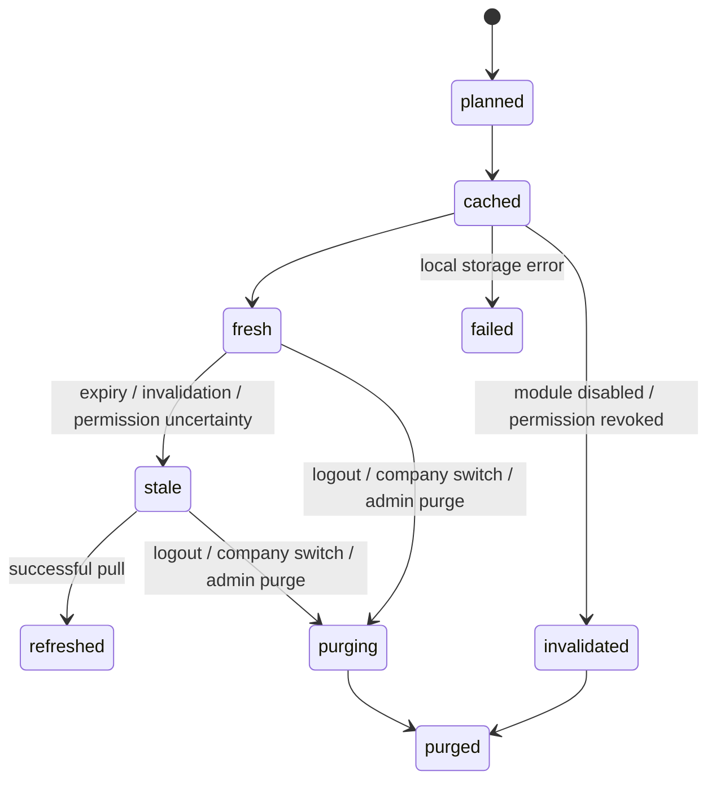
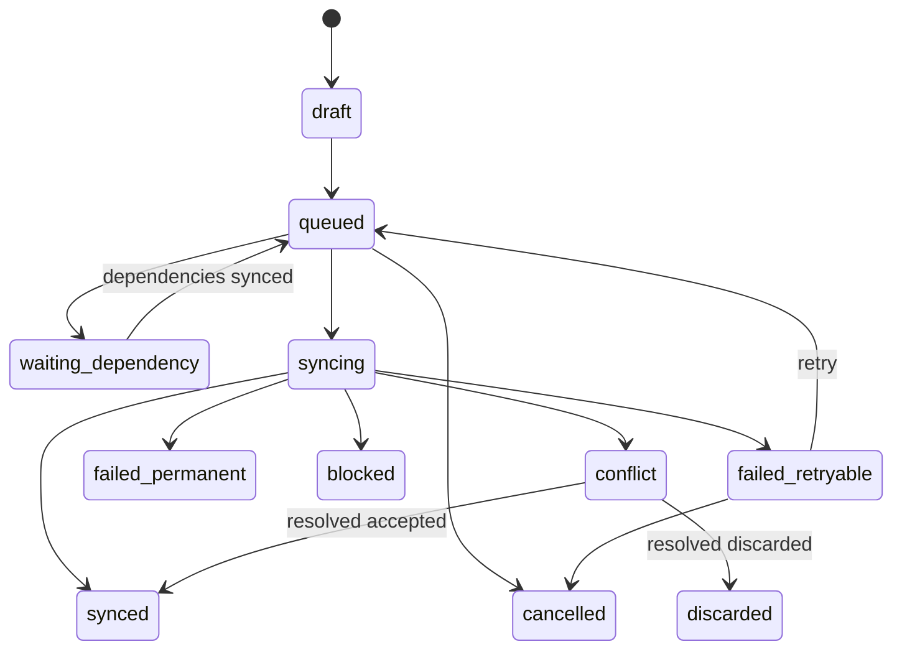
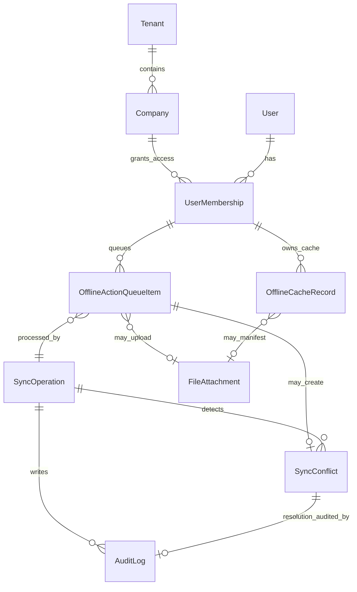
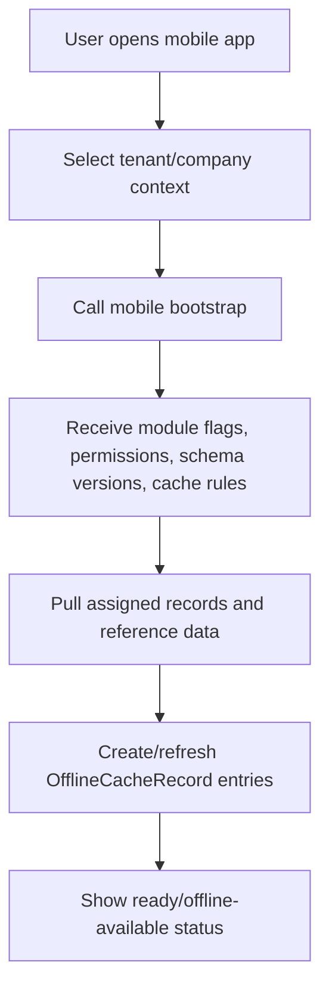
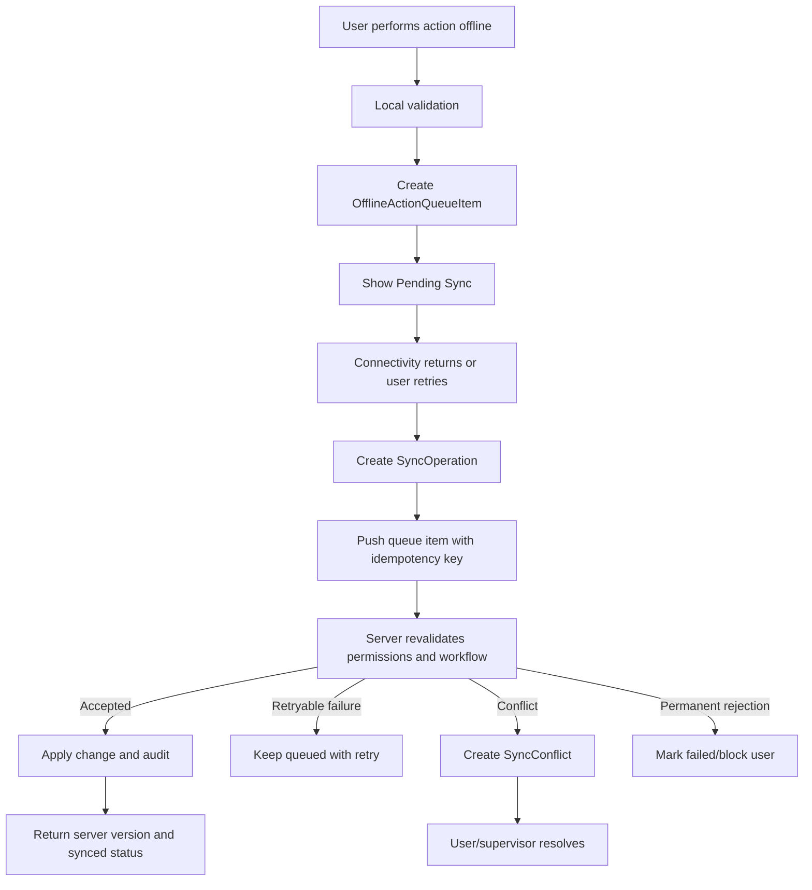

# 14_Offline_Mobile_Sync.md

## 1. Document Metadata

| Field | Value |
| --- | --- |
| Document name | `14_Offline_Mobile_Sync.md` |
| Phase | Phase 14 |
| Phase name | Offline Mobile and Sync |
| Document type | Phase-level product, domain, UX, API, permission, reporting, and implementation specification |
| Status | Draft for implementation planning |
| Prepared for | Product, engineering, design, QA, implementation, operations, support, security, and future phase writers |
| Source of truth | Master Platform Documentation; Global Documentation Rules; Global Domain Model; Global Decisions Register; prior phase summaries 01 through 13 |
| Output companion | `14_Offline_Mobile_Sync__Summary_For_Future_Phases.md` |
| Last updated | 2026-05-09 |

## 2. Phase Purpose

Phase 14 defines the official offline mobile and sync foundation for the platform. It establishes how mobile users safely continue critical work when network connectivity is weak, intermittent, or unavailable, and how the platform later reconciles local work with server-side permissions, workflow rules, audit history, reporting, attachments, and integration readiness.

This phase is a shared platform phase. It does not replace field, dispatch, inventory, fleet, service, reporting, or integration modules. Instead, it defines the reusable offline cache, offline action queue, sync operation, conflict, status, permissions, UX, API, audit, and reporting patterns that those modules must use.

## 3. Phase Goals

1. Define the canonical offline/sync entities: `OfflineCacheRecord`, `OfflineActionQueueItem`, `SyncOperation`, `SyncConflict`, and `SyncStatus`.
2. Standardize local cache behavior, cache isolation, cache stale rules, and purge behavior.
3. Standardize offline action queue behavior, idempotency, dependency ordering, retry behavior, and failed sync visibility.
4. Define server-side sync operations for push, pull, attachment upload, conflict handling, and admin diagnostics.
5. Define conflict handling for append-only event records and mutable record updates.
6. Ensure server-side permissions, module enablement, company access, workflow state, and record access are revalidated when queued actions sync.
7. Define offline attachment/photo capture and upload behavior using canonical `FileAttachment` and approved wrapper entities.
8. Provide consistent mobile UX for offline status, sync center, conflict resolution, stale data, and errors.
9. Provide reporting, notification, audit, security, and integration impacts for later phases.
10. Make offline rules reusable by Admin/Security, Notifications/Automation, Public API/Webhooks, Rollout, and Final Blueprint phases.

## 4. Scope

### In Scope

- Mobile offline behavior for selected critical workflows.
- Local cache manifests and cache state rules.
- Offline action queue model and state transitions.
- Mobile sync push/pull operations.
- Conflict detection and resolution patterns.
- Retry behavior and dependency handling.
- Permissions revalidation during sync.
- Attachment/photo offline capture and upload.
- Company cache isolation and purge rules.
- Sync status UX patterns and admin monitoring.
- Audit, notification, reporting, and integration impacts.
- Conceptual API requirements for mobile sync.

### Primary Offline-Capable Workflow Families

- Assigned tasks and appointments.
- Site visits, check-ins, check-outs, field notes, and field photos.
- Job progress events and completion/proof capture.
- Dispatch route/stop execution, delivery/pickup attempts, exceptions, and proof.
- Service work order task execution, notes, photos, labor drafts, and completion drafts.
- Selected fleet/location events such as `LocationPing` where tracking is enabled.
- Selected inventory/depot workflows, preferably draft-first or tightly validated for MVP.

## 5. Non-Goals

- Full offline app parity with desktop functionality.
- Offline admin configuration, role management, module setup, integration setup, report builder, or dashboard authoring.
- Direct offline QuickBooks/provider sync.
- Replacement of `SyncJob`, `SyncLog`, or `ExternalReference` from Phase 13.
- Replacement of `FileAttachment` with module-specific binary storage.
- Building a complete mobile device management platform.
- Advanced route optimization or AI dispatch planning.
- Complex offline collaborative editing for rich documents.
- Guaranteed indefinite offline operation without periodic revalidation.

## 6. Source-of-Truth Definitions

- Tenant remains the top-level SaaS isolation boundary.
- Company remains the operating organization inside a tenant and the primary permission/cache boundary.
- Company is not CRM `Account`.
- All business records must use stable application IDs; MongoDB `_id` must not be exposed as public API ID.
- Offline-created records must preserve tenant/company scope, actor, client occurrence timestamp, server sync timestamp, and sync metadata.
- Core Platform owns `AuditLog`, `Notification`, `FileAttachment`, `SavedView`, `SearchIndexRecord`, `SettingsDocument`, `BackgroundJob`, `ImportJob`, `ExportJob`, `ApiKey`, `WebhookEndpoint`, and `WebhookDelivery`.
- QuickBooks and provider integration sync remains under Phase 13 integration entities.
- Offline action finality occurs only after server acceptance.
- Server validation and authorization remain authoritative.

## 7. Canonical Entity Definitions

### 7.1 `OfflineCacheRecord`

| Attribute | Definition |
| --- | --- |
| Purpose | Track local availability, freshness, ownership, permission snapshot, attachment manifest, and purge state for offline-capable records and bundles. |
| Owner module | Offline Mobile and Sync. |
| Scope | Client-local first; optional server manifest summary for admin diagnostics. Scoped by tenant, company, user, membership, device, and session. |
| Tenant/company scoping | Must include `tenant_id` and `company_id`; never allow cross-company cache reads. |
| Key fields | `id`, `tenant_id`, `company_id`, `user_id`, `membership_id`, `device_id`, `session_id`, `record_type`, `record_id`, `cache_key`, `cache_version`, `record_version`, `payload_hash`, `cached_at`, `expires_at`, `stale_at`, `cache_status`, `offline_available`, `permission_snapshot`, `module_snapshot`, `attachment_manifest`, `size_bytes`, `encryption_state`, `purge_reason`, `sync_metadata`. |
| Relationships | References any offline-capable source record by `record_type` + `record_id`; may reference `FileAttachment` manifests; may be summarized by `SyncOperation`. |
| Lifecycle | `planned` → `cached` → `fresh`/`stale` → `refreshed` or `purged`; may become `invalidated` after permission/module change. |
| Statuses | `planned`, `cached`, `fresh`, `stale`, `invalidated`, `purging`, `purged`, `failed`. |
| Index considerations | Local indexes by company, user, record type, record id, cache status, expiry, last accessed, and pinned state. Server summaries index by tenant/company/user/device/status. |
| Permissions impact | Cache creation requires current read access; cache use must be blocked after known revocation and revalidated on sync. |
| Audit requirements | Audit server-side manifest creation/refresh/purge where tracked; always audit admin-triggered purge and revocation. |
| Reporting impact | Feeds stale cache, cache size, last sync, and offline adoption reporting. |
| Future-phase impact | Admin/security must manage purge; rollout must test cache migration; reporting must expose stale-cache metrics. |

### 7.2 `OfflineActionQueueItem`

| Attribute | Definition |
| --- | --- |
| Purpose | Persist offline/deferred user actions until they can be pushed, validated, accepted, rejected, or resolved. |
| Owner module | Offline Mobile and Sync. |
| Scope | Client-local source of truth until sync; server may store received queue metadata in `SyncOperation` and audit logs. |
| Tenant/company scoping | Must include tenant/company context before local persistence. Queue items from one company must never execute against another company. |
| Key fields | `id`, `tenant_id`, `company_id`, `user_id`, `membership_id`, `device_id`, `session_id`, `target_entity_type`, `target_entity_id`, `local_target_id`, `action_type`, `operation_type`, `payload`, `payload_hash`, `payload_schema_version`, `depends_on_queue_item_ids`, `idempotency_key`, `base_version`, `client_version`, `created_offline_at`, `queued_at`, `first_attempted_at`, `last_attempted_at`, `attempt_count`, `next_retry_at`, `queue_status`, `priority`, `validation_status`, `server_response_ref`, `conflict_id`, `error_code`, `error_message`, `sync_operation_id`. |
| Relationships | May depend on other queue items; targets canonical records; may create `SyncConflict`; may bind uploaded `FileAttachment` after success. |
| Lifecycle | `draft` → `queued` → `syncing` → `synced`, `failed`, `blocked`, `conflict`, `cancelled`, or `discarded`. |
| Statuses | `draft`, `queued`, `waiting_dependency`, `syncing`, `synced`, `failed_retryable`, `failed_permanent`, `blocked`, `conflict`, `cancelled`, `discarded`. |
| Index considerations | Local indexes by queue status, priority, dependency, target entity, created time, next retry, and company. |
| Permissions impact | Client may queue only actions allowed by local permission snapshot; server must revalidate final permissions. |
| Audit requirements | Audit server receipt, acceptance, rejection, retry, failure, conflict, and permanent discard outcomes. |
| Reporting impact | Feeds pending work, failed sync, average delay, and workflow reliability reports. |
| Future-phase impact | Automation must treat queued local actions as not final; public API must preserve idempotency semantics. |

### 7.3 `SyncOperation`

| Attribute | Definition |
| --- | --- |
| Purpose | Represent a mobile sync transaction or batch for observability, API responses, admin monitoring, retry correlation, and audit. |
| Owner module | Offline Mobile and Sync. |
| Scope | Server-visible, tenant/company/user/device/session scoped. |
| Tenant/company scoping | Must include `tenant_id` and `company_id`; user/device/session identify origin. |
| Key fields | `id`, `tenant_id`, `company_id`, `user_id`, `membership_id`, `device_id`, `session_id`, `operation_type`, `trigger`, `direction`, `status`, `started_at`, `completed_at`, `items_total`, `items_succeeded`, `items_failed`, `items_conflicted`, `bytes_uploaded`, `bytes_downloaded`, `network_type`, `app_version`, `schema_version`, `retry_of_operation_id`, `correlation_id`, `error_code`, `error_message`, `summary`, `sync_metadata`. |
| Relationships | Contains or references queue item results, conflicts, attachment upload sessions, audit logs, and report rollups. |
| Lifecycle | `created` → `running` → `succeeded`, `partial_success`, `failed`, `cancelled`, or `expired`. |
| Statuses | `created`, `running`, `succeeded`, `partial_success`, `failed_retryable`, `failed_permanent`, `cancelled`, `expired`. |
| Index considerations | Index tenant/company/user/device/status/started_at/correlation_id for admin diagnostics. |
| Permissions impact | User can view own sync operation summaries; admins need `offline.sync.monitor` for company-wide monitoring. |
| Audit requirements | Audit start, complete, partial success, failure, and retry outcomes. |
| Reporting impact | Primary source for sync health dashboards and operational reliability metrics. |
| Future-phase impact | Rollout and operations phases must use `SyncOperation` to verify mobile readiness and support incidents. |

### 7.4 `SyncConflict`

| Attribute | Definition |
| --- | --- |
| Purpose | Capture conflicts caused by stale data, concurrent changes, permission changes, workflow invalidation, duplicate operations, deleted records, or dependency failures. |
| Owner module | Offline Mobile and Sync. |
| Scope | Tenant/company/record/user scoped; server-visible. |
| Tenant/company scoping | Must include `tenant_id`, `company_id`, actor, target, and related sync operation. |
| Key fields | `id`, `tenant_id`, `company_id`, `user_id`, `membership_id`, `device_id`, `target_entity_type`, `target_entity_id`, `local_target_id`, `queue_item_id`, `sync_operation_id`, `conflict_type`, `conflict_status`, `resolution_strategy`, `server_snapshot_ref`, `client_snapshot_ref`, `field_diffs`, `detected_at`, `resolved_at`, `resolved_by_user_id`, `resolution_notes`, `audit_log_id`, `requires_supervisor`, `blocking_reason`. |
| Relationships | References target record, queue item, sync operation, resolver user, audit log, and optional replacement/correction records. |
| Lifecycle | `detected` → `awaiting_user`, `awaiting_supervisor`, `system_resolving` → `resolved`, `rejected`, `discarded`, or `escalated`. |
| Statuses | `detected`, `awaiting_user`, `awaiting_supervisor`, `system_resolving`, `resolved`, `rejected`, `discarded`, `escalated`, `expired`. |
| Index considerations | Index by company, target entity, conflict status, conflict type, detected age, user, and resolver. |
| Permissions impact | Viewing/resolving requires conflict permissions and access to target records. Some conflicts require supervisor/admin resolution. |
| Audit requirements | Audit detection, escalation, selected resolution strategy, resolver, and final outcome. |
| Reporting impact | Feeds conflict trend, resolution SLA, module reliability, and training reports. |
| Future-phase impact | Notifications/automation must not act on conflicted actions as final. Admin/security must expose unresolved conflicts. |

### 7.5 `SyncStatus`

| Attribute | Definition |
| --- | --- |
| Purpose | Standard reusable sync-state object for records, queue items, detail headers, lists, admin views, reports, and APIs. |
| Owner module | Offline Mobile and Sync. |
| Scope | Embedded or derived summary; not always a standalone collection. |
| Tenant/company scoping | Inherits scope from parent record or operation. |
| Key fields | `state`, `detail`, `last_synced_at`, `last_attempted_at`, `pending_count`, `failed_count`, `conflict_count`, `blocked_count`, `stale`, `stale_reason`, `retry_available`, `manual_resolution_required`, `last_error_code`, `last_error_message`, `sync_operation_id`. |
| Relationships | Appears on offline-capable records, queue summaries, sync center rows, operation details, and report rollups. |
| Lifecycle | Recomputed as queue/cache/operation state changes. |
| Statuses | `not_cached`, `cached`, `pending`, `syncing`, `synced`, `failed`, `conflict`, `blocked`, `stale`, `uploading`, `partially_synced`. |
| Index considerations | Parent records may index `sync_status.state` where operational views need filtering. |
| Permissions impact | Summary can be shown only for records/actions the user may view. Admin aggregate status may hide record detail. |
| Audit requirements | Major state transitions audited through queue, operation, conflict, cache, and attachment events. |
| Reporting impact | Standard vocabulary for sync reports and dashboard filters. |
| Future-phase impact | Future UX must reuse labels and status semantics instead of inventing module-specific sync badges. |

## 8. Entity Lifecycle and Status Rules

### 8.1 Offline Cache Lifecycle

Rules:

- Cache records must be company-partitioned.
- Cache records must expire or become stale according to company/workflow rules.
- Permission snapshots are advisory; server revalidation is required.
- Sensitive cached data must be minimized and protected.
- Cache purge must not silently discard unsynced user work without UX warning unless security policy requires immediate purge.

### 8.2 Offline Queue Lifecycle

Rules:

- Queue items must be idempotent.
- Queue items must preserve original client occurrence time.
- Queue items must not be marked synced until durable server acceptance.
- Queue items may depend on parent creation or attachment upload items.
- Queue cancellation is allowed only before server acceptance and only where workflow rules permit.

### 8.3 Sync Operation Lifecycle

- `created`: operation requested or initialized.
- `running`: server is processing pull, push, upload, retry, or conflict resolution.
- `succeeded`: all items accepted and no unresolved conflicts.
- `partial_success`: some items succeeded while others failed, blocked, or conflicted.
- `failed_retryable`: operation failed due to temporary network/server/rate limit issue.
- `failed_permanent`: operation cannot continue without app update, schema migration, permission fix, or user/admin action.
- `cancelled`: operation intentionally cancelled.
- `expired`: operation is too old to resume.

### 8.4 Conflict Lifecycle

- `detected`: server or sync engine detected conflict.
- `awaiting_user`: acting user can resolve.
- `awaiting_supervisor`: supervisor/admin must resolve.
- `system_resolving`: system can safely resolve using deterministic strategy.
- `resolved`: final accepted resolution applied.
- `rejected`: local change rejected and not applied.
- `discarded`: local duplicate or invalid change discarded.
- `escalated`: requires support/admin review.
- `expired`: conflict aged out under defined retention rules and requires manual support review.

## 9. Entity Relationship Rules

Relationship rules:

- `OfflineActionQueueItem` targets canonical records by `target_entity_type` and `target_entity_id` or `local_target_id` before server creation.
- `SyncConflict` must reference the queue item and target record whenever possible.
- `SyncOperation` is the correlation root for one push, pull, upload, retry, or conflict-resolution run.
- `SyncStatus` is embedded or derived; it does not need to become a standalone collection unless implementation requires materialization.
- Attachment wrappers such as `FieldPhoto` and `ProofOfDelivery` reference `FileAttachment`; offline sync must not store file binary content in wrapper records.

## 10. Workflow Requirements

### 10.1 Mobile Bootstrap Workflow

### 10.2 Offline Action Sync Workflow

### 10.3 Attachment Sync Workflow

1. User captures photo/file/signature offline.
2. App creates local attachment placeholder and queue item.
3. App compresses or prepares file according to policy.
4. On reconnect, app initiates upload session.
5. Server validates file permission, target record access, file type, size, and module rules.
6. App uploads file, preferably resumable for large files.
7. Server creates/updates `FileAttachment` and binds wrapper record.
8. Queue item is marked synced only after metadata and binary are accepted.
9. Failed uploads remain visible and retryable where safe.

## 11. Data Model Requirements

| Area | Requirement |
| --- | --- |
| IDs | Offline-created records and queue items must use stable client-generated IDs or local IDs mapped to server IDs. |
| Scope | Every offline record and queue item must include `tenant_id`, `company_id`, user/membership context, and device/session context. |
| Versions | Mutable updates must include base/server version for optimistic concurrency. |
| Idempotency | Every pushed action must include an `idempotency_key`. |
| Timestamps | Preserve `client_occurred_at`, `queued_at`, `synced_at`, and server accepted timestamps. |
| Payloads | Queue payloads must include schema version and payload hash. |
| Dependencies | Queue items must reference dependencies such as parent record creation or attachment upload. |
| Tombstones | Pull sync must support deleted/archived/inaccessible record tombstones. |
| Retention | Queue history, conflict snapshots, and local cache must have defined retention/purge policies. |
| Sensitive data | Queue payloads and cache snapshots must avoid secrets and minimize sensitive fields. |

## 12. API Requirements

| ID | Requirement |
| --- | --- |
| API-14-001 | Expose mobile bootstrap endpoint for company/module configuration, permission summary, cache rules, app schema version, feature flags, and assigned work cursors. |
| API-14-002 | Expose incremental pull endpoint with cursor, entity filters, deleted/tombstone records, server versions, and cache invalidation hints. |
| API-14-003 | Expose push endpoint accepting ordered queue items, idempotency keys, dependencies, client timestamps, base versions, device metadata, and payload schema version. |
| API-14-004 | Expose sync operation create/status endpoints for observability, progress, errors, and retry guidance. |
| API-14-005 | Expose sync status endpoint summarizing pending, failed, conflicted, blocked, stale, and uploading items for the current user/company/device. |
| API-14-006 | Expose conflict list/detail/resolve endpoints with strategy validation and permission checks. |
| API-14-007 | Expose queue retry endpoint for safe failed actions and reject retry when retry could duplicate non-idempotent business effects. |
| API-14-008 | Expose attachment initiate/complete endpoints using `FileAttachment` and resumable upload metadata where supported. |
| API-14-009 | Expose cache purge endpoint for user logout, company switch, admin revocation, security events, and app reset. |
| API-14-010 | Expose sync cursor endpoint for current entity/workflow cursors and cursor reset guidance. |
| API-14-011 | All sync APIs must include tenant/company context and must reject cross-company requests even when IDs are guessed. |
| API-14-012 | All sync APIs must return structured error codes such as `permission_revoked`, `record_deleted`, `version_conflict`, `module_disabled`, `dependency_failed`, `attachment_failed`, and `retry_later`. |
| API-14-013 | Push responses must return accepted item IDs, rejected item IDs, conflicts, server versions, new server IDs for client-created records, and next retry guidance. |
| API-14-014 | Pull responses must support payload pagination or chunking to avoid large mobile downloads. |
| API-14-015 | APIs must support client app version and schema version negotiation to block unsafe old clients. |
| API-14-016 | APIs must record `SyncOperation` and audit events for accepted, failed, partial, and conflicted sync outcomes. |

## 13. UI / UX Requirements

| ID | Requirement |
| --- | --- |
| UX-14-001 | Show a persistent mobile connectivity/sync banner with online, weak connection, offline, syncing, failed, and conflict states. |
| UX-14-002 | Show per-record sync badges in mobile list rows and detail headers. |
| UX-14-003 | Provide a Sync Center screen with pending actions, failed actions, conflicts, attachment uploads, stale cache warnings, last successful sync, and retry controls. |
| UX-14-004 | Provide a conflict resolution screen comparing local user changes against server state with clear resolution choices. |
| UX-14-005 | Show offline-safe form warnings when data is cached, validation is local-only, or final server validation is pending. |
| UX-14-006 | Show photo/file upload progress and allow safe retry without forcing the user to remain on the capture screen. |
| UX-14-007 | Show empty states for no cached records, no pending actions, no conflicts, no failed uploads, and no offline access. |
| UX-14-008 | Show permission-specific error states when offline work cannot sync because access changed. |
| UX-14-009 | Show company switch warnings when pending local work or cached data exists. |
| UX-14-010 | Allow users to manually refresh cached assigned work before leaving connectivity. |
| UX-14-011 | Allow users to retry failed queue items where safe and explain when admin/supervisor action is required. |
| UX-14-012 | Show attachment placeholders when metadata exists but binary upload/download is pending. |
| UX-14-013 | Do not hide pending offline work after logout or app reset without a destructive-action warning. |
| UX-14-014 | Show stale-data age on high-risk workflows such as dispatch routes, service work orders, and inventory actions. |
| UX-14-015 | Use consistent labels: Pending Sync, Syncing, Synced, Failed, Conflict, Blocked, Stale, Uploading. |
| UX-14-016 | Provide admin sync monitoring views on desktop with filters by user, device, company, workflow, status, and age. |

### Required Mobile Screens and Components

| Screen / Component | Required Behavior |
| --- | --- |
| Offline banner | Shows current connectivity and sync state without blocking core capture workflows. |
| Sync Center | Lists pending, failed, conflicted, blocked, stale, and uploading items with filters and retry actions. |
| Record detail header | Shows sync badge, cache age, stale warning, and last synced time. |
| Offline-capable form | Indicates local validation, pending server validation, and required online-only fields/actions. |
| Conflict resolution | Shows local vs server values, reason, allowed resolution strategies, and escalation route. |
| Attachment uploader | Shows local capture, compression/preparation, upload progress, retry, and final binding status. |
| Company switch guard | Warns about pending work and ensures cache partitioning/purge before switching. |
| Admin sync monitor | Desktop screen for support/admin users to inspect sync operations, failures, devices, and conflict backlog. |

## 14. Search, Filters, and Saved Views

- Sync Center must support filters by status, workflow, target entity, age, priority, attachment state, error code, and conflict type.
- Admin sync monitoring must support saved views using canonical `SavedView` where applicable.
- Search must not expose cached or queued record details to unauthorized users.
- Reports and admin views should allow filtering by app version, device, user, company, module, status, conflict type, and retry age.
- `SearchIndexRecord` should index server-side sync operations and conflicts where admin/support search is needed; local-only queue items are not globally searchable until synced or mirrored for diagnostics.

## 15. Permissions and Access Control

| ID | Requirement |
| --- | --- |
| PERM-14-001 | Offline use requires both company module enablement and `offline.sync.use`. |
| PERM-14-002 | Cached records may include only records the user could access at the time of cache creation. |
| PERM-14-003 | Queued actions must revalidate the user’s current membership, role, module access, and record permissions on sync. |
| PERM-14-004 | Users may retry their own failed queue items only with `offline.queue.retry` and only where retry is safe. |
| PERM-14-005 | Admins/supervisors need `offline.queue.admin_review` to inspect queue failures for users within their company scope. |
| PERM-14-006 | Conflict viewing requires `offline.conflict.view` and access to the underlying target record. |
| PERM-14-007 | Own conflict resolution requires `offline.conflict.resolve_own` plus the target record action permission. |
| PERM-14-008 | Team/company conflict resolution requires `offline.conflict.resolve_team` plus supervisor/admin scope. |
| PERM-14-009 | Remote cache purge requires `offline.cache.purge` and must be audited. |
| PERM-14-010 | Sync health monitoring requires `offline.sync.monitor` and must not expose record details beyond the viewer’s permissions. |
| PERM-14-011 | Attachment sync requires normal file create/view permissions and target record access. |
| PERM-14-012 | Inventory, proof, service completion, and dispatch completion offline actions must also require their module-specific completion/update permissions. |
| PERM-14-013 | Permissions removed while offline must block queued actions at sync unless a documented grace rule is approved. |
| PERM-14-014 | Read-only users must not create queued offline mutations even if cached data is visible. |
| PERM-14-015 | Cross-company cached data access is forbidden even for users with access to multiple companies unless they explicitly switch company context. |

## 16. Notifications

| ID | Requirement |
| --- | --- |
| NOTIF-14-001 | Notify the acting user when a queued action permanently fails. |
| NOTIF-14-002 | Notify the acting user when a conflict requires resolution. |
| NOTIF-14-003 | Notify the acting user when attachment uploads fail after retries. |
| NOTIF-14-004 | Notify supervisor/admin when high-priority operational queue items remain blocked beyond configured thresholds. |
| NOTIF-14-005 | Notify admin/security on device revocation, remote purge failure, or suspicious repeated sync errors. |
| NOTIF-14-006 | Notify record owners when server-accepted offline completion/proof/exception events affect their workflow and the module already supports such notifications. |
| NOTIF-14-007 | Do not notify external customers from local-only offline actions before server acceptance. |
| NOTIF-14-008 | Notifications must respect preferences unless security-critical or compliance-critical. |
| NOTIF-14-009 | Notifications must not reveal record data to users who lost access before notification delivery. |
| NOTIF-14-010 | Notification automation in later phases must treat unsynced local actions as pending, not final. |

## 17. Audit Logging

| ID | Requirement |
| --- | --- |
| AUDIT-14-001 | Record creation of offline cache manifests when server-side manifest tracking is enabled. |
| AUDIT-14-002 | Record cache refresh, stale, invalidation, and purge events. |
| AUDIT-14-003 | Record queue item creation, sync success, retry, failure, blockage, and deletion/cancellation. |
| AUDIT-14-004 | Record sync operation start, completion, partial success, failure, and retry. |
| AUDIT-14-005 | Record conflict detection, escalation, resolution, rejection, and resolver identity. |
| AUDIT-14-006 | Record permission revalidation success/failure for queued actions. |
| AUDIT-14-007 | Record attachment upload start, completion, failure, retry, and binding to target record. |
| AUDIT-14-008 | Record device revocation and remote cache purge requests/results. |
| AUDIT-14-009 | Audit logs must preserve client occurrence timestamp and server accepted timestamp. |
| AUDIT-14-010 | Audit logs must include actor, company, device/session, target record, queue item, sync operation, and correlation ID where available. |
| AUDIT-14-011 | Audit messages must not include raw sensitive payload values, secrets, or full attachment content. |
| AUDIT-14-012 | Audit logs must distinguish local draft cancellation from server-accepted action deletion/correction. |

## 18. Reporting and Analytics Impact

| ID | Requirement |
| --- | --- |
| REPORT-14-001 | Provide sync success rate by company, module, workflow, user, device, and app version. |
| REPORT-14-002 | Provide pending queue count and age distribution. |
| REPORT-14-003 | Provide failed queue count by error code and workflow. |
| REPORT-14-004 | Provide conflict count, resolution time, resolver, and outcome. |
| REPORT-14-005 | Provide average offline-to-sync delay by workflow. |
| REPORT-14-006 | Provide stale cache counts by user/device/company. |
| REPORT-14-007 | Provide attachment upload failure and retry metrics. |
| REPORT-14-008 | Provide permission revalidation failure metrics. |
| REPORT-14-009 | Provide mobile app version sync compatibility metrics. |
| REPORT-14-010 | Reports must distinguish client occurrence time, queued time, sync accepted time, and conflict resolved time. |
| REPORT-14-011 | Reports must respect the same tenant/company/module/record permissions as operational data. |
| REPORT-14-012 | High-volume telemetry such as LocationPing must use aggregate metrics rather than unbounded raw reporting by default. |

## 19. Mobile and Offline Impact

| ID | Workflow | Offline-Capable? | Cached Data | Queued Actions | Sync Trigger | Conflict Handling | Priority |
| --- | --- | --- | --- | --- | --- | --- | --- |
| OFFLINE-14-001 | Assigned task/work queue | Yes | Assigned tasks, related records, due dates, basic references | Status updates, comments, completion notes | Reconnect, manual refresh, app open | Server revalidates assignment, status, and permissions | MVP |
| OFFLINE-14-002 | Site visit and check-in/out | Yes | Assigned visits, site details, contact/site location | CheckInEvent, CheckOutEvent, notes, photos | Reconnect or manual retry | Append-only idempotent event; reject if impossible workflow state | MVP |
| OFFLINE-14-003 | Field notes/photos | Yes | Target record summary and attachment manifest | FieldNote, FieldPhoto metadata, FileAttachment upload | Reconnect/background upload | Accept append-only note; photo binding waits for upload | MVP |
| OFFLINE-14-004 | Dispatch route/stop execution | Partial | Assigned route, stops, proof requirements, contact info | Arrival, departure, delivery attempt, exception, proof metadata | Reconnect/manual retry | Server validates stop status, assignment, and duplicate proof | MVP where dispatch module enabled |
| OFFLINE-14-005 | Service work order execution | Partial | Assigned work order, tasks, parts list, service history summary | Task status, labor draft, notes, photos, completion draft | Reconnect/manual retry | Mutable completion conflicts require review if server state changed | MVP where service enabled |
| OFFLINE-14-006 | Inventory picking/transfer/adjustment | Limited/Draft-first | Assigned pick/transfer and product reference data | Draft scan/pick/adjustment actions | Reconnect/manual submit | Stock-changing actions require strict server validation; conflicts likely | Recommended staged rollout |
| OFFLINE-14-007 | Location ping capture | Yes where tracking enabled | Device/session/geofence config | LocationPing events | Background/reconnect | Append-only; discard duplicate by idempotency/time/device | MVP for tracking workflows |
| OFFLINE-14-008 | Proof of delivery/service proof | Yes | Stop/work order proof requirements | Signature/photo/proof metadata and files | Reconnect/background upload | Completion remains pending until proof accepted if required | MVP |
| OFFLINE-14-009 | QuickBooks sync-triggering work | No direct provider sync offline | Operational record only | Operational queue item only | After server acceptance | Provider sync runs later through Phase 13 SyncJob | Deferred direct sync |
| OFFLINE-14-010 | Admin configuration | No | None except read-only bootstrap settings | None | Online only | Not offline-capable | Non-goal |

## 20. Integration Impact

| ID | Requirement |
| --- | --- |
| INT-14-001 | Mobile sync must not replace Phase 13 provider integration sync entities. |
| INT-14-002 | Offline-created records that later qualify for QuickBooks sync must first be server-accepted and operationally valid. |
| INT-14-003 | ExternalReference creation must occur only after the platform record exists server-side. |
| INT-14-004 | Provider sync jobs must use server record timestamps and status while preserving original offline occurrence metadata for audit/reporting. |
| INT-14-005 | Webhook/API future phases must treat offline-originated server-accepted changes the same as online-originated changes, with origin metadata available. |
| INT-14-006 | File/attachment integrations must use `FileAttachment` metadata and permissions. |
| INT-14-007 | Import/export jobs must not import directly into local offline queues. |
| INT-14-008 | Integration monitoring dashboards may correlate mobile `SyncOperation` failures with provider `SyncJob` delays when offline-originated records feed integrations. |

## 21. Security Considerations

- Local caches must be company-partitioned and protected against cross-company leakage.
- Lost/stolen device handling must support revocation and remote purge when the device reconnects.
- Offline data retention must be configurable by risk level and company policy.
- Sync APIs must reject old app/schema versions that cannot safely enforce current sync rules.
- Queue payloads must not include provider credentials, API keys, secrets, raw tokens, or unnecessary sensitive fields.
- Attachment uploads must validate file type, size, malware scanning policy where available, target record access, and module permission.
- Admin monitoring must expose enough diagnostics for support without revealing sensitive payloads beyond permission scope.
- Company switch, logout, and membership revocation must handle pending local work explicitly.
- Audit logs must preserve forensic usefulness without storing raw sensitive payload snapshots unnecessarily.

## 22. Edge Cases

1. User completes a work order offline, but the work order is cancelled online before sync.
2. User captures delivery proof offline, but the shipment stop is resequenced or reassigned before sync.
3. User records inventory movement offline, but available stock changed before sync.
4. User creates a check-in offline with GPS unavailable or denied.
5. User logs out with pending queue items.
6. User switches company while one company has pending offline work.
7. User loses membership or role permission before queued actions sync.
8. Company disables a module while users have cached module records.
9. Device storage quota is reached while capturing photos.
10. Attachment metadata syncs but binary upload repeatedly fails.
11. Duplicate queue push occurs after timeout and retry.
12. App upgrades while local queue schema is old.
13. Server cursor expires after device is offline too long.
14. Record is soft-deleted or archived after it was cached.
15. Two users edit the same mutable field offline.
16. Two users add append-only notes/events offline to the same record.
17. Network flaps during a multi-item batch.
18. Parent record creation fails but dependent photo/note actions are queued.
19. High-volume location pings backlog for hours.
20. Remote cache purge is requested while device is offline.
21. User changes device time causing incorrect client timestamps.
22. User submits outdated custom field values after configuration changed.
23. Field user tries to resolve a conflict requiring supervisor permission.
24. QuickBooks sync is triggered by a record that originated offline but was later rejected.
25. User reinstalls the app while unsynced local data exists.
26. Cached data contains a contact phone number later hidden by permission change.
27. Offline proof is required to complete a stop, but the proof upload is pending.
28. Sync succeeds for some queue items but fails for dependent later items.

## 23. Business Requirements

| ID | Requirement |
| --- | --- |
| BR-14-001 | The platform must allow field, dispatch, service, warehouse, driver, and manager users to continue critical work when connectivity is unavailable or unreliable. |
| BR-14-002 | The platform must protect customer trust by ensuring offline-captured check-ins, notes, photos, proof, labor, parts, and completion events are not lost. |
| BR-14-003 | The platform must keep offline scope focused on high-value mobile workflows rather than full desktop parity. |
| BR-14-004 | The platform must provide management visibility into pending, failed, stale, and conflicted offline work. |
| BR-14-005 | The platform must preserve tenant and company isolation for every locally cached record and queued action. |
| BR-14-006 | The platform must support operational accountability by auditing offline creation time, server sync time, actor, device, and resolution outcomes. |
| BR-14-007 | The platform must make sync failures visible and recoverable instead of silent. |
| BR-14-008 | The platform must support user confidence through clear mobile sync status UX. |
| BR-14-009 | The platform must prevent offline actions from bypassing permissions, module enablement, workflow status, inventory controls, dispatch rules, service rules, or integration constraints. |
| BR-14-010 | The platform must support attachment/photo capture and later upload for field proof, service documentation, delivery proof, inventory evidence, and site context. |
| BR-14-011 | The platform must support incremental sync to reduce mobile data usage and improve performance for field users. |
| BR-14-012 | The platform must provide admin and support teams with diagnostics for mobile sync problems. |
| BR-14-013 | The platform must support future automation, reporting, API, webhook, rollout, and final blueprint phases with consistent sync semantics. |
| BR-14-014 | The platform must handle device loss, logout, company switching, user termination, and permission revocation without exposing cached data incorrectly. |
| BR-14-015 | The platform must allow businesses to configure which workflows are offline-capable based on risk, module enablement, and operational maturity. |
| BR-14-016 | The platform must support gradual rollout of offline workflows by company, module, role, and app version. |

## 24. Functional Requirements

| ID | Requirement |
| --- | --- |
| FR-14-001 | Create the canonical `OfflineCacheRecord` model for tracking cached records, payload bundles, attachment manifests, cache age, cache ownership, and purge state. |
| FR-14-002 | Create the canonical `OfflineActionQueueItem` model for local offline or deferred mobile actions. |
| FR-14-003 | Create the canonical `SyncOperation` model for server-visible mobile sync runs, batches, retries, pulls, pushes, uploads, and downloads. |
| FR-14-004 | Create the canonical `SyncConflict` model for conflicts requiring user, supervisor, admin, or system resolution. |
| FR-14-005 | Create the reusable `SyncStatus` object for record-level, queue-level, and operation-level sync visibility. |
| FR-14-006 | Support mobile bootstrap that downloads authorized configuration, permissions summary, enabled modules, cache rules, schema versions, and assigned work. |
| FR-14-007 | Support incremental pull sync using cursors, server versions, tombstones, cache invalidation hints, and module-specific payload limits. |
| FR-14-008 | Support push sync for queued actions with idempotency keys, dependency ordering, client timestamps, payload schema version, and base record version. |
| FR-14-009 | Revalidate tenant, company, module, role, record, workflow, and field-level permissions on every pushed action. |
| FR-14-010 | Reject or conflict queued actions when the target record is deleted, archived, completed, locked, transferred, or no longer accessible. |
| FR-14-011 | Treat append-only event actions as duplicate-safe when idempotency keys and event identity match. |
| FR-14-012 | Use optimistic concurrency for mutable record updates through `base_version`, `client_version`, and `server_version` or equivalent ETag semantics. |
| FR-14-013 | Support queue dependencies so child actions such as photo upload or note creation wait for parent record creation to sync successfully. |
| FR-14-014 | Support safe retry with attempt counts, retry delays, permanent failure states, and user-visible explanations. |
| FR-14-015 | Support manual retry for failed queue items where retry cannot duplicate irreversible operations. |
| FR-14-016 | Support automatic retry for transient network, timeout, rate limit, or temporary server errors. |
| FR-14-017 | Support conflict detection for version mismatch, permission revocation, workflow invalidation, duplicate submission, deleted target, module disablement, and stale reference data. |
| FR-14-018 | Support conflict resolution strategies: server wins, client wins with permissioned override, field-level merge, append-only accept, duplicate discard, and manual/supervisor resolution. |
| FR-14-019 | Support attachment/photo capture offline with local metadata, compression settings, upload queue status, and `FileAttachment` binding after server validation. |
| FR-14-020 | Support resumable or chunked upload for large photos/files where platform storage supports it. |
| FR-14-021 | Support local cache encryption or secure storage according to the selected mobile architecture. |
| FR-14-022 | Support company cache partitioning and enforce cache purge or lock on company switch, logout, membership removal, or device revocation. |
| FR-14-023 | Support stale cache detection and warnings when cached data exceeds configured age or server invalidation version. |
| FR-14-024 | Support offline-compatible local validation for required fields, data types, allowed local statuses, file requirements, and basic workflow preconditions. |
| FR-14-025 | Support server-side final validation before accepting any queued action. |
| FR-14-026 | Support sync health summaries for the current user/device/company, including pending, failed, conflicted, blocked, stale, and upload counts. |
| FR-14-027 | Support admin sync monitoring across users/devices within company permissions. |
| FR-14-028 | Support audit event creation for queue, sync, cache, conflict, permission revalidation, and attachment upload outcomes. |
| FR-14-029 | Support reporting rollups for sync success rate, average sync delay, conflict count, failed upload count, and stale cache count. |
| FR-14-030 | Support safe app upgrade/local schema migration while queued actions exist. |
| FR-14-031 | Support offline drafts for high-risk workflows that cannot be committed automatically until reviewed online. |
| FR-14-032 | Support feature flags by company, module, workflow, role, and app version for offline enablement. |
| FR-14-033 | Support device metadata capture including device ID, app version, OS version, network state, and session ID on sync operations. |
| FR-14-034 | Support local queue ordering by priority, dependency, workflow risk, and user action time. |
| FR-14-035 | Support cancellation or deletion of queued local drafts before successful sync when workflow rules permit. |
| FR-14-036 | Support sync cursor recovery when a cursor is expired, corrupted, or invalidated by server-side changes. |

## 25. Non-Functional Requirements

| ID | Requirement |
| --- | --- |
| NFR-14-001 | Offline sync must be idempotent across retries and app restarts. |
| NFR-14-002 | Queued actions must survive app restart, device sleep, temporary network loss, and short-term server downtime. |
| NFR-14-003 | Local storage must be encrypted or protected using the strongest practical platform mechanism selected by engineering. |
| NFR-14-004 | A user must never see cached records from a company they are not currently authorized to access. |
| NFR-14-005 | Sync must scale to high-volume mobile events such as location pings and photo uploads without blocking normal record updates. |
| NFR-14-006 | Sync APIs must support rate limiting and backoff without losing queue state. |
| NFR-14-007 | Sync failure messages must be actionable without exposing sensitive internal errors. |
| NFR-14-008 | Sync observability must include correlation IDs across client logs, API requests, workers, audit logs, and admin views. |
| NFR-14-009 | The offline data model must be schema-versioned to support safe app upgrades. |
| NFR-14-010 | The sync engine must tolerate out-of-order network responses and duplicate requests. |
| NFR-14-011 | The sync engine must not mark an action as synced until the server has durably accepted it. |
| NFR-14-012 | The mobile app must remain usable when attachment uploads are pending, unless the workflow specifically requires proof before completion. |
| NFR-14-013 | The platform must clearly distinguish client occurrence time from server accepted time in reports and audit logs. |
| NFR-14-014 | Sync should minimize payload sizes through cursors, changed fields, manifests, and attachment upload separation. |
| NFR-14-015 | Conflict detection and permission revalidation must run server-side regardless of client state. |
| NFR-14-016 | Offline-capable workflows must be covered by automated tests for weak connectivity, duplicate requests, retries, stale data, and permission revocation. |
| NFR-14-017 | Cache purge and logout flows must be reliable even when the user has pending local data; the UX must warn before destructive purge. |
| NFR-14-018 | Sync status computation must not require scanning unbounded queue history on every mobile screen. |

## 26. User Stories

### Field Sales Rep

- As a field sales rep, I want to view my assigned site visits offline so I can continue my route in weak connectivity areas.
- As a field sales rep, I want to check in, add notes, and capture photos offline so site activity is not lost.
- As a field sales rep, I want to see whether my work is pending sync, synced, failed, or conflicted so I know what still needs attention.

### Driver / Dispatch User

- As a driver, I want my assigned stops cached before I leave the depot so I can complete deliveries without constant connectivity.
- As a driver, I want proof photos/signatures to upload later while the stop remains visibly pending so dispatch knows proof is not yet final.
- As a dispatcher, I want to see which driver actions are delayed, failed, or conflicted so I can intervene quickly.

### Service Technician

- As a technician, I want to open my assigned work orders offline and record labor, notes, photos, and task completion.
- As a technician, I want the app to warn me when a completion is only local and still needs server validation.
- As a service supervisor, I want to resolve technician sync conflicts when record state changed while the technician was offline.

### Warehouse / Depot Operator

- As a warehouse operator, I want to scan or draft pick/transfer actions when connectivity is poor.
- As an inventory manager, I want stock-changing offline actions to be strictly validated before they affect available balances.
- As a depot manager, I want failed inventory sync attempts to be visible before stock reports are trusted.

### Manager / Admin

- As a manager, I want a dashboard of mobile sync health by team and workflow.
- As an admin, I want to purge cached data from a lost or revoked device.
- As a support user, I want correlation IDs, device metadata, and sync operation details so I can diagnose sync issues.

### Reporting / Finance User

- As an analyst, I want reports to show both when work happened offline and when it synced to the server.
- As a finance user, I want QuickBooks sync to occur only after offline-originated operational records are accepted by the server.

## 27. Recommended Decisions

| ID | Recommendation | Rationale |
| --- | --- | --- |
| RD-14-001 | Use a single canonical offline queue model across all mobile modules. | Prevents duplicate per-module sync behavior and makes admin diagnostics reusable. |
| RD-14-002 | Use optimistic concurrency for mutable records and idempotent append for event records. | Matches the platform distinction between current state and append-only event history. |
| RD-14-003 | Treat inventory quantity-changing offline actions as staged/draft-first until operationally validated. | Prevents stock corruption when multiple users work with stale availability. |
| RD-14-004 | Require company cache partitioning even for users with access to multiple companies. | Reduces risk of cross-company data exposure. |
| RD-14-005 | Use `SyncOperation` for mobile sync and retain `SyncJob` for provider integrations. | Keeps mobile/offline sync distinct from external provider sync while preserving observability. |
| RD-14-006 | Require server acceptance before notifications, reporting finality, or provider sync. | Prevents local-only work from causing irreversible downstream actions. |
| RD-14-007 | Prefer resumable attachment uploads where practical. | Reduces field frustration and duplicate large file uploads. |
| RD-14-008 | Use feature flags for offline workflow rollout by company, role, module, and app version. | Allows controlled rollout and risk management. |

## 28. Open Questions

| ID | Open Question | Impact | Recommended Direction |
| --- | --- | --- | --- |
| OQ-14-001 | What final application ID generator should be used for offline-capable records? | Affects clients, APIs, support logs, and indexes. | Use opaque sortable string IDs with optional prefixes until engineering confirms ULID/UUIDv7/KSUID. |
| OQ-14-002 | What mobile storage technology will be used for MVP? | Affects encryption, indexing, migrations, and offline performance. | Decide based on PWA/native/hybrid architecture. |
| OQ-14-003 | Is MVP mobile delivery PWA-first, native-first, or hybrid? | Affects background sync, secure storage, photos, push, and location behavior. | Keep this phase architecture-neutral but require secure local persistence. |
| OQ-14-004 | What is the required remote wipe behavior for lost devices? | Affects security and admin tooling. | Include reconnect purge in MVP; evaluate true MDM later. |
| OQ-14-005 | How long may cached records remain available offline? | Affects field usability and data risk. | Configure per workflow risk and company policy. |
| OQ-14-006 | What are attachment size, compression, and background upload limits? | Affects UX and storage cost. | Define conservative defaults and allow company-level adjustment later. |
| OQ-14-007 | Which conflicts can field users resolve themselves versus supervisor/admin only? | Affects operations and permissions. | Allow self-resolution for low-risk notes; require supervisor/admin for inventory, completion, assignment, and billing-sensitive actions. |
| OQ-14-008 | Are offline map tiles/geocoding included in MVP? | Affects route UX and storage. | Defer unless early customer requires it. |
| OQ-14-009 | Are stock-changing inventory actions offline-enabled in MVP? | Affects inventory integrity. | Use draft-first or require online validation for first release. |
| OQ-14-010 | Should offline-originated records enter QuickBooks sync automatically after server validation? | Affects finance/admin workflow. | Allow automatic provider sync only after operational validation and normal Phase 13 sync eligibility rules pass. |

## 29. Dependencies

- Phase 01 product definition for unified platform, mobile workflows, offline-friendly capture, QuickBooks as first accounting integration, auditability, and reporting from the beginning.
- Phase 02 identity/access for Tenant, Company, User, UserMembership, Role, Permission, Session, module access, and backend authorization.
- Phase 03 core platform for AuditLog, Notification, FileAttachment, SavedView, SearchIndexRecord, SettingsDocument, BackgroundJob, ImportJob, ExportJob, ApiKey, WebhookEndpoint, and WebhookDelivery.
- Phase 04 CRM for Account, Contact, Lead, Opportunity, Activity, and AssignmentRule customer context.
- Phase 05 outbound sales where offline mobile may log follow-ups or activities only if the workflow is enabled.
- Phase 06 calendar/tasks for Task, CalendarEvent, Appointment, Reminder, and RecurrenceRule.
- Phase 07 field sales/site work for Site, SiteVisit, CheckInEvent, CheckOutEvent, FieldNote, FieldPhoto, JobRequest, Job, JobStage, Crew, EquipmentAssignment, and JobProgressEvent.
- Phase 08 inventory/warehouse for Product, InventoryItem, InventoryBalance, Warehouse, Depot, BinLocation, PickTicket, PackRecord, StockMovement, InventoryAdjustment, and InventoryTransfer.
- Phase 09 orders/dispatch/logistics for Order, Shipment, ShipmentStop, DispatchPlan, RoutePlan, Delivery, Pickup, ProofOfDelivery, DeliveryException, and HandoffEvent.
- Phase 10 fleet/GPS for Vehicle, Driver, TrackingDevice, LocationPing, GeofenceEvent, DeviceHealthEvent, and route/location context.
- Phase 11 service/work orders for ServiceRequest, WorkOrder, WorkOrderTask, MaintenanceSchedule, LaborEntry, PartsUsage, and ServiceHistory.
- Phase 12 reporting/dashboards for sync health dashboards, metric definitions, report runs, and rollup snapshots.
- Phase 13 QuickBooks/integrations for provider sync readiness after offline-originated records are accepted.

## 30. Future Phase Considerations

- Phase 15 Admin/Security must implement device/session management, cache purge, offline permission audit, conflict admin permissions, and sync monitoring.
- Phase 16 Notifications/Automation must treat unsynced offline actions as pending and must trigger server-side automation only after acceptance or approved resolution.
- Phase 17 API/Webhooks/Import/Export must respect idempotency, versioning, tombstones, and offline-origin metadata.
- Phase 18 Search/Filters/Custom Views must include sync status filters and admin saved views without exposing unauthorized cached data.
- Phase 19 Rollout/Migration/Operations must include weak-connectivity test plans, app version gates, schema migrations, and support runbooks.
- Phase 20 Final Blueprint must reconcile every offline-capable workflow against Phase 14 rules.

## 31. Acceptance Criteria

- All five canonical Phase 14 entities are documented with purpose, owner, scope, fields, relationships, lifecycle, statuses, indexes, permissions, audit, reporting, and future-phase impact.
- Every offline-capable workflow has defined cached data, queued actions, sync trigger, conflict handling, and priority.
- Queued offline actions are idempotent and visible to users.
- Server-side sync revalidates permissions, module access, company access, workflow status, and record versions.
- Append-only events preserve original client occurrence timestamp and server sync timestamp.
- Mutable updates detect version conflicts and expose resolution strategies.
- Attachments/photos use `FileAttachment` and show upload status.
- Company cache isolation is enforced.
- Sync failures and conflicts are visible in mobile UX and admin monitoring.
- Audit events exist for cache, queue, sync, conflict, permission revalidation, attachment upload, and device purge actions.
- Reporting can measure sync health, pending age, failures, conflicts, stale caches, and attachment upload health.
- Future phases can rely on the Summary for Future Phases without reading this entire document.

## 32. Implementation Notes

- Prefer a sync engine that separates local persistence, queue management, network transport, server validation, and conflict resolution.
- Avoid embedding module-specific logic directly inside the generic queue model; use workflow adapters or validators.
- Treat append-only event sync as the safest initial offline target.
- Treat stock-changing, billing-sensitive, assignment-changing, and final-completion actions as higher-risk workflows requiring strict validation or supervisor review.
- Use correlation IDs across mobile logs, API requests, background jobs, audit logs, and admin views.
- Keep queue payload schemas versioned and migrate carefully during app upgrades.
- Use feature flags to enable offline workflows gradually.
- Test network flapping, duplicate retries, partial batches, app termination, device clock drift, logout, company switch, and permission revocation.

# Summary for Future Phases

## Final Decisions Made

- Phase 14 establishes Offline Mobile and Sync as the canonical foundation for mobile offline behavior, local caching, offline action queueing, sync orchestration, conflict handling, retry behavior, permissions revalidation, attachment/photo sync, company cache isolation, sync status UX, and mobile reliability.
- Offline capability is intentionally focused. Full offline desktop/app parity remains deferred. Initial offline support must prioritize assigned field, dispatch, service, inventory, proof, task, and event-capture workflows where connectivity loss would otherwise cause lost work.
- `OfflineCacheRecord` is the canonical local-cache manifest/state record for offline-capable records and payload bundles. Future phases must not create module-specific local cache entities such as `TaskOfflineCache`, `RouteCache`, or `ServiceCache`.
- `OfflineActionQueueItem` is the canonical client-side queued action record for offline-created, offline-updated, or deferred mobile actions. Future phases must not create separate queue entities per module.
- `SyncOperation` is the canonical server-visible sync transaction/run record for mobile sync attempts, batches, uploads, downloads, retries, permission revalidations, and conflict outcomes. It complements but does not replace Phase 13 `SyncJob` for integration/provider sync work.
- `SyncConflict` is the canonical conflict record for offline sync conflicts that need system resolution, user resolution, supervisor resolution, or audit/reporting visibility.
- `SyncStatus` is the canonical reusable sync-state object/summary exposed on offline-capable records, list rows, detail headers, sync center screens, and admin monitoring.
- Offline-created records and events must carry stable application IDs, `tenant_id`, `company_id`, actor identity, original client timestamp, device/session metadata, idempotency key, and `sync_metadata`.
- Server-side validation, module enablement checks, company access checks, record-level permission checks, and workflow status checks must be revalidated when queued offline actions sync. Frontend pre-checks are not enough.
- Offline actions must never silently disappear. Users must see pending, syncing, synced, failed, blocked, and conflict states where relevant, with safe retry behavior.
- Append-only event records such as `CheckInEvent`, `CheckOutEvent`, `FieldNote` events, `LocationPing`, `GeofenceEvent`, `HandoffEvent`, `StockMovement`, `JobProgressEvent`, and proof/completion events should prefer additive/idempotent sync rather than destructive merge.
- Mutable record updates must use version/ETag or equivalent optimistic concurrency. Conflicts must be handled by explicit strategy: server wins, client wins by permissioned override, field-level merge, duplicate-safe append, or user/supervisor resolution.
- Attachment and photo sync must use `FileAttachment` as the canonical file model. Module-specific wrappers such as `FieldPhoto` and `ProofOfDelivery` may reference `FileAttachment`; they must not store binary content directly.
- Company cache isolation is mandatory. A mobile device must never expose one company’s cached data while operating in another company context. Switching company context must lock, clear, or partition local caches according to approved security settings.
- Sync UX must be consistent across mobile modules: offline banner, per-record sync badges, queue/sync center, retry controls, conflict resolution screen, attachment upload progress, stale-data warnings, and safe sign-out behavior.
- Admin/security, notifications/automation, reporting, rollout, and final blueprint phases must respect offline validation, conflict, local cache, company isolation, queue, and sync-status rules from Phase 14.

## Entities Introduced

| Entity | Owner Module | Scope | Purpose | Future Phase Rule |
| --- | --- | --- | --- | --- |
| `OfflineCacheRecord` | Offline Mobile and Sync | Client-local with tenant/company/user/session scope; server may store manifest summaries | Tracks which records, bundles, attachments, metadata, and permissions are cached for offline use. | Reuse for all offline cache tracking; do not create module-specific cache state records. |
| `OfflineActionQueueItem` | Offline Mobile and Sync | Client-local first; server may receive mirrored queue metadata during sync | Captures offline or deferred actions with payload, target, idempotency key, status, retry state, dependencies, and validation result. | Reuse for offline action queueing across field, dispatch, inventory, fleet, service, and tasks. |
| `SyncOperation` | Offline Mobile and Sync | Tenant/company/user/device scoped; server-visible | Represents a mobile sync run, batch, upload, download, retry, permission revalidation, or conflict-handling operation. | Reuse for mobile sync observability; do not confuse with provider integration `SyncJob`. |
| `SyncConflict` | Offline Mobile and Sync | Tenant/company/record/user scoped | Records conflicts created by stale local data, server-side changes, permission revocation, duplicate events, deleted/archived records, or workflow invalidation. | Reuse for all offline conflict tracking and resolution workflows. |
| `SyncStatus` | Offline Mobile and Sync | Embedded object or derived summary on records, queue items, sync operations, and views | Standardizes sync state shown to users, admins, reports, and APIs. | Reuse status vocabulary and badges across future mobile, reporting, admin, and rollout phases. |

## Fields Introduced

- Shared sync fields: `sync_status`, `sync_metadata`, `local_record_id`, `server_record_id`, `client_generated_id`, `idempotency_key`, `client_version`, `server_version`, `base_version`, `last_synced_at`, `last_sync_attempt_at`, `last_sync_error_code`, `last_sync_error_message`, `conflict_id`, `device_id`, `session_id`, `offline_created_at`, `offline_updated_at`, `client_occurred_at`, `synced_at`, `sync_batch_id`, `requires_user_resolution`, `requires_admin_review`.
- `OfflineCacheRecord` fields: `id`, `tenant_id`, `company_id`, `user_id`, `membership_id`, `device_id`, `session_id`, `record_type`, `record_id`, `record_scope`, `cache_key`, `cache_version`, `record_version`, `payload_hash`, `cached_payload_ref`, `cached_at`, `expires_at`, `last_accessed_at`, `stale_at`, `cache_status`, `offline_available`, `pinned_by_user`, `preloaded_by_rule`, `permission_snapshot`, `module_snapshot`, `attachment_manifest`, `size_bytes`, `encryption_state`, `purge_reason`, `sync_metadata`.
- `OfflineActionQueueItem` fields: `id`, `tenant_id`, `company_id`, `user_id`, `membership_id`, `device_id`, `session_id`, `target_entity_type`, `target_entity_id`, `local_target_id`, `action_type`, `operation_type`, `payload`, `payload_hash`, `payload_schema_version`, `depends_on_queue_item_ids`, `idempotency_key`, `base_version`, `client_version`, `created_offline_at`, `queued_at`, `first_attempted_at`, `last_attempted_at`, `attempt_count`, `next_retry_at`, `queue_status`, `priority`, `validation_status`, `server_response_ref`, `conflict_id`, `error_code`, `error_message`, `sync_operation_id`.
- `SyncOperation` fields: `id`, `tenant_id`, `company_id`, `user_id`, `membership_id`, `device_id`, `session_id`, `operation_type`, `trigger`, `direction`, `status`, `started_at`, `completed_at`, `items_total`, `items_succeeded`, `items_failed`, `items_conflicted`, `bytes_uploaded`, `bytes_downloaded`, `network_type`, `app_version`, `schema_version`, `retry_of_operation_id`, `correlation_id`, `error_code`, `error_message`, `summary`, `sync_metadata`.
- `SyncConflict` fields: `id`, `tenant_id`, `company_id`, `user_id`, `membership_id`, `device_id`, `target_entity_type`, `target_entity_id`, `local_target_id`, `queue_item_id`, `sync_operation_id`, `conflict_type`, `conflict_status`, `resolution_strategy`, `server_snapshot_ref`, `client_snapshot_ref`, `field_diffs`, `detected_at`, `resolved_at`, `resolved_by_user_id`, `resolution_notes`, `audit_log_id`, `requires_supervisor`, `blocking_reason`.
- `SyncStatus` fields: `state`, `detail`, `last_synced_at`, `last_attempted_at`, `pending_count`, `failed_count`, `conflict_count`, `blocked_count`, `stale`, `stale_reason`, `retry_available`, `manual_resolution_required`, `last_error_code`, `last_error_message`, `sync_operation_id`.

## APIs Introduced

- `GET /api/v1/mobile/bootstrap` returns company-scoped offline bootstrap configuration, module availability, sync schema versions, user permissions summary, and cache rules.
- `GET /api/v1/mobile/sync/pull` returns authorized changes, deletions/tombstones, version updates, cache invalidation hints, and attachment manifests since a cursor.
- `POST /api/v1/mobile/sync/push` submits queued offline actions with idempotency keys, dependency ordering, client timestamps, device metadata, and base versions.
- `POST /api/v1/mobile/sync/operations` creates or starts a `SyncOperation` for observability and correlation.
- `GET /api/v1/mobile/sync/operations/{sync_operation_id}` returns sync operation status, counts, errors, conflicts, and retry guidance.
- `GET /api/v1/mobile/sync/status` returns queue, cache, conflict, failed upload, stale data, and permission-blocked summaries for the current user/company/device.
- `POST /api/v1/mobile/sync/queue/{queue_item_id}/retry` retries a failed queue item when safe.
- `POST /api/v1/mobile/sync/conflicts/{sync_conflict_id}/resolve` resolves conflicts using approved strategies and required permissions.
- `POST /api/v1/mobile/attachments/initiate-upload` creates a resumable upload session for offline photos/files using `FileAttachment`.
- `POST /api/v1/mobile/attachments/complete-upload` completes attachment upload and binds the file to the target record or wrapper after permission revalidation.
- `POST /api/v1/mobile/cache/purge` clears company/user/device cache state for logout, company switch, admin revocation, or security event.
- `GET /api/v1/mobile/sync/cursors` returns current server cursors by entity/workflow for incremental sync.

## Permissions Introduced

- `offline.sync.use` allows a user to use offline sync in an enabled company.
- `offline.cache.read` allows authorized mobile caching of assigned records and permitted reference data.
- `offline.queue.create` allows creating local queued actions for approved workflows.
- `offline.queue.retry` allows retrying the user’s own failed queue items.
- `offline.queue.admin_review` allows admins/supervisors to view and manage failed queue items for users in their company scope.
- `offline.conflict.view` allows viewing sync conflicts for records the user can access.
- `offline.conflict.resolve_own` allows resolving conflicts caused by the user’s own queued actions when the target workflow permits it.
- `offline.conflict.resolve_team` allows supervisors/admins to resolve conflicts for assigned teams or company scope.
- `offline.cache.purge` allows admin-triggered remote cache purge or device session invalidation.
- `offline.sync.monitor` allows admin/reporting users to view sync health dashboards and operation history.
- Existing record permissions still apply. Offline permission keys never bypass `task.*`, `field.*`, `dispatch.*`, `inventory.*`, `fleet.*`, `service.*`, `file.*`, `report.*`, or admin permissions.

## UX Patterns Introduced

- Global mobile offline banner with states: online, weak connection, offline, syncing, sync failed, conflict needs review, cache stale.
- Per-record sync badge displayed on lists, detail headers, forms, attachments, timeline entries, and completion screens.
- Mobile Sync Center screen showing pending actions, failed actions, conflicts, attachment uploads, stale cached data, last successful sync, and retry options.
- Conflict Resolution screen showing user-entered values, server values, reason for conflict, safe merge choices, permission errors, and escalation path.
- Attachment upload progress and retry UI for photos, signatures, proof files, and documents.
- Company switch protection pattern requiring cache partitioning, purge, or reauthentication before another company’s cache is available.
- Offline-safe form pattern: show cached-data age, local validation, server-validation pending notice, and final sync outcome.
- Empty states for no offline records, no pending sync items, no conflicts, no failed uploads, and no cache available.
- Error states for permission revoked, record deleted/archived, module disabled, stale version, dependency failed, attachment upload failed, and storage quota exceeded.

## Reports or Dashboards Introduced

- Mobile Sync Health dashboard: active devices, last sync times, pending queue counts, failed items, conflicts, blocked permissions, upload failures, and stale cache counts.
- Offline Adoption report: users using offline mode, workflows captured offline, offline completion rates, average sync delay, and sync success rate.
- Conflict Resolution report: conflicts by module, entity, type, age, resolver, outcome, and repeat conflict patterns.
- Attachment Sync report: pending uploads, failed uploads, retry counts, file sizes, and time to completion.
- Permission Revalidation Failure report: queued actions blocked because company/module/record permissions changed before sync.

## Notifications Introduced

- Notify mobile user when queued actions fail permanently or require conflict resolution.
- Notify mobile user when large attachment uploads fail after retries.
- Notify supervisor/admin when high-priority field, service, proof, dispatch, or inventory actions are blocked beyond configured thresholds.
- Notify admin/security when a cache purge, device revocation, or suspicious repeated sync failure occurs.
- Notify assigned record owners when offline completion, proof, or exception events sync successfully if the workflow already supports such notifications.
- Notifications must not reveal inaccessible record data and must respect notification preferences unless security-critical.

## Audit Events Introduced

- `offline.cache.created`, `offline.cache.refreshed`, `offline.cache.stale`, `offline.cache.purged`
- `offline.queue.item_created`, `offline.queue.item_synced`, `offline.queue.item_failed`, `offline.queue.item_retried`, `offline.queue.item_blocked`
- `offline.sync.started`, `offline.sync.completed`, `offline.sync.failed`, `offline.sync.partial_success`
- `offline.conflict.detected`, `offline.conflict.resolved`, `offline.conflict_escalated`, `offline.conflict_rejected`
- `offline.permission_revalidated`, `offline.permission_revalidation_failed`
- `offline.attachment.upload_started`, `offline.attachment.upload_completed`, `offline.attachment.upload_failed`
- `offline.device.cache_purge_requested`, `offline.device.cache_purge_completed`, `offline.device_revoked`

## Integrations Introduced

- Phase 14 does not introduce third-party provider integrations.
- Offline sync must not duplicate Phase 13 integration entities. Mobile `SyncOperation` is for mobile/offline sync; provider accounting sync continues to use `SyncJob`, `SyncLog`, `ExternalReference`, and provider link entities.
- Offline-created records that later sync to QuickBooks or other providers must preserve stable IDs, timestamps, audit history, and external reference readiness.
- Attachment sync must use the Core Platform file service and `FileAttachment` so later API/webhook/export phases can reuse file metadata and permissions.
- Future public API and webhook phases must respect idempotency keys, server versions, conflict semantics, and tombstone/change cursor behavior defined by Phase 14.

## Dependencies Created

- Depends on Tenant, Company, User, UserMembership, Role, Permission, Session, and module access rules from Phase 02.
- Depends on AuditLog, Notification, FileAttachment, SavedView, SearchIndexRecord, SettingsDocument, BackgroundJob, ImportJob, ExportJob, ApiKey, WebhookEndpoint, and WebhookDelivery foundations from Phase 03.
- Depends on CRM records such as Account, Contact, Lead, Opportunity, Activity, and AssignmentRule where offline mobile workflows reference customer context.
- Depends on Task, CalendarEvent, Appointment, Reminder, and RecurrenceRule for mobile work queues and scheduled field/service workflows.
- Depends on Site, SiteVisit, CheckInEvent, CheckOutEvent, FieldNote, FieldPhoto, JobRequest, Job, JobStage, Crew, EquipmentAssignment, and JobProgressEvent for field offline capture.
- Depends on Product, InventoryItem, InventoryBalance, Warehouse, Depot, BinLocation, PickTicket, PackRecord, StockMovement, InventoryAdjustment, and InventoryTransfer for warehouse/depot offline operations.
- Depends on Order, Shipment, ShipmentStop, DispatchPlan, RoutePlan, Delivery, Pickup, ProofOfDelivery, DeliveryException, and HandoffEvent for dispatch/logistics offline workflows.
- Depends on Vehicle, Driver, TrackingDevice, LocationPing, GeofenceEvent, and DeviceHealthEvent for fleet/mobile location-aware workflows.
- Depends on ServiceRequest, WorkOrder, WorkOrderTask, MaintenanceSchedule, LaborEntry, PartsUsage, and ServiceHistory for service offline workflows.
- Depends on Dashboard, Report, ReportDefinition, ReportRun, MetricDefinition, and RollupSnapshot for sync health reporting.
- Depends on IntegrationConnection, IntegrationAccount, SyncJob, SyncLog, ExternalReference, and QuickBooks link entities for downstream provider sync readiness.

## Constraints Future Phases Must Respect

- Admin/security must include device session management, cache purge, offline permission revalidation, offline audit review, sync monitoring permissions, and company cache isolation.
- Notifications/automation must not trigger prematurely from unsynced offline actions unless explicitly marked as local-only reminders. Server-side notifications must occur only after successful sync or approved conflict resolution.
- Reporting must distinguish client occurrence time, server sync time, and resolution time for offline actions.
- Public API/webhooks/import/export must preserve idempotency, versioning, tombstones, sync cursors, conflict semantics, and stable IDs.
- Rollout/migration must test weak connectivity, app upgrades with queued actions, local schema migrations, remote wipe/cache purge, device loss, and storage quota behavior.
- Final blueprint must verify that every mobile/offline-capable workflow defines cached data, queued actions, sync trigger, conflict handling, failed sync visibility, permissions revalidation, attachment handling, and audit behavior.
- Future phases must not introduce module-specific offline queues, conflict tables, cache records, or sync status vocabulary unless a new global decision supersedes Phase 14.
- Future phases must not make offline actions bypass workflow rules, inventory integrity, dispatch status rules, service completion rules, QuickBooks sync constraints, audit logging, or record-level permissions.

## Open Questions Carried Forward

- OQ-14-001: Confirm final application ID generator for offline-capable records: ULID, UUIDv7, KSUID, or another opaque sortable ID.
- OQ-14-002: Confirm mobile storage technology per client platform, including encryption, schema migration, and quota behavior.
- OQ-14-003: Confirm whether Phase 14 implementation is PWA-first, native-first, or hybrid for MVP.
- OQ-14-004: Confirm remote wipe requirements for lost devices and terminated users.
- OQ-14-005: Confirm how long offline cached data may remain on a device before forced refresh or purge.
- OQ-14-006: Confirm exact attachment upload limits, compression rules, and background upload behavior.
- OQ-14-007: Confirm whether supervisors can resolve field user conflicts on behalf of users for all workflows or only selected high-risk workflows.
- OQ-14-008: Confirm whether offline map tiles/geocoding are in MVP scope or deferred.
- OQ-14-009: Confirm whether inventory quantity-changing actions are offline-enabled in MVP or restricted to online-only except drafts.
- OQ-14-010: Confirm whether QuickBooks-triggering actions created offline are held until successful operational sync and admin review or allowed to enter provider sync automatically when validation passes.
