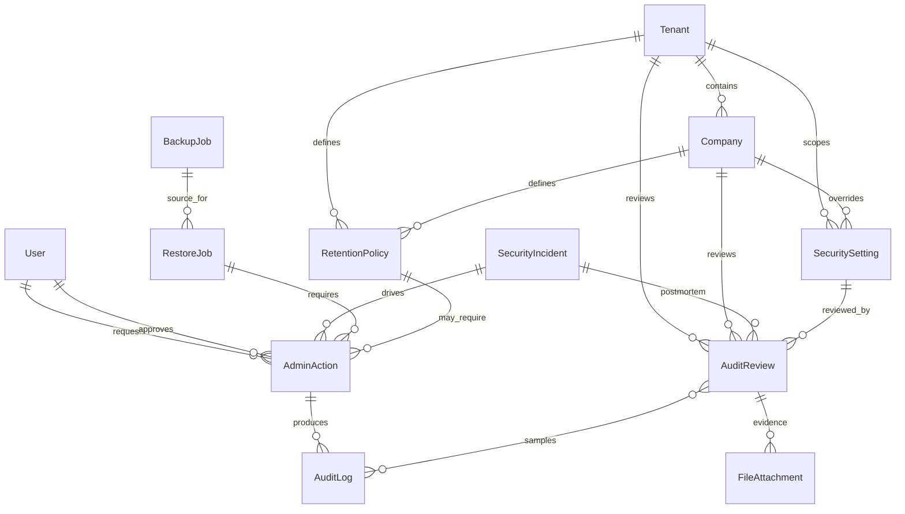
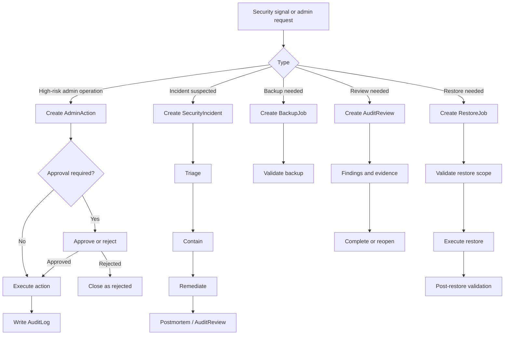

# 15_Admin_Security_Audit.md

## 1. Document Metadata

| Field | Value |
| --- | --- |
| Document name | `15_Admin_Security_Audit.md` |
| Phase | Phase 15 |
| Phase name | Admin, Security, and Audit |
| Document type | Phase-level product, systems, data, API, UX, permissions, audit, reporting, and implementation specification |
| Platform | Multi-company SaaS CRM + outbound sales + field operations + drilling workflows + logistics + warehouse + fleet + service + reporting + integrations + QuickBooks sync + offline mobile workflows |
| Status | Production-grade phase design draft |
| Source-of-truth inputs | `00_Master_Platform_Documentation.md`, `00_Global_Documentation_Rules.md`, `00_Global_Domain_Model.md`, `00_Global_Decisions_Register.md`, Phase 01-14 future-phase summaries |
| Output files | `15_Admin_Security_Audit.md`, `15_Admin_Security_Audit__Summary_For_Future_Phases.md` |
| Last updated | 2026-05-09 |

## 2. Phase Purpose

Phase 15 defines the administrative, security, audit, retention, backup/restore, monitoring, incident, tenant isolation, and rollout security gate foundations for the platform. It hardens the platform after the core product, CRM, outbound, calendar/tasks, field, inventory, dispatch, fleet, service, reporting, QuickBooks, and offline sync foundations have been defined.

This phase is intentionally cross-cutting. It does not replace earlier identity, permission, audit, notification, file, settings, background job, reporting, integration, or offline sync foundations. Instead, it defines how those foundations must be governed, reviewed, secured, reported, tested, and prepared for production rollout.

## 3. Phase Goals

- Define canonical Phase 15 entities: `SecuritySetting`, `AuditReview`, `RetentionPolicy`, `AdminAction`, `SecurityIncident`, `BackupJob`, and `RestoreJob`.
- Harden admin settings, roles, permissions, exports, integrations, offline sync, backup/restore, and audit review workflows.
- Establish security review and rollout gates for modules, integrations, APIs, webhooks, imports, exports, mobile offline sync, backup, and restore.
- Ensure tenant/company isolation is tested and enforced across API, UI, search, reports, exports, background jobs, integrations, notifications, and offline sync.
- Define security UX for admins, reviewers, super admins, operations leads, and security owners.
- Define audit events, reporting requirements, notifications, API expectations, and acceptance criteria for production readiness.
- Preserve future flexibility for compliance frameworks without overbuilding enterprise-only controls for MVP.

## 4. Scope

### In Scope

- Administrative control surface for security posture and governance.
- Security setting management and inheritance.
- Formal audit review workflows.
- Retention policy configuration and enforcement governance.
- High-impact admin action request/approval/execution workflow.
- Security incident tracking and response workflow.
- Backup job and restore job visibility, approval, validation, and rollout gate evidence.
- Tenant/company isolation testing requirements.
- Permission hardening requirements.
- Audit logging requirements for security and admin events.
- Reporting, dashboard, saved view, filter, notification, integration, and mobile/offline implications.
- Security gates for future rollout and production readiness.

### Out of Scope for Phase 15

- Full enterprise compliance certification implementation.
- Full legal hold workflow beyond future-compatible fields and open questions.
- Full SIEM integration implementation.
- Full DLP implementation.
- Full public API/webhook productization, which remains a future phase but must respect Phase 15 rules.
- Full notification/automation builder implementation, which remains a future phase but must respect Phase 15 rules.
- Final production operations runbook, which remains a later rollout/operations phase.
- Native SSO implementation unless already required by customer-specific prioritization.

## 5. Non-Goals

- Do not create Phase 16.
- Do not rewrite global control documents or prior phase documents.
- Do not create duplicate entities for audit logs, notifications, files, background jobs, settings, API keys, webhooks, reports, integrations, or offline sync.
- Do not replace Phase 02 RBAC/UserMembership/Permission foundations.
- Do not replace Phase 03 `AuditLog`; Phase 15 adds `AuditReview`, not a second audit log.
- Do not implement customer-facing compliance claims without explicit product/legal approval.
- Do not make company admins equivalent to super admins.
- Do not expose secrets, keys, tokens, storage paths, backup references, or sensitive security diffs in plaintext.

## 6. Source-of-Truth Definitions

- `Tenant` remains the highest SaaS isolation boundary.
- `Company` remains the customer organization inside a Tenant and must not be confused with CRM `Account`.
- `UserMembership` remains the access bridge between `User` and `Company`.
- `Role` and `Permission` remain the canonical authorization grouping and action-key foundations.
- Backend permission checks are mandatory; frontend hiding is not authorization.
- Company module enablement and user permission are both required before module access is allowed.
- `AuditLog` remains the canonical append-only audit event record.
- `Notification` remains the canonical recipient-facing notification record.
- `FileAttachment` remains the canonical file/photo/document/evidence model.
- `SettingsDocument` remains the general shared settings foundation; `SecuritySetting` is the canonical security-specific governance record where explicit review, inheritance, enforcement, and audit are needed.
- `BackgroundJob` remains the shared async job framework; `BackupJob` and `RestoreJob` are security/operations records that may reference BackgroundJob execution.
- `Report`, `ReportDefinition`, `ReportRun`, `MetricDefinition`, `RollupSnapshot`, `Dashboard`, `ScheduledReport`, and `SavedView` remain reporting foundations reused by Phase 15.
- `IntegrationConnection`, `IntegrationAccount`, `SyncJob`, `SyncLog`, `ExternalReference`, `WebhookDelivery`, `ApiKey`, and `WebhookEndpoint` remain integration/public extension foundations governed by this phase.
- `OfflineActionQueueItem`, `SyncOperation`, `SyncConflict`, and `SyncStatus` remain offline sync foundations governed by this phase.

## 7. Canonical Entity Definitions

### 7.1 `SecuritySetting`

| Field | Definition |
| --- | --- |
| Purpose | Canonical security configuration record for platform, tenant, company, module, or entity-level controls. |
| Owner module | Admin / Security. |
| Scope | Platform, tenant, company, module, or entity type depending the setting. |
| Tenant/company scoping | Must include `tenant_id` when tenant-specific; must include `company_id` when company-specific. Platform defaults may omit both but must be read-only for company admins. |
| Key fields | `id`, `tenant_id`, `company_id`, `scope_type`, `scope_id`, `setting_key`, `setting_group`, `setting_value`, `effective_value`, `enforcement_mode`, `applies_to_module`, `applies_to_entity_type`, `is_inherited`, `inherited_from_scope_type`, `inherited_from_scope_id`, `requires_admin_action`, `requires_reauth`, `effective_from_at`, `effective_until_at`, `last_evaluated_at`, `risk_level`, `change_reason`, `version`, `locked_by_platform`, `allowed_override_scope`, `validation_schema`, `last_reviewed_at`, `next_review_due_at`, `created_at`, `created_by_user_id`, `updated_at`, `updated_by_user_id`. |
| Relationships | References Tenant, Company, module registry, entity type registry, User, AuditLog, AdminAction, AuditReview, SecurityIncident when changes create risk. |
| Lifecycle | Draft -> Pending Review -> Active -> Superseded -> Archived. Emergency lockdown settings may move directly to Active through a high-risk AdminAction. |
| Statuses | `draft`, `pending_review`, `active`, `scheduled`, `superseded`, `archived`, `locked`. |
| Index considerations | Index `tenant_id`, `company_id`, `setting_key`; `scope_type`, `scope_id`; `setting_group`, `status`; `next_review_due_at`; unique effective setting per scope/key/version where applicable. |
| Permissions impact | Requires `admin.security_setting.view` to read and `admin.security_setting.manage` to change. High-risk updates may require `admin.admin_action.approve`, MFA, reauthentication, and dual control. |
| Audit requirements | Audit every create, update, activation, override, inheritance change, lock/unlock, and review completion. Do not store secret values in audit diffs. |
| Reporting impact | Feeds security posture, risky setting, overdue review, permission hardening, export/API risk, and rollout gate dashboards. |
| Future-phase impact | Notifications, automation, public APIs, webhooks, import/export, mobile offline sync, rollout, and final blueprint phases must honor effective security settings. |

### 7.2 `AuditReview`

| Field | Definition |
| --- | --- |
| Purpose | Canonical formal review record for audit evidence, access reviews, permission reviews, export reviews, security gates, integration review, retention review, backup/restore review, and incident follow-up. |
| Owner module | Admin / Security. |
| Scope | Tenant/company by default; platform-level for cross-tenant operational controls only. |
| Tenant/company scoping | Must include `tenant_id`; include `company_id` when reviewing company-scoped data. Cross-company reviews must store reviewed company IDs in metadata and must be restricted to super admin or explicitly authorized tenant admin contexts. |
| Key fields | `id`, `tenant_id`, `company_id`, `review_type`, `review_period_start_at`, `review_period_end_at`, `review_scope`, `reviewer_user_id`, `reviewer_team_id`, `review_status`, `risk_rating`, `sample_strategy`, `source_query`, `source_saved_view_id`, `audit_log_ids`, `related_admin_action_ids`, `related_incident_ids`, `findings`, `exceptions`, `remediation_tasks`, `completed_at`, `approved_by_user_id`, `approval_notes`, `evidence_file_attachment_ids`, `next_review_due_at`. |
| Relationships | References User, Team, AuditLog, SavedView, AdminAction, SecurityIncident, Task, FileAttachment, ReportRun, BackupJob, RestoreJob, IntegrationConnection, SyncJob, SyncOperation. |
| Lifecycle | Planned -> In Progress -> Findings Recorded -> Remediation Required -> Completed -> Reopened. |
| Statuses | `planned`, `in_progress`, `findings_recorded`, `remediation_required`, `completed`, `reopened`, `canceled`. |
| Index considerations | Index `tenant_id`, `company_id`, `review_type`, `review_status`, `review_period_start_at`, `review_period_end_at`, `reviewer_user_id`, `next_review_due_at`, `risk_rating`. |
| Permissions impact | Requires `admin.audit_review.view`; creating or completing reviews requires dedicated permissions. Users must not see source audit data they cannot otherwise access unless a specific review role grants controlled access. |
| Audit requirements | Audit creation, scope change, reviewer assignment, finding creation, evidence attachment, completion, approval, cancellation, and reopening. |
| Reporting impact | Feeds audit review completion reports, compliance evidence, rollout gate reports, and incident postmortem tracking. |
| Future-phase impact | Future automation may generate AuditReview tasks, but must not bypass reviewer accountability or evidence requirements. |

### 7.3 `RetentionPolicy`

| Field | Definition |
| --- | --- |
| Purpose | Canonical policy for retaining, archiving, anonymizing, purging, or exempting records by module/entity/event type. |
| Owner module | Admin / Security. |
| Scope | Tenant/company/module/entity/event scope. |
| Tenant/company scoping | Must include `tenant_id`; include `company_id` for company-specific retention. Platform defaults may define recommended baseline values but company overrides must be explicit and audited. |
| Key fields | `id`, `tenant_id`, `company_id`, `policy_name`, `policy_code`, `scope_type`, `scope_id`, `target_module`, `target_entity_type`, `target_event_type`, `retention_period_days`, `retention_action`, `archive_before_purge`, `anonymize_fields`, `preserve_fields`, `legal_hold_supported`, `default_legal_hold_behavior`, `enforcement_status`, `last_run_at`, `next_run_at`, `last_run_result`, `exemption_rules`, `approval_required`, `approved_by_user_id`, `effective_from_at`, `superseded_by_policy_id`. |
| Relationships | References Tenant, Company, module/entity registry, AdminAction, AuditReview, SecurityIncident, BackgroundJob, ExportJob, FileAttachment, AuditLog. |
| Lifecycle | Draft -> Pending Approval -> Active -> Enforcement Scheduled -> Superseded -> Archived. |
| Statuses | `draft`, `pending_approval`, `active`, `paused`, `enforcement_scheduled`, `superseded`, `archived`. |
| Index considerations | Index `tenant_id`, `company_id`, `target_module`, `target_entity_type`, `target_event_type`, `status`, `next_run_at`, `policy_code`; unique active `policy_code` per scope. |
| Permissions impact | Viewing requires `admin.retention_policy.view`; changes require `admin.retention_policy.manage`; enforcement requires `admin.retention_policy.enforce` and may require AdminAction approval. |
| Audit requirements | Audit create, update, approval, activation, pause, preview run, enforcement request, enforcement completion, enforcement failure, legal hold override, and supersession. |
| Reporting impact | Feeds retention enforcement, data aging, storage risk, legal hold, and compliance readiness reports. |
| Future-phase impact | API/export/import, public webhooks, notifications, final blueprint, and operations phases must define data lifecycle behavior using RetentionPolicy. |

### 7.4 `AdminAction`

| Field | Definition |
| --- | --- |
| Purpose | Canonical wrapper for high-impact administrative actions requiring reason, approval, controlled execution, evidence, and audit correlation. |
| Owner module | Admin / Security. |
| Scope | Platform, tenant, company, module, entity, user, or integration target. |
| Tenant/company scoping | Must include the narrowest applicable `tenant_id` and `company_id`; platform-wide actions must be limited to super admin flows and must record affected scopes. |
| Key fields | `id`, `tenant_id`, `company_id`, `action_type`, `target_entity_type`, `target_entity_id`, `target_user_id`, `target_membership_id`, `target_module`, `risk_level`, `reason_code`, `reason_text`, `requested_by_user_id`, `approved_by_user_id`, `approval_status`, `execution_status`, `executed_at`, `expires_at`, `requires_reauth`, `requires_mfa`, `requires_dual_control`, `before_snapshot_ref`, `after_snapshot_ref`, `related_audit_log_ids`, `related_incident_id`, `rollback_available`, `rollback_action_id`. |
| Relationships | References User, UserMembership, Role, Permission, Policy, Tenant, Company, SecuritySetting, RetentionPolicy, SecurityIncident, AuditReview, BackupJob, RestoreJob, IntegrationConnection, ApiKey, WebhookEndpoint, ExportJob. |
| Lifecycle | Requested -> Pending Approval -> Approved -> Executing -> Executed -> Failed or Canceled -> Expired. |
| Statuses | `requested`, `pending_approval`, `approved`, `rejected`, `executing`, `executed`, `failed`, `canceled`, `expired`, `rolled_back`. |
| Index considerations | Index `tenant_id`, `company_id`, `action_type`, `risk_level`, `approval_status`, `execution_status`, `requested_by_user_id`, `approved_by_user_id`, `target_entity_type`, `target_entity_id`, `created_at`. |
| Permissions impact | Requesting, approving, and executing are separate permissions. A requester must not approve their own dual-control action unless explicitly allowed by a future decision. |
| Audit requirements | Audit request, approval, rejection, execution start, success, failure, cancellation, expiration, and rollback. Store reason and safe diffs. |
| Reporting impact | Feeds admin action reports, high-risk action dashboards, permission change reports, and incident timelines. |
| Future-phase impact | Rollout, operations, API/webhook, import/export, automation, and support tooling must use AdminAction for high-risk controls. |

### 7.5 `SecurityIncident`

| Field | Definition |
| --- | --- |
| Purpose | Canonical incident record for security events requiring triage, severity, containment, remediation, notification decisioning, and closure. |
| Owner module | Admin / Security. |
| Scope | Platform, tenant, company, user, integration, API, offline sync, export/import, or entity-specific depending incident. |
| Tenant/company scoping | Must include affected `tenant_id` and `company_id` where known. Platform-wide incidents must include affected scope arrays and must not expose other tenants to company users. |
| Key fields | `id`, `tenant_id`, `company_id`, `incident_number`, `incident_type`, `severity`, `status`, `detection_source`, `detected_at`, `reported_by_user_id`, `assigned_owner_user_id`, `affected_tenant_ids`, `affected_company_ids`, `affected_user_ids`, `affected_entity_refs`, `suspected_blast_radius`, `confirmed_blast_radius`, `containment_actions`, `remediation_actions`, `root_cause`, `customer_notification_required`, `customer_notified_at`, `regulatory_review_required`, `closed_at`, `postmortem_file_attachment_ids`, `linked_audit_review_id`. |
| Relationships | References AuditLog, AdminAction, AuditReview, Task, Notification, FileAttachment, ApiKey, WebhookEndpoint, IntegrationConnection, SyncJob, SyncOperation, ExportJob, ImportJob, Session, UserMembership. |
| Lifecycle | New -> Triage -> Containment -> Remediation -> Monitoring -> Closed -> Reopened. |
| Statuses | `new`, `triage`, `containment`, `remediation`, `monitoring`, `closed`, `reopened`, `false_positive`. |
| Index considerations | Index `tenant_id`, `company_id`, `incident_number`, `incident_type`, `severity`, `status`, `detected_at`, `assigned_owner_user_id`, `customer_notification_required`, affected scope arrays. |
| Permissions impact | Requires `admin.security_incident.view` to read; `admin.security_incident.manage` to update; `admin.security_incident.close` to close. Sensitive incident detail must be redacted for unauthorized users. |
| Audit requirements | Audit creation, severity changes, status transitions, affected scope changes, containment/remediation updates, customer notification decision, closure, and reopening. |
| Reporting impact | Feeds incident reports, security posture dashboards, operational risk summaries, and postmortem follow-up. |
| Future-phase impact | Future monitoring/automation may create incidents automatically, but severity, containment, notification, and closure rules must remain explicit. |

### 7.6 `BackupJob`

| Field | Definition |
| --- | --- |
| Purpose | Canonical backup execution record for scheduled, manual, pre-deployment, pre-migration, emergency, and validation backups. |
| Owner module | Admin / Security / Operations. |
| Scope | Environment, platform, tenant, company, database, collection, or module depending backup strategy. |
| Tenant/company scoping | Tenant/company values are required when backup scope is tenant/company-specific. Platform backups must not expose cross-tenant contents in company admin views. |
| Key fields | `id`, `tenant_id`, `company_id`, `job_type`, `environment`, `backup_scope_type`, `backup_scope_id`, `trigger_type`, `triggered_by_user_id`, `status`, `started_at`, `completed_at`, `storage_reference`, `encrypted`, `encryption_key_ref`, `retention_until_at`, `size_bytes`, `record_counts`, `validation_status`, `validation_details`, `failure_reason`, `related_release_id`, `related_admin_action_id`. |
| Relationships | References BackgroundJob, AdminAction, AuditReview, RestoreJob, SecurityIncident, RetentionPolicy, FileAttachment/evidence metadata where appropriate. |
| Lifecycle | Scheduled -> Running -> Completed -> Validation Pending -> Validated or Failed -> Expired. |
| Statuses | `scheduled`, `running`, `completed`, `validation_pending`, `validated`, `failed`, `expired`, `canceled`. |
| Index considerations | Index `environment`, `tenant_id`, `company_id`, `backup_scope_type`, `backup_scope_id`, `status`, `started_at`, `completed_at`, `retention_until_at`, `validation_status`. |
| Permissions impact | Viewing requires `admin.backup_job.view`; manual execution requires `admin.backup_job.run`; storage references must be redacted unless a future secure operations role allows detail access. |
| Audit requirements | Audit job creation, start, completion, failure, validation, cancellation, retention change, and manual trigger. |
| Reporting impact | Feeds backup health, rollout gate, operational readiness, security posture, and restore readiness dashboards. |
| Future-phase impact | Rollout/operations must use BackupJob as evidence for release gates, migration safety, and restore testing. |

### 7.7 `RestoreJob`

| Field | Definition |
| --- | --- |
| Purpose | Canonical restore request/execution record for test restores, staging restores, emergency restores, point-in-time restores, validation, and post-restore evidence. |
| Owner module | Admin / Security / Operations. |
| Scope | Environment, platform, tenant, company, database, collection, module, or record set depending supported restore mode. |
| Tenant/company scoping | Must include target tenant/company scope for scoped restores. Production cross-tenant restore workflows must be restricted to super admin operations and must include AdminAction approval. |
| Key fields | `id`, `tenant_id`, `company_id`, `restore_type`, `environment`, `source_backup_job_id`, `restore_scope_type`, `restore_scope_id`, `requested_by_user_id`, `approved_by_user_id`, `approval_status`, `status`, `started_at`, `completed_at`, `target_environment`, `target_tenant_id`, `target_company_id`, `restore_point_at`, `validation_status`, `validation_details`, `rollback_plan_ref`, `customer_impact_notes`, `failure_reason`, `related_incident_id`, `related_admin_action_id`. |
| Relationships | References BackupJob, AdminAction, AuditReview, SecurityIncident, BackgroundJob, Tenant, Company, affected entities and evidence attachments. |
| Lifecycle | Requested -> Pending Approval -> Approved -> Running -> Validation Pending -> Validated or Failed -> Closed. |
| Statuses | `requested`, `pending_approval`, `approved`, `running`, `validation_pending`, `validated`, `completed`, `failed`, `canceled`, `closed`. |
| Index considerations | Index `environment`, `target_environment`, `tenant_id`, `company_id`, `source_backup_job_id`, `restore_scope_type`, `status`, `approval_status`, `validation_status`, `requested_by_user_id`, `created_at`. |
| Permissions impact | Request, approve, and execute restore are separate permissions. Production execution must require high-risk AdminAction approval unless a future operations decision states otherwise. |
| Audit requirements | Audit request, approval, start, completion, failure, validation, cancellation, and closure. Store no sensitive backup secrets in audit details. |
| Reporting impact | Feeds restore readiness, disaster recovery, incident response, and rollout gate dashboards. |
| Future-phase impact | Rollout and final blueprint phases must define operational RPO/RTO, restore ownership, and environment-specific procedures using RestoreJob. |

## 8. Entity Lifecycle and Status Rules

### 8.1 Shared Lifecycle Rules

- Every Phase 15 entity must have stable `id`, timestamps, actor fields, tenant/company scope where applicable, and audit correlation metadata.
- Lifecycle transitions must be explicit and audited.
- Destructive changes must be avoided; prefer archive, supersede, expire, cancel, or close states.
- High-risk transitions must require AdminAction, reauthentication, MFA, or dual control where configured.
- Status changes must not bypass permission checks or module enablement.
- Background workers must revalidate permissions and setting states before executing delayed high-risk actions.

### 8.2 Status Matrix

| Entity | Primary statuses | Terminal or stable states |
| --- | --- | --- |
| `SecuritySetting` | `draft`, `pending_review`, `scheduled`, `active`, `locked`, `superseded`, `archived` | `active`, `locked`, `superseded`, `archived` |
| `AuditReview` | `planned`, `in_progress`, `findings_recorded`, `remediation_required`, `completed`, `reopened`, `canceled` | `completed`, `canceled` |
| `RetentionPolicy` | `draft`, `pending_approval`, `active`, `paused`, `enforcement_scheduled`, `superseded`, `archived` | `active`, `paused`, `superseded`, `archived` |
| `AdminAction` | `requested`, `pending_approval`, `approved`, `rejected`, `executing`, `executed`, `failed`, `canceled`, `expired`, `rolled_back` | `executed`, `rejected`, `failed`, `canceled`, `expired`, `rolled_back` |
| `SecurityIncident` | `new`, `triage`, `containment`, `remediation`, `monitoring`, `closed`, `reopened`, `false_positive` | `closed`, `false_positive` |
| `BackupJob` | `scheduled`, `running`, `completed`, `validation_pending`, `validated`, `failed`, `expired`, `canceled` | `validated`, `failed`, `expired`, `canceled` |
| `RestoreJob` | `requested`, `pending_approval`, `approved`, `running`, `validation_pending`, `validated`, `completed`, `failed`, `canceled`, `closed` | `completed`, `failed`, `canceled`, `closed` |

## 9. Entity Relationship Rules

- Phase 15 entities must reference existing canonical entities rather than duplicating them.
- Security and audit workflows must link to `AuditLog` for evidence instead of embedding unstructured copies of the audit log.
- Evidence files must use `FileAttachment`.
- Remediation work must use canonical `Task` where an actionable follow-up is assigned.
- Admin notifications must use canonical `Notification`.
- Dashboards and reports must reuse Phase 12 reporting foundations.
- Backup/restore execution may use `BackgroundJob` but must preserve domain-specific `BackupJob` and `RestoreJob` records.
- Integration security review must reference `IntegrationConnection`, `IntegrationAccount`, `SyncJob`, `SyncLog`, `WebhookDelivery`, `ApiKey`, and `WebhookEndpoint` where applicable.
- Offline security review must reference `OfflineActionQueueItem`, `SyncOperation`, `SyncConflict`, and `SyncStatus` where applicable.

## 10. Workflow Requirements

### 10.1 Security Setting Change Workflow

1. Authorized admin opens Security Settings.
2. System loads effective setting values by scope and inheritance.
3. Admin proposes change and enters reason where required.
4. System validates setting schema, scope, permission, module enablement, risk level, reauth, and MFA requirements.
5. Low-risk allowed changes may activate immediately.
6. High-risk changes create `AdminAction` or require approval.
7. Upon approval/execution, the system writes safe diffs to `AuditLog` and updates effective settings.
8. Notifications are sent to relevant reviewers/admins.
9. Setting review due date is recalculated when applicable.

### 10.2 Audit Review Workflow

1. Review is created manually, from schedule, or from rollout/security gate.
2. Reviewer scope, evidence source, period, and review type are defined.
3. Reviewer inspects source records, findings, exceptions, and related audit logs.
4. Findings create remediation tasks where appropriate.
5. Reviewer attaches evidence and completes review.
6. Approver signs off if required.
7. Completion writes audit event and updates reporting metrics.

### 10.3 Retention Enforcement Workflow

1. Admin creates or updates RetentionPolicy.
2. Policy enters draft or pending approval.
3. Admin runs dry-run preview.
4. System reports affected counts, exemptions, and legal hold conflicts.
5. Approval/AdminAction is required for destructive enforcement where configured.
6. Enforcement runs asynchronously and logs affected record summaries.
7. Failures generate notifications, audit events, and review findings where required.

### 10.4 Security Incident Workflow

1. Incident is created manually or by future monitoring automation.
2. Incident enters triage with suspected scope and severity.
3. Owner records containment actions and affected scope.
4. Remediation tasks and AdminActions are linked.
5. Customer notification and regulatory review flags are evaluated.
6. Incident moves to monitoring after remediation.
7. Incident closes only after required evidence, postmortem, and review links are complete.

### 10.5 Backup / Restore Workflow

1. Scheduled or manual backup creates BackupJob.
2. Backup runs and records status, encrypted state, retention, and validation result.
3. Restore request creates RestoreJob with source backup and target scope.
4. Production restore requires approval/AdminAction.
5. Restore execution validates environment and scope.
6. Post-restore validation checks tenant/company isolation and operational smoke criteria.
7. Restore closes only after validation and evidence are complete.

## 11. Data Model Requirements

- Phase 15 records must follow global identifier, naming, timestamp, scope, status, and audit conventions.
- Company-scoped records must include `tenant_id` and `company_id`.
- Platform-scoped records must be restricted to super admin access and must never appear in company admin list views unless shown as non-sensitive inherited defaults.
- Store arrays of affected scopes only when necessary, such as SecurityIncident blast radius or cross-company AuditReview scope.
- Store source/evidence references instead of duplicating large records.
- Use redacted diffs for sensitive fields.
- Use version fields for SecuritySetting and RetentionPolicy to avoid stale updates.
- Use safe snapshots or snapshot references for AdminAction before/after evidence when needed.
- Backup storage references and encryption key references must be stored as opaque secure references, not raw credentials.
- Retention enforcement must preserve enough metadata to prove policy version, run time, counts, and exemptions.
- RestoreJob must preserve source backup, target environment, target scope, approval, validation, and incident linkage.

## 12. API Requirements

- **API-15-001:** All Phase 15 API resources must use plural lowercase paths under `/api/v1/admin` and stable application IDs, never MongoDB `_id`.
- **API-15-002:** `GET /api/v1/admin/security-settings` must support filters for scope, group, key, status, risk level, module, entity type, inherited state, and review due date.
- **API-15-003:** `POST /api/v1/admin/security-settings` must validate setting schema, scope, override rights, and high-risk approval requirements.
- **API-15-004:** `PATCH /api/v1/admin/security-settings/{security_setting_id}` must support safe partial updates and must reject changes to platform-locked settings by company admins.
- **API-15-005:** `POST /api/v1/admin/security-settings/{security_setting_id}/review` must create or link an AuditReview for the setting.
- **API-15-006:** `GET /api/v1/admin/audit-reviews` must support filters for review type, status, reviewer, period, risk rating, due date, and target scope.
- **API-15-007:** `POST /api/v1/admin/audit-reviews` must validate that the user can review the target scope and can access the evidence source.
- **API-15-008:** `PATCH /api/v1/admin/audit-reviews/{audit_review_id}` must preserve finding history and audit each material change.
- **API-15-009:** `POST /api/v1/admin/audit-reviews/{audit_review_id}/complete` must validate required evidence, findings, exceptions, and approvals.
- **API-15-010:** `GET /api/v1/admin/retention-policies` must support filters for target module, entity type, status, next run date, and enforcement status.
- **API-15-011:** `POST /api/v1/admin/retention-policies/{retention_policy_id}/run-preview` must enqueue an async preview and return a BackgroundJob or ReportRun reference.
- **API-15-012:** `POST /api/v1/admin/retention-policies/{retention_policy_id}/request-enforcement` must create AdminAction when approval is required.
- **API-15-013:** `GET /api/v1/admin/admin-actions` must support filters for action type, target, risk level, approval status, execution status, requester, approver, and date range.
- **API-15-014:** `POST /api/v1/admin/admin-actions` must validate reason code, target scope, requester permission, MFA/reauth requirement, and duplicate active action prevention.
- **API-15-015:** `POST /api/v1/admin/admin-actions/{admin_action_id}/approve` must reject self-approval for dual-control actions and must audit decision details.
- **API-15-016:** `POST /api/v1/admin/admin-actions/{admin_action_id}/execute` must revalidate permissions immediately before execution.
- **API-15-017:** SecurityIncident APIs must support creation, triage update, containment action addition, severity changes, closure, and reopening.
- **API-15-018:** BackupJob APIs must expose status and validation metadata while redacting sensitive storage and encryption references.
- **API-15-019:** RestoreJob APIs must require approval before execution and must validate source backup, target environment, target scope, and operator permission.
- **API-15-020:** All mutation endpoints must emit AuditLog records and return correlation IDs for support and review.
- **API-15-021:** All list endpoints must support SavedView-compatible filters where appropriate.
- **API-15-022:** All export endpoints for Phase 15 data must require explicit export permission and must produce audited ExportJob records.
- **API-15-023:** All APIs must use consistent validation errors for missing permission, invalid scope, locked setting, stale version, and high-risk approval required.
- **API-15-024:** API responses must include safe display metadata for linked records but must not embed unauthorized record details.
- **API-15-025:** Future public API/webhook phases must expose Phase 15 resources only after explicit scope and permission decisions are approved.

## 13. UI / UX Requirements

- **UX-15-001:** Admin Security Dashboard must show posture cards for incidents, risky settings, overdue reviews, permission changes, failed backups/restores, export/API risk, and rollout gate readiness.
- **UX-15-002:** Security Settings list must support grouped settings, inherited labels, platform-locked badges, risk badges, status, review due date, and module/entity filters.
- **UX-15-003:** Security Setting detail must show effective value, inheritance chain, change history, linked audit logs, linked audit reviews, validation errors, and change preview.
- **UX-15-004:** Security Setting forms must display warnings for high-risk changes and require reason text where audit policy demands it.
- **UX-15-005:** Audit Review list must show review type, period, reviewer, status, risk rating, due date, findings count, exceptions count, and completion state.
- **UX-15-006:** Audit Review detail must provide tabs for scope, evidence, findings, exceptions, remediation tasks, approval, and audit trail.
- **UX-15-007:** Retention Policy screen must provide entity/module targeting, retention action controls, preview button, affected record estimate, legal hold warning, and enforcement history.
- **UX-15-008:** Admin Action center must show requests, approvals, execution status, risk level, target, requester, approver, reason, expiration, and rollback availability.
- **UX-15-009:** Security Incident workspace must show severity, status, timeline, affected scopes, containment checklist, remediation checklist, notifications, evidence, postmortem, and closure gate.
- **UX-15-010:** Backup and Restore center must show job status, freshness, validation state, environment, scope, failure reasons, and safe restore-request entry points.
- **UX-15-011:** Restore request form must clearly distinguish staging/test restore from production restore and must require reason, scope, source backup, and impact notes.
- **UX-15-012:** Empty states must explain missing permissions, no configured settings, no reviews due, no incidents, no backup jobs, or no restore jobs without leaking sensitive counts.
- **UX-15-013:** Error states must distinguish validation error, permission denied, locked setting, approval required, stale version conflict, job failure, and environment mismatch.
- **UX-15-014:** Unauthorized users must see either no navigation entry or a safe access-denied state; they must not see sensitive names, IDs, counts, or secret metadata.
- **UX-15-015:** All detail pages must include an audit panel or audit link when the viewer has audit permissions.
- **UX-15-016:** High-risk forms must show confirmation summaries and require typed acknowledgement only for destructive or production-impacting operations.
- **UX-15-017:** Mobile UX may provide read-only incident/admin notification links but must not prioritize complex security configuration on small screens for MVP.
- **UX-15-018:** Saved views must be available for SecuritySetting, AuditReview, RetentionPolicy, AdminAction, SecurityIncident, BackupJob, and RestoreJob lists.
- **UX-15-019:** Dashboards must display data freshness and failed background job warnings.
- **UX-15-020:** Secret fields must show redacted placeholders and must never offer copy-to-clipboard for stored secret values.

## 14. Search, Filters, and Saved Views

- All Phase 15 list screens must support search, filters, sorting, pagination, column selection, and SavedView where appropriate.
- Search must respect tenant, company, role, permission, module enablement, and record-level policy compatibility.
- SecuritySetting filters: scope, group, key, inherited, locked, status, risk level, review due date, module, entity type.
- AuditReview filters: review type, status, reviewer, period, due date, findings, exceptions, risk rating, target scope.
- RetentionPolicy filters: target module, entity type, status, action, next run date, approval required, enforcement status.
- AdminAction filters: action type, target, requester, approver, risk level, approval status, execution status, date range.
- SecurityIncident filters: severity, status, type, detection source, assigned owner, affected scope, notification required, date range.
- BackupJob filters: environment, scope, type, trigger, status, validation status, started/completed date, retention date.
- RestoreJob filters: environment, target environment, source backup, type, approval status, execution status, validation status, requested by, date range.
- Saved views for sensitive datasets must not be shareable with users who lack required permissions.
- Search index records must not leak sensitive field values or unauthorized counts.

## 15. Permissions and Access Control

- **PERM-15-001:** Permission keys must use lowercase dot notation and must be assigned through Role/UserMembership foundations.
- **PERM-15-002:** `admin.security_setting.view` is required to view security settings.
- **PERM-15-003:** `admin.security_setting.manage` is required to create, update, archive, or override security settings.
- **PERM-15-004:** `admin.security_setting.review` is required to complete security setting reviews.
- **PERM-15-005:** `admin.audit_review.view` is required to view audit review records and must not automatically grant access to underlying sensitive evidence.
- **PERM-15-006:** `admin.audit_review.create` is required to create audit reviews.
- **PERM-15-007:** `admin.audit_review.complete` is required to complete or approve audit reviews.
- **PERM-15-008:** `admin.retention_policy.view` is required to view retention policies.
- **PERM-15-009:** `admin.retention_policy.manage` is required to create, update, activate, pause, supersede, or archive retention policies.
- **PERM-15-010:** `admin.retention_policy.enforce` is required to request or run retention enforcement and may require AdminAction approval.
- **PERM-15-011:** `admin.admin_action.view` is required to view admin actions.
- **PERM-15-012:** `admin.admin_action.request` is required to request high-risk actions.
- **PERM-15-013:** `admin.admin_action.approve` is required to approve high-risk actions.
- **PERM-15-014:** `admin.admin_action.execute` is required to execute approved high-risk actions.
- **PERM-15-015:** `admin.security_incident.view` is required to view security incidents.
- **PERM-15-016:** `admin.security_incident.manage` is required to update triage, containment, remediation, and notification decisions.
- **PERM-15-017:** `admin.security_incident.close` is required to close or reopen incidents.
- **PERM-15-018:** `admin.backup_job.view` is required to view backup job metadata.
- **PERM-15-019:** `admin.backup_job.run` is required to trigger manual backups.
- **PERM-15-020:** `admin.restore_job.view` is required to view restore job metadata.
- **PERM-15-021:** `admin.restore_job.request` is required to request restore jobs.
- **PERM-15-022:** `admin.restore_job.approve` is required to approve restore jobs.
- **PERM-15-023:** `admin.restore_job.execute` is required to execute approved restore jobs.
- **PERM-15-024:** `admin.audit_log.export` is required to export audit logs or Phase 15 security records.
- **PERM-15-025:** Super admin permissions must be separately assignable and auditable; company admin permissions must not imply platform-wide access.
- **PERM-15-026:** Every permission must be enforced on backend APIs, workers, reports, exports, and integration-triggered operations.

## 16. Notifications

- **NOTIF-15-001:** Notify assigned reviewers when an AuditReview is assigned.
- **NOTIF-15-002:** Notify reviewers and admins when an AuditReview is due soon or overdue.
- **NOTIF-15-003:** Notify approvers when a high-risk AdminAction needs approval.
- **NOTIF-15-004:** Notify requester when an AdminAction is approved, rejected, executed, failed, canceled, or expired.
- **NOTIF-15-005:** Notify security owners when a SecurityIncident is created or severity is escalated.
- **NOTIF-15-006:** Notify incident owners when containment, remediation, customer notification, or closure steps are overdue.
- **NOTIF-15-007:** Notify security/admin owners when RetentionPolicy preview completes or enforcement fails.
- **NOTIF-15-008:** Notify operations owners when BackupJob fails, validation fails, or a required backup is missing for a rollout gate.
- **NOTIF-15-009:** Notify operations/security owners when RestoreJob is requested, approved, started, completed, failed, or validation fails.
- **NOTIF-15-010:** Notify admins when tenant isolation tests fail or permission hardening issues are detected.
- **NOTIF-15-011:** Notifications must be permission-aware and must not include sensitive detail payloads beyond safe summaries.
- **NOTIF-15-012:** Notification preferences may suppress non-critical reminders but must not suppress required critical security alerts unless an approved escalation policy exists.

## 17. Audit Logging

- **AUDIT-15-001:** Create AuditLog records for every Phase 15 entity creation.
- **AUDIT-15-002:** Create AuditLog records for every Phase 15 entity update with safe field-level diffs where possible.
- **AUDIT-15-003:** Create AuditLog records for every lifecycle status transition.
- **AUDIT-15-004:** Create AuditLog records for SecuritySetting inheritance, override, lock, unlock, activation, and review completion.
- **AUDIT-15-005:** Create AuditLog records for AuditReview finding changes, evidence attachments, completion, approval, reopening, and cancellation.
- **AUDIT-15-006:** Create AuditLog records for RetentionPolicy preview, approval, enforcement request, enforcement execution, pause, supersession, and failure.
- **AUDIT-15-007:** Create AuditLog records for AdminAction request, approval, rejection, execution, failure, cancellation, expiration, and rollback.
- **AUDIT-15-008:** Create AuditLog records for SecurityIncident severity change, affected scope change, containment action, remediation action, notification decision, closure, and reopening.
- **AUDIT-15-009:** Create AuditLog records for BackupJob manual trigger, start, completion, failure, validation, retention change, and cancellation.
- **AUDIT-15-010:** Create AuditLog records for RestoreJob request, approval, start, completion, failure, validation, cancellation, and closure.
- **AUDIT-15-011:** Audit events must record actor user, membership, tenant, company, source IP/user agent when available, request correlation ID, target entity, and safe changed fields.
- **AUDIT-15-012:** Audit events must not store secret plaintext, tokens, password hashes, webhook secrets, refresh tokens, full API keys, or sensitive backup storage references.
- **AUDIT-15-013:** High-risk read/export events must be audited when a user views or exports sensitive audit, security, retention, backup, restore, incident, or admin action datasets.
- **AUDIT-15-014:** AuditLog immutability must be preserved; correction requires a new event, not editing prior events.
- **AUDIT-15-015:** Audit events must support reporting and AuditReview source queries without exposing unauthorized cross-company data.

## 18. Reporting and Analytics Impact

- **REPORT-15-001:** Security Posture Dashboard must show incident counts, risky settings, overdue reviews, failed gates, failed backups/restores, and recent high-risk admin actions.
- **REPORT-15-002:** Audit Review Completion Report must show due, overdue, completed, reopened, findings, exceptions, and reviewer performance.
- **REPORT-15-003:** Permission Change Report must show role changes, membership changes, policy changes, permission grants/removals, and high-risk access changes.
- **REPORT-15-004:** Admin Action Report must show requested, approved, rejected, executed, failed, canceled, expired, risk level, target type, and requester/approver trends.
- **REPORT-15-005:** Retention Enforcement Report must show policies, previews, enforcement runs, affected record estimates, failures, exemptions, and legal hold warnings.
- **REPORT-15-006:** Security Incident Report must show severity, status, detection source, containment time, remediation time, notification decisions, and closure metrics.
- **REPORT-15-007:** Backup Health Report must show scheduled vs completed backups, validation status, failures, freshness, retention coverage, and missing gate evidence.
- **REPORT-15-008:** Restore Readiness Report must show test restore cadence, validation success/failure, emergency restore requests, approval status, and post-restore validation.
- **REPORT-15-009:** Export/API Risk Report must show high-volume exports, failed API authorization attempts, API key changes, webhook changes, and unusual access patterns.
- **REPORT-15-010:** Tenant Isolation Test Report must show test scope, pass/fail status, failed pathways, remediation status, and gate impact.
- **REPORT-15-011:** Reports must reuse Phase 12 Report, ReportDefinition, ReportRun, MetricDefinition, RollupSnapshot, Dashboard, and ScheduledReport foundations where applicable.
- **REPORT-15-012:** Scheduled security reports must revalidate permissions at run time and must not deliver sensitive data to users who lost access after schedule creation.

## 19. Mobile and Offline Impact

- **OFFLINE-15-001:** Offline queued actions must be permission revalidated at sync time against current UserMembership, module enablement, SecuritySetting, and record status.
- **OFFLINE-15-002:** Admin/security configuration is not required to be fully editable offline for MVP.
- **OFFLINE-15-003:** Mobile users may receive security notifications and view safe incident or action summaries when permission allows.
- **OFFLINE-15-004:** Offline sync failures caused by revoked access, module disablement, locked record state, or security setting changes must be visible and auditable.
- **OFFLINE-15-005:** Security settings may disable or restrict offline sync for high-risk modules, users, companies, or incident response periods.
- **OFFLINE-15-006:** Offline cache must respect company isolation and must purge or block access when membership is revoked or company context changes.
- **OFFLINE-15-007:** AdminAction and SecurityIncident events created from mobile must use stable IDs, actor metadata, device/session metadata, and sync metadata.
- **OFFLINE-15-008:** Offline conflict resolution must not allow a lower-privilege user to override security-sensitive server-side changes.
- **OFFLINE-15-009:** Mobile storage of sensitive admin/security data must be minimized and must avoid caching secrets, backup references, or sensitive incident details.
- **OFFLINE-15-010:** Offline sync status and SyncConflict outcomes may be included in AuditReview and SecurityIncident evidence when relevant.

## 20. Integration Impact

- **INT-15-001:** Phase 15 introduces no new external provider but governs all existing and future integrations.
- **INT-15-002:** IntegrationConnection credential changes must be audited and may require AdminAction for high-risk providers.
- **INT-15-003:** QuickBooks connection, realm, mapping, webhook, sync failure, and credential risk must be visible in AuditReview and SecurityIncident workflows where relevant.
- **INT-15-004:** ApiKey creation, rotation, revocation, scope change, and suspicious use must be auditable and reportable.
- **INT-15-005:** WebhookEndpoint creation, signing secret rotation, enable/disable, delivery failure spikes, and endpoint URL changes must be auditable and reportable.
- **INT-15-006:** SyncJob, SyncLog, SyncOperation, and WebhookDelivery failures that indicate authorization, tenant isolation, or credential risk must be eligible to create SecurityIncident records.
- **INT-15-007:** ImportJob and ExportJob must respect retention, audit, permission, redaction, and incident detection rules.
- **INT-15-008:** Future public API and webhook phases must define scopes using Phase 15 permission and security setting requirements.
- **INT-15-009:** Integration secrets must use secret references and must never appear in Phase 15 UI, audit diffs, exports, notifications, or reports.
- **INT-15-010:** Integration review must be available as AuditReview type with evidence links to provider connections, sync jobs, webhook deliveries, and API keys.

## 21. Security Considerations

- Tenant and company isolation is a release-blocking security requirement.
- Server-side authorization is mandatory for every Phase 15 API and background operation.
- Admin screens must not rely on hidden UI controls as security.
- Security-sensitive metadata must be redacted for unauthorized users and exports.
- Secrets must use secure storage references.
- High-risk admin actions should require reauthentication, MFA, and dual control where configured.
- Export, API, webhook, integration, and offline sync capabilities must be treated as data exposure surfaces.
- Backup and restore operations must be treated as high-risk operations because they can expose, overwrite, or mix tenant data.
- Retention enforcement must not destroy evidence required for open incidents, audit reviews, legal hold, or active investigations.
- SecurityIncident visibility must be carefully scoped to avoid disclosing other tenants, internal infrastructure details, or sensitive exploit information.
- Structured logs must avoid secrets but include correlation IDs for investigations.

## 22. Edge Cases

1. **Company admin attempts platform setting change:** Reject the change, show platform-locked state, and audit denied attempt when security policy requires.
2. **Security setting inheritance conflict:** Use the most specific allowed scope and show inherited source; conflicting active settings must fail validation.
3. **User loses permission during AuditReview:** Block completion and require reassignment or renewed permission at action time.
4. **Scheduled report recipient loses access:** Do not deliver sensitive report; create audit event and notification to report owner.
5. **Retention policy targets active legal hold:** Skip or preserve held records and report exemption details.
6. **Retention preview differs from enforcement:** Show stale preview warning and require a new preview when data or policy changed materially.
7. **AdminAction approver is requester:** Reject for dual-control actions unless future accepted policy allows.
8. **AdminAction expires before execution:** Move to expired and require a new request.
9. **Incident scope is unknown:** Allow suspected scope while requiring updates as triage progresses.
10. **Incident marked false positive:** Require reason and preserve audit trail.
11. **Backup completes but validation fails:** Mark backup unusable for rollout gates unless manually approved through high-risk AdminAction.
12. **Restore target environment mismatch:** Block execution and show environment warning.
13. **Production restore requested without backup:** Reject or keep pending until source backup and approval requirements are satisfied.
14. **Cross-tenant data found in restore validation:** Fail validation, create SecurityIncident, block closure until remediated.
15. **Secret field appears in audit diff:** Redact value and create security hardening issue if redaction failed.
16. **Export spike detected:** Create notification or incident candidate depending thresholds and security settings.
17. **API key compromised:** Create AdminAction for revocation/rotation and SecurityIncident if confirmed or suspected.
18. **Offline sync after membership revocation:** Reject queued action, mark blocked, audit failure, and notify if critical.
19. **Offline user cached multiple companies:** Ensure cache is separated and purge unavailable company cache after access changes.
20. **Integration webhook fails signature validation:** Audit failed validation and consider incident if repeated.
21. **Company module disabled:** Block related admin settings, reports, exports, integrations, and offline sync actions for that module.
22. **AuditLog storage outage:** Do not silently execute high-risk action without audit; fail closed when action requires audit evidence.
23. **Permission hardening finds orphan role:** Create finding and remediation task; do not auto-delete unless approved.
24. **Super admin support access requested:** Require scoped reason, AdminAction, audit, time limit, and evidence.
25. **Notification recipient lacks permission:** Send only safe message or suppress notification and audit suppressed delivery where required.
26. **Restore succeeds but post-restore smoke test fails:** Mark RestoreJob validation failed and keep incident/remediation open.
27. **Retention policy superseded mid-run:** Complete current run with original policy version or stop safely according to enforcement mode.
28. **Backup storage reference leaked in UI:** Treat as security incident candidate and patch redaction.
29. **User tries to export incident evidence:** Require explicit export permission and audit the export.
30. **High-risk setting changed by background job:** Require service identity, AdminAction/evidence link, and audit correlation ID.

## 23. Business Requirements

- **BR-15-001:** The platform must provide a centralized admin/security workspace for company admins, tenant admins where applicable, and super admins to review security posture without bypassing tenant/company boundaries.
- **BR-15-002:** The platform must make high-risk administrative actions explicit, reason-coded, permission-controlled, reviewable, and auditable.
- **BR-15-003:** The platform must support formal audit reviews so management can prove that access, permissions, integrations, exports, retention, backup/restore, and offline sync controls were reviewed.
- **BR-15-004:** The platform must enforce tenant and company isolation across APIs, UI views, search, reports, exports, integrations, jobs, notifications, and mobile sync.
- **BR-15-005:** The platform must provide security setting governance for MFA, sessions, exports, API keys, webhooks, integrations, offline sync, retention, and incident notifications.
- **BR-15-006:** The platform must provide a retention policy foundation that supports future legal, compliance, storage, privacy, purge, anonymization, and export requirements.
- **BR-15-007:** The platform must provide a security incident workflow for triage, containment, remediation, notification decisions, closure, and postmortem evidence.
- **BR-15-008:** The platform must expose backup and restore job visibility sufficient for rollout gates, operations, incident response, and customer trust.
- **BR-15-009:** The platform must prevent normal admins from editing or deleting audit history through application flows.
- **BR-15-010:** The platform must support security monitoring views for suspicious exports, API activity, permission changes, failed integrations, failed offline sync permission checks, and failed tenant isolation tests.
- **BR-15-011:** The platform must protect sensitive credentials, secrets, tokens, webhook signing secrets, API keys, backup references, and security diffs from plaintext exposure.
- **BR-15-012:** The platform must use existing canonical shared services instead of introducing duplicate audit, notification, file, background job, import/export, settings, API key, or webhook entities.
- **BR-15-013:** The platform must support rollout security gates before enabling sensitive modules, integrations, offline workflows, export capabilities, API/webhook access, or production restore workflows.
- **BR-15-014:** The platform must support least-privilege admin access and clear separation between company admin and super admin operations.
- **BR-15-015:** The platform must make security, audit, retention, backup, restore, and incident records reportable and filterable without leaking unauthorized tenant/company data.
- **BR-15-016:** The platform must allow future automation and notifications to escalate security issues while respecting permissions and redaction rules.
- **BR-15-017:** The platform must support evidence attachment for audit reviews, incidents, backup validation, restore validation, and high-risk admin approvals using FileAttachment.
- **BR-15-018:** The platform must ensure offline queued actions, scheduled reports, scheduled exports, integration syncs, and background jobs revalidate permissions and module access before execution.
- **BR-15-019:** The platform must preserve operational simplicity by defining control points without requiring enterprise-only compliance complexity for the MVP.
- **BR-15-020:** The platform must define open decisions where policy choices are unclear rather than inventing unsupported compliance commitments.

## 24. Functional Requirements

- **FR-15-001:** Create, view, update, inherit, override, review, and archive SecuritySetting records by platform, tenant, company, module, or entity scope.
- **FR-15-002:** Prevent company admins from modifying platform-locked SecuritySetting records.
- **FR-15-003:** Show effective security setting values after inheritance and overrides without exposing secret material.
- **FR-15-004:** Require reauthentication and optionally MFA before high-risk security setting changes.
- **FR-15-005:** Create AuditReview records for access reviews, permission reviews, export reviews, integration reviews, retention reviews, backup/restore reviews, offline sync reviews, and rollout gates.
- **FR-15-006:** Allow AuditReview records to reference AuditLog entries, SavedViews, ReportRuns, AdminActions, SecurityIncidents, evidence files, and remediation Tasks.
- **FR-15-007:** Support AuditReview completion only when required findings, exceptions, evidence, and approver fields are valid.
- **FR-15-008:** Create, update, approve, activate, pause, supersede, and archive RetentionPolicy records.
- **FR-15-009:** Provide a retention dry-run preview that estimates affected records before enforcement.
- **FR-15-010:** Require approval for destructive retention enforcement when policy risk is high or policy requires approval.
- **FR-15-011:** Create AdminAction records for high-risk operations including permission changes, role escalation, forced session revocation, credential rotation, integration disconnect, destructive export, retention enforcement, production restore, and support access.
- **FR-15-012:** Support AdminAction request, approval, rejection, execution, failure, cancellation, expiration, and rollback states.
- **FR-15-013:** Prevent the same user from approving their own dual-control AdminAction unless a future accepted decision allows it.
- **FR-15-014:** Create SecurityIncident records manually and from future monitoring automation.
- **FR-15-015:** Support SecurityIncident severity, affected scope, containment actions, remediation actions, customer notification decision, postmortem evidence, closure, and reopening.
- **FR-15-016:** Create BackupJob records for scheduled, manual, pre-deploy, pre-migration, emergency, and validation backups.
- **FR-15-017:** Track BackupJob encryption, validation status, retention until date, failure reason, size, record counts, and storage reference redaction.
- **FR-15-018:** Create RestoreJob records for test, staging, emergency, and point-in-time restore workflows.
- **FR-15-019:** Require approval and AdminAction linkage for production RestoreJob execution.
- **FR-15-020:** Validate restore scope before execution to prevent cross-tenant or cross-company data contamination.
- **FR-15-021:** Display security posture cards for incidents, risky settings, overdue reviews, failed backups, failed restores, recent permission changes, export spikes, and integration credential risks.
- **FR-15-022:** Provide permission-aware search, filters, saved views, and export behavior for all Phase 15 entities.
- **FR-15-023:** Record audit events for every Phase 15 entity lifecycle transition and high-risk read/export where applicable.
- **FR-15-024:** Notify assigned owners when AuditReviews, AdminActions, SecurityIncidents, BackupJobs, RestoreJobs, or RetentionPolicy enforcement events require attention.
- **FR-15-025:** Block or degrade UI actions when required permissions are missing and show safe messaging without leaking sensitive data.
- **FR-15-026:** Support linked remediation Tasks from AuditReview and SecurityIncident findings.
- **FR-15-027:** Support evidence FileAttachment links for reviews, incidents, backup validation, restore validation, and admin approvals.
- **FR-15-028:** Support reporting datasets for security posture, audit review completion, permission changes, admin actions, retention enforcement, incidents, backup health, and restore readiness.
- **FR-15-029:** Revalidate module enablement and permissions when scheduled jobs, exports, integrations, offline sync, or automation triggers operate on security-sensitive data.
- **FR-15-030:** Track failed tenant/company isolation tests as security findings and optionally SecurityIncident records.
- **FR-15-031:** Redact old and new values for secret fields in audit diffs, notifications, exports, and incident views.
- **FR-15-032:** Support emergency lockdown settings that can disable exports, API keys, webhooks, integration sync, or offline sync pending investigation.
- **FR-15-033:** Support session revocation and forced reauth AdminActions linked to users or memberships.
- **FR-15-034:** Support role and permission hardening review views with differences over time.
- **FR-15-035:** Support backup freshness validation in rollout gates before production deployment or high-risk migration.
- **FR-15-036:** Support restore validation records after any test or production restore.
- **FR-15-037:** Support incident severity escalation and de-escalation with audit events.
- **FR-15-038:** Support legal hold flags or exemptions as a future-compatible RetentionPolicy rule without requiring full legal hold implementation in Phase 15.
- **FR-15-039:** Support environment separation warnings so production backup/restore actions cannot be confused with staging operations.
- **FR-15-040:** Support admin read-only views for users who can review evidence but cannot modify security state.

## 25. Non-Functional Requirements

- **NFR-15-001:** All Phase 15 APIs must enforce tenant/company scope server-side and must not rely on client-supplied scope alone.
- **NFR-15-002:** All mutation APIs must be idempotent where retry is possible and must use idempotency keys for high-risk operations.
- **NFR-15-003:** Security-sensitive list APIs must paginate and rate-limit responses to prevent enumeration.
- **NFR-15-004:** Audit log writes must be append-only and resilient to normal workflow failures wherever practical.
- **NFR-15-005:** Secret values must be encrypted or referenced by secure secret references and must never be returned in plaintext API responses.
- **NFR-15-006:** Backup and restore records must redact storage locations and encryption references unless the viewer has explicit secure operations permissions.
- **NFR-15-007:** Phase 15 screens must remain usable on desktop for admin review workflows and must provide responsive read-only views on mobile where helpful.
- **NFR-15-008:** Security posture dashboard data must include freshness metadata so stale background jobs do not appear healthy.
- **NFR-15-009:** Retention dry-run and enforcement jobs must run asynchronously for large datasets.
- **NFR-15-010:** AuditReview source queries must be reproducible or store enough immutable evidence to support later review.
- **NFR-15-011:** SecurityIncident timelines must preserve sequence and actor attribution.
- **NFR-15-012:** Permission checks must be covered by automated tests for all Phase 15 APIs and UI actions.
- **NFR-15-013:** Tenant isolation tests must cover direct API calls, background jobs, reports, exports, search, integrations, and offline sync pathways.
- **NFR-15-014:** Restore validation must include at minimum scope validation, record count validation where feasible, and smoke checks for tenant/company isolation.
- **NFR-15-015:** Notifications must avoid sensitive payload leakage and must link users to permission-checked detail pages.
- **NFR-15-016:** Phase 15 indexes must support common security review queries without full collection scans on large tenants.
- **NFR-15-017:** High-risk admin operations must produce structured logs, metrics, and audit events suitable for security monitoring.
- **NFR-15-018:** The implementation must remain compatible with future policy-based authorization and enterprise SSO without rewriting core entities.
- **NFR-15-019:** The design must support multiple environments and must not allow production data to be restored into lower environments without explicit masking or access controls defined by a future operations decision.
- **NFR-15-020:** Phase 15 must not introduce blocking dependencies that prevent MVP modules from shipping with baseline security and audit controls.

## 26. User Stories

### Super Admin

- As a Super Admin, I want to review tenant/company security posture so I can identify high-risk configurations without manually inspecting every module.
- As a Super Admin, I want high-risk support or restore operations to require reason and approval so production access is controlled.
- As a Super Admin, I want tenant isolation test evidence so I can block unsafe rollout before customer data is at risk.
- As a Super Admin, I want backup and restore validation visibility so I can confirm operational readiness.

### Company Admin

- As a Company Admin, I want to configure company security settings within allowed boundaries so I can match my company’s risk tolerance.
- As a Company Admin, I want to review audit logs and audit review findings so I can prove administrative accountability.
- As a Company Admin, I want to receive alerts about risky permission changes, export activity, and integration failures so I can respond quickly.
- As a Company Admin, I want retention policy visibility so I understand how long company records are preserved.

### Security / Compliance Reviewer

- As a reviewer, I want formal audit review workflows so I can document scope, evidence, findings, exceptions, and completion.
- As a reviewer, I want saved review filters so I can repeat monthly or quarterly reviews consistently.
- As a reviewer, I want linked remediation tasks so findings are not lost after the review is complete.
- As a reviewer, I want redacted evidence views so I can assess risk without overexposing secrets.

### Operations Lead

- As an Operations Lead, I want backup job status and validation results so I can confirm release readiness.
- As an Operations Lead, I want restore requests to be approved and tracked so emergency operations are controlled.
- As an Operations Lead, I want post-restore validation evidence so I know the restore did not break tenant/company isolation.

### Manager / Analyst

- As a manager, I want security reports to show permission changes and high-risk admin actions so I can monitor governance.
- As an analyst, I want security dashboards to reuse reporting foundations so metrics remain consistent with other modules.

### Field / Mobile User

- As a mobile user, I want offline actions to sync only when still allowed so I do not accidentally violate updated permissions.
- As a mobile user, I want clear blocked-sync messages when my access changes so I know why work did not sync.

## 27. Recommended Decisions

| ID | Recommendation | Rationale |
| --- | --- | --- |
| RD-15-001 | Require MFA for all super admins and company admins before production launch. | Admin compromise has high blast radius. |
| RD-15-002 | Require dual control for production restore, destructive retention enforcement, support impersonation, credential rotation, and platform-wide permission changes. | These actions can expose or destroy critical data. |
| RD-15-003 | Default to no true support impersonation for MVP; prefer scoped support access with AdminAction evidence. | Reduces trust and audit risk. |
| RD-15-004 | Keep AuditLog retention longer than operational telemetry retention. | Audit evidence has compliance and incident value beyond raw telemetry. |
| RD-15-005 | Use staging/test restore validation as a recurring operational gate before relying on backups for production recovery. | Backups without tested restores are not sufficient. |
| RD-15-006 | Treat failed tenant isolation test as release-blocking for affected module/pathway. | Tenant isolation is a platform safety requirement. |
| RD-15-007 | Use RetentionPolicy for all future module retention decisions. | Prevents module-specific retention drift. |
| RD-15-008 | Require explicit export permissions for audit/security datasets even for broad admin roles. | Exported security data creates additional exposure risk. |

## 28. Open Questions

1. Should platform-wide super admin access require mandatory dual control for all production tenant data access, or only for high-risk actions?
2. Which MFA provider and policy engine will be used, and is MFA mandatory for all users or only admins in MVP?
3. What are default retention periods for audit logs, security incidents, raw telemetry, exports, integration logs, offline sync logs, and file attachments?
4. What legal hold workflow is required for MVP, if any?
5. Should production restore operations be executed from application UI or tracked in UI while executed through infrastructure tooling?
6. Which backup storage provider, encryption key management approach, RPO, and RTO will be used in production?
7. Should tenant isolation tests be runnable by company admins, or only visible as pass/fail evidence?
8. Which compliance frameworks are launch-critical: SOC 2 readiness, GDPR-style rights, customer contract requirements, or internal controls only?
9. Should admin support impersonation be allowed, or replaced by scoped support access without true impersonation?
10. What security incident customer notification timeline and communication workflow will be adopted?
11. Which data classes require anonymization instead of purge?
12. What thresholds define suspicious export, API, webhook, integration, or offline sync activity?

## 29. Dependencies

### Prior Phase Dependencies

- Phase 01: Product foundation, MVP scope, auditability, modular platform model, desktop/mobile expectations.
- Phase 02: Tenant, Company, User, UserMembership, Role, Permission, Policy, Session, Invitation, module enablement, backend authorization, offline revalidation.
- Phase 03: AuditLog, Notification, FileAttachment, SavedView, SearchIndexRecord, ImportJob, ExportJob, SettingsDocument, BackgroundJob, ApiKey, WebhookEndpoint, WebhookDelivery.
- Phase 04: CRM Account, Contact, Lead, Opportunity, Activity, AssignmentRule, customer context for security and audit review.
- Phase 05: Outbound activity, opt-out, import/export, campaign logs, outreach records, and related security/export review impact.
- Phase 06: Task, CalendarEvent, Appointment, Reminder, RecurrenceRule for remediation tasks, review schedules, and security reminders.
- Phase 07: Field/Site/Job/mobile captured records that require audit, retention, offline sync, and tenant isolation governance.
- Phase 08: Inventory records, stock movements, warehouse/depot permissions, and audit-sensitive stock actions.
- Phase 09: Orders, dispatch, logistics, proof, exceptions, handoffs, and custody events requiring audit/review/retention.
- Phase 10: Fleet, location, geofence, device health, telemetry retention, and location access governance.
- Phase 11: Service/work orders, maintenance, parts usage, labor, and service history retention and audit impact.
- Phase 12: Reporting, dashboards, report runs, scheduled reports, metrics, snapshots, and permission-aware analytics.
- Phase 13: QuickBooks and integration foundation, provider credentials, sync jobs/logs, external references, webhook delivery.
- Phase 14: Offline cache, offline action queue, sync operations, conflicts, sync status, permission revalidation, company cache isolation.

### Cross-Phase Dependencies

- Future notifications/automation must reuse Phase 15 incident, admin action, audit review, and security setting rules.
- Future API/webhook/import/export must honor Phase 15 security, retention, audit, permission, and incident requirements.
- Future rollout/operations must use BackupJob, RestoreJob, AuditReview, AdminAction, and security gate evidence.
- Final blueprint must preserve all canonical Phase 15 entities and constraints.

## 30. Future Phase Considerations

- Define automated monitoring thresholds for incident creation.
- Define public API exposure rules for Phase 15 resources.
- Define webhook event payloads for security/admin events with strict redaction.
- Define notification escalation/suppression policies.
- Define compliance framework mapping once launch requirements are known.
- Define legal hold if needed for customer requirements.
- Define production backup provider, restore mechanics, RPO, RTO, and environment separation implementation.
- Define security automation for export anomaly detection, API abuse detection, and integration credential risk.
- Define customer-facing security evidence pack if required by sales or enterprise onboarding.

## 31. Acceptance Criteria

- Phase 15 canonical entities are defined with purpose, owner, scope, fields, relationships, lifecycle, statuses, indexes, permissions, audit, reporting, and future impact.
- Security settings can be listed, viewed, changed, reviewed, and audited with inheritance and locked-setting behavior.
- Audit reviews can be created, completed, reopened, linked to evidence, and reported.
- Retention policies can be defined, previewed, approved, and tracked.
- Admin actions support request, approval, execution, failure, cancellation, expiration, and audit evidence.
- Security incidents support triage, containment, remediation, notification decisioning, closure, and reporting.
- Backup jobs and restore jobs are visible, auditable, validation-aware, and rollout-gate-ready.
- Tenant/company isolation checks are documented for API, UI, reports, exports, background jobs, integrations, notifications, and offline sync.
- Permission requirements are explicit and use required ID format.
- API, UX, audit, reporting, notification, integration, and offline requirements are documented with IDs.
- At least 15 business requirements, 30 functional requirements, 15 non-functional requirements, and 20 edge cases are included.
- Mermaid ER and workflow diagrams are included.
- Open questions and recommended decisions are captured rather than hidden.
- Future-phase constraints are summarized in the required final summary structure.

## 32. Implementation Notes

- Start with read-only security posture dashboards and admin list views before enabling high-risk write operations.
- Implement SecuritySetting inheritance carefully; effective-value calculation should be testable and deterministic.
- Implement AuditReview as a workflow over evidence references rather than copying large data snapshots by default.
- Use AdminAction for high-risk changes even before full dual-control automation is built; this creates audit discipline early.
- Store sensitive field diffs as redacted markers.
- Build retention preview before enforcement.
- Build backup/restore tracking even if underlying infrastructure execution is external at first.
- Add permission test fixtures for company admin, super admin, reviewer, operations lead, read-only analyst, and unauthorized user.
- Include tenant isolation regression tests for each new module and worker pathway.
- Ensure error messages are useful but do not reveal unauthorized records or sensitive configuration values.

# Summary for Future Phases

## Final Decisions Made

- Phase 15 establishes Admin, Security, and Audit as the canonical foundation for administrative controls, security hardening, audit review, tenant/company isolation testing, permission hardening, admin settings, compliance expectations, monitoring, backup/restore governance, data retention, security incident handling, super admin operations, and rollout security gates.
- Phase 15 does not replace Phase 02 identity and access foundations. `Tenant`, `Company`, `User`, `UserMembership`, `Role`, `Permission`, `Policy`, `Session`, `Invitation`, and module enablement remain the canonical access model.
- Phase 15 does not replace Phase 03 Core Platform services. It extends and governs canonical `AuditLog`, `Notification`, `FileAttachment`, `SavedView`, `SearchIndexRecord`, `ImportJob`, `ExportJob`, `SettingsDocument`, `BackgroundJob`, `ApiKey`, `WebhookEndpoint`, and `WebhookDelivery`.
- `SecuritySetting` is the canonical company/tenant/platform-scoped security configuration record for MFA requirements, session controls, password policy, export restrictions, API-key policy, IP allowlists where enabled, retention enforcement toggles, incident notification rules, and security gate requirements.
- `AuditReview` is the canonical formal review record for audit-log review, access review, permission review, export review, integration review, offline sync review, backup/restore review, and security gate evidence.
- `RetentionPolicy` is the canonical data retention and purge/anonymization policy record. Future phases must not create separate retention entities per module.
- `AdminAction` is the canonical high-impact administrative action wrapper used to capture intent, target, approval state, execution state, risk level, reason, and audit evidence for sensitive admin operations. It complements, but does not replace, append-only `AuditLog`.
- `SecurityIncident` is the canonical security incident record for suspected or confirmed tenant isolation issues, unauthorized access, credential compromise, suspicious export/import/API activity, integration credential concerns, data exposure, and security gate failures.
- `BackupJob` is the canonical backup execution record for scheduled, manual, pre-deploy, pre-migration, and emergency backups.
- `RestoreJob` is the canonical restore execution record for test restores, staging restores, emergency restores, point-in-time restore requests, and restore validation evidence.
- Audit logs remain append-only and immutable from normal application flows. Admin correction must create new audit events rather than editing prior audit history.
- High-volume telemetry such as raw `LocationPing` records is not treated as business audit logs, but configuration changes, access/export, derived alerts, assignment changes, retention changes, security reviews, and administrative actions must be audited.
- Permission changes, role changes, membership changes, module enablement changes, integration credential changes, API key changes, webhook configuration changes, export access, backup restore requests, retention policy changes, security setting changes, and super admin access must always be audited.
- Tenant and company boundaries must be verified server-side in API handlers, background jobs, workers, reporting datasets, exports, search indexes, notifications, integrations, offline sync, and restore workflows.
- Reports, exports, saved views, scheduled reports, API/webhook outputs, integrations, and offline sync must re-check permissions and company scope at execution time, not only when configured.
- Super admin operations must be minimized, reason-coded, audit logged, scoped, and visible through AdminAction and AuditReview where they affect tenant/company data or security posture.
- Backup and restore operations must never bypass tenant isolation, permissions, encryption expectations, audit requirements, retention constraints, or environment separation.
- Restore workflows must default to staging/test restore validation before production restoration unless an emergency restore path is explicitly authorized.
- Retention policies must be explicit, searchable, reportable, auditable, and future-compatible with legal hold, export, anonymization, and purge workflows.
- Security rollout gates are required before production enablement of sensitive modules and capabilities, including integrations, exports, public APIs, webhooks, mobile offline sync, admin settings, permissions, and backup/restore operations.
- Future notifications/automation, API/webhooks/import/export, rollout/operations, and final blueprint phases must respect Phase 15 security hardening rules.

## Entities Introduced

| Entity | Owner Module | Scope | Purpose | Future Phase Rule |
| --- | --- | --- | --- | --- |
| `SecuritySetting` | Admin / Security | Platform, tenant, or company depending setting | Stores security configuration and enforcement controls. | Future modules must reference this for security behavior instead of introducing module-specific security config records. |
| `AuditReview` | Admin / Security | Tenant/company, optional platform scope | Formal review record over audit logs, permissions, integrations, exports, retention, offline sync, incidents, and rollout gates. | Future phases must create review requirements here when security/compliance review is needed. |
| `RetentionPolicy` | Admin / Security | Tenant/company/module/entity scope | Defines retention, purge, anonymization, archive, legal hold compatibility, and enforcement behavior. | Future phases must register retention needs here instead of creating separate retention entities. |
| `AdminAction` | Admin / Security | Tenant/company/platform scoped by target | Captures high-impact admin intent, approval, execution, reason, and evidence. | Future high-risk admin operations should create AdminAction records and linked AuditLog entries. |
| `SecurityIncident` | Admin / Security | Tenant/company/platform, depending blast radius | Tracks suspected or confirmed security incidents, triage, severity, containment, remediation, notification, and closure. | Future monitoring/automation phases may create incidents automatically, but must reuse this entity. |
| `BackupJob` | Admin / Security / Operations | Tenant/company/platform/environment | Tracks backup execution, status, scope, trigger, retention, validation, and evidence. | Future rollout/operations must use this for backup observability and release gates. |
| `RestoreJob` | Admin / Security / Operations | Tenant/company/platform/environment | Tracks restore request, approval, execution, validation, and rollback evidence. | Future operations must use this for test and emergency restore workflows. |

## Fields Introduced

- Shared fields for all Phase 15 entities: `id`, `tenant_id`, `company_id` where applicable, `scope_type`, `scope_id`, `status`, `created_at`, `created_by_user_id`, `updated_at`, `updated_by_user_id`, `archived_at`, `archived_by_user_id`, `external_refs`, `metadata`, `audit_correlation_id`, and stable public application identifiers. MongoDB `_id` must not be exposed.
- `SecuritySetting`: `setting_key`, `setting_group`, `setting_value`, `effective_value`, `enforcement_mode`, `applies_to_module`, `applies_to_entity_type`, `is_inherited`, `inherited_from_scope_type`, `inherited_from_scope_id`, `requires_admin_action`, `requires_reauth`, `effective_from_at`, `effective_until_at`, `last_evaluated_at`, `risk_level`, `change_reason`, `version`, `locked_by_platform`, `allowed_override_scope`, `validation_schema`, `last_reviewed_at`, `next_review_due_at`.
- `AuditReview`: `review_type`, `review_period_start_at`, `review_period_end_at`, `review_scope`, `reviewer_user_id`, `reviewer_team_id`, `review_status`, `risk_rating`, `sample_strategy`, `source_query`, `source_saved_view_id`, `audit_log_ids`, `related_admin_action_ids`, `related_incident_ids`, `findings`, `exceptions`, `remediation_tasks`, `completed_at`, `approved_by_user_id`, `approval_notes`, `evidence_file_attachment_ids`, `next_review_due_at`.
- `RetentionPolicy`: `policy_name`, `policy_code`, `target_module`, `target_entity_type`, `target_event_type`, `retention_period_days`, `retention_action`, `archive_before_purge`, `anonymize_fields`, `preserve_fields`, `legal_hold_supported`, `default_legal_hold_behavior`, `enforcement_status`, `last_run_at`, `next_run_at`, `last_run_result`, `exemption_rules`, `approval_required`, `approved_by_user_id`, `effective_from_at`, `superseded_by_policy_id`.
- `AdminAction`: `action_type`, `target_entity_type`, `target_entity_id`, `target_user_id`, `target_membership_id`, `target_module`, `risk_level`, `reason_code`, `reason_text`, `requested_by_user_id`, `approved_by_user_id`, `approval_status`, `execution_status`, `executed_at`, `expires_at`, `requires_reauth`, `requires_mfa`, `requires_dual_control`, `before_snapshot_ref`, `after_snapshot_ref`, `related_audit_log_ids`, `related_incident_id`, `rollback_available`, `rollback_action_id`.
- `SecurityIncident`: `incident_number`, `incident_type`, `severity`, `status`, `detection_source`, `detected_at`, `reported_by_user_id`, `assigned_owner_user_id`, `affected_tenant_ids`, `affected_company_ids`, `affected_user_ids`, `affected_entity_refs`, `suspected_blast_radius`, `confirmed_blast_radius`, `containment_actions`, `remediation_actions`, `root_cause`, `customer_notification_required`, `customer_notified_at`, `regulatory_review_required`, `closed_at`, `postmortem_file_attachment_ids`, `linked_audit_review_id`.
- `BackupJob`: `job_type`, `environment`, `backup_scope_type`, `backup_scope_id`, `trigger_type`, `triggered_by_user_id`, `status`, `started_at`, `completed_at`, `storage_reference`, `encrypted`, `encryption_key_ref`, `retention_until_at`, `size_bytes`, `record_counts`, `validation_status`, `validation_details`, `failure_reason`, `related_release_id`, `related_admin_action_id`.
- `RestoreJob`: `restore_type`, `environment`, `source_backup_job_id`, `restore_scope_type`, `restore_scope_id`, `requested_by_user_id`, `approved_by_user_id`, `approval_status`, `status`, `started_at`, `completed_at`, `target_environment`, `target_tenant_id`, `target_company_id`, `restore_point_at`, `validation_status`, `validation_details`, `rollback_plan_ref`, `customer_impact_notes`, `failure_reason`, `related_incident_id`, `related_admin_action_id`.

## APIs Introduced

- `GET /api/v1/admin/security-settings`
- `POST /api/v1/admin/security-settings`
- `GET /api/v1/admin/security-settings/{security_setting_id}`
- `PATCH /api/v1/admin/security-settings/{security_setting_id}`
- `POST /api/v1/admin/security-settings/{security_setting_id}/review`
- `GET /api/v1/admin/audit-reviews`
- `POST /api/v1/admin/audit-reviews`
- `GET /api/v1/admin/audit-reviews/{audit_review_id}`
- `PATCH /api/v1/admin/audit-reviews/{audit_review_id}`
- `POST /api/v1/admin/audit-reviews/{audit_review_id}/complete`
- `GET /api/v1/admin/retention-policies`
- `POST /api/v1/admin/retention-policies`
- `PATCH /api/v1/admin/retention-policies/{retention_policy_id}`
- `POST /api/v1/admin/retention-policies/{retention_policy_id}/run-preview`
- `POST /api/v1/admin/retention-policies/{retention_policy_id}/request-enforcement`
- `GET /api/v1/admin/admin-actions`
- `POST /api/v1/admin/admin-actions`
- `POST /api/v1/admin/admin-actions/{admin_action_id}/approve`
- `POST /api/v1/admin/admin-actions/{admin_action_id}/execute`
- `POST /api/v1/admin/admin-actions/{admin_action_id}/cancel`
- `GET /api/v1/admin/security-incidents`
- `POST /api/v1/admin/security-incidents`
- `PATCH /api/v1/admin/security-incidents/{security_incident_id}`
- `POST /api/v1/admin/security-incidents/{security_incident_id}/contain`
- `POST /api/v1/admin/security-incidents/{security_incident_id}/close`
- `GET /api/v1/admin/backup-jobs`
- `POST /api/v1/admin/backup-jobs`
- `GET /api/v1/admin/backup-jobs/{backup_job_id}`
- `GET /api/v1/admin/restore-jobs`
- `POST /api/v1/admin/restore-jobs`
- `POST /api/v1/admin/restore-jobs/{restore_job_id}/approve`
- `POST /api/v1/admin/restore-jobs/{restore_job_id}/execute`
- `POST /api/v1/admin/restore-jobs/{restore_job_id}/validate`
- All APIs must enforce tenant/company scope, module access, permission checks, rate limits where relevant, audit logging, and idempotency for mutation operations.

## Permissions Introduced

- `admin.security_setting.view`
- `admin.security_setting.manage`
- `admin.security_setting.review`
- `admin.audit_review.view`
- `admin.audit_review.create`
- `admin.audit_review.complete`
- `admin.retention_policy.view`
- `admin.retention_policy.manage`
- `admin.retention_policy.enforce`
- `admin.admin_action.view`
- `admin.admin_action.request`
- `admin.admin_action.approve`
- `admin.admin_action.execute`
- `admin.security_incident.view`
- `admin.security_incident.manage`
- `admin.security_incident.close`
- `admin.backup_job.view`
- `admin.backup_job.run`
- `admin.restore_job.view`
- `admin.restore_job.request`
- `admin.restore_job.approve`
- `admin.restore_job.execute`
- `admin.tenant_isolation_test.view`
- `admin.tenant_isolation_test.run`
- `admin.permission_hardening.view`
- `admin.permission_hardening.manage`
- `admin.audit_log.export`
- Super admin permissions must be separated from company admin permissions. Company admins must not receive platform-wide powers by default.

## UX Patterns Introduced

- Admin Security Dashboard with security posture cards, unresolved incidents, failed backup/restore jobs, upcoming audit reviews, risky settings, permission changes, export activity, integration health, and offline sync security indicators.
- Security Settings screens with grouped settings, inherited values, override indicators, validation warnings, change previews, reauthentication prompts, and audit history panels.
- Audit Review list and detail screens with period, review type, reviewer, findings, exceptions, evidence, completion workflow, and linked remediation tasks.
- Retention Policy screen with target entity selectors, retention period controls, dry-run preview, affected-record estimates, approval state, legal hold warnings, and enforcement history.
- Admin Action center with request, approval, execution, rollback, and evidence timelines.
- Security Incident workspace with severity, timeline, affected scopes, containment checklist, remediation checklist, linked audit logs, customer notification status, and closure notes.
- Backup and Restore center with backup status, restore requests, validation status, environment warnings, scope summaries, approval behavior, and emergency restore warnings.
- Permission behavior pattern: users without permission must not see sensitive detail values; screens should show safe empty/blocked states instead of leaking counts, names, or configuration secrets.

## Reports or Dashboards Introduced

- Security Posture Dashboard.
- Audit Review Completion Report.
- Permission Change Report.
- Admin Action Report.
- Retention Enforcement Report.
- Security Incident Report.
- Backup and Restore Health Report.
- Export and API Access Risk Report.
- Tenant/Company Isolation Test Results Report.
- Integration Security Review Report.
- Offline Sync Security Review Report.

## Notifications Introduced

- Security setting changed.
- High-risk admin action requested.
- High-risk admin action approved, executed, failed, or canceled.
- Audit review assigned, due soon, overdue, completed, or reopened.
- Retention policy enforcement preview completed or enforcement failed.
- Security incident created, severity escalated, containment required, customer notification required, or closed.
- Backup job failed, backup validation failed, or backup missing for required gate.
- Restore job requested, awaiting approval, started, completed, failed, or validation failed.
- Permission hardening issue detected.
- Tenant isolation test failed.
- Suspicious export/API/integration/offline sync activity detected.

## Audit Events Introduced

- `security_setting.created`
- `security_setting.updated`
- `security_setting.review_requested`
- `security_setting.review_completed`
- `audit_review.created`
- `audit_review.updated`
- `audit_review.completed`
- `audit_review.reopened`
- `retention_policy.created`
- `retention_policy.updated`
- `retention_policy.preview_run`
- `retention_policy.enforcement_requested`
- `retention_policy.enforced`
- `retention_policy.enforcement_failed`
- `admin_action.requested`
- `admin_action.approved`
- `admin_action.rejected`
- `admin_action.executed`
- `admin_action.failed`
- `admin_action.canceled`
- `security_incident.created`
- `security_incident.updated`
- `security_incident.severity_changed`
- `security_incident.containment_action_added`
- `security_incident.closed`
- `backup_job.created`
- `backup_job.started`
- `backup_job.completed`
- `backup_job.failed`
- `backup_job.validation_completed`
- `restore_job.requested`
- `restore_job.approved`
- `restore_job.started`
- `restore_job.completed`
- `restore_job.failed`
- `restore_job.validation_completed`
- `tenant_isolation_test.started`
- `tenant_isolation_test.failed`
- `tenant_isolation_test.passed`
- `permission_hardening.issue_detected`
- `permission_hardening.issue_resolved`

## Integrations Introduced

- No new external provider integration is introduced by Phase 15.
- Phase 15 introduces security governance requirements for all integrations, including credential handling, secret redaction, connection changes, webhook endpoint security, failed sync visibility, API key scoping, provider access review, and audit review.
- QuickBooks integration monitoring must surface in security review where credential, sync, mapping, export, or webhook risk exists.
- Future public API, webhook, import/export, and automation phases must use Phase 15 permission, audit, retention, incident, and rollout gate requirements.

## Dependencies Created

- Depends on Phase 01 product foundation for unified SaaS scope, MVP boundaries, desktop/mobile behavior, auditability, and offline-friendly capture.
- Depends on Phase 02 identity and access for Tenant, Company, User, UserMembership, Role, Permission, Policy, Session, Invitation, module access, backend authorization, and offline revalidation.
- Depends on Phase 03 core platform for AuditLog, Notification, FileAttachment, SavedView, SearchIndexRecord, ImportJob, ExportJob, SettingsDocument, BackgroundJob, ApiKey, WebhookEndpoint, and WebhookDelivery.
- Depends on Phases 04 through 14 for module-specific entities and workflows that must be governed by security settings, audit review, retention, incident handling, backup/restore, tenant isolation testing, reporting, integrations, and offline sync hardening.
- Creates dependencies for future notifications/automation, API/webhooks/import/export, rollout/operations, and final blueprint phases.

## Constraints Future Phases Must Respect

- Do not create duplicate admin/security/audit entities when `SecuritySetting`, `AuditReview`, `RetentionPolicy`, `AdminAction`, `SecurityIncident`, `BackupJob`, or `RestoreJob` covers the concept.
- Do not bypass backend tenant/company checks, even for internal admin screens, background jobs, integrations, exports, reports, offline sync, or support tooling.
- Do not expose secrets, tokens, API keys, webhook signing secrets, refresh tokens, connection credentials, password hashes, or sensitive backup references in plaintext UI, API responses, exports, audit details, logs, or notifications.
- Do not treat frontend hiding as authorization.
- Do not allow scheduled reports, automations, exports, imports, webhooks, integration sync, or offline queued actions to run without permission revalidation.
- Do not allow retention purge/anonymization to destroy audit evidence needed for security investigations unless explicitly approved by a future legal/compliance decision.
- Do not allow production restores without audit logging, approval rules, scope validation, environment validation, and post-restore verification.
- Do not let company admins access platform-wide tenant data unless an explicit super admin support workflow grants narrowly scoped, audited access.
- Do not use `AuditReview` as a substitute for append-only `AuditLog`; AuditReview is a review/evidence workflow.
- Do not use `AdminAction` as a substitute for permission checks; AdminAction is an approval/evidence wrapper for high-impact operations.
- Future notifications and automation must include escalation and suppression rules that do not leak sensitive data to unauthorized users.
- Future API/webhook/import/export phases must include rate limits, scopes, audit events, security settings, retention handling, and incident triggers defined by Phase 15.

## Open Questions Carried Forward

1. Should platform-wide super admin access require mandatory dual control for all production tenant data access, or only for high-risk actions such as restore, impersonation, credential rotation, and destructive retention enforcement?
2. Which MFA provider and policy engine will be used in implementation, and will MFA be mandatory for all users or only admins in MVP?
3. What are the default retention periods for audit logs, security incidents, raw telemetry, exports, integration logs, offline sync logs, and file attachments?
4. What legal hold workflow is required for MVP, if any?
5. Should production restore operations be available from the application UI, or should the UI only request and track restore operations executed through infrastructure tooling?
6. What exact backup storage provider, encryption key management approach, and restore-point objectives will be used in production?
7. Should tenant isolation tests be executable by company admins, or only visible as pass/fail evidence from platform security operations?
8. What compliance frameworks are launch-critical: SOC 2 readiness, GDPR-style data rights, industry-specific requirements, customer contract requirements, or internal operational controls only?
9. Should admin support impersonation be allowed, or should the product use screen-sharing/support tokens without true impersonation?
10. What security incident notification timeline and customer communication workflow will be adopted for launch customers?

