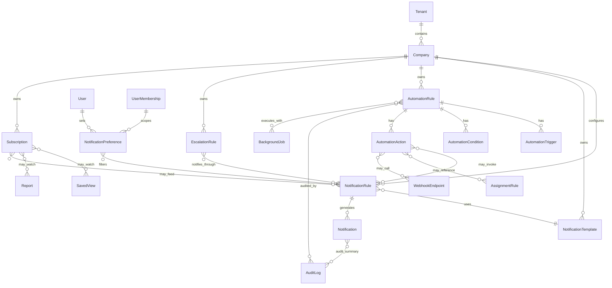
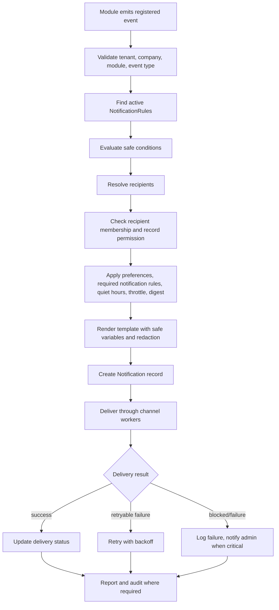
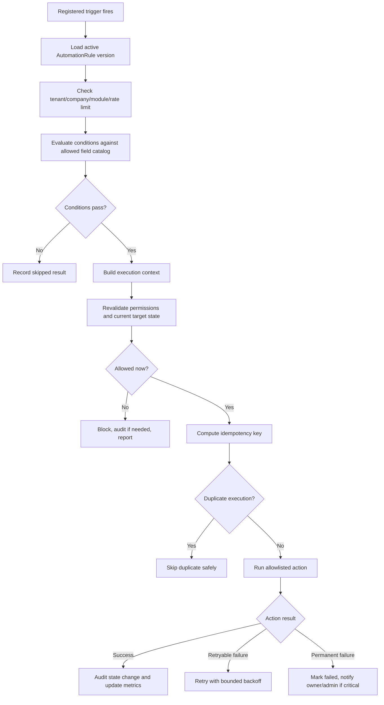

# 16_Notifications_Automation.md

## 1. Document Metadata

| Field | Value |
| --- | --- |
| Document name | `16_Notifications_Automation.md` |
| Phase | Phase 16 |
| Phase name | Notifications and Automation |
| Document type | Phase-level product, data, workflow, UX, API, permissions, audit, reporting, and implementation specification |
| Status | Draft for implementation planning |
| Prepared for | Product, engineering, design, QA, implementation, admin/security, reporting, integration, and rollout teams |
| Source of truth | `00_Master_Platform_Documentation.md`, `00_Global_Documentation_Rules.md`, `00_Global_Domain_Model.md`, `00_Global_Decisions_Register.md`, and Phase 01 through Phase 15 summary files |
| Last updated | 2026-05-09 |

## 2. Phase Purpose

Phase 16 defines the official Notifications and Automation foundation for the platform. It specifies how the product generates user-facing notifications, controls notification templates and preferences, supports configurable business automation, handles escalation, manages subscriptions, and governs cross-module automation safely across CRM, outbound sales, calendar/tasks, field operations, inventory, dispatch, fleet, service, reporting, integrations, offline sync, and admin/security workflows.

This phase is intentionally a control layer. It does not replace module workflows, does not replace `Notification`, `Reminder`, `AssignmentRule`, `AuditLog`, `BackgroundJob`, `WebhookDelivery`, or operational exception entities defined by prior phases, and does not create an unrestricted workflow scripting engine. It creates strict, reusable rules so future phases can trigger notifications and automation without leaking data, bypassing permissions, over-notifying users, or creating duplicate automation concepts.

## 3. Phase Goals

1. Define canonical notification configuration, templates, preferences, delivery behavior, and inbox behavior.
2. Define canonical automation rule structure for safe cross-module event-driven and scheduled automations.
3. Define allowed triggers, conditions, actions, escalation steps, subscription patterns, and execution governance.
4. Ensure all notification and automation behavior respects tenant, company, module, role, record, preference, audit, security, integration, and offline constraints.
5. Provide implementation-ready requirements for APIs, UX, permissions, audit events, reporting, mobile/offline behavior, integrations, edge cases, and acceptance criteria.
6. Create a future-phase summary that later API/webhook/import/export, rollout, and final blueprint phases can use instead of rereading the full Phase 16 document.

## 4. Scope

In scope:

- Notification rules, templates, preferences, subscriptions, delivery status, notification inbox, unread counts, digest behavior, required notifications, and permission-safe content rendering.
- Automation rules with allowlisted triggers, conditions, actions, retries, dry runs, testing, activation, pausing, archiving, execution observability, throttling, and auditability.
- Escalation rules for unresolved exceptions, overdue work, failed syncs, security incidents, and operational alerts.
- Cross-module event governance for CRM, outbound, calendar/tasks, field, inventory, dispatch/logistics, fleet/device, service, reporting, QuickBooks/integrations, offline sync, and admin/security.
- Conceptual APIs, UX patterns, permission requirements, audit events, reports, mobile/offline impacts, and integration impacts.

## 5. Non-Goals

- Do not create Phase 17 API/webhook marketplace scope.
- Do not create a public workflow scripting language.
- Do not allow arbitrary code execution, raw database updates, or unrestricted external HTTP calls from automation.
- Do not create customer-facing portal notifications.
- Do not implement full marketing automation or outbound auto-sending beyond prior approved constraints.
- Do not automate LinkedIn actions inside LinkedIn.
- Do not replace `Reminder`, `AssignmentRule`, `ScheduledReport`, `WebhookDelivery`, `BackgroundJob`, `AuditLog`, `SecurityIncident`, `SyncJob`, `SyncOperation`, or module-specific exception entities.
- Do not bypass user preferences except for explicitly required security, compliance, and critical operational notifications.

## 6. Source-of-Truth Definitions

| Term | Definition | Source-of-truth rule |
| --- | --- | --- |
| Notification | Recipient-facing alert record. | Canonical Core/Notification entity; Phase 16 expands configuration and lifecycle. |
| Reminder | Calendar/task reminder instance or rule. | Reuse Phase 06; notification rules may deliver reminders but must not replace Reminder. |
| AssignmentRule | Assignment-specific rule configuration. | Reuse Phase 04; automation may call assignment behavior but must not replace it. |
| Automation | Controlled execution of allowlisted actions from approved triggers and conditions. | Phase 16 governs cross-module automation. |
| Escalation | Time/severity-based progression when work, exception, alert, or incident remains unresolved. | Use `EscalationRule`; do not create per-module escalation concepts. |
| Subscription | Explicit user/team/role/entity/saved-view/report watch relationship. | Use `Subscription`; distinguish from webhooks and notification preferences. |
| Required notification | A notification that cannot be fully disabled because it protects security, compliance, tenant safety, or critical operational recovery. | Must still respect permission-safe content and quiet-hour rules only where safe. |
| Digest | Bundled notification summary for high-volume events. | Must preserve permission checks for every included item. |

## 7. Canonical Entity Definitions

### 7.1 Entity Definition Matrix

| Entity | Purpose | Owner module | Scope | Tenant/company scoping | Key relationships | Lifecycle/statuses | Index considerations | Permissions impact | Audit requirements | Reporting impact | Future-phase impact |
| --- | --- | --- | --- | --- | --- | --- | --- | --- | --- | --- | --- |
| `NotificationRule` | Determines when notifications are generated from allowed events. | Notifications / Automation | Configuration | `tenant_id`, `company_id`, optional `module_key`, `entity_type` | `NotificationTemplate`, `NotificationPreference`, `AutomationRule`, users/teams/roles, related entity types | `draft`, `active`, `paused`, `archived` | Compound indexes on tenant/company/status/event/module/entity; unique active rule keys where needed | Admin-only manage; view by authorized admins | Create/update/activate/pause/archive/test audited | Rule volume and notification volume analytics | Future modules register events instead of creating duplicate rules |
| `NotificationTemplate` | Stores reusable channel-specific notification content. | Notifications / Automation | Configuration | `tenant_id`, `company_id`, optional locale/channel/module | `NotificationRule`, `Notification`, template variables | `draft`, `active`, `inactive`, `archived`, versioned | tenant/company/channel/template_key/version/status | Template manage permission required | Version, activate, test, archive audited | Template usage and failure analytics | Future channels reuse safe templates |
| `NotificationPreference` | Stores user/company notification preferences. | Notifications / Automation | User/company config | `tenant_id`, `company_id`, `user_id` or `user_membership_id` | User, UserMembership, NotificationRule, channels | `active`, `muted`, `archived` | tenant/company/user/module/event/channel | Users manage own; admins manage company defaults | User/admin updates audited when material | Preference coverage and opt-out analytics | Future modules use same preference record |
| `AutomationRule` | Configures allowlisted automation execution. | Notifications / Automation | Configuration | `tenant_id`, `company_id`, optional module/entity | `AutomationTrigger`, `AutomationCondition`, `AutomationAction`, `BackgroundJob`, `AuditLog` | `draft`, `active`, `paused`, `failed`, `archived` | tenant/company/status/trigger/action/next_run | Manage/test/activate permissions required | All config and high-impact executions audited | Automation health dashboards | Future API/webhooks/import/export must respect constraints |
| `AutomationTrigger` | Defines what starts an automation. | Notifications / Automation | Child/config | Inherits from AutomationRule | Event registry, RecurrenceRule, Subscription, module event | `draft`, `active`, `inactive`, `archived` if separate | tenant/company/rule/trigger_type/event_type | Manage through AutomationRule | Changes audited through rule | Trigger usage analytics | Future triggers must be registered |
| `AutomationCondition` | Defines safe boolean filters for rule execution. | Notifications / Automation | Child/config | Inherits from AutomationRule | Entity field catalog, related entity references | `draft`, `active`, `inactive`, `archived` if separate | rule/field/operator where separate | Manage through AutomationRule | Changes audited through rule | Skipped/blocked reporting | Future fields require catalog registration |
| `AutomationAction` | Defines approved side effects. | Notifications / Automation | Child/config | Inherits from AutomationRule | NotificationRule, AssignmentRule, Task, WebhookEndpoint, ReportRun, target entities | `draft`, `active`, `inactive`, `archived` if separate | rule/action_type/target_entity | Requires action-specific permissions | State-changing actions audited | Action volume/failure reporting | Future actions must be allowlisted |
| `EscalationRule` | Configures time/severity escalation. | Notifications / Automation | Configuration | `tenant_id`, `company_id`, optional module/entity | NotificationRule, AutomationRule, Task, User, Team, Role, source exception entities | `draft`, `active`, `paused`, `archived` | tenant/company/source_entity/severity/status | Admin manage; execution uses target permissions | Config and level reached audited | Time-to-acknowledge/resolve reports | Future modules reuse for escalation |
| `Subscription` | Stores follows/watches/subscriptions. | Notifications / Automation | User/team/role config | `tenant_id`, `company_id`, subscriber scope | User, Team, Role, target entity, SavedView, Report, Dashboard, NotificationRule | `active`, `paused`, `cancelled`, `archived` | tenant/company/subscriber/target/status; unique active subscription | Users manage own; admins manage company/team | Create/update/cancel audited if admin-managed or sensitive | Subscription engagement analytics | Future subscriptions reuse this entity |

### 7.2 Entity Field Requirements

All Phase 16 entities must include stable application `id`; must not expose MongoDB `_id`; must include `tenant_id`; company-scoped records must include `company_id`; must include created/updated timestamps and actor fields; must preserve status and version where configuration can affect behavior; and must support `external_refs` only for approved integration references.

#### NotificationRule Key Fields

| Field | Required | Notes |
| --- | --- | --- |
| `id` | Yes | Stable application ID. Recommended prefix: `nrul_`. |
| `tenant_id`, `company_id` | Yes | Required for scoping. |
| `name` | Yes | Human-readable admin label. |
| `event_type` | Yes | Must exist in registered event catalog. |
| `source_module` | Yes | Module emitting the event. |
| `target_entity_type` | Conditional | Required where event relates to a record. |
| `condition_group` | Optional | Uses safe condition catalog. |
| `recipient_strategy` | Yes | Owner, assignee, watcher, role, team, explicit users, supervisor, admin, integration owner. |
| `template_id` | Yes | Active or draft during testing. |
| `channels` | Yes | In-app baseline; other channels require provider and preference checks. |
| `priority` | Yes | `low`, `normal`, `high`, `critical`. |
| `throttle_policy` | Optional | Prevents noise and fan-out. |
| `digest_policy` | Optional | Bundling behavior for high-volume events. |
| `dedupe_key_template` | Optional | Supports idempotency. |
| `status` | Yes | `draft`, `active`, `paused`, `archived`. |

#### NotificationTemplate Key Fields

| Field | Required | Notes |
| --- | --- | --- |
| `template_key` | Yes | Stable key for rule selection. |
| `channel` | Yes | `in_app`, `email`, `push`, `sms`, `whatsapp`, `webhook`. |
| `locale` | Recommended | Defaults to company/user locale. |
| `subject_template` | Conditional | Required for email. |
| `title_template` | Yes | Short and permission-safe. |
| `body_template` | Yes | No unrestricted raw record dumps. |
| `allowed_variables` | Yes | Variables must come from safe variable catalog. |
| `redaction_policy` | Yes | Defines fallback text when data is inaccessible. |
| `deep_link_template` | Optional | Must resolve through permission-aware deep-link service. |
| `version` | Yes | Templates are versioned after activation. |

#### NotificationPreference Key Fields

| Field | Required | Notes |
| --- | --- | --- |
| `user_id` or `user_membership_id` | Yes | Preference applies to user/company context. |
| `module_key` | Optional | Applies to module-specific events when set. |
| `event_type` | Optional | Applies to event-specific preferences when set. |
| `channel_preferences` | Yes | Per-channel enable/disable/digest. |
| `priority_threshold` | Recommended | Minimum priority for immediate delivery. |
| `digest_frequency` | Optional | Immediate, hourly, daily, weekly, none. |
| `quiet_hours_start`, `quiet_hours_end`, `timezone` | Optional | Required when quiet hours enabled. |
| `muted_until_at` | Optional | Temporary mute. |
| `required_notification_exceptions` | Yes | Records required notifications that cannot be disabled. |

#### AutomationRule Key Fields

| Field | Required | Notes |
| --- | --- | --- |
| `trigger` | Yes | Single trigger for MVP unless recommended otherwise. |
| `conditions` | Optional | Safe condition group. |
| `actions` | Yes | One or more allowlisted actions with action-specific caps. |
| `execution_mode` | Yes | `synchronous_guarded`, `async_worker`, `scheduled_worker`; most are async. |
| `run_as_strategy` | Yes | `system_limited`, `creating_admin`, `record_owner`, or approved service actor. |
| `rate_limit_policy` | Yes | Prevents runaway execution. |
| `retry_policy` | Yes | Bounded retries for recoverable failures. |
| `idempotency_policy` | Yes | Required for all side effects. |
| `failure_policy` | Yes | Notify owner/admin, pause rule, skip action, or require manual review. |
| `last_run_status`, `last_run_at`, `next_run_at` | Recommended | Supports monitoring. |

#### EscalationRule Key Fields

| Field | Required | Notes |
| --- | --- | --- |
| `source_entity_type` | Yes | Example: `DeliveryException`, `SyncConflict`, `SecurityIncident`, `Task`, `WorkOrder`. |
| `source_statuses` | Yes | Statuses that remain eligible for escalation. |
| `severity` | Optional | Restricts escalation by severity. |
| `time_to_acknowledge_minutes` | Optional | Timer for first escalation. |
| `time_to_resolve_minutes` | Optional | Timer for further escalation. |
| `levels` | Yes | Ordered recipient/action levels. |
| `pause_on_statuses`, `stop_on_statuses` | Yes | Prevents stale escalation. |

#### Subscription Key Fields

| Field | Required | Notes |
| --- | --- | --- |
| `subscriber_type` | Yes | `user`, `team`, `role`. |
| `subscriber_user_id`, `subscriber_team_id`, `subscriber_role_key` | Conditional | Based on subscriber type. |
| `target_entity_type`, `target_entity_id` | Conditional | For record subscriptions. |
| `saved_view_id`, `report_id`, `dashboard_id` | Conditional | For view/report/dashboard subscriptions. |
| `event_types` | Optional | Limits events. |
| `channels` | Optional | Still subject to preferences. |
| `frequency` | Optional | Immediate or digest. |
| `status` | Yes | `active`, `paused`, `cancelled`, `archived`. |

## 8. Entity Lifecycle and Status Rules

| Entity | Creation | Active behavior | Pause/inactive behavior | Archive behavior | Deletion rule |
| --- | --- | --- | --- | --- | --- |
| `NotificationRule` | Created as draft by authorized admin. | Evaluates matching events and may create notifications. | Stops new notifications; existing notifications remain. | Hidden from normal builders but retained for audit/history. | Hard delete not allowed after activation. |
| `NotificationTemplate` | Created as draft. | Can render notifications for selected channels. | Cannot be selected by new active rules. | Retained for notification history. | Activated versions cannot be hard deleted. |
| `NotificationPreference` | Created from defaults or first user edit. | Applied during delivery. | Muted/paused preferences suppress configurable notifications. | Retained if needed for audit; user may reset to defaults. | Hard delete allowed only when user/member removed and retention allows. |
| `AutomationRule` | Created as draft and validated. | Runs when trigger and conditions match. | No new executions; active jobs may complete or be cancelled by policy. | Retained with execution history. | Hard delete not allowed after execution. |
| `AutomationTrigger` | Created inside rule. | Starts rule evaluation. | Disabled with parent rule. | Retained with parent version. | Same as parent rule. |
| `AutomationCondition` | Created inside rule. | Filters execution. | Disabled with parent rule. | Retained with parent version. | Same as parent rule. |
| `AutomationAction` | Created inside rule. | Performs allowlisted side effect. | Disabled with parent rule. | Retained with parent version. | Same as parent rule. |
| `EscalationRule` | Created as draft. | Evaluates unresolved source records and performs escalation levels. | Stops new escalation; open escalation state remains visible. | Retained for history. | Hard delete not allowed after execution. |
| `Subscription` | Created by user/admin/system. | Receives configured event notifications. | Suppresses subscription notifications. | Retained for history when audit-relevant. | User-owned subscriptions may be cancelled; history retained where required. |

Status values must use common configuration and notification states wherever possible. Automation must never continue executing from archived rules. Paused rules must not be triggered by backfilled events unless explicitly reactivated and backfill is approved.

## 9. Entity Relationship Rules

Rules:

- `NotificationRule` creates `Notification` records but does not replace `Notification`.
- `NotificationTemplate` renders content only through safe variables.
- `AutomationRule` may call a `NotificationRule` or create a `Notification` only through approved notification services.
- `AutomationRule` may reference `AssignmentRule` only for assignment behavior; it must not duplicate assignment logic.
- `EscalationRule` may use `NotificationRule`, `Task`, and approved assignment behavior.
- `Subscription` is user/team/role preference for watched events and is not the same as `WebhookEndpoint`.
- All relationships must include tenant/company checks. Cross-company notifications are forbidden unless a future approved global decision defines a safe multi-company admin scenario.

## 10. Workflow Requirements

### 10.1 Notification Generation Workflow

### 10.2 Automation Execution Workflow

### 10.3 Escalation Workflow

1. Source module creates or updates an eligible exception, incident, task, work order, sync failure, import/export failure, or alert.
2. Escalation service evaluates active `EscalationRule` records for source entity type, status, severity, company, module, and timers.
3. If the source record is in a stop status, escalation is cancelled.
4. If the source record is in a pause status, timers pause or defer according to rule configuration.
5. When a level is reached, the system performs allowlisted actions such as notify owner, notify supervisor, create task, assign team, mark priority, or create admin review item.
6. Each level reached must be observable and audit-relevant for critical operations.

## 11. Data Model Requirements

| ID | Requirement |
| --- | --- |
| DATA-16-001 | All Phase 16 entities must include `tenant_id`; company-scoped records must include `company_id`. |
| DATA-16-002 | MongoDB `_id` must not be exposed as the public API identifier. |
| DATA-16-003 | Configuration entities must use stable application IDs and versioning where activated versions affect behavior. |
| DATA-16-004 | Notification content must store rendered safe title/body for historical display plus safe source metadata needed for deep links and reporting. |
| DATA-16-005 | Notification records must not duplicate full source records or inaccessible sensitive fields. |
| DATA-16-006 | Automation conditions must use a safe field catalog, not arbitrary database queries. |
| DATA-16-007 | Automation actions must use an action catalog with action-specific payload schemas and permission requirements. |
| DATA-16-008 | Notification and automation execution must store enough status and error metadata for admin observability without exposing secrets. |
| DATA-16-009 | Template variables must be allowlisted and must define redaction behavior. |
| DATA-16-010 | Digest records may reference notification IDs or safe summaries but must revalidate permissions at render time. |
| DATA-16-011 | Notification preferences must support user-level settings and company default inheritance. |
| DATA-16-012 | Required notifications must be represented explicitly so users understand why they cannot disable them. |
| DATA-16-013 | Subscription uniqueness must prevent duplicate active subscriptions for the same subscriber/target/event scope. |
| DATA-16-014 | Escalation levels must be ordered and deterministic. |
| DATA-16-015 | Automation execution idempotency keys must include rule version, source event, target entity, action type, and relevant payload signature. |

### 11.1 Index Considerations

- `Notification`: `(tenant_id, company_id, recipient_user_id, status, created_at)`, `(tenant_id, company_id, recipient_user_id, read_at)`, `(tenant_id, company_id, related_entity_type, related_entity_id)`, `(tenant_id, company_id, priority, created_at)`.
- `NotificationRule`: `(tenant_id, company_id, status, event_type, source_module)`, `(tenant_id, company_id, module_key, target_entity_type, status)`.
- `NotificationTemplate`: `(tenant_id, company_id, template_key, channel, locale, version)`, `(tenant_id, company_id, status, channel)`.
- `NotificationPreference`: `(tenant_id, company_id, user_id, module_key, event_type)`, `(tenant_id, company_id, user_membership_id)`.
- `AutomationRule`: `(tenant_id, company_id, status, trigger.trigger_type)`, `(tenant_id, company_id, next_run_at, status)`, `(tenant_id, company_id, owner_user_id, status)`.
- `EscalationRule`: `(tenant_id, company_id, source_entity_type, status, severity)`.
- `Subscription`: `(tenant_id, company_id, subscriber_type, subscriber_user_id, status)`, unique active subscriber-target-event index.

## 12. API Requirements

| ID | Requirement |
| --- | --- |
| API-16-001 | Provide admin endpoints to list, read, create, update, validate, test, activate, pause, archive, and version `NotificationRule` records. |
| API-16-002 | Provide template endpoints to list, read, create, update, preview, validate, test, activate, archive, and view versions of `NotificationTemplate` records. |
| API-16-003 | Provide current-user endpoints to read and update `NotificationPreference` records for the active company context. |
| API-16-004 | Provide admin endpoints to manage company default notification preferences and required notification rules. |
| API-16-005 | Provide notification inbox endpoints for list, unread count, mark read, mark unread, dismiss, bulk read, and deep-link resolution. |
| API-16-006 | Provide automation endpoints to list, read, create, update, validate, dry-run, test, activate, pause, archive, retry, cancel, and view execution history for `AutomationRule` records. |
| API-16-007 | Provide read-only catalog endpoints for registered trigger types, event types, condition fields, operators, action types, template variables, recipient strategies, and channel capabilities. |
| API-16-008 | API responses must filter rules, templates, preferences, notifications, and execution history by tenant, company, module enablement, and permissions. |
| API-16-009 | Rule test and dry-run APIs must not perform real external delivery or state mutation unless explicitly requested by a permissioned admin with test mode labels. |
| API-16-010 | Activation APIs must fail when rules reference disabled modules, archived templates, unsupported event types, unsafe variables, missing providers, invalid recipients, or unauthorized actions. |
| API-16-011 | Delivery status APIs must expose safe status details without exposing provider secrets, tokens, raw webhook signing secrets, or protected customer data. |
| API-16-012 | Provide escalation rule endpoints to list, read, create, update, simulate, activate, pause, archive, and inspect level history. |
| API-16-013 | Provide subscription endpoints for follow, unfollow, pause, resume, list user subscriptions, and admin-manage team/company subscriptions. |
| API-16-014 | API writes must be idempotent where retries are expected, especially test sends, rule activation, automation action retries, and subscription creation. |
| API-16-015 | API errors must distinguish validation failure, permission denial, disabled module, missing provider, unsafe template, throttled execution, duplicate idempotency key, and archived target. |
| API-16-016 | Bulk operations must use `BackgroundJob` when they may affect many rules, preferences, subscriptions, or notifications. |
| API-16-017 | Public API/webhook phases must reuse Phase 16 event/action catalogs and must not create ungoverned automation triggers. |
| API-16-018 | API endpoints must support pagination, filtering, sorting, and saved-view compatibility where list views exist. |
| API-16-019 | APIs must return stable IDs and never return MongoDB `_id`. |
| API-16-020 | APIs must generate audit events for configuration changes and high-impact execution controls. |

### 12.1 Conceptual Endpoint Map

| Method | Path | Purpose | Permission |
| --- | --- | --- | --- |
| GET | `/api/v1/notifications` | List notification inbox items. | `notifications.notification.view` |
| POST | `/api/v1/notifications/{notification_id}/read` | Mark notification read. | `notifications.notification.manage_own` |
| POST | `/api/v1/notifications/bulk-read` | Bulk mark read. | `notifications.notification.manage_own` |
| GET | `/api/v1/notification-rules` | List rules. | `notifications.rule.view` |
| POST | `/api/v1/notification-rules` | Create rule. | `notifications.rule.manage` |
| POST | `/api/v1/notification-rules/{rule_id}/test` | Test rule. | `notifications.rule.manage` |
| POST | `/api/v1/notification-rules/{rule_id}/activate` | Activate rule. | `notifications.rule.manage` |
| GET | `/api/v1/notification-templates` | List templates. | `notifications.template.view` |
| POST | `/api/v1/notification-templates/{template_id}/preview` | Preview template. | `notifications.template.view` |
| GET | `/api/v1/notification-preferences/me` | Read own preferences. | `notifications.preference.view_own` |
| PUT | `/api/v1/notification-preferences/me` | Update own preferences. | `notifications.preference.manage_own` |
| GET | `/api/v1/automation-rules` | List automation rules. | `automation.rule.view` |
| POST | `/api/v1/automation-rules/{rule_id}/dry-run` | Dry-run rule. | `automation.rule.test` |
| POST | `/api/v1/automation-rules/{rule_id}/activate` | Activate rule. | `automation.rule.activate` |
| GET | `/api/v1/automation-catalog` | Read triggers/conditions/actions catalog. | `automation.rule.view` |
| GET | `/api/v1/escalation-rules` | List escalation rules. | `automation.escalation.view` |
| POST | `/api/v1/subscriptions` | Subscribe to target. | `automation.subscription.manage_own` |

## 13. UI / UX Requirements

| ID | Requirement |
| --- | --- |
| UX-16-001 | Provide a notification inbox accessible from global navigation on desktop and mobile. |
| UX-16-002 | Notification inbox must show unread count, priority, source module, timestamp, safe title/body, status, and primary action link. |
| UX-16-003 | Notification inbox must support filters for unread, dismissed, failed, priority, module, related entity, assignment, escalation, integration failure, and sync conflict. |
| UX-16-004 | Notification detail must show safe source context, delivery status, timestamp, related record link if accessible, and fallback copy if access was revoked. |
| UX-16-005 | Notification preferences screen must show per-channel controls, digest frequency, quiet hours, required notification explanations, and company-default inheritance. |
| UX-16-006 | Users must see disabled controls with clear explanations when a notification is required or when a channel is not configured. |
| UX-16-007 | Admin notification rule builder must use a step-based flow: event, conditions, recipients, template/channel, throttle/digest, preview/test, activate. |
| UX-16-008 | Rule builder must show warnings for high-volume events, broad recipient scopes, disabled modules, missing providers, and unsafe variables. |
| UX-16-009 | Template builder must provide channel previews, safe variable picker, redaction preview, validation results, fallback template selection, and version history. |
| UX-16-010 | Automation builder must use a step-based flow: trigger, conditions, actions, guards, rate limits, failure policy, dry run, activate. |
| UX-16-011 | Automation dry run must show how many records/events would match and which actions would be attempted without mutating records. |
| UX-16-012 | Automation execution history must show success, skipped, blocked, failed, retrying, cancelled, duration, actor context, and safe error messages. |
| UX-16-013 | Escalation builder must support ordered levels, timers, recipient strategies, pause/stop statuses, and simulation preview. |
| UX-16-014 | Record detail pages must expose subscribe/unsubscribe controls where subscriptions are enabled and permission allows. |
| UX-16-015 | Saved views and reports must expose subscription controls where future report/view alerts are enabled. |
| UX-16-016 | Empty states must explain that no notifications, rules, automations, escalations, or subscriptions exist and provide permission-aware calls to action. |
| UX-16-017 | Error states must distinguish no permission, disabled module, missing provider, invalid template, archived target, failed delivery, and rate-limited execution. |
| UX-16-018 | Admin monitoring must show failed, blocked, skipped, throttled, retrying, and paused automation/notification health. |
| UX-16-019 | Mobile notification UX must prioritize assigned work, reminders, escalations, offline conflicts, and critical operational events. |
| UX-16-020 | Deep links from notifications must route users to accessible records or show a safe permission/record unavailable state. |
| UX-16-021 | Bulk mark-read and dismiss actions must be available and safe. |
| UX-16-022 | Critical notifications must be visually distinguishable but not use alarmist copy for normal operations. |
| UX-16-023 | Automation and notification builders must include audit history panels for configuration changes. |
| UX-16-024 | Permissioned admins must be able to test notifications using sample payloads without sending to real recipients unless explicitly selected. |
| UX-16-025 | Rule lists must support saved views, filters, sorting, status chips, owner, module, last run, next run, and failure indicators. |

### 13.1 Screens and Components

| Screen/component | Required behavior |
| --- | --- |
| Global notification bell | Shows unread count for active company context; count must not include inaccessible items. |
| Notification drawer | Quick view of newest notifications with mark read/dismiss and safe deep links. |
| Notification inbox page | Full list with filters, saved views, bulk actions, status tabs, and related record links. |
| Preference center | User controls for channels, quiet hours, digest, modules, event types, required notifications. |
| Admin notification rules | Table plus builder for notification rules. |
| Template library | Versioned templates with channel previews and validation state. |
| Automation rules | Table plus builder, dry-run modal, execution history. |
| Escalation rules | Timer/level builder and simulation. |
| Subscription controls | Follow/unfollow button and subscription options on supported records/views/reports. |
| Admin health monitor | Failed and risky notification/automation state queue. |

## 14. Search, Filters, and Saved Views

- Notification inbox must support saved views for operational roles such as dispatcher, warehouse manager, service manager, integration admin, and security admin.
- Admin rule lists must support filters by module, event type, status, owner, last run status, channel, priority, provider, and failure state.
- Automation execution views must support filters by rule, action type, source entity, status, date range, actor context, and error type.
- Template library must support filters by channel, module, locale, status, version, and template key.
- Subscription list must support filters by subscriber, target type, status, frequency, and channel.
- Search results must respect tenant, company, module, role, record access, and disabled module rules.
- Saved views must reuse Phase 03 `SavedView`; Phase 16 must not create separate saved filter entities.

## 15. Permissions and Access Control

| ID | Requirement |
| --- | --- |
| PERM-16-001 | All notification and automation APIs must enforce backend permission checks; frontend hiding is not sufficient. |
| PERM-16-002 | Users may view their own notifications only when their membership and company context remain valid. |
| PERM-16-003 | Notification content must be redacted or hidden when the related record becomes inaccessible after notification creation. |
| PERM-16-004 | Users may manage their own configurable preferences but cannot disable required security/compliance/critical operational notifications. |
| PERM-16-005 | Company admins with permission may manage company notification defaults. |
| PERM-16-006 | Only authorized admins may create, update, activate, pause, test, or archive notification rules. |
| PERM-16-007 | Only authorized admins may create, update, activate, pause, test, or archive notification templates. |
| PERM-16-008 | Only authorized admins may create, update, activate, pause, test, or archive automation rules. |
| PERM-16-009 | Automation rule activation requires permission for every configured action class, not only generic automation management. |
| PERM-16-010 | Automation execution must revalidate action permission and target access at execution time. |
| PERM-16-011 | Automation running as system actor must be limited by company, module, action allowlist, and configured guardrails. |
| PERM-16-012 | Users may subscribe to records only if they can view the record. |
| PERM-16-013 | Admin-created team/role/company subscriptions require `automation.subscription.manage_company`. |
| PERM-16-014 | Escalation rule management requires escalation-specific admin permission. |
| PERM-16-015 | Execution history visibility must not expose sensitive payloads, tokens, secrets, or inaccessible record data. |
| PERM-16-016 | Cross-company notification delivery is forbidden unless explicitly approved in a later global decision. |
| PERM-16-017 | Deactivated users or inactive memberships must not receive new notifications except admin/security recovery flows explicitly designed for that case. |
| PERM-16-018 | Provider configuration errors must be visible only to users with integration/admin permissions. |
| PERM-16-019 | Templates with sensitive variables require admin permission and redaction review before activation. |
| PERM-16-020 | Security incident notifications must follow Phase 15 security permissions and must avoid leaking incident details to unauthorized users. |

## 16. Notifications

| ID | Requirement |
| --- | --- |
| NOTIF-16-001 | In-app notifications are the baseline channel for Phase 16. |
| NOTIF-16-002 | Email notifications are allowed only when provider configuration and user/company preferences allow them, except required critical notifications. |
| NOTIF-16-003 | Push notifications are future-capable and must use the same rules, templates, preferences, and permission checks when implemented. |
| NOTIF-16-004 | SMS and WhatsApp notifications require explicit provider configuration, consent/compliance controls, templates, and user preferences. |
| NOTIF-16-005 | Webhook/system notification actions must use existing `WebhookEndpoint` and `WebhookDelivery` foundations. |
| NOTIF-16-006 | Notifications must never reveal inaccessible record data in title, body, preview, metadata, digest, email subject, push preview, SMS body, or webhook payload. |
| NOTIF-16-007 | Notification generation must use idempotency/deduplication keys for repeated events. |
| NOTIF-16-008 | Notification delivery must support queued, sent, delivered, read, failed, dismissed, blocked, and retried states where channel supports them. |
| NOTIF-16-009 | Notification preferences must be applied before optional delivery. |
| NOTIF-16-010 | Required notifications must explain why they cannot be disabled. |
| NOTIF-16-011 | High-volume events must support throttle, digest, or summary behavior. |
| NOTIF-16-012 | Raw telemetry events such as `LocationPing` must not directly generate user notifications. |
| NOTIF-16-013 | Notifications should link to related records where possible and safe. |
| NOTIF-16-014 | Notifications for deleted, archived, or inaccessible records must show safe unavailable states. |
| NOTIF-16-015 | Failed critical notification delivery must be observable by admins and may itself trigger admin notification. |
| NOTIF-16-016 | Digest generation must revalidate permissions for every included item at send time. |
| NOTIF-16-017 | Quiet hours should defer non-critical notifications but must not suppress required emergency/security notifications where policy says immediate delivery. |
| NOTIF-16-018 | Notification rendering must use versioned templates. |
| NOTIF-16-019 | Notification rules must include recipient resolution strategies that avoid duplicate notifications to the same user for the same event. |
| NOTIF-16-020 | Notification deletion by user should be represented as dismissal/archive, not deletion of audit-relevant delivery history. |

### 16.1 Notification Trigger Catalog

| Trigger source | Example events | Notes |
| --- | --- | --- |
| CRM | Lead assigned, opportunity overdue, account owner changed, duplicate review needed | Must use CRM permissions. |
| Outbound | Sequence step due, reply received, bounce/opt-out, campaign conversion | No unauthorized auto-sending. |
| Calendar/Tasks | Task due, task overdue, appointment changed, reminder due | Reuse `Reminder`. |
| Field/Site | Site visit assigned, check-in missing, job request approved, field note requires review | Offline-safe event handling required. |
| Inventory | Low stock, pick ticket blocked, transfer delayed, adjustment requires approval | Based on derived alerts/events. |
| Dispatch/Logistics | Route changed, stop exception, proof missing, handoff overdue | Dispatcher and driver preferences differ. |
| Fleet | Speed alert, stop alert, device health issue, geofence exception | Derived alerts only, not raw pings. |
| Service | Work order assigned, parts unavailable, maintenance due, labor approval needed | Reuse WorkOrder/Task. |
| Reporting | Scheduled report ready/failed, dashboard refresh failed | Reuse `ScheduledReport` and `ReportRun`. |
| Integrations | QuickBooks sync failed, webhook failed, provider token expired | Admin-visible failures required. |
| Offline sync | Conflict, failed upload, blocked queued action | Mobile and admin visibility. |
| Admin/Security | Security incident, high-risk setting changed, access review due, backup/restore failed | Required or high-priority. |

## 17. Audit Logging

| ID | Requirement |
| --- | --- |
| AUDIT-16-001 | Creating, updating, activating, pausing, archiving, and testing notification rules must create `AuditLog` entries. |
| AUDIT-16-002 | Creating, updating, versioning, activating, archiving, and testing templates must create `AuditLog` entries. |
| AUDIT-16-003 | Admin changes to user/company notification preferences must be audited. |
| AUDIT-16-004 | User changes to preferences should be auditable where required for required notifications or compliance-sensitive channels. |
| AUDIT-16-005 | Creating, updating, activating, pausing, archiving, dry-running, and testing automation rules must be audited. |
| AUDIT-16-006 | Automation executions that mutate records, create tasks, assign work, call webhooks, send external messages, or escalate incidents must be audited. |
| AUDIT-16-007 | Blocked automation executions due to permission, disabled module, archived target, or unsafe payload must be auditable when operationally significant. |
| AUDIT-16-008 | Escalation rule changes and level-reached events must be audited for critical source entities. |
| AUDIT-16-009 | Admin-created or company/team subscriptions must be audited. |
| AUDIT-16-010 | Failed critical notification delivery must create audit or admin-visible operational events. |
| AUDIT-16-011 | Audit logs must not store provider secrets, tokens, raw credentials, or excessive notification payloads. |
| AUDIT-16-012 | Audit entries must include rule ID, rule version, actor/run-as context, source event, target entity, action type, outcome, and safe error category where applicable. |

## 18. Reporting and Analytics Impact

| ID | Requirement |
| --- | --- |
| REPORT-16-001 | Provide notification volume reporting by module, event type, channel, priority, status, and recipient role/team/user. |
| REPORT-16-002 | Provide notification delivery health reporting for queued, delivered, read, dismissed, failed, blocked, retried, bounced, and throttled notifications. |
| REPORT-16-003 | Provide automation execution reporting by rule, trigger, action, status, duration, skip reason, failure reason, and retry count. |
| REPORT-16-004 | Provide escalation reporting for time to acknowledge, time to resolve, level reached, source entity type, severity, and unresolved count. |
| REPORT-16-005 | Provide admin/security reporting for high-risk automation changes and critical delivery failures. |
| REPORT-16-006 | Provide preference adoption reporting for enabled channels, digest usage, quiet hours, and mute patterns. |
| REPORT-16-007 | Reporting must reuse Phase 12 dashboards, reports, report definitions, report runs, metric definitions, and rollup snapshots where needed. |
| REPORT-16-008 | Report datasets must redact notification content or payload details according to permissions. |
| REPORT-16-009 | Automation health must be eligible for admin dashboards and rollout readiness checks. |
| REPORT-16-010 | Notification fatigue metrics should identify users/rules/modules producing excessive noise. |

## 19. Mobile and Offline Impact

| ID | Requirement |
| --- | --- |
| OFFLINE-16-001 | Mobile users must be able to view cached recent notifications relevant to assigned work where safe. |
| OFFLINE-16-002 | Mark-read/dismiss actions may queue offline and sync through `OfflineActionQueueItem`. |
| OFFLINE-16-003 | Offline preference edits are not required for MVP and should require connectivity unless explicitly supported later. |
| OFFLINE-16-004 | Offline notifications generated locally must be clearly distinguished from server-confirmed notifications if implemented. |
| OFFLINE-16-005 | Server-generated notification state remains source of truth. |
| OFFLINE-16-006 | Offline sync conflicts, blocked queued actions, failed attachment uploads, and permission revalidation failures must be eligible for mobile notifications. |
| OFFLINE-16-007 | Mobile deep links from notifications must handle missing local cache by fetching when online or showing safe unavailable states when offline. |
| OFFLINE-16-008 | Push notification support must not assume the record is available offline. |
| OFFLINE-16-009 | Notification delivery to mobile must respect company context and avoid cross-company leakage on shared devices. |
| OFFLINE-16-010 | Required critical notifications may be queued for delivery when device reconnects if real-time delivery fails. |

## 20. Integration Impact

| ID | Requirement |
| --- | --- |
| INT-16-001 | Email provider integration must support safe template rendering, provider delivery status, bounce/failure visibility, and retry constraints. |
| INT-16-002 | SMS/WhatsApp provider integration must require consent/compliance checks, provider configuration, channel templates, and opt-out handling. |
| INT-16-003 | Push notification provider integration must support device/session awareness and revocation. |
| INT-16-004 | Webhook automation actions must use `WebhookEndpoint` and `WebhookDelivery`; they must not create a separate outbound webhook mechanism. |
| INT-16-005 | QuickBooks sync failures and provider token issues must be eligible for admin notifications and escalation. |
| INT-16-006 | Import/export job failures must be eligible for owner/admin notifications. |
| INT-16-007 | Scheduled report delivery must respect notification preferences and report permissions. |
| INT-16-008 | Provider secrets must never be exposed in notification content, templates, execution history, audit logs, or reports. |
| INT-16-009 | External delivery failures must be observable through admin health screens and reports. |
| INT-16-010 | Future public API and webhook phases must respect automation trigger/action allowlists and idempotency rules. |

## 21. Security Considerations

- Notification content is a data exposure surface. All content must be rendered using safe variables and permission checks.
- Notification metadata must be treated as sensitive when it references customers, routes, locations, GPS alerts, security incidents, exports, or integration failures.
- Automation is a high-risk capability because it can mutate records and trigger external delivery. It requires allowlists, permission revalidation, rate limits, idempotency, and audit logs.
- System actor execution must be narrowly scoped and traceable.
- External channels must not leak secrets or unauthorized data.
- Rule builders must not expose raw query language, arbitrary code, or unsanitized template execution.
- Security-critical notifications must preserve visibility to authorized admins even if normal preferences are muted.
- All provider errors shown to users must be sanitized.
- Execution history must distinguish safe error category from sensitive provider response payload.

## 22. Edge Cases

| # | Edge case | Required behavior |
| --- | --- | --- |
| 1 | User loses access after notification created. | Deep link shows safe unavailable state; content may be redacted on view. |
| 2 | User belongs to multiple companies. | Notifications scoped to active company or clearly separated by company without leakage. |
| 3 | Recipient is deactivated before delivery. | Suppress delivery and log blocked status where important. |
| 4 | Rule points to archived template. | Activation fails; active rule is paused or flagged. |
| 5 | Template variable becomes unsafe after field permissions change. | Validation fails and rule/template requires review. |
| 6 | High-volume trigger emits thousands of events. | Throttle, digest, or block according to rule policy. |
| 7 | Same user matches owner, watcher, and role recipient. | Deduplicate notification per event/rule. |
| 8 | Quiet hours overlap critical incident. | Required critical notification bypasses defer policy if configured. |
| 9 | Webhook action fails repeatedly. | Bounded retries, delivery record, admin-visible failure. |
| 10 | Automation action succeeds but audit write fails. | Treat as critical platform error; surface to admin monitoring. |
| 11 | Automation rule paused while job is running. | Running job follows cancellation/completion policy and records outcome. |
| 12 | Source record status changes before escalation fires. | Revalidate status and skip/cancel if stop status reached. |
| 13 | Offline user marks notification read twice. | Idempotent sync; no duplicate errors. |
| 14 | Digest includes a record user no longer can access. | Exclude or redact item at digest render time. |
| 15 | Provider missing for email/SMS/push. | Channel disabled with clear admin error; in-app still available. |
| 16 | Automation condition references deleted custom field. | Rule becomes invalid and cannot activate until fixed. |
| 17 | Rule creates recursive event loop. | Detect loop using execution context and suppress with failure warning. |
| 18 | Automation tries to mutate locked/closed record. | Revalidate workflow state and block action. |
| 19 | Required notification preference is disabled by admin import. | Import validation rejects or flags exception. |
| 20 | Template renders empty required field. | Use fallback content or block delivery depending template policy. |
| 21 | External provider returns sensitive error payload. | Store sanitized category; raw payload restricted or discarded. |
| 22 | Subscription target is archived. | Pause/cancel subscription and notify subscriber if useful. |
| 23 | Rule owner leaves company. | Rule remains active but admin monitoring flags missing owner. |
| 24 | Tenant/company module disabled after rule activation. | Related rules pause or skip execution. |
| 25 | Scheduled automation crosses daylight-saving/timezone boundary. | Use configured timezone and deterministic next-run calculation. |

## 23. Business Requirements

| ID | Requirement |
| --- | --- |
| BR-16-001 | The platform must provide useful, configurable, permission-aware notifications across modules. |
| BR-16-002 | The platform must prevent notification fatigue through preferences, throttling, digests, and rule governance. |
| BR-16-003 | The platform must support critical operational and security notifications that cannot be fully disabled. |
| BR-16-004 | The platform must support admin-configurable notification rules without requiring code changes for every event. |
| BR-16-005 | The platform must support reusable notification templates per channel and locale. |
| BR-16-006 | The platform must support user notification preferences and company defaults. |
| BR-16-007 | The platform must support safe cross-module automation for repetitive operational actions. |
| BR-16-008 | Automation must reduce manual follow-up without removing operator control from complex workflows. |
| BR-16-009 | The platform must support escalation for unresolved exceptions, overdue work, sync failures, and security incidents. |
| BR-16-010 | The platform must support subscriptions/follows for records, saved views, reports, and operational event streams. |
| BR-16-011 | The platform must expose automation and notification failures to admins. |
| BR-16-012 | The platform must support reporting on notification volume, delivery health, automation execution, and escalation performance. |
| BR-16-013 | The platform must preserve tenant/company isolation in all notification and automation behavior. |
| BR-16-014 | The platform must make future public API, webhook, import/export, rollout, and final blueprint work respect automation event/action constraints. |
| BR-16-015 | The platform must support mobile field users with reliable notification handling for assigned work, reminders, and offline conflicts. |
| BR-16-016 | The platform must support integration failure notifications for QuickBooks, webhooks, imports, exports, scheduled reports, and provider credentials. |
| BR-16-017 | The platform must provide strict governance for external-channel delivery. |
| BR-16-018 | The platform must maintain auditability for configuration changes and high-impact automation executions. |

## 24. Functional Requirements

| ID | Requirement |
| --- | --- |
| FR-16-001 | Users must have an in-app notification inbox. |
| FR-16-002 | Users must be able to mark notifications as read/unread. |
| FR-16-003 | Users must be able to dismiss configurable notifications. |
| FR-16-004 | Users must be able to filter notifications by status, module, priority, event type, and related record where allowed. |
| FR-16-005 | Users must be able to manage their notification preferences. |
| FR-16-006 | Admins must be able to define company default notification preferences. |
| FR-16-007 | Admins must be able to create notification rules. |
| FR-16-008 | Admins must be able to test notification rules with safe sample payloads. |
| FR-16-009 | Admins must be able to activate, pause, and archive notification rules. |
| FR-16-010 | Admins must be able to create and version notification templates. |
| FR-16-011 | Templates must validate variables before activation. |
| FR-16-012 | Notification rendering must support redaction fallback. |
| FR-16-013 | Notification generation must deduplicate recipient matches. |
| FR-16-014 | Notification delivery must apply preferences and required-notification exceptions. |
| FR-16-015 | Notification delivery must support provider failure tracking where external channels are used. |
| FR-16-016 | Admins must be able to create automation rules from registered triggers. |
| FR-16-017 | Admins must be able to select safe conditions from a field/operator catalog. |
| FR-16-018 | Admins must be able to select allowlisted actions from an action catalog. |
| FR-16-019 | Admins must be able to dry-run automation rules before activation. |
| FR-16-020 | Automation activation must validate trigger, conditions, actions, permissions, providers, modules, and templates. |
| FR-16-021 | Automation execution must revalidate current state and permissions. |
| FR-16-022 | Automation execution must support idempotency and bounded retries. |
| FR-16-023 | Automation must record skipped, blocked, failed, retrying, and succeeded outcomes. |
| FR-16-024 | Admins must be able to review automation execution history. |
| FR-16-025 | Admins must be able to retry or cancel eligible failed automation executions. |
| FR-16-026 | Admins must be able to create escalation rules. |
| FR-16-027 | Escalation rules must support ordered levels and timers. |
| FR-16-028 | Escalation execution must stop when source record reaches configured stop status. |
| FR-16-029 | Users must be able to subscribe/unsubscribe from supported records. |
| FR-16-030 | Users must be able to subscribe to supported saved views/reports when permission allows. |
| FR-16-031 | Admins must be able to create team or role subscriptions. |
| FR-16-032 | Notification and automation lists must support search, filters, sorting, pagination, and saved views. |
| FR-16-033 | Failed critical notifications must be visible in admin health monitoring. |
| FR-16-034 | Disabled-module events must not trigger rules. |
| FR-16-035 | Archived/deleted records must not be mutated by automation. |
| FR-16-036 | Rule builders must prevent recursive event loops where detectable. |
| FR-16-037 | High-volume triggers must require throttle or digest configuration. |
| FR-16-038 | Required notifications must be clearly marked in preferences. |
| FR-16-039 | Automation actions that call webhooks must use existing webhook delivery infrastructure. |
| FR-16-040 | Scheduled automation must calculate next run using configured timezone. |

## 25. Non-Functional Requirements

| ID | Requirement |
| --- | --- |
| NFR-16-001 | Notification generation must be reliable and should not block primary user workflows. |
| NFR-16-002 | Automation execution should run asynchronously through workers unless a guarded synchronous check is explicitly required. |
| NFR-16-003 | The system must tolerate duplicate events through idempotency. |
| NFR-16-004 | The system must support bounded retries with backoff for transient delivery and execution failures. |
| NFR-16-005 | Notification and automation processing must preserve tenant/company isolation. |
| NFR-16-006 | Notification inbox queries must remain performant through appropriate indexes and pagination. |
| NFR-16-007 | High-volume event handling must avoid queue overload through throttling and batching. |
| NFR-16-008 | Template rendering must be deterministic and safe. |
| NFR-16-009 | Automation condition evaluation must be explainable to admins. |
| NFR-16-010 | Execution history must be retained according to retention policy. |
| NFR-16-011 | Provider failures must be observable without leaking secrets. |
| NFR-16-012 | Rule activation validation must fail fast with actionable errors. |
| NFR-16-013 | Mobile notification interactions must remain usable under weak connectivity. |
| NFR-16-014 | Notification preference updates must apply consistently across channels. |
| NFR-16-015 | Critical admin/security notifications must have higher delivery reliability expectations than low-priority informational notifications. |
| NFR-16-016 | Automation action execution must be rate-limited by tenant/company/rule/action type. |
| NFR-16-017 | Rule builders must remain usable for non-technical admins and must not expose raw database concepts. |
| NFR-16-018 | Reporting rollups for notification and automation health should avoid expensive live aggregation where volume is high. |

## 26. User Stories

### Company Admin

- As a Company Admin, I want to configure which events generate notifications so my users receive useful alerts without noise.
- As a Company Admin, I want to define company notification defaults so onboarding is consistent.
- As a Company Admin, I want to test notification rules and templates before activation so I do not send confusing messages.
- As a Company Admin, I want to see failed deliveries and automation failures so I can fix configuration problems.

### Operations Manager / Dispatcher

- As an Operations Manager, I want dispatch exceptions to notify the correct dispatcher, driver, or supervisor so delays are handled quickly.
- As a Dispatcher, I want escalations when stops remain unresolved so I do not miss critical route problems.
- As a Dispatcher, I want to subscribe to saved views for late stops so I can monitor the work queue.

### Sales Manager / Sales Rep

- As a Sales Manager, I want lead assignment and overdue opportunity notifications so pipeline follow-up does not stall.
- As a Sales Rep, I want sequence-step and follow-up reminders without being spammed by every low-value update.
- As a Sales Rep, I want notification deep links to take me to the relevant lead, contact, account, opportunity, or task.

### Field User / Driver / Technician

- As a Field User, I want mobile notifications for assigned work, changed schedules, and offline sync conflicts so I can act while on the road.
- As a Driver, I want route/stop exception notifications that are concise and safe on mobile.
- As a Technician, I want work order and parts availability notifications so I can prepare before arriving.

### Warehouse Manager

- As a Warehouse Manager, I want low-stock, transfer delay, and pick-blocked notifications so I can resolve inventory issues quickly.
- As a Warehouse Manager, I want escalations for unresolved inventory exceptions so stock problems are not hidden.

### Integration Admin / Finance Admin

- As an Integration Admin, I want QuickBooks, webhook, scheduled report, import, and export failures to notify responsible admins.
- As a Finance Admin, I want failed invoice/customer/item sync notifications without exposing accounting details to unauthorized users.

### Security Admin / Super Admin

- As a Security Admin, I want required notifications for high-risk security and admin events.
- As a Security Admin, I want audit history for automation rule changes and critical notification failures.
- As a Super Admin, I want tenant-safe monitoring of automation and notification health without crossing company data boundaries unnecessarily.

## 27. Recommended Decisions

| ID | Decision | Rationale |
| --- | --- | --- |
| RD-16-001 | Model `AutomationTrigger`, `AutomationCondition`, and `AutomationAction` as embedded subdocuments inside `AutomationRule` for MVP, while allowing future extraction if execution volume requires it. | Keeps MVP simpler while preserving canonical names and API shape. |
| RD-16-002 | Use in-app notifications as required baseline channel before external channels. | Reduces provider dependency and supports consistent inbox behavior. |
| RD-16-003 | Require dry-run before first activation of high-impact automation rules. | Reduces accidental broad mutations or notification storms. |
| RD-16-004 | Require throttle or digest policy for high-volume event types. | Prevents notification fatigue and queue overload. |
| RD-16-005 | Treat automation actions that send external messages, call webhooks, export data, or mutate high-risk records as high-impact actions requiring stricter permissions and audit. | Protects tenant data and operational integrity. |
| RD-16-006 | Store sanitized execution history through `BackgroundJob`, `AuditLog`, and reporting rollups for MVP, and defer a dedicated `AutomationExecution` entity unless needed. | Avoids unnecessary entity expansion while preserving observability. |
| RD-16-007 | Use company timezone for default digests but allow user preference timezone where configured. | Balances operational consistency with user preference. |

## 28. Open Questions

| ID | Question | Impact |
| --- | --- | --- |
| OQ-16-001 | Which email, SMS/WhatsApp, and mobile push providers will be selected? | Affects provider-specific delivery status, retries, templates, consent, and cost controls. |
| OQ-16-002 | Should notification digests follow company timezone, user timezone, or per-preference timezone by default? | Affects scheduled report and digest timing. |
| OQ-16-003 | Will customer-facing portal notifications be introduced later? | Affects template audience, privacy, and subscription model. |
| OQ-16-004 | Should a dedicated `AutomationExecution` entity be introduced later? | Affects reporting, retention, and execution history scale. |
| OQ-16-005 | Which automation actions require admin approval before activation? | Affects UX, permissions, and audit. |
| OQ-16-006 | What are final retention periods for read/dismissed notifications and execution logs? | Affects storage, reporting, and compliance. |
| OQ-16-007 | Should AI-assisted automation suggestions be allowed in a later phase? | Affects safety, review, and approval controls. |

## 29. Dependencies

| Prior phase | Dependency |
| --- | --- |
| Phase 01 | Unified product scope, notifications as platform-level capability, offline-friendly and audit-aware principles. |
| Phase 02 | Tenant, Company, User, UserMembership, Role, Permission, Session, module enablement, backend authorization. |
| Phase 03 | Notification, AuditLog, FileAttachment, SavedView, SearchIndexRecord, ImportJob, ExportJob, SettingsDocument, BackgroundJob, ApiKey, WebhookEndpoint, WebhookDelivery. |
| Phase 04 | CRM entities and AssignmentRule. |
| Phase 05 | Outbound events, manual activity constraints, opt-out/compliance context. |
| Phase 06 | Task, CalendarEvent, Appointment, Reminder, RecurrenceRule. |
| Phase 07 | Site, SiteVisit, JobRequest, Job, field notes/photos, mobile field capture. |
| Phase 08 | Inventory alerts, Product, StockMovement, LowStockAlert. |
| Phase 09 | Dispatch, route, shipment, delivery exception, proof, handoff events. |
| Phase 10 | Fleet derived alerts, geofences, device health, GPS telemetry constraints. |
| Phase 11 | Service requests, work orders, maintenance schedules, parts/labor events. |
| Phase 12 | Reporting definitions, report runs, scheduled reports, dashboards, metrics. |
| Phase 13 | QuickBooks/integration sync jobs, sync logs, external references, webhook delivery. |
| Phase 14 | Offline cache, offline action queue, sync operations, sync conflicts, mobile sync status. |
| Phase 15 | Security settings, audit review, retention policy, admin action, security incident, backup/restore governance. |

## 30. Future Phase Considerations

- Phase 17 API/Webhooks must expose notification/automation events only through registered catalogs and must distinguish user-facing notifications from system webhooks.
- Import/export phases must not bypass rule validation, permission checks, preference constraints, or audit logging when importing rule/template/preference data.
- Rollout phases must include notification/automation health checks, default rules, admin training, and safe activation plans.
- Final blueprint must document automation event/action constraints as platform-wide governance.
- Future customer portal work must define a separate audience model before customer-facing notifications are enabled.
- Future AI automation must require recommendation/review mode before any autonomous action.

## 31. Acceptance Criteria

| ID | Acceptance criterion |
| --- | --- |
| AC-16-001 | Notification inbox shows only notifications the user is allowed to see. |
| AC-16-002 | Notification content does not reveal inaccessible records. |
| AC-16-003 | Users can manage preferences and see required notification exceptions. |
| AC-16-004 | Admins can create, validate, test, activate, pause, and archive notification rules. |
| AC-16-005 | Templates validate safe variables and versioning behavior. |
| AC-16-006 | Automation rules cannot activate with unsupported triggers, unsafe conditions, missing permissions, missing providers, or archived templates. |
| AC-16-007 | Automation dry-run shows expected matches/actions without mutation. |
| AC-16-008 | Automation execution revalidates permission and current state before side effects. |
| AC-16-009 | Escalation rules trigger correct levels and stop on configured statuses. |
| AC-16-010 | Subscriptions can be created/cancelled only for accessible targets. |
| AC-16-011 | Failed critical deliveries and automation failures appear in admin monitoring. |
| AC-16-012 | Audit logs are created for configuration changes and high-impact executions. |
| AC-16-013 | Reports expose notification, automation, and escalation health metrics. |
| AC-16-014 | Mobile users can safely view and act on relevant notifications. |
| AC-16-015 | Future API/webhook/import/export constraints are captured in the summary. |

## 32. Implementation Notes

- Prefer event-driven architecture where modules emit registered domain events and Phase 16 evaluates notification/automation rules asynchronously.
- Use background workers for external delivery, digest generation, scheduled automation, escalation timers, retries, and high-volume processing.
- Keep rule builders metadata-driven through catalogs so unsupported triggers, fields, variables, and actions never appear in UI.
- Use idempotency keys consistently for notification creation, delivery attempts, automation actions, webhook calls, and queued offline mark-read actions.
- Treat template rendering as a secure operation with escaping, redaction, variable allowlists, and safe fallback behavior.
- Separate user-facing `Notification` from provider delivery attempt details; store provider metadata only where safe.
- Avoid adding a dedicated `AutomationExecution` entity in MVP unless scale or reporting demands it; preserve extensibility through `BackgroundJob`, `AuditLog`, and rollup/report datasets.
- Prefer company-level defaults with user overrides for preferences; document required notification exceptions clearly.
- Do not implement automation as generic code execution or arbitrary database updates.
- Include QA test coverage for permissions, redaction, disabled modules, deactivated users, provider failures, retries, idempotency, recursive loops, digests, quiet hours, mobile offline actions, and escalation stop conditions.

## 33. Summary for Future Phases

This section is intentionally duplicated as the standalone file `16_Notifications_Automation__Summary_For_Future_Phases.md`.

# Summary for Future Phases

## Final Decisions Made

- Phase 16 establishes Notifications and Automation as the canonical foundation for notification rules, notification templates, notification preferences, automation rules, triggers, conditions, actions, escalations, subscriptions, delivery governance, admin controls, and cross-module automation safety.
- `Notification` remains the canonical recipient-facing alert record introduced by the Core Platform foundation; Phase 16 expands how notifications are configured, generated, rendered, delivered, read, dismissed, retried, and audited.
- `Reminder` remains the canonical reminder record for task, appointment, calendar, SLA, and recurrence-driven reminders. Phase 16 must not replace `Reminder`; it may orchestrate reminder delivery through notification rules and preferences.
- `AssignmentRule` remains the canonical assignment-specific rule configuration from CRM/Core foundations. Phase 16 must not replace it with `AutomationRule`; automation may invoke assignment behavior through approved assignment actions that reference `AssignmentRule` where assignment logic is needed.
- `NotificationRule` is the canonical company-scoped rule configuration that decides when a notification should be generated for supported event types, modules, severities, roles, teams, users, and related records.
- `NotificationTemplate` is the canonical reusable message template for in-app, email, push, SMS, webhook, and future channels. Templates must be permission-safe and must not expose inaccessible record data.
- `NotificationPreference` is the canonical user/company preference record controlling user opt-in, opt-out, digest, quiet hours, channel selection, and priority thresholds for configurable notifications.
- `AutomationRule` is the canonical cross-module automation configuration for event-driven or scheduled rule execution. It is not a workflow engine replacement, not a business process language, and not a substitute for explicit module workflows.
- `AutomationTrigger`, `AutomationCondition`, and `AutomationAction` are modeled as canonical child/config records or embedded subdocuments under `AutomationRule` depending implementation needs. They define what starts an automation, what must be true, and what action may be performed.
- `EscalationRule` is the canonical configuration for raising priority, notifying supervisors, creating tasks, changing ownership, or moving unresolved exceptions through time-based escalation steps.
- `Subscription` is the canonical user/team/role/entity subscription configuration for explicit follows, watched records, saved-view alert subscriptions, report/automation subscriptions, and operational event streams.
- Phase 16 automation must use allowlisted triggers and allowlisted actions. It must not allow arbitrary code execution, raw database updates, unbounded fan-out, unrestricted external calls, or bypass of module permissions.
- Automation execution must always revalidate tenant, company, module enablement, actor/system context, target record access, action permission, workflow status, and idempotency before performing side effects.
- Notification generation must be permission-aware. Notification title, body, preview, metadata, links, templates, and digests must not leak inaccessible entity names, customer data, locations, amounts, GPS details, attachments, or integration errors.
- High-volume event streams such as raw `LocationPing` records must not directly create user notifications. Notifications should be created from derived exceptions, alert records, summary thresholds, or explicitly configured rules.
- Failed notification deliveries, failed automation executions, skipped actions, blocked permission checks, invalid templates, throttled rules, and escalation failures must be visible to authorized admins and reportable.
- Automation and notification configuration changes must create append-only `AuditLog` entries. Execution attempts that change records, send external communications, invoke webhooks, export data, or escalate incidents must also be auditable.
- Notification delivery channels for Phase 16 are in-app as baseline, email as recommended/optional where provider is configured, push as future-capable for mobile, SMS/WhatsApp only where integration and compliance controls exist, and webhook/system-to-system delivery through existing webhook foundations.
- Phase 16 does not create public API/webhook marketplace scope. Future API/webhooks/import/export phases must respect Phase 16 automation event and action allowlists, idempotency, permission checks, audit requirements, retry rules, rate limits, and failure observability.
- Phase 16 does not create customer-facing portal notifications, full marketing automation, arbitrary workflow scripting, payroll/HR automation, advanced AI automation, or LinkedIn automated action execution.

## Entities Introduced

| Entity | Owner Module | Scope | Purpose | Future Phase Rule |
| --- | --- | --- | --- | --- |
| `NotificationRule` | Notifications / Automation | Tenant + Company; optional module/entity scope | Configures when notifications are generated from allowed platform events. | Reuse for module notification configuration; do not create module-specific rule entities. |
| `NotificationTemplate` | Notifications / Automation | Tenant + Company; optional channel/module scope | Defines safe reusable notification content per channel and locale. | Reuse for all notification copy; templates must be permission-safe. |
| `NotificationPreference` | Notifications / Automation | Tenant + Company + UserMembership/User | Stores user/company channel, digest, quiet-hour, and priority preferences. | Reuse for all user notification preferences; do not create per-module preference tables. |
| `AutomationRule` | Notifications / Automation | Tenant + Company; optional module/entity scope | Configures allowed event-driven or scheduled automation. | Reuse for cross-module automation; do not create arbitrary workflow engines. |
| `AutomationTrigger` | Notifications / Automation | Child of AutomationRule or rule-scoped config | Defines the allowed event, schedule, threshold, or subscription trigger that starts a rule. | Must use registered trigger types only. |
| `AutomationCondition` | Notifications / Automation | Child of AutomationRule or rule-scoped config | Defines safe boolean filters against allowed fields, statuses, priorities, ownership, time windows, and related context. | Must not expose unrestricted query language to end users. |
| `AutomationAction` | Notifications / Automation | Child of AutomationRule or rule-scoped config | Defines an allowlisted side effect such as notify, create task, update approved status, assign, escalate, webhook, or create report run. | Must be permission-checked, idempotent, and audited when state-changing. |
| `EscalationRule` | Notifications / Automation | Tenant + Company; optional module/entity scope | Configures time-based escalation for unresolved exceptions, approvals, overdue tasks, sync failures, and incidents. | Reuse for escalation instead of creating per-module escalation concepts. |
| `Subscription` | Notifications / Automation | Tenant + Company + user/team/role/entity/saved view | Stores explicit watch/follow/subscribe relationships for records, saved views, reports, events, and rule outputs. | Reuse for follows, watched records, saved-view alerts, and operational subscriptions. |

## Fields Introduced

- Common fields for all Phase 16 configuration entities: `id`, `tenant_id`, `company_id`, `name`, `description`, `module_key`, `entity_type`, `status`, `priority`, `created_at`, `created_by_user_id`, `updated_at`, `updated_by_user_id`, `archived_at`, `archived_by_user_id`, `version`, `external_refs`, and `metadata` where approved.
- `NotificationRule`: `event_type`, `source_module`, `target_entity_type`, `recipient_strategy`, `recipient_user_ids`, `recipient_team_ids`, `recipient_role_keys`, `template_id`, `channels`, `priority`, `throttle_policy`, `digest_policy`, `quiet_hours_behavior`, `dedupe_key_template`, `condition_group`, `effective_from_at`, `effective_until_at`, `last_evaluated_at`.
- `NotificationTemplate`: `template_key`, `channel`, `locale`, `subject_template`, `title_template`, `body_template`, `action_label_template`, `deep_link_template`, `allowed_variables`, `redaction_policy`, `fallback_template_id`, `status`, `version`, `test_payload_schema`.
- `NotificationPreference`: `user_id`, `user_membership_id`, `company_id`, `module_key`, `event_type`, `channel_preferences`, `priority_threshold`, `digest_frequency`, `quiet_hours_start`, `quiet_hours_end`, `timezone`, `muted_until_at`, `override_source`, `required_notification_exceptions`.
- `AutomationRule`: `trigger`, `conditions`, `actions`, `execution_mode`, `run_as_strategy`, `owner_user_id`, `owner_team_id`, `rate_limit_policy`, `retry_policy`, `idempotency_policy`, `failure_policy`, `last_run_at`, `next_run_at`, `last_run_status`, `enabled_at`, `disabled_reason`.
- `AutomationTrigger`: `trigger_type`, `event_type`, `schedule_rule_id`, `source_entity_type`, `source_statuses`, `threshold_definition`, `subscription_id`, `webhook_event_key`, `timezone`.
- `AutomationCondition`: `field_path`, `operator`, `value`, `value_type`, `condition_group_id`, `related_entity_reference`, `time_window`, `permission_guard`, `null_behavior`.
- `AutomationAction`: `action_type`, `target_entity_type`, `target_entity_id_template`, `payload_template`, `assignment_rule_id`, `notification_rule_id`, `webhook_endpoint_id`, `task_template`, `status_update`, `requires_approval`, `idempotency_key_template`.
- `EscalationRule`: `source_entity_type`, `source_statuses`, `severity`, `time_to_acknowledge_minutes`, `time_to_resolve_minutes`, `levels`, `recipient_strategy`, `create_task`, `notify_supervisor`, `pause_on_statuses`, `stop_on_statuses`.
- `Subscription`: `subscriber_type`, `subscriber_user_id`, `subscriber_team_id`, `subscriber_role_key`, `target_entity_type`, `target_entity_id`, `saved_view_id`, `report_id`, `event_types`, `channels`, `status`, `frequency`, `last_notified_at`.

## APIs Introduced

- Conceptual admin APIs for listing, creating, updating, testing, activating, pausing, archiving, and versioning `NotificationRule` records.
- Conceptual template APIs for listing, creating, previewing, validating, testing, activating, versioning, and archiving `NotificationTemplate` records.
- Conceptual preference APIs for reading and updating current-user and admin-managed `NotificationPreference` records.
- Conceptual automation APIs for listing, creating, validating, testing, activating, pausing, archiving, dry-running, and viewing execution history for `AutomationRule` records.
- Conceptual APIs for rule trigger catalog, condition field catalog, action catalog, and safe variable catalog so UI builders cannot expose unsupported automation capabilities.
- Conceptual APIs for `EscalationRule` configuration and escalation status review.
- Conceptual APIs for `Subscription` follow/unfollow, saved-view subscription, report subscription, and entity subscription behavior.
- Conceptual notification APIs for inbox, unread counts, mark read/unread, dismiss, bulk read, delivery status, and deep-link resolution.
- Future public API, webhook, import/export, rollout, and final blueprint phases must reuse these event/action constraints and must not create bypass paths.

## Permissions Introduced

- `notifications.notification.view`
- `notifications.notification.manage_own`
- `notifications.notification.manage_company`
- `notifications.rule.view`
- `notifications.rule.manage`
- `notifications.template.view`
- `notifications.template.manage`
- `notifications.preference.view_own`
- `notifications.preference.manage_own`
- `notifications.preference.manage_company`
- `automation.rule.view`
- `automation.rule.manage`
- `automation.rule.activate`
- `automation.rule.test`
- `automation.execution.view`
- `automation.execution.retry`
- `automation.execution.cancel`
- `automation.escalation.view`
- `automation.escalation.manage`
- `automation.subscription.manage_own`
- `automation.subscription.manage_company`

## UX Patterns Introduced

- Notification inbox with unread, read, dismissed, failed, priority, module, entity, assignment, escalation, and sync-failure filters.
- Notification preferences screen with per-channel controls, quiet hours, digest frequency, required notification explanation, and permission-aware disabled states.
- Notification rule admin builder with event selection, recipient strategy, conditions, template/channel selection, throttling, preview, test send, activate/pause, and audit history.
- Template builder with safe variables, channel preview, redaction preview, test payloads, version history, fallback content, and validation errors.
- Automation rule builder with trigger, conditions, action steps, dry run, affected-record preview, permission warnings, rate-limit warnings, execution history, and failure state.
- Escalation configuration screen with levels, timers, recipients, actions, pause/stop statuses, and simulation preview.
- Subscription controls on record headers, saved views, reports, dashboard cards, and operational exception pages where enabled.
- Admin monitoring screen for failed, skipped, throttled, retrying, and blocked notification/automation executions.

## Reports or Dashboards Introduced

- Notification volume by module, event type, channel, priority, recipient, status, and time period.
- Notification delivery health including queued, delivered, read, dismissed, failed, bounced, throttled, and retried counts.
- Automation execution health including success, skipped, blocked, failed, retrying, cancelled, and average execution duration.
- Escalation performance by module, severity, time to acknowledge, time to resolve, level reached, and overdue status.
- User preference coverage and mute/digest adoption for notification governance.
- Admin/security reporting for high-risk automation changes, external delivery actions, webhook-triggering automations, and failed critical notifications.

## Notifications Introduced

- Assignment and ownership change notifications.
- Task, appointment, calendar, SLA, maintenance, scheduled report, and recurrence-driven reminder notifications through existing `Reminder` foundations.
- Exception notifications for low stock, delivery exceptions, speed/stop alerts, device health, sync failures, QuickBooks failures, import/export failures, offline sync conflicts, service exceptions, and security incidents.
- Escalation notifications for unresolved exceptions, overdue tasks, unacknowledged alerts, failed integrations, and high-risk admin/security events.
- Digest notifications where high-volume events would otherwise cause fatigue.
- Subscription notifications for followed records, saved views, watched reports, and configured operational event streams.

## Audit Events Introduced

- `notification_rule.created`, `notification_rule.updated`, `notification_rule.activated`, `notification_rule.paused`, `notification_rule.archived`, `notification_rule.tested`.
- `notification_template.created`, `notification_template.updated`, `notification_template.versioned`, `notification_template.activated`, `notification_template.archived`, `notification_template.tested`.
- `notification_preference.updated_by_user`, `notification_preference.updated_by_admin`, `notification_preference.required_override_applied`.
- `automation_rule.created`, `automation_rule.updated`, `automation_rule.activated`, `automation_rule.paused`, `automation_rule.archived`, `automation_rule.tested`, `automation_rule.execution_started`, `automation_rule.execution_succeeded`, `automation_rule.execution_failed`, `automation_rule.execution_skipped`, `automation_rule.execution_blocked`, `automation_rule.execution_retried`, `automation_rule.execution_cancelled`.
- `escalation_rule.created`, `escalation_rule.updated`, `escalation_rule.activated`, `escalation_rule.paused`, `escalation_rule.archived`, `escalation_level.reached`.
- `subscription.created`, `subscription.updated`, `subscription.paused`, `subscription.cancelled`.
- `notification.delivery_failed`, `notification.delivery_retried`, `notification.delivery_blocked`, `notification.required_sent` for security-critical or operationally critical notifications.

## Integrations Introduced

- Email provider integration readiness for external email delivery of approved notification templates.
- Mobile push provider readiness for future push notifications.
- SMS/WhatsApp provider readiness only where compliance controls, user consent, provider configuration, and notification preferences exist.
- Webhook delivery integration through existing `WebhookEndpoint` and `WebhookDelivery` foundations for allowed automation actions.
- QuickBooks, import/export, offline sync, scheduled report, fleet/device, and security/admin failure events may emit notifications and automation events but must not bypass Phase 16 constraints.

## Dependencies Created

- Depends on Phase 02 tenant, company, user, membership, role, permission, module enablement, and backend permission checks.
- Depends on Phase 03 `Notification`, `AuditLog`, `SettingsDocument`, `BackgroundJob`, `SavedView`, `SearchIndexRecord`, `ApiKey`, `WebhookEndpoint`, and `WebhookDelivery` foundations.
- Depends on Phase 04 `AssignmentRule`, CRM entities, and activity/timeline context where assignment or customer notifications are configured.
- Depends on Phase 06 `Task`, `CalendarEvent`, `Appointment`, `Reminder`, and `RecurrenceRule` for reminders and scheduled work.
- Depends on Phases 07 through 11 operational exception, assignment, status, proof, device, inventory, dispatch, and service events.
- Depends on Phase 12 reporting foundations for notification and automation health reporting.
- Depends on Phase 13 integration foundations for provider failure notifications and webhook delivery.
- Depends on Phase 14 offline sync foundations for conflict/failure notifications and mobile notification behavior.
- Depends on Phase 15 admin/security foundations for high-risk settings, audit review, security incident, retention, and admin monitoring governance.

## Constraints Future Phases Must Respect

- Future API, webhook, import/export, rollout, and final blueprint phases must respect Phase 16 automation trigger/action allowlists, idempotency, audit, retry, throttling, and permission rules.
- Future modules must register notification event types, template variables, automation triggers, allowed conditions, allowed actions, and audit events rather than creating independent automation systems.
- Future modules must not notify users about records they cannot access.
- Future modules must not create module-specific notification preference, escalation, subscription, or automation-rule entities unless a later global decision explicitly approves a specialized extension.
- Future high-volume telemetry must be summarized or converted into derived alerts before notification generation.
- Future external messaging automation must obey provider configuration, consent/compliance rules, quiet hours, opt-outs, audit logging, and failure observability.
- Future automations that mutate records must revalidate current state and permissions at execution time, not only at rule creation time.
- Future automation actions must be idempotent and safe for retries.
- Future public API/webhook event subscriptions must distinguish between user-facing `Notification`, system `WebhookDelivery`, and `Subscription` preferences.
- Future reporting must expose automation and notification failures as operational risks.

## Open Questions Carried Forward

- Which external email, push, SMS, and WhatsApp providers will be selected for production notification delivery?
- Whether notification digests should be generated by user timezone, company timezone, or per-preference timezone for scheduled emailed reports and operational summaries.
- Whether customer-facing notifications will be supported in a later customer portal phase.
- Whether complex multi-step automation should remain limited to allowlisted actions or later evolve into a richer workflow orchestration engine.
- Whether admin approval is required for all external-channel automation actions or only high-risk actions.
- Final retention periods for read, dismissed, failed, and archived notifications.
- Whether automation execution history should be stored as a dedicated execution entity in a future phase or represented through `AuditLog`, `BackgroundJob`, and reporting rollups in MVP.
- Whether AI-assisted automation recommendations are allowed in a later phase, and what approval controls they require.
